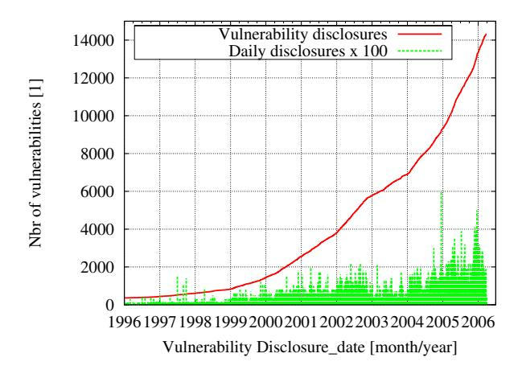
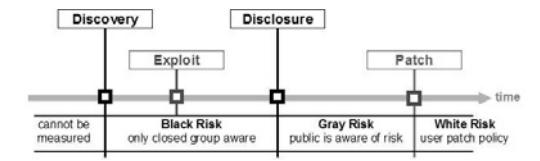
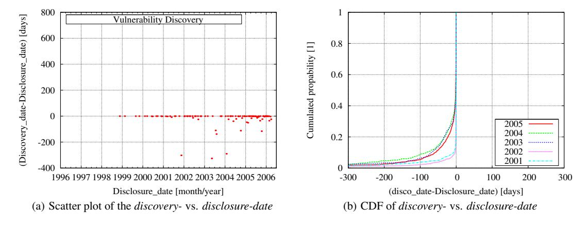
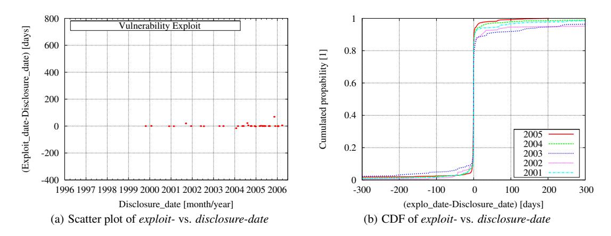
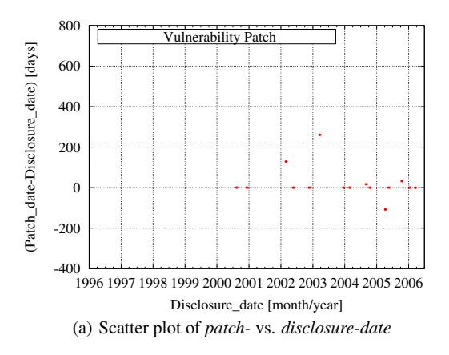
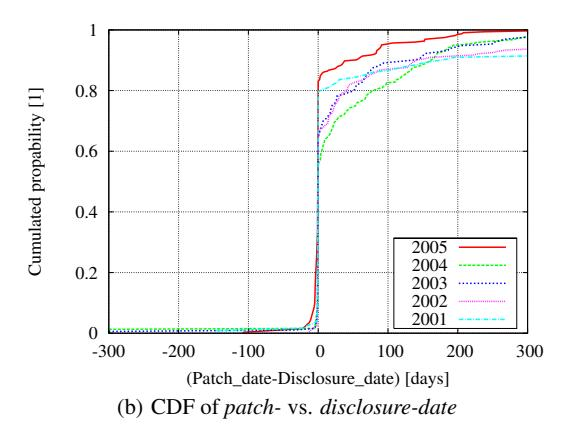
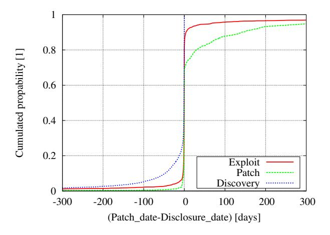
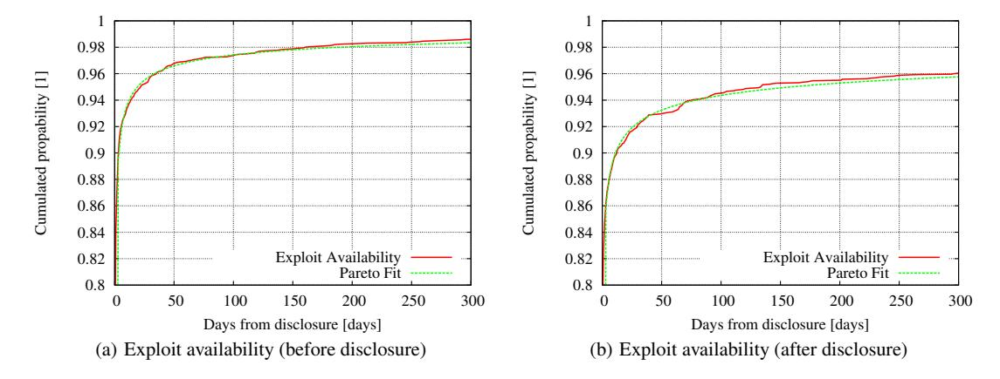
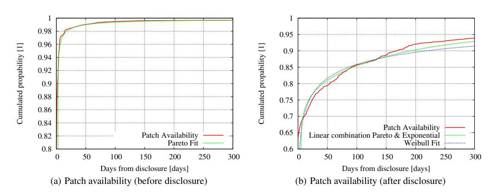

## **Large-Scale Vulnerability Analysis**

Stefan Frei, Martin May, Ulrich Fiedler, Bernhard Plattner Computer Engineering and Networks Laboratory ETH Zurich, Switzerland {stefan.frei, may, fiedler, plattner}@tik.ee.ethz.ch

## **ABSTRACT**

The security level of networks and systems is determined by the software vulnerabilities of its elements. Defending against large scale attacks requires a quantitative understanding of the vulnerability lifecycle. Specifically, one has to understand how exploitation and remediation of vulnerabilities, as well as the distribution of information thereof is handled by industry.

In this paper, we examine how vulnerabilities are handled in large-scale, analyzing more than 80,000 security advisories published since 1995. Based on this information, we quantify the performance of the security industry as a whole. We discover trends and discuss their implications. We quantify the gap between exploit and patch availability and provide an analytical representation of our data which lays the foundation for further analysis and risk management.

## **Keywords**

vulnerability lifecycle, disclosure date, exploit, patch, business risk management, security exposure, intrusion detection, security dynamics

## **1. INTRODUCTION**

It is an accepted fact that most software written gives rise to design and implementation weaknesses. Such flaws may lead to vulnerabilities that potentially open operating systems and applications to attack or misuse. Vulnerabilities are of significant interest when the program containing the flaw operates in a networked environment or has access to the Internet. When vulnerabilities are discovered, disclosed, and exploited, they give rise to individual and large-scale attacks.

The security industry and software vendors try to match the rate of newly discovered vulnerabilities by providing countermeasures such as signatures for viruses, intrusion prevention systems and software patches. To understand the security risks inherent with the use and operation of today's large and complex information and communication systems, analysis of the vulnerabilities' technical details alone is not sufficient. To assess the risk exposure of

Permission to make digital or hard copies of all or part of this work for personal or classroom use is granted without fee provided that copies are not made or distributed for profit or commercial advantage and that copies bear this notice and the full citation on the first page. To copy otherwise, to republish, to post on servers or to redistribute to lists, requires prior specific permission and/or a fee.

*SIGCOMM'06 Workshops* September 11-15, 2006, Pisa, Italy. Copyright 2006 ACM 1-59593-417-0/06/0009 ...\$5.00.

the network, one has to know and understand the lifecycle of vulnerabilities and the evolution thereof.

The measurement of the cumulated number of disclosed vulnerabilities over time (see Figure 1, [30]) is an interesting indicator of the increasing risk for large scale attacks, but is not sufficient for an analysis thereof. The underlying numbers of such figures contain no information on the time a system is potentially on exposure when the vulnerability is known to the public, or when remediation is available.

**Figure 1: Cumulated number and daily rates of disclosed vulnerabilities between 1996 and 2006**

In this paper, we address this problem by examining how vulnerabilities are handled in a large scale. Therefore, we are collecting data of known vulnerabilities and analyze them with regard to information about discovery date, disclosure date, as well as the exploit and patch availability date. Specifically we are looking for answers to the following questions:

- 1. What is, in a large scale, the relation between the time of discovery and disclosure of vulnerabilities? How relates the time of availability of security patches with the availability of exploits?
- 2. How responsive is the security industry as a whole with regard to security threats? And how evolves this responsiveness over time.
- 3. How can we provide the data necessary to perform risk management studies?

For this analysis, we collect information of discovery, exploit availability, and patch availability dates from publicly available sources, such as vulnerability databases and security advisories. We put these dates in relation to the vulnerability disclosure date, for which we propose a strict definition.

The key aspect for such analysis is the quality of the underlying data. To get a comprehensive set of data, we used the vulnerability information from two publicly available vulnerability databases: the National Vulnerability Database (NVD)[1] and the Open Source Vulnerability Database (OSVDB)[2]. Unfortunately, this data is not sufficiently accurate for our analysis: one does not provide exploit date information, both do not provide patch date information, and the disclosure date is not coherent in the two data sources. To overcome this limitation, we systematically collect and examine more than 80,000 advisories from publicly available sources such as: Security Information Providers (SIP's) namely *CERT [3], SecurityFocus [4], ISS x-Force [5], Secunia [6]*, and *FrSirt [7]*, vendors, and mailing list archives.

Then, we normalize the discovery-, exploit-, and patch-availability date with respect to the disclosure date and analyze the distribution of these points in time.

We are then able to quantify the time differences between the dates of the vulnerability lifecycle and determine trends. We find that the number of zero-day exploits is increasing dramatically. Zero-day exploits are exploits available at the date of the disclosure. Comparing the dates for patch availability with the disclosure date, we also measure the performance or speed of the software industry to provide patches for known vulnerabilities. Finally, we observe that the availability of exploits is faster than the availability of patches.

Throughout the data analysis, we also examine the distributions of the exploit and patch availability. Moreover, we give distribution functions, such as Pareto and Weibull, that fit the data. We provide a simple mean for others to use our data for their own analysis. For example, the functions can be used to evaluate and optimize patching policies under various assumptions for cost of damage.

To summarize, the contributions of this paper are the followings:

- We have conducted a comprehensive study of more than 14,000 vulnerabilities with respect to their discovery-, disclosure-, exploit- and patch-date. Therewith, we quantify the increasing number of the so-called zero-day exploits.
- We quantify the gap between exploit and patch availability after disclosure.
- We fit the data to commonly used statistical distribution functions and thus lay the foundation for further analysis and risk management.

The rest of the paper is organized as follows. The next section reviews the related work published in this area. Section 3 introduces the terminology used throughout this paper. The data used for this analysis and the results are described in section 4, while section 5 presents the model that fits the vulnerability distributions. Section 6 summarizes our contributions and presents our conclusion, and it outlines further issues of study.

## **2. RELATED WORK**

Information security is a very wide field and not only discussed in technical communities. Many authors examine the economic impact of Internet attacks and their risk for the industry [8]. The key for such analysis is most often the window of exposure, the time between the discovery of a vulnerability and the availability of a patch. In [9], the authors studied rates of exploitation versus time of disclosure of security vulnerabilities. They conjectured that the release ofavendor patch would peak the rate of exploitation.

However, until today only few empirical data is available on this subject. To the best of our knowledge, this is the first analysis of the discovery-, disclosure-, exploit- and patch-time of vulnerabilities on more than 14'000 vulnerabilities. Often vulnerability assessment reports simply plotted the cumulated number of disclosed vulnerabilities over time (as for example in Figure 1) or base their analysis on much smaller data sets.

The discovery date of a vulnerability is key to studies of this kind. However, the disclosure date (or release date in [10]) is defined differently among papers of different authors. Without further explanation, definitions range from 'made public to wider audience' [11], 'made public through forums or by vendor' [12], 'reported by CERT or Securitfocus' [13] or 'made public by anyone before vendor releases a patch' in [14].

Several studies examine observed attacks or incidents with the patch behavior of software users. In [11], Arbaugh proposes a lifecycle model for system vulnerabilities and measures the number of intrusions during this life-cycle. He evaluates the life-cycle with incident data of three vulnerabilities.

Thislife-cycle is similar to the recommended phases in the guidelines in the vulnerability reporting and response process of the *Organization for Internet Safety* [10]. We extend the life-cycle of a vulnerability and include the date of first availability of an exploit.

In [15], the author compares the number of exploits available to the half-life period of critical vulnerabilities. This study is based on statistical data of numerous vulnerability scans. It measures the effective frequency of the application of patches by users.

In a series of articles on washingtonpost.com [16], the author published data showing how long it took different vendors to issue updates for security flaws. In an empirical study [12], the authors analyzed 308 vulnerabilities and compared the information with attacks on honeypots recorded duringaperiod of9weeks to measure vendor response to vulnerability disclosure.

The influence of disclosing vulnerability information on the vendors performance in releasing a patch, is subject of many studies [17], [18]. In contrast to their study, we do not discuss different vulnerability disclosure policies or compare vendors patching behavior. We provide a concise definition for the disclosure to allow for consistent analysis of empirical data collected.

## **3. THE VULNERABILITY LIFE-CYCLE**

In this section, we introduce the basic concept and terminology used throughout this paper. Therefore, we first describe the vulnerability lifecycle illustrated in Figure 2. Specifically, we revisit the definitions of discovery, exploit, and patch time, and propose a definition for the disclosure time. We also explain the different phases of the vulnerability lifecycle and their players .

## **3.1 Definitions for the time of discovery, disclosure, exploit, and patch**

Distinctive points in time divide the lifecycle of a vulnerability in phases each reflecting a state and an associate risk. To capture these states, we devise the following four points in time: the vulnerability *discovery-*, *disclosure-*, *exploit-*, and *patch-*time. These points in time are depicted on top of the timeline in Figure 2. Below the timeline in the same figure, we depict the important phases of the lifecycle. While the explanation of the discovery, exploit, and patch-time is merely intuitive, we propose a new definition for the disclosure date of a vulnerability.

Note that the sequence of the exploit, disclosure, and patch time is not fixed. Both, the *exploit-* and the *patch*-time can be before, at, or after the *discovery time*.

The *time of discovery* is the earliest reported date ofasoftware vulnerability being discovered and recognized to pose a security risk. Usually the discovery date is not publicly known until af-

**Figure 2: Lifecycle of a vulnerability**

ter the disclosure thereof. Indeed, for many vulnerabilities the reported discovery date will never be known to the public. Note that vulnerabilities exist before they are discovered, however before the discovery, they pose no intentional security risk.

The *time of exploit* is the earliest date an exploit for a vulnerability is available. We qualify any hacker-tool, virus, data, or sequence of commands that take advantage of a vulnerability as an exploit.

The *time of patch availability* is the earliest data the *vendor or the originator of the software* releases a fix, workaround, or a patch that provides protection against the exploitation of the vulnerability. Fixes and patches offered by third parties are not considered as a patch as enterprizes do not allow third party fixes to be installed on their systems. A patch can be as simple as the instruction from the vendor for certain configuration changes. Note that the availability of other security mechanisms such as signatures for intrusion prevention systems or anti-virus tools are not considered as time of patch.

As described in section 2, the *time of disclosure* of a vulnerability is defined differently among authors. It is most commonly referred to as a kind of *public disclosure* of *security* information by a *certain party*. Usually, vulnerability information is discussed on a mailing list [19] or published on a security web site ([3],[6],[7],[5], and [4]) and results in a security advisory afterwards.

To ensure the quality and availability of relevant security information, we propose a more strict definition of the disclosure time.

The *time of disclosure* is the first date a vulnerability is described on a channel where the *disclosed information on the vulnerability*

- 1. is freely available to the public
- 2. is published by trusted and independent channel
- 3. has undergone analysis by experts such that risk rating information is included.

*Requirement 1*: From the security perspective, only a free and public disclosure can ensure that all interested or concerned parties get the relevant information. *Security through obscurity* is a concept that has never worked: "The argument that secrecy is good for security is naive, and always worth rebutting. Secrecy is beneficial to security only in limited circumstances, and certainly not with respect to vulnerability or reliability information." [20].

*Requirement 2*: Only an channel independent ofavendor or government is unbiased and enables a fair dissemination of security critical information. A channel is considered trusted only when it is an accepted source of security information in the industry (e.g. by havingadelivered security information reliably over a long period of time).

*Requirement 3*: Analysis and risk rating ensures the quality of the information disclosed. The mere discussion on a potential flaw in a mailing list or vague information from a vendor do therefore not qualify. The analysis must include enough details to allow a concerned user of the software to assess his individual risk or take immediate action to protect his assets. In this work, to provide the data for the disclosure time of vulnerabilities, we analyzed security advisories of the following five candidate sources: *CERT, FrSirt, ISS x-force, Secunia and SecurityFocus*.

## **3.2 Risk exposure period**

The different points in time allow for the distinction of multiple phases (and the involved parties) in a vulnerability lifecycle (see Figure 2). During the entire time between discovery and patch date, a system (and ultimately the network) is at risk. This exposure time, can be separated in three phases: the *Black Risk*, the *Gray Risk* and the *White Risk* phase.

*Black Risk*: during the time from *discovery to disclosure*, only a closed group is aware of the vulnerability. This group could be anyone from hackers to organized crime tempted to misuse this knowledge. On the other hand, it could be researchers and vendors working together to provide a fix for the identified vulnerability. We call the risk exposure arising from this period the *Black Risk* because the vulnerability is known to have a security impact whereas the public has no access to this knowledge. In section 4, we provide empirical data for the black risk exposure.

*Gray Risk*: from *disclosure to patch* the software user waits for the vendor to issue a patch. We call the risk exposure arising from this period the *Gray Risk* because the public is aware of this risk but has not yet received remediation from the software vendor/originator. However, through the information in the disclosure of the vulnerability the user can assess his individual risk and might implement other security mechanisms until a patch is available. The gray risk exposure is further examined and determined in section 4 of this paper.

*White Risk*: Given by the delay an available patch is installed by the user.

SIPs are the entities that monitor the security (and insecurity) scene. Nowadays, an exploit being published or spreading will be analyzed quickly and result in a disclosure of the vulnerability. The disclosure contains important technical and risk information to help the public to assess their individual risk and plan countermeasures. This argument also works the other side, vulnerabilities disclosed are analyzed by blackhats and exploits will follow quickly.

## **3.3 Risk Metric**

The availability of an exploit posesasecurity threat to the system whereas the availability of a patch neutralizes this treat. Assuming that both, the exploit and the patch, work as intended by the respective originator, the resulting security risk will depend strongly on the timing or dynamics of the availability of those.

Basically, what we look at is the speed of security (availability of patches) compared to the speed of insecurity (availability of exploits) after vulnerability disclosure. This metric allows to measure trends and the state of the industry with respect to security risks at large.

In section 4 in Figure 6, we examine this *risk metric* on our data set.

## **4. METHODOLOGY**

In this section, we first describe the data sources we used for our research and then, we analyze the data set with regard to discovery-, disclosure-, exploit-, and patch-date.

## **4.1 Data Sources**

To build the database for our vulnerability analysis, we have to determine the points in time of the vulnerability lifecycle as defined in section 3. That is, for each vulnerability identified we have to determine the corresponding discovery, disclosure, exploit and patch date. As there is no single source to provide this information, the difficulty of this task is to

- 1. identify suitable sources
- 2. collect the information available

3. correlate the information in a concise manner.

#### 4.1.1 Vulnerability Databases

We started by analyzing the content of two publicly available vulnerability databases, namely the OSVDB [2] and the NVD [1]. For this research, we only consider vulnerabilities with a CVE [21] entry. CVE stands for *Common Vulnerabilities and Exposures* which is a list of standardized names for vulnerabilities and information security exposures. A CVE-ID *e.g. CVE-2006-0002* provides a standardized identifier for known vulnerability.

Evaluating the suitability of the content of the OSVDB and NVD for our purpose, we found considerable differences in the lifecycle information they contain. Neither database contains patch dates; and only OSVDB provides exploit dates. However, both databases provide a comprehensive list of external references for each vulnerability. In addition to this, since February 2006 the NVD provides a CVSS [22] vector for all vulnerabilities. CVSS stands for *Common Vulnerability Scoring System*, a new rating system designed to provide open and standard severity ratings for software vulnerabilities.

#### 4.1.2 Database and correlation

We selected the NVD as the core for our vulnerability information for the following reasons: it is freely available, contains CVE and CVSS entries and references to external information sources. We import the exploit dates and additional external references from the OSVDB. Based on the superset of external references from the NVD and the OSVDB, we downloaded and analyzed over 80,000 advisories of security information from different sources. This data is correlated with the information in our database through the CVE entry or through the links given in the respective advisories.

#### 4.1.3 Source for disclosure date

To select a source for the disclosure date, we analyzed the disclosure dates published by the following security information providers: CERT [3], FrSirt [7], ISS X-Force [5], Secunia [6] and SecurityFocus [4]. These are the most referenced security information providers in the NVD and CVE databases.

For the analysis presented in this paper, we selected the discovery date from either SecurityFocus [4] or ISS X-Force [5], whichever reports an earlier disclosure date. The reasons for this selection are the history, frequency, and number of references. Both SecurityFocus and ISS X-Force provide security advisories since 1996 and are the most referenced sources in NVD. Secunia started in 2002 and FrSirt in 2003, and hence, they lack history. However, looking at the quantity and quality of recently published advisories, they both are at the same level as SecurityFocus and ISS and are therefore probable candidates for future research. CERT provides security advisories since 1988, however as CERT publishes security advisories at a lower rate compared to the other sources, they cover less vulnerabilities and are less often referenced.

Note that SecurityFocus (part of Symantec) and ISS are private companies. But, by choosing two sources for the disclosure date, we eliminate a possible bias towards their own products.

#### 4.1.4 Data for our analysis

Our final database contains 14,326 vulnerabilities with non empty CVE entry and non empty disclosure date. All data presented in this paper is based on this set of vulnerabilities. Of these vulnerabilities 11,697 contain a discovery date, 3,420 an exploit date and 1,551 a patch date. For 332 vulnerabilities we have both the exploit- and a patch date.

The previous section focused on the methodology for the data gathering and correlation. In this section, we discuss trends and conclusions that can be drawn from this data.

# 4.2 Analysis of the discovery, exploit, patch time vs. disclosure time

We examine the vulnerability lifecycle by looking at how the discovery, exploit, and patch dates relate to their disclosure date. Therefore, we present scatter plots and the distributions of the individual vulnerability dates.

#### Scatter plots

The scatter plots in Figures 3(a), 4(a) and 5(a) [30] are to be interpreted as follows:

- 1. on the x-axis we plot the disclosure date of the vulnerability
- on the y-axis we plot the difference of either the *Discovery*, Exploit or Patch-date to the disclosure date in days.

This time difference in days from the disclosure date to certain events in the vulnerability lifecycle is key to the analysis in this paper.

In the scatter-plots of Figures 3(a), 4(a) and 5(a) [30] we use the same scale to allow a direct comparison. Over a period from 1996 to 2006 these plots show at what time relative to the disclosure date the vulnerability was discovered or an exploit- or patch was made available.

#### **Cumulated distribution function plots**

In Figures 3(b), 4(b), and 5(b) [30], we plot the cumulated distribution function of the same data presented in Figures 3(a), 4(a) and 5(a) for the years 2001 to 2005. Normalization through distribution functions allows us to compare the periods with different numbers of vulnerabilities. In these plots

- on the x-axis we plot the difference of the event-date to the disclosure date in days. Negative values show events *before* disclosure, positive values show events *after* disclosure of the vulnerability.
- 2. on y-axis we plot the cumulated distribution for the given

Through the CDF we are able to make more detailed analysis of the underlying data.

#### 4.2.1 Discovery date vs. Disclosure date

Before embarking on a study of exploit dates and patch dates with regard to the corresponding disclosure date of a vulnerability, we first examine how the discovery dates differ from the disclosure dates for all vulnerabilities identified.

Figure 3(a) [30] plots the time between *discovery to disclosure* of vulnerabilities from 1996-2006. This time is given by  $time_{discovery}$   $time_{disclosure}$  in days. Security researchers such as NGS Security [23], eEye [24] or iDefense [25] usually publish the discovery time of a vulnerability upon disclosure of their advisories. Another source are the CVE [21] documents. They usually indicate the first time the vulnerability was reported to the CVE consortium. Upon disclosure, this date can be correlated to a specific vulnerability.

By definition, the discovery date (if available) is the earliest date in the vulnerability lifecycle. Therefore Figure 3(a) [30] shows no events for y > 0, after the disclosure of the vulnerability. It is readily seen that the number of discovered vulnerability increases from 1996 to 2006, as also visible in the vulnerability count in Figure 1.

The CDF plot of discovery vs disclosure shows how long before the disclosure vulnerabilities are discovered. We find that since 2003 more than 20% of the vulnerabilities are known to insiders 20 or more days before public discovery. This is a measure for the black-risk as defined in section 3.

We next examine, when exploits for vulnerabilities become available compared to the date when they were disclosed.

**Figure 3: Discovery-date vs. Disclosure-date**

**Figure 4: Exploit-date vs. Disclosure-date**

### *4.2.2 Exploit availability date*

Figure 4(a) [30] plots the time between the time of *exploit availability to disclosure* of vulnerabilities from 1996-2006. This time is given by timeexploit − timedisclosure in days. Exploit information and code is available in the Internet form many sites such as milw0rm [26], Packetstorm [27], the Metaspoit Framework [28], FrSirt (a pay service as of March 2006) [7] or from security mailing lists such as FullDisclosure [19].

We draw two important conclusions from this figure:

- 1. the number of zero-day exploits is increasing dramatically;
- 2. exploits are available before and after the disclosure of a vulnerability.

The CDF plot of discovery vs. disclosure shows the zero-day exploit phenomena. While two days before disclosure the number of exploits available is below 20%, at the disclosure day this number rises to over 70% for all years since 2001. For recent years, 95% of the exploits are available within a month of disclosure. The trend is still increasing, the curve for 2005 tops the others for x > −3. However, at times long before disclosure the years 2004 and 2005 are significantly lower than the other years.

The efficiency of the monitoring of the (in)security scene through SIPs has improved. An exploit available will no more go undetected for long periods, instead it is picked up by SIPs and analyzed. The exploit will quickly result in an disclosure of the vulnerability affected, thus the steeper rise of recent CDFs in Figure 4(b) [30] short before the disclosure day. On the other hand, also the Blackhats have refined their ability to analyze vulnerability information and reverse-engineer patches. Blackhats create exploits quickly. The combined effect is readily seen by the increased activity at the disclosure day.

While Figure 4(a) [30] illustrates the performance of the Blackhats, the next figure depicts the performance of the software vendors.

## *4.2.3 Patch availability date*

Figure 5(a) [30] plots the time between *patch availability to disclosure* of vulnerabilities from 1996-2006. This time is given by the difference timepatch − timedisclosure in days. Patch information was extracted from security bulletins of vendors and software writers. Often, this information has to be manually correlated to the corresponding vulnerabilities.

The CDF plot of patch vs disclosure shows the performance of the software industry in providing patches. This is a measure of the *gray risk* as defined in Figure 2. Most patches are released at the disclosure day or vice versa, the publication of a patch results in an immediate analysis by SIPs and subsequent disclosure according to our definition of disclosure in section 3. However, from 2001 to 2006 only between 55% to 85% of the patches are available upon

**Figure 5: Patch-date vs. Disclosure-date**

disclosure of the vulnerability and this number does not change significantly the next 30 days. Comparing the exploit vs the patch performance, one observes that the speed of insecurity exceeds the speed of security. It is harder to produce a patch than to produce an exploit.

In the next section, we discuss how the previously mentioned dates evolved over the last 5 years.

## **4.3 Discussion**

So far, we have investigated the individual distributions of the patch- and exploit-dates. An interesting aspect of our analysis is the direct comparison of the two distributions. As discussed in section 3, this difference lend itself to be used as a metric for the risk exposure.

**Figure 6: Gap between** *exploit-* **and** *patch-availability* **after vulnerability disclosure**

Figure 6 [30] depicts the CDF of the discovery-, exploit-, and patch-date for direct comparison. We see that the exploit CDF is contiguously above the patch CDF over the full range of 300 days after disclosure. This gap, which quantifies the difference between exploit- and patch-availability, is an indicator of the risk exposure and its development over time. This metric enables us to empirically measure and assess the state of the security industry.

## **5. DATA FITS FOR FURTHER ANALYSIS AND RISK MANAGEMENT**

Next, we give functions that match the distribution of exploit and patch availability. We provide a simple mean for others to use our data for their own analysis. Presumably, these functions are of great value in risk management. For example, the functions might be used to evaluate and optimize patching policies or the investment in intrusion prevention under various assumptions for cost of damage.

To facilitate matching, we split our dataset at the disclosure date. This decision is justified by the fact that the disclosure of the vulnerability significantly changes the dynamics of releasing exploits and patches. We then tried to fit various commonly-used statistical distributions, such as Exponential, Pareto [29], and Weibull [29] to the data. *Exploit availability* before and after disclosure is found to be best matched with a Pareto distribution. *Patch availability* before disclosure is best matched with Pareto. However, for the *Patch availability* after disclosure, Weibull is a reasonable match. Figure 7 [30] depicts least square fits to the availability of the exploits and a Pareto fit of the form

$$F(x) = 1 - \left(\frac{k}{x}\right)^{\alpha} \tag{1}$$

The parameter α, sometimes called shape parameter, is 0.40 before disclosure and 0.26 after disclosure. The decrease of the shape parameter quantifies the slowdown of exploit availability right after disclosure. The parameter k (smallest value of the distribution) is in both cases small enough to make the fit usable for risk modeling.

Figure 8 [30] depicts least square fits to the overall availability of patches. Interestingly, patch availability matches a Pareto distribution before disclosure with α = 0.663 and k = 0.0487. After disclosure a Weibull distribution of the form

$$F(x) = 1 - exp(-\frac{x}{\lambda})^k \tag{2}$$

with λ = 0.209 and k = 4.040 is a reasonable match. However, a good fit is obtained with a linear combination of a Pareto and re-scaled Exponential distribution with 34% Pareto and 66% Exponential of the form

$$F(x) = 1 - c * exp(-ax)$$
(3)

In addition to fitting the overall exploit and patch availability, we have also fitted exploit and patch availability for the years 2003

Figure 7: The exploit availability matches a Pareto distribution.  $\alpha$  decreases from 0.43 to 0.27 after disclosure reflecting a slowdown of the availability rate around disclosure

Figure 8: Patch availability before disclosure matches a Pareto distribution.  $\alpha=0.62$  reflects a higher rate in patch availability than in exploit availability short before disclosure. After disclosure a Weibull distribution matches the patch availability. A good match is also obtained by a linear combination of a Pareto and an Exponential distribution

- 2005 (not depicted for space reasons). Parameters for the best fits are listed in Table 1, Table 2 (exploit availability) and Table 3, Table 4 (patch availability).

| 1 | Year | Distribution | Parameters                   |
|---|------|--------------|------------------------------|
| 1 | all  | Pareto       | $\alpha = 0.400, k = 0.0108$ |
|   | 2001 | Pareto       | $\alpha = 0.371, k = 0.0028$ |
|   | 2002 | Pareto       | $\alpha = 0.492, k = 0.0562$ |
|   | 2003 | Pareto       | $\alpha = 0.247, k = 0.0015$ |
|   | 2004 | Pareto       | $\alpha = 0.391, k = 0.0113$ |
|   | 2005 | Pareto       | $\alpha = 0.486, k = 0.0244$ |

Table 1: Best fits to the exploit availability (before disclosure)

The values of  $\alpha$  in Table 1 which reflect the rate of exploit availability right before disclosure show no clear trend. However, the values of  $\alpha$  in Table 2 are clearly increasing since 2001. These values quantify the increase in exploit availability right after disclosure since 2001.

Table 3 contains a sole entry for the best match to the overall distribution of patches before disclosure. This Pareto distribution

| Year | Distribution | Parameters                    |
|------|--------------|-------------------------------|
| all  | Pareto       | $\alpha = 0.260, k = 0.00161$ |
| 2001 | Pareto       | $\alpha = 0.192, k = 0.00002$ |
| 2002 | Pareto       | $\alpha = 0.199, k = 0.00032$ |
| 2003 | Pareto       | $\alpha = 0.246, k = 0.00459$ |
| 2004 | Pareto       | $\alpha = 0.395, k = 0.01401$ |
| 2005 | Pareto       | $\alpha = 0.552, k = 0.05029$ |

Table 2: Best fits to the exploit availability (after disclosure)

| Year | Distribution | Parameters                    |
|------|--------------|-------------------------------|
| all  | Pareto       | $\alpha = 0.663, k = 0.04867$ |

Table 3: Best fit to the patch availability (before disclosure)

represents 28 data points. Individual years were not matched since data samples are extremely small.

| Year | Distribution | Parameters                   |
|------|--------------|------------------------------|
| all  | Weibull      | $\lambda = 0.209, k = 4.040$ |
| 2001 | Weibull      | $\lambda = 0.109, k = 0.199$ |
| 2002 | Weibull      | $\lambda = 0.212, k = 5.559$ |
| 2003 | Weibull      | $\lambda = 0.222, k = 4.299$ |
| 2004 | Weibull      | $\lambda = 0.288, k = 14.04$ |
| 2005 | Weibull      | $\lambda = 0.159, k = 0.428$ |

Table 4: Best fits to the patch availability (after disclosure)

Table 4 lists the best matches to the availability of patched after disclosure. These Weibull distribution are reasonable matches. The scale parameter  $\lambda$  fluctuates around 0.2. However, the shape parameter k and the associated failure rate show no clear trend.

Finally, we'd like to stress that all functions fitted cover a limited range of 300 days around vulnerability disclosure date, and may thus not give any insight into the dynamics underlying the exploitand patch-propagation and survivability.

#### 6. CONCLUSION

We have conducted a comprehensive analysis of more than 14,000 vulnerabilities (published between 1996 and 2006) to study the lifecycle of security vulnerabilities. We propose a definition for the disclosure date of vulnerabilities and with the help of over 80,000 security advisories, we determined the discovery-, disclosure-, exploit-, and patch-date of the vulnerabilities. To our knowledge, this is the first systematic empirical examination of security vulnerabilities on this scale. Analyzing the data, we confirm and quantify the trend towards zero-day exploits.

We have also provided the tools to measure the dynamics of (in)security and quantify the gap between exploit- and patch-availability.

This measure is of major interest when determining the level of exposure of a system and the attached network.

We statistically analyzed the data and provide parameters for commonly used distribution functions (such as Pareto and Weibull) for further analysis. Our results build an empirical foundation to model the risk exposure and to support business decisions for security investments.

Finally, we plan to continuously update the data and put it online to be freely queried by the public [30]. We continue to further analyze the data and will provide more explanations and conclusions in upcoming publications.

#### 7. REFERENCES

- [1] NVD, "National vulnerability database," http://nvd.nist.gov/.
- [2] OSVDB, "The open source vulnerability database," http://www.osvdb.org/.
- [3] CERT, "Computer emergency response team coordination center," http://www.cert.org/.
- [4] SF, "Securityfocus," http://www.securityfocus.com/.
- [5] ISS, "Internet security systems," http://www.iss.net/.
- [6] Secunia, "Vulnerability and virus information," http://secunia.com/.
- [7] FrSirt, "French security incident response team," http://www.frsirt.com/.
- [8] R. Anderson, "Why information security is hard-an economic perspective," In Proceedings of 17th Annual Computer Security Applications Conference (ACSAC), 2001.

- [9] B. Schneier, "Cryptogram september 2000 full disclosure and the window of exposure," http://www.schneier.com/crypto-gram-0009.html, 2000.
- [10] Organization for Internet Safety, "Guidelines for security vulnerability reporting and response - 2004," http://www.oisafety.org/guidelines/, 2004.
- [11] W. A. Arbaugh, W. L. Fithen, and J. McHugh, "Windows of vulnerability: A case study analysis," *IEEE Computer*, vol. 33, 2000.
- [12] Ashish Arora, Ramayya Krishnan, Anand Nandkumar, Rahul Telang, and Yubao Yang, "Impact of vulnerability disclosure and patch availability - empirical analysis," in *Proceedings of* the Third Annual Workshop on Economics and Information Security (WEIS04), 2004.
- [13] Ashish Arora, Ramayya Krishnan, Rahul Telang, and Yubao Yang, "An empirical analysis of vendor response to disclosure policy," Tech. Rep., Carnegie Mellon University, March 2005.
- [14] Ashish Arora, Ramayya Krishnan, Rahul Telang, and Yubao Yang, "Empirical analysis of software vendors patching behavior, impact of vulnerability disclosure," Tech. Rep., Carnegie Mellon University, Jan 2006.
- [15] Qualys Research Report 2005, "Laws of vulnerabilities," http://www.qualys.com/docs/Laws-Report.pdf, 2005.
- [16] B. Krebs, "Securityfix i, ii, iii," http://blog.washingtonpost.com/securityfix/, 2006.
- [17] Hasan Cavusoglu, Huseyin Cavusoglu, and S. Raghunathan, "Emerging issues in responsible vulnerability disclosure," in *In the proceedings of WITS 2004*, 2004.
- [18] Karthik Kannan and Rahul Telang, "An economic analysis of market for software vulnerabilities," http://www.dtc.umn.edu/weis2004/kannan-telang.pdf, 2004.
- [19] Full Disclosure, "Full disclosure mailing list," http://lists.grok.org.uk/full-disclosure-charter.html.
- [20] Bruce Schneier, "The nonsecurity of secrecy," in Communications of the ACM v. 47, 2004, p. 120, ? 2004.
- [21] CVE, "Common vulnerabilities and exposures list (cve)," http://cve.mitre.org/cve/.
- [22] CVSS, "Common vulnerability scoring system (cvss)," http://www.first.org/cvss/.
- [23] NGS, "Ngs software," http://www.ngssoftware.com/advisory.htm.
- [24] eEye, "eeye digital security," http://www.eeye.com/html/research/advisories/index.html.
- [25] iDefense, "idefense," http://www.idefense.com/intelligence/vulnerabilities/.
- [26] milw0rm, "Milw0rm exploit archive," http://www.milw0rm.com.
- [27] PacketStorm, "Packetstorm security," http://www.packetstormsecurity.org/assess/exploits/.
- [28] Metasploit, "Metasploit project," http://www.metasploit.com.
- [29] B. Krishnamurthy and J. Rexford, Continuous Univariante Distributions, vol. 1, Wiley Series in Probability and Mathematical Statistics, 2 edition, 1994.
- [30] Stefan Frei, "The speed of (in)security web site," http://www.techzoom.net/risk/.