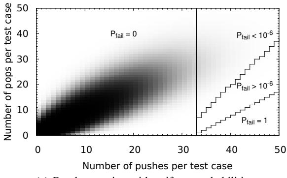
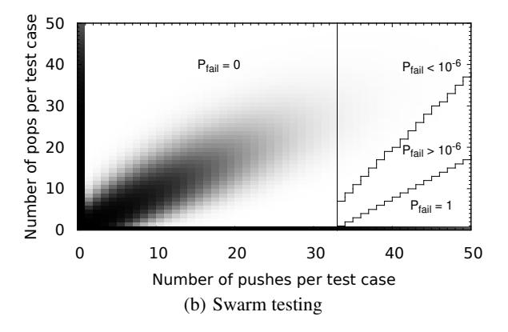
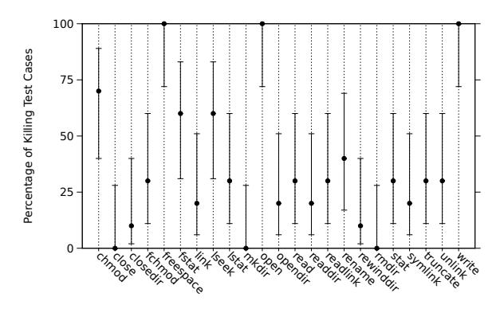
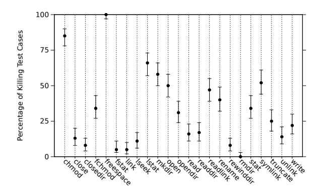
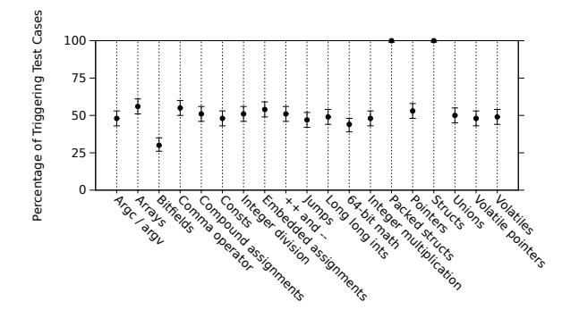

# **Swarm Testing**

Alex Groce Chaoqiang Zhang

School of Electrical Engineering and Computer Science Oregon State University, Corvallis, OR USA agroce@gmail.com, zhangch@onid.orst.edu Eric Eide Yang Chen John Regehr
University of Utah, School of Computing
Salt Lake City, UT USA
{eeide, chenyang, regehr}@cs.utah.edu

#### **ABSTRACT**

Swarm testing is a novel and inexpensive way to improve the diversity of test cases generated during random testing. Increased diversity leads to improved coverage and fault detection. In swarm testing, the usual practice of potentially including all features in every test case is abandoned. Rather, a large "swarm" of randomly generated configurations, each of which omits some features, is used, with configurations receiving equal resources. We have identified two mechanisms by which feature omission leads to better exploration of a system's state space. First, some features actively prevent the system from executing interesting behaviors; e.g., "pop' calls may prevent a stack data structure from executing a bug in its overflow detection logic. Second, even when there is no active suppression of behaviors, test features compete for space in each test, limiting the depth to which logic driven by features can be explored. Experimental results show that swarm testing increases coverage and can improve fault detection dramatically; for example, in a week of testing it found 42% more distinct ways to crash a collection of C compilers than did the heavily hand-tuned default configuration of a random tester.

**Categories and Subject Descriptors** D.2.5 [Software Engineering]: Testing and Debugging—*testing tools*; D.3.4 [**Programming Languages**]: Processors—*compilers* 

**General Terms** Algorithms, Experimentation, Languages, Reliability

**Keywords** Random testing, configuration diversity

### 1. INTRODUCTION

This paper focuses on answering a single question: In random testing, can a diverse set of *testing configurations* perform better than a single, possibly "optimal" configuration? An example of a test configuration would be, for example, a list of API calls that can be included in test cases. Conventional wisdom in random testing [19] has assumed a policy of finding a "good" configuration and running as many tests as possible with that configuration. Considerable research effort has been devoted to the question of how to tune a "good configuration," e.g., how to use genetic algorithms to optimize

Permission to make digital or hard copies of all or part of this work for personal or classroom use is granted without fee provided that copies are not made or distributed for profit or commercial advantage and that copies bear this notice and the full citation on the first page. To copy otherwise, to republish, to post on servers or to redistribute to lists, requires prior specific permission and/or a fee.

permission and/or a fee. ISSTA'12, July 15–20, 2012, Minneapolis, MN, USA Copyright 2012 ACM 978-1-4503-1454-1/12/07 ...\$15.00 the *frequency* of various method calls [6], or how to choose a length for tests [5]. As a rule, the notion that some test configurations are "good" and that finding a good (if not truly optimal, given the size of the search space) configuration is important has not been challenged. Furthermore, in the interests of maximizing coverage and fault detection, it has been assumed that a good random test configuration includes as many API calls or other input domain features as possible, and this has been the guiding principle in large-scale efforts to test C compilers [36], file systems [17], and utility libraries [29]. The rare exceptions to this rule have been cases where a feature makes tests too difficult to evaluate or slow to execute, or when static analysis or hand inspection can demonstrate that an API call is unrelated to state [17]. For example, including pointer assertions may make compiling random C programs too slow with some compilers.

In general, if a call or feature is omitted from some tests, it is usually omitted from all tests. This approach seems to make intuitive sense: omitting features, unless it is necessary, means giving up on detecting some faults. However, this objection to feature omission only holds so long as testing is performed using a single test configuration. Swarm testing, in contrast, uses a diverse "swarm" of test configurations, each of which deliberately omits certain API calls or input features. As a result, given a fixed testing budget, swarm testing tends to test a more diverse set of inputs than would be tested under a so-called "optimal" configuration (perhaps better referred to as a default configuration) in which every feature is available for use by every test.

One can visualize the impact of swarm testing by imagining a "test space" defined by the contents of tests. As a simple example, consider testing an implementation of a stack ADT that provides two operations, push and pop. One can visualize the test space for the stack ADT using these features as axes: each test is characterized by the number of times it invokes each operation. Any method for randomly generating test cases results in a probability distribution over the test space, with the value at each point (x,y) giving the probability that a given test will contain exactly x pushes and y pops (in any order). To make this example more interesting, imagine the stack implementation has a capacity bug, and will crash whenever the stack is required to hold more than 32 items.

Figure 1(a) illustrates the situation for testing the stack with a test generator that chooses pushes and pops with equal probability. The generator randomly chooses an input length and then decides if each operation is a push or a pop. The graph shows the distribution of tests produced by this generator over the test space. The graph also shows contour lines for significant regions of the test space. Where  $P_{fail} = 1$ , a test chosen randomly from that region is certain to trigger the stack's capacity bug; where  $P_{fail} = 0$ , no test can trigger the bug. As Figure 1(a) shows, this generator only rarely



(a) Random testing with uniform probabilities



Figure 1: Swarm testing changes the distribution of test cases for a stack. If push and pop operations are selected with equal probability, about 1 in 370,000 test cases will trigger a bug in a 32-element stack's overflow-detection logic. Swarm testing (note the test cases concentrated near the x-axis and y-axis of Figure 1(b)) triggers this bug in about 1 of every 16 cases.

produces test cases that can trigger the bug.

Now consider a test generator based on swarm testing. This generator first chooses a non-empty subset of the stack API and then generates a test case using that subset. Thus, one-third of the test cases contain both pushes and pops, one-third just pushes, and one-third just pops. Figure 1(b) shows the distribution of test cases output by this generator. As is evident from the graph, this generator often produces test cases that trigger the capacity bug.

Although simple, this example illustrates the dynamics that make swarm testing work. The low dimensionality of the stack example is contrived, of course, and we certainly believe that programmers should make explicit efforts to test boundary conditions. As evidenced by the results presented in this paper, however, swarm testing generalizes to real situations in which there may be dozens of features that can be independently turned on or off. It also generalizes to testing real software in which faults are very well hidden.

Every test generated by any swarm configuration can, in principle, be generated by a test configuration with all features enabled. However—as the stack example illustrates—the probability of covering parts of the state space and detecting certain faults can be demonstrably higher when a diverse set of configurations is tested.

Swarm testing has several important advantages. First, it is low cost: in our experience, existing random test case generators already support or can be easily adapted to support feature omission. Second, swarm testing reduces the amount of human effort that must be devoted to tuning the random tester. In our experience, tuning is a significant ongoing burden. Finally—and most importantly—swarm

testing makes significantly better use of a fixed CPU time budget than does random testing using a single test configuration, in terms of both coverage and fault detection. For example, we performed an experiment where two machines, differing only in that one used swarm testing and one did not, used Csmith [36] to generate tests for a collection of production-quality C compiler versions for x86-64. During one week of testing, the swarm machine found 104 distinct ways to crash compilers in the test suite whereas the other machine—running the default Csmith test configuration, which enables all features—found only 73. An improvement of more than 40% in terms of number of bugs found, using a random tester that has been intensively tuned for several years, is surprising and significant.

Even more surprising were some of the details. We found, for example, a compiler bug that could only be triggered by programs containing pointers, but which was almost never triggered by inputs that contained arrays. This is odd because pointer dereferences and array accesses are very nearly the same thing in C. Moreover, we found another bug in the same compiler that was only triggered by programs containing arrays, but which was almost never triggered by inputs containing pointers. Fundamentally, it appears that omitting features while generating random test cases can lead to improved test effectiveness.

Our contributions are as follows. First, we characterize *swarm testing*, a pragmatic variant of random testing that increases the diversity of generated test cases with little implementation effort. The swarm approach to diversity differs from previous methods in that it focuses solely on *feature omission diversity*: variance in which possible input features are *not* present in test cases. Second, we show that—in three case studies—swarm testing offers improved coverage and bug-finding power. Third, we offer some explanations as to *why* swarm testing works.

### 2. SWARM TESTING

Swarm testing uses test configurations that correspond to sets of features of test cases. A feature is an attribute of generated test inputs that the generator can directly control, in a computationally efficient way. For example, an API-based test generator might define features corresponding to inclusion of API functions (e.g., push and pop); a C program generator might define features corresponding to the use of language constructs (e.g., arrays and pointers); and a media-player tester might define features over the properties of media files, e.g., whether or not the tester will generate files with corrupt headers. In our work, a feature determines a configuration of test generation, not the System Under Test (SUT)—in this work we use the same build of the SUT for all testing. In particular, we are configuring which aspects of the SUT will be tested (and not tested) only by controlling the test cases output. Features can be thought of simply as constraints on test cases, in particular those the test case generator lets us control.

Assume that a *test configuration C* is a set of features,  $f_1 \dots f_n$ . C is used as the input to a random testing function [8, 19] gen(C,s), which given configuration C and seed s generates a test case for the SUT containing *only* features in C. We may ignore the details of how the exact test case is built. The values  $f_1 \dots f_n$  determine which features are allowed to appear in the test case. For example, if we are testing a simple file system, the set of all features might be:  $\{read, write, open, close, unlink, sync, mkdir, rmdir, unmount, mount\}$ . A typical default C would then be  $\{read, write, open, close, unlink, sync, mkdir, rmdir\}$ , which omits mount and unmount in order to avoid wasting test time on operations while the file system is unmounted.

<sup>&</sup>lt;sup>1</sup>In C/C++, a[i] is syntactic sugar for \*(a+i).

Assume that a test engineer has two CPUs available and 24 hours to test a file system. The conventional strategy would be to choose a "good" test case length, divide the set of random-number-generator seeds into two sets, and simply generate, execute, and evaluate as many tests as possible on each CPU, with a single *C*.

In contrast, a swarm approach to testing the same system, under the same assumptions, would use a "swarm"—a set  $\{C_1, C_2, \dots C_n\}$ . A fixed set could be chosen in advance, or a fresh  $C_i$  could be generated for each test. In most of our experimental results, we use large but fixed-size sets, generated randomly. That is, we "toss a fair coin" to determine feature presence or absence in C. In Section 3.1.3 we discuss other methods for generating each C. With a fixed swarm set, we divide the total time budget on each CPU such that each  $C_i$ receives equal testing time, likely generating multiple tests for the each  $C_i$ . For testing without a fixed swarm set, we would simply keep generating a  $C_i$  and running a test until time is up. For the file system example, where there are nine features and thus  $2^9$  (512) possible configurations, a fixed set might consist of 64 C, each of which would receive a test budget of 45 minutes (48 CPU-hours divided by 64)—a large number of tests would be generated for each  $C_i$ . The default approach is equivalent to swarm testing if we use a singleton set  $\{C_D\}$ , where  $C_D$  includes all features we are interested in testing. Some  $C_i$  (those omitting features that slow down the SUT) may generate tests that are quicker to execute than  $C_D$ ; others may produce tests that execute slower due to a high concentration of expensive features. On average, the total number of tests executed will be similar to the standard approach, though perhaps with a greater variance. The distribution of calls made, over all tests, will also be similar to that found using just  $C_D$ : each call will be absent in roughly half of configurations, but will be called more frequently in other configurations. Why, then, might results from swarms differ from those with the default approach?

### 2.1 Advantages of Configuration Diversity

The key insight motivating this paper is that the possibility of a test being produced is not the same as the *probability* that it will be produced. In particular, consider a fault that relies on making 64 calls to open, without any calls to close, at which point the file descriptor table overflows and the file system crashes. If the test length in both the default and swarm settings is fixed at 512 operations, we know that testing with  $C_D$  is highly unlikely to expose the fault: the rate is much less than 1 in 100,000 tests. With swarm, on the other hand, many  $C_i$  (16 on average) will produce tests containing calls to open but no calls to close. Furthermore, some of these  $C_i$  will also disable other calls, increasing the proportion of open calls made. For  $C_i$  such that  $open \in C_i$  but without close and at least one other feature, the probability of detecting the fault improves from close to 0% to over 80%. If 48 hours of testing produces approximately 100,000 tests, it is almost certain that using  $C_D$  will fail to detect the fault, and at the same time almost certain that any swarm set of size 64 will detect it. The same argument holds even if we improve the chances of  $C_D$  by assuming that close calls do not decrement the file descriptor count: swarm is still much more likely to produce any failure that requires many open calls.

While such resource-exhaustion faults may seem to be a rare special case, the concept can be generalized. Obviously, many data structures, as in the stack example, may have overflow or underflow problems where one or more API calls moves the system away from exhibiting failure. In the file system setting, it seems likely that many faults related to buffering will be masked by calls to sync. In a compiler, many potentially faulty optimizations will never be applied to code that contains pointer accesses, because of failed safety checks based on aliasing. In other words, including a feature

in a test does not always improve the ability of the test to cover behavior and expose faults: some features can actively *suppress* the exhibition of some behaviors. Formally, we say that a feature suppresses a behavior in a given tester if, over the set of all test cases the tester in question can produce, test cases containing the suppressing feature are less likely to display the behavior than those without the suppressing feature.

Furthermore, if we assume that some aspects of system state are affected more by some features than others, and assume that test cases are limited in size, then by shifting the distribution of calls within each test case (though not over all test cases), swarm testing results in a much higher probability of exploring "deep" values of state variables. Consider adding a top call that simply returns the top value of the stack to the ADT above. For every call to top in a finite test case, the number of push calls possible is reduced by one. Only if all features equally affect all state variables are swarm and using just  $C_D$  equally likely to explore "deep" states. Given that real systems exhibit a strong degree of modularity and that API calls and input features are typically designed to have predictable, localized effects on system state or behavior, this seems extremely unlikely. Many fault-detection or property-proof techniques, from abstraction to compositional verification to k-wise combinatorial testing, take this modularity of interaction for granted. We therefore hypothesize that many features "passively" suppress some behaviors by "crowding out" relevant features in finite test cases.

Active and passive suppression mean that we may *need* tests that exhibit a high degree of feature omission diversity, since we do not know which features will suppress which behaviors, and features are almost certain both to suppress some behaviors and be required or at least helpful for producing others!

### 2.2 Disadvantages of Configuration Diversity

An immediate objection to swarm testing is that it may significantly reduce the probability of detecting certain faults. Consider a file system bug that can only be exposed by a combination of calls to read, write, open, mkdir, rmdir, unlink, and sync. Because there is only a 1/128 chance that a given  $C_i$  will enable all of these, it is likely that a swarm set of size 64 *cannot* find this fault. At first examination, it seems that the swarm approach to testing will expose fewer faults and result in worse coverage than using a single inclusive C. Furthermore, recalling that any test possible with any  $C_i$  in a swarm set is also possible under  $C_D$ , but that some tests produced by the  $C_D$  may be impossible to produce for almost all  $C_i$ , it may be hard to imagine how swarm can compensate.

This apparent disadvantage of swarm—that feature subsetting will necessarily miss some bugs—in fact has rather limited impact. First, when features appear together only infrequently over  $C_i$ , this may lower the probability of finding the "right" test for a particular bug, but does not preclude it. Second, since other features will almost certainly be omitted from the few  $C_i$  that do contain the right combination, the features may interact more than in  $C_D$ —thus increasing the likelihood of finding the bug (Section 2.1) in each test

For bugs that can be discovered only when many features are enabled, the relevant question is this: how likely is it that swarm testing will not include any  $C_i$  with all the needed features? Using the simplest form of coin-toss generation for swarm sets, the chance of a given set of k features never appearing together in any of  $C_1 \dots C_n$  is  $(1-0.5^k)^n$ . Even a very small swarm set of 100 configurations is 95% likely to contain at least one  $C_i$  for any given choice of five features. If a tester uses a swarm set size of 1,000 (as we do in Section 3.2) there is a 95% chance of covering any given set of eight features, and a 60% chance with ten. If a tester believes that even

these probabilities are unsatisfying, a simple mitigation strategy is to include *C<sup>D</sup>* in every swarm set. We chose not to do this in our experiments in order to heighten the value of our comparison with the default, all-inclusive configuration strategy.

# 2.3 An Empirical Question

In general, all that can be said is that what we call *CD* may be optimal for some hypothetical set of coverage targets and faults, while a swarm set {*C*<sup>1</sup> ...*Cn*} will contain some *C<sup>i</sup>* that are optimal for different coverage targets and faults, but will perform less testing under each*Ci* than the conventional approach will perform under*CD*. Our hypothesis is that for many real-world programs, the conventional "*CD* approach" to testing will expose the same faults and cover the same behaviors many times, while swarm testing may expose more faults and cover more targets, but might well produce fewer failing tests for each fault and execute fewer tests that cover each branch/statement/path/etc. Given that the precise distribution of faults and coverage targets in the state space of any realistic system is complex and not amenable to a priori analysis, only experimental investigation of how the two random testing approaches compare on real systems can give us practical insight into what strategies might be best for large-scale, random testing of critical systems. The remainder of this paper shows how conventional, single-*C* testing and swarm testing compare for coverage and fault detection on the software in three case studies: (1) a widely used open-source flash file system, (2) seventeen versions of five widely used C compilers, and (3) a container in the widely used Sglib library.

The thesis of this paper is that turning features *off* during test case generation can lead to more effective random testing. Thus, one of our evaluation criteria is that swarm should find more defects and lead to improved code coverage, when compared to the default configuration of a random tester, with other factors being equal.

In the context of any individual bug, it is possible to evaluate swarm in a more detailed fashion by analyzing the features found *and not found* in test cases that trigger the bug. We say that a test case feature is *significant* with respect to some bug if its presence or absence affects the likelihood that the bug will be found. For example, push operations are obviously a significant feature with respect to the example in Section 1 because a call to push causes the bug to manifest. But this is banal: it has long been known that effective random testing requires "featureful" test inputs. The power of swarm is illustrated when the *absence* of one or more features is statistically significant in triggering a bug. Section 3 shows that such (suppressing) features for bugs are commonplace, providing strong support for our claim that swarm testing is beneficial.

# 3. CASE STUDIES

We evaluated swarm testing using three case studies in which we tested software systems of varying size and complexity. The first study was based on YAFFS2, a flash file system; the second (and largest) used seventeen versions of five production-quality C compilers; and the third, a "mini-study," focused on a red-black tree implementation. The file system and red-black tree were small enough (15 KLOC and 476 LOC, respectively) to be subjected to mutation testing. The compilers, on the other hand, were not conveniently sized for mutation testing, but provided something better: a large set of real faults that caused crashes or other abnormal exits.

In all case studies, we used relatively small (*n* ≤ 1,000) swarm sets, to show that swarm testing improves over using *CD* even with relatively small sets, which may be necessary if there are complex or expensive-to-check constraints on valid *C<sup>i</sup>* . In practice, all of our case studies would support a much simpler approach of simply using any random *C* for each test, and we believe this may be the best practice when it is possible.

# 3.1 Case Study: YAFFS Flash File System

YAFFS2 [35] is a popular open-source NAND flash file system for embedded use; it is the default image format for the Android operating system. Our test generator for YAFFS2 produces random tests of any desired length and executes the tests using the RAM flash emulation mode. By default, tests can include or not include any of 23 core API calls, as specified by a command line argument to the test generator: these command line arguments are the *Ci* , and calls are features. Our tester generates a test case by randomly choosing an API from the feature set, and calling the API with random parameters (not influenced by our test configuration). This is repeated *n* times to produce a length *n* test case, consisting of the API calls and parameter choices. Feedback [17, 29] is used in the YAFFS2 tester to ensure that calls such as close and readdir occur only in states where valid inputs are available. We ran one experiment with 100 test configurations and another with 500 configurations, all including API calls with 50% probability. Both sets were large enough compared to the number of tests run to make unusual effectiveness or poor performance due to a small set of especially good or bad *Ci* highly unlikely. Both experiments compared 72 hours of swarm testing to 72 hours of testing with *C<sup>D</sup>* only, evaluating test effectiveness based on block, branch, du-path, prime path, path, and mutation coverage [3]. For prime and du-paths, we limited lengths to a maximum of ten. Path coverage was measured at the function level (that is, a path is the path taken from entry to exit of a single function).

Both experiments used 532 mutants, randomly sampled from the space of all 12,424 valid YAFFS2 mutants, using the C program mutation approach (and software) shown to provide a good proxy for fault detection by Andrews et al. [4]. Unfortunately, evaluation on all possible mutants would require prohibitive computational resources: evaluation on 532 mutants required over 11 days of compute time. Random sampling of mutants has been shown to provide useful results in cases where full evaluation is not feasible [38]. Our sampled mutants were not guaranteed to be killable by the API calls and emulation mode tested. We expect that considerably more than half of these mutants lie in code that cannot execute due to our using YAFFS2's RAM emulation in place of actual flash hardware, or due to the set of YAFFS2 API calls that we test. Some unknown portion of the remainder are semantically equivalent mutants. Unfortunately, excluding mutants for these three cases statically is very difficult, and we do not want to prune out all hard-to-kill mutants—those are precisely the mutants we want to keep! The only difference between experiments, other than the number of configurations, was that in the first experiment mutation coverage was computed online, and was included in the test budget for each approach. The second experiment did not count mutation coverage computations as part of the test budgets, but executed all mutation tests offline, in order to show how results changed with increased number of tests.

### *3.1.1 Results—Coverage and Mutants Killed*

Table 1 shows how swarm configuration affects testing of YAFFS2. For each experiment, the first column of results shows how *C<sup>D</sup>* performed, the second column shows the coverage for swarm testing, and the last column shows the coverage for combining the two test suites. Each individual test case contained 200 file system operations: the swarm test suite in the second experiment executed a total of 1.17 million operations, and testing all mutants required an additional 626 million YAFFS2 calls.

The first experiment (columns 2–4 of Table 1) shows that, despite

#### Table 1: YAFFS2 coverage results

# = number of tests; coverage: bl = blocks; br = branches; du = du-paths; pr = prime paths; pa = paths; mu = mutants killed

|    | swarm 1 | 00, mutant | s online | swarm 500, offline |        |        |  |
|----|---------|------------|----------|--------------------|--------|--------|--|
|    | $C_D$   | Swarm      | Both     | $C_D$              | Swarm  | Both   |  |
| #  | 1,747   | 1,593      | 3,340    | 5,665              | 5,888  | 11,553 |  |
| bl | 1,161   | 1,168      | 1,173    | 1,173              | 1,172  | 1,178  |  |
| br | 1,247   | 1,253      | 1,261    | 1,261              | 1,259  | 1,268  |  |
| du | 2,487   | 2,507      | 2,525    | 2,525              | 2,538  | 2,552  |  |
| pr | 2,834   | 2,872      | 2,964    | 2,907              | 2,967  | 3,018  |  |
| pa | 14,153  | 25,484     | 35,478   | 35,432             | 64,845 | 91,280 |  |
| mu | 94      | 97         | 97       | 95                 | 97     | 97     |  |

executing 154 fewer tests, swarm testing improved on the default configuration in all coverage measures—the difference is particularly remarkable for path coverage, where swarm testing explored over 10,000 more paths. The combined test suite results show that default and swarm testing overlapped in most forms of coverage, but that  $C_D$  did explore some blocks, branches, and paths that swarm did not. For pure path coverage, the two types of testing produced much more disjoint coverage. Surprisingly, swarm was strictly superior in terms of mutation kills: swarm killed three mutants that  $C_D$  did not, and killed every mutant killed by  $C_D$ . On average,  $C_D$  killed each mutant 1,173 times. Swarm only killed each mutant (counting only those killed by both test suites, to avoid any effect from swarm also killing particularly hard-to-kill mutants) an average of 725 times. An improvement of three mutants out of 94 may seem small, but a better measure of fault detection capabilities may be kill rates for nontrivially detectable mutants. It seems reasonable to consider any mutant killed by more than 10% of random tests (each with only 200 operations) to be uninteresting. Even quite desultory random testing will catch such faults. Of the 97 mutants killed by  $C_D$ , only 14 were killed by < 10% of tests, making swarm's 17 nontrivial kills an improvement of over 20%.

In the second experiment (columns 5–7 of Table 1), test throughput was about  $3 \times$  greater due to offline computation of mutation coverage. Here  $C_D$  covered slightly more blocks and branches than the swarm tests. However, of the six blocks and nine branches covered only by  $C_D$ , all but four (two of each) were low-probability behaviors of the rename operation. In file system development and testing at NASA's Jet Propulsion Laboratory, rename was by far the most complex and faulty operation, and we expect that this is true for many file systems [17]. Discussion with the primary author of YAFFS has confirmed that he also believes rename to be the most complex function we tested. This result suggests a vulnerability (or intelligent use requirement) for swarm: if a single feature is expected to account for a large portion of the behavioral complexity and potential faults in a system, it may well be best to set the probability of that feature to more than 50%. Nonetheless, swarm managed to produce better coverage for all other metrics, executing almost 30,000 more paths than testing under  $C_D$  only, and still killed all of the mutants killed by  $C_D$ , plus two additional mutants. The swarm advantage in nontrivial mutant kills was reduced to 13% (15 vs. 17 kills). In fact, the additional 4,295 tests (with a different, larger, set of  $C_i$ ) did not add mutants to the set killed by swarm, suggesting good fault detection ability for swarm on YAFFS2, even with a small test budget. Using  $C_D$  once more tended towards "overkill," with an average of 3,756 killing tests per mutant. Swarm only killed each mutant an average of 2,669 times.

```
fd0 = yaffs_open("/ram2k/umtpaybhue",0_APPEND|0_EXCL
  |O_TRUNC|O_RDWR|O_CREAT,S_IREAD);
vaffs write(fd0, rwbuf, 9243):
fd2 = yaffs_open("/ram2k/iri",O_WRONLY|O_RDONLY|O_CREAT,
  S_IWRITE);
fd3 = yaffs_open("/ram2k/iri",0_WRONLY|0_TRUNC|0_RDONLY
  IO APPEND.S IWRITE):
yaffs_write(fd3, rwbuf, 5884);
yaffs_write(fd3, rwbuf, 903);
fd6 = yaffs_open("/ram2k/wz",0_WRONLY|0_CREAT,S_IWRITE);
yaffs_write(fd2, rwbuf, 3437);
yaffs_write(fd6, rwbuf, 8957);
yaffs_write(fd3, rwbuf, 2883);
yaffs_write(fd3, rwbuf, 4181);
yaffs_read(fd2, rwbuf, 8405);
fd12 = yaffs_open("/ram2k/gddlktnkd";
  O_TRUNC|O_RDWR|O_WRONLY|O_APPEND|O_CREAT, S_IREAD);
yaffs_write(fd0, rwbuf, 3387);
yaffs_write(fd12, rwbuf, 2901);
yaffs_write(fd12, rwbuf, 9831);
yaffs_freespace("/ram2k/wz");
```

Figure 2: Operations in a minimized test case for killing YAFFS2 mutant #62. The mutant returns an incorrect amount of remaining free space.



Figure 3: 95% confidence intervals for the percentage of test cases killing YAFFS2 mutant #62 containing each call

### 3.1.2 Results—Significant Features

Figure 2 shows a delta-debugged [37] version of one of the swarm tests that killed mutant #62. Using  $C_D$  never killed this mutant. The original line of code at line 2 of yaffs\_UseChunkCache is:

```
if (dev->srLastUse < 0 || dev->srLastUse > 100000000)
```

The mutant changes < 0 to > 0. The minimized test requires no operations other than yaffs\_open, yaffs\_write, yaffs\_read and yaffs\_freespace. The five tests killing this mutant in the first experiment were all produced by two  $C_i$ , both of which disabled close, lseek, symlink, link, readdir, and truncate. The universal omission of close, in particular, probably indicates that this API call actively interferes with triggering this fault: it is difficult to perform the necessary write operations to expose the bug if files can be closed at any point in the test. The other missing features may all indicate passive interference: without omitting a large number of features it is difficult to explore the space of combinations of open and write, and observe the incorrect free space, in the 200 operations performed in each test.

Figure 3 shows which YAFFS2 test features were significant in killing mutant #62. The 95% confidence intervals (computed using the Wilson score for a binomial proportion) are somewhat wide because this mutant was killed only 10 times in the *second* experiment. Calls to freespace, open, and write are clearly "triggers" (and almost certainly necessary) for this bug, while close is, as



Figure 4: 95% confidence intervals for the percentage of test cases killing mutant #400 containing each YAFFS2 API call

expected, an active suppressor. Calls to mkdir and rmdir are probably passive suppressors (we have not discovered any mechanism for active suppression, at least); we know that in model checking [16], omitting directory operations can give much better coverage of operations such as write and read.

Figure 4 shows 95% confidence intervals for each feature in the 137 test cases (from the second experiment, again) killing another mutant that was only killed by swarm testing. This mutant negates a condition in the code for marking chunks dirty: bi->pagesInUse == 0 becomes bi->pagesInUse != 0. Here, freespace is again required, but only chmod acts as a major trigger. This mutant affects a deeper level of block management, so either a file or directory can expose the fault: thus mkdir is a moderate trigger and open is possibly a marginal trigger but neither is required, as either call will set up conditions for exposure. A typical delta-debugged test case killing this mutant includes 15 calls to chmod, but chmod is not required to expose the fault—it is simply a very effective way to repeatedly force any directory entry to be rewritten to flash. Moreover, rmdir completely suppresses the fault—presumably by deleting directories before the chmod-induced problems can exhibit. It is possible to imagine hand-tuning of the YAFFS2 call mix helping to detect a fault like mutant #62. It is very hard to imagine a file system expert, one not already aware of the exact fault, tuning a tester to expose a bug like mutant #400.

As a side note, we suspect that these kinds of confidence interval graphs, which appear as a natural byproduct of swarm testing, may be quite helpful as aids to fault localization, debugging, and program understanding. In principle such graphs may also be produced from  $C_D$ , but with random testing and realistic test case sizes, the chance of a feature *not* appearing in a test case is close to zero; even if measuring feature frequency provides useful information, which seems unlikely, this complicates producing useful graphs.

Table 2 shows which YAFFS2 features contributed to mutant killing and which features suppressed mutant killing. Percentages represent the fraction of killed mutants for which the feature's presence or absence was statistically significant. While mutants are not necessarily good representatives of real faults (we show how swarm performs for real faults below), the particular features that trigger and suppress the most bugs are quite surprising. For example, it is at first puzzling why fchmod is such a helpful feature. We believe this to be a result of the power of fchmod and chmod to "burn" through flash pages quickly by forcing rewrites of directory entries for either a file or a directory. The most likely explanation for fchmod's value over chmod lies in feedback's ability to always select a valid file descriptor, giving a rewrite of an open file; we know that open files are more likely to be involved in file system faults. Table 2 also

Table 2: Top trigger and suppressor features for YAFFS2

| Triggers  |     | Suppress  | sors |
|-----------|-----|-----------|------|
| fchmod    | 66% | rename    | 29%  |
| lseek     | 65% | unlink    | 26%  |
| read      | 62% | link      | 24%  |
| write     | 61% | rewinddir | 22%  |
| open      | 58% | closedir  | 12%  |
| close     | 57% | lstat     | 12%  |
| fstat     | 56% | opendir   | 12%  |
| symlink   | 41% | stat      | 11%  |
| closedir  | 35% | mkdir     | 11%  |
| opendir   | 35% | readdir   | 9%   |
| truncate  | 34% | close     | 9%   |
| rmdir     | 32% | symlink   | 8%   |
| chmod     | 32% | truncate  | 8%   |
| readdir   | 31% | rmdir     | 5%   |
| mkdir     | 30% | chmod     | 5%   |
| freespace | 28% | fstat     | 4%   |
| link      | 26% | lseek     | 4%   |
| stat      | 25% | readlink  | 4%   |
| readlink  | 18% | open      | 4%   |
| unlink    | 16% | freespace | 4%   |
| lstat     | 14% | read      | 3%   |
| rename    | 11% | write     | 3%   |
| rewinddir | 10% | fchmod    | 3%   |

Values in the table show the percentage of YAFFS2 mutants that were statistically likely to be triggered (killed) or suppressed by test cases containing the listed API calls.

shows that picking *any* single C is likely to weaken testing. The three features that suppress the most faults are, respectively, also triggers for 11%, 16%, and 26% of mutants killed. The obvious active suppressors close and closedir are triggers for 57% and 35% of mutants killed, respectively.

#### 3.1.3 Other Configuration Possibilities

Random generation with 50% probability per feature of omission ("coin tossing") is not the only way to build a set  $\{C_1...C_n\}$ . Although we did not explore this space in depth, we did perform some limited comparisons of the coin-toss approach with using 5-way covering arrays from NIST [27] to produce  $C_i$ . A 5-way covering array guarantees that all 32 possible combinations for each set of 5 features are covered in the set; we used 5-way coverage because we speculate that very few YAFFS2 bugs require more than 5 features to expose. For the 23 YAFFS2 test features, a 5-way covering requires n = 167. Each  $C_{i \leq n}$  has some features specified as "on," some as "off," and others as "don't care." The "don't care" features can be included or excluded as desired.

We compared coverage results for covering-array-based swarm sets with "don't care" set two ways—first to inclusion, then to exclusion—with a swarm set using our coin-toss approach and with the  $\{C_D\}$  only. Both non-random 5-way covering sets and random swarm performed much better than  $C_D$  for path coverage. The non-random 5-way covering sets slightly improved on coin tossing if "don't care" features were included, but gave lower path coverage when they were omitted. Coin-toss swarm always performed best (by at least six blocks and seven branches) for block and branch coverage—both non-random 5-way covering sets performed slightly worse than  $C_D$  for block and branch coverage.

These results at minimum suggest that random generation of  $C_i$  is not obviously worse than some combinatorics-based approaches. As

Table 3: YAFFS2 37 API results

| Method | bl    | br    | pa      | pr     | mu  | rt  |
|--------|-------|-------|---------|--------|-----|-----|
| Swarm  | 1,459 | 1,641 | 112,944 | 61,864 | 123 | 136 |
| $C_D$  | 1,446 | 1,626 | 70,587  | 61,380 | 113 | 158 |

we would expect, comparison of coin-toss swarm with 5-way covering sets with all "don't care" values picked via coin toss showed very little difference in performance, with pure coin-toss slightly better by some measures and the covering-array sets slightly better by other measures. Any set of unbiased random  $C_i$  of size 120 or greater is 99% likely to be 3-way covering, and 750  $C_i$  are 99% likely to be 5-way covering [25]. Sets the size of those used in our primary YAFFS2 experiments are very likely 3-way covering, and quite possibly approximately 5-way covering.

Finally, we investigated the simplest approach to swarm: using a new random  $C_i$  for each test. Table 3 compares 5,000 tests with  $C_D$  and 5,000 tests with random  $C_i$ . For these results, we were able to use a new, much faster, version of our YAFFS2 tester, supporting 14 more features (calls) and computing a version of Ball's predicate-complete test (PCT) coverage ( $\mathbf{pr}$ ) [9]. Since this result was based on equal tests, not equal time, we also show total test runtime in seconds ( $\mathbf{rt}$ ), not counting mutant analysis or coverage computations, which required an additional 21-27 hours. If  $C_i$  generation is inexpensive, choosing a random  $C_i$  for each test simplifies swarm and produces very good results, at least for YAFFS2: a set of tests based on full random swarm takes less time to run than a  $C_D$  based suite and produces universally better coverage, including an additional 10 mutant kills.

### 3.2 Case Study: C Compilers

Csmith [36] is a random C program generator; its use has resulted in more than 400 bugs being reported to commercial and opensource compiler developers. Most of these reports have led to compiler defects being fixed. Csmith generates test cases in the form of random C programs. A Csmith test configuration is a set C language features that can be included in these generated random C programs. In most cases the feature is essentially a production rule in the grammar for C programs. By default, Csmith errs on the side of expressiveness:  $C_D$  emits test cases containing all supported parts of the C language. Command line arguments can prohibit Csmith from including any of a large variety of features in generated programs, however. To support swarm testing, we did not have to modify Csmith in any way: we simply called the Csmith tool with arguments for our test configuration, and compiled the resulting random C program with each compiler to be tested. Feature control had previously been added by the Csmith developers (including ourselves) to support testing compilers for embedded platforms that only compile subsets of the C language, and for testing and debugging Csmith itself.

#### 3.2.1 Methodology

We used Csmith to generate random C programs and fed these programs to 17 compiler versions targeting the x86-64 architecture; these compilers are listed in Table 4. While these 17 versions arise from only 5 different base compilers, in our experience major releases of the GCC and LLVM compilers are quite different, in terms of code base as well as, most critically, new bugs introduced and old bugs fixed. All of these tools are (or have been) in general use to compile production code. All compilers were run under Linux. When possible, we used the pre-compiled binaries distributed by the compilers' vendors.

Our testing focused on distinct compiler crash errors. This metric

Table 4: Distinct crash bugs found during one week of testing

| Compiler        | $C_D$ | Swarm | Both |
|-----------------|-------|-------|------|
| LLVM/Clang 2.6  | 10    | 12    | 14   |
| LLVM/Clang 2.7  | 5     | 6     | 7    |
| LLVM/Clang 2.8  | 1     | 1     | 1    |
| LLVM/Clang 2.9  | 0     | 1     | 1    |
| GCC 3.2.0       | 5     | 10    | 11   |
| GCC 3.3.0       | 3     | 4     | 5    |
| GCC 3.4.0       | 1     | 2     | 2    |
| GCC 4.0.0       | 8     | 8     | 10   |
| GCC 4.1.0       | 7     | 8     | 10   |
| GCC 4.2.0       | 2     | 5     | 5    |
| GCC 4.3.0       | 7     | 8     | 9    |
| GCC 4.4.0       | 2     | 3     | 4    |
| GCC 4.5.0       | 0     | 1     | 1    |
| GCC 4.6.0       | 0     | 1     | 1    |
| Open64 4.2.4    | 13    | 18    | 20   |
| Sun CC 5.11     | 5     | 14    | 14   |
| Intel CC 12.0.5 | 4     | 2     | 5    |
| Total           | 73    | 104   | 120  |

considers two crashes of the same compiler to be distinct if and only if the compiler tells us that it crashed in two different ways. For example

internal compiler error: in vect\_enhance\_data\_refs\_alignment,
at tree-vect-data-refs.c:1550

and

internal compiler error: in vect\_create\_epilog\_for\_reduction,
at tree-vect-loop.c:3725

are two distinct ways that GCC 4.6.0 can crash. We believe that this metric represents a conservative estimate of the number of true compiler bugs. Our experience—based on hundreds of bug reports to real compiler teams—is that it is almost always the case that distinct error messages correspond to distinct bugs. The converse is not true: many different bugs may hide behind a generic error message such as Segmentation fault. Our method for counting crash errors may over-count in the case where we are studying multiple versions of the same compiler, and several of these versions contain the same (unfixed) bug. However, because the symptom of this kind of bug typically changes across versions (e.g., the line number of an assertion failure changes due to surrounding code being modified), it is difficult to reliably avoid double-counting. We did not attempt to do so. However, as noted below, our results retain their significance if we simply consider the single buggiest member of each compiler family.

We tested each compiler using vanilla optimization options ranging from "no optimization" to "maximize speed" and "minimize size." For example, GCC and LLVM/Clang were tested using -00, -01, -02, -0s, and -03. We did not use any of the architecture or feature-specific options (e.g., GCC's -m3dnow or Intel's -openmp) options that typically make compilers extremely easy to crash.

We generated 1,000 unique  $C_i$ , each of which included some of the following (with 50% probability for each feature):

- declaration of main() with argc and argv
- the comma operator, as in x = (y, 1);
- compound assignment operators, e.g. x += y;
- embedded assignments, as in x = (y = 1);
- the auto-increment and auto-decrement operators ++ and --
- goto

Table 5: Compiler code coverage

| Compiler | Metric   | $C_D$   | Swarm   | Change (95% conf.) |
|----------|----------|---------|---------|--------------------|
|          | line     | 95,021  | 95,695  | 446–903            |
| Clang    | branch   | 63,285  | 64,052  | 619–915            |
|          | function | 43,098  | 43,213  | 37–193             |
|          | line     | 142,422 | 144,347 | 1,547-2,303        |
| GCC      | branch   | 114,709 | 116,664 | 1,631–2,377        |
|          | function | 9,177   | 9,263   | 61–112             |

- integer division
- integer multiplication
- · long long integers
- 64-bit math operations
- structs
- bitfields
- packed structs
- unions
- arrays
- pointers
- const-qualified objects
- volatile-qualified objects
- volatile-qualified pointers

#### 3.2.2 Results—Distinct Bugs Found

The top-level result from this case study is that with all other factors being equal, a week of swarm testing on a single, reasonably fast machine found 104 distinct ways to crash our collection of compilers, whereas using  $C_D$  (the way we have always run Csmith in the past) found only 73—an improvement of 42%. Table 4 breaks these results down by compiler. A total of 47,477 random programs were tested under  $C_D$ , of which 22,691 crashed at least one compiler. A total of 66,699 random programs were tested by swarm, of which 15,851 crashed at least one compiler. Thus, swarm found 42% more distinct ways to crash a compiler while finding 30% *fewer* actual instances of crashes. Test throughput increased for the swarm case because simpler test cases (i.e., those lacking some features) are faster to generate and compile.

To test the statistical significance of our results, we split each of the two one-week tests into seven independent 24-hour periods and used the t-test to check if the samples were from different populations. The resulting p-value for the data is 0.00087, indicating significance at the 99.9% level. We also normalized for number of test cases, giving  $C_D$  a 40% advantage in CPU time. Swarm remained superior in a statistically significant sense.

Even if we attribute some of this success to over-counting of bugs across LLVM or GCC versions, we observe that *taking only the most buggy version of each compiler* (thus eliminating all double counting), swarm revealed 56 distinct faults compared to only 37 for  $C_D$ , which is actually a larger improvement (51%) than in the full case study. Using  $C_D$  detected more faults than swarm in only one compiler version, Intel CC 12.0.5.

#### 3.2.3 Results—Code Coverage

Table 5 shows the effect that swarm testing has on coverage of two compilers: LLVM/Clang 2.9 and GCC 4.6.0. To compute confidence

Table 6: Top trigger and suppressor features for C compilers

| Triggers               |     | Suppressors          |     |  |
|------------------------|-----|----------------------|-----|--|
| Pointers               | 33% | Pointers             | 41% |  |
| Arrays                 | 31% | Embedded assignments | 24% |  |
| Structs                | 29% | Jumps                | 21% |  |
| Volatiles              | 21% | Arrays               | 17% |  |
| Bitfields              | 15% | ++ and -             | 16% |  |
| Embedded assignments   | 15% | Volatiles            | 15% |  |
| Consts                 | 13% | Unions               | 13% |  |
| Comma operator         | 11% | Comma operator       | 11% |  |
| Jumps                  | 11% | Long long ints       | 11% |  |
| Unions                 | 11% | Compound assignments | 11% |  |
| Packed structs         | 10% | Bitfields            | 10% |  |
| Long long ints         | 10% | Consts               | 10% |  |
| 64-bit math            | 10% | Volatile pointers    | 10% |  |
| Integer division       | 8%  | 64-bit math          | 8%  |  |
| Compound assignments   | 8%  | Structs              | 7%  |  |
| Integer multiplication | 6%  | Packed structs       | 7%  |  |

Values in the table show the percentage of compiler crash bugs that were statistically likely to be triggered or suppressed by test cases containing the listed C program features.

intervals for the increase in coverage, we ran seven 24-hour tests for each compiler and for each of swarm and  $C_D$ . The absolute values of these results should be taken with a grain of salt: LLVM/Clang and GCC are both large (2.6 MLOC and 2.3 MLOC, respectively) and contain much code that is impossible to cover during our tests. We believe that these incremental coverage values—for example, around 2,000 additional branches in GCC were covered—support our claim that swarm testing provides a useful amount of additional test coverage.

### 3.2.4 Results—Significant Features

During the week-long swarm test run described in Section 3.2.2, swarm testing found 104 distinct ways to crash a compiler in our test set. Of these 104 crash symptoms, 54 occurred enough times for us to analyze crashing test cases for significant features. (Four occurrences are required for a feature present in all four test cases to become recognizable as not including the baseline 50% occurrence rate for the feature in its 95% confidence interval.) 52 of these 54 crashes had at least one feature whose presence was significant and 42 had at least one feature whose absence was significant.

Table 6 shows which of the C program features that we used in this swarm test run were statistically likely to trigger or suppress crash bugs. Some of these results, such as the frequency with which pointers, arrays, and structs trigger compiler bugs, are unsurprising. On the other hand, we did not expect pointers, embedded assignments, jumps, arrays, or the auto increment/decrement operators to figure so highly in the list of bug suppressors.

We take two lessons from the data in Table 6. First, some features (most notably, pointers) strongly trigger some bugs while strongly suppressing others. This observation directly motivates swarm testing. Second, our intuitions (built up over the course of reporting 400 compiler bugs) did not serve us well in predicting which features would most often trigger and suppress bugs.

#### 3.2.5 An Example Bug

A bug we found in Clang 2.6 causes it to crash when compiling—at any optimization level—the code in Figure 5, with this message:

Assertion 'NextFieldOffsetInBytes <= FieldOffsetInBytes && "Field offset mismatch!" 'failed.

<sup>&</sup>lt;sup>2</sup>We realize that it may be hard to believe that nearly half of random test cases would crash some compiler. Nevertheless, this is the case. The bulk of the "easy" crashes come from Open64 and Sun CC, which have apparently not been the target of much random testing. Clang, GCC, and Intel CC are substantially more robust, particularly in recent versions.

```
struct S1 {
   int f0;
   char f1;
} __attribute__((packed));
struct S2 {
   char f0;
   struct S1 f1;
   int f2;
};
struct S2 g = { 1, { 2, 3 }, 4 };\nint foo (void) {
   return g.f0;
}
```

Figure 5: Code triggering a crash bug in Clang 2.6



Figure 6: 95% confidence intervals for the percentage of test cases triggering the Clang bug triggered by the code in Figure 5 containing each Csmith program feature

This crash happened 395 times during our test run. Figure 6 shows that packed structs (and therefore, of course, also structs) are found in 100% of test cases triggering this bug. This is not surprising since the error is in Clang's logic for dealing with packed structs. The only other feature that has a significant effect on the incidence of this bug is bitfields, which suppresses it. We looked at the relevant Clang source code and found that the assertion violation happens in a function that helps build up a struct by adding its next field. It turns out that this (incorrect) function is not called when a struct containing bitfield members is being built. This explains why the presence of bitfields suppress this bug.

# 3.3 Miniature Case Study: Sglib RBTree

Our primary target for swarm testing is complex systems software with many features. However, swarm testing can also be applied to simpler SUTs. To evaluate how swarm performs on smaller programs, we applied it to the red-black tree implementation in the widely used Sglib library. The implementation is 476 lines of code and has seven API calls (the features). A test case, as with YAFFS2, is a sequence of API calls with parameters. Like the YAFFS2-37 API results, these results include PCT coverage. Test-case execution time varied only trivially with C, so we were able to simply perform 20,000 tests for each experiment.

Table 7: Sglib red-black tree coverage results

| Method       | bl  | br  | pa  | pr    | mu  |
|--------------|-----|-----|-----|-------|-----|
| Coin-Toss 10 | 181 | 206 | 169 | 2,839 | 190 |
| Coin-Toss 20 | 157 | 182 | 165 | 2,469 | 175 |
| 2-Way Cover  | 182 | 209 | 219 | 2,823 | 188 |
| 3-Way Cover  | 169 | 209 | 167 | 2,518 | 187 |
| Complete     | 176 | 203 | 192 | 2,688 | 190 |
| $C_D$        | 170 | 192 | 149 | 2,504 | 187 |

Table 7 compares coin-toss swarm sets of two sizes (one set of ten  $C_i$  and another of twenty), 2-way and 3-way covering-array swarm sets, a complete swarm set (all 127 feature combinations), and the default strategy, all for test cases of length ten. The benefits of swarm here are limited: with length-10 test cases and only seven features, each feature already has a 20% chance of being omitted from any given test. The best value for each coverage type is shown in bold, and the worst in italics. The swarm sets in this experiment outperformed  $C_D$  by a respectable margin for every kind of coverage. The results for the size-20 coin toss, however, show that where the benefits of swarm over the default in terms of diversity are marginal, a bad set can make testing less effective. It is also interesting to note that even when it is easy to do, complete coverage of all combinations does not do best in all coverage metrics, and increased k for covering is also sometimes harmful.

### 3.4 Threats to Validity

The statistical analysis strongly supports the claim that the swarm treatment did indeed have positive effects for Csmith, including increased code coverage for GCC and LLVM. While there is a threat from multiple counting of bugs across GCC and LLVM versions, the overall fault-detection advantage of swarm *increased* if we considered only the version of each compiler with the most faults.

The YAFFS2 coverage results are more anecdotal and varied. For the mutation results, the 95% confidence intervals on features showing that some features were included in no killing tests support the claim that detection of these particular mutants is a result of swarm's configuration diversity, as  $C_D$  is extremely unlikely to produce tests of the needed form (e.g., without any close/mkdir/rmdir calls). Sampling more mutants would increase our confidence in these results, but we believe it is safe to say we found at least 5 mutants that statistically,  $C_D$ , will not kill with reasonable-sized test suites; we found no such mutants swarm is unlikely to kill.

The primary threats come from external validity: use of limited systems/feature definitions limits generalization. However, file systems and compilers are good representatives of programs for which people will devote the effort to build strong random testers.

#### 4. RELATED WORK

Swarm testing is a low-cost and effective approach to increasing the diversity of (randomly generated) test cases. It is inspired by swarm verification [21], which runs a model checker in multiple search configurations to improve coverage of large state spaces. The core idea of swarm verification is that given a fixed time/memory budget, a "swarm" of diverse searches can explore more of the state space than a single search. Swarm verification is successful in part because a single "best" search cannot easily exploit parallelism: the communication overhead for checking whether states have already been visited by another worker gives a set of independent searches an advantage. This advantage disappears in random testing: runs are always completely independent. The benefits of our swarm thus do not depend on any loss of parallelism inherent in the default test configuration or on the failure of depth-first search to "escape" a subtree when exploring a very large state space [14]. Our results reflect the value of (feature omission) diversity in test configurations. Swarm verification and swarm testing are orthogonal approaches: swarm verification could be applied in combination with feature omission to produce further state-space exploration diversity.

Another related area is configuration testing, which diversifies the SUT itself (e.g., for programs with many possible builds) [13, 32]. As noted above, we vary the "configuration" of the test generation system to produce a variety of tests, rather than varying the SUT. Configuration testing is thus also orthogonal to our work. In practice, our test configurations often do not require new builds of even the test generation system, but only require use of different command-line arguments to constrain tests. Another approach that may be conceptually related is the idea of testability transformation proposed by Korel et al. [23]. While considerably more heavyweight than swarm, and aimed at improving source-based test data generation rather than random testing, the idea of "slicing away" some parts of the program under test is in some ways like configuration testing, but is directed by picking a class of test cases on which the slice is based (those hitting a given target).

In partition testing [18] an input space is divided into disjoint partitions, and the goal of testing is to sample (cover) at least one input from each partition. Two underlying assumptions are usually that (1) the partition forces diversity and (2) inputs from a single partition are largely interchangeable. Without a sound basis for the partitioning scheme (which can be hard to establish), partition testing can perform worse than pure random testing [18]. Category-partition testing [28] may improve partition testing, through programmer identification of functional units and parameters and external conditions that affect each unit. The kind of thinking used in category-partition testing could potentially be used in determining features in a random tester. Swarm testing differs from partition testing and category partition testing partly in that it has no partitions which must be disjoint and cover the space, only a set of features which somehow constrain generated tests.

Combinatorial testing [24, 26] seeks to test input parameters in combinations, with the goal of either complete test coverage for interactions of parameters, as in *k*-wise testing, or reducing total testing time while maximizing diversity (in a linear arithmetical sense) when *k*-way coverage of combinations is too expensive, as in orthogonal array testing [30]. Combinatorial techniques can be used to generate swarm sets (the input parameters are the features). Combinatorial testing has been shown to be quite effective for testing appropriate systems, almost as effective as exhaustive testing.

Swarm testing differs from partition testing and combinatorial testing approaches primarily in the number of tests associated with a "configuration." In partition approaches, each partition typically includes a large number of test cases, but coverage is usually based on picking one test from each partition. Swarm does not aim at exhaustively covering a set of partitions (such as the cross-product of all feature values), but may generate many tests for the same test configuration. Traditional combinatorial testing is based on actual input parameter values: each combination in the covering array will result in one test case. In swarm testing, a combination of features defines only a constraint on test cases, and thus a very large or even infinite set of tests. Many tests may be generated from the set defined by a test configuration. The use of combinatorial techniques in generating test configurations, rather than actual tests, merits further study.

Adaptive random testing (ART) [11] modifies random testing by sampling the space of tests and only executing those most "distant," as determined by a distance metric over inputs, from all previously executed tests. Many variations on this approach have been proposed. Unlike ART, swarm testing does not require the work human effort or computational—of using a distance metric. The kind of "feature breakdown" that swarm requires is commonly provided by test generators; in our experience developing over a dozen test harnesses, we implemented the generator-configuration options long before we considered utilizing them as part any methodology other than simply finding a good default configuration; implementing "features" where these are API call choices or grammar productions is usually almost trivial. Swarm testing has been applied to real-world

systems with encouraging results; ART has not always been shown to be effective for complex real-world programs [7], and has mostly been applied to numeric input programs.

More generally, structural testing [33], statistical testing [31], many meta-heuristic testing approaches [1], and even concolic testing [15] can be viewed as aiming at a set of test cases exhibiting diversity in the targets they cover—e.g., statements, branches, or paths [10]. Other approaches make diversity explicit—e.g., in looking for operational abstractions [20] or contract violations [34], or in feedback [29]. Some of these techniques are, given sufficient compute time and appropriate SUT, highly effective. Swarm is a more lightweight technique than most of these approaches, which often require symbolic execution, considerable instrumentation, or machine learning. The most scalable but effective techniques often focus on a certain kind of application and type of fault. Some approaches refine their notion of diversity in such a way that future exploration relies on past results, making them nontrivial to parallelize. Swarm testing is inherently massively parallel. Finally, swarm testing is in principle applicable to any software-testing (or model-checking) approach that can use a test configuration, including many of those discussed above, whereas, e.g., ART is tied to random testing. We have performed preliminary experiments in using swarm to improve the scalability of bounded model checking of C programs [12], with some success [2].

# 5. CONCLUSIONS AND FUTURE WORK

Swarm testing relies on the following claim: for realistic systems, *randomly excluding some features from some tests* can improve coverage and fault detection, compared to a test suite that potentially uses every feature in every test. The benefit of using of a single, inclusive, default configuration—that every test can potentially expose any fault and cover any behavior, heretofore usually taken for granted in random testing—does not, in practice, make up for the fact that *some features can, statistically, suppress behaviors.* Effective testing therefore may require feature omission diversity. We show that this not only holds for simple containerclass examples (e.g., pop operations suppress stack overflow) but for a widely used flash file system and 14 out of 17 versions of five production-quality C compilers. For these real-world systems, if we compare testing with a single inclusive configuration to testing with a set of 100–1,000 unique configurations, each omitting features with 50% probability per feature, we have observed (1) significantly better fault detection, (2) significantly better branch and statement coverage, and (3) strictly superior mutant detection. Test configuration diversity does indeed produce better testing in many realistic situations.

Swarm testing was inspired by swarm verification, and we hope that its ideas can be ported back to model checking. We also plan to investigate swarm in the context of bounded exhaustive testing and learning-based testing methods. Finally, we believe there is room to better understand *why* swarm provides its benefits, particularly in the context of large, idiosyncratic SUTs such as compilers, virtual machines, and OS kernels. More case studies will be needed to generate data to support this work. We also plan to investigate how swarm testing's increased diversity of code coverage in test cases can benefit fault localization and program understanding algorithms relying on test cases [22]; traditional random tests are far more homogeneous than swarm tests.

We have made Python scripts supporting swarm testing available at http://beaversource.oregonstate.edu/projects/ cswarm/browser/release.

# 6. ACKNOWLEDGMENTS

The authors thank the anonymous reviewers for their comments, Jamie Andrews for the use of mutation generation code for C, and Amin Alipour, Mike Ernst, Patrice Godefroid, Gerard Holzmann, Rajeev Joshi, Alastair Reid, and Shalini Shamasunder for helpful comments on the swarm testing concept. A portion of this research was funded by NSF grant CCF–1054786.

# 7. REFERENCES

- [1] S. Ali, L. C. Briand, H. Hemmati, and R. K. Panesar-Walawege. A systematic review of the application and empirical investigation of search-based test case generation. *IEEE Trans. Software Eng.*, 36(6):742–762, Nov./Dec. 2010.
- [2] A. Alipour and A. Groce. Bounded model checking and feature omission diversity. In *Proc. CFV*, Nov. 2011.
- [3] P. Ammann and J. Offutt. *Introduction to Software Testing*. Cambridge University Press, 2008.
- [4] J. H. Andrews, L. C. Briand, and Y. Labiche. Is mutation an appropriate tool for testing experiments? In *Proc. ICSE*, pages 402–411, May 2005.
- [5] J. H. Andrews, A. Groce, M. Weston, and R.-G. Xu. Random test run length and effectiveness. In *Proc. ASE*, pages 19–28, Sept. 2008.
- [6] J. H. Andrews, F. C. H. Li, and T. Menzies. Nighthawk: A two-level genetic-random unit test data generator. In *Proc. ASE*, pages 144–153, Nov. 2007.
- [7] A. Arcuri and L. Briand. Adaptive random testing: An illusion of effectiveness? In *Proc. ISSTA*, pages 265–275, July 2011.
- [8] A. Arcuri, M. Z. Iqbal, and L. Briand. Formal analysis of the effectiveness and predictability of random testing. In *Proc. ISSTA*, pages 219–230, July 2010.
- [9] T. Ball. A theory of predicate-complete test coverage and generation. In *Proc. FMCO*, pages 1–22, Nov. 2004.
- [10] T. Y. Chen. Fundamentals of test case selection: Diversity, diversity, diversity. In *Proc. SEDM*, pages 723–724, June 2010.
- [11] T. Y. Chen, H. Leung, and I. K. Mak. Adaptive random testing. In *Advances in Computer Science*, volume 3321 of *LNCS*, pages 320–329. Springer, 2004.
- [12] E. Clarke and D. K. F. Lerda. A tool for checking ANSI-C programs. In *Proc. TACAS*, volume 2988 of *LNCS*, pages 168–176. Springer, 2004.
- [13] H. Dai, C. Murphy, and G. Kaiser. Configuration fuzzing for software vulnerability detection. In *Proc. ARES*, pages 525–530, Feb. 2010.
- [14] M. B. Dwyer, S. Elbaum, S. Person, and R. Purandare. Parallel randomized state-space search. In *Proc. ICSE*, pages 3–12, May 2007.
- [15] P. Godefroid, N. Klarlund, and K. Sen. DART: Directed automated random testing. In *Proc. PLDI*, pages 213–223, June 2005.
- [16] A. Groce. (Quickly) testing the tester via path coverage. In *Proc. WODA*, pages 22–28, July 2009.
- [17] A. Groce, G. Holzmann, and R. Joshi. Randomized differential testing as a prelude to formal verification. In *Proc. ICSE*, pages 621–631, May 2007.
- [18] D. Hamlet and R. Taylor. Partition testing does not inspire confidence. *IEEE Trans. Software Eng.*, 16(12):1402–1411, Dec. 1990.
- [19] R. Hamlet. Random testing. In *Encyclopedia of Software*

- *Engineering*, pages 970–978. Wiley, 1994.
- [20] M. Harder, J. Mellen, and M. D. Ernst. Improving test suites via operational abstraction. In *Proc. ICSE*, pages 60–71, May 2003.
- [21] G. J. Holzmann, R. Joshi, and A. Groce. Swarm verification techniques. *IEEE Trans. Software Eng.*, 37(6):845–857, Nov./Dec. 2011.
- [22] J. A. Jones and M. J. Harrold. Empirical evaluation of the Tarantula automatic fault-localization technique. In *Proc. ASE*, pages 273–282, Nov. 2005.
- [23] B. Korel, M. Harman, S. Chung, P. Apirukvorapinit, R. Gupta, and Q. Zhang. Data dependence based testability transformation in automated test generation. In *Proc. ISSRE*, pages 245–254, Nov. 2005.
- [24] D. R. Kuhn, D. R. Wallace, and A. M. Gallo Jr. Software fault interactions and implications for software testing. *IEEE Trans. Software Eng.*, 30(6):418–421, June 2004.
- [25] J. Lawrence, R. N. Kacker, Y. Lei, D. R. Kuhn, and M. Forbes. A survey of binary covering arrays. *Electron. J. Comb.*, 18(1), 2011.
- [26] C. Nie and H. Leung. A survey of combinatorial testing. *ACM Comput. Surv.*, 43(2), Jan. 2011.
- [27] NIST. NIST covering array tables. http://math.nist. gov/coveringarrays/ipof/tables/table.5.2.html, Feb. 2008.
- [28] T. J. Ostrand and M. J. Balcer. The category-partition method for specifying and generating functional tests. *CACM*, 31(6):676–686, June 1988.
- [29] C. Pacheco, S. K. Lahiri, M. D. Ernst, and T. Ball. Feedback-directed random test generation. In *Proc. ICSE*, pages 75–84, May 2007.
- [30] M. S. Phadke. Planning efficient software tests. *CrossTalk*, 10(10):11–15, Oct. 1997.
- [31] S. Poulding and J. A. Clark. Efficient software verification: Statistical testing using automated search. *IEEE Trans. Software Eng.*, 36(6):763–777, Nov./Dec. 2010.
- [32] X. Qu, M. B. Cohen, and G. Rothermel. Configuration-aware regression testing: An empirical study of sampling and prioritization. In *Proc. ISSTA*, pages 75–86, July 2008.
- [33] P. Thévenod-Fosse and H. Waeselynck. An investigation of statistical software testing. *J. Software Testing, Verification and Reliability*, 1(2):5–25, 1991.
- [34] Y. Wei, H. Roth, C. A. Furia, Y. Pei, A. Horton, M. Steindorfer, M. Nordio, and B. Meyer. Stateful testing: Finding more errors in code and contracts. *Computing Research Repository*, Aug. 2011.
- [35] YAFFS: A flash file system for embedded use. http://www.yaffs.net/.
- [36] X. Yang, Y. Chen, E. Eide, and J. Regehr. Finding and understanding bugs in C compilers. In *Proc. PLDI*, pages 283–294, June 2011.
- [37] A. Zeller and R. Hildebrandt. Simplifying and isolating failure-inducing input. *IEEE Trans. Software Eng.*, 28(2):183–200, Feb. 2002.
- [38] L. Zhang, S.-S. Hou, J.-J. Hu, T. Xie, and H. Mei. Is operator-based mutant selection superior to random mutant selection? In *Proc. ICSE*, pages 435–444, May 2010.