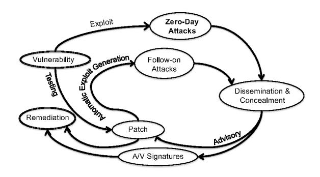
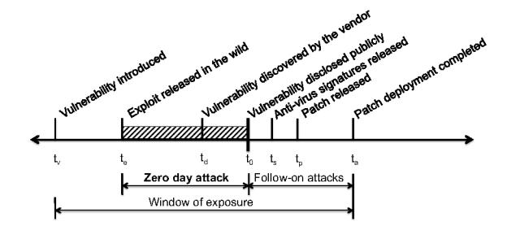
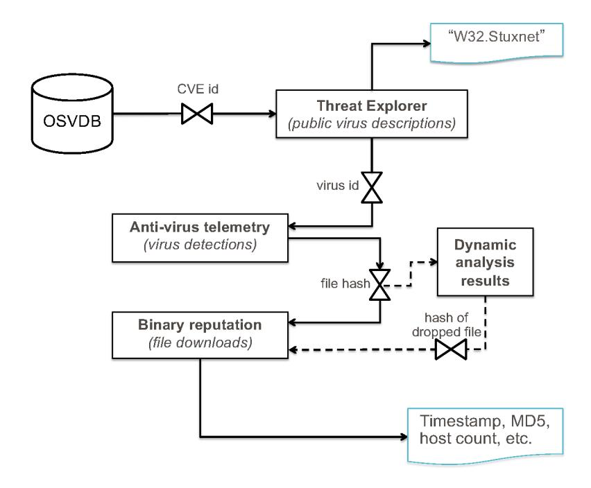
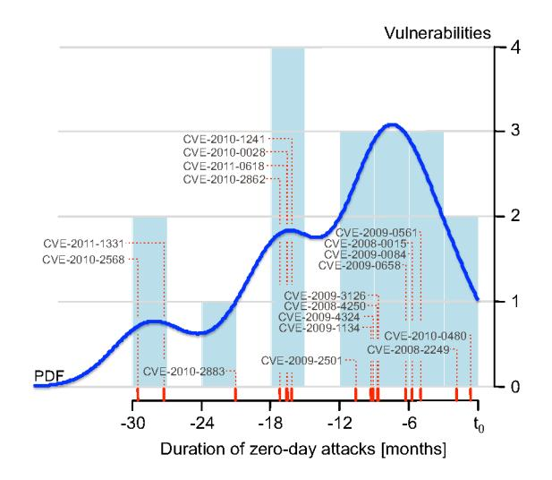
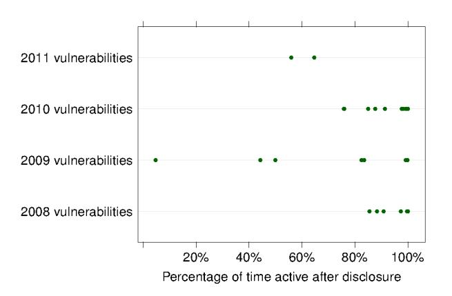
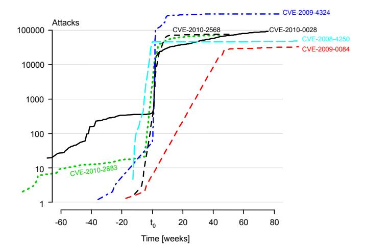
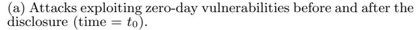
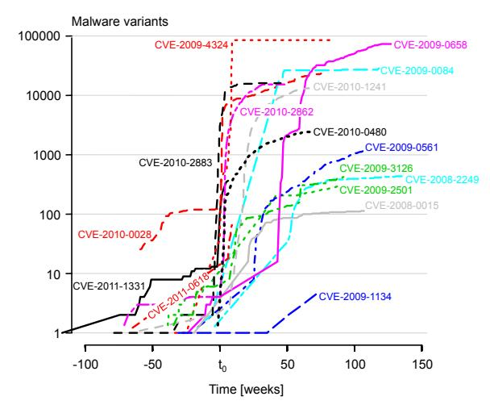
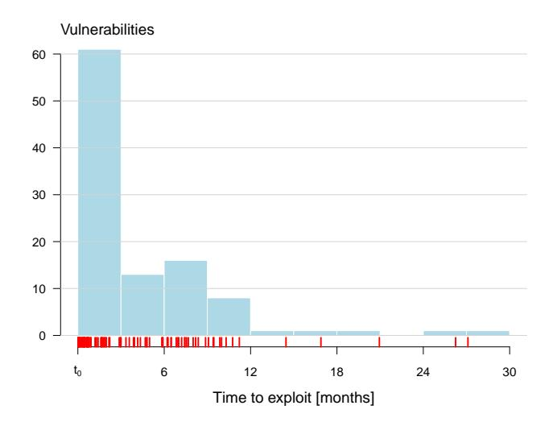

# **Before We Knew It**

# An Empirical Study of Zero-Day Attacks In The Real World

Leyla Bilge Symantec Research Labs

Tudor Dumitras, Symantec Research Labs

#### ABSTRACT

Little is known about the duration and prevalence of zeroday attacks, which exploit vulnerabilities that have not been disclosed publicly. Knowledge of new vulnerabilities gives cyber criminals a free pass to attack any target of their choosing, while remaining undetected. Unfortunately, these serious threats are difficult to analyze, because, in general, data is not available until after an attack is discovered. Moreover, zero-day attacks are rare events that are unlikely to be observed in honeypots or in lab experiments.

In this paper, we describe a method for automatically identifying zero-day attacks from field-gathered data that records when benign and malicious binaries are downloaded on 11 million real hosts around the world. Searching this data set for malicious files that exploit known vulnerabilities indicates which files appeared on the Internet before the corresponding vulnerabilities were disclosed. We identify 18 vulnerabilities exploited before disclosure, of which 11 were not previously known to have been employed in zero-day attacks. We also find that a typical zero-day attack lasts 312 days on average and that, after vulnerabilities are disclosed publicly, the volume of attacks exploiting them increases by up to 5 orders of magnitude.

## Categories and Subject Descriptors

D.2.4 [Software Engineering]: Software/Program Verification—*Statistical methods*; K.4.1 [Computers and Society]: Public Policy Issues—*Abuse and Crime Involving Computers*; K.6.5 [Management of Computing and Information Systems]: Security and Protection—*Invasive Software*

## General Terms

Measurement, Security

#### Keywords

Zero-day attacks, Vulnerabilities, Full disclosure

Permission to make digital or hard copies of all or part of this work for personal or classroom use is granted without fee provided that copies are not made or distributed for profit or commercial advantage and that copies bear this notice and the full citation on the first page. To copy otherwise, to republish, to post on servers or to redistribute to lists, requires prior specific permission and/or a fee.

*CCS'12,* October 16–18, 2012, Raleigh, North Carolina, USA. Copyright 2012 ACM 978-1-4503-1651-4/12/10 ...\$15.00.

### 1. INTRODUCTION

A *zero-day attack* is a cyber attack exploiting a vulnerability that has not been disclosed publicly. There is almost no defense against a zero-day attack: while the vulnerability remains unknown, the software affected cannot be patched and anti-virus products cannot detect the attack through signature-based scanning. For cyber criminals, unpatched vulnerabilities in popular software, such as Microsoft Office or Adobe Flash, represent a free pass to any target they might wish to attack, from Fortune 500 companies to millions of consumer PCs around the world. For this reason, the market value of a new vulnerability ranges between \$5,000– \$250,000 [15, 20]. Examples of notable zero-day attacks include the 2010 Hydraq trojan, also known as the "Aurora" attack that aimed to steal information from several companies [16], the 2010 Stuxnet worm, which combined four zeroday vulnerabilities to target industrial control systems [11], and the 2011 attack against RSA [27]. Unfortunately, very little is known about zero-day attacks because, in general, data is not available until *after* the attacks are discovered. Prior studies rely on indirect measurements (e.g., analyzing patches and exploits) or the post-mortem analysis of isolated incidents, and they do not shed light on the the duration, prevalence and characteristics of zero-day attacks.

Zero-day vulnerabilities are believed to be used primarily for carrying out targeted attacks, based on the post-mortem analysis of the vulnerabilities that security analysts have connected to zero-day attacks [37]. However, prior research has focused on the entire *window of exposure* to a vulnerability, which lasts until all vulnerable hosts are patched and which covers attacks initiated after the vulnerability was disclosed [29]. For example, a study of three exploit archives showed that 15% of these exploits were created before the disclosure of the corresponding vulnerability [12]. A followup study found that only 65% of vulnerabilities in software running on a typical Windows host have patches available at disclosure [13], which provides an opportunity for attackers to exploit the unpatched vulnerabilities on a larger scale. These studies do not discern the security vulnerabilities that are ultimately exploited in the wild, and they do not provide any information on the window of opportunity for stealth attacks, before the vulnerabilities exploited have been disclosed publicly.

In this paper, we conduct a systematic study of zero-day attacks between 2008–2011. We develop a technique for identifying and analyzing zero-day attacks from the data available through the Worldwide Intelligence Network Environment (WINE), a platform for data intensive experiments

Table 1: Summary of findings.

| Findings                                                                  | Implications                                                                                            |
|---------------------------------------------------------------------------|---------------------------------------------------------------------------------------------------------|
| Zero-day attacks are more frequent than previously thought: 11 out of     | Zero-day attacks are serious threats that may have                                                      |
| 18 vulnerabilities identified were not known zero-day vulnerabilities.    | a significant impact on the organizations affected.                                                     |
| Zero-day attacks last between 19 days and 30 months, with a median        | Zero-day attacks are not detected in a timely man                                                       |
| of 8 months and an average of approximately 10 months.                    | ner using current policies and technologies.                                                            |
| Most zero-day attacks affect few hosts, with the exception of a few       | Most zero-day vulnerabilities are employed in tar                                                       |
| high-profile attacks (e.g., Stuxnet).                                     | geted attacks.                                                                                          |
| 58% of the anti-virus signatures are still active at the time of writing. | Data covering 4 years is not sufficient for observing all the phases in the vulnerability lifecycle. |
| After zero-day vulnerabilities are disclosed, the number of malware       | The public disclosure of vulnerabilities is followed                                                    |
| variants exploiting them increases 183–85,000 times and the number        | by an increase of up to five orders of magnitude in                                                     |
| of attacks increases 2–100,000 times.                                     | the volume of attacks.                                                                                  |
| Exploits for 42% of all vulnerabilities employed in host-based threats    | Cyber criminals watch closely the disclosure of new                                                     |
| are detected in field data within 30 days after the disclosure date.      | vulnerabilities, in order to start exploiting them.                                                     |

in cyber security [25]. WINE includes field data collected by Symantec on 11 million hosts around the world. These hosts do not represent honeypots or machines in an artificial lab environment; they are real computers that are targeted by cyber attacks. For example, the *binary reputation* data set includes information on binary executables downloaded by users who opt in for Symantec's reputation-based security program (which assigns a reputation score to binaries that are not known to be either benign or malicious). The *antivirus telemetry* data set includes reports about host-based threats (e.g., viruses, worms, trojans) detected by Symantec's anti-virus products.

The key idea behind our technique is to identify executable files that are linked to exploits of known vulnerabilities. We start from the public information about disclosed vulnerabilities (i.e., vulnerabilities that have been assigned a CVE identifier [10]), available from vulnerability databases and vendor advisories. We use the public Threat Explorer web site [38] to determine threats identified by Symantec that are linked to these vulnerabilities, and then we query the anti-virus telemetry data set in WINE for the hashes of all the distinct files (malware variants) that are detected by these signatures. Finally, we search the history of binary reputation submissions for these malicious files, which allows us to estimate *when* and *where* they appeared on the Internet. Correlating these independently-collected data sets allows us to study all the phases in the vulnerability lifecycle. For example, when we find records for the presence of a malicious executable in the wild before the corresponding vulnerability was disclosed, we have identified a zero-day attack.

To the best of our knowledge, this represents the first attempt to measure the prevalence and duration of zero-day attacks, as well as the impact of vulnerability disclosure on the volume of attacks observed. We identify 18 vulnerabilities exploited in the real-world before disclosure. Out of these 18 vulnerabilities, 11 were not previously known to have been employed in zero-day attacks, which suggests that zero-day attacks are more common than previously thought. A typical zero-day attack lasts on average 312 days and hits multiple targets around the world; however, some of these attacks remain unknown for up to 2.5 years. After these vulnerabilities are disclosed, the volume of attacks exploiting them increases by up to 5 orders of magnitude.

These findings have important technology and policy implications. The challenges for identifying and analyzing elusive threats, such as zero-day attacks, emphasize that experiments and empirical studies in cyber security must be conducted at scale by taking advantage of the resources that are available for this purpose, such as the WINE platform. This will allow researchers and practitioners to investigate mitigation techniques for these threats based on empirical data rather than on anecdotes and back-of-the-envelope calculations. For example, the fact that zero-day attacks are rare events, but that the new exploits are re-used for multiple targeted attacks, suggests that techniques for assigning reputation based on the prevalence of files [9] can reduce the effectiveness of the exploit. Furthermore, because we quantify the increase in the volume of attacks after vulnerability disclosures, we provide new data for assessing the overall benefit to society of the *full disclosure* policy, which calls for disclosing new vulnerabilities publicly, even if patches are not yet available.

We make three contributions in this paper:

- We propose a method for identifying zero-day attacks from data collected on real hosts and made available to the research community via the WINE platform.
- We conduct a systematic study of the characteristics of zero-day attacks. Our findings are summarized in Table 1.
- We compare the impact of zero-day vulnerabilities before and after their public disclosure, and we discuss the implications for the policy of full disclosure.

The remainder of the paper is organized as follows. In Section 2 we define zero-day attacks and we state our goals in this paper. In Section 3 we review the current knowledge about zero-day attacks. In Section 4 we describe our method for identifying zero-day attacks automatically and the data sets analyzed. In Section 5 we present our empirical results, and in Section 6 we discuss the implications of our findings.

#### 2. PROBLEM STATEMENT AND GOALS

The Common Vulnerabilities and Exposures (CVE) consortium maintains a database with extensive information about vulnerabilities, including technical details and the disclosure dates, that is a widely accepted standard for academia. governmental organizations and the cyber security industry [10]. For CVE, a vulnerability is a software mistake that allows attackers execute commands as other users, access data that has access restrictions, behave as another user or launch denial of service attack. In general, a zero-day attack is an attack that exploits vulnerabilities not vet disclosed to the public. This is only one phase in the lifecycle of these vulnerabilities (see Figure 1). A security vulnerability starts as a programming bug that evades testing. Cyber criminals sometimes discover the vulnerabily, exploit it, and package the exploit with a malicious payload to conduct zero-day attacks against selected targets. After the vulnerability or the exploits are discovered by the security community and described in a public advisory, the vendor of the affected software releases a patch for the vulnerability and security vendors update anti-virus signatures to detect the exploit or the specific attacks. However, the exploit is then reused, and in some cases additional exploits are created based on the patch [7], for attacks on a larger scale, targeting Internet hosts that have not yet applied the patch. The race between these attacks and the remediation measures introduced by the security community can continue for several years, until the vulnerability ceases to affect end-hosts.

The following events mark this lifecycle (Figure 2):

- Vulnerability introduced. A bug (e.g., programming mistake, memory mismanagement) is introduced in software that is later released and deployed on hosts around the world (time  $= t_v$ ).
- Exploit released in the wild. Actors in the underground economy discover the vulnerability, create a working exploit and use it to conduct stealth attacks against selected targets (time  $= t_e$ ).
- Vulnerability discovered by the vendor. The vendor learns about the vulnerability (either by discovering it through testing or from a third-party report), assesses its severity, assigns a priority for fixing it and starts working on a patch (time  $= t_d$ ).
- Vulnerability disclosed publicly. The vulnerability is disclosed, either by the vendor or on public fo-

Figure 1: Lifecycle of zero-day vulnerabilities.

Figure 2: Attack timeline. These events do not always occur in this order, but  $t_a > t_p \ge t_d > t_v$  and  $t_0 \ge t_d$ . The relation between  $t_d$  and  $t_e$  cannot be determined in most cases. For a zero-day attack  $t_0 > t_e$ .

rums and mailing lists. A CVE identifier (e.g., CVE-2010-2568) is assigned to the vulnerability (time  $=t_0$ ).

- Anti-virus signatures released. Once the vulnerability is disclosed, anti-virus vendors release new signatures for ongoing attacks and created heuristic detections for the exploit. After this point, the attacks can be detected on end-hosts with updated A/V signatures (time  $= t_s$ ).
- Patch released. On the disclosure date, or shortly afterward, the software vendor releases a patch for the vulnerability. After this point, the hosts that have applied the patch are no longer susceptible to the exploit (time  $= t_p$ ).
- Patch deployment completed. All vulnerable hosts worldwide are patched and the vulnerability ceases to have an impact (time  $= t_a$ ).

A zero-day attack is characterized by a vulnerability that is exploited in the wild before it is disclosed, i.e.,  $t_0 > t_e$ . Similarly, a zero-day vulnerability is vulnerability employed in a zero-day attack. Our goals in this paper are to measure the prevalence and duration of zero-day attacks and to compare the impact of zero-day vulnerabilities before and after  $t_0$ .

Software vendors fix bugs and patch vulnerabilities in all their product releases, and as a result some vulnerabilities are never exploited or disclosed. In this paper, we only consider vulnerabilities that have been assigned a CVE identifier. Similarly, in some cases vendors learn about a vulnerability before it is exploited, but consider it low priority, and cyber criminals may also delay the release of exploits until they identify a suitable target, to prevent the discovery of the vulnerability. While the CVE database sometimes indicates when vulnerabilities were reported to the vendors, it is generally impossible to determine the exact date when the vendor or the cyber criminals discovered the vulnerability or even which discovery came first. We therefore consider the disclosure date of the vulnerability as "day zero," the end of the zero-day attack. Moreover, some exploits are not employed for malicious activities before the disclosure date and are disseminated as proofs-of-concept, to help the software vendor understand the vulnerability and the anti-virus vendors update their signatures. When disclosed vulnerabilities are left unpatched, this creates an opportunity for cyber criminals to create additional exploits and to conduct attacks on a larger scale; however, these attacks can usually be detected by an anti-virus program with up-to-date definitions. In this paper, we consider only exploits that have been used in real-world attacks before the corresponding vulnerabilities were disclosed.

Non-goals. We do not aim to analyze the techniques used to exploit zero-day vulnerabilities or for packing the malware to avoid detection. We therefore focus on data that highlights the *presence* and *propagation rate* of malware on the Internet, rather than on the static or behavioral analysis of the malware samples. The motivations behind zero-day attacks, the dynamics of the market for zero-day vulnerabilities and the attacks against disclosed vulnerabilities for which patches are not available are also outside the scope of this study.

### 3. RELATED WORK

Frei studied zero-day attacks by combining publicly available information on vulnerabilities disclosed between 2000– 2007 with a study of three exploit archives, popular in the hacker community [12]. This study showed that, on the disclosure date, an exploit was available for 15% of vulnerabilities and a patch was available for 43% of vulnerabilities (these percentages are not directly comparable because they are computed over different bases—all vulnerabilities that have known exploits and all vulnerabilities that have been patched, respectively). The study also found that 94% of exploits are created within 30 days after disclosure. However, the exploits included in public archives are proofs-of-concept that are not always used in real-world attacks. Shahzad et al. conduct a similar study, but on a larger data set [32]. In this work, the authors analyze how the type and number of vulnerabilities change during the period of their analysis window. McQueen et al. [18] analyze the lifespan of known zero-day vulnerabilities in order to be able to estimate the real number of zero-day vulnerabilities existed in the past. In contrast to this previous work, we analyze field data, collected on real hosts targeted by cyber attacks, to understand the prevalence and duration of zero-day attacks before vulnerabilities are disclosed, and we conduct a real-world analysis rather than make statistical estimations.

Symantec analysts identified 8–15 zero-day vulnerabilities each year between 2006–2011 [37]. For example, 9 vulnerabilities were used in zero-day attacks in 2008, 12 in 2009, 14 in 2010 and 8 in 2011. The 14 zero-day vulnerabilities discovered in 2010 affected the Windows operating system, as well as widely used applications such as Internet Explorer, Adobe Reader, and Adobe Flash Player. These vulnerabilities were employed in high-profile attacks, such as Stuxnet and Hydraq. In 2009, Qualys analysts reported knowledge of 56 zero-day vulnerabilities [24]. In contrast, to these reports, we propose a technique for identifying zero-day attacks automatically from field data available to the research community, and we conduct a systematic study of zero-day attacks in the real world. In particular, we identify 11 vulnerabilities, disclosed between 2008–2011, that were not known to have been used in a zero-day attack.

Most prior work has focused on the entire window of exposure to a vulnerability (see Figure 2), first defined by Schneier [29]. Arbaugh et al. evaluated the number of intrusions observed during each phase of the vulnerability lifecycle and showed that a significant number of vulnerabilities continue to be exploited even after patches become available [3]. Frei compared how fast Microsoft and Apple react to newly disclosed vulnerabilities and, while significant differences exist between the two vendors, both have some vulnerabilities with no patch available 180 days after disclosure [12]. A Secunia study showed that 50% of Windows users were exposed to 297 vulnerabilities in a year and that patches for only 65% of these vulnerabilities were available at the time of their public disclosure [13]. Moreover, even after patches become available, users often delay their deployment, partly because of the overhead of patch management and partly because of the general observation that the process of fixing bugs tends to introduce additional software defects. For example, a typical Windows user must manage 14 update mechanisms to keep the host fully patched [13], while an empirical study suggested that over 10% of security patches have bugs of their own [5].

While the market for zero-day vulnerabilities has not been studied as thoroughly as other aspects of the underground economy, the development of exploits for such vulnerabilities is certainly a profitable activity. For example, several security firms run programs, such as HP's Zero Day Initiative and Verisign's iDefense Vulnerability Contributor Program, that pay developers up to \$10,000 for their exploits [15,20], with the purpose of developing intrusion-protection filters against these exploits. Between 2000–2007, 10% of vulnerabilities have been disclosed through these programs [12]. Similarly, software vendors often reward the discovery of new vulnerabilities in their products, offering prizes up to \$60,000 for exploits against targets that are difficult to attack, such as Google's Chrome browser [14]. Moreover, certain firms and developers specialize in selling exploits to confidential clients on the secretive, but legal, market for zero-day vulnerabilities. Industry sources suggest that the market value of such vulnerabilities can reach \$250,000 [15, 20]. In particular, the price of exploits against popular platforms, such as Windows, iOS or the major web browsers, may exceed \$100,000, depending on the complexity of the exploit and on how long the vulnerability remains undisclosed [15].

## 4. IDENTIFYING ZERO-DAY ATTACKS AUTOMATICALLY

To identify zero-day attacks automatically, we analyze the historical information provided by multiple data sets. In this section, we describe our data sets and the ground truth for our analysis (§4.1). We then introduce our method for identifying zero-day attacks (§4.2) and discuss the threats to the validity of our findings (§4.3).

#### 4.1 Data sets

We conduct our study on the Worldwide Intelligence Network Environment (WINE), a platform for data intensive experiments in cyber security [25]. WINE was developed at Symantec Research Labs for sharing comprehensive field data with the research community. WINE samples and aggregates multiple terabyte-size data sets, which Symantec uses in its day-to-day operations, with the aim of supporting open-ended experiments at scale. The data included in WINE is collected on a representative subset of the hosts running Symantec products, such as the Norton Antivirus. These hosts do not represent honeypots or machines in an artificial lab environment; they are real computers, in active

Figure 3: Overview of our method for identifying zero-day attacks systematically.

use around the world, that are targeted by cyber attacks. WINE also enables the reproduction of prior experimental results, by archiving the reference data sets that researchers use and by recording information on the data collection process and on the experimental procedures employed.

We correlate the WINE data sets with information from three additional sources: the Open Source Vulnerability Database (OSVDB) [21], Symantec's Threat Explorer [38], and a Symantec data set with dynamic analysis results for malware samples. While we process the data provided by OSVDB and Symantec Threat Explorer for forming the basis of our ground truth, we analyze WINE and the dynamic analysis results, in a further stage, to identify the zero-day attacks.

OSVDB is a public database that aggregates all the available sources of information about vulnerabilities that have been disclosed since 1998. Because the Microsoft Windows platform has been the main target for cyber attacks over the past decade, we focus on vulnerabilities in Windows or in software developed for Windows. The information we collected from OSVDB includes the discovery, disclosure and exploit release date of the vulnerabilities. To complete the picture of the vulnerability lifecycle, we collect the patch release dates from Microsoft and Adobe Security Bulletins [1, 19].

Threat Explorer is a public web site with up-to-date information about the latest threats, risks and vulnerabilities. In addition, it provides detailed historical information about most threats for which Symantec has generated anti-virus signatures. From these details, we are only interested in the malware class of the threat (e.g., Trojan, Virus, Worm), the signature generation date and associated CVE identifier(s), if the threat exploits known vulnerabilities. We build the ground truth of this study by combining information from OSVDB and Symantec Threat Explorer to prepare a list of threats along with the vulnerabilities they exploit.

In this paper, we analyze two WINE data sets: anti-virus telemetry and binary reputation. The anti-virus telemetry data records detections of known threats for which Symantec generated a signature that was subsequently deployed in an anti-virus product. The anti-virus telemetry data in WINE was collected between December 2009 and August 2011, and it includes 225 million detections that occurred on 9 million hosts. From each record, we use the detection time, the associated threat label, the hash (MD5 and SHA2) of the malicious file, and the country where the machine resides. We use this data in two ways: first, to link the threat labels with malicious files, and second, to enrich our knowledge about the impact of zero-day vulnerabilities after they are publicly disclosed.

The binary reputation data, on the other hand, does not record threat detections. Instead, it reports all the binary executables—whether benign or malicious—that have been downloaded on end-hosts around the world. The binary reputation data in WINE was collected since February 2008, and it includes 32 billion reports about approximately 300 million distinct files, which were downloaded on 11 million hosts. Each report includes the download time, the hash (MD5 and SHA2) of the binary, and the URL from which it was downloaded These files may include malicious binaries that were not detected at the time of their download because the threat was unknown. We note that this data is collected only from the Symantec customers who gave their consent to share it. The binary reputation data allows us to look back in time to get more insights about what happened before signatures for malicious binaries were created. Therefore, analyzing this data set enables us to discover zero-day attacks conducted in the past.

In the recent years, most exploits are embedded in non-executable files such as \*.pdf, \*.doc, \*.xlsx [39]. Because the binary reputation data only reports executable files, it is not straightforward to find out whether a non-executable

exploit was involved in a zero-day attack or not. To analyze non-executable exploits, we try to identify a customized malicious binary that was downloaded after a successful exploitation, and we then search the binary in the binary reputation data. To this end, we search the dynamic analysis data set to create a list of binaries that are downloaded after the exploitation phase.

## 4.2 Method for identifying zero-day attacks

Figure 3 illustrates our analysis method, which has five steps: building the ground truth, identifying exploits in executables, identifying executables dropped after exploitation (optional phase), analyzing the presence of exploits on the Internet, and identifying zero-day attacks.

Building the ground truth. We first gather information about vulnerabilities in Windows and in software running on the Windows platform by querying OSVDB and other references about disclosed vulnerabilities (e.g., Microsoft Bulletins). For all the vulnerabilities that are identified by a CVE number we collect the discovery, disclosure, exploit release date and patch release dates. We then search Symantec's Threat Explorer for these CVE numbers to identify the threats that exploit these vulnerabilities. Each threat has a name (e.g., W32.Stuxnet) and a numerical identifier, called *virus id*. We manually filter out the *virus id*s that correspond to generic virus detections (e.g., "Trojan Horse"), as identified by their Threat Explorer descriptions [38]. This step results in a mapping of threats to their corresponding CVE identifiers, Zi = {virus idi, cve idi}, which are our candidates for the zero-day attack study. Note that some *virus id*s use more than one vulnerability, therefore in Zi it is possible to observe the same *virus id* more than once.

Identifying exploits in executables. In the second stage our aim is to identify the exploits that are detected by each *virus id* in Z so that we can search for them in the binary reputation data. The anti-virus telemetry data set records the hashes of all the malicious files identified by Symantec's anti-virus products. We represent each file recorded in the system with an identifier (*file hash id*). Certain *virus id*s detect a large number of *file hash id*s because of the polymorphism employed by malware authors to evade detection. This step results in a mapping of threats to their variants, Ei = {virus idi, file hash idi}.

Identifying executables dropped after exploitation. When exploits are embedded in non-executable files, we can find their *file hash id*s in the anti-virus telemetry data but not in the binary reputation data. To detect zero-day attacks that employ such exploits, we query the dynamic analysis data set for files that are downloaded after successful exploitations performed by the *file hash id*s identified in the previous step. This step also produces a mapping of threats to malicious files, but instead of listing the exploit files in E we add the dropped binary files. This may result in false positives because, even if we detect a dropped executable in the binary reputation data before the disclosure date of the corresponding vulnerability, we cannot be confident that this executable was linked to a zero-day attack. In other words, the executable may have been downloaded using other infection techniques. Therefore, this step is optional in our method.

Analyzing the presence of exploits on the Internet. Having identified which executables exploit known *cve id*s, we search for each executable in the binary reputation data to estimate when they first appeared on the Internet. Because the binary reputation data indicates the *presence* of these files, and not whether they were executed (or even if they could have executed on the platform where they were discovered), these reports indicate attacks rather than successful infections. As some *virus id*s match more than one variant, the first executable detected marks the start of the attack. After this step, for each *virus id* in Z we can approximate the time when the attack started in the real world.

Identifying zero-day attacks. Finally, to find the *virus id*s involved in zero-day attacks we compare the start dates of each attack with the disclosure dates of the corresponding vulnerabilities. If at least one of the *file hash id*s of a threat Zi = {virus idi, cve idi} was downloaded before the disclosure date of cve idi, we conclude that cve idi is a zero-day vulnerability and that virus idi performed a zero-day attack.

### 4.3 Threats to validity

The biggest threat to the validity of our results is selection bias. As WINE does not include data from hosts without Symantec's anti-virus products, our results may not be representative of the general population of platforms in the world. In particular, users who install anti-virus software might be more careful with the security of their computers and, therefore, might be less exposed to attacks. Although we cannot rule out the possibility of selection bias, the large size of the population in our study (11 million hosts and 300 million files) and the amount of zero-day vulnerabilities we identify using our automated method (18, which is on the same order of magnitude as the 31 reported by Symantec analysts during the same period [37]) suggest that our results have a broad applicability.

Moreover, for the zero-day vulnerabilities detected toward the beginning of our data collection period, we may underestimate the duration of the attacks. We therefore caution the reader that our results for the duration of zero-day attack are best interpreted as *lower bounds*.

## 5. ANALYSIS RESULTS AND FINDINGS

In this section, we analyze the zero-day vulnerabilities we discover with the method described in Section 4. We build our ground truth starting from a January 2012 copy of the OSVDB database. The binary reputation data we analyze was collected between February 2008 and March 2012. As this is the key component of our method, we can only identify zero-day attacks that occurred between 2008 and 2011.

We first apply our method without the optional step that takes into account the dynamic analysis data. As shown in Table 2, we identify 18 zero-day vulnerabilities: 3 disclosed in 2008, 7 in 2009, 6 in 2010 and 2 in 2011. The second column of the table lists the anti-virus signatures linked to these vulnerabilities; the signatures are described on the Threat Explorer web site [38]. While the exploit files associated with most vulnerabilities were detected by only one anti-virus signature—typically a heuristic detection for the exploit—there are some vulnerabilities associated with several signatures. For example, CVE-2008-4250 was exploited

Table 2: The 0-day vulnerabilities identified by our automated method.

| 0-day vulnerability | Anti-virus signatures                                                            | Disclosure Date | Public Exploit Release | Attack Start Date | Variants | Hosts targeted |
|---------------------|----------------------------------------------------------------------------------|--------------------|------------------------------|----------------------|----------|-------------------|
| CVE-2008-0015       | Bloodhoud.Exploit.259                                                            | 2009-07-06         | Not known                    | 2008-12-28           | 1        | 2                 |
| CVE-2008-2249       | Bloodhound.Exploit.214                                                           | 2008-12-09         | Not known                    | 2008-10-14           | 1        | 1                 |
| CVE-2008-4250       | W32.Downadup W32.Downadup.B W32.Fujacks.CE W32.Neeris.C W32.Wapomi.B | 2008-10-23         | 2008-10-23                   | 2008-02-05           | 312      | 450 K             |
| CVE-2009-0084       | Bloodhound.Exploit.238                                                           | 2009-04-14         | Not known                    | 2008-10-23           | 3        | 3                 |
| CVE-2009-0561       | Bloodhound.Exploit.251                                                           | 2009-06-09         | Not known                    | 2009-01-11           | 1        | 1                 |
| CVE-2009-0658       | Trojan.Pidief                                                                    | 2009-02-20         | Not known                    | 2008-09-02           | 7        | 23                |
| CVE-2009-1134       | Bloodhound.Exploit.254                                                           | 2009-06-09         | Not known                    | 2008-07-25           | 1        | 20 K              |
| CVE-2009-2501       | Bloodhoud.Exploit.277                                                            | 2009-10-13         | Not known                    | 2009-01-07           | 6        | 12                |
| CVE-2009-3126       | Bloodhound.Exploit.278                                                           | 2009-10-13         | Not known                    | 2009-01-27           | 6        | 16                |
| CVE-2009-4324       | Trojan.Pidief.H                                                                  | 2009-12-14         | 2009-12-15                   | 2009-03-15           | 1        | 3                 |
| CVE-2010-0028       | Bloodhound.Exploit.314                                                           | 2010-02-10         | Not known                    | 2008-10-14           | 127      | 102               |
| CVE-2010-0480       | Bloodhound.Exploit.324                                                           | 2010-04-14         | Not known                    | 2010-03-26           | 1        | 1                 |
| CVE-2010-1241       | Bloodhound.Exploit.293                                                           | 2010-04-11         | Not known                    | 2008-11-29           | 2        | 3                 |
| CVE-2010-2568       | Bloodhound.Exploit.343 W32.Stuxnet W32.Changeup.C W32.Ramnit            | 2010-07-17         | 2010-07-18                   | 2008-02-13           | 3597     | 1.5 M             |
| CVE-2010-2862       | Bloodhound.Exploit.353                                                           | 2010-08-04         | Not known                    | 2009-03-05           | 4        | 18                |
| CVE-2010-2883       | Bloodhound.Exploit.357                                                           | 2010-09-08         | 2010-09-07                   | 2008-12-14           | 2        | 18                |
| CVE-2011-0618       | Bloodhound.Exploit.412                                                           | 2011-05-13         | Not known                    | 2010-01-03           | 1        | 1                 |
| CVE-2011-1331       | Trojan.Tarodrop.L                                                                | 2011-06-16         | Not known                    | 2009-03-19           | 13       | 32                |

8 months before the disclosure date by Conficker (also known as W32.Downadup) [23] and four other worms.

The third column of the table lists the disclosure date of these vulnerabilities, and the fifth column lists the earliest occurrence, observable in WINE, of a file exploiting them. For these vulnerabilities, exploits were active in the real world before disclosure, which indicates that they are zero-day vulnerabilities. For comparison, in the fourth column of Table 2 we also report the exploit release dates, as recorded in public vulnerability databases such as OSVDB. This information is available for only 4 out of the 18 vulnerabilities and in all these cases the exploit release date is within one day of the vulnerability disclosure, while working exploits existed in the wild 8–30 months before disclosure. This emphasizes the importance of analyzing field data when studying zero-day attacks.

To determine whether these vulnerabilities were already known to have been involved in zero-day attacks, we manually search all 18 vulnerabilities on Google. From the annual vulnerability trends reports produced by Symantec [33–37] and the SANS Institute [28], as well as blog posts on the topic of zero-day vulnerabilities, we found out that 7 of our vulnerabilities are generally accepted to be zero-day vulnerabilities (see Table 3). For example, CVE-2010-2568 is one of the four zero-day vulnerabilities exploited by Stuxnet and it is known to have also been employed by another threat for more than 2 years before the disclosure date (17 July 2010). As shown in Table 3, most of these vulnerabilities affected Microsoft and Adobe products.

The zero-day attacks we identify lasted between 19 days (CVE-2010-0480) and 30 months (CVE-2010-2568), and the average duration of a zero-day attack is 312 days. Figure 4 also illustrates this distribution. The last column in Table 2 shows the number of hosts targeted before the zero-day attacks was detected. 15 of the zero-day vulnerabilities targeted fewer than 1,000 hosts, out of the 11 million hosts in our data set. On the other hand, 3 vulnerabilities were employed in attacks that infected thousands or even millions of Internet users. For example, Conficker exploiting the vulnerability CVE-2008-4250 managed to infect approximately 370 thousand machines without being detected over more than two months. This example illustrates the effectiveness of zero-day vulnerabilities for conducting stealth cyber attacks.

We also ask the question whether the zero-day vulnerabilities continued to be exploited up until the end of our ex-

Table 3: New 0-day vulnerabilities discovered and their descriptions.

| 0-day vulnerability | New 0-day | Description                                                                       |  |
|---------------------|-----------|-----------------------------------------------------------------------------------|--|
| CVE-2008-0015       |           | Microsoft ATL Remote Code Executiong Vulnerability (RCEV)                         |  |
| CVE-2008-2249       | Yes       | Microsoft Windows GDI WMF Integer Overflow Vulnerability                          |  |
| CVE-2008-4250       | Yes       | Windows Server Service NetPathCanonicalize() Vulnerability                        |  |
| CVE-2009-0084       | Yes       | Microsoft DirectX DirectShow MJPEG Video Decompression RCEV                       |  |
| CVE-2009-0561       | Yes       | Microsoft Excel Malformed Record Object Integer Overflow                          |  |
| CVE-2009-0658       |           | Adobe Acrobat and Reader PDF File Handling JBIG2 Image RCEV                       |  |
| CVE-2009-1134       | Yes       | Microsoft Office Excel QSIR Record Pointer Corruption Vulnerability               |  |
| CVE-2009-2501       |           | Microsoft GDI+ PNG File Processing RCEV                                           |  |
| CVE-2009-3126       | Yes       | Microsoft GDI+ PNG File Integer Overflow RCEV                                     |  |
| CVE-2009-4324       |           | Adobe Reader and Acrobat newplayer() JavaScript Method RCEV                       |  |
| CVE-2010-0028       | Yes       | Microsoft Paint JPEG Image Processing Integer Overflow                            |  |
| CVE-2010-0480       | Yes       | Yes Microsoft Windows MPEG Layer-3 Audio Decoder Buffer Overflow Vulnerability    |  |
| CVE-2010-1241       | Yes       | NITRO Web Gallery 'PictureId' Parameter SQL Injection Vulnerability               |  |
| CVE-2010-2568       |           | Microsoft Windows Shortcut 'LNK/PIF' Files Automatic File Execution Vulnerability |  |
| CVE-2010-2862       | Yes       | Adobe Acrobat and Reader Font Parsing RCEV                                        |  |
| CVE-2010-2883       |           | Adobe Reader 'CoolType.dll' TTF Font RCEV                                         |  |
| CVE-2011-0618       | Yes       | Adobe Flash Player ActionScript VM Remote Integer Overflow Vulnerability          |  |
| CVE-2011-1331       |           | JustSystems Ichitaro Remote Heap Buffer Overflow Vulnerability                    |  |

Figure 4: Duration of zero-day attacks. The histograms group attack durations in 3-month increments, before disclosure, and the red rug indicates the attack duration for each zero-day vulnerability.

perimentation period. Figure 5 shows the distribution of the time that we continue to detect anti-virus signatures linked to these vulnerabilities, expressed as a percentage of the time between disclosure and the time of writing. The figure suggests that zero-day vulnerabilities do not loose their popularity after the disclosure date. While two vulnerabilities, CVE-2009-1134 and CVE-2009-2501, ceased to have an impact after being exploited over a year, 58% of the anti-virus signatures are still active at the time of writing. Because of this high fraction of vulnerabilities still in use, it would be meaningless to compute the half-life or the decay of the vulnerability usage. The only conclusion we can draw is that

Figure 5: Percentage of the period after the disclosure date that zero-day vulnerabilities are still exploited. Each dot corresponds to an antivirus signature. 100% means that a vulnerability exploit was still in use at the time of writing.

data covering 4 years is not sufficient for observing all the phases in the vulnerability lifecycle (Figure 1).

While linking exploits to dropped executables through the dynamic analysis of malware samples may produce false positives, we repeat our experiments taking this data set into account, to see if we can identify more zero-day vulnerabilities. We do not detect additional zero-day attacks in this manner, but this optional step allows us to confirm 2 of the zero-day vulnerabilities that we have already discovered.

#### 5.1 Zero-day vulnerabilities after disclosure

To learn what happens after the disclosure of zero-day vulnerabilities, we investigate the volume of attacks exploiting

(b) Malware variants exploiting zero-day vulnerabilities before and after disclosure (time = t0).

Figure 6: Impact of vulnerability disclosures on the volume of attacks. We utilize logarithmic scales to illustrate an increase of several orders of magnitude after disclosure.

these vulnerabilities over time. Specifically, we analyze the variation of the number of malware variants, as they emerge in the wild, and of the number of times they are detected. Figure 6a shows how many downloads (before the disclosure date) and detections (after the disclosure date) of the exploits for the zero-day vulnerabilities were observed until the last exploitation attempt. The number of attacks increases 2–100,000 times after the disclosure dates of these vulnerabilities.

Figure 6b shows that the number of variants (files exploiting the vulnerability) exhibits the same abrupt increase after disclosure: 183–85,000 more variants are detected each day. One reason for observing large number of new different files that exploit the zero-day vulnerabilities might be that they are repacked versions of the same exploits. However, it is doubtful that repacking alone can account for an increase by up to 5 orders of magnitude. More likely, this increase is the result of the extensive re-use of field-proven exploits in other malware.

Figure 7 shows the time elapsed until all the vulnerabilities disclosed between 2008 and 2011 started being exploited in the wild. Exploits for 42% of these vulnerabilities appear in the field data within 30 days after the disclosure date. This illustrates the fact that the cyber criminals watch closely the disclosure of new vulnerabilities, in order to start exploiting them, which causes a significant risk for end-users.

#### 5.2 Other Zero-day Vulnerabilities

Every year, Symantec analysts prepare an "Internet Security Threats Report" (ISTR) in which new threats, vulnerabilities and malware trends are reported. This report includes information about the zero-day vulnerabilities identified during the previous year. These reports identify 31 between 2008–2011: 9 in 2008, 12 in 2009, 14 in 2010 and 8 in 2011 [33–37]. For each year, our automated method discovers on average 3 zero-day vulnerabilities that were not known before and on average 2 zero-day vulnerabilities from the list reported by Symantec. However, we were not able

Figure 7: Time before vulnerabilities disclosed between 2008–2011 started being exploited in the field. The histograms group the exploitation lag in 3 month increments, after disclosure, and the red rug indicates the lag for each exploited vulnerability. The zero-day attacks are excluded from this figure.

to identify on average 8 known zero-day vulnerabilities per year.

To understand the reasons why our method missed 24 zero-day vulnerabilities reported in ISTR, we performed a manual analysis on their characteristics, such as being employed in highly targeted attacks, applying polymorphism etc. This study highlights the limitations of our method:

• Web Attacks: anti-virus telemetry only records detections of host-based attacks. To detect web-based attacks, e.g. cross-site scripting attacks, we would need to analyze network based intrusion-detection data. While telemetry from Symantec's intrusion detection products is included in WINE, we did not consider this data set in our study because it is not straightforward to correlate it with the binary reputation data. Our method did not detect CVE-2011-2107, CVE-2011- 3765, etc. because these vulnerabilities are exploited in web attacks.

- Polymorphic malware: another limitation of our method is that, if the exploit files created for the zeroday vulnerabilities are polymorphic, the file hashes may be different in the anti-virus telemetry in binary reputation data. Most of the zero-day exploits that we could not identify were polymorphic, for example, CVE-2010-0806, CVE-2010-3654, CVE-2009-1537.
- Non-executable exploits: In recent years, exploits tend to be embedded in non-executable files such as *pdf, doc, xlsx*. Symantec's anti-virus products provide detections for such malware, and the anti-virus telemetry data contains records for detections of nonexecutable files. However, the binary reputation data only tracks binary files. Because we use the binary reputation data to approximate the start dates of attacks, we cannot detect zero-day vulnerabilities that are exploited by non-executable files. One workaround we considered was to link exploits in non-executable files with the executable dropped once the exploit is successful, by establishing correlations through dynamic analysis results. Unfortunately, results for nonexecutable files were available only starting in late 2011 (i.e., almost the end of the period covered in our study). Therefore, the dynamic analysis data set provided limited benefits. A representative example for vulnerabilities that we could not detect due to nonexecutable files problem is CVE-2011-0609, which was exploited in RSA attack [27].
- Targeted attacks: zero-day vulnerabilities are usually exploited in targeted attacks [37]. Because these attacks target a limited number of organizations, which hold sensitive information than can be stolen, most consumers are not exposed to these attacks. Even though we analyze binary reputation data collected on 11 million hosts, this may not be is not sufficient for identifying zero-day attacks that are highly targeted.

#### 6. DISCUSSION

Zero-day attacks are difficult to prevent because they exploit unknown vulnerabilities, for which there are no patches and no anti-virus or intrusion-detection signatures. It seems that, as long as software will have bugs and the development of exploits for new vulnerabilities will be a profitable activity, we will be exposed to zero-day attacks. In fact, 60% of the zero-day vulnerabilities we identify in our study were not known before, which suggests that there are many more zero-day attacks than previously thought—perhaps more than twice as many. However, reputation-based technologies, which assign a score to each file based on its prevalence in the wild and on a number of other inputs [9], single out rare events such as zero-day attacks and can reduce the effectiveness of the exploits.

The large fraction of new zero-day vulnerabilities we identify also emphasizes that zero-day attacks are difficult to detect through manual analysis, given the current volume of cyber attacks. Automated methods for finding zero-day attacks in field data, such as the method we propose in this paper, facilitate the systematic study of these threats. For example, our method allows us to measure the duration of zero-day attacks (Figure 4). While the average duration is approximately 10 months, the fact that all but one of the vulnerabilities disclosed after 2010 remained unknown for more than 16 months suggests that we may be underestimating the duration of zero-day attacks, as the data we analyze goes back only to February 2008. In the future, such automated techniques will allow analysts to detect zero-day attacks faster, e.g., when a new exploit is reused in multiple targeted attacks. However, this will require establishing mechanisms for organizations to share information about suspected targeted attacks with the security community.

Our findings also provide new data for the debate on the benefits of the full disclosure policy. This policy is based on the premise that disclosing vulnerabilities to the public, rather than to the vendor, is the best way to fix them because this provides an incentive for vendors to patch faster, rather than to rely on security-through-obscurity [29]. This debate is ongoing [2, 6, 30, 31], but most participants agree that disclosing vulnerabilities causes an increase in the volume of attacks. Indeed, this is what the supporters of full disclosure are counting on, to provide a meaningful incentive for patching. However, the participants to the debate disagree about whether trading off a high volume of attacks for faster patching provides an overall benefit to the society. For example, Schneier initiated the debate by suggesting that, to mitigate the risk of disclosure, we should either patch all the vulnerable hosts as soon as the fix becomes available, or we should limit the information available about the vulnerability [29]. Ozmet et al. concluded that disclosing information about vulnerabilities improves system security [22], while Rescorla et al. could not find the same strong evidence on a more limited data set [26]. Arora et al. [4] and Cavusoglu et al. [8] analyzed the impact of full disclosure using techniques inspired from game theory, and they reached opposite conclusions about whether patches would immediately follow the disclosure of vulnerabilities.

The root cause of these disagreements lies in the difficulty of quantifying the real-world impact of vulnerability disclosures and of patch releases without analyzing comprehensive field data. We take a first step toward this goal by showing that the disclosure of zero-day vulnerabilities causes a significant risk for end-users, as the volume of attacks increases by up to 5 orders of magnitude. However, vendors prioritize which vulnerabilities they patch, giving more urgency to vulnerabilities that are disclosed or about to be disclosed. For example, 80% of the 2007 vulnerabilities were discovered more than 30 days before the disclosure date [12]. Moreover, even after patches become available users often delay their deployment, e.g., because a typical Windows user must manage 14 update mechanisms to keep the host fully patched [13]. At the same time, anecdotal evidence suggests that attackers also adapt their strategies to the expected disclosure of zero-day vulnerabilities. For example, the 2004 Witty worm was released less than 48 hours after the vulnerability it exploited was disclosed, which raised the suspicion that the attacker did not utilize a working exploit until the deployment of the patch was imminent [40]; the exploit file used in the 2011 attack against RSA was sent to 15 different organizations in the two weeks leading to the vulnerability's disclosure, in an attempt to exploit is as much as possible before it was discovered and patched [17]. This is because early disclosure reduces the value of zero-day vulnerabilities; for example, some fees for new exploits are paid in installments, with each subsequent payment depending on the lack of a patch [15]. Additional research is needed for quantifying these aspects of the full disclosure trade-off, e.g., by measuring how quickly vulnerable hosts are patched in the field, following vulnerability disclosures. Like our study of zero-day attacks, answering these additional research questions will require empirical studies conducted at scale, using comprehensive field data.

## 7. CONCLUSION

Zero-day attacks have been discussed for decades, but no study has yet measured the duration and prevalence of these attacks in the real world, *before the disclosure of the corresponding vulnerabilities*. We take a first step in this direction by analyzing field data collected on 11 million Windows hosts over a period of 4 years. The key idea in our study is to identify executable files that are linked to exploits of known vulnerabilities. By searching for these files in a data set with historical records of files downloaded on end-hosts around the world, we systematically identify zero-day attacks and we analyze their evolution in time.

We identify 18 vulnerabilities exploited in the wild before their disclosure, of which 11 were not previously known to have been employed in zero-day attacks. Zero-day attacks last on average 312 days, and up to 30 months, and they typically affect few hosts. However, there are some exceptions for high profile attacks such as Conficker and Stuxnet, which we respectively detected on hundreds of thousands and millions of the hosts in our study, before the vulnerability disclosure. After the disclosure of zero-day vulnerabilities, the volume of attacks exploiting them increases by up to 5 orders of magnitude. These findings have important implications for future security technologies and for public policy.

#### Acknowledgments

We thank Jonathan McCune and Michael Hicks for stimulating discussions on the topic of zero-day attacks. We also thank Marc Dacier for his early feedback on our results, and the anonymous CCS reviewers for their constructive feedback. Finally, this research would not have been possible without the WINE platform, built and made available to the research community by Symantec. Our results can be reproduced by utilizing the reference data set WINE 2012- 003, archived in the WINE infrastructure.

## 8. REFERENCES

- [1] Adobe Systems Incorporated. Security bulletins and advisories.
  - http://www.adobe.com/support/security/, 2012.
- [2] R. Anderson and T. Moore. The economics of information security. In *Science, vol. 314, no. 5799*, 2006.
- [3] W. A. Arbaugh, W. L. Fithen, and J. McHugh. Windows of vulnerability: A case study analysis. *IEEE Computer*, 33(12), December 2000.
- [4] A. Arora, R. Krishnan, A. Nandkumar, R. Telang, and Y. Yang. Impact of vulnerability disclosure and

- patch availability an empirical analysis. In *Workshop on the Economics of Information Security (WEIS 2004)*, 2004.
- [5] S. Beattie, S. Arnold, C. Cowan, P. Wagle, and C. Wright. Timing the application of security patches for optimal uptime. In *Large Installation System Administration Conference*, pages 233–242, Philadelphia, PA, Nov 2002.
- [6] J. Bollinger. Economies of disclosure. In *SIGCAS Comput. Soc.*, 2004.
- [7] D. Brumley, P. Poosankam, D. X. Song, and J. Zheng. Automatic patch-based exploit generation is possible: Techniques and implications. In *IEEE Symposium on Security and Privacy*, pages 143–157, Oakland, CA, May 2008.
- [8] H. C. H. Cavusoglu and S. Raghunathan. Emerging issues in responsible vulnerability disclosure. In *Workshop on Information Technology and Systems*, 2004.
- [9] D. H. P. Chau, C. Nachenberg, J. Wilhelm, A. Wright, and C. Faloutsos. Polonium : Tera-scale graph mining for malware detection. In *SIAM International Conference on Data Mining (SDM)*, Mesa, AZ, April 2011.
- [10] CVE. A dictionary of publicly known information security vulnerabilities and exposures. http://cve.mitre.org/, 2012.
- [11] N. Falliere, L. O'Murchu, and E. Chien. W32.stuxnet dossier. http://www.symantec.com/content/en/us/ enterprise/media/security\_response/ whitepapers/w32\_stuxnet\_dossier.pdf, February 2011.
- [12] S. Frei. *Security Econometrics: The Dynamics of (In)Security*. PhD thesis, ETH Zu¨rich, 2009.
- [13] S. Frei. End-Point Security Failures, Insight gained from Secunia PSI scans. Predict Workshop, February 2011.
- [14] Google Inc. Pwnium: rewards for exploits, February 2012. http://blog.chromium.org/2012/02/ pwnium-rewards-for-exploits.html.
- [15] A. Greenberg. Shopping for zero-days: A price list for hackers' secret software exploits. *Forbes*, 23 March 2012.
  - http://www.forbes.com/sites/andygreenberg/ 2012/03/23/shopping-for-zero-days-an-\ price-list-for-hackers-secret-software-exploits/.
- [16] A. Lelli. The Trojan.Hydraq incident: Analysis of the Aurora 0-day exploit. http://www.symantec.com/connect/blogs/ trojanhydraq-incident-analysis-aurora-0-day-exploit, 25 January 2010.
- [17] R. McMillan. RSA spearphish attack may have hit US defense organizations. PC World, 8 September 2011. http://www.pcworld.com/businesscenter/article/ 239728/rsa\_spearphish\_attack\_may\_have\_hit\_us\_ defense\_organizations.html.
- [18] M. A. McQueen, T. A. McQueen, W. F. Boyer, and M. R. Chaffin. Empirical estimates and observations of 0day vulnerabilities. In *Hawaii International Conference on System Sciences*, 2009.
- [19] Microsoft. Microsoft security bulletins. http://

- technet.microsoft.com/en-us/security/bulletin, 2012.
- [20] C. Miller. The legitimate vulnerability market: Inside the secretive world of 0-day exploit sales. In *Workshop on the Economics of Information Security*, Pittsburgh, PA, June 2007.
- [21] OSVDB. The open source vulnerability database. http://www.osvdb.org/, 2012.
- [22] A. Ozment and S. E. Schechter. Milk or wine: does software security improve with age? In *15th conference on USENIX Security Symposium*, 2006.
- [23] P. Porras, H. Saidi, and V. Yegneswaran. An anlysis of conficker's logic and rendezvous points. http://mtc.sri.com/Conficker/, 2009.
- [24] Qualys, Inc. The laws of vulnerabilities 2.0. http://www.qualys.com/docs/Laws\_2.0.pdf, July 2009.
- [25] T. Dumitraș and D. Shou. Toward a standard benchmark for computer security research: The Worldwide Intelligence Network Environment (WINE). In *EuroSys BADGERS Workshop*, Salzburg, Austria, Apr 2011.
- [26] E. Rescorla. Is finding security holes a good idea? In *IEEE Security and Privacy*, 2005.
- [27] U. Rivner. Anatomy of an attack, 1 April 2011. http: //blogs.rsa.com/rivner/anatomy-of-an-attack/ Retrieved on 19 April 2012.
- [28] SANS Institute. Top cyber security risks zero-day vulnerability trends. http://www.sans.org/ top-cyber-security-risks/zero-day.php, 2009.
- [29] B. Schneier. Cryptogram september 2000 full disclosure and the window of exposure. http://www.schneier.com/crypto-gram-0009.html, 2000.
- [30] B. Schneier. Locks and full disclosure. In *IEEE Security and Privacy*, 2003.
- [31] B. Schneier. The nonsecurity of secrecy. In *Commun. ACM*, 2004.

- [32] M. Shahzad, M. Z. Shafiq, and A. X. Liu. A large scale exploratory analysis of software vulnerability life cycles. In *Proceedings of the 2012 International Conference on Software Engineering*, 2012.
- [33] Symantec Corporation. Symantec global Internet security threat report, volume 13. http://eval.symantec.com/mktginfo/enterprise/ white\_papers/b-whitepaper\_internet\_security\_ threat\_report\_xiii\_04-2008.en-us.pdf, April 2008.
- [34] Symantec Corporation. Symantec global Internet security threat report, volume 14. http://eval.symantec.com/mktginfo/enterprise/ white\_papers/b-whitepaper\_internet\_security\_ threat\_report\_xv\_04-2010.en-us.pdf, April 2009.
- [35] Symantec Corporation. Symantec global Internet security threat report, volume 15. http://msisac. cisecurity.org/resources/reports/documents/ SymantecInternetSecurityThreatReport2010.pdf, April 2010.
- [36] Symantec Corporation. Symantec Internet security threat report, volume 16, April 2011.
- [37] Symantec Corporation. Symantec Internet security threat report, volume 17. http://www.symantec.com/threatreport/, April 2012.
- [38] Symantec Corporation. Symantec threat explorer. http://www.symantec.com/security\_response/ threatexplorer/azlisting.jsp, 2012.
- [39] Symantec.cloud. February 2011 intelligence report. http://www.messagelabs.com/mlireport/MLI\_2011\_ 02\_February\_FINAL-en.PDF, 2011.
- [40] N. Weaver and D. Ellis. Reflections on Witty: Analyzing the attacker. *;login: The USENIX Magazine*, 29(3):34–37, June 2004.