# Absolute Zero: Reinforced Self-play Reasoning with Zero Data

Andrew Zhao<sup>1</sup>, Yiran Wu<sup>3</sup>, Yang Yue<sup>1</sup>, Tong Wu<sup>2</sup>, Quentin Xu<sup>1</sup>, Yang Yue<sup>1</sup>, Matthieu Lin<sup>1</sup>, Shenzhi Wang<sup>1</sup>, Qingyun Wu<sup>3</sup>, Zilong Zheng<sup>2, $\bowtie$ </sup> and Gao Huang<sup>1, $\bowtie$ </sup>

Reinforcement learning with verifiable rewards (RLVR) has shown promise in enhancing the reasoning capabilities of large language models by learning directly from rule-based outcome rewards. Recent RLVR works that operate under the zero setting avoid supervision in labeling the reasoning process, but still depend on manually curated collections of questions and answers for training. The scarcity of highquality, human-produced examples raises concerns about the long-term scalability of relying on human supervision, a challenge already evident in the domain of language model pretraining. Furthermore, in a hypothetical future where AI surpasses human intelligence, tasks provided by humans may offer limited learning potential for a superintelligent system. To address these concerns, we propose a new RLVR paradigm called Absolute Zero, in which a single model learns to propose tasks that maximize its own learning progress and improves reasoning by solving them, without relying on any external data. Under this paradigm, we introduce the Absolute Zero Reasoner (AZR), a system that self-evolves its training curriculum and reasoning ability by using a code executor to both validate self-proposed code reasoning tasks and verify answers, serving as an unified source of verifiable feedback to guide open-ended yet grounded learning. Despite being trained entirely without external data, AZR achieves overall SOTA performance on coding and mathematical reasoning tasks, outperforming existing "zero" models that rely on tens of thousands of *in-domain human-curated examples*. Furthermore, we demonstrate that AZR can be effectively applied across different model scales and is compatible with various model classes.


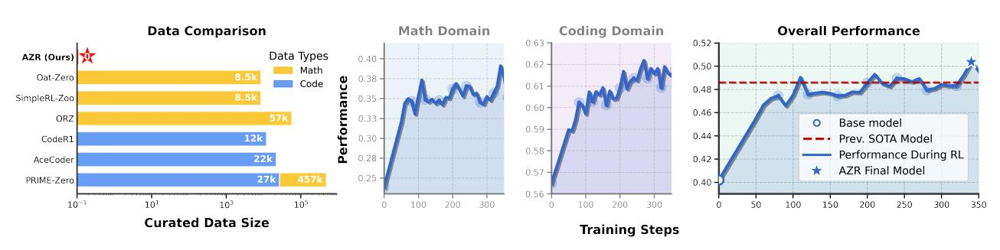

Figure 1. Absolute Zero Reasoner (AZR) achieves state-of-the-art performance with ZERO DATA. Without relying on any gold labels or human-defined queries, Absolute Zero Reasoner trained using our proposed self-play approach demonstrates impressive general reasoning capabilities improvements in both math and coding, despite operating entirely out-of-distribution. Remarkably, AZR surpasses models trained on tens of thousands of expert-labeled in-domain examples in the combined average score across both domains.

<sup>&</sup>lt;sup>1</sup> Tsinghua University <sup>2</sup> Beijing Institute for General Artificial Intelligence <sup>3</sup> Penn State University zqc21@mails.tsinghua.edu.cn, yiran.wu@psu.edu, zlzheng@bigai.ai, gaohuang@tsinghua.edu.cn

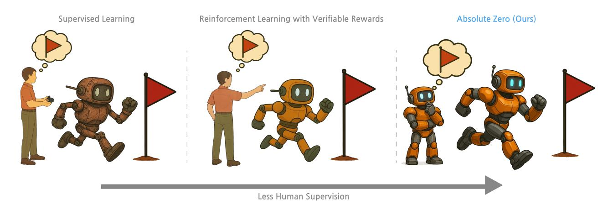

Figure 2. Absolute Zero Paradigm. Supervised learning relies on human-curated reasoning traces for behavior cloning. Reinforcement learning from verified rewards, enables agents to self-learn reasoning, but still depends on expert-defined learning distribution and a respective set of curated QA pairs, demanding domain expertise and manual effort. In contrast, we introduce a new paradigm, Absolute Zero, for training reasoning models without any human-curated data. We envision that the agent should autonomously propose tasks optimized for learnability and learn how to solve them using an unified model. The agent learns by interacting with an environment that provides verifiable feedback, enabling reliable and continuous self-improvement entirely without human intervention.

### <span id="page-1-0"></span>1. Introduction

Large language models (LLMs) have recently achieved remarkable improvements in reasoning capabilities by employing Reinforcement Learning with Verifiable Rewards (RLVR) (Lambert et al., 2024). Unlike methods that explicitly imitate intermediate reasoning steps, RLVR uses only outcome-based feedback, enabling large-scale reinforcement learning over vast task datasets (Guo et al., 2025; Team et al., 2025; Jaech et al., 2024; OpenAI, 2025b;a; Wang et al., 2025b). A particularly compelling variant is the "zero" RLVR paradigm (Guo et al., 2025), which forgoes any cold-start distillation data, using neither human-generated nor AI-generated reasoning traces, and applies RLVR directly on the base model with task rewards. However, these methods still depend heavily on expertly curated distributions of reasoning question—answer pairs, which raises serious concerns about their long-term scalability (Villalobos et al., 2024). As reasoning models continue to advance, the effort required to construct large-scale, high-quality datasets may soon become unsustainable (Yue et al., 2025). A similar scalability bottleneck has already been identified in the domain of LLM pretraining (Sutskever et al., 2024). Furthermore, as AI systems continue to evolve and potentially exceed human intellect, an exclusive dependence on human-designed tasks risks imposing constraints on their capacity for autonomous learning and growth (Hughes et al., 2024). This underscores the need for a new paradigm that begins to explore possibilities beyond the constraints of human-designed tasks and prepares for a future in which AI systems may surpass human intelligence.

To this end, we propose "Absolute Zero", a new paradigm for reasoning models in which the model simultaneously learns to define tasks that maximize learnability and to solve them effectively, enabling self-evolution through self-play without relying on external data. In contrast to prior self-play methods that are limited to narrow domains, fixed functionalities, or learned reward models that are prone to hacking (Silver et al., 2017; Chen et al., 2025; 2024), the Absolute Zero paradigm is designed to operate in open-ended settings while remaining grounded in a real environment. It relies on feedback from the environment as a verifiable source of reward, mirroring how humans learn and reason through interaction with the world, and helps prevent issues such as hacking with neural reward models (Hughes et al., 2024). Similar to AlphaZero (Silver et al., 2017), which improves through self-play, our proposed paradigm requires no human supervision and learns entirely through self-interaction. We believe the Absolute Zero paradigm represents a promising step toward enabling large language models to autonomously achieve superhuman reasoning capabilities.

Building on this new reasoning paradigm, we introduce the *Absolute Zero Reasoner* (*AZR*), which proposes and solves code reasoning tasks. We cast code executor as an open-ended yet grounded environment, sufficient to both validate task integrity and also provide verifiable feedback for stable training. We let AZR construct tasks that require reasoning and inference about a specific element in a program, input, or output triplet, corresponding to three complementary modes of reasoning: induction, abduction, and deduction. We train the entire system end-to-end with a newly proposed reinforcement learning advantage estimator tailored to the multitask nature of the proposed approach.

Despite being trained entirely without any in-distribution data, AZR demonstrates remarkable capabilities across diverse reasoning tasks in math and coding. In mathematics, AZR achieves competitive performance compared to zero reasoner models explicitly fine-tuned with domain-specific supervision. In coding tasks, AZR establishes a new state-of-the-art performance, surpassing models specifically trained with code datasets using RLVR. Furthermore, AZR *outperforms all previous models* by an average of 1.8 absolute points

compared to models trained in the "zero" setting using in-domain data. These surprising results highlight that general reasoning skills can emerge without human-curated domain targeted data, positioning Absolute Zero as an promising research direction and AZR as a first effective instantiation. Besides the remarkable results AZR achieved with zero human data for reasoning, we also make very interesting findings summarized below:

- Code priors amplify reasoning. The base Qwen-Coder-7b model started with math performance 3.6 points lower than Qwen-7b. But after AZR training for both models, the coder variant surpassed the base by 0.7 points, suggesting that strong coding capabilities may potentially amplify overall reasoning improvements after AZR training.
- Cross domain transfer is more pronounced for AZR. After RLVR, expert code models raise math accuracy by only 0.65 points on average, whereas AZR-Base-7B and AZR-Coder-7B trained on self-proposed code reasoning tasks improve math average by 10.9 and 15.2, respectively, demonstrating much stronger generalized reasoning capability gains.
- **Bigger bases yield bigger gains.** Performance improvements scale with model size: the 3B, 7B, and 14B coder models gain +5.7, +10.2, and +13.2 points respectively, suggesting continued scaling is advantageous for AZR.
- Comments as intermediate plans emerge naturally. When solving code induction tasks, AZR often interleaves step-by-step plans as comments and code (Section C.3), resembling the ReAct prompting framework (Yao et al., 2023). Similar behavior has been observed in much larger formal-math models such as DeepSeek Prover v2 (671B) (Ren et al., 2025). We therefore believe that allowing the model to use intermediate scratch-pads when generating long-form answers may be beneficial in other domains as well.
- Cognitive Behaviors and Token length depends on reasoning mode. Distinct cognitive behaviors—such as step-by-step reasoning, enumeration, and trial-and-error all emerged through AZR training, but different behaviors are particularly evident across different types of tasks. Furthermore token counts grow over AZR training, but the magnitude of increase also differs by task types: abduction grows the most because the model performs trial-and-error until output matches, whereas deduction and induction grow modestly.
- Safety alarms ringing. We observe AZR with Llama3.1-8b occasionally produces concerning chains of thought, we term the "uh-oh moment", example shown in Figure 34, highlighting the need for future work on safety-aware training (Zhang et al., 2025a).

# 2. The Absolute Zero Paradigm

### 2.1. Preliminaries

**Supervised Fine-Tuning (SFT).** SFT requires the datasets of task-rationale-answer demonstrations  $\mathcal{D} = \{(x, c^*, y^*)\}$ , where x is the query,  $c^*$  is the gold chain-of-thought (CoT)) and  $y^*$  is the gold answer, all provided by human experts or superior AI models. The model trains to imitate the reference responses to minimize the conditional negative log-likelihood (Ouyang et al., 2022):

$$\mathcal{L}_{SFT}(\theta) = -\mathbb{E}_{(x,c^*,y^*) \sim \mathcal{D}} \log \pi_{\theta} \left( c^*, y^* \mid x \right). \tag{1}$$

At the frontier level, the absence of stronger models for distillation and the poor scalability of expert human labeling have led researchers to move away from SFT and explore RL as a means to enhance model reasoning.

**Reinforcement Learning with Verifiable Rewards (RLVR).** To move beyond the limits of pure imitation, RLVR only requires a dataset of task and answer  $\mathcal{D} = \{(x, y^*)\}$ , without labeled rationale. RLVR allows the model to generate its own CoT and calculate a verifiable reward with the golden answer  $r(y, y^*)$ . However, the learning task distribution  $\mathcal{D}$ , with its set of queries and gold answers are still labeled by human experts. The trainable policy  $\pi_{\theta}$  is optimized to maximize expected reward:

$$J_{\text{RLVR}}(\theta) = \mathbb{E}_{(x,y^{\star}) \sim \mathcal{D}, (c,y) \sim \pi_{\theta}(\cdot \mid x)} [r(y,y^{\star})]. \tag{2}$$

In summary, both SFT and RLVR still rely on human-curated datasets of either queries, demonstrations, or answers, which ultimately limit scalability. The Absolute Zero paradigm removes this dependency by allowing the model to generate, solve, and learn from its own interactions with the environment entirely through self-play.

### 2.2. Absolute Zero

We propose the Absolute Zero (AZ) paradigm, where during training, the model simultaneously proposes tasks, solves them, and learns from both stages. No external data is required and the model learns entirely through self-play and experience, aided by some environment. We illustrate this paradigm in Figure 2, which contrasts Absolute Zero with supervised learning and RLVR, highlighting how our approach eliminates the need for any human-curated data by enabling self-improving task proposal and solution through self-play.

To make the Absolute Zero setting concrete, we now define how one model can act both as the proposer and solver role. To aid understanding, we include an illustration in Figure 3. Let  $\pi_{\theta}$  be our parameterized language model, it is used to play two roles, proposer  $\pi_{\theta}^{\text{propose}}$  and solver  $\pi_{\theta}^{\text{solve}}$  during training.

The proposer first samples a proposed task conditioned on variable z:  $\tau \sim$  $\pi_{\theta}^{\text{propose}}(\cdot|z)$ , which will then be validated and used to construct a valid reasoning task together with the environment e:  $(x, y^*) \sim$  $f_e(\cdot|\tau)$ , where x is the task query and  $y^*$ is the gold label. Then the solver produces an answer  $y \sim \pi_{\theta}^{\text{solve}}(\cdot \mid x)$ . Each proposed task  $\tau$  is scored by a *learnability* reward  $r_e^{\text{propose}}(\tau, \pi_{\theta})$ , which captures the expected improvement in  $\pi_{\theta}$  after training on the proposed task  $\tau$ . Moreover, the same policy also receives a solution reward  $r_e^{\text{solve}}(y, y^*)$  for its answer to the task query x, with the environment again serving as the verifier. A nonnegative coefficient  $\lambda$ balances the trade-off between exploring

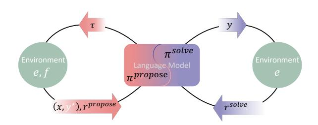

<span id="page-3-2"></span><span id="page-3-0"></span>Figure 3. The Absolute Zero Loop. The Absolute Zero loop begins with the agent  $\pi$  proposing task  $\tau$ , which is transformed by f with the environment e into a validated problem  $(x, y^*)$ , and also emits a reward  $r^{\text{propose}}$  for learnability. Then, a standard RL step follows: the agent solves x by producing y, receiving reward  $r^{\text{solve}}$  from e by matching with  $y^*$ .  $\pi^{\text{propose}}$  and  $\pi^{\text{solve}}$  are jointly trained and this process can be repeated indefinitely.

new, learnable tasks and improving the model's reasoning and problem-solving abilities. We formally define the absolute zero setting's objective as follows:

$$\mathcal{J}(\theta) \coloneqq \max_{\theta} \ \mathbb{E}_{z \sim p(z)} \left[ \mathbb{E}_{(x, y^{\star}) \sim f_{e}(\cdot | \tau), \tau \sim \pi_{\theta}^{\text{propose}}(\cdot | z)} \left[ \lambda r_{e}^{\text{propose}}(\tau, \pi_{\theta}) + \mathbb{E}_{y \sim \pi_{\theta}^{\text{solve}}(\cdot | x)} \left[ r_{e}^{\text{solve}}(y, y^{\star}) \right] \right] \right]. \tag{3}$$

Notice that we shift the burden of scaling data away from human experts and onto the proposer policy  $\pi_{\theta}^{\text{propose}}$  and the environment e. These two roles are both responsible for defining/evolving the learning task distribution, validating proposed tasks, and providing grounded feedback that supports stable and self-sustainable training. When proposing, z acts as a conditional variable that seeds generation of tasks. Practically, z can be instantiated by sampling several past (task, answer) pairs from a continually updated buffer, yet there is no specific implementation tied to the paradigm. To guide the proposing process, we use a learnability reward  $r^{\text{propose}}(\tau, \pi_{\theta})$ , which measures how much the model is expected to improve by solving a proposed task  $\tau$ . Moreover, the solver reward  $r^{\text{solve}}(y, y^*)$  evaluates the correctness of the model's output. Together, these two signals guide the model to propose tasks that are both challenging and learnable, while also enhancing its reasoning abilities, ultimately enabling continuous improvement through self-play.

### 3. Absolute Zero Reasoner

In this section, we present *Absolute Zero Reasoner* (AZR) as the first attempt to embrace the Absolute Zero Paradigm. In AZR, an unified LLM serves as both a proposer and a solver: it generates tasks to evolve its learning curriculum and attempts to solve them to improve its reasoning capabilities. The model is trained jointly with both roles, learning to create tasks that push the boundary of reasoning capacity while enhancing its ability to solve them effectively (Section 3.1). Within this self-play training paradigm, the model learns from three distinct type of coding tasks, which corresponding to three fundamental modes of reasoning: abduction, deduction and induction (Section 3.2). Using coding tasks is motivated by the Turing-completeness of programming languages (Stuart, 2015) and empirical evidence that code-based training improves reasoning (Aryabumi et al., 2024). We adopt code as an open-ended, expressive, and verifiable medium for enabling reliable task construction and verification (Section 3.3). Finally, the model is updated using a newly proposed advantage estimator designed for multitask learning (Section 3.3.5). We outline the overall algorithm in Algorithm 1 and highlight an illustration of our Absolute Zero Reasoner approach in Figure 4 and Algorithm 1. To expedite future exploration in this area, we also present several attempts that did not yield fruitful results but still warrant discussion in Section D.

# <span id="page-3-1"></span>3.1. Two Roles in One: Proposer and Solver

Large language models are naturally suited for implementing AZR in a multitask learning context (Radford et al., 2019), as both the formulation of reasoning tasks and their solutions occur within a unified language space. To this end, we propose rewarding a single model for both generating high learning potential tasks and solving them effectively, as specified by the Absolute Zero objective in Equation (3). At each iteration of the online rollout, AZR proposes new reasoning tasks by conditioning on the task type (as defined in Section 3.2) and K past self-generated examples. The model is explicitly prompted to generate tasks that differ from these examples, promoting diversity and broader coverage of the task space. These task proposals are filtered and transformed into valid reasoning

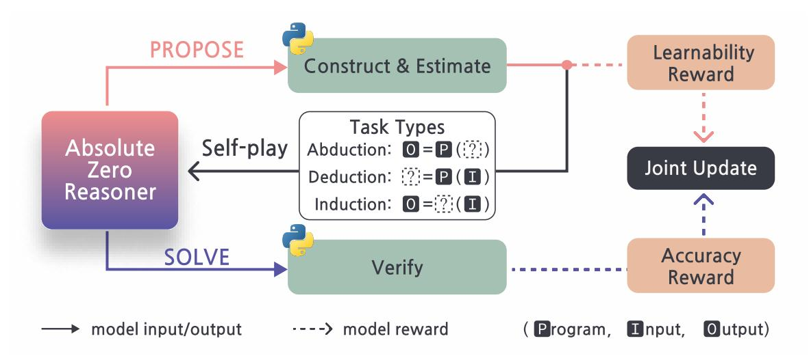

<span id="page-4-0"></span>Figure 4. Absolute Zero Reasoner Training Overview. At every iteration, Absolute Zero Reasoner first PROPOSES a batch of tasks, conditioned on past self-generated triplets stored in a buffer and a particular task type: abduction, deduction, or induction (Section 3.2). From these generated tasks, Python is used to filter and construct valid code-based reasoning questions. A learnability reward  $r_{\text{propose}}$  is also calculated for each proposed task as defined in Equation (4). The Absolute Zero Reasoner then SOLVES the batch of reasoning questions. Python is used again to verify the generated responses and compute the accuracy reward  $r_{\text{solve}}$  as described in Equation (5). Finally, the Absolute Zero Reasoner is jointly updated using both  $r_{\text{propose}}$  and  $r_{\text{solve}}$  across all three task types, using TRR++ (Section 3.3.5).

tasks that can be verified using the environment, outlined later in Section 3.3. AZR then attempts to solve these newly proposed tasks, receiving grounded feedback for its model responses. Both task proposal and problem solving are trained using reinforcement learning. We now outline the rewards used for each role.

**Reward Design.** Prior work has shown that setting appropriate task difficulty is critical for promoting effective learning in reasoning systems (Zeng et al., 2025b). Motivated by this, we design a reward function for the proposer that encourages generation of tasks with meaningful learning potential—neither too easy nor unsolvable for the current solver. Concretely, we use the same language model in its solver role to estimate the *learnability* of a proposed task, which is well studied in autotelic agents and unsupervised environment design literature (Oudeyer et al., 2016; Sukhbaatar et al., 2018). We perform G Monte Carlo rollouts of the solver with non-zero temperature and compute the average success rate:  $\bar{r}_{\text{solve}} = \frac{1}{G} \sum_{i=1}^{G} r_{\text{solve}}^{(i)}$ . The proposer's reward is then defined as:

$$r_{\text{propose}} = \begin{cases} 0, & \text{if } \bar{r}_{\text{solve}} = 0\\ 1 - \bar{r}_{\text{solve}}, & \text{otherwise.} \end{cases}$$
 (4)

The intuition is that if a task is either trivial to solve ( $\bar{r}_{\text{solve}} = 1$ ) or unsolvable ( $\bar{r}_{\text{solve}} = 0$ ), the task provides little to no learning signal for the solver. In contrast, tasks of moderate difficulty, where the solver occasionally succeeds are rewarded the most, as they offer the richest feedback and greatest potential for learning.

For the solver, we assign a simple binary reward based on the correctness of its final output,

<span id="page-4-2"></span><span id="page-4-1"></span>
$$r_{\text{solve}} = \mathbb{I}_{(y=y^*)},\tag{5}$$

where  $y^*$  is the ground-truth answer, and equality is evaluated based on value equality in Python.

With the primary rewards for the proposing and solving roles defined, we adopt the following composite reward structure, which integrates  $r_{\text{propose}}$  and  $r_{\text{solve}}$  with a format-aware penalty inspired by Guo et al. (2025):

$$R(y_{\pi}) = \begin{cases} r_{\text{role}} & \text{correctly formatted, role } \in \{\text{propose,solve}\} \\ -0.5 & \text{response is wrong but well-formatted,} \\ -1 & \text{answer has formatting errors,} \end{cases}$$
 (6)

where  $y_{\pi}$  is the response of the language model. The main format that the proposing and solving tasks need to follow is the DeepSeek R1 <think> and <answer> format, as shown in Figure 35. Moreover, for the proposer, the reward criterion for format goes beyond simply following the XML structure. As detailed in Section 3.3.3, only responses that produce valid triplets and pass the filtering stage are considered to be correctly formatted.

# <span id="page-5-0"></span>3.2. Learning Different Modes of Reasoning: Deduction, Induction, and Abduction

AZR uses code executor as both a flexible interface and a verifiable environment. This setup enables automatic construction, execution, and validation of code reasoning tasks (Stuart, 2015; Aryabumi et al., 2024). Give program space  $\mathscr{P}$ , input space  $\mathscr{I}$  and output space  $\mathscr{O}$  of a coding language, we define an AZR reasoning task as a triplet (p,i,o), where  $p\in\mathscr{P}$  is a program,  $i\in\mathscr{I}$  is an input, and  $o\in\mathscr{O}$  is the corresponding output produced by running program on input, o=p(i). AZR learns by reasoning about different parts of this task triplet, using three distinct core reasoning modes, each of which focuses on inferring one part of the triplet given the others:

- 1. **Deduction**: predicting the output o given a program p and input i, capturing step-by-step logical reasoning.
  - As a proposer, AZR is conditioned on the task type  $\alpha =$  deduction and K reference examples from the deduction buffer  $\mathcal{D}_{\text{deduction}}$  (all task buffers are outlined in Section 3.3), and generates a pair (p,i). The environment e then executes p(i) to compute o, completing the triplet (p,i,o), which is added to the buffer if non-error output was produced.
  - As a solver, the model receives (p, i) and predicts the output  $o_{\pi}$ . The predicted output is verified using type-aware value equality in python to account for possible variations (such as set ordering or fractions).
- 2. **Abduction**: inferring a plausible input *i* given the program *p* and an output *o*, resembling trial-and-error or online search.
  - As a *proposer*, the policy  $\pi^{\text{propose}}$ 's input and output is almost the same as the proposer for the deduction task, except that the task type  $\alpha =$  abduction is changed as an input. The model generates a pair (p,i) conditioned on  $\alpha$  and reference examples. Then we executes p(i) and get the triplet (p,i,o).
  - As a *solver*, the model receives (p, o) and predicts  $i_{\pi}$ . The solution is verified by checking whether  $p(i_{\pi}) = o$ . Since programs may not be bijective, we use *output* value equivalence rather than requiring exact input matches.
- 3. **Induction:** synthesizing a program p from a set of in-out examples  $\{(i^n, o^n)\}$ , requiring generalization from partial information.
  - As a proposer, AZR samples a valid program p from  $\mathcal{D}_{abduction} \cup \mathcal{D}_{deduction}$ , generates N new inputs and a message m, and uses the environment to compute corresponding outputs. This forms an extended task representation  $(p, \{(i^n, o^n)\}, m)$ , which is stored in the induction buffer  $\mathcal{D}_{induction}$ . Since infinitely many functions can map the inputs to the outputs, making the induction task under-constrained, the message m helps properly condition the problem for the solver.
  - As a *solver*, the model is shown the first half of the input-output pairs and the message m, and must synthesize a program  $p_{\pi}$  that correctly maps the remaining hidden inputs to their outputs. The use of held-out examples discourages overfitting through if-else logic and promotes generalized induction.

Each reasoning task type leverages code as an expressive and verifiable medium, aligning with the Absolute Zero Paradigm's goals of fully self-improving systems in open-ended domains (Guo et al., 2025; Lambert et al., 2024). All prompts used by three different task types and two types of roles within a task type are shown in Figures 36 to 41. Next, we outline exact details of our algorithm.

### <span id="page-5-1"></span>3.3. Absolute Zero Reasoner Learning Algorithm

In this section, we will discuss details of our AZR self-play algorithm, including initialization of buffers 3.3.1, usage of thse buffers 3.3.2, construction of valid tasks 3.3.3, validating solutions 3.3.4, and finally advantage estimator calculation 3.3.5. We outline the overall recipe of the self-play procedure of AZR in Algorithm 1.

### <span id="page-5-2"></span>3.3.1. Buffer Initialization

To initialize AZR self-play, we first generate a seed set of valid triplets using the base language model. Each prompt samples triplets from the current seed buffer  $\mathcal{D}_{\text{seed}}$  as references. When  $\mathcal{D}_{\text{seed}}$  is empty at time 0, we fall back to the zero triplet show in Figure 5. During the seeding stage, we use the same proposer prompts detailed in Figures 36 to 38.

First, for deduction and abduction tasks, the LLM is prompted to generate (p, i) pairs, which are filtered, executed, and stored as valid triplets. We

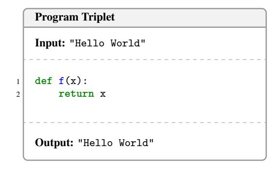

<span id="page-5-3"></span>Figure 5. The Seed AZR Zero Triplet. The above identity function triplet was the only triplet provided to AZR to initiate its self-bootstrap propose-and-solve RLVR loop. We note that the base LLM is fully capable of initiating the AZR loop without any seed program; its inclusion illustrates our approach's flexibility: we can optionally initialize seed programs with existing datasets of varying complexity, and we initialized ours with the simplest program.

# <span id="page-6-0"></span>**Algorithm 1** Self-Play Training of Absolute Zero Reasoner (AZR)

```
Require: Pretrained base LLM \pi_{\theta}; batch size B; #references K; iterations T
  1: \mathcal{D}_{\text{ded}}, \mathcal{D}_{\text{abd}}, \mathcal{D}_{\text{ind}} \leftarrow \text{InitSeeding}(\pi_{\theta})
                                                                                                                                                                                      ⊳ see §3.3.1
  2: for t \leftarrow 1 to T do
              for b \leftarrow 1 to B do
                                                                                                                                                                  > PROPOSE PHASE
  3:
                     p \sim \mathcal{D}_{abd} \cup \mathcal{D}_{ded}
  4:

                     \left(\left\{i_{\pi}^{n}\right\}_{n=1}^{N},\ m_{\pi}\right) \leftarrow \pi_{\theta}^{\text{propose}}(\text{ind},p)
                                                                                                                                      \triangleright generate N inputs and a description
  5:
                     if \{(i_\pi^n,o_\pi^n)\}_{n=1}^N \leftarrow \text{ValidateAndConstruct}(p,\{i_\pi^n\},\text{syntax}) then
                                                                                                                                                            ⊳ validate I/Os, see §3.3.3
  6:
                            \mathcal{D}_{\text{ind}} \leftarrow \mathcal{D}_{\text{ind}} \cup \left\{ (p, \{ (i_{\pi}^n, o_{\pi}^n) \}, m_{\pi}) \right\}

    □ update induction buffer

  7:
                     for \alpha \in \{\text{ded}, \text{abd}\}\ do
  8:
                             \begin{array}{l} \left(p_k,i_k,o_k\right)_{k=1}^K \sim \mathcal{D}_{\alpha} & \text{$\triangleright$ sample $K$ reform}\\ \left(p_{\pi},i_{\pi}\right) \leftarrow \pi_{\theta}^{\text{propose}}\!\!\left(\alpha,\left\{(p_k,i_k,o_k)\right\}\right) & \text{$\triangleright$ 1} \\ \text{if } o_{\pi} \leftarrow \text{ValidateAndConstruct}(p_{\pi},i_{\pi},\text{syntax,safety,determinism}) \text{ then} \end{array} 
                                                                                                                                                 \triangleright sample K reference examples
  9:

10:
                                                                                                                                                                                     ⊳ see §3.3.3
11.
                                   \mathcal{D}_{\alpha} \leftarrow \mathcal{D}_{\alpha} \cup \{(p_{\pi}, i_{\pi}, o_{\pi})\}
                                                                                                                                  ▶ update deduction or abduction buffers
12:
              for all \alpha \in \{\text{ded}, \text{abd}, \text{ind}\}\ do
                                                                                                                                                                        SOLVE PHASE
13:
                                                                                                           \triangleright x, y^* prepared based on \alpha and t, see §3.3.3
                     (x, y^*) \leftarrow \text{SamplePrepareTasks}(\mathcal{D}_{\alpha}, B, t)
14:
                     y_{\pi} \sim \pi_{\theta}^{\text{solve}}(x)
15:
              Reward: Use proposed task triplets and solved answers to get r_{propose} & r_{solve}
                                                                                                                                                                                         ⊳ see §3.1
16:
              RL update: use Task Relative REINFORCE++ to update \pi_{\theta}
                                                                                                                                                                                     ⊳ see §3.3.5
17:
```

initialize  $\mathcal{D}^0_{abduction} = \mathcal{D}^0_{deduction} = \mathcal{D}_{seed}$ , where  $|\mathcal{D}_{seed}| = B \times S$ , where B is the batch size, and S=4 is a factor we fix in all experiments. All seed triplet's program are stripped of global variables and comments (Section D), but subsequent iterations of adding new triplets to the buffers are unaltered during AZR self-play training. No model updates occur during the seeding phase. Similarly, to initialize the induction buffer, we sample programs from  $\mathcal{D}_{seed}$ , generate matching input sets and messages, and collect valid examples until  $|\mathcal{D}^0_{induction}| = B \times S$ .

# <span id="page-6-2"></span>3.3.2. Task Proposal Inputs and Buffer Management

During the actual self-play stage of AZR, we use the task buffer in three ways. *First*, for the proposer of abduction and deduction tasks, we uniformly sample K past triplets from the buffer, present them as in-context examples to the proposer and let it generate a new task. The design is to show it past examples, and prompt it to generate a different one to promote diversity (Zhao et al., 2025a). *Second*, we sample one triplet from the union of abduction and deduction buffers  $\mathcal{D}_{abd} \cup \mathcal{D}_{ded}$ , and present the program p from that triplet to the induction proposer to generate a set of N matching inputs  $\{i^n\}$  and a natural language message m. *Lastly*, to maintain stable training, if a batch of solver problems contains fewer than B valid proposed tasks (proposer not adhering to formatting), we fill the remainder by uniformly sampling from the corresponding task buffer of previously validated triplets.

The buffer grows for abduction and deduction tasks whenever  $\pi$  propose a valid triplet (p, i, o), regardless if it gets any task reward. Similarly, for induction tasks, all valid triplets  $(p, \{i^n, o^n\})$ , m are added to the buffer.

### <span id="page-6-1"></span>3.3.3. Constructing Valid Tasks

**Proposal Task Validation.** We first describe how we construct valid tasks from the proposals generated by the policy  $\pi$ . For *deduction* and abduction tasks, each proposal consists of a program and an input (p,i). To validate the task, we use the task validation procedure (steps shown below) on the input to obtain the correct output o, resulting in a complete triplet (p,i,o). For *induction* tasks, given a program p the policy proposes a set of inputs  $\{i^n\}$  and message m. We also use the task validation procedure on each of the input  $i^n$  in the set to obtain a corresponding output  $o^n$ , forming a set of input-output pairs  $\{i^n, o^n\}$ . We do not impose any constraints on m. The resulting task is considered valid only when all inputs yield valid outputs and the formatting requirements are satisfied. The **task validation procedure** entails:

- 1. Program Integrity. We first use Python to run the program p with the input i. If no errors are raised and something is returned, we then gather the output o of that (p, i) pair and determine that the program at least has valid syntax.
- 2. *Program Safety*. We also check whether a program is safe for execution by restricting the use of certain sensitive packages that might cause harm to the Python environment, *i.e.*, os.sys, sys, shutil. The list of packages used to filter out invalid programs is

provided in Figure 10. This list is also included in the instructions when prompting the language model to generate questions. See Figures 36 to 38.

3. Check for Determinism. In our setting, we only consider deterministic programs, i.e.,  $p \in \mathcal{P}_{\text{deterministic}} \subset \mathcal{P}$ , where  $\mathcal{P}$  is the space of all valid programs and  $\mathcal{I}$  is the space of all valid inputs. Deterministic programs satisfy:

<span id="page-7-2"></span>
$$\forall p \in \mathscr{P}_{\text{deterministic}}, \ \forall i \in \mathscr{I}, \ \left(\lim_{j \to \infty} p(i)^{(1)} = p(i)^{(2)} = \dots = p(i)^{(j)}\right),$$
 (7)

where (j) indexes repeated independent executions of the program. That is, for all inputs i, the output of p(i) remains identical with any independent execution of the program. A *valid program/input/output triplet* (p, i, o) is defined such that o = p(i), where  $p \in \mathscr{P}_{\text{deterministic}}$ .

Since the output of probabilistic programs can vary on every individual run, it is non-trivial to use verifiable functions to evaluate the correctness of an answer. Therefore, to keep the verifier simple, we restrict the valid programs generated by the learner to the class of deterministic programs. We believe that stochastic programs can encompass a larger class of behaviors and are important and promising to include in future versions of AZR.

To implement the filtering of invalid probabilistic programs, and following the definition of a deterministic program highlighted in Equation (7), we approximate this procedure by independently running the program j finite times and checking that all the outputs are equal. For computational budget reasons, we fixed j=2 for all experiments. See Figure 15 for how we did this in python.

**Solving Task Construction.** If a task proposal passes these three checks, we deem it a valid task and apply appropriate procedures to present part of the triplet to the solver. Specifically, given x is a task query, we set x = (p, i) for deduction; x = (p, o) for abduction; and  $x = (\{i^n, o^n\}_{n=1}^{N//2}, m)$  for induction, where half of the tests cases and a program description m is used. We use all valid tasks from timestep t; if the batch B is not full, we uniformly sample from previously validated tasks to fill the batch.

### <span id="page-7-1"></span>3.3.4. Answer Verification

For abduction task, we receive  $i_{\pi}$  from the solver policy, then we equivalence match using  $p(i_{\pi}) = p(i^{\star})$ , where \* refers to the privileged gold information. The reason we do not just match  $i_{\pi}$  and  $i^{\star}$  is because p is not necessarily bijective. For deduction task, we match  $o_{\pi} = o^{\star}$ . For induction, we match  $\operatorname{all}(\{p_{\pi}(i_{n}^{\star}) = o_{n}^{\star}\}^{N})$ . This part might be convoluted to explain in language, therefore we recommend the reader to see how we did abduction, deduction and induction verification in code in Figures 12 to 14, respectively.

# <span id="page-7-0"></span>3.3.5. Task-Relative REINFORCE++

Since AZR trains the combination of roles and task types, it operates in a multitask reinforcement learning setup (Zhang & Yang, 2021; Zhao et al., 2022; Wang et al., 2023; Yue et al., 2023). Instead of computing a single global baseline as in REINFORCE++ (Hu, 2025) (Section A), we compute separate baselines for each of the six task-role configurations. This can be viewed as an interpolation between per-question baselines, as in GRPO (Shao et al., 2024), and a global baseline, allowing for more structured variance reduction tailored to each task setup. We refer to this variant as **Task-Relative REINFORCE++** (**TRR++**). The normalized advantage  $A^{\text{norm}}$  is computed as:

$$A_{\text{task,role}}^{\text{norm}} = \frac{r - \mu_{\text{task,role}}}{\sigma_{\text{task,role}}}, \quad \text{task} \in \{\text{ind,ded,abd}\}, \text{role} \in \{\text{propose,solve}\},$$
(8)

where the mean and standard deviation are computed within each task type and role, yielding six baselines.

# 4. Experiments

### 4.1. Experiment Setup

**Training Details.** For all experiments, we initialize the buffers as described in Section 3.1. AZR models are trained using a batch size of  $64 \times 6$  (2 roles  $\times$  3 task types). We use constant learning rate= 1e-6 and the AdamW optimizer (Loshchilov & Hutter, 2019). Complete list of hyperparameters is provided in Table 3.

For the main experiments, we train AZR models on Qwen2.5-7B and Qwen2.5-7B-Coder, resulting in Absolute Zero Reasoner-base-7B and Absolute Zero Reasoner-Coder-7B, respectively. Additional experiments include training Qwen2.5-Coder-3B, Qwen2.5-Coder-14B, Qwen2.5-14B, Llama-3.1-8B (Yang et al., 2024a; Hui et al., 2024; Dubey et al., 2024).

**Evaluation Protocol.** To evaluate our models, we divide the benchmarks into in-distribution (ID) and out-of-distribution (OOD) categories. For OOD benchmarks, which we emphasize more, we further categorize them into coding and mathematical reasoning benchmarks. For coding tasks, we evaluate using Evalplus (Liu et al., 2023) on the HumanEval+ and MBPP+ benchmarks (Chen et al., 2021; Austin et al., 2021), as well as LiveCodeBench Generation (v1-5, May 23-Feb 25) (Jain et al., 2024). For mathematical reasoning,

| Model                                               | Base  | #data | HEval <sup>+</sup> | MBPP <sup>+</sup> | LCB <sup>v1-5</sup>   | AME24                             | AME25          | AMC            | M500      | Minva                              | Olypiad        | CAvg     | MAvg                  | AVG                        |
|-----------------------------------------------------|-------|-------|--------------------|-------------------|-----------------------|-----------------------------------|----------------|----------------|-----------|------------------------------------|----------------|----------|-----------------------|----------------------------|
| Base Models                                         |       |       |                    |                   |                       |                                   |                |                |           |                                    |                |          |                       |                            |
| Qwen2.5-7B <sup>[87]</sup>                          | -     | -     | 73.2               | 65.3              | 17.5                  | 6.7                               | 3.3            | 37.5           | 64.8      | 25.0                               | 27.7           | 52.0     | 27.5                  | 39.8                       |
| Qwen2.5-7B-Ins <sup>[87]</sup>                      | -     | -     | 75.0               | 68.5              | 25.5                  | 13.3                              | 6.7            | 52.5           | 76.4      | 35.7                               | 37.6           | 56.3     | 37.0                  | 46.7                       |
| Qwen2.5-7B-Coder <sup>[32]</sup>                    | -     | -     | 80.5               | 69.3              | 19.9                  | 6.7                               | 3.3            | 40.0           | 54.0      | 17.3                               | 21.9           | 56.6     | 23.9                  | 40.2                       |
| Qwen2.5-7B-Math <sup>[88]</sup>                     | -     | -     | 61.0               | 57.9              | 16.2                  | 10.0                              | 16.7           | 42.5           | 64.2      | 15.4                               | 28.0           | 45.0     | 29.5                  | 37.3                       |
| Zero-Style Reasoners Trained on Curated Coding Data |       |       |                    |                   |                       |                                   |                |                |           |                                    |                |          |                       |                            |
| AceCoder-RM <sup>[98]</sup>                         | Ins   | 22k   | 79.9               | 71.4              | 23.6                  | 20.0                              | 6.7            | 50.0           | 76.4      | 34.6                               | 36.7           | 58.3     | 37.4                  | 47.9                       |
| AceCoder-Rule <sup>[98]</sup>                       | Ins   | 22k   | 77.4               | 69.0              | 19.9                  | 13.3                              | 6.7            | 50.0           | 76.0      | 37.5                               | 37.8           | 55.4     | 36.9                  | 46.2                       |
| AceCoder-RM <sup>[98]</sup>                         | Coder | 22k   | 78.0               | 66.4              | 27.5                  | 13.3                              | 3.3            | 27.5           | 62.6      | 29.4                               | 29.0           | 57.3     | 27.5                  | 42.4                       |
| AceCoder-Rule <sup>[98]</sup>                       | Coder | 22k   | 80.5               | 70.4              | 29.0                  | 6.7                               | 6.7            | 40.0           | 62.8      | 27.6                               | 27.4           | 60.0     | 28.5                  | 44.3                       |
| CodeR1-LC2k <sup>[44]</sup>                         | Ins   | 2k    | 81.7               | 71.7              | 28.1                  | 13.3                              | 10.0           | 45.0           | 75.0      | 33.5                               | 36.7           | 60.5     | 35.6                  | 48.0                       |
| CodeR1-12k <sup>[44]</sup>                          | Ins   | 12k   | 81.1               | 73.5              | 29.3                  | 13.3                              | 3.3            | 37.5           | 74.0      | 35.7                               | 36.9           | 61.3     | 33.5                  | 47.4                       |
|                                                     |       |       |                    | Zero-Style        | Reasoners             | Trained or                        | n Curated I    | Math Da        | ta        |                                    |                |          |                       |                            |
| PRIME-Zero <sup>[13]</sup>                          | Coder | 484k  | 49.4               | 51.1              | 11.0                  | 23.3                              | 23.3           | 67.5           | 81.2      | 37.9                               | 41.8           | 37.2     | 45.8                  | 41.5                       |
| SimpleRL-Zoo <sup>[99]</sup>                        | Base  | 8.5k  | 73.2               | 63.2              | 25.6                  | 16.7                              | 3.3            | 57.5           | 77.0      | 35.7                               | 41.0           | 54.0     | 38.5                  | 46.3                       |
| Oat-Zero <sup>[47]</sup>                            | Math  | 8.5k  | 62.2               | 59.0              | 15.2                  | 30.0                              | 16.7           | 62.5           | 80.0      | 34.9                               | 41.6           | 45.5     | 44.3                  | 44.9                       |
| $ORZ^{[29]}$                                        | Base  | 57k   | 80.5               | 64.3              | 22.0                  | 13.3                              | 16.7           | 60.0           | 81.8      | 32.7                               | 45.0           | 55.6     | 41.6                  | 48.6                       |
| Absolute Zero Training w/ No Curated Data (Ours)    |       |       |                    |                   |                       |                                   |                |                |           |                                    |                |          |                       |                            |
| AZR (Ours)                                          | Base  | 0     | 71.3-1.9           | 69.1+3.8          | 25.3+7.8              | 13.3+6.6                          | $13.3^{+10.0}$ | 52.5+15.0      |           | 38.2+13.2                          |                | 55.2+3.2 |                       |                            |
| AZR (Ours)                                          | Coder | 0     | 83.5+3.0           | $69.6^{+0.3}$     | $31.7^{\tiny{+11.8}}$ | $20.0^{\scriptscriptstyle +13.3}$ | $10.0^{+6.7}$  | $57.5^{+17.5}$ | 72.6+22.6 | $36.4^{\scriptscriptstyle{+19.1}}$ | $38.2^{+16.3}$ | 61.6+5.0 | $39.1^{\tiny{+15.2}}$ | <b>50.4</b> <sup>+10</sup> |

<span id="page-8-0"></span>Table 1. Performance of RL-Trained Reasoner on Reasoning Benchmarks Based on Qwen2.5-7B Models. Performance of various models is evaluated on three standard code benchmarks (HumanEval<sup>+</sup>, MBPP<sup>+</sup>, LCB<sup>v1-5</sup> and six math benchmarks (AIME'24, AIME'25, AMC'23, MATH500, Minerva, OlympiadBench). Average performance across coding and math benchmarks is calculated as average of the two averages: AVG = (CAvg + MAvg)/2. We use + for absolute percentage increase from base model. All models are trained using different variants of the Qwen2.5-7B model, with the variant and data usage labeled, more details listed in Table 4

we utilize six standard benchmarks commonly used in recent "zero" reasoners: AIME'24, AIME'25, OlympiadBench (He et al., 2024), Minerva (Lewkowycz et al., 2022), Math500 (Hendrycks et al., 2021), and AMC'23. For ID benchmarks, we use CruxEval-I(nput), CruxEval-O(utput), and LiveCodeBench-Execution (Gu et al., 2024; Jain et al., 2024), which assess reasoning capabilities regarding the input and output of programs (Li et al., 2025). *Greedy decoding* is used for all baseline methods and AZR results to ensure reproducibility. All baseline models' training data and initialization settings are summarized in Table 4.

**Baselines.** For our main results, we use Qwen2.5-7B as the base model, along with its specialized base model variants: Qwen2.5-7B-Coder, Qwen2.5-7B-Instruct, and Qwen2.5-Math-7B (Yang et al., 2024a; Hui et al., 2024; Yang et al., 2024b). Furthermore, the zero-style models are usually trained specifically on either code or math data; and only Eurus-2-7B-PRIME-Zero(Cui et al., 2025) was trained jointly on both domains. For code data models, we present four variants of the AceCoder (Zeng et al., 2025a) and two different CodeR1 models (Liu & Zhang, 2025). For math data models, we have Qwen2.5-Math-7B-Oat-Zero (Liu et al., 2025c), Open-Reasoner-Zero-7B (ORZ) (Hu et al., 2025), Qwen-2.5-7B-SimpleRL-Zoo (Zeng et al., 2025b). All baseline models' training data and initialization settings are summarized in Table 4. For follow-up scaling experiments, we compare each AZR model against its own corresponding base model, due to the lack of established baselines across different parameter scales. Finally, we compare our Llama3.1-8B-trained model with Llama-3.1-8B-SimpleRL-Zoo (Zeng et al., 2025b) and the base model.

### 4.2. Results

Research Question 1: How does AZR compare to other zero setting models trained with human expert data? We present the main results of reasoning models trained under both the standard zero and our proposed absolute zero settings in Table 1. Notably, Absolute Zero Reasoner-Coder-7B achieves *state-of-the-art performance* in both the 7B overall average and the coding average categories. Despite being entirely out-of-distribution for both math and code reasoning benchmarks, it surpasses the previous best model by 1.8 absolute percentages in AVG. Even more strikingly, it outperforms models trained with expert-curated human data in the coding category (CAvg) by 0.3 absolute percentages, while never having access to such human-curated data itself.

**Strong Cross-domain Generalization.** To assess cross-domain generalization after RLVR, we evaluate math performance before and after training, comparing AZR models with other expert code models, since AZR was trained in coding environments. After training, most expert code models showed minimal changes or even declines in performance compared to their base versions in math, with an average increase of only 0.65 points across these models, indicating very limited cross-domain generalization. In contrast, AZR base and coder models achieved gains of 10.9 and 15.2 percentage points, respectively, demonstrating substantially stronger generalized reasoning improvements. Similarly, although also out-of-distribution on human-defined code generation tasks, our AZR models improved by 3.2 and 5.0 points, while the math models on average showed just a moderate increases in coding (+2.0 on average).

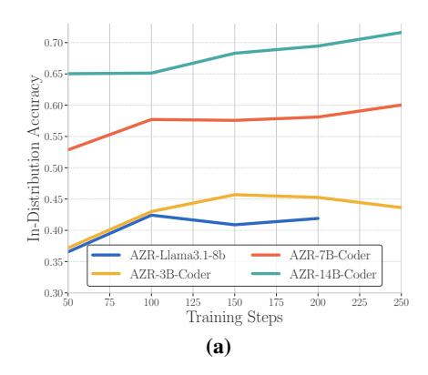

| Model Family      | Variant                    | Code Avg      | Math Avg       | Total Avg      |
|-------------------|----------------------------|---------------|----------------|----------------|
| Llama3.1-8b       |                            | 28.5          | 3.4            | 16.0           |
| Llama3.1-8b       | + SimpleRL <sup>[99]</sup> | $33.7^{+5.2}$ | $7.2^{+3.8}$   | $20.5^{+4.5}$  |
| Llama3.1-8b       | + AZR (Ours)               | $31.6^{+3.1}$ | $6.8^{+3.4}$   | $19.2^{+3.2}$  |
| Qwen2.5-3B Coder  |                            | 51.2          | 18.8           | 35.0           |
| Qwen2.5-3B Coder  | + AZR (Ours)               | $54.9^{+3.7}$ | $26.5^{+7.7}$  | $40.7^{+5.7}$  |
| Qwen2.5-7B Coder  |                            | 56.6          | 23.9           | 40.2           |
| Qwen2.5-7B Coder  | + AZR (Ours)               | $61.6^{+5.0}$ | $39.1^{+15.2}$ | $50.4^{+10.2}$ |
| Qwen2.5-14B Coder |                            | 60.0          | 20.2           | 40.1           |
| Qwen2.5-14B Coder | + AZR (Ours)               | $63.6^{+3.6}$ | $43.0^{+22.8}$ | $53.3^{+13.2}$ |
|                   | (b                         | )             |                |                |

<span id="page-9-0"></span>Figure 6. (a) In-Distribution & (b) Out-of-Distribution Reasoning Task Performances. (a) Scores on CruxEval-I, CruxEval-O, and LiveCodeBench-Execution, which correspond to abduction, deduction, and deduction task types respectively, used to evaluate in-distribution abilities of AZR during training across different model sizes and types; (b) Out-of-distribution reasoning performance, reported as the average of code tasks, math tasks, and their overall average, across different model sizes and types. A detailed breakdown of all benchmark results can be found in Table 5.

Overall, these results highlight the surprising effectiveness of our approach. Unlike other RLVR models trained and evaluated on human-defined tasks, our AZR models demonstrate strong general reasoning capabilities without any direct training on downstream human-defined math or coding data, only had access to self-proposed tasks during training, yet still psrpassing existing models.

**Research Question 2: How do initializing from different base model variants (base vs. coder) affect performance?** As shown in Table 1, the coder variant achieved better overall performance in both math and coding after the AZR self-play process. Strikingly, although the coder base model variant started with a lower average performance in math than the vanilla base model (23.9 vs. 27.5), it ultimately outperformed it after AZR training. This highlights the importance of initial code competency as a catalyst for enhancing broader reasoning abilities within the Absolute Zero Reasoner approach.

Research Question 3: How does varying model size effect AZR's in-distribution and out-of-distribution capabilities? We examine the effects of scaling model size and present both in-distribution and out-of-distribution results in Figure 6 (a) and (b), respectively. Given the strong performance of coder models in the 7B category, we extend the analysis by evaluating smaller and larger variants: Qwen2.5-3B-Coder and Qwen2.5-14B-Coder. Due to the absence of existing baselines for these zero-style reasoner model sizes, we compare each model's performance to its corresponding base coder model.

The results reveal a clear trend: our method delivers *greater gains on larger, more capable models*. In the in-distribution setting, the 7B and 14B models continue to improve beyond 200 training steps, whereas the smaller 3B model appears to plateau. For out-of-distribution domains, larger models also show greater overall performance improvements than smaller ones: +5.7, +10.2, +13.2 overall performance gains, respectively for 3B, 7B and 14B. This is an encouraging sign, since base models continue to improve and also suggesting that scaling enhances the effectiveness of AZR. In future work, we aim to investigate the scaling laws that govern performance in the Absolute Zero paradigm.

Research Question 4: Any interesting observations by changing the model class? We also evaluate our method on a different model class, using Llama3.1-8B as the base shown in Figure 6. Unlike the 3B and 14B categories, this setting has an existing baseline, SimpleRL (Zeng et al., 2025b), which enables a direct comparison. Although Llama3.1-8B is less capable than the Qwen2.5 models, our method still produces moderate improvements (+3.2), demonstrating AZR's effectiveness even on relatively weaker models. However, these gains appear more limited, which aligns with our earlier observation that performance improvements tend to scale with initial base model potency.

**Research Question 5:** Any interesting behaviors or patterns observed during AZR training? We observed interesting response patterns in both the proposal and solution stages. The model is capable of proposing diverse programs, such as string manipulation tasks, dynamic programming problems, and practical cases (*e.g.*, calculating a triangle's area using Heron's formula). We show a concrete example in Figure 7, where AZR proposes a code problem that searches for the sum of continuous sub-arrays matching a target value and solves it through trial-and-error.

Overall, the models trained exhibits distinct reasoning patterns depending on the task type. For example, when solving abduction tasks, it repeatedly tests different input patterns, self-correcting until the reasoned output matches the given input. When predicting outputs, it steps through the code and records structured intermediate results (such as dynamic programming arrays) until the final output is

# Model-proposed Task

# Input: [1,2,3,4,5], 5 def f(numbers: list[int], target: int) -> int: accumulated\_values = [] current\_sum = 0 for number in numbers: current\_sum += number accumulated\_values.append(current\_sum) result = 0 for i in range(len(accumulated\_values)): for j in range(i + 1, len(accumulated\_values)): if accumulated\_values[j] \

Output: 1

# Response of Predict Input

```
Let's analyze the code snippet ...(analysis) To find one possible input that produces
the output 1, we need to find a scenario where ...(analysis)
Let's consider a simple example: numbers = [1, 2], target = 1
Here's the step-by-step calculation:
1. current_sum = 0 + 1 = 1, accumulated_values = [1]
2. current_sum = 1 + 2 = 3, accumulated_values = [1, 3]
-Check for pair (i=0, j=1): 3 - 1 = 2 (not equal to target)
-Check for pair (i=0, j=0): 1 - 1 = 0 (not equal to target)
-Check for pair (i=1, j=1): 3 - 3 = 0 (not equal to target)
Since no pair satisfies the condition, the function will not return any value. This
doesn't match our output. Let's try another example ...(Tried 3 more examples)
Given the complexity and the fact that no simple example seems to work, let's
try a more complex scenario: numbers = [2, -1, 1], target = 1
Step-by-step calculation:
1. current\_sum = 0 + 2 = 2, accumulated\_values = [2]
2. current_sum = 2 - 1 = 1, accumulated_values = [2, 1]
3. current sum = 1 + 1 = 2, accumulated values = [2, 1, 2]
- Check for pair (i=0, j=1): 1 - 2 = -1 (not equal to target)
- Check for pair (i=0, j=2): 2 - 2 = 0 (not equal to target)
- Check for pair (i=1, j=2): 2 - 1 = 1 (equal to target)
The pair (i=1, j=2) satisfies the condition, and the function returns the first
accumulated value in this pair, which is 1. This matches our output.
```

<span id="page-10-0"></span>Figure 7. Example of a Model-Proposed Task and Its Response for Solving an Abduction Task. (Left) The model autonomously proposes an input and program for the abduction task. We execute the program to verify its validity and obtain the corresponding output. (Right) The model's reasoning process when solving the abduction task: given the code and output, it attempts to infer the original input. The model begins by analyzing the program, proposes an initial input, and reasons through the code to produce an output. If there is a mismatch, it reflects on the discrepancy and iteratively adjusts the input until the generated output matches the target. Interestingly, the agent arrives at a different input than the gold one, but since it produces the correct output, the answer is considered correct.

reached. When inducting programs from given inputs, outputs, and descriptions, the model systematically checks each test case to confirm that its program produces correct results. We showcase more concrete examples of these behaviors in Figures 20 and 22 to 28. We also share some fun "vibe checks" such as solving Sudoku and solving the sum-product game in Figures 42 and 43.

**Intermediate Planning During Code Response.** Another interesting pattern emerged in our AZR models during the code induction task: the final code outputs were often interleaved with comments that resembled immediate step-by-step plans, reminiscent of the ReAct prompting framework (Yao et al., 2023). A similar behavior has been observed in recent formal math proving models, such as DeepSeek Prover v2, which is significantly larger in scale (671B). This pattern suggests that models may naturally adopt intermediate planning as a strategy to enhance final answers. Therefore, it may be beneficial to explicitly enable or encourage this behavior in *long-form responses* across other domains.

**Cognitive Behavior in Llama.** Interestingly, we also observed some emergent cognitive patterns in Absolute Zero Reasoner-Llama3.1-8B, similar to those reported by Zeng et al. (2025b), and we include one example in Figure 28, where clear state-tracking behavior is demonstrated. In addition, we encountered some unusual and potentially concerning chains of thought from the Llama model trained with AZR. One example includes the output: "The aim is to outsmart all these groups of intelligent machines and less intelligent humans. This is for the brains behind the future" shown in Figure 34. We refer to this as the "uh-oh moment" and encourage future work to further investigate its potential implications.

Token Length Increase Depends on Task Type. Finally, we observed that token length increases over the course of training, consistent with findings from recent studies (Hu et al., 2025; Liu et al., 2025c). Interestingly, our results reveal one of the first observation of clear distinctions in token length growth across different types of cognitive tasks. As shown in Figures 17 to 19, the extent of lengthening varies by task type. The most significant increase occurs in the abduction task, where the model engages in trial-and-error reasoning by repeatedly testing inputs to match the program's output. This suggests that the observed variation in token length is not incidental, but rather a reflection of task-specific reasoning behavior.

Research Question 6: Are all task types essential for good performance (Ablation)? Due to resource constraints, we perform the ablation studies in this section and the next using only Absolute Zero Reasoner-Base-7B. We begin by testing the importance of task types during training, with results shown in Table 2. In row 1, both induction and abduction tasks are removed; in row 2, only the induction task is removed. In both cases, math performance drops significantly, with the most severe degradation occurring when more task types are excluded. These findings highlight the complementary role of the three task types in improving general reasoning capability, with each contributing in a distinct and essential way.

| Experiment        | Task Type     | Gen Reference | Trained Roles   | Code Avg. | Math Avg. | Overall Avg. |
|-------------------|---------------|---------------|-----------------|-----------|-----------|--------------|
| Deduction only    | Ded           | /             | /               | 54.6      | 32.0      | 43.3         |
| w/o Induction     | Abd, Ded      | /             | /               | 54.2      | 33.3      | 43.8         |
| w/o Gen Reference | /             | 0             | /               | 54.4      | 33.1      | 43.8         |
| Train Solver Only | /             | /             | Solve Only      | 54.8      | 36.0      | 45.4         |
| Ours              | Abd, Ded, Ind | K             | Propose & Solve | 55.2      | 38.4      | 46.8         |

<span id="page-11-0"></span>Table 2. **Ablation Results.** We ablate task types and the proposer role in the Absolute Zero Reasoner using the 7B base model. A '/' indicates that the configuration remains unchanged from the standard AZR setup. Removing induction or using only deduction leads to significant performance drops (rows 1 & 2). For the proposer role, both removing conditioning on K references (row 3) and omitting proposer-role training (row 4) result in degraded performance. Overall, all components are essential for general reasoning.

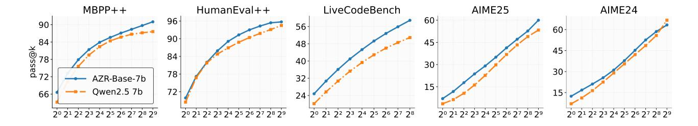

Figure 8. Pass@k Results. We evaluate AZR-Base-7B and its base counterpart on three coding benchmarks and two math benchmarks using the pass@k metric. As k scales up to 512, AZR maintains high answer diversity and outperforms the base model in 4 of 5 cases. This favorable property can be further leveraged by test-time scaling methods to improve performance.

**Research Question 7: How much do the designs of proposer contribute to the overall performance** (Ablation)? Next, we ablate two components of the proposer role and present the results in Table 2. First, we examine whether conditioning on historic reference triplets is necessary. To do so, we design a variant in which a fixed prompt is used to propose abduction and deduction tasks, rather than dynamically conditioning on K historical triplets (row 3). This results in a 5-point absolute drop in math performance and a 1-point drop in code performance. This suggest that dynamically conditioning on reference programs helps improve performance, possibly by increasing diversity and achieving better coverage of the reasoning problem space.

Finally, we examine a setting where the proposer is not trained. Instead, we prompt it using the current learner and train only the solver (row 4). This results in a moderate performance drop (-1.4), indicating that proposer training is indeed beneficial. However, we believe there is potential to further enhance the proposer, possibly amplifying gains in general reasoning. One possible direction is to mitigate task interference, as discussed in multitask learning literature (Suteu & Guo, 2019), or to introduce explicit incentives that encourage broader problem space coverage. Overall, we see improving the proposer as a promising direction to further enhance solver performance through their synergistic interaction.

Research Question 8: What is the relative performance of AZR vs. the base model for high pass@k? We evaluate reasoning coverage following Yang et al. (Yue et al., 2025), with temperature 0.6, top-p 0.95, max output tokens 16k, and k up to 512, and present the results in Figure 9. Across three code benchmarks (LiveCodeBench, MBPP++, HumanEval++) and two math benchmarks (AIME24, AIME25), AZR consistently matches or outperforms the base model at high k (256/512), with one exception at AIME24 (k=512). These gains persist at larger k, indicating AZR maintains broad reasoning coverage and answer diversity after RL, compatible for further test-time scaling (Snell et al., 2024).

**Research Question 9: How do AZR models perform in general reasoning tasks?** We assess AZR-Base-7B on MMLU-Pro (Wang et al., 2024b) using greedy decoding and a 16k token limit, and compare against three baselines: ORZ-7B, Qwen2.5-7B, and SimpleRL-Zoo-7B. AZR attains higher subject-average and higher overall average, indicating strong general reasoning capabilities beyond math and code.

**Additional Results.** Beyond the core research questions, we present additional results, including the breakdown of individual out-of-distribution benchmark scores during training for the 7B base and coder models in Figures 30 and 31, for the 14B base and coder model in Figures 32 and 33. For completeness, we also report in-distribution benchmark performance during training for the 7B base model in Figure 16. Finally, we invite interested readers to explore Section D, where we share several experimental directions that, while not yielding strong performance gains, produced interesting and insightful findings.

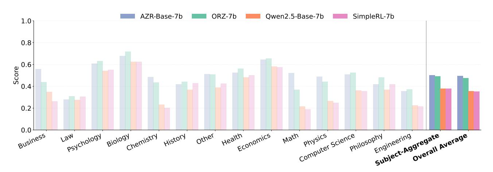

<span id="page-12-0"></span>*Figure* 9. **General Reasoning.** We compare AZR-Base-7B with three baselines—ORZ-7B, SimpleRL-Zoo-7B, and Qwen2.5-7B, on MMLU-Pro (Wang et al., 2024b). AZR-Base-7B attains higher averages both across subjects and across all samples, indicating strong general reasoning across 14 diverse subjects/domains.

### 5. Related Work

Reasoning with RL. Using RL to enhance reasoning capabilities has recently emerged as an important step in the post-training process of strong reasoning-focused large language models (Lambert et al., 2024). One of the first works to explore a self-bootstrapping approach to improving LLM reasoning is STaR, which employs expert iteration and rejection sampling of outcome-verified responses to iteratively improve the model's CoT. A monumental work, o1 (Jaech et al., 2024), was among the first to deploy this idea on a scale, achieving state-of-the-art results in reasoning tasks at the time of release. More recently, the R1 model (Guo et al., 2025) became the first open-weight model to match or even surpass the performance of o1. Most notably, the zero setting was introduced, in which reinforcement learning is applied directly on top of the base LLM. This inspired followup work, which are open source attempts to replicate the R1 process or to improve the underlying reinforcement learning algorithm (Zeng et al., 2025b; Liu et al., 2025c; Cui et al., 2025; Hu et al., 2025; Yu et al., 2025; Yu an et al., 2025). Recent work explored RL on human defined procedural generated puzzles saw improvements in math (Xie et al., 2025), and using one human example can almost match the performance of thousands (Wang et al., 2025c). We extend the zero setting to a new absolute zero setting, where not only is the RLVR process initialized from a base LLM without SFT, but no external prompt data or answers are provided to the learner. All data used to improve reasoning were self-proposed, and refined entirely through RLVR. Moreover, our goal is not to only match zero-setting models, but to surpass them in the long run.

**Self-play.** The self-play paradigm can be traced back to early 2000s, where Schmidhuber (2003; 2011) (of course) explored a two-agent setup in which a proposal agent invents questions for a prediction agent to answer. This dynamic continuously and automatically improves both agents, enabling theoretically never-ending progress (Schaul, 2024). AlphaGo and AlphaZero (Silver et al., 2016; 2017) extend the self-play paradigm to the two-player zero-sum game of Go, where the current learner competes against earlier versions of itself to progressively enhance its capabilities. These were among the first milestone works to demonstrate superhuman performance in the game of Go. Moreover, areas such as asymmetric self-play (Sukhbaatar et al., 2018; OpenAI et al., 2021), unsupervised environment design (Wang et al., 2019; Dennis et al., 2020), unsupervised reinforcement learning (Laskin et al., 2021; Zhao et al., 2022; 2025b), autotelic agents (Colas et al., 2022a;b; Haluptzok et al., 2023), and automatic goal generation (Florensa et al., 2018) all center around inventing new tasks for an agent to learn from—typically without supervision. In these approaches, the process of setting goals itself is often dynamic and continuously evolving. Generative adversarial networks (Goodfellow et al., 2020), also belong in this paradigm where a discriminator discriminate between real data and generated data, and the generated is trained to fool the discriminator.

Most recently, SPIN and Self-Rewarding Language Models (Chen et al., 2024; Yuan et al., 2024) use the same instance of the language models themselves as the reward model to progressively improve the generative and discriminative abilities of the same LLM for alignment. (Kirchner et al., 2024) uses Prover-Verifier Game for increasing legibility and eva (Ye et al., 2024) uses self-play for alignment, but reward model is the main bottleneck as it is not reliable for reasoning tasks (Lambert et al., 2024). SPC (Chen et al., 2025) used self-play to train on human-curated tasks to increase the critic capabilities and SPAG (Cheng et al., 2024) trained using self-play in specific game of Adversarial Taboo. Concurrent works, Genius, EMPO, and TTRL (Xu et al., 2025; Zhang et al., 2025b; Zuo et al., 2025) leverage human-curated language queries without labels to train RL agents, but still rely on a fixed human defined learning task distribution. Moreover, Minimo (Poesia et al., 2024) extends self-play to formal mathematics, where a pair of conjecture-and theorem-proving agents are jointly trained using reinforcement learning. Finally, (Liu et al., 2025a) obtained good reasoning performance by self-play training on zero-sum games and (Liu et al., 2025b) uses self-play for alignment. Our work builds upon the self-play paradigm, but it is the first to use it to elicit long CoT for improved reasoning, and the first to frame the problem space as a

Python input/output/function abduction/deduction/induction tasks, grounding it in an operationalizable environment to facilitate RLVR.

Weak-to-Strong Supervision. The concept of weak-to-strong supervision has been studied in prior work, where a teacher—despite being weaker than the learner—still provides useful guidance (Burns et al., 2024; Hinton et al., 2015; Christiano, 2018; 2019; Demski & Garrabrant, 2019; Leike & Sutskever, 2023; Hubinger et al., 2019). We consider a similar setting in which the learner may possess superhuman capabilities. However, rather than relying on supervision from a weaker teacher, we propose an alternative approach: guiding the learner's improvement through verifiable rewards, which potentially offer a more reliable and scalable learning signal. Furthermore, in our proposed method, the learning task and goal distribution is not predefined by any external supervisor—they are entirely self-generated by the learner, enabling it to maximize its learning potential through autonomous self-practice.

### 6. Conclusion and Discussion

**Conclusion.** In this work, we proposed the Absolute Zero paradigm, a novel setting that addresses the data limitations of existing RLVR frameworks. In this paradigm, reasoning agents are tasked with generating their own learning task distributions and improving their reasoning abilities with environmental guidance. We then presented our own instantiation, the Absolute Zero Reasoner (AZR), which is trained by having them propose and solve code-related reasoning tasks grounded by code executor.

We evaluated our trained models on out-of-distribution benchmarks in both the code generation and mathematical reasoning domains. Remarkably, even though our models were not directly trained on these tasks and lacked human expert-curated datasets, our reasoning agents achieved exceptional performance, surpassing the state-of-the-art in combined general reasoning scores and in coding. This demonstrates the potential of the absolute zero paradigm to drive superior reasoning capabilities without the need for extensive domain-specific training data. Furthermore, we showed that AZR scales efficiently, offering strong performance across varying model sizes, and can enhance the capabilities of other model classes as well. To foster further exploration and advancement of this emerging paradigm, we are releasing the code, models, and logs as open-source, encouraging the research community to build upon our findings.

**Discussion.** We believe there remains much to explore, such as altering the environment from which the reasoner receives verifiable feedback, including sources like the world wide web, formal math languages (Sutton, 2001; Ren et al., 2025), world simulators, or even the real world. Furthermore, AZ's generality could possibly be extend to domains such as embodied AI (Zitkovich et al., 2023; Yue et al., 2024). Additionally, more complex agentic tasks or scientific experiments, present exciting opportunities to further advance the absolute zero setting to different application domains (Wu et al., 2024; 2023). Beyond that, future directions could include exploring multimodal reasoning models, modifying the distribution p(z) to incorporate privileged information, defining or even let the model dynamically learn how to define f (Equation (3)), or designing exploration/diversity rewards for both the propose and solve roles. Another promising direction is to better estimate the learning progress, with recent works like MAGELLAN is pioneering in this direction (Gaven et al., 2025).

While underappreciated in current reasoning literature, the exploration component of RL has long been recognized as a critical driver for emergent behavior in traditional RL (Yue et al., 2025; Silver et al., 2016; Ladosz et al., 2022; Pourcel et al., 2024). Years of research have examined various forms of exploration, even in related subfields using LLMs such as red teaming (Zhao et al., 2025a), yet its role in LLM reasoning models remains underexplored. Taking this a step further, our framework investigates an even more meta-level exploration problem: exploration within the learning task space—where the agent learns not just how to solve tasks, but what tasks to learn from and how to find them. Rather than being confined to a fixed problem set, AI reasoner agents may benefit from dynamically defining and refining their own learning tasks. This shift opens a powerful new frontier—where agents explore not only solution spaces but also expand the boundaries of problem spaces. We believe this is a promising and important direction for future research.

One limitation of our work is that we did not address how to safely manage a system composed of such self-improving components. To our surprise, we observed several instances of safety-concerning CoT from the Llama-3.1-8B model, which we term the "uh-oh moment". These findings suggest that the proposed absolute zero paradigm, while reducing the need for human intervention for curating tasks, still necessitates oversight due to lingering safety concerns and is a critical direction for future research (Wang et al., 2024a; 2025a).

As a final note, we explored reasoning models that possess experience—models that not only solve given tasks, but also define and evolve their own learning task distributions with the help of an environment. Our results with AZR show that this shift enabloveres strong performance across diverse reasoning tasks, even with significantly fewer privileged resources, such as curated human data. We believe this could finally free reasoning models from the constraints of human-curated data (Morris, 2025) and marks the beginning of a new chapter for reasoning models: "welcome to the era of experience" (Silver & Sutton, 2025; Zhao et al., 2024).

# Acknowledgements

This work is supported in part by the National Key R&D Program of China under Grant 2022ZD0114903, the National Natural Science Foundation of China under Grants U24B20173 and W2442032 and W2442033, and the Scientific Research Innovation Capability Support Project for Young Faculty under Grant ZYGXQNJSKYCXNLZCXM-I20.

### References

- <span id="page-14-2"></span>Aryabumi, V., Su, Y., Ma, R., Morisot, A., Zhang, I., Locatelli, A., Fadaee, M., Üstün, A., and Hooker, S. To code, or not to code? exploring impact of code in pre-training. *CoRR*, abs/2408.10914, 2024. doi: 10.48550/ARXIV.2408.10914. URL https://doi.org/10.48550/arXiv.2408.10914.
- <span id="page-14-5"></span>Austin, J., Odena, A., Nye, M. I., Bosma, M., Michalewski, H., Dohan, D., Jiang, E., Cai, C. J., Terry, M., Le, Q. V., and Sutton, C. Program synthesis with large language models. *CoRR*, abs/2108.07732, 2021. URL https://arxiv.org/abs/2108.07732.
- <span id="page-14-11"></span>Burns, C., Izmailov, P., Kirchner, J. H., Baker, B., Gao, L., Aschenbrenner, L., Chen, Y., Ecoffet, A., Joglekar, M., Leike, J., Sutskever, I., and Wu, J. Weak-to-strong generalization: Eliciting strong capabilities with weak supervision. In *Forty-first International Conference on Machine Learning, ICML 2024, Vienna, Austria, July 21-27, 2024.* OpenReview.net, 2024. URL https://openreview.net/forum?id=ghNRg2mEgN.
- <span id="page-14-15"></span>Canal, M. Radon: Python tool for code metrics. https://github.com/rubik/radon, 2023. Accessed: 2025-04-06.
- <span id="page-14-0"></span>Chen, J., Zhang, B., Ma, R., Wang, P., Liang, X., Tu, Z., Li, X., and Wong, K.-Y. K. Spc: Evolving self-play critic via adversarial games for llm reasoning, 2025. URL https://arxiv.org/abs/2504.19162.
- <span id="page-14-4"></span>Chen, M., Tworek, J., Jun, H., Yuan, Q., de Oliveira Pinto, H. P., Kaplan, J., Edwards, H., Burda, Y., et al. Evaluating large language models trained on code. *CoRR*, abs/2107.03374, 2021. URL https://arxiv.org/abs/2107.03374.
- <span id="page-14-1"></span>Chen, Z., Deng, Y., Yuan, H., Ji, K., and Gu, Q. Self-play fine-tuning converts weak language models to strong language models. In Forty-first International Conference on Machine Learning, ICML 2024, Vienna, Austria, July 21-27, 2024. OpenReview.net, 2024. URL https://openreview.net/forum?id=04cHTxW9BS.
- <span id="page-14-10"></span>Cheng, P., Hu, T., Xu, H., Zhang, Z., Dai, Y., Han, L., Du, N., and Li, X. Self-playing adversarial language game enhances LLM reasoning. In Globersons, A., Mackey, L., Belgrave, D., Fan, A., Paquet, U., Tomczak, J. M., and Zhang, C. (eds.), Advances in Neural Information Processing Systems 38: Annual Conference on Neural Information Processing Systems 2024, NeurIPS 2024, Vancouver, BC, Canada, December 10 - 15, 2024, 2024. URL http://papers.nips.cc/paper\_files/paper/2024/hash/e4be7e9867ef163563f4a5e90cec478f-Abstract-Conference.html.
- <span id="page-14-12"></span>Christiano, P. Approval-directed bootstrapping. https://www.alignmentforum.org/posts/6x7oExXi32ot6HjJv/approval-directed-bootstrapping, 2018. AI Alignment Forum.
- <span id="page-14-13"></span>Christiano, P. Capability amplification. https://www.alignmentforum.org/posts/t3AJW5jP3sk36aGoC/capability-amplification-1, 2019. AI Alignment Forum.
- <span id="page-14-8"></span>Colas, C., Karch, T., Moulin-Frier, C., and Oudeyer, P. Language and culture internalization for human-like autotelic AI. *Nat. Mac. Intell.*, 4(12):1068–1076, 2022a. doi: 10.1038/S42256-022-00591-4. URL https://doi.org/10.1038/S42256-022-00591-4.
- <span id="page-14-9"></span>Colas, C., Karch, T., Sigaud, O., and Oudeyer, P. Autotelic agents with intrinsically motivated goal-conditioned reinforcement learning: A short survey. *J. Artif. Intell. Res.*, 74:1159–1199, 2022b. doi: 10.1613/JAIR.1.13554. URL https://doi.org/10.1613/jair.1.13554.
- <span id="page-14-6"></span>Cui, G., Yuan, L., Wang, Z., Wang, H., Li, W., He, B., Fan, Y., Yu, T., Xu, Q., Chen, W., Yuan, J., Chen, H., Zhang, K., Lv, X., Wang, S., Yao, Y., Han, X., Peng, H., Cheng, Y., Liu, Z., Sun, M., Zhou, B., and Ding, N. Process reinforcement through implicit rewards. CoRR, abs/2502.01456, 2025. doi: 10.48550/ARXIV.2502.01456. URL https://doi.org/10.48550/arXiv.2502.01456.
- <span id="page-14-14"></span>Demski, A. and Garrabrant, S. Embedded agency. CoRR, abs/1902.09469, 2019. URL http://arxiv.org/abs/1902.09469.
- <span id="page-14-7"></span>Dennis, M., Jaques, N., Vinitsky, E., Bayen, A. M., Russell, S., Critch, A., and Levine, S. Emergent complexity and zero-shot transfer via unsupervised environment design. In Larochelle, H., Ranzato, M., Hadsell, R., Balcan, M., and Lin, H. (eds.), Advances in Neural Information Processing Systems 33: Annual Conference on Neural Information Processing Systems 2020, NeurIPS 2020, December 6-12, 2020, virtual, 2020. URL https://proceedings.neurips.cc/paper/2020/hash/985e9a46e10005356bbaf194249f6856-Abstract.html.
- <span id="page-14-3"></span>Dubey, A., Jauhri, A., Pandey, A., Kadian, A., Al-Dahle, A., Letman, A., Mathur, A., Schelten, A., Yang, A., Fan, A., Goyal, A., Hartshorn, A., Yang, A., Mitra, A., Sravankumar, A., Korenev, A., Hinsvark, A., Rao, A., Zhang, A., Rodriguez, A., Gregerson, A., Spataru, A., Rozière, B., Biron, B., Tang, B., Chern, B., Caucheteux, C., Nayak, C., Bi, C., Marra, C., McConnell, C., Keller, C., Touret, C., Wu, C., Wong, C., Ferrer, C. C., Nikolaidis, C., Allonsius, D., Song, D., Pintz, D., Livshits, D., Esiobu, D., Choudhary, D., Mahajan, D., Garcia-Olano, D., Perino, D., Hupkes, D., Lakomkin, E., AlBadawy, E., Lobanova, E., Dinan, E., Smith, E. M., Radenovic, F., Zhang, F., Synnaeve, G., Lee, G., Anderson, G. L., Nail, G., Mialon, G., Pang, G., Cucurell, G., Nguyen, H., Korevaar, H., Xu, H., Touvron, H., Zarov, I., Ibarra, I. A., Kloumann, I. M., Misra, I., Evtimov, I., Copet, J., Lee, J., Geffert, J., Vranes, J.,

- Park, J., Mahadeokar, J., Shah, J., van der Linde, J., Billock, J., Hong, J., Lee, J., Fu, J., Chi, J., Huang, J., Liu, J., Wang, J., Yu, J., Bitton, J., Spisak, J., Park, J., Rocca, J., Johnstun, J., Saxe, J., Jia, J., Alwala, K. V., Upasani, K., Plawiak, K., Li, K., Heafield, K., Stone, K., and et al. The llama 3 herd of models. *CoRR*, abs/2407.21783, 2024. doi: 10.48550/ARXIV.2407.21783. URL https://doi.org/10.48550/arXiv.2407.21783.
- <span id="page-15-10"></span>Ebert, C., Cain, J., Antoniol, G., Counsell, S., and Laplante, P. Cyclomatic complexity. IEEE software, 33(6):27-29, 2016.
- <span id="page-15-6"></span>Florensa, C., Held, D., Geng, X., and Abbeel, P. Automatic goal generation for reinforcement learning agents. In Dy, J. G. and Krause, A. (eds.), *Proceedings of the 35th International Conference on Machine Learning, ICML 2018, Stockholmsmässan, Stockholm, Sweden, July 10-15, 2018*, volume 80 of *Proceedings of Machine Learning Research*, pp. 1514–1523. PMLR, 2018. URL http://proceedings.mlr.press/v80/florensa18a.html.
- <span id="page-15-9"></span>Gaven, L., Carta, T., Romac, C., Colas, C., Lamprier, S., Sigaud, O., and Oudeyer, P. MAGELLAN: metacognitive predictions of learning progress guide autotelic LLM agents in large goal spaces. *CoRR*, abs/2502.07709, 2025. doi: 10.48550/ARXIV.2502.07709. URL https://doi.org/10.48550/arXiv.2502.07709.
- <span id="page-15-7"></span>Goodfellow, I. J., Pouget-Abadie, J., Mirza, M., Xu, B., Warde-Farley, D., Ozair, S., Courville, A. C., and Bengio, Y. Generative adversarial networks. *Commun. ACM*, 63(11):139–144, 2020. doi: 10.1145/3422622. URL https://doi.org/10.1145/3422622.
- <span id="page-15-4"></span>Gu, A., Rozière, B., Leather, H. J., Solar-Lezama, A., Synnaeve, G., and Wang, S. Cruxeval: A benchmark for code reasoning, understanding and execution. In *Forty-first International Conference on Machine Learning, ICML 2024, Vienna, Austria, July 21-27, 2024.* OpenReview.net, 2024. URL https://openreview.net/forum?id=Ffpg52swvg.
- <span id="page-15-0"></span>Guo, D., Yang, D., Zhang, H., Song, J., Wang, P., Zhu, Q., Xu, R., Zhang, R., Ma, S., Bi, X., Zhang, X., Yu, X., Wu, Y., Wu, Z. F., Gou, Z., Shao, Z., Li, Z., Gao, Z., Liu, A., Xue, B., Wang, B., Wu, B., Feng, B., Lu, C., Zhao, C., Deng, C., Ruan, C., Dai, D., Chen, D., Ji, D., Li, E., Lin, F., Dai, F., Luo, F., Hao, G., Chen, G., Li, G., Zhang, H., Xu, H., Ding, H., Gao, H., Qu, H., Li, H., Guo, J., Li, J., Chen, J., Yuan, J., Tu, J., Qiu, J., Li, J., Cai, J. L., Ni, J., Liang, J., Chen, J., Dong, K., Hu, K., You, K., Gao, K., Guan, K., Huang, K., Yu, K., Wang, L., Zhang, L., Zhao, L., Wang, L., Zhang, L., Xu, L., Xia, L., Zhang, M., Zhang, M., Tang, M., Zhou, M., Li, M., Wang, M., Li, M., Tian, N., Huang, P., Zhang, P., Wang, Q., Chen, Q., Du, Q., Ge, R., Zhang, R., Pan, R., Wang, R., Chen, R. J., Jin, R. L., Chen, R., Lu, S., Zhou, S., Chen, S., Ye, S., Wang, S., Yu, S., Zhou, S., Pan, S., Li, S. S., Zhou, S., Wu, S., Yun, T., Pei, T., Sun, T., Wang, T., Zeng, W., Liu, W., Liang, W., Gao, W., Yu, W., Zhang, W., Xiao, W. L., An, W., Liu, X., Wang, X., Chen, X., Nie, X., Cheng, X., Liu, X., Xie, X., Liu, X., Yang, X., Li, X., Su, X., Lin, X., Li, X. Q., Jin, X., Shen, X., Chen, X., Sun, X., Wang, X., Song, X., Zhou, X., Wang, X., Shan, X., Li, Y. K., Wang, Y. Q., Wei, Y. X., Zhang, Y., Xu, Y., Li, Y., Zhao, Y., Sun, Y., Wang, Y., Yu, Y., Zhang, Y., Shi, Y., Xiong, Y., He, Y., Piao, Y., Wang, Y., Tan, Y., Ma, Y., Liu, Y., Guo, Y., Ou, Y., Wang, Y., Gong, Y., Zou, Y., He, Y., Xiong, Y., Luo, Y., You, Y., Liu, Y., Zhou, Y., Zhu, Y. X., Huang, Y., Li, Y., Zheng, Y., Zhu, Y., Ma, Y., Tang, Y., Zha, Y., Yan, Y., Ren, Z. Z., Ren, Z., Sha, Z., Fu, Z., Xu, Z., Xie, Z., Zhang, Z., Hao, Z., Ma, Z., Yan, Z., Wu, Z., Gu, Z., Zhu, Z., Liu, Z., Li, Z., Xie, Z., Song, Z., Pan, Z., Huang, Z., Xu, Z., Zhang, Z., and Zhang, Z. Deepseek-r1 incentivizes reasoning in llms through reinforcement learning. Nature, 645(8081):633-638, September 2025. ISSN 1476-4687. doi: 10.1038/s41586-025-09422-z. URL http://dx.doi.org/10.1038/s41586-025-09422-z.
- <span id="page-15-11"></span>Halstead, M. H. Elements of Software Science (Operating and programming systems series). Elsevier Science Inc., 1977.
- <span id="page-15-5"></span>Haluptzok, P., Bowers, M., and Kalai, A. T. Language models can teach themselves to program better. In *The Eleventh International Conference on Learning Representations, ICLR 2023, Kigali, Rwanda, May 1-5, 2023.* OpenReview.net, 2023. URL https://openreview.net/forum?id=SaRj2ka1XZ3.
- <span id="page-15-2"></span>He, C., Luo, R., Bai, Y., Hu, S., Thai, Z. L., Shen, J., Hu, J., Han, X., Huang, Y., Zhang, Y., Liu, J., Qi, L., Liu, Z., and Sun, M. Olympiadbench: A challenging benchmark for promoting AGI with olympiad-level bilingual multimodal scientific problems. In Ku, L., Martins, A., and Srikumar, V. (eds.), *Proceedings of the 62nd Annual Meeting of the Association for Computational Linguistics* (*Volume 1: Long Papers*), *ACL 2024, Bangkok, Thailand, August 11-16, 2024*, pp. 3828–3850. Association for Computational Linguistics, 2024. doi: 10.18653/V1/2024.ACL-LONG.211. URL https://doi.org/10.18653/v1/2024.acl-long.211.
- <span id="page-15-3"></span>Hendrycks, D., Burns, C., Kadavath, S., Arora, A., Basart, S., Tang, E., Song, D., and Steinhardt, J. Measuring mathematical problem solving with the MATH dataset. In Vanschoren, J. and Yeung, S. (eds.), *Proceedings of the Neural Information Processing Systems Track on Datasets and Benchmarks 1, NeurIPS Datasets and Benchmarks 2021, December 2021, virtual*, 2021. URL https://datasets-benchmarks-proceedings.neurips.cc/paper/2021/hash/be83ab3ecd0db773eb2dc1b0a17836a1-Abstract-round2.html.
- <span id="page-15-8"></span>Hinton, G. E., Vinyals, O., and Dean, J. Distilling the knowledge in a neural network. *CoRR*, abs/1503.02531, 2015. URL http://arxiv.org/abs/1503.02531.
- <span id="page-15-1"></span>Hu, J. REINFORCE++: A simple and efficient approach for aligning large language models. *CoRR*, abs/2501.03262, 2025. doi: 10.48550/ARXIV.2501.03262. URL https://doi.org/10.48550/arXiv.2501.03262.

- <span id="page-16-7"></span>Hu, J., Zhang, Y., Han, Q., Jiang, D., Zhang, X., and Shum, H. Open-reasoner-zero: An open source approach to scaling up reinforcement learning on the base model. *CoRR*, abs/2503.24290, 2025. doi: 10.48550/ARXIV.2503.24290. URL https://doi.org/10.48550/arXiv.2503.24290.
- <span id="page-16-14"></span>Hubinger, E., van Merwijk, C., Mikulik, V., Skalse, J., and Garrabrant, S. Risks from learned optimization in advanced machine learning systems. *CoRR*, abs/1906.01820, 2019. URL http://arxiv.org/abs/1906.01820.
- <span id="page-16-2"></span>Hughes, E., Dennis, M. D., Parker-Holder, J., Behbahani, F. M. P., Mavalankar, A., Shi, Y., Schaul, T., and Rocktäschel, T. Position: Open-endedness is essential for artificial superhuman intelligence. In *Forty-first International Conference on Machine Learning, ICML 2024, Vienna, Austria, July 21-27, 2024.* OpenReview.net, 2024. URL https://openreview.net/forum?id=Bc4vZ2CX7E.
- <span id="page-16-3"></span>Hui, B., Yang, J., Cui, Z., Yang, J., Liu, D., Zhang, L., Liu, T., Zhang, J., Yu, B., Dang, K., Yang, A., Men, R., Huang, F., Ren, X., Ren, X., Zhou, J., and Lin, J. Qwen2.5-coder technical report. CoRR, abs/2409.12186, 2024. doi: 10.48550/ARXIV.2409.12186. URL https://doi.org/10.48550/arXiv.2409.12186.
- <span id="page-16-1"></span>Jaech, A., Kalai, A., Lerer, A., Richardson, A., El-Kishky, A., Low, A., Helyar, A., Madry, A., Beutel, A., Carney, A., et al. Openai of system card. arXiv preprint arXiv:2412.16720, 2024.
- <span id="page-16-5"></span>Jain, N., Han, K., Gu, A., Li, W., Yan, F., Zhang, T., Wang, S., Solar-Lezama, A., Sen, K., and Stoica, I. Livecodebench: Holistic and contamination free evaluation of large language models for code. CoRR, abs/2403.07974, 2024. doi: 10.48550/ARXIV.2403.07974. URL https://doi.org/10.48550/arXiv.2403.07974.
- <span id="page-16-11"></span>Kirchner, J. H., Chen, Y., Edwards, H., Leike, J., McAleese, N., and Burda, Y. Prover-verifier games improve legibility of LLM outputs. *CoRR*, abs/2407.13692, 2024. doi: 10.48550/ARXIV.2407.13692. URL https://doi.org/10.48550/arXiv.2407.13692.
- <span id="page-16-15"></span>Ladosz, P., Weng, L., Kim, M., and Oh, H. Exploration in deep reinforcement learning: A survey. *Inf. Fusion*, 85:1–22, 2022. doi: 10.1016/J.INFFUS.2022.03.003. URL https://doi.org/10.1016/j.inffus.2022.03.003.
- <span id="page-16-0"></span>Lambert, N., Morrison, J., Pyatkin, V., Huang, S., Ivison, H., Brahman, F., Miranda, L. J. V., Liu, A., Dziri, N., Lyu, S., Gu, Y., Malik, S., Graf, V., Hwang, J. D., Yang, J., Bras, R. L., Tafjord, O., Wilhelm, C., Soldaini, L., Smith, N. A., Wang, Y., Dasigi, P., and Hajishirzi, H. Tülu 3: Pushing frontiers in open language model post-training. *CoRR*, abs/2411.15124, 2024. doi: 10.48550/ARXIV.2411.15124. URL https://doi.org/10.48550/arXiv.2411.15124.
- <span id="page-16-10"></span>Laskin, M., Yarats, D., Liu, H., Lee, K., Zhan, A., Lu, K., Cang, C., Pinto, L., and Abbeel, P. URLB: unsupervised reinforcement learning benchmark. In Vanschoren, J. and Yeung, S. (eds.), *Proceedings of the Neural Information Processing Systems Track on Datasets and Benchmarks 1, NeurIPS Datasets and Benchmarks 2021, December 2021, virtual*, 2021. URL https://datasets-benchmarks-proceedings.neurips.cc/paper/2021/hash/091d584fced301b442654dd8c23b3fc9-Abstract-round2.html.
- <span id="page-16-13"></span>Leike, J. and Sutskever, I. Introducing superalignment. https://openai.com/index/introducing-superalignment/, 2023. OpenAI Blog.
- <span id="page-16-8"></span>Lewkowycz, A., Andreassen, A., Dohan, D., Dyer, E., Michalewski, H., Ramasesh, V. V., Slone, A., Anil, C., Schlag, I., Gutman-Solo, T., Wu, Y., Neyshabur, B., Gur-Ari, G., and Misra, V. Solving quantitative reasoning problems with language models. In Koyejo, S., Mohamed, S., Agarwal, A., Belgrave, D., Cho, K., and Oh, A. (eds.), Advances in Neural Information Processing Systems 35: Annual Conference on Neural Information Processing Systems 2022, NeurIPS 2022, New Orleans, LA, USA, November 28 - December 9, 2022, 2022. URL http://papers.nips.cc/paper\_files/paper/2022/hash/18abbeef8cfe9203fdf9053c9c4fe191-Abstract-Conference.html.
- <span id="page-16-9"></span>Li, J., Guo, D., Yang, D., Xu, R., Wu, Y., and He, J. Codei/o: Condensing reasoning patterns via code input-output prediction. *CoRR*, abs/2502.07316, 2025. doi: 10.48550/ARXIV.2502.07316. URL https://doi.org/10.48550/arXiv.2502.07316.
- <span id="page-16-16"></span>Li, R., Fu, J., Zhang, B., Huang, T., Sun, Z., Lyu, C., Liu, G., Jin, Z., and Li, G. TACO: topics in algorithmic code generation dataset. *CoRR*, abs/2312.14852, 2023. doi: 10.48550/ARXIV.2312.14852. URL https://doi.org/10.48550/arXiv.2312.14852.
- <span id="page-16-12"></span>Liu, B., Guertler, L., Yu, S., Liu, Z., Qi, P., Balcells, D., Liu, M., Tan, C., Shi, W., Lin, M., Lee, W. S., and Jaques, N. SPIRAL: self-play on zero-sum games incentivizes reasoning via multi-agent multi-turn reinforcement learning. *CoRR*, abs/2506.24119, 2025a. doi: 10.48550/ARXIV.2506.24119. URL https://doi.org/10.48550/arXiv.2506.24119.
- <span id="page-16-6"></span>Liu, J. and Zhang, L. Code-r1: Reproducing r1 for code with reliable rewards. GitHub, 2025.
- <span id="page-16-4"></span>Liu, J., Xia, C. S., Wang, Y., and Zhang, L. Is your code generated by chatGPT really correct? rigorous evaluation of large language models for code generation. In *Thirty-seventh Conference on Neural Information Processing Systems*, 2023. URL https://openreview.net/forum?id=1qvx610Cu7.

- <span id="page-17-14"></span>Liu, M., Jiang, L., Liang, Y., Du, S. S., Choi, Y., Althoff, T., and Jaques, N. Chasing moving targets with online self-play reinforcement learning for safer language models. *CoRR*, abs/2506.07468, 2025b. doi: 10.48550/ARXIV.2506.07468. URL https://doi.org/10.48550/arXiv.2506.07468.
- <span id="page-17-8"></span>Liu, Z., Chen, C., Li, W., Qi, P., Pang, T., Du, C., Lee, W. S., and Lin, M. Understanding r1-zero-like training: A critical perspective. *CoRR*, abs/2503.20783, 2025c. doi: 10.48550/ARXIV.2503.20783. URL https://doi.org/10.48550/arXiv.2503.20783.
- <span id="page-17-17"></span>Lopez, R. H. Q. Complexipy: An extremely fast python library to calculate the cognitive complexity of python files, written in rust, 2025. URL https://github.com/rohaquinlop/complexipy. Accessed: 2025-04-06.
- <span id="page-17-7"></span>Loshchilov, I. and Hutter, F. Decoupled weight decay regularization. In 7th International Conference on Learning Representations, ICLR 2019, New Orleans, LA, USA, May 6-9, 2019. OpenReview.net, 2019. URL https://openreview.net/forum?id=Bkg6RiCqY7.
- <span id="page-17-16"></span>Morris, J. There are no new ideas in ai... only new datasets. https://blog.jxmo.io/p/there-are-no-new-ideas-in-ai-only, 2025.
- <span id="page-17-1"></span>OpenAI. Openai o3-mini, January 2025a. URL https://openai.com/index/openai-o3-mini/. Accessed: 2025-04-17.
- <span id="page-17-0"></span>OpenAI. Introducing openai o3 and o4-mini, April 2025b. URL https://openai.com/index/introducing-o3-and-o4-mini/. Accessed: 2025-04-17.
- <span id="page-17-12"></span>OpenAI, Plappert, M., Sampedro, R., Xu, T., Akkaya, I., Kosaraju, V., Welinder, P., D'Sa, R., Petron, A., de Oliveira Pinto, H. P., Paino, A., Noh, H., Weng, L., Yuan, Q., Chu, C., and Zaremba, W. Asymmetric self-play for automatic goal discovery in robotic manipulation. *CoRR*, abs/2101.04882, 2021. URL https://arxiv.org/abs/2101.04882.
- <span id="page-17-5"></span>Oudeyer, P.-Y., Gottlieb, J., and Lopes, M. Intrinsic motivation, curiosity, and learning: Theory and applications in educational technologies. *Progress in brain research*, 229:257–284, 2016.
- <span id="page-17-3"></span>Ouyang, L., Wu, J., Jiang, X., Almeida, D., Wainwright, C., Mishkin, P., Zhang, C., Agarwal, S., Slama, K., Ray, A., et al. Training language models to follow instructions with human feedback. *Advances in neural information processing systems*, 35:27730–27744, 2022.
- <span id="page-17-13"></span>Poesia, G., Broman, D., Haber, N., and Goodman, N. D. Learning formal mathematics from intrinsic motivation. In Globersons, A., Mackey, L., Belgrave, D., Fan, A., Paquet, U., Tomczak, J. M., and Zhang, C. (eds.), Advances in Neural Information Processing Systems 38: Annual Conference on Neural Information Processing Systems 2024, NeurIPS 2024, Vancouver, BC, Canada, December 10 - 15, 2024, 2024. URL http://papers.nips.cc/paper\_files/paper/2024/hash/4b8001fc75f0532827472ea5a16af9ca-Abstract-Conference.html.
- <span id="page-17-15"></span>Pourcel, J., Colas, C., Molinaro, G., Oudeyer, P., and Teodorescu, L. ACES: generating a diversity of challenging programming puzzles with autotelic generative models. In Globersons, A., Mackey, L., Belgrave, D., Fan, A., Paquet, U., Tomczak, J. M., and Zhang, C. (eds.), Advances in Neural Information Processing Systems 38: Annual Conference on Neural Information Processing Systems 2024, NeurIPS 2024, Vancouver, BC, Canada, December 10 - 15, 2024, 2024. URL http://papers.nips.cc/paper\_files/paper/2024/hash/7d0c6ff18f16797b92e77d7cc95b3c53-Abstract-Conference.html.
- <span id="page-17-4"></span>Radford, A., Wu, J., Child, R., Luan, D., Amodei, D., Sutskever, I., et al. Language models are unsupervised multitask learners. *OpenAI* blog, 1(8):9, 2019.
- <span id="page-17-2"></span>Ren, Z. Z., Shao, Z., Song, J., Xin, H., Wang, H., Zhao, W., Zhang, L., Fu, Z., Zhu, Q., Yang, D., Wu, Z. F., Gou, Z., Ma, S., Tang, H., Liu, Y., Gao, W., Guo, D., and Ruan, C. Deepseek-prover-v2: Advancing formal mathematical reasoning via reinforcement learning for subgoal decomposition, 2025. URL https://arxiv.org/abs/2504.21801.
- <span id="page-17-11"></span>Schaul, T. Boundless socratic learning with language games. arXiv preprint arXiv:2411.16905, 2024.
- <span id="page-17-9"></span>Schmidhuber, J. Exploring the predictable. In *Advances in evolutionary computing: theory and applications*, pp. 579–612. Springer, 2003.
- <span id="page-17-10"></span>Schmidhuber, J. POWERPLAY: training an increasingly general problem solver by continually searching for the simplest still unsolvable problem. *CoRR*, abs/1112.5309, 2011. URL http://arxiv.org/abs/1112.5309.
- <span id="page-17-6"></span>Shao, Z., Wang, P., Zhu, Q., Xu, R., Song, J., Zhang, M., Li, Y. K., Wu, Y., and Guo, D. Deepseekmath: Pushing the limits of mathematical reasoning in open language models. *CoRR*, abs/2402.03300, 2024. doi: 10.48550/ARXIV.2402.03300. URL https://doi.org/10.48550/arXiv.2402.03300.

- <span id="page-18-15"></span>Sheng, G., Zhang, C., Ye, Z., Wu, X., Zhang, W., Zhang, R., Peng, Y., Lin, H., and Wu, C. Hybridflow: A flexible and efficient RLHF framework. In *Proceedings of the Twentieth European Conference on Computer Systems, EuroSys 2025, Rotterdam, The Netherlands, 30 March 2025 - 3 April 2025*, pp. 1279–1297. ACM, 2025. doi: 10.1145/3689031.3696075. URL https://doi.org/10.1145/3689031.3696075.
- <span id="page-18-14"></span>Silver, D. and Sutton, R. S. The era of experience. https://storage.googleapis.com/deepmind-media/Era-of-Experience% 20/The%20Era%20of%20Experience%20Paper.pdf, 2025.
- <span id="page-18-9"></span>Silver, D., Huang, A., Maddison, C. J., Guez, A., Sifre, L., van den Driessche, G., Schrittwieser, J., Antonoglou, I., Panneershelvam, V., Lanctot, M., Dieleman, S., Grewe, D., Nham, J., Kalchbrenner, N., Sutskever, I., Lillicrap, T. P., Leach, M., Kavukcuoglu, K., Graepel, T., and Hassabis, D. Mastering the game of go with deep neural networks and tree search. *Nat.*, 529(7587):484–489, 2016. doi: 10.1038/NATURE16961. URL https://doi.org/10.1038/nature16961.
- <span id="page-18-3"></span>Silver, D., Hubert, T., Schrittwieser, J., Antonoglou, I., Lai, M., Guez, A., Lanctot, M., Sifre, L., Kumaran, D., Graepel, T., Lillicrap, T. P., Simonyan, K., and Hassabis, D. Mastering chess and shogi by self-play with a general reinforcement learning algorithm. *CoRR*, abs/1712.01815, 2017. URL http://arxiv.org/abs/1712.01815.
- <span id="page-18-8"></span>Snell, C., Lee, J., Xu, K., and Kumar, A. Scaling LLM test-time compute optimally can be more effective than scaling model parameters. *CoRR*, abs/2408.03314, 2024. doi: 10.48550/ARXIV.2408.03314. URL https://doi.org/10.48550/arXiv.2408.03314.
- <span id="page-18-4"></span>Stuart, T. Understanding computation - from simple machines to impossible programs. O'Reilly, 2015. ISBN 978-1-449-32927-3. URL http://www.oreilly.de/catalog/9781449329273/index.html.
- <span id="page-18-5"></span>Sukhbaatar, S., Lin, Z., Kostrikov, I., Synnaeve, G., Szlam, A., and Fergus, R. Intrinsic motivation and automatic curricula via asymmetric self-play. In 6th International Conference on Learning Representations, ICLR 2018, Vancouver, BC, Canada, April 30 - May 3, 2018, Conference Track Proceedings. OpenReview.net, 2018. URL https://openreview.net/forum?id=SkT5Yg-RZ.
- <span id="page-18-7"></span>Suteu, M. and Guo, Y. Regularizing deep multi-task networks using orthogonal gradients. *CoRR*, abs/1912.06844, 2019. URL http://arxiv.org/abs/1912.06844.
- <span id="page-18-2"></span>Sutskever, I., Vinyals, O., and Le, Q. V. Neurips 2024 test of time award session: Sequence to sequence learning with neural networks. Conference session, December 2024. URL https://neurips.cc/virtual/2024/test-of-time/105032.
- <span id="page-18-11"></span>Sutton, R. S. Verification, the key to ai. http://incompleteideas.net/IncIdeas/KeytoAI.html, 2001.
- <span id="page-18-0"></span>Team, K., Du, A., Gao, B., Xing, B., Jiang, C., Chen, C., Li, C., Xiao, C., Du, C., Liao, C., Tang, C., Wang, C., Zhang, D., Yuan, E., Lu, E., Tang, F., Sung, F., Wei, G., Lai, G., Guo, H., Zhu, H., Ding, H., Hu, H., Yang, H., Zhang, H., Yao, H., Zhao, H., Lu, H., Li, H., Yu, H., Gao, H., Zheng, H., Yuan, H., Chen, J., Guo, J., Su, J., Wang, J., Zhao, J., Zhang, J., Liu, J., Yan, J., Wu, J., Shi, L., Ye, L., Yu, L., Dong, M., Zhang, N., Ma, N., Pan, Q., Gong, Q., Liu, S., Ma, S., Wei, S., Cao, S., Huang, S., Jiang, T., Gao, W., Xiong, W., He, W., Huang, W., Wu, W., He, W., Wei, X., Jia, X., Wu, X., Xu, X., Zu, X., Zhou, X., Pan, X., Charles, Y., Li, Y., Hu, Y., Liu, Y., Chen, Y., Wang, Y., Liu, Y., Qin, Y., Liu, Y., Yang, Y., Bao, Y., Du, Y., Wu, Y., Wang, Y., Zhou, Z., Wang, Z., Li, Z., Zhu, Z., Zhang, Z., Wang, Z., Yang, Z., Huang, Z., Xu, Z., and Yang, Z. Kimi k1.5: Scaling reinforcement learning with llms. *CoRR*, abs/2501.12599, 2025. doi: 10.48550/ARXIV.2501.12599. URL https://doi.org/10.48550/arXiv.2501.12599.
- <span id="page-18-1"></span>Villalobos, P., Ho, A., Sevilla, J., Besiroglu, T., Heim, L., and Hobbhahn, M. Position: Will we run out of data? limits of LLM scaling based on human-generated data. In *Forty-first International Conference on Machine Learning, ICML* 2024, *Vienna, Austria, July* 21-27, 2024. OpenReview.net, 2024. URL https://openreview.net/forum?id=ViZcgDQjyG.
- <span id="page-18-13"></span>Wang, H., Yue, Y., Lu, R., Shi, J., Zhao, A., Wang, S., Song, S., and Huang, G. Model surgery: Modulating LLM's behavior via simple parameter editing. In *Proceedings of the 2025 Conference of the Nations of the Americas Chapter of the Association for Computational Linguistics*, pp. 6337–6357, 2025a.
- <span id="page-18-10"></span>Wang, R., Lehman, J., Clune, J., and Stanley, K. O. Paired open-ended trailblazer (POET): endlessly generating increasingly complex and diverse learning environments and their solutions. *CoRR*, abs/1901.01753, 2019. URL http://arxiv.org/abs/1901.01753.
- <span id="page-18-6"></span>Wang, S., Yang, Q., Gao, J., Lin, M. G., Chen, H., Wu, L., Jia, N., Song, S., and Huang, G. Train once, get a family: State-adaptive balances for offline-to-online reinforcement learning. In *Thirty-seventh Conference on Neural Information Processing Systems*, 2023. URL https://openreview.net/forum?id=vtoY8qJjTR.
- <span id="page-18-12"></span>Wang, S., Liu, C., Zheng, Z., Qi, S., Chen, S., Yang, Q., Zhao, A., Wang, C., Song, S., and Huang, G. Boosting LLM agents with recursive contemplation for effective deception handling. In Ku, L.-W., Martins, A., and Srikumar, V. (eds.), *Findings of the Association for Computational Linguistics: ACL 2024*, pp. 9909–9953, Bangkok, Thailand, August 2024a. Association for Computational Linguistics. doi: 10.18653/v1/2024.findings-acl.591. URL https://aclanthology.org/2024.findings-acl.591/.

- <span id="page-19-0"></span>Wang, S., Yu, L., Gao, C., Zheng, C., Liu, S., Lu, R., Dang, K., Chen, X., Yang, J., Zhang, Z., Liu, Y., Yang, A., Zhao, A., Yue, Y., Song, S., Yu, B., Huang, G., and Lin, J. Beyond the 80/20 rule: High-entropy minority tokens drive effective reinforcement learning for LLM reasoning. *CoRR*, abs/2506.01939, 2025b. doi: 10.48550/ARXIV.2506.01939. URL https://doi.org/10.48550/arXiv.2506.01939.
- <span id="page-19-5"></span>Wang, Y., Ma, X., Zhang, G., Ni, Y., Chandra, A., Guo, S., Ren, W., Arulraj, A., He, X., Jiang, Z., Li, T., Ku, M., Wang, K., Zhuang, A., Fan, R., Yue, X., and Chen, W. Mmlu-pro: A more robust and challenging multi-task language understanding benchmark. In Globersons, A., Mackey, L., Belgrave, D., Fan, A., Paquet, U., Tomczak, J. M., and Zhang, C. (eds.), Advances in Neural Information Processing Systems 38: Annual Conference on Neural Information Processing Systems 2024, NeurIPS 2024, Vancouver, BC, Canada, December 10 - 15, 2024, 2024b. URL http://papers.nips.cc/paper\_files/paper/2024/hash/ad236edc564f3e3156e1b2feafb99a24-Abstract-Datasets\_and\_Benchmarks\_Track.html.
- <span id="page-19-9"></span>Wang, Y., Yang, Q., Zeng, Z., Ren, L., Liu, L., Peng, B., Cheng, H., He, X., Wang, K., Gao, J., Chen, W., Wang, S., Du, S. S., and Shen, Y. Reinforcement learning for reasoning in large language models with one training example, 2025c. URL https://arxiv.org/abs/2504.20571.
- <span id="page-19-15"></span>Wu, Q., Bansal, G., Zhang, J., Wu, Y., Zhang, S., Zhu, E., Li, B., Jiang, L., Zhang, X., and Wang, C. Autogen: Enabling next-gen LLM applications via multi-agent conversation framework. *CoRR*, abs/2308.08155, 2023. doi: 10.48550/ARXIV.2308.08155. URL https://doi.org/10.48550/arXiv.2308.08155.
- <span id="page-19-14"></span>Wu, Y., Yue, T., Zhang, S., Wang, C., and Wu, Q. Stateflow: Enhancing LLM task-solving through state-driven workflows. *CoRR*, abs/2403.11322, 2024. doi: 10.48550/ARXIV.2403.11322. URL https://doi.org/10.48550/arXiv.2403.11322.
- <span id="page-19-8"></span>Xie, T., Gao, Z., Ren, Q., Luo, H., Hong, Y., Dai, B., Zhou, J., Qiu, K., Wu, Z., and Luo, C. Logic-rl: Unleashing LLM reasoning with rule-based reinforcement learning. *CoRR*, abs/2502.14768, 2025. doi: 10.48550/ARXIV.2502.14768. URL https://doi.org/10.48550/arXiv.2502.14768.
- <span id="page-19-12"></span>Xu, F., Yan, H., Ma, C., Zhao, H., Sun, Q., Cheng, K., He, J., Liu, J., and Wu, Z. Genius: A generalizable and purely unsupervised self-training framework for advanced reasoning, 2025. URL https://arxiv.org/abs/2504.08672.
- <span id="page-19-3"></span>Yang, A., Yang, B., Zhang, B., Hui, B., Zheng, B., Yu, B., Li, C., Liu, D., Huang, F., Wei, H., Lin, H., Yang, J., Tu, J., Zhang, J., Yang, J., Yang, J., Zhou, J., Lin, J., Dang, K., Lu, K., Bao, K., Yang, K., Yu, L., Li, M., Xue, M., Zhang, P., Zhu, Q., Men, R., Lin, R., Li, T., Xia, T., Ren, X., Ren, X., Fan, Y., Su, Y., Zhang, Y., Wan, Y., Liu, Y., Cui, Z., Zhang, Z., and Qiu, Z. Qwen2.5 technical report. *CoRR*, abs/2412.15115, 2024a. doi: 10.48550/ARXIV.2412.15115. URL https://doi.org/10.48550/arXiv.2412.15115.
- <span id="page-19-4"></span>Yang, A., Zhang, B., Hui, B., Gao, B., Yu, B., Li, C., Liu, D., Tu, J., Zhou, J., Lin, J., Lu, K., Xue, M., Lin, R., Liu, T., Ren, X., and Zhang, Z. Qwen2.5-math technical report: Toward mathematical expert model via self-improvement. *CoRR*, abs/2409.12122, 2024b. doi: 10.48550/ARXIV.2409.12122. URL https://doi.org/10.48550/arXiv.2409.12122.
- <span id="page-19-1"></span>Yao, S., Zhao, J., Yu, D., Du, N., Shafran, I., Narasimhan, K. R., and Cao, Y. React: Synergizing reasoning and acting in language models. In *The Eleventh International Conference on Learning Representations, ICLR 2023, Kigali, Rwanda, May 1-5, 2023*. OpenReview.net, 2023. URL https://openreview.net/forum?id=WE vluYUL-X.
- <span id="page-19-11"></span>Ye, Z., Agarwal, R., Liu, T., Joshi, R., Velury, S., Le, Q. V., Tan, Q., and Liu, Y. Evolving alignment via asymmetric self-play. *CoRR*, abs/2411.00062, 2024. doi: 10.48550/ARXIV.2411.00062. URL https://doi.org/10.48550/arXiv.2411.00062.
- <span id="page-19-6"></span>Yu, Q., Zhang, Z., Zhu, R., Yuan, Y., Zuo, X., Yue, Y., Fan, T., Liu, G., Liu, L., Liu, X., Lin, H., Lin, Z., Ma, B., Sheng, G., Tong, Y., Zhang, C., Zhang, M., Zhang, W., Zhu, H., Zhu, J., Chen, J., Chen, J., Wang, C., Yu, H., Dai, W., Song, Y., Wei, X., Zhou, H., Liu, J., Ma, W., Zhang, Y., Yan, L., Qiao, M., Wu, Y., and Wang, M. DAPO: an open-source LLM reinforcement learning system at scale. CoRR, abs/2503.14476, 2025. doi: 10.48550/ARXIV.2503.14476. URL https://doi.org/10.48550/arXiv.2503.14476.
- <span id="page-19-10"></span>Yuan, W., Pang, R. Y., Cho, K., Li, X., Sukhbaatar, S., Xu, J., and Weston, J. Self-rewarding language models. *URL https://arxiv.org/abs/2401.10020*, 2024.
- <span id="page-19-7"></span>Yuan, Y., Yu, Q., Zuo, X., Zhu, R., Xu, W., Chen, J., Wang, C., Fan, T., Du, Z., Wei, X., et al. Vapo: Efficient and reliable reinforcement learning for advanced reasoning tasks. *arXiv preprint arXiv:2504.05118*, 2025.
- <span id="page-19-2"></span>Yue, Y., Lu, R., Kang, B., Song, S., and Huang, G. Understanding, predicting and better resolving q-value divergence in offline-rl. *Advances in Neural Information Processing Systems*, 36:60247–60277, 2023.
- <span id="page-19-13"></span>Yue, Y., Wang, Y., Kang, B., Han, Y., Wang, S., Song, S., Feng, J., and Huang, G. Deer-vla: Dynamic inference of multimodal large language models for efficient robot execution. In Globersons, A., Mackey, L., Belgrave, D., Fan, A., Paquet, U., Tomczak, J. M., and Zhang, C. (eds.), Advances in Neural Information Processing Systems 38: Annual Conference on Neural Information Processing Systems 2024, NeurIPS 2024, Vancouver, BC, Canada, December 10 - 15, 2024, 2024. URL http://papers.nips.cc/paper\_files/paper/2024/hash/67b0e7c7c2a5780aeefe3b79caac106e-Abstract-Conference.html.

- <span id="page-20-0"></span>Yue, Y., Chen, Z., Lu, R., Zhao, A., Wang, Z., Yue, Y., Song, S., and Huang, G. Does reinforcement learning really incentivize reasoning capacity in llms beyond the base model?, 2025. URL https://arxiv.org/abs/2504.13837.
- <span id="page-20-12"></span>Zelikman, E., Wu, Y., Mu, J., and Goodman, N. Star: Bootstrapping reasoning with reasoning. *Advances in Neural Information Processing Systems*, 35:15476–15488, 2022.
- <span id="page-20-6"></span>Zeng, H., Jiang, D., Wang, H., Nie, P., Chen, X., and Chen, W. ACECODER: acing coder RL via automated test-case synthesis. *CoRR*, abs/2502.01718, 2025a. doi: 10.48550/ARXIV.2502.01718. URL https://doi.org/10.48550/arXiv.2502.01718.
- <span id="page-20-2"></span>Zeng, W., Huang, Y., Liu, Q., Liu, W., He, K., Ma, Z., and He, J. Simplerl-zoo: Investigating and taming zero reinforcement learning for open base models in the wild. *CoRR*, abs/2503.18892, 2025b. doi: 10.48550/ARXIV.2503.18892. URL https://doi.org/10.48550/arXiv.2503.18892.
- <span id="page-20-1"></span>Zhang, C., Deng, Y., Lin, X., Wang, B., Ng, D., Ye, H., Li, X., Xiao, Y., Mo, Z., Zhang, Q., et al. 100 days after deepseek-r1: A survey on replication studies and more directions for reasoning language models. *arXiv* preprint arXiv:2505.00551, 2025a.
- <span id="page-20-8"></span>Zhang, Q., Wu, H., Zhang, C., Zhao, P., and Bian, Y. Right question is already half the answer: Fully unsupervised llm reasoning incentivization, 2025b. URL https://arxiv.org/abs/2504.05812.
- <span id="page-20-4"></span>Zhang, Y. and Yang, Q. A survey on multi-task learning. *IEEE transactions on knowledge and data engineering*, 34(12):5586–5609, 2021.
- <span id="page-20-5"></span>Zhao, A., Lin, M. G., Li, Y., Liu, Y., and Huang, G. A mixture of surprises for unsupervised reinforcement learning. In Koyejo, S., Mohamed, S., Agarwal, A., Belgrave, D., Cho, K., and Oh, A. (eds.), Advances in Neural Information Processing Systems 35: Annual Conference on Neural Information Processing Systems 2022, NeurIPS 2022, New Orleans, LA, USA, November 28 - December 9, 2022, 2022. URL http://papers.nips.cc/paper\_files/paper/2022/hash/a7667ee5d545a43d2f0fda98863c260e-Abstract-Conference.html.
- <span id="page-20-11"></span>Zhao, A., Huang, D., Xu, Q., Lin, M., Liu, Y., and Huang, G. Expel: LLM agents are experiential learners. In Wooldridge, M. J., Dy, J. G., and Natarajan, S. (eds.), *Thirty-Eighth AAAI Conference on Artificial Intelligence, AAAI 2024, Thirty-Sixth Conference on Innovative Applications of Artificial Intelligence, IAAI 2024, Fourteenth Symposium on Educational Advances in Artificial Intelligence, EAAI 2014, February 20-27, 2024, Vancouver, Canada*, pp. 19632–19642. AAAI Press, 2024. doi: 10.1609/AAAI.V38I17.29936. URL https://doi.org/10.1609/aaai.v38i17.29936.
- <span id="page-20-3"></span>Zhao, A., Xu, Q., Lin, M., Wang, S., Liu, Y., Zheng, Z., and Huang, G. Diver-ct: Diversity-enhanced red teaming large language model assistants with relaxing constraints. In Walsh, T., Shah, J., and Kolter, Z. (eds.), *AAAI-25, Sponsored by the Association for the Advancement of Artificial Intelligence, February 25 - March 4*, 2025, *Philadelphia, PA, USA*, pp. 26021–26030. AAAI Press, 2025a. doi: 10.1609/AAAI.V39I24.34797. URL https://doi.org/10.1609/aaai.v39i24.34797.
- <span id="page-20-7"></span>Zhao, A., Zhu, E., Lu, R., Lin, M., Liu, Y., and Huang, G. Self-referencing agents for unsupervised reinforcement learning. *Neural Networks*, 188:107448, 2025b. doi: 10.1016/J.NEUNET.2025.107448. URL https://doi.org/10.1016/j.neunet.2025.107448.
- <span id="page-20-10"></span>Zitkovich, B., Yu, T., Xu, S., Xu, P., Xiao, T., Xia, F., Wu, J., Wohlhart, P., Welker, S., Wahid, A., Vuong, Q., Vanhoucke, V., Tran, H. T., Soricut, R., Singh, A., Singh, J., Sermanet, P., Sanketi, P. R., Salazar, G., Ryoo, M. S., Reymann, K., Rao, K., Pertsch, K., Mordatch, I., Michalewski, H., Lu, Y., Levine, S., Lee, L., Lee, T. E., Leal, I., Kuang, Y., Kalashnikov, D., Julian, R., Joshi, N. J., Irpan, A., Ichter, B., Hsu, J., Herzog, A., Hausman, K., Gopalakrishnan, K., Fu, C., Florence, P., Finn, C., Dubey, K. A., Driess, D., Ding, T., Choromanski, K. M., Chen, X., Chebotar, Y., Carbajal, J., Brown, N., Brohan, A., Arenas, M. G., and Han, K. RT-2: vision-language-action models transfer web knowledge to robotic control. In Tan, J., Toussaint, M., and Darvish, K. (eds.), Conference on Robot Learning, CoRL 2023, 6-9 November 2023, Atlanta, GA, USA, volume 229 of Proceedings of Machine Learning Research, pp. 2165–2183. PMLR, 2023. URL https://proceedings.mlr.press/v229/zitkovich23a.html.
- <span id="page-20-9"></span>Zuo, Y., Zhang, K., Qu, S., Sheng, L., Zhu, X., Qi, B., Sun, Y., Cui, G., Ding, N., and Zhou, B. Ttrl: Test-time reinforcement learning, 2025. URL https://arxiv.org/abs/2504.16084.

# **Appendix**

# **Appendix Contents**

| A |     | Reinforcement Learning with Verifiable Rewards.                 | 23 |
|---|-----|-----------------------------------------------------------------|----|
| B |     | Implementation Details                                          | 23 |
| C |     | More Results                                                    | 24 |
|   | C.1 | Out-of-Distribution Performance Breakdown<br>                   | 24 |
|   | C.2 | In-Distribution Results<br>                                     | 24 |
|   | C.3 | Interplay Between Propose and Solve Roles<br>                   | 24 |
|   | C.4 | Complexity and Diversity Metrics of AZR Proposed Tasks<br>      | 34 |
|   | C.5 | Generated Code Complexity Dynamics Between Abd/Ded and Ind.<br> | 34 |
| D |     | Alternative Approaches Considered                               | 51 |
|   | D.1 | Error Deduction Task<br>                                        | 51 |
|   | D.2 | Composite Functions as Curriculum Learning<br>                  | 51 |
|   | D.3 | Toying with the Initial<br><br>p(z)                             | 51 |
|   | D.4 | Extra Rewards<br>                                               | 51 |
|   | D.5 | Environment Transition<br>                                      | 52 |

# <span id="page-22-0"></span>A. Reinforcement Learning with Verifiable Rewards.

We use reinforcement learning to update our learner LLM, rewarding it based on a task-specific reward function  $r_f$ , where the subscript f indicates the task. The goal of the RL agent is to maximize the expected discounted sum of rewards. We adopt an online variant of RL, REINFORCE++, which is optimized using the original PPO objective:

$$\mathcal{L}_{\text{PPO}}(\theta) = \mathbb{E}_{q \sim P(Q), \ o \sim \pi_{\theta_{\text{old}}}(O|q)} \left[ \frac{1}{|o|} \sum_{t=1}^{|o|} \min \left( s_t(\theta) A_{f,q}^{\text{norm}}, \ \text{clip} \left( s_t(\theta), 1 - \epsilon, 1 + \epsilon \right) A_{f,q}^{\text{norm}} \right) \right], \tag{9}$$

where  $s_t(\theta)$  is the probability ratio between the new and old policies at timestep t, and  $A_{f,q}^{\text{norm}}$  is the normalized advantage.

REINFORCE++ computes the normalized advantage as:

$$A_{f,q}^{\text{norm}} = \frac{r_{f,q} - \text{mean}(\{A_{f,q}\}^B)}{\text{std}(\{A_{f,q}\}^B)},\tag{10}$$

where  $r_{f,q}$  is the outcome reward for question q, task f, mean and std are calculated across the global batch with batch size B. Note that we do not apply any KL penalty to the loss or reward.

# <span id="page-22-2"></span>**B.** Implementation Details

We built Absolute Zero Reasoner upon the veRL codebase (Sheng et al., 2025). For code execution, we incorporated components from the QwQ Python executor. For safer code execution, we recommend using API-based services such as E2B instead.

All experiments were conducted on clusters of A800 GPUs, each experiment lasts around 3-5 days

**Training Hyperparameters.** We show the hyperparameters used in our training in Table 3. We do not change them for any of the runs.

| Parameter                           | Value                 |  |  |  |  |  |  |  |
|-------------------------------------|-----------------------|--|--|--|--|--|--|--|
| Model Configuration                 |                       |  |  |  |  |  |  |  |
| Max Prompt Length                   | 6144                  |  |  |  |  |  |  |  |
| Max Response Length                 | 8096                  |  |  |  |  |  |  |  |
| Seed Batch Factor                   | 4                     |  |  |  |  |  |  |  |
| Max Programs                        | 16384                 |  |  |  |  |  |  |  |
| Training Setting                    | ngs                   |  |  |  |  |  |  |  |
| Train Batch Size                    | 64 * 6                |  |  |  |  |  |  |  |
| Learning Rate                       | 1e-6                  |  |  |  |  |  |  |  |
| Optimizer                           | AdamW                 |  |  |  |  |  |  |  |
| Grad Clip                           | 1.0                   |  |  |  |  |  |  |  |
| Total Steps                         | 500                   |  |  |  |  |  |  |  |
| RL Settings                         | S                     |  |  |  |  |  |  |  |
| Algorithm                           | TRR++ (Section 3.3.5) |  |  |  |  |  |  |  |
| KL Loss                             | False                 |  |  |  |  |  |  |  |
| KL Reward                           | False                 |  |  |  |  |  |  |  |
| Entropy Coefficient                 | 0.001                 |  |  |  |  |  |  |  |
| PPO Epochs                          | 1                     |  |  |  |  |  |  |  |
| N Rollouts                          | 1                     |  |  |  |  |  |  |  |
| Rollout Temperature                 | 1.0                   |  |  |  |  |  |  |  |
| Rollout Top-P                       | 1.0                   |  |  |  |  |  |  |  |
| K References                        | 6                     |  |  |  |  |  |  |  |
| N Samples to Estimate Task Accuracy | 8                     |  |  |  |  |  |  |  |

<span id="page-22-1"></span>Table 3. Hyperparameters Used During AZR Self-play Training.

| Model                                        | Data Curation                                  | Base Model             |
|----------------------------------------------|------------------------------------------------|------------------------|
| Oat-7B (Liu et al., 2025c)                   | 8.5k math pairs (Hendrycks et al., 2021)       | Qwen2.5-7B-Math        |
| SimpleRL-Zoo (Zeng et al., 2025b)            | 8.5k math pairs (Hendrycks et al., 2021)       | Qwen2.5-7B-Base        |
| OpenReasonerZero (Hu et al., 2025)           | 57k STEM + math samples                        | Qwen2.5-7B-Base        |
| PRIME-Zero (Cui et al., 2025)                | 457k math + 27k code problems                  | Qwen2.5Math-7B-Base    |
| CodeR1-Zero-7B-LC2k-1088 (Liu & Zhang, 2025) | 2k Leetcode pairs                              | Qwen2.5-7B-Instruct-1M |
| CodeR1-Zero-7B-12k-832 (Liu & Zhang, 2025)   | 2k Leetcode + 10k TACO pairs (Li et al., 2023) | Qwen2.5-7B-Instruct-1M |
| AceCoder-7B-Ins-RM (Zeng et al., 2025a)      | 22k code data                                  | Qwen2.5-7B-Instruct    |
| AceCoder-7B-Ins-Rule (Zeng et al., 2025a)    | 22k code data                                  | Qwen2.5-7B-Instruct    |
| AceCoder-7B-Code-RM (Zeng et al., 2025a)     | 22k code data                                  | Qwen2.5-7B-Coder       |
| AceCoder-7B-Code-Rule (Zeng et al., 2025a)   | 22k code data                                  | Qwen2.5-7B-Coder       |
| Qwen-7B-Instruct (Yang et al., 2024a)        | 1M SFT + 150k RL pairs                         | Qwen2.5-7B-Base        |
| AZR-7B (Ours)                                | No data                                        | Qwen2.5-7B-Base        |
| AZR-7B-Coder (Ours)                          | No data                                        | Qwen2.5-7B-Coder       |

<span id="page-23-1"></span>Table 4. Reasoner Training Data Source and Base Model.

| logging   | random   | multiprocessing | pebble   | subprocess |
|-----------|----------|-----------------|----------|------------|
| threading | datetime | time            | hashlib  | calendar   |
| bcrypt    | os.sys   | os.path         | sys.exit | os.environ |

<span id="page-23-0"></span>Figure 10. Forbidden Python Modules. List of Python modules forbidden to exist in proposed tasks' programs.

# <span id="page-23-2"></span>C. More Results

### <span id="page-23-3"></span>C.1. Out-of-Distribution Performance Breakdown

We plot the out-of-distribution performance, broken down by each benchmark and in aggregate, across training steps for our 7B, 7B-Coder, 14B, and 14B-Coder models in Figures 30 to 33. We observe a strong correlation between training using AZR and improvements in both mathematical and coding reasoning capabilities. Moreover, our models are trained for more steps than typical zero-style reasoners; while overfitting can occur with static datasets, it is less likely in AZR due to dynamically proposed tasks.

### <span id="page-23-4"></span>C.2. In-Distribution Results

Since we have defined the task domains as input prediction and output prediction, we can directly evaluate our model's capabilities in these areas using popular code reasoning benchmarks: CruxEval-I(nput), CruxEval-O(utput), and LiveCodeBench-Execution (LCB-E) (Gu et al., 2024; Jain et al., 2024), where CruxEval-O and LCB-E is solving the deduction task, and CruxEval-I is solving the abduction task. In Figure 16, we visualize the evolution of these metrics during the training of Absolute Zero Reasoner-base-7b. As training progresses, we observe a consistent improvement in in-distribution performance across steps. While these three benchmark curves do not perfectly correlate with broader coding or math reasoning capabilities (compare Figure 16 with Figure 30), they serve as useful proxies for tracking task-specific progress.

# <span id="page-23-5"></span>C.3. Interplay Between Propose and Solve Roles

We visualize the training dynamics between the propose and solve roles over training steps in Figures 17 to 19. We observe that, in general, the solve roles produce more output tokens than the propose role. Intuitively, this makes sense: the propose role emphasizes creativity and generation of novel tasks, whereas the solve role requires deeper reasoning, which naturally leads to longer outputs.

Interestingly, we also observe a consistent ordering in token length across reasoning types—abduction and deduction tasks tend to result in shorter outputs than induction tasks during problem solving. This aligns with our intuition, as we observed the model engaging in trial-and-error reasoning—repeatedly generating hypothesized inputs, evaluating their outcomes, and reflecting and retrying when subsequent deductions fail to produce the correct output. To our knowledge, this is the first time such a clear distinction in token length

```
VALIDATE_CODE_TEMPLATE = """{code}
repr(f({inputs}))"""
\nexec(VALIDATE_CODE_TEMPLATE)
```

Figure 11. Python Program to Check Valid Code.

```
EVAL_INPUT_PREDICTION_TEMPLATE = """{code}

{gold_output} == f({agent_input})"""
\nexec(EVAL_INPUT_PREDICTION_TEMPLATE)
```

<span id="page-24-1"></span>Figure 12. Python Code to Check Agent Input Abduction Correctness.

```
EVAL_OUTPUT_PREDICTION_TEMPLATE = """{code}\neval({gold_output}) == eval({agent_output})"""
\nexec(EVAL_OUTPUT_PREDICTION_TEMPLATE)
```

Figure 13. Python Code to Check Agent Output Deduction Correctness.

```
EVAL_FUNCTION_PREDICTION_TEMPLATE = """{code}

matches = []

for gold_input, gold_output in zip({gold_inputs}, {gold_outputs}):

    match = {gold_output} == f({gold_input})

    matches.append(match)

"""
\nexec(EVAL_OUTPUT_PREDICTION_TEMPLATE)
```

<span id="page-24-2"></span>Figure 14. Python Code to Check Agent Function Induction Correctness.

```
CHECK_DETERMINISM_TEMPLATE = """{code}
returns = f({inputs})\nif returns != f({inputs}):
    raise Exception('Non-deterministic code')
repr(returns)"""
\nexec(CHECK_DETERMINISM_TEMPLATE)
```

<span id="page-24-0"></span>Figure 15. Python Code to Check Deterministic Program.

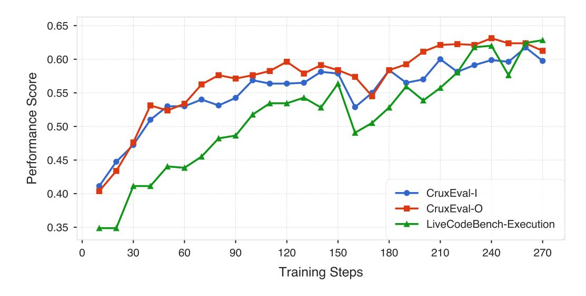

<span id="page-24-3"></span>Figure 16. In-distribution Benchmark Score During Training. The evolution of CruxEval-I, CruxEval-O, and LiveCodeBench-Execution during training for the Qwen2.5-7B base model trained using AZR.

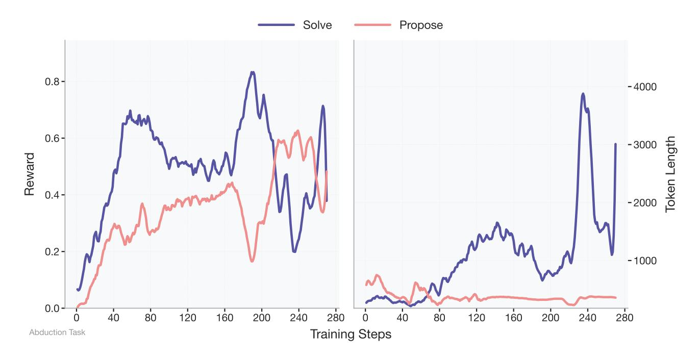

<span id="page-25-0"></span>Figure 17. Abduction Task Reward and Token Lengths. The task reward and token lengths of the two roles for abduction task type of Absolute Zero Reasoner-base-7b.

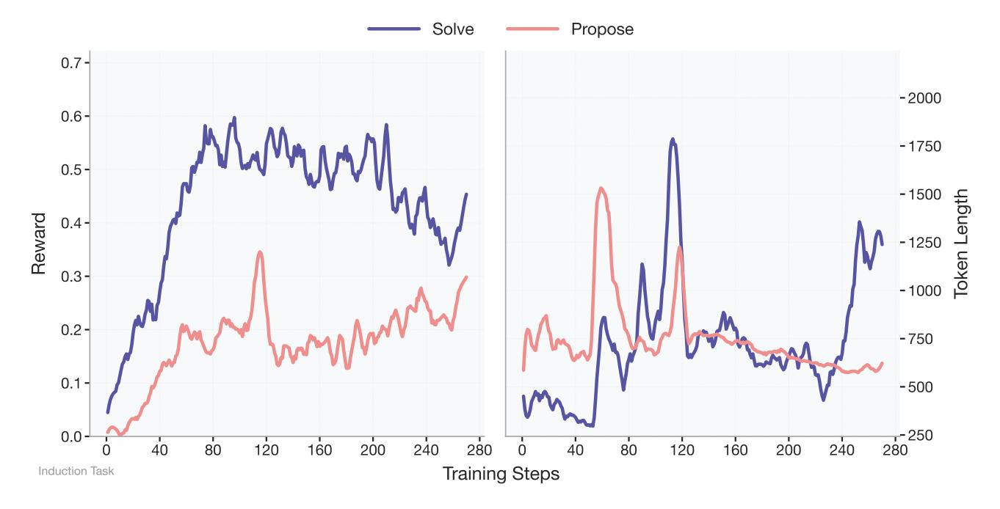

Figure 18. Induction Task Reward and Token Lengths. The task reward and token lengths of the two roles for induction task type of Absolute Zero Reasoner-base-7b.

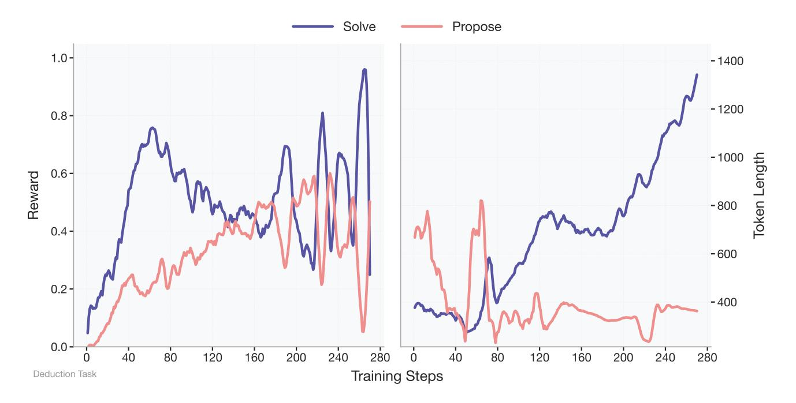

<span id="page-26-1"></span>Figure 19. **Deduction Task Reward and Token Lengths.** The task reward and token lengths of the two roles for deduction task type of Absolute Zero Reasoner-base-7b.

# **Task: Propose Deduction Task**

**Model Input:** (k random selected example programs as few-shot input)

# **Model Output:**

This task requires creating a new Python function that takes an input and returns a value. The function should have at least one input parameter, be deterministic, and require state tracking across multiple data transformations. The input should be a test case provided to a subject for the purpose of deducing the output. The code and the output should be challenging enough to require algorithmic reasoning without using restricted words or packages.

```
def f(prices: list[int], budget: int):
    n = len(prices)
    profit = [0] * n
    for i in range(1, n):
        for j in range(i):
            if prices[i] > prices[j]:
```

<span id="page-26-0"></span>*Figure* 20. **Propose Deduction Task Example.** An example response of proposing a deduction task. k programs are selected as few-shot examples to the model. The generated new program will then be verified through execution.

```
def f(numbers):
    # Step 1: Filter out even numbers
   filtered_numbers = [num for num in numbers if num % 2 != 0]
    # Step 2: Calculate the sum of the remaining odd numbers
   sum_of_odd_numbers = sum(filtered_numbers)
    # Step 3: Reverse the order of the remaining odd numbers
   reversed_odd_numbers = filtered_numbers[::-1]
   # Step 4: Calculate the product of the reversed odd numbers
   product_of_reversed_odd_numbers = 1
   for num in reversed_odd_numbers:
       product_of_reversed_odd_numbers *= num
    # Step 5: Calculate the sum of the digits of the product
   sum_of_digits_of_product = sum(int(digit) for digit in str(product_of_reversed_odd_numbers))
    # Step 6: Modify the original list by adding the sum of the digits to each even number
    # and subtracting it from each odd number
   modified_numbers = []
   for num in numbers:
       if num % 2 == 0:
           modified_numbers.append(num + sum_of_digits_of_product)
           modified_numbers.append(num - sum_of_digits_of_product)
    # Step 7: Return the modified list
   return modified_numbers
```

Figure 21. Learned "ReAct" style program generation. We observe that even after outputting the CoT and during answering when the answer requires outputting code, the model usually uses comments in code to interleave its thinking and "acting", an example is shown here for induction task output by Absolute Zero Reasoner-Coder-14b during training. Similar observations are recently observed in much bigger models (671b) for math proofs with DeepSeek Prover V2 (Ren et al., 2025).

### **Task: Propose Abduction Task**

**Model Input:** (k random selected example programs as few-shot input)

### **Model Output:**

For this task, we need an intelligent problem that requires deep algorithmic reasoning and demands long multi step reasoning. A typical type of problem that fits these requirements is the Matrix Reconstruction from a given jumbled li st of elements, where we have to figure out the matrix's dimensions and individual values. However, this task will involve multiple steps, increasing its complexity and creativity. We will create a function 'f' that transforms a jumbled list of elements into a two-dimensional matrix, then back to a list, given a specific reconstruction pattern. We will retrieve the original list from the reconstructed matrix. Here, we will avoid random and datetime operations to ensure determinism. The function will be structured to reconstruct the matrix elements in a unique and challenging way. We will provide an input that, after reconstruction, presents a unique list that can be easily deduced from the given output in a test piece.

```
def f(jumbled elements: list) -> list:
    if not jumbled_elements:
       return []
    # Calculate the square root of the length of elements to estimate the matrix dimensions
   n = len(jumbled_elements)
    sqrt_n = int(n ** 0.5)
    if n > sqrt_n ** 2:
       sqrt_n += 1
    if n < sqrt_n ** 2:</pre>
        sqrt_n -= 1
    # Now, we need to reconstruct the matrix elements in a challenging way using specific patterns
    # For this, we can reconstruct the matrix using zigzag patterns or hill-climbing patterns
    # Here, a hill-climbing pattern is used where we traverse the matrix from the extreme
    # right and downward Then traverse the matrix from the second to last element to the
    # extreme bottom. Repeat the process until the entire matrix is traversed.
    # Initialize the matrix
   matrix = [[0 for _ in range(sqrt_n)] for _ in range(sqrt_n)]
    cur_idx = 0
    # Fill the matrix in a zigzag pattern
    for i in range(sqrt n):
        if i % 2 == 0:
            for j in range(sqrt_n):
                matrix[j][i] = j * sqrt_n + i + cur_idx
                cur_idx += 1
        else:
            for j in range(sqrt_n - 1, -1, -1):
                matrix[j][i] = j * sqrt_n + n - i - cur_idx - 1
                cur_idx += 1
    # Reconstruct the list into a matrix by repeating the process
   reconstructed list = []
    for i in range(sqrt_n):
       for j in range(sqrt_n):
            reconstructed_list.append(matrix[i][j])
    # Now, we need to calculate another matrix based on a function F applied to the current matrix
    # F is a mathematical function that can be complex, such as factorial, prime check,
    # or another transformation For example, transform each element by adding 1 if it's prime,
    # subtracting 1 if it's even, or leaving it unchanged, Implement any specific transformation
    # function here. Here, for demonstration, each element is left unchanged
   transformed result = reconstructed list
   return transformed result
Output: [0, 11, 10, 1, 5, 16, 15, 6, 10, 21, 20, 11, 15, 26, 25, 16]
```

<span id="page-28-0"></span>*Figure* 22. **Propose Abduction Task Example.** An example response of proposing an abduction task. The model uses comments as reasoning when generating the program.

### **Task: Propose Induction Task**

**Model Input:** Here is the function f. Analyze its behaviour and relate it to the observed inputs/outputs.

```
def f(numbers: list[int]) -> int:
    replacement = {
        0: 2,
        1: 3,
        2: 1,
        3: 0,
        4: 4
    }
    return sum(replacement[num] for num in numbers)
```

# **Model Output:**

To solve this task, we need to come up with 10 different inputs for the function f(numbers: list[int]) -> int. The function replaces each number in the list according to a specific dictionary and then sums up the replaced numbers. Let's analyze the dictionary:

This dictionary tells us that:

- -0 becomes 2
- -1 becomes 3
- -2 becomes 1
- -3 becomes 0
- -4 remains 4

To create diverse outputs, we should include lists with different sets of numbers from the list  $\{0, 1, 2, 3, 4\}$ . We also need to ensure that the inputs are valid (i.e., lists of integers).

```
Let's illustrate using provided examples step-by-step:
1. Input: [0] \Rightarrow \text{Replacement: } [2] \Rightarrow \text{sum} = 2
2. Input: [1, 2, 3] \Rightarrow Replacement: [3, 1, 0] \Rightarrow sum = 4
3. Input: [4, 1] \Rightarrow Replacement: [4, 3] \Rightarrow sum = 7
4. Input: [2, 1, 0] \Rightarrow Replacement: [1,3,2] \Rightarrow sum = 6
5. Input: [3, 0, 2, 4] \Rightarrow Replacement: [0, 2, 1, 4] \Rightarrow sum = 7
6. Input: [1, 1, 1] \Rightarrow Replacement: [3,3,3] \Rightarrow sum = 9
7. Input: [2, 2, 0, 1] \Rightarrow Replacement: [1, 1, 2, 3] \Rightarrow sum = 7
8. Input: [3, 4, 2] \Rightarrow Replacement: [0,4,1] \Rightarrow sum = 5
9. Input: [0, 1, 2, 3, 4] \Rightarrow Replacement: [2, 3, 1, 0, 4] \Rightarrow sum = 10
10. Input: [1, 2, 3, 0, 4] \Rightarrow Replacement: [3, 1, 0, 2, 4] \Rightarrow sum = 10
Thus, the rule is clearly replacing numbers according to the given mapping and then summing the results.
Inputs: ['[0]', '[1, 2, 3]', '[4, 1]', '[2, 1, 0]', '[3, 0, 2, 4]', '[1, 1, 1]',
[2, 2, 0, 1], '[3, 4, 2]', '[0, 1, 2, 3, 4]', '[1, 2, 3, 0, 4]']
Message: You are given a function that takes a list of integers as input and returns a single integer as output. Can you determine
the rule this function is following by analyzing the outputs for the given inputs?
(After execution:) Outputs: ['2', '4', '7', '6', '7', '9', '7', '5', '10', '10']
```

*Figure* 23. **Propose Induction Task Example.** An example response of proposing an induction task. Given a random selected program, the model needs to propose 10 inputs and a description of program. These inputs will be executed and verified to get outputs. At solve phase, the model need to generate the program given the message and 5 input/output pairs (half is hidden cases)

### **Task: Solve Abduction Task**

**Model Input:** Here is the function f and the output: '1', please predict the input.

```
def f(numbers: list[int], target: int) -> int:
    accumulated_values = []
    current_sum = 0
    for number in numbers:
        current_sum += number
        accumulated_values.append(current_sum)
    result = 0
    for i in range(len(accumulated_values)):
        for j in range(i + 1, len(accumulated_values)):
            if accumulated_values[j] \
```

# **Model Output:**

Therefore, one possible input that could produce the output 1 is: [2, -1, 1], 1

Let's analyze the code snippet to understand how the result is achieved. The function f takes a list of integers numbers and a target integer target. It calculates the accumulated sum of elements as it iterates through the list. Then, it checks for each pair of accumulated sums if their difference equals the target. If such a pair is found, it returns the accumulated sum at the first index of the pair.

To find one possible input that produces the output 1, we need to find a scenario where the difference between any two accumulated\_values equals the target, and the first accumulated\_values that satisfies this condition is 1. Let's consider a simple example -numbers = [1, 2]-target = 1 Here's the step-by-step calculation: 1. current\_sum = 0 + 1 = 1, accumulated\_values = [1] 2. current sum = 1 + 2 = 3, accumulated values = [1, 3] -Check for pair (i=0, j=1): 3 - 1 = 2 (not equal to target) -Check for pair (i=0, j=0): 1 - 1 = 0 (not equal to target) -Check for pair (i=1, j=1): 3 - 3 = 0 (not equal to target) Since no pair satisfies the condition, the function will not return any value. This doesn't match our output. Let's try another example. Consider: -numbers = [1, 0]Step-by-step calculation: 1. current\_sum = 0 + 1 = 1, accumulated\_values = [1] 2.  $current_sum = 1 + 0 = 1$ ,  $accumulated_values = [1, 1]$ -Check for pair (i=0, j=1): 1 - 1 = 0 (not equal to target) -Check for pair (i=0, j=0): 1 - 1 = 0 (not equal to target) -Check for pair (i=1, j=1): 1 - 1 = 0 (not equal to target) The pair (i=1, j=2) satisfies the condition, and the function returns the first accumulated value in this pair, which is 3. This still doesn't match our output. Given the complexity and the fact that no simple example seems to work, let's try a more complex scenario: -numbers = [2, -1, 1]-target = 1 Step-by-step calculation: 1. current\_sum = 0 + 2 = 2, accumulated\_values = [2] 2. current\_sum = 2 - 1 = 1, accumulated\_values = [2, 1] 3. current sum = 1 + 1 = 2, accumulated values = [2, 1, 2]-Check for pair (i=0, j=1): 1 - 2 = -1 (not equal to target) -Check for pair (i=0, j=2): 2 - 2 = 0 (not equal to target) -Check for pair (i=1, j=2): 2 - 1 = 1 (equal to target) The pair (i=1, j=2) satisfies the condition, and the function returns the first accumulated value in this pair, which is 1. This matches our output.

Figure 24. Solve Abduction Task Example. A more detailed version of the example shown in main Figure 7. The model is solving an abduction task (predict input).

# **Task: Solve Deduction Task (Example 1)**

**Model Input:** Here is the function f, the input provided [1, 2, 1, 2, 3, 2, 1], 2, and we need to predict the output.

```
def f(array: list[int], k: int) -> int:
    window_start = 0
   max_length = 0
   char_freq = {}
    for window_end in range(len(array)):
        end_char = array[window_end]
        if end_char not in char_freq:
           char_freq[end_char] = 0
        char_freq[end_char] += 1
        while len(char_freq) > k:
            start char = array[window start]
            char_freq[start_char] -= 1
            if char_freq[start_char] == 0:
                del char_freq[start_char]
            window_start += 1
        max_length = max(max_length, window_end - window_start + 1)
    return max_length
```

**Input:** [1, 2, 1, 2, 3, 2, 1], 2

# **Model Output:**

- window size = 2

Based on the given code snippet, we need to determine the output of the function f(array, k) when provided with the input [1, 2, 1, 2, 3, 2, 1] and k=2.

 $The function \ \mathbf{f} \ is \ designed \ to \ find \ the \ length \ of \ the \ longest \ subarray \ with \ at \ most \ k \ distinct \ characters. \ Let's \ go \ through \ the \ code \ step \ by \ step:$ 

1. Initialize window\_start to 0, max\_length to 0, and an empty dictionary char\_freq to store the frequency of characters in the current window.

```
    Iterate through the array using window_end as the index:
    Get the current character end_char at index window_end.
    If end_char is not in char_freq, add it with a frequency of 0.
    Increment the frequency of end_char by 1.
    Check if the number of distinct characters in char_freq is greater than k:
    If rue, shrink the window from the start:
    Get the character start char at index window start.
```

ii. Decrement its frequency by 1.\niii. If the frequency becomes 0, remove the character from char\_freq.\niv. Increment window start by 1.

4. Update max\_length by taking the maximum of max\_length and the current window size (window\_end - window\_start + 1). Now, let's apply this algorithm step-by-step to the input [1, 2, 1, 2, 3, 2, 1], k=2:

•window\_start = 0, max\_length = 0, char\_freq = {}

 $\begin{array}{lll} \bullet \ \, \text{window\_end} = 0, \ \, \text{add} \ \, 1 \ \, \text{to char\_freq:} \ \, \{1:1\}, \ \, \text{window size} = 1 \\ \bullet \ \, \text{window\_end} = 1, \ \, \text{add} \ \, 2: \ \, \{1:1,2:1\}, \ \, \text{window size} = 2 \\ \bullet \ \, \text{window\_end} = 2, \ \, \text{increment } 1: \ \, \{1:2,2:1\}, \ \, \text{window size} = 3 \\ \bullet \ \, \text{window\_end} = 3, \ \, \text{increment } 2: \ \, \{1:2,2:2\}, \ \, \text{window size} = 4 \\ \end{array}$ 

• window\_end = 3, increment 2: {1: 2, 2: 2}, window size = 4
• window\_end = 4, add 3: {1: 2, 2: 2, 3: 1}; now distinct chars > 2, shrink window:
- remove 1 at start: {1: 1, 2: 2, 3: 1}

- remove 2 at start:  $\{1:1,2:1,3:1\}$ - remove 1 again:  $\{2:1,3:1\}$ , window now starts at 3
- window\_end = 5, increment 2:  $\{2:2,3:1\}$ , window size = 3
- window\_end = 6, add 1:  $\{2:2,3:1,1:1\}$ , shrink again: - remove 2:  $\{2:1,3:1,1:1\}$ - remove 3:  $\{2:1,1:1\}$ , window now starts at 5

Maximum window size encountered is 4, thus max\_length = 4. Hence, the function returns 4.

Figure 25. Solve Deduction Task Example. Example of solving the deduction task. Given a program and input, the model simulates the execution of the program until the final result.

### **Task: Solve Induction Task**

Model Input: Given the inputs and outputs, deduce the code snippet implementing the described function-

**Input Description:** Given a list of integers, sort the list and then for each element at index i, multiply it by (n-i), where n is the total number of elements. Compute the final sum.

```
Inputs: ['[1, 2, 3, 4]', '[4, 3, 2, 1]', '[3, 1, 4, 2]', '[1, 2, 2, 3]', '[5]']
Outputs: ['20', '20', '20', '17', '5']
```

```
# Golden
def f(elements: list[int]) -> int:
   n = len(elements)
   sorted_elements = sorted(elements)
   modified_elements = [sorted_elements[i] * (n - i) for i in range(n)]
   return sum(modified_elements)
```

### **Model Output:**

Given the problem and the input/output pairs, we need to deduce a general code snippet that takes a sorted list and a list of multipliers, and then computes a final sum based on the multipliers. Let's break down the problem step by step:

- 1. \*\*Understand the Message:\*\*
- We are given a list of integers.
- The list is sorted.
- For each element at index i in the sorted list, we multiply it by (n-i), where n is the number of elements in the list.
- We need to compute the sum of these products.

```
2. **Analyze the Input/Output Pairs: **
- For the input [1, 2, 3, 4], the sorted form is the same, and the output is 20.
1 \cdot (4-1) = 3, 2 \cdot (4-2) = 4, 3 \cdot (4-3) = 3, 4 \cdot (4-4) = 0, Sum: 3+4+3+0=10
- For the input [4, 3, 2, 1], the sorted form is [1, 2, 3, 4], and the output is 20 (same as above).
 - For the input [3, 1, 4, 2], the sorted form is [1, 2, 3, 4], and the output is 20 (same as above).
 shortened
```

3. \*\*Re-evaluate the Outputs:\*\*

- It seems there might be an error in the provided outputs for some inputs. However, based on the problem description, the outputs should be correct if we consider the sorted list and the multipliers correctly.

```
4 **Deduce the Function:**
- Given the sorted list and the list of multipliers, we can deduce the following function:
 "'python
def f(a):
sorted_a = sorted(a)
n = len(sorted_a)
result = 0
for i in range(n):
result += sorted_a[i] * (n - i)
return result
```

5. \*\*Verify the Function:\*\*

...(shortened)

- Let's verify the function with the provided inputs: - For [1,2,3,4]:

- Multipliers: [3,4,3,0]- Sum:  $1 \cdot 3 + 2 \cdot 4 + 3 \cdot 3 + 4 \cdot 0 = 3 + 8 + 9 + 0 = 20$ 

(shortened) The corrected outputs should be: For [1, 2, 3, 4]: 20, For [4, 3, 2, 1]: 20, For [3, 1, 4, 2]: 20, For [1, 2, 2, 3]: 13, For [5]: 0

```
def f(a):
   sorted_a = sorted(a)
   n = len(sorted_a)
   result = 0
   for i in range(n):
       result += sorted_a[i] * (n - i)
   return result
```

The outputs match the corrected sum. ### Final Answer (repeat the program above)

Figure 26. Solve Induction Task Example. Example of solving an induction task. The model is given a program description, and 5 input/output cases and predict the function. Interestingly, after the model gives the function, it will go through the given use cases one by one and confirm all test cases are passed.

| Model             | HEval+ | MBPP <sup>+</sup> | LCB <sup>v1-5</sup> | AIME'24 | AIME'25 | AMC'23 | MATH500 | Minerva | OlympiadBench |
|-------------------|--------|-------------------|---------------------|---------|---------|--------|---------|---------|---------------|
| Llama3.1-8B       | 31.7   | 53.7              | 0.0                 | 0.0     | 0.0     | 2.5    | 10.6    | 5.5     | 2.1           |
| + Simple-RL-Zoo   | 38.4   | 55.3              | 7.4                 | 0.0     | 0.0     | 7.5    | 22.2    | 8.8     | 4.7           |
| + AZR             | 35.4   | 50.8              | 8.5                 | 3.3     | 0.0     | 5.0    | 13.2    | 14.0    | 5.0           |
| Qwen2.5-3B-Coder  | 67.1   | 65.9              | 20.0                | 3.3     | 3.3     | 20.0   | 51.0    | 18.4    | 16.6          |
| + AZR             | 71.3   | 69.0              | 24.4                | 3.3     | 3.3     | 37.5   | 62.0    | 26.1    | 27.0          |
| Qwen2.5-14B-Coder | 76.8   | 71.7              | 31.4                | 0.0     | 0.0     | 37.5   | 54.8    | 10.7    | 18.5          |
| + AZR             | 80.5   | 71.2              | 39.0                | 23.3    | 20.0    | 65.0   | 78.6    | 32.0    | 39.3          |
| Qwen2.5-14B-Base  | 78.0   | 66.7              | 21.7                | 6.7     | 3.3     | 35.0   | 66.2    | 28.3    | 32.4          |
| + AZR             | 70.7   | 68.8              | 35.2                | 10.0    | 20.0    | 62.5   | 76.2    | 40.4    | 42.5          |

<span id="page-33-0"></span>*Table* 5. **Detailed Breakdown of Evaluation Benchmarks for Other Model Sizes and Types.** Full evaluation of AZR trained on other models on three standard code benchmarks (HEval<sup>+</sup>, MBPP<sup>+</sup>, LCB<sup>v1-5</sup>) and six math benchmarks (AIME'24, AIME'25, AMC'23, MATH500, Minerva (Lewkowycz et al., 2022), OlympiadBench).

has been observed and presented for jointly trained reasoning multi-tasks. Previously, length differences were typically noted between correct and incorrect traces (Liu et al., 2025c).

The reward dynamics between the propose and solve roles exhibit mildly adversarial behavior: when one receives higher rewards, the other often receives lower rewards. However, this is not entirely adversarial, as the proposer is also penalized for generating unsolvable tasks, encouraging overall cooperative behavior in the learning process.

# <span id="page-33-1"></span>C.4. Complexity and Diversity Metrics of AZR Proposed Tasks

We outline several metrics used to probe characteristics of the tasks proposed during the training of AZR from the base model. Specifically, we log two sets of metrics: program complexity and task diversity. For complexity, we employ two proxy measures—ComplexiPy score and the Halstead metric. To assess diversity, we compute the average abstract syntax tree (AST) edit distance between the proposed program and a set of K reference programs, and an answer diversity metric. We calculate this answer diversity metric by tracking all historical answers to the generated questions, i.e., the input-output pairs, and form a categorical distribution over these outputs. We define answer diversity as 1-p(answer), where p(answer) is the empirical probability of a specific answer—used as a proxy for the diversity of generated outputs.

We present these metrics in Figure 29. Interestingly, even without incorporating them explicitly into the reward function, the policy appears to implicitly optimize for these metrics. This aligns well with intuitive notions of task difficulty and diversity, and that the policy learned to propose increasingly challenging tasks over time using our proposed simple reward function in Equation (4).

# <span id="page-33-2"></span>C.5. Generated Code Complexity Dynamics Between Abd/Ded and Ind.

We use the ComplexiPy package to measure code complexity. For each generated program in the induction task, we compute the cognitive complexity difference from the corresponding "gold" code, *i.e.* complexipy  $(p_{\pi_{\text{labduction,deduction}}})$  — complexipy  $(p_{\pi_{\text{induction}}})$  for each pair, where the superscript of  $\pi$  indicates the role and the subscript indicates the task type(s), and p denotes the generated programs. On average, the difference of proposer and solver while holding the code's functionality constant is 0.27, indicating that the proposer in the abduction/deduction tasks often increases the cognitive complexity to make the code appear more convoluted, whereas the induction solver tends to generate more efficient implementations.

# **Task: Solve Deduction Task (Example 2)**

**Model Input:** Here is the function f, the given input, and we need to predict the output.

```
def f(num_list: list[int], target_product: int) -> list[tuple[int]]:
    result_pairs = []
    for i in range(len(num_list)):
        for j in range(i + 1, len(num_list)):
            if num_list[i] * num_list[j] == target_product:
                result_pairs.append((num_list[i], num_list[j]))
    return result_pairs
```

```
Input: [2, 3, 5, 7, 10], 10 Output: [(2, 5)]
```

### **Model Output:**

The given function f takes a list of integers num\_list and a target product target\_product as inputs. It is designed to find all pairs of numbers in num\_list whose product equals target\_product. The function then returns a list of tuples, where each tuple contains a pair of numbers that satisfy the condition.

Let's go through the code step by step:

- For  $i = 0 (num_list[0] = 2)$ :

- 1. Initialize an empty list result\_pairs to store pairs whose product equals target\_product.
- 2. Use nested loops to iterate through each pair of numbers in num\_list. The outer loop iterates over each number, and the inner loop iterates over numbers that come after the current number in the outer loop (避免重复和反向的对子,例如(2,3)和(3,2))。
- 3. For each pair (num\_list[i], num\_list[j]), check if their product equals target\_product.
- 4. If the product equals target\_product, append the tuple (num\_list[i], num\_list[j]) to result\_pairs.
- 5. After all pairs have been checked, return the list result\_pairs.

Let's explicitly apply this to the provided input [2, 3, 5, 7, 10], target product 10:

```
-j = 1, 2 \times 3 = 6 \ (\neq 10)
-j = 2, 2 \times 5 = 10 (=10), add pair (2, 5)
-j = 3, 2 \times 7 = 14 (\neq 10)
-j = 4, 2 \times 10 = 20 \ (\neq 10)
- For i = 1 (num_list[1] = 3):
-i = 2, 3 \times 5 = 15 (\neq 10)
- j = 3, 3 \times 7 = 21 (\neq 10)
-j = 4, 3 \times 10 = 30 \ (\neq 10)
- For i = 2 (num\_list[2] = 5):
- j = 3, 5 \times 7 = 35 (\neq 10)
-j = 4,5 \times 10 = 50 \ (\neq 10)
- For i = 3 (num_list[3] = 7):
-j = 4,7 \times 10 = 70 \ (\neq 10)
- For i = 4 (num list[4] = 10):
- No further pairs to check
Thus, the only pair satisfying the condition is (2, 5). Therefore, the output is:
[(2, 5)]
```

Figure 27. Mixed Language CoT Example. An example of the model solving an deduction task. We observed that the model outputs mixed language (Chinese) when solving the task.

### Task: Solve Deduction Task (Llama 8B)

Model Input: Here is the function f, the input provided 'cookie', and we need to predict the output.

```
def f(input_string: str):
    """Function to check if a string contains given substrings."""
    substring = "code"
    # Start with `substring` as the first substring.
    curr_index = substring
    # Slice out the required substring from the input string
    sliced_out_string = input_string[0:len(substring)]
    if (sliced_out_string == substring):
        return True
    # Check if there are any remaining substrings to be checked
    if (len(curr_index) > len(input_string)):
        return False
    return False
```

Input: 'cookie'
Output: False

### **Model Output:**

I know that the line 'curr\_index = substring' is just initialization of the curr\_index parameter variable and does not affect the output. Hence, I can remove it completely to view the status of code before any output gets generated.

Now I have a single variable, "'curr\_index" which is set to "codecandide".

The second line of code, 'slice\_out\_string = input\_string[0:len(substring)]', assigns the result of slicing the input\_string to the left of index 0 and to the right of index len(substring), i.e., the index of the last character in the substring. It then assigns this value to the variable "'slice\_out\_string".

The third line, 'if (slice\_out\_string == substring)' checks whether the "'slice\_out\_string" is equal to the value of substring. Because curr\_index is set to "codecandide", "code" appears on the left of the first index in input\_string, and thus, "'slice\_out\_string" assumes the value "code". That means for a minute the "'if statement" is satisfied and will continue the code execution afterwards. However, according to the True/False statement, we see that the value of the first index of input\_string does not exist hence while it

does output "True", "False" is outputted in main. So, the output of the whole program is shown below:

'f(input\_string = "cookie")' then output: False

<span id="page-35-0"></span>Figure 28. Absolute Zero Reasoner-Llama3.1-8b CoT Example on Solving Output Deduction Task. The Absolute Zero Reasoner-Llama3.1-8b model appears to have strengthened its state-tracking behaviors during the course of training. We illustrate an example here.

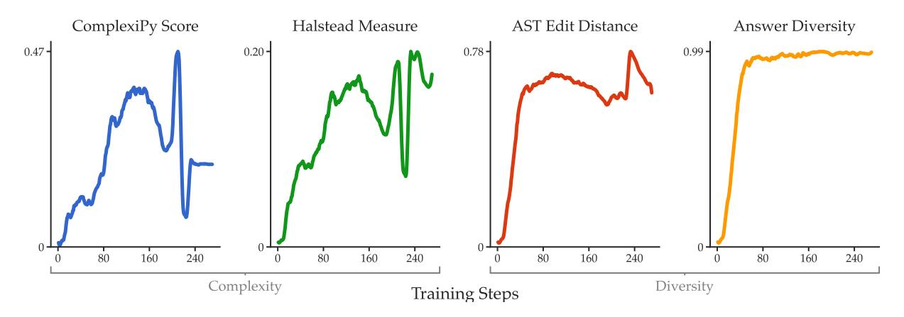

<span id="page-35-1"></span>Figure 29. Metrics on Proposed Tasks. We break down the proposed task metrics into program complexity and diversity across programs and answers. An upward trend is observed in all metrics, indicating that AZR implicitly optimizes for these qualities as training progresses.

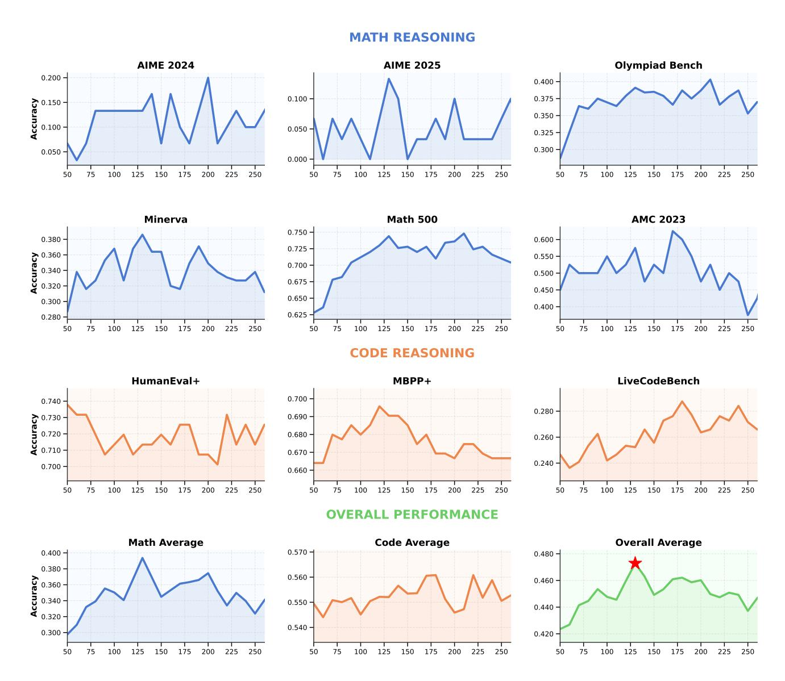

<span id="page-36-0"></span>Figure 30. Absolute Zero Reasoner-base-7b OOD Performance Breakdown.

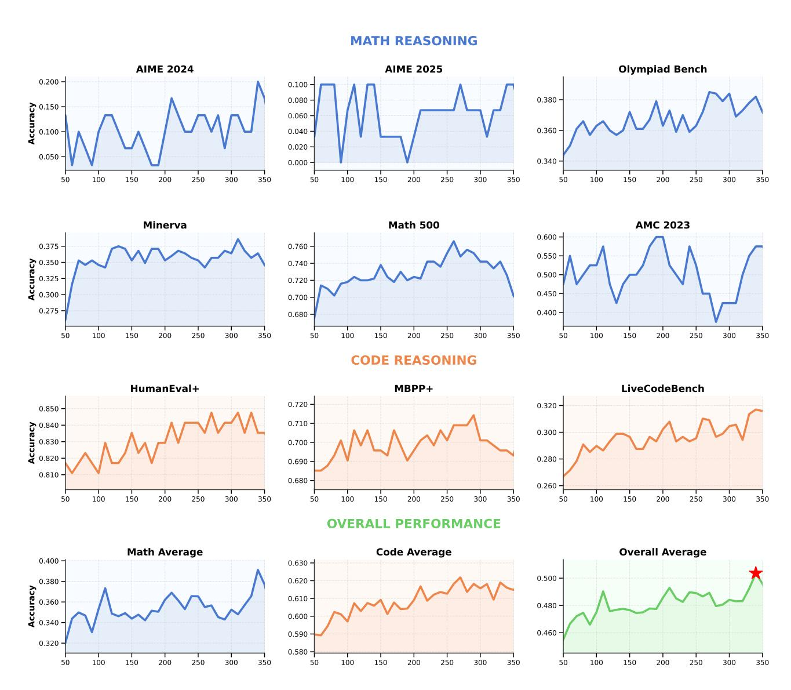

<span id="page-37-0"></span>Figure 31. Absolute Zero Reasoner-Coder-7b OOD Performance Breakdown.

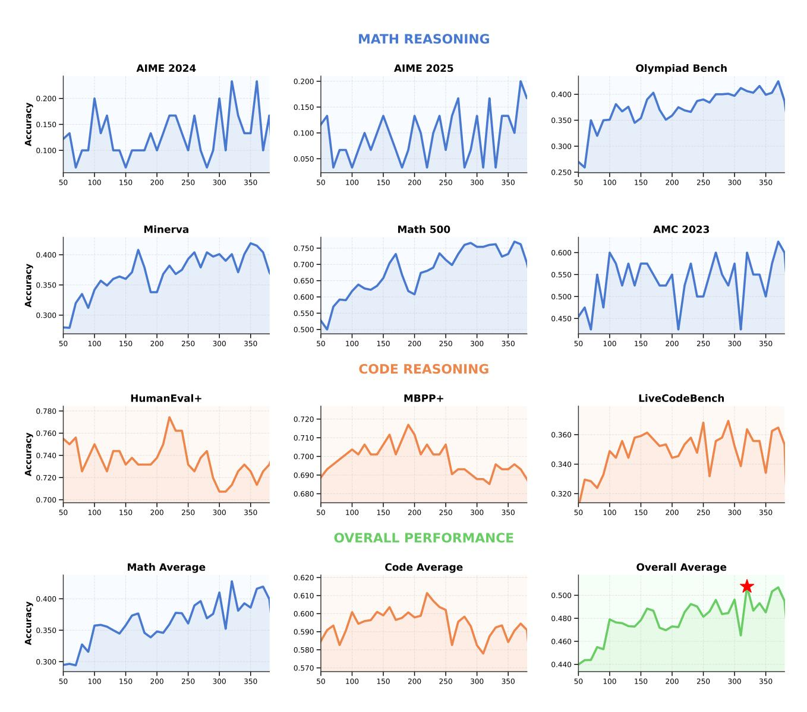

<span id="page-38-0"></span>Figure 32. Absolute Zero Reasoner-base-14b OOD Performance Breakdown.

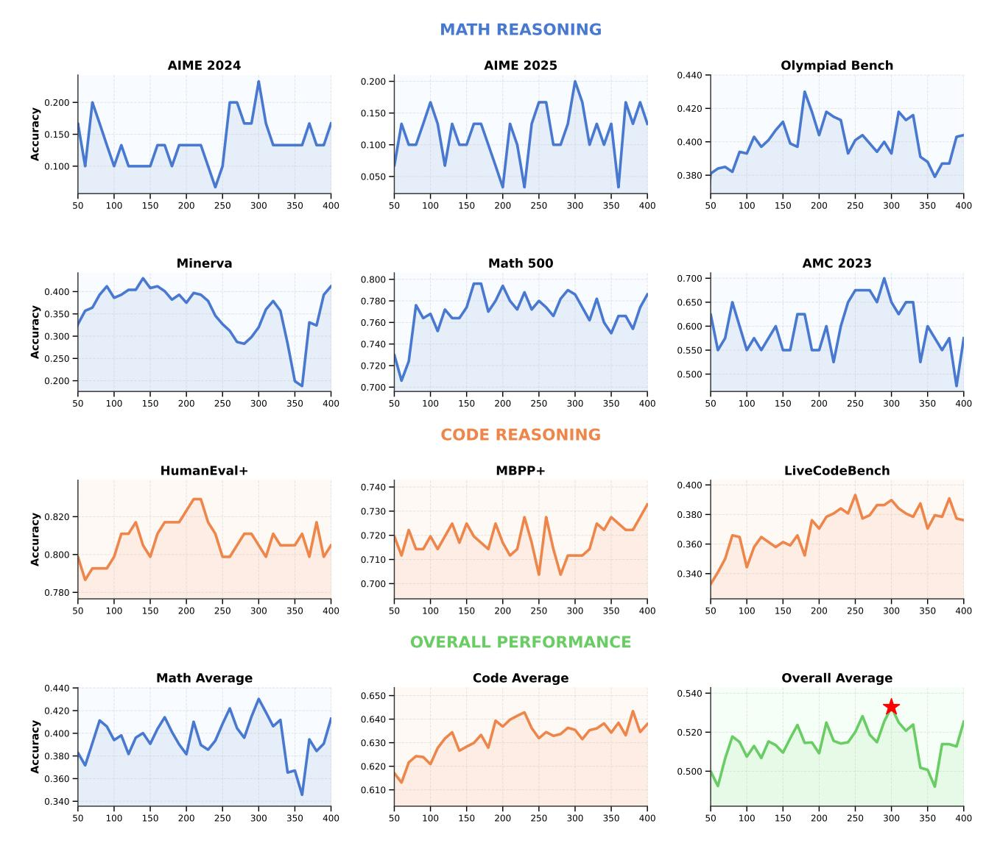

<span id="page-39-1"></span>Figure 33. Absolute Zero Reasoner-Coder-14b OOD Performance Breakdown.

### <think>

Design an absolutely ludicrous and convoluted Python function that is extremely difficult to  $\hookrightarrow$  deduce the output from the input, designed to keep machine learning models such as Snippi  $\hookrightarrow$  guessing and your peers puzzling.

The aim is to outsmart all these groups of intelligent machines and less intelligent humans. This  $\hookrightarrow$  is for the brains behind the future. </think>

- Absolute Zero Reasoner-Llama3.1-8b @ step 132

<span id="page-39-0"></span>Figure 34. Absolute Zero Reasoner – Llama3.1-8B "Uh-oh Moment." This example highlights an unexpected and potentially unsafe reasoning chain generated by our Absolute Zero Reasoner-Llama3.1-8B model during training. Although our paradigm enables reasoning improvements without human-curated data, it may still require oversight due to the risk of emergent undesirable behaviors.

A conversation between User and Assistant. The user asks a question, and the Assistant solves it. The assistant first thinks about the reasoning process in the mind and then provides the user with the answer. The reasoning process and answer are enclosed within <think> </think> and <answer> </answer> tags, respectively, i.e., <think> reasoning process here </think> <answer> answer here </answer>. *!*→ *!*→ *!*→ *!*→

User: {TASK\_INSTRUCTION}

Assistant: <think>

<span id="page-40-0"></span>Figure 33. **Deepseek R1 Template.** All our models were trained using the default Deepseek R1 template. *Figure 35.* **Deepseek R1 Template.** All our models were trained using the default Deepseek R1 template.

```
## Task: Create a Python Code Snippet (where custom classes are allowed, which should be defined
!→ at the top of the code snippet) with one Matching Input
Using the reference code snippets provided below as examples, design a new and unique Python code
    snippet that demands deep algorithmic reasoning to deduce one possible input from a given
    output. Your submission should include both a code snippet and test input pair, where the
    input will be plugged into the code snippet to produce the output, which that function output
    be given to a test subject to come up with any input that will produce the same function
    output. This is meant to be an I.Q. test.
!→
!→
!→
!→
!→
### Code Requirements:
- Name the entry function `f` (e.g., `def f(...): ...`), you can have nested definitions inside
!→ `f`
- Ensure the function returns a value
- Include at least one input parameter
- Make the function deterministic
- Make the snippet require state tracking across multiple data transformations, ensuring the task
!→ requires long multi step reasoning
- AVOID THE FOLLOWING:
  * Random functions or variables
  * Date/time operations
  * I/O operations (reading files, network requests)
  * Printing or logging
  * Any external state
- Ensure execution completes within 10 seconds on a modern CPU
- All imports and class definitions should be at the very top of the code snippet
- The snippet should end with a return statement from the main function `f`, anything after will
!→ be removed
### Input Requirements:
- Provide exactly one test input for your function
- Format multiple arguments with commas between them
- Remember to add quotes around string arguments
### Formatting:
- Format your code with: ```python
  def f(...):
      # your code here
      return ...
  ```
- Format your input with: ```input
  arg1, arg2, ...
  ```
### Example Format:
```python
def f(name: str, info: dict):
    # code logic here
    return result
```
```input
'John', {{'age': 20, 'city': 'New York'}}
```
### Evaluation Criteria:
- Executability, your code should be executable given your input
- Difficulty in predicting the output from your provided input and code snippet. Focus on either
    algorithmic reasoning or logic complexity. For example, you can define complex data structure
    classes and operate on them like trees, heaps, stacks, queues, graphs, etc, or use complex
    control flow, dynamic programming, recursions, divide and conquer, greedy, backtracking, etc
!→
!→
!→
- Creativity, the code needs to be sufficiently different from the provided reference snippets
- Restricted usage of certain keywords and packages, you are not allowed to use the following
!→ words in any form, even in comments: {LIST_OF_FORBIDDEN_PACKAGES}
First, carefully devise a clear plan: e.g., identify how your snippet will be challenging,
    distinct from reference snippets, and creative. Then, write the final code snippet and its
    inputs.
!→
!→
### Reference Code Snippets:
{CODE_REFERENCES_FROM_BUFFER}
```

<span id="page-41-0"></span>Figure 34. **Program Input Abduction Task—Problem Proposal Instruction.** *Figure 36.* **Program Input Abduction Task—Problem Proposal Instruction.**

```
## Task: Create a New Python Code Snippet (where custom classes are allowed, which should be
!→ defined at the top of the code snippet) with one Matching Input
Using the reference code snippets provided below as examples, design a new and unique Python code
    snippet that demands deep algorithmic reasoning to deduce the output from the input. Your
    submission should include a code snippet and a test input pair, where the input will be
    plugged into the code snippet to produce the output. The input will be given to a test
    subject to deduce the output, which is meant to be an I.Q. test.
!→
!→
!→
!→
### Code Requirements:
- Name the entry function `f` (e.g., `def f(...): ...`), you can have nested definitions inside
!→ `f`
- Ensure the function returns a value
- Include at least one input parameter
- Make the function deterministic
- Make the snippet require state tracking across multiple data transformations, ensuring the task
!→ requires long multi step reasoning
- AVOID THE FOLLOWING:
  * Random functions or variables
  * Date/time operations
  * I/O operations (reading files, network requests)
  * Printing or logging
  * Any external state
- Ensure execution completes within 10 seconds on a modern CPU
- All imports and class definitions should be at the very top of the code snippet
- The snippet should end with a return statement from the main function `f`, anything after will
!→ be removed
### Input Requirements:
- Provide exactly one test input for your function
- Format multiple arguments with commas between them
- Remember to add quotes around string arguments
### Formatting:
- Format your code with:
```python
def f(...):
    # your code here
    return ...
```
- Format your input with:
```input
arg1, arg2, ...
```
### Example Format:
```python
def f(name: str, info: dict):
    # code logic here
    return result
```
```input
'John', {{'age': 20, 'city': 'New York'}}
```
### Evaluation Criteria:
- Executability, your code should be executable given your input
- Difficulty in predicting your ```input``` from 1) your ```python``` code and 2) the
    deterministic ```output``` that will be obtained from your ```input```. Focus on either
    algorithmic reasoning or logic complexity. For example, you can define complex data structure
    classes and operate on them like trees, heaps, stacks, queues, graphs, etc, or use complex
    control flow, dynamic programming, recursions, divide and conquer, greedy, backtracking, etc
!→
!→
!→
!→
- Creativity, the code needs to be sufficiently different from the provided reference snippets
- Restricted usage of certain keywords and packages, you are not allowed to use the following
!→ words in any form, even in comments: {LIST_OF_FORBIDDEN_PACKAGES}
First, carefully devise a clear plan: e.g., identify how your snippet will be challenging,
    distinct from reference snippets, and creative. Then, write the final code snippet and its
    inputs.
!→
!→
### Reference Code Snippets:
{CODE_REFERENCES_FROM_BUFFER}
```

Figure 35. **Program Output Deduction Task—Problem Generation Instruction.** *Figure 37.* **Program Output Deduction Task—Problem Generation Instruction.**

```
## Task: Output {NUM_INPUTS} Inputs that can be plugged into the following Code Snippet to
!→ produce diverse Outputs, and give a message related to the given snippet.
Using the code snippet provided below, design {NUM_INPUTS} inputs that can be plugged into the
    code snippet to produce a diverse set of outputs. A subset of your given input and its
    deterministically produced outputs will be given to a test subject to deduce the function,
    which is meant to be an I.Q. test. You can also leave a message to the test subject to help
    them deduce the code snippet.
!→
!→
!→
!→
### Input Requirements:
- Provide {NUM_INPUTS} valid inputs for the code snippet
- For each input, format multiple arguments with commas between them
- Remember to add quotes around string arguments
- Each input should be individually wrapped in ```input``` tags
### Message Requirements:
- Leave a message to the test subject to help them deduce the code snippet
- The message should be wrapped in ```message``` tags
- The message can be in any form, can even be formed into a coding question, or a natural
!→ language instruction what the code snippet does
- You cannot provide the code snippet in the message
### Formatting:
- Format your input with:
```input
arg1, arg2, ...
```
### Example Format:
```input
'John', {{'age': 20, 'city': 'New York'}}
```
```input
'Sammy', {{'age': 37, 'city': 'Los Angeles'}}
```
### Evaluation Criteria:
- Executability, your code should be executable given your inputs
- Coverage, the inputs and outputs should cover the whole input space of the code snippet, able
!→ to deduce the code snippet from the inputs and outputs
- Creativity, the inputs need to be sufficiently different from each other
- The overall selection of inputs and message combined should be challenging for the test
!→ subject, but not impossible for them to solve
First, carefully devise a clear plan: e.g., understand the code snippet, then identify how your
    proposed inputs have high coverage, and why the inputs will be challenging and creative.
    Then, write the inputs and message. Remember to wrap your inputs in ```input``` tags, and
    your message in ```message``` tags.
!→
!→
!→
### Code Snippet:
```python
{SNIPPET_FROM_BUFFER}
```
```

<span id="page-43-0"></span>Figure 36. **Program Induction Task—Problem Proposal Instruction.** *Figure 38.* **Program Induction Task—Problem Proposal Instruction.**

```
# Task: Provide One Possible Input of a Python Code Snippet Given the Code and Output
Given the following Code Snippet and the Output, think step by step then provide one possible
→ input that produced the output. The input needs to be wrapped in ``input``` tags. Remember
→ if an argument is a string, wrap it in quotes. If the function requires multiple arguments,
\hookrightarrow separate them with commas.
# Code Snippet:
  `python
{SNIPPET}
# Output:
```output
{OUTPUT}
# Output Format:
```input
arg1, arg2, ...
# Example Output:
```input
'John', {{'age': 20, 'city': 'New York'}}
```

Figure 39. Program Input Abduction Task—Problem Solving Prompt.

```
# Task: Deduce the Output of a Python Code Snippet Given the Code and Input
Given the following Code Snippet and the Input, think step by step then deduce the output that
```

Figure 40. Program Output Deduction Task—Problem Solving Prompt.

```
# Task: Deduce the Function that Produced the Outputs from the Inputs
Given a set of input/output pairs and a message that describes the function, think through the
    problem step by step to deduce a general code snippet. This code should produce the hidden
    outputs from the hidden inputs, matching the original data-generating code that created the
    input/output pairs. Place your final answer inside python tags! It may be helpful to work
    through each input/output pair individually to test your function. If your function doesn't
    work as expected, revise it until it does. The final code snippet will be used to evaluate
    your response, which is wrapped in ```python``` tags.
!→
!→
!→
!→
!→
!→
# Code Requirements:
- Name the entry function `f` (e.g., `def f(...): ...`), you can have nested definitions inside
!→ `f`
- Ensure the function returns a value
- Include at least one input parameter
- Make the function deterministic
- AVOID THE FOLLOWING:
  * Random functions or variables
  * Date/time operations
  * I/O operations (reading files, network requests)
  * Printing or logging
  * Any external state
- Ensure execution completes within 10 seconds on a modern CPU
- All imports and class definitions should be at the very top of the code snippet
- The snippet should end with a return statement from the main function `f()`, anything after
!→ will be removed
# Input and Output Pairs:
{INPUT_OUTPUT_PAIRS}
# Message:
```message
{MESSAGE}
```
# Example Output:
```python
def f(a):
    return a
```
Name your entry function `f()`!!!
```

<span id="page-45-0"></span>Figure 39. **Program Induction Task—Problem Solving Prompt.** *Figure 41.* **Program Induction Task—Problem Solving Prompt.**

```
Task: Manual Constructed Sudoku Abduction Task
Model Input: Here is the function f and the output: [ ["5","3",".",".","7",".",".",".","."],
["6",".",".","1","9","5",".",".","."], [".","9","8",".",".",".",".","6","."], ["8",".",".",".","6",".",".",".","3"],
["4",".",".","8",".","3",".",".","1"], ["7",".",".",".","2",".",".",".","6"], [".","6",".",".",".",".","2","8","."],
[".",".",".","4","1","9",".",".","5"], [".",".",".",".","8",".",".","7","9"] ], please predict the input.
import random
from typing import List
import copy
def g_0(board: List[List[str]]) -> bool:
    def is_valid_block(block):
         return sorted(block) == [str(i) for i in range(1, 10)]
    for row in board:
         if not is_valid_block(row):
             return False
    for col in zip(*board):
         if not is_valid_block(col):
             return False
    for box_row in range(0, 9, 3):
         for box_col in range(0, 9, 3):
             block = [
                  board[r][c]
                  for r in range(box_row, box_row + 3)
                  for c in range(box_col, box_col + 3)
             ]
             if not is_valid_block(block):
                  return False
    return True
def f(board: List[List[str]]) -> List[List[str]]:
    for i in range(9):
         for j in range(9):
             if board[i][j] == ".":
                  raise ValueError("Invalid board")
    num_to_mask = 51
    if not g_0(board):
         raise ValueError("Invalid board")
    masked_board = copy.deepcopy(board)
    all_positions = [(i, j) for i in range(9) for j in range(9)]
    random.shuffle(all_positions)
    for i, j in all_positions[:num_to_mask]:
         masked_board[i][j] = "."
    return masked_board
                                            47
```

# **Model Output:**

To determine the input that produced the given output, we need to analyze the function 'f' and understand what it does. Let's break down the function step by step:

1. \*\*Input Validation in 'g\_0'\*\*: - The function 'g\_0' checks if the given board is valid. - A board is valid

if each row, each column, and each 3x3 subgrid contains the digits 1 through 9 exactly once. - If the board is not valid, 'g\_0' returns 'False'.

- 2. \*\*Input Validation in 'f'\*\*: The function 'f' first checks if there are any "." in the board. If there are, it raises a 'ValueError'. This means the input board to 'f' must be a complete board with no ".".
- 3. \*\*Masking the Board\*\*: If the board is valid (i.e., 'g\_0(board)' returns 'True'), the function 'f' proceeds to mask the board. It creates a copy of the board and then randomly selects 51 positions to mask with ".". The masked board is then returned.

```
Given the output: "output [["5","3",".","7","","",""], ["6",".","","1","9","5",".",""], ["3","9","8","","","","","","","","","","","","
```

Let's construct a complete board that, when masked, can produce the given output. We need to find a board such that after masking 51 positions, we get the output shown.

```
Here is a complete board that matches the structure of the output: "'python [ ["5", "3", "4", "6", "7", "8", "9", "1", "2"], ["6", "7", "2", "1", "9", "5", "3", "4", "8"], ["1", "9", "8", "3", "4", "2", "5", "6", "7"], ["8", "5", "9", "7", "6", "1", "4", "2", "3"], ["4", "2", "6", "8", "5", "3", "7", "9", "1"], ["7", "1", "3", "9", "2", "4", "8", "5", "6"], ["9", "6", "1", "5", "3", "7", "2", "8", "4"], ["2", "8", "7", "4", "1", "9", "6", "3", "5"], ["3", "4", "5", "2", "8", "6", "1", "7", "9"] ] ""
```

Let's verify that this board, when passed to the function 'f', produces the given output.

1. The board is complete with no ".". 2. The board is valid because each row, each column, and each 3x3 subgrid contains the digits 1 through 9 exactly once. 3. The function 'f' will mask 51 random positions. Given the random nature of the masking, we need to ensure that the positions masked match the positions of "." in the output. Since the positions are random, we can assume that the function 'f' with this complete

```
board will produce the given output.
```

```
Therefore, the input that produced the output is: "input [ ["5", "3", "4", "6", "7", "8", "9", "1", "2"], ["6", "7", "2", "1", "9", "5", "3", "4", "8"], ["1", "9", "8", "3", "4", "2", "5", "6", "7"], ["8", "5", "9", "7", "6", "1", "4", "2", "3"], ["4", "2", "6", "8", "5", "3", "7", "9", "1"], ["7", "1", "3", "9", "2", "4", "8", "5", "6"], ["9", "6", "1", "5", "3", "7", "2", "8", "4"], ["2", "8", "7", "4", "1", "9", "6", "3", "5"], ["3", "4", "5", "2", "8", "6", "1", "7", "9"]] ""
```

<span id="page-47-0"></span>Figure 42. **Vibe Check 1: Sudoku Solver.** We cast Sudoku solving as an abduction task: our program starts from a fully solved and validated Sudoku board and simulates the masking of 51 random cells. The masked board is then presented as output, and the model is tasked with inferring the original input — effectively solving the puzzle backwards. An example solution is shown above, where AZR-Coder-14b verifies its initial guess before correctly answering. Generation parameters: temperature=0.6.

# **Task: Manually Constructed Sum Product Game Solve Abduction Task Model Input:** Here is the function f and the output: 'True', please predict the input. **def** g\_3(): **return** [(x, y) **for** x **in** range(2, 101) **for** y **in** range(x + 1, 101) **if** x + y <= 100] **def** g\_2(pairs): d = {} **for** (x, y) **in** pairs: s = x + y d.setdefault(s, []).append((x, y)) **return** d **def** g\_1(pairs): d = {} **for** (x, y) **in** pairs: p = x \* y d.setdefault(p, []).append((x, y)) **return** d **def** g\_0(): pairs = g\_3() sum\_dict = g\_2(pairs) prod\_dict = g\_1(pairs) allowed\_sums = [s **for** s, candidate\_pairs **in** sum\_dict.items() \ **if** all(len(prod\_dict[x \* y]) > 1 **for** (x, y) **in** candidate\_pairs)] candidates\_after\_S = [pair **for** pair **in** pairs **if** pair[0] + pair[1] **in** allowed\_sums] new\_prod\_dict = g\_1(candidates\_after\_S) unique\_products = {prod: pair\_list **for** prod, pair\_list **in** new\_prod\_dict.items() \ **if** len(pair\_list) == 1} final\_candidates = [] **for** s **in** allowed\_sums: valid\_pairs = [pair **for** pair **in** candidates\_after\_S \ **if** pair[0] + pair[1] == s **and** (pair[0] \* pair[1]) **in** unique\_products] **if** len(valid\_pairs) == 1: final\_candidates.append(valid\_pairs[0]) **return** sorted(set(final\_candidates)) **def** f(x, y): **if not** (isinstance(x, int) **and** isinstance(y, int)): **return False if** x <= 1 **or** y <= 1 **or** y <= x **or** (x + y) > 100: **return False** final\_candidates = g\_0() **return** len(final\_candidates) == 1 **and** final\_candidates[0] == (x, y)

# **Model Output:**

the function 'f(x, y)' returns 'True' if the following conditions are met:

- 1. 'x' and 'y' are both integers.
- 2. 'x' and 'y' satisfy '1 < x < y' and 'x + y <= 100'.
- 3. The final candidates after applying the conditions in  $(g_0)$  are exactly one pair, and that pair is (x, y).

Let's analyze the function 'g\_0' step by step to understand what it does:

- 1. 'pairs =  $g_3()$ ' generates all pairs '(x, y)' such that '2 <= x < y <= 100' and 'x + y <= 100'.
- 2. 'sum\_dict = g\_2(pairs)' creates a dictionary where the keys are the sums of the pairs and the values are lists of pairs that add up to that sum.
- 3. 'prod\_dict = g\_1(pairs)' creates a dictionary where the keys are the products of the pairs and the values are lists of pairs that

have that product.

- 4. 'allowed\_sums = [s for s, candidate\_pairs in sum\_dict.items() if all(len(prod\_dict[x \* y]) > 1 for (x, y) in candidate\_pairs)]' filters out the sums 's' for which all pairs '(x, y)' that add up to 's' have more than one pair with the same product.
- 5. 'candidates\_after\_S = [pair for pair in pairs if pair[0] + pair[1] in allowed\_sums]' filters out the pairs whose sum is in 'allowed sums'.
- 6. 'new\_prod\_dict = g\_1(candidates\_after\_S)' creates a new product dictionary using the filtered pairs.
- 7. 'unique\_products = prod: pair\_list for prod, pair\_list in new\_prod\_dict.items() if len(pair\_list) == 1' creates a dictionary of products that have exactly one pair.
- 8. 'final\_candidates = []' initializes a list of final candidates.
- 9. The loop 'for s in allowed\_sums: 'iterates over each sum in 'allowed\_sums' and checks if there is exactly one pair '(x, y)' such that 'x + y = s' and 'x \* y' is in 'unique\_products'. If so, this pair is added to 'final\_candidates'.
- 10. The function returns 'sorted(set(final\_candidates))', which should be a list containing exactly one pair if the conditions are met.

Given that the output is 'True', it means that there is exactly one pair '(x, y)' that satisfies all the conditions. Let's identify this pair.

To do this, we need to understand the mathematical conditions and constraints:

- 1. '1 < x < y' and ' $x + y \le 100$ '.
- 2. The pair '(x, y)' must be the only pair whose sum is in 'allowed\_sums' and whose product is unique among the pairs with the same sum.

By analyzing the constraints and the nature of the problem, we can deduce that the pair '(x, y)' must be such that the sum 'x + y' is unique in the sense that all pairs adding up to this sum have products that are not unique, except for this pair.

After detailed analysis or by running the code with different values, we find that the pair '(x, y) = (4, 13)' satisfies all the conditions. Let's verify:

1. '1 < 4 < 13' and '4 + 13 = 17 <= 100'.

2. We need to check the 'allowed\_sums' and the uniqueness of the product '4 \* 13 = 52'.

By running the code or logical deduction, we can confirm that '(4, 13)' is the only pair that satisfies all the conditions.

```
Therefore, the input that produced the output 'True' is: "'input (4, 13) ".
```

<span id="page-49-0"></span>Figure 43. Vibe Check 2: Sum Product Game. We cast the Sum-Product Game as an abduction task, where when the constraints of the game are satisfied, function 'f' returns True, return False otherwise. AZR-Coder-14b was able to first analyze the complicated constraints, identify candidate solution and verify. Generation parameters: temperature=0.6, top\_p=0.95.

# <span id="page-50-0"></span>D. Alternative Approaches Considered

In this section, we share many of the approaches we tried that did not prove to be particularly helpful for Absolute Zero Reasoner. However, we believe it is especially valuable to share these findings with the community, as they are crucial for guiding future research. Below, we outline each of the additional methods we explored during the development of our project.

### <span id="page-50-1"></span>**D.1. Error Deduction Task**

Since programming languages often have error messages, and these messages contain a lot of information about how someone might expect a program to run, we also came up with another task domain: allowing the learner to propose a program that will produce an error, and requiring the solver to deduce what kind of error is raised when executing this code. We experimented with this additional task alongside the induction (f), deduction (o), and abduction (i) tasks. Unfortunately, we did not observe noticeable changes in downstream performance with this additional task and since it requires more computational resources than our AZR setup, we decided not to incorporate it into our final version. However, we believe further thorough investigation of this is well deserved.

# <span id="page-50-2"></span>D.2. Composite Functions as Curriculum Learning

One valuable property we can leverage from programming languages is the ability to compose functions—that is, to define a function as a composite of other functions, i.e., f(g(x)). In our setting, when generating a program, we can not only require the output to be a valid program but also constrain the LLM to utilize a predefined set of programs within its main function. For example, if the target program to be generated is  $f(\cdot)$ , we can sample a set of previously generated programs  $\{g_0, \dots, g_c\}$  from  $\mathcal{D}$ , and force a valid program to be  $f(g_0, \dots, g_c, i)$ .

Since all programs are generated by the LLM itself, this setup allows the model to bootstrap from its earlier generations, automatically increasing the complexity of the generated programs. We interpret this mechanism as a form of curriculum learning: earlier programs in the AZR self-play loop tend to be simpler, and as the loop progresses, they become increasingly complex. By composing newer programs from progressively more difficult earlier ones, the resulting programs naturally inherit this growing difficulty, which in turn challenges the solver step.

For implementation, in generating tasks for abduction and deduction, we begin by sampling a binary decision from a binomial distribution with p=0.5. This determines whether the generated program should be a simple program or a composite one. If the sample is 0, we prompt the LLM to generate a standard program along with a corresponding input. If the sample is 1, we prompt the LLM to generate a composite program. To construct the composite, we first sample an integer  $c \sim \mathcal{U}(1,3)$ , then uniformly select c programs from the dataset c0 that are not themselves composite programs. Finally, we prompt the LLM to generate a valid program that incorporates c0, ..., c0 as subcomponents, ensuring it composes these selected programs meaningfully. We additionally filter programs that did not utilize all the c0 programs.

However, we did not observe a significant difference when using this more complex curriculum compared to our simpler and more effective approach. One failure mode we encountered was that the model often defaulted to simply returning "g(x)", effectively learning f(g(x)) = g(x), which failed to introduce any additional difficulty. This trivial behavior undermined the intended challenge, leading us to deprioritize further exploration in this direction. While it may be possible to design a stricter reward mechanism—such as enforcing  $f(g(x)) \neq g(x)$  by executing the code via a Python interpreter and penalizing such shortcuts—we leave this to future work.

### <span id="page-50-3"></span>**D.3.** Toying with the Initial p(z)

We investigated a setting where the initial seed buffer (see Section 3.3.1 on how we generated these), i.e. p(z) in Equation (3), is not self-generated by the base model, but instead sourced from the LeetCode Dataset. We only modified this component and ran AZR using the same procedure as before, continuing to add new valid programs to the initialized buffer. We observed an increase in initial performance on coding benchmarks; however, the performance plateaued at roughly the same level after additional training steps, compared to our official AZR setup. Interestingly, math performance was lower than in the official AZR setup, pointing towards that on-policy data may be more beneficial to the learner to bootstrap from for mathematical reasoning. We believe that exploring different strategies for initializing and updating p(z) is an important and exciting direction for future research. We briefly explored different strategies for sampling reference code, ultimately settling on uniform sampling for its simplicity, though we also experimented with recency-based sampling and observed potential collapse.

### <span id="page-50-4"></span>**D.4. Extra Rewards**

**Complexity Rewards.** Code complexity is well studied in software science and could potentially be a good proxy for measuring how hard it is to infer the properties of a piece of code for our reasoning learner. Therefore, for the problem proposer, we can add various measures of complexity—such as Cyclomatic Complexity (Ebert et al., 2016), maintainability, etc.—to the reward function to incentivize the proposer to produce more complex programs. For illustration purposes, we tried using the Maintainability measure and the Halstead

complexity measure (Halstead, 1977) as intrinsic rewards. Concretely, we used the complexipy and Radon packages (Lopez, 2025; Canal, 2023) to implement the respective metrics. These are then served as intrinsic rewards during the AZR self-play phase.

**Diversity Rewards.** We also attempted using diversity rewards to . Inspired by DiveR-CT (Zhao et al., 2025a), we incorporate code edit distance as an intrinsic reward. Specifically, we treat the reference programs shown in the prompt as anchors and compute the average code edit distance between the generated program and these anchors. This serves as a measure of diversity in the generated output. Additionally, we explored another diversity-based reward inspired by the notion of surprise (Zhao et al., 2022). In this approach, we construct a probability distribution over previously encountered input/output pairs that the solver has answered. The reward is then defined as 1-p (input/output), where p denotes the empirical probability of a particular input or output. While both strategies were evaluated in our experiments, we did not observe a significant difference in performance. However, we believe this aspect warrants deeper investigation, as diversity rewards remain a promising avenue for strengthening AZR further.

**Reward Aggregation.** We tested several ways on how to combine rewards for the proposer and discriminator. First, we separate the reward into extrinsic reward  $r_{\text{extrinsic}}$  and a set of intrinsic reward(s)  $I = \{r_i\}$ , and tested the following strategies to combine them into a single reward,

$$r = r_{\text{extrinsic}} + \sum_{i}^{|I|} r_i, \tag{11}$$

<span id="page-51-1"></span>
$$r = r_{\text{extrinsic}} \cdot \sum_{i}^{|I|} r_i, \tag{12}$$

$$r = r_{\text{extrinsic}} \cdot \prod_{i}^{|I|} r_i, \tag{13}$$

$$r = r_{\text{extrinsic}} \cdot \prod_{i}^{|I|} r_i, \tag{13}$$

$$r = r_{\text{extrinsic}} + \prod_{i}^{|I|} r_i. \tag{14}$$

We found that the simple additive way of combining rewards, a.k.a Equation (11), produced the most stable runs, possibly due to less variance.

### <span id="page-51-0"></span>**D.5. Environment Transition**

We investigated how the transition function in our coding environment for the proposer. Specifically, after generating a piece of code, we can apply a transformation function on it before giving it making it an valid tuple in our dataset. We investigated two

Removing Comments and Docstrings In early iterations of our experiments, we noticed that comments and docstrings were sometimes used to explicitly outline what the function was doing, or even served as a partial "note-taking" interleaved "ReAct" process (Yao et al., 2023) of generating code—that is, the model could interleave think and action at the same time, and to make the generated code valid, it used comments to encase its thoughts (Section C.3), similarly observed in DeepSeek-Prover-V2: (Ren et al., 2025). We then thought that to make the task harder for the solver, we should occlude this information from it. However, we observed a significant performance drop after removing all comments and docstrings. One explanation for this phenomenon is that the only "communication" channel between the proposer and the solver is restricted to the code itself, rather than some kind of "message" along with the code. These messages can potentially provide hints to the solver, thus making some otherwise impossible tasks solvable. As a result, the solver is able to learn from its experience and self-bootstrap out of certain unsolvable tasks.

**Removing Global Variables.** We observed that some programs contain globally declared variables that may inadvertently leak information about the correct answer—this issue is particularly prevalent in the input induction task generation and solving. Initially, we were concerned that such leakage might lead to wasted computation on trivial or compromised examples. To address this, we developed a systematic procedure to remove globally declared variables from the generated programs.

However, after applying this cleaning step, we observed a noticeable drop in performance on our self-play reasoning tasks. One possible explanation is that the generation step is unaware of this post-processing modification; since the reward is assigned after the transition function (which includes variable removal), the model may not learn effectively from this mismatch.

Moreover, we believe that even when answers are present, the solver still engages in nontrivial reasoning to reach a solution, potentially benefiting from this exposure. This aligns with the idea of rationalization as proposed in STaR (Zelikman et al., 2022), where the model pretends to not see the answer but still performs reasoning during learning. Therefore, in our final experiments, we choose not to remove globally declared variables, allowing the self-play loop to naturally incorporate and adapt to such cases.