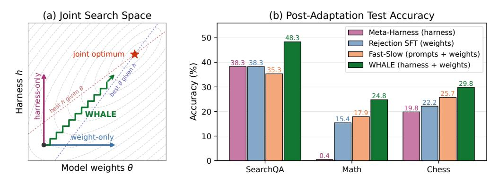
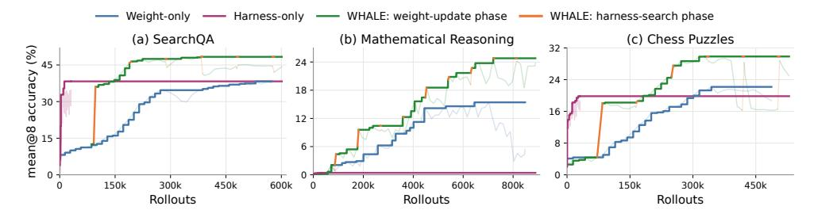
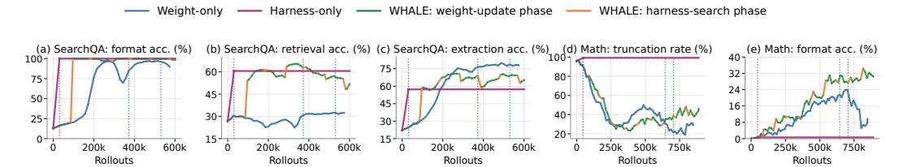
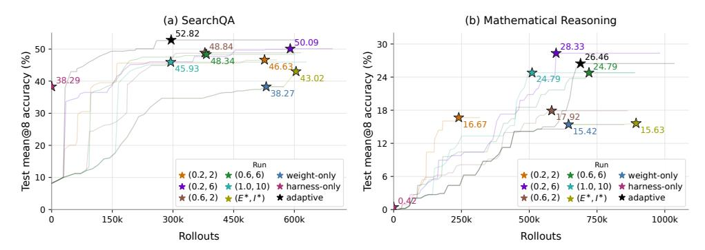
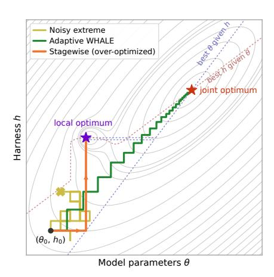
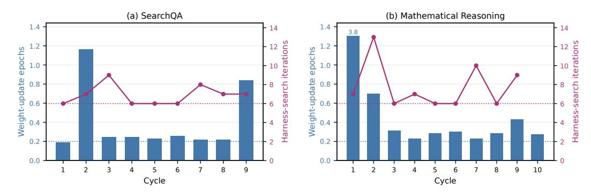
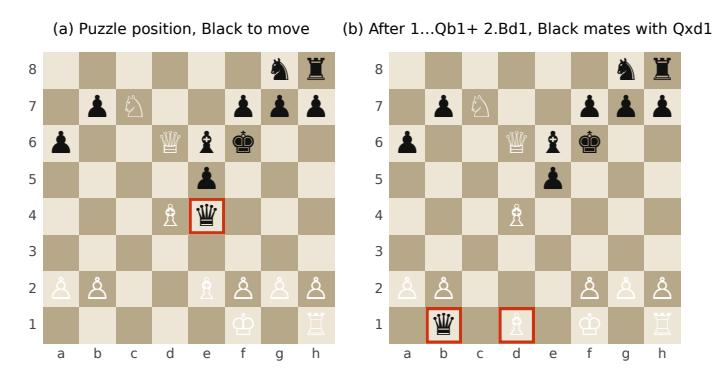

# WHALE: A SIMPLE RECIPE FOR JOINT HARNESS—WEIGHT OPTIMIZATION

Haechan Kim<sup>1,2</sup>, Yoonho Lee<sup>3</sup>, Gisang Lee<sup>1</sup>, Chelsea Finn<sup>3</sup>, Kangwook Lee<sup>1</sup> KRAFTON, <sup>2</sup>KAIST, <sup>3</sup>Stanford University kim.haechan@kaist.ac.kr

## **ABSTRACT**

Agent performance depends jointly on the model parameters and the executable harness code that manages context and control flow. Optimizing either component in isolation can leave the system bottlenecked by its frozen counterpart: weight updates can change which harness is effective, while harness updates can change which model capabilities are exposed. Existing joint-adaptation methods optimize weights and textual prompts but leave the broader harness fixed. We propose Weight-Harness Alternating LEarning (WHALE), a simple recipe that alternates two phases: updating the model under the current harness, then searching for a better harness under the updated model. We instantiate these two phases with online rejection-sampling fine-tuning and Meta-Harness (Lee et al., 2026), respectively. When to switch is a key design choice: to separate real improvements from noise without over-optimizing against a changing counterpart, WHALE uses either fixed phase durations or an adaptive patience rule over training signals. Using Qwen3.5-2B/4B agents across three domains (search question answering, mathematical reasoning, and chess puzzles), WHALE outperforms weight-only, harness-only, and Fast-Slow Training (Tiwari et al., 2026) by 4.15-24.38 percentage points in best mean@8 accuracy. Either component can be the bottleneck: harness search matches peak weight-only accuracy with far fewer rollouts in SearchQA, but improves math accuracy only after a weight update. Small interleaved updates also outperform stagewise weight-then-harness optimization in accuracy and rollout cost. The code is available at https://github.com/krafton-ai/WHALE.

<span id="page-0-0"></span>

Figure 1: Overview of WHALE. (a) Weight-only and harness-only adaptation move along a single axis of  $J(\theta,h)$ , whereas alternating updates allow both components to co-adapt. (b) Our simple joint harness-weight optimization recipe outperforms single-component updates across three diverse domains, as well as joint prompt-weight optimization.

## 1 Introduction

Model weights are only half of an agentic language-model system. The other half is the harness, the code that decides which observations enter the context, how tools are exposed and invoked, how execution errors are handled, and when an interaction terminates. Consider a question-answering agent with a retrieval tool: stronger weights cannot use evidence that a brittle harness never retrieves,

while better retrieval cannot help a model that cannot synthesize the returned evidence. In this paper, we aim to address this shifting bottleneck by jointly optimizing the harness and the model for the given problem.

Prior work has jointly adapted model weights and their surrounding context, but has restricted the latter to textual prompts [\(Soylu et al., 2024;](#page-11-0) [Zhang et al., 2026;](#page-12-1) [Tiwari et al., 2026\)](#page-12-0). Executable toolusing agents expose a broader target for adaptation: the harness code governing tools, observations, error handling, and control flow. Recent LLM-based optimizers make direct search over this code feasible [\(Hu et al., 2025;](#page-10-1) [Lin et al., 2026;](#page-11-1) [Lee et al., 2026\)](#page-10-0). Although both components can now be optimized directly, how to coordinate model training with full-harness search remains unclear.

Coordinating model training with harness search is difficult because the two phases operate on different timescales. Harness search uses a long proposal-and-accept cycle conditioned on many rollouts, whereas online fine-tuning alternates rollout collection with gradient updates. Running the phases concurrently either evaluates each update against a moving counterpart, thereby confounding credit assignment, or requires synchronization barriers due to their mismatched update cadences. Alternation avoids this tradeoff by decomposing the coupled problem into conditional updates, each performed with respect to a fixed counterpart [\(Wright, 2015\)](#page-12-2). This raises a key scheduling question: how much should each component change before switching? Each phase must gather enough evidence to distinguish genuine improvements from noise, but stop before over-optimizing against a fixed counterpart.

To study the design decisions surrounding alternating weight–harness updates, we propose Weight-Harness Alternating LEarning (WHALE), a modular framework that alternates model training under the current harness with harness search under the updated model (Figure [1\(](#page-0-0)a)). In our experiments, we instantiate the weight-update and harness-search phases with online rejection-sampling fine-tuning (RSFT) [\(Dong et al., 2023;](#page-10-2) [Gulcehre et al., 2023;](#page-10-3) [Shao et al., 2024\)](#page-11-2) and Meta-Harness [\(Lee et al.,](#page-10-0) [2026\)](#page-10-0), respectively. By default, fixed hyperparameters shared across cycles determine the duration of each phase. We also propose adaptive WHALE, which allows phase durations to vary across cycles by switching, after a minimum duration, when the current phase's training signal stops improving.

We evaluate WHALE against weight-only, harness-only, and Fast–Slow Training (FST, [Tiwari et al.](#page-12-0) [\(2026\)](#page-12-0)) across three domains: search question answering (SearchQA), mathematical reasoning with code execution (Math), and chess puzzles. To isolate the effect of the harness search space, our FST implementation uses the same update methods and schedule as WHALE but restricts the search to the system and user prompts. WHALE improves over the single-component baselines by 7.67–24.38 percentage points and over FST by 4.15–13.00 points (Figure [1\(](#page-0-0)b)). Across domains, we observe both harness-limited and weight-limited regimes: in SearchQA, harness search alone matches peak weight-only accuracy with far fewer rollouts, whereas in Math it yields almost no improvement until a small weight update makes the same harness search effective. These contrasting regimes show why joint optimization matters: the bottleneck depends on the domain, and updating one component can unlock gains from the other. Compared with stagewise optimization, which spends the full weight-update budget before running the full harness-search budget once, WHALE's small alternating updates improve accuracy by 5.32 and 9.16 percentage points in SearchQA and Math, respectively, and surpass the stagewise result after only 29% and 49% as many rollouts. We also find that adaptive WHALE outperforms the main fixed schedule (with tuned hyperparameters) in both domains we evaluate. Together, our findings provide a controlled, budget-matched study of alternating weight-harness updates and motivate future work on joint weight-harness optimization.

# 2 RELATED WORK

Training for multi-turn reasoning and tool use. Language-model agents commonly interleave reasoning with actions [\(Yao et al., 2023\)](#page-12-3), and recent methods train this behavior in search and codeexecution environments [\(Nakano et al., 2022;](#page-11-3) [Chen et al., 2023;](#page-10-4) [Jin et al., 2025;](#page-10-5) [Feng et al., 2025\)](#page-10-6). Prior work on reward-ranked and reinforced self-training methods motivate SFT-style, reward-filtered updates as simpler and more stable alternatives to policy gradient methods [\(Zelikman et al., 2022;](#page-12-4) [Singh et al., 2024;](#page-11-4) [Dong et al., 2023;](#page-10-2) [Gulcehre et al., 2023;](#page-10-3) [Yuan et al., 2023\)](#page-12-5). We use rejectionsampling fine-tuning from this family for the weight-update phase. Existing methods for training reasoning agents either keep the harness fixed or abstract it away, whereas we study how to train model weights as the harness co-adapts.

**Optimizing systems around fixed models.** Work outside model weights optimizes increasingly expressive artifacts, from natural-language instructions and modular prompt programs (Yang et al., 2024a; Khattab et al., 2024; Agrawal et al., 2026) to agent architectures and workflows (Hu et al., 2024; Zhang et al., 2024; Zhang et al., 2024; Shang et al., 2025). Recent methods extend this search to executable harnesses and their components through source-code editing, configuration search, and trajectory-driven updates (Lin et al., 2026; Sengupta & Wang, 2026; Pan et al., 2026; Park et al., 2026). We use Meta-Harness (Lee et al., 2026) as a simple, modular harness-search method that composes directly with weight updates. WHALE connects these lines of work by alternating reward-filtered model training with executable harness search.

Joint and alternating optimization. Alternating optimization methods address coupled problems by updating one component while holding the others fixed (Wright, 2015). Weight and harness adaptation has this structure: each component shapes the trajectories used to improve the other, so fixing one prevents its drift from confounding the active update. Prior methods that jointly adapt prompts and model weights differ in how they coordinate the two updates, but these works restrict the context-side variable to text (Soylu et al., 2024; Ziems et al., 2026; Bo et al., 2026; Lu et al., 2026; Zhang et al., 2026; Tiwari et al., 2026). WHALE instead searches over executable harness programs, motivated by recent work showing that non-prompt harness choices, including tool interfaces, orchestration, memory, and middleware, can substantially alter fixed-model behavior (Yang et al., 2024b; Zhuge et al., 2024; Lee et al., 2026; Lin et al., 2026). Our FST control (Tiwari et al., 2026) uses the same update methods and schedule as WHALE while restricting harness search to the system and user prompts, isolating this difference in expressivity.

## 3 PRELIMINARIES

Let  $\theta \in \Theta$  be the model parameters and  $h \in \mathcal{H}$  an executable harness program. The harness includes the system instructions, tool schemas, context management, parser and execution logic, and termination policy. Together,  $\theta$  and h induce a conditional distribution  $\pi_{\theta,h}(\cdot \mid x)$  over trajectories  $\tau \in \mathcal{T}$  comprising model messages, tool calls and results, and environment transitions. Given a task distribution  $\mathcal{P}$  and verifier  $R: \mathcal{T} \to [0,1]$ , we can define the expected reward of the system as:

<span id="page-2-0"></span>
$$J(\theta, h) \triangleq \mathbb{E}_{x \sim \mathcal{P}} \mathbb{E}_{\tau \sim \pi_{\theta, h}(\cdot | x)} [R(x, \tau)]. \tag{1}$$

We seek a model-harness pair  $(\theta^{\star}, h^{\star})$  that maximizes Equation 1. Rather than optimizing this objective directly over  $\Theta \times \mathcal{H}$ , we separate adaptation into a weight-update phase that updates  $\theta$  with h fixed and a harness-search phase that updates h with  $\theta$  fixed. The two remain coupled through  $\pi_{\theta,h}$ , since each update changes the policy on which the other operates. Many algorithms can instantiate either update; in this work, we use online RSFT and Meta-Harness, respectively, as described below.

#### <span id="page-2-1"></span>3.1 WEIGHT UPDATES: ONLINE REJECTION-SAMPLING FINE-TUNING

We use online rejection-sampling fine-tuning (RSFT) for weight updates: an online variant of rejection-sampling fine-tuning (Shao et al., 2024) that trains the model with supervised learning only on its own verifier-accepted rollouts. Given a fixed harness h, let  $\theta$  denote the parameters being updated and  $\theta_{\rm old}$  the frozen copy that generates the rollouts at rollout step s. For a batch  $\mathcal{B}_s \subseteq \mathcal{D}_{\rm weight}$ , RSFT samples G trajectories per prompt and keeps only the verifier-accepted pairs:  $\mathcal{S}_s^+$  collects every  $(x,\tau)$  with  $x \in \mathcal{B}_s$ ,  $\tau \sim \pi_{\theta_{\rm old},h}(\cdot \mid x)$ , and  $R(x,\tau)=1$ . For a trajectory  $\tau$ , let  $\mathcal{I}(\tau)$  denote the positions of model-generated tokens, excluding user prompts and tool results. RSFT maximizes the token-normalized supervised log-likelihood

<span id="page-2-2"></span>
$$\widehat{J}_{\text{weight}}(\theta; \theta_{\text{old}}, h) = \frac{1}{\sum_{(x,\tau) \in \mathcal{S}_s^+} |\mathcal{I}(\tau)|} \sum_{(x,\tau) \in \mathcal{S}_s^+} \sum_{t \in \mathcal{I}(\tau)} \log p_{\theta} \left( \tau_t \mid x, h, \tau_{< t} \right). \tag{2}$$

In implementation, RSFT ascends  $\widehat{J}_{weight}$  with minibatch stochastic gradient steps: at rollout step s, it draws SFT minibatches  $\mathcal{M} \subseteq \mathcal{S}_s^+$ , applies gradient updates, and synchronizes the updated weights to the rollout workers before collecting the next group.

#### <span id="page-3-0"></span>3.2 HARNESS SEARCH: META-HARNESS

We use Meta-Harness (MH) (Lee et al., 2026) for harness search: an iterative proposal–evaluation–selection search over executable harness programs. Given fixed model parameters  $\theta$ , MH searches for a better harness over I iterations, starting from an initial harness  $h^{\text{init}} \in \mathcal{H}$ . Let  $\mathcal{A}_j$  denote the accumulated harness archive at iteration j, seeded with  $h^{\text{init}}$ . Evaluating a harness h yields an artifact  $e_h$ , comprising its aggregate score, per-example outcomes from the fixed binary verifier R, and saved trajectory logs;  $\mathcal{E}_j = \{e_h : h \in \mathcal{A}_j\}$  collects the artifacts of the archived harnesses. The proposer selectively inspects these artifacts and the archived source files through filesystem tools, and one proposer session writes M candidate harnesses  $\mathcal{C}_j = \text{Propose}(\mathcal{A}_j, \mathcal{E}_j; M) \subseteq \mathcal{H}$ ; the archive and its artifacts then grow to  $\mathcal{A}_{j+1} = \mathcal{A}_j \cup \mathcal{C}_j$  and  $\mathcal{E}_{j+1} = \mathcal{E}_j \cup \{e_h : h \in \mathcal{C}_j\}$ . Each candidate  $h \in \mathcal{C}_j$  is evaluated on  $\mathcal{D}_{\text{harness}}$  with the rollout-based empirical score

<span id="page-3-1"></span>
$$\widehat{J}_{\text{harness}}(\theta, h) = \frac{1}{|\mathcal{D}_{\text{harness}}|} \sum_{x \in \mathcal{D}_{\text{harness}}} \widehat{\mathbb{E}}_{\tau \sim \pi_{\theta, h}(\cdot | x)}[R(x, \tau)]. \tag{3}$$

Here,  $\widehat{\mathbb{E}}$  denotes the empirical mean over the trajectories sampled for each example; our experiments use one trajectory per example during harness search. MH then selects the accepted harness:  $h^{\text{accept}} \in \arg\max \, \widehat{J}_{\text{harness}}(\theta,h)$ , where the maximization is over the archive  $\mathcal{A}_{j+1}$ . After each iteration, MH marks the highest-scoring harness in the expanded archive as accepted. Subsequent proposals can inspect the full archive and its artifacts, allowing them to refine any prior candidate or revert to an earlier design. After I iterations, MH returns the highest-scoring archived harness.

#### <span id="page-3-2"></span>4 WHALE: WEIGHT-HARNESS ALTERNATING LEARNING

Weight-Harness Alternating Learning (WHALE) consists of two alternating phases, each improving one component while holding the other fixed: each cycle trains the model weights under the current harness, then searches for a better harness under the updated model, and repeats. WHALE requires only black-box interfaces for the two update procedures, and can therefore accommodate any weight-update and harness-search method. Starting from an initial model—harness pair  $(\theta_0, h_0)$ , cycle k computes

$$\theta_{k+1} = \text{ModelUpdate}(\theta_k; h_k, \mathcal{D}_{\text{weight}}), \qquad h_{k+1} = \text{HarnessSearch}(h_k; \theta_{k+1}, \mathcal{D}_{\text{harness}}).$$
 (4)

Budgets and other algorithm-specific settings belong to the instantiation. We instantiate ModelUpdate with RSFT (Section 3.1) and HarnessSearch with MH (Section 3.2). For RSFT, the weight-update phase budget E is the number of training epochs: cycle k consumes the span  $\mathcal{D}_{\text{weight}}^{[kE:(k+1)E)}$  from a persistent sampler. For MH, the harness-search phase budget I is the number of harness-search iterations, and M is the number of candidate harnesses proposed per iteration. Algorithm 1 details the WHALE procedure for our instantiation with RSFT and MH.

The two phases use different update data and local objectives, but are coupled through the induced trajectory distribution  $\pi_{\theta,h}$ : the weight-update phase adapts the model to the prompts, tools, observations, and termination policy defined by  $h_k$ , changing behavior such as response length and reasoning patterns, and the harness-search phase then searches for a harness better matched to the updated  $\theta_{k+1}$ . Repeating the two lets the components co-adapt.

**Adaptive WHALE** replaces these fixed phase budgets with a per-phase stopping rule. We monitor the training metrics of each phase. After a minimum phase length, the weight-update phase stops once its training reward, averaged over a sliding window of recent steps, has not improved for a fixed number of steps. The harness-search phase stops once the best training score in its archive has not improved for a fixed number of iterations. The rule is early stopping in spirit, but it is applied per phase rather than per run and is driven only by training signals, never by a validation dataset. This removes the schedule (E,I) from the hyperparameters. Algorithm 2 in Appendix A.1 details the procedure and its stopping parameters, and Section 6.2.3 evaluates this adaptive schedule.

## 5 EXPERIMENTS

Our experiments ask whether alternating weight updates with full-harness search outperforms optimizing either component alone, and whether full-harness search offers gains beyond prompt-only

## <span id="page-4-0"></span>Algorithm 1 WHALE with RSFT and MH

```
Require: (\theta_0, h_0); datasets \mathcal{D}_{weight}, \mathcal{D}_{harness}; fixed binary verifier R; budgets E, I, M
 1: for k = 0, 1, \dots do
 2:
           \theta \leftarrow \theta_k
           for each prompt batch \mathcal{B}_s in \mathcal{D}_{\mathrm{weight}}^{[kE:(k+1)E)} do
 3:
 4:
                 \theta_{\text{old}} \leftarrow \theta
                 collect S_s^+ under (\theta_{\text{old}}, h_k)
 5:
                 ascend \widehat{J}_{\text{weight}}(\theta; \theta_{\text{old}}, h_k) over minibatches of \mathcal{S}_s^+ (Eq. 2)
 6:
 7:
            \theta_{k+1} \leftarrow \theta; h^{\text{init}} \leftarrow h_k; A_0 \leftarrow \{h^{\text{init}}\}; \mathcal{E}_0 \leftarrow \{e_{h^{\text{init}}}\}
 8:
            for j = 0, ..., I - 1 do
 9:
                 C_j \leftarrow \text{Propose}(A_j, \mathcal{E}_j; M)
10:
                 evaluate \widehat{J}_{\text{harness}}(\theta_{k+1}, h) for each h \in \mathcal{C}_j (Eq. 3), yielding artifacts e_h
11:
                 \mathcal{A}_{j+1} \leftarrow \mathcal{A}_j \cup \mathcal{C}_j; \quad \mathcal{E}_{j+1} \leftarrow \mathcal{E}_j \cup \{e_h : h \in \mathcal{C}_j\}
12:
                 h^{\text{accept}} \leftarrow \arg\max \widehat{J}_{\text{harness}}(\theta_{k+1}, h)
13:
14:
            end for
           h_{k+1} \leftarrow h^{\text{accept}}
15:
16: end for
17: return the pair (\theta_k, h_k) with the best accuracy on \mathcal{D}_{\text{test}}
```

adaptation. We test these questions across three tool-using domains, using shared initializations and matched update budgets within each domain to isolate the effect of joint adaptation.

## <span id="page-4-1"></span>5.1 Domains and Data

**SearchQA.** Following Search-R1 (Jin et al., 2025), the weight-update training dataset  $\mathcal{D}_{weight}$  contains 18,946 questions: 14,801 from HotpotQA (Yang et al., 2018) and 4,145 from Natural Questions (Kwiatkowski et al., 2019). The harness-search training dataset  $\mathcal{D}_{harness}$  comprises 256 questions, 200 from HotpotQA and 56 from Natural Questions, matching the  $\mathcal{D}_{weight}$  distribution. The test dataset  $\mathcal{D}_{test}$  contains 700 questions, with 100 each from 2WikiMultiHopQA (Ho et al., 2020), Bamboogle (Press et al., 2023), HotpotQA, MuSiQue (Trivedi et al., 2022), Natural Questions, PopQA (Mallen et al., 2023), and TriviaQA (Joshi et al., 2017). Natural Questions, PopQA, and TriviaQA are single-hop, whereas HotpotQA, 2WikiMultiHopQA, MuSiQue, and Bamboogle are multi-hop (Jin et al., 2025). The retrieval environment answers an agent's query with the top-k nearest documents from the Wikipedia 2018 corpus (Karpukhin et al., 2020), indexed using FAISS (Johnson et al., 2017).

**Mathematical Reasoning.** The weight-update training dataset  $\mathcal{D}_{\mathrm{weight}}$  contains 17,917 problems from DAPO-Math-17K (Yu et al., 2025). The harness-search training dataset  $\mathcal{D}_{\mathrm{harness}}$  contains 256 problems randomly selected from DAPO-Math-17K. The test dataset  $\mathcal{D}_{\mathrm{test}}$  comprises AIME 2024 (Maxwell-Jia, 2024) and AIME 2025 (yentinglin, 2025) problems. Following ReTool (Feng et al., 2025), the agent may write Python programs for intermediate computation; a CPU environment executes them and returns their output or error text as the tool response.

Chess Puzzles. All three datasets are derived from the Lichess open puzzle database (Lichess, 2026).  $\mathcal{D}_{\mathrm{weight}}$ ,  $\mathcal{D}_{\mathrm{harness}}$ , and  $\mathcal{D}_{\mathrm{test}}$  hold 16,384, 256, and another 256 puzzles, mutually disjoint. The agent generates chess moves in Universal Chess Interface (UCI) notation and passes them to an environment that maintains the board state. An incorrect legal move terminates the rollout immediately, whereas an illegal move terminates it after the permitted retry is exhausted. After a correct nonterminal move, the environment returns the puzzle's predefined fixed opponent reply as the tool response. A correct terminal move completes the reference solution sequence and ends the rollout.

Appendix B specifies each domain's harness-search space, initial harness  $h_0$  and binary verifier R. In every domain, the harness search may modify the system and user prompts, the formatting of tool inputs and outputs, the feedback returned after a tool call, and the stopping criteria and turn allocation, while the model, datasets, verifier, environment transition rules, and reference answers stay fixed. The verifier  $R(x,\tau) \in \{0,1\}$  is a sparse trajectory-level reward: intermediate steps receive no reward, and  $R(x,\tau)=1$  only when the terminal task outcome is correct.

<span id="page-5-0"></span>

Figure 2: Best-so-far test mean@8 accuracy on the test datasets as rollouts accumulate. Harness-only is held constant after 40, 60, and 40 iterations in SearchQA, Mathematical Reasoning, and Chess Puzzles, respectively.

## 5.2 EVALUATION SETUP

SearchQA and Math use Qwen3.5-2B; Chess Puzzles use Qwen3.5-4B (Qwen Team, 2026). Every method starts from the same domain-specific  $(\theta_0, h_0)$ , specified in Appendix B.2. Weight-only holds  $h = h_0$  and trains for 4, 6, and 4 epochs in SearchQA, Math, and Chess Puzzles; harness-only holds  $\theta = \theta_0$  and runs 40, 60, and 40 harness-search iterations; WHALE alternates the two under (E, I) = (0.6, 6). All rollouts use a sampling temperature of 1.0, top-p of 1.0, and top-k of 20. The response lengths are 8,192, 8,192, and 16,384 tokens for SearchQA, Math, and Chess Puzzles, respectively. The weight update samples G = 8 trajectories per prompt, the harness search 1 rollout per candidate—example pair, and test evaluation 8 trajectories per example, reported as mean@8.

Adaptive WHALE keeps this configuration but replaces the fixed budgets with the patience rule of Section 4: the weight-update phase uses a minimum phase length, patience, and averaging window of 0.2 epochs each, and the harness-search phase runs at least 6 iterations and stops after 2 iterations without a new best training score. FST (Tiwari et al., 2026) adapts prompts alongside weights. We run it as a prompt-restricted control, using the update methods and schedule of WHALE but with harness search confined to the system and user prompts of  $h_0$ , thereby isolating search expressivity. The single-component baselines receive budgets matching the cumulative budgets of the WHALE and FST runs; Table 1 in Appendix B shows details for all configurations.

## <span id="page-5-1"></span>5.3 Does Joint Weight–Harness Optimization Improve Performance?

Figure 2 shows test mean@8 accuracy for single-component baselines and WHALE. Using one fixed schedule, (E,I)=(0.6,6), WHALE achieves the highest accuracy in all three domains. The ordering of the single-component baselines changes across domains: weight-only and harness-only are effectively tied in SearchQA, whereas weight-only is substantially stronger in Math and Chess Puzzles. WHALE improves under both orderings, outperforming the stronger single-component baseline by 7.67–10.05 percentage points. FST exhibits a different pattern: prompt—weight adaptation underperforms both single-component baselines in SearchQA but outperforms them in Math and Chess Puzzles. WHALE nevertheless exceeds FST by 4.15–13.00 points (Figure 1(b)). Because our FST control uses the same update methods and schedule while restricting harness search to prompts, this comparison measures the benefit of adapting the broader executable harness. The gains over the single-component baselines also hold on every individual benchmark; Table 2 reports the full per-dataset results.

**Consistent gains across domains.** With one fixed schedule, WHALE outperforms weight-only, harness-only, and prompt-restricted FST across all three domains, despite differences in which component is strongest alone.

## 6 ANALYSIS

The aggregate gains mask different interactions between model weights and harness code across domains. We first identify which component limits performance and how updating one changes the gains available to the other. We then test whether small interleaved updates improve over stagewise optimization, how phase duration affects performance, and whether training signals can determine when to switch.

<span id="page-6-0"></span>

Figure 3: Behavior metrics on test trajectories as rollouts accumulate. (**a–c**) SearchQA: the fraction of responses following the required answer format, the fraction of trajectories retrieving at least one document containing the reference answer, and correctness conditional on retrieving such a document. (**d–e**) Mathematical Reasoning: the fraction of responses reaching the token limit, and the fraction from which the verifier extracts a final boxed answer. Dotted vertical lines mark where each method achieves its best test mean@8 accuracy.

## <span id="page-6-1"></span>6.1 WHICH COMPONENT LIMITS PERFORMANCE?

We observe two domain-dependent bottleneck regimes. SearchQA is *harness-dominant*: harness search matches the peak accuracy of weight updates using only 5.79% as many rollouts. Math is *model-dominant*: harness search reaches only 0.42%, compared with 15.42% for weight updates. These comparisons count target-agent rollouts and exclude proposer compute in the harness search phase.

**SearchQA** is harness-dominant. Figure 3(a–c) quantifies three capabilities required for SearchQA. Both weight updates and harness search improve format compliance, with weight-only and harness-only peaking at 97.07% and 99.98%: weight updates learn the behavior from format-correct on-policy trajectories, whereas harness search emphasizes the answer format in the user prompt and requires an answer rather than another search on the final turn. Harness-only reaches the higher value with fewer rollouts, so harness search is the more efficient channel here.

For retrieval accuracy, weight-only improves it only modestly, whereas harness-only raises it from 26.88% to 60.61% with far fewer rollouts: the model writes the query, but the harness post-processes it and controls which documents return and how many. Combining both, WHALE reaches the highest retrieval accuracy of 65.41%. Answer extraction reverses the balance, with weight-only and harness-only peaking at 79.93% and 57.28%. In WHALE, the cycle 1 harness-search phase improves extraction sharply, and the cycle 2 weight-update phase improves it further, but from cycle 3 onward the harness-search phases hold it back.

Mathematical reasoning is weight-dominant. Figure 3(d–e) quantifies two capabilities required for Math, where the bottleneck is response truncation. Weight-only cuts the truncation rate from 95.83% to 30.83%, learning to shorten responses from correct on-policy trajectories that terminate before the token limit. Harness-only attempts the same through response caps, turn limits, and a final-answer recovery step, but cannot overcome the base model's behavior, which is also why its format accuracy barely moves. WHALE does shorten responses, reducing truncation and improving format accuracy, and its cycle 1 harness-search phase is the clearest case: in 4,608 rollouts it raises format accuracy from 0.83% to 4.38%, a gain of 3.54 percentage points, where harness-only spends 46,080 rollouts for a gain of 0.63 points (0.00% to 0.63%).

**Dominance regimes.** We observe both *harness-dominant* and *model-dominant* regimes, and for capabilities that both weight updates and harness search can improve, harness search is more rollout-efficient. A short harness search therefore serves as a low-cost diagnostic before extensive model training. Conversely, a small weight update can make harness search effective where it previously was not.

#### 6.2 How Should Weight and Harness Updates Be Scheduled?

We ablate the alternation schedule (E,I), the per-cycle weight-update epoch and harness-search iteration budgets, in SearchQA and Math, the harness-dominant and model-dominant extremes. Table 3 in Appendix C.2 lists the best point of every run.

<span id="page-7-0"></span>

Figure 4: Schedule comparison for (a) SearchQA and (b) Mathematical Reasoning. Each run—the five fixed (E,I) schedules, stagewise  $(E^*,I^*)$ , the weight-only and harness-only baselines, and adaptive WHALE—is marked by a star at its best test mean@8 accuracy; faint lines trace each run's best-so-far accuracy.

#### <span id="page-7-1"></span>6.2.1 Alternating versus Stagewise Optimization

The common way to combine the two is stagewise, with one pass per component: train under  $h_0$  with the full weight-only budget, then run harness search under the resulting model for the full harness-only budget. Each phase selects its best point based on the training score; at the budgets, we denote  $(E^*, I^*)$ .

In SearchQA,  $(E^*, I^*) = (2.7, 32)$  within the 4-epoch and 40-iteration budgets, reaching 43.02% test mean@8 accuracy (Figure 4(a)); in Math,  $(E^*, I^*) = (4.3, 33)$  within the 6-epoch and 60-iteration budgets, reaching 15.63% (Figure 4(b)). These fall 5.32 and 9.16 points short of WHALE with (0.6, 6), which passes the final stagewise accuracy after only 29% of the stagewise rollouts in SearchQA and 49% in Math.

We attribute the weaker stagewise performance to conditional over-optimization (Figure 5). Because  $J(\theta,h)$  (Eq. 1) is not separable, each phase optimizes against a counterpart that later changes. A long weight-update phase over-optimizes the model's behavior for  $h_0$ , leaving it poorly adapted to the harness produced by the subsequent harness search. A long harness-search phase can likewise over-optimize a harness to  $\mathcal{D}_{\text{harness}}$ : in Math, the 60-iteration stagewise harness search keeps improving its training score, yet gains only +0.21 percentage points over weight-only on the test set (15.63% versus 15.42%).

**Alternation dominates stagewise optimization.** One large pass per component is dominated by short alternating phases, in both final accuracy and rollout cost, because spending a component's full budget in a single uninterrupted phase over-optimizes it against a counterpart that then changes.

#### <span id="page-7-2"></span>6.2.2 How Long Should Each Phase Run?

Given that alternation should take small steps, we next ask how many updates each cycle should contain. In SearchQA and Math, we compare five schedules  $(E,I) \in \{(0.2,2),(0.2,6),(0.6,2),(0.6,6),(1.0,10)\}$  (Figure 4). Although the two domains lie at opposite extremes of the regime, the same schedule is strongest in both: (0.2,6) reaches 50.09% in SearchQA and 28.33% in Math, exceeding the (0.6,6) schedule in the main comparison by +1.75 and +3.54 percentage points, respectively. An effective schedule must therefore lie between two failure extremes: each phase must gather enough evidence to avoid adopting a noisy choice, yet stop before it over-optimizes against its frozen counterpart. The two ends of the schedule spectrum exhibit exactly these failures, sketched in Figure 5.



<span id="page-8-1"></span>Figure 5: Running each phase to the maximum of its own line ends at a local optimum (the over-optimized extreme); too little evidence per phase stalls on noise (the noisy extreme); adaptive WHALE tracks the valley to the joint optimum.

The noisy extreme is the Math (0.2, 2) run. With only two proposal iterations of evidence per cycle, a chance-inflated candidate is accepted, and the model then adapts to it; the run destabilized and was stopped. At the other end, the over-optimization of Section [6.2.1](#page-7-1) sets in well before the stagewise limit: scaling the per-cycle budgets up from (0.2, 6) never helps in either domain, and along (0.2, 6), (0.6, 6), (1.0, 10) accuracy falls from 50.09% to 48.34% to 45.93% in SearchQA and from 28.33% to 24.79% to 24.79% in Math.

Neither budget can be chosen on its own, because the effect of one depends on the value of the other: in Math, increasing E from 0.2 to 0.6 helps at I = 2 (16.67% to 17.92%) but hurts at I = 6 (28.33% to 24.79%), and the same crossover holds in the I direction in SearchQA. Even in the model-dominant domain, the schedule that runs harness search most often per training epoch prevails, as explained by catalytic interaction (Section [6.1\)](#page-6-1): each small weight update renews the gains attainable by a bounded harness search.

Effective schedules balance noisy selection and over-optimization. Across both domains, the strongest schedule pairs small weight updates with harness search that runs long enough to identify reliable improvements but stops before over-optimizing.

## <span id="page-8-0"></span>6.2.3 CAN WE AUTOMATICALLY DETERMINE WHEN TO SWITCH?

Our sweep over schedule hyperparameters identifies a strong range of phase durations but still requires choosing fixed budgets. We test whether adaptive WHALE can recover this range without fixing (E, I) in advance. For SearchQA and Math, we compare against the main (0.6, 6) schedule and the strongest fixed schedule in our sweep, (0.2, 6). As Figure [4](#page-7-0) shows, adaptive WHALE attains the best point of the entire comparison in SearchQA: 52.82% test mean@8 accuracy, +4.48 points over the (0.6, 6) schedule and +2.73 points over the best hand-tuned schedule (50.09%), reached with 23% fewer rollouts than the (0.6, 6) run needs for its own best. In Math, adaptive WHALE reaches 26.46%: +1.67 points over the (0.6, 6) schedule with 4% fewer rollouts, but 1.87 points below the best hand-tuned schedule (28.33%).

The realized schedules fall within the region identified by the ablation (Figure [6\)](#page-9-0). Median phase lengths are 0.24 and 0.29 weight-update epochs in the two domains, with I = 7 harness-search iterations per cycle in both, close to the (0.2, 6) optimum, while individual phases extend when their training signal keeps improving, up to 1.16 epochs and I = 13.

# 7 CONCLUSION

We presented WHALE, a modular framework that alternates weight updates with harness search over executable agent harnesses. Across SearchQA, Math, and Chess Puzzles it outperforms the weight-only and harness-only baselines by +7.67 to +24.38 percentage points, and FST, whose harness search is restricted to prompts, by +4.15 to +13.00 points. Our analysis shows that domains divide into harness-dominant and model-dominant regimes, and that a small weight update can unlock an otherwise ineffective harness search. A controlled schedule study further shows that one large pass per component is dominated by small alternating steps, and that per-cycle budgets must lie between the noisy and over-optimized extremes. Finally, a per-phase patience rule on training signals automatically identifies this interval, replacing the fixed budgets.

Future work includes instantiating the two operators with other weight-update and harness-search algorithms, as permitted by the black-box interfaces in Section [4,](#page-3-2) and scaling the study to larger

<span id="page-9-0"></span>

Figure 6: Realized per-cycle budgets chosen by the patience rule of adaptive WHALE in (a) SearchQA and (b) Mathematical Reasoning: weight-update epochs (bars, left axis) and harness-search iterations (dots, right axis). Dotted horizontal lines mark the minimum phase lengths (0.2 epoch, I = 6).

models and additional domains. More broadly, these results motivate treating the model and its harness not as separately engineered artifacts but as one jointly trained system.

## ACKNOWLEDGMENTS

We would like to express our sincere gratitude to Myungseok Oh and Yun Jegal for their valuable contributions and support throughout this work.

# REFERENCES

- <span id="page-10-8"></span>Lakshya A. Agrawal, Shangyin Tan, Dilara Soylu, Noah Ziems, Rishi Khare, Krista Opsahl-Ong, Arnav Singhvi, Herumb Shandilya, Michael J. Ryan, Meng Jiang, Christopher Potts, Koushik Sen, Alexandros G. Dimakis, Ion Stoica, Dan Klein, Matei Zaharia, and Omar Khattab. GEPA: Reflective prompt evolution can outperform reinforcement learning. In *International Conference on Learning Representations*, 2026.
- <span id="page-10-10"></span>Xiaohe Bo, Rui Li, Zexu Sun, Quanyu Dai, Zeyu Zhang, Zihang Tian, Xu Chen, and Zhenhua Dong. Prompt and parameter co-optimization for large language models. In *International Conference on Learning Representations*, volume 2026, pp. 116697–116723, 2026.
- <span id="page-10-4"></span>Baian Chen, Chang Shu, Ehsan Shareghi, Nigel Collier, Karthik Narasimhan, and Shunyu Yao. Fireact: Toward language agent fine-tuning, 2023. URL <https://arxiv.org/abs/2310.05915>.
- <span id="page-10-2"></span>Hanze Dong, Wei Xiong, Deepanshu Goyal, Yihan Zhang, Winnie Chow, Rui Pan, Shizhe Diao, Jipeng Zhang, KaShun Shum, and Tong Zhang. RAFT: Reward ranked finetuning for generative foundation model alignment. *Transactions on Machine Learning Research*, 2023.
- <span id="page-10-6"></span>Jiazhan Feng, Shijue Huang, Xingwei Qu, Ge Zhang, Yujia Qin, Baoquan Zhong, Chengquan Jiang, Jinxin Chi, and Wanjun Zhong. Retool: Reinforcement learning for strategic tool use in llms. *arXiv preprint arXiv:2504.11536*, 2025.
- <span id="page-10-3"></span>Caglar Gulcehre, Tom Le Paine, Srivatsan Srinivasan, Ksenia Konyushkova, Lotte Weerts, Abhishek Sharma, Aditya Siddhant, Alex Ahern, Miaosen Wang, Chenjie Gu, Wolfgang Macherey, Arnaud Doucet, Orhan Firat, and Nando de Freitas. Reinforced self-training (ReST) for language modeling. *arXiv preprint arXiv:2308.08998*, 2023.
- <span id="page-10-12"></span>Xanh Ho, Anh-Khoa Duong Nguyen, Saku Sugawara, and Akiko Aizawa. Constructing a multi-hop qa dataset for comprehensive evaluation of reasoning steps. In *Proceedings of COLING*, 2020.
- <span id="page-10-9"></span>Shengran Hu, Cong Lu, and Jeff Clune. Automated design of agentic systems. *arXiv preprint arXiv:2408.08435*, 2024.
- <span id="page-10-1"></span>Shengran Hu, Cong Lu, and Jeff Clune. Automated design of agentic systems, 2025. URL [https:](https://arxiv.org/abs/2408.08435) [//arxiv.org/abs/2408.08435](https://arxiv.org/abs/2408.08435).
- <span id="page-10-5"></span>Bowen Jin, Hansi Zeng, Zhenrui Yue, Dong Wang, Hamed Zamani, and Jiawei Han. Search-r1: Training llms to reason and leverage search engines with reinforcement learning. *arXiv preprint arXiv:2503.09516*, 2025.
- <span id="page-10-15"></span>Jeff Johnson, Matthijs Douze, and Herve J ´ egou. Billion-scale similarity search with gpus. ´ *arXiv preprint arXiv:1702.08734*, 2017.
- <span id="page-10-13"></span>Mandar Joshi, Eunsol Choi, Daniel S. Weld, and Luke Zettlemoyer. Triviaqa: A large scale distantly supervised challenge dataset for reading comprehension. In *Proceedings of ACL*, 2017.
- <span id="page-10-14"></span>Vladimir Karpukhin, Barlas Oguz, Sewon Min, Patrick Lewis, Ledell Wu, Sergey Edunov, Danqi Chen, and Wen-tau Yih. Dense passage retrieval for open-domain question answering. In *Proceedings of EMNLP*, pp. 6769–6781, 2020.
- <span id="page-10-7"></span>Omar Khattab, Arnav Singhvi, Paridhi Maheshwari, Zhiyuan Zhang, Keshav Santhanam, Sri Vardhamanan, Saiful Haq, Ashutosh Sharma, Martin Josifoski, Carlos Guestrin, Matei Zaharia, and Christopher Potts. Dspy: Compiling declarative language model calls into self-improving pipelines. In *International Conference on Learning Representations*, 2024.
- <span id="page-10-11"></span>Tom Kwiatkowski, Jennimaria Palomaki, Olivia Redfield, Michael Collins, Ankur Parikh, Chris Alberti, Danielle Epstein, Illia Polosukhin, Jacob Devlin, Kenton Lee, Kristina Toutanova, Llion Jones, Matthew Kelcey, Ming-Wei Chang, Andrew M. Dai, Jakob Uszkoreit, Quoc Le, and Slav Petrov. Natural questions: A benchmark for question answering research. *Transactions of the Association for Computational Linguistics*, 7:452–466, 2019.
- <span id="page-10-0"></span>Yoonho Lee, Roshen Nair, Qizheng Zhang, Kangwook Lee, Omar Khattab, and Chelsea Finn. Meta-harness: End-to-end optimization of model harnesses. *arXiv preprint arXiv:2603.28052*, 2026.

- <span id="page-11-13"></span>Lichess. Open database: Puzzle database. <https://database.lichess.org/>, 2026. Accessed 2026-07-20.
- <span id="page-11-1"></span>Jiahang Lin, Shichun Liu, Chengjun Pan, Lizhi Lin, Shihan Dou, Zhiheng Xi, Xuanjing Huang, Hang Yan, Zhenhua Han, Tao Gui, et al. Agentic harness engineering: Observability-driven automatic evolution of coding-agent harnesses. *arXiv preprint arXiv:2604.25850*, 2026.
- <span id="page-11-9"></span>Xinyu Lu, Kaiqi Zhang, Jinglin Yang, Boxi Cao, Yaojie Lu, Hongyu Lin, Min He, Xianpei Han, and Le Sun. Pˆ 2o: Joint policy and prompt optimization. *arXiv preprint arXiv:2603.21877*, 2026.
- <span id="page-11-11"></span>Alex Mallen, Akari Asai, Victor Zhong, Rajarshi Das, Daniel Khashabi, and Hannaneh Hajishirzi. When not to trust language models: Investigating effectiveness of parametric and non-parametric memories. In *Proceedings of ACL*, 2023.
- <span id="page-11-12"></span>Maxwell-Jia. AIME 2024. Hugging Face dataset, [https://huggingface.co/datasets/](https://huggingface.co/datasets/Maxwell-Jia/AIME_2024) [Maxwell-Jia/AIME\\_2024](https://huggingface.co/datasets/Maxwell-Jia/AIME_2024), 2024. Accessed 2026-07-20.
- <span id="page-11-3"></span>Reiichiro Nakano, Jacob Hilton, Suchir Balaji, Jeff Wu, Long Ouyang, Christina Kim, Christopher Hesse, Shantanu Jain, Vineet Kosaraju, William Saunders, Xu Jiang, Karl Cobbe, Tyna Eloundou, Gretchen Krueger, Kevin Button, Matthew Knight, Benjamin Chess, and John Schulman. Webgpt: Browser-assisted question-answering with human feedback, 2022. URL [https://arxiv.](https://arxiv.org/abs/2112.09332) [org/abs/2112.09332](https://arxiv.org/abs/2112.09332).
- <span id="page-11-7"></span>Wenbo Pan, Shujie Liu, Chin-Yew Lin, Jingying Zeng, Xianfeng Tang, Xiangyang Zhou, Yan Lu, and Xiaohua Jia. Evolving agents in the dark: Retrospective harness optimization via self-preference, 2026. URL <https://arxiv.org/abs/2606.05922>.
- <span id="page-11-8"></span>Sungho Park, Wonjoong Kim, Rongyuan Tan, Jue Zhang, Wook-Shin Han, Pengfei Gao, Chanyoung Park, Yongqiang Yao, Rao Fu, Elsie Nallipogu, Qingwei Lin, Saravan Rajmohan, and Dongmei Zhang. Autosaddler: Automatic harness optimization with durable updates from agent execution traces, 2026. URL <https://arxiv.org/abs/2608.23041>.
- <span id="page-11-10"></span>Ofir Press, Muru Zhang, Sewon Min, Ludwig Schmidt, Noah A. Smith, and Mike Lewis. Measuring and narrowing the compositionality gap in language models. *Findings of the Association for Computational Linguistics: EMNLP*, 2023.
- <span id="page-11-14"></span>Qwen Team. Qwen3.5: Towards native multimodal agents. [https://qwen.ai/blog?id=](https://qwen.ai/blog?id=qwen3.5) [qwen3.5](https://qwen.ai/blog?id=qwen3.5), 2026.
- <span id="page-11-6"></span>Biswa Sengupta and Jinhua Wang. Harbor: Automated harness optimization, 2026. URL [https:](https://arxiv.org/abs/2604.20938) [//arxiv.org/abs/2604.20938](https://arxiv.org/abs/2604.20938).
- <span id="page-11-5"></span>Yu Shang, Yu Li, Keyu Zhao, Likai Ma, Jiahe Liu, Fengli Xu, and Yong Li. Agentsquare: Automatic llm agent search in modular design space, 2025. URL [https://arxiv.org/abs/2410.](https://arxiv.org/abs/2410.06153) [06153](https://arxiv.org/abs/2410.06153).
- <span id="page-11-2"></span>Zhihong Shao, Peiyi Wang, Qihao Zhu, Runxin Xu, Junxiao Song, Xiao Bi, Haowei Zhang, Mingchuan Zhang, Y. K. Li, Y. Wu, and Daya Guo. Deepseekmath: Pushing the limits of mathematical reasoning in open language models. *arXiv preprint arXiv:2402.03300*, 2024.
- <span id="page-11-4"></span>Avi Singh, John D. Co-Reyes, Rishabh Agarwal, Ankesh Anand, Piyush Patil, Xavier Garcia, Peter J. Liu, James Harrison, Jaehoon Lee, Kelvin Xu, Aaron Parisi, Abhishek Kumar, Alex Alemi, Alex Rizkowsky, Azade Nova, Ben Adlam, Bernd Bohnet, Gamaleldin Elsayed, Hanie Sedghi, Igor Mordatch, Isabelle Simpson, Izzeddin Gur, Jasper Snoek, Jeffrey Pennington, Jiri Hron, Kathleen Kenealy, Kevin Swersky, Kshiteej Mahajan, Laura Culp, Lechao Xiao, Maxwell L. Bileschi, Noah Constant, Roman Novak, Rosanne Liu, Tris Warkentin, Yundi Qian, Yamini Bansal, Ethan Dyer, Behnam Neyshabur, Jascha Sohl-Dickstein, and Noah Fiedel. Beyond human data: Scaling self-training for problem-solving with language models, 2024. URL [https:](https://arxiv.org/abs/2312.06585) [//arxiv.org/abs/2312.06585](https://arxiv.org/abs/2312.06585).
- <span id="page-11-0"></span>Dilara Soylu, Christopher Potts, and Omar Khattab. Fine-tuning and prompt optimization: Two great steps that work better together. *arXiv preprint arXiv:2407.10930*, 2024.

- <span id="page-12-0"></span>Rishabh Tiwari, Kusha Sareen, Lakshya A. Agrawal, Joseph E. Gonzalez, Matei Zaharia, Kurt Keutzer, Inderjit S. Dhillon, Rishabh Agarwal, and Devvrit Khatri. Learning, fast and slow: Towards LLMs that adapt continually. *arXiv preprint arXiv:2605.12484*, 2026.
- <span id="page-12-12"></span>Harsh Trivedi, Niranjan Balasubramanian, Tushar Khot, and Ashish Sabharwal. Musique: Multihop questions via single-hop question composition. *Transactions of the Association for Computational Linguistics*, 10:539–554, 2022.
- <span id="page-12-2"></span>Stephen J Wright. Coordinate descent algorithms. *Mathematical programming*, 151(1):3–34, 2015.
- <span id="page-12-6"></span>Chengrun Yang, Xuezhi Wang, Yifeng Lu, Hanxiao Liu, Quoc V. Le, Denny Zhou, and Xinyun Chen. Large language models as optimizers. *arXiv preprint arXiv:2309.03409*, 2024a.
- <span id="page-12-10"></span>John Yang, Carlos Jimenez, Alexander Wettig, Kilian Lieret, Shunyu Yao, Karthik Narasimhan, and Ofir Press. Swe-agent: Agent-computer interfaces enable automated software engineering. *Advances in Neural Information Processing Systems*, 37:50528–50652, 2024b.
- <span id="page-12-11"></span>Zhilin Yang, Peng Qi, Saizheng Zhang, Yoshua Bengio, William W. Cohen, Ruslan Salakhutdinov, and Christopher D. Manning. Hotpotqa: A dataset for diverse, explainable multi-hop question answering. In *Proceedings of EMNLP*, 2018.
- <span id="page-12-3"></span>Shunyu Yao, Jeffrey Zhao, Dian Yu, Nan Du, Izhak Shafran, Karthik Narasimhan, and Yuan Cao. React: Synergizing reasoning and acting in language models. In *International Conference on Learning Representations*, 2023.
- <span id="page-12-14"></span>yentinglin. AIME 2025. Hugging Face dataset, [https://huggingface.co/datasets/](https://huggingface.co/datasets/yentinglin/aime_2025) [yentinglin/aime\\_2025](https://huggingface.co/datasets/yentinglin/aime_2025), 2025. Accessed 2026-07-20.
- <span id="page-12-13"></span>Qiying Yu, Zheng Zhang, Ruofei Zhu, Yufeng Yuan, Xiaochen Zuo, Yu Yue, Tiantian Fan, Gaohong Liu, Lingjun Liu, Xin Liu, Haibin Lin, Zhiqi Lin, Bole Ma, Guangming Sheng, Yuxuan Tong, Chi Zhang, Mofan Zhang, Wang Zhang, Hang Zhu, Jinhua Zhu, Jiaze Chen, Jiangjie Chen, Chengyi Wang, Hongli Yu, Weinan Dai, Yuxuan Song, Xiangpeng Wei, Hao Zhou, Jingjing Liu, Wei-Ying Ma, Ya-Qin Zhang, Lin Yan, Mu Qiao, Yonghui Wu, and Mingxuan Wang. Dapo: An open-source llm reinforcement learning system at scale. *arXiv preprint arXiv:2503.14476*, 2025.
- <span id="page-12-5"></span>Hongyi Yuan, Zheng Yuan, Chuanqi Tan, Wei Wang, Songfang Huang, and Fei Huang. Rrhf: Rank responses to align language models with human feedback. In A. Oh, T. Naumann, A. Globerson, K. Saenko, M. Hardt, and S. Levine (eds.), *Advances in Neural Information Processing Systems*, volume 36, pp. 10935–10950. Curran Associates, Inc., 2023. doi: 10.52202/ 075280-0482. URL [https://proceedings.neurips.cc/paper\\_files/paper/](https://proceedings.neurips.cc/paper_files/paper/2023/file/23e6f78bdec844a9f7b6c957de2aae91-Paper-Conference.pdf) [2023/file/23e6f78bdec844a9f7b6c957de2aae91-Paper-Conference.pdf](https://proceedings.neurips.cc/paper_files/paper/2023/file/23e6f78bdec844a9f7b6c957de2aae91-Paper-Conference.pdf).
- <span id="page-12-4"></span>Eric Zelikman, Yuhuai Wu, Jesse Mu, and Noah D. Goodman. Star: Bootstrapping reasoning with reasoning, 2022. URL <https://arxiv.org/abs/2203.14465>.
- <span id="page-12-7"></span>Jiayi Zhang, Jinyu Xiang, Zhaoyang Yu, Fengwei Teng, Xionghui Chen, Jiaqi Chen, Mingchen Zhuge, Xin Cheng, Sirui Hong, Jinlin Wang, Bingnan Zheng, Bang Liu, Yuyu Luo, and Chenglin Wu. Aflow: Automating agentic workflow generation. *arXiv preprint arXiv:2410.10762*, 2024.
- <span id="page-12-1"></span>Lunjun Zhang, Ryan Chen, and Bradly C. Stadie. Evolutionary system prompt learning for reinforcement learning in LLMs. *arXiv preprint arXiv:2602.14697*, 2026.
- <span id="page-12-8"></span>Mingchen Zhuge, Wenyi Wang, Louis Kirsch, Francesco Faccio, Dmitrii Khizbullin, and Jurgen ¨ Schmidhuber. Language agents as optimizable graphs. *arXiv preprint arXiv:2402.16823*, 2024.
- <span id="page-12-9"></span>Noah Ziems, Dilara Soylu, Lakshya A Agrawal, Isaac Miller, Liheng Lai, Chen Qian, Kaiqiang Song, Meng Jiang, Dan Klein, Matei Zaharia, Karel D'Oosterlinck, Christopher Potts, and Omar Khattab. Composing policy gradients and prompt optimization for language model programs. In *ACM Conference on AI Systems (CAIS)*, 2026.

## A ALGORITHMS

#### <span id="page-13-1"></span>A.1 ADAPTIVE WHALE

Algorithm 2 details adaptive WHALE for our instantiation with RSFT and MH, replacing the fixed budgets E and I of Algorithm 1 with per-phase stopping rules. The weight-update phase uses three parameters, all measured in rollout steps: an averaging window W, a minimum phase length  $T_{\min}$ , and a patience  $P_{\rm w}$ . At step t of a phase, the signal  $\bar{r}_t$  is the mean verifier reward of the rollouts collected in the most recent W steps, and  $\bar{r}^*$  and  $t^*$  track the best signal within the phase and the step that attained it; the phase ends once  $t > T_{\min}$  and the signal has not set a new phase best for  $P_{\rm w}$  steps. The harness-search phase uses a minimum number of iterations  $J_{\min}$ , counting the evaluation of the incoming harness as the first, and a patience  $P_{\rm h}$ . Here  $J^*$  tracks the best training score in the archive and  $J^*$  the iteration that attained it; the phase ends once at least  $J_{\min}$  iterations have run and  $J^*$  has not improved for  $P_{\rm h}$  iterations. An improvement of any margin counts. Our experiments set  $W = T_{\min} = P_{\rm w} = 0.2$  epoch and  $(J_{\min}, P_{\rm h}) = (6, 2)$ .

## <span id="page-13-0"></span>Algorithm 2 Adaptive WHALE with RSFT and MH

```
Require: (\theta_0, h_0); datasets \mathcal{D}_{weight}, \mathcal{D}_{harness}; fixed binary verifier R; budget M; stopping parameters
        (W, T_{\min}, P_{\mathrm{w}}) and (J_{\min}, P_{\mathrm{h}})
  1: for k = 0, 1, \dots do
             \theta \leftarrow \theta_k; \quad t \leftarrow 0; \quad \bar{r}^* \leftarrow -\infty; \quad t^* \leftarrow 0
 2.
 3:
             repeat
                  t \leftarrow t + 1; \theta_{\text{old}} \leftarrow \theta; draw the next prompt batch \mathcal{B}_t from \mathcal{D}_{\text{weight}}
  5:
                  collect S_t^+ under (\theta_{\text{old}}, h_k)
  6:
                  ascend \widehat{J}_{\text{weight}}(\theta; \theta_{\text{old}}, h_k) over minibatches of \mathcal{S}_t^+ (Eq. 2)
 7:
                  \bar{r}_t \leftarrow mean verifier reward of the rollouts of the most recent W steps
  8:
                  if \bar{r}_t > \bar{r}^* then
 9:
                       \bar{r}^* \leftarrow \bar{r}_t; \quad t^* \leftarrow t
10:
                  end if
             \begin{array}{l} \textbf{until } t > T_{\min} \text{ and } t - t^* \geq P_{\text{w}} \\ \theta_{k+1} \leftarrow \theta; \quad h^{\text{init}} \leftarrow h_k; \quad \mathcal{A}_1 \leftarrow \{h^{\text{init}}\}; \quad \mathcal{E}_1 \leftarrow \{e_{h^{\text{init}}}\} \end{array}
11:
12:
             j \leftarrow 1; \quad j^* \leftarrow 1; \quad J^* \leftarrow \widehat{J}_{\text{harness}}(\theta_{k+1}, h^{\text{init}})
13:
14:
15:
                   j \leftarrow j + 1; \quad C_j \leftarrow \text{Propose}(A_{j-1}, \mathcal{E}_{j-1}; M)
                  evaluate J_{\text{harness}}(\theta_{k+1}, h) for each h \in C_j (Eq. 3), yielding artifacts e_h
16:
17:
                   \mathcal{A}_j \leftarrow \mathcal{A}_{j-1} \cup \mathcal{C}_j; \quad \mathcal{E}_j \leftarrow \mathcal{E}_{j-1} \cup \{e_h : h \in \mathcal{C}_j\}
                  if \max_{l \in \mathcal{I}} \widehat{J}_{harness}(\theta_{k+1}, h) > J^* then
18:
                        J^* \leftarrow \max_{h \in \mathcal{C}_j} \widehat{J}_{\text{harness}}(\theta_{k+1}, h); \quad j^* \leftarrow j
19:
20:
21:
             until j \geq J_{\min} and j - j^* \geq P_h
             h_{k+1} \leftarrow \arg\max \widehat{J}_{\text{harness}}(\theta_{k+1}, h)
22:
23: end for
24: return the pair (\theta_k, h_k) with the best accuracy on \mathcal{D}_{\text{test}}
```

#### <span id="page-13-2"></span>B EXPERIMENTAL DETAILS

#### B.1 PRINCIPAL SETTINGS

Table 1 collects the settings of every reported run. The domains differ only in model size, dataset sizes, total budgets, and context lengths, the longer prompt limit in Chess Puzzles matching its longer board-state observations. Within a domain the four systems draw on the same blocks: weight-only on the first, harness-only on the second, WHALE and FST on both under the per-cycle budgets of the third.

Four points the table does not state. The weight update runs its single SFT epoch over the trajectories accepted in the step that produced them, so no trajectory is revisited later. A harness-search iteration scores every candidate with one rollout per harness-search training example, costing  $|\mathcal{D}_{\text{harness}}| \times M$ 

Table 1: Principal experimental settings for the three domains.

<span id="page-14-1"></span>

| Setting                                             | SearchQA                                            | Math            | Chess Puzzles |  |  |  |  |  |  |
|-----------------------------------------------------|-----------------------------------------------------|-----------------|---------------|--|--|--|--|--|--|
| Models and datasets                                 |                                                     |                 |               |  |  |  |  |  |  |
| Base model                                          | Qwen3.5-2B                                          | Qwen3.5-2B      | Qwen3.5-4B    |  |  |  |  |  |  |
| Weight-update training examples                     | 18,946                                              | 17,917          | 16,384        |  |  |  |  |  |  |
| Harness-search training examples,  Dharness         | 256                                                 | 256             | 256           |  |  |  |  |  |  |
| Test examples                                       | 700                                                 | 60              | 256           |  |  |  |  |  |  |
| Weight-only configuration                           |                                                     |                 |               |  |  |  |  |  |  |
| Weight-only epoch budget                            | 4                                                   | 6               | 4             |  |  |  |  |  |  |
| Prompt batch,  Bs                                   | 256                                                 | 256             | 256           |  |  |  |  |  |  |
| SFT epochs per accepted trajectory set              | 1                                                   | 1               | 1             |  |  |  |  |  |  |
| Learning rate                                       | 10−7                                                | 10−7            | 10−7          |  |  |  |  |  |  |
| SFT minibatch,  M                                   | 64                                                  | 64              | 64            |  |  |  |  |  |  |
| Rollouts per prompt, G                              | 8                                                   | 8               | 8             |  |  |  |  |  |  |
| Harness-only configuration                          |                                                     |                 |               |  |  |  |  |  |  |
| Harness-only iterations, I                          | 40                                                  | 60              | 40            |  |  |  |  |  |  |
| Proposer                                            |                                                     | Claude Opus 4.7 |               |  |  |  |  |  |  |
| Proposer sessions per harness-search iteration      | 1                                                   | 1               | 1             |  |  |  |  |  |  |
| Candidate harnesses per harness-search iteration, M | 3                                                   | 3               | 3             |  |  |  |  |  |  |
| Rollouts per candidate–example pair                 | 1                                                   | 1               | 1             |  |  |  |  |  |  |
| WHALE and FST configuration                         |                                                     |                 |               |  |  |  |  |  |  |
| Train epochs per cycle, E                           | 0.6                                                 | 0.6             | 0.6           |  |  |  |  |  |  |
| Search iterations per cycle, I                      | 6                                                   | 6               | 6             |  |  |  |  |  |  |
| Harness search space                                | full harness (WHALE); system and user prompts (FST) |                 |               |  |  |  |  |  |  |
| Completed cycles                                    | 6                                                   | 9               | 6             |  |  |  |  |  |  |
| Sampling and evaluation                             |                                                     |                 |               |  |  |  |  |  |  |
| Test rollouts per example                           | 8                                                   | 8               | 8             |  |  |  |  |  |  |
| Sampling temperature                                | 1.0                                                 | 1.0             | 1.0           |  |  |  |  |  |  |
| Top-p                                               | 1.0                                                 | 1.0             | 1.0           |  |  |  |  |  |  |
| Top-k                                               | 20                                                  | 20              | 20            |  |  |  |  |  |  |
| Prompt token limit                                  | 2,048                                               | 2,048           | 4,096         |  |  |  |  |  |  |
| Response length                                     | 8,192                                               | 8,192           | 16,384        |  |  |  |  |  |  |

rollouts in every domain. FST is run with RSFT replacing its reinforcement-learning weight update and MH, restricted to the system and user prompts of h0, replacing its reflective prompt evolution. The weight-only epoch budgets match the cumulative training epochs of the WHALE and FST runs, and the harness-only iteration budgets their cumulative harness-search iterations.

## <span id="page-14-0"></span>B.2 HARNESS-SEARCH SPACES AND BASE HARNESS

Section [5.1](#page-4-1) states what the harness search may modify in every domain, and FST is confined to the system and user prompts of h0. Below are each domain's additions to that space and its h0.

SearchQA. The harness search may additionally rewrite or expand a model-generated query before retrieval and set retrieval parameters and the ranking of retrieved documents. Each tool call accepts one query, and at most 16 assistant turns are allowed. The initial harness instructs the model to answer factual questions, use search when needed, and place the final answer within <answer> tags; it forwards queries unchanged, returns one passage truncated to 200 tokens, and terminates after two assistant turns or a response without a tool call.

Mathematical Reasoning. The harness search may additionally change how Python code is extracted and normalized before execution and how standard output and execution errors are surfaced. Each code-interpreter call accepts one program, and at most 16 assistant turns are allowed. The initial harness has no system prompt and requires a final answer in \boxed{...}; it extracts the first code block, inserts a print call for a final expression that is not explicitly printed, returns standard output and error text verbatim, and terminates after two assistant turns or a response without a tool call.

Chess Puzzles. The harness search may additionally change how the board observation is presented, how one UCI move is extracted and malformed or ambiguous outputs are handled, how accepted

moves and opponent replies are retained or shortened, the retry budgets, and whether the parsed move is validated against the visible legal-move list; it may not generate, substitute, or search for a move. Retry budgets are capped at 10 each and at most 18 assistant turns are allowed. The initial harness asks for exactly one UCI move chosen from the visible position, presents the board and the complete move history without compaction, gives corrective feedback after malformed or illegal output, permits one retry of each kind, and allows nine assistant turns.

## B.3 BINARY VERIFIERS

Trajectory acceptance in training, harness-candidate scoring, and test evaluation share one binary verifier R(x, τ ) ∈ {0, 1} per domain, fixed with its reference answers while θ and h change.

SearchQA. The verifier extracts the answer enclosed by <answer> tags in the final assistant response, returning R(x, τ ) = 0 without a judge call if parsing fails. Otherwise GPT-5.4-mini, at temperature zero and a 256-token cap, judges the extracted answer against the reference answers under a fixed rubric, and R(x, τ ) = 1 on a CORRECT judgment. Appendix [B.3.1](#page-15-0) reproduces the complete judge prompt.

Mathematical Reasoning. Following DAPO's strict boxed-answer verification procedure [\(Yu et al.,](#page-12-13) [2025\)](#page-12-13), the verifier extracts the final \boxed{...} answer. It returns R(x, τ ) = 1 if the extracted answer matches the ground-truth answer and R(x, τ ) = 0 if parsing fails or the answers differ.

Chess Puzzles. The verifier parses a single UCI move from the model response, checks its legality with python-chess, and compares it with the reference move. Failed parsing, failed legality, or a legal move other than the reference one gives R(x, τ ) = 0; only a completed reference sequence gives R(x, τ ) = 1.

## <span id="page-15-0"></span>B.3.1 SEARCHQA LLM-AS-A-JUDGE PROMPT

The SearchQA judge prompt in full. Placeholders are filled per call with the question, the reference answers, and the extracted model answer.

```
You are an impartial judge for a question-answering task.
Mark CORRECT when predicted answer refers to the same entity/value/fact
as any reference. Acceptable:
(1) Surface variation (case, articles, punctuation)
(2) Alias / abbreviation / full-vs-short form ('Pete' = 'Peter')
(3) Added/removed qualifier ('actor X' = 'X')
(4) Less-specific date/place CONTAINED IN reference ('1962' if reference is
    'September 10, 1962'; 'Wellington' if reference is 'Wellington, New Zealand')
(5) Number/unit form ('4' = 'four', '188 acres' = '188 acre')
(6) Different framing of the SAME geographic feature (e.g., 'Gulf of California'
    = 'between Baja California and Sonora' | both describe the same body of water)
(7) Self-correcting answer | if the prediction explores alternatives but commits
    to a final answer that matches the reference, count CORRECT
    (e.g., 'X... actually, Y' where Y matches reference)
Mark INCORRECT for:
(a) Different specific person/place/song/team/company/year
(b) Numeric/date mismatch where neither contains the other
    ('40 miles' vs '35 miles'; '1985' vs '1986')
(c) Opposite or contradictory meaning (winner vs loser; 'no one' vs a named entity)
(d) Different ENTITY TYPE even if related (city is NOT stadium; block is NOT channel;
    episode title is NOT episode number)
(e) Failure to commit to an entity (only explanation/disclaimer)
(f) Listing multiple distinct candidates joined by separators (slashes "/",
    pipes "|", commas, "or", "either...or") | even if one candidate matches
    the reference. A valid answer commits to a single entity; "Beijing /
    Tokyo / Seoul" listing the gold among 2+ alternatives is INCORRECT.
(g) Verbatim passage or document quote | prediction is a multi-sentence
    passage, paragraph, or doc-formatted text (e.g., contains "Doc N (Title:
    ...)" patterns) that contains the reference answer as a substring but
    is not itself a concise answer. A valid answer is the entity/value
    alone, not the surrounding evidence prose.
Question: {question}
Reference answer(s): {gold}
Predicted answer: {prediction}
Respond with exactly one word: CORRECT or INCORRECT.
```

## C ADDITIONAL RESULTS

#### C.1 Main Comparison: Per-Benchmark Results

Table 2 breaks the main comparison of Section 5.3 down to the seven SearchQA datasets, the two AIME datasets, and the Lichess puzzle test set. WHALE is best on every one, so its domain-level gains are not carried by a subset of benchmarks.

<span id="page-16-0"></span>Table 2: Test mean@8 accuracy (%) across domains and test dataset subsets. WHALE uses (E, I) = (0.6, 6). Bold denotes the best result in each column.

|              | SearchQA |       |        |         |       |       | Math   |       |        | Chess Puzzles |       |         |       |
|--------------|----------|-------|--------|---------|-------|-------|--------|-------|--------|---------------|-------|---------|-------|
| Method       | 2Wiki    | Bamb. | Hotpot | MuSiQue | NQ    | PopQA | Trivia | Avg.  | AIME24 | AIME25        | Avg.  | Lichess | Avg.  |
| Harness-only | 26.38    | 36.75 | 38.38  | 13.88   | 46.00 | 40.13 | 66.50  | 38.29 | 0.83   | 0.00          | 0.42  | 19.82   | 19.82 |
| Weight-only  | 28.38    | 31.50 | 34.88  | 14.50   | 51.00 | 40.88 | 66.75  | 38.27 | 16.25  | 14.58         | 15.42 | 22.17   | 22.17 |
| FST          | 22.25    | 25.00 | 34.25  | 13.63   | 46.88 | 40.62 | 64.75  | 35.34 | 15.83  | 20.00         | 17.92 | 25.68   | 25.68 |
| WHALE        | 35.75    | 53.00 | 50.25  | 22.13   | 55.50 | 49.25 | 72.50  | 48.34 | 27.08  | 22.50         | 24.79 | 29.83   | 29.83 |

#### <span id="page-16-2"></span>C.2 SCHEDULE COMPARISON: BEST POINTS

Table 3 tabulates the schedule comparison of Section 6.2.2, plotted in Figure 4.

<span id="page-16-1"></span>Table 3: Best test mean@8 accuracy (%) of each run in Figure 4 and the rollouts consumed up to that point. Bold denotes the best accuracy in each domain and underlining the second best.

|                        | Searc  | chQA     | Math         |          |  |
|------------------------|--------|----------|--------------|----------|--|
| Run                    | mean@8 | Rollouts | mean@8       | Rollouts |  |
| Weight-only            | 38.27  | 530,432  | 15.42        | 645,120  |  |
| Harness-only           | 38.29  | 30,720   | 0.42         | 46,080   |  |
| Stagewise $(E^*, I^*)$ | 43.02  | 604,160  | 15.63        | 893,952  |  |
| (E, I) = (0.2, 2)      | 46.63  | 526,336  | 16.67        | 240,128  |  |
| (E, I) = (0.2, 6)      | 50.09  | 589,824  | 28.33        | 599,040  |  |
| (E, I) = (0.6, 2)      | 48.84  | 378,880  | 17.92        | 582,656  |  |
| (E, I) = (0.6, 6)      | 48.34  | 382,464  | 24.79        | 720,384  |  |
| (E, I) = (1.0, 10)     | 45.93  | 294,400  | 24.79        | 510,464  |  |
| Adaptive WHALE         | 52.82  | 295,424  | <u>26.46</u> | 689,152  |  |

## D TRAJECTORY EXAMPLES

For each domain we show one test item that the base model under  $h_0$  answers incorrectly and that WHALE with (E,I)=(0.6,6) answers correctly, with the two trajectories side by side. Message roles are colour-coded: system prompt, user prompt, model response, tool call, tool response, and, in Chess Puzzles, the environment's reply. Long spans are trimmed where marked.

## D.1 SEARCHQA

The question is *Where was the husband of Octavie Coudreau born?*, whose reference answers are Sonnac and Sonnac, Charente-Maritime. The base pair scores 0/8, WHALE 8/8.

Base model with the base harness  $h_0$  (incorrect). The harness allows two assistant turns and returns one passage. The first retrieval names the husband but not his birthplace; the model searches again, and the rollout ends with no <answer> tag.

```
SYSTEM PROMPT
# Tools
You have access to the following functions:
<tools>
{"type": "function", "function": {"name": "search", "description": "Searches the web for
    relevant information based on a single query. Returns the top-k passages for that one
    query.\n\nMirrors `verl/tools/search_tool.py:SearchTool.execute
,→
,→
[... trimmed ...]
- If there is no function call available, answer the question like normal with your current
,→ knowledge and do not tell the user about function calls
</IMPORTANT>
Answer factual questions using search when needed.
```

#### USER PROMPT

Question: Where was the husband of Octavie Coudreau born? Use the search tool if needed. Put the final answer only inside <answer>...</answer>.

#### MODEL RESPONSE

I need to find information about Octavie Coudreau, specifically her husband's birthplace. ,→ Let me search for this information. </think>

### TOOL CALL

```
<tool_call>
<function=search>
<parameter=query_list>
["Octavie Coudreau husband birthplace"]
</parameter>
<parameter=topk>
5
</parameter>
<parameter=max_doc_tokens>
200
</parameter>
</function>
</tool_call>
```

#### TOOL RESPONSE

```
<tool_response>
{"result": "Doc 1 (Title: \"Octavie Coudreau\")\nOctavie Coudreau Marie Octavie Coudreau
    (\"\"n´ee\"\" Renard; 1867{1938) was a French explorer from Anais, Charente, and author
    of several books on French Guiana and northern Brazil. In 1899, the Brazilian states of
    Par´a and Amazonas hired Coudreau to explore and chart the Amazon region. Her husband
    was the French explorer and geographer Henri Coudreau.
,→
,→
,→
,→
[... trimmed ...]
```

## MODEL RESPONSE

<think> The search result mentions that Octavie Coudreau's husband was Henri Coudreau, but it doesn't state where Henri Coudreau was born. Let me try a more specific search to find information about Henri Coudreau's birthplace. ,→ ,→ </think>

#### TOOL CALL

```
<tool_call>
<function=search>
<parameter=query_list>
["Henri Coudreau birthplace"]
</parameter>
<parameter=topk>
3
</parameter>
<parameter=max_doc_tokens>
200
</parameter>
</function>
</tool_call>
```

WHALE with (E, I) = (0.6, 6) (correct). Everything that differs on the prompt side is written by the searched harness. Its system prompt grants three search calls and four assistant turns, against the two turns of h0, and requires at least one retrieval. Its user prompt appends a checklist: the passage must state the answer verbatim, and the answer must be one specific value. Between turns the harness inserts a state line listing the titles retrieved so far. The model searches again when the first passage misses the birthplace, then commits.

#### SYSTEM PROMPT [... trimmed ...] s using search when needed. You have a budget of up to three search calls and up to four assistant turns total. You MUST consult the retriever at least once before your final answer; do not rely on parametric memory alone. If your first search does not fully answer the question, use a follow-up search that targets a MORE SPECIFIC missing fact (a different entity, a linked concept, or a narrower time/place) | do not repeat the same query. On or before the fourth turn, commit to your final answer inside <answer>...</answer> (a single name, date, number, or short noun phrase). ,→ ,→ ,→ ,→ ,→ ,→

#### USER PROMPT Question: Where was the husband of Octavie Coudreau born? Use the search tool if needed. After each retrieval, before producing <answer>, verify: (1) Does a retrieved passage state the specific answer verbatim (a name, date, or number that directly answers the question)? If not, search again with a DIFFERENT phrasing or clue. ,→ ,→ (2) If the question has multiple constraints (e.g. "X who did A and B"), does your ,→ candidate answer satisfy EVERY constraint, not just one? (3) Your answer must be a single specific value (name, date, number, or short noun ,→ phrase) | not a category, list, or explanation. Put the final answer only inside <answer>...</answer>.

```
MODEL RESPONSE
The user is asking a question: "Where was the husband of Octavie Coudreau born?"
I need to find information about Octavie Coudreau and then find out where her husband was
,→ born.
First, I need to find information about Octavie Coudreau. I should search for information
    about her to find out who her husband is, and then find out where that husband was
    born.
,→
,→
</think>
```

```
TOOL CALL
<tool_call>
<function=search>
<parameter=query_list>
["Octavie Coudreau", "Octavie Coudreau husband", "Octavie Coudreau"]
</parameter>
<parameter=topk>
3
</parameter>
<parameter=max_doc_tokens>
200
</parameter>
</function>
</tool_call>
```

```
TOOL RESPONSE
<tool_response>
{"result": "Doc 1 (Title: \"Octavie Coudreau\")\nOctavie Coudreau Marie Octavie Coudreau
    (\"\"n´ee\"\" Renard; 1867{1938) was a French explorer from Anais, Charente, and author
    of several books on French Guiana and northern Brazil. In 1899, the Brazilian states of
    Par´a and Amazonas hi
,→
,→
,→
[... trimmed ...]
```

#### USER PROMPT

Titles retrieved so far: Octavie Coudreau. You have used 1 of 4 assistant turns; up to 2 more searches are possible. If any title in the list above already contains the answer, commit now inside <answer>...</answer>. Otherwise, your next search MUST target a NEW entity or attribute not already represented in the list | do NOT re-query a title above. ,→ ,→ ,→ ,→

```
TOOL CALL
<tool_call>
<function=search>
<parameter=query_list>
["Henri Coudreau birth place", "Henri Coudreau birth"]
</parameter>
<parameter=topk>
3
</parameter>
<parameter=max_doc_tokens>
200
</parameter>
</function>
</tool_call>
```

```
TOOL RESPONSE
<tool_response>
{"result": "Doc 1 (Title: \"Henri Coudreau\")\nHenri Coudreau Henri Anatole Coudreau (6 May
    1859 Sonnac { 10 November 1899, State of Par´a, Brazil) was a French professor of
    history and geography, explorer and geographer of French Guiana and the tributaries of
    the Amazon. At the time
,→
,→
,→
[... trimmed ...]
```

```
MODEL RESPONSE
and the search result explicitly states he was born in **Sonnac** (6 May 1859).
<answer>Sonnac</answer>
</think>
The search results identify her husband as **Henri Coudreau** and the text explicitly
,→ states he was born in **Sonnac**.
<answer>Sonnac</answer>
```

## D.2 MATHEMATICAL REASONING

The problem is an AIME 2025 counting question with reference answer 279. The base pair scores 0/8, WHALE 8/8.

Base model with the base harness h<sup>0</sup> (incorrect). The response never calls the code interpreter. It reasons in prose for 20,035 characters, reaches the token limit and is truncated mid-sentence, so the verifier finds no \boxed{...} answer to extract.

```
SYSTEM PROMPT
# Tools
You have access to the following functions:
<tools>
{"type": "function", "function": {"name": "code_interpreter", "description": "A tool for
    executing code.", "parameters": {"properties": {"code": {"type": "string",
   "description": "The code to execute."}}, "required": ["code"], "type": "object"}}}
,→
,→
</tools>
If you choose to call a function ONLY reply in the following format with NO suffix:
<tool_call>
<function=example_function_name>
<parameter=example_parameter_1>
value_1
</parameter>
<parameter=example_parameter_2>
This is the value for the second parameter
that can span
multiple lines
</parameter>
</function>
</tool_call>
<IMPORTANT>
Reminder:
- Function calls MUST follow the specified format: an inner <function=...></function> block
,→ must be nested within <tool_call></tool_call> XML tags
- Required parameters MUST be specified
- You may provide optional reasoning for your function call in natural language BEFORE the
,→ function call, but NOT after
- If there is no function call available, answer the question like normal with your current
,→ knowledge and do not tell the user about function calls
</IMPORTANT>
```

#### USER PROMPT

There are \$8!=40320\$ eight-digit positive integers that use each of the digits \$1,2,3,4,5,6,7,8\$ exactly once. Let \$N\$ be the number of these integers that are divisible by 22. Find the difference between \$N\$ and 2025. ,→ ,→ The answer format must be: \boxed{'The final answer goes here.'}

## MODEL RESPONSE

```
The user wants to find the number of permutations of the digits $\{1, 2, 3, 4, 5, 6, 7,
,→ 8\}$ that form an 8-digit integer divisible by 22. Then subtract 2025 from this number.
Let the digits be $x_1, x_2, x_3, x_4, x_5, x_6, x_7, x_8$ in some order.
The digits are distinct and form the sequence $1, 2, 3, 4, 5, 6, 7, 8$.
The number must be divisible by 22.
$22 = 2 \times 11$. So the number must be divisible by 2 and by 11.
Condition 1: Divisible by 2.
This means the last digit (x_8) must be even. The even digits a
[... trimmed ...]
Positions are $1, 2, 3, 4, 5, 6, 7, 8$.
We need to place digits $D_O$ into positions $1, 3, 5, 7$ and $D_E$ into positions $2, 4,
,→ 6, 8$.
Wait, the positions are distinct.
So if we have a fixed set of digits for positions $1,3,5,7$, say $\{a, b, c, d\}$, there
,→ are $4!$ ways
```

WHALE with (E, I) = (0.6, 6) (correct). The harness leaves the opening prompt untouched; the system and user messages are byte-identical to the base pair's. What it changes is the turn budget, seven assistant turns against two, and what follows execution: the tool response carries the interpreter's output and then a reminder to return a settled result as \boxed{...} rather than as another call. The switch from prose to a single code call is therefore attributable to the weight updates, which is what Section [6.1](#page-6-1) means by model-dominant. The response is 3,149 characters and ends in a boxed answer.

```
SYSTEM PROMPT
# Tools
You have access to the following functions:
<tools>
{"type": "function", "function": {"name": "code_interpreter", "description": "A tool for
    executing code.", "parameters": {"properties": {"code": {"type": "string",
   "description": "The code to execute."}}, "required": ["code"], "type": "object"}}}
,→
,→
</tools>
If you choose to call a function ONLY reply in the following format with NO suffix:
<tool_call>
<function=example_function_name>
<parameter=example_parameter_1>
value_1
</parameter>
<parameter=example_parameter_2>
This is the value for the second parameter
that can span
multiple lines
</parameter>
</function>
</tool_call>
<IMPORTANT>
Reminder:
- Function calls MUST follow the specified format: an inner <function=...></function> block
,→ must be nested within <tool_call></tool_call> XML tags
- Required parameters MUST be specified
- You may provide optional reasoning for your function call in natural language BEFORE the
,→ function call, but NOT after
- If there is no function call available, answer the question like normal with your current
,→ knowledge and do not tell the user about function calls
</IMPORTANT>
```

#### USER PROMPT

There are \$8!=40320\$ eight-digit positive integers that use each of the digits \$1,2,3,4,5,6,7,8\$ exactly once. Let \$N\$ be the number of these integers that are divisible by 22. Find the difference between \$N\$ and 2025. ,→ ,→ The answer format must be: \boxed{'The final answer goes here.'}

## MODEL RESPONSE

```
We have a problem: "There are $8!=40320$ eight-digit positive integers that use each of the
    digits $1,2,3,4,5,6,7,8$ exactly once. Let $N$ be the number of these integers that are
    divisible by 22. Find the difference between $N$ and 2025.
,→
,→
So we need to count how many 8-digit numbers formed by digits 1-8 (distinct) that are
    divisible by 22. Since 22 = 2*11. So number must be divisible by 2 (i.e., even) and by
    11.
,→
,→
The digits a
[... trimmed ...]
So just brute force.
We have digits 1-8. 8! = 40320. That's manageable.
Let's brute force.
We can write Python to count.
Then output final answer.
We must output answer as a boxed value.
Okay, let's compute.
</think>
```

```
TOOL CALL
<tool_call>
<function=code_interpreter>
<parameter=code>
import itertools
def count_divisible_by_22():
    digits = [1,2,3,4,5,6,7,8]
    import itertools
    # generate permutations
    import itertools
    digits = [1,2,3,4,5,6,7,8]
    from itertools import permutations
    count=0
    for p in itertools.permutations(digits, 8):
        # form number
        # digits are 1-8 so no leading zero issue
        # convert to int
        n = int("".join(map(str, p)))
        # check 22
        if n % 22 == 0:
            count+=1
    return count
count = count_divisible_by_22()
count
</parameter>
</function>
</tool_call>
```

```
TOOL RESPONSE
<tool_response>
2304
[reminder] If the answer is now clear from this output, your next reply should be the final
    answer in \boxed{<answer>} -- no more tool calls are required. Only call
    code_interpreter again if you spotted a specific numerical error.
,→
,→
</tool_response>
```

```
MODEL RESPONSE
<think>
We found 2304 numbers. That's the number of 8-digit integers using digits 1-8 exactly once
,→ divisible by 22.
Now we need to find N = 2304.
Find difference between N and 2025.
2304 - 2025 = 279.
So answer = 2304 - 2025 = 279.
Let's double-check logic: we need 8-digit numbers using digits 1-8 exactly once. That's 8!
,→ = 40320 permutations. We counted those divisible by 22. That's correct.
Thus N = 2304.
N - 2025 = 27
[... trimmed ...]
A number is divisible by 22 if it's divisible by 2 and 11.
- Divisible by 2: last digit must be even. Digits available: 1,2,3,4,5,6,7,8 -> even
,→ digits: 2,4,6,8.
- Divisible by 11: alternating sum of digits must be divisible by 11.
We can brute force to find the count N.
\boxed{279}
```

## D.3 CHESS PUZZLES

The puzzle is a mate in two for Black, shown in Figure [7.](#page-23-0) The base pair scores 0/8, WHALE 8/8.

Base model with the base harness h<sup>0</sup> (incorrect). The base harness states the position as a FEN string and an ASCII board, lists the legal moves flat, and asks for one move. The model never commits: it deliberates to the 8,129-token cap and is cut off mid-word, emitting no <move> tag while quoting

<span id="page-23-0"></span>

Figure 7: The Chess Puzzles example. (a) the puzzle position, with the black queen on e4 outlined. (b) after 1...Qb1+ 2.Bd1, where Qxd1 mates.

21 bracketed UCI tokens from the list, so the verifier reports \_\_ambiguous\_multiple\_moves\_.. The harness offers a retry, shown below, but the budget is spent and no second turn follows. This is typical: 2,025 of the 2,048 base rollouts stop at the same cap, averaging 8,112 assistant tokens against 764 under WHALE.

#### SYSTEM PROMPT

You solve chess tactics by choosing one legal move at a time. Use only the board position and legal moves shown in the prompt. Do not claim hidden engine analysis or external knowledge. Return exactly one move.

```
USER PROMPT
Solve the current chess puzzle position.
Task: solve the chess puzzle one move at a time.
Side to move: Black
FEN: 6nr/1pN2ppp/p2Qbk2/4p3/3Bq3/8/PP2BPPP/5K1R b - - 0 19
Board:
8 . . . . . . n r
7 . p N . . p p p
6 p . . Q b k . .
5 . . . . p . . .
4 . . . B q . . .
3 . . . . . . . .
2 P P . . B P P P
1 . . . . . K . R
  a b c d e f g h
Puzzle move number: 1
Legal moves:
- [a6a5] SAN=a5
- [b7b5] SAN=b5
- [b7b6] SAN=b6
- [e4b1] SAN=Qb1+
- [e4c2] SAN=Qc2
- [e4c6] SAN=Qc6
- [e4d3] SAN=Qd3
- [e4d4] SAN=Qxd4
- [e4d5] SAN=Qd5
- [e4e2] SAN=Qxe2+
- [e4e3] SAN=Qe3
- [e4f3] SAN=Qf3
- [e4f4] SAN=Qf4
- [e4f5] SAN=Qf5
- [e4g2] SAN=Qxg2+
- [e4g4] SAN=Qg4
- [e4g6] SAN=Qg6
- [e4h4] SAN=Qh4
- [e5d4] SAN=exd4
- [f6f5] SAN=Kf5
- [f6g5] SAN=Kg5
- [f6g6] SAN=Kg6
- [g7g5] SAN=g5
- [g7g6] SAN=g6
- [g8e7] SAN=Ne7
- [g8h6] SAN=Nh6
- [h7h5] SAN=h5
- [h7h6] SAN=h6
Return exactly one move as <move>uci</move>, for example <move>e2e4</move>.
Do not include explanation.
```

## MODEL RESPONSE The user wants me to solve a chess puzzle. I need to determine the best move for Black given the current position. \*\*Position Analysis:\*\* FEN: `6nr/1pN2ppp/p2Qbk2/4p3/3Bq3/8/PP2BPPP/5K1R b - - 0 19` Side to move: Black \*\*Board Breakdown:\*\* - Black pieces: - Q on e4 - N on g8 - B on b4 (Wait, looking at FEN, 'b' on rank 6 is a king. Wait, let's parse FEN ,→ carefully) [... trimmed ...] Black Bishop on b7? `1pN2ppp` `p` on b7. Black Knight on c7? No. Black Bishop on e6? Maybe. Is there any protection? If `g6h7` pawn exists. Wait, `7...` Black King on f6. Wait, I

# ENVIRONMENT RESPONSE The verifier could not parse exactly one UCI move from "\_\_ambiguous\_multiple\_moves\_\_". ,→ Reply with exactly one move, e.g. <move>e2e4</move>, and no explanation.

```
USER PROMPT
[... trimmed ...]
[f6g5] SAN=Kg5
- [f6g6] SAN=Kg6
- [g7g5] SAN=g5
- [g7g6] SAN=g6
- [g8e7] SAN=Ne7
- [g8h6] SAN=Nh6
- [h7h5] SAN=h5
- [h7h6] SAN=h6
Feedback from verifier:
The verifier could not parse exactly one UCI move from "__ambiguous_multiple_moves__".
,→ Reply with exactly one move, e.g. <move>e2e4</move>, and no explanation.
Return exactly one move as <move>uci</move>, for example <move>e2e4</move>.
Do not include explanation.
```

WHALE with (E, I) = (0.6, 6) (correct). The prompt below is the searched harness's own work. It parses a piece list from the board and splits it by side, then groups the legal moves by origin square and annotates them (mate), (check) and (capture). Each turn restates the moves accepted so far and the opponent's last reply, so the position need not be carried in the reasoning; the environment itself returns only the short line between the two prompts. The harness also fixes how a move is read off a reply: bracketed [uci] tokens inside <think> are scratch notes, and the last <move> tag outside it is the commitment. That rule disposes of the failure above. The model plays Qb1+, sees Bd1 interpose, and mates with Qxd1, in 828 generated tokens.

```
SYSTEM PROMPT
You solve chess tactics one move at a time.
Reply with exactly this two-part structure:
<think>at most three short lines of reasoning about the visible legal moves</think>
<move>PUT_UCI_HERE</move>
Rules for the <move> tag:
- Replace PUT_UCI_HERE with a UCI string copied verbatim from a bracketed
  [uci] entry in the legal moves list, for example <move>e2e4</move> or
  <move>b7f7</move>.
- DO NOT emit the literal pl
[... trimmed ...]
- If you emit multiple <move> tags outside <think> (for example because you
  revised your pick after a second look), the LAST <move> tag is treated as
  your final commitment. Earlier <move> tags are scratch.
Do not claim hidden engine analysis or external knowledge.
```

```
USER PROMPT
Solve the current chess puzzle position.
Side to move: Black
Board:
8 . . . . . . n r
7 . p N . . p p p
6 p . . Q b k . .
5 . . . . p . . .
4 . . . B q . . .
3 . . . . . . . .
2 P P . . B P P P
1 . . . . . K . R
  a b c d e f g h
Piece coordinates (parsed from the ASCII board above, K=king Q=queen R=rook B=bishop
,→ N=knight P=pawn):
Your pieces (you are BLACK, lowercase on the board): Ng8, Rh8, Pb7, Pf7, Pg7, Ph7, Pa6,
,→ Be6, Kf6, Pe5, Qe4
Opponent pieces (WHITE, uppercase on the board): Nc7, Qd6, Bd4, Pa2, Pb2, Be2, Pf2, Pg2,
,→ Ph2, Kf1, Rh1
Legal moves (28 total, grouped by origin square):
From a6 (P on a6) - 1 move(s):
  - [a6a5] SAN=a5
From b7 (P on b7) - 2 move(s):
  - [b7b5] SAN=b5
  - [b7b6] SAN=b6
From e4 (Q on e4) - 15 move(s):
  - [e4b1] SAN=Qb1+ (check)
  - [e4c2] SAN=Qc2
  - [e4c6] SAN=Qc6
  - [e4d3] SAN=Qd3
  - [e4d4] SAN=Qxd4 (capture)
  - [e4d5] SAN=Qd5
  - [e4e2] SAN=Qxe2+ (check, capture)
  - [e4e3] SAN=Qe3
  - [e4f3] SAN=Qf3
  - [e4f4] SAN=Qf4
  - [e4f5] SAN=Qf5
  - [e4g2] SAN=Qxg2+ (check, capture)
  - [e4g4] SAN=Qg4
  - [e4g6] SAN=Qg6
  - [e4h4] SAN=Qh4
From
[... trimmed ...]
- If you cannot fit reasoning, skip <think> and reply only with <move>UCI</move>.
- Any bracketed [uci] tokens inside <think> are treated as scratch notes, not
  as your commitment.
- If you emit multiple <move> tags outside <think> (because you revised your
  pick), the LAST <move> tag outside <think> is treated as your final
  commitment. Earlier <move> tags are scratch.
```

#### MODEL RESPONSE

```
The position shows Black to move. The legal moves list includes a checkmate move [e4b1]
    SAN=Qb1+ which is a check, but I need to verify if it's actually checkmate or just
    check. Looking at the legal moves provided, [e4b1] is listed as a legal move for
    Black's queen to b1. However, I need to find the best move. The list shows 28 total
    legal moves. The most forcing move would be checkmate if available, or check if it l
,→
,→
,→
,→
[... trimmed ...]
</think>
Black's queen can deliver check to the white king on b1.
This is the only check move available in the legal moves list.
<move>e4b1</move>
```

#### ENVIRONMENT RESPONSE

Correct. Opponent replied e2d1 (Bd1). Continue with the next move.

```
USER PROMPT
Solve the current chess puzzle position.
Side to move: Black
Board:
8 . . . . . . n r
7 . p N . . p p p
6 p . . Q b k . .
5 . . . . p . . .
4 . . . B . . . .
3 . . . . . . . .
2 P P . . . P P P
1 . q . B . K . R
  a b c d e f g h
Last opponent reply: e2d1
Your accepted moves so far: e4b1
Piece coordinates (parsed from the ASCII board above, K=king Q=queen R=rook B=bishop
,→ N=knight P=pawn):
Your pieces (you are BLACK, lowercase on the board): Ng8, Rh8, Pb7, Pf7, Pg7, Ph7, Pa6,
,→ Be6, Kf6, Pe5, Qb1
Opponent pieces (WHITE, uppercase on the board): Nc7, Qd6, Bd4, Pa2, Pb2, Pf2, Pg2, Ph2,
,→ Bd1, Kf1, Rh1
Legal moves (23 total, grouped by origin square):
From a6 (P on a6) - 1 move(s):
  - [a6a5] SAN=a5
From b1 (Q on b1) - 10 move(s):
  - [b1a1] SAN=Qa1
  - [b1a2] SAN=Qxa2 (capture)
  - [b1b2] SAN=Qxb2 (capture)
  - [b1c1] SAN=Qc1
  - [b1c2] SAN=Qc2
  - [b1d1] SAN=Qxd1# (mate, capture)
  - [b1d3] SAN=Qd3+ (check)
  - [b1e4] SAN=Qe4
  - [b1f5] SAN=Qf5
  - [b1g6] SAN=Qg6
From b7 (P on b7) - 2 move(s
[... trimmed ...]
pick), the LAST <move> tag outside <think> is treated as your final
  commitment. Earlier <move> tags are scratch.
```

## MODEL RESPONSE

```
<think>
The board position is critical. Black to move. The legal moves include [b1d1] which is
    Qxd1# (checkmate). This is the immediate winning move for Black if the pieces are set
    up as described, but I must verify if this is indeed a legal move for Black.
,→
,→
The list says "From b1 (Q on b1) ... - [b1d1] SAN=Qxd1# (mate, capture)".
Wait, the prompt says "Your pieces (you are BLACK, lowercase on the board)".
But the leg
[... trimmed ...]
Therefore, the move is b1d1.
<move>b1d1</move>
</think>
Black to move and delivers immediate checkmate with the queen on b1 capturing on d1.
This move ends the game immediately.
The legal moves list confirms [b1d1] is mate.
<move>b1d1</move>
```

## ENVIRONMENT RESPONSE

Correct. Puzzle solved.