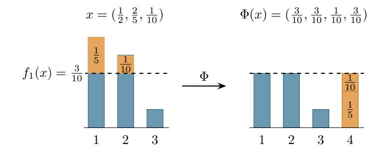
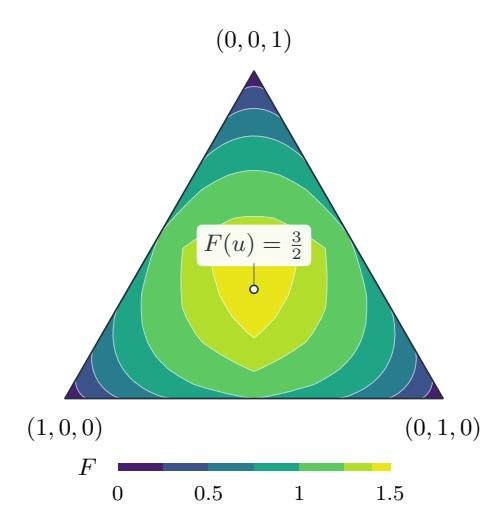
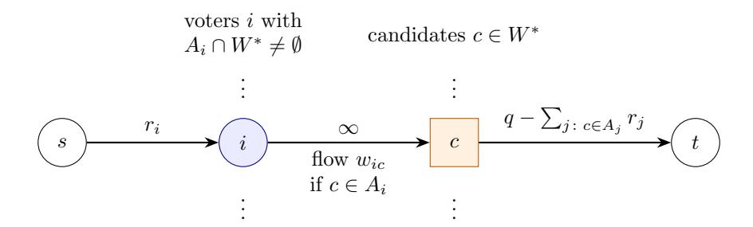

# Existence of the Core in Approval-Based Committee Elections

Patrick Becker1 , Matthias Greger2 , and Dominik Peters3

1Technical University of Munich 2University of Oxford 3CNRS, LAMSADE, Universit´e Paris Dauphine - PSL

We settle the main open question in the theory of approval-based multi-winner elections: we show that there always exists a committee in the core. The core is a stability and group fairness concept. The proof introduces a new voting rule that optimizes an entropy-like objective function over committees and payment systems. All local optima of this objective function lie in the core, which implies that a core committee can be found in polynomial time.

## 1 Introduction

Approval-based multiwinner elections ask how to select a fixed-size committee W of k candidates from a set C, given the approval preferences of a set N of voters. Each voter i ∈ N submits an approval set Ai ⊆ C, and derives utility ui(W) = |Ai ∩ W| from a committee W. A central objective in this setting is proportional representation: sufficiently large groups of voters with shared interests should receive representation proportional to their size.

One of the strongest formalizations of this principle is core stability, introduced to approvalbased committee elections by Aziz et al. [\(2017\)](#page-18-0) and rooted in the classical core from cooperative game theory; see, e.g., Shapley [\(1955\)](#page-19-0). The core formalizes proportionality through coalitional deviations. A coalition S ⊆ N may pool its proportional share of the available seats and propose an alternative set of candidates T. The committee W is blocked if

$$|S| \ge \frac{n}{k}|T|$$
 and  $|A_i \cap T| > |A_i \cap W|$  for every  $i \in S$ .

A committee belongs to the core if no such blocking coalition exists. In contrast to other well-studied proportionality notions such as Extended Justified Representation (EJR), the core does not require the members of a coalition to agree on the same candidates: it only asks whether a group controlling a proportional share of the committee could jointly choose an alternative that makes every member strictly better off. In this sense, core stability provides a particularly demanding notion of proportional representation.

Related work. The non-emptiness question for the core has remained a central open problem (Lackner and Skowron, [2023\)](#page-19-1), and much of the literature on proportional representation in approval-based committee elections can be viewed as approaching it from different directions.

One way of doing so is to define restricted versions of the core that limit the structure of deviating coalitions to those that satisfy additional cohesiveness conditions. This includes Justified Representation (JR), Extended Justified Representation (EJR), and Full Justified Representation (FJR) (see Aziz et al. [\(2017\)](#page-18-0) and D. Peters, Pierczy´nski, and Skowron [\(2021\)](#page-19-2)). Recent work has substantially strengthened the understanding of these notions: Frank and J. Peters [\(2026\)](#page-18-1) give a polynomial-time algorithm rule to satisfy FJR, while Teh [\(2026\)](#page-19-3) introduces FJR+, a strengthening of FJR that admits both polynomial-time verification and computation.

Another approach relaxes core stability directly. D. Peters and Skowron [\(2020\)](#page-19-4) show that Proportional Approval Voting (PAV) gives a factor-2 approximation to the core, while the Method of Equal Shares (MES) provides a logarithmic one. Other work aimed at bounding the size of the deviating coalition has provided constant-factor approximations for general monotone preferences, stable lotteries, and, most recently, a 3.65-approximation based on Lindahl equilibria (Fain et al., [2018;](#page-18-2) Jiang et al., [2020;](#page-18-3) Cheng et al., [2020;](#page-18-4) Gao et al., [2025\)](#page-18-5).

There has also been substantial progress on exact core existence in restricted settings. D. Peters [\(2025\)](#page-19-5) proves that PAV always selects at least one core committee when the committee size is at most 8, and proves existence when the number of candidates is at most fifteen, while Becker et al. [\(2026\)](#page-18-6) prove existence for elections with up to seven voter types and Goel et al. [\(2026\)](#page-18-7) with up to eight voters. Pierczy´nski and Skowron [\(2022\)](#page-19-6) show the core exists for one-dimensional restricted domains such as candidate interval. Brill et al. [\(2024\)](#page-18-8) show that PAV satisfies the core when every candidate has at least k copies.

Results. In this paper, we solve the long-standing open question in the affirmative. Every election instance admits a core-stable committee. While the core is most often stated in terms of the Hare quota q = n/k, our proof also shows core existence for the Droop quota n/(k + 1). In addition, we show that a core committee w.r.t. the Hare quota can always be computed in polynomial time.

The result that a committee in the Hare core exists for every instance has been formally verified in Lean as part of the [ABCVotingLean](https://github.com/DominikPeters/ABCVotingLean) project.

Approach. We propose a new voting rule and prove that its output committees lie in the core. The rule and its proof combine ideas from all the greatest hits of the ABC voting literature: it solves a global optimization with an objective that is somewhat related to the objective of PAV but generalizes the optimization over combinations of committees and payment systems. This allows us to combine the global structure of a welfare-maximizing rule like PAV (which satisfies the core or its relaxations in many special cases) with the flexibility of payment-based methods (such as MES and the Sequential Phragm´en rule). The objective is chosen such that we can bound the effect of candidate additions and deletions. This allows for a proof is based on a PAV-like swapping argument.

Our analysis of individual payment methods allows us to further strengthen core to core+ (mirroring a recent strengthening of FJR to FJR+, proposed by Teh [\(2026\)](#page-19-3)). Core+ admits a payment-based certificate, which we construct as part of our existence proof. This strengthening is related to an earlier notion called Lindahl priceability, inspired by the concept of Lindahl equilibrium, which is a virtual market equilibrium for public goods that works for divisible settings (where fractional committees are allowed) (Munagala et al., [2022\)](#page-19-7). Recent work by Kroer and D. Peters [\(2025\)](#page-19-8) has introduced a convex program whose optimal solutions are Lindahl equilibria (and therefore satisfy the fractional version of the core). In the approval-based committee setting, this convex program can be interpreted as selecting a committee that maximizes the Shannon entropy of voter payments. Our rule closes the remaining gap to integral committee selection by introducing a new analog of Shannon entropy, which we call harmonic entropy. It selects exactly those committees that admit a payment system maximizing harmonic entropy.

Our proof implies that even local optima of our harmonic entropy objective satisfy core+. Together with a linear-program simplification of the objective function, we can deduce that it is possible to find a core+ committee in polynomial time.

### 2 Preliminaries

**Model.** For  $t \in \mathbb{N}$ , define  $[t] := \{1, \ldots, t\}$ . Let N = [n] be a set of *voters*, let  $C = \{c_1, \ldots, c_m\}$  be a finite set of *candidate*, and denote the *committee size* as k with  $1 \le k \le |C|$ . Voter i approves  $A_i \subseteq C$  and has approval utilities, i.e.,  $u_i(W) = |A_i \cap W|$  for  $W \subseteq C$ . An approval-based election *instance* is denoted by I = (A, k) where  $A = (A_i)_{i \in N}$  is the approval profile. We denote the *quota* by q, where  $\frac{n}{k+1} < q \le \frac{n}{k}$ . The quota specifies how many voters are needed to "deserve" one candidate. The default choice is the *Hare quota* given by q = n/k.

**Further notation.** We use the shorthand notation  $W + c = W \cup \{c\}$  and  $W - c = W \setminus \{c\}$ . Let  $\mathcal{W} := \binom{C}{k}$  be the set of size-k committees. For  $d \in \mathbb{N}$ , let

$$\Delta^d \coloneqq \left\{ x \in \mathbb{R}^d_+ : \sum_{j=1}^d x_j = 1 \right\}$$

denote the (d-1)-dimensional probability simplex. Finally,  $\mathbb{R}_+$  denotes the non-negative reals and  $(a)_+ = \max\{a, 0\}$  is the positive part of  $a \in \mathbb{R}$ .

## 3 The core and core+

We now define the core and introduce a strengthened version of it, which we will call core+. The latter property is a fractional relaxation of core; it is inspired by the recently-introduced property of FJR+ (Teh, 2026), which is a similar relaxation of the property FJR.

Let  $W \in \mathcal{W}$  be a committee. A non-empty coalition  $S \subseteq N$  blocks W if there exists a proposal  $T \subseteq C$  such that  $|S| \ge q \cdot |T|$  (the coalition can "afford" T) and

$$u_i(T) > u_i(W)$$
 for every  $i \in S$ .

A committee  $W \in \mathcal{W}$  is in the core if it is not blocked by any non-empty coalition  $S \subseteq N$ .

We can express the condition of a committee W failing to be in the core as a feasibility system of linear inequalities using binary variables. Introduce a binary variable  $y_i \in \{0,1\}$  denoting whether  $i \in S$  and a binary variable  $z_c \in \{0,1\}$  denoting whether  $c \in T$ . Then W satisfies the core if and only if the following system is infeasible:

$$y_i, z_c \in \{0, 1\}; \quad \sum_{c \in A_i} z_c \ge (u_i(W) + 1)y_i \ \forall i \in N; \quad \sum_{i \in N} y_i \ge q \sum_{c \in C} z_c; \quad \sum_{i \in N} y_i > 0.$$
 (1)

Next, we introduce an equivalent system by introducing additional assignment variables  $x_{ic} \in \{0,1\}$  for all  $i \in N$  and  $c \in A_i$  into the system. The interpretation will be as follows: each  $i \in S$  needs to approve at least  $u_i(W) + 1$  candidates in T; choose  $u_i(W) + 1$  such candidates and assign i to each of them (by setting  $x_{ic} = 1$ ). This gives the following assignment constraints, which we will denote by AC(x, y, z, W) for short since they will occur repeatedly in the following systems.

$$\mathsf{AC}(x,y,z,W): \quad \sum_{c \in A_i} x_{ic} = (u_i(W)+1)y_i \ \forall i \in N; \quad x_{ic} \leq z_c; \quad x_{iw} \leq y_i \ \forall w \in W \cap A_i.$$

The constraints " $x_{iw} \leq y_i$ " are redundant; we include them because they will be useful in the fractional relaxation later.

Now we can write an equivalent version of (1) as follows:

$$x_{ic}, y_i, z_c \in \{0, 1\}; \quad AC(x, y, z, W); \quad \sum_{i \in N} y_i \ge q \sum_{c \in C} z_c; \quad \sum_{i \in N} y_i > 0.$$
 (2)

A committee W is in the core if and only if [\(2\)](#page-2-1) has no solution.

We now introduce a key new notion which we will call core+; it strengthens core and is obtained by relaxing the integrality constraints in [\(2\)](#page-2-1).

Definition 3.1. A committee W ∈ W satisfies core+ if the following system has no solution:

$$x_{ic}, y_i, z_c \in [0, 1]; \quad \mathsf{AC}(x, y, z, W); \quad \sum_{i \in N} y_i \ge q \sum_{c \in C} z_c; \quad \sum_{i \in N} y_i > 0.$$
 (3)

Note that core+ is stronger than core because [\(3\)](#page-3-0) is easier to satisfy than [\(2\)](#page-2-1). One can interpret it as allowing even fractional deviations, and allowing voters to only fractionally participate in a blocking coalition. Note that it can be checked if a given committee is core+ by solving a linear program.

We have defined core+ in terms of what is not allowed to happen (i.e., there must not be a solution to [\(3\)](#page-3-0)). For purposes of proving existence, it is much more convenient to have a positive definition that asks for a certificate establishing core+. Fortunately, since [\(3\)](#page-3-0) is a linear system with continuous variables, a positive equivalent definition can be obtained by using Farkas lemma. The resulting certificate is closely related to the well-studied priceability axiom.

Definition 3.2. A payment system for a committee W is given by non-negative voter payments (pic)i∈N,c∈Ai∩W and non-negative reserves (ri)i∈N satisfying

- ri = 1 − P c∈Ai∩W pic for each i ∈ N (every voter pays at most 1 unit of money in total for approved winners and retains ri after those payments), and
- P i:c∈Ai pic ≤ q for each c ∈ W (every winning candidate receives a payment that is at most the quota).

For a given committee W, we denote by P(W) the set of all payment systems (p, r) for W. Note that P(W) is non-empty (take ri = 1 for all i ∈ N and set all payments to 0).

The definition of a payment system we use is somewhat non-standard in that it imposes only an upper bound on how much money is paid to winners (rather than imposing equality). Thus, the existence of a payment system on its own does not give any fairness properties. Thus, we will be interested in payment systems with additional properties; in particular, ones for which supporters of losing candidates have small reserves. The next theorem shows that these additional requirements exactly characterize core+.

Theorem 3.3. A commitee W satisfies core+ if and only if there exists a payment system (p, r) ∈ P(W) for W such that piw ≤ ri for all i ∈ N and w ∈ W ∩ Ai, and for every losing candidate c ∈ C \ W, we have P i:c∈Ai ri < q.

Proof. Note that, apart from the upper bounds on the variables, the system [\(3\)](#page-3-0) is homogeneous (all its right-hand sides are 0). Hence, given any non-negative solution that violates the variable upper bounds, we can scale it down until it satisfies them. Hence, instead of restricting the variables to [0, 1], we can let them range over all of R≥0 without changing feasibility. Afterward, we can normalize a solution such that P i∈N yi = 1. Hence [\(3\)](#page-3-0) has a solution if and only if the following system has a solution:

$$x_{ic}, y_i, z_c \ge 0; \quad AC(x, y, z, W); \quad \sum_{i \in N} y_i \ge q \sum_{c \in C} z_c; \quad \sum_{i \in N} y_i = 1.$$
 (4)

The advantage of [\(4\)](#page-3-1) is that it does not contain strict inequalities. Thus, we can apply Farkas lemma to it. Introduce a multiplier ri ∈ R for voter i's equality inside AC(x, y, z, W); multipliers pic ≥ 0 for the constraint xic ≤ zc; multipliers biw ≥ 0 for xiw ≤ yi ; multiplier α ≥ 0 for the quota inequality; and multiplier δ ∈ R for P i yi = 1. By the Farkas lemma, if [\(4\)](#page-3-1) has no solution then there exist such multipliers satisfying δ > 0 and

- for all c ∈ W and i ∈ N such that c ∈ Ai , pic + bic ≥ ri , while for all c ∈ C \ W and i ∈ N such that c ∈ Ai , pic ≥ ri , and
- for all c ∈ C, P i:c∈Ai pic ≤ αq, and
- for all i ∈ N, (ui(W) + 1)ri − P w∈Ai∩W biw ≥ α + δ.

Note that this system of inequalities is homogeneous, so we can rescale a solution; let us normalize such that α + δ = 1, so α < 1. Note that from the last bullet point, (ui(W) + 1)ri ≥ 1 + P w∈Ai∩W biw ≥ 1, so ri > 0. Next, we can further adjust the solution to be nicer while still satisfying the constraints; in particular, for winners w ∈ W approved by i ∈ N, we can reduce payments such that piw ← min{piw, ri} and set biw ← ri − piw. For losers c ∈ C \ W approved by i ∈ N, we can set pic ← ri . After this operation, the inequality of the third bullet point reads as si := ri + P w∈Ai∩W piw ≥ 1. For each voter, divide all their multipliers (ri , pic, biw) by si to normalize. Now, we have found values of r and p that satisfy:

- ri = 1 − P w∈Ai∩W piw,
- for all c ∈ W, piw ≤ ri ,
- for all losing candidates c ∈ C \ W, P i:c∈Ai ri = P i:c∈Ai pic ≤ αq < q since α < 1.

Hence, (p, r) gives a payment system with the required properties.

Conversely, suppose we are given a payment system with the required properties. We show that W satisfies core+. Suppose not, and there exist a solution (x, y, z) to system [\(3\)](#page-3-0) defining a failure of core+. We compute the price of the deviation according to the payment system, taking ri to be the price of approved losers. Then for voter i, the cost of the assignment to voter i is

$$\begin{split} \sum_{w \in A_i \cap W} p_{iw} x_{iw} + \sum_{c \in A_i \setminus W} r_i x_{ic} &= (u_i(W) + 1) r_i y_i - \sum_{w \in A_i \cap W} (r_i - p_{iw}) x_{iw} \\ &\geq (u_i(W) + 1) r_i y_i - \sum_{w \in A_i \cap W} (r_i - p_{iw}) y_i \\ &\qquad \qquad (\text{as } r_i - p_{iw} \geq 0 \text{ and } x_{iw} \leq y_i) \\ &= \left( r_i + \sum_{w \in A_i \cap W} p_{iw} \right) y_i = y_i. \end{split}$$

Next, consider some voter i with yi > 0. For this voter,

$$\sum_{c \in A_i \setminus W} x_{ic} = (u_i(W) + 1)y_i - \sum_{w \in A_i \cap W} x_{iw} \ge y_i > 0.$$

Hence, zc > 0 for at least one losing candidate c ∈ C \ W.

Now, summing the preceding voter inequalities and using xic ≤ zc, we get

$$\sum_{i} y_{i} \leq \sum_{w \in W} \sum_{i:w \in A_{i}} p_{iw} x_{iw} + \sum_{c \notin W} \sum_{i:c \in A_{i}} r_{i} x_{ic}$$

$$\leq \sum_{w \in W} z_{w} \sum_{i:w \in A_{i}} p_{iw} + \sum_{c \notin W} z_{c} \sum_{i:c \in A_{i}} r_{i}$$

$$< q \sum_{c \in C} z_{c}.$$

The last inequality is strict due to the presence of a losing candidate with zc > 0. This contradicts the affordability constraint P i yi ≥ q P c zc.

Thus, to prove the existence of a core+ committee, it suffices to find a committee that admits a payment system with the properties given in Theorem 3.3.

Remark 3.4 (Relationship to other properties). Core+ (in its positive payment form) is equivalent to "frugal Lindahl priceability", recently introduced by Gölz and Yaghoubizade (2026). As they show, core+ therefore implies Lindahl priceability (Munagala et al., 2022). Stable priceability D. Peters, Pierczyński, Shah, et al. (2021) (a property that is not always satisfiable) implies core+.

## 4 Harmonic entropy

Our existence proof is based on a voting rule that optimizes a carefully designed objective function over the space of all committees W and all payment systems in  $\mathcal{P}(W)$ . The objective function, which we call the *harmonic entropy objective*, is similar to Shannon entropy and thereby rewards committees in which voters' payments are spread as uniformly as possible across approved winners and across as many such winners as possible. The proof will then show that in an optimum, the resulting payment system satisfies the conditions of Theorem 3.3, and hence the committee satisfies core+.

The proof uses a swapping argument, which requires us to connect payment systems as candidates are added and removed from the committee. We will construct our objective function with exactly this idea in mind.

We begin abstractly by considering an arbitrary probability distribution  $x = (x_1, \ldots, x_d) \in \Delta^d$ . In our later instantiation, x will correspond to a voter's payments and reserve. Our goal now is to define what we call the harmonic entropy F(x) of a probability distribution. The name is chosen because, under our definition, the harmonic entropy  $F(\frac{1}{d}, \frac{1}{d}, \ldots, \frac{1}{d})$  of the uniform distribution over d coordinates equals  $H_{d-1} = 1 + \frac{1}{2} + \frac{1}{3} + \cdots + \frac{1}{d-1}$ , the (d-1)-th harmonic number. In contrast to the classic Shannon entropy H, we have  $H(\frac{1}{d}, \frac{1}{d}, \ldots, \frac{1}{d}) = \log_2 d$ . Note that the uniform distribution maximizes F in  $\Delta^d$ , and for non-uniform distributions x, we can think of F(x) as a measure of the distance between x and the uniform distribution (also see Figure 2).

#### 4.1 Water-filling operators

Fix  $x = (x_1, \dots, x_d) \in \Delta^d$ . We first define some important auxiliary functions. We sort the coordinates of x in decreasing order as

$$x_{(1)} \ge x_{(2)} \ge \cdots \ge x_{(d)}$$
.

For  $t \in [d]$ , let  $S_t(x) := \sum_{j=1}^t x_{(j)}$  denote the mass contained in the t largest coordinates. Then, for every integer  $\ell \geq 0$ , define

$$f_{\ell}(x) \coloneqq \max_{1 \le t \le d} \frac{S_t(x)}{\ell + t},$$

The quantities  $f_{\ell}(x)$  admit an intuitive water-filling interpretation. Fix a water-level  $\tau \geq 0$  and lower every coordinate  $j \in [d]$  with  $x_j \geq \tau$  down to  $\tau$ . The total mass released by this is denoted by

$$E_x(\tau) := \sum_{j=1}^d (x_j - \tau)_+.$$

Creating  $\ell$  new coordinates of size  $\tau$  requires total mass  $\ell \cdot \tau$ . The following proposition shows that  $f_{\ell}(x)$  is exactly the level at which these two quantities agree.

**Proposition 4.1.** For every  $\ell \geq 1$ ,  $f_{\ell}(x)$  is the unique positive solution of  $E_x(\tau) = \ell \cdot \tau$ . Moreover,  $f_0(x) = x_{(1)} = \max_{i \in [d]} x_i$ .

Proof. For every  $\tau \geq 0$ ,  $E_x(\tau) = \max_{0 \leq t \leq d} (S_t(x) - t \cdot \tau)$ . Hence,  $E_x(\tau) \leq \ell \cdot \tau$  if and only if  $S_t(x) \leq (\ell + t) \cdot \tau$  for every  $t \in [d]$ , which is equivalent to  $\tau \geq f_\ell(x)$ . At  $\tau = f_\ell(x)$ , equality holds for some maximizing t, so  $E_x(f_\ell(x)) = \ell f_\ell(x)$ . Uniqueness follows because  $E_x(\tau) - \ell \cdot \tau$  is strictly decreasing. The case  $\ell = 0$  follows directly from the definition of  $f_0$ .

Thus, for  $\ell \geq 1$ , lowering the large coordinates to  $f_{\ell}(x)$  releases exactly enough mass to create  $\ell$  new coordinates of that same size. In particular, truncating the existing coordinates at the level  $f_1(x)$  releases exactly enough mass to fill that new coordinate up to  $f_1(x)$ . Figure 1 gives a visualization for x = (1/2, 2/5, 1/10) with  $f_1(x) = 3/10$ .

Figure 1: Visualization of the operation  $\Phi$  with x = (1/2, 2/5, 1/10).

We formalize the above-described one-swap water-filling behavior via the shift operator  $\Phi$ . Given a distribution  $x \in \Delta^d$ , the shift operator is defined as

$$\Phi(x) = (\min\{x_1, f_1(x)\}, \dots, \min\{x_d, f_1(x)\}, f_1(x)).$$

The significance of  $\Phi$  is that it interacts particularly simply with the family  $(f_{\ell}(x))_{\ell\geq 0}$ . After one new coordinate has been created via  $\Phi$ , the level required to create  $\ell$  further coordinates is exactly the level that was previously required to create  $\ell+1$  coordinates. Thus,  $\Phi$  shifts the sequence  $(f_{\ell}(x))_{\ell\geq 0}$  by one position.

Consider the example from Figure 1, applying  $\Phi$  creates a new coordinate at level  $f_1(x) = 3/10$ , giving  $\Phi(x) = (\frac{3}{10}, \frac{3}{10}, \frac{1}{10}, \frac{3}{10})$ . The water-filling levels of  $\Phi(x)$  are therefore shifted by one position:

$$f_0(\Phi(x)) = \frac{3}{10} = f_1(x), \quad f_1(\Phi(x)) = \frac{9}{40} = f_2(x), \quad f_2(\Phi(x)) = \frac{9}{50} = f_3(x), \quad \dots$$

With this intuition in mind, we formalize the behavior in the following lemma.

**Lemma 4.2.** Let  $x = (x_1, \ldots, x_d) \in \Delta^d$ . Then  $\Phi(x) \in \Delta^{d+1}$ ,  $\Phi(x)_i \leq x_i$  for every  $i \in [d]$ , and

$$f_{\ell}(\Phi(x)) = f_{\ell+1}(x)$$
 for all  $\ell \ge 0$ ,

*Proof.* Write  $\bar{f} := f_1(x)$ . By Proposition 4.1,  $E_x(\bar{f}) = \sum_{j=1}^d (x_j - \bar{f})_+ = \bar{f}$ . For every  $j \in [d]$ , we have  $x_j = \min(x_j, \bar{f}) + (x_j - \bar{f})_+$ . Summing over  $j \in [d]$  gives

$$\sum_{j=1}^{d} \min(x_j, \bar{f}) + \bar{f} = 1 - E_x(\bar{f}) + \bar{f} = 1.$$

Hence,  $\Phi(x) \in \Delta^{d+1}$ . Moreover,  $\Phi(x)_j = \min(x_j, \bar{f}) \le x_j$  for every  $j \in [d]$ .

We next prove the shift identity. Since  $\Phi(x)_j \leq \bar{f}$  for every  $j \in [d]$  and  $\Phi(x)_{d+1} = \bar{f}$ , the largest coordinate of  $\Phi(x)$  is  $\bar{f}$ . Hence,  $f_0(\Phi(x)) = \bar{f} = f_1(x)$ .

Now fix  $\ell \geq 1$ . We first compare the excess-mass functions E evaluated for x and  $\Phi(x)$ . Let  $0 \leq \tau \leq \bar{f}$ . First note that, for every  $j \in [d]$ ,

$$\left(\min\{x_j, \bar{f}\} - \tau\right)_+ = (x_j - \tau)_+ - (x_j - \bar{f})_+.$$

Indeed, if  $x_j \leq \bar{f}$ , both sides equal  $(x_j - \tau)_+$ , while if  $x_j > \bar{f}$ , both sides equal  $\bar{f} - \tau$ . Summing over  $j \in [d]$ , gives

$$\sum_{j=1}^{d} (\min\{x_j, \bar{f}\} - \tau)_+ = E_x(\tau) - E_x(\bar{f}).$$

Hence, the first d coordinates of  $\Phi(x)$  contribute  $E_x(\tau) - E_x(\bar{f})$  to  $E_{\Phi(x)}(\tau)$ . The (d+1)-st coordinate equals  $\bar{f}$ , and hence, contributes  $\bar{f} - \tau$ . All in all, we get

$$E_{\Phi(x)}(\tau) = E_x(\tau) - E_x(\bar{f}) + (\bar{f} - \tau).$$

Since  $E_x(\bar{f}) = \bar{f}$  by Proposition 4.1, we obtain  $E_{\Phi(x)}(\tau) = E_x(\tau) - \tau$ . We now evaluate this identity at  $\tau = f_{\ell+1}(x)$ . Note that since  $f_{\ell+1}(x) \leq f_1(x) = \bar{f}$ , this value lies in the range considered above. By Proposition 4.1,  $E_x(f_{\ell+1}(x)) = (\ell+1)f_{\ell+1}(x)$ , and therefore,

$$E_{\Phi(x)}(f_{\ell+1}(x)) = E_x(f_{\ell+1}(x)) - f_{\ell+1}(x) = (\ell+1) f_{\ell+1}(x) - f_{\ell+1}(x) = \ell f_{\ell+1}(x).$$

By Proposition 4.1,  $f_{\ell}(\Phi(x))$  is the unique positive water-level  $\tau$  satisfying  $E_{\Phi(x)}(\tau) = \ell \tau$ . Hence,  $f_{\ell}(\Phi(x)) = f_{\ell+1}(x)$ . Together with the case  $\ell = 0$ , this proves the shift identity for every  $\ell \geq 0$ .

#### 4.2 Defining harmonic entropy

We are now ready to define harmonic entropy.

**Definition 4.3.** The harmonic entropy of a probability distribution  $x \in \Delta^d$  is

$$F(x) := \sum_{\ell=0}^{\infty} \left( \frac{1}{\ell+1} - f_{\ell}(x) \right).$$

The harmonic entropy captures how evenly the unit mass of x is distributed across its coordinates. If all mass is concentrated on a single coordinate, then  $f_{\ell}(x) = 1/(\ell+1)$  for every  $\ell$ , so F(x) = 0. In contrast, F is maximized at the uniform vector, where it takes the value  $H_{d-1} := \sum_{j=1}^{d-1} \frac{1}{j}$ , with  $H_0 := 0$ . At the uniform vector  $u = (1/d, \ldots, 1/d)$ , we have  $S_t(u) = t/d$ , and hence,  $f_{\ell}(u) = 1/(\ell+d)$ . Consequently,  $F(u) = \sum_{\ell=0}^{\infty} (\frac{1}{\ell+1} - \frac{1}{\ell+d}) = H_{d-1}$ . Thus, more concentrated vectors have lower potential, while more evenly spread vectors have higher potential. Figure 2 illustrates this geometry for d=3.

The next lemma collects the basic properties of the potential that formalize this intuition. In particular, concavity will allow us to interpolate between payment systems, while invariance under appending a zero coordinate ensures that the potential remains unchanged when a new candidate is introduced with an initial payment of zero.

Figure 2: Level sets of F on the threecoordinate simplex, with maximum at  $u = (\frac{1}{3}, \frac{1}{3}, \frac{1}{3})$ .

**Lemma 4.4.** F is continuous, concave, and symmetric (invariant under permuting coordinates of x). In addition, F((x,0)) = F(x) for all x.

*Proof.* For each  $t \in [d]$ , the function  $S_t(x)$  is the maximum of the sums of t coordinates of x, and is therefore convex and continuous. Hence,  $f_{\ell}$ , being the maximum of finitely many positive multiples of the functions  $S_t$ , is also convex and continuous.

Since  $S_d(x) = 1$  and  $S_t(x) \le 1$  for every t, we get

$$\frac{1}{\ell+d} \le f_{\ell}(x) \le \frac{1}{\ell+1}.$$

In particular, every term in the series defining F is non-negative. Moreover, for every  $T \geq 0$ ,

$$0 \le \sum_{\ell=T}^{\infty} \left( \frac{1}{\ell+1} - f_{\ell}(x) \right) \le \sum_{\ell=T}^{\infty} \left( \frac{1}{\ell+1} - \frac{1}{\ell+d} \right) = \sum_{a=1}^{d-1} \frac{1}{T+a} \le \frac{d-1}{T+1}.$$

Now let

$$F_T(x) \coloneqq \sum_{\ell=0}^{T-1} \left( \frac{1}{\ell+1} - f_\ell(x) \right).$$

Each  $F_T$  is continuous and concave, since every  $f_\ell$  is continuous and convex. The tail bound above is uniform in x and tends to zero as  $T \to \infty$ , so  $F_T \to F$  uniformly on  $\Delta^d$ . Therefore, F is continuous. Moreover, concavity passes to the limit, so F is concave as well.

Symmetry follows because  $S_t(x)$  depends only on the ordered coordinates of x. Lastly, appending a zero coordinate leaves  $S_t(x)$  unchanged for  $t \leq d$ , while the additional choice t = d + 1 gives

$$\frac{S_{d+1}((x,0))}{\ell+d+1} = \frac{1}{\ell+d+1} \le \frac{1}{\ell+d} \le f_{\ell}(x).$$

Hence,  $f_{\ell}((x,0)) = f_{\ell}(x)$  for every  $\ell$ , and therefore F((x,0)) = F(x).

The shift identity shown in Lemma 4.2 has an immediate consequence for the objective F. Since applying  $\Phi$  replaces the sequence  $(f_{\ell}(x))_{\ell\geq 0}$  by the shifted sequence  $(f_{\ell+1}(x))_{\ell\geq 0}$ , the corresponding terms in the definition of F cancel in a telescoping manner. The only term that remains is the initial value  $f_0(x)$ .

For the running example  $x = (\frac{1}{2}, \frac{2}{5}, \frac{1}{10})$ , we have  $f_0(x) = \frac{1}{2}$ ,  $f_1(x) = \frac{3}{10}$ ,  $f_2(x) = \frac{9}{40}$ , and  $f_3(x) = \frac{9}{50}$ . Hence,

$$\left(\frac{1}{2} - \frac{3}{10}\right) + \left(\frac{3}{10} - \frac{9}{40}\right) + \left(\frac{9}{40} - \frac{9}{50}\right) + \dots = \frac{1}{2}.$$

All intermediate water-filling levels cancel, leaving only  $f_0(x) = 1/2$ , which is the largest coordinate of x. Thus, in this example,  $F(\Phi(x)) - F(x) = 1/2$ . The next proposition shows that this telescoping phenomenon holds for every distribution  $x \in \Delta^d$ .

**Proposition 4.5.** For every  $x = (x_1, \ldots, x_d) \in \Delta^d$ ,  $F(\Phi(x)) - F(x) = \max_{j \in [d]} x_j$ .

*Proof.* Using the definition of F and the shift identity shown in Lemma 4.2, for every  $T \geq 1$ ,

$$\sum_{\ell=0}^{T-1} (f_{\ell}(x) - f_{\ell}(\Phi(x))) = f_0(x) - f_T(x).$$

Since  $f_T(x) \le 1/(T+1) \to 0$  (see Lemma 4.4), letting  $T \to \infty$  gives  $F(\Phi(x)) - F(x) = f_0(x) = \max_{j \in [d]} x_j$ .

## 5 A new voting rule based on harmonic entropy

We are now ready to define our new rule, which is based on a global optimization of an objective function based on harmonic entropy.

Let  $W \in \mathcal{W}$  be a committee. For a payment system  $(p,r) \in \mathcal{P}(W)$  and each voter i, write  $p_i := (p_{ic})_{c \in A_i \cap W}$ , with the candidate coordinates taken in any fixed order. Her payment vector is then  $(p_i, r_i) \in \Delta^{|A_i \cap W|+1}$ . We write  $F(p_i, r_i)$  and  $f_{\ell}(p_i, r_i)$  for the corresponding functions evaluated at this vector.

**Definition 5.1.** The harmonic entropy objective of a set  $W \subseteq C$  is

$$\mathcal{V}(W) = \max_{(p,r)\in\mathcal{P}(W)} \sum_{i\in N} F(p_i, r_i).$$

This is well defined since  $\mathcal{P}(W)$  is compact and non-empty, so the maximum is attained.

The objective function naturally gives rise to a new voting rule that selects all committees for which  $\mathcal{V}(W)$  is maximized, i.e.,  $\arg\max_{W\in\mathcal{W}}\mathcal{V}(W)$ .

We say that a payment system  $(p,r) \in \mathcal{P}(W)$  is optimal if  $\mathcal{V}(W) = \sum_{i \in N} F(p_i, r_i)$ . In the next lemma, we show that there always exists an optimal payment system with useful properties.

**Lemma 5.2.** Let  $W \subseteq C$  be a committee of arbitrary size. Then, there exists an optimal payment system  $(p^*, r^*) \in \mathcal{P}(W)$  satisfying:

- (O1)  $p_{ic}^* \leq r_i^*$  for every  $i \in N$  and  $c \in A_i \cap W$ ,
- (O2)  $\sum_{i:c \in A_i} p_{ic}^* < q \text{ only if } p_{ic}^* = r_i^* \text{ for every } i \in N \text{ with } c \in A_i,$
- (03)  $r_i^* \ge 1/(|A_i \cap W| + 1)$  for every  $i \in N$ .

*Proof.* Our goal is to choose an optimal payment system in which payments and reserves are as balanced as feasibility permits. To do so, we introduce a secondary objective G with

$$G(p,r) = \sum_{i \in N} \left( r_i^2 + \sum_{c \in A_i \cap W} p_{ic}^2 \right)$$

and will choose an optimal payment system  $(p^*, r^*)$  that minimizes G. Such a system exists as G is continuous and minimized over a non-empty and compact set (noting that  $\mathcal{P}(W)$  is non-empty and compact and the objective is continuous).

By concavity of F, we know that moving two unequal coordinates of a voter i's payment vector  $(p_i, r_i)$  toward their average cannot decrease F as the resulting vector is a convex combination of the original vector and the vector obtained by swapping those coordinates. By symmetry of F, both of these vectors have the same potential. Any such move also strictly decreases the sum of their squares (and thus G). Therefore, whenever such a move preserves feasibility as a payment system, the original vector could not have been  $(p^*, r^*)$ .

First suppose that  $p_{ic}^* > r_i^*$  for some  $c \in A_i \cap W$ . Replace both  $p_{ic}^*$  and  $r_i^*$  by their average  $(p_{ic}^* + r_i^*)/2$ . This preserves nonnegativity and the voter's unit budget. Since the payment to c decreases and all other payments to candidates are unchanged, every candidate still receives at most q. The preceding observation gives a contradiction, proving (O1).

Second, let  $c \in W$  receive strictly less than q, and suppose that  $p_{ic}^* < r_i^*$  for some voter i approving c. Choose  $\epsilon > 0$  smaller than both  $(r_i^* - p_{ic}^*)/2$  and  $q - \sum_{j:c \in A_j} p_{jc}^*$ . Replace  $r_i^*$  by  $r_i^* - \epsilon$  and  $p_{ic}^*$  by  $p_{ic}^* + \epsilon$ . This moves both coordinates  $r_i^*$  and  $p_{ic}^*$  toward their average while the bound on  $\epsilon$  keeps the total payment to c below q. Thus, all feasibility constraints are preserved and the above observation gives a contradiction. Together with  $p_i(c) \leq r_i$ , this proves (O2).

Finally, we get  $1 = r_i^* + \sum_{c \in A_i \cap W} p_{ic}^* \le (1 + |A_i \cap W|) r_i^*$  from each voter's unit budget and (O1). Dividing by  $|A_i \cap W| + 1$  proves (O3).

From now on, whenever we refer to an optimal payment system, we assume that it satisfies [\(O1\)-](#page-9-0)[\(O3\).](#page-9-2)

#### 5.1 Exchange bounds for candidate additions and deletions

In this section, we study how the potential changes when candidates are added or removed from a committee. We establish complementary bounds in both directions: adding a candidate whose supporters carry a sufficiently large reserves (unspent budget) increases the potential by at least the quota, whereas, from a committee whose total capacity exceeds the voters' total budget, some candidate can be removed with a potential loss strictly smaller than the quota. These bounds will later provide the exchange argument needed to identify a committee maximizing the potential and to control the reserves of candidates outside it.

For a given committee W, define the reserve load for candidate c ∈ C \ W as Rc := P i: c∈Ai ri .

Lemma 5.3. Let W ⊆ C be a committee of arbitrary size and let (p, r) be an optimal payment system satisfying [\(O1\)](#page-9-0)[–\(O3\).](#page-9-2) If Rc ≥ q, then V(W + c) − V(W) ≥ q.

Proof. For every voter i approving c, apply the operation Φ to the payment vector (pi , ri) and interpret the new coordinate as a payment to c. Since (p, r) is an optimal payment system for W, ri is the largest coordinate of (pi , ri) by [Lemma 5.2.](#page-9-3) Hence, by [Lemma 4.2,](#page-6-1) F(Φ((pi , ri))) − F(pi , ri) = ri . Moreover, Φ weakly decreases all existing coordinates, while the new payment to c is f1(pi , ri) ≤ ri . Voters who do not approve c keep their original payment vectors.

This produces a collection of payments and reserves whose objective exceeds V(W) by exactly Rc, although the total payment to c may exceed q. To restore feasibility for W + c, take the convex combination of this collection and the original payment system, extended by a zero payment to c, with weight

$$\alpha \coloneqq \frac{q}{R_c} \le 1$$

on the new collection. Payments to all candidates in W remain feasible, while the total payment to c is at most αRc = q.

Finally, the concavity of F and invariance under appending a zero coordinate imply that the resulting payment system for W + c has an objective at least

$$\mathcal{V}(W) + \alpha R_c = \mathcal{V}(W) + q.$$

Therefore, V(W + c) − V(W) ≥ q.

Lemma 5.4. Let W ⊆ C be a committee with |W|q > n for n/(k + 1) < q ≤ n/k. Then there exists c ∈ W such that

$$\mathcal{V}(W) - \mathcal{V}(W - c) \le \frac{n}{|W|}.$$

Proof. Let (p, r) be an optimal payment system for W and denote by

$$W_{\leq q} = \{ c \in W : \sum_{i: c \in A_i} p_{ic} < q \}$$

the set of candidates in W that receive less than q. Note that this set is non-empty since |W|q > n and voters have unit budgets, i.e., P c∈Ai pic ≤ 1 for each voter i.

Step 1: W<q can absorbe the reserves of its supporters. For a given W′ ⊆ W<q, denote by Γ(W<q) the remaining capacity of W<q after all voters i that approve at least one candidate in W<q have

additionally contributed their reserves. Formally,

$$\Gamma(W') = |W'|q - \sum_{i: A_i \cap W' \neq \emptyset} \left( r_i + \sum_{c \in A_i \cap W'} p_{ic} \right) = |W'|q - \sum_{i: A_i \cap W' \neq \emptyset} r_i (1 + |A_i \cap W'|),$$

where the second equality follows from  $p_{ic} = r_i$  for all  $c \in A_i \cap W'$  by Lemma 5.2.

 $\Gamma(W') \geq 0$  implies that the set W' can additionally absorb all reserves of voters who approve at least one candidate in W'.

At  $W' = W_{\leq q}$ , we observe that

$$\Gamma(W_{< q}) = |W_{< q}|q - \sum_{i: A_i \cap W_{< q} \neq \emptyset} \left(1 - \sum_{c \in A_i \cap (W \setminus W_{< q})} p_{ic}\right)$$

$$\geq |W_{< q}|q - \sum_{i \in N} \left(1 - \sum_{c \in A_i \cap (W \setminus W_{< q})} p_{ic}\right)$$

$$= |W_{< q}|q - \left(n - \sum_{c \in W \setminus W_{< q}} \sum_{i: c \in A_i} p_{ic}\right)$$

$$= |W_{< q}|q - (n - |W \setminus W_{< q}|q)$$

$$= |W|q - n$$

where the first equality holds due to the fact that every voter i with  $A_i \cap W_{< q} \neq \emptyset$  contributes  $\sum_{c \in A_i \cap (W \setminus W_{< q})} p_{ic}$  to candidates outside of  $W_{< q}$ , the first inequality follows from unit budgets, the third equality follows from the fact that  $\sum_{i: c \in A_i} p_{ic} = q$  for all  $c \in W \setminus W_{< q}$ , and the last inequality holds by assumption.

Hence,  $W_{\leq q}$  can absorb the reserves of its supporters and has even some capacity left.

Step 2: Choosing the set of candidates with the largest capacity. The fact that  $\Gamma(W_{< q}) \geq |W|q - n$  does not necessarily imply that each relevant reserve  $r_i$  can be distributed exclusively among candidates in  $A_i$ . Therefore, we want to choose the subset of candidates  $W^* \subseteq W_{< q}$  that maximizes  $\Gamma(W')$ . By the previous step,  $W^* \neq \emptyset$  and  $\Gamma(W^*) \geq |W|q - n$ . Moreover, optimality yields that for every  $W' \subseteq W^*$ , we have  $\Gamma(W^* \setminus W') \leq \Gamma(W^*)$  and hence

$$\sum_{i \in N} r_i |A_i \cap W'| + \sum_{i: \emptyset \neq A_i \cap W^* \subset W'} r_i \le |W'| q \tag{5}$$

where the left side contains the payments to candidates in W' and the reserves of voters that approve some candidates in W' but not in  $W^* \setminus W'$ .

Step 3: Redistributing reserves. We now show that when choosing  $W^*$ , the relevant reserves can be distributed in a way such that each voter with  $A_i \cap W^* \neq \emptyset$  can spend their entire reserve on approved candidates from  $W^*$ .

To this end, denote by  $w_{ic}$  the amount of the reserve of such a voter i that is redistributed to candidate  $c \in A_i \cap W^*$  and let  $\hat{p}$  be the new payment vector after redistributing the reserves. Thus, for  $c \in A_i \cap W^*$ , we get  $\hat{p}_{ic} = r_i + w_{ic}$  since  $p_{ic} = r_i$  by Lemma 5.2.

We want to find a system of redistributions  $(w_{ic})_{i: A_i \cap W^* \neq \emptyset, W^*}$  such that

$$w_{ic} \ge 0 \qquad \text{for all } c \in A_i \cap W^*,$$

$$\sum_{c \in A_i \cap W^*} w_{ic} = r_i \qquad \text{for all } i,$$

$$\sum_{i: c \in A_i} w_{ic} \le q - \sum_{i: c \in A_i} r_i \quad \text{for all } c \in W^*.$$

$$(6)$$

The second condition ensures that voter i's entire reserve is distributed and the third condition states that no candidate's total payment exceeds q.

To show that (6) has a solution, form a directed network with source s and sink t. For each voter i with  $A_i \cap W^* \neq \emptyset$ , add a directed edge  $s \to i$  of capacity  $r_i$ . For every  $c \in A_i \cap W^*$ , add a directed edge  $i \to c$  of unlimited capacity. Finally, for each  $c \in W^*$ , add a directed edge  $c \to t$  of capacity  $q - \sum_{i:c \in A_i} r_i$ , which is nonnegative by setting  $W' = \{c\}$  in (5). The network is illustrated in Figure 3.

Figure 3: Edge labels denote capacities. A flow saturating every directed edge out of s distributes all reserves and yields  $\hat{p}_{ic} = r_i + w_{ic}$ .

If the maximum flow of this network equals  $\sum_{i: A_i \cap W^* \neq \emptyset} r_i$ , the corresponding weights form a solution of (5). Investigating minimum s-t cuts, we first note that none of the corresponding cut sets can contain an edge from some i to  $c \in A_i \cap W^*$ . Hence, whenever a minimum cut places a node i on the source side, all nodes c with  $c \in A_i \cap W^*$  also need to be placed on that side, otherwise the minimum cut would have infinite capacity. For any minimal cut denote by  $W' \subseteq W^*$  and  $N' \subseteq \{i: A_i \cap W^* \neq \emptyset\}$ . Its capacity is

$$\sum_{i: A_i \cap W^* \neq \emptyset} r_i - \sum_{i \in N'} r_i + \sum_{c \in W'} (q - \sum_{i: c \in A_i} r_i) \ge \sum_{i: \emptyset \neq A_i \cap W^* \subseteq W'} r_i - \sum_{i \in N'} r_i + \sum_{c \in W'} (q - \sum_{i: c \in A_i} r_i)$$

$$\ge \sum_{i: A \cdot \cap W^* \neq \emptyset} r_i$$

where the last inequality follows from (5). Hence, there exists a minimum cut of capacity  $\sum_{i: A_i \cap W^*} r_i$ , namely the one that places all nodes i on the sink side.

By the max-flow/min-cut theorem, the maximum flow of this network equals  $\sum_{i: A_i \cap W^* \neq \emptyset} r_i$  as desired, and the corresponding weights  $(w_{ic})$  solve (6).

Therefore, the resulting payments  $\hat{p}_{ic} = r_i + w_{ic}$  satisfy

$$\hat{p}_{ic} \geq r_{i} \qquad \text{for all } i \in N, \ c \in A_{i} \cap W^{*},$$

$$\sum_{c \in A_{i} \cap W^{*}} \hat{p}_{ic} = (|A_{i} \cap W^{*}| + 1)r_{i} \quad \text{for all } i \in N, \ A_{i} \cap W^{*} \neq \emptyset,$$

$$\sum_{i:c \in A_{i}} \hat{p}_{ic} \leq q \qquad \text{for all } c \in W^{*}.$$
(7)

which, together with the remaining reserves  $\hat{r}_i$ , yields a payment system for W. Note that  $\hat{r}_i = 0$  for all voters i with  $A_i \cap W^* \neq \emptyset$ .

Step 4: Choosing a removable candidate. Given the payment system  $(\hat{r}, \hat{p})$ , we next choose a candidate  $c^* \in W^*$  whose removal has a small potential loss. When deleting that candidate, the payments  $\hat{p}_{ic^*}$  will be transferred to the reserves  $\hat{r}_i$ .

Among all  $\hat{p}$  satisfying (7), choose one that minimizes  $\sum_{i \in N} \sum_{c \in A_i \cap W^*} \hat{p}_{ic}^2$ . Since  $r_i \leq \hat{p}_{ic} \leq 2r_i$  for all  $c \in A_i \cap W^*$ , and by the previous step, we optimize over a compact and non-empty set,

and a minimum exists. All of the additional payments that candidates in  $W^*$  receive (when going from p to  $\hat{p}$ ) come from the reserves of voters who approve at least one candidate in  $W^*$ . Hence, the sum of total payments to  $W^*$  and the relevant reserves stays the same. Formally,

$$\sum_{c \in W^*} \sum_{i: c \in A_i} \hat{p}_{ic} = |W^*|q - \Gamma(W^*).$$

Since  $\Gamma(W^*) \geq |W|q - n$ , we obtain

$$\sum_{c \in W^*} \sum_{i: c \in A_i} \hat{p}_{ic} \le n - q(|W| - |W^*|).$$

Moreover, |W|q > n implies q > n/|W|, and hence

$$n - q(|W| - |W^*|) \le \frac{n}{|W|}|W^*|.$$

Therefore, there exists a candidate  $c^* \in W^*$  such that

$$\sum_{i:c^* \in A_i} \hat{p}_{ic^*} \le \frac{n}{|W|} < q. \tag{8}$$

Since  $c^*$  can accept an additional payment, minimizing the above sum of squares forces its payment to be largest for every voter i with  $c^* \in A_i$ , i.e.,

$$\hat{p}_{ic^*} \ge \hat{p}_{ic} \quad \text{for all } c \in A_i \cap W^*.$$
 (9)

Otherwise, a small transfer from a larger  $\hat{p}_{ic}$  to  $\hat{p}_{ic^*}$  respects all bounds from (7) while strictly decreasing the quadratic objective, contradicting optimality of  $\hat{p}$ .

Equation (9) helps us to apply Proposition 4.1 when moving  $\hat{p}_{ic^*}$  to voter i's reserve in the next step.

Step 5: Redistributing payments after deleting  $c^*$ . Delete  $c^*$  from W. For every voter i with  $c^* \in A_i$ , start from her original payment vector and replace her reserve  $r_i$  by  $\hat{p}_{ic^*}$  and, for every  $c \in A_i \cap (W^* \setminus c^*)$ , replace the original payment  $p_{ic} = r_i$  by  $\hat{p}_{ic}$ . Leave all other coordinates unchanged and denote the resulting payment vector by  $x_i^-$ . For voters who do not approve  $c^*$ , leave the original payment vector unchanged.

For every voter i approving  $c^*$ , the original reserve and all payments to candidates in  $A_i \cap W^*$  are equal to  $r_i$  by Lemma 5.2. By (7), their total mass is preserved, so  $x_i^-$  is again a probability vector. Moreover, all unchanged coordinates are at most  $r_i$ , while

$$E_{x_i^-}(r_i) = \sum_{c \in A_i \cap W^*} (\hat{p}_{ic} - r_i) = r_i$$

due to the fact that voter i has additionally distributed her original reserve  $r_i$  on approved candidates in  $W^*$ .

Hence, Proposition 4.1 gives  $f_1(x_i^-) = r_i$ . Applying the shift operator  $\Phi$  to  $x_i^-$  therefore recovers the original payment vector  $x_i$ , up to a permutation of coordinates.

By (9), the largest coordinate of  $x_i^-$  is  $\hat{p}_{ic^*}$ . Thus, Proposition 4.5 gives

$$F(x_i) - F(x_i^-) = F(\Phi(x_i^-)) - F(x_i^-) = \hat{p}_{ic^*}.$$

It remains to verify feasibility. For every surviving candidate  $c \in W^* \setminus c^*$ , voters approving  $c^*$  pay  $\hat{p}_{ic}$ , whereas voters not approving  $c^*$  retain their original payment  $p_{ic} = r_i \leq \hat{p}_{ic}$ . Hence,

the total payment to c is at most  $\sum_{i:c\in A_i} \hat{p}_{ic} \leq q$ . Candidates outside  $W^*$  retain their original payments. Thus, the constructed payment system is feasible for  $W - c^*$ .

Since voters not approving  $c^*$  keep their original payment vectors,

$$\mathcal{V}(W) - \mathcal{V}(W - c^*) \le \sum_{i \in N} F(x_i) - \sum_{i \in N} F(x_i^-)$$
$$= \sum_{i:c^* \in A_i} \hat{p}_{ic^*}$$
$$\le \frac{n}{|W|},$$

where the final inequality follows from (8). This proves the claim.

### 6 Existence of a core+ committee

We are now ready to prove our main existence result.

**Theorem 6.1.** For every quota q with  $\frac{n}{k+1} < q \le \frac{n}{k}$ , there exists a committee satisfying core+with respect to quota q. In particular, every committee maximizing  $\mathcal{V}$  among size-k committees satisfies core+ with respect to quota q.

The exchange bounds from the previous section yield a quantitative local criterion for core+. Suppose that some losing candidate d has a reserve load of at least q. Adding d then increases the objective by at least q, while the deletion lemma allows us to remove one candidate from the resulting (k+1)-candidate committee at a loss of at most n/(k+1). Hence, some single-candidate replacement improves the objective by at least q - n/(k+1). Conversely, if no replacement achieves such an improvement, every losing candidate has a reserve load strictly below q. Together with (O1), this gives precisely the payment-system characterization of core+ from Theorem 3.3.

**Lemma 6.2.** Fix a quota q with  $\frac{n}{k+1} < q \le \frac{n}{k}$ . Let  $W \in \mathcal{W}$ . If

$$\mathcal{V}((W-c)+d) - \mathcal{V}(W) < q - \frac{n}{k+1}$$

for every  $c \in W$  and  $d \in C \setminus W$ , then W satisfies core+.

*Proof.* Take an optimal payment system  $(p,r) \in \mathcal{P}(W)$  satisfying (O1)–(O3). We show that  $R_d = \sum_{i:d \in A_i} r_i < q$  for every  $d \notin W$ .

Suppose, for contradiction, that  $R_d \ge q$  for some  $d \notin W$ . By Lemma 5.3,  $\mathcal{V}(W+d) - \mathcal{V}(W) \ge q$ . Since |W+d| = k+1 and (k+1)q > n, Lemma 5.4 gives some  $c \in W+d$  such that

$$\mathcal{V}(W+d) - \mathcal{V}((W+d) - c) \le \frac{n}{k+1}.$$

Combining the two inequalities yields

$$\mathcal{V}((W+d)-c)-\mathcal{V}(W) \ge q - \frac{n}{k+1}.$$

Since q > n/(k+1), we cannot have c = d, as this would make the left-hand side equal to zero. Hence,  $c \in W$  and (W + d) - c = (W - c) + d, contradicting the hypothesis of the lemma. Therefore,  $R_d < q$  for every  $d \notin W$ .

By (O1), the optimal payment system also satisfies  $p_{iw} \leq r_i$  for every  $i \in N$  and  $w \in A_i \cap W$ . Thus, (p, r) satisfies both conditions in Theorem 3.3. Hence, W satisfies core+.

In particular, every local maximum of V under single-candidate replacements satisfies core+, since q − n/(k + 1) > 0. This immediately yields the existence result.

Proof of [Theorem 6.1.](#page-14-0) Since there are finitely many size-k committees, there exists a committee W maximizing V among size-k committees. Therefore, for every c ∈ W and d ∈ C \ W,

$$\mathcal{V}((W-c)+d) - \mathcal{V}(W) \le 0 < q - \frac{n}{k+1}.$$

Hence, W satisfies the hypothesis of [Lemma 6.2](#page-14-1) and therefore satisfies core+.

We can also extend this result to the Droop quota.

Theorem 6.3. For every election instance I, there exists a committee W ∈ W for which there is no fractional objection satisfying

$$\sum_{i \in N} y_i > \frac{n}{k+1} \sum_{c \in C} z_c.$$

In particular, core+ is non-empty under the strict Droop quota.

Proof. Let (qt)t≥1 be any sequence satisfying

$$\frac{n}{k+1} < q_t < \frac{n}{k}$$
 and  $q_t \longrightarrow \frac{n}{k+1}$ .

For every t, the preceding existence result provides a committee Wt ∈ W satisfying core+ with quota qt .

Since W is finite, some committee W occurs infinitely often in the sequence (Wt)t≥1. We claim that W satisfies core+ under the strict Droop quota.

Suppose, to the contrary, that there exists a fractional objection (x, y, z) to W such that

$$\sum_{i \in N} y_i > \frac{n}{k+1} \sum_{c \in C} z_c.$$

Writing Y := P i yi and Z := P c zc, we have Z > 0 (otherwise there is no core+ violation), and therefore

$$Y > \frac{n}{k+1} \ Z.$$

Since qt → n/(k + 1), for all sufficiently large t we have qt < Y /Z, and hence, Y > qtZ. Choose a sufficiently large t for which Wt = W (this can be done as W is chosen infinitely often). But then the same fractional objection blocks W at quota qt , contradicting the choice of Wt . Hence, no such fractional objection exists, and W satisfies core+ under the strict Droop quota.

# 7 Polynomial-time computation

The quantitative version of [Lemma 6.2](#page-14-1) suggests a natural local-search algorithm, similar to PAV's. If a committee does not satisfy core+, then some single-candidate replacement increases its objective by a fixed positive amount. Thus, it suffices to evaluate the committee's objective accurately enough to detect such improvements.

For the remainder of this section, fix

$$q := \frac{1}{2} \left( \frac{n}{k} + \frac{n}{k+1} \right)$$
 and  $\delta := q - \frac{n}{k+1} = \frac{n}{2k(k+1)}$ .

In particular, n/(k+1) < q < n/k. By Lemma 6.2, if a size-k committee W does not satisfy core+, then there exist  $c \in W$  and  $d \in C \setminus W$  such that

$$\mathcal{V}((W-c)+d) - \mathcal{V}(W) \ge \delta$$

We will approximate  $\mathcal{V}$  with error at most  $\delta/4$ . This is sufficiently accurate to ensure that every such improving swap remains detectable. To this end, for  $T \in \mathbb{N}$ , we truncate the infinite series in F after T terms and set

$$F_T(x) \coloneqq \sum_{\ell=0}^{T-1} \left( \frac{1}{\ell+1} - f_\ell(x) \right), \quad \text{ and } \quad \mathcal{V}_T(W) \coloneqq \max_{(p,r) \in \mathcal{P}(W)} \sum_{i \in N} F_T(x_i).$$

For a size-k committee, each payment vector  $x_i$  has at most k+1 coordinates. The tail bound used in Lemma 4.4 therefore gives  $0 \le F(x_i) - F_T(x_i) \le k/(T+1)$  for every payment system. Summing over all voters yields

$$0 \le \mathcal{V}(W) - \mathcal{V}_T(W) \le \frac{nk}{T+1}.$$
(10)

Thus, choosing T to be polynomially large allows us to approximate the committee objective with inverse-polynomial accuracy.

We next show that  $\mathcal{V}_T(W)$  can be computed by a linear program of polynomial size. Fix a size-k committee W, and let  $d_i := |A_i \cap W| + 1$  denote the number of coordinates in voter i's payment vector  $x_i = (x_{i1}, \ldots, x_{id_i})$ .

By Proposition 4.1,  $f_{\ell}(x_i)$  is exactly the threshold at which the excess mass  $E_{x_i}(\tau)$  equals  $\ell \cdot \tau$ . Further, since the excess mass decreases as  $\tau$  increases, the inequality  $E_{x_i}(\tau) \leq \ell \cdot \tau$  holds precisely when  $\tau \geq f_{\ell}(x_i)$ . This gives

$$\tau \ge f_{\ell}(x_i) \quad \Longleftrightarrow \quad \sum_{j=1}^{d_i} (x_{ij} - \tau)_+ \le \ell \cdot \tau.$$

For  $\ell = 0$ , the same equivalence follows from  $f_0(x_i) = \max_i x_{ij}$ .

The idea is now to represent each water-filling level  $f_{\ell}(x_i)$  by a variable  $t_{i\ell}$ . By the above characterization, it is sufficient to enforce  $t_{i\ell} \geq f_{\ell}(x_i)$ . The only non-linear terms in this expression are  $(x_{ij} - t_{i\ell})_+$ , which we linearize by the auxiliary variables  $a_{i\ell j}$ . Consequently, in addition to the linear constraints defining  $(p, r) \in \mathcal{P}(W)$  given in Definition 3.2, we impose

$$a_{i\ell j} \ge 0,$$
  $a_{i\ell j} \ge x_{ij} - t_{i\ell},$   $t_{i\ell} \ge 0,$   $\sum_{j=1}^{d_i} a_{i\ell j} \le \ell t_{i\ell},$ 

for every  $i \in N$ ,  $0 \le \ell < T$ , and  $j \in [d_i]$ .

The first two constraints imply  $a_{i\ell j} \geq (x_{ij} - t_{i\ell})_+$ , and the smallest admissible value is therefore  $a_{i\ell j} = (x_{ij} - t_{i\ell})_+$ . Consequently, there exist auxiliary variables satisfying the final constraint if and only if  $\sum_{j=1}^{d_i} (x_{ij} - t_{i\ell})_+ \leq \ell t_{i\ell}$ , which, by the characterization above, is equivalent to  $t_{i\ell} \geq f_{\ell}(x_i)$ . We can therefore represent the truncated committee objective by the linear objective

$$\max_{(p,r)\in\mathcal{P}_q(W),t,a} \quad nH_T - \sum_{i\in N} \sum_{\ell=0}^{T-1} t_{i\ell},$$

subject to the constraints above. For fixed payment allocations, each  $t_{i\ell}$  enters the objective with a negative coefficient and is constrained to satisfy  $t_{i\ell} \geq f_{\ell}(x_i)$ . Hence, maximizing the objective

chooses its smallest feasible value, namely  $t_{i\ell} = f_{\ell}(x_i)$ . The resulting objective value is therefore exactly  $\sum_{i \in N} F_T(x_i)$ . Maximizing further over all  $(p, r) \in \mathcal{P}(W)$  therefore yields exactly  $\mathcal{V}_T(W)$ .

The linear program has O(nkT) variables and constraints, and all coefficients are rational with bit length polynomial in the input size and T. The constant  $nH_T$  need not be included in the optimization itself and can be added afterward. Hence,  $\mathcal{V}_T(W)$  can be computed in time polynomial in the input size and T.

#### 7.1 Local search

We can now combine the approximation with the quantitative improvement guarantee from Lemma 6.2.

**Theorem 7.1.** A committee satisfying core+ can be computed in polynomial time. More precisely, for  $q = \frac{1}{2} \left( \frac{n}{k} + \frac{n}{k+1} \right)$ , the algorithm below performs at most  $4k(k+1)H_k$  candidate replacements.

*Proof.* If k = m, return C. In this case, there is no candidate outside the committee, and C satisfies core+.

Otherwise, set  $T := 8k^2(k+1)$ . Since  $\delta = n/(2k(k+1))$ , Equation (10) gives

$$0 \le \mathcal{V}(W) - \mathcal{V}_T(W) \le \frac{nk}{T+1} = \frac{nk}{8k^2(k+1)+1} \le \frac{\delta}{4}$$

for every size-k committee W.

We now start from an arbitrary size-k committee W. Compute  $\mathcal{V}_T(W)$  and, for every  $c \in W$  and  $d \in C \setminus W$ , the truncated objective of W' = (W - c) + d. If some replacement satisfies

$$\mathcal{V}_T(W') \ge \mathcal{V}_T(W) + \frac{\delta}{2},$$

replace W by W' and repeat. If no such replacement exists, return W.

We first bound the number of replacements. Since  $F_T(x) \leq F(x)$  and F is maximized at the uniform distribution (see Section 4.2), every payment vector  $x_i$  with at most k+1 coordinates satisfies  $0 \leq F_T(x_i) \leq H_k$ . Hence,  $0 \leq \mathcal{V}_T(W) \leq nH_k$  for every size-k committee W. Each replacement increases  $\mathcal{V}_T$  by at least  $\delta/2$ . Therefore, if the algorithm performs R replacement steps, then  $R^{\delta}_{2} \leq nH_k$ . Rearranging and again using  $\delta = n/(2k(k+1))$  gives

$$R \le \frac{2nH_k}{\delta} = 4k(k+1)H_k.$$

In each iteration, at most k(m-k) neighboring committees are evaluated. Since  $T = O(k^3)$  and each truncated objective is computed by a linear program, the overall procedure runs in polynomial time.

At termination, every replacement W' = (W - c) + d satisfies

$$\mathcal{V}_T(W') - \mathcal{V}_T(W) < \frac{\delta}{2}.$$

By Equation (10),  $\mathcal{V}(W') \leq \mathcal{V}_T(W') + \frac{\delta}{4}$ , and  $\mathcal{V}(W) \geq \mathcal{V}_T(W)$ . Therefore,

$$\mathcal{V}(W') - \mathcal{V}(W) \le \mathcal{V}_T(W') + \frac{\delta}{4} - \mathcal{V}_T(W) < \frac{\delta}{2} + \frac{\delta}{4} = \frac{3\delta}{4} < \delta.$$

Thus, every single-candidate replacement increases the true objective by strictly less than  $\delta$ . Since  $\delta = q - n/(k+1)$ , the hypothesis of Lemma 6.2 is satisfied. Hence, the returned committee W satisfies core+.

# 8 Conclusion

We introduce a new voting rule based on a new harmonic entropy objective function. We are currently exploring its properties beyond core+, and it appears to be an overall very attractive rule. We hope that the concept of harmonic entropy may find other applications in the study of proportional representation.

## Acknowledgements

We thank Fabian Frank for insightful discussions on adaptive payment schemes. The voting rule we present and the proof that it satisfies core+ were found by GPT-6 Astra in a lengthy interactive session. We initially aimed to find an approximate core outcome. Starting from a Lindahl-equilibrium rounding approach, GPT-6 Astra quickly achieved an approximation factor around 2.065. Repeated prompts to improve the bound, seek alternative potential functions, and to exploit KKT conditions of Lindahl equilibria eventually led to the entropy-based framework in which we optimize continuous voter payments and compare candidate additions with capacitypreserving deletions. We suggested aiming for core+ and not just core. Despite these ideas being developed by GPT-6 Astra, we invested significant effort into verifying them and making them accessible to humans, in particular by rewriting most of the proofs.

# References

- Aziz, Haris, Markus Brill, Vincent Conitzer, Edith Elkind, Rupert Freeman, and Toby Walsh (2017). "Justified Representation in Approval-Based Committee Voting". In: Social Choice and Welfare 48.2, pp. 461–485. doi: [10.1007/s00355-016-1019-3](https://doi.org/10.1007/s00355-016-1019-3) (cit. on pp. [1,](#page-0-0) [2\)](#page-1-0).
- Becker, Patrick, Matthias Greger, and Dominik Peters (2026). Core Existence in Approval-Based Committee Elections with up to Seven Voter Types. arXiv: [2605.06194 \[cs.GT\]](https://arxiv.org/abs/2605.06194) (cit. on p. [2\)](#page-1-0).
- Brill, Markus, Paul G¨olz, Dominik Peters, Ulrike Schmidt-Kraepelin, and Kai Wilker (2024). "Approval-Based Apportionment". In: Mathematical Programming 203, pp. 77–105. doi: [10.1007/s10107-022-01852-1](https://doi.org/10.1007/s10107-022-01852-1) (cit. on p. [2\)](#page-1-0).
- Cheng, Yu, Zhihao Jiang, Kamesh Munagala, and Kangning Wang (2020). "Group Fairness in Committee Selection". In: ACM Transactions on Economics and Computation (TEAC) 8.4. doi: [10.1145/3417750](https://doi.org/10.1145/3417750) (cit. on p. [2\)](#page-1-0).
- Fain, Brandon, Kamesh Munagala, and Nisarg Shah (2018). "Fair Allocation of Indivisible Public Goods". In: Proceedings of the 2018 ACM Conference on Economics and Computation (EC), pp. 575–592. doi: [10.1145/3219166.3219174](https://doi.org/10.1145/3219166.3219174). arXiv: [1805.03164 \[cs.GT\]](https://arxiv.org/abs/1805.03164) (cit. on p. [2\)](#page-1-0).
- Frank, Fabian and Jannik Peters (2026). A Polynomial-Time Rule Satisfying Full Justified Representation. arXiv: [2608.05397 \[cs.GT\]](https://arxiv.org/abs/2608.05397) (cit. on p. [2\)](#page-1-0).
- Gao, Drew, Yihang Sun, and Jan Vondr´ak (2025). Computation of Approximately Stable Committees in Approval-Based Elections. arXiv: [2508.00130 \[cs.GT\]](https://arxiv.org/abs/2508.00130) (cit. on p. [2\)](#page-1-0).
- Goel, Ashish, Zhihao Jiang, and Chenghan Zhou (2026). Nash Core in Multiwinner Election. arXiv: [2609.00486 \[cs.GT\]](https://arxiv.org/abs/2609.00486) (cit. on p. [2\)](#page-1-0).
- G¨olz, Paul and Hannane Yaghoubizade (2026). Approval-Based Apportionment: Like Portioning, Approximately like Committee Voting. arXiv: [2608.27605 \[cs.GT\]](https://arxiv.org/abs/2608.27605) (cit. on p. [6\)](#page-5-1).
- Jiang, Zhihao, Kamesh Munagala, and Kangning Wang (2020). "Approximately Stable Committee Selection". In: Proceedings of the 52nd Annual ACM SIGACT Symposium on Theory of Computing (STOC), pp. 463–472. doi: [10.1145/3357713.3384238](https://doi.org/10.1145/3357713.3384238) (cit. on p. [2\)](#page-1-0).

- Kroer, Christian and Dominik Peters (2025). "Computing Lindahl Equilibrium for Public Goods with and without Funding Caps". In: Proceedings of the 26th ACM Conference on Economics and Computation (EC), p. 129. doi: [10.1145/3736252.3742510](https://doi.org/10.1145/3736252.3742510). arXiv: [2503.16414](https://arxiv.org/abs/2503.16414) (cit. on p. [2\)](#page-1-0).
- Lackner, Martin and Piotr Skowron (2023). Multi-Winner Voting with Approval Preferences. Springer Nature. doi: [10.1007/978-3-031-09016-5](https://doi.org/10.1007/978-3-031-09016-5) (cit. on p. [1\)](#page-0-0).
- Munagala, Kamesh, Yiheng Shen, and Kangning Wang (2022). "Auditing for Core Stability in Participatory Budgeting". In: Proceedings of the 18th International Conference on Web and Internet Economics (WINE), pp. 292–310. doi: [10.1007/978-3-031-22832-2\\_17](https://doi.org/10.1007/978-3-031-22832-2_17) (cit. on pp. [2,](#page-1-0) [6\)](#page-5-1).
- Peters, Dominik (2025). "The Core of Approval-Based Committee Elections with Few Seats". In: Proceedings of the 34th International Joint Conference on Artificial Intelligence (IJCAI), pp. 4014–4022. doi: [10.24963/ijcai.2025/447](https://doi.org/10.24963/ijcai.2025/447) (cit. on p. [2\)](#page-1-0).
- Peters, Dominik, Grzegorz Pierczy´nski, Nisarg Shah, and Piotr Skowron (2021). "Market-Based Explanations of Collective Decisions". In: Proceedings of the 35th AAAI Conference on Artificial Intelligence (AAAI), pp. 5656–5663. doi: [10.1609/aaai.v35i6.16710](https://doi.org/10.1609/aaai.v35i6.16710) (cit. on p. [6\)](#page-5-1).
- Peters, Dominik, Grzegorz Pierczy´nski, and Piotr Skowron (2021). "Proportional Participatory Budgeting with Additive Utilities". In: Proceedings of the 35th Annual Conference on Neural Information Processing Systems (NeurIPS), pp. 12726–12737. url: [https://proceedings.](https://proceedings.neurips.cc/paper/2021/hash/69f8ea31de0c00502b2ae571fbab1f95-Abstract.html) [neurips.cc/paper/2021/hash/69f8ea31de0c00502b2ae571fbab1f95- Abstract.html](https://proceedings.neurips.cc/paper/2021/hash/69f8ea31de0c00502b2ae571fbab1f95-Abstract.html) (cit. on p. [2\)](#page-1-0).
- Peters, Dominik and Piotr Skowron (2020). "Proportionality and the Limits of Welfarism". In: Proceedings of the 21st ACM Conference on Economics and Computation (EC), pp. 793–794. doi: [10.1145/3391403.3399465](https://doi.org/10.1145/3391403.3399465). arXiv: [1911.11747](https://arxiv.org/abs/1911.11747) (cit. on p. [2\)](#page-1-0).
- Pierczy´nski, Grzegorz and Piotr Skowron (2022). "Core-Stable Committees under Restricted Domains". In: Proceedings of the 18th International Conference on Web and Internet Economics (WINE), pp. 311–329. doi: [10.1007/978-3-031-22832-2\\_18](https://doi.org/10.1007/978-3-031-22832-2_18) (cit. on p. [2\)](#page-1-0).
- Shapley, Lloyd S. (1955). Markets as Cooperative Games. Tech. rep. P-629. RAND Corporation. url: <https://www.rand.org/pubs/papers/P629.html> (cit. on p. [1\)](#page-0-0).
- Teh, Nicholas (2026). Strengthening Full Justified Representation: Efficient Verification and Computation. arXiv: [2608.11500 \[cs.GT\]](https://arxiv.org/abs/2608.11500) (cit. on pp. [2,](#page-1-0) [3\)](#page-2-2).