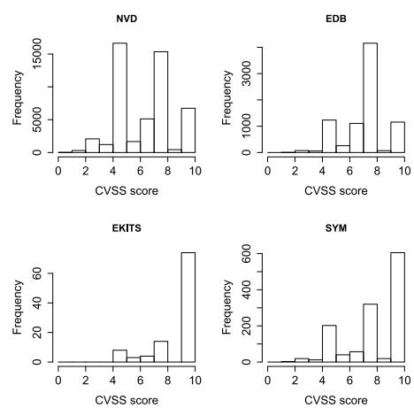
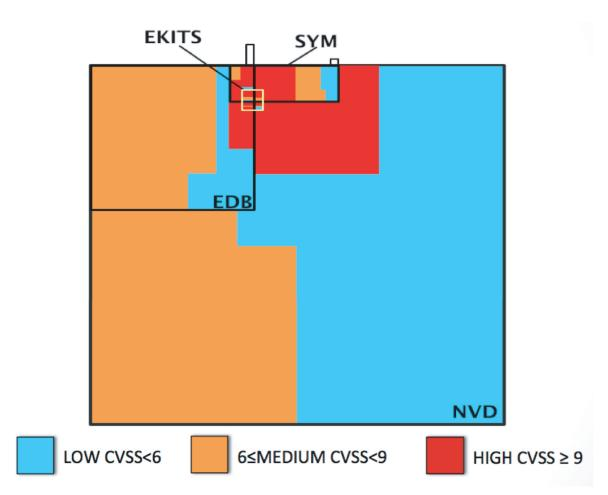
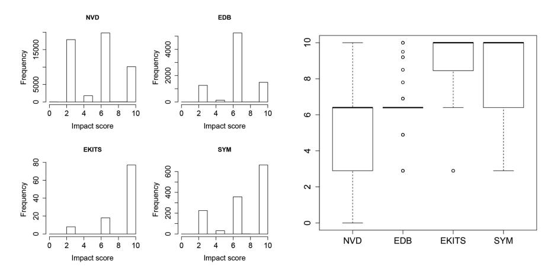
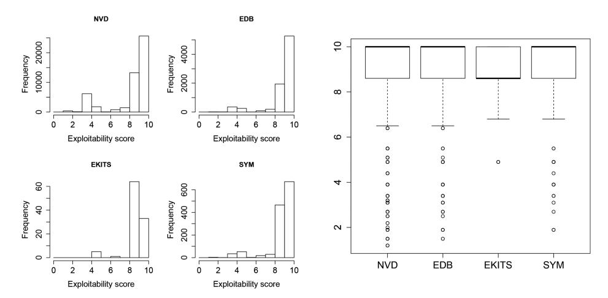
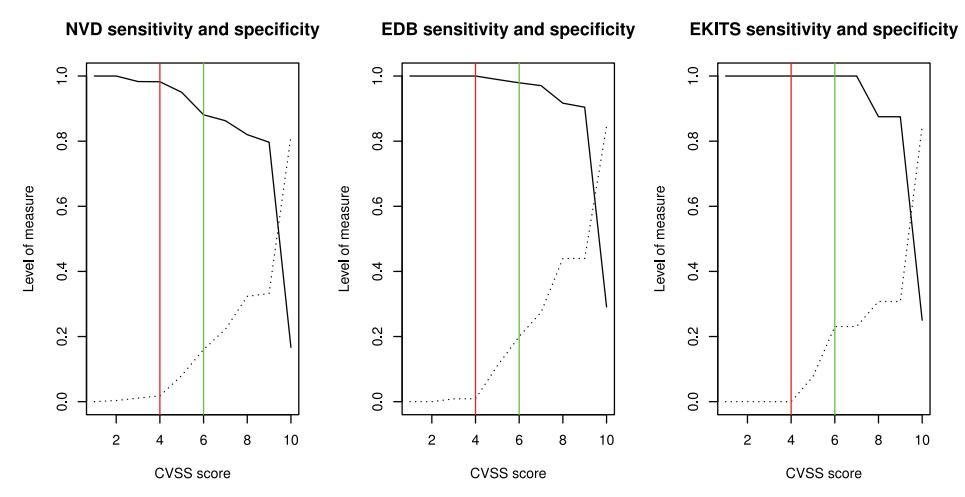
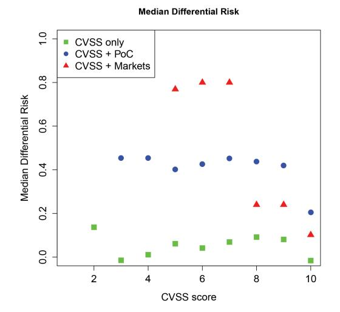

# **Comparing Vulnerability Severity and Exploits Using Case-Control Studies**

LUCA ALLODI and FABIO MASSACCI, University of Trento

(U.S.) Rule-based policies for mitigating software risk suggest using the CVSS score to measure the risk of an individual vulnerability and act accordingly. A key issue is whether the 'danger' score does actually match the risk of exploitation in the wild, and if and how such a score could be improved. To address this question, we propose using a case-control study methodology similar to the procedure used to link lung cancer and smoking in the 1950s. A case-control study allows the researcher to draw conclusions on the relation between some *risk factor* (e.g., smoking) and an effect (e.g., cancer) by looking backward at the *cases* (e.g., patients) and comparing them with *controls* (e.g., randomly selected patients with similar characteristics). The methodology allows us to quantify the *risk reduction* achievable by acting on the risk factor. We illustrate the methodology by using publicly available data on vulnerabilities, exploits, and exploits in the wild to (1) evaluate the performances of the current risk factor in the industry, the CVSS base score; (2) determine whether it can be improved by considering additional factors such the existence of a proof-of-concept exploit, or of an exploit in the black markets. Our analysis reveals that (a) fixing a vulnerability just because it was assigned a high CVSS score is equivalent to randomly picking vulnerabilities to fix; (b) the existence of proof-of-concept exploits is a significantly better risk factor; (c) fixing in response to exploit presence in black markets yields the largest risk reduction.

Categories and Subject Descriptors: D.2.9 [**Software Engineering**]: Management

General Terms: Security, Management, Measurement

Additional Key Words and Phrases: Software vulnerability, exploitation, CVSS, patching, compliance

### **ACM Reference Format:**

Luca Allodi and Fabio Massacci. 2013. Comparing vulnerability severity and exploits using case-control studies. ACM Trans. Info. Syst. Sec. 17, 1, Article 1 (August 2014), 20 pages. DOI: http://dx.doi.org/10.1145/2630069

# **1. INTRODUCTION**

Security configuration manager software such as Tripwire Enterprise, HP SCAP Scanner, and QualysGuard usually rely on vulnerability data from the National (U.S.) Vulnerability Database1 (NVD) for their assessments. Each vulnerability is reported alongside a 'technical assessment' given by the Common Vulnerability Scoring System2 (CVSS), which evaluates different technical aspects of the vulnerability [Mell et al. 2007]. The CVSS score is also often used as a metric for risk, despite it not

This work has received funding from the European Union's Seventh Framework Programme for research, technological development and demonstration under grant agreement no. 285223. This work is also supported by the Italian PRIN Project TENACE.

Author's addresses: L. Allodi (corresponding author) and F. Massacci, Department of Information Engineering and Computer Science (DISI), University of Trento, Italy; corresponding author's email: luca.allodi@unitn.it.

Permission to make digital or hard copies of part or all of this work for personal or classroom use is granted without fee provided that copies are not made or distributed for profit or commercial advantage and that copies show this notice on the first page or initial screen of a display along with the full citation. Copyrights for components of this work owned by others than ACM must be honored. Abstracting with credit is permitted. To copy otherwise, to republish, to post on servers, to redistribute to lists, or to use any component of this work in other works requires prior specific permission and/or a fee.

c 2014 ACM 1094-9224/2014/08-ART1 \$15.00

DOI: http://dx.doi.org/10.1145/2630069

1http://nvd.nist.gov.

2http://www.first.org/cvss.

1:2 L. Allodi and F. Massacci

being designed for this purpose. For example, the U.S. Federal government (with QTA0-08-HC-B-0003 reference notice) requires all IT products for the U.S. Government to manage and assess the security of IT configurations using the NIST-certified S-CAP protocol, which explicitly says [Quinn et al. 2010] the following.

"Organizations should use CVSS base scores to assist in prioritizing the remediation of known security-related software flaws based on the relative severity of the flaws."

Another notable example is PCI DSS, the standard for security of credit card data, that states a similar rule [PCI Council 2010].

"Risk rankings should be based on industry best practices. For example, criteria for ranking High risk vulnerabilities may include a CVSS base score of 4.0 or above [..]."

As a result, the CVSS base score is commonly used in the industry to identify 'high risk' vulnerabilities that must be fixed with the highest priority. However, as of the date of publication, it is not clear whether this interpretation of the CVSS score matches with attacks in the wild. Acknowledging the problem, risk factors other than the sole CVSS are considered by different security management tools in the industry (e.g., Rapid7, Qualy, Symantec, and Tripwire). However, a direct comparison of different policies is impossible without a sound scientific methodology to evaluate policy effectiveness: at present, it is unclear what policy yields the highest benefit.

A major obstacle for this type of analysis is the nature of the data at hand. Vulnerability information is rife with problems, and exploitation data is often hard to find. A common assumption made in academy and industry alike is that proof-of-concept exploit data can be used to measure the state of security of a software, or the performances of a vendor in their race against hackers. While proof-of-concept exploit data is much easier to collect than data on actual attacks, the former says little about the usage of the exploit in the wild: on the contrary, a proof-of-concept exploit is merely a byproduct of the so-called 'responsible vulnerability disclosure' process, whereby a security researcher that finds a vulnerability discloses it to the vendor alongside a proof-of-concept exploitation code that proves the existence of the vulnerability itself [Miller 2007]. Software and vulnerability risk measures should however be based on factual evidence of exploitation rather than on security researchers' participation in bug bounty programs. Similar problems can be encountered for vulnerability data as well. For example, it is known that vulnerability timing data in public databases such as the National Vulnerability Database may "contain errors of unknown size" [Schryen 2009]. Exploitation and vulnerability data is however often used as-is without considering its inherent limitations and shortcomings (see [Frei et al. 2006; Shahzad et al. 2012; Houmb et al. 2010] as some examples).

To address these problems, we proceed as follows.

- (1) We present our datasets of vulnerabilities, proof-of-concept exploits, exploits traded in the black markets, and exploits detected in the wild.
- (2) We introduce the *case-control study* as a fully-replicable methodology for soundly analyzing vulnerability and exploit data.
- (3) We check the suitability of the current use of the CVSS score as a risk metric by comparing it against exploits recorded in the wild and by performing a breakdown analysis of its characteristics and values.
- (4) We use the case-control study methodology to show and measure how the current CVSS practice can be improved by considering additional risk factors. To do this, we provide a quantitative measure of the reduction in risk of exploitation yield by the resulting policies. The risk factors considered in our study are the following.

- (a) The CVSS base score as reported by the National Vulnerability Database
- (b) Existence of a public proof-of-concept exploit
- (c) Existence of an exploit traded in the cybercrime black markets

An important facet of our methodology is its reproducibility and extensibility to many practical scenarios. For example, any other risk factor (e.g., software popularity, CVSS subscores, or cost of patching) may be considered when replicating our study. To favor reproducibility and clarity, in this article, we provide an exhaustive description of the analytical procedure and the rationale behind the specific decisions needed to operationalize the methodology; furthermore, we make our datasets available for replication and robustness checks.

The remainder of this article is organized as follows: we first introduce our four datasets (Section 2), illustrate the problem with the current CVSS-based best practice (Section 2.1), and provide a breakdown of the issue (Section 3). In the core of the article, we propose the case-control methodology and implement it to assess the performances of the CVSS score and other risk factors (Section 4). We then discuss our results (Section 5) and this study's threats to validity (Section 6). We finally review related work (Section 7) and conclude (Section 8).

#### 2. DATASETS

Our analysis is based on four datasets reporting data on vulnerabilities and CVSS scores, proof-of-concept exploits, exploits traded in the black markets, and exploits in the wild. For the interested reader, Allodi and Massacci [2012] gives a thorough description of the datasets along with details on the collection methodology.

- —NVD (National Vulnerability Database). The 'universe' of vulnerabilities. NVD is the reference database for disclosed vulnerabilities. It is held by NIST and has been widely used and analyzed in previous vulnerability studies [Massacci et al. 2011; Scarfone and Mell 2009]. Our copy of the NVD dataset contains data on 49,599 vulnerabilities reported until June 2012.
- —*EDB* (*Exploit-db*3). Proof-of-concept exploits. EDB includes information on proof-of-concept exploits and references the RELATIVE CVE. Our EDB copy contains data on 8,122 proof-of-concept exploits and affected CVEs.
- —*EKITS*. Black-marketed exploits. EKITS is our dataset of vulnerabilities bundled in *exploit kits*, malicious websites that the attacker deploys on some public webserver he/she controls. An exploit kit's purpose is to attack and infect systems that connect to them; for further details, refer to Kotov and Massacci [2013] and Grier et al. [2012]. EKITS is based on Contagio's Exploit Pack Table4 and, at the time of writing, substantially expands it in terms of reported exploit kits. EKITS reports 103 unique CVEs bundled in 90+ exploit kits. Examples of reported exploit kits are *Elenonore*, *Blackhole*, *Crimepack*, *Fragus*, *Sakura*, *Icepack* [Symantec 2011].
- —SYM. Vulnerabilities exploited in the wild. SYM reports vulnerabilities that have been exploited in the wild as documented in Symantec's AttackSignature5 and ThreatExplorer6 public datasets. SYM contains 1,277 CVEs identified in viruses (local threats) and remote attacks (network threats) by Symantec's commercial products. This has of course some limitation, as direct attacks by individual motivated hackers against specific companies are not considered here. The SYM dataset can be seen as an 'index' of the WINE dataset [Dumitras and Shou 2011], where actual

3http://www.exploit-db.com/.

4http://contagiodump.blogspot.it/2010/06/overview-of-exploit-packs-update.html.

&lt;sup>5http://www.symantec.com/security\_response/attacksignatures/.

&lt;sup>6http://www.symantec.com/security\_response/threatexplorer/.

1:4 L. Allodi and F. Massacci

| DB    | Content                    | Collection method                               | #Entries |
|-------|----------------------------|-------------------------------------------------|----------|
| NVD   | CVEs                       | XML parsing                                     | 49,599   |
| EDB   | Publicly exploited CVEs    | Download and Web parsing to correlate with CVEs | 8,122    |
| SYM   | CVEs exploited in the wild | Web parsing to correlate with CVEs              | 1,277    |
| EKITS | CVEs in the black market   | Ad-hoc analysis + Contagio's Exploit table      | 103      |

Table I. Summary of our Datasets

Fig. 1. Distribution of CVSS scores per dataset.

volumes of attacks are reported. We do not use WINE here as we want to characterize a worst-case scenario where 'one exploit is too many' (i.e., all exploited vulnerabilities are treated the same regardless of the volume of their exploitation in the wild).

Table I summarizes the content of each dataset and their collection methodology. All the datasets used in this study are available from the authors on request.7

### 2.1. A Coarse-Grained Overview of the Datasets

The CVSS score is represented by a number in [0..10], where 0 is the lowest criticality level and 10 the maximum (for further reference see [Mell et al. 2007]). We report in Figure 1 the histogram distribution of the CVSS base scores. Three clusters of vulnerabilities are visually identifiable throughout our datasets.

- (1) HIGH score. CVSS > 9.
- (2) MEDIUM score.  $6 \le \overline{C}VSS < 9$ .
- (3) LOW score. CVSS < 6.

Figure 2 reports a Venn diagram of our datasets. Area size is proportional to the number of vulnerabilities that belong to it; the color is an indication of the CVSS score. Red, orange, and cyan areas represent HIGH, MEDIUM, and LOW score vulnerabilities, respectively. This map gives a first intuition of the problem with using the CVSS base score as a 'risk metric for exploitation': the red vulnerabilities located outside of SYM are 'CVSS false positives' (i.e., HIGH risk vulnerabilities that are not exploited); the cyan vulnerabilities in SYM are instead 'CVSS false negatives' (i.e., LOW and MEDIUM risk

&lt;sup>7http://securitylab.disi.unitn.it/doku.php?id=datasets.

Fig. 2. Relative map of vulnerabilities per dataset.

Table II. Conditional Probability of a Vulnerability Being a Threat

|       | vuln in SYM | vuln not in SYM |
|-------|-------------|-----------------|
| EKITS | 75.73%      | 24.27%          |
| EDB   | 4.81%       | 95.19%          |
| NVD   | 2.57%       | 97.43%          |

*Note*: Conditional probability that a vulnerability v is listed by Symantec as a threat, given that it is contained in a dataset, that is, *P*(v ∈ S*Y M* | v ∈ *dataset*). This computation accounts for the whole population of vulnerabilities and can not be interpreted as a final conclusion on likelihood of exploits (Section 4).

vulnerabilities that are exploited). A relevant portion of CVSS-marked vulnerabilities seem therefore to represent either false positive or false negatives.

Table II reports the likelihood of a vulnerability being in SYM if it is contained in one of our datasets. Prima facie analysis would suggest that there is approximately a 75% probability that a vulnerability in the black markets is exploited in the wild. For NVD and EDB, the rate of exploited vulnerabilities is less than 5%. However, these conclusions can be grossly incorrect. For example, SYM might report only vulnerabilities of interest to Symantec's costumers. Suppose most costumers use Windows; then all Linux vulnerabilities listed in EDB would not be mentioned in SYM, not because they are not exploited in the wild, but simply because they are not interesting for Symantec to report. Another possible example can be that Symantec mainly detects 'remote code execution' vulnerabilities, while NVD might report lots of vulnerabilities exploitable through, say, social engineering. We might therefore have a selection bias problem. In order to offer more scientifically sound conclusions, we first provide a better understanding of the internals of the CVSS base score (in the following section), and then introduce the case-control methodology to soundly compare different populations of vulnerabilities (Section 4).

1:6 L. Allodi and F. Massacci

| Impact subscore |           |              | Exploitability subscore                              |        |          |  |
|-----------------|-----------|--------------|------------------------------------------------------|--------|----------|--|
| Confidentiality | Integrity | Availability | Access Vector Access complexity Authentication |        |          |  |
| None            | None      | None         | Local                                                | High   | Multiple |  |
| Partial         | Partial   | Partial      | Adjacent Net.                                        | Medium | Single   |  |
| Complete        | Complete  | Complete     | Network                                              | Low    | None     |  |

Table III. Possible Values for the Exploitability and Impact Subscores

### **3. CVSS SCORE BREAKDOWN**

The Common Vulnerability Scoring System identifies three scores: the *base score*, the *temporal score*, and the *environmental score*. The base score identifies "fundamental characteristics of a vulnerability that are constant over time and user environments" [Mell et al. 2007]; the temporal score considers assessments like existence of a patch for the vulnerability, or the presence of an exploit in the wild; the environmental score considers further assessments tailored around a specific system implementation. However, of the three, only the base score is identified, by standards and best practices alike, as the metric to rely upon for vulnerability management [Quinn et al. 2010; PCI Council 2010]. The base score is also the only one commonly reported in vulnerability bulletins and public datasets. We therefore only consider the base score in our analysis.

The CVSS base score is computed as a product of two submetrics: the *Impact* submetric and the *Exploitability* submetric. Therefore, the CVSS base score *CVSSb* is of the following form.

$$CVSS_b = Impact \times Exploitability, \tag{1}$$

which closely recalls the traditional definition of risk as *impact*×*likelihood*. The Impact submetric is an assessment of the impact the exploitation of the vulnerability has on the system. The Exploitability subscore is defined by factors such as the difficulty of the exploitation and reachability of the vulnerability (e.g., from the network or local access only). For this reason, it is sometimes interpreted as a measure of 'likelihood of exploit' (e.g., [Bozorgi et al. 2010]).

## **3.1. The Impact and Exploitability Subscores**

The Impact and Exploitability subscores are calculated on the basis of additional variables, reported in Table III. The Impact submetric is identified by three separate assessments on Confidentiality, Integrity, and Availability. In this manuscript, this triplet is referred to as the *CIA* impact. Each CIA variable can assume three values: Complete (C), Partial (P), None (N). The Exploitability submetric is as well identified by three variables.

- —*Access vector* identifies whether the attacker can exploit the vulnerability from the Network, (N); from an Adjacent Network (A); Locally (L).
- —*Access complexity* provides information on the difficulty the attacker may encounter in recreating the conditions for the exploitation of the vulnerability. This assessment can assume three values: High (H), Medium (M), or Low (L).
- —*Authentication* represents the number of steps of authentication the attacker has to pass in order to trigger the vulnerability. The levels of the assessment can be None (N), Single (S), Multiple (M).

Table III reports a summary of the CVSS base score's variables and their respective possible values.

Fig. 3. Histogram and boxplot of CVSS Impact subscores per dataset.

### **3.2. Breakdown of the Impact Subscore**

Figure 3 depicts a histogram distribution of the Impact subscore. The distribution of the Impact score varies sensibly depending on the dataset. For example, in EDB, scores between six and seven characterize the great majority of vulnerabilities, while in SYM and EKITS, most vulnerabilities have Impact scores greater than nine. This is an effect of the different nature of each dataset: for example, a low Impact vulnerability may be of too little value to be worth the bounty by a security researcher, and therefore these may be under-represented in EDB [Miller 2007]; medium-score vulnerabilities may instead represent the best trade-off in terms of market value and effort required to discover or exploit. In the case of SYM and EKITS vulnerabilities, it is unsurprising that these yield a higher Impact than the average vulnerability or proof-of-concept exploit: these datasets feature vulnerabilities actually chosen by attackers to deliver attacks, or to be bundled in tools designed to remotely execute malware. The different distribution of the CVSS Impact subscore among the datasets is apparent in the boxplot reported in Figure 3. The distribution of Impact scores for NVD and EDB is clearly different from (and lower than) that of EKITS and SYM.

To explain the gaps in the histogram in Figure 3, we decompose the distribution of Impact subscores for our datasets. In Table IV, we first report the incidence of the existing CIA values in NVD. It is immediate to see that only few values are actually relevant. For example, there is only one vulnerability whose CIA impact is 'PCP' (i.e., partial impact on confidentiality, complete on integrity, and partial on availability). Availability almost always assumes the same value of Integrity, apart from the case where there is no impact on Confidentiality, and looks therefore of limited importance for a descriptive discussion.

For the sake of readability, we exclude Availability from the analysis and proceed by looking at the two remaining Impact variables in the four datasets. This inspection is reported in Table V. Even with this aggregation in place, many possible values of the CIA assessment remain unused. 'PP' vulnerabilities characterize the majority of disclosed vulnerabilities (NVD) and vulnerabilities with a proof-of-concept exploit (EDB). Differently, in SYM and EKITS, most vulnerabilities score 'CC'. This shift alone can be considered responsible for the different distribution of scores depicted in Figure 3 1:8 L. Allodi and F. Massacci

Table IV. Incidence of Values of CIA Triad within NVD

| Confidentiality | Integrity | Availability | Absolute no. | Incidence |
|-----------------|-----------|--------------|--------------|-----------|
| C               | C         | C            | 9,972        | 20%       |
| C               | C         | P            | 0            | -         |
| C               | C         | N            | 43           | <1%       |
| C               | P         | C            | 2            | <1%       |
| C               | P         | P            | 13           | <1%       |
| C               | P         | N            | 3            | <1%       |
| C               | N         | C            | 15           | <1%       |
| C               | N         | P            | 2            | <1%       |
| C               | N         | N            | 417          | 1%        |
| P               | C         | C            | 5            | <1%       |
| P               | C         | P            | 1            | <1%       |
| P               | C         | N            | 0            | -         |
| P               | P         | C            | 22           | -         |
| P               | P         | P            | 17,550       | 35%       |
| P               | P         | N            | 1,196        | 2%        |
| P               | N         | C            | 9            | <1%       |
| P               | N         | P            | 110          | <1%       |
| P               | N         | N            | 5,147        | 10%       |
| N               | C         | C            | 64           | <1%       |
| N               | C         | P            | 1            | <1%       |
| N               | C         | N            | 43           | <1%       |
| N               | P         | C            | 17           | <1%       |
| N               | P         | P            | 465          | 1%        |
| N               | P         | N            | 7,714        | 16%       |
| N               | N         | C            | 1,769        | 4%        |
| N               | N         | P            | 5,003        | 10%       |
| N               | N         | N            | 16           | <1%       |

Table V. Combinations of Confidentiality and Integrity Values per Dataset

| Confidentiality | Integrity | SYM    | EKITS  | EDB    | NVD    |
|-----------------|-----------|--------|--------|--------|--------|
| C               | C         | 51.61% | 74.76% | 18.11% | 20.20% |
| C               | P         | 0.00%  | 0.00%  | 0.02%  | 0.04%  |
| C               | N         | 0.31%  | 0.97%  | 0.71%  | 0.87%  |
| P               | C         | 0.00%  | 0.00%  | 0.01%  | 0.01%  |
| P               | P         | 27.80% | 16.50% | 63.52% | 37.83% |
| P               | N         | 7.83%  | 0.97%  | 5.61%  | 10.62% |
| N               | C         | 0.23%  | 0.00%  | 0.18%  | 0.22%  |
| N               | P         | 4.39%  | 2.91%  | 5.07%  | 16.52% |
| N               | N         | 7.83%  | 3.88%  | 6.75%  | 13.69% |

and underlines the difference in the type of impact for the vulnerabilities captured by the different datasets.

### **3.3. Breakdown of the Exploitability Subscore**

Figure 4 shows the distribution of the Exploitability subscore for each dataset. Almost all vulnerabilities score between eight and ten, and from the boxplot, it is evident that the distribution of exploitability subscores is indistinguishable among the datasets. In other words, Exploitability can not be used as a proxy for likelihood of exploitation in

Fig. 4. Distribution of CVSS Exploitability subscores.

|                | metric    | value    | SYM    | EKITS  | EDB    | NVD    |
|----------------|-----------|----------|--------|--------|--------|--------|
|                |           | local    | 2.98%  | 0%     | 4.57%  | 13.07% |
|                | Acc. Vec. | adj.     | 0.23%  | 0%     | 0.12%  | 0.35%  |
| ity            |           | net      | 96.79% | 100%   | 95.31% | 86.58% |
| liq            |           | high     | 4.23%  | 4.85%  | 3.37%  | 4.70%  |
| )ita           | Acc. Com. | medium   | 38.53% | 63.11% | 25.49% | 30.17% |
| Exploitability |           | low      | 57.24% | 32.04% | 71.14% | 65.13% |
| É              |           | multiple | 0%     | 0%     | 0.02%  | 0.05%  |
|                | Auth.     | single   | 3.92%  | 0.97%  | 3.71%  | 5.30%  |
|                |           | none     | 96.08% | 99.03% | 96.27% | 94.65% |

Table VI. Exploitability Subfactors for each Dataset

the wild. A similar result (but only for proof-of-concept exploits) has also been reported in Bozorgi et al. [2010].

In Table VI, we decompose the Exploitability subscores and find that most vulnerabilities in NVD do not require any authentication (Authentication = (N)one, 95%), and are accessible from remote (Access Vector = (N)etwork, 87%). This observation is even more extreme in datasets other than NVD.

For this reason, the CVSS Exploitability subscore resembles more a constant than a variable and has therefore little or no influence on the variance of the final CVSS score. This may in turn affect the suitability of the CVSS as a risk metric, that would lack characterization of 'exploitation likelihood'.

#### 4. RANDOMIZED CASE-CONTROL STUDY

Randomized Block Design Experiments (or Controlled Experiments) are common frameworks used to measure the effectiveness of a treatment over a sample of subjects. These designs aim at measuring a certain variable of interest by isolating factors that may influence the outcome of the experiment, and leave to randomization other factors of not primary importance. However, in some cases, practical and ethical concerns may make an experiment impossible to perform; for example, one cannot ask subjects to start smoking in order to see whether they die of cancer. Similarly, we can not ask subjects to stay vulnerable to see if they get their computers infected and their bank accounts emptied.

1:10 L. Allodi and F. Massacci

When an experiment is not applicable, an alternative solution is to perform a retrospective analysis in which the *cases* (people with a known illness) are compared with a random population of *controls* clustered in 'blocks' (randomly selected patients with the same characteristics). These retrospective analyses are called *randomized casecontrol studies* and are in many respects analogous to their experimental counterpart. A famous application of this methodology is the 1950 study by Doll and Hill [1950], where the authors showed the correlation between smoking habits and the presence or absence of cancer of the lungs by performing a case-control study with data on hospitalization. We revisit this methodology to assess whether a vulnerability risk factor (like the CVSS score) can be a good predictor for vulnerability exploitation, and whether it can be improved by additional information.

We start by giving the reader some terminology.

- —*Cases.* The cases of a control study are the subjects that present the observed effect. For example, in the medical domain, the cases could be the patients whose status has been ascertained to be 'sick'. In a computer security scenario, a case could be a vulnerability that has been exploited in the wild. For us a case is therefore a vulnerability in SYM.
- —*Explanatory variable or risk factor.* A risk factor is an effect that can explain the presence (or increase in likelihood) of the illness (or attack). Considered risk factors for cancer may be smoking habits or pollution. For vulnerability exploitation, we consider as risk factors the CVSS level; the existence of a proof-of-concept exploit (*vuln* ∈ EDB); the presence of an exploit in the black markets (*vuln* ∈ EKITS).
- —*Confounding variables* are other variables that, combined with a risk factor, may be an alternative explanation for the effect, or correlate with its observation. For example, patient age or sex may be confounding factors for some types of cancer. In our case, the existence of an exploit in SYM may depend on factors such as type of vulnerability impact, time of disclosure, and affected software (see the Linux vs. Windows example in Section 2).
- —*Control group.* A control group is a group of subjects chosen at random from a population with similar characteristics (e.g., age, social status, location) to the cases. In the original design of a case-control study, the control group was composed of healthy people only. However, with that application of the case-control study, we can only ascertain whether the risk factor of interest has a greater incidence for the cases than for the controls. We relax this condition and leave open the (random) chance that cases get included in the control group. This relaxation allows us to perform additional computations on our samples (namely, CVSS sensitivity, specificity, and risk reduction). This, however, introduces (random) noise in the generated data. To address this issue, we perform the analysis with bootstrapping.
- —*Bootstrapping* is a technique by which noise in the data is 'flattened' by re-sampling the data multiple times with replacement. This mitigates the effects, in the final analysis, of a random observation showing up in an iteration.

*Confounding Variables.* Deciding which confounding factors to include in a casecontrol study is usually left to the intuition and experience of the researcher [Doll and Hill 1950]. Because SYM is the 'critical point' of our study (as it reports our cases), we consulted with Symantec to decide which factors to consider as confounding. While this list can not be considered an exhaustive one, we believe that the identified variables capture the most important aspects of the inclusion of a vulnerability in SYM. More details on this process are discussed in Section 6. In the following, we discuss the confounding variables we choose and the enforcement of the respective controlling procedure.

—*Year.* Symantec's commitment in reporting exploited CVEs may change with time. After a detailed conversation with Symantec, it emerged that the inclusion of a CVE in an attack signature is an effort on Symantec's side aimed at enhancing the usefulness of their datasets. Specifically, Symantec recently opened a data-sharing program called WINE whose aim is to share attack data with security researchers [Dumitras and Shou 2011]. The data included in the WINE dataset spans from 2009 to the present date. Given the explicit sharing nature of their WINE program, we consider vulnerabilities disclosed after 2009 to be better represented in SYM. We therefore consider only those in our study.

*Enforcement.* Unfortunately, vulnerability time data in NVD is very noisy due to how the vulnerability disclosure mechanism works [Schryen 2009; Miller 2007]. For this reason, an exact match for the disclosure date of the sampled vulnerability *s*v*i* and the SYM vulnerability v*i* is undesirable. In our case, a coarse time data granularity is enough, as we only need to cover the years in which Symantec actively reported attacked CVEs. We therefore enforce this control by first selecting for sampling only vulnerabilities whose disclosure dates span from 2009 on, and then by performing an exact match in the year of disclosure between *s*v*i* and v*i*.

—*Impact Type.* Our analysis (Section 3.2) showed that some CIA types are more common in SYM than elsewhere (e.g., CIA='CCC'). An explanation for this may be that attackers contrasted by Symantec may prefer to attack vulnerabilities that allow them to execute arbitrary code rather than ones that enable them to get only a partial access on the file system. We therefore also control for the CVSS Confidentiality, Integrity, and Availability assessments.

*Enforcement.* The CVSS framework provides a precise assessments of the CIA impact. We therefore perform an exact match between the CIA values of the sampled vulnerability *s*v*i* and that of v*i* (in SYM).

In addition, we 'sanitize' the data by *Software.* Symantec is a security market leader and provides a variety of security solutions, but its largest market share is in the consumer market. In particular, the data in SYM is referenced to the malware and attack signatures included in commercial products that are often installed on consumer machines. These are typically Microsoft Windows machines running commodity software like Microsoft Office and internet plugins like Adobe Flash or Oracle Java8 [Dumitras and Efstathopoulos 2012]. Because of this selection problem, SYM may represent only a subset of all the software reported in NVD, EDB or EKITS.

*Enforcement.* Unfortunately, no standardized way to report vulnerability software names in NVD exists, and this makes it impossible to directly control this confounding variable. For example, CVE-2009-0559 (in SYM) is reported in NVD as a "Stack-based buffer overflow in Excel", but the main affected software reported is (Microsoft) Office. In contrast, CVE-2010-1248 (in SYM as well) is a "Buffer overflow in Microsoft Office Excel" and is reported as an Excel vulnerability. Thus, performing a perfect string match for the software variable would exclude from the selection relevant vulnerabilities affecting the same software but reporting different software names.

The problem with software names extends beyond this. Consider, for example, a vulnerability in Webkit, an HTML engine used in many browsers (e.g., Safari, Chrome, and Opera). Because Webkit is a component of other software, a vulnerability in Apple Safari might also be a Webkit vulnerability in Google Chrome.

8Unix software is also included in SYM. However we do not consider this sample to be representative of Unix exploited vulnerabilities.

1:12 L. Allodi and F. Massacci

Table VII. Output Format of Our Experiment

| Risk Factor level | v ∈ SYM | v ∈ SY M |
|-------------------|---------|----------|
| Above Threshold   | a       | b        |
| Below Threshold   | c       | d        |

Table VIII. Sample Thresholds

| CVSS ≥ 6           |
|--------------------|
| CVSS ≥ 9           |
| CVSS ≥ 9&v ∈ EDB   |
| CVSS ≥ 9&v ∈ EKITS |

For these reasons, to match the 'software' string when selecting *s*v*i* would introduce unknown error in the data. We can therefore only perform a best-effort approach by checking that the software affected by *s*v*i* is included in the list of software for ∀v*i* ∈ S*YM*. In this work, *software* is therefore used as a sanitation variable rather than a proper control. A possible refinement of this to be considered for future work is to cluster software names in more general categories (e.g. Browser or Plugin).

### **4.1. Experiment Run**

We divide our experiment in two parts: sampling and execution. In the former, we generate the samples from NVD, EDB, and EKITS. In the latter, we compute the relevant statistics on the samples. What follows is a textual description of these processes.

*Sampling.* To create the samples, we first select a vulnerability v*i* from SYM and set the controls according to the values of the confounding variables for v*i*. Then, for each of NVD, EDB, and EKITS, we randomly select, with replacement, a sample vulnerability *s*v*i* that satisfies the conditions defined by v*i*. We then include *s*v*i* in the list of selected vulnerabilities for that dataset sample. We repeat this procedure for all vulnerabilities in SYM. The sampling has been performed with the statistical tool R-CRAN [R Core Team 2012]. Our R script to replicate the analysis is available on our Lab's webpage.9

*Execution.* Once we collected our samples, we compute the frequency with which each risk factor identifies a vulnerability in SYM. Our output is represented in Table VII. Each risk factor is defined by a CVSS threshold level *t* in combination with the existence of a proof-of-concept exploit (v ∈ EDB) or of a black-marketed exploit (v ∈ EKITS). Examples of thresholds for different risk factors are reported in Table VIII. We run our experiment for all CVSS thresholds *ti* with *i* ∈ [1..10]. For each risk factor, we evaluate the number of vulnerabilities in the sample that fall above and below the CVSS threshold, and that are included (or not included) in SYM: the obtained table reports the count of vulnerabilities that each risk factor correctly and incorrectly identifies as 'at high risk of exploit' (∈ SYM) or 'at low risk of exploit' (∈ SYM).

The computed values depend on the random sampling process. In an extreme case, we may therefore end up, just by chance, with a sample containing only vulnerabilities in SYM and below the current threshold (i.e., [*a* = 0; *b* = 0; *c* = 1277; *d* = 0]). Such an effect would be likely due to chance alone. To mitigate this, we repeat, for every risk factor, the whole experiment run 400 times and keep the median of the results. We choose this limit because we observed that around 300 repetitions the distribution of results is already markedly Gaussian. Any statistic reported in this article is to be intended as the median of the generated distribution of values.

### **4.2. Parameters of the Analysis**

*Sensitivity and Specificity.* In the medical domain, the sensitivity of a test is the conditional probability of the test giving positive results when the illness is present. The specificity of the test is the conditional probability of the test giving negative result when there is no illness. Sensitivity and specificity are also known as True Positive Rate (TPR) and True Negatives Rate (TNR), respectively. High values for both TNR and TPR

9https://securitylab.disi.unitn.it/doku.php?id=software.

Fig. 5. Sensitivity (solid line) and specificity (dotted line) levels for different CVSS thresholds. The red line identifies the threshold for PCI DSS compliance (*c*v*ss* = 4). The green line identifies the threshold between LOW and MEDIUM+HIGH vulnerabilities (*c*v*ss* = 6, see histogram in Figure 1).

identify a good test.10 In our context, we want to assess to what degree a positive result from our current test (the CVSS score) matches the illness (the vulnerability being actually exploited in the wild and tracked in SYM). The sensitivity and specificity measures are computed as

$$Sensitivity = P(v's \text{ Risk factor above } t | v \in SYM) = a/(a+c), \tag{2}$$

Specificity = 
$$P(v$$
's Risk factor below  $t | v \notin SYM) = d/(b+d)$ , (3)

where *t* is the threshold. Sensitivity and specificity outline the performance of the test in identifying exploits, but say little about its effectiveness in terms of diminished risk.

*Risk Reduction.* To understand the effectiveness of a policy, we adopt an approach similar to that used in Evans [1986] to estimate the effectiveness of seat belts in preventing fatalities. In Evan's case, the effectiveness was given by the difference in the probability of having a fatal car crash when wearing a seatbelt and when not wearing it (*Pr*(*Death* & *Seat belt on*) − *Pr*(*Death* & *not Seat belt on*)).

In our case, we measure the ability of a risk factor to predict the actual exploit in the wild. Formally, the risk reduction is calculated as

$$RR = P(v \in SYM | v$$
's Risk factor above  $t) - P(v \in SYM | v$ 's Risk factor below  $t$ ); (4)

therefore, *RR* = *a*/(*a* + *b*) − *c*/(*c* + *d*). A high risk reduction identifies risk factors that clearly discern between high-risk and low-risk vulnerabilities, and are therefore good *decision variables* to act upon: the most effective strategy is identified by the risk factor with the highest risk reduction.

### **4.3. Data Analysis**

*Sensitivity and Specificity.* Figure 5 reports the sensitivity and specificity levels respective to different CVSS thresholds. The solid line and the dotted line report the Sensitivity and the Specificity, respectively. The vertical red line marks the CVSS

10Some may prefer the False Positive Rate (FPR) to the TNR. Note that TNR=1-FPR (as in our case, *d*/(*b*+ *d*) = 1 − *b*/(*b*+ *d*)). We choose to report the TNR here because (1) it has the same direction of the TPR (higher is better); (2) it facilitates the identification of the threshold with the best trade-off by intersecting TPR.

1:14 L. Allodi and F. Massacci

Fig. 6. Risk reduction (RR) entailed by different risk factors.

threshold fixed by the PCI DSS standard (*c*v*ss* = 4). The green vertical line marks the threshold that separates LOW CVSS vulnerabilities from MEDIUM+HIGH CVSS vulnerabilities (*c*v*ss* = 6). Unsurprisingly, low CVSS scores show a very low specificity, as most non-exploited vulnerabilities are above the threshold. With increasing CVSS thresholds, the specificity measure gets better without sensibly affecting sensitivity. The best trade-off obtainable with the sole CVSS score is achieved with a threshold of eight, where specificity grows over 30% and sensitivity sets at around 80%. To further increase the threshold causes the sensitivity measure to collapse. In EKITS, because most vulnerabilities in the black markets are exploited and their CVSS scores are high, the specificity measure can not significantly grow without collapsing sensitivity.

*Risk Reduction.* In Figure 6, we report our results for risk reduction (RR). The mere CVSS score (green squares), irrespectively of its threshold level, always defines a poor patching policy with very low risk reduction. The existence of a public proof-of-concept exploit is a good risk factor, yielding higher risk reduction levels (40%). The presence of an exploit in the black markets is the most effective risk factor to consider.

Table IX reports the numerical Risk Reduction for a sample of thresholds. The full list of results is available in the online Appendix, Table X. A CVSS score of six entails a Risk Reduction of 4%; the performance is slightly better, but still unsatisfactory, if the threshold is raised to nine. Overall, CVSS' Risk Reduction stays below 10% for most thresholds. Even by considering the 95% confidence interval, we can conclude that CVSS-only based policies may be unsatisfactory from a risk-reduction point of view. Unsurprisingly, the test with the CVSS score alone results in very high p-values that, in this case, testify that CVSS as a risk factor does not mark high risk vulnerabilities any better than random selection would.

The existence of a proof-of-concept exploit (PoC) improves greatly the performance of the policy: with 'CVSS ≥ 6 + PoC' a RR of 42% can be achieved with very high statistical significance. This result is comparable to wearing a seat belt while driving, which entails a 43% reduction in risk [Evans 1986]. The highest risk reduction (80%) is obtained by considering the existence of an exploit in the black markets.

# **5. DISCUSSION**

We now summarize the main observations of our study. We focus on our results on CVSS characteristics and risk reduction.

| Risk factor threshold | RR  | 95% RR conf. int. | Significance |
|-----------------------|-----|-------------------|--------------|
| CVSS ≥6               | 4%  | −5% ; 12%         |              |
| CVSS ≥6 + PoC         | 42% | 38% ; 48%         | ****         |
| CVSS ≥6 + Bmar        | 80% | 80% ; 81%         | *            |
| CVSS ≥9               | 8%  | 1% - 15%          |              |
| CVSS ≥9 + PoC         | 42% | 36% - 49%         | ****         |
| CVSS ≥9 + Bmar        | 24% | 23% - 29%         |              |

Table IX. Risk Reduction for a Sample of Thresholds

*Note*: Risk Reduction of vulnerability exploitation depending on policy and information at hand (CVSS, PoC, Markets). Significance is reported by a Bonferroni-corrected Fisher Exact test (data is sparse) for three comparison (CVSS vs. CVSS+PoC vs. CVSS+BMar) per experiment [Bland and Altman 1995]. \*\*\*\*indicates the Bonferronicorrected equivalent of *p* < 1*E* − 4; \*\*\**p* < 0.001; \*\**p* < 0.01; \**p* < 0.05; nothing is reported for other values. Non-significant results indicate risk factors that perform indistinguishably at marking 'high risk' vulnerabilities than random selection. The full set of results is available in the online Appendix, Table X.

- (1) *The CVSS Impact submetric assumes only a few of the possible values: Confidentiality and Integrity losses usually go hand-in-hand*. The Availability CVSS assessment adds very little variability to the score, so of the three dimensions of the Impact subscore, only two are effectively relevant.
- (2) *The CVSS Exploitability metric reveals little to no variability.* The only variability in CVSS Exploitability among the great majority of vulnerabilities in NVD is given by the Access Complexity variable. Authentication and Access Vector show very little (Access Vector) or almost none (Authentication) variability. The effect of this is that the Exploitability submetric results flattened around very high values. Consequently, the Exploitability submetric is not suitable to characterize 'likelihood of exploit'.
- (3) *The CVSS base score alone is a poor risk factor from a statistical perspective.* Our results indicate that policies based on CVSS scores, such as the U.S. Government NIST SCAP protocol or the world-wide used PCI DSS may not be effective in providing significant risk reductions. Our results demonstrate that using the CVSS score as a selection criterion is statistically indistinguishable from randomly picking vulnerabilities to fix.

By considering risk factors other than the sole CVSS score, it may be possible to obtain more effective (and statistically significant) strategies.

- (1) The existence of a proof-of-concept exploit is an interesting risk factor to consider. PoC-based policies can entail risk reductions up to 45% of the original risk.
- (2) The black markets are an even more important source of risk. Our results show that the inclusion of this risk factor can increase risk reduction up to 80%.

Our methodology is useful for both academic and industry practitioners. A casecontrol study could be the methodology of choice when randomized trials and controlled experiments can not be performed. For example, one can not ask users to stay vulnerable and see if they get a virus or a network attack.11 On the negative side, it has less power to determine causality than controlled experiments have, because it looks backwards rather than directly controlling an experimental process. Yet, the methodology

11Using honeynets for experiments would not give a controlled experiment either as they are artificial and not actually used.

1:16 L. Allodi and F. Massacci

is appropriate for evaluating the strength of the correlation between an observation of interest and some hypothesized risk factor/explanatory variable one may consider. Many of the risk factors we consider (such as CVSS, proof-of-concept exploits, etc.) are the de-facto standards in industry, generating a multimillion business (a casual walk among the stands of BlackHat or RSA vendors would make it immediate). Evidence of the effectiveness of these metrics is however unclear, and case-control studies could be a sound scientific method for evaluating the relevance of any risk factor by using the very data that industry has available.

Additionally, security data has multiple limitations that should be carefully considered when performing related studies. An overview of these problematics is given in Christey and Martin [2013]. The most important advantage of the presented methodology is that it allows the researcher to control the different factors that may influence the outcome of the observation of interest. By design, any residual noise is evened-out by randomization in both the selection of the sample vulnerability and the bootstrapping procedure. Our results can be tailored around specific case studies by plugging into the methodology any risk factor, cost, time-to-deploy, or organizational effort that are relevant to the case in analysis.

### **6. THREATS TO VALIDITY**

*Construct Validity.* Data collection is a main issue in an empirical study. SYM and EKITS may be particularly critical to the soundness of our conclusions. Because of the unstructured nature of the original SYM dataset, building SYM required us to take some preliminary steps. The main issue is that the collected CVEs may not be relevant to the reported threat. To address this issue, we proceeded in two steps. First, we manually analyzed a random selection of about 50 entries and checked for the relevance of the CVE entries to the actual attack described in the signature. Second, we contacted Symantec in an informal communication to double-check our analysis results.

For EKITS, due to the shady nature of the tools, the list of exploited CVEs may not be representative of the population of CVEs in the black markets; moreover, criminals may falsely report what CVEs their tools attack (e.g. to increase sells). To mitigate the problem, we crossed-referenced EKITS entries with knowledge from the security research community and from our direct testing of tools traded in the the black markets [Allodi et al. 2013].

*External validity* is concerned with the applicability of our results to real-world scenarios. Symantec is a world-wide company and a leader in the security industry. We are therefore confident in considering their data as representative of real-world attack scenarios. Yet, our conclusion can not be generalized to targeted attacks. These attacks in the wild usually target a specific platform or system and are less likely to generate an entry in a general-purpose antivirus product.

An important point to mention is that our approach does not address the *changing behavior* of the attacker. For example, if all vulnerabilities from the black markets with a certain characteristic get patched, the attacker may simply modify his own attack strategy to make the defender's strategy ineffective. This is a common problem in any game-theoretical approach: unfortunately, the defender ought to move first, and therefore the attacker can always adapt to the defender's strategy (hence the definition of *equilibrium* as the state of the game in which neither the attacker nor the defender have a good reason to change their strategy). This problem is common to any security technology or security solution. We keep the exploration of this issue for further work.

# **7. RELATED WORK**

*Vulnerability Studies.* Several studies before ours have dealt with software vulnerabilities, software risk, and risk mitigation. Among all, Frei et al. [2006] were maybe the first to link the idea of life-cycle of a vulnerability to the patching process. Their dataset was a composition of NVD, OSVDB (the Open Source Vulnerabiltity DataBase), and FVDB (Frei's Vulnerability DataBase, obtained from the examination of security advisories for patches). The life-cycle of a vulnerability includes discovery time, exploitation time, and patching time. They showed that exploits are often quicker to arrive than patches are. They were the first to look, in particular, at the difference in time between time of first exploit and time of disclosure of the vulnerability. This work has recently been extended by Shahzad et al. [2012], who presented a comprehensive vulnerability study on NVD and OSVDB datasets (and Frei's) that included vendors and software in the analysis. Many descriptive trends in timings of vulnerability patching and exploitation are presented. However, their use of exploit data from OSVDB says little about the actual exploitation of a vulnerability [Christey and Martin 2013]. NVD timing data has also been reported to generate an unforeseeable amount of noise because of how the vulnerability disclosure process works [Schryen 2009; Christey and Martin 2013]. To avoid these problems, we use data on actual exploits in the wild and carefully account for its limitations. Instead of directly comparing different populations of vulnerabilities, we first provide a descriptive analysis of our data and then use our findings to run our case control study for vulnerabilities and exploits. For a thorough description of our datasets and a preliminary discussion on the data, see Allodi and Massacci [2012]; for additional details on Symantec's attack data, we point the reader to Dumitras and Shou [2011].

The idea of using vulnerability data to assess overall security is not new by itself. Attack surfaces [Manadhata and Wing 2011] and attack graphs [Wang et al. 2008] are seminal approaches to the problem: the former uses vulnerability data to compute an 'exposure metric' of the vulnerable systems to potential attacks; the latter aims at modeling consequent attacks on a system (or network of systems) the attacker might perpetrate to reach a (usually critical) component, such as a data server. These approaches however lack characterization of vulnerability risk. Our methodology integrates these approaches by providing a risk estimation for vulnerabilities; our results can be plugged in both attack graphs and attack surface estimations to obtain more precise assessments.

*CVSS.* An analysis of the distribution of CVSS scores and subscores has been presented by Scarfone and Mell [2009] and Gallon [2011]. However, while including CVSS subscore analysis, their results are limited to data from NVD and do not provide any insight on vulnerability exploitation. In this sense, Bozorgi et al. [2010] were probably the first to look for this correlation. They showed that the CVSS characterization of 'likelihood to exploit' did not match with data on proof-of-concept exploits in EDB. We extended their first observation with an in-depth analysis of subscores and of actual exploitation data.

*Vulnerability Models.* Other studies focused on the modeling of the vulnerability discovery processes, which arguably lays the groundwork for the 'vulnerability remediation' process, focus of our work. As noted by Shin and Williams [2013], vulnerability models can help "security engineers to prioritize security inspection and testing efforts" by, for example, identifying software components that are most susceptible to attacks [Gegick et al. 2009] or most likely to have unknown vulnerabilities hidden in the code [Neuhaus et al. 2007]. Our contribution differs, in general, from work on vulnerability models in that we do not aim at identifying 'vulnerable components' or previously 1:18 L. Allodi and F. Massacci

unknown vulnerabilities to point software engineers in the right direction. We instead propose a methodology for evaluating the risk of already known vulnerabilities to be exploited in the wild, that may therefore need immediate remediation or mitigation on the deployment side rather than on the development side.

Alhazmi and Malaiya [2008] and Ozment [2007] are both central in vulnerability discovery models research. Alhazmi and Malaiya fit six vulnerability models to vulnerability data of four major operative systems and show that Alhazmi's 'S shaped' model is the one that performs the best. Shin and Williams [2013] suggest that vulnerability models might be substituted with fault prediction models, and showed that performances in terms of recall and precision do not differ sensibly between the two. However, as previously underlined by Ozment [2007], vulnerability models may rely on unsound assumptions, such as the independence of vulnerability discoveries. Current vulnerability discovery models are indeed not general enough to represent trends for all software [Massacci and Nguyen 2012]. Moreover, vulnerability disclosure and discovery are complex processes [Ozment 2005; Clark et al. 2010], and can be influenced by {black/white}-hat community activities [Clark et al. 2010] and economics [Miller 2007].

*Markets for Vulnerabilities.* Our analysis of vulnerabilities traded in the black markets is also interesting because it supports the hypothesis that the exploit markets are significantly different (and more stable) than were the previous IRC markets run by cyber criminals [Herley and Florencio 2010]. Previous work from the authors of this manuscript also experimentally showed that the goods traded in the black markets are very reliable in delivering attacks and are resilient to aging [Allodi et al. 2013].

### **8. CONCLUSION**

In this article, we have proposed the case-control study methodology as an operative framework for security studies. In a case-control study, the researcher looks backward at some of the *cases* (e.g., vulnerabilities exploited in the wild) and compares them with *controls* (in our case, randomly selected vulnerabilities with similar characteristics, such as year of discovery or software type). The purpose is to identify whether some *risk factor* (in our scenario, a high CVSS score, or the existence of a proof of concept exploit) is a good explanation of the cases and therefore represents a decision variable upon which the system administrator must act.

To illustrate the methodology, we first analyzed how the CVSS score expresses the Impact and the Likelihood of an exploitation to happen. We showed that a proper characterization of 'likelihood of exploit' is not present in the CVSS score. We then evaluated its performances as a 'risk indicator' by performing a case-control study, in which we sample the data at hand to test how the CVSS score correlates with exploitation in the wild. Our results show that the CVSS base score never achieves high rates of identified true positives (sensitivity) simultaneously with a high rate of true negatives (specificity).

Finally, we showed how the methodology could be used to evaluate the effectiveness of multiple policies that consider different risk factors. Our results show that the sole CVSS score performs no better than randomly picking vulnerabilities to fix and may lead to negligible risk reductions. Markedly better results could instead be obtained when additional risk factors are considered; in this study, we considered the existence of a proof-of-concept exploit and of an exploit traded in the black markets.

In future work, we plan to integrate our methodology with additional evaluation factors, such as the cost of a strategy or the criticality of the assets. Another interesting venue would be to apply our methodology to other domains (e.g., critical infrastructures and targeted attacks).

### **ACKNOWLEDGMENTS**

We would like to thank Tudor Dumitras and Viet H. Nguyen for their many useful discussions. V. H. Nguyen actually wrote the second script used for cross-checking the SYM dataset. We also thank Julian Williams for his very useful feedback. Further thanks go to the anonymous TISSEC reviewers that greatly helped us in making this article a better one. No statement in this article should be interpreted as an endorsement by Symantec.

### **REFERENCES**

- O. H. Alhazmi and Y. K. Malaiya. 2008. Application of vulnerability discovery models to major operating systems. *IEEE Trans. Reliab.* 57, 1 (2008), 14–22. DOI: http://dx.doi.org/10.1109/TR.2008.916872
- Luca Allodi, Vadim Kotov, and Fabio Massacci. 2013. MalwareLab: Experimentation with Cybercrime attack tools. In *Proceedings of the 6th Workshop on Cybersecurity Security and Test*.
- Luca Allodi and Fabio Massacci. 2012. A preliminary analysis of vulnerability scores for attacks in wild. In *Proceedings of the ACM CCS Workshop on Building Analysis Datasets and Gathering Experience Returns for Security*.
- J. Martin Bland and Douglas G. Altman. 1995. Multiple significance tests: The Bonferroni method. *Brit. Med. J.* 310, 6973 (1995), 170.
- Mehran Bozorgi, Lawrence K. Saul, Stefan Savage, and Geoffrey M. Voelker. 2010. Beyond heuristics: Learning to classify vulnerabilities and predict exploits. In *Proceedings of the 16th ACM International Conference on Knowledge Discovery and Data Mining*. ACM, 105–114.
- Steve Christey and Brian Martin. 2013. Buying into the bias: Why vulnerability statistics suck. https://www. blackhat.com/us-13/archives.html#Martin.
- Sandy Clark, Stefan Frei, Matt Blaze, and Jonathan Smith. 2010. Familiarity breeds contempt: The honeymoon effect and the role of legacy code in zero-day vulnerabilities. In *Proceedings of the 26th Annual Computer Security Applications Conference*. 251–260. http://doi.acm.org/10.1145/1920261.1920299
- Richard Doll and A. Bradford Hill. 1950. Smoking and carcinoma of the lung. *Brit. Med. J.* 2, 4682 (1950), 739–748.
- Tudor Dumitras and Petros Efstathopoulos. 2012. Ask WINE: Are we safer today? Evaluating operating system security through big data analysis. In *Proceeding of the USENIX Workshop on Large-Scale Exploits and Emergent Threats (LEET'12)*. 11–11.
- Tudor Dumitras and Darren Shou. 2011. Toward a standard benchmark for computer security research: The worldwide intelligence network environment (WINE). In *Proceedings of the 1st Workshop on Building Analysis Datasets and Gathering Experience Returns for Security*. ACM, 89–96.
- L. Evans. 1986. The effectiveness of safety belts in preventing fatalities. *Accident Anal. Prevent.* 18, 3 (1986), 229–241.
- Stefan Frei, Martin May, Ulrich Fiedler, and Bernhard Plattner. 2006. Large-scale vulnerability analysis. In *Proceedings of the SIGCOMM Workshop on Large-Scale Attack Defense*. ACM, 131–138.
- L. Gallon. 2011. Vulnerability discrimination using CVSS framework. In *Proceedings of the 4th IFIP International Conference on New Technologies, Mobility and Security*. 1–6.
- Michael Gegick, Pete Rotella, and Laurie A. Williams. 2009. Predicting attack-prone components. In *Proceedings of the 2nd International Conference on Software Testing Verification and Validation (ICST'09)*. 181–190.
- Chris Grier, Lucas Ballard, Juan Caballero, Neha Chachra, Christian J. Dietrich, Kirill Levchenko, Panayiotis Mavrommatis, Damon McCoy, Antonio Nappa, Andreas Pitsillidis, Niels Provos, M. Zubair Rafique, Moheeb Abu Rajab, Christian Rossow, Kurt Thomas, Vern Paxson, Stefan Savage, and Geoffrey M. Voelker. 2012. Manufacturing compromise: The emergence of exploit-as-a-service. In *Proceedings of the 19th ACM Conference on Computer and Communications Security*. ACM, 821–832.
- C. Herley and D. Florencio. 2010. Nobody sells gold for the price of silver: Dishonesty, uncertainty and the underground economy. In *Economics of Information Security and Privacy*. Springer, 33–53.
- Siv Hilde Houmb, Virginia N. L. Franqueira, and Erlend A. Engum. 2010. Quantifying security risk level from CVSS estimates of frequency and impact. *J. Syst. Softw.* 83, 9 (2010), 1622–1634.
- Vadim Kotov and Fabio Massacci. 2013. Anatomy of exploit kits: Preliminary analysis of exploit kits as software artefacts. In *Proceedings of the Engineering Secure Software and Systems Conference (ESSoS'13)*. 181–196.
- Pratyusa K. Manadhata and Jeannette M. Wing. 2011. An attack surface metric. *IEEE Trans. Softw. Eng.* 37 (2011), 371–386. DOI: http://dx.doi.org/10.1109/TSE.2010.60

1:20 L. Allodi and F. Massacci

Fabio Massacci, Stephan Neuhaus, and Viet Nguyen. 2011. After-life vulnerabilities: A study on firefox evolution, its vulnerabilities, and fixes. In *Proceedings of the Engineering Secure Software and Systems Conference (ESSoS'11).* Lecture Notes in Computer Science, vol. 6542, Springer, 195–208.

- Fabio Massacci and Viet Nguyen. 2012. An independent validation of vulnerability discovery models. In *Proceedings of the 7th ACM Symposium on Information, Computer and Communications Security (ASI-ACCS'12)*.
- Peter Mell, Karen Scarfone, and Sasha Romanosky. 2007. *A Complete Guide to the Common Vulnerability Scoring System* Version 2.0. Technical Report. FIRST. http://www.first.org/cvss.
- C. Miller. 2007. The legitimate vulnerability market: Inside the secretive world of 0-day exploit sales. In *Proceedings of the 6th Workshop on Economics and Information Security*.
- Stephan Neuhaus, Thomas Zimmermann, Christian Holler, and Andreas Zeller. 2007. Predicting vulnerable software components. In *Proceedings of the 14th ACM Conference on Computer and Communications Security*. 529–540.
- A. Ozment. 2005. The likelihood of vulnerability rediscovery and the social utility of vulnerability hunting. In *Proceedings of the 4th Workshop on Economics and Information Security*.
- Andy Ozment. 2007. Improving vulnerability discovery models. In *Proceedings of the 3rd Workshop on Quality of Protection*. 6–11.
- PCI Council. 2010. *PCI DSS Requirements and Security Assessment Procedures, Version 2.0.* (2010). https://www.pcisecuritystandards.org/documents/pci dss v2.pdf.
- Stephen D. Quinn, Karen A. Scarfone, Matthew Barrett, and Christopher S. Johnson. 2010. *Guide to Adopting and Using the Security Content Automation Protocol (SCAP)* Version 1.0. Technical Report, National Institute of Standards and Technology, U.S. Department of Commerce, Special Publication 800-117.
- R Core Team. 2012. *R: A Language and Environment for Statistical Computing*. R Foundation for Statistical Computing, Vienna, Austria. http://www.R-project.org ISBN 3-900051-07-0.
- Karen Scarfone and Peter Mell. 2009. An analysis of CVSS version 2 vulnerability scoring. In *Proceedings of the 3rd International Symposium on Empirical Software Engineering and Measurement*. 516–525.
- Guido Schryen. 2009. A comprehensive and comparative analysis of the patching behavior of open source and closed source software vendors. In *Proceedings of the 5th International Conference on IT Security Incident Management and IT Forensics (IMF'09)*. IEEE Computer Society, Los Alamitos, CA, 153–168. DOI: http://dx.doi.org/10.1109/IMF.2009.15
- Muhammad Shahzad, Muhammad Zubair Shafiq, and Alex X. Liu. 2012. A large scale exploratory analysis of software vulnerability life cycles. In *Proceedings of the 34th International Conference on Software Engineering*. IEEE Press, 771–781.
- Yonghee Shin and Laurie Williams. 2013. Can traditional fault prediction models be used for vulnerability prediction? *Empirical Softw. Eng.* 18, 1 (2013), 25–59. DOI: http://dx.doi.org/10.1007/s10664-011-9190-8
- Symantec. 2011. *Analysis of Malicious Web Activity by Attack Toolkits* (online ed.). Symantec. http://www. symantec.com/threatreport/topic.jsp?id=threat activity trends&aid=analysis of malicious web activity. (Last accessed June 1012).
- Lingyu Wang, Tania Islam, Tao Long, Anoop Singhal, and Sushil Jajodia. 2008. An attack graph-based probabilistic security metric. In *Proceedings of the 22nd IFIP WG 11.3 Working Conference on Data and Applications Security*. Lecture Notes in Computer Science, vol. 5094. Springer, Berlin/Heidelberg, 283–296.

Received September 2013; revised February, May 2014; accepted May 2014