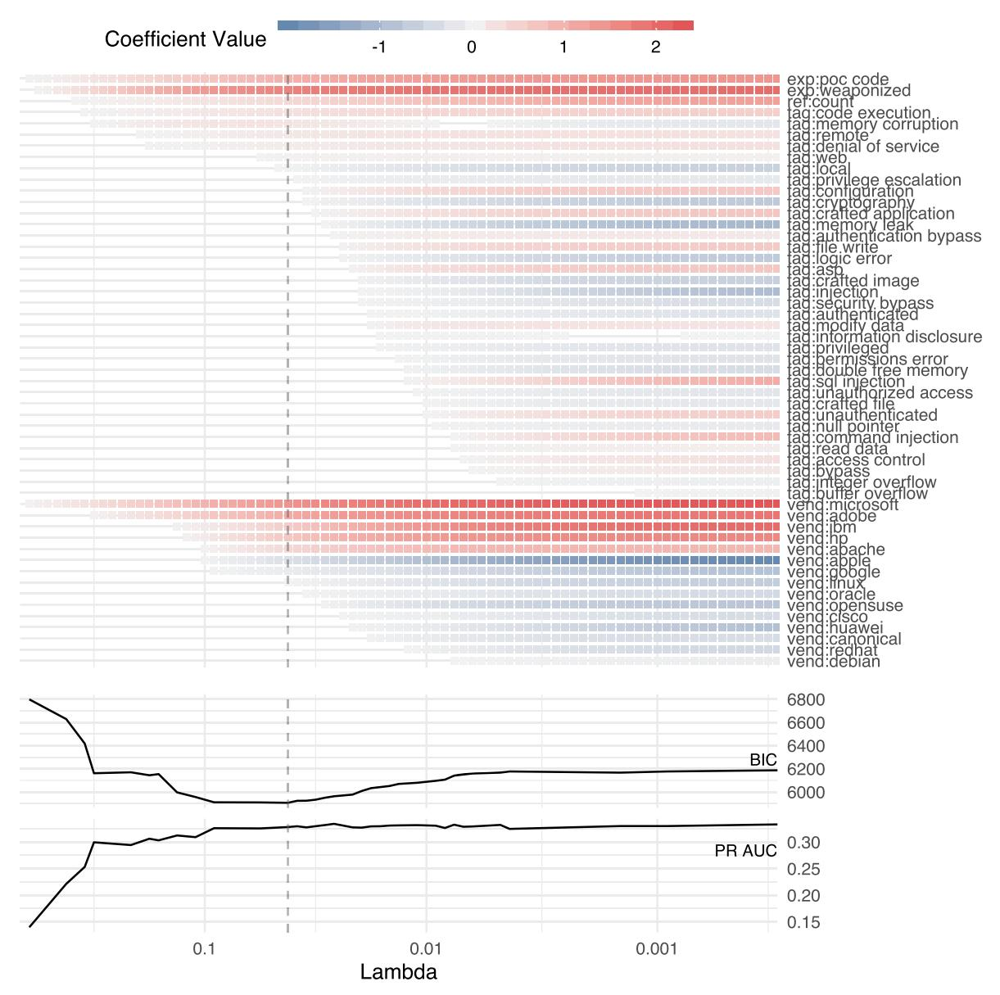
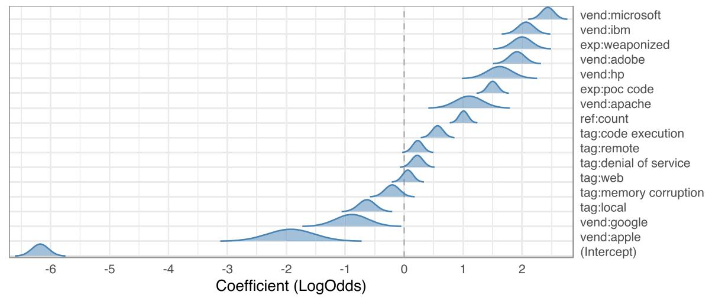
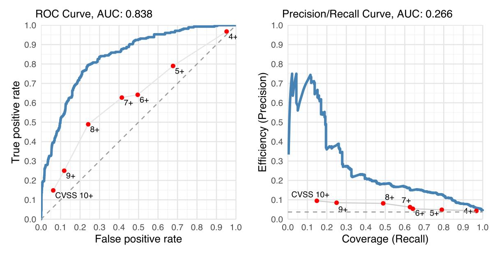
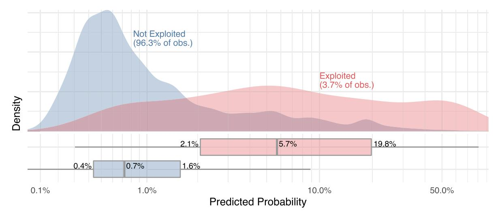

# **Exploit Prediction Scoring System (EPSS)**

JAY JACOBS, Cyentia Institute SASHA ROMANOSKY, RAND BENJAMIN EDWARDS, Cyentia Institute IDRIS ADJERID, Virginia Tech MICHAEL ROYTMAN, Kenna Security

Despite the large investments in information security technologies and research over the past decades, the information security industry is still immature when it comes to vulnerability management. In particular, the prioritization of remediation efforts within vulnerability management programs predominantly relies on a mixture of subjective expert opinion and severity scores. Compounding the need for prioritization is the increase in the number of vulnerabilities the average enterprise has to remediate. This article describes the first open, data-driven framework for assessing vulnerability threat, that is, the probability that a vulnerability will be exploited in the wild within the first 12 months after public disclosure. This scoring system has been designed to be simple enough to be implemented by practitioners without specialized tools or software yet provides accurate estimates (ROC AUC = 0.838) of exploitation. Moreover, the implementation is flexible enough that it can be updated as more, and better, data becomes available. We call this system the Exploit Prediction Scoring System (EPSS).

CCS Concepts: • **Computing methodologies** → **Machine learning**; • **Security and privacy** → **Vulnerability management**;

Additional Key Words and Phrases: Vulnerability management, vulnerability exploits, machine learning, EPSS

#### **ACM Reference format:**

Jay Jacobs, Sasha Romanosky, Benjamin Edwards, Idris Adjerid, and Michael Roytman. 2021. Exploit Prediction Scoring System (EPSS). *Digit. Threat.: Res. Pract.* 2, 3, Article 20 (June 2021), 17 pages. <https://doi.org/10.1145/3436242>

## 1 INTRODUCTION

Despite the large investments in information security over the past decades and data-rich security environments, organizations are still looking to improve their information security practices.1 In particular, the ability to assess the risk of a software vulnerability continues to rely predominantly on basic characteristics of the vulnerability, rather than on data-driven approaches rooted in empirical observations. The consequences of this are many.

2576-5337/2021/06-ART20

<https://doi.org/10.1145/3436242>

1Estimates suggest a worldwide cyber security market over \$170 billion by 2024. See [https://www.marketwatch.com/press-release/cyber](https://www.marketwatch.com/press-release/cyber-security-market-size-is-expected-to-surpass-us-170-billion-by-2024-2019-04-23)[security-market-size-is-expected-to-surpass-us-170-billion-by-2024-2019-04-23.](https://www.marketwatch.com/press-release/cyber-security-market-size-is-expected-to-surpass-us-170-billion-by-2024-2019-04-23)

Authors' addresses: J. Jacobs and B. Edwards, Cyentia Institute; emails: jay@cyentia.com, ben@cyentia.com; S. Romanosky, RAND; email: sasha.romanosky@gmail.com; I. Adjerid, Virginia Tech; email: iadjerid@vt.edu; M. Roytman, Kenna Security; email: michael@ kennasecurity.com.

Permission to make digital or hard copies of part or all of this work for personal or classroom use is granted without fee provided that copies are not made or distributed for profit or commercial advantage and that copies bear this notice and the full citation on the first page. Copyrights for third-party components of this work must be honored. For all other uses, contact the owner/author(s). © 2021 Copyright held by the owner/author(s).

First, it prevents firms and network defenders from efficiently prioritizing software patches, wastes countless hours and resources remediating vulnerabilities that could be delayed, or conversely delays remediation of critical vulnerabilities. In addition, policymakers and government agencies charged with overseeing critical infrastructure sectors are unable to effectively marshal resources or warn citizens about the potential changes in adversary threats from a newly discovered vulnerability.

One reason these challenges persist is that organizations continue to rely on heuristic approaches that stretch existing assessments on vulnerability risk beyond their intended use. In particular, a common approach to prioritizing vulnerability remediation is based on characterizing the severity of a given vulnerability, often by using the **Common Vulnerability Scoring System (CVSS)** (ITU-1521).2 CVSS computes the severity of a vulnerability as a function of its characteristics, and the confidentiality, integrity, and availability impact to an information system. The CVSS specification is clear that the Base score, the most commonly used component, is not meant to reflect the overall risk. Consequently, it does not measure threat or the probability that a vulnerability will be used to attack a network.3

Nevertheless, it has been mis-interpreted by sometimes leading organizations as a faithful measure of cyber security risk, and has become a de facto standard when prioritizing remediation efforts. For example, the **payment card industry data security standard (PCI-DSS)** requires that vulnerabilities greater than 4.0 must be remediated by organizations storing or processing credit cards (PCI, 2018), and in 2019 the **Department of Homeland Security (DHS)** released a binding operational directive requiring federal agencies to remediate high and critical vulnerabilities according to the CVSS standard.4 Extant research has been critical of heuristic strategies relying on CVSS severity, finding that they are sub-optimal for efficiently addressing security risk [\[7,](#page-15-0) [13\]](#page-16-0).

While CVSS is intended to address the severity component of vulnerabilities, a critical gap in the information security field is a proper measure and forecast of *threat*. We define threat in this work as the probability that a vulnerability will be exploited in the wild (i.e., targeted against an organization's network). Assessment of threat is critical to effectively prioritizing vulnerabilities because surprisingly few vulnerabilities are used in weaponized exploits and an even smaller proportion of vulnerabilities are ever targeted at an organization in the field. For example, recent research finds that as few as 1.4% of published vulnerabilities have been exploited in the wild [\[27\]](#page-16-0). Moreover, the performance of CVSS-based remediation efforts is particularly poor with regard to threat likelihood; [\[2\]](#page-15-0) find that remediation based on CVSS score is equivalent to choosing vulnerabilities at random when it comes to addressing vulnerabilities actually used by attackers.

Recent work is starting to address this gap and is building predictive models focused on assessing vulnerability threat [\[21,](#page-16-0) [27\]](#page-16-0). While these efforts are academically rigorous and extend the literature, they are not highly accessible to practitioners who would benefit most from them. First, prior work uses proprietary or hard-tocollect data to generate both prediction features and measures of vulnerabilities observed in the field. This limits adoption since security practitioners will not be able to replicate the prediction features. Second, prior works use black-box methods that do not generate interpretable results (e.g., how each input impacts the likelihood of a vulnerability being a threat). This is an important limitation because multiple stakeholders will necessarily need to understand and act on the output with confidence—IT operations, security, business stakeholders. A model therefore is more useful if it is interpretable and a score change is explainable and attributable to any one feature [\[32\]](#page-16-0). Third, prior work does not focus on the temporal dimension of the prediction problem and instead considers vulnerabilities as a set. This is another important limitation of prior work because the uncertainty of most relevance to practitioners is with regard to new vulnerabilities. Vulnerabilities that are several years old have

2See [https://www.itu.int/rec/dologin\\_pub.asp?lang=e&id=T-REC-X.1521-201603-I!!PDF-E&type=items.](https://www.itu.int/rec/dologin_pub.asp?lang=e&id=T-REC-X.1521-201603-I!!PDF-E&type=items)

3The Temporal metric group includes a metric for the presence of an exploit; it does not account for whether the vulnerability is actively being exploited.

4See Binding Operational Directive (BOD) 19-02, [https://cyber.dhs.gov/bod/19-02/.](https://cyber.dhs.gov/bod/19-02/)

less uncertainty about their potential to be used in the wild by an attacker (e.g., because the use of vulnerabilities in the wild typically occurs in the first 12 months after disclosure).

In this work, we address these limitations by creating a scoring system that is simple to implement, interpretable, parsimonious, and, finally, performant. First, we only use data that are publicly available and objective attributes of the vulnerability as inputs to the model. Second, we employ a modeling technique (logistic regression) that is transparent, intuitive, and easily implemented. As a result, we are able to formalize the regression coefficients into a scoring system that can be automated and implemented with simple and widely available tools (such as a spreadsheet). Third, we seek to minimize the predictive feature set, which will reduce the cost and effort of implementation since fewer inputs are required to create a prediction. Finally, we want to perform better than the de facto scoring standard used in practice today. Overall, we have developed the first open, data-driven threat scoring system for predicting the probability that a vulnerability will be exploited within the 12 months following public disclosure.

We believe this scoring system has the potential to make a fundamental contribution to the information security field not just as a way to help network defenders more efficiently allocate resources, but also for policymakers in communicating the actual threat of computer vulnerabilities.

The next section discusses related literature, followed by a description of the datasets used in this research. We then present our estimating model and results and formalize our probabilistic scoring system. We conclude with a discussion on limitations and conclusion.

## 2 RELATED LITERATURE

This article draws on research related to the incentives and trade-offs of information security investments, markets (criminal and otherwise), and processes related to understanding and improving how firms and organizations protect against cyber security threats. This stream of research evaluates how strategies for identifying new vulnerabilities and disseminating that information to relevant stakeholders impacts outcomes for organizations [\[4,](#page-15-0) [11,](#page-16-0) [23,](#page-16-0) [24\]](#page-16-0) and the efficiency of strategies that firms take to prioritize the vulnerabilities they address [\[2,](#page-15-0) [7,](#page-15-0) [13\]](#page-16-0). A consistent finding in this stream of research is that the status quo for how organizations address vulnerability remediation is often sub-optimal and has significant room for improvement.

A related but nascent stream of research is attempting to reduce some of the uncertainty around security risk and improve the efficiency of remediation efforts using data-enhanced approaches. Our work is most related to research by [\[21\]](#page-16-0), which developed a machine learning model for estimating the probability that a vulnerability will be used by an attacker in the wild. It also relates to a growing body of specialized research that uses different machine learning techniques to predict when a vulnerability will be exploited. While some papers use proof-ofconcept (published exploit) code as their outcome measure [\[3,](#page-15-0) [8,](#page-15-0) [17\]](#page-16-0), others use real-world exploit data [\[27,](#page-16-0) [35\]](#page-16-0), as is done in this article. However, both previous models use non-public input data as well as complex modeling techniques, which would be difficult to operationalize.

Another relevant stream of literature highlights the limitation of prediction efforts that are built in a vacuum and do not consider the operational contexts in which they are intended to be used [\[10,](#page-16-0) [12\]](#page-16-0). In some cases, there are compelling rationale to even decrease the accuracy of prediction efforts if they are more usable and trusted by end-users. For example, recent works propose methods that balance prediction accuracy against the potential of prediction efforts to be discriminatory based on the race or gender of the individual [\[22\]](#page-16-0). Other works recognize the role of the operational factors in reducing the value of predictive efforts. For instance, some research finds that a higher-than-typical workload can make algorithm-driven process changes ineffective, resulting in diminished value [\[6\]](#page-15-0). In terms of behavioral factors, recent experimental work suggests that individuals overreact to inaccurate predictions from computer algorithms and are significantly less likely to engage with an algorithm after observing even a single inaccurate prediction [\[14\]](#page-16-0). However, this effect can be overcome if individuals perceive control over the algorithmic inputs [\[15\]](#page-16-0). Finally, recent works highlight the importance of interpretable algorithms for building trust and increasing the likelihood of effective use [\[16,](#page-16-0) [32\]](#page-16-0).

There is a rich literature on what aspects of a vulnerability are likely to lead to an exploit being created [\[5,](#page-15-0) [9,](#page-16-0) [20,](#page-16-0) [33,](#page-16-0) [34\]](#page-16-0). This vein of research attempts to identify ways to automatically construct exploits from vulnerability information and a variety of known code primitives. This work differs in that we don't seek to identify when a vulnerability *can* be exploited, but rather if a vulnerability will be used by an attacker in the wild. Indeed, we find that not all vulnerabilities that have exploits written and available are eventually used in the wild.

## 2.1 Security Risk Scoring

Providing useful assessments of the threat of a given vulnerability (i.e., threat scoring) has been notoriously difficult, either from academics or industry coalitions. For example, while CVSS has become an industry standard for assessing fundamental characteristics of vulnerabilities, the Base score (and accompanying metrics) captures fundamental properties of a vulnerability and the subsequent impact to an information system from a successful attack. The Temporal metrics of CVSS, on the other hand, are meant to capture time-varying properties of a vulnerability, such as the maturity of exploit code, and available patching. However, the Temporal metrics have enjoyed much lower adoption, likely due to the fact that they require organizations to update the information, as well as make judgments based on threat intelligence or other exploit data sources, something that has proven difficult to accomplish at scale. In addition, and most relevant to this work, while the metrics seek to capture notions of threat, they are not informed by any data-driven or empirical estimates. These two limitations (absence of an authoritative entity to update the metric values and lack of data to inform the score) are key contributions of this work.

In addition, Microsoft created the Exploitability Index5 in 2008 in order to provide customers information about the exploitability of vulnerabilities targeting Microsoft software. The Threat index provides a qualitative (ordinal) rating from 0 ("exploitation detected"—the highest score) to 3 ("exploitation unlikely"—the lowest score). In 2011, the index was updated to distinguish between current and past application versions and to capture the ability for the exploit to cause either a temporary or repeated denial of service of the application. Importantly, this effort is a closed, Microsoft-only service, and so it does not provide transparency into the algorithm, nor does it include exploitability scores for other software products. By contrast, our effort is designed to be an open and transparent scoring system that considers all platforms and applications for which there exist publicly known vulnerabilities (i.e., Common Vulnerability Enumerations (CVEs)).

## 3 DATA

The data used in this research relates to vulnerabilities published in a two-year window between June 1, 2016, and June 1, 2018, which includes 25,159 vulnerabilities. Published vulnerability information is collected from MITRE's CVE6 and includes the CVE identifier and description and references to external websites discussing or describing the vulnerability. Data was also collected from NIST's **National Vulnerability Database (NVD)**7 and includes the CVSS base severity score, the associated submetrics, and the **Common Platform Enumeration (CPE)** information, which provides information about the affected products, platforms, and vendors.

We also derived and assigned descriptive tags about each vulnerability by retrieving the text from references present in each CVE. First, we collected the raw text of each of the references by scraping the links we found in CVE and NVD. Next, we extracted common multi-word expressions from the raw text using Rapid Automatic Keyword Extraction [\[26\]](#page-16-0) and manually culled and normalized a list of 191 tags encoded as binary features for each vulnerability. Our goal was to capture attributes and concepts practitioners use in the field to describe vulnerabilities (such as "code execution" and "privilege escalation"). The manual review was necessary to normalize

[5https://www.microsoft.com/en-us/msrc/exploitability-index.](https://www.microsoft.com/en-us/msrc/exploitability-index)

[6https://cve.mitre.org/.](https://cve.mitre.org/)

[7https://nvd.nist.gov/.](https://nvd.nist.gov/)

disparate phrasings of the same general concept (e.g., "SQL" and "SQL injection" or a "buffer overflow" vs. "buffer overrun").

We collect information about whether proof-of-concept exploit code or weaponized exploits exist. Exploit code was extracted from Exploit DB,8 while weaponized exploits were found by looking at the modules in Rapid 7's Metasploit framework,9 D2 Security's Elliot Framework,10 and the Canvas Exploitation Framework.11

The critical outcome variable, information about whether the vulnerability was exploited in the wild, comes from a number of commercial sources. Specifically, we collect data from Proofpoint,12 Fortinet,13 and AlienVault.14

Proofpoint data is collected by matching Emerging Threat Pro Intrusion Detection Signatures against traffic seen in the wild, thereby identifying exploitation against a global sensor network. The signatures focus on fingerprinting malware, C2, and exploit kits, and in-the-wild malicious activity. Both SNORT and Suricata IDS/IPS formats are included and the nexus of signatures is currently composed of over 37,000 rules in over 40 categories. A "hit" in this dataset is an exploit targeting one of Proofpoint's 5,300+ customers.

Alienvault uses SNORT signatures in their OSSIM product, and we had access to the backend metadata enumerating the number of successful hits per hour across Alienvault's 7,000+ customers. A "hit" in this dataset is a trigger of a rule against a SIEM, where a vulnerability scan correlated that sensor as also having the vulnerability targeted, yielding an in-the-wild exploitation. In total, we acquired 921 observations of recorded exploitations used in the wild within the window of study. This represents an overall exploitation rate of 3.7%.

Extra care was taken in collecting this variable to ensure it was limited to exploitations within the first 12 months after the CVE was published. This requirement and availability of data across all the data sources is what established the window of study to be between June 1, 2016, and June 1, 2018 (we discuss more on this below). Since vulnerabilities are continually discovered and our data contain vulnerabilities of varying age, we need to set a finite period of time from publication to predict exploitation. This will ensure each vulnerability is treated equally regardless of how long since publication. Therefore, we established a 12-month window and only marked vulnerabilities as exploited if they were exploited within that time window. Moreover, in order to have an interpretable probability that can be used by practitioners as a forecast, we need a bound on the window of time during which the probability is predicting an exploit in the wild. This normalization also limits including any vulnerabilities published within the last 12 months since we can't collect the full 12-month window. We selected the 12-month time window because this was the single common time window encoded across the multiple data sources we collected on exploited vulnerabilities.

In addition, this time period is empirically justified by research that analyzed remediation data from almost 300 companies and discovered that the majority of vulnerabilities are remediated within the first year (median of 100 days, 75% of vulnerabilities were remediated within 392 days of discovery) [\[31\]](#page-16-0). This suggests that the majority of remediation decisions and actions are taken within this time period.

### 3.1 Feature Pruning

Across our data, we observe that some features are incredibly sparse (including some that are constant) or are highly correlated with other variables. These properties could lead to modeling issues, including biased model parameter estimates or numerical instability in the algorithm used to fit the model [\[1\]](#page-15-0), and add unnecessary complexity. We therefore applied three-stage criteria to prune the set of features for our model. In Stage 1, we

[8https://www.exploit-db.com/.](https://www.exploit-db.com/)

[9https://www.rapid7.com/products/metasploit/.](https://www.rapid7.com/products/metasploit/)

1[0https://www.d2sec.com/elliot.html.](https://www.d2sec.com/elliot.html)

1[1https://www.immunityinc.com/products/canvas/.](https://www.immunityinc.com/products/canvas/)

1[2https://www.proofpoint.com/.](https://www.proofpoint.com/)

1[3https://fortiguard.com/.](https://fortiguard.com/)

1[4https://www.alienvault.com/products/ossim.](https://www.alienvault.com/products/ossim)

| Variable Category  | Raw Count | Complete Separation | Proportion | Expert Review |
|--------------------|-----------|---------------------|------------|---------------|
| Tags               | 166       | 111                 | 46         | 35            |
| Vendors            | 3,374     | 171                 | 16         | 15            |
| References         | 45        | 28                  | 16         | 1             |
| Published Exploits | 2         | 2                   | 2          | 2             |

Table 1. Count of Variables through Each Stage of Filtering

filtered out all variables where complete separation occurs (i.e., where a given feature perfectly predicts the outcome) [\[1\]](#page-15-0). Since some data are highly unbalanced, many variables were never associated with (completely separated from) our minority class (exploited vulnerability) and so were removed. In Stage 2, we removed any variables that were not observed in at least 1% of the vulnerability data. Finally, in Stage 3, we reviewed the list of variables with domain experts and removed variables in order to ensure the model did not overfit to particular quirks of the dataset, potentially introducing unnecessary bias. For example, several common web application vulnerabilities (cross-site scripting, cross-site request forgery, directory traversal, input validation) will rarely have intrusion detection signatures written for each individual vulnerability, as they are easy to implement and are detected with a "class" of signatures rather than for a specific vulnerability. This is a consequence of the way intrusion detection signatures are written (or not written) and is an area for future work for modeling exploitation. Table 1 shows the initial count of variables from our raw data ("Raw Count"), for each category of variable, and the number of variables that met the requirements for each stage of filtering (complete separation, proportion, and expert review).

We note that this feature pruning process is not the same as the feature selection that occurs in Section 4. This process exists to ensure that the problem of fitting the model parameters is well defined, and without it the numerical algorithms to arrive at the parameters of the model might converge on nonsensical values (∞ or undefined), or never converge at all [\[1\]](#page-15-0).

## 4 MODELING

As described, our interest is to estimate a binary outcome model that will predict the probability of a vulnerability being exploited within 12 months of being publicly disclosed. We also wish to create a scoring system that is (1) simple to implement, (2) interpretable, (3) parsimonious, and (4) performant.

We consider a model to be simple to implement if it only requires elementary functions, such as those available on a standard calculator. Simplicity is a desired feature as it will allow for rapid, widespread deployment and easy implementation on any platform. An interpretable model is one in which there is a clear relationship between the inputs and the output. This will include the examination of counterfactuals (e.g., what if a proof of concept of this vulnerability is developed?). A parsimonious model will further aid in implementation but will also make assessment of new vulnerabilities simple, such as entering a handful of features into a calculator. Finally, and perhaps most importantly, a performant model is needed so accurate assessments of the likelihood of exploitation can be made.

We therefore employ a standard logistic regression as the final form of our EPSS model. New predictions require only a multiplication of features by coefficients, a summing of values, and a simple transformation of that sum. Moreover, as long as a reasonable number of variables are included in the model, this achieves the simple and parsimonious requirements. Though not as straightforward as linear regression, logistic regression coefficients are easily interpreted as either a change in odds ratio or through other techniques that can uncover marginal effects [\[25\]](#page-16-0). Section [5](#page-8-0) will demonstrate that logistic regression is also performant.

Including all possible features (variables) into a logistic regression—w hile possible—w ould not be parsimonious. Moreover, many of the features would provide little predictive power, or are highly correlated with other features. Both low-information features and correlated features not only expand the size of the model but also may lead to biased estimates. The process described in Section 3.1 should address problems of correlation and biased estimates but would potentially leave in low-information features. Therefore, we take an additional step for identifying relevant features: we use a regularized regression strategy to identify the concise set of features, while still achieving good model performance.

Common dimensionality reduction techniques such as **Principle Components Analysis (PCA)** would seem to serve the purpose of reducing the feature space but would not actually achieve this goal. PCA would provide a linear mapping of our 3,587 inputs into a handful of vectors. However, to score new vulnerabilities we would require the entire feature set (3,587) to first be mapped into the lower-dimensional space and then fed into the predictive model. Our goal is not to provide a model with just a few inputs, but to require users to only have to collect a handful of information.

There are a number of different regularized regression techniques that could be employed [18, 28, 36], with each introducing a penalty on the size of the coefficients in the model, inducing coefficients to be smaller and less likely to be statistically significant. We use the elastic net model [36], which introduces a linear combination of L1 and L2 penalty terms on the coefficients in the regression. Without regularization, a logistic regression would seek to find the coefficient value,  $\beta$ , that minimizes the likelihood function:

$$\mathcal{L}(\beta) = \sum_{i=1}^{n} \log\left(1 - e^{\beta X_i}\right) + \sum_{i=1}^{n} y_i(\beta X_i). \tag{1}$$

In Equation (1),  $\beta$  is a vector of coefficients to be fit,  $X_i$  is a set of covariates for observation i, and  $y_i$  is the observed outcome (exploitation) of those covariates. In the case of the elastic net we seek to minimize

$$\mathcal{L}(\beta) + \lambda(\alpha||\beta||_1 + (1-\alpha)||\beta||_2). \tag{2}$$

Equation (2) includes two hyperparameters that control a penalty for large coefficient values. A tuning parameter  $\lambda$  controls the strength of the regularization and allows for a family of models of increasing parsimony to be fit.  $\alpha$  controls the relative strength between L1 and L2 regularization. Zou and Hastie [36] provide a method for fitting coefficients that is less likely to introduce bias into coefficient estimates, which we employ here.

For any fixed value of  $\lambda$  and  $\alpha$  we can compute an elastic net regression and identify significant coefficients. In particular, we would like to balance the overall penalty  $\lambda$  with the ability to make good predictions. We do this through identifying the  $\lambda$  value (for a fixed  $\alpha$  that minimizes the **Bayesian Information Criteria (BIC)**). The BIC is a model comparison technique that balances the number of parameters in the model with a predictive model. A preferred model is one that minimizes

$$BIC = \log(n)k - 2\log\hat{\mathcal{L}},\tag{3}$$

where n is the number of data points, k is the number of parameters, and  $\hat{\mathcal{L}}$  is the maximized value of the likelihood function [30]. We find an appropriate value of  $\alpha$  through a simple grid search.

Applying the first step of our feature selection process reduces the feature set considerably (see Table 1). The remaining features are then used to fit an elastic net model with increasing values of  $\lambda$ . For each model estimated we calculate several performance metrics including the **Precision/Recall Area Under the Curve (PR AUC)** and the BIC. We wish to maximize the value of the PR AUC and minimize the value of the BIC. We use these metrics to identify the most parsimonious model that still provides sufficient prediction.

The results of this process can be seen in Figure 1. The upper panel shows the 53 most significant features based on all available data and after filtering (2 exploit features, 35 tag features, 15 vendor features, and 1 reference feature). Each square represents the coefficient for that particular feature for a given value of  $\lambda$  in the elastic net model. The red color represents a positive contribution (increase in likelihood of exploitation), while the blue color represents a negative contribution. The absence of a square indicates that particular feature was not statistically significant at that particular value of  $\lambda$ . Smaller values of  $\lambda$  (left side of the figure) impose a smaller

Fig. 1. Results from the elastic net regularization with BIC and PR AUC metrics.

penalty for large coefficients and so they are more likely to be statistically significant and larger. The vertical dashed line in Figure 1 shows the value of *λ* for which the BIC is optimal (minimized), which occurs with the first 16 variables. This represents the best trade-off between performance and parsimony. Adding additional variables beyond that increases the BIC with nominal increases in the PR AUC.

Of the 16 final variables selected, 7 related to the software vendor (VENDOR: Microsoft, Adobe, HP, Apache, IBM, Apple, and Google), 2 related to availability of exploit code (EXPLOIT: whether exploit code had been published ("POC" for proof of concept) and whether exploit code had already been weaponized in an exploitation

| Variable                         | Exploited | Count  |  |
|----------------------------------|-----------|--------|--|
| Exp: Weaponized                  | 37.1%     | 283    |  |
| Vend: Microsoft                  | 21.2%     | 1,333  |  |
| Exp: POC Published               | 16.5%     | 2,212  |  |
| Vend: Adobe                      | 15.9%     | 747    |  |
| Tag: Memory Corruption           | 11.7%     | 1,570  |  |
| Vend: HP                         | 11.0%     | 308    |  |
| Vend: Apache                     | 9.3%      | 354    |  |
| Vend: IBM                        | 7.2%      | 1,202  |  |
| Tag: Code Execution              | 7.1%      | 7,278  |  |
| Tag: Denial of Service           | 5.6%      | 8,547  |  |
| Tag: Remote                      | 5.4%      | 10,681 |  |
| Tag: Web                         | 4.9%      | 5,317  |  |
| Tag: Local                       | 3.5%      | 2,686  |  |
| Vend: Apple                      | 0.8%      | 877    |  |
| Vend: Google                     | 0.8%      | 1,852  |  |
| Mean Ref:count for Exploited     | 5.3       | 921    |  |
| Mean Ref:count for not Exploited | 3.7       | 24,238 |  |

Table 2. Descriptive Statistics

framework such as Metasploit (see Section [3\)](#page-3-0)), and 6 related to properties of the vulnerability and impact (TAG: memory corruption, code execution, local, remote, and web), and the final variable is a log-transformed count of the references (REF) in a published CVE. Since it may be possible for the count of references to be zero, the reference count is transformed with *loд*(1 + *x*), where *loд* is a natural log and *x* is the count of references. The final set of 16 variables is shown in Table 2 along with descriptive statistics for each of the variables. Again, the overall percent of exploited vulnerabilities within our dataset is 3.7% (*n* = 25,159).

Our estimating model therefore becomes

$$Pr[exploitation] = f(\beta_0 + \beta_v VENDOR_i + \beta_T EXPLOIT_i + \beta_E TAG_i + \beta_R REF_i + \epsilon_i),$$
(4)

where VENDOR is a vector of binary (dummy) variables related to the most frequently exploited software vendors, as described above. EXPLOIT is vector of binary variables related to the exploit code, TAG is a vector of variables related to characteristics of the vulnerability itself, and REF is the log value of 1 plus the count of references in the published CVE. *ϵ* is the random error term, assumed to be independent of the observed covariates. Finally, *f* is the standard logistic transform

$$f(x) = \frac{1}{1 + e^{-x}}.\tag{5}$$

Identification of the variables of interest comes from the portion of vulnerabilities for which exploits have been observed in the wild.

## 5 RESULTS

The results of estimating Equation (4) are shown in Table [3](#page-9-0) and Figure [2.](#page-9-0)

Proof-of-concept exploits being published and especially being weaponized (built into an exploitation framework) are strongly correlated with exploitation. Among the vendors, the two most significantly correlated with

| Variable               | Coefficient | Standard Error |  |
|------------------------|-------------|----------------|--|
| Vend: Microsoft        | 2.44***     | 0.111          |  |
| Vend: IBM              | 2.07***     | 0.138          |  |
| Exp: Weaponized        | 2.00***     | 0.164          |  |
| Vend: Adobe            | 1.91***     | 0.136          |  |
| Vend: HP               | 1.62***     | 0.213          |  |
| Exp: POC Published cod | 1.50***     | 0.091          |  |
| Vend: Apache           | 1.10***     | 0.231          |  |
| Ref: Count             | 1.01***     | 0.078          |  |
| Tag: Code Execution    | 0.57***     | 0.096          |  |
| Tag: Remote            | 0.23**      | 0.089          |  |
| Tag: Denial of Service | 0.22*       | 0.098          |  |
| Tag: Web               | 0.06        | 0.091          |  |
| Tag: Memory Corruption | -0.20       | 0.126          |  |
| Tag: Local             | -0.63***    | 0.143          |  |
| Vend: Google           | -0.89**     | 0.280          |  |
| Vend: Apple            | -1.92***    | 0.399          |  |
| Intercept              | -6.18***    | 0.143          |  |

Table 3. Regression Coefficients

\*\*\* : p < 0.001, \*\* : p < 0.01, and \* : p < 0.05.

Fig. 2. Graphical regression results.

the probability of exploitation are Microsoft and IBM. The Microsoft variable is likely a reflection of the ubiquitousness of Microsoft products (operating systems and desktop and server applications), as well as a long history of being targeted for exploitation. The IBM variable appears to be related to a handful of exploited and widely used products such as Websphere. The Adobe variable appears due to its Acrobat product, which has a long history of vulnerabilities. The HP variable is similar to IBM with a small handful of widely used products.

Surprisingly, vulnerabilities in Google and Apple products were found to be negatively correlated with exploitation. The presence of Google is likely due to its adoption and integrated relationship with the CVE process,

Digital Threats: Research and Practice, Vol. 2, No. 3, Article 20. Publication date: June 2021.

Fig. 3. Model performance with a time-based split and CVSS performance.

which increases the amount of Google vulnerabilities that receive a CVE ID. The result of this integration is that Google has many published vulnerabilities (more than Microsoft) and yet very few are observed to be exploited. Apple is a closed platform and is traditionally less targeted by exploit writers. Vendor variables seem to reflect the vulnerability disclosure process coupled with the prevalence (or targeting) of the software.

Vulnerability attributes (tags) tend to influence the probability of exploit less than other categories, but clearly a remote code execution increases the probability of exploit more than a local memory corruption vulnerability, or, indeed, most other vulnerability classes. Finally, the count of references published with a CVE is also positively correlated with the probability of exploit. For example, CVE-2019-0708 (also known as "BlueKeep," which received a rare "cybersecurity advisory" from the NSA recommending the vulnerability be addressed) has 10 unique references published in the CVE. By comparison, just 4% of CVEs have 10 or more references, in our data.

### 5.1 Model Validation and Robustness Checking

The overall approach was validated by splitting the sample data by using a rolling forecasting origin technique [\[19\]](#page-16-0). This sets up a rolling window across the sample data where the training data always occurs prior to the hold-out test data. This is useful in the case of vulnerabilities because we want to validate how it performs on future vulnerabilities. One drawback is that we cannot use the full dataset for validation as would be possible in a randomized cross-validation process.

Figure 3 shows the performance of the model on the features discussed in the previous section with solid blue lines. The left panel in Figure 3 is the **Receiver Operator Characteristic (ROC)** curve, which plots the false-positive rate against the true-positive rate, and the more the curve pushes into the upper left, the better the performance of the model. We included a dashed line that represents a random strategy. On the right side of Figure 3 we show the Precision/Recall curve. The more this line pushes to the upper right, the better the performance of the model. Again, there is a dashed line showing the performance of a purely random strategy.

The overall distribution of predictive values is shown in Figure [4.](#page-11-0) Note this is on the log scale to amplify the lower end of the prediction range as 76% of the predictions are 2% or less. The top portion of Figure [4](#page-11-0) shows a smoothed kernel density. The lower portion shows a box plot where the box shoulders represent the 25th

Fig. 4. Distribution of predicted probabilities.

and 75th percentile, the middle line represents the median, and the length of the extending lines are 1.5 times the inter-quartile range (the range from the 25th to the 75th percentile). Vulnerabilities that were not observed to be exploited are generally forecasted at lower probabilities, with the 25th, 50th, and 75th percentiles being 0.4%, 0.7%, and 1.6%, respectively, while vulnerabilities that were observed as exploited are forecasted at higher probabilities, with the 25th, 50th, and 75th percentiles being 2.1%, 5.7%, and 19.8%.

### 5.2 Comparison to CVSS

For comparison, we can compute the true and false positives along with the true and false negatives for a CVSS-based strategy. For example, one CVSS-based strategy would be to patch all CVEs with CVSS score above 7 (as is required by the US Department of Homeland Security). Patching all vulnerabilities with a CVSS score of 7 or greater will patch some vulnerabilities that are not exploited (false positives) and will fail to patch vulnerabilities with a CVSS score lower than 7 that are exploited in the wild (false negatives). From these metrics we can compute the **true-positive rate (TPR)**, **false-positive rate (FPR)**, and the precision and recall. True-positive rate is computed as the number of true positives divided by number of exploited vulnerabilities (true positive + false negatives), while the false-positive rate is computed as the number of false positives divided by the number of non-exploited vulnerabilities (false positives + true negatives). Precision, which measures the efficiency of the remediation strategy, is computed as the number of true positives divided by the level of effort (true positives + false positives). Recall, which measures the coverage of exploited vulnerabilities addressed by the remediation strategy, is computed as the number of true positives divided by the number of exploited vulnerabilities (true positive + false negatives). The terms "efficiency" and "coverage" offer an intuitive replacement for precision and recall, respectively. We use these terms together throughout our analysis. The differences in performance between EPSS and CVSS are shown in Figure [3.](#page-10-0)

We compare EPSS to the set of CVSS-based strategies in which all vulnerabilities above a specific score are patched, representing an increasing amount of effort as the threshold score lowers.

The EPSS model is clearly outperforming CVSS across all metrics, but how does that translate into practice? Table [4](#page-12-0) shows the metrics computed for CVSS strategies and includes an additional comparison for the level of effort. For each CVSS-based strategy, the level of effort is computed (true positive + false positive) along with the EPSS cutoff needed to reach the same level of coverage and the associated level of effort it would represent.

**Base Score TP Rate FP Rate Efficiency Coverage CVSS Effort EPSS Effort EPSS Cutoff Effort Reduction** CVSS 10+ 15.1% 4.6% 9.5% 14.9% 432 61 0.441 85.9% CVSS 9+ 31.5% 12% 8.5% 25.0% 813 181 0.198 77.7% CVSS 8+ 51% 25.2% 8.2% 48.9% 1,652 739 0.058 55.3% CVSS 7+ 64.9% 43.8% 6.2% 62.7% 2,773 1,091 0.0368 60.7% CVSS 6+ 67.3% 49.9% 5.4% 64.1% 3,287 1,174 0.0335 64.3% CVSS 5+ 79.3% 67.2% 4.9% 79.0% 4,466 1,712 0.0171 61.7% CVSS 4+ 96.4% 64.8% 4.3% 96.7% 6,241 4,443 0.0054 28.8%

Table 4. CVSS-Based Patching Performance

Table 5. Performance Metrics for Alternate Implementations of Predictive Models

| Algorithm                       | Feature Count | ROC AUC | PR AUC |
|---------------------------------|---------------|---------|--------|
| Logistic Regression (EPSS)      | 16            | 0.838   | 0.266  |
| Logistic Regression             | 53            | 0.837   | 0.296  |
| Random Forest                   | 16            | 0.831   | 0.277  |
| Random Forest                   | 53            | 0.812   | 0.236  |
| Linear SVM                      | 16            | 0.778   | 0.209  |
| Linear SVM                      | 53            | 0.824   | 0.230  |
| Gradient Boosted Decision Trees | 16            | 0.847   | 0.294  |
| Gradient Boosted Decision Trees | 53            | 0.842   | 0.280  |
| Dense Neural Network            | 16            | 0.819   | 0.270  |
| Dense Neural Network            | 53            | 0.792   | 0.282  |

EPSS reduces the level of effort by 85% to match CVSS 10 down to almost a 29% reduction in effort compared to remediating CVSS 4 and above.

### 6 ALTERNATIVE APPROACHES

Next, we explore how much our decision to keep the model transparent, simple to implement, and parsimonious has affected its performance. We therefore consider several alternative prediction algorithms (random forest, linear SVM, gradient boosted trees, and a dense neural network) and measure their ability to predict exploitation using the area under the curve for both the Receiver Operator Characteristic (ROC AUC) and precision/recall (PR AUC). For all experiments, the same data splitting technique was used in all cases (rolling forecasting origin technique) as was done in EPSS.

Because of their ability to identify more complex relationships and tolerance to more noisy and collinear features, we may not want to restrict these models to only the variables identified through the elastic net process. Therefore, we report results for each model using the same 16 features in EPSS, which will allow a direct comparison to the performance of EPSS, and the second will use an expanded set of 53 features that were used in the initial elastic net feature selection process. Running with the second set of variables, we can explore the effect of reducing feature complexity.

Many of these models have significant numbers of hyperparameters used to tune the model performance. Each model;s hyperparameters were identified via a grid search, and the best model was used. The resulting hyperparameters can also provide clues about the structure of the data. The results are seen in Table 5.

The random forest, an approach with significant success in classification problems, did not provide a significant performance increase. It improved on the ROC AUC but experienced a decrease in performance on the PR AUC. Further, the set of hyperparameters for the random forest, for both variable sets, was one in which the maximum tree depth was set to 1, creating "stumps." So even when provided the opportunity to use more complex, deeper trees, the best outcome is achieved through averaging the classifications of exploits using single variables.

Linear SVM was chosen because it was used in previous and related research [\[27\]](#page-16-0), and in this case the linear SVM approach did not perform as well as the EPSS (logistic) model in both the ROC and PR AUC. This is somewhat surprising as regularized logistic regression (such as elastic net approaches) are related to linear SVM methods [\[29\]](#page-16-0). Further investigation may be needed to understand this result.

The gradient-boosted trees algorithm was chosen because it was used by Jacobs et al. [\[21\]](#page-16-0) and outperformed the logistic regression by a narrow margin. Similarly here, relatively shallow trees (max depth 2) indicate again that there was little complexity to be captured beyond the linear model and that the underlying decision boundary may in fact be linear in the selected variables. While decision trees can offer a simple, explanatory model, boosted trees become increasingly complex after multiple boostings. Not only is explanation of the initial classification tree required but also explanation of the boosted trees that attempt to correct error in the first model. This is a significant increase in complexity over a logistic regression model.

Finally, a dense neural network was constructed and run with a simple test/train split, and like the random forest, it provided a slight performance increase over EPSS with the PR AUC but not the ROC AUC. If an implementation would be willing to sacrifice the simplicity and ease of implementation of EPSS, the gradient-boosted trees and perhaps the dense neural network may be an option for future research. However, any benefit seen in these alternative approaches would diminish both the transparent and simplicity requirements.

### 7 DISCUSSION

A key advantage of EPSS is that it can be augmented and enhanced in a number of ways, with (1) more of the same kinds of data, (2) new kinds of data, and (3) better modeling techniques. It is conceivable that data from social media platforms or new vulnerability scan data could improve or identify new coefficient estimates. Future research in machine learning may also allow us to compute better results. And so, we openly encourage security practitioners, firms, and security vendors to contribute to this research effort in order to help improve EPSS.

A further characteristic of EPSS is that while it fundamentally predicts the probability of a *specific* vulnerability being exploited, it can be scaled to estimate the threat for any networked system containing *multiple vulnerabilities*, such as a server, a subnet, or a mobile device. This capability is possible because of assumptions about the independence of events, and requires only computing the probability of at least one event occurring.

In addition, EPSS's structure also allows for testing counterfactuals, e.g., "how much will the exploit probability change if proof of concept code is released?" or "what influence does the software vendor have on exploit?" These are powerful features that we believe could have very important implications and benefits for security managers and risk auditors.

EPSS was developed by experienced security practitioners and researchers who believed that current methods for assessing the risk of software vulnerabilities are based on limited information that is, for the most part, uninformed by real-world empirical data. For example, while CVSS is capturing the immutable characteristics of a vulnerability in order to communicate a measure of severity, it has been misunderstood and misapplied as a measure of risk. In some sense, however, this could have been expected. Humans suffer from many cognitive biases, which cause us to apply primitive heuristics in order to manage complex decisions. And this craving for a simplistic representation of information security risk is often satiated when we are presented with a single number, ranging from 0 to 10. But we must do better. We must understand that security risk is not reducible to a single value. Until we acquire new data, techniques, and/or methods, we must consider how EPSS and CVSS may coexist. To that end, let us consider three approaches.

A first approach could be to substitute EPSS for CVSS entirely within all decision-making policies. Since they both produce bounded, numerical scores, substitution could be simple and straightforward. The concern with this approach, however, is that (as previously discussed) threat is also just one component of risk, and this strategy would ignore the information captured by a severity score. However, if an implementation is using CVSS for initial triage or prioritization, replacing CVSS with EPSS may yield better results with an understanding that EPSS is a measure of threat and not overall risk.

Second, a keen practitioner may be drawn to multiply the CVSS base score by the EPSS probability in the hope that the product becomes a better measure of risk. While intuitively this may feel appropriate, mathematically, it is not. Applying simple arithmetic to combine the probability of exploitation with an ordinal value should be avoided whenever possible.

A third approach is to recognize that CVSS and EPSS each communicate orthogonal pieces of information about a vulnerability. At a first approximation, it is appropriate to consider that high severity and high probability vulnerabilities should be prioritized first. Similarly, low-severity and low-probability vulnerabilities could be deprioritized. What remains are the unclassified vulnerabilities that require additional consideration of a user's environment, systems, and information. While likely unsatisfying as a complete risk management decision framework, this may provide at least a cursory approach that leverages the strengths of both CVSS and EPSS standards.

### 7.1 Limitations

We sought to create an exploit prediction system that is (1) transparent and freely available, (2) simple to implement, (3) parsimonious, and (4) performant. Nevertheless, our model does suffer from some limitations.

First, while we collected as much freely available data as possible, some exploitation data was only commercially available, which may prevent some people from fully replicating our results. Despite this, the output of this research (the actual regression equation) is still open and free.

Next, the predictions are based on observed exploit data identified by standard signature-based intrusion detection systems, and may therefore be subject to missed exploit activity. That is, we do not observe, and therefore cannot make predictions about, exploits that were launched but did not trigger signatures. This may occur if no IDS signature had been created or if exploitation occurred in networks where we had no visibility or occurred on devices for which no monitoring is occurring, as is likely the case for consumer devices. We are also limited to the time window of vulnerabilities used. Given that we bound the prediction to a 12-month window, we must restrict data collection to omit observations newer than this period. Also, the mapping between the exploit and the CVE identifier was supplied by the data providers. The commercial interests of the data providers should provide incentive in the quality and correctness of the mapping between the exploit and CVE identifier. However, it is possible that some errors exist in the mapping or that false positives are at times triggered.

In addition, we only consider vulnerabilities that have been assigned CVE identifiers since they represent a common identification mechanism employed across our disparate data sources. As a result, we omit other kinds of software (or hardware) flaws or misconfigurations that may also be exploited. It is possible that these may be incorporated into future versions of this scoring system if data sources enabled it.

We also recognize that our feature set may be incomplete and lacks the full depth needed to cover *every* aspect of a vulnerability. For example, some vulnerabilities may be conditional on specific software configurations, the presence of other software, or the host machine being accessed in a specific and perhaps unlikely way. Future work could focus on extracting these types of conditions from vulnerability discussions.

Given the temporal nature of vulnerabilities, it is clear that any predictive model of exploitation will require updating and retraining over time. While we do not yet know what will be the appropriate tempo for revisions, we are committed to working with the community to update the model and improve usability. Practitioners or researchers implementing EPSS should be aware that when the model is updated over time (to include more data, new data, or both), the composition and influence of variables may well change over time and should be expected.

It is also conceivable that by disclosing information about which vulnerabilities are more likely to be exploited, this may change the strategic behavior of malicious hackers to exploit vulnerabilities that are less likely to be noticed and detected, thereby artificially altering the vulnerability exploit ecosystem. We believe this possibility is suggestive, at best, but is something that we will seek to identify and minimize.

Finally, we are clear to restrict the context of our scoring system to provide estimates of threats, and not represent a complete measure of *risk*. It does not observe or incorporate information about a firm's assets, its operating environment, any compensating security controls, or any estimation of potential loss resulting from exploitation. In addition, EPSS provides no information regarding the cost of patching vulnerabilities, as these are firm-dependent expenses. However, the estimate of threat produced by EPSS may be helpful in any attempted estimation of overall *risk*.

## 8 CONCLUSION

We believe this work represents an early but foundational improvement in vulnerability prioritization research, and that it will motivate additional research in this area. Improvement comes from the two main areas we introduced in this work. First, we sought out and used empirical data of real-world exploitations occurring in the wild and used those data to train our predictive model. Second, we sought to create an approach that is efficient, useful, transparent, and open. The result is an interpretable and easy-to-implement solution that estimates the probability of exploitation in the first 12 months after a vulnerability is published.

We also recognize that enterprises have developed policies and practices over many years to suit their culture and capabilities, and changing course would take much effort. However, augmenting existing policies with the information that EPSS provides can increase the efficiency of existing practices and pave the way for systemic re-evaluations of these policies. Another advantage of EPSS is the ability to issue a probability at the *moment* a vulnerability is released, speeding up the vulnerability scoring process to be more in line with the speed of disclosure. As new data becomes available, EPSS can be easily updated to reflect these changes in the threat environment.

While we believe that EPSS provides a fundamental and material contribution to enterprise security risk management and national cyber security policymaking, the implementation of this threat scoring system will be an evolving practice. It is our genuine hope and desire, therefore, that EPSS will provide useful and defensible threat information that has never before been available.

## REFERENCES

- [1] Paul D. Allison. 2008. Convergence failures in logistic regression. In *SAS Global Forum*, Vol. 360. 1–11.
- [2] Luca Allodi and Fabio Massacci. 2014. Comparing vulnerability severity and exploits using case-control studies. *ACM Transactions on Information and System Security (TISSEC)* 17, 1 (2014), 1.
- [3] Mohammed Almukaynizi, Eric Nunes, Krishna Dharaiya, Manoj Senguttuvan, Jana Shakarian, and Paulo Shakarian. 2017. Proactive identification of exploits in the wild through vulnerability mentions online. In *2017 International Conference on Cyber Conflict (CyCon US'17)*. IEEE, 82–88.
- [4] Ashish Arora, Rahul Telang, and Hao Xu. 2008. Optimal policy for software vulnerability disclosure. *Management Science* 54, 4 (2008), 642–656.
- [5] Thanassis Avgerinos, Sang Kil Cha, Alexandre Rebert, Edward J. Schwartz, Maverick Woo, and David Brumley. 2014. Automatic exploit generation. *Communications of the ACM* 57, 2 (2014), 74–84.
- [6] Nitin Bakshi, Stephen E. Flynn, and Noah Gans. 2011. Estimating the operational impact of container inspections at international ports. *Management Science* 57, 1 (2011), 1–20.
- [7] Steve Beattie, Seth Arnold, Crispin Cowan, Perry Wagle, Chris Wright, and Adam Shostack. 2002. Timing the application of security patches for optimal uptime. In *LISA*, Vol. 2. 233–242.
- [8] Mehran Bozorgi, Lawrence K. Saul, Stefan Savage, and Geoffrey M. Voelker. 2010. Beyond heuristics: Learning to classify vulnerabilities and predict exploits. In *Proceedings of the 16th ACM International Conference on Knowledge Discovery and Data Mining (KDD-2010)*. ACM, 105–114.

- [9] David Brumley, Pongsin Poosankam, Dawn Song, and Jiang Zheng. 2008. Automatic patch-based exploit generation is possible: Techniques and implications. In *2008 IEEE Symposium on Security and Privacy (SP'08)*. IEEE, 143–157.
- [10] Federico Cabitza, Raffaele Rasoini, and Gian Franco Gensini. 2017. Unintended consequences of machine learning in medicine. *JAMA* 318, 6 (2017), 517–518.
- [11] Hasan Cavusoglu, Huseyin Cavusoglu, and Srinivasan Raghunathan. 2007. Efficiency of vulnerability disclosure mechanisms to disseminate vulnerability knowledge. *IEEE Transactions on Software Engineering* 33, 3 (2007), 171–185.
- [12] Jonathan H. Chen and Steven M. Asch. 2017. Machine learning and prediction in medicine—Beyond the peak of inflated expectations. *New England Journal of Medicine* 376, 26 (2017), 2507.
- [13] Debabrata Dey, Atanu Lahiri, and Guoying Zhang. 2015. Optimal policies for security patch management. *INFORMS Journal on Computing* 27, 3 (2015), 462–477.
- [14] Berkeley J. Dietvorst, Joseph P. Simmons, and Cade Massey. 2015. Algorithm aversion: People erroneously avoid algorithms after seeing them err.*Journal of Experimental Psychology: General* 144, 1 (2015), 114.
- [15] Berkeley J. Dietvorst, Joseph P. Simmons, and Cade Massey. 2016. Overcoming algorithm aversion: People will use imperfect algorithms if they can (even slightly) modify them. *Management Science* 64, 3 (2016), 1155–1170.
- [16] Finale Doshi-Velez and Been Kim. 2017. Towards a rigorous science of interpretable machine learning. *arXiv preprint arXiv:1702.08608* (2017).
- [17] Michel Edkrantz and Alan Said. 2015. Predicting cyber vulnerability exploits with machine learning. In *SCAI*. 48–57.
- [18] Arthur E. Hoerl and Robert W. Kennard. 1970. Ridge regression: Biased estimation for nonorthogonal problems. *Technometrics* 12, 1 (1970), 55–67.
- [19] Rob J. Hyndman and George Athanasopoulos. 2013. *Forecasting: Principles and Practice*. OTexts.
- [20] Kyriakos K. Ispoglou, Bader AlBassam, Trent Jaeger, and Mathias Payer. 2018. Block oriented programming: Automating data-only attacks. In *Proceedings of the 2018 ACM SIGSAC Conference on Computer and Communications Security*. 1868–1882.
- [21] Jay Jacobs, Sasha Romanosky, Idris Adjerid, and Wade Baker. 2019. Improving vulnerability remediation through better exploit prediction. In *Proceedings of the Workshop on the Economics of Information Security*.
- [22] Toshihiro Kamishima, Shotaro Akaho, Hideki Asoh, and Jun Sakuma. 2012. Fairness-aware classifier with prejudice remover regularizer. In *Joint European Conference on Machine Learning and Knowledge Discovery in Databases*. Springer, 35–50.
- [23] Karthik Kannan and Rahul Telang. 2005. Market for software vulnerabilities? Think again. *Management Science* 51, 5 (2005), 726–740.
- [24] Sabyasachi Mitra and Sam Ransbotham. 2015. The effects of vulnerability disclosure policy on the diffusion of security attacks. *Information Systems Research* 26, 3 (2015), 565–584.
- [25] S. Philip Morgan and Jay D. Teachman. 1988. Logistic regression: Description, examples, and comparisons. *Journal of Marriage and Family* 50, 4 (1988), 929–936.
- [26] Stuart Rose, Dave Engel, Nick Cramer, and Wendy Cowley. 2010. Automatic keyword extraction from individual documents. *Text Mining: Applications and Theory* 1 (2010), 1–20.
- [27] Carl Sabottke, Octavian Suciu, and Tudor Dumitraş. 2015. Vulnerability disclosure in the age of social media: Exploiting twitter for predicting real-world exploits. In *24th {USENIX} Security Symposium ({USENIX} Security'15)*. 1041–1056.
- [28] Fadil Santosa and William W. Symes. 1986. Linear inversion of band-limited reflection seismograms. *SIAM Journal on Scientific and Statistical Computing* 7, 4 (1986), 1307–1330.
- [29] Mark Schmidt. 2009. A Note on Structural Extensions of SVMs. https://www.cs.ubc.ca/∼[schmidtm/Documents/2009\\_Notes\\_](https://www.cs.ubc.ca/~schmidtm/Documents/2009_Notes_StructuredSVMs.pdf) [StructuredSVMs.pdf.](https://www.cs.ubc.ca/~schmidtm/Documents/2009_Notes_StructuredSVMs.pdf) These were class notes, and therefore unpublished work, but still useful.
- [30] Gideon Schwarz et al. 1978. Estimating the dimension of a model. *Annals of Statistics* 6, 2 (1978), 461–464.
- [31] Kenna Security and Cyentia Institute. 2019. *Prioritization to Prediction, Volume 3*. Technical Report. Kenna Security.
- [32] Alfredo Vellido, José David Martín-Guerrero, and Paulo J. G. Lisboa. 2012. Making machine learning models interpretable. In *ESANN*, Vol. 12. Citeseer, 163–172.
- [33] Wei Wu, Yueqi Chen, Xinyu Xing, and Wei Zou. 2019. {KEPLER}: Facilitating control-flow hijacking primitive evaluation for Linux kernel vulnerabilities. In *28th {USENIX} Security Symposium ({USENIX} Security'19)*. 1187–1204.
- [34] Wei Wu, Yueqi Chen, Jun Xu, Xinyu Xing, Xiaorui Gong, and Wei Zou. 2018. {FUZE}: Towards facilitating exploit generation for kernel use-after-free vulnerabilities. In *27th {USENIX} Security Symposium ({USENIX} Security'18)*. 781–797.
- [35] Chaowei Xiao, Armin Sarabi, Yang Liu, Bo Li, Mingyan Liu, and Tudor Dumitras. 2018. From patching delays to infection symptoms: Using risk profiles for an early discovery of vulnerabilities exploited in the wild. In *27th {USENIX} Security Symposium ({USENIX} Security'18)*. 903–918.
- [36] Hui Zou and Trevor Hastie. 2005. Regularization and variable selection via the elastic net. *Journal of the Royal Statistical Society: Series B (Statistical Methodology)* 67, 2 (2005), 301–320.

Received June 2020; revised October 2020; accepted November 2020