# A Large Scale Exploratory Analysis of Software Vulnerability Life Cycles

Muhammad Shahzad, Muhammad Zubair Shafiq, Alex X. Liu *Department of Computer Science and Engineering Michigan State University East Lansing, MI, U.S.A.* {*shahzadm, shafiqmu, alexliu*}*@cse.msu.edu*

*Abstract*—Software systems inherently contain vulnerabilities that have been exploited in the past resulting in significant revenue losses. The study of vulnerability life cycles can help in the development, deployment, and maintenance of software systems. It can also help in designing future security policies and conducting audits of past incidents. Furthermore, such an analysis can help customers to assess the security risks associated with software products of different vendors.

In this paper, we conduct an exploratory measurement study of a large software vulnerability data set containing 46310 vulnerabilities disclosed since 1988 till 2011. We investigate vulnerabilities along following seven dimensions: (1) phases in the life cycle of vulnerabilities, (2) evolution of vulnerabilities over the years, (3) functionality of vulnerabilities, (4) access requirement for exploitation of vulnerabilities, (5) risk level of vulnerabilities, (6) software vendors, and (7) software products. Our exploratory analysis uncovers several statistically significant findings that have important implications for software development and deployment.

*Keywords*-vulnerability; disclosure; patch; exploit; NVD; OSVDB

# I. INTRODUCTION

In computer software, a vulnerability is a loophole in the software code that enables an attacker to circumvent the deployed security measures [1]. Each software vulnerability has a life cycle that consists of distinct phases characterized by the events of its discovery, disclosure, exploitation, and patching. Each phase has a certain level of risk associated with it. The first phase of the life cycle of a vulnerability starts when it is discovered by the vendor, a hacker, or any third-party software analyst. The security risk associated with a vulnerability is particularly high if it is first discovered by hackers. The next phase starts with the public disclosure of the vulnerability, which can again be done by the vendor, a hacker, or any third-party software analyst. After disclosure, the information about a vulnerability is freely available to everyone; therefore, the level of security risk increases further because the hacker community is active in developing and releasing *zero-day exploits* [2]. The aim of the vendor is to release a *patch* for the vulnerability as soon as possible. It is noteworthy that many users of the affected software do not instantly install the patch released to fix the vulnerability. The life cycle of a vulnerability ends when all users of a software install the patch to fix the vulnerability. A vulnerability can be exploited by hackers at any time during its entire life cycle.

The exploratory analysis of vulnerability life cycles can uncover interesting patterns for vendors and software products that are helpful in following ways: First, a thorough analysis is helpful in the deployment of best practices in the software development processes. Second, such analysis is useful to develop the security policies that can handle future attacks and threats more effectively. Third, an exploratory analysis provides insights about the previous security incidents that are helpful in their audit. Finally, it also helps customers to assess the security risks associated with the software products of a particular vendor.

To the best of our knowledge, no previous work has been done to analyze the evolution of life cycle of different types of vulnerabilities for different software products and vendors. The only work in this direction was reported by Frei *et al.* [3], [4]. In [3], Frei *et al.* studied the performance of the software industry as a whole but did not characterize the behavior of individual vendors. In [4], the authors only compared the vulnerability handling process of two vendors and based their analysis on a small data set. Some researchers have focused on the modeling of vulnerability discovery process [2], [5], [6]. The goal of such work is to estimate the number of vulnerabilities in new software products. Another direction of work aims to study the changes in the patching behavior of vendors in response to vulnerability disclosures and the existence of competitors [7], [8]. These studies analyze only small vulnerability data sets and do not cover the behavior of individual vendors.

In this paper we make following three contributions. (1) We have aggregated a large software vulnerability data set from three vulnerability repositories: (a) National Vulnerability Database (NVD) [9], (b) Open Source Vulnerability Database (OSVDB) [10], and (c) the vulnerability data collected by Frei *et al.* (FVDB) [3]. Our aggregated software vulnerability data set contains 46310 vulnerabilities since 1988 to 2011. (2) We have comprehensively analyzed software vulnerabilities along the seven dimensions mentioned in the abstract. Our observations are supported by statistical tests for significance. (3) To systematically analyze patterns in our vulnerability data set, we have utilized association rule mining to extract rules that represent exploitation behavior of hackers and the patching behavior of vendors.

The rest of the paper is organized as: Section II explains the terminology and notations used in the paper and provides details about our vulnerability collection process and the aggregated data set. In Section III, we analyze the evolution of vulnerability disclosure rates, access methodology for vulnerability exploitation, impact of the exploitation, risk associated with vulnerabilities and evolution of different types of vulnerabilities. In Sections IV and V, we study the exploitation and patching behavior of hackers and vendors respectively. In Section VI, we cross examine the exploitation behavior of hackers and the patching behavior of vendors. In Section VII, we present the implications of our work followed by the related work and conclusion.

### II. PRELIMINARIES

In this section, we first explain the terms and notations used in rest of the paper and then present the data set used for analysis.

### *A. Terminology and Notations*

Vendor is an entity (an individual, a group of individuals, or an organization) that develops a software product and is responsible to keep it secure. An ideal vendor would discover and patch all the vulnerabilities in its products before they are exploited.

Hacker is an entity that releases exploits for the vulnerabilities in the software products.

Independent organization is an entity that independently discovers and discloses vulnerabilities as well as their corresponding exploits and patches but is not involved in the development of patches or exploits.

Disclosure Date (td) refers to the date when information about a vulnerability is made publicly available after establishing that the vulnerability poses a potential risk.

Patch Date (tp) is the date when a vendor provides a solution (*i.e.* patch) for a vulnerability to neutralize the threat posed by it. We consider only those patches that are released by the corresponding vendor.

Exploit Date (te) is the earliest date when a vulnerability is exploited. An exploit can be in the form of an automatic script, a virus, a tool, or any such thing that can breach the security of a software.

Exploit – Disclosure (ted) is the duration (in days) between the date an exploit for a given vulnerability was provided by hackers and the date the vulnerability was disclosed.

Patch – Disclosure (tpd) is the duration (in days) between the date a patch for a vulnerability was released by the vendor and the date the vulnerability was disclosed.

Patch – Exploit (tpe) represents the duration (in days) between the dates of availability of a patch and an exploit for a given vulnerability.

Risk Score is assigned to a vulnerability by Common Vulnerability Scoring System (CVSS) [11] and establishes the magnitude of risk associated with that vulnerability. We divide vulnerabilities into three categories of *low*, *medium*, and *high* risk severity based on their CVSS scores.

Access Vector (AV ∈ {Local, Adjacent Network, Network}) indicates if local or network access to the hardware is required to exploit the vulnerability.

Access Complexity (AC ∈ {Low, Medium, High}) is a measure of the complexity of the attack required to exploit the vulnerability.

Integrity Impact (Ii ∈ {None, Partial, Complete}) measures the potential impact of a successfully exploited vulnerability on the integrity of the system. Integrity refers to the trustworthiness of information.

### *B. Data Set*

In this section, we provide details of our data aggregation process and the basic statistics of the data. We provide details about the selection criteria of vendors and products for our study. We have collected vulnerability information from three sources: (1) NVD [9], (2) OSVDB [10], and (3) FVDB [3].

*1) Data Aggregation:* NVD and FVDB identify each vulnerability with Common Vulnerability and Exposures Identifier (CVE-ID) [12]. OSVDB also provides CVE-IDs of about 70% of vulnerabilities. We leverage the CVE-IDs to aggregate the vulnerability data from the three sources. We take CVSS scores, CVSS vectors, vendor and product names, text description, and disclosure dates from NVD. From OSVDB and FVDB, we take disclosure dates, exploit dates, and patch dates.

The total number of vulnerabilities in our aggregate data set are 46310 and the number of vulnerabilities for which disclosure dates, patch dates, and exploit dates are available are 46310, 9667, and 15456 respectively. We do not have exploit dates and patch dates for all the vulnerabilities in our aggregate data set. Due to the shear size of the data set, it is not feasible to find them manually. To systematically conduct our study, we divide our aggregate data set into following three subsets:

*ED-subset* consists of 15456 vulnerabilities and contains those vulnerabilities for which both exploit and disclosure dates are known. *PD-subset* consists of 9667 vulnerabilities and contains those vulnerabilities for which we have both patch and disclosure dates. *PE-subset* consists of 1424 vulnerabilities and contains those vulnerabilities for which both patch and exploit dates are known.

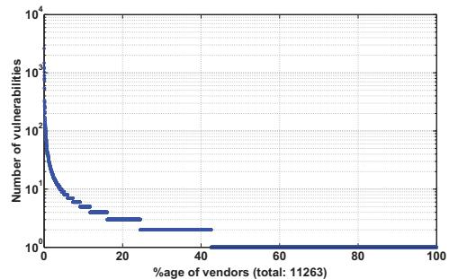

Figure 1. # of vulnerabilities for each vendor (in descending order)

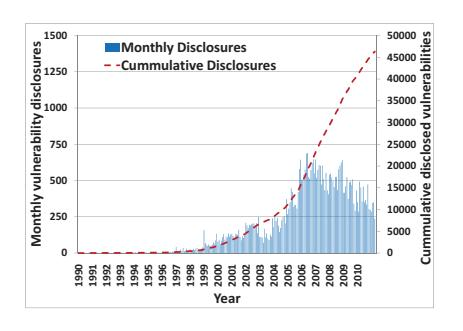

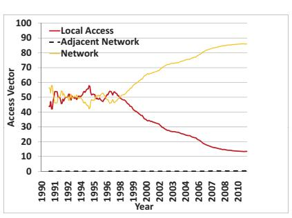

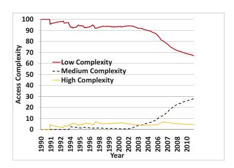

(a) Vulnerability disclosure trend

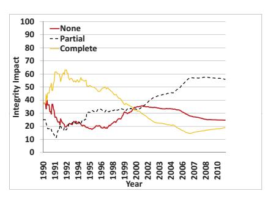

(b) Access Vector Evolution

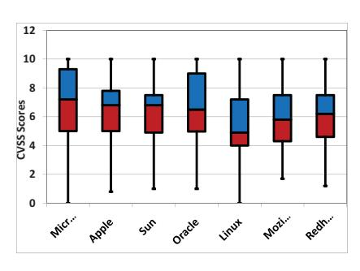

(c) Access Complexity Evolution

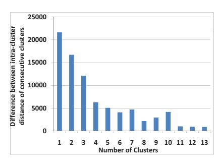

(d) Integrity Impact Evolution

(e) Boxplots of the CVSS scores of selected vendors

(f) Difference between intra-cluster dissimilarity of consecutive clusters

Figure 2. Vulnerability trends in the data set

2) Selection of Vendors and Products: The aggregate data set contains vulnerabilities from more than 11 thousand vendors and over 17 thousand software products. Figure 1 plots the number of vulnerabilities of each vendor in the descending order. It can be seen that over 95% of the vendors have less than 10 vulnerabilities. Therefore, to make statistically sound observations, we focus our attention only on the top 8 vendors each of which has at least 500 vulnerabilities. For our study, we select Microsoft, Apple, Sun, Oracle, Linux1, Mozilla, Red Hat, and Google. We also study popular software products of these vendors that include Internet Explorer, Safari, Firefox, Chrome, Windows, MAC OS X, Solaris, and several Linux based operating systems.

### III. GENERAL VULNERABILITY ANALYSIS

In this section, we study the trends in vulnerability disclosure and CVSS-vector metrics (*i.e.*, access vector, access complexity, and integrity impact) over the past 2 decades. We also categorize the vulnerabilities into groups and study their evolution.

### A. Vulnerability Disclosure Trend

The rate of vulnerability disclosures experienced an exponential growth since 1997 and lasted till 2006 as can be seen in Figure 2(a). The vertical lines in the figure show the number of vulnerabilities disclosed every month since January 1990 and the dashed line shows the cumulative number

of vulnerabilities. The number of vulnerability disclosures has not been increasing since 2006. In fact, on average, the number of vulnerabilities being disclosed every month have been decreasing since 2008 despite the ever increasing use of software products.

# B. Evolution of CVSS-Vector Metrics

Figures 2(b) to 2(d) show the evolution of three metrics of CVSS-vector. For each metric, we have calculated the percentage of vulnerabilities corresponding to each of its three values for every month since January 1990. We observe from Figure 2(b) that the percentage of remotely exploitable vulnerabilities has been increasing since 1998. The fact that most computer systems are connected to Internet has made it possible for hackers to exploit these systems remotely. Figure 2(c) shows the change in access complexity of vulnerabilities over the years. We observe that the percentage of low complexity vulnerabilities has decreased over time indicating that the hackers have to use more sophisticated techniques to exploit new vulnerabilities. From Figure 2(d), we also observe a reduction in the percentage of vulnerabilities having complete integrity impact.

### C. General Trend of CVSS Score for Short-listed Vendors

Recall from Section II that every vulnerability has an associated risk quantified by CVSS score. Figure 2(e) shows the box plots of CVSS scores for vulnerabilities in the products of the selected vendors. We note that CVSS scores of most vulnerabilities in our study lie in *medium* to *high* 

&lt;sup>1Linux is not a vendor. It only represents the vulnerabilities in Linux kernel.

range. The median CVSS scores for closed-source vendors are greater than the median scores for open-source vendors.

#### D. Evolution of Types of Vulnerabilities

To determine the prevalent types of vulnerabilities and to study their evolution, we utilize unsupervised k-means clustering to group different types of vulnerabilities. We leverage the text information provided by NVD and OSVDB for each vulnerability to cluster them into groups of distinct types. We extracted the keywords from the text description of each vulnerability that characterize its functionality and used them as features to cluster all the vulnerabilities into groups. Some example keywords include *denial*, *service*, *buffer*, *injection etc*. We had a total of 608 relevant keywords.

It is well known that k-means clustering algorithm is well suited for large data sets with large number of attributes. To set an appropriate value of k in k-means algorithm, we used Euclidean distance as the intra-cluster dissimilarity metric due to the binary nature of the attributes [13]. Figure 2(f) shows the difference in the intra-cluster dissimilarity between consecutive clusters. It can be seen that the distance decreases as the number of clusters increases for lower values of k. The bar above any value x in Figure 2(f) represents the difference between intra-cluster distances of xand x+1 clusters. Note that increasing the number of clusters to 8 increases the intra-cluster distance (the bar above 6 is smaller than that above 7). Therefore, the optimum value of k is 7. For statistical rigor, we repeated k-means clustering algorithm 20 times with different seeds for each value of k. The coefficient of variation in each case was less than 0.05 which shows the statistical significance of results. We analyzed the centroids of clusters to determine their dominant keywords. Table I tabulates dominant keywords for each centroid. From the observed keywords, we label the vulnerability clusters as PHP vulnerabilities (PHP), executable code (EXE), denial of service (DoS), buffer overflow (BO), SQL injection (SQL), cross-site scripting (XSS), and miscellaneous vulnerabilities (Misc). Figure 3 shows the number of vulnerabilities belonging to each cluster disclosed since 1999.

Only BO, DoS, and EXE vulnerabilities were prevalent till 2001. These types of vulnerabilities constitute a major portion of software vulnerabilities even today which indicates that the vendors have not been able to devise effective strategies to limit these types of vulnerabilities. Since 2002, we observe an increase in the XSS vulnerabilities, which peak in 2006. PHP vulnerabilities were prevalent in 2006

RESULTS OF VULNERABILITY CLUSTERING

| C   | # | Keywords                                     | Label | Size  |
|-----|---|----------------------------------------------|-------|-------|
|     | 1 | php, parameter, execute, file, code, url     | PHP   | 8.32% |
| - 2 | 2 | -                                            | MISC  | 36.6% |
| 3   | 3 | execute, code                                | EXE   | 7.25% |
| -   | 4 | service, denial                              | DoS   | 14.2% |
| 1   | 5 | buffer, execute, code, overflow              | ВО    | 10.2% |
| (   | 6 | injection, sql, execute, commands            | SQL   | 11.2% |
|     | 7 | cross, scripting, site, script, html, inject | XSS   | 12.3% |

and 2007 and SQL vulnerabilities became dominant since 2005. These trends highlight the shift in focus of hackers to exploit new services as they become popular.

In the sections that follow, we present the behavior of hackers and vendors towards vulnerabilities.

#### IV. EXPLOITATION BEHAVIOR

In this section, we study the behavior of hackers in releasing exploits for vulnerabilities. For this, we analyze trends in  $t_{ed}$  values of vulnerabilities. The analysis presented in this section is done on *ED-subset*. We study three ranges of  $t_{ed}$  values.

 $t_{\rm ed} < 0$  shows that an exploit for a given vulnerability was released before its public disclosure. The vulnerabilities falling in this range represent a big threat to the security of end-users as the vendor could be oblivious about them. A total of 2.8% software vulnerabilities fall into this range.

 $t_{\rm ed}=0$  refers to the case when an exploit for a given vulnerability was released on the day it was disclosed. The exploits corresponding to such vulnerabilities are called  $\it zero-day$  exploits. In our ED-subset, a total of 88.2% vulnerabilities have zero-day exploits.

 $t_{\rm ed}>0$  means that the exploit for a vulnerability was released after its public disclosure. The vulnerabilities for which  $t_{ed}>0$  represent the case where a vulnerability is disclosed by the vendor or an independent organization and the hackers used this information to release an exploit in more than a day. 9.7% vulnerabilities fall in this range. To do more detailed analysis, we subdivide this range into three parts: (1)  $0 < t_{ed} \le 7$  gives us the percentage of exploits released within a week of disclosure, (2)  $7 < t_{ed} \le 30$  gives us the percentage of exploits released after a week and within a month of disclosure, and (3)  $t_{ed} > 30$  gives us the percentage of exploits released a month after the disclosure.

### A. Evolution of Exploitation

To extract and construe the dominant trends, we first divided the vulnerabilities in ED-subset into groups where each group contains vulnerabilities disclosed in one distinct year. Then we subdivided the vulnerabilities in each group into five subgroups corresponding to the five ranges of  $t_{ed}$ . We then calculated the percentage of vulnerabilities in each

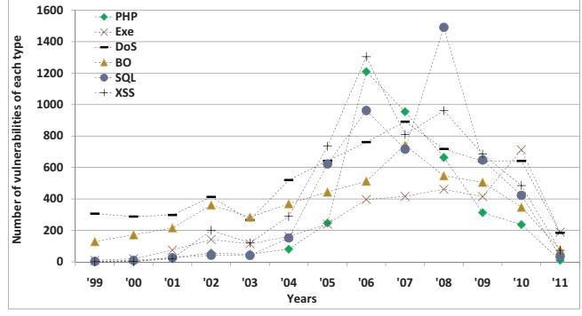

Figure 3. Evolution of vulnerability clusters over the years

subgroup (called the *percentage size* of the subgroup) in its respective group and plotted the results in Figure 4 in the form of stacked bars where each bar corresponds to the group of vulnerabilities disclosed each year and each block in every bar represents the percentage size of the corresponding subgroup in its respective group. The number inside each block is the value of the percentage size of the corresponding subgroup. The number at the top of each bar represents the total number of vulnerabilities in the corresponding group. All figures in rest of the paper have been made using similar methodology.

It can be seen from Figure 4 that majority of vulnerabilities have always been exploited on their disclosure dates (having  $t_{ed}=0$ ). Till 2004, the percentage size of the subgroup of  $t_{ed}<0$  was non-negligible which shows that the hackers were finding a significant number of vulnerabilities themselves and exploiting them. At the same time we observe a decrease in the percentage size of the subgroup of  $t_{ed}=0$ . This does not mean that hackers were getting sluggish because we also observe a significant increase in the total number of exploited vulnerabilities. Since 2004, although we observe a decrease in the percentage size of the subgroup of  $t_{ed}<0$ , an increasing trend in the percentage size of subgroup of  $t_{ed}=0$  still shows that the hackers are becoming more and more active.

#### B. Exploitation of Types of Vulnerability

We now see the exploitation of different types of vulnerabilities. Figure 5 has been made in the same way as Figure 4 except that now the *groups* are the *types* of vulnerabilities. It can be seen that over 80% of vulnerabilities of each type (except BO and EXE) are exploited on or before the day of disclosure. In case of BO and EXE, a significant percentage of vulnerabilities is exploited several weeks after the disclosure. According to our data set, 79% of BO and EXE pose *high risk* and only 7% have *high access complexity*, so intuitively, they should attract more attention from hackers. The total number of exploited vulnerabilities of these two types are large which justifies the intuition.

### C. Exploitation Trend for Vendors and Products

We study the behavior of hackers in exploiting the vulnerabilities for different vendors and their respective products. Figures 6 and 7 show the exploit data for the selected

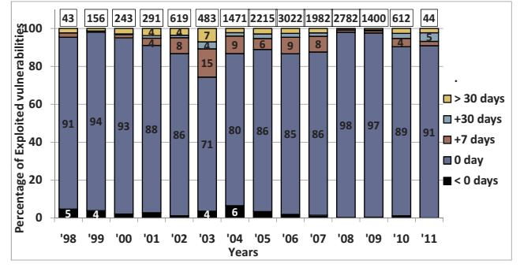

Figure 4. Yearly change in exploitation behavior for different  $t_{ed}$  ranges

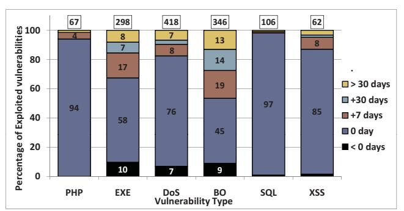

Figure 5. Exploitation trend in clusters

vendors and products respectively. These figures have been made for vendors and products in the same way as Figure 5 was made for vulnerability types.

Lets first compare the vulnerability exploitation in open vs. closed-source vendors. In comparison to closed-source vendors, for open-source vendors *e.g.*, Linux, Red Hat *etc.*, comparatively smaller percentage of vulnerabilities is exploited till the day of disclosure while a larger percentage of vulnerabilities is exploited before the disclosure. To generate statistically significant conclusion from these two conflicting observations, we do statistical hypothesis testing.

As our samples for open-source and closed-source vendors contain large number of data points, therefore, the most appropriate statistical test for this scenario (and all the subsequent scenarios) is the standard one-tailed t-test. t-test is considered to be the most appropriate when the number of data points in the samples are large (typically > 50) regardless of the distributions they come from.

To remove any bias in testing, we state the null hypothesis as: the mean value of  $t_{ed}$  for open-source vendors,  $\mu_{t_{ed}}(O)$ , is equal to the mean value for closed source vendors,  $\mu_{t_{ed}}(C)$ . The alternative hypothesis is:  $\mu_{t_{ed}}(C)$  is greater than  $\mu_{t_{ed}}(O)$ . We apply the right tailed t-test to the null hypothesis. If the null hypothesis is rejected, it would be statistically sound to claim that the average time to exploit a vulnerability in closed-source software is larger compared to open-source software. We give a general equation for hypothesis testing that will be used for all the subsequent tests:

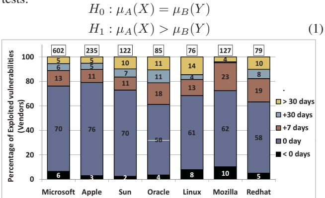

Figure 6. Exploited vulnerabilities for vendors relative to disclosure dates

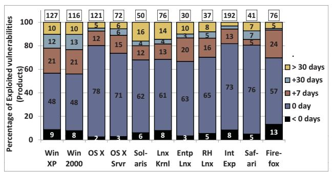

Figure 7. Exploited vulnerabilities for products relative to disclosure dates

where X=C represents closed-source vendors, Y=O represents open-source vendors, and  $A=B=t_{ed}$  represents that the data points of  $t_{ed}$  are being considered. We do the hypothesis testing for a 95% confidence interval i.e.,  $\alpha=0.05$ . Our test resulted in a p-value of 0.003 which is much smaller than  $\alpha$ , thus we reject  $H_0$  to accept  $H_1$ . Therefore, it is statistically sound to state that the exploitation of vulnerabilities in closed-source software is slower compared to open-source software.

Figure 6 shows that hackers release most exploits till the disclosure dates for Microsoft and Apple. This is primarily because hackers find it more rewarding to exploit these products due to their wider market capitalization. For the selected products, we see the similar trend in Figure 7 as for vendors in Figure 6 except for Windows. The percentage of exploited vulnerabilities for Windows till disclosure date is lesser as compared to OS X but at the same time the percentage of exploited vulnerabilities for Windows before disclosure is greater than that for OS X. In fact, the mean value of  $t_{ed}$  for Windows is negative while that for OS X is positive. The t-test with X = "OS X", Y = "Windows", and  $A = B = t_{ed}$  yields p = 0.031 proving that the exploitation in Windows is quicker compared to OS X.

Among web browsers, Firefox has the smallest percentage of vulnerabilities exploited till disclosure date compared to Internet Explorer and Safari but at the same time has the highest percentage of vulnerabilities exploited before the disclosure. The t-test with X= "Safari" and Y= "Internet Explorer" yields p=0.05 showing that exploitation in Internet Explorer is quicker compared to Safari. The t-test with X= "Safari" and Y= "Firefox" yields p=0.09, and therefore, fails to reject the null hypothesis.

### D. Exploitation Behavior: CVSS Scores

Recall from Section II that each vulnerability is assigned a CVSS score depending upon the level of risk associated with it. Based on CVSS scores, we divide vulnerabilities into three categories. Low:  $0 \le \text{CVSS}$  Score < 4; Medium:  $4 \le \text{CVSS}$  Score < 7; High:  $7 \le \text{CVSS}$  Score  $\le 10$ . Figure 8 has been generated in the same way as Figure 6 except that we plotted the vulnerabilities belonging to low, medium, and high categories separately. The white

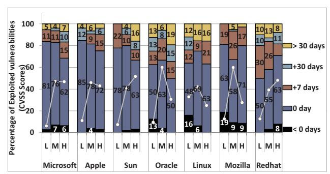

Figure 8. Exploited vulnerabilities for different CVSS scores

lines with round markers represent the percentage of total vulnerabilities belonging to low, medium, or high categories.

It is intuitive to think that hackers would be less interested in exploiting low risk vulnerabilities because such vulnerabilities usually cause lesser damage. This is exactly what the markers for low risk vulnerabilities show in Figure 8. The bars in Figure 8 show that the percentage of medium risk vulnerabilities for which exploits are released till the disclosure date is greater than that for high risk vulnerabilities for all closed-source vendors and some open-source vendors.

#### E. Interesting Exploitation Rules

Now we present some interesting association rules about the exploitation behavior in the products of the short-listed vendors. We used implementation of Apriori association rule mining algorithm in WEKA to extract the rules with confidence greater than 95% [14], [15]. For association rule mining, we used following 7 attributes of each vulnerability: Vendor Name <code><vnd></code>, Product Name <code><prd></code>, Vulnerability Type <code><typ></code>, Severity <code><sev></code>,  $t_{ed}$ ,  $t_{pd}$ , and  $t_{pe}$ . For the rules presented in this section, we used  $t_{ed}$  as class attribute.

We found that in case of Microsoft, majority of vulnerabilities including DoS, XSS, and BO are exploited on the day they are disclosed. One such rule obtained from association rule mining is: vnd=Microsoft typ=XSS sev=H  $\rightarrow t_{ed}=0-day$ .

In case of Apple, the vulnerabilities are exploited on or before their disclosure date. For example, as shown in the following rule, vulnerabilities in Safari browser are mostly exploited on the day of disclosure:  $vnd=Apple prod=Safari typ=BO sev=H \rightarrow t_{ed}=0-day$ .

For Solaris, association rules show that high risk vulnerabilities are exploited on the day of disclosure while medium risk vulnerabilities are mostly exploited within a week after their disclosure. The latter trend is shown by the following rule: vnd=Sun prod=Solaris sev=M  $\rightarrow$  0< $t_{ed}$ < +1 week.

For Mozilla, we get interesting rules showing that hackers do not exploit a vulnerability that has already been patched while they quickly exploit those that have not been patched. Two rules stating this observation are: (1) <code>vnd=Mozilla</code> <code>prod=Firefox typ=BO</code>  $t_{pd}=0-{\tt day} \rightarrow t_{ed}>$  +1 <code>month</code>, (2) <code>vnd=Mozilla</code> <code>prod=Firefox typ=BO+1</code> <code>week</code>  $<\!t_{pd}\!\le$ +1 <code>month</code>  $\rightarrow$   $t_{ed}=0-{\tt day}$ .

#### V. PATCHING BEHAVIOR

Now we study the behavior of vendors in providing patches for vulnerabilities in their products. For this, we study the trends in  $t_{pd}$  values of vulnerabilities. The analysis presented in this section is based upon *PD-subset*. The three ranges for  $t_{pd}$  that we study are described below.

 $t_{pd} < 0$  shows that the patch for a given vulnerability was released before its public disclosure. A total of 10.1% vulnerabilities have  $t_{pd} < 0$  which is greater than the corresponding value for  $t_{ed} < 0$ . One possible reason is that the independent organizations inform the vendors about the vulnerabilities they discover and give them a reasonable time to release a patch before disclosing the vulnerabilities.

 $\mathbf{t_{pd}} = \mathbf{0}$  means that the patch for a vulnerability was released on the disclosure day. Such patches provide *zero-day* protection against exploitation. In our data set, zero-day patches are provided for 62.2% of the vulnerabilities.

 $t_{pd} > 0$  refers to the case where the patch for a given vulnerability was released after its public disclosure. In our PD-subset, 27.7% of all the vulnerabilities are patched more than a day after their disclosures. We further subdivide the range  $t_{pd} > 0$  into the same three parts as in Section IV.

The t-test with  $A=t_{pd}$ ,  $B=t_{ed}$ , and X=Y= "aggregate data set" yields  $p\approx 0$  which leads us to accepting the alternative hypothesis that, compared to hackers, vendors take more time on average to patch a vulnerability (considering disclosure date as reference).

#### A. Evolution of Patching Behavior

In Figure 9 we observe that till 2005, the percentage of vulnerabilities patched on or before disclosure dates consistently decreased. Keeping in view the fact that independent organizations inform the vendors about vulnerabilities well before disclosing them, such a poor patching behavior of vendors indicates that security was not a major concern for vendors at that time. However, we see a significant improvement after 2005. Since 2008, vendors have been providing patches for more than 80% of total vulnerabilities till their disclosure dates. A possible reason for this can be that it has become more common to not report vulnerabilities publicly, rather, the vendors "pay" for vulnerabilities.

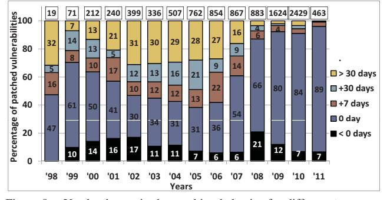

Figure 9. Yearly change in the patching behavior for different  $t_{pd}$  ranges

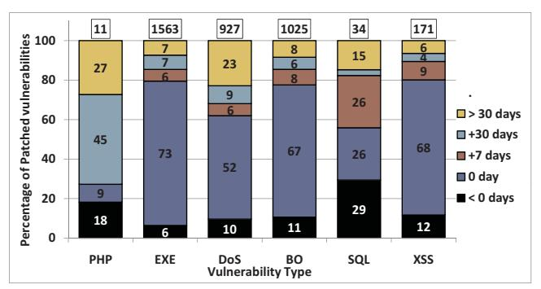

Figure 10. Patching trend in clusters

#### B. Patching of Types of Vulnerabilities

From Figure 10, we can note that the vendors are generally slower in patching the PHP and SQL vulnerabilities. Recall from Section IV-B that hackers tend to quickly exploit these groups of vulnerabilities. On the other hand, the vendors are quicker in patching the EXE and BO vulnerabilities because these vulnerabilities are quickly exploited and thus pose high security risk.

#### C. Patching Trend for Vendors and Products

Here we study the behavior of the selected vendors in patching the vulnerabilities in their products. Figures 11 and 12 show the patch data for selected vendors and products.

Closed-source vendors are typically profit based organizations and have more resources to secure their products as compared to open-source vendors. Therefore, we expect better patching behavior from closed-source vendors. Figure 11 confirms this intuition as Microsoft, Apple, and Oracle release patches for about 70% or more of all the vulnerabilities on or before disclosure dates. In comparison, we observe significantly smaller percentages and quantity of patched vulnerabilities for open-source vendors. Applying the t-test with  $X=O,\ Y=C,\$ and  $A=B=t_{pd},\$ we obtained  $p\approx 0$  which statistically justifies the observation that open source-vendors are slower in patching as compared to closed-source vendors.

We see the similar trend for the selected products in Figure 12 as for vendors in Figure 11. We also see that over 85% of the vulnerabilities in Windows are patched on or before the disclosure dates. If we compare Figure 12 with Figure 7, we observe that the percentage of zero-day patches for Windows is greater than the percentage of zero-day exploits.

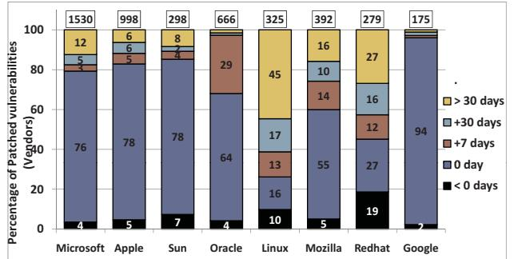

Figure 11. Patched vulnerabilities for vendors relative to disclosure dates

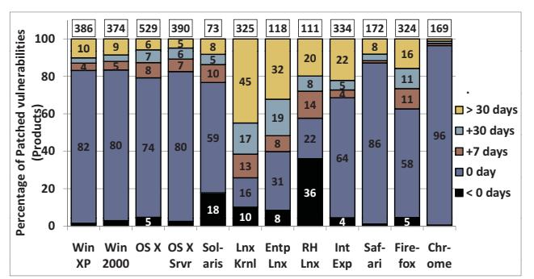

Figure 12. Patched vulnerabilities for products relative to disclosure dates

Among web browsers, Figure 12 shows that Google Chrome is the fastest patched web browser followed by Apple's Safari. t-test with Y = Chrome and X = (Internet Explorer, Safari, Firefox) respectively yields p = (0,0.024,0) confirming that our observation about Chrome from Figure 12 is statistically significant. t-test with Y = Safari and X = (Internet Explorer, Firefox) yields p = (0.009,0.0786) confirming that Safari is patched more quickly compared to Internet Explorer but the test fails to reject the null hypothesis of Safari against Firefox.

#### D. Patching Behavior: CVSS Scores

One would expect the vendors to be quicker in patching the medium and high risk vulnerabilities compared to low risk vulnerabilities. This is exactly what we observe in Figure 13. Open-source vendors are slower as compared to closed-source vendors for vulnerabilities belonging to all risk categories.

#### E. Interesting Patching Rules

We present some association rules about the patching behavior of the vendors extracted using  $t_{pd}$  as class attribute.

Microsoft is quicker in patching vulnerabilities in Windows as compared to its remaining products. The following two rules show this: (1) <code>vnd=Microsoft</code> <code>prod=Windows</code> XP <code>typ=BO</code>  $\rightarrow t_{pd}$ =0-day, (2) <code>vnd=Microsoft</code> <code>prod=Internet</code> Explorer <code>typ=BO</code>  $\rightarrow t_{pd}$ >+1 month.

Apple also patches vulnerabilities in its operating systems as soon as they are disclosed. The following rule highlights this trend: vnd=Apple prod=MAC OS typ=BO  $\rightarrow t_{pd}$ =0-day. Following rule shows that Apple generally takes about a week to fix DoS vulnerabilities even if they are exploited on the day they are disclosed: vnd=Apple prod=MAC OS typ=DoS  $\rightarrow$  0< $t_{pd}$ ≤+1 week. Other rules show that Apple takes about a month after disclosure to patch the EXE and PHP vulnerabilities although they are always exploited before the patch is released and are prevalent types of vulnerabilities.

Sun is quicker in patching all kinds of vulnerabilities except XSS. Sun fixes DoS vulnerabilities before their disclosure which is a better performance as compared to Microsoft and Apple.

For Mozilla, BO and EXE vulnerabilities are mostly patched till the day of disclosure; however, SQL vulnerabilities are not patched for months. Following rules state

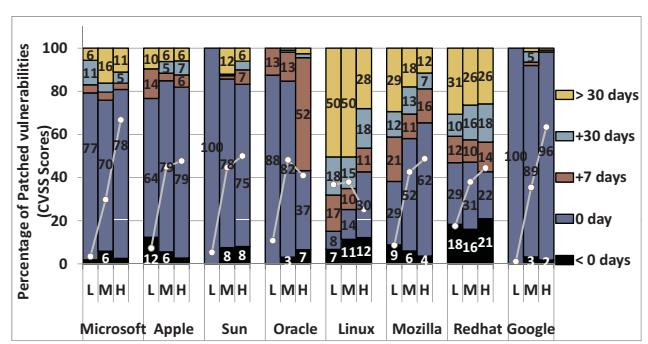

Figure 13. Patched vulnerabilities for different CVSS scores

this: (1) vnd=Mozilla prod=Seamonkey typ=BO sev=M  $\to$   $t_{pd}$ =O-day, (2) vnd= Mozilla prod=Firefox typ=SQL sev=H  $\to$   $t_{pd}$ >+1 month .

#### VI. PATCHING VS. EXPLOITATION

In this section, we compare the quickness of vendors with hackers. We study the trends in  $t_{pe}$  values of vulnerabilities present in the *PE-subset*.

 $t_{\rm pe} < 0$  shows that a vulnerability was patched before its exploitation irrespective of whether or not it was disclosed. The inherent time-lag between the release of patches by vendors and their installation by end-users motivates the hackers to write exploits for vulnerabilities even after corresponding patches have been released. In our PE-subset, 31.7% of all the vulnerabilities fall in this range.

 $\mathbf{t_{pe}} = \mathbf{0}$  means that a given vulnerability was exploited on the day its patch was released. 21.8% of the vulnerabilities fall in this range.

 $t_{\rm pe}>0$  shows that an exploit for a given vulnerability was released before the vendor patched it. A total of 46.4% of vulnerabilities have  $t_{pe}>0$ . The larger percentage of  $t_{pe}>0$  compared to  $t_{pe}<0$  indicates that hackers have generally been quicker in exploiting the vulnerabilities as compared to vendors in patching. This observation affirms the result of the first t-test presented in Section V.

# A. Patching vs. Exploitation: Over the Years

From Figure 14 we can see the same behavior as observed in Section V-A: patching response of vendors was poor till around 2005 and a large percentage of vulnerabilities was being exploited before being patched. In 2006, the situation was so bad that the patches for about 38% of the

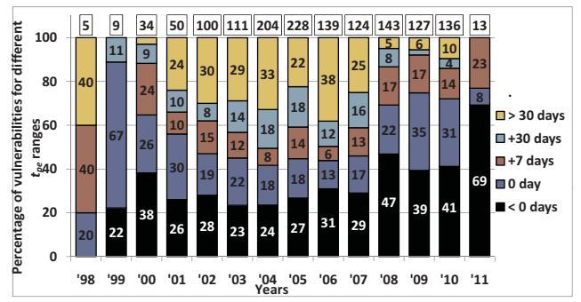

Figure 14. Yearly change in patching vs. exploitation trend for  $t_{pe}$ 

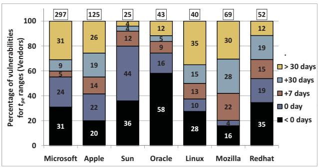

Figure 15. Patched vulnerabilities for vendors relative to exploit dates

vulnerabilities were released more than a month after their exploitation. However, after 2007 a significant improvement can be observed in the vendor response. It is encouraging to see that since 2008, over 70% of all the vulnerabilities have been patched on or before the release date of their exploits. From the discussion in this section and Sections IV-A and V-A, we can conclude that the security state of the software industry has been improving for the last 3 years.

#### B. Patching vs. Exploitation: Vendors and Products

It can be seen from Figure 15 that for all vendors except Oracle and Sun, the percentage size of the subgroups corresponding to  $t_{pe}>0$  is greater than that for  $t_{pe}<0$ . The magnitude of the difference between the percentage sizes of  $t_{pe}<0$  and  $t_{pe}>0$  can serve as a measure to gauge the agility of the vendors in reference to hackers. We can see that among the vendors, only Oracle and Sun are faster than hackers, whereas hackers are, on average, faster than all other vendors. From Figure 16 we can see that, compared to hackers, Microsoft and Sun are quicker for Windows and Solaris respectively.

### C. Patching vs. Exploitation: CVSS Scores

From Figure 17, it can be seen that for Microsoft and Apple, approximately the same percentage of vulnerabilities belonging to medium and high risk categories are patched before the release of their exploits. However, the percentage of vulnerabilities for which  $t_{pe}=0$  is generally greater for medium risk vulnerabilities as compared to high risk vulnerabilities. It can be seen that closed-source vendors are quicker in patching the medium and high risk vulnerabilities compared to open-source vendors.

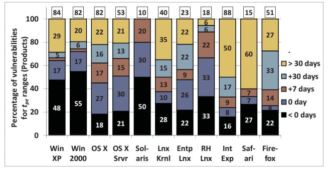

Figure 16. Patched vulnerabilities for products relative to exploit dates

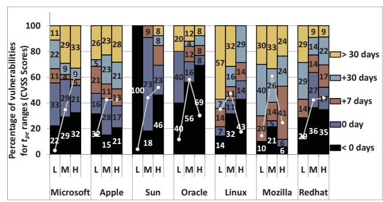

Figure 17. Patched vulns. relative to exploited vulns.: CVSS

#### VII. IMPLICATIONS

Observations from our study have important implications in software design, development, deployment, and management. We separately discuss them in the following text.

#### A. Software Design

The analysis of access requirements, functionality, and risk level of vulnerabilities presented in Sections III-B, III-D, and III-C respectively, can reveal inherent flaws in software design process for specific products and vendors. For instance, if a particular software series has more than typical instances of buffer overflow vulnerabilities, then this may reflect lack of sanity checks in socket read processes. From our data set, we observed that DoS is the most exploited vulnerability type in Solaris accounting for 38.85% of all its vulnerabilities. At the same time, only 11.7% of vulnerabilities in OS X involve DoS, which shows that Solaris is more susceptible to DoS attacks compared to OS X. The observation mentioned above implies that Solaris developers need to take additional steps to make the design more robust to DoS attacks.

#### B. Code Development Practices

The analysis of vulnerability life cycles during the evolution of a given software can reveal insights about potential flaws in its code development and testing practices. In particular, a correlation analysis of count of vulnerabilities across different software and vendors can highlight important differences in code development practices. For instance, we observe in Figure 11 that the percentage sizes of the subgroups corresponding to  $t_{pd} > 0$  for open-source vendors (Linux, Redhat) are significantly greater than those of closed-source vendors (Microsoft, Apple). This observation highlights an important insight into the code development practices of open-source vendors which typically rely on contributions from a group of volunteer developers. On the other hand, closed-source vendors have dedicated resources to fix newly disclosed vulnerabilities as soon as possible. Therefore, open-source vendors tend to have a slower patch response compared to closed-source vendors.

## C. Customer Assessment of Vendors and Products

The analysis presented in this paper also has direct implications in product assessment, certification, and security recommendations to consumers. Several commercial products *e.g.* eEye Digital Security (http://www.eeye.com), Arellia (http://www.arellia.com/), can leverage the presented analysis for product recommendation and design of future security policies. For example, given that the exploits of vulnerabilities have already been released, our measurement analysis showed that Sun releases patches for 96% of the vulnerabilities within a month; whereas, Microsoft, Apple, and Linux provide patches for only 69%, 74%, and 65% of vulnerabilities in the same time period. Therefore, if the patch response of vendor is of prime importance to a customer, then the products from Sun should be preferred. As another example, if a customer's infrastructure has less tolerance for DoS attacks, then it is more suitable to deploy Mac OS X, which has the lowest percentage of DoS vulnerabilities compared to other operating systems. Likewise, if a customer requires more robustness to buffer overflow attacks, then it is more suitable to deploy Solaris because BO vulnerabilities account for about 20% of all the vulnerabilities in Windows and Mac but only 13% in Solaris.

### VIII. RELATED WORK

The major focus of the work on large scale analysis of vulnerabilities has been on the development of vulnerability discovery models (VDMs). Some work has also been done to understand the economic impacts of vulnerability disclosures in software. We briefly describe the work that has been done in these areas in relation to our work.

### *A. Large Scale Vulnerability Analysis*

The work most relevant to ours was reported in [3] in which the authors presented a large scale analysis of vulnerabilities keeping in view the discovery, disclosure, exploit, and patch dates. They analyzed about 14000 vulnerabilities and showed that till 2006, the hackers had been quicker than vendors. This observation is in accordance with what we presented in this paper but we also show that in the last three years, the response of vendors has been improving. Their work does not differentiate between vendors and types of vulnerabilities.

In [16], authors study the life-cycle of vulnerabilities from the time a software is released till the time the first vulnerability is discovered. They show that the time till the discovery of the first vulnerability is a function of the familiarity with the system and the amount of legacy code. In [17], the authors propose to use semantic templates to help the developers understand the vulnerabilities and their artifacts. This work only focuses on understanding the technical details of a disclosed vulnerability and does not study any large scale trend in vulnerabilities.

# *B. Studies on Disclosure and Patching*

In [18], authors have studied the economic aspects of the quickness of vendors in releasing patches for Internet based vulnerabilities. In [19], authors show that on average a vendor loses 0.6% of the stock price with the disclosure of a vulnerability. In [8], authors show that a vendor with more competitors patches the vulnerabilities more quickly. In [7], they show that the vulnerability disclosure accelerates the patch release. Although their work is based upon a small data set of just 354 vulnerabilities disclosed till 2003, they make similar observation as ours that the closed-source vendors are quicker in patching the disclosed vulnerabilities. These studies, however, do not develop any insight into understanding individual behaviors of vendors and hackers.

In [20], using a small data set, authors make a claim that there is no difference between the patching behavior of open and closed-source vendors. They make this observation because they only consider the percentage of patched vulnerabilities as a measure of goodness of a vendor which is unreasonable because without analyzing the duration between disclosure dates and patch dates, one can not determine how active a vendor is in fixing vulnerabilities in its products.

### *C. Modeling and Classification*

The motivation behind the work on VDMs is to enable the prediction of quantity and timing of vulnerability discoveries in new software. Four notable VDMs have been proposed: (1) Anderson Thermodynamic Model [2], (2) Rescorla Linear Model [6], (3) Rescorla Exponential Model [6], and (4) Alhazmi-Malaiya Logistic Model [5]. Another work focused on modeling the time interval between disclosure date of vulnerabilities and their corresponding exploit, patch, and discovery dates [21]. A recent work extracted various features from NVD and OSVDB and used SVM to predict whether a recently disclosed vulnerability will be exploited within a given time or not [22]. Our focus, however, is not the prediction rather the study of phases of vulnerability life cycle in reference to different variables along with several aspects associated with the nature of vulnerabilities.

# IX. CONCLUSION

In this paper, we presented a large scale study of various aspects associated with software vulnerabilities during their life cycle. We aggregated a large software vulnerability data set containing 46310 vulnerabilities disclosed till 2011. Our study showed that the number of vulnerabilities being disclosed every year has stopped increasing since 2008. We showed that the most primitive and most exploited form of vulnerabilities are DoS, BO, and EXE; however, SQL, XSS, and PHP have also become significantly large. We also observed that the percentage of remotely exploitable vulnerabilities has gradually increased to over 80% of all the vulnerabilities. Since 2008, the vendors have been becoming more agile in patching the vulnerabilities and the access complexity of vulnerabilities has been increasing. However, even then, the average time taken by hackers to exploit a vulnerability is smaller than that taken by the vendor. Our findings also highlighted that patching of vulnerabilities in closed-source software is faster compared to open-source software and at the same time the exploitation is slower.

### REFERENCES

- [1] E. E. Schultz, D. S. Brown, and T. A. Longstaff, *Responding to Computer Security Incidents: Guidelines for Incident Handling*, Lawrence Livermore National Laboratory, Livermore, CA, 1990.
- [2] R. Anderson, "Security in open versus closed systems the dance of boltzmann, coase and moore," in *Proc. Open Source Software: Economics, Law, and Policy Confocuce*, June 2002.
- [3] S. Frei, M. May, U. Fiedler, and B. Plattner, "Large-scale vulnerability analysis," in *Proc. 2006 SIGCOMM workshop on Large-Scale Attack Defense*, September 2006, pp. 131– 138.
- [4] S. Frei, B. Tellenbach, and B. Plattner, "0-day patch exposing vendors (in) security performance," in *Proc. Black Hat Technical Security Conf.* , vol. 14, 2009.
- [5] O. H. Alhazmi and Y. K. Malaiya, "Quantitative vulnerability assessment of systems software," in *Proc. Annual Reliability and Maintainability Symposium*, 2005, pp. 615–620.
- [6] E. Rescorla, "Is finding security holes a good idea?" *IEEE Security and Privacy*, vol. 3, no. 1, pp. 14–19, Januray 2005.
- [7] A. Arora, R. Krishnan, R. Telang, and Y. Yang, "An empirical analysis of software vendors patch release behavior: Impact of vulnerability disclosure," *Information Systems Research*, vol. 21, no. 1, pp. 115–132, 2010.
- [8] A. Arora, C. Forman, A. Nandkumar, and R. Telang, "Competition and patching of security vulnerabilities: An empirical analysis," *Information Economics and Policy*, vol. 22, no. 2, pp. 164–177, 2010.
- [9] (http://nvd.nist.gov/) National Vulnerability Database.
- [10] (http://osvdb.org/) The Open Source Vulnerability Database.
- [11] (http://www.first.org/cvss) Forum for Incident Response and Security Teams.
- [12] (http://cve.mitre.org/) Common Vulnerabilities and Exposures.

- [13] R. Tibshirani, G. Walther, and T. Hastie, "Estimating the number of clusters in a data set via the gap statistic," *Journal of the Royal Statistical Society: Series B (Statistical Methodology)*, vol. 63, no. 2, pp. 411–423, 2001.
- [14] R. Agrawal and R. Srikant, "Fast algorithms for mining association rules," in *Proc. of 20th Int. Conf. on Very Large Data Bases*, 1994, pp. 487–499.
- [15] I. H. Witten, E. Frank, L. Trigg, M. Hall, G. Holmes, and S. J. Cunningham, *Weka: Practical Machine Learning Tools and Techniques with Java Implementations*. Citeseer, 1999.
- [16] S. Clark, S. Frei, M. Blaze, and J. Smith, "Familiarity breeds contempt: The honeymoon effect and the role of legacy code in zero-day vulnerabilities," in *Proc. 26th Int. Annual Computer Security Applications Conf.* , 2010, pp. 251–260.
- [17] Y. Wu, H. Siy, and R. Gandhi, "Empirical results on the study of software vulnerabilities: NIER track," in *Proc. 33rd Int. Conf. on Software Engineering*, 2011, pp. 964–967.
- [18] R. Anderson, "Why information security is hard an economic perspective," in *Proc. 17th Annual Computer Security Applications Conf.* , 2001, pp. 358–365.
- [19] R. Telang and S. Wattal, "An empirical analysis of the impact of software vulnerability announcements on firm stock price," *IEEE Transactions on Software Engineering*, vol. 33, no. 8, pp. 544–557, 2007.
- [20] G. Schryen, "A comprehensive and comparative analysis of the patching behavior of open source and closed source software vendors," in *Proc. 5th Int. Conf. on IT Security Incident Management and IT Forensics*, 2009, pp. 153–168.
- [21] G. Vache, "Vulnerability analysis for a quantitative security evaluation," in *Proc. 3rd Int. Symp. on Empirical Software Engineering and Measurement*, 2009.
- [22] M. Bozorgi, L. K. Saul, S. Savage, and G. M. Voelker, "Beyond heuristics: Learning to classify vulnerabilities and predict exploits," in *Proc. of 16th Int. Conf. on Knowledge discovery and data mining*, 2010, pp. 105–114.