# ESSAYS ON SOFTWARE VULNERABILITY COORDINATION

Jukka Ruohonen

## **University of Turku**

Faculty of Technology Department of Computing Software Technology MATTI Doctoral Programme

## **Supervised by**

Ville Leppanen ¨ University of Turku

Sami Hyrynsalmi Lappeenranta University of Technology

#### **Reviewed by**

Mathias Ekstedt KTH Royal Institute of Technology Kimmo Halunen University of Oulu

## **Opponent**

Tommi Mikkonen University of Jyvaskyl ¨ a¨

The originality of this publication has been checked in accordance with the University of Turku quality assurance system using the Turnitin OriginalityCheck service.

ISBN 978-951-29-8913-3 (PRINT) ISBN 978-951-29-8914-0 (PDF) ISSN 2736-9390 (PRINT) ISSN 2736-9684 (ONLINE) Punamusta Oy, Turku, Finland, 2022


UNIVERSITY OF TURKU Faculty of Technology Department of Computing Software Technology RUOHONEN, JUKKA: Essays on Software Vulnerability Coordination Doctoral dissertation, ?? pp. MATTI Doctoral Programme June 2022

#### ABSTRACT

Software vulnerabilities are software bugs with security implications. Exposure to a security bug makes a software system behave in unexpected ways when the bug is exploited. As software vulnerabilities are thus a classical way to compromise a software system, these have long been coordinated in the global software industry in order to lessen the risks. This dissertation claims that the coordination occurs in a complex and open socio-technical system composed of decentralized software units and heterogeneous software agents, including not only software engineers but also other actors, from security specialists and software testers to attackers with malicious motives. Vulnerability disclosure is a classical example of the associated coordination; a security bug is made known to a software vendor by the discoverer of the bug, a third-party coordinator, or public media. The disclosure is then used to patch the bug. In addition to patching, the bug is typically archived to databases, cataloged and quantified for additional information, and communicated to users with a security advisory. Although commercial solutions have become increasingly important, the underlying coordination system is still governed by multiple stakeholders with vested interests. This governance has continued to result in different inefficiencies. Thus, this dissertation examines four themes: (i) disclosure of software vulnerabilities; (ii) coordination of these; (iii) evolution of these across time; and (iv) automation potential. The philosophical position is rooted in scientific realism and positivism, while regression analysis forms the kernel of the methodology. Based on these themes, the results indicate that (a) when vulnerability disclosure has worked, it has been relatively efficient; the obstacles have been social rather than technical in nature, originating from the diverging interests of the stakeholders who have different incentives. Furthermore, (b) the efficiency applies also to the coordination of different identifiers and classifications for the vulnerabilities disclosed. Longitudinally, (c) also the evolution of software vulnerabilities across time reflect distinct software and vulnerability life cycle models and the incentives underneath. Finally, (d) there is potential to improve the coordination efficiency through software automation.

KEYWORDS: Software vulnerability, coordination, life cycle, CVE, CWE, CVSS

TURUN YLIOPISTO Teknillinen tiedekunta Tietotekniikan laitos Ohjelmistotekniikka RUOHONEN, JUKKA: Essays on Software Vulnerability Coordination Vait ¨ oskirja, ¨ ?? s. MATTI tohtoriohjelma Kesakuu ¨ 2022

#### TIIVISTELMA¨

Ohjelmistohaavoittuvuudet ovat bugeja, joilla on tietoturvamerkitys. Hyvaksik ¨ aytt ¨ a-¨ mall ¨ a t ¨ am¨ ankaltaisia bugeja ohjelmistosysteemi saadaan toimimaan ennakoidusta ¨ poiketen. Koska ohjelmistohaavoittuvuudet ovat nain ollen klassinen keino murtaa ¨ ohjelmiston tietoturva, nait ¨ a on pitk ¨ a¨an koordinoitu ohjelmistoteollisuudessa riskien ¨ valtt ¨ am¨ amiseksi. V ¨ ait ¨ oskirja v ¨ aitt ¨ a¨a, ett ¨ a t ¨ am¨ a koordinaatio tapahtuu monimutkaisessa ¨ ja avoimessa sosio-teknisessa systeemiss ¨ a, joka koostuu hajautetuista ohjelmistokom- ¨ ponenteista ja heterogeenisista ohjelmistoagenteista, mukaan lukien ohjelmistoke- ¨ hittaj¨ at, tietoturva-asiantuntijat, ohjelmistotestaajat ja haavoittuvuuksia hyv ¨ aksik ¨ ayt- ¨ tav¨ at hy ¨ okk ¨ a¨aj¨ at. Haavoittuvuuksien julkituonti on klassinen esimerkki koordinaa- ¨ tiosta; tietoturvabugi tuodaan julki sen loyt ¨ aj¨ an, kolmannen osapuolen tai julkisu- ¨ uden toimesta. Tam¨ an j ¨ alkeen bugi korjataan. Korjauksien ohella bugi my ¨ os ark- ¨ istoidaan tietokantoihin, luokitellaan ja kvantifioidaan lisainformaation vuoksi ja kom- ¨ munikoidaan kaytt ¨ ajille tietoturvailmoituksen muodossa. Vaikka kaupalliset ratkaisut ¨ ovat tulleet entista t ¨ arke ¨ ammiksi, t ¨ am¨ ankaltaista koordinatiota hallinnoidaan edelleen ¨ useiden eri intresseja omaavien toimijoiden kesken. Hallinnointi on tuottanut my ¨ os¨ tehokkuusongelmia. Nain ollen t ¨ am¨ a v ¨ aitoskirja tarkastelee nelj ¨ a¨a teemaa: (i) ohjel- ¨ mistohaavoittuvuuksien julkituontia; (ii) naiden koordinaaatiota; (iii) n ¨ aiden ajallista ¨ evoluutiota; seka (iv) automaatiopotentiaalia. Tulokset osoittavat teemoihin poh- ¨ jautuen, etta (a) julkituonnin toimiessa, se on ollut my ¨ os suhteellisen tehokasta; jo- ¨ htuen eri toimijoista ja heidan erilaisista intresseist ¨ a ja vaikuttimista, ongelmat ovat ¨ olleet sosiaalisia pikemminkin kuin teknisia. Lis ¨ aksi (b) tehokkuushavainto p ¨ atee ¨ myos eri identifikaatiokomponenttien koordinointiin sek ¨ a haavoittuvuuksien luokit- ¨ teluun. Pitkittaintutkimuksen n ¨ ak¨ okulmasta my ¨ os (c) ohjelmistohaavoittuvuuksien ¨ ajallinen evoluutio heijastaa erilaisia ohjelmisto- ja haavoittuvuuselinaikamalleja ja naiden taustalla olevia vaikuttimia. Lopuksi: (d) koordinaation tehokkuutta voidaan ¨ parantaa ohjelmistoautomaatiolla.

ASIASANAT: ohjelmistohaavoittuvuus, koordinaatio, elinaika, CVE, CWE, CVSS

# <span id="page-5-0"></span>Acknowledgements

Dissertation research is a long journey. My sincere gratitude goes to my supervisors Ville Leppanen and Sami Hyrynsalmi who guided me throughout the journey. ¨ In addition, I had the pleasure of working with Johannes Holvitie, Sampsa Rauti, Samuel Lauren, Antero J ´ arvi, Kalle Hjerppe, Kai Kimppa, Shohreh Hosseinzadeh, ¨ Kalle Rindell, Lauri Koivunen, Jose Apolinario Teixeira, Sanja ´ Sˇ cepanovi ´ c, Igor ´ Mishkovski, Tuomas Aura, Janne Pirttilahti, Joakim Sandstrom, Alexey Kirichenko, ¨ Jurka Rahikkala, Joonas Salovaara, Joni Uitto, Luca Allodi, Lotta Hamari, Tiina Kullberg, Sanna Salantera, Jesse Kaukola, Antti Tuomisto, Arho Suominen, Marko ¨ Seppanen, Mari Lehto, Susanna Paasonen, Annamari V ¨ ansk ¨ a, Anne-Marie Tuikka, ¨ and anyone I might have forgotten.

> May 31, 2022 *Jukka Ruohonen*

# Table of Contents

<span id="page-6-0"></span>

|   |         | Acknowledgements                   | vi       |
|---|---------|------------------------------------|----------|
|   |         | Table of Contents                  | vii      |
|   |         | List of Original Publications      | ix       |
| 1 |         | Introduction                       | 1        |
| 2 |         | Background                         | 4        |
|   | 2.1     | Definitions                        | 4        |
|   | 2.2     | Governance                         | 6        |
|   | 2.3     | Coordination                       | 8        |
|   | 2.4     | Markets                            | 9        |
|   | 2.5     | Life Cycles                        | 12       |
|   |         | 2.5.1<br>Software Life Cycles      | 12       |
|   |         | 2.5.2<br>Vulnerability Life Cycles | 13       |
|   | 2.6     | Research Questions                 | 15       |
|   |         |                                    |          |
|   |         |                                    |          |
| 3 |         | Research Design                    | 16       |
|   | 3.1     | Philosophical Foundation           | 16       |
|   | 3.2     | Research Strategy                  | 16       |
|   | 3.3     | Data and Methodology               | 18       |
| 4 | Results |                                    | 21       |
|   | 4.1     | Disclosure                         | 21       |
|   |         | 4.1.1<br>Rationale                 | 21       |
|   |         | 4.1.2<br>Results                   | 21       |
|   | 4.2     | Coordination                       | 23       |
|   |         | 4.2.1<br>Rationale                 | 23       |
|   |         | 4.2.2<br>Results                   | 24       |
|   | 4.3     | Evolution                          | 26       |
|   |         | 4.3.1<br>Rationale                 | 26       |
|   | 4.4     | 4.3.2<br>Results<br>Automation     | 26<br>28 |

#### Jukka Ruohonen

|   |            | 4.4.1<br>Rationale<br>4.4.2<br>Results | 28<br>29 |
|---|------------|----------------------------------------|----------|
| 5 | Discussion |                                        | 31       |
|   | 5.1        | Conclusions                            | 31       |
|   | 5.2        | Limitations                            | 33       |
|   | 5.3        | Claims and Takeaways                   | 34       |
|   | 5.4        | Concluding Remarks                     | 35       |
|   |            | List of References                     | 36       |
|   |            | Original Publications                  | 42       |

# <span id="page-8-0"></span>List of Original Publications

The original publications have been reproduced with the permission of the copyright holders.

- <span id="page-8-1"></span><sup>1</sup> Ruohonen, J., Hyrynsalmi, S., Leppanen, V. (2020). A Mixed Methods Probe into ¨ the Direct Disclosure of Software Vulnerabilities. *Computers in Human Behavior* 103: 161–173.
- <span id="page-8-2"></span><sup>2</sup> Ruohonen, J., Holvitie, J., Hyrynsalmi, S., Leppanen, V. (2016): Exploring the Cluster- ¨ ing of Software Vulnerability Disclosure Notifications Across Software Vendors. Proceedings of the *13th ACS/ IEEE International Conference on Computer Systems and Applications* (AICCSA 2016). Agadir: IEEE, pp. 1–8.
- <span id="page-8-3"></span><sup>3</sup> Ruohonen, J., Rauti, S., Hyrynsalmi, S., Leppanen, V. (2018). A Case Study on Software ¨ Vulnerability Coordination. *Information and Software Technology* 103: 239–257.
- <span id="page-8-4"></span><sup>4</sup> Ruohonen, J. (2019): A Look at the Time Delays in CVSS Vulnerability Scoring. *Applied Computing and Informatics* 15(2): 129–135.
- <span id="page-8-5"></span><sup>5</sup> Ruohonen, J., Hyrynsalmi, S., Leppanen, V. (2017). Modeling the Delivery of Security ¨ Advisories and CVEs. *Computer Science and Information Systems* 14(2): 537–555.
- <span id="page-8-6"></span><sup>6</sup> Ruohonen, J., Hyrynsalmi, S., Leppanen, V. (2015). The Sigmoidal Growth of Oper- ¨ ating System Security Vulnerabilities: An Empirical Revisit. *Computers & Security* 55: 1–20.
- <span id="page-8-7"></span><sup>7</sup> Ruohonen, J. (2018). An Empirical Analysis of Vulnerabilities in Python Packages for Web Applications. Proceedings of the *9th International Workshop on Empirical Software Engineering in Practice* (IWESEP 2018). Nara: IEEE, pp. 25–30.
- <span id="page-8-8"></span><sup>8</sup> Ruohonen, J. (2019). A Demand-Side Viewpoint to Software Vulnerabilities in Word-Press Plugins. Proceedings of the *23rd International Conference on the Evaluation and Assessment in Software Engineering* (EASE 2019). Copenhagen: ACM, pp. 222–228.
- <span id="page-8-9"></span><sup>9</sup> Ruohonen, J. (2017). Classifying Web Exploits with Topic Modeling. Proceedings of the *28th International Workshop on Database and Expert Systems Applications* (DEXA 2017). Lyon: IEEE, pp. 93–97.
- <span id="page-8-10"></span><sup>10</sup> Ruohonen, J., Leppanen, V. (2018). Toward Validation of Textual Information Re- ¨ trieval Techniques for Software Weaknesses". Proceedings of the *29th International Conference on Database and Expert Systems Applications* (DEXA 2018). Regensburg: Springer, pp. 265–277.

# <span id="page-9-0"></span>1 Introduction

Software vulnerabilities are defects, bugs, in software products that have security implications. These provide the classical way to compromise a software product or a larger software system, or to otherwise disturb the intended functioning of the product or the system. Typically, software vulnerabilities are caused by systematic or accidental mistakes in software design, implementation, verification, and other activities in software engineering. The detection and prevention of software vulnerabilities is a classical research topic in the academic research of software engineering. But there is more to the topic.

The amount of discovered and published software vulnerabilities has increased continuously ever since the 1990s. In the 2010s, thousands and thousands of vulnerabilities were published every year, and a large amount presumably never reached the public. Thus, there were vast amounts of vulnerable software products and systems exposed to exploitation. Even when unpublished vulnerabilities are excluded from consideration, many products and systems remained vulnerable because the vulnerabilities were never fixed despite the availability of corrections known as patches. These points were true throughout the 1990s and 2010s, and they are true also in the early 2020s.

But there is still more to the topic. The discovery of vulnerabilities takes time and effort. The publishing of these takes time and effort. The engineering of patches takes time and effort. These and other related engineering activities require collaboration between engineers. They require both technical and social coordination. This socio-technical coordination of software vulnerabilities is the topic of this dissertation. It is addressed by ten individual peerreviewed publications () included in the dissertation. These publications can be grouped into four distinct but overlapping Themes ( ):

```
 1 ↦→ { 1, 2 }: disclosure of software vulnerabilities;
2 ↦→ { 3, 4 5 }: coordination of software vulnerabilities;
3 ↦→ { 6, 7, 8 }: evolution of software vulnerabilities across time;
4 ↦→ { 9, 10 }: automation potential for vulnerability coordination.
```

<span id="page-9-4"></span>Of these themes, <sup>2</sup> can be actually understood as a superset to which the other themes belong: vulnerability disclosure is explicitly a coordination activity; evolving software requires constant coordination, including the patching and management of security issues; and automation provides means with which coordination efficiency can be potentially improved. Here, in essence, vulnerability disclosure refers to the ways vulnerability discoverers make their discoveries known to other parties. Coordination, in turn, refers to the noted, more general software engineering activities involving the management of abstract dependencies, including not only technical dependencies between software products but also dependencies between work activities. These activities, then, cover not only developing of patches for disclosed vulnerabilities but also tracing through past software releases possibly affected, merging changes in version control systems, writing of security advisories, allocating identifiers for systematically tracking the vulnerabilities and patches, and notifying third-party vendors potentially affected by the same vulnerability; to name a few examples. The efficiency of these activities is important because vulnerability coordination is linked to increased security risks. Unpatched software products connected to the Internet are quickly exploited.

If  $\mathcal{T}_2$  provides the superset for the remaining three Themes, together these describe not only coordination between engineers but also a larger socio-technical governance systems. In addition to individual engineers, this system is composed of different norms, institutions, and stakeholders, from companies and governmental agencies to open source software volunteers. In contrast to software engineering coordination conducted within a company or companies, or within a software project or software projects, software vulnerability coordination often involves coordination between engineers affiliated with different companies, projects, and organizations. The coordination is held together by informal norms for the engineering activities as well as more formal institutional practices. The allocation of identifiers is the prime example in this regard: there are institutional arrangements through which these identifiers are reserved, but the arrangements also revolve around distinct norms on appropriate behavior. The institutional arrangements and the associated norms also separate vulnerability coordination from conventional bug tracking.

The preceding concise introduction leads to five Claims ( $\mathcal{C}$ ) defended in the dissertation. The first Claim  $\mathcal{C}_1$  is partially theoretical; the remaining ones are supported by empirical evidence. Most of the other claims rehash  $\mathcal{C}_1$  by emphasizing the social over the technical in the concept of socio-technical coordination but with empirical material to support the claims put forward. In general, in the software engineering context, socio-technical coordination systems are complex, dealing with decentralized software units and heterogeneous software agents, operating in—and adopting to—situated social environments [1]. Thus, a socio-technical approach maintains that technology is embedded to organizational and social processes with accompanying policies, preferences, and incentives [2]. As is clarified later on in Subsection 3.2, furthermore, Claims  $\mathcal{C}_2$ ,  $\mathcal{C}_3$ , and  $\mathcal{C}_4$  are based on basic, knowledge-seeking research, whereas the last Claim  $\mathcal{C}_5$  is better classified as applied research, proposing prototype-like software solutions to enhance the efficiency of vulnerability coordination.

- <span id="page-10-0"></span> $C_1$  Software vulnerability coordination is a socio-technical phenomenon like software engineering coordination in general; it is shaped by institutions, informal norms and values, economic incentives, and other related factors—it should not and cannot be explained by technical aspects alone.
- <span id="page-10-1"></span> $C_2$  Despite historical obstacles, anecdotes, and occasional telltales, software vulnerability coordination has been relatively fast and efficient.
- <span id="page-10-2"></span> $C_3$  Instead of being technical in nature, the past and current obstacles are determined by other factors, including social and economic phenomena.
- <span id="page-10-3"></span> $C_4$  The evolution of software vulnerabilities across time follows distinct observable longitudinal patterns that reflect other than technical factors.
- <span id="page-10-4"></span> $C_5$  Like in software engineering in general, automation provides means to improve the efficiency of software vulnerability coordination.

These claims and their practical takeaways are revisited later on in Section 5.3. Otherwise, the structure of the dissertation is straightforward, containing five chapters. The opening Chapter 2 presents a more thorough but still concise introduction to the theoretical background and

existing research. To this end, definitions, governance, coordination, vulnerability markets, and vulnerability and software life cycles are discussed. The section further presents four research questions. These align with the four Themes. The subsequent Chapter [3](#page-24-0) outlines the overall research design, summarizing the philosophical foundation across the individual publications, the research strategy for these publications, and the data and methodology used in these. The main results from the publications included are presented in Chapter [4.](#page-29-0) The structure of the presentation follows the four Themes, each of which is motivated by a brief rationale before a summary of the results reached. Finally, Chapter [5](#page-39-0) concludes by discussing the answers to the four research questions, limitations, and the preceding claims, concluding with a few remarks about directions for future research.

# <span id="page-12-0"></span>2 Background

In what follows, the dissertation's theoretical and scholarly background are elaborated. The discussion starts with a few definitions and some terminological clarifications. From there, it proceeds to the concepts of governance, coordination, and so-called vulnerability markets. The subsequent discussion addresses software and vulnerability life cycles. Both are important analytical frameworks for understanding the scope and the publications. Based on the elaboration, four research questions are finally introduced to sharpen the four themes.

# <span id="page-12-1"></span>2.1 Definitions

Confidentiality, integrity, and availability (CIA) are the fundamental concepts of information security. In essence, these refer, respectively, to a condition that information is not disclosed or otherwise made available to unauthorized parties; to a condition that information remains accurate and complete during its whole life cycle; and to a condition that information is continuously available upon request. A violation of any of these conditions implies that a given *asset* has been impaired; a *risk* has realized to a known or unknown *threat*. A risk, in turn, is typically understood as a probability that an *attack* by an *attacker* succeeds. With these classical concepts, defensive information security can be seen as a set of activities carried out by stakeholders, who value an asset, in order to minimize the risk and protect the asset through implementing sufficient *countermeasures* [\[3\]](#page-44-3). These fundamental information security concepts are illustrated in Fig. [1.](#page-12-2)

<span id="page-12-2"></span>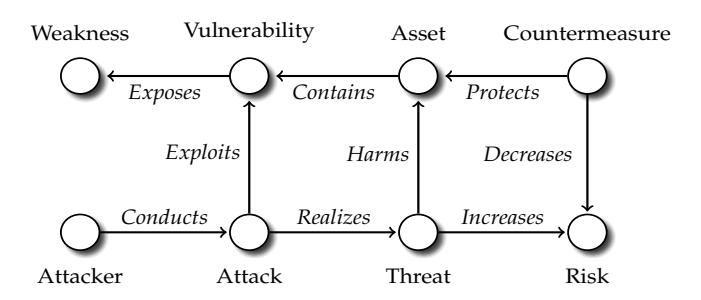

**Figure 1.** Analytical Breakdown of the Basic Concepts (adopted from [\[4\]](#page-44-4))

These terminological clarifications are deliberately simple or even na¨ıve. There are numerous alterations, considerations, and questions that could be attached to the basic concepts. There are also many alternative concepts for technology-related security, among them network security, system security, hardware security, and cyber security. Of these, the last one is the most encompassing, essentially covering anything from information technology to societal security, but, nevertheless, the basic concepts retain their functions also for cyber security. There are attacks, threats, and risks irrespective whether the assets refer to elections, democracy, or space stations. But for the purposes of this dissertation, the notion of *software security* is relevant; it "is the idea of engineering software so that it continues to function correctly under malicious attack" [\[5\]](#page-44-5). Although the word attack appears in the quotation, it is more important to underline the engineering of software, that is, *software engineering*, which is the "practical application of scientific knowledge in the design and construction of computer programs and the associated documentation required to develop, operate, and maintain them", such that software "is both cost-effective and reliable enough to deserve our trust" [\[6\]](#page-44-6). This quotation, again, contains numerous fundamental concepts, among them scientific knowledge, design, development, operation, cost-efficiency, and trust. The type of scientific knowledge pursued in this dissertation is described later in Chapter [3.](#page-24-0) Otherwise there is no particular reason to delve deeper into these concepts—except to note that software security can be seen as a subset of software *reliability*, which essentially means that software continues to function properly in the face of an error, whether benign or maliciously introduced. Regarding reliability, it is worth also noting that Publication <sup>6</sup> follows the classical tradition of reliability engineering [\[7\]](#page-44-7) by modeling the cumulation of software vulnerabilities with different growth curves. Another term worth picking from the quotation is *maintenance*. As is later clarified in Section [2.5.1,](#page-20-1) the dissertation indeed deals with the maintenance of software products instead of the operation or development of such software products.

Thus, in terms of software security, software is the asset that is protected with countermeasures. Secure programming practices—or lack thereof—are among the primary countermeasures [\[8\]](#page-44-8), and insecure software the primary threat. The context of software security makes the concepts of weakness and vulnerability important. A *weakness* in a software product is "a type of mistake that, in proper conditions, could contribute to the introduction of vulnerabilities within that product", whereas a *vulnerability* is "an occurrence of a weakness (or multiple weaknesses) within a product, in which the weakness can be used by a party to cause the product to modify or access unintended data, interrupt proper execution, or perform incorrect actions that were not specifically granted to the party who uses the weakness" [\[9\]](#page-44-9). When excluding system administration mistakes [\[10\]](#page-44-10), such as vulnerabilities arising from configuration flaws of otherwise properly functioning systems, a software vulnerability is simply a software bug with security implications, and a weakness an abstract representation of the given bug. A buffer overflow is the presumably most famous example of a weakness.

Tens of thousands of known buffer overflows and other vulnerabilities have been cataloged with the Common Vulnerabilities and Exposures (CVEs), identifiers used to systematically archive vulnerabilities in order to ease the coordination of information sharing and patching of the software products affected [\[11\]](#page-44-11). The CVE identifiers can be linked to the Common Weakness Enumeration (CWE) framework, which, in turn, catalog the abstract weaknesses behind the concrete vulnerabilities identified with CVEs. In addition, CVEs can be linked to the Common Vulnerability Scoring System (CVSS), which is used to quantify the severity of software vulnerabilities. The second version of this system, which is used in the publications included in the dissertation, contains two variable groups for the intrinsic and fundamental characteristics of vulnerabilities [\[12\]](#page-44-12). The first is the exploitability of a vulnerability; whether a network access is required, how complex is the attack for exploitation, and whether authentication is required. The second is the impact of successful exploitation. As is further elaborated in Publication 4, the impact group is measured with the CIA triad.

# <span id="page-14-0"></span>2.2 Governance

In what follows, *governance* is understood as a *socio-technical system composed of institutions and norms that allow actors to reach specific engineering goals through coordination and other transactions*. The definition is specific to this dissertation. That is to say, there are numerous alternative definitions for governance in social sciences, although most of these share the viewpoint that governance is about governing without the necessity of a government [\[13\]](#page-44-13). In other words, governance does not necessitate the presence of a sovereign institution that holds the exclusive power to enforce rules, including the legitimate monopoly over the use of physical force in a given territorial area, to paraphrase a classical characterization of a nation state and its sovereignty.

The Internet is a prime example of governing without such an exclusive power over a territorial area. Although the Internet is not ungovernable, as was often assumed in the early literature, it still is—despite a recent trend toward more governmental involvement [\[14\]](#page-44-14), a resilient socio-technical system that spans practically all of the world's geographical areas without being controllable by a single government or a group of governments. Therefore, governing the Internet has often been viewed through the lens of so-called *multi-stakeholder governance* [\[15\]](#page-44-15). Although no formal definitions are available, the essence is that there are multiple stakeholders with vested interests for governing the Internet on multiple different governance forums. From this perspective, Internet governance involves autonomous systems, regional Internet registries, international but not necessarily inter-governmental organizations, standardization bodies, governmental agencies, companies, and civil society associations, among many other actors. This broad but apt term applies also to vulnerability coordination; there are many stakeholders with varying interests and incentives for discovering, disclosing, and patching vulnerabilities.

These actors coordinate vulnerabilities through different *institutions* and *norms*. In general, the former are commonly seen as more or less formal "rules of the game", such as bureaucracy, the rule of law and judiciary, property, political systems, and so forth [\[16\]](#page-44-16). These abstractions can be observed through concrete institutions, such as national, regional, and local administrative bodies, and even more concrete institutions, such as courts, party systems, patent offices, and so forth. In contrast, norms are typically seen as culturally and socially produced informal representations about appropriate behavior; values, customs, traditions, religions, and so forth. With these clarifications, governance can be seen as the "play of the game", and like with all games, tactics and strategies can be changed relatively rapidly over the course of years or even less, whereas institutions change only slowly over decades or more, and norms even more slowly, over centuries or more [\[17\]](#page-44-17). This insight is important. During the last decade, in the 2010s, nation-states, international organizations, and companies tried to establish different norms for cyber security, although the success remains debatable at best [\[13\]](#page-44-13). However, this point does not imply that there would not be norms, and, as discussed in Publication 1, norms have characterized also vulnerability coordination.

There are also various concrete institutions for vulnerability coordination. As the dissertation only deals with visible, observable coordination, computer emergency response teams (CERTs) are particularly noteworthy. Alongside international standardization organizations, such as FIRST that manages the CVSS standard, CERTs constitute a global institutional network composed of national and regional response teams, their further coordination institutions, analogous teams within companies and their consortia, and so forth [\[18;](#page-44-18) [19\]](#page-45-0). But while these institutions often act in coordinator positions particularly for high-profile vulnerabilities, there are also other *actors* involved. On the coordinator side, particularly noteworthy is the MITRE corporation who handles the allocation of CVEs. As is discussed in Publication  $\mathcal{P}_3$ , these are essentially "coordination identifiers". As such, there is nothing special about CVEs, except perhaps their rigorousness, authority, and publicity. In theory, bug identifiers serve the same purpose, and many companies indeed use these instead of CVEs.

A closely related actor is the National Institute of Standards and Technology (NIST) of the United States who maintains the National Vulnerability Database (NVD) for archiving the known vulnerabilities identified as CVEs. MITRE and the NVD team further rank the severity of the vulnerabilities coordinated with them with the CVSS standard as well as map the CVEs to CWEs. For the purposes of this dissertation, these actors can be considered as institutions in a sense that they have formal procedures on the rules of the game. The two main players of the game are vendors, the producers of software and hardware, and the discoverers of vulnerabilities.

The roles are interchangeable; a vendor may be a discoverer. Traditionally, however, the discoverers have been referred to independent security researchers, often characterized with the ambiguous term "hacker". Due to the increased professionalism, as discussed in Section 2.4, the concept of security researcher is more apt [20], especially given that none of the publications deal with discoverers holding criminal motives. Furthermore, particularly the three Publications  $\mathcal{P}_3$ ,  $\mathcal{P}_4$ , and  $\mathcal{P}_5$  address the software and security engineering activities taking place after a vulnerability has already been disclosed. The two publications  $\mathcal{P}_9$  and  $\mathcal{P}_{10}$  address technical solutions that may help with these tasks. When combined with these activities, which are social due to the multi-stakeholder nature of the coordination, the term socio-technical emerges as a umbrella that characterizes the coordination. By implication, there are dependencies between the social and technical elements of the coordination; the engineering tasks involved depend on the actors as well as on technology. These dependencies often cause problems: the coordination tasks may be poorly aligned among the actors; there may be a misfit between the actors and the coordination technologies used; and so forth [21]. Finally, the coordination is also about transactions of security information. Such transactions include not only technical vulnerability details, but also CVEs and CWEs, knowledge about patches, security advisories, and other security information. These points allow to attach the dissertation's focus to software engineering.

<span id="page-15-0"></span>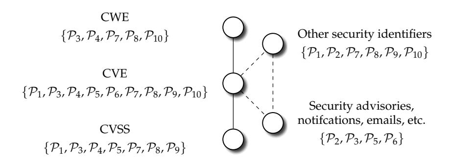

Figure 2. Basic Vulnerability Information Sources Used in the Publications

However, the focus is still strongly CVE-centric. As can be concluded from Fig. 2, only one publication ( $\mathcal{P}_2$ ) does not operate with CVEs. Another point to make from the figure is that CVEs, CWEs, and CVSS scores can be explicitly linked, whereas only implicit, incom-

plete, or even absent linkage is present for other information sources; such linkage must be constructed by data mining techniques. In fact, a couple of publications address the CVE-centric vulnerability coordination explicitly:  $\mathcal{P}_3$  the allocation of CVEs for known vulnerabilities and  $\mathcal{P}_4$  the scoring of CVSS severity information for these. The other publications use CVE, CWE, and CVSS information either for descriptive purposes or for independent variables used in statistical analyses. Although CVE-centric approaches have been classical also in software engineering, more recent research has considered larger ontologies for linking different information sources together. To improve the traceability of vulnerability information, CVEs have been further linked to projects, bug reports, commits, pull requests, software developers, and other online sources [22]. At the same time, more fine-grained approaches have gained increasing traction, including the examination of the vulnerable lines of code in commits to a version control system [23; 24]. That said, CVE identifiers have retained their importance in both research and practice. In terms of the latter, these identifiers still guide the decisions to patch deployments and share information—CVEs are fundamental to the institutionalized vulnerability coordination.

#### <span id="page-16-0"></span>2.3 Coordination

The preceding discussion provides the building blocks for defining coordination in sociotechnical engineering settings. Accordingly, coordination originates from dependencies between different activities, and as a way to govern these dependencies between the activities [25]. The definition is broad, covering practically the whole field of software engineering and its research. Therefore, it is not a surprise that coordination also belongs to the classical topics and basic theories in the software engineering discipline [26; 27]. The scholarly background is further discussed in Publication  $\mathcal{P}_3$ . For the present purposes, it suffices to elaborate vulnerability coordination through vulnerability disclosure. Although such disclosure is only one phase in a longer vulnerability coordination process, it is particularly illuminating, and presumably the most studied phase. It is also a part of the vulnerability life-cycle models discussed in Section 2.5.2. At minimum, three distinct vulnerability disclosure models are typically identified. These disclosure types are analytically illustrated in Fig. 3.

<span id="page-16-1"></span>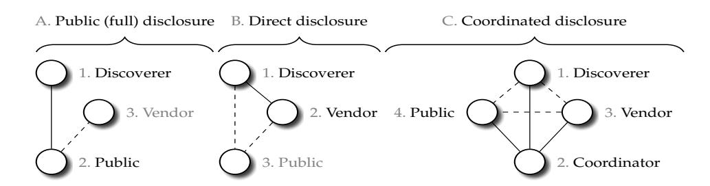

Figure 3. Three Analytical Vulnerability Disclosure Types

The first is public disclosure: a discoverer releases the vulnerability information to the public Internet. Then, only if a vendor, or a group of vendors, are aware of the information, they can develop patches to fix given vulnerability. If also sensitive information, such as details about exploitation, are released, the term full disclosure is also sometimes used. Both disclosure types are riddled with ethical issues: although these may put users at risk, they are

<span id="page-17-1"></span>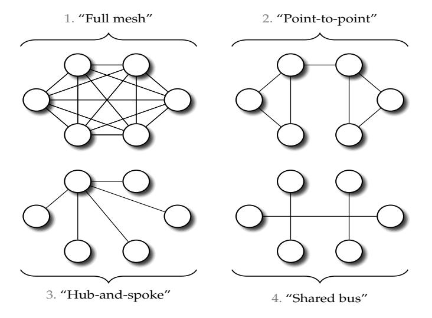

**Figure 4.** Four Analytical Coordination Types (adopted from [\[28\]](#page-45-9))

sometimes necessary because many vendors are not willing to participate in other disclosure types. The second model is a so-called direct disclosure via which a discoverer contact a vendor privately. If successful, the coordination required is also done privately, possibly without the release of information to the public. This model and its associated problems are the topic of Publication 1.

The third model is a coordinated disclosure model: a discoverer contacts a coordinator who then handles the communication with the discoverer, the given vendor or a group of vendors, and the public. Typically, the coordinator is a public sector organization such a computer emergency response team. This disclosure model is examined in Publication <sup>2</sup> by focusing on high-profile disclosure via the national CERT of the United States. When multiple vendors, or multiple discoverers, are present, the CERT-based coordinated vulnerability disclosure type can be further elaborated as a "hub-and-spoke" model. As seen from Fig. [4,](#page-17-1) standard network terminology elaborates also further possibilities for the disclosure and associated coordination. Although the topic is not vulnerability disclosure in itself, the coordination mailing list examined in Publication <sup>3</sup> can be seen as a "shared bus" model. Finally, it should be noted that disclosure increasingly occurs via private sector companies who act as a coordinator or a broker between vendors and discoverers.

# <span id="page-17-0"></span>2.4 Markets

Coordination always involves some transactions made under some institutional settings. In economics, therefore, institutions and transaction costs are closely related. Traditionally, *transaction costs* refer to costs required to draft, negotiate, and maintain contracts between businesses in order to participate in a market [\[29\]](#page-45-10). This definition emphasizes the prior *incentives* to make contracts and the later governance of these, both of which contradict the viewpoint of economic activity as a mere resource allocation problem [\[30\]](#page-45-11). To augment the definition, also property rights and other related business constraints have been incorporated into the concept. The costs of transacting have even been used as a general theory for explaining why institutions emerge and how they are shaping human behavior [\[16\]](#page-44-16). As is later emphasized in Section [3.2,](#page-24-2) the dissertation does not operate with such a grand theory, but, nevertheless, the emergence of new institutions is relevant for understanding the historical background and the existing research associated with it.

The coordination problems particularly in vulnerability disclosure incited the appearance of different *vulnerability markets* in the late 1990s and early 2000s. Although conceptual inaccuracies are worth remarking [\[31;](#page-45-12) [32\]](#page-45-13), these vulnerability markets, in essence, refer to marketplaces on which those who discover vulnerabilities sell their information to vendors who patch their software products with the help of the information sold. These early markets conform relatively well with the core tenets of the transaction cost theory. Incentives are fundamental in this regard [\[33\]](#page-45-14). From an economic perspective, information security has always been riddled with numerous market failures.

There has been a prevalent lack of both supply-side and demand-side incentives to invest in information security [\[31\]](#page-45-12). Traditionally, consumers have valued innovativeness, new features, usability, and other software product characteristics over information security. At the same time, governments have regulated information security only lightly. A good example would be software product liability for security lapses, which, despite of a long-standing debate [\[34;](#page-45-15) [35;](#page-46-0) [36\]](#page-46-1), has never fully realized. The software industry has also been marked by monopolist tendencies, various technical lock-in properties, information asymmetries, network externalities, and related market imperfections that have hampered information security and its improvement [\[37;](#page-46-2) [34\]](#page-45-15). Some of these failures can be traced to the concept of *switching costs*: economic actors tend to stick with existing institutions because these outweigh the marginal efficiency gains that would be gained from abandoning the institutional surroundings [\[38;](#page-46-3) [39\]](#page-46-4). Technical standards would be a good example: even though these may improve interoperability and thus decrease the costs of switching between products, it is also true that insecure standards and their implementations are frequently used even though newer, secure alternatives would be available. Although some new solutions—including data protection regulations, product certification, and cyber insurance—have been introduced to patch the market failures [\[40;](#page-46-5) [41\]](#page-46-6), the fundamental disincentives are still largely present. In many ways, information security is a public good for which only a few actors have been willing to make substantial investments. Though, the term information security should be underlined; if the focus is turned toward cyber security, the claim about investments may no longer hold.

Different incentives are present also among those who discover and disclose software vulnerabilities. For instance, Publication <sup>8</sup> shows that the amount of web vulnerabilities disclosed for software add-ons correlate with the amount of web deployments using those add-ons. In other words, to some extent, the market share of a software product affects the incentives to examine the product for security issues, which, in turn, tends to translate into a high amount of vulnerabilities disclosed for the product [\[42\]](#page-46-7). This reasoning is further discussed in Publications <sup>6</sup> and 8. For the present purposes, it suffices to stress that monetary compensations and related economic aspects do not cover all of the incentives. Traditional, volunteer-based open source software projects are a good example; not only are direct economic incentives absent in such projects, but "the tragedy of the commons" [\[31\]](#page-45-12) is also present because commercial software vendors benefiting from the projects have seldom invested in the information security of the software produced in the projects.

These and other market failures prompted the early research on vulnerability disclosure in the then infant field of information security economics. In essence, the early research was motivated by a question whether new markets could alleviate the market failures associated with vulnerability disclosure and software patching [31]. In other words, to use the terminology from Fig. 4, a similar hub-and-spoke coordination model emerged but this model was market-based; the orchestrator of a marketplace acted as the coordinator.

A large branch of both theoretical and empirical research followed. question was about the possibility of a theoretically optimal vulnerability disclosure model [43: 44: 45]. The theoretical efficiency was also empirically tested; vulnerability markets were observed to be efficient in reducing the diffusion of vulnerability information and the volume of exploitation [46; 47], among other things. Later on, the questions examined have been extended toward competition between software vendors [48], crowdsourcing in terms of so-called bug bounties [20], ethical concerns [49], criminal underground markets [50], disclosure policies for governmental agencies [51], and international regulation [52], among other topics. The bug bounty programs are worth emphasizing not only because of their contemporary importance but also because these are directly related to the disclosure Theme  $\mathcal{T}_1$ . To this

<span id="page-19-0"></span>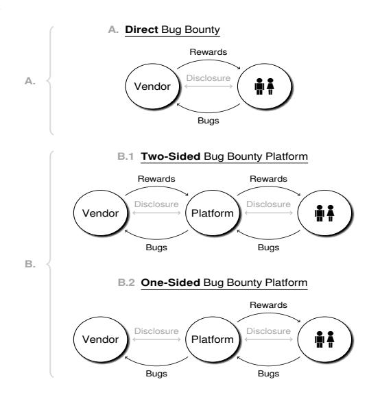

**Figure 5.** Three Analytical Types of Bug Bounties (adopted from [20])

end, Fig. 5 illustrates three different bug bounties; the direct bug bounty shown is comparable to the direct vulnerability disclosure model examined in Publication  $\mathcal{P}_1$ . Despite these new research avenues, however, the approach pursued does not follow the tradition of information security economics and the market-based theories. There are six reasons for this framing.

First and foremost, the new research avenues foretell that markets cannot solve all of the problems. The questions related to governmental agencies, international regulation, and cyber security in general are good examples in this regard. Second, only Publications  $\mathcal{P}_1$  and  $\mathcal{P}_2$ address vulnerability disclosure explicitly, and neither one is related to the market-based disclosure mechanisms. Third, only publicly available data is used, and in most cases this data refers to coordination and engineering activities that take place after disclosure has already occurred. This point is further discussed in  $\mathcal{P}_1$  and  $\mathcal{P}_3$ . Fourth, all of the coordination activities, institutions, and norms are voluntary. There are no mandatory disclosure schemes, software liability constraints, or related arrangement. Fifth, the publications either address open source software explicitly or examine these in a conjunction with commercial software products. A good example would be Publication  $\mathcal{P}_6$  that compares the cumulation of vulnerabilities across operating system releases and their aging. Sixth, some of the publications deal with vulnerabilities only implicitly; the focus in these publications is on the coordination of the associated security information. Namely: Publication  $\mathcal{P}_3$  examines the allocation of CVE identifiers,  $\mathcal{P}_4$  the quantification of CVSS scores, and  $\mathcal{P}_5$  the delivery of security advisories. These remarks restate the earlier emphasis: the dissertation's focus is on software engineering rather than on economics or information security in itself.

# <span id="page-20-0"></span>2.5 Life Cycles

Most of the publications are explicitly or implicitly *longitudinal* in terms of their underlying research strategies. To accompany the generally longitudinal focus, the dissertation's analytical approach is attached to a so-called *life cycle* thinking. This kind of analytical thinking is common in numerous distinct disciplines, including as different fields as marketing [\[53\]](#page-46-18), innovation and technology [\[54\]](#page-46-19), and sustainability [\[55\]](#page-47-0). Life cycle thinking has been common also in software engineering. In addition to providing a model for software development and maintenance [\[56\]](#page-47-1), life cycles have been used to understand the evolution of software in general [\[57\]](#page-47-2). In this dissertation analytical life cycle thinking is applied for software life cycles and vulnerability life cycles. These two life cycles are used as analytical research vehicles rather than theoretical frameworks. In particular, neither the software nor the vulnerability life cycles considered refer to so-called *process theories*. In addition to life cycle (process theory) variants and their state sequences, there are also evolutionary, teleological, and dialectic process theory variants [\[19;](#page-45-0) [58;](#page-47-3) [59;](#page-47-4) [60\]](#page-47-5). In a contrast to these, the life cycle thinking followed distinguishes different phases in an evolution of a software product and vulnerabilities in it. A close analogue would be different state machines used in bug tracking research; a bug report may be opened, closed, reopened, and so forth [\[61;](#page-47-6) [62\]](#page-47-7). Thus, the phases are not explanatory theoretical construct; they are used to frame the focus of a given publication.

## <span id="page-20-1"></span>2.5.1 Software Life Cycles

In terms of*software life cycles*, the analytical focus is on so-called evolving software, which is usually considered to start upon the first operational release made for the software [\[63\]](#page-47-8). This post-delivery focus is important for framing the dissertation's scope. In particular, so-called software *development life cycles* are excluded by design. This exclusion applies also to the means by which security engineering is incorporated into software development life cycles, the prime example being the security development life cycle model from Microsoft [\[64\]](#page-47-9). In other words, the analytical focus is on the maintenance-side than on the development-side. In Fig. [6](#page-21-1) the *maintenance* side correlates with the evolution of servicing phases in a software's life cycle. This focus also affects the perspective adopted for the coordination of software vulnerabilities. In particular, the coordination of discovered vulnerabilities and other security issues can be done in a relatively closed environment during a software development life cycle. Once a software product is released, the environment opens substantially, covering third-party security researchers as well as adversaries with malicious motives. If also deployments are covered in a software life cycle—as is typical in the current cloud computing paradigm, the open operating environment extends also to concrete security risks.

Particularly Publications <sup>6</sup> and <sup>7</sup> more or less conform with the classical releasebased approach to software evolution [\[57\]](#page-47-2). Although both publications address also open source software, which is usually under perpetual development [\[65\]](#page-47-10), the units of analysis still refer to software releases. The two publications differ in terms of whether the releases have a fixed life cycle. For the Python packages examined in 7, the life cycle of a release may be unfixed and short in terms of calendar time; only a current release may be actively maintained, for instance. In a stark contrast: the operating system releases examined in <sup>6</sup> have a long and fixed life cycle; a release may be actively maintained for even over a decade. As is further discussed in the latter publication, these different release engineering dynamics also introduce analytical problems for empirical research. Although shortening these dynamics

<span id="page-21-1"></span>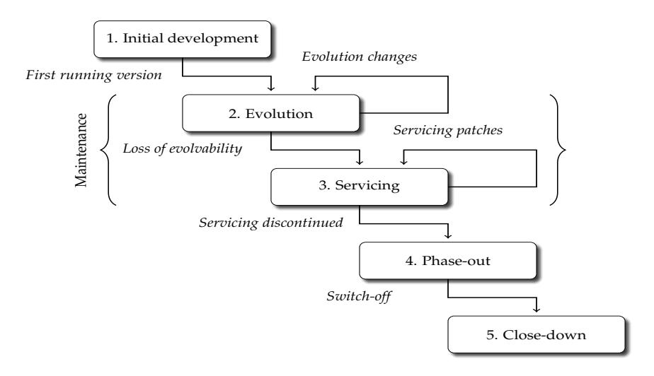

**Figure 6.** A Staged Software Life Cycle Model (adopted from [63] and  $\mathcal{P}_6$ )

has long been a goal for some software projects [66], many operating systems projects still follow a more traditional release engineering approach. In this context, there oftentimes still exist more encompassing product lines under which multiple parallel releases are actively maintained [67]. In addition to such parallelism, a fundamental analytical problem is that the actual software life cycles may have started already in the early 1990s—or even earlier.

Another difference between the two release-based publications is that Publication  $\mathcal{P}_6$ operates with continuous time, whereas Publication  $\mathcal{P}_7$  examines release histories across discrete time. Even though both time concepts have their own mathematical underpinnings, in empirical software engineering the distinction is typically about whether calendar time or some abstractions are used for longitudinal analysis. Software releases are a prime example of the abstractions [68]. Other good examples range from so-called sprints used in agile software development to so-called function points measuring business functionality of a software. A further important point is that recent continuous software engineering practices (including the so-called DevOps movement) have blurred the analytical boundary between development and maintenance. Increasingly, software developers also maintaining and operating the deployments on which the software developed is installed. This transformation has also brought new life cycle and security challenges [69]. It could be even said that there are also deployment life cycles that intervene with both software and development life cycles. Patching a vulnerability in the online context may require rolling a new release embedded to a new deployment system, whether a container or a virtual machine. In this sense, also deployments and even larger infrastructures can be thought to follow their own life cycle logic.

## <span id="page-21-0"></span>2.5.2 Vulnerability Life Cycles

Software bugs have a life cycle: a bug is introduced during software development, and when found, it is preferably but not necessarily fixed. These two events define the bug's life cycle in a software product. A similar life cycle applies to software vulnerabilities, given the definition of these as software bugs with a security implications. In theory, a similar definition and a life

cycle logic applies also to hardware vulnerabilities. Either way, just like with products [\[53\]](#page-46-18) and technologies [\[54\]](#page-46-19), the life cycle logic is based on the general idea that there are different analytical stages, which reflect different theoretical concepts such as introduction, growth, maturity, and decline [\[70;](#page-47-15) [71;](#page-47-16) [72\]](#page-47-17). For instance, the growth state could convey disclosure, patching, and exploitation, whereas the maturity state might connote with a time upon which most deployments have been patched, signatures have been added to intrusion detection and prevention systems, and security advisories have been delivered to users. Although it remains debatable whether the stages are reasonable for approaching security questions, these are useful for framing the dissertation's analytical scope.

By definition, life cycle thinking posits that an object studied lives from its birth to its death [\[60\]](#page-47-5). A software vulnerability is born when a security-related software weakness is introduced to a software source code. In terms of current software engineering practices, usually this birth can be retrospectively traced to a specific commit in a version control system [\[24\]](#page-45-5). Tracing vulnerabilities to specific commits is also an active research area [\[22;](#page-45-3) [23;](#page-45-4) [73;](#page-47-18) [74\]](#page-47-19), as well as a common practical software engineering activity related to vulnerability coordination. Analytically, the latent weakness introduced by a commit becomes a vulnerability when someone discovers it from the software source code and correctly identifies it as a defect with security implications, such that a discovery occurs. In Fig. [7](#page-22-0) these stages are marked by B<sup>2</sup> and C2.

If disclosure, D2, never occurs, a vulnerability would be defined as a "zero-day vulnerability". The actors who possess such vulnerabilities range from criminals and national intelligence agencies to third-party security researchers and software vendors themselves. Although the former two actors have received much of the attention in many public policy debates [\[75;](#page-47-20) [49;](#page-46-14) [76\]](#page-47-21), it should be stressed that vulnerabilities are commonly discovered by software developers, and often also silently fixed by the developers. Regardless of particular actors, zero-day vulnerabilities also constitute a good example of the unfalsifiability of insecurity claims noted in Subsection [3.1.](#page-24-1) Already because publicity is a fundamental requirement for science [\[77\]](#page-47-22), empirical observations about public items cannot be used to prove that an object is secure due to the potential presence of private items. In this regard, it must be again underlined that such vulnerabilities are not considered by any of the dissertation's publications. All cases considered have reached the publication phase E2.

However, there exists an axiom in the sense that software vulnerabilities seldom, if ever, die. Although those developing and using exploits for zero-day vulnerabilities may define the death once E<sup>2</sup> or related events are reached [\[78\]](#page-48-0), a more axiomatic life cycle definition would be that the software affected would no longer exist. But this ontological position is impossible to maintain. For instance, the Morris worm from 1988 can be considered as the starting point in the historical internationalization, institutionalization, and standard-

<span id="page-22-0"></span>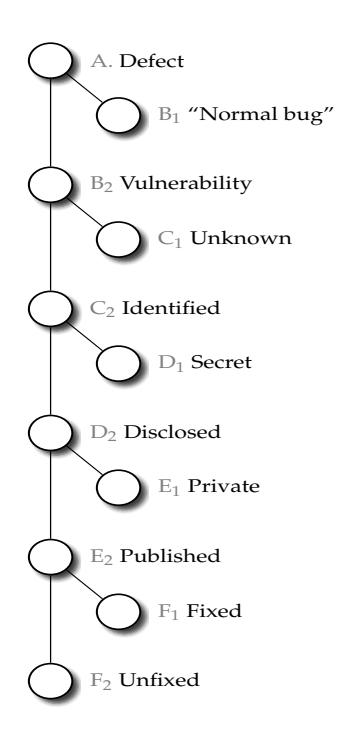

**Figure 7.** A Few Examples of Analytical States (adopted from [\[72\]](#page-47-17) and 5)

ization developments related to software vulnerabilities [\[19\]](#page-45-0). But while the actual software products exploited by the worm have long been only a part of the history of technology, the corresponding vulnerabilities are still alive, well, and exploitable [\[79\]](#page-48-1). From a software engineering perspective, however, it is sensible to attach the death of a vulnerability to an event upon which the software in question is no longer maintained either explicitly or implicitly. In terms of Fig. [6,](#page-21-1) the close-down phase would have been completed. Though, as is pointed out in Publication 8, there are many open source software projects for which updates have not been done even in a decade, meaning that deprecation has occurred implicitly. For Publication 6, on the other hand, explicit deprecation is apparent because the software products observed have mostly reached their end-of-life (EOL) software life cycle states. Questions related to EOL states are currently debated also in the CVE coordination framework [\[80\]](#page-48-2). Furthermore, regarding deployment life cycles and vulnerable websites [\[20\]](#page-45-1), a death of a particular vulnerability might be defined to occur either in case a website is patched or in case it is no longer reachable from the public Internet.

To proceed more formally, let () = and () = , where is an abstract representation of a vulnerability, while () and () are abstract coordination activities that transform the vulnerability's representation into further abstractions. For instance, () could refer to the disclosure event, D2, in Fig. [7](#page-22-0) and () to the subsequent publication event, E2. The coordination activities are assumed to occur at times and , respectively, such that ≥ always holds. Many of the dissertation's publications operate with a simple time difference = − for which ≥ 0 holds. This difference can be understood as a metric for coordination efficiency; the optimum for a given security bug is = 0. Thus, the earlier example would measure a time difference between the disclosure and publication; the former would refer to at which a given vulnerability was disclosed to a vendor, whereas could refer to the publication of a CVE, a CVSS score for it, a security advisory, or some related event. Therefore, the event E<sup>2</sup> is important: when extended toward systematic archiving tasks, classification tasks, severity scoring tasks, and related tasks, the event can describe the publication set {3, 4, 5, <sup>9</sup> }. Furthermore, the general focus on E<sup>2</sup> rules out research that examines vulnerability life cycles in terms of actual attacks, using data from intrusion detection and prevention systems, anti-virus software, and related sources [\[81;](#page-48-3) [82;](#page-48-4) [83\]](#page-48-5). Instead, the interpretation of is better framed with more general concepts, such as problem resolution interval used in software engineering [\[84\]](#page-48-6) and time between failures used in reliability engineering [\[7\]](#page-44-7). This interpretation again underlines the dissertation's focus on software and security engineering rather than security research; the aspects of governance and socio-technical coordination instead of information security in itself.

# <span id="page-23-0"></span>2.6 Research Questions

The preceding discussion motivates to ask four board research Questions (). These align with the Themes and Claims outlined in the introduction. Thus:

<span id="page-23-4"></span><sup>1</sup> ↦→{ <sup>1</sup>, 2, <sup>3</sup> }: *How efficient has software vulnerability disclosure and associated coordination been historically, and what obstacles have there been?*

<span id="page-23-1"></span><sup>2</sup> ↦→{ <sup>2</sup>, <sup>2</sup> }: *How efficient has the coordination of CVEs, CVSS scores, and security advisories been, and what partially explains the efficiency?*

<span id="page-23-2"></span><sup>3</sup> ↦→{ <sup>3</sup>, <sup>4</sup> }: *How software vulnerabilities evolve across time?*

<span id="page-23-3"></span><sup>4</sup> ↦→{ <sup>4</sup>, <sup>5</sup> }: *What prospects there are for automating the coordination?*

# <span id="page-24-0"></span>3 Research Design

The underlying research design is based on *empirical software engineering*. The emergence of this type of software engineering research occurred in the 1990s. The developments later matured in to the current urge for so-called *evidence-based software engineering* [\[85;](#page-48-7) [86\]](#page-48-8), which also necessitates the development and use of software engineering theories [\[87;](#page-48-9) [88\]](#page-48-10). Rather analogous developments have occurred in the security domain [\[89;](#page-48-11) [90\]](#page-48-12). In what follows, the research design is elaborated against these disciplinary developments.

# <span id="page-24-1"></span>3.1 Philosophical Foundation

The dissertation follows a conventional scientific tradition. The underlying philosophical foundation relies on the fundamental *ontological* position that the objects studied exist independently of the conceptual and theoretical frameworks used to study the objects. Although software as an artifact does not exist in nature [\[91\]](#page-48-13), this ontological position is sensible because none of the research questions examined address abstract, mind-dependent software artifacts in the sense that the frameworks used would influence the existence of the objects studied. The context should be underlined also from an information security perspective. Information security itself is unfalsifiable by empirical means: empirical observations cannot prove whether an object is secure—even though these can be used to declare insecurity of an object [\[92\]](#page-48-14). However, nor do the research questions relate to security *per se*, which makes it sensible to also rely on a conventional viewpoint to scientific knowledge.

Thus, the dissertation's *epistemological* position follows the developments in the philosophy of science, from logical empiricism to scientific realism and contemporary positivism: although there are many practical limitations, knowledge about the objects studied should still be based on propositions and hypotheses on one hand, and reproducible and preferably quantifiable empirical observations on the other. In other words, "scientific knowledge with its empirical and theoretical ingredients—obtained by systematic observation, controlled experiments, and the testing of theoretical hypotheses—is an attempt to give a truthlike description of mind-independent reality" [\[77\]](#page-47-22). In general, these two philosophical positions are commonly shared across most current scientific disciplines using empirical data to draw conclusions. Among these disciplines are also empirical software engineering and empirical information security research, including parts of information security economics.

# <span id="page-24-2"></span>3.2 Research Strategy

To further disseminate the distinct research strategies used in the individual publications, Table [1](#page-25-0) shows a concise breakdown based on a recent taxonomy specifically tailored for empirical software engineering research [\[93\]](#page-48-15). There are three general points worth briefly raising about the taxonomic breakdown.

|                            | Outcome | Logic     | Purpose     | Approach   |
|----------------------------|---------|-----------|-------------|------------|
| $\overline{\mathcal{P}_1}$ | Basic   | Inductive | Explanatory | Mixed      |
| ${\cal P}_2$               | Basic   | Inductive | Exploratory | Positivist |
| ${\cal P}_3$               | Basic   | Deductive | Explanatory | Positivist |
| ${\cal P}_4$               | Basic   | Deductive | Explanatory | Positivist |
| ${\cal P}_5$               | Basic   | Deductive | Explanatory | Positivist |
| ${\cal P}_6$               | Basic   | Deductive | Explanatory | Positivist |
| ${\cal P}_7$               | Basic   | Inductive | Exploratory | Positivist |
| ${\cal P}_8$               | Basic   | Deductive | Explanatory | Positivist |
| ${\cal P}_9$               | Applied | Deductive | Evaluation  | Positivist |
| ${\cal P}_{10}$            | Applied | Deductive | Evaluation  | Positivist |

<span id="page-25-0"></span>**Table 1.** Research Strategies (based on a taxonomy from [93])

First, software engineering is an engineering discipline. Historically software "engineering was essentially applied science, and the science was mathematics" [94]. While the reference to mathematics was later replaced with a reference to computer science, the essentially same distinction has continued to be a part in the disciplinary debates about the nature of software engineering research [6; 95; 96]. Analogous debates have been present in the security domain [97; 90]. In fact, there have even been attempts to distinguish a specific engineering method of empirical inquiry from other methods, including the scientific method [91]. The keyword behind such a method is improvement; software development should be more efficient, software should be more secure, and so forth. This quest for improvements is also implicitly present in another long-standing debate about the nature of software engineering. This debate revolves around the nexus between software engineering as a scientific discipline and software engineering as a practice in the software industry [87; 59]. For the purposes of this dissertation, however, such demarcations and related debates are largely artificial and unfruitful.

Engineering depends on science and science depends on engineering [90]. Improvementseeking is not incompatible with the conventional positivist epistemology [98], and quantification has been a long-standing issue for improving security [99]. Contemporary software engineering may also produce both basic and applied research outcomes. Although the demarcation here is somewhat ambiguous and debatable [100], the essence is that basic research outputs knowledge by seeking to understand a problem, whereas applied research seeks to produce a solution to a problem by applying existing knowledge [93]. The same point can be delivered also via a distinction between solution-seeking ( $\sim$  applied) and knowledge-seeking (~ basic) software engineering [88; 101]. Accordingly: the former aims to solve practical problems with engineered solutions, whereas the latter seeks to understand software and its development in a given context. Given these distinctions, the majority of the publications seek knowledge rather than engineer software solutions. That said, particularly the two Publications  $\mathcal{P}_9$  and  $\mathcal{P}_{10}$  are better classified into the solution-seeking domain. Although neither one presents complete software artifacts, both seek improvements and provide technical sketches for solutions to the practical problems identified in the other eight knowledge-seeking publications.

Second, the publications vary in terms of their underlying logic for empirical inquiry. Some of the publications follow an *inductive* (specific-to-general) logic: conclusions and

theoretical arguments are sought after observing patterns and regularities in empirical observations. The other publications use a *deductive* (general-to-specific) logic for their empirical inquiry: hypotheses, theoretical arguments, and general conclusions are contested with specific empirical observations. It should be emphasized that the demarcation is again used for heuristic purposes—theories can be built and tested also with inductive logic, theoretical terms are necessary for inductive systematization, inductive and deductive reasoning can be mixed, and so forth [102; 77; 90]. Furthermore, there are only a few—if any—software engineering theories that could be tested without some inductive reasoning. Even the elegant theoretical knowledge-seeking arguments in software engineering fall into the scope of so-called *middle-range theories* [101], which involve "abstractions, of course, but they are close enough to observed data to be incorporated in propositions that permit empirical testing" [103]. This characterization applies also to the distinctively hypothetico-deductive Publications  $\mathcal{P}_3$ ,  $\mathcal{P}_4$ ,  $\mathcal{P}_5$ ,  $\mathcal{P}_6$ , and  $\mathcal{P}_8$ .

Third, the research purposes used in the publications vary. The grouping is relatively clear-cut, however: all three publications using an inductive logic with weak theoretical premises lean toward exploratory analysis: the goal is to seek new insights and generate hypotheses for further research [104]. The deductive publications seek explanations to prior, theoretically motivated questions. Here, the primary distinction is between generating and testing hypotheses; both are necessary for building middle-range software engineering theories. Although all publications satisfy the requirement of proper contextualizing [105], only Publication  $\mathcal{P}_1$  mixes a quantitative analysis with a qualitative examination of the context. All other publications use quantitative data and methods, thus being positivist in this limited, non-philosophical sense. That is, the positivist methodological outlook does not imply that the ontological and epistemological positions taken in the dissertation would strictly conform with the presence and research of law-like causal relations.

# <span id="page-26-0"></span>3.3 Data and Methodology

All ten publications rely on archival data [104; 93] for their empirical inquiries. This type of data is sometimes also known as naturally occurring data [106]. In other words, the data emerges naturally during software engineering activities. Software vulnerability coordination is not an exception. Filing a CVE, archiving it to a database, and incorporating it to a security advisory creates archival data. Scoring CVSS information for it and mapping it to CWEs creates further data. The data generated depends on a context and a software development system; a version control system produces vastly different data than a bug tracking system. In general, archival data typically represent itself as sequences, graphs, or text [107]. Sequences, including time series, are manifestly a part of the evolution Theme  $\mathcal{T}_3$ . Graph theoretical (social network) methods are used in  $\mathcal{P}_2$  and  $\mathcal{P}_3$ , and text mining applications in  $\mathcal{P}_3$ ,  $\mathcal{P}_9$ , and  $\mathcal{P}_{10}$ . All in all, the ten publications can be placed to the so-called mining of software repositories genre of empirical software engineering research.

All ten publications are *case studies*. These are methods of empirical inquiry that investigate a phenomenon in a given context [104]. Given the ontological and epistemological positions adopted, such a phenomenon must be mind-independent, existing in a real-life context. In this dissertation, governance provides the general context and the socio-technical coordination system the particular context, as was outlined in Section 2.2. The *units of analysis* are important for case studies, like for most empirical studies. The ten publications differ in this regard. By merging CVEs with other security identifiers (cf. Fig. 2), there are three

different units of analysis: vulnerabilities and related security artifacts ( $\mathcal{P}_1$ ,  $\mathcal{P}_3$ ,  $\mathcal{P}_4$ ,  $\mathcal{P}_9$ , and  $\mathcal{P}_{10}$ ), security advisories and vulnerability notifications ( $\mathcal{P}_2$ ,  $\mathcal{P}_5$  and  $\mathcal{P}_6$ ), and software packages and add-ons ( $\mathcal{P}_7$  and  $\mathcal{P}_8$ ). Though, this classification is not entirely straightforward analytically. For instance, in Publication  $\mathcal{P}_6$  security advisories constitute the units of analysis, but these are merely aggregates of vulnerability counts. As is further discussed in  $\mathcal{P}_8$ , these and related issues cause also difficulties for abstraction and statistical estimation. It is difficult to move through the ladders of abstractions: if vulnerabilities are represented as vulnerable lines of code in a commit, for instance, it is difficult to switch to software projects as the units of analysis. A further point is that a case study is the only possible archival data approach in Publication  $\mathcal{P}_3$ , which examines a historically unique but now defunct practice of allocating CVEs through a mailing list.

<span id="page-27-0"></span>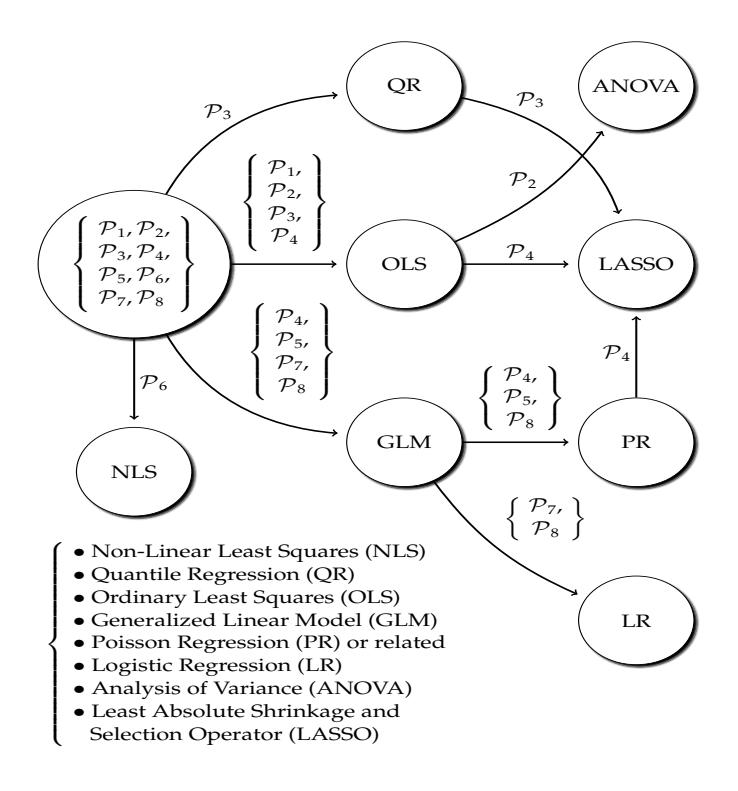

Figure 8. A Summary of Regression Methods

All ten publications are based on a quantitative methodology. Even Publication  $\mathcal{P}_1$  uses a quantitative analysis to accompany the qualitative analysis. Regression analysis is the workhorse for all but two publications included in the dissertation. The two exceptions are  $\mathcal{P}_9$ , which operates with a supervised machine learning classification algorithm, and Publication  $\mathcal{P}_{10}$ , which likewise deals with a classification problem for evaluating the text mining results derived. The other eight publications rely on regression analysis. As was elaborated in Section 2.5.2, much of the analytical life cycle thinking operates with simple time differences. These are count data by definition; in the present context, the days between two life cycle events are counted. In addition to the conventional ordinary least squares regres-

sion with variable transformations, count data points toward generalized linear models, and, indeed, Poisson regression and its variants, including the negative binomial regression, are used three publications. Two publications use logistic regression to model truncated count data variables, and two other publications further use regularization methods originating from machine learning research. Given the summary in Fig. [8,](#page-27-0) Publication <sup>6</sup> is an exception: it uses non-linear least squares to model growth curves for vulnerabilities in operating system products.

# <span id="page-29-0"></span>4 Results

In what follows, the results from the individual publications are disseminated. The structure follows the four Themes and the four research Questions.

# <span id="page-29-1"></span>4.1 Disclosure

Two publications address vulnerability disclosure. Although disclosure is only a part of coordination, it is a particularly relevant part because many of the problems have manifested themselves, and continue to do so, through vulnerability disclosure. These problems, including inefficiency, supply the rationale for the two publications. This rationale can be further briefly elaborated.

#### <span id="page-29-2"></span>4.1.1 Rationale

By now, software vulnerability disclosure is a well-established research topic. As was elaborated in Section [2.4,](#page-17-0) the origins of the topic's academic research trace to the coordinated vulnerability disclosure model, its efficiency, and the then infant market-based coordination models. However, the problems that prompted these coordinated disclosure models have been poorly understood. Although the academic understanding and practice have both improved [\[108\]](#page-49-13), partially due to the late 2010s commercialization of vulnerability disclosure through the crowd-sourced bounty programs [\[20\]](#page-45-1), the problems, and thus the motivation for the research, have often been based on mere anecdotes. This provides the motivation for Publication <sup>1</sup> to examine the direct disclosure of software vulnerabilities from the 1990s to the mid-2010s. The leading research question in the publication is the presumed reluctance of software vendors to engage in this type of disclosure practice. Thus, indirectly, the answer to the question helps to also understand the historical emergence of the coordinated vulnerability disclosure model and software vulnerability coordination in general. To augment the answers provided, Publication <sup>2</sup> examines the notifications sent by the CERT of the United States to software vendors about vulnerabilities disclosed to and coordinated by the CERT. The main research questions are whether these notifications cluster across software vendors, and whether such clustering can explain the associated time delays. The efficiency aspects as discussed in Section [2.5.2,](#page-21-0) are also examined in Publication 1.

#### <span id="page-29-3"></span>4.1.2 Results

The dataset examined in <sup>1</sup> originates from the so-called Exploit Database (EDB), which, unlike the NVD noted in Section [2.2,](#page-14-0) archives also the proof-of-concept programming code required to prove the existence of a given vulnerability by demonstrating its exploitability. Unlike the other publications, <sup>1</sup> mixes qualitative and quantitative methods for the analysis. Namely: a thematic analysis for the former and the ordinary least squares regression for the latter. According to the results, many software vendors were indeed reluctant to participate in direct disclosure. Communication problems and conflicts between discoverers and vendors were a central factor behind the obstacles revealed by the qualitative analysis. Also software life cycles caused problems; particularly the phase-out and close-down stages in Fig. [6](#page-21-1) were problematic as many vendors no longer provided patches for products that had reached these stages. In addition, poor software quality, limited time, and scarce resources contributed to the problems, which, in many cases, implied that many software vulnerabilities were never patched. As was discussed in Section [2.4,](#page-17-0) these issues reflect the lack of incentives and commitments to information security. However: when direct disclosure worked, it was efficient.

<span id="page-30-0"></span>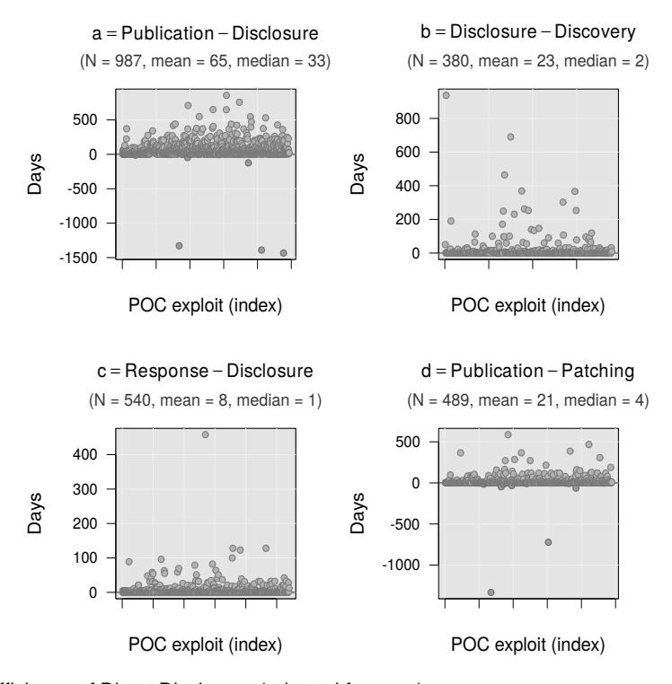

**Figure 9.** Efficiency of Direct Disclosure (adopted from 1)

The efficiency aspects are illustrated in Fig. [9](#page-30-0) with four quantifications. The analytical meaning of these is further elaborated in the publication, but, in essence, these measure (a) the overall length of direct disclosure; (b) the time a discoverer possessed a zero-day vulnerability before disclosing it; (c) the time lag before a vendor responded to an inquiry; and (d) the time a vendor took to release patches. The values shown are all reasonable. The median is a little over a month for discoverers to release their information after contacting vendors; the median is as low as two days for discoverers to contact vendors after their discoveries; the median is only one day for vendors to respond to inquiries; and the median for patches to arrive after a public disclosure is only four days. The results from the regression analysis indicate that the time delays have also shortened in the 2010s compared to the 2000s and 1990s. These tend to further decrease with low-impact vulnerabilities on one hand and seasoned discoverers on the other. Though, as is discussed in the publication in detail, these quantitative results do not nullify the qualitative results; in fact, the quantifications explicitly exclude those cases whereby vendors neither responded to inquiries nor patched their software products.

To some extent, similar problems are implicitly revealed in Publication  $\mathcal{P}_2$  in that the dataset is restricted to those vendors who have actively participated in the coordination through the CERT. In other words, many vendors are reluctant to participate even in coordinated disclosure of high-profile vulnerabilities, as is also revealed by the qualitative results in  $\mathcal{P}_1$ . With respect to those who have participated, efficiency is again present; it took less than about a week for vendors to release patches after having been notified. But as for the clustering effect, the notifications sent by the CERT indeed bundle across vendors, implying that many of the high-profile vulnerabilities have affected multiple vendors due to shared software code. This clustering can also explain a portion of the time delays. This result provides means to speculate about the possibility to improve the coordination; whether customized coordination might be possible for particular groups of vendors, for instance. As for academic contributions, both  $\mathcal{P}_1$  and  $\mathcal{P}_2$  examine the disclosure Theme  $\mathcal{T}_1$  from a novel viewpoint. Particularly Publication  $\mathcal{P}_1$  advances the existing research by providing a nuanced, qualitative perspective on vulnerability disclosure.

#### <span id="page-31-0"></span>4.2 Coordination

The three publications that address the coordination Theme  $\mathcal{T}_2$  and the associated Question  $\mathcal{Q}_2$  operate at later vulnerability life cycle phases than vulnerability disclosure. With respect to the analytical illustration in Fig. 7, the latter can be understood to operate with the time window between  $C_2$  and  $D_2$ , whereas the coordination examined in  $\mathcal{P}_3$ ,  $\mathcal{P}_4$ , and  $\mathcal{P}_5$  consider the events  $D_2$  and  $E_2$ . Despite these differences, the rationale remains similar.

#### <span id="page-31-1"></span>4.2.1 Rationale

Vulnerability disclosure practices improved throughout the 2010s, but some related problems remained. As the decade progressed, the slowness of allocating CVE identifiers emerged as a particular concern. In general, there were four primary ways to obtain these coordination identifiers: by contacting an assignment authority (such as a large company or an open source project, or a governmental agency), having an affiliation with such an authority, contacting the MITRE corporation directly, or using a public mailing list for open coordination. The essence of the last mechanism is summarized in Fig. 10. It is the topic examined in Publication  $\mathcal{P}_3$ .

The topic is novel; there is no prior research that would have examined the CVE allocation question in detail. The same applies to the efficiency of CVSS quantification examined in Publication  $\mathcal{P}_4$ . To some extent, both publications can be seen to refer to the internal coordination done by engineers affiliated with MITRE, the

<span id="page-31-2"></span>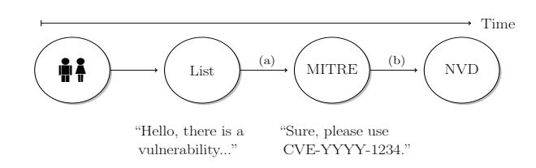

**Figure 10.** CVE Coordination via a Mailing List Between 2008 and 2016 (adopted from  $\mathcal{P}_3$ )

NVD, and associated parties. Publication  $\mathcal{P}_5$  augments such coordi-

nation by examining how three operating system vendors have aligned their security advisories with CVEs. However, there are notable differences between the three publications in terms of their theoretical rationale. First,  $\mathcal{P}_5$  focuses on a specific hypothesis: that the age of an operating system software product affects the time lags between security advisories and CVEs. Although also CVSS information is used for statistical modeling, this hypothesis is distinct from those examined in the other two publications. Second,  $\mathcal{P}_4$  examines the time delays between CVE and CVSS assignments, hypothesizing that the delays are affected by the severity of the corresponding vulnerabilities and efficiency trends across time. In contrast to  $\mathcal{P}_5$ , these hypotheses are on the side of the internal MITRE/NVD coordination. Third, Publication  $\mathcal{P}_3$  is the most encompassing, bringing the social and technical aspects of socio-technical vulnerability coordination together. Three questions are examined in the publication: whether social collaboration aspects, technical characteristics in terms of CWE and CVSS information, and infrastructural characteristics can statistically explain the coordination efficiency through the mailing list. Much of the dissertation's motivation, theoretical background, and associated literature are also discussed in this publication.

#### <span id="page-32-0"></span>4.2.2 Results

All three datasets examined in the three publications use CVEs and CVSS scores from the NVD. This database is the sole data sources for  $\mathcal{P}_4$ . Publication  $\mathcal{P}_5$  uses security advisories and information about product releases as additional data sources. The most comprehensive dataset is examined in  $\mathcal{P}_3$ . In addition to CWE variables, the publication uses a number of variables to model the socio-technical aspects of CVE coordination delays. Among these are social network variables about the individuals who participated in the coordination and infrastructural variables, such as references to bug tracking and version control systems, other vulnerability databases, and other coordination channels and information channels historically used in open source software development. In total, nearly fifty independent variables are used to model the delays of well over fine thousand CVE allocations that were done through the open mailing list between 2008 and 2016. As can be observed from Fig. 11, on average, these delays were gain sensible. The median was fifteen days. However, the distribution has a long tail; the standard deviation is as much as 147 days. A few outlying CVEs took even as long as over four years to appear in the NVD. These cases justify the publication's rationale.

Ordinary least squares and quantile regression (with and without LASSO) are used to estimate the delays in  $\mathcal{P}_3$ . According to the results, social aspects and communication practices, coordination infrastructures, and the technical characteristics of the vulnerabilities coordinated all affect the CVE allocation delays. However, the strength of the statistical evidence follows the order of the listing; social aspects tend to overweight but not overrule the more technical aspects of the CVE coordination efficiency. Strong effects are also present for control variables used to account for the annual variation. In particular, weekends tend to increase the delays slightly. Based on regularization with LASSO, none of the CVSS and CWE variables used retain their statistical effects. Although it is impossible to strictly reject the effects of the technical characteristics, the social dimension seems to matter more. Implicitly, this result supports the earlier results about vulnerability disclosure and the theoretical coordination facets discussed in Section 4.2. These include also the famous Conway's

<span id="page-33-0"></span>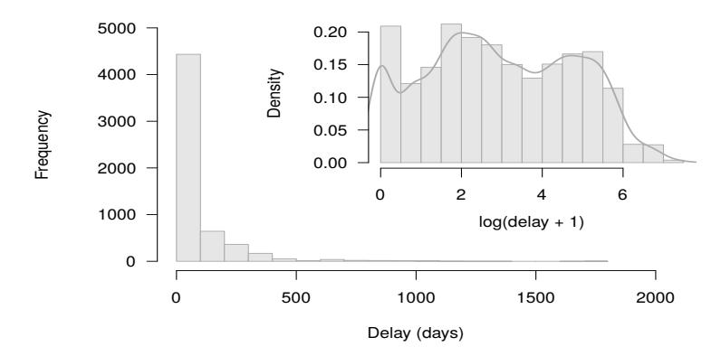

<span id="page-33-1"></span>**Figure 11.** CVE Allocation Delays (adopted from  $\mathcal{P}_3$ )

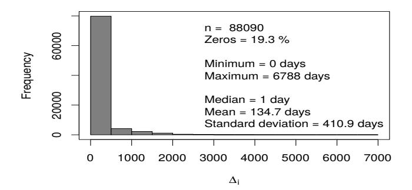

**Figure 12.** CVE-CVSS Allocation Delays (adopted from  $\mathcal{P}_4$ )

law; software engineering of a product tends to reflect the social aspect of a team engineering the product [109]. Although social aspects are not modeled in  $\mathcal{P}_4$  and  $\mathcal{P}_5$ , their results share certain similarities with  $\mathcal{P}_3$ .

The delays between CVE and CVSS allocations examined in  $\mathcal{P}_4$  have a highly similar distribution (see Fig. 12) with the CVE allocation delays through the mailing list ( $\mathcal{P}_3$ ). On average, the delays have again been short, but, yet again, there is a large standard deviation and a few extreme outliers. Based on ordinary least squares, negative binomial regression, Poisson regression, and LASSO, these delays are almost entirely explained by annual trends rather than the CVSS information itself. In other words, the delays are explained by endogenous, within-MITRE/NVD factors. The dataset used in the publication is too limited to speculate beyond this result, but at least a hint toward social aspects is present; human resources are a plausible hypothesis for further research. In a similar vein, the age hypothesis examined in  $\mathcal{P}_5$  is rejected: the age of an operating system software product at the time of issuing a security advisory does not statistically explain the delay between the advisory and the CVE identifiers embedded to the advisory. In contrast to  $\mathcal{P}_4$ , however, severity (CVSS) does fair a little better statistically, suggesting that severe vulnerabilities are coordinated by operating system vendors slightly faster than more mundane vulnerabilities. Due to an omitted variable bias, nothing can be said about social factors, however. Taken together, the results from Theme  $\mathcal{T}_2$  pave the way for the subsequent evolution Theme  $\mathcal{T}_3$ .

## <span id="page-34-0"></span>4.3 Evolution

The research Question  $Q_3$  asks: how software vulnerabilities evolve across software releases? The question is addressed by the three Publications  $\mathcal{P}_6$ ,  $\mathcal{P}_7$ , and  $\mathcal{P}_8$ . Of these,  $\mathcal{P}_7$  is secondary; it supports the theoretical arguments put forward in  $\mathcal{P}_6$  but does not address the evolution Theme  $\mathcal{T}_3$  in itself.

#### <span id="page-34-1"></span>4.3.1 Rationale

Software evolution is a classical research topic in software engineering. The origins of this research trace to Lehman's work from the 1970s onward [57]. Evolution is also a classical topic in software vulnerability research. In particular, the so-called vulnerability discovery models examine how the (cumulative) amount of vulnerabilities evolve across a product's software life cycle [110]. The name of these models is a little misleading, however. Building on the long tradition of software reliability growth models [7], the models do not address discovery itself—in the sense of Fig. 7 and the actual finding of vulnerabilities—but instead model the evolution of these with curve fitting methods. The theoretical context is usually framed to well-established software products, such operating systems that have a long life cycle. As is further discussed in  $\mathcal{P}_6$ , the theoretical assumption is that the growth of software vulnerabilities slows down as software products age. Similar idea is present in software testing and reliability engineering. In a sense, furthermore, the idea is similar to the age hypothesis examined in  $\mathcal{P}_5$ , although coordination is not the theme examined by the vulnerability discovery models. Given the theoretical and empirically verifiable assumption of decelerating growth, the theoretical but empirically difficult explanation relates to incentives. In essence: the growth tends to follow the popularity of a product, and, therefore, there are no strong incentives to find vulnerabilities from old products as the user bases of these products decreases as they age. When the phase-out stage in Fig. 6 is reached, the incentives start to diminish, which, however, does not mean that all incentives would be gone; there are always deployments that use outdated and deprecated software products. As was noted in Section 2.5.2, vulnerabilities are analytically almost immortal. They seldom die; there are exploitable software products deployed in the Internet even after decades.

There is a difference between  $\mathcal{P}_6$  and rest of the nine publications: the publication seeks to replicate earlier results about S-shaped growth curves [111]. Replications have become increasingly important also in empirical software engineering, particularly in order to improve generalizability [112]. In contrast, Publication  $\mathcal{P}_7$  pursues a novel idea by modeling vulnerable and non-vulnerable software releases across sequences of releases. Instead of cumulative growth over continuous time, the evolution is seen as a binary-valued state machine. By a theoretical assumption, a current release, or a future release, tends to be vulnerable if a past release has been vulnerable, or several past releases have been vulnerable. Also the units of analysis differ from  $\mathcal{P}_6$  in that typically only short-lived releases of Python packages are examined. Prior to the publication, there was no directly comparable previous research on the idea of state changes in the empirical software vulnerability research domain.

#### <span id="page-34-2"></span>4.3.2 Results

The dataset examined in  $\mathcal{P}_6$  covers numerous operating system releases from Red Hat Linux and Microsoft Windows. Instead of CVEs, the dataset is assembled by the security advisories

released by these two vendors. These correspond with patches released for the products. As is often the case, a single patch release may fix multiple vulnerabilities particularly in the operating system context. Although the operationalization does not strictly measure the growth of individual vulnerabilities across time, the theoretical premise about S-shaped, sigmoidal growth applies. The operationalization allows to further test a hypothesis that also normal, non-security, bug fixes tend to follow a similar growth curve than the security bug fixes released for vulnerabilities. The three growth curves illustrated in [13](#page-35-0) are used to examine these hypotheses. Of these, the one Gompertz formulated in the 1920s and the logistic growth curve are similar except with respect to their different inflection points at which the growth starts decelerate. Both contain three parameters.

<span id="page-35-0"></span>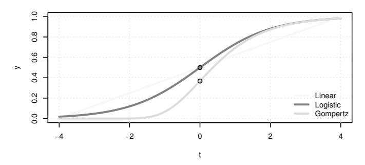

**Figure 13.** Three Growth Curves (adopted from 6)

<span id="page-35-1"></span>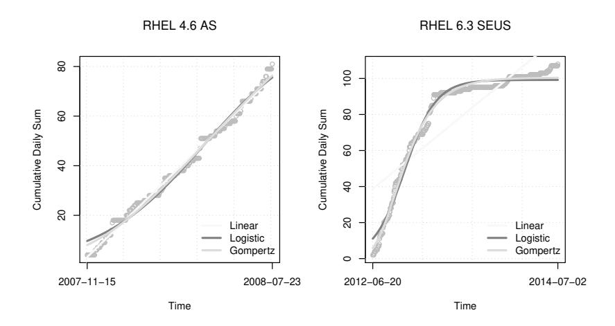

**Figure 14.** Example Growth Curve Estimations (adopted from 6)

Based on non-linear least squares estimates, the two sigmoidal growth curves apply well to the dataset. The Gompertz growth curves yields better estimates for many products, suggesting that the inflection points tend to occur before the midpoint postulated by the logistic growth curve. But given the large amount of products examined, there are some outliers for which also linear growth is appropriate; such an example is shown on the left-hand side plot in Fig. [14.](#page-35-1) However, as the right-hand side plot hints, the linear model is generally ill-suited for most products. Similar observations apply to conventional non-security patch releases. All in all, the earlier results replicated in  $\mathcal{P}_6$  are well-supported. As with the earlier results [111], the theoretical assumption about incentives can be explained neither with the datasets examined nor the growth curves estimated. In other words, the theoretical assumption is well-supported but the theoretical explanation is not. To indirectly patch this limitation, Publication  $\mathcal{P}_8$  examines vulnerabilities in WordPress plugins with an assumption that more vulnerabilities are discovered and disclosed for popular plugins. Based on a dataset of about 1.6 and 2.6 thousand plugins and vulnerabilities, respectively, and estimation with the negative binomial and logistic regression models, the popularity hypothesis holds ground; multiple vulnerabilities are typically discovered from those plugins with wide online deployments. In other words, there are no strong incentives to devote time and effort to discover and disclose vulnerabilities from software that is not widely used. This result provides indirect support also for Publication  $\mathcal{P}_6$ .

The other publication addressing the evolution theme,  $\mathcal{P}_7$ , uses a dataset containing over five hundred vulnerabilities that have affected over three hundred Python packages. Estimation across the packages' release histories is carried out with first-order Markov chains and so-called autologistic regression model. The results are exceptionally good. If, for brevity, the results are simplified as a classification problem that a current release is vulnerable given past releases, the prediction accuracy is as high as 0.99. Although the result is partially explained by the fact that many of the vulnerabilities have affected all previous releases, the level of accuracy is still rare in empirical software engineering. The good statistical performance provides also means to contemplate practical foresight applications based on packages' release histories. Practical applications motivate to turn into the final automation Theme  $\mathcal{T}_4$ .

### <span id="page-36-0"></span>4.4 Automation

The practical problems outlined in the disclosure and coordination Themes  $\mathcal{T}_1$  and  $\mathcal{T}_2$ , as well as the results regarding the evolution Theme  $\mathcal{T}_3$ , motivate to consider technical software solutions that may improve the socio-technical coordination of software vulnerabilities. The research Question  $\mathcal{Q}_4$  asks about prospects for such automated technical solutions. Thus, prototype-like software solutions, which reflect but do not necessarily fulfill the solution-seeking rationale noted in 3.2, are examined in the two Publications  $\mathcal{P}_9$  and  $\mathcal{P}_{10}$ .

#### <span id="page-36-1"></span>4.4.1 Rationale

Empirical software engineering has a long history for classifying bugs. There is a solid rationale behind the research: many software projects, including open source projects in particular, receive a large amount of bug reports daily. Given that many of these are duplicates, invalid, or even spam—yet many are also important and well-assembled, automated prioritization solutions may improve manual triaging, which may further translate into faster bug resolution times [62]. This rationale again reflects the analytical life cycle thinking. Thus, security bugs and vulnerability databases are not exceptions. To this end,  $\mathcal{P}_9$  examines the classification of exploits for web vulnerabilities by using existing meta-data and text mining features. In addition to triaging, there are indirect but generally related arguments justifying the rationale. Improvements for traceability between information sources is one [22]. Threat intelligence is another: similar text mining techniques could be used to classify security information harvested from the open Internet with web crawling.

Publication  $\mathcal{P}_{10}$  continues the same text mining theme. Instead of examining triaging in

terms of database inputs, however, the goal is to examine how well text snippets embedded to CVEs can be mapped to categories in the CWE framework. Although the rationale is similar to  $\mathcal{P}_9$ , the focus on CVEs and CWEs places the publication into the within-MITRE/NVD coordination, and, thus, to the coordination Theme  $\mathcal{T}_2$  discussed in Section 2.3. Potential decreases of the associated coordination delays provide the practical justification. In general, text mining applications have been common in the software vulnerability research domain [22; 113], although there exists no existing research regarding the particular topics examined in Publications  $\mathcal{P}_9$  and  $\mathcal{P}_{10}$ .

#### <span id="page-37-0"></span>4.4.2 Results

The dataset examined in  $\mathcal{P}_9$  is based on the EDB, which is also used in  $\mathcal{P}_1$ . To simplify the statistical analysis, the publication only considers binary-valued categories of web exploits and exploits for web applications written with the PHP programming language. Although the approach is not realistic for practical applications, which would require a multi-class classification approach, it is sufficient for testing the general prospects for a more thorough prototype. Against this backdrop, the main motivation for the statistical computation is to evaluate performance improvements brought by text mining features against existing metadata information. This evaluation approach reflects the practical rationale: the text mining features should bring large improvements to be useful for actual solutions. These features are constructed in two steps. First, the conventional "bag-of-words" approach is used with a fairly standard preprocessing routine. As the textual entries in EDB contain both natural language and programming code, two separate corpora are used: lemmatized English words and other, non-lemmatized tokens. The latter contain not only programming code but also technical terms and associated slang. Then, in order to reduce the dimensionality, the latent Dirichlet allocation method (LDA) is applied for both corpora by using  $k = 5, 10, \dots, 50$  topics. Each exploit is classified to the two dominant topics. Given the existing 38 meta-data features, the classification performance increases with the two LDA-based features are summarized in Table 2. There are improvements for both the web and PHP categories. For the former, in particular, about forty LDA topics yield large improvements, resulting in accuracy of about 0.914.

<span id="page-37-1"></span>**Table 2.** Classification Performance in  $\mathcal{P}_9$ 

|        |          | Accı                    | ıracy                |
|--------|----------|-------------------------|----------------------|
| Topics | Features | Web [95 % CIs]          | PHP [95 % CIs]       |
| 0      | 38       | 0.788 [0.765, 0.810]    | 0.742 [0.717, 0.766] |
| 5      | 40       | 0.895 [0.877, 0.911]    | 0.843[0.821, 0.862]  |
| 10     | 40       | 0.910 [0.893, 0.925]    | 0.861 [0.841, 0.880] |
| 20     | 40       | 0.920 [0.904, 0.935]    | 0.888 [0.869, 0.905] |
| 30     | 40       | 0.912 [0.894, 0.927]    | 0.881 [0.862, 0.898] |
| 40     | 40       | 0.914 [0.897, 0.929]    | 0.863[0.843, 0.882]  |
| 50     | 40       | $0.913\ [0.896, 0.928]$ | 0.878 [0.858, 0.895] |

Publication  $\mathcal{P}_{10}$  is based on the same "bag-of-words" approach by using a dataset as-

<span id="page-38-0"></span>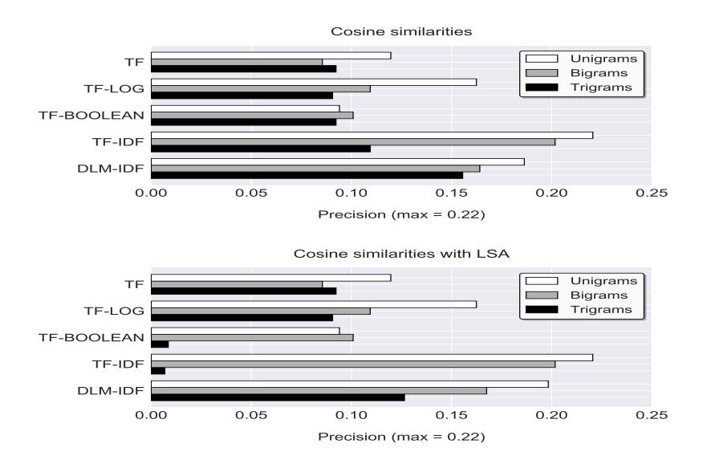

**Figure 15.** Precision for CVE-CWE Mappings (adopted from  $\mathcal{P}_{10}$ )

sembled from the CWE database on one hand and the commercial Snyk database [114] on the other. The scope is limited to those a little over a hundred CWEs that are present also in the NVD via CVE identifiers. The Snyk database tracks web vulnerabilities in different language-specific repositories, four of which are included in the publication. Given these data sources, the goal is to compare simple CVE/CWE regular expression matches against information retrieval techniques. Although there is no available ground truth, a regular expression is assumed to provide a decent enough confidence that an entry in the Snyk database maps to a given CWE either directly or indirectly via a CVE. Given again a rather conventional preprocessing routine, the information retrieval is based on five conventional weighting schemes. In addition, the so-called latent semantic analysis (LSA) is briefly examined. The maximum cosine similarities are used to map the Snyk entries to the CWE entries. Unlike with  $\mathcal{P}_9$ , the overall matching is poor. As seen from Fig. 15, the precision—the share of similar matches between the regular expression and information retrieval approaches—remains below 0.25. Although better values are obtained for some individual repositories, these cannot be considered promising for practical applications. This negative evaluation result is similar to the rejection of the knowledge-seeking deductive hypothesis examined in Publication  $\mathcal{P}_5$ . But, as always, negative results pave the way for improvements; these provide valuable knowledge about what does not work.

# <span id="page-39-0"></span>5 Discussion

The following summarizes the conclusions reached for the four research questions, discusses the limitations and contributions, and finally concludes with a few remarks about future research directions on vulnerability coordination.

# <span id="page-39-1"></span>5.1 Conclusions

The five Themes amounted to five Claims and four research Questions, as enumerated in Chapter [1](#page-9-0) and Subsection [2.6.](#page-23-0) Before reconsidering the claims in Subsection [5.3,](#page-42-0) the Answers () to these Questions can be briefly summarized as follows.

- <span id="page-39-2"></span><sup>1</sup> The first <sup>1</sup> asked about the efficiency of vulnerability disclosure and the problems hindering the efficiency. With two case studies about direct and coordinated disclosure, the efficiency has been good—when disclosure has worked to begin with. In other words, various historical problems were also identified, including those related to communication, software life cycles, and software quality. There are good reasons to assume that similar problems continue to cause problems particularly for direct disclosure. According to the results, a particular problem related to the reluctance of many vendors to engage with disclosure, whether direct or coordinated. These results bespeak about the lack of forceful incentives discussed in Section [2.4.](#page-17-0) Given the increased importance of the market-based disclosure mechanisms, there are also good reasons to suspect that at least some of the problems have been successfully remedied. Another aspect relates to legislations enacted or emerging in some countries. Given these points, it can be argued—or at least hypothesized—that the socio-technical multi-stakeholder governance of vulnerability disclosure is slowly moving from informal norms to formal institutional practices. A further important theoretical conclusion is that the direct and coordinated disclosure types (cf. Fig. [3\)](#page-16-1) are not as straightforward as often presented in the existing literature. In particular, also direct disclosure have often involved different third-parties, suggesting that it and the coordinated disclosure types intervene in practice. Thus, in general, more analytical types such as those in Fig. [4](#page-17-1) seem theoretically more fruitful.
- <span id="page-39-3"></span><sup>2</sup> The second Question, 2, continued the disclosure Theme <sup>1</sup> by asking about coordination efficiency of CVE identifiers, CVSS severity scores, and security advisories. With three case studies, the efficiency can be again concluded to be good. Given the theoretical socio-technical viewpoint pursued, the social aspects can be seen to overweight but not overrule the technical aspects of coordination. Although endogenous factors are strongly present—theoretically unmotivated longitudinal control variables strongly contribute to the efficiency, the technical characteristics of the vulnerabilities coordinated are still less relevant particularly with respect to CVEs and CVSS scores. Furthermore,

the age of operating systems products neither shorten or lengthen the coordination delays. In general, the overall efficiency indicates that the "shared bus" model in Fig. [4](#page-17-1) is not necessarily theoretically worse than the "hub-and-spoke" model. Taken together, these conclusion connect vulnerability coordination to classical theories about coordination in software engineering. Whether it is the coordination of abstract identifiers for vulnerabilities or the development of a software product, team structures, communication practices, media and tools used for the coordination and communication, and other related socio-technical factors are fundamental for efficiency.

- <span id="page-40-1"></span><sup>3</sup> The third <sup>3</sup> asked how software vulnerabilities evolve across time. Two case studies were used to answer to the question, the other based on continuous calendar time and the other on discrete time across software release. The first case study replicated an existing result: the cumulative amount of vulnerabilities discovered and disclosed for particular operating system products follows sigmoidal growth curves, including the logistic and Gompertz growth curves in particular. The second case study demonstrated a high statistical accuracy for predicting whether a current software release is vulnerable based on past releases. Both studies reinforce the importance of software life cycles for explaining the evolution of software vulnerabilities. These results align with <sup>1</sup> not only in terms of software life cycles but also in terms of incentives. Although empirically difficult to verify, particularly the former case study points toward a lack of incentives for discovering vulnerabilities from old software products. More generally, popularity of a software product matters for incentives, and decreasing popularity decreases incentives. This theoretical explanation was further examined by a third case study, which showed that multiple vulnerabilities are more likely to be found from popular software add-ons than from unpopular ones. When again interpreted against the broader socio-technical framework, the results and theorization can be interpreted to weaken the technical aspects. In particular, software quality is not necessarily a major force behind discovered and disclosed vulnerabilities. Unpopular software with poor quality may well contain more vulnerabilities than popular high-quality software, but this assertion does not necessarily imply that more vulnerabilities would be discovered and disclosed from such software products. The robust empirical findings from the three case studies also pinpoint to potential practical improvements in terms of release engineering, prioritization, and automation.
- <span id="page-40-0"></span><sup>4</sup> The fourth <sup>4</sup> asked about potential for automation in order to improve the efficiency of vulnerability coordination. Here, potential was framed as a solution-seeking prototype instead of a complete software solution. To this end, two case studies were presented to demonstrate such potential. The first case study examined the classification of exploits for web vulnerabilities. By relying on text mining techniques and a machine learning classification algorithm, notable improvements were observed from the inclusion of the variables constructed via text mining. This improvements suggest a potential for practical applications. Although fully automated solutions may not be realistic, already a semi-manual classification could bring efficiency improvements; a human could quickly verify the automated classification of inputs to the database in question. Such an approach would likely further improve the efficiency. In a stark contrast, the second case study demonstrated only poor performance for mapping more or less unstructured vulnerability information automatically to CWEs. Given the deductive research strategy used for the case study (see Table [1\)](#page-25-0), the poor performance can be equated to a negative result; the applied solution presented cannot be concluded to work sufficiently even as

a prototype. Further research is required in this regard. Finally, it is worth mentioning the automation potential implicitly discussed in 2. The clustering of disclosure notifications across software vendors could be potentially automated to improve efficiency.

What do these answers tell about socio-technical governance in general? As was discussed in Section [2.2,](#page-14-0) institutions change slowly and norms even more slowly. The answers reached can be reflected against this tardiness. In many ways, Answer <sup>2</sup> about the coordination of vulnerability artifacts resembles the classical answers given for software engineering coordination in general. Coordination is about managing dependencies, which are unavoidable in software engineering but which also cause inefficiencies [\[26;](#page-45-7) [27\]](#page-45-8). Although there is always a room for improvements, efficiency was generally concluded to be good across all case studies addressing it. Therefore, it is perhaps more relevant to note that the actual coordination practices have remained surprisingly stable over the years. Although the coordination channel examined in <sup>3</sup> has been replaced by other mechanisms, CVEs, CWEs, and CVSS scores are still largely coordinated and managed like they were a decade ago. Although some initiatives have been taken, also automated solutions (4) are still rare for vulnerability coordination and associated tasks. By and large, the same can be said about bug tracking in general. Also Answer <sup>1</sup> about vulnerability disclosure can be reflected against the slowness of changes. And although some of the problems identified—including the reluctance of many vendors to engage in vulnerability disclosure—have been partially remedied by the new market-based models discussed in Section [2.4,](#page-17-0) these models can be interpreted to be fairly conservative in their coordination practices. Even today, many of the models can be reduced to the analytical types in Fig. [4,](#page-17-1) or to some variations of these types. Despite the argued trend toward institutionalization, the underlying coordination practices have remained quite stable. The same applies to cultural and social norms. Finally, it is even a small surprise that CVEs have retained their position as the only globally recognized identifiers for vulnerabilities. The same goes for the allocation of these via MITRE and the systematic archiving of these to the NVD. Although the European Union has recently announced a goal for European vulnerability coordination, the general slowness of institutional changes and the results presented allow to expect that the traditional arrangement will continue in the foreseeable future. Socio-technical governance changes slowly.

# <span id="page-41-0"></span>5.2 Limitations

Different validity concepts are commonly used to assess empirical software engineering research [\[115\]](#page-49-20). Among these are external, internal, and construct validity. Although there are no universally accepted definitions [\[116\]](#page-49-21), validity, in essence, means that a given operationalization of a variable, or a set of variables, really measures what is intended to be measured. Reliability, in turn, basically means that a variable operationalized measures consistently the same object across different measurement periods. While these concepts are related, intervening with each other, reliability is generally a lesser concern for the ten publications included in the dissertation. As was noted in Section [3.3,](#page-26-0) these can be placed to the mining of software repositories genre of empirical software engineering research. Within this genre, unlike in survey research for example, consistency is usually archived due to the archival data. There are some exceptions, such as when a project changes a version control system [\[117\]](#page-49-22), but these do not affect the publications. Although all ten publications further address their own limitations in more detail, the three validity concepts provide a good way to summarize some main limitations.

External validity means that a sample is representative and can be generalized to some larger population. This requirement is generally unattainable in case study research. In fact, it is arguably unattainable in software repository mining in general. Even big data analysis, such as research based on GitHub repositories, cannot be generalized to a theoretical population of all software projects; the repositories mined are typically biased toward open source projects, and so forth. Nevertheless, external validity can be achieved in case study research by focusing on an "analytical generalizability" toward a theory instead of a population [118]. In this regard,  $A_1$ ,  $A_2$ ,  $A_3$ , and  $A_4$  each provide some analytical generalizability toward  $\mathcal{T}_1$ ,  $\mathcal{T}_2$ ,  $\mathcal{T}_3$ , and  $\mathcal{T}_4$ , and together these provide analytical generalizability toward the middle-range theory of socio-technical coordination of software vulnerabilities. There is also variance among the individual publications. For instance,  $\mathcal{P}_6$  replicates existing empirical research, thus providing further support for the theoretical arguments made about sigmoidal growth of vulnerabilities across products.

Construct validity is close to the traditional meaning of validity: a concept and its operationalization have construct validity if it and its operationalization describe what is claimed to be investigated. In other words, to borrow the terminology from Section 3.1, the concept and its operationalized, concrete representation accurately describe the mind-independent reality observed in a given study. This kind of validity is generally a problem for the mining of software repositories. The reason is simple: unlike in survey research, controlled experiments, or related research setups, it is impossible to predefine the constructs of interest as these are dependent on the technical characteristics of the repositories mined. If something is not logged or otherwise recorded in a given software repository, it cannot be directly observed to begin with. Particularly Publications  $\mathcal{P}_1$  and  $\mathcal{P}_3$  discuss these construct validity issues in detail with respect to vulnerability coordination. A general limitation relates to the analytical vulnerability life cycles; many of the events in Fig. 7 cannot be measured rigorously. Nevertheless, it should be emphasized that while construct validity may be slightly problematic in some of the publications, software repositories usually still provide a more robust data source than survey research or related research setups. When a given construct can be properly operationalized, it can be also accurately measured; there are no selection biases or other problems that are typical to human subject research.

Internal validity refers particularly to causal assumptions between constructs and their valid empirical verification. Here, valid empirical verification refers to generally sound empirical reasoning, whether based on qualitative or quantitative analysis. Although a causal analysis is not the intention in most of the publications, internal validity is still a concern particularly for the explanatory, hypothetico-deductive publication set  $\{\mathcal{P}_3, \mathcal{P}_4, \mathcal{P}_5, \mathcal{P}_6, \mathcal{P}_8\}$ . Within this set, with the possible exception of  $\mathcal{P}_5$ , the soundness of statistical computing is particularly well-considered. As seen from Fig. 8, the publications in the set use multiple regression methods, and even the non-linear least squares analysis in  $\mathcal{P}_6$  is accompanied with multiple robustness checks. When compared to the external and construct validity threats, internal validity is arguably a lesser concern for the publications included in the dissertation. In general: if a concept has construct validity issues, it is already problematic in terms of internal validity, irrespective of a statistical or a qualitative method.

# <span id="page-42-0"></span>5.3 Claims and Takeaways

All research contributes something, including solution-seeking, practically oriented research. If practical solutions or prototypes thereto constitute a contribution, so do theory-advancing,

knowledge-seeking research results. To this end, the eight Publications from  $\mathcal{P}_1$  to  $\mathcal{P}_8$  together all support the first Claim  $\mathcal{C}_1$ . In other words, vulnerability coordination is best understood as a socio-technical phenomenon; it cannot be reduced to technical aspects only. Different incentives—and disincentives—are important in this regard. Whether it is vulnerability disclosure or the evolution of vulnerabilities across software product lines ( $\mathcal{C}_4$ ), the participating actors have different incentives and disincentives for their participation—or lack thereof. Vendors have still been reluctant to participate in vulnerability disclosure; vulnerability discoverers seldom devote effort and time to find vulnerabilities from old software products; and so forth. These disincentives shape the social aspects underneath vulnerability coordination. Like software engineering in general, vulnerability coordination is a social activity; consequently, also the problems and obstacles are largely social instead of technological, as asserted by Claim  $\mathcal{C}_3$ . However, the problems should not be overemphasized; historically, to put outliers aside, when coordination has worked well, it has been also relatively efficient, as asserted by Claim  $C_2$ . Like in many software engineering phenomena, the efficiency can be characterized to represent a long-tailed probability distribution; the inefficiencies are represented by a minority group located at the distribution's tails.

Although there are still no formal constraints, such as mandatory disclosure schemes or software liability laws, the problems and disincentives have been increasingly addressed by different market-based solutions such as bug bounties. Yet these have retained the multistakeholder governance model for vulnerability coordination. The point is important. Unlike traditional, commercial software engineering, vulnerability coordination cannot be analyzed as a closed socio-technical system. Instead, it is an open socio-technical system governed by multiple stakeholders. Although not in the dissertation's scope, the openness becomes more evident when also threats, attacks, and other information security concepts are considered.

The final Claim  $C_5$  was about automation and its potential efficiency improvements. The evidence presented is a little mixed in this regard. Although the two prototype-like solutions proposed did not both fully establish efficiency advances, automation in itself can be argued to still offer benefits. Even open socio-technical systems can adapt to new circumstances. Innovations are possible, especially when considering that the environment for vulnerability coordination has mostly remained relatively stable over the decades.

## <span id="page-43-0"></span>5.4 Concluding Remarks

This dissertation addressed vulnerability coordination through several case studies. In addition to addressing the limitations briefly discussed, four paths for further research seem prolific. First—as discussed in Publication  $\mathcal{P}_1$ , further research is required to examine distinct coordination practices instead of comparing the practices across multiple analytical coordination models. Here lies also the strength of case studies, which expose nuances better. Second—as discussed in the same publication, further research is required to examine the policy side, including the existing and emerging legal frameworks for vulnerability disclosure, which has always been a controversial topic with respect to discoverers and their legal status when disclosing new vulnerabilities. This policy-related research extends the already interdisciplinary research field toward social sciences, including information security economics but limited to it. Third, the automation potential should be further examined. Here, the NVD together with the CVE, CWE, and CVSS frameworks establish a good target for further data mining examinations. Fourth, little is known about the viewpoints and concerns among practitioners. Survey research would offer a decent path for guiding further solution-seeking applications.

# <span id="page-44-0"></span>List of References

- <span id="page-44-1"></span>[1] Franco Zambonelli, Andrea Omicini, and Paul Scerri. Coordination in Large-Scale Socio-Technical Systems: Introduction to the Special Section. *IEEE Transactions on Emerging Topics in Computing*, 4(1):5–8, 2016.
- <span id="page-44-2"></span>[2] Enid Mumford. A Socio-Technical Approach to Systems Design. *Requirements Engineering*, 5: 125–133, 2000.
- <span id="page-44-3"></span>[3] ISO/IEC et al. Common Criteria for Information Technology Security Evaluation. Version 3.1, Revision 5, CCMB-2017-04-001, available online in December 2020: [https://www.](https://www.commoncriteriaportal.org/files/ccfiles/CCPART1V3.1R5.pdf) [commoncriteriaportal.org/files/ccfiles/CCPART1V3.1R5.pdf](https://www.commoncriteriaportal.org/files/ccfiles/CCPART1V3.1R5.pdf), 2017.
- <span id="page-44-4"></span>[4] Markus Schumacher. *Security Engineering with Patterns: Origins, Theoretical Model, and New Applications*. Springer, Berlin, 2003.
- <span id="page-44-5"></span>[5] Gary McGraw. Software Security. *IEEE Security & Privacy*, 2(2):80–83, 2004.
- <span id="page-44-6"></span>[6] Barry W. Boehm. Software Engineering. *IEEE Transactions on Computers*, 25(12):1226–1241, 1976.
- <span id="page-44-7"></span>[7] Amrit L. Goel and Kazu Okumoto. Time-Dependent Error-Detection Rate Model for Software Reliability and Other Performance Measures. *IEEE Transactions on Reliability*, 28(3):206–211, 1979.
- <span id="page-44-8"></span>[8] Katrina Tsipenyuk, Brian Chess, and Gary McGraw. Seven Pernicious Kingdoms: A Taxonomy of Software Security Errors. *IEEE Security & Privacy*, 3(6):81–84, 2005.
- <span id="page-44-9"></span>[9] MITRE et al. CWE Glossary. Common Weakness Enumeration (CWE), available online in December 2020: <http://cwe.mitre.org/documents/glossary/index.html>, 2020.
- <span id="page-44-10"></span>[10] OECD. Encouraging Vulnerability Treatment: Overview for Policy Makers. The Organisation for Economic Co-operation and Development (OECD) Digital Economy Papers No. 307, 2021.
- <span id="page-44-11"></span>[11] MITRE. Common Vulnerabilities and Exposures. Available online in April: [https://http:](https://http://cve.mitre.org/) [//cve.mitre.org/](https://http://cve.mitre.org/), 2022.
- <span id="page-44-12"></span>[12] Peter Mell, Karen Scarfone, and Sasha Romanosky. A Complete Guide to the Common Vulnerability Scoring System, Version 2.0. FIRST, available online in December 2020: [https:](https://www.first.org/cvss/v2/cvss-v2-guide.pdf) [//www.first.org/cvss/v2/cvss-v2-guide.pdf](https://www.first.org/cvss/v2/cvss-v2-guide.pdf), 2007.
- <span id="page-44-13"></span>[13] Jukka Ruohonen. Do Cyber Capabilities and Cyber Power Incentivize International Cooperation? Archived manuscript, available online in December: [https://arxiv.org/abs/](https://arxiv.org/abs/2011.07212) [2011.07212](https://arxiv.org/abs/2011.07212), 2020.
- <span id="page-44-14"></span>[14] Jukka Ruohonen. The Treatchery of Images in the Digital Sovereignty Debate. *Minds and Machines*, (Published online in July):1–18, 2021.
- <span id="page-44-15"></span>[15] Milton L. Mueller. *Networks and States: The Global Politics of Internet Governance*. The MIT Press, Cambridge, 2010.
- <span id="page-44-16"></span>[16] Douglass C. North. *Institutions, Institutional Change and Economic Performance*. Cambridge University Press, Cambridge, 1990.
- <span id="page-44-17"></span>[17] Olivier E. Williamson. The New Institutional Economics: Taking Stock, Looking Ahead. *Journal of Economic Literature*, 38(3):595–613, 2000.
- <span id="page-44-18"></span>[18] Nazli Choucri, Stuart Madnick, and Jeremy Ferwerda. Institutions for Cyber Security: International Responses and Global Imperatives. *Information Technology for Development*, 20(2): 96–121, 2014.

- <span id="page-45-0"></span>[19] Jukka Ruohonen, Sami Hyrynsalmi, and Ville Leppanen. An Outlook on the Institutional Evo- ¨ lution of the European Union Cyber Security Apparatus. *Government Information Quarterly*, 33 (4):746–756, 2016.
- <span id="page-45-1"></span>[20] Jukka Ruohonen and Luca Allodi. A Bug Bounty Perspective on the Disclosure of Web Vulnerabilities. In *Proceedings of the 17th Annual Workshop on the Economics of Information Security (WEIS 2018)*, pages 1–14, Innsbruck, 2018. Available online in June 2019: [https://weis2018.econinfosec.org/wp-content/uploads/](https://weis2018.econinfosec.org/wp-content/uploads/sites/5/2018/05/WEIS_2018_paper_33.pdf) [sites/5/2018/05/WEIS\\_2018\\_paper\\_33.pdf](https://weis2018.econinfosec.org/wp-content/uploads/sites/5/2018/05/WEIS_2018_paper_33.pdf).
- <span id="page-45-2"></span>[21] Kalle Lyytinen, Lars Mathiassen, and Janne Ropponen. Attention Shaping and Software Risk— A Categorical Analysis of Four Classical Risk Management Approaches. *Information Systems Research*, 9(3):233–255, 1998.
- <span id="page-45-3"></span>[22] Dongdong Du, Xingzhang Ren, Yupeng Wu, Jien Chen, Wei Ye, Jinan Sun, Xiangyu Xi, Qing Gao, and Shikun Zhang. Refining Traceability Links Between Vulnerability and Software Component in a Vulnerability Knowledge Graph. In Tommi Mikkonen, Ralf Klamma, and Juan Hernandez, editors, ´ *Proceedings of the 18th International Conference on Web Engineering (ICWE 2018), Lecture Notes in Computer Science (Volume 10845)*, pages 33–49, Caceres, 2018. ´ Springer.
- <span id="page-45-4"></span>[23] Stanislav Dashevskyi, Achim D. Brucker, and Fabio Massacci. A Screening Test for Disclosed Vulnerabilities in FOSS Components. *IEEE Transactions on Software Engineering*, 45(10): 945–966, 2019.
- <span id="page-45-5"></span>[24] Andrew Meneely, Harshavardhan Srinivasan, Ayemi Musa, Alberto Rodr´ıguez Tejeda, Matthew Mokary, and Brian Spates. When a Patch Goes Bad: Exploring the Properties of Vulnerability-Contributing Commits. In *Proceedings of the ACM/IEEE International Symposium on Empirical Software Engineering and Measurement (ESEM 2013)*, pages 65–74, Baltimore, 2013.
- <span id="page-45-6"></span>[25] James Howison and Kevin Crowston. Collaboration Through Open Superposition: A Theory of the Open Source Way. *MIS Quarterly*, 38(1):29–50, 2014.
- <span id="page-45-7"></span>[26] Pontus Johnson and Mathias Ekstedt. The Tarpit – A General Theory of Software Engineering. *Information and Software Technology*, 70:181–203, 2016.
- <span id="page-45-8"></span>[27] Thomas W. Malone and Kevin Crowston. The Interdisciplinary Study of Coordination. *ACM Computing Surveys*, 26(1):87–119, 1994.
- <span id="page-45-9"></span>[28] Allend D. Householder, Garret Wassermann, Ant Manion, and Chris King. The CERT® Guide to Coordinated Vulnerability Disclosure. Special Report, CMU/SEI-2017-SR-022, CERT Division, Carnegie Mellon University. Available online in August 2017: [https://resources.sei.](https://resources.sei.cmu.edu/asset_files/SpecialReport/2017_003_001_503340.pdf) [cmu.edu/asset\\_files/SpecialReport/2017\\_003\\_001\\_503340.pdf](https://resources.sei.cmu.edu/asset_files/SpecialReport/2017_003_001_503340.pdf), 2017.
- <span id="page-45-10"></span>[29] Giorgos Meramveliotakis and Dimitris Milonakis. Surveying the Transaction Cost Foundations of New Institutional Economics: A Critical Inquiry. *Journal of Economic Issues*, 44(4):1045– 1071, 2010.
- <span id="page-45-11"></span>[30] Olivier E. Williamson. Pragmatic Methodology: A Sketch, With Applications to Transaction Cost Economics. *Journal of Economic Methodology*, 16(2):145–157, 2009.
- <span id="page-45-12"></span>[31] Rainer Bohme. A Comparison of Market Approaches to Software Vulnerability Disclosure. ¨ In Gunter M ¨ uller, editor, ¨ *Proceedings of the International Conference on Emerging Trends in Information and Communication Security (ETRICS 2006), Lecture Notes in Computer Science (Volume 3995)*, pages 298–311, Freiburg, 2006. Springer.
- <span id="page-45-13"></span>[32] Andy Ozment. Improving Vulnerability Discovery Models: Problems with Definitions and Assumptions. In *Proceedings of the 2007 ACM Workshop on Quality of Protection (QoP 2007)*, pages 6–11, Alexandria, 2007. ACM.
- <span id="page-45-14"></span>[33] Ross Anderson and Tyler Moore. Information Security: Where Computer Science, Economics and Psychology Meet. *Philosophical Transactions of the Royal Society A: Mathematical, Physical and Engineering Sciences*, 367:2717–2727, 2009.
- <span id="page-45-15"></span>[34] Roksana Moore. Standardisation: A Tool for Addressing Market Failure Within the Software Industry. *Computer Law & Security Review*, 29(4):413–429, 2013.

- <span id="page-46-0"></span>[35] Daniel J. Ryan. Two Views on Security Software Liability: Let the Legal System Decide. *IEEE Security & Privacy*, 99(1):70–72, 2003.
- <span id="page-46-1"></span>[36] Edward Snowden. The Insecurity Industry. Substack, available online in July: [https://](https://edwardsnowden.substack.com/p/ns-oh-god-how-is-this-legal) [edwardsnowden.substack.com/p/ns-oh-god-how-is-this-legal](https://edwardsnowden.substack.com/p/ns-oh-god-how-is-this-legal), 2021.
- <span id="page-46-2"></span>[37] Ross Anderson. *Security Engineering: A Guide to Building Dependable Distributed Systems*. Wiley, New York, second edition, 2008.
- <span id="page-46-3"></span>[38] Joseph Farrell and Carl Shapiro. Dynamic Competition with Switching Costs. *The RAND Journal of Economics*, 19(1):123–137, 1988.
- <span id="page-46-4"></span>[39] Steven K. Vogel. The Re-Organization of Organized Capitalism: How the German and Japanese Models Are Shaping Their Own Transformations. In Wolfgang Streeck and Kozo Yamamura, editors, *The End of Diversity? Prospects for German and Japanese Capitalism*, pages 306–333. Cornell University Press, London, 2003.
- <span id="page-46-5"></span>[40] Vasiliki Diamantopoulou, Aggeliki Tsohou, and Maria Karyda. From ISO/IEC 27002:2013 Information Security Controls to Personal Data Protection Controls: Guidelines for GDPR Compliance. In *Proceedings of the International Workshop on Attacks and Defenses for Internet-of-Things (CyberICPS 2019)*, pages 238–257, Luxembourg, 2020. Springer.
- <span id="page-46-6"></span>[41] Angelica Marotta, Fabio Martinelli, Stefano Nanni, Albina Orlando, and Artsiom Yautsiukhin. Cyber-Insurance Survey. *Computer Science Review*, 24:35–61, 2017.
- <span id="page-46-7"></span>[42] Munawar Hafiz and Ming Fang. Game of Detections: How Are Security Vulnerabilities Discovered in the Wild? *Empirical Software Engineering*, 21(5):1920–1959, 2016.
- <span id="page-46-8"></span>[43] Ashish Arora, Rahul Telang, and Hao Xu. Optimal Policy for Software Vulnerability Disclosure. *Management Science*, 54(4):642–656, 2008.
- <span id="page-46-9"></span>[44] Hasan Cavusoglu, Huseyin Cavusoglu, and Rinivasan Raghunathan. Efficiency of Vulnerability Disclosure Mechanisms to Disseminate Vulnerability Knowledge. *IEEE Transactions on Software Engineering*, 33(3):171–185, 2007.
- <span id="page-46-10"></span>[45] Karthik Kannan and Rahul Telang. Market for Software Vulnerabilities? Think Again. *Management Science*, 51(5):726–740, 2005.
- <span id="page-46-11"></span>[46] Sabyasachi Mitra and Sam Ransbotham. Information Disclosure and the Diffusion of Information Security Attacks. *Information Systems Research*, 26(3):565–584, 2015.
- <span id="page-46-12"></span>[47] Sam Ransbotham, Sabyaschi Mitra, and Jon Ramsey. Are Markets for Vulnerabilities Effective? *MIS Quarterly*, 36(1):43–64, 2012.
- <span id="page-46-13"></span>[48] Ashish Arora, Chris Forman, Anand Nandkumar, and Rahul Telang. Competition and Patching of Security Vulnerabilities: An Empirical Analysis. *Information Economics and Policy*, 22(2): 164–177, 2010.
- <span id="page-46-14"></span>[49] Serge Egelman, Cormac Herley, and Paul C. van Oorschot. Markets for Zero-Day Exploits: Ethics and Implications. In *Proceedings of the 2013 New Security Paradigms Workshop (NSPW 2013)*, pages 41–46, Banff, 2013. ACM.
- <span id="page-46-15"></span>[50] Luca Allodi. Economic Factors of Vulnerability Trade and Exploitation: Empirical Evidence from a Prominent Russian Cybercrime Market. In *Proceedings of the ACM Conference on Computer and Communications Security (CCS 2017)*, pages 1483–1499, Dallas, 2017. ACM.
- <span id="page-46-16"></span>[51] Tristan Caulfield, Christos Ioannidis, and David Pym. The U.S. Vulnerabilities Equities Process: An Economic Perspective. In Stefan Rass, Bo An d Christopher Kiekintveld, Fei Fang, and Stefan Schauer, editors, *Proceedings of the 8th International Conference on Decision and Game Theory for Security (GameSec 2017), Lecture Notes in Computer Science (Volume 10575)*, pages 131–150, Vienna, 2017. Springer.
- <span id="page-46-17"></span>[52] Jukka Ruohonen and Kai K. Kimppa. Updating the Wassenaar Debate Once Again: Surveillance, Intrusion Software, and Ambiguity. *Journal of Information Technology & Politics*, 16(2): 169–186, 2019.
- <span id="page-46-18"></span>[53] William E. Cox. Product Life Cycles as Marketing Models. *The Journal of Business*, 40(4): 375–384, 1967.
- <span id="page-46-19"></span>[54] Frank M. Bass. A New Product Growth for Model Consumer Durables. *Management Science*, 15(2):215–227, 1969.

- <span id="page-47-0"></span>[55] Morten Bidstrup. Life Cycle Thinking in Impact Assessment – Current Practice and LCA Gains. *Environmental Impact Assessment Review*, 54:72–79, 2015.
- <span id="page-47-1"></span>[56] Ralf Kneuper. Sixty Years of Software Development Life Cycle Models. *IEEE Annals of the History of Computing*, 39(3):41–54, 2017.
- <span id="page-47-2"></span>[57] M. M. Lehman. Programs, Life Cycles, and Laws of Software Evolution. *Proceedings of the IEEE*, 68(9):1060–1076, 1980.
- <span id="page-47-3"></span>[58] Kalle Lyytinen and Mike Newman. Explaining Information Systems Change: A Punctuated Socio-Technical Change Model. *European Journal of Information Systems*, 17:589–613, 2008.
- <span id="page-47-4"></span>[59] Paul Ralph. The Two Paradigms of Software Development Research. *Science of Computer Programming*, 156:68–89, 2018.
- <span id="page-47-5"></span>[60] Andrew H. Van De Ven and Marshall Scott Poole. Explaining Development and Change in Organizations. *Academy of Management Review*, 20(3):510–540, 1995.
- <span id="page-47-6"></span>[61] Mayy Habayeb, Syed Shariyar Murtaza, Andriy Miranskyy, and Ayse Basar Bener. On the Use of Hidden Markov Model to Predict the Time to Fix Bugs. *IEEE Transactions on Software Engineering*, 44(12):1224–1244, 2018.
- <span id="page-47-7"></span>[62] Jamal Uddin, Rozaida Ghazali, Mustafa Mat Deris, Rashid Naseem, and Habib Shah. A Survey on Bug Prioritization. *Artificial Intelligence Review*, 47(2):145–180, 2017.
- <span id="page-47-8"></span>[63] Vaclav T. Rajlich and Keith H. Bennett. A Staged Model for the Software Life Cycle. ´ *Computer*, 33(7):66–71, 2000.
- <span id="page-47-9"></span>[64] Microsoft, Inc. Microsoft Security Development Lifecycle (SDL). Available online in January: <https://www.microsoft.com/en-us/securityengineering/sdl/>, 2019.
- <span id="page-47-10"></span>[65] Ayelet Israeli and Dror G. Feitelson. The Linux Kernel as a Case Study in Software Evolution. *Journal of Systems and Software*, 83(3):485–501, 2010.
- <span id="page-47-11"></span>[66] Mika V. Mantyl ¨ a, Foutse Khomh, Bram Adams, Emelie Engstr ¨ om, and Kai Petersen. On Rapid ¨ Releases and Software Testing. In *Proceedings of the IEEE International Conference on Software Maintenance (ICSME 2013)*, pages 20–29, Madrid, 2013. IEEE.
- <span id="page-47-12"></span>[67] Mikael Svahnberg and Jan Bosch. Evolution in Software Product Lines: Two Cases. *Software: Evolution and Process*, 11(6):391–422, 1999.
- <span id="page-47-13"></span>[68] Lucian Voinea, Alex Telea, and Jarke J. van Wijk. CVSscan: Visualization of Code Evolution. In *Proceedings of the ACM Symposium on Software Visualization (SoftVis 2005)*, pages 47–56, St. Louis, 2015. ACM.
- <span id="page-47-14"></span>[69] Mojtaba Shahin, Mansooreh Zahedi, Muhammad Ali Babar, and Liming Zhu. An Empirical Study of Architecting for Continuous Delivery and Deployment. *Empirical Software Engineering*, 24:1061–1108, 2019.
- <span id="page-47-15"></span>[70] William A. Arbaugh, William L. Fithen, and John McHugh. Window of Vulnerability: A Case Study Analysis. *Computer*, 32(12):52–59, 2000.
- <span id="page-47-16"></span>[71] Ben Buchanan. The Life Cycle of Cyber Threats. *Survival: Global Politics and Strategy*, 58(1): 39–58, 2016.
- <span id="page-47-17"></span>[72] Guido Schryen. Is Open Source Security a Myth? *Communications of the ACM*, 54(5):130–140, 2011.
- <span id="page-47-18"></span>[73] Matthieu Jimenez, Mike Papadakis, and Yves Le Traon. An Empirical Analysis of Vulnerabilities in OpenSSL and the Linux Kernel. In *Proceedings of the 23rd Asia-Pacific Software Engineering Conference (APSEC 2016)*, pages 105–112, Hamilton, 2016. IEEE.
- <span id="page-47-19"></span>[74] Sofia Reis and rui Abreu. SECBENCH: A Database of Real Security Vulnerabilities. In *Proceedings of the International Workshop on Secure Software Engineering in DevOps and Agile Development (SecSE 2017)*, pages 69–85, Oslo, 2017. CEUR-WS.
- <span id="page-47-20"></span>[75] Patrick Burkart and Tom McCourt. The International Political Economy of the Hack: A Closer Look at Markets for Cybersecurity Software. *Popular Communication: The International Journal of Media and Culture*, 15(1):37–54, 2017.
- <span id="page-47-21"></span>[76] Marty J. Wolf and Nir Fresco. Ethics of the Software Vulnerabilities and Exploits Market. *The Information Society: An International Journal*, 32(4):269–279, 2016.
- <span id="page-47-22"></span>[77] Ilkka Niiniluoto. *Critical Scientific Realism*. Oxford University Press, Oxford, 2002.

- <span id="page-48-0"></span>[78] Lillian Ablon and Andy Bogart. Zero Days, Thousands of Nights: The Life and Times of Zero-Day Vulnerabilities and Their Exploits. RAND Corporation, Santa Monica. Available online in September 2017: [https://www.rand.org/content/dam/rand/pubs/research\\_](https://www.rand.org/content/dam/rand/pubs/research_reports/RR1700/RR1751/RAND_RR1751.pdf) [reports/RR1700/RR1751/RAND\\_RR1751.pdf](https://www.rand.org/content/dam/rand/pubs/research_reports/RR1700/RR1751/RAND_RR1751.pdf), 2017.
- <span id="page-48-1"></span>[79] William Wu. The Ghost of Exploits Past: A Deep Dive into the Morris Worm. Rapid7 Blog, available online in January: [https://blog.rapid7.com/2019/01/02/](https://blog.rapid7.com/2019/01/02/the-ghost-of-exploits-past-a-deep-dive-into-the-morris-worm/) [the-ghost-of-exploits-past-a-deep-dive-into-the-morris-worm/](https://blog.rapid7.com/2019/01/02/the-ghost-of-exploits-past-a-deep-dive-into-the-morris-worm/), 2019.
- <span id="page-48-2"></span>[80] MITRE. CVE Board Meeting Summary – 12 December 2018. Available online in December: [http://cve.mitre.org/data/board/archives/2019-01/](http://cve.mitre.org/data/board/archives/2019-01/msg00004.html) [msg00004.html](http://cve.mitre.org/data/board/archives/2019-01/msg00004.html), 2018.
- <span id="page-48-3"></span>[81] Luca Allodi and Fabio Massacci. Attack Potential in Impact and Complexity. In *Proceedings of the International Conference on Availability, Reliability and Security (ARES 2017)*, pages 32:1–32:6, Reggio Calabria, 2017. ACM.
- <span id="page-48-4"></span>[82] Leyla Bilge and Tudor Dumitras. Before We Knew It: An Empirical Study of Zero-Day Attacks in the Real World. In *Proceedings of the 2012 ACM Conference on Computer and Communications Security (CCS 2012)*, pages 833–844, Raleigh, 2012. ACM.
- <span id="page-48-5"></span>[83] Antonio Nappa, Richard Johnson, Leyla Bilge, Juan Caballero, and Tudor Dumitras. The Attack of the Clones: A Study of the Impact of Shared Code on Vulnerability Patching. In *Proceedings of the IEEE Symposium on Security and Privacy (IEEE S&P 2015)*, pages 692–708, San Jose, 2015. IEEE.
- <span id="page-48-6"></span>[84] Audris Mockus, Roy T. Fielding, and James D. Herbsleb. Two Case Studies of Open Source Software Development: Apache and Mozilla. *ACM Transactions on Software Engineering and Methodology*, 11(3):309–346, 2002.
- <span id="page-48-7"></span>[85] Victor R. Basili. A Personal Perspective on the Evolution of Empirical Software Engineering. In Jurgen M ¨ unch and Klaus Schmid, editors, ¨ *Perspectives on the Future of Software Engineering: Essays in Honor of Dieter Rombach*, pages 255–273. Springer, 2003.
- <span id="page-48-8"></span>[86] Martin Shepperd. Combining Evidence and Meta-Analysis in Software Engineering. In Andrea De Lucia and Filomena Ferrucci, editors, *Proceedings of the International Summer School on Software Engineering (ISSSE 2010), Lecture Notes in Computer Science (Volume 7171)*, pages 46–70, Salerno, 2010. Springer.
- <span id="page-48-9"></span>[87] Daniel Mendez Fern ´ andez and Jan-Hendrik Passoth. Empirical Software Engineering: From ´ Discipline to Interdiscipline. *Journal of Systems and Software*, 148:170–179, 2018.
- <span id="page-48-10"></span>[88] Klaas-Jan Stol and Brian Fitzgerald. The ABC of Software Engineering Research. *ACM Transactions on Software Engineering and Methodology*, 27(3):11:1–11:51, 2018.
- <span id="page-48-11"></span>[89] Tyler Moore. The Dangers of Cyber Security Folk Wisdom. *International Journal of Critical Infrastructure Protection*, 12:27–28, 2016.
- <span id="page-48-12"></span>[90] Jonathan M. Spring, Tyler Moore, and David Pym. Practicing a Science of Security: A Philosophy of Science Perspective. In *Proceedings of the 2017 New Security Paradigms Workshop (NSPW 2017)*, pages 1–18, Santa Cruz, 2017. ACM.
- <span id="page-48-13"></span>[91] Victor R. Basili. The Experimental Paradigm in Software Engineering. In H. Dieter Rombach, Victor R. Basili, and Richard W. Selby, editors, *Proceedings of the International Dagstuhl Workshop on Experimental Software Engineering Issues: Critical Assessment and Future Directions, Lecture Notes in Computer Science (Volume 706)*, pages 1–12, Wadern, 1993. Springer.
- <span id="page-48-14"></span>[92] Cormac Herley. Unfalsifiability of Security Claims. *Proceedings of the National Academy of Sciences of the United States of America*, 113(23):6415–6420, 2016.
- <span id="page-48-15"></span>[93] Claes Wohlin and Aybuke Aurum. Towards a Decision-Making Structure for Selecting a Re- ¨ search Design in Empirical Software Engineering. *Empirical Software Engineering*, 20(6):1427– 1455, 2015.
- <span id="page-48-16"></span>[94] Michael S. Mahoney. Finding a History for Software Engineering. *IEEE Annals of the History of Computing*, 26(1):8–18, 2004.

- <span id="page-49-0"></span>[95] Lionel Briand. Embracing the Engineering Side of Software Engineering. *IEEE Software*, 29 (4):92–96, 2012.
- <span id="page-49-1"></span>[96] Klaas-Jan Stol and Brian Fitzgerald. Theory-Oriented Software Engineering. *Science of Computer Programming*, 101:79–98, 2015.
- <span id="page-49-2"></span>[97] David Evans and Sal Stolfo. The Science of Security: Guest Editors' Introduction. *IEEE Security & Privacy*, 9(3):16–17, 2011.
- <span id="page-49-3"></span>[98] D. Budgen, J. Bailey, M. Turner, B. Kitchenham, P. Breton, and S. Charters. Cross-Domain Investigation of Empirical Practices. *IET Software*, 3(5):410–421, 2008.
- <span id="page-49-4"></span>[99] S. W. Smith and Eugene H. Spafford. Grand Challenges in Information Security: Process and Outputs. *IEEE Security & Privacy*, 2(1):69–71, 2004.
- <span id="page-49-5"></span>[100] Donald E. Stokes. *Pasteur's Quadrant: Basic Science and Technological Innovation*. Brookings Institution Press, Washington, 1997.
- <span id="page-49-6"></span>[101] Klaas-Jan Stol, Michael Goedicke, and Ivar Jacobson. Introduction to the Special Section— General Theories of Software Engineering: New Advances and Implications for Research. *Information and Software Technology*, 70:176–180, 2016.
- <span id="page-49-7"></span>[102] Edwin A. Locke. The Case for Inductive Theory Building. *Journal of Management*, 33(6): 867–890, 2007.
- <span id="page-49-8"></span>[103] Robert K. Merton. *Social Theory and Social Structure*. The Free Press, New York, 1968.
- <span id="page-49-9"></span>[104] Per Runeson and Martin Host. Guidelines for Conducting and Reporting Case Study Research ¨ in Software Engineering. *Empirical Software Engineering*, 14:131–164, 2009.
- <span id="page-49-10"></span>[105] Tore Dyba. Contextualizing Empirical Evidence. ˚ *IEEE Software*, 30(1):81–83, 2013.
- <span id="page-49-11"></span>[106] David Silverman. *Interpreting Qualitative Data*. Sage, London, third edition, 2006.
- <span id="page-49-12"></span>[107] Ahmed E. Hassan and Tao Xie. Software Intelligence: The Future of Mining Software Engineering Data. In *Proceedings of the FSE/SDP Workshop on Future of Software Engineering Research (FoSER 2010)*, pages 161–166, Santa Fe, 2010. ACM.
- <span id="page-49-13"></span>[108] Marleen Weulen Kranenbarg, Thomas J. Holt, and Jeroen van der Ham. Don't Shoot the Messenger! A Criminological and Computer Science Perspective on Coordinated Vulnerability Disclosure. *Crime Science*, 7(16):1–9, 2018.
- <span id="page-49-14"></span>[109] Melvin E. Conway. How Do Committees Invent? *Datamation*, 14(5):28–31, 1968.
- <span id="page-49-15"></span>[110] Fabio Massacci and Viet Hung Nguyen. An Empirical Methodology to Evaluate Vulnerability Discovery Models. *IEEE Transactions on Software Engineering*, 40(12):1147–1162, 2014.
- <span id="page-49-16"></span>[111] O. H. Alhazmi, Y. K. Malaiya, and I. Ray. Measuring, Analyzing and Predicting Security Vulnerabilities in Software Systems. *Computers & Security*, 26(3):219–228, 2007.
- <span id="page-49-17"></span>[112] Martin Shepperd, Nemitari Ajienka, and Steve Counsell. The Role and Value of Replication in Empirical Software Engineering Results. *Information and Software Technology*, 99:120–132, 2018.
- <span id="page-49-18"></span>[113] Fayola Peters, Thein Than Tun, Yijun Yu, and Bashar Nuseibeh. Text Filtering and Ranking for Security Bug Report Prediction. *IEEE Transactions on Software Engineering*, 45(6):615–631, 2019.
- <span id="page-49-19"></span>[114] Snyk, Ltd. Vulnerabilities DB. Available online in June: <https://snyk.io/vuln>, 2021.
- <span id="page-49-20"></span>[115] Claes Wohlin, Per Runeson, Martin Host, Magnus C. Ohlsson, Bj ¨ orn Regnell, and Anders ¨ Wesslen. ´ *Experimentation in Software Engineering*. Springer, Heidelberg, revised edition, 2012.
- <span id="page-49-21"></span>[116] Janet Siegmund, Norbert Siegmund, and Sven Apel. Views on Internal and External Validity in Empirical Software Engineering. In *Proceedings of the IEEE/ACM 37th IEEE International Conference on Software Engineering (ICSE 2015)*, pages 9–19, Florence, 2015. IEEE.
- <span id="page-49-22"></span>[117] Jukka Ruohonen, Sami Hyrynsalmi, and Ville Leppanen. Time Series Trends in Software Evo- ¨ lution. *Journal of Software: Evolution and Process*, 27(2):990–1015, 2015.
- <span id="page-49-23"></span>[118] Michael Gibbert and Winfried Ruigrok. The "What" and "How" of Case Study Rigor: Three Strategies Based on Published Work. *Organizational Research Methods*, 13(4):710–737, 2010.

# <span id="page-50-0"></span>Original Publications

# I

# **Jukka Ruohonen & Sami Hyrynsalmi & Ville Leppanen ¨ A Mixed Methods Probe into the Direct Disclosure of Software Vulnerabilities**

Computers in Human Behavior, vol 103, 2021, 161–173.

# **Jukka Ruohonen & Johannes Holvitie & Sami Hyrynsalmi & Ville Leppanen ¨ Exploring the Clustering of Software Vulnerabilities Across Software Vendors**

Proceedings of the 13th ACS / IEEE International Conference on Computer Systems and Applications (AICCSA 2016), IEEE, 2016, 1–8.

**Jukka Ruohonen & Sampsa Rauti & Sami Hyrynsalmi & Ville Leppanen ¨ A Case Study on Software Vulnerability Coordination**

Information and Software Technology, vol 103, 2018, 239–257.


**Jukka Ruohonen A Look at the Time Delays in CVSS Vulnerability Scoring**

Applied Computing and Informatics, vol 15, 2019, 129–135.


# **Jukka Ruohonen & Sami Hyrynsalmi & Ville Leppanen ¨ Modeling the Delivery of Security Advisories and CVEs**

Computer Science and Information Systems, vol 14(2), 2017, 537–555.

# **Jukka Ruohonen & Sami Hyrynsalmi & Ville Leppanen ¨ The Sigmoidal Growth of Operating System Security Vulnerabilities: An Empirical Revisit**

Computers & Security, vol 55, 2015, 1–20.


## **Jukka Ruohonen An Empirical Analysis of Vulnerabilities in Python Packages for Web Applications**

Proceedings of the 9th International Workshop on Empirical Software Engineering in Practice (IWESEP 2018), IEEE, 2018, 25–30.


## **Jukka Ruohonen A Demand-Side Viewpoint to Software Vulnerabilities in WordPress Plugins**

Proceedings of the 23rd International Conference on the Evaluation and Assessment in Software Engineering (EASE 2019), ACM, 2019, 222–228.


## **Jukka Ruohonen Classifying Web Exploits with Topic Modeling**

Proceedings of the 28th International Workshop on Database and Expert System Applications (DEXA 2017), IEEE, 2017, 93–97.


# **Jukka Ruohonen & Ville Leppanen ¨ Toward Validation of Textual Information Retrieval Techniques for Software Weaknesses**

Proceedings of the 29th International Conference on Database and Expert Systems Applications (DEXA 2018), Springer, 2018, 265–277.