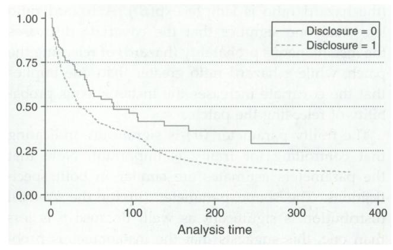

An Empirical Analysis of Software Vendors' Patch Release Behavior: Impact of

Vulnerability Disclosure

Author(s): Ashish Arora, Ramayya Krishnan, Rahul Telang and Yubao Yang

Source: Information Systems Research, March 2010, Vol. 21, No. 1 (March 2010), pp. 115-

132

Published by: INFORMS

Stable URL: https://www.jstor.org/stable/23015522

JSTOR is a not-for-profit service that helps scholars, researchers, and students discover, use, and build upon a wide range of content in a trusted digital archive. We use information technology and tools to increase productivity and .facilitate new forms of scholarship. For more information about JSTOR, please contact support@jstor.org

Your use of the JSTOR archive indicates your acceptance of the Terms & Conditions of Use, available at https://about.jstor.org/terms

INFORMS is collaborating with JSTOR to digitize, preserve and extend access to *Information Systems Research*

Vol. 21, No. 1, March 2010, pp. 115-132 issn 1047-70471 eissn 1526-55361101210110115

doi 10.1287/isre. 1080.0226 ©2010 INFORMS

# An Empirical Analysis of Software Vendors7 Patch Release Behavior: Impact of Vulnerability Disclosure

# Ashish Arora, Ramayya Krishnan, Rahul Telang, Yubao Yang

H. John Heinz III College, Carnegie Mellon University, Pittsburgh, Pennsylvania 15213 {ashish@andrew.cmu.edu, rk2x@andrew.cmu.edu, rtelang@andrew.cmu.edu, yubaoy@andrew.cmu.edu)

A key aspect of better and more secure software is timely patch release by software vendors for the vulnera bilities in their products. Software vulnerability disclosure, which refers to the publication of vulnerability information, has generated intense debate. An important consideration in this debate is the behavior of software vendors. How quickly do vendors patch vulnerabilities and how does disclosure affect patch release time? This paper compiles a unique data set from the Computer Emergency Response Team/Coordination Center (CERT) and SecurityFocus to answer this question. Our results suggest that disclosure accelerates patch release. The instantaneous probability of releasing the patch rises by nearly two and a half times because of disclosure. Open source vendors release patches more quickly than closed source vendors. Vendors are more responsive to more severe vulnerabilities. We also find that vendors respond more slowly to vulnerabilities not disclosed by CERT. We verify our results by using another publicly available data set and find that results are consistent. We also show how our estimates can aid policy makers in their decision making.

Key words: security vulnerability; disclosure policy; patch release time; open source vendors; information security; software vendors; hazard model

History: Sanjeev Dewan, Senior Editor; Gautam Ray Associate Editor. This paper was received on November 1, 2006, and was with the authors 6 months for 2 revisions. Published online in Articles in Advance June 12, 2009.

## 1. Introduction

Information security breaches pose a significant and increasing threat to national security and eco nomic well-being. According to the Symantec Inter net Security Threat Report (Symantec Inc. 2003), firms experienced an average of about 30 attacks per week. Anecdotal evidence suggests that losses from cyber attacks can run into millions of dollars. The CSI-FBI survey (2005) estimates that the loss per company was more than \$500,000 in 2004 and more than \$200,000 in 2005.1

These cyber attacks often exploit software vul nerabilities. Over the last few years, the number of vulnerabilities found and disclosed has increased dramatically. The Computer Emergency Response Team/Coordination Center (CERT) has published more than 2,000 security bulletins for operating systems-related vulnerabilities in 2005 alone and has reported more than 82,000 incidents involving vari ous cyber attacks in 2003. Software vendors, including Microsoft, have announced their intention to increase the quality of their products and reduce vulnerabili ties. Despite this, it is likely that vulnerabilities will continue to be discovered and disclosed in foreseeable future.

One key aspect of better and more secure software is the timely release of patches by vendors for the vulnerabilities in their products. Patch release can be viewed as postsales product support. The following quote highlights the role of patches2:

Developing and deploying patches is an increasingly important part of the software development process.

—Joseph Dadzie, Microsoft Corporation, March 2005.

However, though vendors' incentives to release timely, high-quality software has been well-studied

1 http://www.cpppe.umd.edu/Bookstore/Documents/2005CSISurvey.pdf.

2 Accessed June 19,2005, http://www.acmqueue.org/modules.php? name=Content&pa=showpage&pid=287.

(Krishnan et al. 2000), their patch release behavior is an underinvestigated component of overall software quality and security (Arora et al. 2006a). The issue of patches has also gained prominence because of the public disclosure of vulnerabilities. Typically, once a vulnerability is made known to the vendor, the ven dor is expected to release a timely patch. However, not everyone sees the vulnerability disclosure pro cess as working well. Many users believe that ven dors are not responsive enough and that their patches are of poor quality. As a result, some in the informa tion technology (IT) community disclose vulnerability information on discovery, even before the patch is out. The argument is that quick disclosure increases public awareness, makes public the information needed for users to protect themselves, puts pressure on the ven dors to issue patches quickly, and, over time, results in better quality software. This belief fuelled the cre ation of full-disclosure mailing lists such as Bug traq by SecurityFocus in late 1990s. However, many believe that vulnerability disclosure, especially with out a good patch, is dangerous because it leaves users defenseless against attackers.3 Richard Clarke, Pres ident George W. Bush's former special advisor for cyberspace security, criticizing full disclosure said: "It is irresponsible and sometimes extremely damaging to release information before the patch is out."4

Vulnerability disclosure is a critical issue for soft ware vendors, IT managers, and policy makers who have to devote significant resources to release patches, implement patches, and manage information dissem ination, respectively. CERT, an influential nonprofit organization and probably the most important con duit for disclosing vulnerabilities, favors a cautious approach to vulnerability disclosure. After learning of a vulnerability, CERT contacts the vendor(s) and pro vides a time window, which we refer to as the "pro tected period," within which the vendor(s) should release the patch for the vulnerability. The declared policy (and the de facto policy since October 2000) is to give vendors a 45-day "protected period." Typ ically, the vulnerability is disclosed when the period ends or when a patch is made available, whichever comes first. Other organizations have proposed their own policies. For example, Organization for Inter net Safety (OIS), which represents a consortium of 11 software vendors, has suggested its own guidelines (mainly that the vendors be given 30 days).5 In addi tion, firms such as iDefense and TippingPoint/3Com buy vulnerability information from users for their clients and have their own policies for disclosing vulnerabilities.

There are theoretical models of how disclosure poli cies affect software vendors' patch release behavior (see Arora et al. 2008 for details), but there is little empirical research on vendors' patch release behavior in general and of the impact of disclosure in particu lar. A sensible disclosure policy is possible only if we can quantify vendors' response to disclosure. Thus, the major goal of our paper is to empirically estimate (i) the key factors that affect vendors' patch release decisions, and (ii) whether actual disclosure induces vendors to release the patch faster and by how much.

We compile a unique data set of 420 vulnerabilities, published by National Vulnerability Database (previ ously the NISTICAT METABASE) from September 26, 2000 to August 11, 2003. Because a vulnerability may involve more than one vendor, our empirical analysis is based on 1,429 observations, each involving a vul nerability vendor pair. For each vulnerability vendor pair, we gather information on when the vendor was notified, if and when a patch was made available,6

3 One of the recent examples is vulnerability of Cisco IOS (Inter network Operating System, the OS that runs Cisco's routers and some of its switches). The exploitation techniques for this vulnera bility were disclosed at a Black Hat conference in July 2005 by an individual researcher. This provoked a lawsuit from Cisco against the researcher and the conference organizers as well as an injunc tion to prevent further public discussion. Customers were warned by Symantec that information revealed at the conference "repre sents a significant threat against existing infrastructure currently deployed" (Information Week 2005, http://www.informationweek. com/news/security/showarticle.jhtml?articleid=166403842).

4 See http://www.govtech.com/gt/article/18179.

5 Members include @stake, BindView, Caldera International (The SCO Group), Foundstone, Guardent, Information Security Systems (ISS), Microsoft, National Associates (NAI), Oracle, Silicon Graph ics, Inc. (SGI), and Symantec. For more details, see http://www. oisafety.org.

6 A software patch can be an upgrade (adding increased features), a bug fix, or a new hardware driver or update to address new issues such as security or stability problems. Most patches are free to download. In some cases, customers need to purchase and install a new version.

if and when the vulnerability was publicly disclosed, the nature and severity of the vulnerability and ven dor characteristics.

We find that disclosure increases the vendor's patch release speed considerably. A vendor is nearly two and a half times more likely to patch after disclo sure than before. In particular, if a vulnerability is disclosed instantly (i.e., at the same time that the ven dor is informed of it), then on average the patch comes out 35 days earlier than without disclosure. We find that open source vendors patch more quickly than closed source vendors and severe vulnerabili ties are patched faster. More interestingly, we find that vendors respond more expeditiously to vulner abilities disclosed by CERT. This potentially reflects the stronger lines of communication between CERT and vendors, the value of the vulnerability analy sis by CERT, and, more important, the reputation of the source in interacting with the vendor. We also do an external validity check by using data collected by another source and find that results are consistent with our estimates.7

The rest of the paper is organized as follows. Sec tion 2 reviews the related literature. Section 3 sets out a model of vendors' patch release decisions, §4 pro vides a description of the data and variables, and §5 presents the empirical model and the estimation results. We conclude and discuss limitations of this research in §6.

# 2. Literature Review

Our work draws from multiple literature streams. The first is the literature on software quality. Krishnan et al. (2000) show that better personnel, more use of computer-aided software engineering (CASE) tools, and more upfront investments in planning and design can improve product quality Banker et al. (1998) focus on ex post software support—namely, software maintenance—and examine how complexity and pro grammer capabilities affect maintenance costs. How ever, patch release behavior has not been studied.

The second stream of work we draw from is the literature on economics of information security. Anderson and Moore (2006) provide a good overview of the issues related to economics of information security, including software vulnerabilities. Several papers in the literature examine the effects of creat ing a market for vulnerabilities. Camp and Wolfram (2000) describe how a market for vulnerabilities may be created to increase the security of systems. Kannan and Telang (2005) use a formal model to examine whether a market-based mechanism is better than the setting in which a public agency like CERT acts as an intermediary. They show that markets always per form worse than CERT because privately optimal dis closure rules are socially suboptimal. Along the same lines, Ozment (2004) analyzes how auctions perform in such markets.

Recently, some attention has been paid to issues related to vulnerability disclosure and vendor patch release. Choi et al. (2005) model a firm's decisions on upfront investment in the quality of the soft ware to reduce potential vulnerabilities and whether to announce vulnerabilities and whether to apply a patch. They also model a rational consumer's decision on whether to purchase the software. Nizovtsev and Thursby (2007) model the incentives of users to dis close software vulnerabilities through an open public forum and derive conditions under which instant dis closure is socially optimal. August and Tunca (2006) examine the role of patching by end users and how unpatched users exert externalities on other users. Png et al. (2006) model a game between users and attackers. They show that externalities cause users to underinvest in security and they suggest policy measures to remedy the problem. Telang and Wattal (2007) show through an event study that disclosure of vulnerability information lowers the stock prices of software vendors, especially if a patch is not released at the same time, which suggest that disclosure is costly to vendors.

Our paper is more directly related to Arora et al. (2008) and Cavusoglu et al. (2004) who analyze vul nerability disclosure policy. In both, the threat of dis closure conditions when the vendor releases a patch. However, our focus in this paper is on the impact of disclosure itself, rather than on the threat of disclo sure. Another key distinction of our paper is that most of the work in the area of economics of information security is analytical and theoretical in nature. In con trast, our paper brings data to some of these theories.

7 Brian Krebs of The Washington Post collected and posted data on Microsoft patching times on his website (http://blog. washingtonpost.com/securityfix/2006/01/a\_time\_to\_patch.html).

# 3. Vendor's Patch Release Decision

A software vendor makes two decisions in the patch release process. First, it decides the initial patch release time when it learns about the vulnerability. At some point, the vulnerability may be disclosed. If the vendor has not come up with a patch by the disclosure time, then it needs to make a second deci sion on whether and how much to accelerate the patch release. The influence of disclosure, the sub ject of this paper, refers to the second decision. More precisely, we estimate if and how disclosure affects patch release time relative to the baseline (the first decision).

Fully characterizing a software vendor's patch release decision (a stochastic dynamic programming problem) is beyond the scope of this paper (whose focus is primarily empirical). However, the under lying intuition of how disclosure and other factors condition the vendor's patch release decision can be illuminated with a simple model. In this model, we compare the vendor's incentives to release the patch in two cases, one where the vulnerability has been disclosed and the other where it may be disclosed in the future.

The vendor faces two types of costs in deciding when to release the patch. The first is the direct cost of developing a patch. To develop a patch, the vendor commits resources. All else equal, the faster a patch is released, the more it costs. Thus, if the patch release time is r (measured from the time when the vendor was informed of the vulnerability), the cost of patch development is C(r;Z), where Z represents vendor characteristics such as size. We expect that C(r) is decreasing in r.

Second, the vendor's customers suffer losses if that vulnerability is discovered and exploited by attackers. Let the expected total customer loss be represented by a function L(r; X), where X are exogenous factors that condition customer loss such as the vulnerability severity. Unlike other products, the product liability laws do not apply to software. Thus, we assume that a vendor internalizes a fraction A of customer losses potentially because of loss of reputation, loss of future sales, and contractual service obligations. The vendor chooses the patch release time r to minimize

$$V = C(\tau) + \lambda L(\tau; X).$$

The analysis for two polar cases is helpful. First, if the vulnerability has not been disclosed, attack ers may discover the vulnerability on their own or a third party (researchers, users, or even other vendors) may disclose the vulnerability at a future date z.8 The vendor releases the patch because he is threatened with disclosure in the future. In this case, L(r, X) = Ez[Z(r — z; X)], where Z(r — z; X) is the loss suffered by users if attackers discover the vulnerabil ity at time z. Because z is uncertain, we take expecta tions over z.

Now, consider the second case where the vulnera bility has been disclosed at time zero. Disclosure will reveal the vulnerability to attackers with certainty. In this case, L(r, X) = Z(r, X), there is no uncertainty unlike the first case. We show in Appendix A that, all else equal, the total customer loss will be higher if the vulnerability has been disclosed than if the attackers have to find it for themselves (as is the case when dis closure is uncertain). We also show that the marginal benefit of releasing the patch will be higher when the vulnerability has been disclosed than when the vul nerability is still a secret. It follows that the vendor will release the patch faster when the vulnerability has been disclosed versus otherwise. This intuition should carry over to the more realistic but also more complicated setting where the vendor can adjust the target patch release time as events unfold.

To anticipate our empirical exercise, we expect that the instantaneous probability of releasing the patch should increase after disclosure. Formally, we state the following.

Hypothesis 1 (HI). Disclosure reduces the software vendor's patch release time.

Next, we briefly discuss the factors that condition the baseline rate of patch release. We hypothesize (and the Appendix A sketches out the proof) that factors that increase patch development costs should increase the patch release time, and the factors that increase customer losses should decrease the patch release time. In the following, we identify some key factors that affect a vendor's patch release time. Note that we do not actually observe C and L and, hence,

8 Disclosure increases customer loss L(r, X) because disclosure makes it easier for the attackers to find the vulnerabilities (see Arbaugh et al. 2000, Arora et al. 2006b for details).

our model should be interpreted as reduced form in nature.

Vendor Size: Large vendors typically have higher sales volume and a large customer base (not directly controlled for in our analysis), which implies higher customer loss from vulnerability disclosure. Large vendors may also care more about reputation loss because of the spillover effect on other products sold by the vendor. Hence, larger vendors may have a higher  $\lambda$ . Large vendors may also release the patch faster if they are better able to afford larger patch development teams. Because patch development costs do not vary significantly with the number of software users, the model suggests that large vendors should release the patch faster than smaller vendors (both because of higher L and higher  $\lambda$  and perhaps because of the lower marginal cost of patch release). Thus, we hypothesize as follows.

HYPOTHESIS 2 (H2). Larger vendors release patches faster than smaller vendors.

Severity of Vulnerability: The severity of a vulnerability is a multifaceted concept. The availability of an exploit tool or exploit code, the ability to exploit the vulnerability remotely, the number and importance of systems affected by the vulnerability, and the level of control gained by a successful exploit all imply a higher severity. It is plausible that each of these factors increases the loss users suffer. It is also very likely that the loss per unit time to which users are exposed is higher for more severe vulnerabilities. It follows that severe vulnerabilities necessitate quicker patches.

Hypothesis 3 (H3). Vendors release patches more quickly for more severe vulnerabilities.

There is ample evidence that the credibility of information depends on its source and also on who validates it. It is likely that vendors respond more quickly to vulnerabilities disclosed by CERT because it enjoys a strong reputation and its pronouncements have more visibility with customers as well. In part, CERT's pronouncements are taken more seriously than other sources because CERT staff investigates the vulnerability before contacting vendors. Identifying this CERT effect is tricky because it is plausible that vulnerability-specific unobserved effects may also be correlated with whether CERT handles (publishes)

the vulnerability. For example, CERT may handle only important vulnerabilities. To capture the credibility and visibility that CERT has in the community, we focus on the vulnerability published by both CERT and SecurityFocus (in our sample, a majority of the vulnerabilities are published by both). Within this set of vulnerabilities *published* by both CERT and SecurityFocus, we compare patch release times for vulnerabilities disclosed by CERT to those disclosed by SecurityFocus or other parties. Thus, our approach controls for the potential selection bias that may arise from unobserved heterogeneity. See the following hypothesis.

HYPOTHESIS 4 (H4). Vendors respond faster to the vulnerability disclosed by CERT than by other parties.

Open Source Vendors: A stream of work has argued that open source vendors provide better quality and are more responsive to customers (Wheeler 2002). A typical argument presented is that because open source code is viewed and reviewed by many, it is inherently of good quality. Similarly, bug reports in open source projects are also acted on quickly because many users are constantly paying attention to them. Thus, we hypothesize as follows.

Hypothesis 5 (H5). Open source vendors release patches faster than closed source vendors.

## 4. Data and Variables

### 4.1. Data Sources

The vulnerabilities studied in our research are from the two most important sources of information on vulnerabilities, CERT and SecurityFocus. CERT publishes information on a wide variety of software vulnerabilities in the form of "CERT Vulnerability Notes." SecurityFocus hosts a well-known full disclosure mailing list, Bugtraq, for the detailed discussion and announcement of software vulnerabilities. Both CERT and SecurityFocus cross-reference their vulnerability databases with the National Vulnerability Database (NVD) through the Common Vulnerabilities and Exposures (CVE) catalog. The NVD tracks a large number of security problems, but not all CERT or SecurityFocus vulnerabilities meet its criteria of

&lt;sup>9 The CVE name is the 13-character ID used by the "CVE" group to uniquely identify a vulnerability.

being listed in the database. For the purpose of our empirical analysis, we consider only the NVD-listed vulnerabilities that are published by CERT, Security Focus, or both. Because a vulnerability may affect many products, our unit of observation is a vendor vulnerability pair. We augment these data by adding information about whether and when patches were released, using a variety of sources including ven dor websites. We also collect data on vendor size and other characteristics from vendor websites and from Hoover's online database (http://www.hoovers.com).

# 4.2. CERT vs. SecurityFocus

The vulnerability publications of CERT and Secu rityFocus follow different processes. Upon receiv ing a vulnerability report from an identifier, CERT researches the vulnerability; for vulnerabilities that meet its criteria, CERT contacts the affected vendor(s) and coordinates patch development before making the vulnerability public, i.e., by publishing it. On aver age, about 3,000 vulnerabilities per year get reported to CERT and only about 10% are published. CERT reports a list of affected vendors for each vulnerabil ity. Additional summary information is provided for each vendor as well, including the date when CERT notified the vendor.

A vendor typically responds to the CERT vulner ability notification in one of the following forms: (i) acknowledging the presence of the vulnerabil ity and collaborating with CERT to release a patch, or (ii) contending that the product(s) in question is not vulnerable, in which case CERT just lists the vendor as not vulnerable or as vulnerable without a patch. If a vendor chooses not to respond, CERT records the vendor as vulnerable without a patch or as vulnerable status unknown, as appropriate.

SecurityFocus does not require advance notifica tion to the affected vendors before the vulnerability is made public. However, the discoverer of the vul nerability may choose to notify the vendor before reporting it to SecurityFocus. Our data show that in about 35% of cases when a vulnerability is published by SecurityFocus, the identifiers informed the ven dors prior to the disclosing it on SecurityFocus. Fur thermore, the identifiers tend to include the vendor notification date and sometimes the notification itself into their vulnerability reports to SecurityFocus.10 When a vulnerability is published by SecurityFo cus, the affected vendors can post their solutions to the Bugtraq mailing list. Sometimes, a reference to a vendor's solution published elsewhere is posted to Bugtraq by others.

To summarize, there are three differences between CERT and SecurityFocus in terms of the publica tion of vulnerability and its disclosure. First, the vul nerability information published by SecurityFocus is from the discussion on the Bugtrag mailing list and vendor statements, while CERT researchers perform additional research that is eventually published in its "vulnerability notes." Second, CERT notifies vendors before publishing information and provides them with a protected period, typically 45 days. Though an identifier of a vulnerability may also notify the ven dor before posting the vulnerability information on SecurityFocus, SecurityFocus generally does not con tact the vendor itself. The default in SecurityFocus is instant disclosure. Third, CERT has a well-established relationship with many software vendors and, there fore, can communicate its information to the right person at the vendor. Overall, compared to Security Focus, CERT is more selective about the vulnerabili ties it publishes. CERT publishes information that has undergone greater prepublication scrutiny, communi cates with vendors regularly, and provides them with a longer protected period.

## 4.3. Sample Generation

From September 26, 2000 to August 11, 2003, the NVD documented a total of 2,820 vulnerabilities, which were published by CERT, SecurityFocus, or both. Out of this, 139 vulnerability notes are published by CERT alone and 354 vulnerabilities are published by both. The remaining vulnerabilities are published by SecuritfyFocus only. From this, we randomly sam pled 131 vulnerabilities. To ensure a representative sample of vulnerability from each year of this time period, we use a stratified sampling technique where the strata are the years in which the vulnerabilities were disclosed.

10 Some of the original postings of the discoverers have recently been removed by SecurityFocus from the vulnerability Web pages but were available at the time we collected the data.

For some of the vulnerabilities published by both CERT and SecurityFocus, discrepancies were found between the reports published by SecurityFocus and CERT. For example, CERT tends to have a longer list of vulnerable vendors. For the empirical analy sis, we have included all the vendors that are listed as vulnerable by CERT When the discrepancy con cerns the date a vulnerability is known to be public, we have used the earlier date as the date of disclosure.

In all, this resulted in a sample of 624 vulnerabili ties: 354 vulnerabilities are published by both Security Focus and CERT, 139 are published by CERT alone, and 131 are published by SecurityFocus alone. A total of 643 vendors are affected by these vulnerabilities, resulting in 4,874 observations. Of these, 2,944 obser vations involved vendors that were listed as "not vul nerable" or "vulnerable status unknown" by CERT We dropped these observations and retain only those vendors listed as vulnerable by CERT. This resulted in 596 vulnerabilities and 1,930 observations. From this, we dropped observations where the vendor noti fication date or the patch release date cannot be determined (see §5.2 for more details). Further inves tigation revealed that 18 vulnerabilities had been dis closed (by other sources) before year 2000, although they were officially published by CERT, SecurityFocus, or both, after September 26, 2000. We dropped these vulnerabilities from our sample as well. Our final sam ple contains 420 distinct vulnerabilities. A total of 310 vendors are affected by these vulnerabilities. These constitute 1,429 observations, of which 158 observa tions come from SecurityFocus alone involving 57 ven dors and 89 vulnerabilities (i.e., CERT did not publish them at all), and 99 observations come from CERT alone involving 52 vulnerabilities and 37 vendors (i.e., SecurityFocus did not publish them all). The rest were jointly published by both.

## 4.4. Definition of Important Terms

Vendor Notification. Vendor notification is defined as the date that a vendor is notified of the vulnerability. CERT provided information to us (as well as in its vulnerability notes) about when it contacted vendors. For SecurityFocus, if the identifier contacted a ven dor, the vendor notification date is available. In the absence of advance notification, vendor notification is assumed to take place when the vulnerability is first made public by sources other than the vendor itself.11 Therefore, in such cases, disclosure and vendor noti fication are assumed to take place on the same day.

Vulnerability Publication. Vulnerability publica tion is the date when CERT or SecurityFocus pub lishes information about a vulnerability on its web site. Note that publication is only one of the ways in which a vulnerability is disclosed. Sometimes, some third parties (including some other vendors) disclose information on other forums, which is later published by CERT or SecurityFocus.

Patch Release Time. The patch release time is our dependent variable, measured as the number of days elapsed between the vendor notification date and the path release date. The information on whether and when a vendor released a patch is obtained from the vendor's response to CERT notification for vulnerabil ities published by CERT. For a vulnerability published by SecurityFocus alone, we determined the patch release date through a variety of sources, including the vendor's announcement of advisory on the vul nerability, release notes of the patch, and time stamps of the patch. Though we have exercised great care in collecting information on patch release times, mea surement error is possible. However, measurement error in the dependent variable does not introduce bias in the estimation (Green 1992).

Vulnerability Disclosure. We define disclosure as the event when information about the vulnerability becomes public. Disclosure can happen when CERT or SecurityFocus publish information about the vul nerability. However, the vulnerability information can be made public by other parties as well. The sources of disclosure include SecurityFocus, CERT, and third parties such as researchers or other vendors. CERT vulnerability notes provide information on the date the vulnerability was known to be public.

In our paper, disclosure is defined as a dummy variable such that disclosure of vulnerability i for ven dor j at time t takes value one if vulnerability i is disclosed before time t and vendor j has not released a patch for it, and zero otherwise. Whenever vulner ability information is made public by anyone before

11When the vulnerability is first made public by a vendor itself, the true notification date and therefore the patch release time cannot be determined. As noted earlier, these observations are excluded from the final sample.

the patch has been released, the vulnerability is dis closed. Note that, by definition, disclosure is a time varying variable. For a vulnerability i and vendor j, if the vendor is notified at t0, disclosure happens at time t1 and patch is released at t such that t0 <tx &lt; t. Then, disclosure — 0 before txand disclosure = 1 after tv There are two extreme cases as well. The observations with disclosure always equal to one (disclosure hap pens at the same time as the vendor is notified) are referred to as instant disclosure. Observations with dis closure always equal to zero (vulnerability is made public at the same time as the vendor release a patch) are referred to as no disclosure. Note that, by defini tion, no disclosure observations are always patched.

For the same vulnerability, disclosure conditions may vary across vendors. For instance, a vendor may have released the patch 10 days after notification and posted this information on SecurityFocus, which would constitute disclosure for other vendors that are also affected by the same vulnerability but have not yet released a patch.

## 4.5. Example of a Vulnerability

Before we proceed, we provide an example of how we coded a vulnerability. Consider the vulnerabil ity ID CVE-2001-0803 (CERT VU 172583; Security Focus Bugtraq 3517). This vulnerability was originally discovered by Chris Spencer of the Internet Security Systems (ISS) X-Force, and CERT was notified. The vulnerability is "remotely exploitable buffer overflow exists in the common desktop environment (CDE) subprocess control service (dtspcd). An attacker who successfully exploits this vulnerability can execute arbitrary code as root." It is rated with a Common Vulnerability Scoring System (CVSS) severity score of 10 out of 10 by the National Vulnerability Database.

The CERT report listed eight vendors to be vul nerable to this vulnerability. CERT issued formal notification on October 29, 2001 to all the vendors that were potentially affected by this vulnerability. The vulnerability was published by SecurityFocus on November 6, 2001, which essentially disclosed this vulnerability and CERT eventually published the vul nerability on November 12, 2001. All vendors affected by this vulnerability released patches. Patch release dates and times are summarized in Table 1. In this example, disclosure is zero for IBM. For the rest, it is zero before November 6, 2001, and one thereafter.

Table 1 Vendors for Vulnerability CVE-2001 -0803

|                              |                    | Patch release |
|------------------------------|--------------------|---------------|
| Vendor                       | Patch release date | time (days)   |
| Compaq Computer Corporation  | 09-l\lov-01        | 11            |
| Hewlett-Packard Company      | 07-Nov-01          | 9             |
| IBM                          | 30-0ct-01          | 1             |
| SGI                          | 07-Nov-01          | 9             |
| Sun Microsystems Inc.        | 12-l\lov-01        | 14            |
| The Open Group               | 10-l\lov-01        | 12            |
| The SCO Group (SCO UnixWare) | 06-l\lov-01        | 8             |
| Xi Graphics                  | 09-l\lov-01        | 11            |
|                              |                    |               |

Notification: 29-Oct-OI; Disclosure: 06-I\lov-01; CERT publication 12-Nov-01

# 4.6. Descriptive Statistics

Patch Release Time and Disclosure. Statistics on patch release times and disclosure for the final sample are presented in Table 2. Note that a significant num ber of vulnerabilities are instantly disclosed in our sample. This may appear surprising, but many vul nerabilities are publicly announced first, picked up by CERT later, and patched by the vendors later.

Severity. We use the CVSS score published by the NVD as our measure of vulnerability severity, which is a number between 0 and 10.12 For example, the vulnerability highlighted in the vulnerability example has a severity score of 10. The CVSS score reflects sev eral factors, including the ease of exploitation of the vulnerability, the estimated number of affected sys tems, and the impact of the vulnerability.13 In par ticular, the availability of an exploit tool or exploit code, the ability to exploit the vulnerability remotely, the number and importance of systems affected by the vulnerability, and the level of control gained by a successful exploit all imply a higher severity metric. Table 3 summarizes the severity of the vulnerabil ity measured by the CVSS score and the number of affected vendors per vulnerability.

Publication Source. We classified the vulnerabilities in our data set into three groups: (i) vulnerabilities

12 CERT also has its own severity rating. Our results are similar using either metric, but the CERT metric is available for only a subset of vulnerabilities.

13 Detailed information about the CVSS score can be found at http:// www.first.org/cvss/and http://nvd.nist.gov/cvss.

Table 2 Statistics on Patch Release Time and Disclosure

| Patch release time (in days)                                      |               |
|-------------------------------------------------------------------|---------------|
| Mean                                                              | 51.40 (95.47) |
| Median                                                            | 18            |
| Percent of patched by end of sample period                        | 90            |
| Disclosure time (in days) (of the observations facing disclosure) |               |
| Mean                                                              | 8.65 (30.54)  |
| Percent of no disclosure                                          | 14.91         |
| Percent of instant disclosure                                     | 66.13         |

Notes. N = 1,429. Standard errors are in parentheses.

published by both CERT and SecurityFocus, (ii) pub lished by CERT only (but not published by Security Focus), and (iii) published by SecurityFocus only (but not by CERT). The statistics of the three groups are presented in Table 4.

As seen from the first row in Table 4, a vulnerability is patched with higher probability if it is published by both sources. This possibly captures the fact that more important vulnerabilities are published by both sources.

SecurityFocus is well known for its instant disclo sure policy, but not all vulnerabilities published by SecurityFocus are instantly disclosed, as can be seen from the disclosure time in Table 4. The reason is, as we have discussed above, that some of the identi fiers may choose to notify the affected vendors before they report the vulnerability to SecurityFocus. On the other hand, though CERT has a stated 45-day dis closure policy, in many instances the vulnerabilities get disclosed much earlier. Some reasons for this one (i) not all vendors are notified at the same time, per haps because it takes time to determine if a vendor is vulnerable—in some cases, this may result in a vendor being notified when the vulnerability is publicly dis closed; (ii) CERT may disclose the vulnerability before the 45-day period if more than 80% of the vulnerable

Table 3 Vulnerability Severity Metric

|                       | Mean | Std. dev. | Median | Min | Max |
|-----------------------|------|-----------|--------|-----|-----|
| Severity              | 5.96 | 2.42      | 7      | 1.9 | 10  |
| Number of affected    | 3.55 | 7.69      | 1      | 1   | 93  |
| vendors/vulnerability |      |           |        |     |     |

Note. I\l= 420.

Table 4 Statistics Conditioned on Source of Publication

|                                                               | Published by CERT alone | Published by SecurityFocus alone    | Published by both |
|---------------------------------------------------------------|----------------------------|-------------------------------------------|----------------------|
| Percent of patched (%)                                        | 81.82                      | 62.66                                     | 94.54                |
| Percent of no disclosure (%)                                  | 5.05                       | 15.19                                     | 15.70                |
| Disclosure time (of the observations facing disclosure) | 2.55 (12.66)               | 3.35 (13.46)                              | 9.95 (33.16)         |
| Severity                                                      | 5.85 (2.23)                | 5.59 (2.16)                               | 6.10 (2.52)          |
| Observations/vuls                                             | 99/52                      | 158/89                                    | 1,172/279            |
| Patch release time (of the patched observations)        |                            | 46.05 (78.91) 70.88 (122.52) 50.05(93.70) |                      |

Note. Standard errors are in parentheses.

vendors have the patch ready;14 and (iii) while CERT tries to keep the vulnerability confidential during the protected period, a vulnerability can be disclosed by others such as SecurityFocus or a vendor.

Disclosure Source. As discussed, we distinguish between vulnerability disclosure and vulnerability publication. In the case of vulnerability CVE-2001 0803 discussed earlier, the disclosure was done by SecurityFocus. The key difference is that the disclo sure source is unique and refers to the entity that first makes the vulnerability public. By contrast, a vulner ability may be published by more than one entity. As noted, publication sources for our sample are con fined to CERT and SecurityFocus.

In Table 5, we include only those vulnerabilities that are published by both SecurityFocus and CERT. As reported in Table 4, this constitutes 279 vulnera bilities and 1,220 observations. Table 5 provides key descriptive statistics by the source of disclosure for this subsample.

Vendor Characteristics. We include vendor size (measured as number of employees) and a dummy variable for whether the vendor is an open source vendor. The total number of vulnerable vendors in our sample is 310. However, we found reliable information for only 142 of them. The others are mostly small or foreign vendors and we code them as a dummy variable, small, which takes value one for observations where firm size is missing. In the empirical analysis, we interact (1 — small) with size

14 Conversations with CERT staff suggest this possibility.

|                                                            | CERT          | SecurityFocus  | Others         | No disclosure |
|------------------------------------------------------------|---------------|----------------|----------------|---------------|
| Patched and unpatched observations                         |               |                |                |               |
| Percent patched (%)                                        | 97.06         | 90.89          | 94.44          | 100           |
| Disclosure time (of the observations facing disclosure) | 20.40 (44.26) | 7.02 (28.41)   | 2.21 (19.20)   | N/A           |
| Severity                                                   | 6.88 (2.83)   | 5.95 (2.55)    | 6.12 (2.34)    | 6.40 (2.63)   |
| Obs/vulsa                                                  | 281/28        | 527/183        | 180/52         | 184/48        |
| Patched observations only                                  |               |                |                |               |
| Patch release time                                         | 54.93 (95.69) | 49.34 (100.07) | 61.00 (110.59) | 34.46 (39.47) |

Table 5 Statistics Conditioned on Disclosure Source for Vulnerabilities Published by Both CERT and SecurityFocus

Note. Standard errors are in parentheses.

when estimating the impact of employee size.15 The reported statistics in Table 6 are averaged over only those vendors for which information is available.

Year of publication. Finally, the number of vul nerabilities published in each year is summarized in Table 7.

We also include a dummy for operating systems related vulnerabilities and a dummy for server appli cations to account for differences across products and applications that may affect patch release times.

# 5. Empirical Strategy

Our goal is to examine the impact of exogenous fac tors, including disclosure at time t, on the patch release time. Note that running a linear regression of patch release time on disclosure is misleading because of the definition of disclosure (disclosure can happen only before a patch). Thus, we estimate a conditional hazard model that estimates how disclosure affects the probability of the vendor releasing a patch, given that the vendor has not released patch until then. Conceptually, this is similar to comparing the patch release time of two vendors who have not patched until time t, but one of them faces disclosure at time t and the other does not.

We use a proportional hazard model, which is widely used in management science and economics (Kalbfleisch and Prentice 2002). In our case, an obser vation is considered as an event under risk following vendor notification at some time (f0). The event is con sidered "failed" when the vulnerability is patched at some time (t). The regressors shift the baseline haz ard rate proportionally. The key to note in our case is that disclosure is a time-varying covariate. Thus, if disclosure happens at some time tx before the patch release, then disclosure = 0 before t1 and disclosure = 1 after tv

Let A, (f) denote the hazard rate of patch release for vulnerability i at time t. Then, the proportional haz ards model (PHM) is

$$\lambda_i(t, X, \beta) = \lambda_0(t) \exp(\beta X), \tag{1}$$

where A0(f) is the baseline hazard rate at time t, /3 is the vector of coefficients to be estimated, and X is a vector of vulnerability-specific or vendor specific characteristics. Disclosure is time-varying but the other covariates (see §4.4) do not change with time.

To control for unobserved heterogeneity across ven dors, we also consider a frailty hazard model (Vaupel et al. 1979). The frailty hazard model function is spec ified as follows:

$$\lambda_{ij}(t, X, \beta) = \lambda_0(t) \exp(\beta X + e_j), \qquad (2)$$

Vendor Characteristics

|                                 | Mean  | Std. dev. |
|---------------------------------|-------|-----------|
| Vendor employee size (in OOO's) | 17.60 | 66.12     |
| Open source                     | 0.23  | 0.42      |

Note. N = 142.

aThe sum of vulnerabilities reported is 324, which is greater than 294, the number of vulnerabilities published by both SecurityFocus and CERT. The explanation for the apparent discrepancy is that disclosure conditions, including disclosure source, may vary for the same vulnerability across vendors. As a result, the same vulnerability may feature more than once in Table 5.

15 Alternative specifications (in which vendors with missing size information were given a value of zero) yield similar results.

Table 7 Number of Vulnerabilities Published in Each Year

| Number of vulnerabilities | First known to be public |
|---------------------------|--------------------------|
| 64                        | 2000                     |
| 170                       | 2001                     |
| 123                       | 2002                     |
| 63                        | 2003                     |

where i indexes vulnerability and j indexes vendor and e -= log(z;). The term z is unobserved frailty and is assumed to be gamma distributed with mean 1 and variance cr1 where the variance is to be estimated. The frailty model is akin to a "random-effects" model, where a random variable z is fixed within the group of interest but varies across different groups according to a distribution. To control for vendor-specific unob served, we let z remain fixed within vendors. The idea is that the vendors may have specific patch release policies that affect their patch release decisions but are unobserved by us.16

Before proceeding to the estimations, in Figure 1 we present the Kaplan and Meier (1958) estimate of the survivor function or the probability of survival (no patch) past time t, with and without disclosure. It is clear from Figure 1 that the patch release probabil ity is higher for disclosed vulnerabilities. By day 50 after notification, almost 75% of the vulnerabilities are patched if disclosure has taken place, and fewer than 50% are patched if no disclosure has taken place.

# 5.1. Results and Discussion

There are two ways to estimate the models in Equa tions (1) and (2). We can either specify the base line hazard function (A0) parametrically (e.g., as a Weibull distribution) or characterize it nonparametri cally, as in the Cox proportional model (Cox 1975). Parametric hazard forms are easier to work with, especially for prediction. Nonparametric forms, how ever, require fewer restrictions.

We report estimates for models (1) and (2) by the maximum likelihood method, assuming that the base line hazard has the form of Weibull distribution. The Weibull distribution is a flexible distribution with two parameters y and p and has a baseline hazard of the

Figure 1 Kaplan-Meier Survival Estimates, by Disclosure

form A0 = ypf'1. Parameter y is the scale parame ter and p is the shape parameter that determines the shape of the distribution. We also tried the partial likelihood method with the nonparametric baseline hazard suggested by Cox (1975), which yielded very similar results (see Appendix D where we report the Cox estimates).

First, we estimate the model without distinguish ing between disclosure sources. Later, we distinguish between various disclosure sources. Estimates with and without frailty models are presented in Table 8.

Table 8 Determinants of Patch Release: Estimates (Hazard Ratio)

|                                  | (1) With frailty |      |                                                 | (2) Without frailty |
|----------------------------------|------------------|------|-------------------------------------------------|---------------------|
|                                  |                  |      | Hazard ratio Std. error Hazard ratio Std. error |                     |
| Disclosure                       | 2.45"*           | 0.20 | 2.33***                                         | 0.18                |
| Published by CERT only           | 0.69"*           | 0.08 | 0.70***                                         | 0.08                |
| Published by                     | 0.29"*           | 0.03 | 0.29***                                         | 0.03                |
| SecurityFocus only               |                  |      |                                                 |                     |
| Vendor size (small)              | 0.87             | 0.50 | 0.82*                                           | 0.09                |
| (1 - small) * Ln(vendor size) | 1.04             | 0.02 | 1.02"                                           | 0.01                |
| Open source software             | 1.53"            | 0.26 | 1.37***                                         | 0.11                |
| Ln(severity)                     | 1.23"*           | 0.08 | 1.15"                                           | 0.07                |
| Operating system                 | 1.29***          | 0.10 | 1.31*"                                          | 0.09                |
| Server application               | 1.25***          | 0.09 | 1.22*"                                          | 0.09                |
| Published in 2001                | 1.52"*           | 0.19 | 1.58***                                         | 0.19                |
| Published in 2002                | 2.84*"           | 0.37 | 2.97"*                                          | 0.37                |
| Published in 2003                | 3.15*"           | 0.42 | 3.31"*                                          | 0.42                |
| Ln(p)(shape parameter)           | —0.55"*          | 0.02 | -0.61*"                                         | 0.02                |
| a (frailty parameter)            | 0.30*"           | 0.08 |                                                 |                     |
| Log likelihood                   | -2,850           |      | -2,873                                          |                     |

Notes. Weibull hazard model, N = 1,429. The constant for the proportional hazard model is not identified when hazard ratio is estimated.

16 We also estimated a specification where z was fixed within vul nerabilities instead (recall that a vulnerability affects multiple ven dors), with results that are similar to those reported here.

•Significant at 10% level; "significant at 5% level; "'significant at 1% level.

We report hazard ratios, which are easier to interpret (the hazard ratio is simply exp(/3)). A hazard ratio less than one signifies that the covariate decreases the instantaneous probability (hazard) of releasing the patch, while a hazard ratio greater than one implies that the covariate increases the instantaneous proba bility of releasing the patch.

The frailty parameter (a) is significant, indicating that controlling for frailty is important. Note that the parameters estimates are similar in both speci fications. The shape parameter (p) for the Weibull distribution is significant as well. Because p is less than one, this suggests that the instantaneous prob ability of patch release (given that the vulnerability remains unpatched until then) falls over time (see Fig ure 1 as well).

The key variable of interest is disclosure. The es timated impact of disclosure is large and in an ex pected direction. The instantaneous probability of patch release is almost 2.5 times higher after the vulnerability is disclosed than before. Thus, (HI) is supported. The estimated dummies for CERT alone and SecurityFocus alone are less than one. Because the left-out category is the vulnerabilities published by both CERT and SecurityFocus, this suggests that vulnerabilities published by both sources lead to a quicker patch. This indicates that there are important unobserved differences across vulnerabilities and that the vulnerabilities published by both sources tend to be more important.

Severity is highly significant and in the expected direction, supporting (H3). A unit increase in the log of severity increases the instantaneous probabil ity of patch release by about 23%. Another interpre tation of these estimates is their impact on duration of patch release time instead of on the instantaneous probability of patch release.17 Thus, we can state that a 10% increase in the severity score leads to about 3.6% decrease in the patch release time. Open source

17 These models are known as accelerated failure time models (AFTs). Weibull model allows for both the AFT and the propor tional hazard model. In AFT, the dependent variable is the log of duration (patch release time, in our case). The estimates from the PHP model is = —estimates on AFT \* p, where p is the estimated variance of the error term (estimate on p in 0.57 in our model). Thus, the PHP estimate of 1.23 on severity can be restated as the AFT estimate of - Ln(1.23)/0.57 =-0.36.

vendors also patch significantly faster than closed source vendors. On average, at any given time open source vendors have an instantaneous probability of releasing a patch that is 1.5 times higher than the closed source vendors, which translates to about 50% reduction in average patch release time. Thus, (H5) is supported. Vendor size is insignificant both statisti cally and economically, thus (H2) (that large vendors release patches more quickly) is rejected. Vulnerabil ities in operating systems and in server applications are patched faster. Vulnerabilities that are published in later years (2003 as opposed to 2000) are patched faster. This may reflect the growing awareness among consumers about vulnerabilities and, in turn, more responsive vendors.

We also examine if the impact of disclosure varies with severity or firm size. To do this, we split the sample in low-severity (below median) and high severity (above median) vulnerabilities and see if impact of disclosure is different across the sample. We do the same with firm size. We report these results in Appendix B and find that the impact of disclosure is higher for more severe vulnerabilities. We find no such evidence for the firm size.

While the estimate on disclosure highlights the fact that disclosure increases the pace of patch deliv ery, but we still want to examine how disclosing a vulnerability at different times changes the time to patch. In particular, a policy maker like CERT may be interested in knowing how disclosing vulnera bilities at different times would affect the expected patch delivery times. To accomplish this, we calcu late the predicted expected patch release time with and without disclosure using the estimates of disclo sure in Table 8. Because disclosure is a time-varying covariate, we calculate these predictions for differ ent disclosure times. The calculations and the for mula are derived in Appendix C. The results showing the impact of disclosure at various times on average patching speed are shown in Table 9.

Thus, for a typical vulnerability, if disclosure does not take place before a patch is released, on average the patch will come in about 63 days. However, if the vulnerability has been disclosed immediately, then patch would come in approximately 28 days. Thus, instant disclosure will hasten the patch by almost 35 days. Of course, this does not mean that

Table 9 The Estimated Effect of Disclosure on Time to Release a Patch (in Days)

|                        | Expected patch release time if disclosed | Expected patch release time | Effect of  |
|------------------------|------------------------------------------------|--------------------------------|------------|
| Disclosure             | at time T                                      | without disclosure             | disclosure |
| time T                 | (1)                                            | (2)                            | (2)-(1)    |
| 0 (Instant disclosure) | 28                                             | 63                             | 35         |
| 1                      | 29                                             | 63                             | 34         |
| 2                      | 31                                             | 63                             | 32         |
| 3                      | 32                                             | 63                             | 31         |
| 4                      | 33                                             | 63                             | 30         |
| 5                      | 34                                             | 63                             | 29         |
| 6                      | 35                                             | 63                             | 28         |
| 7                      | 36                                             | 63                             | 27         |
| 8                      | 37                                             | 63                             | 26         |
| 9                      | 37                                             | 63                             | 26         |
| 10                     | 38                                             | 63                             | 25         |

Notes. These calculations are done at the mean value of the covariates in our sample. For example, average employee size and average severity level. The year chosen is 2003; the application is server application; and both CERT and SecurityFocus have published the vulnerability.

instant disclosure is the optimal policy. Recall that disclosure exposes users to much higher risks of attacks until the patch arrives. With instant disclo sure, users are exposed for 28 days. Delayed disclo sure also provides the vendor with time to develop and test the patch. Without additional data on the losses from exposure and the time cost trade-offs in patch development, the optimal disclosure point can not be computed. However, our results provide pol icy makers with a decision tool where some kind of "what-if" analysis can be performed and the expected impact of various disclosure times can be understood and measured. This is the key contribution of our paper.

To test (H4), we estimate the model using the sam ples that are published by both CERT and Security Focus and we include the disclosure source. Recall that in our data, a vulnerability could be first dis closed by CERT, SecurityFocus, or a third party. We include three separate dummies to indicate disclosure by these sources. As before, these dummies are time varying. The reference category is all observations with disclosure equal to zero. We present the results with and without frailty in Table 10.

Table 10 Estimates (Hazard Ratio) with Disclosure Source Included

|                            | (1) With frailty |      |                                                 | (2) Without frailty |
|----------------------------|------------------|------|-------------------------------------------------|---------------------|
|                            |                  |      | Hazard ratio Std. error Hazard ratio Std. error |                     |
| Disclosed by CERT          | 3.91"*           | 0.42 | 3.38***                                         | 0.34                |
| Disclosed by SecurityFocus | 2.34"*           | 0.23 | 2.25***                                         | 0.20                |
| Disclosed by others        | 2.58"*           | 0.31 | 2.58"*                                          | 0.29                |
| Vendor size (small)        | 0.67             | 0.38 | 0.86                                            | 0.11                |
| (1 - small) * Ln(size)  | 1.02             | 0.03 | 1.03"                                           | 0.01                |
| Open source software       | 1.43"            | 0.26 | 1.40***                                         | 0.12                |
| Ln(severity)               | 1.20"            | 0.09 | 1.12*                                           | 0.08                |
| Operating system           | 1.21"            | 0.10 | 1.27*"                                          | 0.10                |
| Server application         | 1.36*"           | 0.11 | 1.32*"                                          | 0.11                |
| Published in 2001          | 1.79"*           | 0.26 | 1.85*"                                          | 0.26                |
| Published in 2002          | 2.92***          | 0.44 | 3.08"*                                          | 0.45                |
| Published in 2003          | 3.63***          | 0.56 | 3.76***                                         | 0.55                |
| Ln(p) (shape parameter)    | -0.51*"          | 0.02 | -0.57"*                                         | 0.02                |
| a (frailty parameter)      | 0.26"*           | 0.08 |                                                 |                     |
| Log likelihood             | -2,306           |      | -2,324                                          |                     |

•Significant at 10% level; "significant at 5% level; '"significant at 1% level. (/V = 1,218).

We find that, all else the same, vulnerabilities ini tially disclosed by CERT have a higher instanta neous probability of releasing a patch. The difference (3.91 — 2.58 = 1.33) captures the true impact of dis closure by CERT over other sources, netting out the effect of unobserved differences across vulnerabili ties. Put differently, the difference in patch release times between vulnerabilities disclosed by CERT and by other sources potentially points to CERT's cred ibility with vendors, research into the vulnerability, and ability to communicate with the right persons inside the vendor organization. Because we identify this effect using the sample of vulnerabilities that are published by both sources, we eliminate possible selection issues. Other estimates are also consistent with results in Table 9, indicating the robustness of our analysis.

## 5.2. External Validity

Brian Krebs of The Washington Post posted some data on Microsoft's patch release times for some vulner abilities on his website (see footnote 6). This addi tional data set provides an opportunity to verify our results. The data covered three years (2003, 2004, and 2005) and Krebs collected the data using public

| Table 11 | Estimates with Microsoft Data (Krebs' |
|----------|---------------------------------------|
|          | Sample, N = 99)                       |

|                | Hazard ratio | Std. error |
|----------------|--------------|------------|
| Disclosure     | 3.05***      | 0.81       |
| Ln(severity)   | 1.53***      | 0.44       |
| Log likelihood | -352.04      |            |

&quot;'Significance at 1% level.

sources as well as directly from Microsoft staff. Krebs also collected data on when Microsoft became aware of each vulnerability (which roughly corre sponds to notification in our terms). Because our data are hand-collected and do not extend beyond 2003, validating our results using third-party data for a later period is useful. Moreover, because these vulner abilities were first published by Microsoft (the ven dor), it adds richness to our sample from the previous section.

The data set collected by Krebs contains 99 vulner abilities, of which 83 were first disclosed by Microsoft itself at the time when it released patches for the vul nerabilities in question. The average severity score is 7.06 and the mean patch release time is 130 days. The remaining 16 vulnerabilities were disclosed before Microsoft could release a patch; 14 were disclosed instantaneously and 2 were disclosed after Microsoft became aware of them. The average severity score is 6.4 with mean patch release time of 62 days for the disclosed vulnerabilities. There are no other covari ates because all observations come from the same vendor.18 We estimate a Cox model (a Weibull model leads to similar estimates).

As is evident from Table 11, the impact of disclo sure in Krebs' sample is large and significant and even greater than the impact estimated in our sam ple. Severity is also significant and in expected direc tion. More severe vulnerabilities lead to a quicker patch. Both of these results are reassuring. Interest ingly, Krebs also shows in a separate sample (which we could not match with the NVD data set and, hence, do not use) that an open source vendor like Mozilla is quicker to patch than Microsoft. This also confirms our estimate on open source.

### 5.3. Robustness of the Estimates

We also perform various other robustness checks. Note that our results are not sensitive to the assump tion of the Weibull distribution because the Cox non parametric specification yields similar results (see Appendix D). Furthermore, controlling for the source of disclosure and for unobserved heterogeneity in vulnerabilities also does not qualitatively affect the results. We also controlled for vulnerability-specific random effect (rather than vendor-specific random effects) and find that the results remain unchanged. We also conducted sensitivity analysis around patch release times by including only patched observations or by dropping patch release times of more than one year. The impact of disclosure remains qualita tively unchanged. In short, we find that the disclosure effect is quite prominent and significant and unlikely to be the artifact of modeling techniques or data col lection strategies. We also tested the assumption of proportionality (which is required in a PHM hazard specification). Though we detected some evidence of nonproportionality in the CERT estimate, after cor recting it the results do not change in any significant fashion.

Endogeneity of Disclosure. One of the issues is whether disclosure is exogenous in our model. For example, are there some systematic variations in vul nerability characteristics that make their disclosure faster and affect the patch release time as well? One big factor would be severity. It is possible that severe vulnerabilities are disclosed earlier and patched faster. However, we control for severity. To detect differ ences between instantly disclosed and noninstantly disclosed vulnerabilities, we present key statistics in Table 12. In general, they do not seem to be very different (if anything, the severity of noninstantly dis closed vulnerabilities is higher). Vendor size is the

Table 12 Comparison Between Instantly and Noninstantly Disclosed Vulnerabilities

|                                 | IMoninstant disclosure Instant disclosure |              |
|---------------------------------|-------------------------------------------|--------------|
| Observations/vulnerabilties     | 484/113                                   | 945/346      |
| CVSS score                      | 5.90 (2.5)                                | 6.03 (2.4)   |
| Vendor employee size (in 000's) | 28.81 (83.2)                              | 17.08 (67.8) |
| Open source (%)                 | 23                                        | 25           |

18 CVE stopped including some vulnerability characteristics for the data in later periods (2003 onward). Therefore, we cannot ascertain easily if the vulnerability pertained to operating systems or server applications and, hence, do not include those dummies.

only difference across the two, which again is explic itly controlled for in our estimation.

Table 12 is reassuring because an instrumental vari able approach (the only option for dealing with endo geneity of disclosure) is extremely difficult in a hazard model (see Belzil 1995, p. 116) and potentially not as reliable as the commonly used two-stage least squares approach. Therefore, we do not pursue it any further.

In this paper, a vulnerability is considered disclosed if CERT published it, if SecurityFocus published it, or if it was already public as reported in CERT data. Usually, large vendors automatically inform CERT or SecurityFocus when they release the patch, or Secu rityFocus picks up that information and publishes it. However, it is conceivable that every time a ven dor releases a patch on its website, it constitutes dis closure for other vendors. To account for this, we estimate our model in Table 10 by adding an addi tional dummy "disclosed by other vendors" (even if this patch release information was not captured by CERT or SecurityFocus). The estimates are pre sented in Appendix E. It can be seen that this estimate is also statistically significant and leads to the same conclusion that disclosure effect and CERT effect are significant.

In our paper, a significant number of vulnerabilities are disclosed instantly. To make sure that our results are not driven by instant disclosure, we re-estimate the model but without the observations with instant disclosure (see Appendix F). The results are again con sistent that disclosure effect is robust and significant.

# 6. Conclusions

In recent times, vulnerability disclosure has become a controversial topic. Vendors, policy makers, and soft ware users have not found consensus about when and how to disclose a vulnerability. Vendors argue for more time and sometimes take steps such as using the courts to stop vulnerability information disclosure. Policy makers like CERT need to decide on reasonable times for vendors to come up with patches. Critical to any such policy is how vendor patch release behav ior is affected by disclosure. To our knowledge, this is the first systematic empirical examination of this question. In particular, a policy maker can use these results to decide how disclosing the vulnerability at any given time will affect a vendor's expected patch release time.

We estimate a proportional hazard model of patch release times from a unique data set that we col lected. We find that disclosure accelerates vendors' patch release times. This verifies earlier conjectures that vendors respond to disclosure. In particular, we find that instant disclosure increases the instant prob ability of patch release by almost 2.5 times. Put dif ferently, compared to no disclosure, instant disclosure will force a vendor to release the patch 35 days ear lier. Severe vulnerabilities are patched sooner than less severe ones, consistent with a rational model in which vendors internalize some of the customers' losses. We can also identify the CERT effect by highlighting that the vendors are more responsive to vulnerabilities dis closed by CERT. This probably reflects the stronger lines of communication between CERT and vendors, the value of the vulnerability analysis by CERT, and hence the reputation of CERT. Open source vendors are quicker to release a patch than closed source ven dors when vulnerability is found in their products. Given the attention on the open source versus closed source debate, this is an important finding because the quality of a software product also depends on the ex post support a vendor provides (Arora et al. 2006a). We also tested our model on a different data set for external validity and find that our results on disclo sure are consistent.

Though our results are interesting, there are quali fications. In particular, our model doesn't control for the patch quality. Additional resources allocated to patch development could result in a higher quality patch than a patch that is released sooner. We test the impact of actual disclosure on vendor behavior but not the impact of threat of disclosure. Future work that can distinguish the impact of actual disclosure from threat of disclosure will be very useful for pol icy makers and vendors. Our model is also reduced form in nature. Future work can estimate more pre cise structural models. Though disclosing informa tion always leads to quicker patches, this does not mean that instant disclosure is optimal. To devise an optimal policy, one also needs to understand how attack propensity changes with disclosure, and under stand the resulting changes in the extent of customer losses. We also need the estimates of the time cost

trade-offs for vendors in patch development. Given the importance of these issues and the paucity of empirical work, we hope that our study paves the way for more research with new and possibly better data sources.

#### Acknowledgments

The author names are in alphabetical order. The authors thank the staff of CERT for data as well as valuable insight into disclosure process. The authors also thank participants in the 2005 Workshop on Economics of Information Security (WEIS), Boston; the 2005 Workshop on Information Systems and Economics (WISE), Irvine; the 2006 International Conference on Information Systems (ICIS), Milwaukee, as well as researchers at the University of Pittsburgh; University of Texas, Austin; American University; and University of Maryland, College Park for their useful feedback. The authors acknowledge generous financial support from Cylab and Carnegie Mellon University. Rahul Telang acknowledges generous support from the National Science Foundation (NSF) through the CAREER Award CNS-0546009.

### Appendix A

The time gap between when attackers discover (or are told of) a vulnerability and when a patch is released is  $\tau-z$ , and customer loss, therefore, is  $l(\tau-z)$ . It is reasonable to assume that customer losses are increasing at an increasing rate in the gap, i.e.,  $l'(\cdot) > 0$  and  $l''(\cdot) > 0$ . It follows directly that  $E_{z < \tau} l'(\tau-z) < l(\tau)$ , where  $E_{z < \tau}$  represents the expectation operator conditional on  $\tau > z$ . It is also reasonable to assume that the cost of patch development falls with the time taken to patch, albeit at a decreasing rate, i.e.,  $C'(\cdot) < 0$ ,  $C''(\cdot) > 0$ . Let  $\tau_{nd}$  be the optimal choice of  $\tau$  when there is no disclosure, and  $\tau_d$  be the optimal choice when the vulnerability has been disclosed. In an interior solution,  $C'(\tau_{nd}) + \lambda E_{z < \tau} l'(\tau_{nd} - z) = 0$  and  $C'(\tau_d) + \lambda l'(\tau_d) = 0$ .

Proof of Hypothesis 1. Because  $l''(\cdot) > 0$ ,  $E_{z < \tau} l'(\tau - z) < l'(\tau)$  for all  $\tau$ . It follows that  $C'(\tau_{nd}) + \lambda l'(\tau_{nd}) < 0$ . Note that  $C''(\cdot) + \lambda l''(\cdot) > 0$ . This implies that  $\tau_d < \tau_{nd}$  because by definition  $C'(\tau_d) + \lambda l'(\tau_d) = 0$ . This shows that the vendor will patch more quickly under disclosure than otherwise

Proof of Hypothesis 2. An increase in size can be modeled as an upward shift in the customer loss function  $l(\cdot)$ . A simple way to accomplish this is to assume a proportionate shift. This is formally equivalent to assuming that larger firms have higher  $\lambda$  values. It is easy to see that an increase in  $\lambda$  will reduce  $\tau$  in both the disclosure and the nondisclosure case.

Proof of Hypothesis 3. The proof follows directly on noting that more severe vulnerabilities imply higher customer losses and, therefore, are formally equivalent to an increase in  $\lambda$ .

Appendix B. Testing if Impact of Disclosure Varies with Severity and Firm Size

|                                                | Frailty model                          |               |                 |                              |  |
|------------------------------------------------|----------------------------------------|---------------|-----------------|------------------------------|--|
|                                                | High severity $(N = 669)$ above median |               | (N =            | severity = 760) median |  |
|                                                | Hazard ratio                        | Std. error | Hazard ratio | Std. error                |  |
| Disclosure                                     | 3.06***                                | 0.36          | 2.00***         | 0.24                         |  |
| Published by CERT only                         | 0.62*                                  | 0.18          | 0.73**          | 0.10                         |  |
| Published by SecurityFocus only                | 0.37***                                | 0.09          | 0.30***         | 0.04                         |  |
| Small                                          | 0.57                                   | 0.38          | 0.96            | 0.45                         |  |
| (1-small)*Ln(size)                             | 1.00                                   | 0.03          | 1.05**          | 0.03                         |  |
| Open source                                    | 0.98                                   | 0.22          | 1.95***         | 0.38                         |  |
| Ln(severity)                                   | 3.56***                                | 1.68          | 1.21*           | 0.13                         |  |
| Operating system                               | 1.29**                                 | 0.16          | 1.31***         | 0.14                         |  |
| Server application                             | 1.11                                   | 0.14          | 1.30***         | 0.12                         |  |
| Published in 2001                              | 1.15                                   | 0.32          | 1.53***         | 0.23                         |  |
| Published in 2002                              | 2.39***                                | 0.65          | 2.61***         | 0.41                         |  |
| Published in 2003                              | 2.70***                                | 0.75          | 3.07***         | 0.50                         |  |
| Ln(p)                                          | -0.46***                               | 0.03          | -0.61***        | 0.03                         |  |
| (shape parameter) $\sigma$ (frailty parameter) | 0.38***                                | 0.11          | 0.17***         | 0.10                         |  |
| Log likelihood                                 | -1,29                                  | 5.6           | -1,             | 543.9                        |  |

*Note.* The results indicate that the estimate on disclosure is larger for more severe vulnerabilities.

|                                 | Frailty model                       |               |                                         |               |
|---------------------------------|-------------------------------------|---------------|-----------------------------------------|---------------|
|                                 | Large size $(N = 683)$ above median |               | Small size (N = 746) below median |               |
|                                 | Hazard ratio                     | Std. error | Hazard ratio                         | Std. error |
| Disclosure                      | 2.35***                             | 0.25          | 2.53***                                 | 0.33          |
| Published by CERT only       | 0.83                                | 0.14          | 0.57***                                 | 0.10          |
| Published by SecurityFocus only | 0.33***                             | 0.06          | 0.27***                                 | 0.04          |
| Open source                     | 1.14                                | 0.36          | 1.59**                                  | 0.35          |
| Ln(severity)                    | 1.23**                              | 0.12          | 1.18*                                   | 0.12          |
| Operating system                | 1.19                                | 0.13          | 1.47***                                 | 0.15          |
| Server application              | 1.49***                             | 0.16          | 1.07                                    | 0.11          |
| Published in 2001               | 1.45**                              | 0.26          | 1.50**                                  | 0.28          |
| Published in 2002               | 2.15***                             | 0.40          | 3.60***                                 | 0.66          |
| Published in 2003               | 2.77***                             | 0.54          | 3.46***                                 | 0.65          |
| Ln(p) (shape parameter)         | -0.50***                            | 0.03          | -0.58***                                | 0.03          |
| $\sigma$ (frailty parameter)    | 0.25***                             | 0.10          | 0.49***                                 | 0.23          |
| Log likelihood                  | -1,349.4                            |               | -1,484.1                                |               |

*Note.* The results indicate that the estimate on disclosure remains the same for large or small firm size.

# Appendix C. Calculation of the Estimated Effect of Disclosure

For a Weibull distribution, the hazard function is  $\lambda(t,\beta,x) = \exp(x\beta)\lambda_0$ , where  $\lambda_0(t,\gamma,p) = \gamma \cdot p \cdot t^{p-1}$  is the baseline hazard function. Because  $1 - F(t) = f(t)/\lambda(t)$  where  $F(\cdot)$  and  $f(\cdot)$  are the associated distribution and density functions, we can solve this as a first-order differentiation equation to get F(t) or the probability of patching as  $F(t,\gamma,p,\beta,x) = 1 - \exp(-\exp(x\beta) \cdot \gamma \cdot t^p)$ . With the estimated parameter  $\beta$ ,  $\gamma$ , and  $\gamma$ , we can construct  $F(t \mid \text{disclosure} = 1, x = X)$  and  $F(t \mid \text{disclosure} = 0, x = X)$  for any given observation X. Ignoring X for convenience of notation, we define

 $P(t \mid T) = \text{Pr}(\text{patch before } t \mid \text{disclosure at } T),$   $K(t) = \text{Pr}(\text{patch before } t \mid \text{disclosure} = 0)$   $= F(t \mid \text{disclosure} = 0),$   $G(t) = \text{Pr}(\text{patch before } t \mid \text{disclosure} = 1)$  $= F(t \mid \text{disclosure} = 1).$ 

Assuming that disclosure is not affected by the decision to release a patch, it follows that when a patch is released before disclosure, the timing of disclosure is irrelevant (as long as it is after the patch is released).

Then,

$$P(t \mid T) = \begin{cases} K(t) & \text{if } t \leq T, \\ (1 - K(T)) \left[ \frac{G(t) - G(T)}{1 - G(T)} \right] + K(T) & \text{if } t > T. \end{cases}$$

For  $t \le T$ , the patch comes before disclosure. For t > T, the probability that a patch arrives in the interval [0,T] is K(T). The probability that it arrives in (T,t] is given by the first term, in which (1-K(T)) is the probability of not patching until T and the term multiplying it is the probability of patching by t conditional on not having patched until T. It can be verified that  $P(\cdot)$  is a well-defined distribution function because  $P(\cdot)$  is monotonically increasing in t, P(0) = K(0) = 0,  $P(\infty) = 1$ , and  $P(\cdot)$  is continuous everywhere on its domain.

To calculate the expected number of days, we construct the discrete version of the probability density function. The probability of patching on day t conditional on disclosure at T is equal to  $P(t \mid T) - P(t-1 \mid T)$ . Then, the expected number of days for patching conditional on disclosure at time  $E(t \mid T) = \sum_{t=1}^{N} t[P(t/T) - P(t-1/T)]$ . Because we know all values and distribution functions, we can calculate  $E(\cdot)$  for various values of disclosure time T.

Appendix D. Estimates Using Nonparametric Cox Model

|                                 | (1) With frailty |               | (2) Without frailty |               |
|---------------------------------|---------------------|---------------|------------------------|---------------|
|                                 | Hazard ratio     | Std. error | Hazard ratio        | Std. error |
| Disclosure                      | 2.64***             | 0.21          | 2.59***                | 0.20          |
| Published by CERT only       | 0.72***             | 0.09          | 0.73***                | 0.09          |
| Published by SecurityFocus only | 0.35***             | 0.04          | 0.35***                | 0.04          |
| Small                           | 0.97                | 0.34          | 0.88                   | . 0.10        |
| (1 - small) * Ln(size)          | 1.03*               | 0.02          | 1.02*                  | 0.01          |
| Open source software            | 1.45***             | 0.19          | 1.35***                | 0.11          |
| Ln(severity)                    | 1.03**              | 0.01          | 1.02*                  | 0.01          |
| Operating system                | 1.25***             | 0.09          | 1.26***                | 0.09          |
| Server application              | 1.22***             | 0.09          | 1.20***                | 0.08          |
| Published in 2001               | 1.27*               | 0.16          | 1.28**                 | 0.16          |
| Published in 2002               | 2.07***             | 0.26          | 2.10***                | 0.26          |
| Published in 2003               | 2.25***             | 0.29          | 2.29***                | 0.29          |
| $\sigma$ (frailty parameter)    | 0.10***             | 0.05          |                        |               |
| Log likelihood                  | -8,197              |               | -8,203                 |               |

\*Significant at 10%; \*\*significant at 5%; \*\*\*significant at 1%. (N = 1,429).

Appendix E. Estimates with Disclosure Source, Including Vendor Patch as a Disclosure Source

|                                                    | (1) With frailty |               | (2) Without frailty |               |
|----------------------------------------------------|---------------------|---------------|------------------------|---------------|
|                                                    | Hazard ratio     | Std. error | Hazard ratio        | Std. error |
| Disclosed by CERT Disclosed by SecurityFocus | 4.56*** 2.28***  | 1.09 0.37  | 4.59*** 2.28***     | 1.08 0.36  |
| Disclosed by others                                | 2.50***             | 0.44          | 2.61***                | 0.46          |
| Disclosed by vendor                                | 2.79***             | 0.45          | 2.83***                | 0.45          |
| Small                                              | 0.84                | 0.33          | 0.86                   | 0.10          |
| (1 - small) * Ln(size)                             | 1.03                | 0.02          | 1.03**                 | 0.01          |
| Open source software                               | 1.46***             | 0.21          | 1.31***                | 0.11          |
| Ln(severity)                                       | 1.14*               | 0.08          | 1.09                   | 0.07          |
| Operating system                                   | 1.29***             | 0.10          | 1.29***                | 0.10          |
| Server application                                 | 1.50***             | 0.12          | 1.44***                | 0.11          |
| Published in 2001                                  | 1.63***             | 0.21          | 1.64***                | 0.21          |
| Published in 2002                                  | 2.37***             | 0.31          | 2.48***                | 0.31          |
| Published in 2003                                  | 3.84***             | 0.52          | 3.84***                | 0.51          |
| Ln(p) (shape parameter)                            | -0.47***            | 0.02          | -0.51***               | 0.02          |
| $\sigma$ (frailty parameter)                       | 0.13***             | 0.06          |                        |               |
| Log likelihood                                     | -2,423              |               | -2,431                 |               |

\*Significant at 10%; \*\*significant at 5%; \*\*\*significant at 1%. (N = 1,218).

| Appendix F.  | <b>Estimates</b> | Without   | Instant   | Disclosure |
|--------------|------------------|-----------|-----------|------------|
| Observations | s Using We       | eibull Di | stributio | on         |

|                              | (1) With frailty |      | (2) Without frailty |      |
|------------------------------|---------------------|------|------------------------|------|
|                              | Hazard ratio        | Std. | Hazard ratio           | Std. |
| Disclosure                   | 3.81***             | 0.42 | 3.26***                | 0.38 |
| Published by CERT only       | 1.01                | 0.32 | 0.84                   | 0.25 |
| Published by                 | 0.59***             | 0.12 | 0.54***                | 0.10 |
| SecurityFocus only           |                     |      |                        |      |
| Small                        | 0.46                | 0.36 | 1.09                   | 0.23 |
| (1 – small) * Ln(employment) | 0.99                | 0.04 | 1.04**                 | 0.02 |
| Open source software         | 1.27                | 0.39 | 1.28*                  | 0.19 |
| Ln(severity)                 | 1.40***             | 0.17 | 1.24**                 | 0.14 |
| Operating system             | 1.21                | 0.18 | 1.24                   | 0.18 |
| Server application           | 1.49***             | 0.23 | 1.26*                  | 0.18 |
| Published in 2001            | 1.95                | 0.99 | 1.71                   | 0.76 |
| Published in 2002            | 2.58**              | 1.29 | 2.76**                 | 1.23 |
| Published in 2003            | 2.32*               | 1.15 | 2.75**                 | 1.20 |
| Ln(p) (shape parameter)      | -0.45***            | 0.04 | -0.58***               | 0.05 |
| $\sigma$ (frailty parameter) | 0.47***             | 0.13 |                        |      |
| Log likelihood               | -840                |      | -863                   |      |

*Note.* The constant for the proportional hazard model is not identified when hazard ratio is estimated.

\*Significant at 10% level; \*\*\*significant at 5% level; \*\*\*significant at 1% level. (N = 484).

#### References

- Anderson, R., T. Moore. 2006. The economics of information security. *Science* **27**(314) 610–613.
- Arbaugh, W. A., W. L. Fithen, J. McHugh. 2000. Windows of vulnerability: A case study analysis. *IEEE Comput.* 33(12) 52–59.
- Arora, A., J. P. Caulkins, R. Telang. 2006a. Sell first, fix later: Impact of patching on software quality. *Management Sci.* 52(3) 465–471.
- Arora, A., A. Nandkumar, R. Telang. 2006b. Impact of patches and software vulnerability information on frequency of security attacks—An empirical analysis. *Inform. Systems Frontier* **8**(5) 350–362.
- Arora, A., R. Telang, H. Xu. 2008. Optimal policy for vulnerability disclosure. *Management Sci.* 54(4) 642–656.
- August, T., T. Tunca. 2006. Network software security and user incentives. *Management Sci.* 52(11) 1703–1720.

- Banker, R., G. Davis, S. Slaughter. 1998. Software development practices, software complexities, and software maintenance. *Management Sci.* 44(4) 433–450.
- Belzil, C. 1995. Unemployment insurance and unemployment over time: An analysis with event history data. *Rev. Econom. Statist.* 77(1) 113–126.
- Camp, L., C. Wolfram. 2000. Pricing security. Proc. CERT Inform. Survivability Workshop, Boston, 31–39.
- Cavusoglu, H., H. Cavusoglu, S. Raghunathan. 2004. How should we disclose software vulnerabilities? *Proc. 14th Annual Workshop Inform. Tech. Systems, Washington, D.C.*
- Choi, J. P., C. Fershtman, N. Gandal. 2005. Internet security, vulnerability disclosure, and software provision. Proc. 4th Workshop Econom. Inform. Systems, Boston.
- Cox, D. R. 1975. Partial likelihood. *Biometrika* 62(2, May/August) 269–276.
- Green, W. 1992. Econometric Analysis. Macmillan Publishing Company, New York.
- Information Week. 2005. Cisco details IOS vulnerability spilled at Black Hat. http://www.informationweek.com/story/showArticle.jhtml?articleID=166403842 (July 29).
- Kalbfleisch, J. D., R. L. Prentice. 2002. The Statistical Analysis of Failure Time Data, 2nd ed. John Wiley & Sons, New York.
- Kannan, K., R. Telang. 2005. Market for software vulnerabilities? Think again. *Management Sci.* **51**(5) 726–740.
- Kaplan, E. L., P. Meier. 1958. Nonparametric estimation from incomplete observations. J. Amer. Statist. Assoc. 53 457–548.
- Krishnan, M. S., C. Kriebel, S. Kekre, T. Mukhopadhyay. 2000. An empirical analysis of cost and conformance quality in software products. *Management Sci.* **46** 745–759.
- National Vulnerability Database (NVD). http://www.nvd.nist.gov/. Nizovtsev, D., M. Thursby. 2007. To disclose or not? An analysis of software user behavior. *Inform. Econom. Policy* **19**(1) 43–64.
- Ozment, A. 2004. Bug auctions: Vulnerability markets reconsidered. 3rd Workshop Econom. Inform. Security, Minneapolis.
- Png, I., C. Tang, Q.-H. Wang. 2006. Information security: User precaution and hacker targeting. http://ssrn.com/abstract= 912161.
- Symantec Inc. Symantec Internet Security Threat Report. Accessed June 24, 2003, http:// www.symantec.com.
- Telang, R., S. Wattal. 2007. Impact of vulnerability disclosure on market value of software vendors: An empirical analysis. *IEEE Trans. Software Engrg.* **33**(8) 544–557.
- Vaupel, J. W., K. G. Manton, E. Stallard. 1979. The impact of heterogeneity in individual frailty on the dynamics of mortality. Demography 16 439–454.
- Wheeler, D. 2002. Why open source software/free software (OSS/FS)? Look at the numbers! Accessed June 19, 2007, https://wideopennews.com/archives/open-source-now-list/2002-May/pdf00000.pdf.