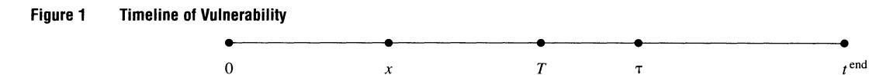
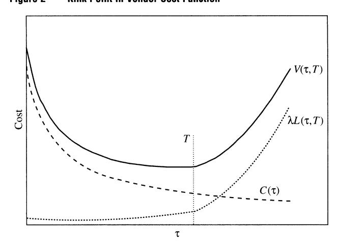
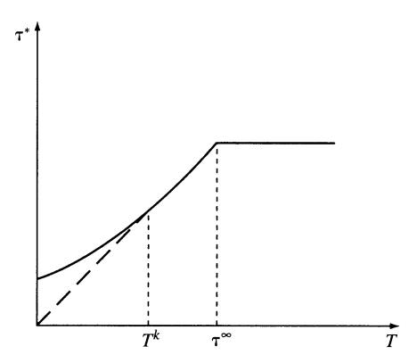
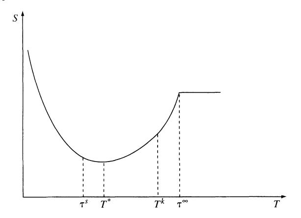
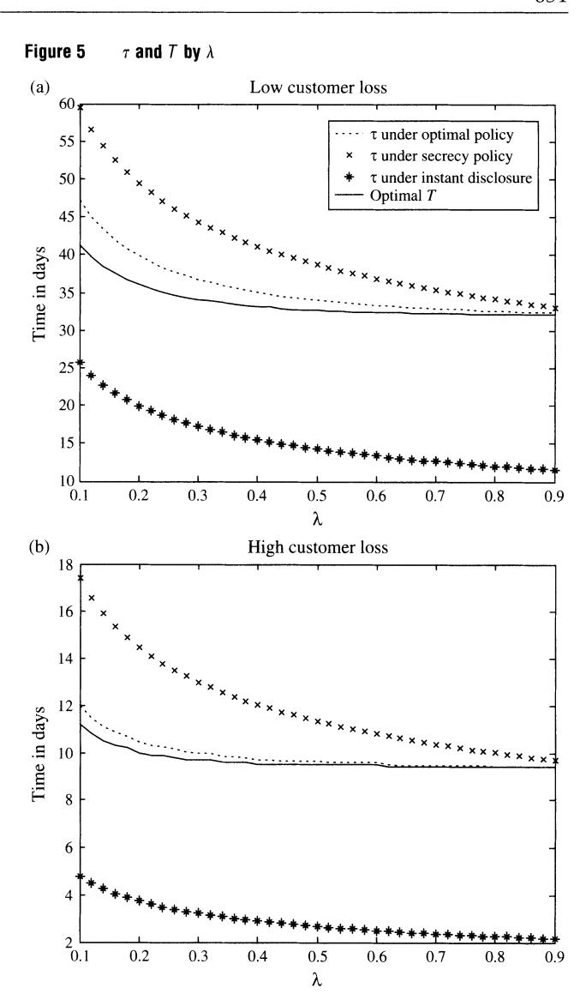
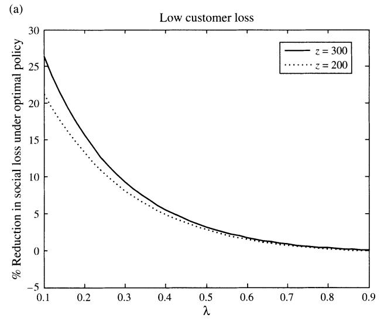
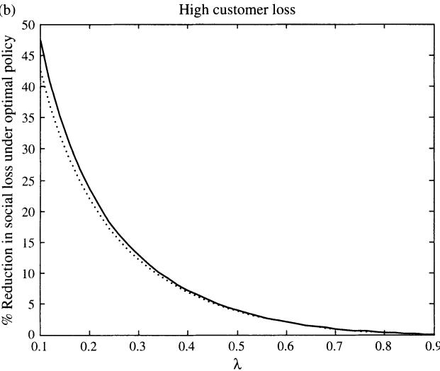
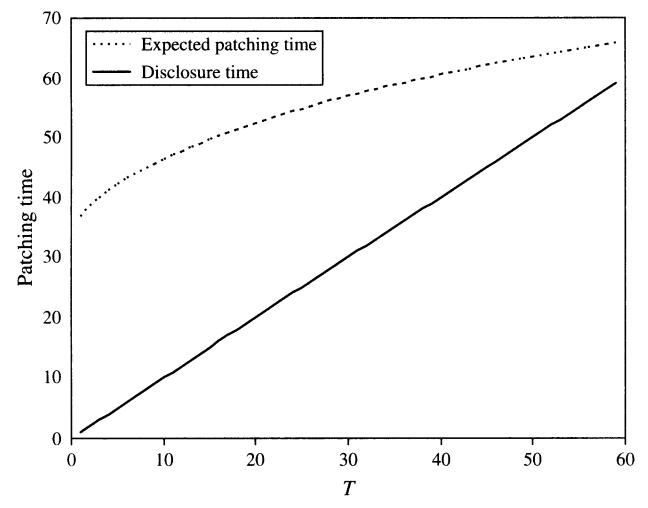
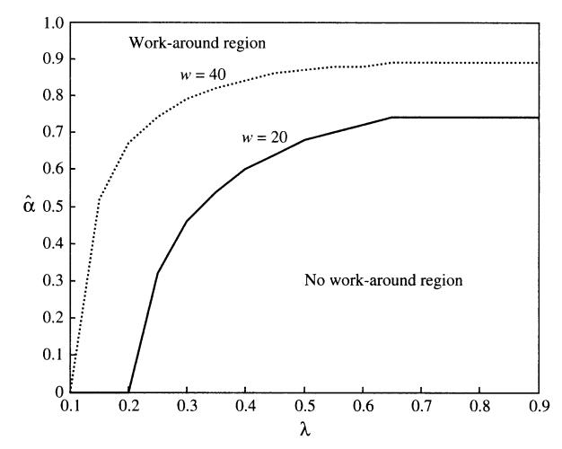
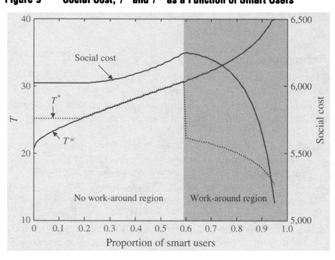

Optimal Policy for Software Vulnerability Disclosure

Author(s): Ashish Arora, Rahul Telang and Hao Xu

Source: Management Science , Apr., 2008, Vol. 54, No. 4 (Apr., 2008), pp. 642-656

Published by: INFORMS

Stable URL:<https://www.jstor.org/stable/20122417>

JSTOR is a not-for-profit service that helps scholars, researchers, and students discover, use, and build upon a wide range of content in a trusted digital archive. We use information technology and tools to increase productivity and facilitate new forms of scholarship. For more information about JSTOR, please contact support@jstor.org.

Your use of the JSTOR archive indicates your acceptance of the Terms & Conditions of Use, available at https://about.jstor.org/terms

INFORMS is collaborating with JSTOR to digitize, preserve and extend access to Management Science

 MANAGEMENT SCIENCE hitJK Vol. 54, No. 4, April 2008, pp. 642-656 DOI i0.1287/mnsc.l070.0771 ISSN 0025-19091 EissN 1526-55011081540410642 @ 2008 INFORMS

# Optimal Policy for Software Vulnerability Disclosure

 Ashish Arora, Rahul Telang, Hao Xu H. John Heinz III School of Public Policy and Management, Carnegie Mellon University, Pittsburgh, Pennsylvania 15213 {ashish@andrew.cmu.edu, rtelang@andrew.cmu.edu, xhao@andrew.cmu.edu)

 Software vulnerabilities represent a serious threat to cybersecurity, most cyberattacks exploit known vulner abilities. Unfortunately, there is no agreed-upon policy for their disclosure. Disclosure policy (which sets a protected period given to a vendor to release the patch for the vulnerability) indirectly affects the speed and quality of the patch that a vendor develops. Thus, CERT/CC and similar bodies acting in the public interest can use disclosure to influence the behavior of vendors and reduce social cost. This paper develops a framework to analyze the optimal timing of disclosure. We formulate a model involving a social planner who sets the disclosure policy and a vendor who decides on the patch release. We show that the vendor typically releases the patch less expeditiously than is socially optimal. The social planner optimally shrinks the protected period to push the vendor to deliver the patch more quickly, and sometimes the patch release time coincides with disclosure. We extend the model to allow the proportion of users implementing patches to depend upon the quality (chosen by the vendor) of the patch. We show that a longer protected period does not always result in a better patch quality. Another extension allows for some fraction of users to use "work-arounds." We show that the possibility of work-arounds can provide the social planner with more leverage, and hence the social planner shrinks the protected period. Interestingly, the possibility of work-arounds can sometimes increase the social cost due to the negative externalities imposed by the users who are able to use the work-arounds on the users who are not.

 Key words : economics of cybersecurity; software vulnerability; disclosure policy; instant disclosure; patching; patch quality

 History: Accepted by Barrie R. Nault, information systems; received October 23, 2005. This paper was with the authors 7 months for 4 revisions. Published online in Articles in Advance March 1, 2008.

 First, the Nation needs a better-defined approach to the disclosure of vulnerabilities. The issue is complex because exposing vulnerabilities both helps speed the development of solutions and also creates opportu nities for would-be attackers. (National Strategy to Secure Cyberspace 2003, p. 33)

### 1. Introduction

 Information security breaches pose a significant and increasing threat to national security and economic well-being. In the Symantec Internet Security Threat Report (Symantec 2003), companies reported expe riencing about 30 attacks per week. These attacks often exploit software defects or vulnerabilities. The number of reported vulnerabilities has increased dra matically over time. The same Symantec report doc umented 2,524 vulnerabilities discovered in 2002, affecting over 2,000 distinct products, an 81.5% increase over 2001. The CERT/CC (Computer Emer gency Response Team/Coordination Center) received and cataloged 8,064 vulnerabilities in 2006 alone and reported more than 82,000 incidents involving vari ous cyberattacks. Although precise estimates are not available, losses from cyberattacks can be substan tial. The CSI-FBI survey estimates show that the loss

 per company was more than \$500,000 in 2004, and more than \$200,000 in 2005 (CSI-FBI 2005). Software vendors, including Microsoft, have announced their intention to reduce vulnerabilities in their products. Despite this, it is likely that vulnerabilities will con tinue to be discovered in the foreseeable future.

 1.1. Vulnerability Disclosure Policies There is considerable debate about how software vul nerabilities should be disclosed. In one view, discover ers should report vulnerabilities to vendors and wait until the vendor develops a patch. However, because a vendor is unlikely to fully internalize all user losses when a vulnerability is exploited, some believe that patches are often excessively delayed. This belief fueled the creation of full-disclosure mailing lists in the late 90s, such as "Bugtraq," where vulnerability information is disclosed immediately and discussed openly. Proponents of instant disclosure claim it increases public awareness, presses vendors to issue patches quickly, and improves the quality of software over time. However, many believe that the disclo sure of vulnerabilities, especially without a patch, is dangerous because it leaves users defenseless against

 attackers. Richard Clarke (2002), President Bush's for mer special advisor for cyberspace security, said: "It is irresponsible and... extremely damaging to release

 information before the patch is out.". Whereas Bugtraq tends to favor full and quick dis closure, organizations like CERT follow a more cau tious approach. After learning of a vulnerability, CERT contacts the vendor(s) and provides a time window to patch the vulnerability; the de facto pol icy is to give vendors 45 days. After that, the vul nerability is publicly disclosed. Other organizations have proposed their own policies. For example, OIS, which represents a consortium of 11 software ven dors, suggests a 30-day window.1 In addition, firms such as iDefense and 3Com/Tippingpoint buy vul nerability information from users on behalf of their clients, an arrangement that may be socially harmful absent appropriate vulnerability disclosure guidelines (Kannan and Telang 2005).

## 1.2. Research Questions

 A lack of consensus on the appropriate disclosure pol icy necessitates a conceptual framework to analyze and guide disclosure policy.2 Thus, the goal of this paper is (i) to develop a model of the optimal policy for vulnerability disclosure, which provides action able recommendations to the policy maker, and (ii) to analyze how the optimal policy is conditioned by various factors. In particular, we examine how long a vendor should be allowed to keep a vulnera bility secret (henceforth, the "protected period") to optimally balance the need to protect users while providing vendors with incentives to develop a patch expeditiously. Our model can be used to analyze alter natives and to suggest improvements in policies of entities, such as CERT, acting on behalf of society at

 large. The optimal disclosure policy depends on the be havior of vendors, potential attackers, and users. In this paper, a vendor is assumed to minimize costs, and hence its choice of when to deliver the patch minimizes the sum of the cost of developing a patch and the portion of the user losses it internalizes. Developing a patch early is costly. However, devel oping a patch late is costly for the users because attackers can find the vulnerability on their own, and this probability is increasing in time. Thus the vendor trades off these costs. However, because the vendor does not internalize all customer losses, it

 has insufficient incentives to produce the patch expe ditiously. The social planner can potentially influ ence the vendor decision by credibly threatening to disclose the vulnerability information after a pro tected period (thereby making it available to attackers as well). Thus, the social planner chooses the pro tected period by trading off customer losses due to disclosure against the benefits of an earlier patch from the vendor (which also reduces customer loss). One key result is that the vendor is more responsive to dis closure if it internalizes more customer loss. However, even when the vendor internalizes a small fraction of the customer loss, an optimal disclosure policy can generate significant social benefits. More interestingly, the social planner can achieve the first-best outcome even if the vendor does not internalize customer loss

 fully. Although our setup is general, we make simplify ing assumptions for tractability. However, we show in ?4.3 that our results are robust to various exten sions. In extensions of the basic model, we allow the users' patching rate to vary with the quality of the patch and we allow the vendor to choose the qual ity of the patch. We show that giving more time to the vendor does not always result in a higher-quality patch. In another extension, we allow some users (smart users) to defend themselves by applying work arounds instead of waiting for a patch, if informed of the vulnerability. We show that the social planner can be more aggressive and disclose the vulnerabil ity early, even if the vendor internalizes very little of the customer loss. However, for intermediate values of the proportion of smart users, the presence of smart users increases the social loss.

 In ?2, we review the relevant literature. We present the basic setup and assumptions in ?3 and the ven dor's decision and the choice of the socially optimal protected period in ?4. Section 4.4 analyzes the case where the speed with which users apply the patch is a function of the quality of the patch. Section 5 extends the model to allow the users to implement work-arounds, and ?6 summarizes and concludes.

# 2. Prior Literature

 This paper contributes to the emerging literature on the economic and policy aspects of cybersecurity, hitherto a near-exclusive domain of computer scien tists and technologists (Gordon and Loeb 2002). Typi cal empirical work in this domain has been devoted to trend analysis of vulnerabilities. Browne et al. (2001) show that the number of the cumulative incidences (C) follows a specific trend over time (M). In par ticular, they estimate C = a + ?VM. Arbaugh et al. (2000) propose a life-cycle model of a vulnerability

 1 Organization for Internet Safety members include ?stake, Bind View, Caldera International (The SCO Group), Foundstone, Guardent, ISS, Microsoft, NAI, Oracle, SGI, and Symantec. For details, see http://www.oisafty.org.

 2 See also the "Full Disclosure Debate Bibliography," http://www. wildernesscoast.org/bib/disclosure-by-date.html (accessed August 24, 2005). See also Preston and Lofton (2002).

and show that the number of attacks exhibits a bell-shaped curve over time since the discovery of the vulnerability. Arora et al. (2006a) find that disclosing a vulnerability leads to more attacks, and the number of attacks are higher if the patch is not available at the time of disclosure. Arora et al. (2006c) find that early disclosure prompts vendors to release patches more quickly.

Some recent papers analyze economic issues related to vulnerability disclosure. Kannan and Telang (2005) show that a market for software vulnerability would lower social welfare if buyers choose to disclose the vulnerabilities they buy. August and Tunca (2005) analyze how unpatched users exert externalities on patched users, and show that the presence of the externality affects the vendors' incentives to improve network security. We also explore such externalities by allowing a fraction of users to implement workarounds and impose the externalities on the users that lack this ability. Arora et al. (2005) develop an analytical model where the possibility of patching a software product after it has been released creates incentives for the vendors to rush to the market with buggier products, especially in larger markets. Cavusoglu et al. (2005) present a model of risk sharing between the vendor and software users where the risk arises due to vulnerabilities. These papers do not deal with the issue of disclosure directly.

Choi et al. (2005) present a model in which the vendor chooses to disclose vulnerability information along with a patch when a vulnerability is discovered. They show that the vendor may not disclose the vulnerability information even when it is socially optimal to do so. They do not model the threat of disclosure. Png et al. (2006) model a game between users and attackers. They show that externalities cause users to underinvest in security and suggest policy measures to remedy the problem. Nizovtsev and Thursby (2007) model the incentives of benign users to disclose software vulnerabilities through an open public forum, whereas in our model, a benign user only contacts CERT, which then chooses the disclosure window. Cavusoglu et al. (2004) also analyze the question of vulnerability disclosure. However, their operationalization of social cost differs from ours. Thus, unlike in our model, they find that vendors may release the patch before the socially optimal time.

### 3. Basic Setup and Assumptions

There are four participants in our model—a social planner, a vendor, representative users (customers of

the vendor's products), and attackers. Customers' and attackers' behavior is exogenously fixed, and we focus on the decisions of the social planner and the vendor. We model a situation (see Figure 1) where a vulnerability is discovered by a benign discoverer (different from the vendor or attackers) and is reported to a social planner (like CERT) at time "0." The social planner immediately informs the vendor and sets a protected period, T, after which it commits to publicly disclose this information. The vendor makes a one-time decision on when to release a patch. For simplicity, patch release time,  $\tau$ , is assumed to be deterministic.

Users incur losses when attackers exploit the vulnerability in their systems. Attackers exploit the vulnerability when they become aware of it and if the customers have not patched. The disclosure policy is binary: Either all information is disclosed or none is. To ensure that losses are bounded, we treat the product life cyle (or version life cyle),  $t^{\rm end}$  as large but finite. Instant disclosure means T=0, whereas a secrecy policy implies that  $T>t^{\rm end}$ , which essentially means that the information is never disclosed (any action after  $t^{\rm end}$  is economically irrelevant in our model). We assume, for now, that customers apply the patch as soon as it is released.

Attackers may discover the vulnerability at time x, where x is a random variable with a pdf, f(x). Attackers exploit the vulnerability at time x or at time T, whichever is earlier. Estimates suggest that about 60% of the documented vulnerabilities can be exploited almost instantly, either because exploit tools are widely available or because no exploit tool is needed (Symantec 2003). Allowing for a deterministic period of exploit-tool development is straightforward. A key assumption in our model, relaxed in §5, is that users remain unprotected until a patch is released.

Our model has two stages. In the first stage, the social planner chooses the optimal protected period  $T^*$ , and in the second stage, the vendor chooses a patch development time,  $\tau^*$ , in response to T. The

&lt;sup>3 Because our goal is to study the socially optimal protected period, we examine the case where the vulnerability is reported to the social planner. If the vendor were to find the vulnerability, it would act as if the protected period were infinite. If the attacker were to find the vulnerability, it would be as if the protected period were zero.

&lt;sup>4 This assumption makes sense if the vendor has to commit resources to develop a patch for a period of time. However, implicitly it requires that the vendor releases the patch as soon as the patch is ready.

| Table 1 Notation |                                                                                                                                   |
|------------------|-----------------------------------------------------------------------------------------------------------------------------------|
|                  |                                                                                                                                   |
|                  | r Patch release time set by the vendor T Protected period set by the social planner                                            |
|                  | V(t, T) Vendor expected cost function                                                                                             |
|                  | S(t(T), T) Social planner cost function                                                                                           |
|                  | q Quality of the patch                                                                                                            |
|                  | C(t, q) Vendor patch development cost when the quality of the patch is q                                                       |
|                  | i(z) Instantaneous loss for unpatched customers at time z after the patch release                                              |
|                  | l(y) Cumulative prepatch customer loss when exposed to attacks for duration y                                                  |
|                  | L(t(T), T) Expected prepatch customer loss                                                                                        |
|                  |                                                                                                                                   |
|                  | L(t(T), fend) Expected postpatch customer loss                                                                                    |
|                  | S?(t{T), T, tend) Total (pre- and postpatch) expected customer loss                                                               |
|                  | A Proportion of customer loss internalized by the vendor p(z, q) Proportion of users who have applied the patch of             |
|                  | quality q by the elapsed time z since patch release.                                                                              |
|                  | F(x) Probability of attacker finding the vulnerability by time x ts Socially optimal patch release time (if the social planner |
|                  | could release patch) r00 Patch release time by the vendor under secrecy policy                                                 |
|                  | Tk Kink point in vendor's reaction function w.r.t to T                                                                            |
|                  | a Proportion of smart users who can implement work-around if informed by the social planner                                    |
|                  | w Cost of work-around                                                                                                             |
|                  | Vw(t, T) Vendor cost function when smart users implement work-around                                                           |
|                  | Sw{t(T), T) Social planner cost function when smart users implement work-around                                                |
|                  | tw Vendor patching time when smart users implement work-around.                                                                |
|                  | Tw Cutoff point such that for T < Tw, vendor induces work-around and vice versa                                                |
|                  | ? Minimum proportion of smart users such that work-around is socially optimal                                                  |

 social planner sets T, taking into account the ven dor's response. Accordingly, we first solve the second stage and then solve the first stage. Before we pro ceed, we list the notation in Table 1 and outline key assumptions.

 3.1. Assumptions Let l(y) be the cumulative customer loss when users are exposed to an unpatched vulnerability for dura tion y. The longer users are exposed without a patch, the greater the losses suffered.5 Even though a given user, once attacked, might not suffer additional losses even as she remains exposed, as the period of expo sure increases, the number of users who are likely to be attacked will increase. This is because the number of attackers aware of the vulnerability and in posses sion of the attack scripts increases. As Arbaugh et al. (2000, p. 52) note, "intrusions increase once the com munity discovers a vulnerability and the rate of intru sions accelerates as news of the vulnerability spreads

 to a wider audience." This suggests the following assumption.

 Assumption 1 (Al). l(y) is increasing and strictly convex in y, tend > y > 0 and 1(0) = 0.

 Customer losses depends upon the gap between when the vulnerability is discovered by attackers (or disclosed to them) and when the patch is released. If the patch is released before disclosure, customers suffer a loss only if an attacker rediscovers the vul nerability prior to the patch. From Figure 1, x is when an attacker finds the vulnerability and r is when the patch is released. Customers may be attacked between time x and time t, and do not suffer losses beyond fend. Hence, cumulative customer loss is l(r-x) (or l(tend - x) if t > tend). If the patch is released after T and the customers apply the patches instantly, there are two possibilities: First, attackers could find the vulnerability on their own and exploit it for t ? x periods. Alternatively, at time T, attackers learn about the vulnerability when it is disclosed and exploit it until the patch is released at r, for r ? T periods. The probability that attackers discover the vulnerability on their own by time x is given by the cdf F(x). Thus, the expected prepatch customer loss L(t, T), which is a function of the protected period T and the patch release time r, can be written as

$$L(\tau, T) = \begin{cases} \int_0^{\tau} l(\tau - x) dF(x), & \text{when } \tau < T \\ \int_0^{T} l(\tau - x) dF(x) + (1 - F(T))l(\tau - T), & \text{when } \tau \ge T. \end{cases}$$
(1)

 The first part of (1) is the customer loss when a patch is released before the protected period T, but an attacker discovers the vulnerability at x < r, expos ing customers to attacks for the duration t ? x. The second part is when the patch is released after disclo sure, and attackers either find it before T and attack for the duration r ? x or learn of the vulnerability at T when it is publicly disclosed and attack for the duration t ? T.

 The customer loss that the vendor internalizes is in the form of either a loss in reputation, a loss in future sales, or as customer support costs to which it is con tractually obligated. We represent the proportion of customer loss internalized by the vendor as ? and call it the internalization factor. Although vendors in the United States do not face any liability for defects in software products, ? may be interpreted as contrac

 tual liability. We assume that ? < 1. We use subscripts to denote partial derivatives of functions with respect to their arguments, except that we use /'( ) to denote the derivative of /( ). We use superscripts to denote particular values of variables.

 5 Customer loss also depends on vulnerability and customer spe cific factors, which we ignore here.

Even after the vendor releases the patch, customers may not apply the patch instantly, and may continue to incur losses. Because a patch may disclose additional details about the vulnerability, we allow the postpatch losses incurred (by unpatched customers) to differ from those before the patch release. If z is the time elapsed since the patch was released, let p(z, q) denote the proportion of customers that have applied that patch by time z, where q ( $q \ge 0$ ) is the quality of the patch. Because higher-quality patches are easier for the customers to download and apply, we assume the following:

Assumption 2 (A2).  $p_q(z, q) > 0$ .

The expected cumulative postpatch loss is

$$\tilde{L}(t^{\mathrm{end}} - \tau, q) = \int_0^{t^{\mathrm{end}} - \tau} \zeta(z) (1 - p(z, q)) dz,$$

where  $\zeta(z)$  is the *instantaneous* postpatch loss for unpatched customers at time z. The total (preand postpatch) expected customer loss is given by  $\mathcal{L}(\tau, T, q)$ , and can be written as

$$\mathcal{L}(\tau, T, q) = \begin{cases} \int_{0}^{\tau} l(\tau - x) dF(x) + \int_{0}^{t^{\text{end}} - \tau} \zeta(z) (1 - p(z, q)) dz, & \text{when } \tau \leq T \\ \int_{0}^{T} l(\tau - x) dF(x) + (1 - F(T)) l(\tau - T) + \int_{0}^{t^{\text{end}} - \tau} \zeta(z) (1 - p(z, q)) dz; & \text{when } \tau > T. \end{cases}$$

Note that  $\tilde{L}(\cdot)$  captures the postpatch losses and does not depend on T. Similarly,  $L(\tau,T)$  does not depend upon q. We will show in the next section that  $L(\cdot)$  is convex. However, because we require the total expected customer loss to be convex, a sufficient, although not necessary, condition is that  $\tilde{L}(\cdot)$  be convex. We assume the following:

Assumption 3 (A3).  $\tilde{L}(\tau, q)$  is strictly convex in  $(\tau, q)$ .

Concretely, A3 requires that  $\zeta'(t^{\rm end}-\tau)/\zeta(t^{\rm end}-\tau) > p'(t^{\rm end}-\tau,q)/(1-p(t^{\rm end}-\tau,q))$ , i.e., the growth rate of instantaneous losses for unpatched users is greater than the rate at which unpatched users decline. Convexity of  $\tilde{L}(\tau,q)$  also requires that  $p_{qq}(z,q) < 0$ , or that the share of patched users increases at a diminishing rate as quality increases.

Assumption 4 (A4). (i)  $C_{\tau}(\tau, q) < 0$ ,  $C_{\tau\tau}(\tau, q) > 0$ ,  $C(0, q) = \infty$ , and  $C_{\tau}(0, q) = -\infty$ . (ii)  $C(\tau, q)$  is strictly convex in  $(\tau, q)$ ,  $C_{q}(\tau, q) > 0$ ,  $C_{\tau q}(\tau, q) < 0$ .

We assume that patch development cost  $C(\tau,q)$  is decreasing and convex in  $\tau$ . The more resources the vendor allocates to develop a patch, the shorter is the time taken to patch. However, the benefits of delay are decreasing. We need  $C(0,q)=\infty$ , and  $C_{\tau}(0,q)=-\infty$  for technical convenience. The second part of A4 deals with the impact of quality on patch development cost. It is likely that accelerating patch development and increasing the quality of the patch draw upon scarce resources. Hence, we assume that the shorter the time allocated for patch development, is the costlier is the patch quality, and the marginal cost with respect to quality is also higher.

Finally, we need the following condition for tractability

Assumption 5 (A5). 
$$\min_{\tau} \{C(\tau,q) + \lambda \int_0^{\tau} l(\tau-x) dF(x)\} + \lambda \int_0^{t^{\text{end}} - \tau} \zeta(z) \cdot (1 - p(z,q)) dz < \lambda \int_0^{t^{\text{end}}} l(t^{\text{end}} - x) dF(x).$$

The inequality ensures that, left to itself, the vendor would voluntarily develop a patch before the end of the life cycle and, moreover, this is socially desirable as well. The left-hand side of the inequality is the vendor loss if the vendor releases a patch. The right-hand side of the inequality is the vendor loss when the vendor does not develop a patch. Essentially, we require  $t^{\rm end}$  to be long, or  $\lambda$  to be large. Note that if postpatch losses are large, A5 may not hold.

The assumption is empirically sensible in that the vast majority of the vulnerabilities handled by CERT are patched, which suggests that relative to the typical time taken to patch, the product life cycles are long. However,  $t^{\text{end}}$  would be small, if, for instance, a vulnerability is discovered shortly before a new version of the product is scheduled to be released. In this case, optimal disclosure policy is trivial—one should simply wait for the vulnerability to be addressed in the new version.7 If the assumption were violated, then every interior solution for the vendor's problem on the optimal patch release time would have to be compared to the payoff from not releasing the patch. We discuss this further in §4.4, along with other extensions.

#### 3.2. Vendor's Objective Function

Given a commitment by the social planner to a protected period T and customer patching rate p(z, q), the vendor chooses a patch development time  $\tau$  and the patch quality q to minimize its costs. The social planner's commitment is assumed to be credible because either this is a repeated game (which

(2)

&lt;sup>6 There is one final restriction on p(z,q) and  $\zeta(z)$  of the requirement that the relevant matrix of second-order derivatives be positive definite. There is no meaningful economic interpretation of this restriction.

 $^7$  If the vendor does not fix it in the new release, then it is as if the clock were restarted—i.e.,  $t^{\rm end}$  is large.

 we do not explicitly model) or the social planner is concerned about its reputation, or both. The vendor's expected cost function is

$$V(\tau, q; T) = C(\tau, q) + \lambda \mathcal{L}(\tau, T, q).$$

 This cost function has two terms. The first term is the cost of patch development, C(r, q), and the second is the portion of expected user loss internalized by the vendor, A2?(t, T, q).

 4. Model and Analysis We are now ready to analyze (i) the vendor's decision to release the patch for a given protected period and (ii) the socially optimal protected period. We begin by analyzing the case where customers apply the patches instantly (p(0, q) = 1) so that postpatch losses are zero (L() = 0), and hence patch quality is exogenously set at some level q. We relax these assumptions later in ?4.4.

 First, we outline the vendor's decision, and then we analyze the optimal disclosure policy and how vari ous factors condition the policy.

### 4.1. Vendor's Decision

 The expected user loss is as given in Equation (1), and the vendor's objective function is8

$$V(\tau; T) = C(\tau) + \lambda L(\tau, T). \tag{3}$$

 From Equation (1), L(r, T) is continuous every where, and is differentiable everywhere except per haps at r = T. Lemma 1 shows that it is also convex in r. Because C(r) is also convex in r, that vendor cost function V(r,T) is strictly convex in r as well. Lemma 1 shows that there always exists a unique optimal r\* for a given T. (All proofs are in the online appendix, which is provided in the e-companion.)9

 Lemma 1. The expected customer loss function L(t, T) is strictly convex in patch development time r. For any given T, there exists a unique optimal patch development time t\*.

 However, an optimal r\* may be at a kink point because the vendor cost function is not differentiable in r at t = T (unless /'(0) = 0). In the following, we analyze the possibility of such a kink point and its properties.10 Figure 2 shows the two components of the vendor's objective function and highlights such a kink point.

 At any such kink point, the left-hand-side derivative of V w.r.t t is y-(T)|T=r = (CT(T) + A/0T/'(r-x)dF(x)). The right-hand-side derivative is given by

$$|V_{\tau}^{+}(T)|_{\tau=T}$$

$$= C_{\tau}(T) + \lambda \int_{0}^{T} l'(T-x) dF(x) + \lambda (1 - F(T)) l'(0).$$

 Because V(0) > 0, the right-hand-side derivative is bigger than the left-hand-side derivative. The eco nomic interpretation is that a kink will exist if attack ers can exploit even a very small gap between the disclosure and the patch. Empirical results in Arora et al. (2006a) show that typically the disclosure is fol lowed by a spike in attacks, which subside following the release of the patch, but only with some delay. This suggests that l'(0) > 0 is plausible and perhaps

 even likely. At a "kink" equilibrium r\* = T, the right-hand side derivative must be nonnegative and the left hand-side derivative must be negative. Define Tk such that V+(T)\r=Tk =0. Note that the second derivative of the right-hand-side w.r.t. T is equal to CTT(T) + A/0T l"(T - x) dF(x) > 0. Thus, the right-hand-side de rivative is increasing in T. Because V+(T)\Tz=Tk = 0 for T < Tk, VT+(T)\T=T < 0. Hence, for all T < Tk,

 Define the socially optimal patching time, rs, i.e., the patch release time that minimizes the uncon strained social cost (i.e., A = 1) as:

$$\tau^{s} = \arg\min_{\tau} \left\{ C(\tau) + \int_{0}^{\tau} l(\tau - x) dF(x) \right\}. \tag{4}$$

 Let t?? denote the optimal patch development time given secrecy policy (i.e., r?? = argminrC(r) + \fil{r-x)dF(x)).

Lemma 2. Tk, ts and t00 exist.

 8For notational clarity, we suppress q from the cost function C() and the loss function L() when q is not a decision variable.

 9 An electronic companion to this paper is available as part of the online version that can be found at http://mansci.journal.informs. org/.

 10 We are grateful to a reviewer for alerting us to the existence and importance of the kink point.

 The difference between Tk and r?? (the time when the vendor will release the patch if left alone) is due to the impact of disclosure. If even a vanishingly small delay in releasing the patch (after disclosure) leads to a loss (so that Z'(0) > 0), then Tk < r??. Any increase in Z'(0) will decrease Tk and increase the gap between Tk and r??. A vulnerability for which no exploit code is needed, which can be remotely exploited, or where attackers have large numbers of "zombie" computers under their control, is likely to be characterized by higher values of V(0) and lower values of Tk. Corre spondingly, Tk plays an important role in our analysis because we show below that even if A < 1, the social planner may be able to achieve the first-best outcome by setting T > Tk. Thus, the factors that affect Tk have important implications for the disclosure policy. To further characterize Tk, we show below that Tk decreases when the internalization factor (A) increases or the probability of attackers finding the vulnerabil ity increases (a first-order stochastic dominant shift in F(x)).n

 Lemma 3. (i) Tk is decreasing in A. (ii) If G(x) is a cdf defined over the same domain as F(x) such that G(x) > F(x), then Tk corresponding to G(x) is smaller than the Tk corresponding to F(x).

 Note that Tk is the smallest protected period such that the vendor releases the patch within the pro tected period. A higher A and an increased probabil ity of the vulnerability being discovered by attackers imply higher marginal cost to the vendor of delaying

 the patch for a given T. We are now ready to define the optimal vendor behavior for a given T. The vendor's best-response function is the implicit function of VT(r, T) = 0.

 Theorem 1. For T e [0, Tk), the vendor patches after disclosure?i.e., T < t\* < Tk?and the slope of t\*(T) is strictly less than one. For T e [Tk, r??], the vendor patches at T?i.e., t\* = T?and hence slope of t\*(T) is equal to one. For T e [t??, tend], the vendor patches at r??, and hence the slope of t\*(T) is equal to zero.

 Theorem 1 shows, as many full-disclosure propo nents believe, that reducing T results in the vendor releasing the patch more quickly (i.e., dr\*/dT > 0, but only if T < t??). Further, for any T < Tk, r\* is an inte rior point and the vendor patches after the protected

 Figure 3 Patch Development Time r as a Function of Protected Period T

 period elapses; for t?? >T >Tk, r\* = T so that Tk pos sibly marks a kink in the best-response function r(T). Figure 3 shows t\* as a function of T: r\* increases in T until t?? and is flat after that. Moreover, after Tk is reached, t\* = T. Also, notice that because r > 0 when T = 0 and dr\*/dT < 1, the gap between r\* and T shrinks.

 The lower A is, the slower the vendor is to patch. However, this is only true when T < Tk, after which the vendor chooses to patch at T regardless of A. (Recall from Lemma 3 that Tk itself is decreasing in A.) This is formalized in Corollary 1.

 Corollary 1. A higher internalization factor implies an earlier patch, 3t\*/d\ < 0 for any T < Tk. When T > Tk, dT\*/d\ = 0.

### 4.2. The Social Planner's Decision: Optimal Disclosure Policy

 The social planner chooses optimal T\* to minimize total social cost, S(T), taking into account the ven dor's best-response function r(T). The social cost is given by

$$S(T) = C(\tau(T)) + L(\tau(T), T). \tag{5}$$

 Social cost differs from vendor cost in that the former includes the entire expected user loss, whereas\* the latter includes only a fraction A of the expected user loss. When the vendor internalizes only a portion of customer loss, i.e., A e (0, 1), the vendor's incentives and the social planner's incentives are not aligned.

 We can now derive the socially optimal policy. We assume that S(T) admits only a single minimum (see the online appendix for the sufficient condition for a unique T). A variety of functional forms, including the exponential and quadratic loss functions, yield a

 single minima. Recall that rs is the socially optimal time to deliver the patch, i.e., the time a vendor would release the patch on its own if it internalized the entire cus tomer loss. Because the vendor does not internalize

 11 Note that a kink can arise in other ways as well. Punitive dis closure, such as where a vendor releasing a patch after the disclo sure is publicly "named and shamed/' will not affect Tk. It will, however, increase the possibility of the kink solution by making the vendor objective function discontinuous at the disclosure point. Such punitive disclosure punishes the vendor without imposing losses on customers, thereby increasing the potency of the disclo sure policy. (See also ?4.2.1.)

Figure 4 Social Cost as a Function of T

the entire customer loss, absent a threat of disclosure, the vendor delivers the patch after  $\tau^s$ . Given a protected period T, the vendor will deliver the patch after T if  $T < T^k$ , and exactly at time T for  $T \ge T^k$ . Hence, as long as  $\tau^s \ge T^k$ , the social planner can choose  $T = \tau^s$  and the vendor would patch exactly at  $\tau^s$ . However for  $\tau^s < T^k$ , the socially optimal T, denoted by  $T^*$ , lies between  $\tau^s$  and  $T^k$ , as shown in the next theorem and in Figure 4.

Theorem 2. When  $\tau^s < T^k$ , the socially optimal protected period  $T^*$  is bounded within  $(\tau^s, T^k)$ , i.e.,  $\tau^s < T^* \le \tau(T^*) \le T^k$ . When  $\tau^s \ge T^k$ ,  $T^* = \tau(T^*) = \tau^s$ .

Clearly, whenever  $\tau^s \ge T^k$ , the social planner can achieve the socially best outcome even though  $\lambda < 1$ . Thus, disclosure policy can be an effective and potent tool even though the social planner can affect vendor behavior only indirectly.

**4.2.1. Factors Affecting the Optimal Disclosure Policy.** An increase in  $\lambda$  will cause the vendor to release the patch earlier because the vendor internalizes a larger fraction of customer losses. A higher  $\lambda$  also implies that the vendor is more sensitive to disclosure. Hence, the social planner will optimally reduce  $T^*$ . The optimal protected period,  $T^*$ , decreases with  $\lambda$  until  $\lambda$  reaches  $\lambda_0$  and is constant thereafter. The intuition is that  $T^k$  is decreasing in  $\lambda$  (from Lemma 3), so that for high enough  $\lambda$ ,  $\tau^s \geq T^k$  holds. If  $\tau^s \geq T^k$ , the social planner can choose  $T = \tau^s$  and the vendor would patch exactly at the socially optimal time  $\tau^s$ . This is formalized in Theorem 3.

THEOREM 3. There exists a  $\lambda^0 \in (0, 1)$  such that for  $\lambda \geq \lambda^0$ ,  $\tau^s \geq T^k$ , and  $\tau^* = T^* = \tau^s$  and  $T^*$  is independent of  $\lambda$ . For  $\lambda < \lambda^0$ ,  $\tau^s < T^k$  and the socially optimal protected period,  $T^*$ , is decreasing in  $\lambda$ .

When  $\tau > T$ , there is a period when customers are exposed. The gap between T and  $\tau$  falls with  $\lambda$ , and  $\tau$  becomes more responsive to T. In short, the social planner has greater leverage with the vendor when

 $\lambda$  is higher. This result is important; disclosure policy relies upon the sensitivity of the vendor to customer losses. When the vendor is more sensitive to customer losses (higher  $\lambda$ ), the social planner has more leverage in forcing vendors to release the patch on time. In this respect, our result is counterintuitive: One expects greater alignment between the firm's objective function and social welfare to weaken the need for regulation, but here the reverse is true, because a greater alignment between the two also increases the efficacy of regulation. However, our numerical analysis (see §4.5) suggests that even for low  $\lambda$ , suitably chosen disclosure can generate significant social benefits.

There are two ways to a higher  $\lambda$ . One is when customers are able to punish the vendor by switching to a competing product. We conjecture that competition increases  $\lambda$ . Second, larger users are more likely to contract with vendors about the patching support. Thus, vendors whose market base consists of large users will have higher  $\lambda$ .

#### 4.3. Robustness of the Model

Although not analyzed here, the social planner plausibly has a spectrum of disclosure possibilities. For instance, the social planner could issue a general warning that a particular product is insecure, which could hurt the vendor without imposing large losses on users. In terms of our model, one would add a term to the vendor's cost, so the modified vendor cost is  $V(\cdot) = C(\tau) + \lambda L(\tau, T) + \psi(\tau, T)$  and the social cost is  $S(\cdot) = C(\tau) + L(\tau, T)$ , where  $\psi(\tau, T)$  captures the damage suffered by the vendor not due to the customer loss. We expect that  $\psi(\tau, T) = 0$  for  $\tau \leq T$  and is positive and increasing in  $\tau - T$ . Including such a term will cause a discontinuity in the cost function at  $\tau = T$ , and cause cost function to be concave around  $\tau = T$ , thereby increasing the likelihood of the vendor patching at T. This modification can also be used to analyze the case where the vendor suffers losses that are not included in the social cost function (e.g., where the vendor loses some customers to other vendors by releasing the patch late).

It is also plausible that the postdisclosure loss function differs from  $l(\cdot)$ . If we let  $m(\tau-T)$  represent the postdisclosure losses, then as long as m(0)=0,  $m(\cdot)$  is convex, and  $V_{\tau}^+(T)|_{\tau=T}$  is monotonically increasing in T, our basic results should continue to hold. Disclosure by the social planner may also increase  $\lambda$  by forcing the vendor to acknowledge responsibility. This is as if the vendor's (but not social) postpatch loss function were  $m(\cdot) = \sigma l(\cdot)$ , where  $\sigma > 1$ .

 $^{12}$  If m(0) > 0 and  $m''(\cdot) < 0$ , the cost functions may be nonconvex, implying that patching soon after disclosure is suboptimal, and thus we should see many cases of patching coinciding with disclosure.

 We have assumed through A5 that despite a finite product life cycle, "not patching" is not an opti mal choice. The online appendix shows that if A5 is violated, then there exists a threshold, TNP(fend), such that T > TNP implies that the vendor does not patch. It is intuitive that TNP increases with fend. Further, because the vendor does not internalize the entire customer loss, there is a range of values of tend such that the social planner's choice of the protected period is constrained by the need to get the ven dor to patch. The unconstrained choice of the pro tected period would result in the vendor not releasing the patch. When the constraint binds, the protected period is shorter than when the constraint does not bind. Finally, there is a threshold value of fend (pos sibly zero) below which the social planner chooses secrecy and the vendor does not develop a patch.

 4.4. Customers Do Not Patch Instantly Thus far we have assumed that all customers patch as soon as the patch is available (or p(0, q) = 1). The .NET passport vulnerability is a good example. A fix on the server side stops the invasion and customers need no patch (InfoWorld.com 2003). However, many vulnerabilities require that customers download and apply patches. Not all customers apply patches imme diately upon release (Rescorla 2003). Six months after the DDOS attacks that paralyzed several high-profile Internet sites, more than 100,000 machines were still

 unpatched and vulnerable. Users may not patch their systems immediately because (i) it takes time to find out about the patch, (ii) applying the patch may take time and may be difficult for unskilled users, and (iii) poor-quality patches may themselves create new problems. For example, the initial Microsoft patch for a vulnerabil ity CVE-2001-0016 disabled many updates of Service Pack 2 of Windows NT, making the patched system even more vulnerable to attacks (Beattie et al. 2002). The following statement clearly points to how the patch quality can affect the patch uptake:

 About 95 percent of exploits occur after bulletins and patches are put out.... (T)he reason the exploit is effective is because the patch uptake is too low. The reason the patch uptake is too low is it's too hard to patch, and the quality of the patch is not consistent enough that people can feel safe patching right away. (Microsoft chief security strategist Scott Charney.)13

 The speed with which customers apply patches de pends on two factors: the time elapsed since the patch was released (z) and the quality of the patch (q). Qual ity can be interpreted to also include those features that make it easier for users to download and install the patches.

 4.4.1. Quality of the Patch Is Exogenous. We first consider the case when quality is exogenously fixed at some level q. The expected loss function is of the form given in Equation (2). Thus, the vendor's objective function is

$$V(\tau, T) = C(\tau) + \lambda \mathcal{L}(\tau, T; q)$$
$$= C(\tau) + \lambda L(\tau, T) + \lambda \tilde{L}(\tau; q)$$

One can show that Theorems 1-3 continue to hold.14

 Because postpatch losses fall as the patch is de layed, t\*,ts, Tk, and r?? are all larger than when patches are installed instantaneously. The vendor therefore delays the patch. If dr/dT is (weakly) smaller for a given T in the presence of postpatch losses, then the social planner also optimally allows more time (higher T\*). Indeed, in the extreme case, where users never patch, not developing a patch is both privately and socially optimal.

 Theorem 4. When users do not patch instantly, (i) Tk is higher, (ii) the vendor slows patch development, and (iii) if dr/dT in the presence of postpatch loss is no higher than dr/dT in the absence of postpatch loss, the social planner allows more time before disclosure.

 The theorem formalizes the intuition that the ven dor and the social planner are both less aggressive in the presence of postpatch losses. Moreover, we are less likely to see cases where the patch coincides with

 the disclosure, because Tk moves to the right. The rate of user implementation of patches can be low. In a case study of the OpenSSL Remote Buffer Overflow vulnerability (exploited by the notorious slapper worm), Rescorla (2003) reports that 60% of the investigated servers did not patch even after two weeks of the release of the patch. Our results imply that in such cases, vendors should be given more time to develop patches.

 4.4.2. Quality of the Patch Is Endogenous. A common argument for giving vendors more time is that it facilitates the development of higher-quality patches. High-quality patches are those that cus tomers trust, are easier to download and apply, and are less likely to cause problems later. Simply put, a higher-quality patch increases the uptake of patches. When the vendor can choose both q and r, the ven dor's cost function is

$$V(\tau, q) = C(\tau, q) + \lambda \mathcal{L}(\tau, T, q)$$
$$= C(\tau, q) + \lambda L(\tau, T) + \lambda \tilde{L}(\tau, q)$$

 Consider the impact of increasing the protected period, T. An increase in T will lead to an increase

 13http://entmag.com/news/article.asp?EditorialsID=5833 (accessed September 1, 2006).

 14 The proofs are analogous to those in the previous section and are omitted here. They are available from the authors upon request.

in  $\tau$ . The impact of higher  $\tau$  on q depends on the sign of  $V_{\tau q}(\cdot)$ . It is easy to see from Equation (2) that  $L_{\tau q}(\cdot)=0$  and  $\tilde{L}_{\tau q}(\cdot)>0$  so that  $V_{\tau q}(\cdot)=C_{\tau q}(\cdot)+\lambda \tilde{L}_{\tau q}(\cdot)$  is of indeterminate sign. If the development cost effect,  $C_{\tau q}(\cdot)$ , dominates, then  $V_{\tau q}(\cdot)<0$ , and the vendor will increase q. However, if the postpatch loss effect,  $\lambda \tilde{L}_{\tau q}(\cdot)$ , dominates, then  $V_{\tau q}(\cdot)>0$ , and the vendor will decrease q.

Theorem 5. When patch quality is endogenous, the optimal time for patch development  $\tau^*$  is increasing in disclosure time T, i.e.,  $d\tau^*/dT > 0$ . If  $V_{\tau q}(\cdot) \leq 0$ , patch quality is increasing in T,  $(\partial q/\partial T \geq 0)$ ; and if  $V_{\tau q}(\cdot) > 0$ , patch quality is decreasing in T,  $(\partial q/\partial T \leq 0)$ .

Theorem 5 appears to be counterintuitive. It is commonly believed that providing more time to vendors will improve the quality of the patch. However, this view is only partially true. An increase in  $\tau$  (due to an increase in T) has two opposing effects on the marginal benefit of quality. On the one hand, the marginal cost of quality falls because  $C_q(\cdot)$  falls with  $\tau$ , but on the other hand, increasing  $\tau$  also reduces the marginal benefit of quality because a delayed patch also reduces the marginal benefit of quality in mitigating postpatch loss. When the postpatch loss effect dominates, increasing the protected period reduces the patch quality.

What happens to the optimal protected period when quality is set endogenously? In general, the protected period can be higher or lower with endogenous quality. However, if the postpatch loss effect dominates the patch development cost effect, then the optimal protected period is lower when quality is endogenous. When the patching cost effect dominates, the impact on T is ambiguous: Reducing T hastens the patch, but lowers its quality (see online appendix for proof).

### 4.5. Numerical Analysis

To gain more insight into the optimal disclosure policy, we performed numerical simulation, with the following functional forms:  $C(\tau) = 50,000/\tau^{0.75}$ ,  $l(y) = 25y^2$ , F(x) uniform over [0, z], and we let z vary from 200 to 300 days. We let  $\lambda$  vary from 0.1 to 0.9. Because the effectiveness of the policy depends on the relative magnitudes of the customer loss and the patching cost, we repeat the simulation with customer loss  $l(\cdot) = 2,500y^2$ , keeping the rest the same.

Given the paucity of information on the patching costs and the customer loss functions, we choose parameter values that match observed patch release behavior. In a related empirical study (Arora et al. 2006c), we estimate that instant disclosure leads to a patch in 31 days and secrecy leads to a patch in about 61 days, on average. With the chosen forms, for  $\lambda = 0.1$ , under instant disclosure, the patch release

time  $\tau$  varies from about 25 days (low customer loss) to 5 days (high customer loss), and under secrecy,  $\tau$  correspondingly varies from 58 days to 18 days. We calculate the optimal patch release times under instant disclosure, under secrecy, and under the optimal protected period. To avoid clutter, we plot these values only for z=300; lower values of z make both the vendor and the social planner more aggressive.

In Figure 5,  $\lambda$  is on the x-axis and time (in days) is on the y-axis. Note that the patch takes the longest time under secrecy and the shortest under instant disclosure. As expected, the patch release time falls with  $\lambda$ . Also, the difference between the patch release time and the protected period (the middle two lines) shrinks with  $\lambda$ . Beyond  $\lambda = 0.5$ , the difference between T and  $\tau$  is small. In short, when the vendor is responsive enough, disclosure is very effective in forcing the vendor to release the patch in time. However, even for small  $\lambda$ , the optimum disclosure policy is effective in reducing the vendor's patch release

 Figure 6 Percentage Reduction in Social Loss Under the Optimal Policy

 time (from 60 days to 48 days in Figure 5(a) and from 17 days to 12 days in Figure 5(b)). When the customer loss is high (Figure 5(b)), r is lower, as is the pro tected period, T, and the difference between the two is smaller.

 Turning to the social losses, we find that the instant disclosure performs poorly compared with either the secrecy or the optimal policy, with social losses 300%-400% greater under the instant disclosure than under the optimal policy. Accordingly, in Figures 6(a) and 6(b) we plot only the percentage reduction in the social loss under the optimal policy compared to the secrecy policy.

 Note that the difference between z = 200 and z = 300 is small. For low values of A, the optimal policy generates benefits (social loss reductions) of about 25%-30% in Figure 6(a) and about 40%-45% for Figure 6(b). To put this in perspective, if we take \$1

 billion as a conservative lower bound for the losses arising from information security breaches due to inappropriate disclosure, the implied savings from the optimal disclosure policy range from \$250 million to \$450 million. More importantly, by offering a credible alternative to the instant disclosure, CERT also poten tially reduces some cases of instant disclosure, which

 are significantly more costly. In both figures, as A increases, secrecy (no disclo sure) becomes almost as effective as optimal policy even though the gap between r and T remains large. More interestingly, we showed earlier that with higher A, the protected period is short. However, even when A is small and the social planner cannot be very aggressive, the social benefits of optimal policy are high. Thus policy has bite in terms of reducing the social losses when A is small even though the vendor is not as responsive.

 Note that the optimal policy matters more when the customer losses (relative to the patching costs) are higher (Figure 6(b) versus Figure 6(a)). Higher customer loss makes the vendor more responsive, but higher customer loss also raises the social loss. Because the vendor internalizes only a fraction of the customer loss, the socially optimal policy relative to the secrecy policy is more effective when the customer loss is higher. One interpretation of this result is in terms of market size. An increase in the market size is equivalent to an increase in the customer loss rela tive to the patch development cost, because the latter is roughly invariant to changes in market size. Arora et al. (2005) show that vendors patch more expedi tiously in larger markets. The numerical simulations reported here confirm that finding, and also show that if the vendor internalizes only a fraction of customer loss, the socially optimal policy relative to the secrecy

 is more effective in larger markets. We also experimented with skewed distributions for F(-). When F(-) is skewed to the right (i.e., the hackers have a higher chance of finding vulnerabil ity later), then gains from the optimal policy are even higher. Left-skewed distributions, on the other hand,

 produced lower gains. Finally, for A larger than 50%, the vendor's response under the secrecy is very similar to that under the optimal disclosure policy. As long as the vendor inter nalizes at least 50% of the user loss, the vendor's decision to release a patch on its own creates the additional social costs of the order of only 5%. We also explored kink solutions, and they lead to similar

 predictions. Empirical results agree with our model. Arora et al. (2006c) find that vendors typically patch after disclo sure, and early disclosure leads to an early patch. In Figure 7, disclosure is on the x-axis and the patch

Figure 7 Patching Time vs. Disclosure Time

Data source. Arora et al. (2006c).

 release time is on the y-axis. As can be seen, early dis closure leads to a quicker patch. Moreover, except for when T is small, the gap between T and r shrinks as T increases.

 Figure 7 uses actual disclosure. Because actual dis closure times may differ from the promised protected period, Arora et al. (2006b) exploit the variation in the number of vendors with a common vulnerability to estimate how the threat of disclosure affects the patch release time. The results are consistent with the theory in that a higher likelihood of early disclosure leads to an earlier patch. The authors also find in their data that in almost 15% of the cases, the patch release time coincides with disclosure. This may plausibly reflect unmodeled communication between CERT and the vendor. However, it is also predicted by our model when Tk < rs. In terms of our model, it appears that

### 5. Customers Can Implement Work-Arounds

? > 0.5 corresponds to rs >Tk.

 So far, we assumed that customers have no choice but to wait for the patch. However, sometimes customers can implement work-arounds instead. Examples of work-arounds include shutting off a port, changing the default settings, disabling a service, and revising

 and recompiling a portion of code. Suppose a fraction of users (henceforth smart users) can implement a work-around at a one-time cost w, if informed of the vulnerability by the social planner.15 A work-around will be implemented only if the ex pected loss of waiting for a patch, l(r ? T) is greater

 than w. Thus, the expected loss for users implement ing work-arounds is f0 l(T ? x) dF(x) + w. The remain ing (1 ? a) percent of users must wait for the patch, and their expected loss is as before. For brevity, we ignore kink solutions and postpatch losses, and patch quality. We also assume that all customers are fully informed about r and T. Because there is no uncer tainty in the model and customers are not being

 strategic, the vendor can credibly announce r. The possibility of work-arounds lowers the expec ted postdisclosure loss for smart users, and in turn, the vendor has an incentive to delay the patch, which hurts users who cannot apply work-arounds. How ever, the choice of the patch release time also affects customers' choice of work-around. In particular, if the vendor chooses r such that l(r ? T) < w, then smart users would not apply work-arounds and instead wait for the patch. In this case, the vendor loss func tion is

$$V(\tau, T) = C(\tau) + \lambda \left( \int_0^T l(\tau - x) dF(x) + (1 - F(T))l(\tau - T) \right)$$
  
s.t.  $l(\tau - T) < w$ .

 If, however, the vendor chooses a r such that l(r ? T) > w, then smart users can apply a work-around and the vendor loss function, denoted by Vw(r, T), is

$$V^{w}(\tau,T) = C(\tau) + \lambda \alpha \left( \int_{0}^{T} l(T-x) dF(x) + w \right) + \lambda (1-\alpha)$$

$$\cdot \left( \int_{0}^{T} l(\tau-x) dF(x) + (1-F(T)) l(\tau-T) \right)$$
s.t.  $l(\tau-T) \ge w$ . (6)

 Let rw = argminr{Vw(T; T)} and similarly r = argminr{V(T; T)} denote the vendor's optimal choices of t, conditional on allowing and not allowing the work-arounds, respectively. If neither constraint binds, the patch release time in the work-around case is equivalent to the patch release time with no work around, but with the internalization factor equal to A (1 - a). Thus, for a given T, rw = r(\ -(1-a), T), whereas the patch release time in the no work-around

 case is r(X, T). Define Tw as the protected period where the vendor is indifferent between inducing work-arounds and not, so that Vw(rw(Tw), Tw) = V(r(Tw), Tw). The fol lowing theorem establishes the conditions that Tw exists.16

 15 If smart users could apply work-arounds when the exploitation by the hackers starts and not wait for the social planner to inform them, then the potency of disclosure reduces. The social planner has no incentive to use disclosure as a tool to encourage work-arounds.

 16 For technical convenience, we assume that Tw is unique. The assumption is satisfied by a variety of functional forms for /( ), including the quadratic function.

Theorem 6. (i) For all w such that  $l(\tau(\lambda \cdot (1-\alpha)), 0) > w$  and  $C(\tau^{\infty}) < \lambda w$ , there exists a  $0 < T^w < \tau^{\infty}$  such that the vendor induces work-arounds by smart users if  $T \in [0, T^w)$  and does not induce work-arounds if  $T > T^w$ . (ii)  $\partial T^w/\partial \alpha > 0$ , and  $\partial T^w/\partial \lambda < 0$ .

By choosing a T smaller than  $T^w$ , the social planner can induce the vendor to choose a  $\tau$  such that the work-around is feasible: Releasing the patch very quickly after disclosure (the only way to head off a work-around) is costly. A T greater than  $T^w$  will, on the other hand, induce the vendor to release the patch soon after disclosure and avoid a work-around. An increase in  $\alpha$ , the percent of smart users, will decrease  $V^w(\cdot)$ , and therefore increase  $T^w$ . A more subtle reasoning implies that increasing  $\lambda$  will decrease  $T^w$ . When the vendor is indifferent between inducing work-arounds or not, the patch development cost is smaller in the work-around case, and hence the user loss is greater. An increase in  $\lambda$  increases the weight of the user-loss component in the vendor cost function, so that the point of indifference is at a smaller T. The second part of Theorem 6 formalizes this intuition.

The second part of Theorem 6 also points to the interaction between  $\lambda$  and  $\alpha$  in conditioning  $T^w$ , and, indirectly, also the protected period T. Thus, low  $\lambda$  and high  $\alpha$  would lead to more work-arounds for a fixed T. However, they also affect optimal T.

Let the social cost, with and without work-around, respectively, be:

$$\begin{split} S^w(\alpha) &= C(\tau^w(T)) + \alpha \bigg( \int_0^T l(T-x) dF(x) + w \bigg) \\ &+ (1-\alpha) \cdot \bigg( \int_0^T l(\tau^w(T)-x) dF(x) \\ &+ (1-F(T)) l(\tau^w(T)-T) \bigg) \\ \text{s.t.} \quad T &< T^w(\alpha). \\ S(\alpha) &= C(\tau(T)) + \int_0^T l(\tau(T)-x) dF(x) \\ &+ (1-F(T)) l(\tau(T)-T) \\ \text{s.t.} \quad T > T^w(\alpha). \end{split}$$

Recall that  $T^w$  is a T such that the vendor is indifferent between work-around and no work-around  $(V^w = V)$ . Because  $\lambda < 1$ , it is immediate that at  $T^w$ ,  $S^w(\cdot) > S(\cdot)$ . Thus, if the social planner finds it optimal to induce work-around, it will always set  $T^* < T^w$ .

If  $S^w(\alpha) - S(\alpha)$  is decreasing in  $\alpha$ , then we can find a  $\hat{\alpha}$  such that  $S^w(\hat{\alpha}) = S(\hat{\alpha}).^{17}$  Any  $\alpha < \hat{\alpha}$  implies that

 $^{17}$  As long as  $S^w(\alpha) - S(\alpha)$  is decreasing in  $\alpha$  and  $w < C(\tau^s) + \int_0^{\tau^s} l(\tau^s - x) \, dF(x)$ , a unique  $\hat{\alpha}$  exists. Existence follows upon noting that  $S^w(0) - S(0) > 0$  and  $S^w(1) - S(1) < 0$  and  $S^w(\alpha) - S(\alpha)$  is continuous in  $\alpha$ . Further,  $S(\alpha)$  weakly increases with  $\alpha$  as well (the constraint  $T > T^w$  becomes tighter). Thus, as long as  $S^w(\alpha) - S(\alpha)$  is decreasing in  $\alpha$ ,  $\hat{\alpha}$  is unique.

Figure 8 Required Proportion of Smart Users to Induce Work-Around

the social planner will set a long enough protected period that does not induce a work-around. Conversely, when the percentage of *smart* users is greater than  $\hat{\alpha}$ , the social planner chooses a short protected period and discloses early, and the vendor delays the patch.

Theorem 6 provides insights into the interplay between  $\lambda$  and  $\hat{\alpha}$ . In particular, we conjecture that the social planner is more likely to prefer work-arounds, and, hence, early disclosure when proportion of *smart* users is high and when  $\lambda$  is low. We perform numerical simulations using the same functional forms as before to analyze this  $(C = 50,000/\tau^{0.75}L = 25 \cdot (\tau - T)^2)$ . We fix z = 100 and w = 20,  $\lambda = 0.4$ .

In Figure 8, as  $\lambda$  falls, the minimum percentage of smart users required for early disclosure,  $\hat{\alpha}$ , falls, and consequently, the disclosure policy is more aggressive. This relationship is conditioned by the cost of the work-around, w. As w increases, the protected period is larger. Note that when  $\lambda$  is small,  $\hat{\alpha}$  is also small. Intuitively, for a small  $\lambda$ , the patch release time is longer and the social planner will optimally disclose early enough to induce a work-around, even with a small fraction of smart users.

To summarize, when at least some users can implement work-arounds at a reasonable cost, disclosure acquires additional potency because it empowers these users. Clearly, the higher the fraction of users able to implement work-arounds, the more important it is to empower them via disclosure, and thus shorten the protected period. Interestingly, when the vendor internalizes only a small fraction of user losses, the empowerment aspect of disclosure becomes more significant: The social planner will choose quick disclosure even with a smaller fraction of users able to implement work-arounds.

One might expect that the "option value" implicit in *smart* users would always be socially beneficial.

 However, this intuition is incomplete because the vendor does not fully internalize user losses. Smart users convey a negative externality upon other users because smart users' presence leads the vendor to prefer the work-around option even when it is not socially desirable. As a result, the social planner may be forced to choose a longer protected period to avoid a work-around. This negative externality may even offset the beneficial effect leading to a net increase in social cost.18 Indeed, for an intermediate range of a, where the vendor prefers to induce work-arounds, but the social costs are lower without work-arounds, the presence of smart users raises total social cost.

 Theorem 7. If Sw(a) - S(a) is decreasing in a, then there exists a region between [a, a] such that the presence of smart users results in a higher social cost.

 In Figure 9, we plot T and Tw on the left y-axis, and the social cost on the right y-axis. At a = 0, the social cost is approximately 6,000. For intermediate values of a, the social cost is higher than 6,000. In Figure 9, Tw = T\*(a = 0) at a = 0.2. Beyond that, the social planner strictly prefers no work-arounds, but the only way to prevent work-arounds is by setting Y\* = jw Once a is reached, the social planner strictly prefers work-arounds (notice the drop in optimal T\*) and discloses early. Further increases in the fraction of smart users reduce social cost, and at a > 0.78, the social cost drops below 6,000.

 The effect of market size follows the same intuition as in the previous section. A larger market increases the marginal cost of customer loss relative to the patch development cost, and hence decreases r and T, and also reduces the gap between t and T (see Figure 6). Thus, a larger market reduces Tw, makes a work around less likely, and increases ?.

# 6. Conclusions

 How and when vulnerabilities should be disclosed is an important policy issue. A sensible disclosure pol icy must balance the need to protect users against attackers and the need to prod vendors to develop patches expeditiously. We develop a model that out lines how the policy maker can optimally influence vendor behavior to minimize social cost.

 We find that as long as the vendor does not inter nalize the entire user loss, the vendor will release the patch later than is socially optimal, unless threatened with disclosure. In some cases, the policy maker can force the vendor to release the patch at the socially optimal time, whereas in other cases the optimal pro tected period is such that the vendor releases the patch after disclosure, although still earlier than the vendor would otherwise have. The more responsive the vendor is to user losses, the more aggressive the social planner can be by setting a shorter protected period. In general, both an instant disclosure and a secrecy policy are suboptimal, although numerical simulations suggest that instant disclosure is particu larly inefficient.

 These results are robust to a partial implementa tion of the patch by users and to endogenous vari ations in the quality of the patch. When users take time to apply patches, the protected period should be longer. When the vendor also chooses patch qual ity (and higher-quality patches are applied faster), contrary to conventional wisdom, a longer protected period may even reduce the quality of the patch and increase social cost.

 When users can defend themselves via work arounds, disclosure empowers users and increases the potency of disclosure policy, leading to a shorter pro tected period. However, this also creates a negative externality for users incapable of defending them selves. The vendor opts for work-arounds too read ily, leading the social planner to extend the protected period in some cases. As a result, the social cost may actually rise as the proportion of users capable of implementing work-arounds increases. This suggests that unless the defensive measures are within the reach of a large enough number of users, encouraging

 their use may be counterproductive. Our results are subject to a variety of qualifications. First, we leave for future research the case where a vendor can respond to disclosure by accelerating the rate of patch development, preferring to focus on the insights from a simpler static model. Thus, our model is best thought of as relating to the policy rather than a patch release decision support system. We con jecture that allowing for such measures will lower the cost of disclosure, implying that the optimal pro tected period would be shorter. Second, in our model, costs and benefits are known with certainty. Thus, it

 18 We are grateful to an anonymous reviewer for pointing us in this direction.

 ignores the possibility that if the patch development cost is more expensive than expected and the ven dor is making a good faith effort to develop a patch, the protected period may be optimally extended in a dynamic model with communication between the social planner and the vendor. Third, we ignore the complications created when more than one vendor is affected by a single vulnerability. This case is empir ically relevant and is the subject of a companion piece (Arora et al. 2006b), whose results suggest that the basic insights developed here are robust. Finally, we ignore the possibility that early disclosure would force vendors to provide secure software in the first

 place. Despite these qualifications, our simple model is consistent with the observed evidence. Specifically, it correctly predicts that typically vendors release a patch after the disclosure, and that the gap between when the patch is released and the disclosure falls within the protected period. Moreover, although we work with continuous and convex loss functions, a kink in the vendor's response to the protected period arises naturally, yielding the prediction that the patch release time for some patches would coincide with disclosure.

 Different assumptions may well lead to different conclusions about the optimal disclosure policy, but our model can be tailored to reflect those differences without major changes to the basic structure. In this sense, our model highlights the key areas where addi tional empirical evidence is required, by bringing out the key implications of the assumptions we have made. The contribution of this paper, therefore, lies not only in the specific results obtained but also in the framework developed, which allows for various gen eralizations and highlights the possibilities and limits of social disclosure policy.

# 7. Electronic Companion

 An electronic companion to this paper is available as part of the online version that can found at http:// mansci.journal.informs.org/.

 Acknowledgments The authors thank the participants at the Third Workshop on Economics and Information Security (WEIS 2004), Minneapolis; the Ninth INFORMS Conference on Informa tion Systems and Technology (CIST) 2004, Denver; the ZEW Conference in Mannheim (2005); and seminar participants at Stanford University for their valuable feedback. They also thank the department editor, the area editor, and two anonymous reviewers for many valuable suggestions, and Ed Barr for suggesting many improvements in the writ ing. This research was partially supported through a grant from Cylab, Carnegie Mellon University. The second author

 acknowledges the generous support of the National Science Foundation through CAREER Award CNS-0546009.

### References

- Arbaugh, W. A., W. L. Fithen, J. McHugh. 2000. Windows of vul
- nerability: A case study analysis. Computer 33(12) 52-59. Arora, A., J. P. Caulkins, R. Telang. 2005. Research note-sell first, fix later: Impact of patching on software quality. Management Sei. 52(3) 465-471.
- Arora, A., A. Nandkumar, R. Telang. 2006a. Does information secu rity attack frequency increase with vulnerability disclosure?? An empirical analysis. Inform. Systems Frontier 8 350-362.
- Arora, A., C. Forman, A. Nandkumar, R. Telang. 2006b. Compet itive and strategic effects in the timing of patch release. Fifth Workshop Econom. Inform. Security (WEIS 2006), Cambridge, UK.
- Arora, A., R. Krishnan, R. Telang, Y. Yang. 2006c. How quickly do they patch? An empirical analysis of vendor response to disclosure policies. Internat. Conf. Inform. Systems (ICIS 2006), Milwaukee.
- August, T., T. Tunca. 2005. Network software security and user incentives. Management Sei. 52(11) 1703-1720.
- Beattie, S., S. Arnold, C. Cowan, P. Wagle, C. Wright. 2002. Tim ing the application of security patches for optimal uptime. Proc. LISA: Sixteenth Systems Admin. Conf, USENIX Associa tion, Berkeley, CA, 233-242.
- Browne, H. K., W. A. Arbaugh, J. McHugh, W. L. Fithen. 2001. A trend analysis of exploitations. IEEE Sympos. Security Privacy,
- IEEE Computer Society, Washington, DC, 214-229. Cavusoglu, H., H. Cavusoglu, S. Raghunathan. 2004. How should we disclose software vulnerabilities? Proc. 14th Workshop
- Inform. Tech systems (WITS'04), Washington, D.C. Cavusoglu, H., H. Cavusoglu, J. Zhang. 2005. Security patch man agement: Share the burden or share the damage? Working paper, Tulane University, New Orleans.
- Choi, J., C Fershtman, N. Gandal. 2005. Internet security, vul nerability disclosure and software provision. Fourth Workshop Econom. Inform. Security (WEIS 2005), Boston.
- Clake, R. 2002. Black hat briefings USA. Accessed July 19, 2006, http://www.blackhat.com/html/bh-usa-02/bh-usa-02 speakers.html#RichardClarke.
- CSI-FBI. 2005. CSI/FBI computer crime and security survey. Com puter Security Institute.
- Gordon, L. A., M. P. Loeb. 2002. The economics of information security investment. ACM Trans. Inform. System Security 5(4) 438-457.
- InfoWorld.com. 2003. Vulnerability enables passport account hijack ings, http: //www.infoworld.com/article/03/06/30/HNpass\_l. html.
- Kannan, K., R. Telang. 2005. Market for software vulnerabilities? Think again. Management Sei. 51(5) 726-740.
- National Strategy to Secure Cyberspace. 2003. Accessed August 24, 2005, http://www.whitehouse.gov/pcipb.
- Nizovtsev, D., M. Thursby 2007. To disclose or not? An analysis of software user behavior. Inform. Econom. Policy 19(1) 43-64.
- Png, L, C. Q. Tang, S. Y. Wang. 2006. Information security: User pre cautions and hacker targeting. Fifth Workshop Econom. Inform.
- Security (WEIS 2006), Cambridge, UK. Preston, E., J. Lofton. 2002. Computer security publications: Infor mation economics, shifting liability and the first amendment. Whittier Law Rev. 24 71-142.
- Rescorla, E. 2003. Security holes...who cares? Proc. 12th USENIX
- Security Conf, Washington, D.C, 75-90. Symantec. 2003. Symantec Internet Security Threat Report, http:// www.symantec.com.