# A Trend Analysis of Exploitations

Hilary K. Browne William A. Arbaugh Department of Computer Science University of Maryland College Park, Maryland 20742

John McHugh William L. Fithen CERT Coordination Center R y Software Engineering Institute Pittsburgh, Pennsylvania 15214

November 9, 2000

CS-TR-4200 UMIACS-TR-2000-76

#### **Abstract**

We have conducted an empirical study of a number of computer security exploits and determined that the rates at which incidents involving the exploit are reported to the CERT can be modeled using a common mathematical framework. Data associated with three significant exploits involving vulnerabilities in phf, imap, and bind can all be modeled using the formula C = I + S p M where C is the cumulative count of reported incidents, M is the time since the start of the exploit cycle, and I and S are the regression coefficients determined by analysis of the incident report data. Further analysis of two additional exploits involving vulnerabilities in mountd and statd confirm the model. We believe that the models will aid in predicting the severity of subsequent vulnerability exploitations, based on the rate of early incident reports.

This work was sponsored in part by an IBM Faculty Partnership Award.

This work was sponsored by the Department of Defense.

## **A Trend Analysis of Exploitations**

#### **Abstract**

We have conducted an empirical study of a number of computer security exploits and determined that the rates at which incidents involving the exploit are reported to the CERT can be modeled using a common mathematical framework. Data associated with three significant exploits involving vulnerabilities in phf, imap, and bind can all be modeled using the formula C = I + S p M where C is the cumulative count of reported incidents, M is the time since the start of the exploit cycle, and I and S are the regression coefficients determined by analysis of the incident report data. Further analysis of two additional exploits involving vulnerabilities in mountd and statd confirm the model. We believe that the models will aid in predicting the severity of subsequent vulnerability exploitations, based on the rate of early incident reports.

## **1 Introduction**

Flaws in system software create vulnerabilities that enable most1 of the reported system intrusions. Anecdotal evidence supports a hypothesis that poor system administration practices, including the failure to apply available patches in a timely fashion, results in an excessive window of vulnerability for the affected systems. As far as we have been able to determine, no studies exist that would either confirm or refute this conjecture though is is widely believed and often repeated.

Several previous studies have attempted to estimate the number of computers at risk for specific vulnerabilities [1, 2], but none have focused on the temporal distributions of intrusions that exploit a given vulnerability. To address these short-comings, we examined data collected by the CERT Coordination Center for several incidents involving specific vulnerabilities, and we have found that the evidence tends to support the hypothesis even more strongly than anecdotal evidence would tend to indicate [3]. Furthermore, our evidence has identified a temporal distribution of intrusive activity with respect to the defining events in exploit cycles that varies substantially from that hypothesized by other researchers in the field [4, 5].

In this paper, we present a statistical model that relates the rate at which intrusions accumulate, and we provide evidence to support it. The result is a model that assists in predicting the severity of an exploitation cycle. The existence of a severity predictor allows incident handling organizations to plan and staff accordingly. Additionally, the knowledge of the severity of an incident can assist operational organizations in performing more effective risk management. Our model, presented in section 4, indicates that each of the vulnerabilities that we have studied accumulate in a similar, and near linear, fashion. Identifying and validating the model requires a regression analysis on the intrusion data for each vulnerability.

To perform our analysis, we extracted data from the incident report repository of the CERT Coordination Center. In section 3, we will describe the data available at CERT and outline the procedures that we used to select the specific vulnerabilities that we examined. While the available data is far from ideal, we believe that it is usable for our purposes. The data that we extracted confirms the hypothesis in which the vast majority of exploits occur long after patches that would thwart them are available- demonstrating that poor administrative procedures are an enabling factor. The reasons for these practices and the development of interventions to alter them are left for future efforts.

The remainder of this paper is divided into several sections. First, we describe the events that occur during an exploit cycle- beginning with the preconditions for exploitation and continuing until the exploit is no longer viable. This is followed by a discussion of the individual cases that we studied including a discussion of the data available to us, and the criteria we used to select the reported cases. Next, we provide the steps used to generate the model, and the results of applying it to additional samples for validation. Finally, we conclude the paper and describe our future work.

1Misconfiguration appears to account for many of the remainder.

## **2 Vulnerabilities and Exploit Cycles**

System software is less than perfect. As a result, it is sometimes possible to take advantage of flaws in a privileged program to force it to take or support actions that violate the letter or intent of the security policy of a system in which it is deployed. In this section, we discuss vulnerabilities and exploits in terms of the events relating to the introduction of the flaw, its discovery and the development of an exploit that takes advantage of the flaw (now a vulnerability). We also consider the patterns of activity that occur when the vulnerability becomes well known, and its exploitation is wide spread.

## **2.1 The Defining Events**

A security relevant **flaw** is a necessary precondition for the exploitation of a piece of system software. Usually, flaws occur by "accident" or (more likely) due to carelessness on the part of a programmer or designer. Not every flaw leads to a vulnerability, however. First, the flaw must be **discovered**, and it must be possible to **exploit** the flaw in such a way as to abuse the privileges granted the program or otherwise damage the system on which the software is installed. In some cases, long periods of time may lapse between the introduction of the flaw, its discovery, and the development of an exploit that takes advantage of the flaw. For example, The TCP/IP protocols [6, 7] were defined in the early 1980s. In 1989, Bellovin [8] announced the discovery of a flaw that he conjectured could lead to an exploit that would allow an intruder to spoof IP addresses. Exploits did not appear until some years later [9]. On the other hand, the creation of "Trojan Horse" code may result in the near simultaneous introduction of a flaw, its discovery, and the creation of an exploit to take advantage of it. In general, we say that there is a **vulnerability** only when software affected by a flaw is deployed and available for widespread use, the flaw has been discovered, and an exploit exists that takes advantage of the flaw.

Given a vulnerability, other events may occur. It is possible for a **patch** or other **remediation** to be created that removes the flaw or compensates for it in some manner. It is also possible that the vulnerability will be **publicized** so that its existence becomes widely known. In addition, exploits for the vulnerability may be **scripted** (and the script publicized) so that the exploit can be carried out as a rote exercise by attackers who might (and usually do) lack the skill to carry it out in detail by themselves. The vulnerability **dies** when there are no more instances of the flaw that can be exploited. This will occur when either all instances of the vulnerable code have been patched or when they have been retired or replaced by a version to the software that does not contain the flaw in question. It is also possible for a vulnerability to become **passe** before it dies. This happens when the attention of the exploitation community is directed elsewhere and exploits become infrequent- even though a substantial number of vulnerable systems remain. Occasionally, a resurgence of activity involving a passe vulnerability is seen, as discussed in section 3.2.3. And, in some cases, vulnerabilities are **reincarnated** in that a previously eliminated flaw is reintroduced in a subsequent software version.

Note that, while the introduction of the flaw, its discovery, and the creation of an exploit must occur in that order, once a vulnerability is recognized, there is no unique ordering requirement for the subsequent events. Some orderings, e.g. death before scripting, may not occur.

## **3 Vulnerability Case Studies**

The quality of any model relies upon the validity of the data used to generate the model. In this section, we describe the approach we used in the collection of our data samples, as well as short descriptions of each sample.

The initial data we examined covers a period from 1996 through 1999 while the validation data extends the period through October 2000. Different periods were selected for two reasons- to increase sample size, and to allow the examination of more current incidents to ensure the model remains valid with more current samples.

The data contained in the database provides a unique view of intrusions that cannot be obtained elsewhere. However, there are several issues with the data, which we discuss below. After this, we first present the initial three case studies that were used in the generation of our model. Then, we present the three cases used to validate the model.

## **3.1 Data Collection Approach**

While the CERT/CC data is the best available source for an analysis of this type, there are several problems related to the data. The foremost is that all of the reports are self-selecting. Only a subset of those sites that experience some sort of problem, either an intrusion or a probe, will report it. As a result, the data collected by CERT/CC does not accurately reflect the entire scope of the intrusion activity on the Internet.

Another problem with the data revolves around the human element of reporting. At some point, the hot vulnerability becomes passe, and focus shifts to the vulnerability du jour, i.e. attackers lose interest in it, administrators have already dealt with it and either understand it or are tired of it. This may artificially lower the incidence rate of the vulnerability. While the effects of these problems on the data set are significant, we believe that the data is sufficient to provide a window into the much larger problem.

When an incident is closed by CERT/CC, a summary containing all of the pertinent information about the incident is created. The summary contains both formatted and free format discussion sections. One of the formatted fields is the vulnerability that was exploited. To collect the initial data, the total number of incidents for every vulnerability known to CERT/CC was calculated. From this list, the three vulnerabilities with the highest incidence rate were selected for further analysis. Next, each incident identified as involving the specific vulnerability was examined by reading the discussion section to ensure two conditions held. First, that the incident did in fact involve the specific vulnerability, and second, that the incident involved an intrusion. In some cases, the incident only involved unsuccessful probes for the vulnerability. If the evidence was clear that both conditions held, then the incident was counted as a successful intrusion. Otherwise, the incident was not counted. Often, an incident includes several and sometimes hundreds to thousands of hosts. These hosts were not added to the intrusion count unless they met the criteria previously mentioned. In some of these cases, captured logs clearly indicated that numerous hosts were successfully exploited. However, the actual dates of the exploitation of the hosts contained in the logs could not be determined. In this case, the date that the logs were obtained was used as the incident date. The result is that an occasional spike occurs.

## **3.2 Initial Vulnerability Samples**

This section presents a brief description of the initial vulnerabilities studied. The three vulnerabilities with the highest incidence rate during our initial study years (1996 - 1999) were selected to provide as many data points as possible.

#### **3.2.1 Phf**

Phf is the name for a common gateway interface (CGI) program. CGI programs extend the functionality of web servers by providing a server-side scripting capability. The purpose of the phf program is to provide a web based interface to a database of information- usually personnel information such as names, addresses,

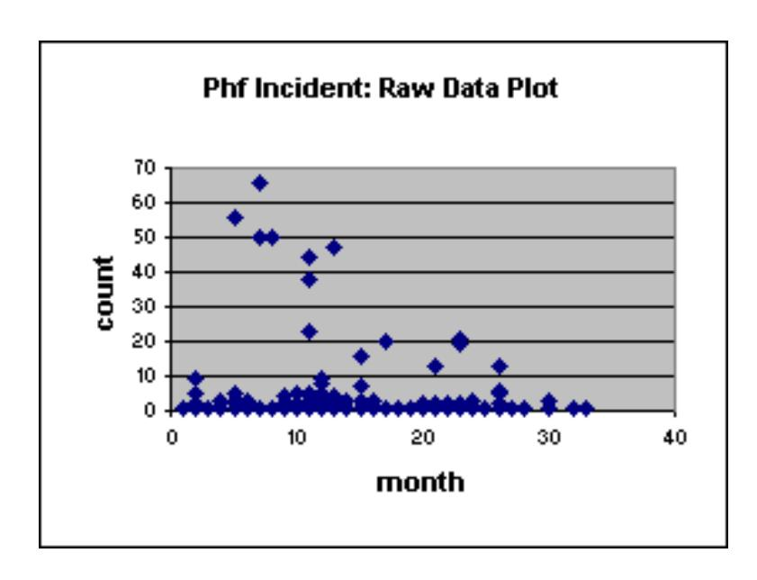

Figure 1: Phf intrusions

and telephone numbers. The vulnerability exploited in phf was an implementation error, and not an underlying security problem with CGI or the web server. The vulnerable phf program was distributed with both the apache and NCSA HTTPd servers.

The phf script works by constructing a command line string based on input from the user. While the script attempted to filter the user's input to prevent the execution of arbitrary commands, the authors failed to filter a new line character. As a result, attackers could execute arbitrary commands on the web server at the privilege level of the http server daemon- usually root [10]. A plot of the count of phf incidents over time is shown in Figure 1. In this and all following plots, incidents reported by day are binned by month, so that multiple incidents may appear in the same month.

#### **3.2.2 Berkeley Internet Name Domain (Bind)**

Bind provides an implementation of the domain name system (DNS) which maps an Internet host name such as bozo.cs.umd.edu to its Internet Protocol (IP) address, i.e. bozo.cs.umd.edu maps to 128.8.128.38. The flaw in bind involved a buffer overflow in the inverse query directive to bind which takes an IP address and maps it to the host's fully qualified domain name (FQDN), i.e. 128.8.128.38 maps to bozo.cs.umd.edu [13]. A plot of the count of bind incidents over time is shown in Figure 2.

#### **3.2.3 Internet Message Access Protocol (IMAP)**

IMAP provides a method to access electronic mail over a network using a server-based approach. The client is able to access and manipulate the messages as if they were local. A client, once connected to the IMAP service, may create, delete, and rename messages and mailboxes. A client connects to the service by contacting the server through a well-known port, 143. After connecting, the client must authenticate itself – usually through sending a username and password. Unfortunately, a buffer overflow existed in the source code distributed by the University of Washington in the login process such that the use of a long username would cause a buffer overflow [11].

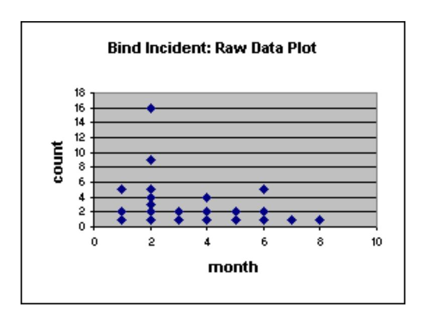

Figure 2: Bind intrusions

Unfortunately, the IMAP server contained a second flaw that was identified almost a year later. This flaw, also a buffer overflow, involved the server level authentication mechanism of IMAP [12].

Rather than separate the two flaws into different case studies, the two were combined for two reasons. First, the incident data, in most cases, did not differentiate between the two flaws. And second, several later scripts combined the two flaws- making it difficult to determine exactly which flaw was exploited. A plot of the count of IMAP incidents over time is shown in Figure 3.

## **3.3 Validation Samples**

This section presents a brief description of three vulnerabilities used as validation samples for the model we build in the next section. In the initial samples, we combined the two different IMAP vulnerabilities because it was difficult to differentiate intrusions. In the new samples, we also consider two vulnerabilities with the same program, *statd*. This time, however, we can differentiate between the vulnerabilities because of changes in the reporting of the incidents. For several years now, vulnerabilities have been given a unique identifier by the CERT/CC. Previously, the vulnerability exploited in an incident would be reported by it's name, e.g. *IMAP*, only. Recently, however, the incident reports now also include the vulnerability identifier. As a result, we were able to easily separate the incidents related to the two *statd* incidents.

#### **3.3.1 mountd**

The networked file system (NFS) uses a privileged daemon on servers to permit clients to mount remote file systems and utilize them as local file systems. A buffer overflow existed in this daemon program, *mountd*, on Linux and SGI systems which permitted an attacker to execute arbitrary code on the server [14].

#### **3.3.2 statd bounce**

The *statd* bounce vulnerability utilized two distinct vulnerabilities- *statd* and *automountd*. NFS uses the statd program to communicate changes between NFS servers and clients. The automountd program automatically

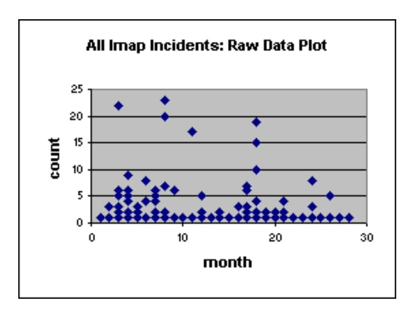

Figure 3: IMAP intrusions

mounts file systems when they are required.

The vulnerability with *statd* accepted calls to services and forward them as if they originated from the statd program. Attackers utilized this to send a request to automountd which contained a localhost buffer overflow. "Bouncing" the request through *statd* permitted the exploitation of a localhost flaw remotely [15].

#### **3.3.3 statd format**

The *statd* format vulnerability allows the remote execution of arbitrary code at the privilege level of *rpc.statd* which is usually root as the result of unchecked user input [16].

## **4 Modeling and Analysis**

When we started our investigation, we were primarily interested in confirming the "poor system administration" hypothesis as noted in the introduction, and we had an initial intuitive idea of the process whereby vulnerabilities are discovered, exploited, and re-mediated. In general, we expected the rate at which exploits occur to be fairly small in the period following the discovery of a vulnerability and to increase as the vulnerability and its associated exploit become more widely known. We expected the rate to decrease as the exploit became passe or as the pool of vulnerable machines became smaller due to the availability and application of patches or the replacement of vulnerable software.

Figure 4 illustrates the kind of behavior that we expected to find. We were not alone in making these assumptions. Kendall [5] gives a similar model in his Masters Thesis, and more recently, Bruce Schneier put forth a similar model in his online newsletter, Cryptogram [4]. When we analyzed the CERT data for the incidents discussed in the previous section, we discovered that we were wrong. As the graphs in Figures 1-3 indicate, the incidents have a decidedly positive skew toward early months in the reporting, rather than the negative skew hypothesized in figure 4. Further, almost all of the incidents that were associated with the vulnerabilities we examined were avoidable. Patches were available prior to the start of significant reporting

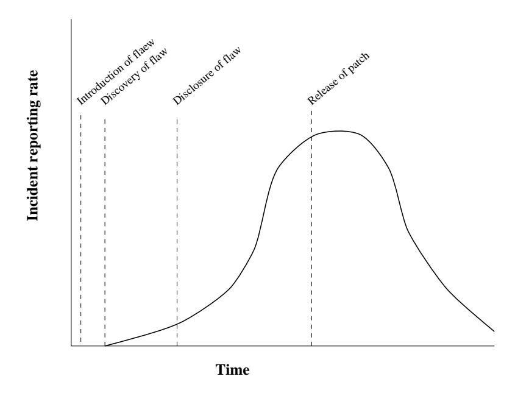

Figure 4: An intuitive (but incorrect) depiction of intrusive behavior

activity, which occurred when a script for the exploit was made available, rather than shortly following disclosure. Thus, scripting seems to be the major trigger for incidents, and the largest number of incidents appear soon after this event. This is discussed in more detail elsewhere [3] and will not be considered further here.

Having found similar shapes in the raw data for all three incidents, we then examined the cumulative graphs of the incidents over time, and found that each case could be transformed into a nearly linear form. As a result, we performed a statistical analysis of the data and have determined that data from the three cases can be modeled using a single framework. Data from the two largest validation exploit cycles also seem to fit the framework as well2 . Thus, it appears that data from the early stages of an exploit cycle, particularly the rate at which incidents are reported following the release of a script, can be used to predict the magnitude of the cycle, but not, as yet, its duration.

In the remainder of this section, we describe our analytical techniques and our results. The section is illustrated with graphical results from a single exploit cycle, phf, as described in section 3.2.1, but similar graphs for the other cycles are given in Appendix 5.

## **4.1 Graphical Analysis**

Our goal in studying three different vulnerability incidents was to determine if there were any underlying similarities or trends that were independent of any particular incident. Such trends could then potentially be used to understand and respond more effectively to future incidents. We plotted the raw and cumulative data grouped by month for the three vulnerability incidents. We also split the IMAP data into two separate incidents based on the discovery date of the second incident so that we could also consider both incidents separately. Raw and cumulative plots for the phf incident are shown in Figure 1 and Figure 5. Raw plots for the other incidents appear in Figures 3 and 2. Cumulative plots for the other incidents are found in Appendix 5 (Figures 10–13). All of these plots show similar shapes, indicating that a common model relating time to

2The third validation sample does not contain enough data points as yet.

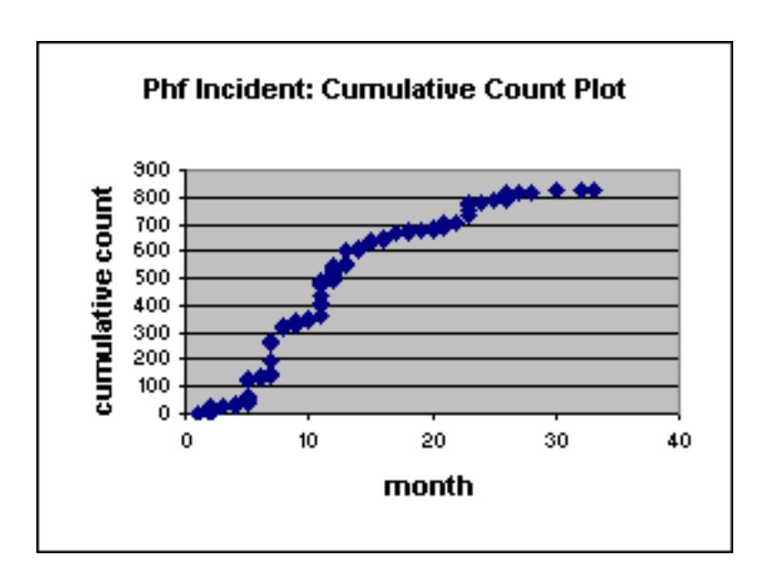

Figure 5: Cumulative phf intrusions

incidents might be applicable to all the incidents, and perhaps to future incidents as well. The shape of the cumulative plots indicates that a standard linear regression model can be applied using month as a predictor for incident count, but only after satisfying certain assumptions.

First, the plots of the data should indicate a linear relationship. The cumulative plots are all slightly curved as a result of fewer reported incidents in later months. This drop off violates the first assumption, as well as the second, which requires a relatively normal distribution of the raw data measured. The raw data plots all show a slightly positive skew away from a normal distribution as a result of more reported incidents in earlier months.

## **4.2 Transformation Analysis**

To solve these problems, a standard technique in regression analysis is to apply a transformation to the independent or dependent variable or both. In [17], the authors suggest that applying either a square root or logarithmic transformation to the independent variable (month) can help correct positive skewness in the raw data. Such transformations also remove some of the curvature from the cumulative data. We performed regressions using both transformations, as well as standard, non-transformed regression, and obtained the best overall results (criteria described below) for all three incidents using the square root transformation. Plots for the phf incident are shown in Figure 6 and Figure 7. Plots for the other incidents appear in Appendix 5 (Figures 14–21). All of the transformed raw data plots show a more normal distribution, and the transformed cumulative plots are more linear, as desired.

## **4.3 Residual Analysis**

In addition to the assumptions about linearity and normality of the raw data, linear regression also requires certain properties be true of the errors in the regression model. While a good regression model will explain most of the relationship between the independent and dependent variables being studied, some degree of error always remains. Regression seeks to reduce error by minimizing residuals, the differences between the

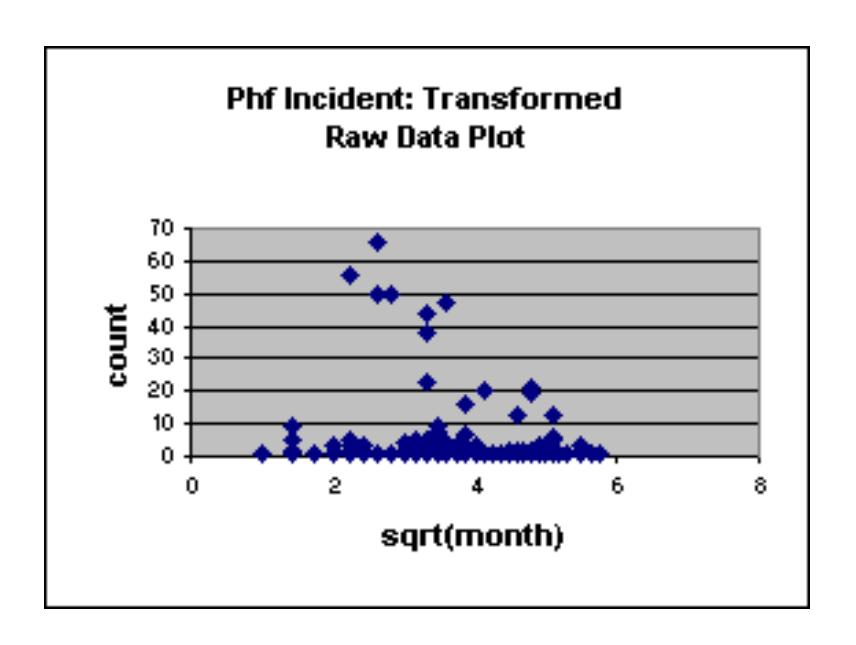

Figure 6: Transformed phf intrusions

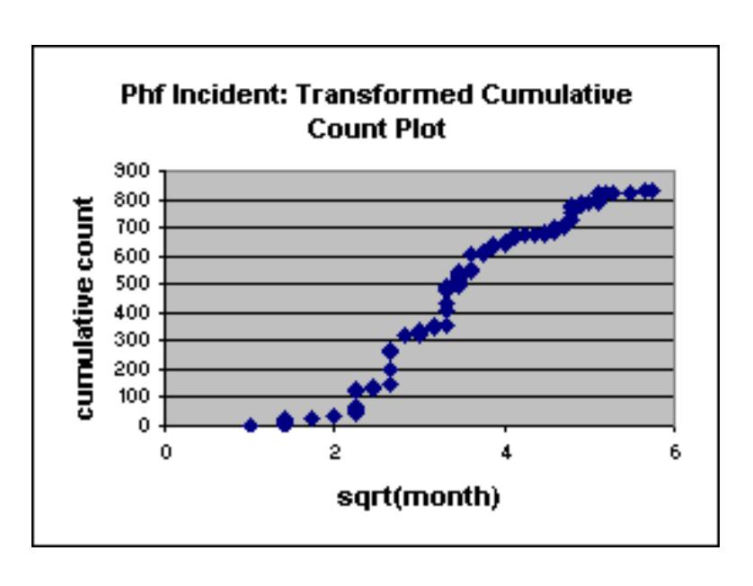

Figure 7: Transformed cumulative phf intrusions

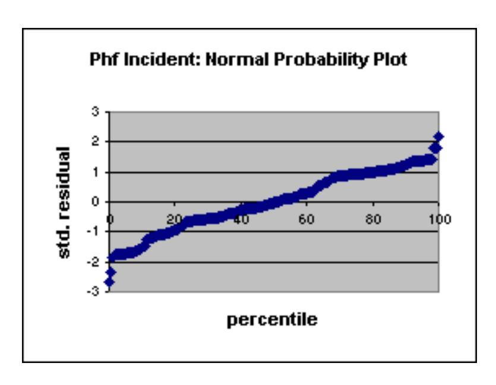

Figure 8: Phf incident normal probability plot

measured values of the dependent variable and the values predicted by the regression model. These residuals should be normally distributed with mean 0 and constant variance. To check the normality property, one plots the standardized residuals against the corresponding percentile in a normal probability plot. If the residuals are normally distributed, the points will fall along a straight line. To check the constant variance property (known as homoscedasticity), one plots the standardized residuals against the independent variable. If the residuals have constant variance, they should fall in a horizontal band above and below the horizontal line Y=0.

The normal probability plot (Figure 8) for the phf incident shows the results for the square root transformation and indicates that the distribution of the residuals is relatively, though not perfectly normal. The standardized residual plot for the square root transformation on the phf incident (Figure 9) is not perfectly scattered, but does not indicate any particular pattern. Plots for the other incidents show similar results and appear in Appendix 5 (Figures 22–29). In [18], the author suggests a number of possible remedies when these plots do not look appropriate. A logarithmic transformation, rather than a square root transformation, is suggested for removing the S shape from the normal probability plots, but this transformation did not improve these plots over the square root transformation. Weighted regression, multiple regression, nonlinear regression, and removal of outliers are also suggested. However, weighted regression, which involves assigning a different weight to each point in the data, is only useful when the residuals exhibit a pattern indicative of a non-constant variance. Multiple regression, which uses more than one predictor, may be appropriate, but we currently only have time as a known predictor. Nonlinear regression is usually only appropriate when there is a known, underlying relationship between the independent and dependent variables, such as a biological or chemical phenomena. We did not identify or remove any outliers because we aggregated our data by month, so any day to day abnormalities would likely be smoothed out.

## **4.4 Regression Analysis**

Having identified the square root transformation as the best candidate for meeting the assumptions required for regression, we performed the regression analysis. The results of the regressions on the transformed data

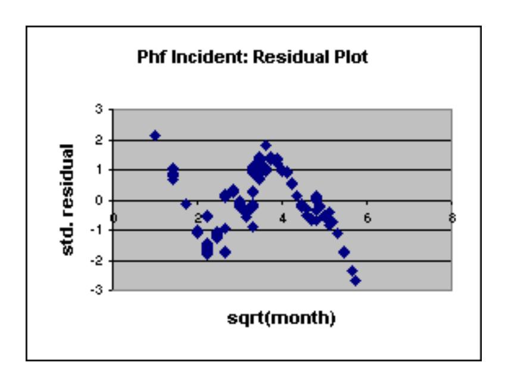

Figure 9: Phf incident residual plot

for all three incidents and the two split IMAP incidents are listed in Table 1. These regressions calculate a slope and intercept such that the relationship between time (in months) since the start of the exploit cycle (M) and cumulative incident count (C) satisfies the linear equation: C = I + S p M where I and S are the intercept and slope of the regression line, respectively. The quality of the regression is usually measured using the coefficient of determination, known as R2 , which describes the proportion of the observed variation in the count that can be explained by time. The closer this value is to 1, the better the regression. We obtained values larger than .89 for all incidents, indicating that this regression model is quite good. An analysis of variance (ANOVA) test comparing the variation explained by R2 to the variation explained by errors yielded almost negligible P-values (P.01) for all incidents, indicating a strong probability that the model adequately explains the relationship. We also performed regressions using the untransformed data and the logarithmically transformed data for comparison (see Table 2). The R2 values for the square root transformation were the best for all incidents except for the second Imap incident, where the logarithmic transformation was slightly better. However, even in this last case, we would still choose the square root transformation because the difference is so small and the plots for the square root transformation were better.

The results for the values of the slopes and intercepts of the lines in Table 1 do not indicate any similarity in line shape across the incidents. The slope value for the phf incident is roughly double that of the combined IMAP incidents, and roughly quadruple that of the bind incident. The bind incident took place over a much shorter period of time than the other two incidents, and the IMAP incident includes two separate events. These differences may account for the lack of a common slope and/or intercept shared by the incidents, though such a common model may not be realistic even with cleaner, more uniform data given that the nature of the incidents may be quite different. Nonetheless, t-tests on all the values of the slopes and intercepts yielded almost negligible P-values (P.01) for all incidents, indicating a strong probability that these values can be used to adequately explain the relationship between month and cumulative count for each separate incident.

|          | R2    | P-Value   | Slope | P-Value   | Intercept | P-Value  |
|----------|-------|-----------|-------|-----------|-----------|----------|
| bind     | 0.908 | 3.70E-29  | 60    | 3.70E-29  | -50       | 1.40E-12 |
| phf      | 0.939 | 2.03E-130 | 240   | 2.03E-30  | -378      | 1.75E-65 |
| All IMAP | 0.981 | 8.02E-182 | 126   | 8.02E-182 | -167      | 2.09E-96 |
| 1st IMAP | 0.965 | 1.22E-80  | 124   | 1.22E-80  | -160      | 1.79E-50 |
| 2nd IMAP | 0.896 | 6.96E-50  | 86    | 6.96E-50  | -96       | 1.31E-23 |

Table 1: Regression results for square root transformation

|          | Square Root | Logarithmic | Untransformed |
|----------|-------------|-------------|---------------|
| bind     | 0.908       | 0.903       | 0.884         |
| phf      | 0.939       | 0.910       | 0.881         |
| All IMAP | 0.981       | 0.952       | 0.971         |
| 1st IMAP | 0.965       | 0.942       | 0.943         |
| 2nd IMAP | 0.896       | 0.897       | 0.833         |

Table 2: Comparison of R2 values for three types of regressions

## **4.5 Testing the Model**

To test the accuracy of our model, we applied it to additional samples to see if it was robust enough to handle more recent incidents. The mountd and statd bounce incidents described in sections 3.3.1 and 3.3.2 provided data over about 15 months, less than the approximately 30 months covered by the IMAP and phf incidents, but still enough to consider. We did not consider the statd format incident described in section 3.3.3 as it only covered four months- too few data points to provide an adequate test as of yet. We performed the same analyses described above to see if the model held. The results are quite encouraging. For both data sets, we performed standard regression, square root transformation regression, and logarithmic transformation regression. For both data sets, both transformations improved the raw and cumulative data plots as compared to the untransformed data. For both data sets, both transformations also improved the normal probability and residual plots. For brevity, we illustrate these points in Appendix 5 with the same set of plots as the original analysis: the raw and cumulative plots for the untransformed data and the square root transformed data, and the normal probability and residual plots for the square root transformed data (Figures 30–41).

The coefficients of determination (R2 ) for the regressions performed on the two additional data sets and their square root and logarithmic transformations are shown in Table 4. For both data sets, both the square root and logarithmic transformations produce better results than the untransformed data. All the R2 values for the transformed data are .839 or better, indicating a strong correlation between cumulative count and time, though not as strong as our original data. For both data sets, the R2 for the logarithmic transformation is better than that for the square root transformation, which does not support our original choice of the square root model. However, the smaller size of the two new data sets may artificially skew the data in favor of the logarithmic model. Given more data over a longer period of time for these two incidents, we would expect to see the number of incidents decrease. This in turn would favor the square root model, consistent with our analysis on the larger data sets. We will obtain more data for these two incidents to verify these hypotheses in the future.

The R2 , slope, and intercept values and their respective P values for the regression on the square root transformed data are shown in Table 3. Although this was not the best model for these new data sets, the P-values for all but the intercept for the statd incident are all significant (P.01), indicating that the model

|        | R2    | P-Value  | Slope | P-Value  | Intercept | P-Value  |
|--------|-------|----------|-------|----------|-----------|----------|
| mountd | 0.839 | 7.25E-28 | 72    | 7.25E-28 | -84       | 3.91E-14 |
| statd  | 0.857 | 8.47E-20 | 52    | 8.57E-20 | -10       | 1.98E-01 |

Table 3: Regression results for square root transformation

|        | Square Root | Logarithmic | Untransformed |
|--------|-------------|-------------|---------------|
| mountd | 0.839       | 0.868       | 0.761         |
| statd  | 0.857       | 0.935       | 0.707         |

Table 4: Comparison of R2 values for three types of regressions

remains valid. As with the three original data sets, there does not appear to be any relation between the slope and intercept values for the two incidents.

## **4.6 Model Selection and Prediction**

Given the results of the regression analyses above, a linear regression model using a square root transformation on time appears to provide very good predictive power for the accumulation of security vulnerability incidents following the release of a script for the vulnerability. More data is needed to authoritatively select the square root transformation over the logarithmic model, but we believe the square root model will prevail. The incidents studied vary widely on the values of the slope and intercept of their respective regression lines, indicating that there is no one formula for a line applicable to all past and future incidents which is as expected. However, given a few months of data for a new incident, we believe that a regression line fit using the square root transformation will provide an accurate extrapolation of the incident reporting pattern in the future. This information provides a powerful tool for system administrators. Although it cannot predict the duration of a vulnerability, it can identify the most severe vulnerabilities - those with the steepest regression line slopes. Armed with this information, the security community can become pro-active rather than reactive with respect to incident response.

## **5 Conclusions and Future Work**

Intuitively, many researchers have felt that the availability of patches reduce the severity of incidents after a small time delay. Unfortunately, our evidence has found this is not the case, and that incidents accumulate regardless of the existence of corrections for the exploited vulnerabilities. The incidents, however, accumulate in a near linear fashion which has allowed us to develop a statistical model of the incident accumulation rate. While the model does not yet determine when an incident will dissipate, it does provide a predictor for the rate of growth of incidents. The benefits of such a predictor are significant. For instance, once the first few months of incident data have been collected, an incident handling organization can use our model to forecast the rate at which the incident will continue. Such analysis permits the organization to plan it's staffing requirements rather than reacting. Operational organizations, can benefit from the knowledge of the severity of continuing incidents. For instance, most operational organizations test vendor supplied patches prior to deployment to ensure that the fix for the vulnerability does not produce unwanted side effects. In the case of security related patches, a time-bar is usually established as to when the patch must be deployed. This time-bar is set based on the severity of the vulnerability and weighs the risk of the vulnerability verses

the risk of reduced testing. By using the severity of the incident in conjunction with the severity of the vulnerability, organizations can establish a time-bar that provides significantly better risk management than if they had just considered the severity of the vulnerability.

In the future, we plan to collect additional data to continue validation our model and to perform "real time" tests by predicting the severity of current incidents. We also plan to examine additional models that may assist in predicting the duration of incidents- extending our analysis from a linear regression into a multi-variate regression. This will require the consideration of additional dependent variables such as the type of systems involved in the incident as well as the events in the exploit cycle.

We also plan on investigating new methods and practices in an effort to reduce the large window of vulnerability that exists because of poor systems management. One method we are currently investigating is the secure automation of the deployment of patches. While such a solution appears easy at first glance, developing the process and the implementation that works on a wide scale is not.

## **References**

- [1] J. Howard, *An Analysis Of Security Incidents On The Internet: 1989 1995*. PhD thesis, Carnegie Mellon University, April 1997.
- [2] G. A. Office, "Information security: Computer attacks at department of defense pose increasing risks," Tech. Rep. GAO/AIMD-96-84, U.S. Government Accounting Office, 1996.
- [3] Anonymous, "Anonymous for reviewing purposes,"
- [4] B. Schneier, "Full disclosure and the window of vulnerability." In Crypto-Gram available as http: //www.counterpane.com/crypto-gram-0009.html#1, September 15, 2000.
- [5] K. Kendall, "A database of computer attacks for the evaluation of intrusion detection systems," BS/MS thesis, Massachusetts Institute of Technology, June 1999.
- [6] "Transmission control protocol darpa internet program protocol specification," RFC 973, USC/Information Sciences Institute, September 1981.
- [7] "Internet protocol darpa internet program protocol specification," RFC 971, USC/Information Sciences Institute, September 1981.
- [8] S. Bellovin, "Security problems in the TCP/IP protocol suite," *Computer Communication Review*, vol. 19, pp. 32–48, April 1989.
- [9] "CERT Advisory CA-1995-01: IP spoofing attacks and hijacked terminal connections." Available at http://www.cert.org/advisories/CA-1995-01.html, January 1995.
- [10] "CERT Advisory CA-1996-06 : Vulnerability in NCSA/Apache CGI example code." Available at http://www.cert.org/advisories/CA-1996-06.html, March 1996.
- [11] "CERT Advisory CA-1997-09 : Vulnerability in IMAP and POP." Available at http://www.cert. org/advisories/CA-1997-09.html, April 1997.
- [12] "CERT Advisory CA-1998-09 : Buffer overflow in some implementations of IMAP servers." Available at http://www.cert.org/advisories/CA-1998-09.html, July 1998.

- [13] "CERT Advisory CA-1998-05 : Multiple vulnerabilities in BIND." Available at http://www. cert.org/advisories/CA-1998-05.html, April 1998.
- [14] "CERT Advisory CA-1998-12 : Remotely exploitable buffer overflow vulnerability in mountd." Available at http://www.cert.org/advisories/CA-1998-12.html, October 1998.
- [15] "CERT Advisory CA-1999-05 : Vulnerability in statd exposes vulnerability in automountd." Available at http://www.cert.org/advisories/CA-99-05-statd-automountd.html, June 1999.
- [16] "CERT Advisory CA-2000-17 : Input validation problem in rpc.statd." Available at http://www. cert.org/advisories/CA-2000-17.html, August 2000.
- [17] B. Tabachnick and L. Fidell, *Using Multivariate Statistics*. Harper and Row, 1983.
- [18] J. Devore, *Probability and Statistics for Engineering and the Sciences*. Duxbury Press, fourth ed., 1995.

## **Appendix: Supporting Graphs**

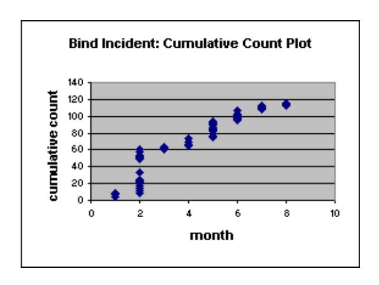

Figure 10: Cumulative bind intrusions

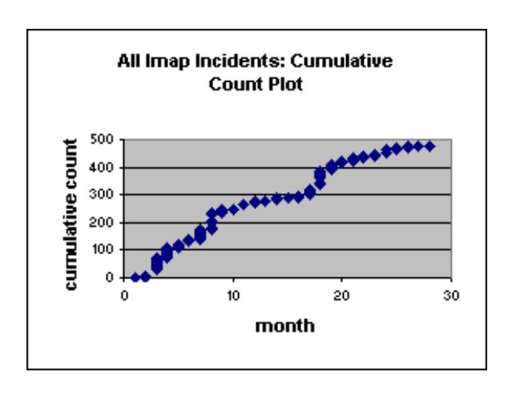

Figure 11: Cumulative IMAP intrusions

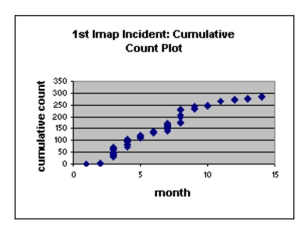

Figure 12: Cumulative IMAP1 intrusions

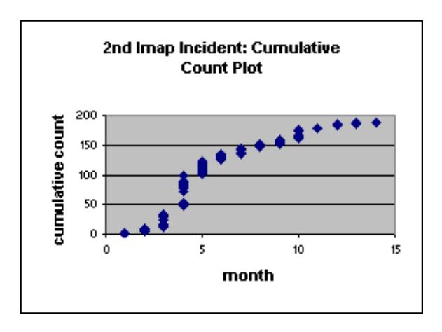

Figure 13: Cumulative IMAP2 intrusions

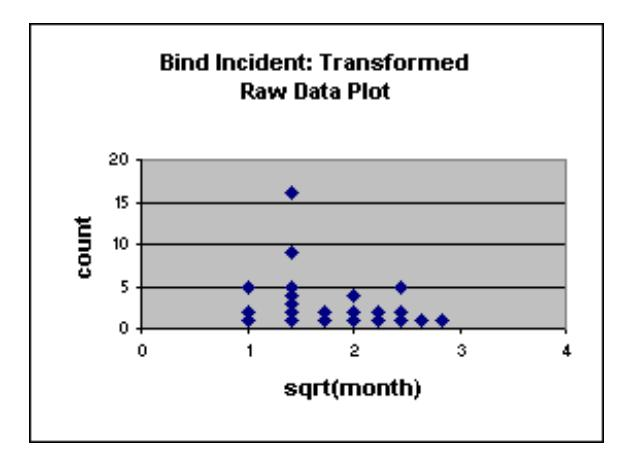

Figure 14: Transformed bind intrusions

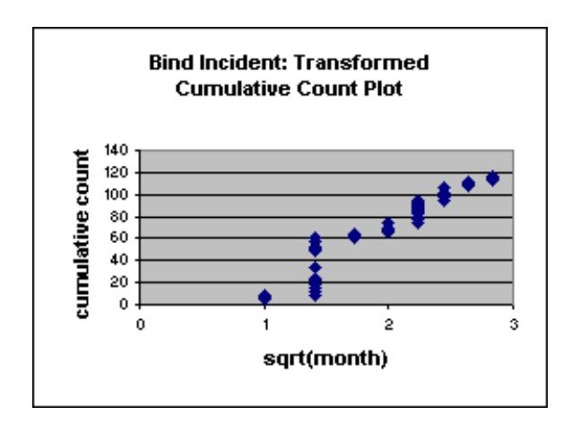

Figure 15: Transformed cumulative bind intrusions

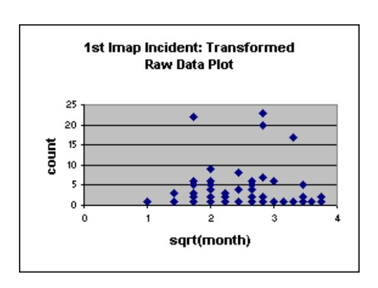

Figure 18: Transformed 1st IMAP intrustions

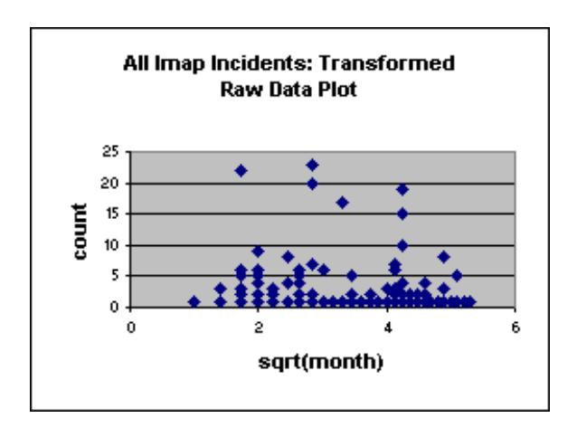

Figure 16: Transformed IMAP intrusions

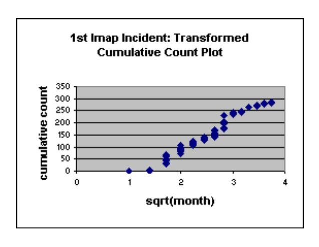

Figure 19: Transformed cumulative 1st IMAP intrusions

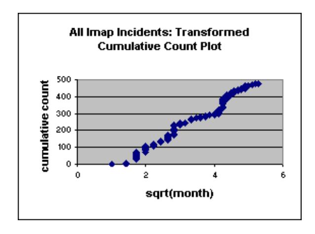

Figure 17: Transformed cumulative IMAP intrusions

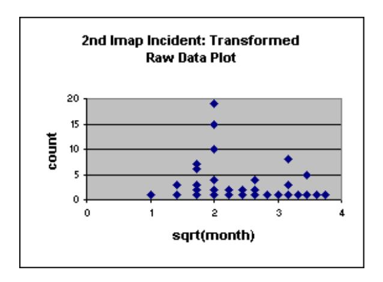

Figure 20: Transformed 2nd IMAP intrusions

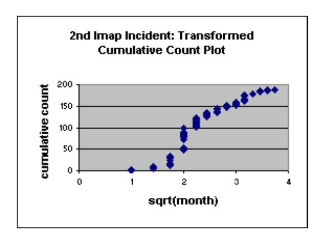

Figure 21: Transformed cumulative 2nd IMAP intrusions

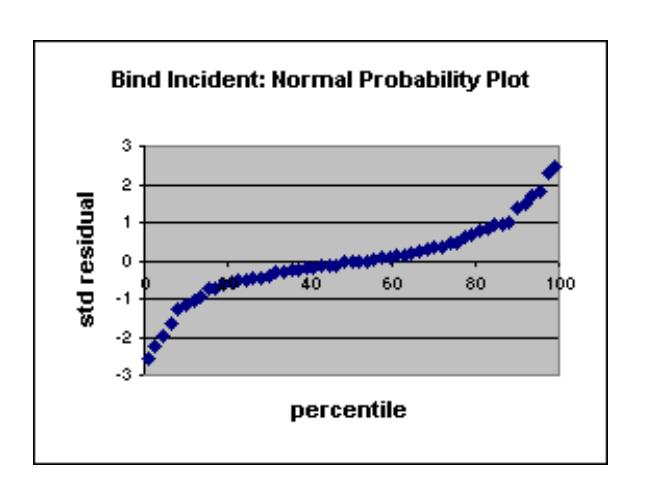

Figure 22: Bind incident normal probability plot

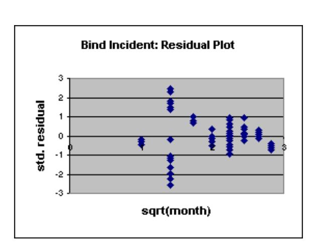

Figure 23: Bind incident residual plot

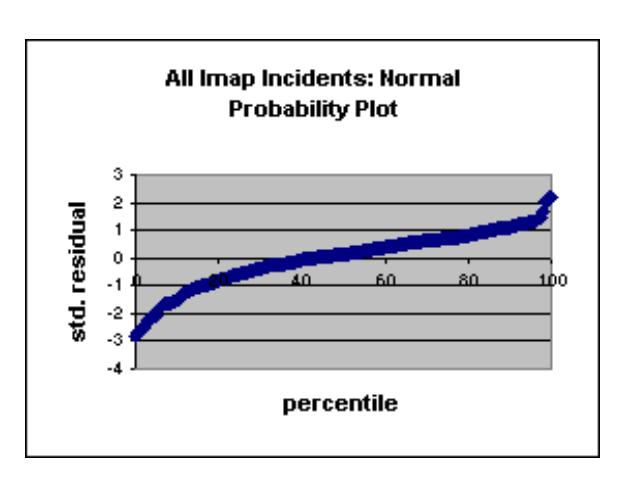

Figure 24: All IMAP incidents normal probability plot

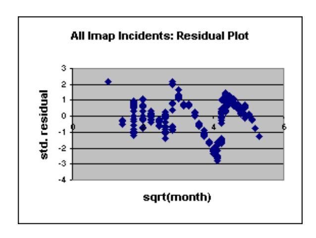

Figure 25: All IMAP incidents residual plot

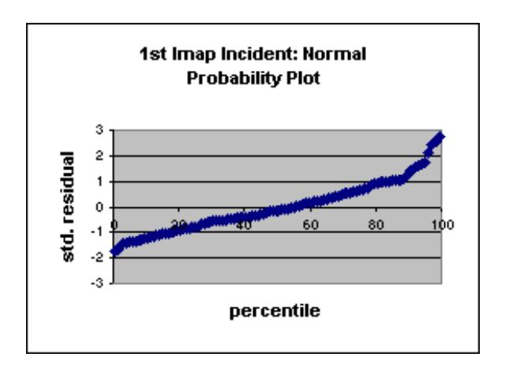

Figure 26: First IMAP incident normal probability plot

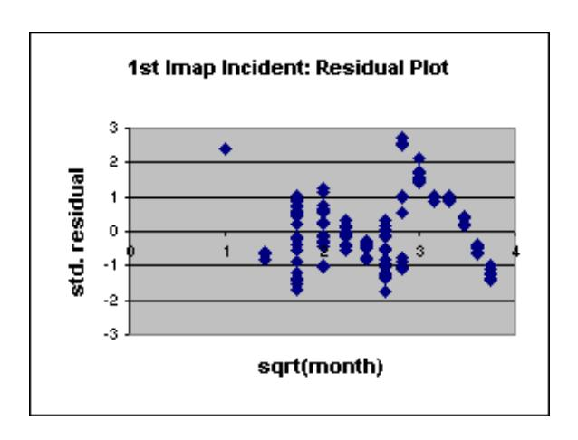

Figure 27: First IMAP incident residual plot

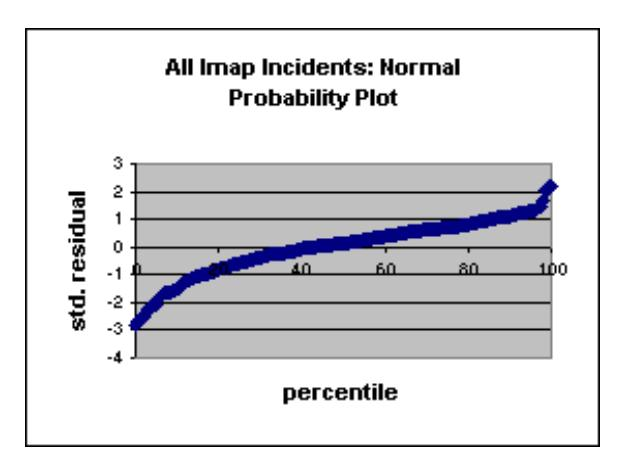

Figure 28: Second IMAP incident normal probability plot

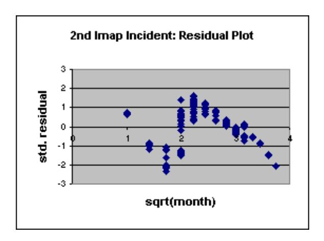

Figure 29: Second IMAP incident residual plot

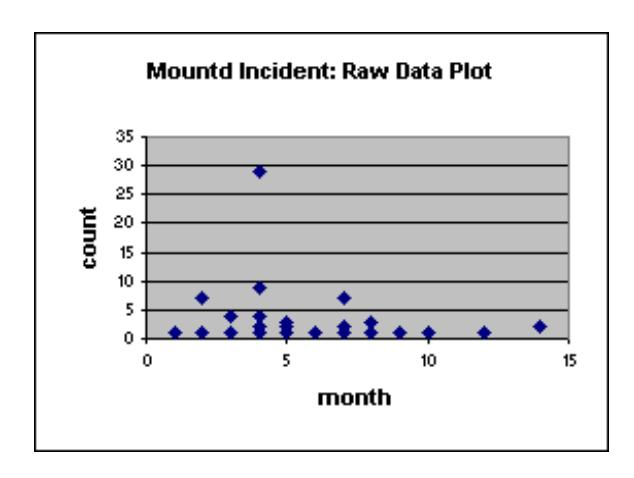

Figure 30: Mountd intrusions

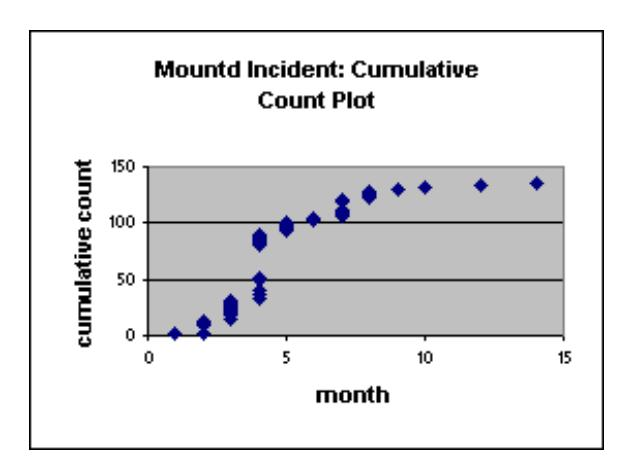

Figure 31: Cumulative mountd intrusions

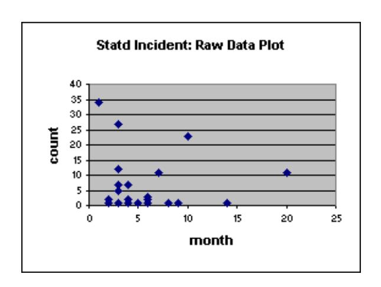

Figure 32: Statd intrusions

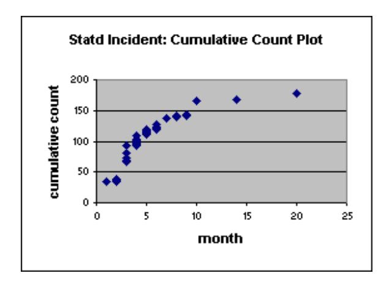

Figure 33: Cumulative statd intrusions

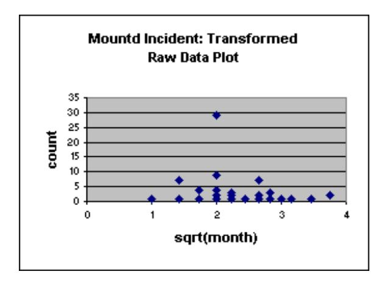

Figure 34: Transformed mountd intrusions

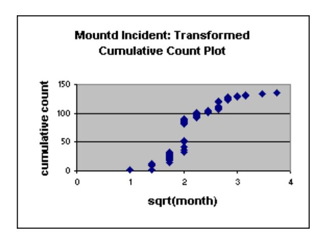

Figure 35: Transformed cumulative mountd intrusions

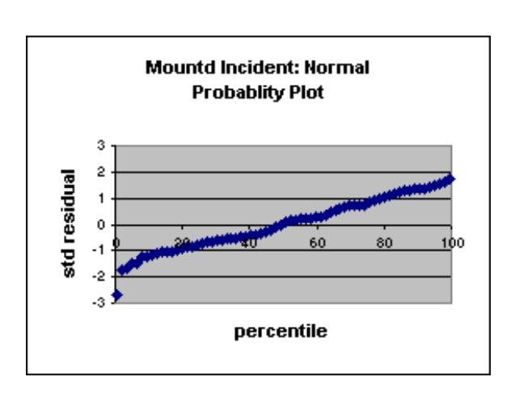

Figure 38: Mountd incident normal probability plot

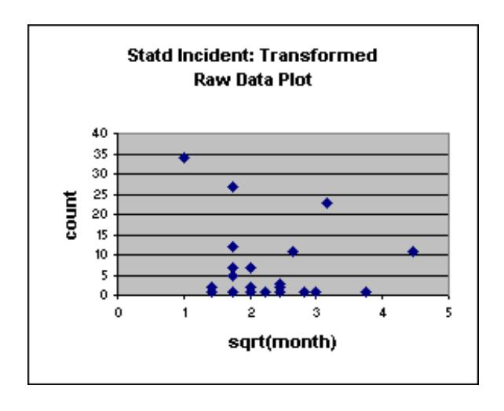

Figure 36: Transformed statd intrusions

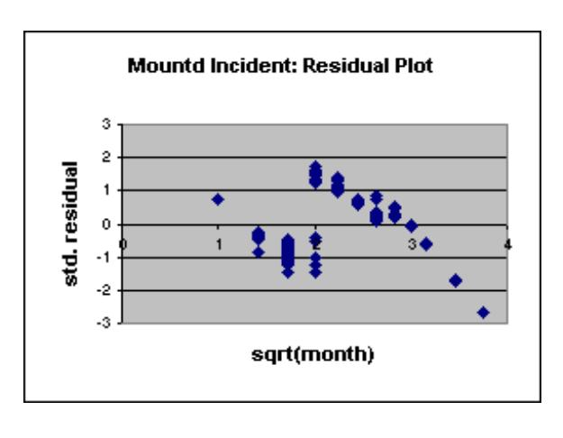

Figure 39: Mountd incident residual plot

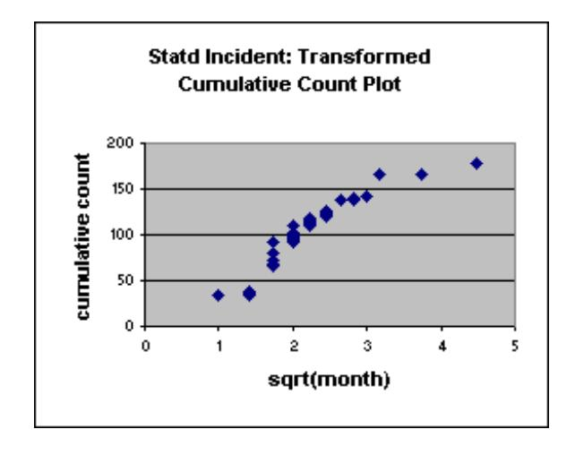

Figure 37: Transformed cumulative statd intrusions

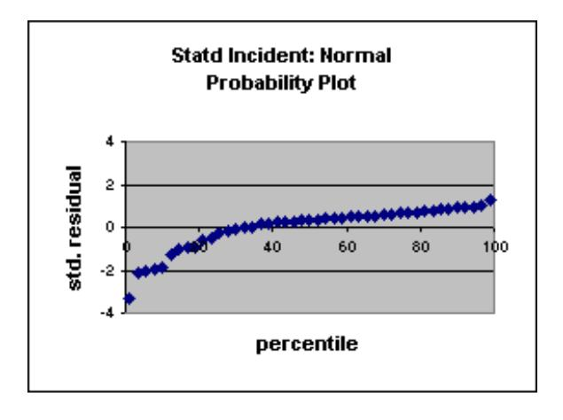

Figure 40: statd incident normal probability plot

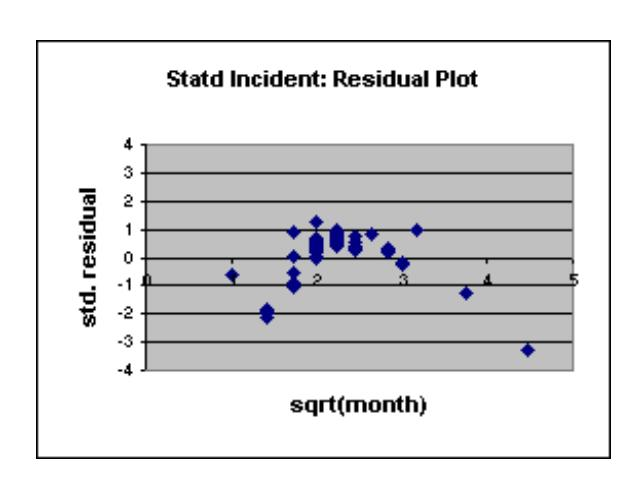

Figure 41: Statd incident residual plot