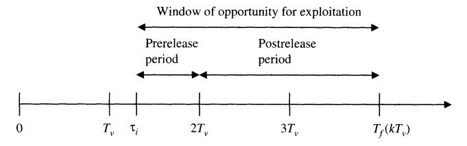

Security Patch Management: Share the Burden or Share the Damage?

Author(s): Hasan Cavusoglu, Huseyin Cavusoglu and Jun Zhang

Source: Management Science , Apr., 2008, Vol. 54, No. 4 (Apr., 2008), pp. 657-670

Published by: INFORMS

Stable URL:<https://www.jstor.org/stable/20122418>

JSTOR is a not-for-profit service that helps scholars, researchers, and students discover, use, and build upon a wide range of content in a trusted digital archive. We use information technology and tools to increase productivity and facilitate new forms of scholarship. For more information about JSTOR, please contact support@jstor.org.

Your use of the JSTOR archive indicates your acceptance of the Terms & Conditions of Use, available at https://about.jstor.org/terms

INFORMS is collaborating with JSTOR to digitize, preserve and extend access to Management Science

 Vol. 54, No. 4, April 2008, pp. 657-670 DOI i0.1287/mnsc.l070.0794 ISSN 0025-19091 eissn 1526-55011081540410657 ? 2008 INFORMS

# Security Patch Management: Share the Burden or Share the Damage?

 Hasan Cavusoglu Sauder School of Business, University of British Columbia, Vancouver, British Columbia V6T 1Z2, Canada, cavusoglu@sauder.ubc.ca

 Huseyin Cavusoglu, Jun Zhang School of Management, University of Texas at Dallas, Richardson, Texas 75083 {huseyin@utdallas.edu, jun.zhang@utdallas.edu)

 Patch management is a crucial component of information security management. An important problem within this context from a vendor's perspective is to determine how to release patches to fix vulnerabilities in its software. From a firm's perspective, the issue is how to update vulnerable systems with available patches. In this paper, we develop a game-theoretic model to study the strategic interaction between a vendor and a firm in balancing the costs and benefits of patch management. Our objective is to examine the consequences of time-driven release and update policies. We first study a centralized system in a benchmark scenario to find the socially optimal time-driven patch management. We show that the social loss is minimized when patch-release and update cycles are synchronized. Next, we consider a decentralized system in which the vendor determines its patch-release policy and the firm selects its patch-update policy in a Stackelberg framework, assuming that release and update policies are either time driven or event driven. We develop a sufficient condition that guarantees that a time-driven release by the vendor and a time-driven update by the firm is the equilibrium outcome for patch management. However, in this equilibrium, the patch-update cycle of the firm may not be synchronized with the patch-release cycle of the vendor, making it impossible to achieve the socially optimal patch management in the decentralized system. Therefore, we next examine cost sharing and liability as possible coordination mechanisms. Our analysis shows that cost sharing itself may achieve synchronization and social optimality. However, liability by itself cannot achieve social optimality unless patch-release and update cycles are already synchronized without introducing any liability. Our results also demonstrate that cost sharing and liability neither complement nor substitute each other. Finally, we show that an incentive-compatible contract on cost sharing can be designed to achieve coordination in case of information asymmetry.

 Key words: information technology security; liability; cost sharing; patch management; coordination schemes History: Accepted by Barrie R. Nault, information systems; received January 10, 2005. This paper was with the authors 10 months for 4 revisions.

### 1. Introduction

 After the flames from Slammer's attack were doused and the technology industry caught up on its lost sleep, we started asking questions. Why did this happen? Could we have prevented it? What can we do to keep such a thing from happening again? (Donner 2003, p. 2)

 These are some of the questions that the security community asks after every major security incident. Today most security incidents are caused by flaws in software, called vulnerabilities (Shostack 2003). It is estimated that there are as many as 20 flaws per thousand lines of software code (Dacey 2003). Computer Emergency Response Team/Coordination Center (CERT/CC) statistics reveal that the num ber of vulnerabilities reported has increased dra matically over the years, from only 171 in 1995 to 8,064 in 2006 (CERT 2007). Along with vulnerabilities, the sophistication of attack tools has also advanced over time. Using the interconnected nature of the

 Internet and automated attack tools, attackers (hack ers) exploit software vulnerabilities at an alarming rate to cause serious damage to firms, including unau thorized access to systems, corruption or modifica tion of data, and unavailability of system resources to authorized users. The ultimate solution to soft ware vulnerabilities is application of patches.1 Soft ware vendors generally release patches to fix vulner abilities in their software products. However, many systems are left unpatched for months, even for years (Shostack 2003). According to CERT/CC, around 95% of security breaches could be prevented by keeping systems up-to-date with appropriate patches (Dacey 2003). The Slammer worm, which swept the Internet in January 2003, caused network outages all around the world, affecting 911 call centers, airlines, and ATMs. But Microsoft had released the patch fixing

 1 Other solutions include workarounds and software upgrades. However, these are outside the scope of this paper.

 the vulnerability that Slammer exploited six months before the incident. Similarly, Code Red and Nimda wreaked havoc on those companies that were not current with their software patch updates (McGhie 2003).2

 So, if patches are the panacea to software vul nerabilities, why don't firms apply them as soon as vendors make them available? To begin with, patch management is multifaceted, and there are several operational reasons for not applying patches imme diately. First, there are too many vulnerabilities to patch. In an average week, vendors and security orga nizations announce around 150 vulnerabilities along with information on how to fix them (McGhie 2003). Sorting through all these vulnerabilities to find the relevant ones is a tedious and labor-intensive job. Second, patches cannot be trusted without testing (Dormer 2003). Before being applied in production environments, each patch must be tested to make sure that it is working properly and does not conflict with other existing applications in the system. Test ing many platforms and configuring the system rep resent significant time and cost. In fact, practitioners view the time and manpower requirements for test ing patches before deployment as their biggest chal lenge to patching servers in a timely manner (Shipley 2004). Third, there is no standard way of distribut ing patches. Some patches are available on the vendor website and some patches are not. Even if they are available, firms are too busy to continually check the vendor site (Bloor 2003). Fourth, every patch requires installation after testing. This mostly means taking the system down and restarting (rebooting) it. If the patch is applied to a critical system in a production envi ronment, downtime can be very expensive. There fore, updating systems with patches is costly. On the other hand, not updating systems promptly with nec essary patches can be costly too. The time window between identification of a vulnerability and creation of an exploit has shrunk dramatically over the years (Shipley 2004). Once an exploit is released, it may be too late to consider patching. For example, Slammer exploited 90% of vulnerable systems within 10 min utes of its release (Dacey 2003). Code Red infected a total of 359,000 computers within 14 hours of its release with a total estimated damage of \$2.6 billion (McGhie 2003), just to name a few. Firms must act fast to avoid falling victim to malicious acts.

 Today, patch management is regarded as an impor tant component of effective information security pro grams (McGhie 2003). However, managing the patch

 update process is complex and costly. Firms do not have slack resources to divert from other operations to the patch-update process. Updating systems with released patches has become a full-time job for IT professionals in many firms (Davidson 2003). The Aberdeen Group estimates the tab for patch man agement for U.S. businesses at \$2 billion per year (Ulfelder 2002). To manage the patch-update pro cess efficiently, firms need to determine the extent of resources, both human and technology, necessary to evaluate, test, and deploy patches, well in advance. Because the way the patch-update process is man aged has a profound effect on the level of resources needed to facilitate the process, firms today follow periodic update policies for patch management. For example, Novartis Pharma AG updates its systems every month (Pruitt 2003). Similarly, Therma Electron rolls out patches once a month (Foley and Hulme 2004). These periodic update policies, although sta tionary in nature, resolve the firm's resource uncer tainty in patch management by creating predictable schedules.3 Predictable schedules not only make the determination of necessary resources easy, but also balance the operational costs associated with patch ing vulnerabilities and security risks arising from not patching vulnerabilities.

 Periodic updates are even more possible today be cause most vendors release their patches periodically. Although the common practice in the past was to release patches as soon as they were ready, in an effort to ease the burden on system administrators struggling with frequency of updates, and to make the process more predictable, today many software vendors follow periodic patch-release policies (Pruitt 2003). For example, Microsoft changed its patch release schedule and switched to a monthly patch release cycle in October 2003. Computer Associates and SAP have been using periodic releases longer than Microsoft. Both Computer Associates and Peo pleSoft, Inc. issue patches quarterly (Foley and Hulme 2004).4 These periodic patch-release policies allow firms to plan for patch deployments (Fisher 2006). As said by Rick Greenwood, CTO of Shavlik Tech nologies, "if it's a planned event and you know that patches are coming, you can set up a structure to plan. It is not so much of a problem when you have advance notice" (Naraine 2005).

 Given that patch management is costly and vul nerabilities are defects caused by software ven dors, recently the security community has started

 2 The list also includes other malware, like Nanchi, Klez, Lovsan, SoBig, Bugbear, Swen, and Yaha. These malware exploited vulner abilities for which patches had been readily available before the major incident, but some firms had not applied the patches to pre vent damages (Fontana 2003).

 3 This is very similar in concept to the periodic review inventory policies that firms follow to replenish their inventories.

 4 Although patches for critical vulnerabilities are still released as early as possible, typical vulnerabilities, which constitute a very large fraction of all vulnerabilities, are fixed through periodic releases.

 questioning the implications of cost sharing for patch management. Because firms currently bear the cost of patching, and firms cannot keep up with the sheer number of patches released by vendors every day, it may help firms if software vendors share this burden (F?rber 2003). The argument is very simple: Because you do not have to pay to repair your car when a manufacturer defect, such as faulty brakes, is found, why should firms pay for the cost of patching? What if the vendor's release policy prevents the patch from being released? Then, the question changes to a lia bility issue in security. Using the previous analogy, if faulty breaks cause you to be in an accident, the car manufacturer can be held liable in court. What if a firm's server is attacked because of a specific vulner ability for which a patch has not yet been released by the vendor? Should the software vendor be liable for

 the firm's damage? In this paper, we study the problem of patch man agement to understand how patches should be re leased and how vulnerable systems should be updated with released patches following stationary policies. We consider two types of stationary policies: (i) time driven patch management in which patches are re leased or updated in batches once after a fixed amount of time has elapsed, and (ii) event-driven patch man agement in which patches are released by the vendor in batches after a fixed number of vulnerabilities have been identified or updated by the firm in batches after a fixed number of patches are available. Sta tionary policies are of particular interest to us for the following reasons. First, it seems unlikely that a vendor /firm will use complex dynamic proce dures to manage the patch-release/update process. As explained above, managing the patch-update pro cess requires strategic decisions in terms of allocation of resources. In fact, simple stationary policies have been widely used in practice. Second, it is a stan dard practice in the literature to restrict the action space to stationary policies to facilitate the analysis of dynamic problems (see, e.g., Cach?n and Zipkin 1999, Bernstein and Federgruen 2004, and Zhang 2006). Third, stationary policy assumption facilitates the analysis of coordination mechanisms, which can not be done in a dynamic framework, and coordina tion is the main focus of this paper.

 Given the prevalence of time-driven patch-release and time-driven patch-update policies in practice, our main goal is to examine the consequences of such a regime for patch management. We first study a bench mark scenario in which patch-release and update decisions are made by a coordinator in a central ized system to characterize the socially optimal time driven patch-management policies. We then consider a decentralized system for patch management where the vendor determines its patch-release policy and the

 firm selects its patch-update policy in a Stackelberg framework, assuming that release and update poli cies are either time driven or event driven. After that, we develop a sufficient condition under which time driven patch-release and time-driven patch-update policies arise as the equilibrium outcome of the patch management game. Finally, we analyze whether and when cost sharing and/or liability can serve as coor dination schemes to achieve the socially optimal patch management in the decentralized system.

 Our analysis shows that time-driven patch-release and update cycles are synchronized at social optimal ity; that is, patches must be applied by the firm as soon as they are released by the vendor to minimize the social loss. However, when time-driven patch release and update cycles are determined individu ally, they may not be synchronized. Even if they are synchronized, they can be longer or shorter than the socially optimal patch-release/update cycle. There fore, certain coordination schemes are required to achieve socially optimal patch release and update. Our analysis shows that cost sharing itself may achieve synchronization and social optimality. How ever, liability by itself cannot achieve optimality unless patch-release and update cycles are already synchronized without introducing any liability. When patch-release and update cycles are synchronized, we show that the use of cost sharing expands the syn chronized cycle while the introduction of liability shrinks it. Based on our results, we propose the use of cost sharing (liability) as a coordination mechanism if the vendor's tolerance level for patch release is lower (higher) than the system's tolerance level for patch update. Surprisingly, we find that cost sharing and liability neither complement nor substitute each other. Finally, we show that an incentive compatible contact can be designed to achieve coordination using cost sharing even in the case of information asymmetry.

### 2. Literature Review

 To the best of our knowledge, the study that comes closest to ours is the study by Beattie et al. (2002), who examine the effect of patch quality on patch update decisions. Unlike our model, their unit of anal ysis is a single patch. Because periodic patch releases and operational issues associated with patching dic tate periodic patch updates, firms cannot effectively address the issue of patch management on a per-patch base. August and Tunca (2006) study the effect of user incentives on software security in a network of individual users under costly patching and negative network security externalities. While we focus on the coordination of different parties in a vertical relation ship (vendor-to-customer), they focus on the coordi nation of different parties in a horizontal relationship

(customer-to-customer). In a recent work, they question whether a software vendor should allow users of pirated copies of a software product to apply security patches (August and Tunca 2008).

Our study in patch management is closely related to studies in vulnerability discovery literature and vulnerability disclosure literature. In one of the earliest studies in vulnerability disclosure literature, Laakso et al. (1999) describe the need for cooperation among the originator (i.e., identifier of the vulnerability), the coordinator (i.e., CERT), and the repairer (i.e., vendor). Yet, Havana (2003) reports that the current vulnerability handling practices are ill-defined. To achieve coordination, Cavusoglu et al. (2007) question whether vulnerabilities should be kept secret or be announced to the public, immediately or some time after discovery. Arora et al. (2005) test the impact of various vulnerability disclosure mechanisms on vendor patch-release speed. Nizovtsev and Thursby (2005) study the incentives of individuals to disclose software vulnerabilities.

In vulnerability discovery literature, researchers in general question the social value of discovering software vulnerabilities (Rescorla 2004). Schechter (2002) proposes a vulnerability market where software vendors offer rewards for finding vulnerabilities in their products. Ozment (2004) later argues that bug auctions can improve the efficiency of such a vulnerability market. Building on these arguments, Kannan and Telang (2004) analyze the impact of monetary incentives provided by a profit-seeking organization on the vulnerability identification.

The two coordination mechanisms we consider in this paper resemble the choice between fixed and variable penalties that are used to reduce firms' production and to indirectly reduce externality (see, for example, Levi and Nault 2004 and references therein). One major difference is that we study a system where the suboptimality is due to incentive misalignment between two parties in a vertical relationship, while heterogeneity among different firms in a horizontal relationship and information asymmetry between the social planner and firms are the major factors affecting the choice of a proper coordination mechanism in Levi and Nault (2004).

#### 3. Model Basics

We study a simple system consisting of one software vendor and one firm that uses the software. In this setup, the vendor releases patches to fix vulnerabilities in its software while the firm updates its system with released patches to prevent exploitation of vulnerabilities. We consider two types of stationary patch-management policies: time driven and event driven. In time-driven patch management, the firm

Figure 1 An Illustration of the Prerelease and Postrelease Periods

updates its system with new patches once in every  $T_f$  time units (i.e., the firm's patch-update cycle is  $T_f$ ) and the vendor releases patches once in every  $T_v$  time units (i.e., the vendor's patch-release cycle is  $T_v$ ).5 In event-driven patch management, the firm updates its system with new patches after  $N_f$  patches are released by the vendor (i.e., the firm's patch-update cycle is  $N_f$ ) and the vendor releases patches after  $N_v$  vulnerabilities are identified (i.e., the vendor's patch-release cycle is  $N_v$ ).

The firm incurs two types of cost in patch management: *damage cost* as a result of exploitation of vulnerabilities not patched yet, and *patch-update cost* associated with identifying, testing, and installing patches. The objective of the firm is to minimize the sum of the damage and patch-update costs by choosing an appropriate patch-update policy.

Damage Cost. Damage cost is incurred because either (i) the vendor waits to release patches until its next release for identified vulnerabilities, or (ii) the firm does not update its system with released patches until its next update. We refer to the period between the time at which a vulnerability is identified and the time at which a patch is released as the *prerelease period*. Similarly, we refer to the period between the time at which a patch is released and the time at which the firm applies the patch as the *postrelease period*. Figure 1 illustrates the prerelease and postrelease periods for the vulnerability identified at  $\tau_i$  under a time-driven release/time-driven update regime.

Assumption 1. The damage cost incurred is proportional to the duration of the prerelease and postrelease periods. Further, the damage costs of different vulnerabilities are independent.

The proportionality assumption is natural because the damage cost is related to the probability that the vulnerability is exploited during the prerelease and postrelease periods. The independence assumption is made to simplify our analysis. We define  $c_b$  and  $c_a$  as the expected damage cost per unit time in the prerelease and postrelease periods, respectively.

&lt;sup>5 We assume that the vendor is capable of developing a patch as soon as a vulnerability is identified. However, patch-development time can easily be incorporated into our model without changing our qualitative results.

Assumption 2. cb<ca.

 Assumption 2 states that the damage cost per unit time in the prerelease period is less than that in the postrelease period. This follows from the fact that the probability of exploitation of a vulnerability is higher after the vulnerability is announced by the vendor

Management Science 54(4), pp. 657-670, ?2008 INFORMS 661

 publicly. Patch Update Cost. Every time the firm updates its system with missing patches, it incurs (i) a variable cost, nCf, due to testing and configuration changes and/or recoding, and installation, where n is the number of missing patches and Cj is the cost per patch, and (ii) a fixed cost, which captures the cost associated with identification of missing patches and the cost of downtime during installation of tested patches. We define Kj and Kj as the fixed patch update cost of time-driven and event-driven policies, respectively.

 Assumption 3. Kj <Kj. Assumption 3 follows from the fact that a time driven patch-update policy is more predictable for the firm than an event-driven patch-update policy. Firms following a time-driven patch-update policy can set up schedules and have the resources ready to deploy patches. Knowing when the next update occurs resolves the firm's uncertainty, which in turn reduces the fixed cost of patch updates. First, unlike an event-driven policy, a time-driven policy does not require the firm to constantly observe the patch releases to count the number of outstanding missing patches. Second, the firm can avoid costly downtimes during business hours caused by an event-driven update policy. This is very important for deploying firms because "most organizations, especially with mission-critical operations, need to have negotiated downtimes [for patch updates]" (Naraine 2005). Later in ?5, we refine the relationship between these param eters in Lemma 2. Specifically, we assume that the firm's average fixed cost under the best event-driven patch-update policy is at least twice the average fixed

 cost under the best time-driven patch-update policy. The vendor incurs two types of cost in patch man agement: patch-release cost associated with developing patches for its identified vulnerabilities, and reputation cost for having vulnerable software. The vendor min imizes the sum of the patch-release and reputation

 costs by choosing an appropriate patch-release policy. Patch Release Cost. To develop a patch for a vulner ability, the vendor must assign some resources. Also, each developed patch must pass through some tests to make sure that it works properly. This is the vari able component of the patch-release cost, ncv, where n is the number of released patches and cv is the cost per patch. There is also a fixed cost of informing

 the public about patches, making patches available in different platforms, and other PR costs, denoted by Kv. Because we assume that the vendor is capa ble of developing patches for vulnerabilities as soon as vulnerabilities are identified, there is no fixed-cost differential for the vendor for different patch-release policies.

 Reputation Cost. The vendor incurs a cost in term of reputation loss. We define ab and aa as the rep utation cost per unit time of exposure in prerelease and postrelease periods, respectively. This cost refers to the expected loss in future sales because of reduc tion in perceived quality of software and trust in the software vendor.

Assumption 4. ab> aa.

 Assumption 4 follows from the fact that the ven dor's reputation has more to lose if the vulnerability is exploited when a patch is not released yet to fix it. To conclude this section, we highlight our other main assumptions below.

 Assumption 5. Identification of vulnerabilities follows a Poisson process with an arrival rate of ?.

Assumption 6. All parameters are common knowledge.

 In ?6.4, we relax Assumption 6 and show how our analysis can be extended to an asymmetric informa tion case. We next study the patch-management prob lem in a centralized system to provide a benchmark.

# 4. Patch Management in a Centralized System

 In this section, we assume that patch-release and update cycles are time driven. In ?5, we prove that a time-driven patch release by the vendor and a time driven patch update by the firm is the equilibrium outcome for patch management in a decentralized system. In the centralized system, a social planner decides on the patch-release and update cycles to minimize the social cost. We define the social cost as the patch-management-related losses of the system. Because decisions for patch management are made by a social planner, no reputation cost is incurred (aa = ab = 0). Let

- V(TV, Tf | n) = total expected system cost dur ing one update cycle (Tf) conditional on n patches released within this update cycle,
- C!(Tv,Tf) = expected average system cost per unit time.

 $L^{l}(T_{v}, T_{f} \mid n)$  consists of three parts: patch-management cost (including patch-release cost and patch-update cost), total damage cost in the prerelease periods, and total damage cost in the postrelease periods.6 Given that n patches are released in one patch-update cycle that consists of k patch-release cycles,7 the total patch-management cost is

$$K_f^T + c_f n + k K_v + c_v n. (1)$$

To assess the total damage cost in the prerelease and postrelease periods, suppose that  $n_i$  patches are released at the end of ith patch-release cycle during the considered patch-update cycle,  $i=1,\ldots,k$ . The time between the ith set of patch releases, which happens at time  $iT_v$ , and the patch update, which happens at time  $kT_v$ , is  $(k-i)T_v$ . Therefore, the damage cost in the postrelease periods for  $n_i$  patches released at the end of the ith patch-release cycle is  $c_a n_i (k-i)T_v$ . It follows that the total damage cost in the postrelease periods during one patch-update cycle is

$$\sum_{i=1}^{k} c_a n_i (k-i) T_v = c_a T_v \sum_{i=1}^{k} n_i (k-i).$$
 (2)

With some algebra, we obtain the *conditional* total expected damage cost incurred in the postrelease periods as

$$E_{\{n_1,\dots,n_k\}} \left[ c_a(n_1(k-1)T_v + \dots + n_{k-1}T_v) \, \middle| \, \sum_{i=1}^k n_i = n \right]$$

$$= \frac{1}{2} c_a n(k-1)T_v. \tag{3}$$

All missing proofs are available in the online supplement (provided in the e-companion).8

Next, we evaluate the total damage cost in the prerelease periods during one patch-update cycle. It is clear from the above discussion that damage in the prerelease periods depends on the time at which a vulnerability is identified. Therefore, we need to know the exact time points at which vulnerabilities are discovered. Let  $\tau_i^j$  denote the vulnerability identification/patch availability time for the jth vulnerability in the ith patch-release cycle. Then, the time between vulnerability identification and patch release is  $iT_v \tau_i^j$  for  $j=1,\ldots,n_i$ , where  $n_i$  is the number of patches released at the end of the ith patch-release cycle. Therefore, the prerelease period damage cost associated with the vulnerability identified at time  $\tau_i^j$  is  $c_b(iT_v-\tau_i^j)$ . Then, damage cost in the prerelease periods associated with all vulnerabilities identified in the ith patch-release cycle is  $\sum_{j=1}^{n_i} c_b(iT_v-\tau_i^j)$ . Therefore, the total damage cost in the prerelease periods during one patch-update cycle is

$$\sum_{i=1}^{k} \sum_{j=1}^{n_i} c_b (iT_v - \tau_i^j). \tag{4}$$

The expected value of the expression in (4) can be shown to be

$$E\left[\sum_{i=1}^{k}\sum_{j=1}^{n_{i}}c_{b}(iT_{v}-\tau_{i}^{j})\right]=\frac{1}{2}c_{b}nT_{v}.$$
 (5)

From (1), (3), and (5), the total expected system cost during one patch-update cycle conditional on n patches released within this cycle is

$$L^{I}(T_{v}, T_{f} \mid n) = K_{f}^{T} + c_{f}n + kK_{v} + c_{v}n + \frac{1}{2}c_{b}nT_{v} + \frac{1}{2}c_{a}n(k-1)T_{v}.$$

Because the vulnerability-identification process is a Poisson process with an arrival rate of  $\lambda$ , the number of patches released during one patch-update cycle N is a Poisson random variable with a density function  $\Pr[N=n] = (\lambda T_f)^n \exp(-\lambda T_f)/n!$ . Hence, the total expected system cost during one update cycle is

$$\sum_{n=0}^{\infty} L^{I}(T_{v}, T_{f} \mid n) \frac{(\lambda T_{f})^{n}}{n!} e^{-\lambda T_{f}}$$

$$= K_{f}^{T} + kK_{v} + \left[c_{f} + c_{v} + \frac{1}{2}c_{b}T_{v} + \frac{1}{2}c_{a}(k-1)T_{v}\right] \lambda T_{f}.$$

It follows that the expected average cost per unit time is

$$C^{I}(T_{v}, T_{f}) = \frac{L^{I}(T_{v}, T_{f})}{T_{f}}$$

$$= \frac{K_{f}^{T}}{T_{f}} + \frac{1}{2}c_{a}\lambda T_{f} + \frac{K_{v}}{T_{v}} + \frac{1}{2}(c_{b} - c_{a})\lambda T_{v} + (c_{f} + c_{v})\lambda. \quad (6)$$

Thus, the social planner's problem with the timedriven patch-release and update policies is

$$\min_{T_v \ge 0, T_t \ge 0} \{ C^I(T_v, T_f) \mid T_f = kT_v \text{ for any } k \}.$$
 (7)

The following result characterizes the optimal timedriven patch-management policies when  $T_f$  and  $T_v$  are determined together by the social planner.

Proposition 1. Let  $T_v^*$  and  $T_f^*$  be the optimal patchrelease and update cycles for the centralized system, respectively. Then,

$$T_v^* = T_f^* = \sqrt{\frac{2(K_v + K_f^T)}{\lambda c_h}},$$
 (8)

and the minimum expected average system cost is

$$C^{I}(T_{v}^{*}, T_{f}^{*}) = \sqrt{2\lambda(K_{v} + K_{f}^{T})c_{b}} + \lambda(c_{f} + c_{v}).$$
 (9)

&lt;sup>6 It is obvious that there is one prerelease period and one postrelease period for each vulnerability.

 $^{7}$  It is straightforward to prove that k must be an integer.

&lt;sup>8 An electronic companion to this paper is available as part of the online version that can be found at http://mansci.journal.informs.org/.

 Proposition 1 states that at social optimality, patch release and update cycles are synchronized, that is, patches must be applied to the system as soon as they are released by the vendor. Because, for a fixed patch update cycle (Tf), delaying the patch release within this patch-update cycle can only reduce the total cost. The reason is the following: As Tv increases, releasing the patch becomes less costly for the vendor. At the same time, the firm incurs less damage cost because prerelease damage cost is lower than postrelease dam age cost. Hence, the optimal patch-release cycle must be equal to the optimal patch-update cycle.

 In practice, patch-release and patch-update policies are determined by the vendor and the firm individu ally. Next, we characterize the vendor's patch-release policies and the firm's patch-update policies in a non cooperative setting.

# 5. Patch Management in a Decentralized System

 We model the patch-release decision of the ven dor and the patch-update decision of the firm as a Stackelberg game with the vendor as the leader and the firm as the follower. The sequence of events is summarized in Table 1. To simplify what follows, we refer to N?, T?, and k as choices of the vendor's/ firm's "strategic variables." In the first stage, the vendor chooses its (release) policy, which is either event driven or time driven; following this choice, the vendor chooses the value of the appropriate strate gic variable Nv or Tv. In the second stage, the firm, upon observing the choices of the vendor, chooses its (update) policy, which is also either event driven or time driven, followed by the value of the appro priate strategic variable Nr or Tf. We represent the strategic variable of the firm when the firm and ven dor choose the same policy as an integer k, which is simply Nf/Nv or Tj/Tv, depending on the context. It is straightforward to see that this places no restric tion on the firm's choices, and simplifies the exposi tion of our analysis and proofs. When the vendor and

 Table 1 Sequence of Events of Patch Management in the Decentralized System

|             |                                  | Stage 1 Stage 2        | Players Vendor Firm Payoffs (costs) |
|-------------|----------------------------------|------------------------|-------------------------------------|
|             |                                  |                        |                                     |
|             | k(Nf = kNv) Time driven       | CET(NvJf),CET(NvJf)    |                                     |
| Time driven | Tf Event driven               | CTvE(Tv,Nf),CjE(Tv,Nf) |                                     |
|             | Nf Time driven k(Tf = kTv) | ClT(Tv,k),CjT(Tv,k)    |                                     |

 the firm choose a different policy, we represent the strategic variable of the firm as a threshold Tf or Nf, depending on the firm's policy. Expected payoffs are represented by pairs of functions Cj, CJ, where I and / index the policies of the vendor and the firm, and v and / refer to the vendor and the firm, respec tively. The arguments of these functions are the strate gic variables of the vendor and the firm, respectively, and depend on the policies chosen as summarized in Table 1.

 It is important to note that we do not model a dynamic continuous time game. Our modeling abst raction is a static game, where the choices of the ven dor and the firm are made sequentially, and whose payoffs are the expected values of functions derived based on our prior description of how events unfold over time. Clearly, a complete dynamic game is more general, admits the possibility of the firm changing its policy over time, and represents an interesting direc tion for future work. However, our approximation as formulated is a complete and well-defined game.

 We look for a subgame perfect Nash equilibrium outcome of the game. More precisely, in stage 2, given the choices of the vendor, and the policy choice of the firm, the firm chooses its strategic variable to mini mize its expected cost. In stage 1, after choosing its policy, the vendor chooses its strategic variable to minimize its expected cost after taking into account the anticipated response of the firm. We will subse quently show that this leads to unique levels of costs Cv , Cr for each pair of policies I, J, which are the payoffs for various outcomes of the game we analyze.

 The main result of this section is to show that, under certain conditions, which we make clear shortly, the vendor following a time-driven release and the firm following a time-driven update is the unique equilibrium outcome of the game, with equi librium expected costs CjT\* and CjT\*, respectively. Briefly, this result is established in the following steps:

 Step 1. Lemmas 1 and 2 establish that CjT\* < ClE\* and CjT\* < CET\*, respectively Therefore, the scenario with both the vendor and the firm choosing time

 driven policies is a Nash equilibrium outcome. Step 2. Lemma 3 establishes that CjT\* < CEE\*. As a consequence, because the vendor moves first, and given Lemmas 1 and 2, the vendor will always choose a time-driven policy in the game's first stage. Hence, the Nash equilibrium outcome is unique subgame

 perfect. Denote kTE as the expected value of Tf/Tv when patch release is time driven and patch update is event driven (note that Tf is a random variable in this case). Lemma 1 presents a sufficient condition under which the firm would always choose the best time-driven patch-update policy instead of the best event-driven patch-update policy when the vendor follows a timedriven patch-release policy.

LEMMA 1. If 
$$K_f^E/k^{TE} \ge 2K_f^T/k^{TT}$$
, then  $C_f^{TT*} < C_f^{TE*}$ .

In essence, the condition in Lemma 1 refines the relationship between the fixed costs of timedriven and event-driven update policies, as given in Assumption 3. It states that the firm's average fixed cost under the best event-driven patch update should be at least twice the average fixed cost under the best time-driven patch update for the firm to choose the time-driven update policy as the response to a timedriven release policy. Judging from the wide use of time-driven patch-update policies, it is reasonable to assume that such a condition holds in practice (Pruitt 2003, Foley and Hulme 2004). In the remainder of the paper, we assume that this condition holds. However, we acknowledge that this condition defines the parameter space in which our results are valid. Solving the game without any restriction may change the equilibrium outcome of the game, and therefore is a good direction for future research.

Lemma 2 states that the vendor incurs a lower cost using the best time-driven release policy compared to using the best event-driven release policy when the firm responds with the best time-driven update policy.

Lemma 2. 
$$C_v^{TT*} < C_v^{ET*}$$
.

Intuitively, when the firm follows a time-driven patch-update policy, the firm does not take the vendor's patch-release cycle into consideration if the vendor's patch-release cycle is event driven. This is because the vendor's choice does not provide any information to the firm beyond what is already known through the Poisson process. Therefore, the vendor cannot benefit from being the Stackelberg game leader. Lemma 3 states that the vendor incurs a lower cost with the best time-driven release and time-driven update than with the best event-driven release and event-driven update.

LEMMA 3. 
$$C_n^{TT*} < C_n^{EE*}$$
.

The intuition behind Lemma 3 is the following. For any event-driven patch-release policy, the vendor can choose a proper time-driven patch-release cycle to achieve the same patch-management cost. However, the reverse is not necessarily true due to the integral constraint on the number of patches released when an event-driven patch-release policy is followed. Now, we are ready to present the main result of this section.

Proposition 2. At equilibrium, the vendor follows a time-driven patch-release policy and the firm responds with a time-driven patch-update policy. Further, this equilibrium outcome is unique subgame perfect.

In the remainder of the paper, we use the term "patch release" and "patch update" instead of "time-driven patch release" and "time-driven patch update." Similarly, we drop the superscript of  $K_f^T$  and use  $K_f$  to denote the firm's fixed cost for patch update.

In characterizing the equilibrium outcome of the patch-management game, we demonstrate that under the time-driven release and update regime, the firm's response  $k^{TT}$  satisfies

$$k^{TT}(k^{TT} - 1) < \frac{2K_f}{\lambda c_a T_n^2}$$
 and  $k^{TT}(k^{TT} + 1) \ge \frac{2K_f}{\lambda c_a T_n^2}$ 

Taking this response into consideration, the vendor, as the Stackelberg game leader, chooses the patch-release cycle  $T_n$  by solving the following problem:

$$\min_{T_v, k} \frac{K_v}{T_v} + \frac{1}{2}(\alpha_b - \alpha_a)\lambda T_v + \frac{1}{2}\alpha_a \lambda k T_v + c_v \lambda \tag{10}$$

s.t. 
$$k(k-1) < \frac{2K_f}{\lambda c_a T_v^2}$$
 and  $k(k+1) \ge \frac{2K_f}{\lambda c_a T_v^2}$ , (11)

where the firm's response is fully captured by the two constraints. With this formulation, the vendor chooses  $T_v$  and k simultaneously to minimize its average expected cost. It is easy to see that (i) for a given k, the objective function in (10) is convex in  $T_v$ , and (ii) for a given  $T_v$ , the objective function increases in k. Note that the two constraints restrict the feasible region for  $T_v$ . Therefore, the vendor's cost as a function of  $T_v$  is piecewise convex.

From (10) and (11), we see that there are no closedform solutions for the values of strategic variables at equilibrium in the decentralized system. Because our focus is on coordination schemes to achieve the socially optimal patch release and update, and the patch-release and update cycles are identical at social optimality, in the next lemma we characterize the region where the patch-release and update cycles are identical without any coordination mechanism.

Lemma 4. If  $K_f/c_a \leq 2K_v/\alpha_b$ , then the optimal patchrelease cycle is  $T_v^{p*} = \sqrt{2K_v/(\lambda\alpha_b)}$  and the corresponding patch-update cycle  $T_f^{p*}$  is equal to  $T_v^{p*}$ .

Note that  $K_f/c_a$  can be interpreted as the *tolerance* level of the firm to wait for update, and  $K_v/\alpha_b$  as the *tolerance* level of the vendor to wait for release without any coordination. When the firm's tolerance level is smaller than twice the vendor's tolerance level, patch update will be synchronized with patch release when both decisions are made individually. This result is very intuitive. Unless the firm is tolerant to wait until

 $^9$  In fact, the vendor only chooses  $T_v$ . This choice forces the firm to select a specific value for k, which is implicitly determined by the vendor.

 every other release, the firm chooses to patch its sys tem immediately with every new release. However, one should note that even for this case, the synchro nized patch-release/update cycle is not necessarily identical to the synchronized cycle that minimizes the social cost. Therefore, patch-update and patch release cycles are, in general, not socially optimal when they are determined separately. In some situa tions (when Kf/ca > 2Kv/ab), patch-release and patch update cycles may not even be synchronized. In these cases, the decentralized patch management cannot be socially optimal. In the next section, we study possi ble coordination schemes that can achieve the socially optimal patch management even if patch-release and update policies are determined noncooperatively.

# 6. Coordination Schemes

 IT practitioners have long been aware of the lack of coordination between patch-release and update poli cies of vendors and firms (Dormer 2003, McGhie 2003). Recently, they began speculating on some approaches to better align the incentives of both groups for effective patch management. One sug gested scheme is cost sharing, in which the vendor shares a portion of the patch-update cost of the firm (F?rber 2003). Another approach is to use liability (Schneier 2004). This latter approach requires the ven dor to bear a part of the cost associated with exploita tions. However, it is not clear which mechanism is sufficient or whether we need both mechanisms to achieve the socially optimal patch management. In this section, we study these mechanisms to under stand how much and when they should be used to coordinate the release and update decisions in the

 decentralized system. Through cost sharing, every time a patch update occurs, 6C (0 < 6C < 1) portion of the fixed cost of patch update is charged to the vendor. Through lia bility, every time a vulnerability is exploited before the patch that fixes the vulnerability is released, the vendor has to pay 6l (0 < 0l < 1) portion of the dam age cost incurred by the firm. Note that the vendor bears no liability for exploitations that occur if patches are already released. In other words, the vendor is liable only for the damage cost that the firm incurs in prerelease periods. Note that these two coordination schemes do not change the equilibrium outcome of the patch-management game. This can be seen from the following observations. First, Lemmas 2 and 3 continue to hold with either coordination scheme. Second, liability does not affect the condition in Lemma 1, and cost sharing reduces Kf/kTT (see the constraints in (11)). Consequently, the condition in Lemma 1 remains valid with cost sharing.

# 6.1. Cost Sharing

 We first present our main result on when and how much cost sharing can achieve the socially optimal patch management.

 Proposition 3. Cost sharing can achieve the socially optimal patch release and update if

$$\frac{K_v}{\alpha_b} \le \frac{K_v + K_f}{c_b} \le \frac{K_v}{\alpha_b} \frac{\alpha_a + \alpha_b}{\alpha_b - \alpha_a}$$
 (12)

 and the required level of cost sharing is 6C = (Kv + Kf) ab/(KfCb)-KJKf.

 Remember that we interpreted Kv/ab as the toler ance level of the vendor to wait for patch release. Similarly, one can treat (Kv + Kf)/cb as the tolerance level of the system to wait for patch update, and Kv/ab x (aa + ab)/(ab ? aa) as the tolerance level of the ven dor with maximum cost sharing.10 The condition in (12) states that when the system's tolerance level is higher than the vendor's tolerance level without cost shar ing and lower than the vendor's tolerance level with maximum cost sharing, cost sharing is sufficient to achieve the socially optimal patch release and update. This result implies that there is a level of cost shar ing that can align the incentives of the vendor and the system. If you interpret (Kv + OcKf)/ab as the ven dor's tolerance level with 6C level of cost sharing, as 6C increases, the vendor becomes more tolerant to wait to release its patches. At some value of 6C, vendor's tolerance level meets the system's tolerance level. This is the point where the social optimality is reached. In fact, if we equate the tolerance level of the sys tem with the tolerance level of the vendor with cost sharing and solve for 0C, we get the optimal level of cost sharing required to achieve the social optimum as given in Proposition 3. Note that full cost sharing can never achieve the social optimality because it always results in a synchronized cycle larger than the socially optimal synchronized cycle.

 Firms generally blame vendors for defective prod ucts regardless of whether vendors promptly release a patch or not. Therefore, we expect that a vendor incurs similar reputation costs before and after a patch release (aa ^ ab). Hence, if the vendor tends to release its patches more frequently than what the social opti mality demands, there is always a level of cost sharing that makes the vendor release its patches at socially optimal frequency. One should note that cost shar ing does not have to take the form of cash exchange between the vendor and the firm. Recently, software vendors have started offering free patch-management tools to reduce the burden of their customers. For example, Microsoft has free utilities to help firms

 10 The full cost sharing cannot achieve the optimality. Therefore, the system's tolerance level is adjusted by a factor (aa + ab)/(ab ? aa).

manage the patch-update process such as Microsoft Update, Microsoft Baseline Security Analyzer, and Windows Server Update Services (Microsoft 2005). These free tools can be regarded as a cost-sharing mechanism used in practice.

If cost sharing by itself cannot achieve the coordination, liability may help in that case. We next study liability as another coordination scheme.

#### 6.2. Liability

We first characterize when and how much liability can achieve the socially optimal patch management.

PROPOSITION 4. Liability can achieve the socially optimal patch release and update if

$$\frac{K_v + K_f}{c_b} \le \frac{K_v}{\alpha_b} \tag{13}$$

and the required level of liability is  $\theta^l = K_v/(K_v + K_f) - \alpha_b/c_b$ .

Recall from (12) that cost sharing can achieve socially optimal patch release and update if  $(K_n + K_f)$  $c_b \ge K_v/\alpha_b$ . When this is violated, (13) states that liability by itself can achieve the socially optimal patch release and update. Note that  $K_v/(c_b + \alpha_b)$  can be regarded as the vendor's tolerance level to wait for patch release with full liability. But the vendor's tolerance level with full liability is always less than the system's tolerance level  $(K_v + K_f)/c_b$ . Therefore, we can conclude that using liability achieves the socially optimal patch release and update as long as the system's tolerance level to wait for patch update is lower than the vendor's tolerance level to wait for patch release without liability. Intuitively, it implies that there is a level of liability that can align the incentives of the vendor and the system. If you interpret  $K_v/(\theta^l c_b + \alpha_b)$ as the vendor's tolerance level with  $\theta^l$  level of liability, as  $\theta^l$  increases, the vendor becomes less tolerant to wait to release its patches. At some value of  $\theta^l$ , the vendor's tolerance level meets the system's tolerance level. This is the point where the social optimality is reached. In fact, if we equate the tolerance level of the system with the tolerance level of the vendor with liability and solve for  $\theta^l$ , we obtain the optimal level of liability required to achieve the social optimum as given in Proposition 4.

Today, most software packages come with no liability clause. Therefore, liability may not be implemented in the current practice. However, firms are demanding liability clauses in their contracts with vendors (Fisher 2002). Our study sheds light on the potential role that liability can play in coordinating patch releases and updates. We hope that our findings can help legislative authorities tackle the issue of software liability within the context of patch management. Recently, the liability issue has attracted the

attention of different researchers in information security; see Kim et al. (2005) for a discussion on how liability can improve software quality.

Combining (12) and (13), we conclude that a social planner can achieve the socially optimal patch release and update with either cost sharing or liability as long as  $(K_v + K_f)/c_b \le K_v(\alpha_a + \alpha_b)/[\alpha_b(\alpha_b - \alpha_a)]$ . Next, we study cost sharing together with liability to see if the joint use of them (i) increases the size of the feasible region in which socially optimal patch management is achieved, in other words, whether cost sharing and liability complement each other, or (ii) gives the coordinator more flexibility in choosing appropriate liability and cost-sharing levels, in other words, whether cost sharing and liability substitute each other.

#### 6.3. Cost Sharing with Liability

We first summarize our result regarding the joint use of cost sharing and liability.

Proposition 5. Cost sharing together with liability can achieve the socially optimal patch release and update if

$$\frac{K_v + K_f}{c_b} \le \frac{K_v}{\alpha_b} \frac{\alpha_b + \alpha_a}{\alpha_b - \alpha_a} \tag{14}$$

and the levels of cost sharing and liability satisfy

$$\frac{K_v + \theta^c K_f}{\alpha_b + \theta^l c_b} = \frac{(K_v + K_f)}{c_b}.$$
 (15)

Propositions 3, 4, and 5 characterize the conditions under which a social planner can use cost sharing or liability or both to achieve the socially optimal patch management. Our analysis shows that what coordination scheme to use depends on where the tolerance level of the system falls. When the system's tolerance level is lower than the vendor's tolerance level with maximum cost sharing, there is a coordination mechanism that can achieve the socially optimal patch management. If the system's tolerance level is lower than the vendor's tolerance level without cost sharing or liability, then liability by itself results in the socially optimal patch release/update. On the other hand, if the system's tolerance level is higher than the vendor's tolerance level without cost sharing or liability, then cost sharing by itself leads to the socially optimal patch release/update. When the system's tolerance level is very high, neither cost sharing nor liability can coordinate the vendor's patch release and the firm's patch-update decisions. Interestingly, for these scenarios, the joint use of two schemes cannot achieve the socially optimal patch management either. Therefore, using both coordination schemes does not enlarge the feasible region to achieve social optimality compared to using cost sharing and liability individually.

Given that these two schemes are not complementary, one natural question to ask is whether using the

 two schemes allows the social planner more flexibil ity in choosing different mechanisms, that is, can the coordinator increase the cost-sharing level to reduce the liability level and still achieve coordination, or vice versa? To answer this question, assume that (12) holds; therefore, there exists 6C0 e (0,1) and 6l0 = 0 such that (15) is satisfied. Then, cost sharing only can coordinate patch release and update. Because (14) holds when (12) holds, using cost sharing together with liability can also coordinate patch release and update. However, (15) shows that if 01 > 0, then 0C must be greater than 0q. This implies that cost shar ing and liability are not substitutes for each other. If cost sharing only or liability only can coordinate the patch-management decisions, using both schemes together will only cause the vendor to bear more cost. Therefore, the social planner should never use both coordination schemes at the same time to coordinate patch-management decisions if the purpose is to coor dinate the system with minimum additional cost on the vendor side.

 6.4. Implementation Issues So far in this paper, we have assumed that our cost parameters are common knowledge to the players. Some of these costs can easily be estimated; see, for example, Foley and Hulme (2004). However, if esti mating the firm's or the vendor's private cost is difficult,11 there can be several approaches to coordi nate the patch-management decisions. First, the coor dinator can use a proxy for these unknown cost elements. For example, market capitalization loss can be a proxy to assess the firm's damage cost as a result of a security breach (Cavusoglu et al. 2004b). Similarly, reduction in market value of the software vendor after an announcement of a vulnerability in its software can be considered as reputation cost for the vendor. Second, the coordinator can use an inde pendent external auditor to assess the firm's and the vendor's patch-management costs.12 Third, the coor dinator can design an incentive compatible mecha nism to obtain private costs of the vendor and the firm (Fudenberg and Tir?le 1991). This mechanism ensures that both the firm and the vendor truthfully reveal their cost to the coordinator. While designing such a mechanism, the coordinator should also con sider the sequential game being played between the vendor and the firm. The structure of this game is dif ferent from typical mechanism design games where agents do not interact with each other (Fudenberg and Tir?le 1991, p. 243). First, we investigate the ramifica tion of the asymmetry of information between play ers in the patch-management process. We specifically

 address whether the social planner can design a con tract on cost sharing such that it ensures incentive compatibility.

 Assume that the fixed update cost (Kf) is unob servable to the coordinator and the vendor, but it is common knowledge that the firm can incur either low cost Kf or high cost Kf with respective probabilities p

 and q. All other parameters are common knowledge. The game unfolds in three stages. First the coordi nator offers a menu of cost-sharing contracts {(Kf, 0C); (Kf, 0C)}, where 6C (9C) is the portion of the fixed cost of patch update charged to the vendor for the firm with type Kf (Kf). Then, the vendor decides on its patch-release cycle. After that, the firm chooses its patch-update cycle, based on private knowledge of its fixed cost. Proposition 6 characterizes the optimal contract for cost sharing with asymmetric information and the region in which the social optimality can be achieved.

 Proposition 6. When the firm's fixed cost for patch update is private, the incentive-compatible contract for cost sharing guarantees the social optimality if

$$\frac{K_{v}}{\alpha_{b}} \leq \frac{K_{v} + p\underline{K}_{f} + q\overline{K}_{f}}{c_{b}} \leq \min \left\{ \frac{\underline{K}_{f} + K_{v}}{\alpha_{b}}, \frac{K_{v}}{\alpha_{b}} \frac{\alpha_{a} + \alpha_{b}}{\alpha_{b} - \alpha_{a}} \right\}$$

$$\tag{16}$$

 and the optimal menu of contracts for cost sharing under asymmetric information satisfies 6C ? ab(Kv + pKr + qKf)/(cbKf) - KJKf and 6C = ab{Kv + pKf + qKf)/ (cbKf)-KJKf.

 Proposition 6 implies that, to obtain the second best solution, the coordinator sets a different cost sharing level for each patch update cost type that results in the same amount of benefit. Our analysis reveals that cost sharing can still be used to achieve the socially optimal patch management. Asymmetric information may only restrict the feasible region over which cost sharing is the coordination mechanism without changing our interpretation of the feasible region in terms of tolerance levels. Similar incentive compatible contracts can be designed for other coordi nation mechanisms when some cost elements are not common knowledge.

## 7. Concluding Remarks and Future Work

 Patch management is a significant issue in infor mation security management. An important problem within this context is to determine how to update a vulnerable system with necessary patches, that is, to determine the optimal patch-update policy. Keeping the system up-to-date with recently released patches results in higher operational costs, while patching the system infrequently for its vulnerabilities leads

 11 We thank Barrie Nault for bringing this issue to our attention.

 12 We thank Gerald A. Feltham for pointing out this alternative to obtain the firm's true damage cost.

 to higher damage costs associated with higher levels of exploitation. Different patch-release policies on the vendor's side make this problem even more difficult. Therefore, the firm should define its patch-update policy to find the right balance between operational and damage costs considering the vendor's patch release policy. In this paper, we characterize the equi librium strategies for the vendor's patch release and the firm's patch update. Our model setting is very simple: one vendor that chooses a patch-release pol icy to fix the vulnerabilities in its software program and one firm that uses the software program and decides on a patch-update policy to patch its sys tem with available patches. Using this simple set ting, we first derive the socially optimal time-driven patch-release and update policies. After finding the best solution in the benchmark scenario, we then ana lyze a realistic scenario in which the vendor deter mines its patch-release policy and the firm selects its patch-update policy individually in a Stackelberg framework, assuming that the release and update policies are either time driven or event driven. Finally, we address how a social planner can coordinate the patch-release policy of the vendor and the patch update policy of the firm using cost sharing and/or liability. By comparing the resulting patch-release and update cycles with those of the socially optimal patch management, we develop sufficient conditions for each coordination scheme to achieve the socially opti

 mal patch management. We show that a time-driven release by the ven dor and a time-driven update by the firm is the equilibrium outcome under realistic settings in the decentralized system. Our analysis of the centralized system reveals that the socially optimal time-driven patch management requires synchronization of patch release and update cycles. When decisions for patch release and update policies are left to the vendor and the firm, individual decision making may result in asynchronized cycles for patch management. Even if patch-release and update cycles are synchronized, the synchronized cycle may not be the optimal patch release /update cycle.

 Our results show that vendors are better off by releasing patches periodically instead of releasing them as soon they become available. This result jus tifies the common practice. For example, Microsoft released out-of-cycle patches only a few times after it started monthly releases (Fisher 2006). We also show that vendors typically prefer a time-driven release to an event-driven release, again reinforcing the com mon practice among vendors today. As pointed out by Schneier (2006), "there is an economic balanc ing act [in patch management for the vendor]: how much more will your users be annoyed by unpatched software [i.e., cost of attacks] than they will be by

 the patch [i.e., cost of patching], is that reduction in annoyance worth the cost of patching?" Our model captures this trade-off to provide insights into how often vendors should release patches to minimize their patch-management-related costs.

 Vulnerabilities are signs of insecure software and patch management is an effort to deal with the effects of that weakness. In that sense, patch management is not an effort to fix the root cause of the problem. Only software vendors can fix the problem by improving the security of their software programs. As pointed out by Schneier (2004), vendors currently do not have any incentive to fix their software because the cost of insecurity is not borne by the vendors. Costs of patch management, both damage and update costs, fall on the shoulders of the firms that are using the defective software. Unless vendors bear some cost, security of theirs customers will not be in the ven dors' best financial interests. Our results clearly high light this fact and provide several insights into how the issue of patch management can be coordinated using incentive schemes. If the vendors are releas ing their patches less frequently than what the social optimality requires, keeping vendors responsible for firms' losses due to vulnerability exploitations forces vendors to be more responsible in terms of releasing patches. Full liability is not even necessary to achieve the coordination. This finding is consistent with the current understanding among security practitioners that "one hundred percent of the liability shouldn't fall on the shoulders of the software vendor, just as 100% shouldn't fall on the network owner" (Schneier 2004). If the vendors are releasing their patches more frequently than what the social optimality demands, making vendors cover the cost of firms' frequent updates causes vendors to become less prompt in terms of releasing patches. Even full cost sharing is not required for coordination. This result is also in line with the current view that "the cost of keeping your network and systems secure [with patch man agement] should be a shared burden, not just a cost of doing business" (F?rber 2003). Because cost sharing and liability neither substitute nor complement each other, using both cost sharing and liability together to achieve coordination does not add value other than causing the vendor to bear more cost. To conclude, based on the incentive levels of the system and the vendor, the vendor should share either the burden (cost sharing) or the damage (liability), but not both to reach the social optimality with minimum level of additional cost on the vendor side.

 To improve the effectiveness of the patch management process, recently a number of third party vendors stepped in to offer patch-management

tools.13 Besides these products, software vendors are developing their own solutions to streamline the patch-management process. For example, Microsoft itself has several tools, including Microsoft Update, Microsoft Baseline Security Analyzer, Windows Server Update Services, and System Management Server (Microsoft 2005). These tools assist firms in patch management by automating some aspects of the process to reduce operational costs. However, currently, most of these utilities are very complex (Net-Support Solutions 2003) and only partially effective (Donner 2003).14 An administrator must still visit each machine if the automated installation fails. Although they have a potential to eliminate (i) frequent visits to vendor websites to check for new patches and manual downloads of relevant ones, and (ii) manual distribution of tested patches to vulnerable systems, patch-management tools cannot make up for testing (Travis 2003). Security administrators still need to test each patch internally before deploying to the enterprise automatically using these tools (Davidson 2003). Given our model, we can speculate that these tools can help firms reduce both fixed and variable parts of the patch-update cost. This implies that when firms implement such solutions, they will update their systems more frequently than before. So, if release and update cycles are not synchronized at the beginning, they may become synchronized with the use of these tools. Also, patch-management tools will cause the tolerance level of the system to shrink, making liability a more attractive choice than cost sharing for social optimality. Apart from these immediate insights from our model, the impact of such utilities on the dynamics of the interactions between the software vendors and firms is definitely an interesting future research

We have made a number of simplifying assumptions. We assumed that firms can test available patches instantaneously. This assumption can somehow be justified because testing time is typically very short compared to the length of an update cycle. We assumed that there is only one vulnerable software program running on one computer. In reality, multiple computers with different risk profiles can be at risk from a

specific vulnerability. To manage patch updates, firms can arrange these vulnerable machines into different groups, such as one group consisting of servers, the other group consisting of clients, and apply different patch-update policies. The use of patch-management tools makes this tiered distribution increasingly possible. We also assumed that each vulnerability causes the same level of threat. This is a reasonable assumption given that there is no easy way for an administrator to tell whether a vulnerability is serious or very serious (Donner 2003). Recently, some vendors started attaching a severity rating to their vulnerabilities. For example, Microsoft currently uses four ratingscritical, important, moderate, and low. Using this information, firms can devise different patch-update policies for vulnerabilities with different severity ratings to minimize the cost of patch management. In addition to coordinating patch release and update, cost sharing or liability may reduce the number of vulnerabilities in the vendor's future products; we did not model this effect in this paper. Future research should address the above-mentioned problems.

In this paper, we restricted our attention to the interaction between one vendor and one firm. In practice, each vendor sells its product to different firms. It is straightforward to extend our analysis to the case where all firms are homogeneous in their patchmanagement-related costs. For the case where the firms' cost parameters are not identical, the socially optimal patch management is not necessarily synchronized with all the firms. However, cost sharing and liability can still act as effective coordination schemes to improve the social welfare. For this to happen, different cost sharing or liability arrangements can be made between the vendor and firms. As a matter of fact, Microsoft charges big enterprises for its premium patch-management software (Systems Management Server) and offers similar software with less functionality free for small companies (Microsoft 2005). Our analysis offers one intuitive explanation for this practice: Large enterprises lose more when a vulnerability is exploited (both  $c_a$  and  $c_b$  are higher). Therefore, they update more frequently, which implies that a vendor has less incentive to share (see Proposition 3; note that the level of cost sharing decreases as  $c_b$  increases). A careful study of the impact of customer heterogeneity on the two coordination schemes is beyond the scope of this research and we leave the analysis to future work.

Notwithstanding these potentially attractive avenues for further research, this study, which we believe is the first to investigate the issue of enterprise patch management, provides useful insights into the value of patch-management policies of the vendor and the firm, and coordination of those through cost sharing and liability. Our findings justify the common belief in

&lt;sup>13 The popular ones are BigFix Enterprise Suite by BigFix, Patch-Link Update by PatchLink, HFNetChkPro by Shavlik Technologies, Patch Manager by Ecora, and Patch Management Solution by Altiris.

&lt;sup>14 Although patch-management tools automate the process of patch updates at home and end-user levels, overall automation is not a viable solution at the enterprise level. Any untested patch can cause a system failure. Therefore, firms do not allow automatic updating on their systems (Bloor 2003). This fact is clearly highlighted in the following quote from a senior network systems consultant for International Network Services: "We see people looking for a tool that will solve all their problems, but what you need is a process, it's not just about the tool" (Fontana 2003, p. 50).

 security that security is not only a technological prob lem, it is also an economic problem (Anderson 2001, Cavusoglu et al. 2004a, Schneier 2004). To improve security, we must address both problems.

 8. Electronic Companion An electronic companion to this paper is available as part of the online version that can be found at http:// mansci.journal.inf orms.org/.

## Acknowledgments

 The authors thank Barrie Nault, the associate editor, and three anonymous referees for their constructive comments that greatly improved this paper. The authors specially thank Srinivasan Raghunathan for his helpful comments in the revisions.

### References

- Anderson, R. 2001. Why information security is hard: An economic perspective. Proc. 17th Annual Comput. Security Appl. Conf., IEEE Computer Society, Washington, D.C., 358-365.
- Arora, A., R. Krishnan, R. Telang, Y. Yang. 2005. An empirical anal ysis of vendor response to disclosure policy. Fourth Workshop Econom. Inform. Security Proc, Boston.
- August, T., T. I. Tunca. 2006. Network software security and user incentives. Management Sei. 52(11) 1703-1720.
- August, T., T. I. Tunca. 2008. Let the pirates patch? An economic analysis of network software security patch restrictions. Inform. Systems Res. Forthcoming.
- Beattie, S., S. Arnold, C. Cowan, P. Wagle, C. Wright, A. Shostack. 2002. Timing the application of security patches for optimal uptime. Proc. LISA '02: Sixteenth Systems Admin. Conf, Berkeley, CA, 233-242.
- Bernstein, F., A. Federgruen. 2004. A general equilibrium model for industries with price and service competition. Oper. Res. 52(6) 868-886.
- Bloor, B. 2003. The patch problem. White paper, http://www. baroudi.com.
- Cach?n, G. R, R H. Zipkin. 1999. Competitive and cooperative inventory policies in a two-stage supply chain. Management Sei. 45(7) 936-953.
- Cavusoglu, H., H. Cavusoglu, S. Raghunathan. 2004a. Economics of IT security management: Four improvements to current secu rity practices. Comm. AIS 14 65-75.
- Cavusoglu, H., H. Cavusoglu, S. Raghunathan. 2007. Efficiency of vulnerability disclosure mechanisms to disseminate vulnera bility knowledge. IEEE Trans. Software Engrg. 33(3) 171-185.
- Cavusoglu, H., B. Mishra, S. Raghunathan. 2004b. The effect of Internet security breach announcements on market value: Cap ital market reaction for breached firms and Internet security developers. Internat. ]. Electronic Commerce 9(4) 69-105.
- CERT. 2007. CERT/CC statistics 1988-2007. http://www.cert.org/ stats/.
- Dacey, R. F. 2003. Effective patch management is critical to mit igating software vulnerabilities. GAO-03-1138T. United States
- General Accounting Office, Washington, D.C. Davidson, M. A. 2003. Automatic patching?Boon or bane? Sec. Bus. Quart. 3(2) 1-4.
- Donner, M. 2003. Patch management?Bits, bad guys, and bucks! Sec. Bus. Quart. 3(2) 1-4.
- Farber, D. 2003. Should Microsoft pay for your security patch costs? TechUpdate (January 30). http://techupdate.zdnet. com/techupdate/stories/main/0,14179,2909857,00.html.

- Fisher, D. 2002. Contracts getting tough on security. eWeek (April 15) 1-2.
- Fisher, D. 2006. Third-party Microsoft patches could get new life. SearchSecurity.com (August 1).
- Foley, J., G. V. Hulme. 2004. Get ready to patch. InformationWeek (August 30) 18-21.
- Fontana, J. 2003. Patching: Process matters. NetworkWorld 20(48) 50-52.
- Fudenberg, D., J. Tir?le. 1991. Game Theory. MIT Press, Boston.
- Havana, T. 2003. Communication in the software vulnerability reporting process. M.A. thesis, The University of Oulu, Oulu, Finland.
- Kannan, K., R. Telang. 2004. Market for vulnerabilities? Think again. Management Sei. 51(5) 726-740.
- Kim, B. C, P. Chen, T. Mukhopadhyay. 2005. An economic analysis of software market with risk snaring contract. Fourth Workshop
- Econom. Inform. Security Proc, Boston. Laakso, M., A. Takanen, J. Roning. 1999. The vulnerability pro cess: A tiger team approach to resolving vulnerability cases. Proc. 11th FIRST Conf. Computer Security Incident Handling and Response, Brisbane, Australia.
- Levi, M., B. Nault. 2004. Converting technology to mitigate envi ronmental damage. Management Sei. 50(8) 1015-1030.
- McGhie, L. 2003. Software patch management?The new frontier. Sec. Bus. Quart. 3(2) 1-4.
- Microsoft. 2005. Security tools. Microsoft TechNet. http//www. microsoft. com / technet / security.
- Naraine, R. 2005. Security patch deluge: A double-edged sword. eWeek (July 14). http://www.eweek.eom/c/a/Security/Security -Patch-Deluge-A-DoubleEdged-Sword /.
- NetSupport Solutions. 2003. Beating hackers to the patch. http: //www.secinf.net.
- Nizovtsev, D., M. Thursby. 2005. Economic analysis of incentives to disclose software vulnerabilities. Fourth Workshop Econom.
- Inform. Security Proc, Boston. Ozment, A. 2004. Bug auctions: Vulnerability markets reconsidered.
- Third Workshop Econom. Inform. Security Proc, Minneapolis. Pruitt, S. 2003. Software users hit a rough patch. PC World (November 10). http://www.pcworld.com/article/id,113296
- page,l /article.html. Rescorla, E. 2004. Is finding security holes a good idea? Third Work shop Econom. Inform. Security Proc, Minneapolis.
- Schechter, S. 2002. How to buy better testing: Using competition to get the most security and robustness for your dollar. Proc. Infrastructure Security Conf, Bristol, UK, 78-87.
- Schneier, B. 2004. Information security: How liable should vendors be? ComputerWorld (October 28). http://www. computerworld.com / security topics / security / story / 0/r96948,00. html?SKC=security-96948.
- Schneier, B. 2006. Quickest patch ever. Wired (September 7). http:// www. wired .com / politics / security / commentary / securitymatters / 2006/09/71738.
- Shipley, G. 2004. Painless (well, almost) patch management procedures. Network Comput. (April 1). http://www.
- networkcomputing. com/showitem.jhtml?docid=1506fl. Shostack, A. 2003. Quantifying patch management. Sec. Bus. Quart. 3(2) 1-4.
- Travis, L. 2003. Patch management is about process, not just technology. AMR Res. (December 2). http://www.
- amrresearch.com/Content/View.asp?pmillid=16832. Ulfelder, S. 2002. Practical patch management. NetworkWorld Fusion. (October 21) http://www.networkworld.com/supp/ security2/patch.html.
- Zhang, F. 2006. Competition, cooperation and information sharing in a two-echelon assembly system. Manufacturing Service Oper. Management 8(3) 273-291.