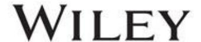
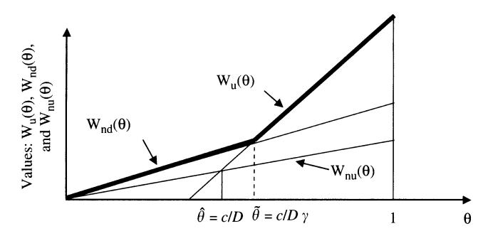
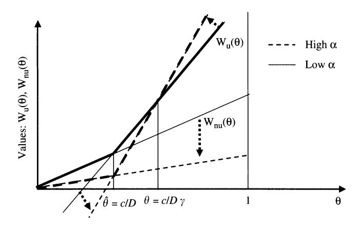
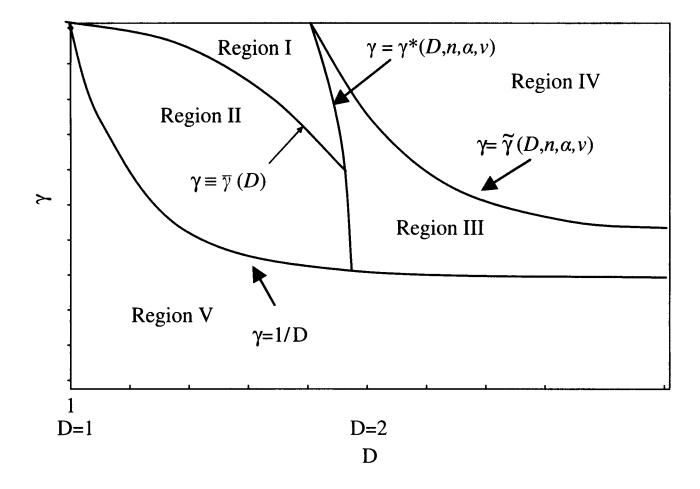

NETWORK SECURITY: VULNERABILITIES AND DISCLOSURE POLICY

Author(s): Jay Pil Choi, Chaim Fershtman and Neil Gandal

Source: The Journal of Industrial Economics, December 2010, Vol. 58, No. 4 (December

2010), pp. 868-894 Published by: Wiley

Stable URL: https://www.jstor.org/stable/40985724

# REFERENCES

:Linked references are available on JSTOR for this article https://www.jstor.org/stable/40985724?seq=1&cid=pdf-reference#references\_tab\_contents You may need to log in to JSTOR to access the linked references.

JSTOR is a not-for-profit service that helps scholars, researchers, and students discover, use, and build upon a wide range of content in a trusted digital archive. We use information technology and tools to increase productivity and .facilitate new forms of scholarship. For more information about JSTOR, please contact support@jstor.org

Your use of the JSTOR archive indicates your acceptance of the Terms & Conditions of Use, available at https://about.jstor.org/terms

Wiley is collaborating with JSTOR to digitize, preserve and extend access to *The Journal of Industrial Economics*

# NETWORK SECURITY: VULNERABILITIES AND DISCLOSURE POLICY\*

# Jay Pil. Choi† Chaim Fershtman‡ NEIL GANDAL§

Software security is a major concern for vendors, consumers and regulators. When vulnerabilities are discovered after the software has been sold to consumers, the firms face a dilemma. A policy of disclosing vulnerabilities and issuing updates protects only consumers who install updates, while the disclosure itself facilitates reverse engineering of the vulnerability by hackers. The paper considers a firm that sells software which is subject to potential security breaches and derives the conditions under which a firm would disclose vulnerabilities. It examines the effect of a regulatory policy that requires mandatory disclosure of vulnerabilities and a 'bug bounty' program.

#### I. INTRODUCTION

THE INTERNET PROVIDES MANY BENEFITS, BUT AT THE SAME TIME IT also poses serious security problems. According to a study conducted by America Online and the National Cyber Security Alliance (2004), 80 per cent of the computers in the U.S. are infected with spyware and almost 20 per cent of the machines have viruses. Some of these viruses have been very costly. According to the *Economist*, the Blaster worm and SoBig.F viruses of 2003

\*We are grateful to the Editor and two anonymous referees whose comments and suggestions significantly improved the paper. We are also grateful to Sagit Bar-Gill for excellent research assistance. We thank Jacques Lawarree, Shlomit Wagman, and participants at the DIMACS 2007 conference, the UBC 2007 Summer Conference on Industrial Organization, the 2008 CEPR IO Conference, UC Berkeley, Michigan State University, Tel Aviv University, and the University of Washington for their helpful comments. A research grant from Microsoft is gratefully acknowledged. Any opinions expressed are those of the

Authors' affiliations: School of Economics, University of New South Wales, UNSW Sydney, NSW 2052 Australia, and Department of Economics, Michigan State University, East Lansing, Michigan, U.S.A.

e-mail: choijay@msu.edu

Eitan Berglas School of Economics, Tel Aviv University, Tel Aviv 69978, Israel, Erasmus University, and CEPR.

e-mail: fersht@post.tau.ac.il

§Harold Hartog School of Government and Policy, Tel Aviv University, Tel Aviv 69978, Israel, and CEPR.

e-mail: gandal@post.tau.ac.il

© 2010 The Authors.
The Journal of Industrial Economics © 2010 Blackwell Publishing Ltd. and the Editorial Board of The Journal of Industrial Economics.
Published by Blackwell Publishing, 9600 Garsington Road, Oxford OX4 2DQ, UK, and 350 Main Street, Malden, MA 02148, USA.

resulted in \$35 billion in damages. Since then, the magnitude of the security problem has increased significantly. In January, 2007, Internet experts estimated that 'botnet' programs - sophisticated programs that install themselves on unprotected personal computers – were present in more than 10 per cent of the 650 million computers worldwide that are connected to the Internet. Botnet programs enable attackers to link infected computers into a powerful network that can be used to steal sensitive data, as well as money from online bank accounts and stock brokerages.2

While the software industry has made significant investments in writing more secure code, it is widely recognized that software vulnerability problems cannot be completely solved 'ex-ante': it is virtually impossible to design software that is free of vulnerabilities. Hence software firms continue to try to discover vulnerabilities after the software has been licensed.3 When vulnerabilities are identified 'ex-post,' software firms typically issue updates (or patches) to eliminate the vulnerabilities. Those consumers who apply updates are protected in the event that attackers (or hackers) exploit the vulnerability. Applying updates is costly to consumers, however, and hence not all consumers necessarily apply them. 5 For these consumers, the issuing of updates has a downside. The release of updates enables hackers to 'reverse engineer' and find out how to exploit the vulnerabilities. The reverse engineering increases the probability of attack – and hence reduces the value of software to consumers who do not install updates.

The Slammer, Blaster, and Sobig, F viruses exploited vulnerabilities even though security updates had been released. That is, although the updates were widely available, relatively few users had applied them. Those consumers who did not install the updates suffered damages from these viruses. According to the *Economist*, the vulnerabilities exploited by these viruses were reverse engineered by hackers. Further, the time between the disclosure of a software vulnerability and the time in which an attack

&lt;sup>1 See 'Internet Security: Fighting the Worms of Mass Destruction,' *Economist*, Nov. 27, 2003, available at http://www.economist.co.uk/science/displayStory.cfm?story\_id = 2246018.

For example, one file created by a botnet program over a month contained about 55,000 login accounts (with passwords) and nearly 300 credit card numbers. Botnets also increase the damage caused by viruses because of their sophisticated, powerful communications network. See 'Attack of the Zombie Computers is Growing Threat,' John Markoff, New York Times, January 7, 2007, http://www.nytimes.com/2007/01/07/technology/07net.html?em&ex = 1168318800&en = 79cc489d 42f00bc8&ei = 5087%0A.

The intellectual property in software is typically 'licensed' for use, not sold outright.

&lt;sup>4 Granick [2005] remarks that 'attacker' is the correct term, since hacker traditionally meant pioneer or explorer. However, the terms are now used interchangeably.

&lt;sup>5 While some updates are automatically installed, other updates are not automatic and consumers must choose whether to install them. If it were indeed costless for consumers to install updates, there would not be any unprotected consumers. Meta Group Staff [2002] describes some of the costs consumers incur when they install updates.

&lt;sup>6 See 'Internet Security: Fighting the Worms of Mass Destruction,' *Economist*, Nov. 27, 2003, available at http://www.economist.co.uk/science/displayStory.cfm?story\_id=2246018.

© 2010 The Authors. The Journal of Industrial Economics © 2010 Blackwell Publishing Ltd. and the Editorial Board of The Journal of Industrial

exploiting the vulnerability takes place has declined significantly. The Economist notes that the time from disclosure of the vulnerability to the time of attack was six months for the Slammer worm (January 2003), while the time from disclosure to attack for the Blaster worm (August 2003) was only

There is a lively debate in the law and computer science/engineering literature about the pros and cons of disclosing vulnerabilities and the possibility of a regulatory regime's, requiring mandatory disclosure of vulnerabilities; see Swire [2004] and Granick [2005] for further discussion. Some security experts advocate full disclosure, in the belief that disclosure will provide incentives for software firms to make the software code more secure and to quickly fix vulnerabilities that are identified. Others advocate limited or no disclosure because they believe that disclosure significantly increases attacks by hackers. The debate is nicely summed up by Bruce Schneier, a well-known security expert: 'If vulnerabilities are not published, then the vendors are slow (or don't bother) to fix them. But if the vulnerabilities are published, then hackers write exploits to take advantage of them.'7

It is not clear that it is possible to impose mandatory disclosure for vulnerabilities found by the firm who produces the software, since it can choose to keep the information to itself. But vulnerabilities are often discovered by third-parties and their policies can effectively impose mandatory disclosure. The Computer Emergency Response Team/Coordination Center (CERT/CC), for example, acts as an intermediary between those who report vulnerabilities and software vendors. 8 When CERT/CC is notified about a potential vulnerability, it contacts the software vendor and gives it a 45 day period in which to develop a security update. It is CERT/ CC's policy to then disclose the vulnerability even if a security update has not been made available by the firm. This policy essentially mandates disclosure of vulnerabilities that CERT/CC reports to the software vendors.

When mandatory disclosure can be imposed, is it socially optimal to do so? Is the CERT/CC policy welfare enhancing? What is the effect of disclosure policy on the price of the software, the market served, and firms' profits? How do reductions in the number of vulnerabilities and/or increases in the probability that the firm will find vulnerabilities before hackers affect disclosure policy, prices, profits, and welfare? In this paper, we develop a

&lt;sup>7Schneier, B., 'Crypto-Gram Newsletter,' February 15, 2000, available at http:// www.schneier.com/crypto-gram-0002.html

&lt;sup>8 CERT/CC is a center for Internet security in the Software Engineering Institute at Carnegie Mellon University. Although CERT/CC is not formally a public agency, it acts as an intermediary between users and vendors.

CERT/CC is not the only source of vulnerabilities reported to software firms. Private security companies and benevolent users also identify software vulnerabilities and report them directly to software firms.

 $\bigcirc$  2010 The Authors. The Journal of Industrial Economics  $\bigcirc$  2010 Blackwell Publishing Ltd. and the Editorial Board of The Journal of Industrial

setting to examine the economic incentives facing software vendors and users when software is subject to vulnerabilities. 10

We consider a firm that sells software which is subject to potential security breaches or vulnerabilities. The firm needs to set the price of the software and state whether it intends to disclose vulnerabilities and issue updates. Consumers differ in their value of the software and the potential damage that hackers may inflict on them. If the firm discloses vulnerabilities and provides updates, consumers who install updates are protected, even in the event that hackers exploit the vulnerability and attack, while consumers who do not install updates are worse off. Installing updates takes time and often requires re-booting systems. This is costly to consumers and they have to decide whether to install them.

The dilemma for the firm (regarding its disclosure policy) comes from the fact that the release of an update makes reverse engineering feasible for the hacker and increases the likelihood of attack. Such attacks cause damage to consumers who have not installed the updates. Thus, the decision of the firm to disclose and issue updates changes the value of software, increasing it for high-value users (who will employ updates when available) and decreasing it for low-value users (who will not employ updates when available). A third group of moderate-value users will install updates when available but indeed prefer a non-disclosure policy. 11

Since the availability of updates changes the value of the software, increasing it for some consumers and reducing it for others, the issuance of updates affects the firm's optimal price. Consequently, the firm's disclosure policy and its profit-maximizing behavior are interdependent. Our model derives the conditions under which a firm would disclose vulnerabilities. We find that when the damage is large relative to the costs of installing updates, there is no need for regulation. It is not that firms always disclose vulnerabilities, but rather that they do it whenever it is efficient to do so. When the damage is small relative to the costs of installing the update, the firm's disclosure policy is not always socially optimal; hence we examine a policy that mandates disclosure of vulnerabilities. While a 'mandatory disclosure' regulatory policy is welfare improving in some cases, it is welfare reducing in other cases.

The firm can invest (ex-ante) to reduce the number of software vulnerabilities and/or invest ex-post to increase the probability that it will find

&lt;sup>10 A recent paper by Polinsky and Shavell [2006] asks a similar question concerning product risks. In their model, the disclosure of product risk information is always beneficial to consumers and the benefit of voluntary disclosure arises from the firm's incentive to acquire more information about product risks because it can keep silent if the information is unfavorable. In our model, however, there is a third party (i.e., hackers) that can utilize the disclosed information to harm consumers. As a result, information disclosure can be harmful to consumers who do not update.

11 The presence of pirates (who use unlicensed versions of the software) would increase

incentives for disclosure, since disclosure would lower the value of unregistered users.

© 2010 The Authors. The Journal of Industrial Economics © 2010 Blackwell Publishing Ltd. and the Editorial Board of The Journal of Industrial

problems before hackers. Our model shows that ex-ante investment to reduce the number of vulnerabilities may lead to a 'switch' from a disclosure to a nondisclosure policy. Ex-post investment increases the probability that the firm will find problems before hackers. When the firm optimally discloses vulnerabilities, such an increase raises profits and welfare. On the other hand, when the firm optimally does not disclose vulnerabilities, an increase in the probability of identifying them before hackers do, may induce the firm to switch to a disclosure policy and issue updates. This result shows that a socalled 'bug bounty' program, in which firms offer rewards to users who identify and report vulnerabilities, is a welfare improving policy instrument.12

Our paper builds on the nascent literature at the intersection of computer science/engineering and economics on cyber security. Much of the work in the field has been undertaken by computer scientists/engineers and legal scholars. 13 There is also a literature in management science that focuses on the tradeoff facing a software firm between an early release of a product with more security vulnerabilities and a later release a more secure product. 14 The few contributions by economists have focused on the lack of incentives for individuals or network operators to take adequate security precautions. 15 Although the information security disclosure dilemma we examine in this paper is quite different, the economics literature has addressed the tradeoff between disclosure and non-disclosure in the context of intellectual property. In Anton and Yao [2004], for example, disclosure of intellectual property is beneficial because it enables a firm to receive a patent or to facilitate complementary innovation. But, disclosure is also costly since it enables imitation. In their setting, adopting a non-disclosure policy means the firm keeps a trade secret.

The remainder of the paper is organized in the following way. Section II sets up the basic model of software market that is subject to potential

&lt;sup>12 Bug bounty programs have become quite popular and have attracted a lot of attention. In 2004 the Mozilla Foundation announced the Mozilla Security Bug Bounty program that rewards users who identify and report security vulnerabilities in the open source project's software. Under the program, users who report security bugs that are judged as critical by the Mozilla Foundation staff can collect a \$500 cash prize. See http://www.mozilla.org/security/ bug-bounty.html. Independent security intelligence companies also offer a bounty for security bugs. TippingPoint, for instance, solicits hackers to report vulnerabilities in exchange for money under its 'Zero Day Initiative' program. If a vulnerability is found, TippingPoint notifies the maker of the flawed product and updates its security products to protect users against exploitation of the flaw until an official update is released. IDefense, another security firm, recently offered \$10,000 to anyone who discovers a Windows flaw that leads to a critical fix under its 'Vulnerability Contributor Program.'

See Anderson and Moore [2006] for discussion.

&lt;sup>14 See, for example, Arora, Caulkins, and Telang [2006].

15 This is because there is a 'security' externality; individuals (or network operators) will not adequately protect against viruses on their computer (networks), since a large portion of the cost of the spread of the virus is incurred by others. See Varian [2004] and Camp and Wolfram [2004].

© 2010 The Authors. The Journal of Industrial Economics © 2010 Blackwell Publishing Ltd. and the Editorial Board of The Journal of Industrial

security breaches. As a benchmark, we analyze the case in which the firm does not disclose vulnerabilities and there is no regulation requiring disclosure. Section III considers the case of mandatory disclosure regulation. In section IV, we analyze the firm's voluntary incentives to disclose vulnerabilities. Section V investigates the effects of mandatory disclosure regulation on social welfare by comparing the market outcomes under voluntary and mandatory disclosure regimes. We consider the possibility of ex ante and ex post investments in reducing and identifying vulnerabilities in section VI, and analyze their effects on the incentives to disclosure vulnerabilities and social welfare. Section VII provides summary remarks and further discussion.

#### II. THE MODEL

Consider a firm that produces a software product which is subject to potential security breaches or vulnerabilities. The number of expected security breaches is exogenously given and denoted by n. 16 We assume that the firm is a sole producer of the software, we normalize production cost to zero, and we denote the price by p.

There is a continuum of consumers whose number is normalized to 1. Consumers are heterogeneous in terms of their valuation of the software and the damage incurred from an attack in the case of a security breach. We represent consumer heterogeneity by  $\theta$ , assuming for convenience that  $\theta$  is uniformly distributed on [0,1].17 We assume that the value of software to consumer type  $\theta$  is given by  $\theta v$ , where v > 0. Damage from each security breach exploited by hackers is assumed to be  $\theta D$ , where D < v. Hence, both the gross consumer valuation and the damage are increasing functions of consumer type. This assumption reflects the fact that while high valuation consumers benefit more from the software, they suffer more damage from an attack.

Consumers can either license (purchase) one unit of the software at the price p, or not purchase at all. Downloading and installing an update is costly to consumers; the cost is given by c, c < D. We assume that firms do not charge consumers for updates. While there are considerable differences among consumers regarding the potential damage of an attack, the cost of installing an update is likely fairly uniform among consumers because it typically involves shutting the system down and restarting it, as well as possibly conducting some tests before installing the updates. This cost is likely to be more uniform across users than the potential damage. 18

&lt;sup>16 In Section VI, we examine the effect of a reduction in the number of vulnerabilities on disclosure policy.

We assume a uniform distribution in order to derive closed-form solutions to our model. However, all the main qualitative results can be derived by assuming more general distributions with the monotone hazard rate property.

18 Our results would be robust to assuming that the cost of installing the update was increasing in consumer type, but at a decreasing rate.

© 2010 The Authors. The Journal of Industrial Economics © 2010 Blackwell Publishing Ltd. and the Editorial Board of The Journal of Industrial

After the product is sold, the firm continues to try to identify vulnerabilities. We assume that with probability  $\alpha$  either the firm identifies the vulnerabilities itself before hackers do, or alternatively institutions like CERT/CC, private security firms, or benevolent users find the vulnerabilities before hackers do and report them to the firm. 19 When the firm discovers the security vulnerability before the hackers do, it has an option to release an update, which protects those consumers who employ the update.

When hackers identify the security breach before the firm does, all consumers who purchased the software are subject to potential damages. We do not explicitly model hacker preferences or their decision making process. We simply assume that hackers attack with a fixed probability. 20 We let  $\gamma$  ( < 1) be the probability that hackers will discover a vulnerability on their own (i.e., without disclosure) and attack. If the firm discloses the vulnerability and releases an update, we assume that the probability of attack is one. This assumption captures the fact that the release of an update makes reverse engineering feasible for the hacker and increases the likelihood of attack.

When the firm discloses vulnerabilities and issues updates, damage for a consumer who installs updates occurs only when hackers find the vulnerabilities before the firm finds them. Hence the net value to a consumer of type  $\theta$ from purchasing the software and installing updates, denoted  $W_{\nu}(\theta)$ , is

$$W_{\nu}(\theta) = \theta \nu - \gamma (1 - \alpha) \theta D n - \alpha c n \equiv Z \theta - \alpha c n,$$

where  $Z \equiv v - \gamma(1 - \alpha)Dn$ .  $W_u(\theta)$  consists of the consumption value, the expected damage in the case where the hackers find the vulnerabilities before the firm, and the expected cost of installing updates. Similarly,  $W_{nn}(\theta)$  is the net consumer value from buying the software, without installing updates:

$$W_{nu}(\theta) = \theta v - \gamma (1 - \alpha)\theta Dn - \alpha \theta Dn \equiv S\theta,$$

where  $S \equiv v - \gamma(1 - \alpha)Dn - \alpha Dn$ . The third term in  $W_{nu}(\theta)$  is the expected damage to a consumer of type  $\theta$  when the firm finds the security breach, discloses vulnerabilities, and issues an update which the consumer does not employ.

It is readily apparent from the expressions for  $W_{\nu}(\theta)$ , and  $W_{\nu\nu}(\theta)$  that a consumer installs an update only if the potential damage from an attack  $(\theta D)$ exceeds the cost of installing an update (c.) Low  $\theta$  consumers may be those

&lt;sup>19 Alternatively,  $\alpha$  is the percentage of problems that the firm finds or are reported to the firm by third-parties before they are discovered by hackers. In the main part of the paper,  $\alpha$  is given. In section 6 we examine the effect of an increase in the probability that the firm finds the security vulnerabilities before hackers on disclosure policy.

 $^{0}$  See Png, Tang, and Wang [2006] for an analysis that explicitly models hackers as a strategic player. They assume that hackers derive enjoyment from an attack on a user provided that they are not discovered by an enforcement agency. The focus of their paper is mainly on comparative statics results that analyze the direct and indirect effects of changes in the user cost of precaution and the rate of enforcement against hackers. Our focus, in contrast, is on software vendors' optimal decisions concerning voluntary disclosure and the effects of investment in security.

© 2010 The Authors. The Journal of Industrial Economics © 2010 Blackwell Publishing Ltd. and the Editorial Board of The Journal of Industrial

who only have to reinstall a small number of software programs. In such cases, their potential damage (reinstalling the software applications) will be of the same magnitude as, or smaller than, the cost of installing the update. High  $\theta$  consumers, on the other hand, may be those who have many software programs installed or who have valuable data to protect. For these consumers, the potential damage is far greater than the cost of installing the update.

Finally, the value to a consumer of type  $\theta$  from purchasing software when the firm does not disclose vulnerabilities, denoted  $W_{nd}(\theta)$ , is given by

$$W_{nd}(\theta) = \theta v - \gamma \theta D n \equiv T \theta$$
,

where  $T \equiv v - \gamma Dn$ . Comparing the expressions for  $W_{\nu}(\theta)$ ,  $W_{n\nu}(\theta)$ , and  $W_{n\nu}(\theta)$ yields S < T < Z. The differences among S, T, and Z are due to the differences in expected damage to consumers from an attack in these three cases.21 We make the following two assumptions that hold throughout the paper:

- A1: We assume that S > 0, which guarantees that  $W_{nu}(\theta) > 0$  for all  $\theta$ . 22 This assumption also implies that  $W_{\nu}(\theta)$ ,  $W_{\nu}(\theta)$ , and  $W_{\nu}(\theta)$  increase in consumer type  $\theta$ .
- A2: We assume that  $\gamma > c/D$ . This assumption insures that  $W_n(\theta) > c$  $W_{nd}(\theta)$  for at least some consumer types.

When A2 does not hold, i.e., when  $\gamma < c/D$ , the likelihood of a hacker attack is sufficiently small that software vulnerabilities are not a big concern. In such a case, the firm would never disclose vulnerabilities because  $W_{nd}(\theta) > W_{\nu}(\theta)$  for every  $\theta$ .

The decision to disclose and issue updates affects the value of software. Figure 1 depicts the value of the software for consumers who do not install updates when available  $(W_{nu}(\theta))$ , for those who install updates when available  $(W_n(\theta))$ , as well as the value of software for the case in which the firm does not disclose vulnerabilities  $(W_{nd}(\theta))$ . A consumer who does not plan to install updates is always better off when the firm does not disclose vulnerabilities. In other words, the  $W_{nu}(\theta)$  curve lies below the  $W_{nd}(\theta)$  curve. Comparing  $W_{\nu}(\theta)$  and  $W_{\nu}(\theta)$ , there is a critical type,  $\tilde{\theta} = c/D\gamma$ , such that consumers of type  $\theta > \tilde{\theta}$  are better off when the firm discloses vulnerabilities and consumers of type  $\theta < \tilde{\theta}$  are better off when the firm does not disclose vulnerabilities. Note that  $\tilde{\theta} > \hat{\theta}$  and 'moderate value' consumers of type  $\theta \in [\tilde{\theta}, \hat{\theta}]$  will install updates when available, but prefer a non-disclosure policy.

&lt;sup>21 The 'damages' do not include the cost of installing updates.

This assumption is equivalent to assuming that all consumers will purchase the software at a zero price, regardless of whether they update or not.

© 2010 The Authors.
The Journal of Industrial Economics © 2010 Blackwell Publishing Ltd. and the Editorial Board of The Journal of Industrial Economics.

Figure 1
Willingness to Pay under Disclosure and Non-Disclosure

## II(i). Benchmark Analysis: The Firm Does Not Disclose Vulnerabilities

As a benchmark, we first consider case in which the firm does not disclose vulnerabilities and there is no regulation that requires it to do so. Given the firm's price, p, the consumers' purchase decisions can be characterized by a threshold type  $\theta_{nd}^*(p)$  such that only consumers of type  $\theta \ge \theta_{nd}^*(p)$  will purchase the software. With the assumption of uniform distribution of  $\theta$ , the number of buyers is given by  $1 - \theta_{nd}^*(p)$ .

Lemma 1. When the firm does not disclose vulnerabilities, the optimal price, market share, and profits are respectively given by  $p_{nd}^* = T/2$ ,  $(1 - \theta_{nd}^*) = 1/2$ , and  $\pi_{nd}^* = T/4$ , where  $T \equiv v - \gamma D n$ .23

## III. THE FIRM MUST DISCLOSE VULNERABILITIES AND ISSUE UPDATES

Now consider a firm that is required to disclose identified vulnerabilities and issue an update that protects the software from these vulnerabilities. The firm cannot, however, require consumers to install updates. In this case, the firm is pricing on a kinked demand curve, i.e., the upper envelope of  $W_{nu}(\theta)$  and  $W_u(\theta)$ . Thus, there are two threshold levels: (i)  $\hat{\theta} = c/D$  such that consumers of type  $\theta \geq \hat{\theta}$ , who purchases the software will install updates when they are available, while consumers with  $\theta < \hat{\theta}$  will not install updates; (ii) Given a software price, p, there is a  $\theta^*(p)$ , such that only consumers of type  $\theta \geq \theta^*(p)$  will purchase the software. We can state the following Lemma.

Lemma 2. When the firm must disclose vulnerabilities and issues updates, the firm's optimal price and profits are as follows:

(i) When  $D/c < 2 - \alpha cn/Z$ , the firm charges a low price and serves a larger market, including some consumers who do not install updates. The

The Journal of Industrial Economics © 2010 Blackwell Publishing Ltd. and the Editorial Board of The Journal of Industrial Economics.

&lt;sup>23 For ease of presentation, all proofs are in Appendix B.

© 2010 The Authors

Figure 2 Effects of an Increase in  $\alpha$  on  $Wu(\theta)$ ,  $Wnu(\theta)$ 

optimal price is  $p_{nu}^* = S/2$ , where  $p_{nu}^* < \hat{p}$ ; the number of consumers who purchase the software are  $1 - \theta_{nu}^* = 1/2$ ; firm profits are  $\pi_{nu}^* = S/4$ .

(ii) When  $D/c \ge 2 - \alpha cn/Z$ , the firm serves a smaller market of users, all of whom employ updates. The optimal price is  $p_u^* = (Z - \alpha cn)/2$ , such that  $p_u^* > \hat{p}$ ; the number of consumers who purchase the software are  $1 - \theta_u^* = (Z - \alpha cn)/2Z$ , and the firm's profits are  $\pi_u^* = (Z - \alpha cn)^2/(4Z)^{.24}$ 

Intuitively, increases in n, D, and  $\gamma$  make it more likely that the firm will serve a smaller market of high value consumers, all of whom install updates. The effects of changes in  $\alpha$ , the probability that the firm identifies the vulnerabilities before the hackers, on the firm's optimal prices and profits are more interesting. Figure 2 illustrates the effect of increases in  $\alpha$  on consumers' valuations  $W_u(\theta)$  and  $W_{nu}(\theta)$ . Consumers that do not install updates are worse off and therefore  $W_{nu}(\theta)$  goes down. For consumers who install updates, those with  $\theta > c/D\gamma$  are better off and those with  $\theta < c/D\gamma$  are worse off. Consequently, the  $W_u(\theta)$  curve rotates around the  $\theta = c/D\gamma$  value.

*Proposition 1* (Effect of  $\alpha$ , probability the firm identifies vulnerabilities before hackers).

(a) Suppose D < (2 - nc/v)c. The marginal consumer does not install updates and the profit maximizing price and equilibrium profits decrease in  $\alpha$ .

&lt;sup>24 Recall that  $Z \equiv v - \gamma(1 - \alpha)Dn$ . Since D > c,  $Z > \alpha nc$  by assumption A1. 25 Assumption A2 insures that there are such types. For D < 2c, there is a unique  $\gamma$ , denoted  $\gamma^*$  such that  $\gamma > \gamma^*(D, n, \alpha, \nu)$  if and only if  $\pi_u^* > \pi_{nu}^*$ , where  $\gamma^*$  is uniquely defined by  $D/c = 2 - \alpha cn/Z(\gamma^*)$ . We introduce the notation  $\gamma^*$  for ease of presentation in Figure 3.

© 2010 The Authors. The Journal of Industrial Economics © 2010 Blackwell Publishing Ltd. and the Editorial Board of The Journal of Industrial Economics.

- (b) Suppose (2 nc/v)c < D < 2c. There is a critical  $\alpha$ , denoted  $\hat{\alpha}(n, c, \gamma, D, v)$ , such that when  $\alpha > \hat{\alpha}$ , the firm serves only consumers who install updates and when  $\alpha < \hat{\alpha}$ , the firm serves also some non-updaters.
  - When  $\alpha$  increases, but is still below  $\hat{\alpha}$ , the profit maximizing price and the equilibrium profits decrease in  $\alpha$ .
  - The profit maximizing price increases discontinuously and the equilibrium market share falls discontinuously at  $\alpha = \hat{\alpha}$ .
  - (iii) When  $\alpha > \hat{\alpha}$ , an increase in  $\alpha$  results in a higher price and a lower market share. Profits increase in  $\alpha$  if and only if the probability of hacker attack is sufficiently large, i.e., if and only if  $\gamma > \hat{\gamma}$ , where  $\hat{\gamma}$  is implicitly (and uniquely) defined by

$$\hat{\gamma} \equiv 2c / \left\{ \left[ 1 + \frac{\alpha nc}{Z(\hat{\gamma})} \right] D \right\}^{26}.$$

(c) Suppose  $D \ge 2c$ . The firm chooses to serve only consumers that install updates. Higher α results in a higher price and lower market share. Profits increase in  $\alpha$  if and only if  $\gamma > \hat{\gamma}$ .

When D is relatively small or  $\alpha < \hat{\alpha}$  (i.e., part (a) and part (b)(i) of Proposition 1), an increase in  $\alpha$  decreases price and profits.27 This is because when D is relatively small or  $\alpha < \hat{\alpha}$ , the marginal consumer is a non-updater and the software becomes less valuable for the marginal user when a increases. When D is relatively large or  $\alpha > \hat{\alpha}$ , the marginal consumer employs updates. In this case, a higher value of  $\alpha$  increases the expected cost of installing updates, but also reduces the expected damages. The expected benefit exceeds the expected cost for consumer of types  $\theta > c/D\gamma$ , while the expected costs exceed the expected benefits for consumer of type  $\theta < c/D\gamma$ . An increase in  $\alpha$ implies that the equilibrium price increases by  $n(\gamma D - c)/2$ , but the equilibrium market share falls by  $Tnc/2Z^{2.28}$  Thus, the effect of  $\alpha$  on profits is not necessarily monotonic. Profits increase in  $\alpha$  if and only if  $\gamma > \hat{\gamma}$ ; when  $\gamma$  is large, the 'higher price' effect dominates. When  $\gamma < \hat{\gamma}$ , the 'lower market share' effect dominates and profits fall in  $\alpha$ . We can conclude the following:

Corollary 1. When at least one of D,  $\alpha$ , or  $\gamma$  are relatively small, the firm's optimal policy is to refrain from increasing  $\alpha$  even when it is costless for the firm to do so and when it is costless to issue updates.

Hence  $c/D < \hat{\gamma} < 2c/D$ . It can be shown that  $\hat{\gamma}$  decreases in  $\alpha$ .

&lt;sup>27 It is important to remember that the cost of installing an update (per vulnerability) is c, while the damage is  $\theta D$ . Hence, the relevant empirical question is not whether it is reasonable to assume that D < 2c in some cases, but whether it is reasonable to assume that  $\theta D < c$  for some consumers. As discussed in section 2, for low value users (i.e., low  $\theta$ ), this is clearly a realistic assumption.  $^{28} n(\gamma D - c)/2$  is greater than zero, since  $\gamma > c/D$  by Assumption A2.

#### IV. THE FIRM'S INCENTIVES TO DISCLOSE VULNERABILITIES

Assume now that the firm has the option of choosing its disclosure policies. When the firm sells the software it can commit to disclosing vulnerabilities and issuing updates, or it can choose not to disclose vulnerabilities. The firm's disclosure policy is known to consumers at the time they purchase the software. As Figure 1 suggests, there are two possible outcomes when firms can set their disclosure policy: (i) the firm discloses vulnerabilities and sets a price such that  $\theta^*(p) \ge \tilde{\theta}$  and all consumers install updates. (ii) the firm sets a price such that  $\theta^*(p) < \hat{\theta}$  and does not disclose vulnerabilities.

*Proposition 2* (Disclosure Choice). The firm's optimal disclosure policy is to disclose vulnerabilities when  $D\gamma/c \ge 2 - \alpha nc/Z$  and not disclosure vulnerabilities when  $D\gamma/c < 2 - \alpha cn/Z$ .

Since  $\gamma < 1$ , the condition,  $D/c > 2 - \alpha nc/Z$  from Lemma 2, holds whenever the condition from Proposition 2 holds. This means that when the firm discloses vulnerabilities it sells only to consumers that install updates.

Proposition 3 (Effect of the probability of hacker attack,  $\gamma$ , on firm's disclosure policy).

(i) There is a (unique) critical value of damage,  $\tilde{D}(n,\alpha,c,\nu)$ , such that whenever  $D \leq \tilde{D}$ , the firm will never disclose vulnerabilities. (ii) Whenever  $D > \tilde{D}$ , there is a critical probability of hacker attack,  $\tilde{\gamma}(n,\alpha,D,c,\nu)$ , such that whenever  $\gamma \leq \tilde{\gamma}$ , the firm will not disclose vulnerabilities, and whenever  $\gamma > \tilde{\gamma}$ , the firm discloses vulnerabilities.

Proposition 3 shows that when the damage is relatively small, the firm will not disclose vulnerabilities, regardless of the value of  $\gamma$ . Whenever D is large, there is a critical probability of hacker attack,  $\tilde{\gamma}(n,\alpha,D,c,\nu)$ , such that when  $\gamma > \tilde{\gamma}$ , the firm discloses vulnerabilities.

Lemma 3.  $\tilde{\gamma}(n,\alpha,D,c,\nu)$  and  $\tilde{D}(n,\alpha,c,\nu)$  both decrease in n and  $\alpha$ .

## V. DISCLOSURE POLICY, REGULATION AND SOCIAL WELFARE

There is a debate among security experts regarding whether disclosure of software vulnerabilities should be mandatory. Some security experts recommend mandatory public disclosure of discoveries of potential security vulnerabilities, both to warn system administrators and users and to spur the vendor involved to develop an update as quickly as possible. Other experts

are concerned that mandatory disclosure will lead to the reverse engineering (and exploitation) of vulnerabilities.29 In this section, we examine the effect of a regulatory policy requiring disclosure on social welfare, i.e., we consider a regulator that can mandate the disclosure of vulnerabilities. Setting disclosure policy, however, does affect the market price as well as the number of consumers who purchase the software.

Since we assume no production costs, and since the price is a transfer from consumers to firms, social welfare is simply the integral of consumers' willingness to pay for software over the set of consumers who actually make the purchase. When the firm discloses vulnerabilities and  $(D/c) < 2 - \alpha nc/Z$ , the equilibrium is such that consumers of type  $\theta \in [1/2, c/D]$  buy the software, but do not install updates, while consumers of type  $\theta \in [c/D, 1]$ , buy the software and install updates. Summing up the surplus of these two groups of consumers gives us the total social surplus, denoted  $SW_{nu}$ , in this case. When the firm discloses vulnerabilities and  $(D/c) > 2 - \alpha nc/Z$ , the equilibrium is such that the firm sells only to consumers of type  $\theta \in [\frac{(Z+\alpha nc)}{2Z}, 1]$  (See Lemma 2). Since all of these consumers also install updates, the calculation of total social surplus, denoted  $SW_{uv}$ , is straightforward. Finally, when the firms adopts a non-disclosure policy, the equilibrium is such that it sells to consumers of type  $\theta \in [1/2,1]$ . Total social surplus in this case is denoted  $SW_{nd}$ . The regulator adopts the disclosure policy that maximizes social welfare as defined by  $SW_{nuv}$ ,  $SW_{uv}$ , and  $SW_{nd}$ . Figure 3 which displays the firm's optimal disclosure policy and the regulator's disclosure policy as a function of the parameters of the model, shows that there are five possible regions.

Proposition 4 (Regulator vs. Market Outcome). The equilibrium disclosure policy of the firm is socially optimal unless the parameters are in Region I (Figure 3), in which case mandatory disclosure is optimal whereas the firm prefers not to disclose. Region I is bounded by two conditions,  $\pi_{nu}^* > \pi_u^*$  and  $SW_{nu} > SW_{nd}$ , which can be rewritten respectively as  $\beta < 2 - \alpha nc/Z$  and  $\gamma > (8\beta - 4 - \beta^2)/3\beta^2 \equiv \bar{\gamma}$ , where  $1 < \beta \equiv D/c < 2$ .

30 The subscript 'nu' signifies the fact that the marginal consumer who is indifferent between purchase and no purchase 'does not update.' The calculations of total social surplus appear in Proposition 4.

The existence of Region I can be shown in a straightforward manner by examining the conditions that define Region 1. Without loss of generality, c is normalized to one in Figure 3. Changes in v, n, and  $\alpha$  shift the  $\gamma^*(D, n, \alpha, v)$  and the  $\gamma = \bar{\gamma}(D, n, \alpha, v)$  curves, but they always meet at  $\gamma = 1$ . Further,  $\gamma^*$  is always greater than 1 when D = c, which means that the  $\gamma^*(D, n, \alpha, v)$  curve lies above the  $\bar{\gamma}(D)$  curve (which takes on the value 1 when D = 1) for values of D close to c. Region I thus always exists.

&lt;sup>29 As we discussed in the introduction, CERT/CC policy effectively mandates disclosure of vulnerabilities it reports to firms, while other regulations like the Digital Millennium Copyright Act can limit the publication of vulnerability information. The Digital Millennium Copyright Act, which was primarily designed to protect intellectual property rights, has been used by the U.S. government and some firms to limit the publication of information about security vulnerabilities. See Granick [2005] for an expanded discussion.

© 2010 The Authors.
The Journal of Industrial Economics © 2010 Blackwell Publishing Ltd. and the Editorial Board of The Journal of Industrial Economics.

Figure 3 Regulator vs. Market Outcome (c = 1, D > 1)

Region I: Suboptimal Disclosure (Firm does not Disclose; Regulator would Disclose.) Region II: Efficient (Firm does not Disclose; Regulator would not Disclose.) Region III: Efficient (Firm does not Disclose; Regulator would not Disclose.) Region IV: Efficient (Firm does Disclose; Regulator would Disclose.)

Region V: Efficient (A2 does not hold; hence neither the firm nor the regulator would Disclose.)

In Region I, the firm will choose not to disclose vulnerabilities since it is always true that  $\pi_{nd}^* > \pi_{nu}^*$ . Moreover, the condition  $\pi_{nu}^* > \pi_u^*$  in Region 1 implies that if disclosure is mandatory, the firm will charge a low price and serve a larger market, including some consumers who do not install updates (see Lemma 2). Since  $SW_{nu} > SW_{nd}$  in Region 1, welfare maximization requires mandatory disclosure. The divergence between the firm and the regulator is because the regulator's disclosure policy depends on the effect of disclosure on the average consumer, whereas the vendor's profit-maximizing disclosure policy depends on the impact on the marginal consumer. Since there are heterogeneous consumers, the average consumer type cares more about security than the marginal type. This effect leads to suboptimal disclosure in the market in Region I. Although the 'average/ marginal' effect exists in Region II as well, the probability of hacker attack is sufficiently low in this region that neither the firm nor the regulator would disclose vulnerabilities.

In Regions III and IV, there is a second effect that offsets the 'average/ marginal consumer' effect. The opposing effect is that market share is higher under a non-disclosure regime. A regulator values an increased market share more than the firm does, because the firm obtains the full surplus only from the marginal consumer. In our setting, these opposing effects exactly cancel out. Thus in Regions III and IV, the market outcome is efficient:

© 2010 The Authors. The Journal of Industrial Economics © 2010 Blackwell Publishing Ltd. and the Editorial Board of The Journal of Industrial Economics.

A regulator would mandate disclosure whenever the firm would disclose vulnerabilities.32

Corollary 2. Mandatory disclosure increases social welfare in Region I, but reduces welfare in Regions II and III. In Region IV, Mandatory Disclosure has no effect, since the firm discloses vulnerabilities.

Corollary 2 illustrates the source of the debate regarding a mandatory disclosure regulatory policy. Mandatory disclosure is welfare improving in one region, but welfare reducing in other regions. Mandatory disclosure also affects equilibrium prices, as well as the number of consumers that purchase the software.

Corollary 3 (The Effect of Mandatory Disclosure on Equilibrium Prices).

- In Regions I and II in Figure 3, mandatory disclosure decreases the equilibrium price.
- (ii) In Region III, mandatory disclosure increases the equilibrium price and reduces equilibrium number of consumers.
- (iii) In Region IV, mandatory disclosure has no effect on either the price or the number of consumers who purchase software.

In Regions I and II, the firm would not disclose vulnerabilities in the absence of regulation. Since the marginal user is a non-updater under disclosure, mandatory disclosure lowers the willingness to pay for the marginal consumer; hence it will lead to a lower equilibrium price. In Region III, the firm would not disclose vulnerabilities in the absence of regulation. Since all consumers install updates under mandatory disclosure in this case, the firm serves a smaller market of higher quality-sensitive consumers. Hence, in this case, mandatory disclosure leads to a higher equilibrium price but reduces the firm's market share. In Region IV, the firm indeed discloses vulnerabilities in the absence of regulation. Hence, mandatory disclosure has no effect in this case.

#### VI. EX-ANTE AND EX-POST INVESTMENT IN REDUCING AND IDENTIFYING **VULNERABILITIES**

There are two types of investments the firm can undertake: (i) Investment that reduces the number of software vulnerabilities (i.e., reducing n) and (ii) Investment that increases the probability that the firm will find the software vulnerabilities before hackers (i.e., increasing  $\alpha$ ). The first type of investment

 $^{32}$  If, for example,  $\theta$  was not uniformly distributed, the two effects present in Regions III and IV would not cancel out and the inefficiency (suboptimal or excess disclosure) would depend on the distribution of consumer types. But this would not change the main result of Corollary 2 (below) that mandatory disclosure can be welfare reducing as well as welfare improving.

© 2010 The Authors.
The Journal of Industrial Economics © 2010 Blackwell Publishing Ltd. and the Editorial Board of The Journal of Industrial

can be thought of as an ex-ante investment in quality, while the second type can be thought of as an ex-post investment.

VI(i). Ex-Ante Investment to Reduce the Number of Software Vulnerabilities Many software firms now provide formal training in order to teach their programmers how to write code that is less vulnerable to attacks.33 This can be interpreted as an investment in reducing the number of software vulnerabilities before the software is sold. A reduction in n, hereafter denoted as  $\Delta n$ , can be viewed as an increase in the quality of the product for all consumer types; thus it raises consumer willingness to pay for the software.

Proposition 5 (Ex-Ante investment). 34 Suppose  $\tilde{\gamma}(n,\alpha) < \gamma < 2c/D$  and  $D > \tilde{D}$  $(n, \alpha)$ . If  $\Delta n$  is sufficiently large so that  $\gamma < \tilde{\gamma}(n-\Delta n, \alpha)$  or  $D < \tilde{D}(n-\Delta n, \alpha)$ . the reduction  $\Delta n$  will induce a switch from a disclosure policy to a nondisclosure policy. Such a switch may be accompanied by a lower equilibrium price. Otherwise, a reduction in n leads to an increase in the equilibrium price, profits and consumers welfare, but has no effect on the disclosure policy of the firm.

Proposition 5 shows that ex-ante investment leads to greater profits and higher consumer welfare; it may also induce a switch from a disclosure policy to a non-disclosure policy.

## VI(ii). Ex-Post Investment: Increasing $\alpha$

Assume that the firm can increase the probability that it finds vulnerabilities before the hackers find them or that third-party policies increase  $\alpha$ . In Proposition 1, we considered the effect of higher  $\alpha$  on prices and profits in the case in which the firm were required to disclose vulnerabilities. In such a case, a higher  $\alpha$  might reduce prices and profits. We now extend the analysis and consider the effect of a higher  $\alpha$  on the firm's disclosure policy, and well as on prices, profits, and welfare.

&lt;sup>33 'Several initiatives are underway to improve secure programming skills and knowledge. Symantec, Oracle, Microsoft, and a few other software companies are conducting short courses for their programmers; software firms like SPI Dynamics and Fortify Technology are working with universities to provide automated, real-time feedback to student programmers; and dozens of universities are creating elective courses on secure programming, (quote taken from http://www.sans-ssi.org/#pgoals.) Additionally, the SysAdmin, Audit, Network, Security (SANS) Software Security Institute recently launched a new initiative involving more than 360 companies, government agencies and colleges to help software developers, programmers and students improve their knowledge of how to write secure software code. The press release of the

initiative can be found at  $http://www.sans-ssi.org/ssi\_press.pdf$ .

The parameters of interest here are  $\alpha$  and n. Hence, we write  $\tilde{\gamma}(n,\alpha)$  and  $\tilde{D}(n,\alpha)$  rather than  $\tilde{\gamma}(n, \alpha, D, c, v)$  and  $\tilde{D}(n, \alpha, D, c, v)$ .

© 2010 The Authors. The Journal of Industrial Economics © 2010 Blackwell Publishing Ltd. and the Editorial Board of The Journal of Industrial Economics.

Proposition 6 (Ex-Post investment).

- (i) When  $\gamma > \tilde{\gamma}$   $(n, \alpha)$  and  $D > \tilde{D}$   $(n, \alpha)$ , the firm would disclose vulnerabilities and an increase in  $\alpha$  would imply a higher price, greater profits, and higher welfare without any change in the firm's disclosure policy.
- (ii) When  $\gamma < \tilde{\gamma}$   $(n, \alpha)$  or  $D < \tilde{D}$   $(n, \alpha)$ , the firm does not disclose vulnerabilities regardless of the value of D. A relatively small increase in  $\alpha$  does not change disclosure policy and does not affect the price or firm profits. A relatively large increase in  $\alpha$  may induce the firm to adopt a policy of disclosure; a change in disclosure policy results in a higher price, greater profits, and higher welfare.

Proposition 6 shows that when the firm can choose its disclosure policy, ex-post investment either leads to higher prices, greater profits, and higher welfare or does not affect prices, profits or welfare. 35 Proposition 6(ii) shows that a higher α may also induce the firm to make a (welfare-improving) shift from non-disclosure to disclosure.

Proposition 6 has interesting implications for the effects of 'bug bounty' programs, in which firms (or third parties) offer rewards to users who identify and report vulnerabilities. The introduction of a bounty program, in which vulnerabilities 'bought' through the program by third parties are provided to firms, can be interpreted in our setting as an increase in  $\alpha$ .36 Proposition 6(i) implies that the use of a bounty program has a positive effect on both profitability and welfare. This is because in such a case (Region IV in Figure 3), the firm discloses vulnerabilities, the marginal consumer applies updates, and profits and welfare are increasing in  $\alpha$ . In case (ii), the introduction of a bounty program has no effect if, despite the increase in α, the firm continues to employ a non-disclosure policy (Region III in Figure 3).37 If the increase in  $\alpha$  is large enough, however, the introduction of a bounty program will induce the firm to switch to case (i), i.e., from non-disclosure to a disclosure policy (or from Region III to Region IV in Figure 3). This is because the boundary between regions III and IV in Figure 3 shifts down and to the left when  $\alpha$  increases.

## VII. SUMMARY AND FURTHER DISCUSSION

In this paper, we have examined the incentives for a software firm to adopt a disclosure or non-disclosure policy and the interdependence between the pricing of software and the disclosure policy. We have used our framework

35 Thus, unlike the case when the firm is required to disclose vulnerabilities, when the firm can choose its disclosure policy, a higher  $\alpha$  never reduces prices and profits.

&lt;sup>36 We assume the bounty program, if offered by independent security companies, is such that the vulnerability will be disclosed only when an update is available from software vendors.

37 Although the firm who supplies the software would not introduce a 'Bounty Program' here, a third party might do so.

© 2010 The Authors. The Journal of Industrial Economics © 2010 Blackwell Publishing Ltd. and the Editorial Board of The Journal of Industrial Economics.

to examine public policies suggested by security experts: mandatory disclosure of vulnerabilities and bug bounty programs. We find that mandatory disclosure is not necessarily welfare improving. However, a Bug Bounty program is a welfare improving policy instrument since it either has no effect on the firm's disclosure policy or it induces a welfare-improving change in disclosure policy (from non-disclosure to disclosure). The key feature of our model is that the disclosure of software affects consumers differently and changes the elasticity of demand. In order to keep the model analytically tractable, we have kept the model as simple as possible. Our choices as to what to include and how to develop the model were guided by the many discussions we had with software/security engineers. Here we briefly discuss alternative modeling choices and robustness issues.

An interesting alternative is to assume that the probability of attack is increasing in the size of the unprotected network – i.e., hackers would be more likely to attack systems with larger numbers of unprotected consumers. The key result of suboptimal disclosure obtains when there is a negative network effect. While we believe this is quite realistic, with a negative network effect, the model is analytically intractable and numerical methods are necessary.38 Since this is the first economics model addressing the issue of software vulnerability disclosure, we prefer the clarity and rich insights offered by the simpler model.

In our setting, we assume that value of the damages and their occurrences are independent. One could alternatively employ a model with single vulnerability and then model *ex-ante* investment as decreasing gamma. This would not change our main results. We made the choice we did because there are typically multiple vulnerabilities in software – and the set-up allowed us to perform comparative statics analysis on the effects of higher quality software in a straightforward manner.

Our results do not change even if the firm can strategically manipulate c. This is because the profits when the firm discloses vulnerabilities and provides updates decrease when c increases, while the profit when the firm does not disclose vulnerabilities is independent of c. Hence, the firm would have no incentive to strategically increase c. The firm would like to decrease c (for example, by enabling updates to be installed without interfering with the current activities of the user), but this may be quite costly. Hence, the firm would need to conduct a cost benefit analysis in order to determine whether it was worthwhile to invest in reducing c.

Finally, we find that when D > 2c then there is no need for regulation. As noted in the introduction, it is not that firms always disclose vulnerabilities, but rather that they do so only whenever it is efficient to

© 2010 The Authors.

&lt;sup>38 See Choi, Fershtman, and Gandal [2005] for details.

do so. Clearly there are viruses for which D is much larger than 2c. However, we believe that there are also security vulnerabilities for which indeed D < 2c. In Appendix A, we examine in detail a major virus – The 'love bug' virus – that caused \$8.7 billion in total damages. A back of the envelope calculation suggests that under reasonable assumptions, D is around \$110. How does this compare with c? A first impression suggests that the cost of installing an update is negligible. But in most cases installing updates requires (at a minimum) stopping all processes that are running (some of which might have been running for some time), shutting down the computer system, rebooting it, and re-running the processes. This is costly. Hence, it seems quite reasonable that in some cases, we can have D < 2c for major viruses.39

For cases when D < 2c, there is a region of the parameter space in which there is suboptimal disclosure. In this region, which is relatively small, regulation would improve welfare. But for most of the parameter space, the market works well, and regulation in the form of mandatory disclosure would be inefficient.

## APPENDIX A THE CONDITION D < 2c (THE CASE OF THE 'LOVE BUG' VIRUS)

Is it reasonable to assume that there are security threats for which D can be less than 2c? In order to examine this issue, we examined the case of a virus called 'Love Bug' that caused a great deal of damage in 2000. The goal was to come up with a rough estimate of what corresponds to D in our model. We chose this case, because it was a major virus and was one of the only cases for which enough information was available to make a reasonable 'back of the envelope' calculation. In 2000, viruses caused an estimated \$17.1 billion in damages. 40 The Love Bug virus caused more than \$8.7 billion in damage. Since the Love Bug virus infected 40 million computers, the cost of the Love Bug virus was about \$218 per infected computer. 41 But that \$218 includes lost business, clean-up costs, and wasted time, i.e., lost productivity costs. Indeed, in one case for which it was broken out, lost productivity costs accounted for approximately 58 per cent of all of the damage from a major virus. 42 This seems like a large cost for lost productivity time, but lost productivity costs were estimated at \$60 per worker for each hour of down computer time. 43 This cost for lost productivity is likely significantly

&lt;sup>39 It is possible that 'c' could also include 'stress' costs or irrational fears that upgrades will compromise the computer in some way. Irrational or not, such fears are costly.

The estimate is from Computer Economics and was reported by Elinor Mills Abreu of Reuters on August 31, 2001. The article, entitled 'Computer Virus Costs Reach \$10.7 billion This Year', is available at http://www.crn.com/itchannel/18816957;jsessionid=PYGK1 FCBMS2XKQSNDLPCKHSCJUNN2JVN

The source for these numbers is the article cited in the previous footnote.

&lt;sup>42 This estimate comes from the same article and source (Computer Economics) as well, although the allocation of the damage to lost productivity costs came from a different virus.

&lt;sup>43 This information comes from a report issued by the U.K. government, entitled 'Information Security: How to Protect Yourself against Computer Viruses,' available at

© 2010 The Authors.
The Journal of Industrial Economics © 2010 Blackwell Publishing Ltd. and the Editorial Board of The Journal of Industrial Economics.

inflated. 44 This is because, as a BBC news article noted, 'workers prevented from using their computers simply rearrange their time,' i.e., they do other tasks while the computers are down. The article goes on to say that 'in most cases, there simply isn't a direct cash cost at all, '45 i.e., there are no lost productivity costs. Assuming no or little lost productivity costs, 46 the average cost per infected computer from the 'Love Bug' virus was \$92. But the number of infected computers was likely greater than 40,000,000. Indeed, it is estimated that only 1/3 of all those affected report being infected by viruses.47 It is likely that lower value consumers are the ones not to report being infected; hence, the average damage per computer is probably much less than \$92.

If we assume (i) that the distribution of damages is uniform (which seems reasonable in this case, since Wikipedia notes that 'most of the 'damage' was the labor of getting rid of the virus'48), and (ii) that the 40,000,000 computers represent the upper third of the distribution, then the average damage value for all users (D/2 in our model) is 60% of the average of those in the top third of the distribution, or \$55. Hence, in the case of the love bug virus, a reasonable estimate for D (the maximum damage) is \$110. Thus in this case, it is reasonable to assume that in this case D < 2c.

#### APPENDIX B PROOF OF LEMMAS, PROPOSITIONS, AND COROLLARIES

#### Proof of Lemma 1

There is one-to-one correspondence between the price and the marginal consumer type who is indifferent between purchasing and not purchasing. It is more convenient to use the marginal type  $(\theta_{nd})$  as the firm's choice variable. Since the firm captures the surplus of the marginal consumer, the price and profits are as follows:

$$p_{nd}(\theta_{nd}) = [\theta_{nd}v] - \gamma\theta_{nd}Dn \equiv T\theta_{nd}$$

$$\pi_{nd}(\theta_{nd}) = p_{nd}(\theta_{nd})(1 - \theta_{nd}) = [\theta_{nd}v - \gamma\theta_{nd}Dn](1 - \theta_{nd})$$

$$\equiv T\theta_{nd}(1 - \theta_{nd})$$

Maximizing these profits yields  $p_{nd}^* = T/2$ ,  $1 - \theta_{nd}^* = 1/2$ , and  $\pi_{nd}^* = T/4$ .

### Proof of Lemma 2

Note that  $\pi_{nu}(\theta) = p_{nu}(\theta) (1 - \theta) = [\theta v - \gamma(1 - \alpha)\theta Dn - \alpha\theta Dn](1 - \theta) = S\theta(1 - \theta)$ . Thus,  $\pi_{nu}(\theta)$  is maximized when  $\theta_{nu}^* = 1/2$  with the optimal price of  $p_{nu}^* = S/2$ , which yields the profit of  $\pi_{nu}^* = S/4$ . In contrast,  $\pi_u(\theta) = p_u(\theta)(1-\theta) = [\theta v - \gamma(1-\alpha)\theta Dn - \theta]$  $\alpha nc$ ] $(1-\theta) = (Z\theta - \alpha nc)(1-\theta)$ . It can be easily verified that  $\pi_u(\theta)$  is maximized when

http://www.berr.gov.uk/files/file49960.pdf. The source attributed in the article is Computer

Economics.

44 See 'Modest Cost of Sobig Virus,' a BBC news article from August 22, 2003, available at http://news.bbc.co.uk/2/hi/business/3173243.stm.

45 The source is from the above footnote. The quote is attributed to John Butters, a partner in

Ernst & Young's security practice.

46 The BBC article also quotes John Butters as follows: 'In most cases, there simply isn't a

direct cash cost at all.'

7 This estimate comes from the BBC news article quoted above and is attributed to Michael Crawford of PA Consulting.

48 See http://en.wikipedia.org/wiki/ILOVEYOU.

 $\theta_u^* = (Z + \alpha cn)/2Z$  with the optimal price of  $p_u^* = (Z - \alpha nc)/2$ . The number of consumers who purchase the software is  $1 - \theta_u^* = (Z - \alpha cn)/2Z$ . The maximum profit is given by  $\pi_u^* = (Z - \alpha nc)^2/(4Z)$ . By noticing that  $S = Z - \alpha Dn$ , we can easily verify that  $\pi_{nu}^* > \pi_u^*$ if and only if  $D/c < 2 - \alpha nc/Z$ . In addition, we can verify that  $\theta_{nu}^* = 1/2 < \hat{\theta}$  when  $D/c < 2 - \alpha nc/Z$  with  $\pi_{nu}^* > \pi_u^*$ , which proves claim (i). Similarly,  $\theta_u^* = (Z + \alpha cn)/2Z > \hat{\theta}$ when  $D/c > 2 - \alpha nc/Z$  with  $\pi_{nu}^* < \pi_u^*$ , which proves claim (ii).

#### Proof of Proposition 1

- (a) For ease of presentation in the proofs, we define Condition (C1) as  $D/c < 2 \alpha nc/Z$ , which is the condition for  $\pi_{nu}^* > \pi_u^*$  in Lemma 2; we see that the RHS of Condition (C1) decreases in  $\alpha$  while the LHS of Condition (C1) does not depend on  $\alpha$ . Hence, the RHS is minimized with the value of 2-nc/v, since Z = v, when  $\alpha = 1$ . Thus, Condition (C1) always holds if D/c < 2 - nc/v. Rewriting, Condition (C1) always holds when D < (2 - nc/v)c. When D < (2 - nc/v)c the marginal consumer does not install updates (by Lemma 2) and  $p_{nu}^* = S/2 = [v - \gamma(1 - \alpha)Dn - \alpha Dn]/2. \text{ Hence } \partial p^{nu}/\partial \alpha = -(1 - \gamma)Dn/2 < 0, \text{ since } \gamma < 1.$   $\pi_{nu}^* = [v - \gamma(1 - \alpha)Dn - \alpha Dn]/4 = [v - \gamma Dn - \alpha(1 - \gamma)Dn]/4. \text{ Hence } \partial \pi^{nu}/\partial \alpha = -(1 - \gamma)Dn/2$
- (b) Condition (C1) can be rewritten  $\alpha n(D-2c) + \frac{(\alpha cn)^2}{Z} < 0$ . Since the second term is greater than zero, Condition (C1) does not hold when  $D \ge 2c$ . By continuity, when  $(2 - nc/v)c \le D < 2c$ , there exists a unique  $\hat{\alpha}$  such that condition (C1) holds if and only if  $\alpha < \hat{\alpha}$ , where  $\hat{\alpha}$  is implicitly defined by  $D/c = 2-\hat{\alpha}nc/Z(\hat{\alpha})$ .
  - (i)  $\alpha < \hat{\alpha}$  (and  $\alpha + \Delta \alpha < \hat{\alpha}$ ): the marginal consumer does not update, the result follows from (a).
  - (ii)  $\alpha < \hat{\alpha}$  and  $\alpha + \Delta \alpha > \hat{\alpha}$ : there is a regime change and this causes the discontinuity.
  - (iii)  $\alpha > \hat{\alpha}$ : the marginal consumer installs updates.

 $\partial p_{\nu}^*/\partial \alpha = \{\gamma Dn - nc\}/2 > 0$ , since  $\gamma > c/D$  by assumption.  $\partial (1 - \theta^{\nu})/\partial \alpha = -Tnc/2Z^2 < 0$ .

$$\pi_u^* = \frac{(Z - \alpha nc)^2}{4Z} = 1/4 \left\{ Z - 2\alpha nc + \frac{(\alpha nc)^2}{Z} \right\}$$
$$\partial \pi_u^* / \partial \alpha = 1/4 \left\{ \gamma Dn - 2nc + \alpha n^2 c^2 \frac{(2Z - \gamma \alpha Dn)}{Z^2} \right\}.$$

Since the third term is greater than zero,  $\gamma > 2c/D$  is a sufficient condition for profits to increase in  $\alpha$ . We now find a sufficient and necessary condition: Let  $\gamma = \delta c/D$ .

$$\begin{split} \partial \pi_u^* / \partial \alpha &= 1/4 \left\{ \delta c n - 2 n c + \alpha n^2 c^2 \frac{(2Z - \delta \alpha c n)}{Z^2} \right\} \\ &= \frac{c n}{4} \left\{ \delta - 2 + \frac{\alpha n c}{Z} \left[ 2 - \sigma \frac{\alpha c n}{Z} \right] \right\} \\ &= \frac{c n}{4} \left\{ \delta - 2 + x (2 - \delta x) \right\}, \end{split}$$

where  $x = \alpha nc/Z$ . Since  $Z > \alpha nc$ , x < 1.

$$\partial \pi_{u}^{*}/\partial \alpha > 0 \iff \delta - 2 + x[2 - \delta x]\} > 0 \Leftrightarrow \delta(1 - x^{2}) > 2(1 - x) \Leftrightarrow \delta > 2/(1 + x).$$

Thus, the sufficient and necessary condition for  $\partial \pi_u^*/\partial \alpha > 0$  can be written as  $\gamma > \psi(\gamma)$ , where

$$\psi(\gamma) = \frac{2c}{\left(1 + \frac{\alpha nc}{Z}\right)D}$$

(note that Z is a function of  $\gamma$ ). It can be easily verified that  $\Psi(\gamma)$  is a strictly decreasing function of  $\gamma$ . In addition, when  $\alpha > \hat{\alpha}$  and thus  $D/c > 2 - \alpha nc/Z$  holds, we can show that  $\Psi(\gamma) < 1$  since  $\alpha nc/Z < 1$ . We also know that  $\Psi(\gamma = 0) > 0$ . Taken together, this implies that there is a unique  $\hat{\gamma}$  that is implicitly defined by  $\hat{\gamma} \equiv \frac{2c}{(1+\frac{2dc}{2})D} (\hat{\gamma})$  is implicitly defined since Z is a function of  $\gamma$ ), such that:

$$\gamma > \hat{\gamma} \Rightarrow \partial \pi_u^* / \partial \alpha > 0$$

$$\gamma > \hat{\gamma} \Rightarrow \partial \pi_u^* / \partial \alpha = 0$$

$$\gamma < \hat{\gamma} \Rightarrow \partial \pi_u^* / \partial \alpha < 0$$

(c)  $D \ge 2c$ : the marginal consumer installs updates. The results follow from (b).

#### Proof of Proposition 2

The proof parallels that of Lemma 2. More specifically, algebraic manipulation shows that  $\pi^{nd} > \pi^u$  if and only if  $\gamma D/c < 2 - \alpha nc/Z$  (which we refer to as condition (C2) for ease of presentation in the proofs of other propositions that follow).

#### Proof of Proposition 3

The LHS of Condition (C2) increases in  $\gamma$ , while the RHS decreases in  $\gamma$ . When  $\gamma = 1$ , the LHS is still smaller than the RHS whenever  $D < [2 - \alpha nc/(v - (1 - \alpha)Dn)]c \equiv \Omega(D)$ . Then, we can find a unique  $\tilde{D}$ , which is implicitly defined by  $\tilde{D} = \Omega(\tilde{D})$ , such that  $D < [2 - \alpha nc/(v - (1 - \alpha)Dn)]c$  if and only if  $D < \tilde{D}$ . Thus, when  $D < \tilde{D}$ , the firm will not disclose vulnerabilities regardless of the value of  $\gamma$ . By continuity, whenever  $D > \tilde{D}$ , there exists a  $\tilde{\gamma}$  such that the firm is indifferent between disclosing and not disclosing vulnerabilities. When  $\gamma < \tilde{\gamma}$ , Condition (C2) holds and the firm will not disclose vulnerabilities. When  $\gamma > \tilde{\gamma}$ , Condition (C2) does not hold and the firm will disclose vulnerabilities.

## Proof of Lemma 3

(i) We first show that  $\tilde{\gamma}$   $(n,\alpha)$  is a decreasing function of n. From Condition (C2),  $\tilde{\gamma}$  is implicitly defined by:  $\tilde{\gamma} = \frac{2c}{D} - \frac{\alpha nc^2}{Z(\tilde{\gamma})D}$ . We let  $k \equiv \frac{\alpha c^2}{D}$ , and thus

$$\frac{\partial \tilde{\gamma}}{\partial n} = -k \frac{\partial}{\partial n} \left[ \frac{n}{Z(\tilde{\gamma}, n)} \right] = -k \frac{Z - n \left[ \frac{\partial Z}{\partial \tilde{\gamma}} \cdot \frac{\partial \tilde{\gamma}}{\partial n} + \frac{\partial Z}{\partial n} \right]}{Z^2}.$$

By rearranging terms, we can rewrite the equation above as

$$\frac{\partial \tilde{\gamma}}{\partial n} \left[ Z^2 - kn \cdot \frac{\partial Z}{\partial \tilde{\gamma}} \right] = -kZ + kn \cdot \frac{\partial Z}{\partial n}$$

Note that  $\frac{\partial Z}{\partial \hat{y}} = -(1-\alpha)Dn < 0$  and  $\frac{\partial Z}{\partial n} = -\hat{y}(1-\alpha)Dn < 0$ . Therefore,

$$\frac{\partial \tilde{\gamma}}{\partial n} = \frac{-kZ + kn \cdot \frac{\partial Z}{\partial n}}{Z^2 - kn \cdot \frac{\partial Z}{\partial \tilde{\gamma}}} < 0$$

Now, we show that  $\frac{\partial \tilde{\gamma}}{\partial \alpha} < 0$ :  $\tilde{\gamma}$  is implicitly defined by:  $\tilde{\gamma} = \frac{2c}{D} - \frac{\alpha nc^2}{Z(\tilde{\gamma})D}$ , we denote  $\omega \equiv \frac{nc^2}{D}$ . and thus

$$\begin{split} \frac{\partial \tilde{\gamma}}{\partial \alpha} &= -k \cdot \frac{\partial}{\partial \alpha} \left[ \frac{\alpha}{Z(\tilde{\gamma}, \alpha)} \right] = -k \frac{Z - \alpha \left[ \frac{\partial Z}{\partial \tilde{\gamma}} \cdot \frac{\partial \tilde{\gamma}}{\partial \alpha} + \frac{\partial Z}{\partial \alpha} \right]}{Z^2} \\ \frac{\partial \tilde{\gamma}}{\partial \alpha} \left[ Z^2 - k\alpha \cdot \frac{\partial Z}{\partial \tilde{\gamma}} \right] &= -kZ + k\alpha \frac{\partial Z}{\partial \alpha} \\ \frac{\partial \tilde{\gamma}}{\partial \alpha} \left[ Z^2 + k\alpha (1 - \alpha) Dn \right] &= -kZ + k\alpha \tilde{\gamma} Dn \\ \frac{\partial \tilde{\gamma}}{\partial \alpha} \left[ Z^2 + n^2 c^2 (1 - \alpha) \right] &= -kT < 0 \\ \Rightarrow \frac{\partial \tilde{\gamma}}{\partial \alpha} < 0. \end{split}$$

(ii) We show that  $\tilde{D}(n,\alpha)$  is a decreasing function of n.  $\tilde{D}$  is uniquely defined by  $\tilde{D} = 2c - \frac{\alpha nc^2}{Z(\tilde{D},n)}$ . Therefore, we have

$$\frac{\partial \tilde{D}}{\partial n} = -\alpha c^2 \cdot \frac{\partial}{\partial n} \left[ \frac{n}{Z(\tilde{D}, n)} \right] = -\alpha c^2 \cdot \frac{Z - n \left[ \frac{\partial Z}{\partial \tilde{D}} \cdot \frac{\partial \tilde{D}}{\partial n} + \frac{\partial Z}{\partial n} \right]}{Z^2},$$

which can be rewritten as

$$\frac{\partial \tilde{D}}{\partial n} \left[ Z^2 - \alpha n c^2 \cdot \frac{\partial Z}{\partial \tilde{D}} \right] = -\alpha c^2 \left[ Z - n \frac{\partial Z}{\partial n} \right].$$

Since

$$\frac{\partial Z}{\partial \tilde{D}} = -\gamma (1 - \alpha) n < 0,$$

we have  $\frac{\partial \tilde{D}}{\partial n} < 0$ . We now show that  $\tilde{D}(n, \alpha)$  is a decreasing function of  $\alpha$ .

Again, 
$$\tilde{D} = 2c - \frac{\alpha nc^2}{Z(\tilde{D}, \alpha)}$$

$$\frac{\partial \tilde{D}}{\partial \alpha} = -nc^2 \cdot \frac{\partial}{\partial \alpha} \left[ \frac{\alpha}{Z(\tilde{D}, \alpha)} \right] = -nc^2 \cdot \frac{Z - \alpha \left[ \frac{\partial Z}{\partial \tilde{D}} \cdot \frac{\partial \tilde{D}}{\partial \alpha} + \frac{\partial Z}{\partial \alpha} \right]}{Z^2}$$

$$\frac{\partial \tilde{D}}{\partial \alpha} \left[ Z^2 - \alpha nc^2 \cdot \frac{\partial Z}{\partial \tilde{D}} \right] = -nc^2 \left[ \underbrace{Z - \alpha \cdot \gamma Dn}_{=T} \right]$$

$$\frac{\partial \tilde{D}}{\partial \alpha} \left[ \underbrace{Z^2 - \alpha nc^2 (-\gamma (1 - \alpha)n)}_{>0} \right] = -Tnc^2 < 0$$

$$\Rightarrow \frac{\partial \tilde{D}}{\partial \alpha} < 0.$$

Proof of Proposition 4

Straightforward calculations show that:

(1) 
$$SW_{nu} = \int_{1/2}^{c/D} \mathbf{W}_{nu}(\theta) d\theta + \int_{c/D}^{1} \mathbf{W}_{u}(\theta) d\theta$$
$$= \frac{3Z}{8} - \alpha Dn \frac{(4c^2 - D^2)}{8D^2} - \alpha nc \frac{(D - c)}{D}.$$

(2) 
$$SW_{u} = \int_{1/2 + \alpha nc/2Z}^{1} W_{u}(\theta) d\theta = \int_{1/2 + \alpha nc/2Z}^{1} \{ [v - (1 - \alpha)\gamma Dn] \theta - \alpha nc \} d\theta$$
$$= \frac{3Z}{8} + 3 \frac{(\alpha nc)^{2}}{8Z} - 3\alpha nc/4.$$

(3) 
$$SW_{nd} = \int_{1/2}^{1} \mathbf{W}_{nd}(\theta) d\theta = \int_{1/2}^{1} (v - \gamma Dn) \theta d\theta = \frac{3T}{8}.$$

By using equations (1) and (3) we know that  $SW_{nu} > SW_{nd}$  if and only if

$$\frac{3(v-\gamma Dn)}{8} + \frac{3\gamma\alpha Dn}{8} - \alpha Dn \left\{ \frac{(4c^2-D^2)}{8D^2} - \alpha nc \frac{(D-c)}{D} \right\} \frac{3(v-\gamma Dn)}{8}$$

$$\gamma > \frac{8cD - 4c^2 - D^2}{3D^2} = \frac{8\beta - 4 - \beta^2}{3\beta^2} \equiv \bar{\gamma}.$$

We also know that if  $D/c < 2-\alpha nc/Z$ , we have  $\pi_{nu}^* > \pi_u^*$  (see Lemma 2), which implies that the firm will choose a price that induces the marginal consumer not to update if the firm is mandated to disclose vulnerability. Proposition 2, however, tells us that the firm has no incentive to disclose if  $D\gamma/c < 2 - \alpha nc/Z$ , which always holds when D/  $c < 2 - \alpha nc/Z$ . Hence Region I in which the firm would not disclose, but a regulator would, obtains if  $\gamma > \bar{\gamma}$  and  $D/c < 2 - \alpha nc/Z$ .

To see the alignment between private and social incentives to disclose in other regions, note that

$$SW_{nd} = \frac{3(v - \gamma Dn)}{8} = 3\frac{T}{8} = \frac{3\pi_{nd}^*}{2}$$

$$\pi_u^* = \frac{(Z - \alpha nc)^2}{4Z} = \frac{Z}{4} - \alpha nc/2 + \frac{(\alpha nc)^2}{4Z}$$

$$SW_u = \frac{3[v - \gamma(1 - \alpha)Dn]}{8} - 3\alpha nc/4 + \frac{3(\alpha nc)^2}{8Z} = 3\frac{Z}{8} - 3\alpha nc/4 + \frac{3(\alpha nc)^2}{8Z}$$

$$= \frac{3\pi_u^*}{2}$$

Hence  $SW_u > SW_{nd}$  iff  $\pi_u^* > \pi_{nd}^*$ .

© 2010 The Authors. The Journal of Industrial Economics © 2010 Blackwell Publishing Ltd. and the Editorial Board of The Journal of Industrial

### Proof of Corollary 2

The Region I result follows immediately from the proof of proposition 4. In the case of Region II, we have  $\pi_{nd}^* > \pi_{nu}^* > \pi_u^*$  and the firm has no incentive to disclose. It also implies that if there is a mandatory disclosure rule, the firm will choose a price that results in a marginal consumer who does not choose apply updates. In Region II, we also have  $SW_{nu} < SW_{nd}$  since  $\gamma < \overline{\gamma}$ . Thus, mandatory disclosure requirement in this region would lower social welfare, than the original outcome of no disclosure.

In the case of Region III, we have  $\pi^*_{nd} > \pi^*_{nu} > \pi^*_{nu}$ , which implies that mandatory disclosure results in the marginal consumer's applying updates. However, we also know that  $SW_{nd} > SW_u$  in this region. Therefore, once again, a mandatory disclosure rule in this region would lower social welfare more than the original outcome of no disclosure.

In the case of Region IV, mandatory disclosure does not make any difference since the market outcome is disclosure.

### Proof of Corollary 3

- (i) In regions I and II, Condition (C1) holds and thus mandatory disclosure changes the regime from non-disclosure to disclosure where the marginal consumer does not update. This causes a change of price from  $p_{nd}^*$  to  $p_{nu}^*$ , where  $p_{nu}^* < p_{nd}^*$  (from Lemmas 1 and 2, and since T > S).  $1 - \theta_{nd}^* = 1 - \theta_{nd}^* = 1/2$  (from Lemmas 1 and 2), and thus the equilibrium market share is unaffected.
- (ii) In region III Condition (C1) does not hold and Condition (C2) holds; thus mandatory disclosure changes the regime from non-disclosure to disclosure with the marginal consumer updating. This causes a change of price from  $p_{nd}^*$  to  $p_u^*$ , from Lemmas 1 and 2:  $p_u^* = (Z - \alpha nc)/2$ ,  $p_{nd}^* = T/2$ , which implies that  $p_u^* > p_{nd}^*$ since  $Z - \alpha cn > T$  (from the definitions of Z, T and assumption A2).  $1 - \theta_u^* = 1/2$ - $\alpha cn/2Z < 1/2 = 1 - \theta_{nd}^*$ , so the equilibrium market share decreases.
- (iii) In region IV conditions C1 and C2 do not hold, thus mandatory disclosure does not cause a regime change. The equilibrium remains 'disclosure' and all consumers install updates. The price and market share remain  $p_u^*$  and  $1 - \theta_u^*$ .

#### Proof of Proposition 5

By Proposition 3, we know that if  $\tilde{\gamma}(n,\alpha) < \gamma < 2c/D$  and  $D > \tilde{D}(n,\alpha)$ , the firm does not disclose vulnerabilities. In addition, from Corollary 1, we know that  $\tilde{\gamma}(n,\alpha)$  and  $\tilde{D}(n,\alpha)$ decrease in n. Thus, if  $\Delta n$  is sufficiently large, we could have a situation of  $\gamma < \tilde{\gamma}(n - \Delta n, \alpha)$ or  $D < \tilde{D}(n - \Delta n, \alpha)$ , triggering a switch to a non-disclosure regime.

For a small  $\Delta n$  there will be no regime change because of continuity. When we are in a disclosure regime, small reductions in n result in a higher price since  $\frac{\partial p^n}{\partial n} = \frac{-\gamma(1-\alpha)D-\alpha c}{2} < 0$ . The result would also be higher profits for the firm (and higher consumer welfare) since  $\tilde{\gamma} > \hat{\gamma}$  (see proof of Proposition 6).

Note that  $\gamma > 2c/D$  is a sufficient condition for the firm to disclose vulnerabilities, regardless of n. When the condition holds, a reduction in n increases prices and profits:

$$\frac{\partial \pi_u *}{\partial n} = \frac{-(Z + \alpha nc)(Z - \alpha nc)\gamma(1 - \alpha)D - 2Z(Z - \alpha nc)\alpha c}{4Z^2} < 0$$

$$\frac{\partial p_u *}{\partial n} = \frac{-\gamma(1 - \alpha)D - \alpha c}{2} < 0$$

When  $\gamma < \tilde{\gamma}(n, \alpha)$ , the firm finds it optimal not to disclose vulnerabilities. Since  $\tilde{\gamma}(n, \alpha)$  is a decreasing function of n, a reductions in n do not affect the disclosure policy. In such a

case, a reduction in n increases prices and profits:

$$\frac{\partial \pi_{nd} *}{\partial n} = \frac{-\gamma D}{4}$$
$$\frac{\partial p_{nd} *}{\partial n} = \frac{-\gamma D}{2}$$

Proof of Corollary 4

When  $\tilde{\gamma}(n,\alpha) < \gamma < 2c/D$ , there exists a critical value of n, denoted  $\tilde{n}$ , for which  $\pi_u^* = \pi_{nd}^*$ . The condition  $\pi_u^* = \pi_{nd}^*$  can be rewritten as  $Z(\gamma D - 2c) + \alpha nc^2 = 0$ . By solving the equation, we can derive the critical value of n as  $\tilde{n} = \frac{v(2c - \gamma D)}{(1 - \alpha)\gamma D(2c - \gamma D) + \alpha c^2}$ . When  $n > \tilde{n}$ , we have  $\pi_u^* > \pi_{nd}^*$  and thus the firm chooses disclosure.

When  $n < \tilde{n}$ , we have  $\pi_u^* < \pi_{nd}^*$  and thus the firm chooses non-disclosure.

Let *n* be initial value of the number of vulnerabilities. Consider a situation in which  $n > \tilde{n}$ , but  $n - \Delta n < \tilde{n}$ , where  $\Delta n$  denotes the decline in the number of vulnerabilities. In such a case, the initial software price is given by  $p_u^* = [Z(n) - \alpha nc]/2$  whereas the postchange price with  $n - \Delta n$  ( $< \tilde{n}$ ) vulnerabilities is given by  $p_{nd}^* = [T(n - \Delta n)]/2$ . The condition for  $p_{nd}^* < p_u^*$  can be rewritten as  $v - \gamma D(n - \Delta n) < v - \gamma (1 - \alpha) Dn - \alpha cn$ , which yields the desired condition  $\Delta n/n < \frac{\alpha(\gamma D - c)}{\gamma D}$ .

## Proof of Proposition 6

The claims (i) and (ii) follow from Propositions 1 and 3 if  $\tilde{\gamma} > \hat{\gamma}$  because  $\frac{\partial \tilde{\gamma}}{\partial \alpha} < 0$  and  $\frac{\partial \tilde{D}}{\partial \alpha} < 0$ (Corollary 1). Hence, we prove the proposition by proving the condition  $(\tilde{\gamma} > \hat{\gamma})$ :

From the equation  $\pi_u^* = \pi_{nd}^*$  we have  $\tilde{\gamma}$  implicitly defined by  $\tilde{\gamma} = \frac{2c}{D} - \frac{\alpha nc^2}{Z(\tilde{\gamma})D}$ . Remember that  $\hat{\gamma}$  is defined by  $\hat{\gamma} = \frac{2Z(\tilde{\gamma})c}{(Z(\tilde{\gamma})+\alpha nc)D}$  (see Proposition 1).

Let us denote the functions on the RHS of the equations that implicitly define  $\tilde{\gamma}$  and  $\hat{\gamma}$ as  $\Omega(\gamma)$  and  $\Psi(\gamma)$ :

$$\Omega(\gamma) = \frac{2c}{D} - \frac{\alpha nc^2}{Z(\gamma)D}, \Psi(\gamma) = \frac{2Z(\gamma)c}{(Z(\gamma) + \alpha nc)D}$$

Note that both  $\Omega(\gamma)$  and  $\Psi(\gamma)$  are strictly decreasing functions of  $\gamma$ . Therefore, a sufficient condition for  $\tilde{\gamma} > \hat{\gamma}$  is  $\Omega(\gamma) > \Psi(\gamma)$  for  $\forall 0 < \gamma < 1$ , that is:

$$\frac{2c}{D} - \frac{\alpha nc^2}{Z(\gamma)D} > \frac{2Z(\gamma)c}{(Z(\gamma) + \alpha nc)D} \forall 0 < \gamma < 1.$$

By cross-multiplying both sides of the inequality and colleting terms, we derive an equivalent condition as:

$$2Z(\gamma)Z(\gamma) + 2Z(\gamma)\alpha nc - \alpha nc Z(\gamma) - (\alpha nc)^2 > 2Z(\gamma)Z(\gamma)$$

Canceling out terms and and dividing by  $\alpha nc$ , we have  $Z(\gamma) - \alpha nc > 0$ , which is satisfied by our assumption A1.

#### REFERENCES

American Online and the National Cyber Security Alliance, 2004 AOL/NCSA Online Safety Study, October, 2004.

Anderson, R. and Moore, T., 2006, 'The Economics of Information Security,' Science, 314, pp. 610-613.

- Anton, J. and Yao, D., 2004, 'Little Patents and Big Secrets: Managing Intellectual Property,' Rand Journal of Economics, 35, pp. 1-22.
- Arora, A.; Caulkins, J. P. and Telang, R., 2006, 'Sell First, Fix Later: Impact of Patching on Software Quality,' Management Science, 52, pp. 465-471.
- Camp, L. J. and Wolfram, C., 2004, "Pricing Security'," in Camp, L. J. and Lewis, S. (eds.), Economics of Information Security, vol. 12, Advances in Information Security (Academic Publishers, Norwell, Massachusetts, U.S.A.).
- Choi, J.; Fershtman, C. and Gandal, N., 2005 'Internet Security, Vulnerability Disclosure and Software Provision' available at http://papers.ssrn.com/sol3/papers.cfm?abstract id = 843709, CEPR discussion paper 5269.
- Granick, J., 2005, 'The Price of Restricting Vulnerability Publications,' International Journal of Communications Law and Privacy, 9, pp. 1–35.
- Meta Group Staff, 2002 'META Report: Security Vulnerability Disclosures,' available at http://itmanagement.earthweb.com/it\_res/article.php/947271.
- Png, I.; Tang, Q. and Wang, Q., 2006. 'Information Security: Use Precautions and Hacker Targeting,' available at http://papers.ssrn.com/sol3/papers.cfm?abstract\_id=912161
- Polinsky, A. M. and Shavell, S., 2006. 'Mandatory versus Voluntary Disclosure of Product Risks', John M. Olin discussion paper no. 564, Harvard University, Cambridge, Massachusetts, U.S.A.
- Schneier, B., 2000. 'Crypto-Gram Newsletter', available at http://www.schneier.com/ crypto-gram-0002.html
- Swire, P. P., 2004, 'A Model for When Disclosure Helps Security: What is Different about Computer and Network Security?,' Journal on Telecommunications and High Technology Law, 3, pp. 163–208.
- Varian, H., 2004. 'System Reliability and Free Riding,' available at http://www.ischool. berkeley.edu/~hal/Papers/2004/reliability.