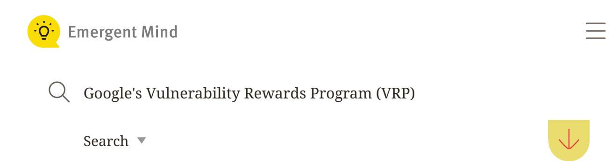

# **Google Vulnerability Rewards Program Overview**

Updated 23 September 2025

Google's Vulnerability Rewards Program is a bug bounty initiative that uses tiered monetary rewards to drive discovery and responsible disclosure of security vulnerabilities.

Empirical analysis shows that selectively increasing rewards leads to a notable rise in high-impact bug submissions and engages diverse researcher archetypes.

Advanced methodologies like staged static analysis, deep learning, and multi-agent validation enhance early detection and streamline remediation of software vulnerabilities.

Google's(VRP) is an externally oriented bug bounty platform designed to incentivize security researchers to discover, responsibly disclose, and facilitate remediation of security vulnerabilities within Google's products and services, including flagship applications such as Chrome and Android. The VRP is characterized by a tiered incentive structure, robust submission workflows, and a continually evolving strategy responsive to empirical findings on bug bounty economics, contributor heterogeneity, methodological advances in vulnerability detection, and coordinated disclosure. Its operation exemplifies the interplay between market mechanisms, incentive design, software assurance practices, and strategic risk management in contemporary cybersecurity. Vulnerability Rewards Program

# **1. Economic Incentives, Reward Structures, and Participatory Dynamics**

The VRP operates as a market-driven system in which monetary rewards are the primary instrument for guiding researcher behavior and submission quality. Following a major reward table update in July 2024, the maximum reward for the highest impact bugs (Tier 0) was increased by approximately 200% (from US \$31,337 to US \$101,010), while other tiers remained unchanged ( ). The table below summarizes the change: [Wang et al., 20 Sep 2025](https://www.emergentmind.com/papers/2509.16655)

| Bug Tier                | Reward Before       | Reward After |  |
|-------------------------|---------------------|--------------|--|
| Tier 0 (highest impact) | \$31,337  \$101,010 |              |  |
| Other tiers             | (unchanged)         | (unchanged)  |  |

# Stay informed about trending AI papers:

your email Subscribe

bugs/month post-change) (Wang et al., 20 Sep 2025). Elasticity estimates for high-value categories were notably large ( $\approx$ 7.24), reflecting strong responsiveness to incentive scaling.

The economic structure is underpinned by behavioral and game-theoretic models. As formalized in (Gal-Or et al., 2024), a vendor's optimal effortincentive tradeoff is given by:

$$P_{eWHH}^S = \frac{1}{n+m} \left[ 1 + (\text{effort-increase effect}) \right]$$

where n is the number of ethical hackers and m is the number of malicious hackers; the probability that severe vulnerabilities are discovered by benevolent researchers increases with bounty size.

### 2. Contributor Heterogeneity and Participation Patterns

Extensive empirical studies distinguish three key contributor archetypes (<u>Hata</u> et al., 2017):

**A1** (Low-activity): Lightly active, rarely submit more than a handful of reports.

**A2** (**Project-specific**): Focus on particular programs (e.g., Chrome), motivated by loyalty, product usage, and depth of engagement; invest substantial time per bug (often days), value direct feedback.

<u>A3</u> (Non-specific bounty hunters): Contribute broadly, prioritize efficiency, driven mainly by bounty amount, typically submit rapid reports.

The top 20% of active contributors account for 64% of reports. This heterogeneity necessitates tailored engagement: A2 contributors benefit from direct communication and non-monetary incentives (feedback, recognition), while A3 favor fast triage and transparent bounty scales.

Archetypal analysis is represented as:

$$x_i \approx \sum_k \alpha_{ik} \cdot z_k, \quad \alpha_{ik} \geq 0, \, \sum_k \alpha_{ik} = 1$$

where  $z_k$  are archetypes at the data boundary.

#### 3. Mechanism Design, Front-loading, and Researcher Mobility

3 of 9

Bug discoveries under VRP and similar programs are "front-loaded": most vulnerabilities are reported soon after program launch, with subsequent submissions exhibiting power-law decay (rate  $\sim 1/t^{0.4}$ ). The probability that a given researcher finds an additional bug decays exponentially:

$$P_{k+1} = \beta \cdot P_k, \quad P_k = \beta^k (1-\beta), \ \beta < 1$$

Rewards increase multiplicatively, forming a Kesten process:

$$R_n = R_0 \sum_{k=1}^n (\Lambda_1 \cdot \Lambda_2 \cdots \Lambda_k)$$

The "St. Petersburg paradox" arises: super-linear reward growth versus sharply decreasing bug discovery probability yields ambiguous expected return; search costs cap the economically sensible exploration (Maillart et al., 2016).

Strategic program design harnesses these dynamics, promoting early engagement, facilitating cross-program mobility, and using platform features (e.g., reputation systems) to reduce transaction costs and information asymmetry (Wachs, 2022).

# 4. Vulnerability Discovery Methods and Technical Workflows

Technical methodologies for vulnerability discovery in VRP-eligible codebases have advanced substantially:

**Staged Static Analysis**: Frameworks such as Melange interpose between the build system and compiler (via Clang/LLVM), deploying source-level and whole-program analyses. Vulnerability classes targeted include uninitialized memory reads—detected via declaration tainting and use-def event gathering—and type confusion, tracked using object declarations, cast validation, and initialization checks (Shastry et al., 2015). The candidate condition:

$$\exists x: x \in \mathrm{UseWithoutDef}_F \, \wedge \, x \not \in \bigcup_{G \in \mathrm{Predecessors}(F)} \mathrm{Def}_G$$

Metric-Based Function Ranking: LEOPARD ranks functions using cyclomatic complexity, pointer metrics, control structure irregularities, and function-dependent scoring, covering  $\approx$ 74% of vulnerable functions by reviewing just 20% of code (Du et al., 2019).

**Deep Learning Approaches**: Recent neural systems quantize vulnerability patterns via optimal transport, assembling codebooks of representative patterns. This enables statement-level detection with significant

improvements in F1-score (function: 94%, statement: 82%), facilitating scalable, fine-grained vulnerability triage [\( \)](https://www.emergentmind.com/papers/2306.06109). Fu et al., 2023

**Multi-Agent Hypothesis-Validation**: VulAgent employs for semantic analysis, constructing and validating vulnerability hypotheses based on trigger paths and defensive context, improving correct identification rates of vulnerable–fixed code pairs up to 450% and reducing false positives by 36% ( ). [specialized agents](https://www.emergentmind.com/topics/specialized-agents) [Wang et al., 15 Sep 2025](https://www.emergentmind.com/papers/2509.11523)

**Machine Learning-Based Prevention**: Reviewing bots in the Android Open Source Project use classifier ensembles (Random Forest, SVM, etc.) to predict vulnerability-inducing code changes pre-submit, attaining ≈80% recall at ≈98% precision, substantially reducing downstream risk and review cost [\( \)](https://www.emergentmind.com/papers/2405.16655). Yim, 2024

# **5. Coordinated Disclosure, Verification, and Market Platforms**

Centralized platforms (e.g., HackerOne) function as market makers, providing standardized reporting, reputation building, and reduced transaction costs [\( \)](https://www.emergentmind.com/papers/2204.06905). Early disclosure is a signaling mechanism indicating program transparency: Wachs, 2022

Disclosed = 
$$\beta \cdot (\text{Early Firm Vulnerability}) + \alpha_f + \gamma_y + \mu_r + \epsilon$$

Programs leveraging coordinated crowdsourced verification (via peer reproduction, gamification, leaderboards, badges) mitigate verification overhead, foster continuous engagement, and allow for both quantitative and qualitative reward allocation ( ). [O'Hare et al., 2020](https://www.emergentmind.com/papers/2009.10158)

Responsible Disclosure (RD) policies and reporting workflows, as applied in IoT and traditional domains, supplement traditional penetration testing, maintaining continuous vulnerability identification and structured communication channels for submitting reports, triaging, and patching ( ). [Ding](https://www.emergentmind.com/papers/1909.11166) [et al., 2019](https://www.emergentmind.com/papers/1909.11166)

# **6. Impact on Product Security, Release Management, and Policy**

Integration of VRP with development and continuous integration pipelines enables earlier software release, with residual risk managed through postrelease coordinated vulnerability reporting ( ). Optimal researcher pool size balances the number of productive ethical hackers against the anticipated malicious actors: [Gal-Or et al., 2024](https://www.emergentmind.com/papers/2404.17497)

$$n^* = 9m - 10m + 1/4$$

where is the expected number of malicious hackers. *m*

The VRP yields enhanced security posture by:

Increasing discovery rate and remediation of severe vulnerabilities prior to exploitation.

Complementing internal teams (as external bug hunters report qualitatively distinct classes of vulnerabilities compared to internal discoveries) ( ). [Atefi et](https://www.emergentmind.com/papers/2301.12092) [al., 2023](https://www.emergentmind.com/papers/2301.12092)

Improving stakeholder trust via public recognition and transparent processing.

is the expected number of malicious hackers.

Optimizing cost-benefit by calibrating rewards according to rediscovery difficulty, vulnerability type, and likelihood of exploit (e.g., via power-law decay modeling of rediscovery probability).

In multiple empirical studies, bug bounty programs demonstrably increase overall quality and robustness of software, with particular gains in the fastestremediated and hardest-to-exploit vulnerabilities.

### **7. Future Directions and Strategic Considerations**

Promising future paths for VRP and comparable programs include:

Adoption of advancedand continuous retraining for preventive vulnerability prediction. generative AI

Expansion of global versus project-specific models to enable flexible deployment across heterogeneous codebases [\( \)](https://www.emergentmind.com/papers/2405.16655). Yim, 2024

Implementation of multi-layered risk management incorporating BBPs, RD, penetration testing, and static/dynamic analysis [\( \)](https://www.emergentmind.com/papers/1909.11166). Ding et al., 2019

Refinement of gamified models and tiered incentives to maximize both quantity and impact of submissions while controlling operational costs [\(](https://www.emergentmind.com/papers/2009.10158) ). O'Hare et al., 2020

Policy adaptation to dynamically adjust reward levels, biodiversity of researcher pools, and component-specific incentives based on changing threat models and empirical program outcomes [\(Wang et al., 20 Sep 2025\)](https://www.emergentmind.com/papers/2509.16655).

The VRP is embedded at the intersection of market economics, software engineering, and security research, continuously evolving in response to technical, strategic, and economic evidence. Its success hinges on ongoing empirical analysis, contributor engagement, and integration of methodological advances in vulnerability assessment and coordinated disclosure.

[Markdown](https://www.emergentmind.com/users/sign_up?redirect_to=https%3A%2F%2Fwww.emergentmind.com%2Farticles%2Fgoogle-s-vulnerability-rewards-program-vrp) [Report Issue](https://www.emergentmind.com/users/sign_up?redirect_to=https%3A%2F%2Fwww.emergentmind.com%2Farticles%2Fgoogle-s-vulnerability-rewards-program-vrp) [Upgrade to Chat](https://www.emergentmind.com/pricing?utm_source=chat-button)

[Markdown](https://www.emergentmind.com/users/sign_up?redirect_to=https%3A%2F%2Fwww.emergentmind.com%2Farticles%2Fgoogle-s-vulnerability-rewards-program-vrp) [Report Issue](https://www.emergentmind.com/users/sign_up?redirect_to=https%3A%2F%2Fwww.emergentmind.com%2Farticles%2Fgoogle-s-vulnerability-rewards-program-vrp) [Upgrade to Chat](https://www.emergentmind.com/pricing?utm_source=chat-button) References (13)

- 1. (2025) [Incentives and Outcomes in Bug Bounties](https://www.emergentmind.com/papers/2509.16655)
- 2. (2024) [Merchants of Vulnerabilities: How Bug Bounty Programs Benefit Software](https://www.emergentmind.com/papers/2404.17497) [Vendors](https://www.emergentmind.com/papers/2404.17497)
- 3. (2017) [Understanding the Heterogeneity of Contributors in Bug Bounty Programs](https://www.emergentmind.com/papers/1709.06224)
- 4. (2016) [Given Enough Eyeballs, All Bugs Are Shallow? Revisiting Eric Raymond](https://www.emergentmind.com/papers/1608.03445) [with Bug Bounty Programs](https://www.emergentmind.com/papers/1608.03445)
- 5. (2022) [Making Markets for Information Security: The Role of Online Platforms in](https://www.emergentmind.com/papers/2204.06905) [Bug Bounty Programs](https://www.emergentmind.com/papers/2204.06905)
- 6. (2015) [Towards Vulnerability Discovery Using Staged Program Analysis](https://www.emergentmind.com/papers/1508.04627)
- 7. (2019) [LEOPARD: Identifying Vulnerable Code for Vulnerability Assessment](https://www.emergentmind.com/papers/1901.11479) [through Program Metrics](https://www.emergentmind.com/papers/1901.11479)
- 8. (2023) [Learning to Quantize Vulnerability Patterns and Match to Locate Statement-](https://www.emergentmind.com/papers/2306.06109)[Level Vulnerabilities](https://www.emergentmind.com/papers/2306.06109)
- 9. (2025) [VulAgent: Hypothesis-Validation based Multi-Agent Vulnerability Detection](https://www.emergentmind.com/papers/2509.11523)
- 10. (2024) [Predicting Likely-Vulnerable Code Changes: Machine Learning-based](https://www.emergentmind.com/papers/2405.16655) [Vulnerability Protections for Android Open Source Project](https://www.emergentmind.com/papers/2405.16655)
- 11. (2020) [Proposal of a Novel Bug Bounty Implementation Using Gamification](https://www.emergentmind.com/papers/2009.10158)
- 12. (2019) [Ethical Hacking for IoT Security: A First Look into Bug Bounty Programs](https://www.emergentmind.com/papers/1909.11166) [and Responsible Disclosure](https://www.emergentmind.com/papers/1909.11166)
- 13. (2023) [The Benefits of Vulnerability Discovery and Bug Bounty Programs: Case](https://www.emergentmind.com/papers/2301.12092) [Studies of Chromium and Firefox](https://www.emergentmind.com/papers/2301.12092)

Topic to Video (Beta)

No one has generated a video about this topic yet.

[Sign Up to Generate](https://www.emergentmind.com/users/sign_up?redirect_to=https%3A%2F%2Fwww.emergentmind.com%2Farticles%2Fgoogle-s-vulnerability-rewards-program-vrp) [All Videos](https://www.emergentmind.com/videos) [Subscribe on YouTube](https://www.youtube.com/@EmergentMindAI?sub_confirmation=1)

# Whiteboard

No one has generated a whiteboard explanation for this topic yet.

[Sign Up to Generate](https://www.emergentmind.com/users/sign_up?redirect_to=https%3A%2F%2Fwww.emergentmind.com%2Farticles%2Fgoogle-s-vulnerability-rewards-program-vrp)

### Follow Topic

Get notified by email when new papers are published related to **Google's Vulnerability Rewards Program (VRP)**.

#### Continue Learning

- 1. [How does Google's VRP compare with other bug bounty programs](https://www.emergentmind.com/search?q=In+the+context+of+Google%27s+Vulnerability+Rewards+Program+%28VRP%29%2C+how+does+Google%27s+VRP+compare+with+other+bug+bounty+programs+globally%3F&search_mode=research) [globally?](https://www.emergentmind.com/search?q=In+the+context+of+Google%27s+Vulnerability+Rewards+Program+%28VRP%29%2C+how+does+Google%27s+VRP+compare+with+other+bug+bounty+programs+globally%3F&search_mode=research)
- 2. [What impacts do tiered reward structures have on the quality and quantity](https://www.emergentmind.com/search?q=In+the+context+of+Google%27s+Vulnerability+Rewards+Program+%28VRP%29%2C+what+impacts+do+tiered+reward+structures+have+on+the+quality+and+quantity+of+reported+vulnerabilities%3F&search_mode=research) [of reported vulnerabilities?](https://www.emergentmind.com/search?q=In+the+context+of+Google%27s+Vulnerability+Rewards+Program+%28VRP%29%2C+what+impacts+do+tiered+reward+structures+have+on+the+quality+and+quantity+of+reported+vulnerabilities%3F&search_mode=research)
- 3. [How do different researcher archetypes affect participation and](https://www.emergentmind.com/search?q=In+the+context+of+Google%27s+Vulnerability+Rewards+Program+%28VRP%29%2C+how+do+different+researcher+archetypes+affect+participation+and+performance+within+VRP%3F&search_mode=research) [performance within VRP?](https://www.emergentmind.com/search?q=In+the+context+of+Google%27s+Vulnerability+Rewards+Program+%28VRP%29%2C+how+do+different+researcher+archetypes+affect+participation+and+performance+within+VRP%3F&search_mode=research)
- 4. [What role do advanced detection methods play in reducing false positives](https://www.emergentmind.com/search?q=In+the+context+of+Google%27s+Vulnerability+Rewards+Program+%28VRP%29%2C+what+role+do+advanced+detection+methods+play+in+reducing+false+positives+and+improving+vulnerability+triage%3F&search_mode=research) [and improving vulnerability triage?](https://www.emergentmind.com/search?q=In+the+context+of+Google%27s+Vulnerability+Rewards+Program+%28VRP%29%2C+what+role+do+advanced+detection+methods+play+in+reducing+false+positives+and+improving+vulnerability+triage%3F&search_mode=research)
- 5. [Find recent papers about bug bounty economics.](https://www.emergentmind.com/search?q=Find+recent+papers+about+bug+bounty+economics.&search_mode=search)

### Related Topics

- 1. [Reproducible CVE Benchmarks](https://www.emergentmind.com/topics/reproducible-cve-benchmarks)
- 2. [Vendor Postures on AI Vulnerabilities](https://www.emergentmind.com/topics/vendor-postures-toward-ai-vulnerabilities)
- 3. [Bug Bounty Policy Evolution](https://www.emergentmind.com/topics/bug-bounty-policy-evolution)
- 4. [CVE Disclosure Process: Automation & Coordination](https://www.emergentmind.com/topics/cve-disclosure-process)
- 5. [Vulnerability Reporting Procedures](https://www.emergentmind.com/topics/vulnerability-reporting-procedures)
- 6 [Vulnerability Rewards Program \(VRP\)](https://www.emergentmind.com/topics/vulnerability-rewards-program-vrp)

- 6. [Vulnerability Rewards Program \(VRP\)](https://www.emergentmind.com/topics/vulnerability-rewards-program-vrp)
- 7. [Common Vulnerabilities and Exposures \(CVEs\)](https://www.emergentmind.com/topics/common-vulnerabilities-and-exposures-cves)
- 8. [Coordinated Vulnerability Disclosure](https://www.emergentmind.com/topics/coordinated-vulnerability-disclosure-cvd)
- 9. [Vulnerability Notifications Overview](https://www.emergentmind.com/topics/vulnerability-notifications-vns)
- 10. [Vulnerability Response Summit](https://www.emergentmind.com/topics/vulnerability-response-summit)

[About](https://www.emergentmind.com/about) [Whiteboards](https://www.emergentmind.com/whiteboards) [Videos](https://www.emergentmind.com/videos) [Labs](https://www.emergentmind.com/labs) [Email Digest](https://www.emergentmind.com/subscribe) [Chrome Extension](https://chromewebstore.google.com/detail/emergent-mind-%E2%80%94-arxiv-int/hgmnadjffdiipehljmhagdgpaoiiklml) [RSS](https://www.emergentmind.com/feeds/rss) [Terms](https://www.emergentmind.com/terms) [Privacy](https://www.emergentmind.com/privacy) [Contact](https://www.emergentmind.com/contact) [Twitter](https://twitter.com/EmergentMind) [Discord](https://discord.gg/BhfTC4mTXq) [YouTube](https://www.youtube.com/@EmergentMindAI?sub_confirmation=1)