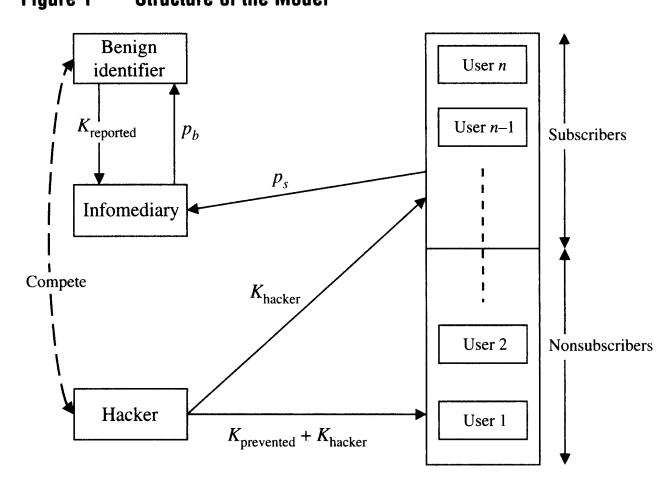
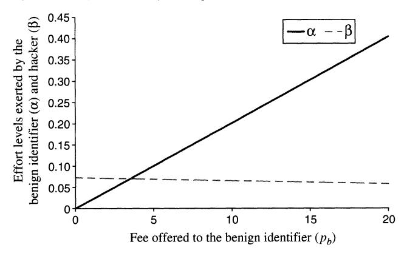
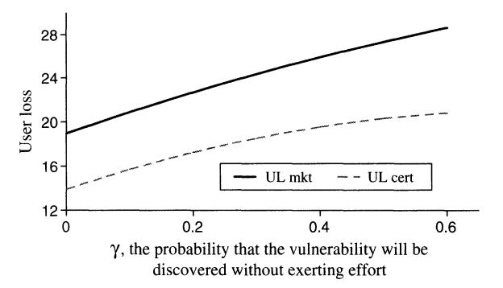
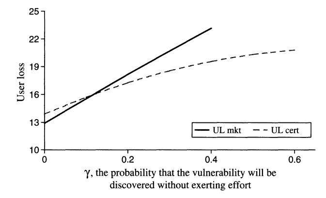

Market for Software Vulnerabilities? Think Again

Author(s): Karthik Kannan and Rahul Telang

Source: Management Science , May, 2005, Vol. 51, No. 5 (May, 2005), pp. 726-740

Published by: INFORMS

Stable URL:<https://www.jstor.org/stable/20110369>

JSTOR is a not-for-profit service that helps scholars, researchers, and students discover, use, and build upon a wide range of content in a trusted digital archive. We use information technology and tools to increase productivity and facilitate new forms of scholarship. For more information about JSTOR, please contact support@jstor.org.

Your use of the JSTOR archive indicates your acceptance of the Terms & Conditions of Use, available at https://about.jstor.org/terms

INFORMS is collaborating with JSTOR to digitize, preserve and extend access to Management Science

 MANAGEMENT SCIENCE inf?ES Vol. 51, No. 5, May 2005, pp. 726-740 DOI i0.1287/mnsc.l040.0357 issn 0025-19091 eissn 1526-55011051510510726 ? 2005 INFORMS

# Market for Software Vulnerabilities? Think Again

### Karthik Kannan

Krannert School of Management, Purdue University, West Lafayette, Indiana 47906, kkarthik@mgmt.purdue.edu

 Rahul Telang H. John Heinz III School of Public Policy and Management, Carnegie Mellon University, Pittsburgh, Pennsylvania 15213, rtelang@andrew. emu .edu

 Software vulnerability disclosure has become a critical area of concern for policymakers. Traditionally, a Com puter Emergency Response Team (CERT) acts as an infomediary between benign identifiers (who voluntarily report vulnerability information) and software users. After verifying a reported vulnerability, CERT sends out a public advisory so that users can safeguard their systems against potential exploits. Lately, firms such as iDefense have been implementing a new market-based approach for vulnerability information. The market based infomediary provides monetary rewards to identifiers for each vulnerability reported. The infomediary then shares this information with its client base. Using this information, clients protect themselves against

 potential attacks that exploit those specific vulnerabilities. The key question addressed in our paper is whether movement toward such a market-based mechanism for vulnerability disclosure leads to a better social outcome. Our analysis demonstrates that an active unregulated market-based mechanism for vulnerabilities almost always underperforms a passive CERT-type mechanism. This counterintuitive result is attributed to the market-based infomediary's incentive to leak the vulnerability information inappropriately. If a profit-maximizing firm is not allowed to (or chooses not to) leak vulnerability information, we find that social welfare improves. Even a regulated market-based mechanism performs better than a CERT-type one, but only under certain conditions. Finally, we extend our analysis and show that a pro posed mechanism?federally funded social planner?always performs better than a market-based mechanism.

 Key words: information security; software vulnerabilities; vulnerability disclosure; game theory; public policy History: Accepted by Linda V. Green, public sector applications; received April 13, 2004. This paper was with the authors 1 \ months for 2 revisions.

#### 1. Introduction

 One of government's fundamental jobs is decid ing what goods and services should be provided by which types of markets. The United States has decided that postal delivery and national defense ser vices should be provided by the government. Utilities used to be primarily regulated monopolies but now operate in regulated competition. Grocery stores are largely unregulated. Ideally, the choice is made on the basis of social welfare, including efficiency and equity considerations. Here we offer the first such analysis with regard to the market for software vulnerability detection.

 Attacks exploiting software vulnerabilities (or bugs, as they are commonly known) cause significant eco nomic damage. A recent study by the National Insti tute of Standards and Technology (NIST 2002) esti mates the number in the range of \$60 billion per year. Given the enormity of damage and the fact that vul nerabilities cannot be completely eliminated in soft ware, vulnerability disclosure has become a critical area of concern for policymakers (eWeek 2003).

 Traditionally, Computer Emergency Response Team (CERT) acts as an infomediary between benign identi

 fiers, who report vulnerability information, and soft ware users. CERT's role evolved during the early days of the Internet when vulnerability discovery and reporting was relatively infrequent. Because no mar ket existed for vulnerabilities, CERFs role was cru cial in disseminating vulnerability information. After verifying a reported vulnerability and coordinating with vendors, CERT typically sends out a public advi sory to allow users to safeguard their systems against potential exploits. In order to ensure that such pub lic notifications are not exploited by hackers to attack software users, CERT follows a series of steps before such a disclosure. The steps include contacting the vendor for the appropriate patch, and waiting for an appropriate time before publicly disclosing the vul nerability. In this traditional mechanism, reporting vulnerabilities is voluntary, with no explicit monetary

 gains to benign identifiers. Lately, the number of vulnerabilities discovered has increased. For example, 4,129 vulnerabilities were reported in 2002, whereas only 1,090 were reported in 2000 (CERT 2003). This has also led to the crea tion of a market for vulnerabilities, where firms such as iDefense have been acting as infomediaries. In this  market-based mechanism, the infomediary offers a monetary reward to the identifiers for every vulner ability reported to it. The infomediary then shares this information with users who are subscribed to its service. Subscribers use this information along with other value-added services provided by the infomedi ary, such as patches or filters to protect them against

 attacks that exploit that vulnerability. The key question addressed in this paper is whether such a movement toward a market-based mechanism leads to a better social outcome. The answer is not obvious. On the one hand, monetary incentives to discover vulnerabilities may encourage benign identi fiers to invest more effort and time in finding them, thereby generating a better social outcome. On the other hand, the same incentives may also lead to a race for vulnerability discovery between benign identifiers and hackers. A similar behavior has been observed in research and development (R&D) com petitions where firms race to be an innovator (see Dasgupta and Stiglitz 1980, Reinganum 1982). If rac ing happens and the number of vulnerabilities dis covered by hackers increases, it may decrease social welfare. Note that a monopolistic market-based info mediary has an incentive to serve only a fraction of the entire market, thereby exposing nonsubscribers to attacks. Moreover, the nonsubscribers may also suffer if the monopolist misuses vulnerability information to increase its profits by leaking it to the public and exposing nonsubscribers to more attacks. This may lead to a further decrease in social welfare. We term such a market an unregulated market. However, even in a regulated market, where a market-based infomediary cannot misuse information, the answer is unclear.

 From a policymaker's perspective, understanding this question is crucial. If markets perform at least as well as the traditional CERT-type mechanisms, then policymakers need to reshape the role of such institu tions in the future. Moreover, this also means that our policies should encourage such markets. If markets decrease welfare and they are here to stay, how ever, then policymakers need to think about regula tions that may achieve the desired objective. One key contribution of our paper is to argue that, whereas software security typically has been a domain of com puter scientists and technical researchers, it is the emerging economic and policy issues that have sig nificant welfare implications. Even so, there is little academic research in this area from which to draw. Our paper tries to bridge this gap by analyzing the economic efficacy of these mechanisms and by pro

 viding appropriate policy guidelines. One striking finding of our paper is that un regulated markets almost always perform worse than even a no market case. This is in contrast to tradi tional economic models where even a monopolistic  market is better than no market at all. We observe this counterintuitive result in the domain of vulner ability disclosure because a monopolist has incentives to use vulnerability information in a socially detri mental way. This result suggests that some regula tory guidelines are necessary for proper disclosure of vulnerability information. We then extend the model to show that even when the market is regulated, under certain conditions (as long as users voluntarily find the vulnerabilities with high enough probability), the passive CERT-type mechanism is better than the market-based mechanism. The key intuition is that the market maker increases the supply of vulnerabil ities and this increased supply is socially detrimental because it forces the users to pay higher rents to sub scribe to the market maker's services.

 Another key finding is that the payment for vulner ability discovery encourages the benign identifier to exert a higher effort which imposes a negative ex ternality on the effort of the hackers. Because the hackers' incentives to find vulnerabilities reduce, it improves the social benefits. We build on these two key findings to formulate a new mechanism. Specifi cally, we show that the CERT-type mechanism is the most beneficial when it funds vulnerability discov ery by paying benign identifiers. Based on this result, we argue that CERT should create incentives for the benign identifiers to discover and report vulner abilities.

 The paper is organized as follows. In ?2, we review the literature most relevant to this topic. Following that, in ?3 we provide a general model, and in ?4 we then provide details of the unregulated market-based mechanism and its comparison to the CERT-type one. In ?5, we discuss the regulations of the regulated market-based mechanism and compare its welfare metrics against that of the CERT-type mechanism. In ?6, we analyze the federally funded mechanism and study its welfare implications relative to other mech anisms. Following that, we present our concluding remarks in ?7.

### 2. Literature Review

 Much of the prior work in the software vulnerabil ity and information security area has focused on the technical aspects of the problem. For example, Krsul et al. (1998) and Du and Mathur (1998a, b) analyze and classify different software errors that lead to secu rity breaches. Only a few papers have analyzed eco nomic issues related to problems in the information security.

 One of the few papers to discuss markets for vul nerabilities is Camp and Wolfram (2000), but the focus of their work is different. They describe a means for creating a market for vulnerabilities in order to increase the security of systems. They contend that  government intervention by issuing a new currency in the form of credits for security vulnerabilities will provide incentives to make systems more secure. Sim ilarly, Schechter (2002) argues that vendors should create and exploit a market for testers. He concludes that encouraging competition among testers by using incentives to discover vulnerabilities can serve to

 improve quality. Gordon et al. (2002) discuss how the economic issues related to information sharing in Information Sharing & Analysis Centers (ISACs), created under the Presidential Decision Directive 63 for sharing information security issues, are similar to those in trade associations. In their paper, they also provide an overview for developing economic models to study issues such as free-riding, which Varian (2002) has recognized as an important element in the informa tion security space. Two other papers?Gordon et al. (2003) and Gal-Or and Ghose (2003)?have followed up on this idea and developed game-theoretic mod els to study the economic consequences of sharing security information in ISACs. The focus of Gordon et al. (2003) is on how information sharing affects the overall level of information security by examin ing the effect of security investment on expected secu rity costs. Gordon et al. (2003) focus on the cost-side, and Gal-Or and Ghose (2003) focus on the demand side effects of security breaches and information

 sharing. In addition, a few other papers have analyzed secu rity investments that software users undertake to pro tect themselves against potential exploits. Gordon and Loeb (2002) develop an economic model for informa tion security investment decisions. They analytically demonstrate that the optimal level of information security spending does not always increase with the expected loss from attacks and that this level of secu rity spending must be far less than the expected loss from attacks. Another paper by Schechter and Smith (2003) discusses how security investments must take into account the intruder's cost of breaking in.

 Arora et al. (2003) develop an economic model to study a vendor's decision of when to introduce its product and whether or not to patch vulnerabilities in its software. Interestingly, they observe that the profit maximizing vendor delivers a product that has fewer vulnerabilities than a social welfare-maximizing ven dor. However, the profit-maximizing vendor is less

 willing to patch. To our knowledge, no prior work has addressed specific issues discussed in the introduction. Practi tioners in different capacities have proposed different legal and economic frameworks for software vulner ability disclosure (Security-Focus 2003, eWeek 2003). Arora et al. (2004) provide an economic decision making framework for disclosing vulnerabilities.

 In a New York Times article, Var?an (2000b) suggests that information security can be improved by first assigning legal liability. Along with a legal frame work, he argues that an insurance framework can provide the correct market-based incentive structure (see Yurcik and Doss 2002, Gordon et al. 2003b, for issues related to cyber-insurance). Because this area of research is relatively nascent and much of the work is yet to come, policymakers are left with little guidance in understanding the implications of different frame works. In line with this motivation, our paper mainly draws from the basic industrial organization litera ture by providing a formal model to analyze differ ent disclosure mechanisms in the information security domain.

#### 3. Model

 Figure 1 outlines the basic structure of our model. Our model has four main participants?the infomedi ary (such as iDefense or CERT), a benign identifier,1 a hacker, and software users. In this paper, we consider a monopolistic infomediary for two primary reasons. First, this market is likely to yield to a monopolis tic structure because an infomediary that buys infor mation from the benign identifier amortizes the cost of acquisition over its subscriber base. Therefore, a firm with a larger customer base can always drive out smaller players by virtue of its size and scale. Typically, markets for information goods display such characteristics, yielding either a dominant firm or many differentiated firms that are similar to local monopolies (see Shapiro and Var?an 1998, p. 25). Sec ond, given that the market of vulnerabilities is itself relatively new and the pertinent mechanisms are not well understood, it is important to understand the implication of a monopolistic structure before study

 ing the implications of an oligopolistic market. Let the informediary pay ph as a reward to the benign identifier for reporting a vulnerability. Let ps represent the one-time subscription fee that the info mediary charges to each of its subscribers. The (pb, ps) pair set by the infomediary determines the number of subscribers (and hence the fraction of the market sub scribing), the number of vulnerabilities reported by the benign identifier, and the probability of attacks. But the optimal prices pb and ps, in turn, are deter mined by the fraction of the market subscribing, the number of vulnerabilities reported, and so on. There fore, we model this as a two-period game. In the first period, the infomediary sets its optimal pricing pol icy; in the second period, all other players?software

 1 We demonstrate that the key results shown by assuming a single benign identifier hold even if we generalize to n benign identifiers. The details are at http://mansci.pubs.informs.org/ecompanion. html.

 users, the benign identifier, and the hacker?react. When solving this game, however, we first solve for the reaction of the benign identifier, the hacker, and software users for a given (pb,ps) pair, and then solve for the optimal (pb/ps) using backward induc tion. Ultimately, our goal is to calculate the welfare metrics?the overall industry loss and the overall user loss?for each mechanism.

 Without loss of generality, we assume that there is one vulnerability in the product and that the be nign identifier and the hacker attempt to discover it. Having only one vulnerability allows us to model everything as probability measures. Let iChacker be the probability that the vulnerability is first discovered by the hacker. In this case, the hacker exploits the vulnerability to attack all users (including the info mediary's subscribers). Similarly, let Krep0rted be the probability that the vulnerability is first discovered by the benign identifier who reports it to the info mediary. Note that, by definition, the benign identi fier does not exploit the vulnerability. After obtaining the vulnerability information, the infomediary notifies its subscribers so that they can protect their systems against potential future attacks. Let KpreVented represent the probability that the attack is prevented by sub

 scribing to the infomediary's service. The key consideration here is what the infomediary does with the vulnerability information. Once its sub scribers are protected, the infomediary could either disclose vulnerability information to the public with out proper safeguards, or inform the vendor and dis close the information responsibly. If the infomediary leaks the vulnerability to the public without proper safeguards, then the hacker can easily exploit that vulnerability to attack nonsubscribers. Thus, when the benign identifier discovers the vulnerability, the hacker also benefits. Instead, if the infomediary dis closes the information in a responsible fashion, then nonsubscribers are affected only if the hacker is able

 to find that vulnerability on his own. Note that in this case, the hacker benefits only from discovering the

 vulnerability by himself. When the market-based infomediary leaks vulner ability information, we refer to it as the unregulated market-based mechanism. In contrast, the market based infomediary in a regulated market will make the information public only with proper safeguards and, in that case, users not subscribed to its service are not adversely affected. Therefore, in our model

$$K_{\text{prevented}} = \begin{cases} K_{\text{prevented}}^{\text{leak}} & \text{if it is an unregulated market} \\ K_{\text{prevented}}^{\text{no leak}} & \text{if it is a regulated market.} \end{cases}$$

 We use the variables with superscripts, iwiented an<^ ^evented' oruv to distinguish between the regulated and unregulated cases. Otherwise, we use KpreVented A related point to note is that the (pb, ps) pair chosen by the infomediary is dictated by its decision to leak. We first begin with the unregulated market in which the infomediary can leak the information.

 4. Unregulated Market We are ready to sketch the behavior of software users, the benign identifier, and the hacker when the info mediary sets a price pair (pb, ps).

#### 4.1. Modeling Software Users, the Benign Identifier, and the Hacker

 Without loss of generality, we normalize the total number of software users in the market to one. This means that we deal with the fraction of the market subscribed to the infomediary's service, denoted by rj, instead of the number of subscribers. Our objective, in this subsection, is to characterize the expressions for the probabilities Kreported, K^ented, Khacker, and 77 as functions of pb and ps.

 4.1.1. Characterizing Subscribers. We assume that software users are heterogeneous in terms of the loss they incur when a vulnerability is exploited. Let the user loss type, 6, be distributed on the interval [0, 6] according to the distribution function F(6). Any software user / of type 6? is assumed to incur a loss of Of when the vulnerability is exploited. The software users have the option of preventing attacks on their systems by subscribing to the infomediary's service. Let the subscription fee charged by infomediary be ps. Any user i, whose expected avoidance of loss from subscribing

$$\Pi_{\text{user}} = \theta_i^2 K_{\text{prevented}}^{\text{leak}} - p_s > 0, \tag{1}$$

 subscribes to the service. In this expression, the first term corresponds to the loss prevented by subscrib ing to the service. Note that invented is a function

 of pb, which the infomediary pays to benign identi fiers for discovering a vulnerability. The second term corresponds to the payment made to the infomediary. Therefore, only those software users whose 0? satisfies the following condition subscribe to the service:

$$\theta_i > \sqrt{\frac{p_s}{K_{\text{prevented}}^{\text{leak}}}}.$$
 (2)

 Because 6 is assumed to have a distribution function F(6), the fraction of the market subscribed to the info mediary's service is

$$\eta = 1 - F\left(\sqrt{\frac{p_s}{K_{\text{prevented}}}}\right).$$
(3)

 In a mechanism where software users are not charged any price at all, then ps ? 0, and 77 = 1. This implies that all users are provided with the vulnerability information.

 4.1.2. Characterizing Xreported, X^ented, and Xhacker. We now characterize the probabilities KTepoTted, ^evented' and Khacker as functions of pb and ps. Note that these probabilities determine the welfare-metrics, user loss,

 and industry loss that are defined in ?4.2.1. The (pb,ps) pair set by the infomediary determines the effort levels exerted by the benign identifier and the hacker, which dictate these probabilities. Let a be the effort exerted by the benign identifier and ? be the effort exerted by the hacker. Then, the functional form for Xreported, Kl^vented, and Khacker would satisfy the following intuitive criteria:

- dKreported/da > ? and dKhackeT/d? > 0. The prob ability that the vulnerability is reported increases with the benign identifier's effort. Similarly, higher efforts by the hacker leads to a higher probability that he will discover the vulnerability first. These expressions are
- akin to positive elasticity of own efforts. dKreported/<9/3 < 0 and dKhacker/da < 0. The prob ability that the vulnerability is discovered by the benign identifier decreases with the hacker's effort. Similarly, the probability of the hacker finding the vulnerability decreases with the benign identifier's efforts. These expressions are akin to negative cross

 elasticity of efforts. For analytical tractability and to be able to solve for equilibrium, we need to characterize the expressions for these probabilities. Next, we obtain the functional form for these probabilities by modeling the competi tion between a benign identifier and a hacker within the software's life cycle period, T.

 Competition Between the Benign Identifier and the Hacker. We assume a uniform probability density function (pdf) for the vulnerability being discovered by either player (benign identifier or the hacker) at

 any time t < T without exerting any effort. Hence the pdf is given by y/T. Therefore, the probability that the player will discover the vulnerability within time period T equals y where y e [0,1]. In other words, y corresponds to the probability with which each player discovers the vulnerability without exert ing any effort. Players can alter y, and hence the pdf, by exerting effort. We assume that a benign identi fier exerts an effort a. This effort increases its pdf to (a + y)/T. Similarly, the hacker exerts an effort level of ? that increases its pdf to (? + y)/T. Note that we use the additive functional form simply for tract

 ability reasons.2 Investing effort is costly for the benign identifier and the hacker. Therefore, they invest effort in an opti mal manner. Their effort level is determined by the noncooperative Nash equilibrium that emerges from competition between them. The effort parameters, a and ?, are assumed to be set for the entire duration, T, and cannot be modified during the game. Given the effort levels a and ?, we can now compute the prob abilities:

 The probability that the vulnerability is reported, Reported/ corresponds to the probability that the vul nerability is first discovered by the benign identifier and reported to the infomediary:

$$K_{\text{reported}} = \int_{0}^{T} \text{Probability}(benign = t)$$

$$\cdot \text{Probability}(\overline{hacker} < t) \, d$$

 where Probability(femgn = t) is the probability that the vulnerability is identified by the benign identi fier at time t by exerting an effort a, and Probabi UtyQiacker < t) is the probability that the vulnerability has not been identified by the hacker exerting effort ?

by time t. Therefore,

$$K_{\text{reported}} = \int_0^T \frac{\alpha + \gamma}{T} \left( 1 - \frac{(\beta + \gamma)t}{T} \right) dt$$
$$= (\alpha + \gamma) \left( 1 - \frac{(\beta + \gamma)}{2} \right). \tag{4}$$

 In general, the probability that an attack is pre vented, ^prevented/ affects the value provided by the infomediary's service for a user of loss-type 0?. It is important to note that when the infomediary in an unregulated market leaks the vulnerability informa tion without proper safeguards, all reported vulner abilities become exploitable. Thus, by subscribing to the infomediary's service, a user can prevent all those attacks that occur whenever the benign identifier

 2 We show that similar results are obtained when using a multi plicative form. The details are at http://mansci.pubs.informs.org/ ecompanion.html.

 reports the vulnerability to the infomediary.3 Under leakage,

$$K_{\text{prevented}}^{\text{leak}} = K_{\text{reported}} = (\alpha + \gamma) \left( 1 - \frac{(\beta + \gamma)}{2} \right).$$
 (5)

 We will calculate KgJ^ in ?5. Finally, the probability that the vulnerability is first discovered by the hacker, Khacker, is

$$K_{\text{hacker}} = \int_{0}^{T} \text{Probability}(hacker = t)$$

$$\cdot \text{Probability}(\overline{benign} < t) \, dt$$

$$= (\beta + \gamma) \left( 1 - \frac{(\alpha + \gamma)}{2} \right). \tag{6}$$

 When the vulnerability is first discovered by the hacker, the hacker attacks all users, including the sub scribers of the infomediary's service.

 Optimal Effort Level. We use these probabilities to compute the optimal effort exerted by the benign identifier and the hacker. Recall that the effort exerted by the benign identifier increases her probability of finding the vulnerability to a + y. This effort is re warded with pb if she discovers the vulnerability before the hacker does. Because Krep0rted is the prob ability that the benign identifier discovers the vulner ability first, her expected revenue is Pi,Krep0rted- For some effort level a, the benign identifier's cost is C(a). Thus, the expected profit for the benign identifier is

$$\Pi_b = K_{\text{reported}} p_b - C(\alpha).$$

 For obtaining an interior optimal solution, we re quire that Ub be concave in a. Because the revenue increases linearly with a, any convex cost function will suffice. In our model, we use the commonly used quadratic function, C(a) = Ma2, where M is the cost of the exerting effort. Some restrictions will be placed on the size of M in order to ensure that the prob abilities a + y and ? + y are bounded in [0,1]. Substi tuting for C(a) and Xreported in Ub, we get

$$\Pi_b = (\alpha + \gamma) \left( 1 - \frac{(\beta + \gamma)}{2} \right) p_b - M\alpha^2. \tag{7}$$

 3 In our analysis, we assume that when the infomediary leaks, it serves to benefit the hacker only. In general, the nonsubscribers can also find out about the leaked information and act on it, but the search cost will likely be very high. If we were to model this by assuming that nonsubscribers are able to find and use the leaked information to successfully prevent attacks with certain probability, the expected avoidance of loss for the users (Equation (1)) would change slightly by including this probability term. However, all our main results and insights would continue to hold. For the sim plicity of exposition, we ignore the case when leakage benefits the nonsubscribers.

 Next, let us consider the hacker's expected profit. The hacker benefits by attacking all users if he discov ers the vulnerability first. But if he discovers the vul nerability after the benign identifier does, he obtains the profit only from attacking users who are not the infomediary's subscribers.4 We assume that if the hacker is successful in attacking a user of type 0f, he gains a profit of 6?. Note that the functional form of the hacker's profit function is intentionally made to be different from the loss suffered by the user ? 02.5 The hacker's cost is C(?). Therefore,

$$\Pi_{h} = K_{\text{hacker}} \left( \int_{0}^{\tilde{\theta}} \theta \, dF(\theta) \right) + K_{\text{prevented}}^{\text{leak}} \left( \int_{0}^{\sqrt{\frac{p_{s}}{K_{\text{prevented}}}}} \theta \, dF(\theta) \right) - C(\beta).$$

 + ^prekvented(//4"n,ed 0dF(0)) - C(j8). In the first term, backer corresponds to the probability that the hacker discovers the vulnerability first and attacks all users.6 The term inside the integral is the expected profit from attacking all the users. Similarly, in the second term, invented corresponds to the prob ability that the hacker discovers the vulnerability after the benign identifier. The integral in the second term is the expected profit for the hacker from attacking users that are not subscribed to the infomediary's ser vice. The last term corresponds to the cost of exert ing effort. Substituting for Khacker, integrating by parts, and using k = Jps/K^ented, we get

$$\Pi_{h} = K_{\text{hacker}} \left( \bar{\theta} - \int_{0}^{\bar{\theta}} F(\theta) \, d\theta \right)$$

$$+ K_{\text{prevented}}^{\text{leak}} \left( \kappa F(\kappa) - \int_{0}^{\kappa} F(\theta) \, d\theta \right) - C(\beta)$$

 The optimal hacker effort, /?\*, is a solution of this implicit equation that requires some functional form assumption for F(6). To ensure analytical tractability, we let 0 be distributed uniformly [0, 0]. This means that F(0) = 0/0. Note that this assumption, when com bined with the nonlinear loss function?02?assumed for each user, reflects the empirical observations quite well. That is, many users suffer smaller losses and a few users suffer huge losses. Substituting for F(0) and

 4 It is trivial to show that the hacker never finds it optimal to sell

the vulnerability. 5 In some cases, the hackers may gain a lot by exploiting a vulner ability even though users may not lose a lot. In other cases, the hackers may not gain much, but the cost to the user could be sig nificant. For example, hackers might take down a website, causing significant damages to users but with little monetary benefits to the hackers.

 6 In reality, the hackers may attack users over a period rather than instantaneously. One can potentially add a scaling constant to accommodate such a scenario.

simplifying the equation, we obtain

$$\Pi_{h} = (\beta + \gamma) \left( 1 - \frac{(\alpha + \gamma)}{2} \right) \frac{\bar{\theta}}{2} 
+ K_{\text{prevented}}^{\text{leak}} \frac{p_{s}}{K_{\text{prevented}}^{\text{leak}} 2\bar{\theta}} - M\beta^{2} 
= (\beta + \gamma) \left( 1 - \frac{(\alpha + \gamma)}{2} \right) \frac{\bar{\theta}}{2} + \frac{p_{s}}{2\bar{\theta}} - M\beta^{2}.$$
(8)

To obtain the optimal effort level of the benign identifier ( $\alpha$ ) and the hacker ( $\beta$ ), we take the first-order condition on their expected profit expressions and solve the resulting simultaneous equations:

$$\alpha^* = \frac{(8M - \bar{\theta})p_b(2 - \gamma)}{32M^2 - p_b\bar{\theta}}$$
$$\beta^* = \frac{(2 - \gamma)(4M - p_b)\bar{\theta}}{32M^2 - p_b\bar{\theta}}.$$

Note that because  $\alpha + \gamma$  and  $\beta + \gamma$  are probabilities, they should be bounded [0,1] for any reasonable result. We bound these by restricting the cost of effort M. Let  $M_{\rm th}$  be the threshold value above which the probabilities are bounded (we derive the expression for  $M_{\rm th}$  when we compare the different mechanisms). For the rest of the analysis, we assume  $M > M_{\rm th}$ .

For  $M > M_{\text{th}}$ , we observe the following properties in these equations:

- Both  $\alpha$  and  $\beta$  are independent of  $p_s$ , the one-time subscription fee that the infomediary charges its subscribers for its service.
- As  $p_b$  increases,  $\alpha$  increases but  $\beta$  decreases. Figure 2 captures the variation of  $\alpha$  and  $\beta$  with  $p_b$  for  $\gamma=0$ , M=24, and  $\bar{\theta}=7$ . This suggests that, although effort exerted by the benign identifier increases with  $p_b$ , this, in turn imposes a negative externality on the hacker's incentives and reduces his efforts.
- For a given  $p_b$ , both the benign identifier and the hacker have incentives to increase their efforts as  $\gamma$  decreases.

Figure 2 Optimal  $\alpha$  and  $\beta$  with  $\rho_b$ 

• Finally, as M increases (i.e., the cost of exerting effort increases), the optimal effort levels,  $\alpha^*$  and  $\beta^*$ , decrease.

*Functional Forms.* Using  $\alpha^*$  and  $\beta^*$  in Equations (4), (5), and (6), we can compute the following probabilities:

$$\begin{split} K_{\text{prevented}}^{\text{leak}} &= K_{\text{reported}} \\ &= \frac{1}{(32M^2 - p_b\bar{\theta})^2} \cdot 4(2 - \gamma)M(8M - \bar{\theta}) \\ &\quad \cdot (16\gamma M^2 + 8Mp_b - 4\gamma Mp_b - p_b\bar{\theta}) \\ K_{\text{hacker}} &= \frac{1}{(32M^2 - p_b\bar{\theta})^2} \cdot 8(2 - \gamma)M(4M - p_b) \\ &\quad \cdot (16\gamma M^2 + 4M\bar{\theta} - 2\gamma M\bar{\theta} - p_b\bar{\theta}). \end{split} \tag{9}$$

Note that  $\partial K_{\rm reported}/\partial p_b>0$  and  $\partial K_{\rm hacker}/\partial p_b<0$ . Therefore, the hacker and the benign identifier impose negative externality on each other. Moreover, as the baseline probability of discovering the vulnerability without effort— $\gamma$ -increases, all three probabilities increase, i.e.,  $\partial K_{\rm reported}/\partial \gamma>0$ ,  $\partial K_{\rm prevented}^{\rm leak}/\partial \gamma>0$ , and  $\partial K_{\rm hacker}/\partial \gamma>0$ . Finally, as the cost of effort, M, increases, all three probabilities decrease, i.e.,  $\partial K_{\rm reported}/\partial M<0$ ,  $\partial K_{\rm prevented}^{\rm leak}/\partial M<0$ , and  $\partial K_{\rm hacker}/\partial M<0$ .

#### 4.2. Optimal Pricing $p_b$ and $p_s$

As is common in the subgame perfect equilibrium, we first calculate the second-period consequence of first-period action, and based on those outcomes calculate the optimal first-period actions. For the unregulated market-based framework, we have computed the optimal  $K_{\rm prevented}^{\rm leak}$ ,  $K_{\rm reported}$ , and  $K_{\rm hacker}$  as functions of  $p_b$  and  $p_s$ . Based on these probabilities, we calculate the optimal  $p_s$  and  $p_b$  that the market-based infomediary sets.

The infomediary maximizes the following profit function:

$$\max_{p_b, p_s} \eta p_s - K_{\text{reported}} p_b.$$

The first term corresponds to the revenue that the infomediary generates by charging its subscribers  $p_s$ . The second term is the cost it incurs to pay for each vulnerability reported. Substituting for  $\eta$  from Equation (3) and using  $F(\theta) = \theta/\bar{\theta}$ , we have

$$\max_{p_b, p_s} \left( 1 - \frac{1}{\bar{\theta}} \sqrt{\frac{p_s}{K_{\text{prevented}}^{\text{leak}}}} \right) p_s - K_{\text{reported}} p_b. \tag{11}$$

We take the first-order derivative w.r.t.  $p_s$  and  $p_b$ , and solve the simultaneous equations to get

$$p_s^* = \frac{4K_{\text{prevented}}^{\text{leak}}\bar{\theta}^2}{9}$$

$$p_b^* = -32M^2(108\gamma M^2 - 4(2 - \gamma)M\bar{\theta}^2 + (1 - \gamma)\bar{\theta}^3)$$

$$\cdot (1728(2 - \gamma)M^3 - 108(4 - \gamma)M^2\bar{\theta}$$

$$-4(2 - \gamma)M\bar{\theta}^3 + \bar{\theta}^4)^{-1}.$$

 Note that dpl/dy < 0, which implies that as identifiers voluntarily provide vulnerability information, incen tives to fund vulnerability disclosure decreases.

 Thus far, we make the assumption that no resale (or sharing) of information by subscribers is possible. In general, high transaction, technical, and legal barriers will make it difficult for secondary markets to exist, and therefore this is a standard assumption in the lit erature (Bakos and Brynjolfsson 1999). The issue of sharing has been also addressed in different contexts in the prior literature. One of the main results from Varian (2000a) is that when the marginal cost of pro duction is zero and even when transaction costs are zero, sharing among consumers occurs but the firm sells a lower number of units at a proportionately higher price. This means that the same fraction of the market which was not covered without sharing will not be covered even with sharing, and our results will continue to hold. A similar argument is also provided in Bakos et al. (1999)7 We are now ready to define the welfare-metrics.

 4.2.1. Welfare-Metrics. Our final goal is to ana lyze the welfare changes under different market con ditions. To measure the efficacy of this unregulated market-based mechanism, we define the overall user loss and the overall industry loss. Note that these met rics are computed assuming that the total number of software-users in the market is normalized to one. Now, consider the user loss expression:

$$UL_{\text{MARKET}}^{\text{leak}} = K_{\text{hacker}} \left( \int_{0}^{\hat{\theta}} \frac{\theta^{2}}{\bar{\theta}} d\theta \right) + K_{\text{prevented}}^{\text{leak}} \left( \int_{0}^{(1-\eta)\bar{\theta}} \frac{\theta^{2}}{\bar{\theta}} d\theta \right) + \eta p_{s}. \quad (12)$$

 The first term in the expression corresponds to the loss incurred when the hacker discovers the vulner ability first and attacks all users. The second term corresponds to the loss incurred when the hacker dis covers the vulnerability after the benign identifier. In this case, the hacker attacks only those users who are not subscribed to the infomediary's service. The last term corresponds to the payment made by the sub scribers. By substituting for p\*s, p?, K^ented and Xhacker, one can compute ULJ^arket

 Similarly, one can compute the overall industry loss by combining user loss Equation (12) with the info mediary's profit to obtain the industry loss expression:

$$IL_{\text{MARKET}}^{\text{leak}} = K_{\text{hacker}} \left( \int_{0}^{\bar{\theta}} \frac{\theta^{2}}{\bar{\theta}} d\theta \right) + K_{\text{prevented}} \left( \int_{0}^{(1-\eta)\bar{\theta}} \frac{\theta^{2}}{\bar{\theta}} d\theta \right) + K_{\text{reported}} p_{b}.$$
(13)

 When we compute the industry profits, the term r]ps, which appears in Equation (12), does not appear in Equation (13). This is because r)ps is sim ply the transfer of rent from subscribers to the infomediary. Thus, the only remaining term is the expected payment made by the infomediary for vul

 nerability disclosure, and it appears in Equation (13). From the expressions above, the following observa tion is worth noting. For a given 0, pb, ps, and M, recall that Kl^ented, Khacker, and Kreported increase as y in creases. But as y increases, p\ decreases, which further aids the increase in Khacker (because dKhackeT/dpb < 0). Both these factors make I?L^rket and ^-market \*n~ crease with y.

#### 4.3. User Loss in the CERT-Type Mechanism

 Recall that in the CERT-type mechanism, no money is paid to the benign identifier for reporting the vul nerability, i.e., pb ? 0. Also, no subscription is charged and the vulnerability information is provided to all users, i.e., ps = 0 and r\ = 1. Given this, the user loss and the industry loss are identical in the CERT-type mechanism:

$$UL_{\text{CERT}} = IL_{\text{CERT}} = K_{\text{hacker}} \left( \int_0^\theta \frac{\theta^2}{\tilde{\theta}} d\theta \right).$$
 (14)

 These losses are identical because there is no trans fer of payment in this mechanism. To compute this equation, we derive the expression for Khacker, using a framework similar to that in the earlier section. Recall

$$K_{\text{hacker}} = (\beta + \gamma) \left( 1 - \frac{\alpha + \gamma}{2} \right).$$
 (15)

 To obtain the optimal effort level, we consider the expected profit expressions for the benign identi fier and the hacker under the CERT-type mechanism (i.e., pb = 0):

$$\Pi_b = -M\alpha^2$$

$$\Pi_h = K_{\text{hacker}} \left( \int_0^{\bar{\theta}} \theta \, dF(\theta) \right) - M\beta^2.$$

 First-order conditions will give the optimal a\* and j?\*. a\* = 0 and the benign identifier does not

 7 We thank the anonymous reviewer for pointing us to the issue of resale and secondary market.

exert any effort at all. Despite this, the vulnerability is still discovered by the benign identifier with a probability of  $\gamma$ , and, by assumption, the vulnerability is always reported to the infomediary. The hacker, however, invests an optimal  $\beta$  to discover the vulnerability. This is given by  $\beta^* = (2-\gamma)\bar{\theta}/(8M)$ . Using  $\alpha^*$  and  $\beta^*$  in Equation (15), we compute  $K_{\text{hacker}}$ , which is then substituted back in Equation (14) to obtain

$$UL_{\text{CERT}} = IL_{\text{CERT}} = \frac{(2 - \gamma)((2 - \gamma)\bar{\theta} + 8M\gamma)\bar{\theta}^2}{48M}.$$
 (16)

When  $\gamma=0$ ,  $UL_{CERT}=IL_{CERT}=\bar{\theta}^3/(12M)$ . This corresponds to the condition when the vulnerability is never reported to the CERT-type infomediary, but as  $\gamma$  increases, the CERT-type infomediary provides some value. This is because as  $\gamma$  increases, the probability that the benign identifier reports the vulnerability is higher. The same is true for the hacker. The hacker also finds it easier to discover the vulnerability, which implies that the probability of an attack that exploits the vulnerability increases. Hence the higher the  $\gamma$ , the higher the user loss.

Thus far, we have ignored the fixed set-up costs because they have no qualitative effect on the results. But we note that the fixed set-up costs incurred by the CERT-type infomediary may be funded by the tax payers, and that not all tax payers may benefit from it. Therefore, similar to any other public expenditure, funding vulnerability discovery may improve the welfare of some tax payers (typically, computer users who are affected by software vulnerabilities; according to Jones 2002, 59% of the U.S. population was using computers and was online in 2002), although others may be worse off.

## 4.4. Comparative Static: CERT vs. an Unregulated Market

How does the unregulated market-based mechanism compare to a CERT-type one? We first begin our comparison for  $\gamma=0$ . Recall that  $\alpha$  and  $\beta$  values must be bounded between 0 and 1 under both the CERT-type mechanism and the unregulated market-based mechanism. This translates to  $M>M_{\rm th}=\max\{\bar{\theta}/4,\bar{\theta}^2/27\}$  (see Appendix A.1 for details). Thus for any given M, a valid  $\bar{\theta}$  should be such that  $0\leq\bar{\theta}\leq\min\{4M,\sqrt{27M}\}$ . Given this, the following proposition outlines the main insight:

Proposition 4.1. 1. Even at  $\gamma = 0$ , for a given M, there exists a  $\bar{\theta}$  such that the user loss in the unregulated market-based mechanism is more than that in the CERT-type one.

2. At  $\gamma = 0$ , for  $M > \widehat{M}$ , the user loss in the unregulated market-based mechanism is always more than that in the CERT-type mechanism.

See Appendix A.2 for the proof. The striking part of the result is that even when y = 0, the marketbased mechanism may underperform relative to its CERT-type counterpart. Note that because no one reports any vulnerability information voluntarily to CERT when  $\gamma = 0$ , the CERT-type mechanism has no value for users and CERT itself has no role to play. In short, there is no-market left. But even when  $\gamma = 0$ , the market-based infomediary gathers vulnerability information from the benign identifier by rewarding discovery, and disseminates that information to its subscribers. In other words, an active market exists. One would expect that having even a monopolistic market-based infomediary is better than having none at all. But our results show that a monopolistic market-based infomediary in an unregulated market is almost always worse than having no market at all from the users' point of view.

What is the intuition behind this perverse result? The key insight is that a market-based infomediary in an unregulated framework always has an incentive to misuse the vulnerability information. Whenever the benign identifier reports the vulnerability information, the infomediary protects its own subscribers and leaks the information without appropriate safeguards. This leakage exposes nonsubscribers to attacks from the hacker. The leakage also serves to increase the users' incentives to subscribe to the infomediary's service. This allows the monopolist to charge a higher subscription fee,  $p_s$ , thus eroding user welfare.

One must ask whether a market-based infomediary faces any legal liability when it leaks vulnerability information. Currently, there is none (see Preston and Lofton 2002 for an excellent review of current law and regulations). The laws are incomplete and inconsistent and each organization follows its own ad hoc policy for disclosing vulnerabilities (see Arora et al. 2004 for a discussion on the optimal time to disclose vulnerability). In fact, there is a large community of users who use full-disclosure lists where vulnerabilities are disclosed immediately after their discovery in the hopes of pressuring vendors to quickly release the patches. Because disclosing vulnerability information is unregulated, market-based infomediary can disclose information without any legal liability.8

It is also interesting to note that many in the information security business believe that firms, indeed, indulge in scaring the market to increase the demand for their products and services (Preston and Lofton 2002, p. 91). This relates very well to our current model where a market-based infomediary in an

&lt;sup>8 We thank Mr. Vikram Mangalmurti, JD, currently a Cybersecurity and Law Fellow at Carnegie Mellon University, for his input on this issue.

unregulated market has an incentive to leak vulnerability information in order to scare the market, thereby increasing the demand for its service and improving its profits. In some cases, keeping the vulnerability a long-term secret may be considered more irresponsible than disclosing it, especially if it is the case that the monopolist or its subscribers have data that the vulnerability is being used and is not widely known in the white-hat community.9

We consider the next proposition:

Proposition 4.2. For those values of M and  $\bar{\theta}$  where the unregulated market performs better than the CERT-type one at  $\gamma=0$ , as  $\gamma$  increases, there exists a  $\gamma''$  such that for  $\gamma>\gamma''$ , the user loss in the CERT-type mechanism is lower than its unregulated market-based counterpart.

See Appendix A.3 for proof. Figure 3 provides insight into the user loss under the unregulated market-based mechanism and the CERT-type mechanism for different values of  $\gamma$  (plotted for  $\bar{\theta}=10$  and M=6). Propositions 4.1 and 4.2 highlight the fact that an unregulated market-based mechanism will be better than the CERT-type mechanism only for a small parameter region. Otherwise, the unregulated market-based mechanism is worse than a no-market mechanism such as the CERT-type one. Stated differently, doing nothing to incentivize vulnerability discovery is almost always better than letting a monopolist enter an unregulated market.

At this juncture, it may be useful to consider whether the specific functional forms are driving the result. However, it is easy to note that our results are fairly robust. As the infomediary increases  $p_b$ , the benign identifier increases her effort, thereby imposing a negative externality on the hacker's effort. Because the infomediary leaks information with probability  $K_{\rm reported}$  which is increasing in  $p_b$ , all the nonsubscribers now incur higher expected losses. Subscribers certainly incur lower losses as  $K_{\rm hacker}$  decreases, but the infomediary extracts this surplus by charging a higher  $p_s$ . To show the exact sign and perform comparative static analysis, we assume some reasonable functional forms.

Therefore, the next question we investigate is whether a regulated market-based mechanism would perform any better. In a regulated market-based mechanism, the infomediary does not leak the vulnerability information without proper safeguards. By regulating the leakage, we prevent nonsubscribers from being exposed to any undue vulnerability exploits.

Figure 3 User Loss in the Unregulated Market-Based Mechanism and the CERT-Type Mechanism

#### 5. Regulated Market—Without Leakage

Here we consider a regulated market where the infomediary does not leak the vulnerability information without proper safeguards. As we noted, currently there are no guidelines for disclosing vulnerabilities. Thus, this section allows us to understand the impact of such a policy intervention. It is also possible that the infomediary may voluntarily self-impose some restriction on disclosure. In either case, will such a regulation help?

Recall that  $K_{\text{prevented}}^{\text{leak}} = K_{\text{reported}}$  for the unregulated market-based mechanism because the vulnerability discovered by the benign identifier is leaked to the hackers and can only be prevented by subscribing to the infomediary's service. But in the regulated market case,  $K_{\text{prevented}}^{\text{no leak}}$  is simply the probability that the vulnerability discovered by the benign identifier could have otherwise resulted in attacks. Mathematically,

$$K_{\text{prevented}}^{\text{no leak}} = \int_{0}^{T} \text{Probability}(hacker = t)$$

$$\cdot \text{Probability}(benign < t) \, dt$$

$$= (\alpha + \gamma) \left(\frac{\beta + \gamma}{2}\right). \tag{17}$$

The other probabilities remain the same:

$$K_{\text{hacker}} = (\beta + \gamma) \left( 1 - \frac{\alpha + \gamma}{2} \right)$$
  
$$K_{\text{reported}} = (\alpha + \gamma) \left( 1 - \frac{\beta + \gamma}{2} \right).$$

Because  $K_{\text{prevented}} = K_{\text{prevented}}^{\text{no leak}}$ , the value of the infomediary's service under a regulated market-based mechanism is different from that in the unregulated market-based mechanism, as is the fraction of the market that subscribes. This fraction in a regulated market-based mechanism is given by an expression similar to Equation (3):

$$\eta = 1 - F\left(\sqrt{\frac{p_s}{K_{\text{prevented}}}}\right). \tag{18}$$

&lt;sup>9 We thank the anonymous reviewer for pointing us to the implication of keeping vulnerability information a long-term secret.

Assuming that  $F(\theta) = \theta/\bar{\theta}$ , we can again find the expected profit for the benign identifier and the hacker, and solve for  $\alpha^*$  and  $\beta^*$ . The derivation is identical to the unregulated market-based mechanism. The only difference is that we now use  $K_{\text{prevented}}^{\text{no leak}}$  instead of  $K_{\text{prevented}}^{\text{leak}}$ . The derived  $\alpha^*$  and  $\beta^*$  can be substituted to compute  $K_{\text{hacker}}$ ,  $K_{\text{reported}}$ , and  $K_{\text{prevented}}^{\text{no leak}}$  (as shown in Appendix A.4). Given these expressions, the infomediary maximizes its expected profit equation:

$$\max_{p_b, p_s} \eta p_s - K_{\text{reported}} p_b. \tag{19}$$

Substituting for  $\eta$  from Equation (18) and assuming  $F(\theta) = \theta/\bar{\theta}$ , we get

$$\max_{p_b, p_s} \left( 1 - \frac{1}{\bar{\theta}} \sqrt{\frac{p_s}{K_{\text{prevented}}}} \right) p_s - K_{\text{reported}} p_b.$$
 (20)

We take the first-order derivative w.r.t  $p_s$  and  $p_b$ , set those equations to zero, and solve the simultaneous equations to obtain

$$p_{s}^{*} = \frac{4K_{\text{prevented}}^{\text{no leak}}\bar{\theta}^{2}}{9}$$

$$p_{b}^{*} = (32M^{2}(108\gamma M^{2} - 4\gamma M\bar{\theta}^{2} - \bar{\theta}^{3} + \gamma\bar{\theta}^{3}))$$

$$\cdot (-3,456M^{3} + 1,728\gamma M^{3} + 432M^{2}\bar{\theta} - 108\gamma M^{2}\bar{\theta}$$

$$-16M\bar{\theta}^{3} + 4\gamma M\bar{\theta}^{3} + \bar{\theta}^{4})^{-1}.$$

Note that, as before,  $p_b^*$  decreases as  $\gamma$  increases. Intuitively, as  $\gamma$  increases (i.e., as less effort is needed to discover a vulnerability), the incentive to fund vulnerability discovery also decreases.

Using these values of  $p_b^*$ ,  $p_s^*$ ,  $K_{\text{prevented}}^{\text{no leak}}$  and  $K_{\text{hacker}}$ , we calculate the overall user loss,  $UL_{\text{MARKET}}^{\text{no leak}}$ , and the overall industry loss,  $IL_{\text{MARKET}}^{\text{no leak}}$ :

$$\begin{split} UL_{\text{MARKET}}^{\text{no leak}} &= K_{\text{hacker}} \bigg( \int_{0}^{\bar{\theta}} \frac{\theta^{2}}{\bar{\theta}} \, \mathrm{d}\theta \bigg) \\ &+ K_{\text{prevented}}^{\text{no leak}} \left( \int_{0}^{(1-\eta)\bar{\theta}} \frac{\theta^{2}}{\bar{\theta}} \, \mathrm{d}\theta \right) + \eta p_{s} \quad (21) \\ IL_{\text{MARKET}}^{\text{no leak}} &= K_{\text{hacker}} \bigg( \int_{0}^{\bar{\theta}} \frac{\theta^{2}}{\bar{\theta}} \, \mathrm{d}\theta \bigg) + K_{\text{prevented}}^{\text{no leak}} \bigg( \int_{0}^{(1-\eta)\bar{\theta}} \frac{\theta^{2}}{\bar{\theta}} \, \mathrm{d}\theta \bigg) \\ &+ K_{\text{reported}} p_{b}. \end{split} \tag{22}$$

Note that the expressions are similar to Equations (12) and (13), except that we use  $K_{\text{prevented}}^{\text{loak}}$  instead of  $K_{\text{prevented}}^{\text{leak}}$ . We are again interested in comparing the performance of the regulated market-based mechanism with the CERT-type mechanism.

## 5.1. Comparative Static: CERT vs. Regulated Market

How does the regulated market perform in comparison to a CERT-type mechanism? The following

Figure 4 User Loss in the Unregulated Market-Based Mechanism and the CERT-Type Mechanism

proposition illustrates that the performance of the market-based scheme improves, but only marginally.

PROPOSITION 5.1. There always exists a  $\gamma' > 0$  such that for  $\gamma \leq \gamma'$  a regulated market-based mechanism outperforms the CERT-type mechanism and for  $\gamma > \gamma'$ , the CERT-type mechanism outperforms the market-based mechanism.

See Appendix A.5 for proof. Reassuringly, we find that when  $\gamma$ =0, the regulated market-based mechanism outperforms the CERT-type mechanism. This is because when  $\gamma$ =0, no vulnerabilities are reported to the CERT-type infomediary and, therefore, the CERT-type mechanism has little value. In contrast, the market-based mechanism creates incentive for the benign identifier to discover the vulnerability. Because the regulation prevents the market-based infomediary from misusing the information, we observe that the market-based scheme outperforms the CERT-type one (which is a no-market mechanism). Therefore, the idea that even a monopolist is better than having no market at all holds in this case.

As  $\gamma$  increases, both the CERT-type mechanism and the market-based mechanism incur higher loss. However, the rate of increase of user loss in the market-based mechanism is higher than that in the CERT-type mechanism. This implies that markets are better only for some low values of  $\gamma$ . Beyond the critical value of  $\gamma$ , even the regulated market-based mechanism underperforms. For illustration, we plot the user loss in both mechanisms for different values of  $\gamma$  in Figure 4 (where  $\bar{\theta}=10$  and M=6). As can be seen, beyond some  $\gamma'$ , the CERT-type mechanism outperforms the regulated market-based mechanism.

#### 6. Is There a Better Mechanism?

The major goal of this paper is to analyze the welfare implications of different software vulnerability disclosure mechanisms. We now extend the earlier model

&lt;sup>10 For this proof, see the online companion at http://mansci.pubs.informs.org/ecompanion.html.

 to investigate whether a better mechanism exists. We find that the mechanism that minimizes the overall industry loss is akin to a federally funded program where an infomediary such as CERT incentivizes vul

 nerability discovery by paying pb. Before proceeding further, it may be useful to think why such a mechanism may be better. From ?5, it is clear that offering a reward, pb, to the benign identifier usually improves welfare by reducing the hacker's incentives to invest in vulnerability discov ery. However, in the market-based mechanisms, the infomediary tends to price out many users by charg ing the subscription fee ps. Moreover, in an unreg ulated market, welfare is reduced due to improper leaking of vulnerability information. In the feder ally funded program, the infomediary maximizes the overall welfare by encouraging discovery by benign identifiers and disclosing vulnerability information to all users. We call such an infomediary a federally funded social planner.

#### 6.1. Federally Funded Social Planner

 The infomediary's objective is to choose pb and ps in order to minimize the industry loss given by

$$IL = K_{\text{hacker}} \left( \int_{0}^{\bar{\theta}} \frac{\theta^{2}}{\bar{\theta}} d\theta \right) + K_{\text{prevented}} \left( \int_{0}^{\sqrt{p_{s}/K_{\text{prevented}}}} \frac{\theta^{2}}{\bar{\theta}} d\theta \right) + K_{\text{reported}} p_{b}.$$
(23)

 We substitute for the probabilities Khacker and imported/ take the first-order derivative w.r.t ps and pb, and solve the simultaneous equations to obtain p\* = 0 and

$$p_b^* = (8M(48\gamma M^2 - 4\gamma M\bar{\theta}^2 - 2\bar{\theta}^3 + \gamma\bar{\theta}^3))$$
$$\cdot (-384M^2 + 192\gamma M^2 + 48M\bar{\theta}$$
$$-12\gamma M\bar{\theta} - 4\bar{\theta}^3 + \gamma\bar{\theta}^3)^{-1}.$$

 p\* = 0 implies that no subscription is fee charged and all users benefit from the social planner's ser vice. Also, pi decreases as y increases. This is intu itive: Because the benign identifier finds it easier to search and report vulnerabilities, there is little rea son to encourage vulnerability discovery. From this, it is obvious that for some value of 7, pb = 0. This cor responds to the federally funded mechanism being identical to the CERT-type mechanism. We compute the threshold value of 7 when the CERT-type mech anism is identical to the federally funded mechanism as 7FED = 203/(48M2-4M02 + 03).

 Naturally, our interest lies in comparing the two schemes when 7 < 7FED. How does the welfare change when CERT starts paying money to the benign iden tifier? To answer this question, we characterize the expected loss expressions. Substituting pi in Khacker,

 and then using that expression for backer in Equa tion (23), we compute the overall industry loss, ILFED, and similarly the overall user loss, UL?ED. We com pare the federally funded mechanism against all other mechanisms on both metrics?the overall user loss and the overall industry loss.

 Proposition 6.1. For 7<7FED/ the federally funded social planner outperforms both the CERT-type mechanism and the regulated market-based mechanism along both the metrics, the overall user loss, and the overall industry loss.

 See Appendix A.7 for proof. This is a very inter esting result. Essentially, the CERT-type mechanism will be better off if it starts paying out some mone tary rewards to the benign identifiers, especially if the probability of the vulnerability being reported volun tarily is low. By incentivizing the benign identifier, a federally funded social planner imposes a negative externality on the hacker. Overall, this leads to a bet ter social outcome.

 If monetary payment is difficult to implement, one can argue that even nonmonetary benefits might generate similar results. Therefore, CERT would be able to improve social welfare if it used some non monetary benefit (e.g., due recognition of the identi fier). This is akin to the argument by Dingledine et al. (2001) that reputation is a form of microcurrency.

### 7. Conclusion

 The domain of software vulnerabilities and their dis closure policies has been receiving a lot of press cover age with many worms and viruses causing significant economic damage. Firms involved in this space are taking dramatic steps to prevent such damages. One such action is when Microsoft announced a reward of \$500,000 to nab a hacker (C-Net 2003). Similarly, firms such as iDefense have been implementing new market-based mechanisms. In this mechanism, the infomediary provides monetary rewards to identifiers who report vulnerabilities. The infomediary then uses this information to protect only those users who are subscribed to its service. We analyze the implica tion of this market-based mechanism relative to other

- mechanisms and show the following: Contrary to market efficiency arguments, a monopolistic market-maker in an unregulated frame work deteriorates the user welfare to the extent that it is almost always worse than having no market at all. This is because in an unregulated market the monopolistic market maker always has an incentive to leak any vulnerability information it receives from the benign identifier without proper safeguards. This
- serves to reduce the overall welfare, as well. When users voluntarily provide vulnerability in formation, the market-based mechanism does not per form as well as the CERT-type mechanism even when

 it is regulated. When voluntary disclosure is low, en couraging a market-based mechanism with some reg

 ulation is a good idea. Finally, the best mechanism is to let CERT fund

 vulnerability discovery. We want to draw to the attention of policymakers and researchers that even though software security can be improved by producing quality software and patches, understanding the emerging market struc tures and policy implications will play an increas ingly crucial role in reducing the costs of vulnerability exploits. In that regard, our paper is probably the first that studies the information security market in a formal economic setting. The key contribution of our paper is that vulnerability markets need not fol low the same intuitions of the traditional markets and, therefore, require proper policy interventions regard ing vulnerability disclosure. We also provide practical incentives that can be adopted for mitigating the costs

 of security failures. Although our results have interesting implications, our analysis is not without limitations. For tractabil ity reasons, we use specific functional forms for the profit functions of the hacker, identifiers, and users profit functions. One future direction would be to use more general functional forms. In addition, we also assume that attacks on software users occur instanta neously, which can be generalized as well. One may consider a model of cooperation between the CERT type infomediary and the market-based infomediary (where they exchange vulnerability information) that may lead to better results than the current environ ment, in which CERT and the market-based firm do not cooperate. Analyzing such a model would be an useful extension. Finally, empirically validating our model would be another avenue for further research.

 An electronic companion to this paper is available at http://mansci.pubs.informs.org.

 Acknowledgments The authors thank Charalambos Aliprantis, Ashish Arora, Jonathan P. Caulkins, Prabuddha De, Ramayya Krishnan, Jackie Reese, Drew Saunders, the department editor, the associate editor, and the two anonymous reviewers for pro viding valuable suggestions. They also thank seminar par ticipants at Purdue University, Carnegie Mellon Univer sity, HICSS 2004, and WEIS 2004, for their feedback. They notably appreciate the effort of Hao Xu in the making of this paper.

### Appendix. Proofs and Values

#### A.l. Binding Constraints for the Comparison

 Because we compare the unregulated market-based mech anism with that of the CERT-type mechanism, we distin guish our parameters by using subscripts. At y = 0, ?cert = 0 and /3CERT = 0/(4M). For these probabilities to be between 0 and 1, M > 0/4.

Similarly, at 7 = 0,

$$\begin{split} \alpha_{\rm MARKET}^{\rm leak} = & \frac{(8M - \bar{\theta})\bar{\theta}^2}{216M^2 - \bar{\theta}^3} \\ \beta_{\rm MARKET}^{\rm leak} = & 1 + \frac{\bar{\theta}}{8M} - \frac{(8M - \bar{\theta})27M}{216M^2 - \bar{\theta}^3}. \end{split}$$

 Note that for our comparison, both a and /3 should be between 0 and 1. First, for 0 < ^market -1/ we require either {0>8M, 0>6M2/3, and 0>v/27M} or {0<8M, 0<6M2/3, and 0<V27M}. Because 0<4M in the CERT-type one, the binding constraint can be either 0<4M or 6 < V27M depending on M. It is trivial to show that 0 < jS^rket < 1 corresponds to the same constraints.11 Combining all these, we get

 -?V27M ifM>27/16 ~[4M if M < 27/16.

 A.2. Proof for Proposition 4.1 At 7 = 0, the difference between the two user losses are given by

$$\begin{split} \Delta &= UL_{\text{MARKET}}^{\text{leak}} - UL_{\text{CERT}} \\ &= \frac{(8M - \bar{\theta})\bar{\theta}^4 (69, 120M^3 - 31, 968M^2\bar{\theta} + 56M\bar{\theta}^3 + 101\bar{\theta}^4)}{1,296M(216M^2 - \bar{\theta}^3)^2} \\ &= \frac{f_1(M, \bar{\theta})\bar{\theta}^4 f_2(M, \bar{\theta})}{1,296\ Mf_3(M, \bar{\theta})}, \end{split}$$

where

$$f_1(M,\bar{\theta}) = (8M - \bar{\theta}),$$
  
 $f_2(M,\bar{\theta}) = (69,120M^3 - 31,968M^2\bar{\theta} + 56M\bar{\theta}^3 + 101\bar{\theta}^4),$ 

and

$$f_3(M,\bar{\theta}) = (216M^2 - \bar{\theta}^3)^2.$$

 A.2.1. Proof of Proposition 4.1, Part 1. It is easy to real ize that under both constraints, i.e., M > 27/16 and M< 27/16, f(M, 0) and /3(M, 0) are positive for all valid 0. This implies that as long as there exists a 0 > 0 s.t. f2(M, 6) > 0, we have proved our result. Notice that at 0 = 0, A = 0, but notice that for 0 = 0, /2(M, 0) > 0. Furthermore, because /2(M, 0) is a polynomial expression, it is always continuous. Because /!(M,0) and 1//3(M,0) are also continuous in the neigh borhood of 0 = 0, there exists a 0 = e where\_/2(M,0)>O. In this case, because {/1(M,0),/2(M,0),/3(M,0)}>O, A>0 for some 0 = 6 >0. Q.E.D.

 A.2.2. Proof of Proposition 4.1, Part 2. Independent of the binding constraint, f^M.,6) and /3(M,0) are always positive for any valid M and 0. Therefore for this proof, it is sufficient to show that /2(M, 0) > 0 for any M > M for any valid 0inO<0<V27M.

We first differentiate f2(M,6) with respect to 0:

$$\frac{\partial f_2(M,\bar{\theta})}{\partial \bar{\theta}} = -31,968M^2 + 168M\bar{\theta}^2 + 404\bar{\theta}^3 \tag{24}$$

$$\frac{\partial^2 f_2(M,\bar{\theta})}{\partial \bar{\theta}^2} = 336M\bar{\theta} + 1,212\bar{\theta}^2. \tag{25}$$

 11 See online at http://mansci.pubs.informs.org/ecompanion.html where this is demonstrated.

 Note that the first derivative is negative at 0 = 0. In addi tion, because the second derivative is always increasing in 0, the function /2(M,0) can have only one minima at some 0 > 0. Therefore, function f2 is decreasing until it reaches the minima and then increases. If even at the minima, /2(M,0) is positive for some values of M, then the proof follows, but this is difficult to show. Instead, we show that for certain values of M, the minima is to the right of >/27M (which is the maximum possible value of 0) and the function f2(M, 6) is always positive at 0 = V27M. This is equivalent to deriv ing the condition when f2(M,6) is positive and decreasing at 6 = V27M. In short, we require M to satisfy the following two constraints:

- 1. df2{M,8)/d?<0 at ? = V27M.

 2. /2(M/0)>O\_at0 = V27M. Substituting 0 = V27M in first inequality leads to 108(303V3MM-254M2)<0, which implies M > 4.269. Sim ilarly, substituting 0 = V27M in the second inequality leads to

$$27M^{2}(2,727-3,384\sqrt{3M}+2,560M) \ge 0$$

$$69,120M^{2}(\sqrt{M}-\frac{3}{8}\sqrt{3})(\sqrt{M}-\frac{303}{320}\sqrt{3}) \ge 0$$

 Because V27M is the applicable constraint, M > 27/16 to satisfy the inequality. Thus, the inequality is satisfied for M > 2.689. Combining these two inequalities, it is clear that for M>M^4.269, function /2(M,0) is always positive in the region O<0<V27M. Therefore, CERT-type mecha nism dominates the market-based mechanism for M>M^ 4.269. Q.E.D.

 A.3. Proof of Proposition 4.2 Note that A = ULl^RKET-ULCERT is continuous and a quadratic function of y. This implies that independent of M and 0, the expression for A changes from negative to pos itive at most once (under certain conditions, such a point may not even exist in region of our interest). In this propo sition, we are considering only those values of M and 0 that result in A being negative at 7 = 0. If we demonstrate that A > 0 for the maximum possible 7 value, then the statement

 of the proposition follows. We rewrite the difference using the generalized definition of the user loss, i.e., Equation (12), and use a superscript notation to distinguish between the CERT-type mechanism and the unregulated market-based mechanism. In addition, let us also use the property that 17 = 1 and ps = 0 for the CERT-type mechanism. Thus,

$$\begin{split} \Delta &= K_{\text{hacker}}^{\text{leak}} \left( \int_{0}^{\theta} \frac{\theta^{2}}{\bar{\theta}} \, \mathrm{d}\theta \right) + K_{\text{prevented}}^{\text{leak}} \left( \int_{0}^{(1 - \eta^{\text{leak}})\theta} \frac{\theta^{2}}{\bar{\theta}} \, \mathrm{d}\theta \right) \\ &+ \eta^{\text{leak}} p_{\text{s}}^{\text{leak}} - K_{\text{hacker}}^{\text{CERT}} \left( \int_{0}^{\bar{\theta}} \frac{\theta^{2}}{\bar{\theta}} \, \mathrm{d}\theta \right). \end{split}$$

 Consider the maximum value of 7 that makes p\eak>0 (i.e., beyond this value of 7, the market-based info mediary would not like to pay for vulnerability discovery). This value of 7 is calculated to be 7^kRKET = (8M02-03)/ (lO8M2+4M02-03). Note that for 0<V27M, 7mar?:et<1 Also, because pb^ = 0 at 7?et' we have Cker = CL  Given this, it can be readily shown that A is positive a+. ^no leak ai /MARKET'

$$\Delta = K_{\mathrm{prevented}}^{\mathrm{leak}} \left( \int_{0}^{(1 - \eta^{\mathrm{leak}})\tilde{\theta}} \theta^{2} d\theta \right) + \eta^{\mathrm{leak}} p_{s}^{\mathrm{leak}} > 0.$$

 Therefore, corresponding to those values of M and 0, there must exist a y" > 0 such that for all 7 > 7", the CERT domi nates the market. Q.E.D.

### A.4. Values Of imported' ^hacker' and ^prevented

$$K_{\text{prevented}}^{\text{no leak}} = \frac{1}{(32M^2 - p_b\bar{\theta})^2} \cdot 2(16\gamma M^2 + 8Mp_b - 4\gamma Mp_b - p_b\bar{\theta})$$
(160M2 + 4M\bar{\theta} = 2\cdot M\bar{\theta} = n\bar{\theta})

(16yM2+4M?-2yM?-pb?) (26)

$$K_{\text{reported}} = \frac{4(2-\gamma)M(8M-\bar{\theta})(16\gamma M^2 + 8Mp_b - 4\gamma Mp_b - p_b\bar{\theta})}{(32M^2 - p_b\bar{\theta})^2}$$
(27)

$$K_{\rm hacker} = \frac{8(2-\gamma)M(4M-p_b)(16\gamma M^2 + 4M\bar{\theta} - 2\gamma M\bar{\theta} - p_b\bar{\theta})}{(32M^2 - p_b\bar{\theta})^2}. \tag{28}$$

#### A.5. Proof of Proposition 5.1

 This proof is similar to the proof for Proposition 4.2. Let A'= IILmarket ? ULCERT. Substituting for all the parameters, we find that A' is a quadratic function of y. This implies that A' will change from negative to positive (cross x-axis) only once as y increases.

 When 7 = 0, it is trivial to show that A' <0, i.e., ULCERT > l&MARKET\* At the other end, we compute A' at the maximum possible value of y. Similar to the earlier proof, consider the value of 7 that makes pi = 0. We find this to be 7market = 03/(lO8M2-4M02 + 03) for the market-based mechanism. At 7m0arket' \*\* \*s easy to reanze that A/>0, i.e., ULCERT< ^marIet- But can y?T>l? If ?<VT7M, ?kET<l, otherwise 7market>1- We argue that 0 > y/27M is infeasi ble. Given our modeling context, p\ cannot be greater than 0 at 7 = 1. This translates into 0<V27M.

 Given our results thus far and the fact that A' is a quadratic function of y, it is clear that there must exist a y' such that for all y < y', user loss in the market-based mech anism is less the CERT-type, and vice versa for all 7 > 7'.

#### A.6. Values of Federally Funded Social Planner

$$IL_{\text{FED}} = \frac{M(24\bar{\theta}^3 - 12\gamma\bar{\theta}^2(\bar{\theta} - 8M) - \gamma^2(12M + \bar{\theta}^2)^2)}{3(96M^2 + \bar{\theta}^3)}$$
(29)

$$UL_{\text{FED}} = \frac{M\bar{\theta}^2 (12(4-\gamma)M - \gamma\bar{\theta}^2)(192\gamma\bar{\theta}^2 + 12M\bar{\theta}(\gamma - 4) + \gamma\bar{\theta}^2)}{3(96M^2 + \bar{\theta}^3)}.$$
(30)

#### A.7. Proof of Proposition 6.1

 Note that the better the mechanism, the lower the loss. We know that ULFED <?LFED. Users do not pay anything to receive vulnerability information, but the infomediary pays the benign identifier. We also know that ULCERT = ILCERT, j TT leak it leak j i tt no leak tt no leak ULMARKET > iijMARKET ana UijMARKET > iLMAKKET

 Recall that the objective function optimized by the social planner is to minimize the industry loss over all possible ps and pb. By definition, this implies that {^maWt/J^?arket/

 ILCERT}>JLFED. When these inequalities are combined with other inequalities mentioned earlier, it is easy to see that {^MARKET / ^MARKET ' ^CERT / - ^FED Q-E.D.

#### References

- Arora, A., J. P. Caulkins, R. Telang. 2003. Provision of software quality in the presence of patching technology. Working paper, Carnegie Mellon University, Pittsburgh, PA.
- Arora, A., R. Telang, H. Xu. 2004. An economic model of software vulnerability disclosure. 3rd Workshop Econom. Inform. Security, Minneapolis, MN.
- Bakos, Y, E. Brynjolfsson. 1999. Bundling information goods: Pric ing, profits and efficiency. Management Sei. 45(12) 1613-1630.
- Bakos, Y., E. Brynjolfsson, D. Lichtman. 1999. Shared information goods. /. Law Econom. 34(1) 117-155.
- C-Net. 2003. Microsoft to offer bounty on hackers, http://rss.com. com/2100-7355-5102110.html.
- Camp, J. L., C. Wolfram. 2004. Pricing security. L. J. Camp, S. Lewis, eds. Economics of Information Security. Advances in Information Security, Vol. 12. Springer.
- Computer Emergency Response Team (CERT). 2003. CERT/CC Statistics 1988-2003. http://www.cert.org/stats/.
- Dasgupta, P. S., J. E. Stiglitz. 1980. Uncertainty, industrial structure, and the speed of R&D. Bell ]. Econom. 11 1-8.
- Dingledine, R., M. Freedman, D. Molnar. 2001. Accountability. A. Oram, ed. Peer-to-Peer Harnessing the Power of Disruptive Technologies. MIT Press, Cambridge, MA, 271-334.
- Du, W., A. P. Mathur. 1998a. Categorization of software errors that led to security breaches. Proc. 21st National Inform. Systems Security Conf, Crystal City, VA, 392-407.
- Du, W., A. P. Mathur. 1998b. Vulnerability testing of software sys tem using fault injection. Technical report, Reference: Coast TR 98-02, Department of Computer Science, Purdue University, West Lafayette, IN.
- eWeek. 2003. CERT, Feds consider new reporting process, http:// www.eweek.com/article2/0,3959,970574,00.asp.
- Gal-Or, E., A. Ghose. 2003. The economic incentives for sharing security information. Inform. Systems Res. Forthcoming.
- Gordon, L. A., M. P. Loeb. 2002. The economics of information security investment. ACM Trans. Inform. System Security 5(4) 438-457.
- Gordon, L. A., M. P. Loeb, W. Lucyshyn. 2002. An economic

- perspective on the sharing of information related to secu rity breaches: Concepts and empirical evidence. 1st Workshop
- Econom. Inform. Security, Berkeley, CA Gordon, L. A., M. P. Loeb, W. Lucyshyn. 2003a. Sharing informa tion on computer systems: An economic analysis. /. Accounting Public Policy 22(6) 461-485.
- Gordon, L. A., M. P. Loeb, T. Sohail. 2003b. A framework for using insurance for cyber risk management. Comm. ACM 46(3) 81-85.
- Jones, S. 2002. The Internet goes to college. Technical report, Pew
- Internet & American Life Project, http://www.pewinternet.org. Krsul, I., E. Spafford, M. Tripunitara. 1998. Computer vulnerability analysis. Technical report, Department of Computer Science, Purdue University, West Lafayette, IN.
- National Institute of Standards and Technology (NIST). 2002. The economic impacts of inadequate infrastructure for soft ware testing. Technical report, www.nist.gov/director/prog ofc/report02-03.pdf.
- Poulson, K. 2003. Security research exemption to DMCA consid ered. Security-Focus, http://www.securityfocus.com/news/ 4729.
- Preston, E., J. Lofton. 2002. Computer security publications: Infor mation economics, shifting liability and the first amendment. Whittier Law Rev. 24 71-142.
- Reinganum, J. 1982. A dynamic game of R&D: Patent protection and competitive behavior. Econometrica 48 671-688.
- Schechter, S. E. 2002. How to buy better testing: Using competi tion to get the most security and robustness for your dollar. G. Davida, Y Frankel, O. Rees, eds. Proc. Infrastructure Security Conf. Springer-Verlag.
- Schechter, S. E., M. D. Smith. 2003. How much security is enough to stop a thief? 7th Internat. Financial Cryptography Conf, Gosiea, Guadeloupe.
- Shapiro, C, H. Varian. 1998. Information Rules. Harvard Business School Press, Cambridge, MA.
- Varian, H. R. 2000a. Buying, sharing and renting information goods. /. Indust. Econom. 48(4) 473-488.
- Varian, H. R. 2000b. Managing online security risks. New York Times (June 1).
- Varian, H. R. 2002. System reliability and free riding. 1st Workshop Econom. Inform. Security, Berkeley, CA.
- Yurcik, W, D. Doss. 2002. Cyberinsurance: A market solution to Internet security market failure. 1st Workshop Econom. Inform. Security, Berkeley, CA.