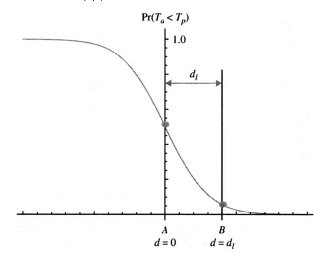
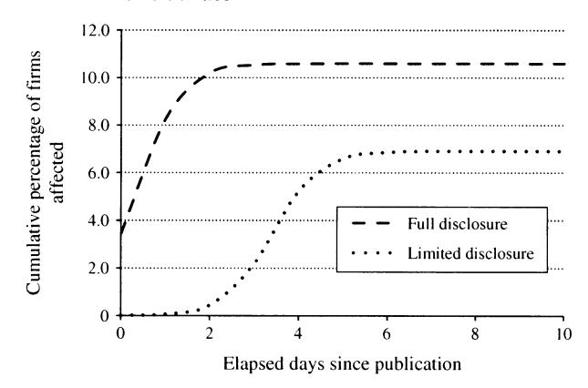
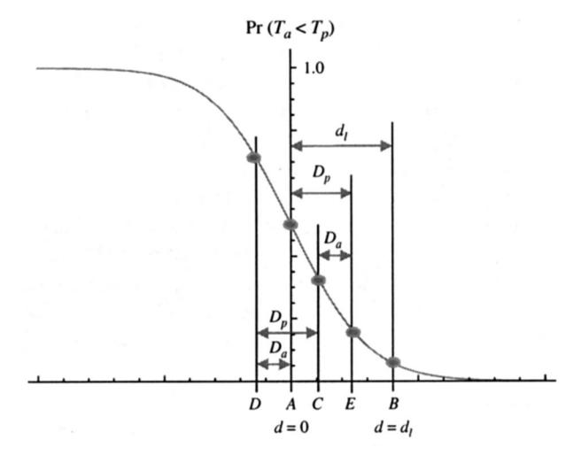
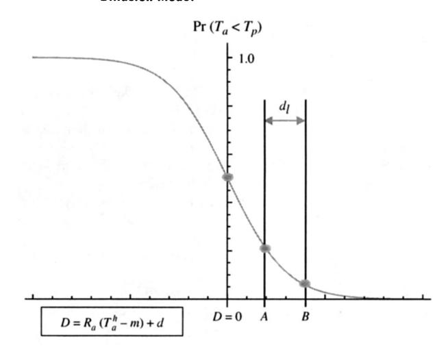

Information Disclosure and the Diffusion of Information Security Attacks

Author(s): Sabyasachi Mitra and Sam Ransbotham

Source: Information Systems Research, September 2015, Vol. 26, No. 3 (September 2015),

pp. 565-584

Published by: INFORMS

Stable URL: https://www.jstor.org/stable/24700094

JSTOR is a not-for-profit service that helps scholars, researchers, and students discover, use, and build upon a wide range of content in a trusted digital archive. We use information technology and tools to increase productivity and .facilitate new forms of scholarship. For more information about JSTOR, please contact support@jstor.org

Your use of the JSTOR archive indicates your acceptance of the Terms & Conditions of Use, available at https://about.jstor.org/terms

INFORMS is collaborating with JSTOR to digitize, preserve and extend access to *Information Systems Research*

# Information Disclosure and the Diffusion of Information Security Attacks

#### Sabyasachi Mitra

Georgia Institute of Technology, Atlanta, Georgia 30332, saby.mitra@scheller.gatech.edu

#### Sam Ransbotham

Boston College, Chestnut Hill, Massachusetts 02467, sam.ransbotham@bc.edu

With the nearly instantaneous dissemination of information in the modern era, policies regarding the disclosure of sensitive information have become the focus of significant discussion in several contexts. The fundamental debate centers on trade-offs inherent in disclosing information that society needs, but that can also be used for nefarious purposes. Using information security as a research context, our empirical study examines the adoption of software vulnerabilities by a population of attackers. We compare attacks based on software vulnerabilities disclosed through full-disclosure and limited-disclosure mechanisms. We find that full disclosure accelerates the diffusion of attacks, increases the penetration of attacks within the target population, and increases the risk of first attack after the vulnerability is reported. Interestingly, the effect of full disclosure is greater during periods when there are more overall vulnerabilities reported, indicating that attackers may strategically focus on busy periods when the effort of security professionals is spread across many vulnerabilities. Although the aggregate volume of attacks remains unaffected by full disclosure, attacks occur earlier in the life cycle of the vulnerability. Building off our theoretical insights, we discuss the implications of our findings in more general contexts.

Keywords: information security; information disclosure; software vulnerability; diffusion of innovation; negative innovation

History: Vijay Mookerjee, Senior Editor; Ming Fan, Associate Editor. This paper was received on February 26, 2013, and was with the authors 13 months for 2 revisions. Published online in *Articles in Advance* August 18, 2015.

#### 1. Introduction

Information security remains gravely important (Anderson and Moore 2006, Arora et al. 2008). This is highlighted by recent surveys (D'Arcy et al. 2009), government regulations (Schultz 2004), privacy concerns (Bélanger and Crossler 2011), relentless highprofile data breaches at major institutions (Ramstad 2011, Tudor 2011), and event studies of companies that experience security breaches (Cavusoglu et al. 2004). Vulnerabilities, primarily errors in software that run on computer systems, are an important pathway for information security compromise (Arora et al. 2008, Cavusoglu et al. 2008). Attackers can exploit these vulnerabilities to gain unauthorized access to systems, download sensitive information, install malicious code, and disrupt normal operations. Consequently, the information security industry focuses intensely on the discovery and disclosure of vulnerabilities by security professionals, on the development of patches and other corrective measures by software vendors, and on the installation of patches and countermeasures by target companies. Though technical solutions are critical, vulnerability disclosure policies have an important role in promoting a secure computing environment (Arora et al. 2008, Cavusoglu et al. 2008).

When security professionals (information security experts who work for security vendors, managed security service providers (MSSPs), research organizations, and the information security groups in target companies) discover a new software vulnerability, they disclose the information through two main mechanisms (Kannan and Telang 2005, Ransbotham et al. 2012). In the first mechanism, termed limited disclosure, security professionals report the vulnerability to organizations such as the CERT Division of the Software Engineering Institute or other similar agencies (e.g., the vulnerability markets iDefense or Tipping Point). After a vulnerability is reported, these agencies inform the vendor immediately, but wait (usually 45-180 days) before making the vulnerability public (Ransbotham et al. 2012). Thus, whereas vendors receive immediate notification, other security professionals and attackers are notified about the vulnerability at the time of public disclosure. In the second mechanism, termed full disclosure, security professionals publicly disclose the vulnerability immediately after discovery through public forums

such as Bugtraq. In *full disclosure*, vendors, other security professionals and attackers receive information concurrently about the vulnerability.

A significant and ongoing debate in the information security industry revolves around the benefits and drawbacks of limited versus full disclosure (Anonymous 2010, Cavusoglu et al. 2007, Cooper 2001, Lemos 2011, Messmer 2007). Proponents of limited disclosure argue that it ensures that vendors and targets receive reasonable time to develop and deploy patches and countermeasures before systems are attacked, whereas the alternative full disclosure creates a window of opportunity for attackers before patches and countermeasures are deployed. Vendors typically support limited disclosure and have been known to take action against those who violate limited disclosure norms (Lemos 2011). On the other hand, full disclosure provides incentives to vendors to create better quality software (Arora et al. 2008) and notifies security professionals so that they can install countermeasures immediately, whereas limited disclosure creates a period when security professionals are unaware of a vulnerability that attackers may discover and exploit independently. Unfortunately, limiting disclosure is inherently difficult and relies on obscurity to provide advantage to defenders. This obscurity hides information from security professionals as well, while attackers can independently discover and share the vulnerability (Mookerjee et al. 2011).

In this paper, we focus on this information disclosure debate. Specifically, we empirically compare the two alternative disclosure mechanisms by analyzing a large, proprietary database of information security alerts collected by a managed security service provider. The alert database contains over 2.4 billion information security alerts for 960 client firms of the managed security service provider and spans two years (2006–2007). After deriving hypotheses through an analytical model and theoretical perspective based on the diffusion of innovations literature, we assess four measures of the effect of full disclosure versus limited disclosure of vulnerability information: (a) attack delay (does full disclosure speed the diffusion of attacks corresponding to the vulnerability through the population of target systems?); (b) risk of first attack (does full disclosure increase the risk that a firm is attacked for the first time on any specific day after the vulnerability is reported, given that it has not been attacked prior to that day?); (c) attack penetration (does full disclosure increase the number of target firms affected by attacks based on the vulnerability?); and (d) attack volume (does full disclosure increase the volume of attacks based on the vulnerability?). Furthermore, since multiple vulnerabilities may be disclosed at the same time, we also consider the effect of multiple, concurrent vulnerabilities on the information security environment.

We find that full disclosure accelerates the diffusion of attacks corresponding to a vulnerability. Full disclosure also increases the risk of first attack on any specific day after the vulnerability is reported. Interestingly, the marginal effect of full disclosure on the risk of first attack increases when multiple vulnerabilities are reported contemporaneously, indicating that attackers may strategically focus on busy periods when the effort of security professionals is spread across many vulnerabilities. Full disclosure also increases the penetration of attacks within the population of target systems. Additionally, although the aggregate volume of attacks remains unaffected by full disclosure, attack activity shifts earlier in the life cycle of a vulnerability, thereby reducing its effective life span but intensifying activity while active. It is important to note that although we empirically observe the effect of full disclosure on attack diffusion, we do not capture its possibly beneficial effect on countermeasure development and deployment.

These findings contribute to both practice and research. Practically, quantifying the net effect of information disclosure on the diffusion of attacks informs the continuing debate about the optimal disclosure of information security vulnerabilities. Empirical examination of the effect of full versus limited disclosure of vulnerability information on the diffusion of information security attacks is nonexistent. Furthermore, by examining the indirect effects from multiple concurrently disclosed vulnerabilities, we add depth to this debate and uncover a potential negative effect of full disclosure hitherto unexamined. The short life cycle of fully disclosed vulnerabilities also has policy implications because its effect could be more pronounced for smaller organizations that might be less likely to install countermeasures early. On February 12, 2013, President Barack Obama called for greater cybersecurity information sharing among various public and private entities during his state of the union address. Although information sharing offers many advantages, our results quantify possible negative consequences when defenders cannot conceal information from attackers. From a research standpoint, we also empirically evaluate "black hat" activity, complementing prior research that relies primarily on analytical analyses of vulnerability disclosure policies and on surveying "white hat" perceptions (Mahmood et al. 2010).

More broadly, we also contribute to the diffusion of innovation literature. The importance of the diffusion of innovation is evident in the sizable academic and practitioner literature; Rogers (2003) notes more than 5,000 publications across practically every discipline, including operations management (Ho et al.

2002), strategy (Greve 2011, Teece 1980), marketing (Van den Bulte and Joshi 2007), and information systems (Cooper and Zmud 1990, Majchrzak et al. 2000, Parthasarathy and Bhattacherjee 1998). However, the overwhelming majority of innovation research implicitly promotes diffusion of innovation, encouraging complete and rapid adoption (Rogers 2003). In fact, "one of the most serious shortcomings of diffusion research is its pro-innovation bias" (Rogers 2003, p. 106). Innovations that are undesirable for society are nonetheless critically important and affect diverse areas such as terrorism (attack techniques), sports (performance enhancement drugs), finance (value destroying schemes), and many others. Furthermore, significant debate focuses on policies regarding the initial disclosure of information in other important contexts as well. For example, biologists who recently wanted to publish the methods to create a dangerous strain of the avian influenza virus stirred intense debate regarding the benefits of publishing information needed by researchers and public health officials, but that could also help bioterrorists (Enserink 2011). Thus, we contribute to this literature by focusing on the diffusion of a societally undesirable innovation (the exploitation of software vulnerabilities by attackers), offsetting the almost exclusive attention to the diffusion of positive innovations.

#### Theory and Hypothesis Development

#### 2.1. Information Security Context

Most information security attacks exploit vulnerabilities in software (Arora et al. 2008, August and Tunca 2008, Cavusoglu et al. 2008). The discovery of a vulnerability sets off opposing diffusion processes, as one diffusion occurs within the population of security professionals who protect systems at target companies and another diffusion occurs within the population of attackers who seek to exploit the vulnerability to compromise systems. For example, when they become aware of the vulnerability, vendors develop patches to correct the vulnerability (Arora et al. 2010). If a patch is available at the time of public disclosure, security professionals (in target companies) install the patches as expeditiously as possible without disrupting business operations, and often according to a predefined and periodic patching schedule. If patches are not available or cannot be installed quickly, or if the vulnerability cannot be corrected through patching, security professionals in target companies install other countermeasures such as including vulnerability signatures in intrusion detection systems, closing certain vulnerable ports, or disabling features in software and devices. Countermeasures (including patches) are

not installed immediately when available, but diffuse through the population of target systems over time, initially adopted by a few target organizations (perhaps with sophisticated information technology operations), and finally reaching other organizations over time as countermeasures are publicized. Meanwhile, among attackers, early adopters of the vulnerability (expert attackers) exploit the vulnerability to gain access to a few target systems. Over time, they develop exploits and attack tools that allow them to reach a larger number of target systems, and they eventually disseminate these exploits and tools to novice attackers through websites and forums, making it easy to exploit the vulnerability (Mookerjee et al. 2011, Ransbotham and Mitra 2009). Thus, akin to other technological innovations that diffuse through a target population, both offensive (attacks) and defensive (patches and countermeasures) actions diffuse through the population of target systems over time based on factors such as the attractiveness of the target company, the size of its Internet footprint, and the expertise of its security staff. Computer systems are at risk if attackers exploit the vulnerability before security professionals at the target firm deploy patches and countermeasures.

### 2.2. Modeling the Diffusion of Attacks and Countermeasures

Following Ransbotham et al. (2012), we model the diffusion of attacks corresponding to a vulnerability through the familiar S curve that has been widely used in the diffusion of innovations literature (Johansson 1979, Rogers 2003, Van den Bulte and Stremersch 2004) for several reasons. First, attacks follow the familiar diffusion pattern with few attacks initially, followed by an intermediate peak as the vulnerability becomes easier to exploit, and then fewer attacks as defenders protect more systems and interest wanes in the attacker community (Ransbotham and Mitra 2009). Consequently, the cumulative number of systems attacked follows the generalized S curve similar to the diffusion of other innovations. Second, the S curve allows us to model an intuitive element of the diffusion process that is of interest in this study—the delay in the diffusion process associated with limited versus full disclosure. A similar argument also applies to the heterogeneous adoption of countermeasures by firms. Initially, a few firms with professionally managed information security environments adopt the countermeasures, rapidly followed by an intermediate peak as adoption spreads, and subsequently fewer adoptions as the population of unprotected systems decreases.

In the appendix, we derive the specific form of the S curve shown below; an intuitive understanding is sufficient here. For any specific vulnerability, let  $N_a(t)$  be

the cumulative number of attacked systems at time t, let  $N_p(t)$  be the cumulative number of protected systems at time t, and let N be the total number of target systems. Let  $T_a^h$  be the time when half of the target systems have been attacked by exploiting the vulnerability, and let  $T_p^h$  be the time when half of the target systems have had countermeasures installed to protect against the vulnerability. Furthermore, let  $R_a$  and  $R_p$  be the slopes of the S curves for the cumulative number of firms attacked and the cumulative number of firms protected, respectively. We have

$$N_a(t) = \frac{N}{1 + e^{-R_a(t - T_a^h)}},$$
 (1)

$$N_p(t) = \frac{N}{1 + e^{-R_p(t - T_p^h)}}. (2)$$

In (1) and (2), the time horizon is centered at the half-life of the attack  $(T_a^h)$  and countermeasure  $(T_p^h)$  diffusion processes, and varies from  $-\infty$  to  $+\infty$ . This simply allows the curve to asymptotically approach zero (when  $t=-\infty$ ) rather than be exactly zero at t=0 and simplifies the form of (1) and (2). It also takes into account the zero-day attacks such that the number of attacked systems at time t=0 is small but positive. Likewise, a few firms may independently discover and protect against the vulnerability before public disclosure at time t=0. We later introduce a delay term that shifts the curves to the right so that  $N_a(0)$  fits the observed number of attacks in the empirical analysis.

In addition, we also explore an alternative scenario in the appendix where all firms adopt countermeasures almost concurrently after a specific delay. In the modern security environment, there may be less heterogeneity in the adoption of countermeasures, especially among larger and medium-sized enterprises.1 In the remainder of this section, we derive our hypotheses based on (2). However, the appendix describes how the alternative formulation leads to similar hypotheses and conclusions.

### 2.3. The Effects of Limited and Full Disclosure on Diffusion of Attacks

Limited disclosure intends to introduce a delay in the diffusion of attacks since attackers are less likely to be aware of the vulnerability until it is publicly disclosed. CERT, for example, discloses the reported vulnerabilities immediately to the vendor, whereas the vulnerability market mechanisms such as iDefense and Tipping Point also include the encrypted signature of the vulnerability and other countermeasures in the intrusion detection systems and advisories they provide to their subscribers. Thus, limited disclosure

may provide an advantage to defenders and speed the diffusion of countermeasures, whereas full disclosure may provide an advantage to attackers and speed the diffusion of attacks.

The patent race literature provides additional support for the reasoning above. Analytical models demonstrate that a firm with even a small head start can preempt its rivals in a patent race (Fudenberg et al. 1983). Inventors who have made significant breakthroughs have been known to delay the introduction of the first product to obtain a head start in developing subsequent products (Matutes et al. 1996). Courts have also mandated information disclosure about new products by companies that have monopoly power to level the playing field (Bloch and Markowitz 1996). In summary, delay in disclosing information about an innovation is recognized as a way to preserve advantage (Baker and Mezzetti 2005).

Hypothesis 1. Full disclosure of information about a software vulnerability accelerates the diffusion of attacks corresponding to the vulnerability through the target population.

To model this difference, we include an additional delay term, d, in the cumulative diffusion expression for attacks, and we rewrite (1) as shown below. In (3), d = 0 for fully disclosed vulnerabilities, and  $d = d_l$  for vulnerabilities disclosed through limited disclosure. A positive (negative) value of d shifts the attack diffusion curve to the right (left) and it also decreases (increases) the number of zero-day attacks at t = 0:

$$N_a(t) = \frac{N}{1 + e^{-R_a(t - T_a^h) + d}}. (3)$$

We evaluate (3) through the empirical analysis. Essentially, Hypothesis 1 predicts that d > 0 for limited-disclosure vulnerabilities (since  $d_1 > 0$ ). However, there are at least two reasons why that may not necessarily be the case. First, attackers can discover the vulnerability on their own and share the information through the vulnerability of black markets (Mookerjee et al. 2011, Radianti and Gonzalez 2007). Consequently, limited disclosure, which hides the vulnerability information, may disadvantage security professionals. Second, limited disclosure requires the sharing of vulnerability information with a subset of defenders (software vendors and security organizations like CERT). Information leakage, either accidental or malicious, may lead attackers to obtain the information while the majority of security professionals remain unaware, resulting in increased incentives to attack (Kannan and Telang 2005). Thus, the delay from limited disclosure is ultimately an empirical issue that we evaluate through data analysis.

&lt;sup>1 We are grateful to an anonymous reviewer for pointing this out.

#### 2.4. Probability of Successful Compromise

Not all attempted attacks are successful, because a system may be protected before it is attacked. To calculate the probability of successful compromise, we define the following two random variables for a specific firm. Let  $T_a$  be the time at which the firm is attacked through the exploitation of the focal vulnerability, and let  $T_v$  be the time at which the installation of countermeasures protects the firm from the focal vulnerability. Remember that attacks and countermeasures diffuse through the population of target systems based on the diffusion models depicted in (2) and (3). For simplicity of exposition, we assume that countermeasures and attacks follow the same underlying diffusion rates; that is, we assume that  $R_a = R_p = R$  and  $T_n^h = T_a^h = T^h$  in (2) and (3). (These assumptions do not change the intuition behind our results, but allow us to focus more effectively on the effect of delay d associated with limited disclosure and derive closedform analytical expressions of the probability of compromise in terms of d, and they increase readability. In the empirical analysis, we relax these assumptions and allow R and  $T^h$  to vary based on vulnerability characteristics and disclosure method.)

The probability of a successful compromise of any random firm is the probability that the firm is attacked prior to countermeasures being installed (i.e.,  $T_a \le T_p$ ). In the appendix, we derive an expression for the probability of successful compromise,  $\Pr(T_a \le T_p)$ , and describe the intuition here. As before, d is the delay in the diffusion of attacks. (In (4), d can be negative, indicating that attacks have less delay than countermeasures for reasons explained in §2.5.)

$$\Pr(T_a \le T_p) = \frac{1 + (d-1)e^d}{(e^d - 1)^2}.$$
 (4)

Figure 1 plots  $Pr(T_a \le T_p)$  as a function of d to explain the intuition behind (4). In fact, Figure 1 is conceptually meaningful even without the formal derivation in the appendix. When d = 0 (no advantage to attackers or security professionals), attacks and countermeasures have identical diffusion processes and probabilities of success ( $Pr(T_a \le T_p) = 0.5$ ). As d increases (providing advantage to security professionals),  $Pr(T_a \leq T_p)$  decreases and asymptotically approaches 0. On the other hand, as d decreases (providing advantage to attackers),  $Pr(T_a \leq T_p)$  increases and asymptotically approaches 1. In Figure 1, point A (d = 0) represents a vulnerability disclosed through full disclosure, whereas point B  $(d = d_1)$  represents a vulnerability disclosed through limited disclosure. If the rates (R) and the half-lives  $(T^h)$  for the diffusion of countermeasures and attacks were not equal,  $Pr(T_a \le T_p)$  would deviate from 0.5 when d = 0, but the shape of the curve in Figure 1 would not be different.

Figure 1 (Color online) Probability of Compromise as a Function of Delay (d)

For readability, we derive the remaining hypotheses conceptually, and more formal derivations appear in the appendix.

## 2.5. The Race Between Expert Attackers and Security Professionals

In addition to the delay  $d = d_1$  introduced by limited disclosure on the diffusion of attacks, two other factors affect the probability of successful compromise. First, expert attackers can speed the diffusion of attacks through additional effort in three ways (Mookerjee et al. 2011, Ransbotham and Mitra 2009). First, the existence of a vulnerability in the software does not necessarily mean that it can be exploited, since target firms usually have multiple layers of defenses in place. The expert attacker can do additional research to discover ways to bypass existing defenses. Second, most vulnerabilities in modern software require many steps to successfully compromise the targeted systems. Expert attackers can package the steps into automated scripts or attack toolkits that more novice attackers can exploit. Third, expert attackers can widely disseminate these tools through transient "black hat" websites and forums that exist for this purpose (Mookerjee et al. 2011, Ransbotham and Mitra 2009, Swire 2004). To incorporate the effort of expert attackers on  $Pr(T_a \leq T_p)$  in (4) and Figure 1, we envision that such effort reduces d by an amount  $d_a$  (speeds up the attack diffusion process) and consequently increases  $Pr(T_a \leq T_n)$ .

Second, security professionals at target companies can also speed up the diffusion of countermeasures through additional effort. For example, software patches are typically installed according to a predefined schedule, and security professionals can expedite countermeasures by installing patches ahead of the normal schedule. They can also disable certain

vulnerable services by creating and providing alternatives to such services. They can also disable features in software and devices to make it more difficult for attackers to exploit the vulnerability while managing the disruption in operations. To incorporate the effort of security professionals, we envision that such effort *increases* d by an amount  $d_p$  and consequently decreases  $\Pr(T_a \leq T_p)$ . In summary, attacker effort moves d to the left in Figure 1, whereas security professional (defender) effort moves d to the right. Thus, for full-disclosure vulnerabilities,  $d = d_p - d_a$ , whereas for limited-disclosure vulnerabilities,  $d = d_l + d_p - d_a$ .

### 2.6. Strategic Allocation of Effort by Expert Attackers

Given a set of vulnerabilities disclosed through full disclosure and limited disclosure, our primary interest lies in determining how early adopters (expert attackers and security professionals) divide their effort between such vulnerabilities. We first provide an intuitive understanding of the logic, and we derive a more formal equilibrium in the appendix and the conditions under which such an equilibrium holds.

Consider a single vulnerability publicly disclosed after limited disclosure (L) and a single vulnerability publicly disclosed through full disclosure (F) at approximately the same time. The expert attacker knows that due to the delay in public disclosure for limited-disclosure vulnerabilities, she has a better likelihood of successful compromise if she focuses on F rather than L. There are several reasons behind this assumption on her part. First, the vendor is more likely to have developed a patch or other solutions to correct the vulnerability by the time of public disclosure for L, but not so for F. Second, protective countermeasures available for F are likely to be weaker (because the vendor has not had the time to work on a cogent solution) than those available for L. Furthermore, the vendor also has had less time to plan a communication strategy with its subscriber base about F, and target companies are less likely to know how to counteract the threat from *F* compared to that from *L*. On the other hand, security professionals at target companies also know that immediate attacks based on F after immediate disclosure are probable because attackers are likely to focus on F rather than L. Furthermore, the vendor and managed security service providers are more likely to provide good solutions for L that will get installed following a normal schedule without additional effort by security professionals. Conversely, protecting against F will require special (rather than routine) effort on the part of security professionals to research and implement countermeasures. Thus, both security professionals and attackers focus their extra effort on F rather than on L, simply because such a focus provides greater marginal benefit to each of them.

This reasoning also has intuitive support in the patent race literature. In their seminal work on the speed of research and development (R&D) and innovation, Dasgupta and Stiglitz (1980) examine the effect of competition in R&D on the amount of research. They find that competition (free entry into research) always leads to more research than in a pure monopoly, and under certain circumstances, it may result in excessive expenditures on R&D relative to the social optimum. Full disclosure of vulnerabilities informs the vendor, attacker, and security professional at the same time and can be viewed as increasing the competition between attackers and defenders when compared to limited disclosure. Increased competition leads to greater effort by attackers and a greater risk of first attack. Analytical models also demonstrate that a firm with even a small head start can preempt its rivals in a patent race (Fudenberg et al. 1983). Harris and Vickers (1985, p. 194) show that "if one player is far enough ahead of the other...then the latter gives up completely, leaving the former to move to the finishing line at his own pace." In the case of limited-disclosure vulnerabilities, attackers have a delayed start, and they consequently choose to focus on fully disclosed vulnerabilities, whereas security professionals, without a sense of urgency and immediacy, let the patching and countermeasures for limited-disclosure vulnerabilities proceed according to the normal schedule, while expediting countermeasures for fully disclosed vulnerabilities. Our second hypothesis follows directly from this reasoning. Since expert attackers devote greater effort on fully disclosed vulnerabilities, the risk of first attack for a firm on any specific day after the vulnerability is disclosed is greater for such vulnerabilities. The fundamental intuition is that expert attackers find such vulnerabilities more attractive because additional effort on their part has a greater effect on the probability of compromise and consequent benefits to them.

Although we expect full disclosure to increase the risk of first attack, this may not necessarily be the case. For example, if attackers independently discover vulnerabilities disclosed through limited disclosure, they may choose to focus on such vulnerabilities because security professionals are unaware of such vulnerabilities, and attackers know that security professionals are likely to focus on fully disclosed vulnerabilities. Thus, the effect of full disclosure on the risk of first attack is an empirical issue that we evaluate through the following analysis.

Hypothesis 2. Full disclosure of information about a vulnerability increases the risk of first attack corresponding to the vulnerability for a target firm.

In the appendix, we derive the equilibrium behind Hypothesis 2 more formally, but we provide an intuitive understanding here. Let  $d_a^F$  and  $d_a^L$  be the amount by which the expert attacker speeds the diffusion of the full-disclosure (superscript F) and the limited-disclosure (superscript *L*) vulnerabilities, respectively, through extra effort. Likewise, let  $d_n^F$ and  $d_n^L$  be the amount by which security professionals accelerate the diffusion of countermeasures for full-disclosure (superscript *F*) and limited-disclosure (superscript L) vulnerabilities, respectively, through extra effort. Since there are a limited number of expert attackers and security professionals, they have limited capacity (denoted by  $D_a$  and  $D_v$ , respectively). At the start of the process, with no additional effort from security professionals and expert attackers, fulldisclosure vulnerabilities are at point A (d = 0) in Figure 1, whereas limited-disclosure vulnerabilities are at point B  $(d = d_1)$  in the figure. The slope of the curve is negative throughout the range and is minimized (maximum downward slope) at d = 0. Thus, both security professionals and expert attackers focus on full-disclosure vulnerabilities because the marginal benefit of effort on the probability of compromise is greater for full-disclosure vulnerabilities than that for limited-disclosure vulnerabilities. More formally, at equilibrium,  $d_n^F = D_n$ ,  $d_a^F = D_a$ ,  $d_n^L = 0$ , and  $d_a^L = 0$ .

The appendix also derives an expression for the risk of first attack from a vulnerability, FA(t,d), as a function of time t and delay d in attack diffusion, and we show that FA(t,d) is a decreasing function of d; that is, as delay for a vulnerability increases, the risk of first attack decreases. Since delay for limited-disclosure vulnerabilities is  $d_l > 0$  and that for full-disclosure vulnerabilities is  $-D_a$  (the attacker expedites fully disclosed vulnerabilities), the risk of first attack at time t is greater for full-disclosure ( $FA^F(t)$ ) versus limited-disclosure ( $FA^L(t)$ ) vulnerabilities. We evaluate (5) through the empirical analysis:

$$FA^{F}(t) = FA(t, -D_a) > FA(t, d_l) = FA^{L}(t)$$
since  $d_l > -D_a$ . (5)

# 2.7. Strategic Choice and the Workload of Defenders

Because proponents of limited disclosure often argue that full disclosure puts excessive pressure on defenders to protect against the vulnerability, it is important to understand the effect of full disclosure during periods of high activity when defenders (security professionals at target companies) have less time to devote to such vulnerabilities. Our basic premise is that whereas attackers can strategically choose their focus, defenders have less flexibility in exercising this

choice. Thus, during periods when many vulnerabilities are disclosed concurrently, security professionals must devote some of their time to other vulnerabilities and may not be able to focus exclusively on fully disclosed vulnerabilities. Company policy, security guidelines, and legal requirements often dictate a minimum level of effort by security professionals to protect against each disclosed vulnerability. Attackers take advantage of such periods by diverting additional resources toward fully disclosed vulnerabilities from other activities, strategically increasing their focus on such vulnerabilities. This leads to more attacks and consequently a higher risk of first attack during periods when there are more active vulnerabilities reported.

The value of flexibility in innovation is well recognized in the literature on dynamic capabilities (Eisenhardt and Martin 2000, Teece 2007), real options (Trigeorgis 1996), and product development (Zhou and Wu 2010). The core idea is that flexibility provides the ability to redirect effort and change course when better information becomes available. Flexibility is particularly important in high-technology environments where the outcome is uncertain (Ziedonis 2004). In the information security context, the flexibility of attackers to focus where they want to is more valuable during times of high workload, when there are many more available options. Fundamentally, the logic above presumes that attackers are strategic in their choice of vulnerabilities to exploit and defenders have less flexibility, which may not necessarily be true. Thus, we investigate the following hypothesis through empirical analysis.

HYPOTHESIS 3. The effect of full disclosure of information about a vulnerability on the risk of first attack will be greater during periods of high workload for defenders.

Hypothesis 3 follows naturally from the expression for the risk of first attack,  $FA(t, -D_a)$ , for a fully disclosed vulnerability in (5). Since FA(t, d) is a decreasing function of d,  $FA(t, -D_a)$  increases as the attacker strategically increases  $D_a$  during times of high workload for defenders.

#### 2.8. Novice Attackers and Volume of Attacks

Whereas the risk of first attack is driven by expert attackers, attack volume is primarily driven by the majority—the large number of novice attackers who utilize the exploit tools created and disseminated by expert attackers (Mookerjee et al. 2011, Ransbotham and Mitra 2009, Ransbotham et al. 2012). With the wider availability of tools to exploit a vulnerability, attacks are easier for the novice attacker. However, more systems are also protected against the vulnerability over time, decreasing the likelihood of success and the expected marginal payoff from the attack.

The effective lifetime of the vulnerability is the time when the marginal payoff from the attack becomes less than the marginal cost of the attack for the average novice attacker. Because security professionals at target companies focus their efforts on fully disclosed vulnerabilities, the diffusion of countermeasures are expedited for such vulnerabilities. Consequently, the window of opportunity for the attacker shrinks as more firms become protected against the vulnerability quickly, and the expected marginal payoff from attack decreases rapidly over time for fully disclosed vulnerabilities. Thus, the effective life span of a fully disclosed vulnerability is shorter and most attacks occur earlier in its life cycle. The logic above assumes that security professionals at target companies focus more on fully disclosed vulnerabilities, leading to a shorter window of opportunity for attackers, a logic that we test empirically through the following hypothesis.

Hypothesis 4. Full disclosure of information about a vulnerability will shorten its effective life span such that a greater proportion of the attack volume corresponding to the vulnerability will occur earlier in its life cycle.

In the appendix, we derive Hypothesis 4 more formally, and we present the intuition here. For a novice attacker, the marginal cost of attack using exploit tools remains constant over time. However, the marginal benefit from attack decreases with time as the number of unprotected systems decreases. In the appendix, we derive an expression for the lifetime of a vulnerability  $(t_l)$  as the time when the marginal benefit from the attack is equal to the marginal cost of the attack. We show that  $t_l$  is an increasing function of the delay d of a vulnerability. Since the delay for a full-disclosure vulnerability  $(+d_l)$ , the effective life of a full-disclosure vulnerability is shorter.

To empirically evaluate Hypothesis 4, we derive an expression for the volume of attacks as follows. Attack volume for a vulnerability usually reaches an intermediate peak relatively soon after disclosure (say at time  $t_0$ ) and then declines over time as more systems are protected and interest wanes in the community of attackers. In (6), we focus on a linear function for the right side of this attack curve  $(t > t_0)$ . Let  $V^{F}(t)$  and  $V^{L}(t)$  be the attack volumes at time t, for full-disclosure (F) and limiteddisclosure (L) vulnerabilities. The peak volume at  $t_0$  is affected by the effort from expert attackers who develop and disseminate tools and raise awareness among other attackers. Because expert attackers focus on fully disclosed vulnerabilities, we envision that the quality of exploit tools as well as awareness and interest in the attacker community will be higher. Thus, peak volume will be higher for full-disclosure ( $V^F(t_0)$ ) versus limited-disclosure vulnerabilities ( $V^L(t_0)$ ). Furthermore, let  $t_l^L$  and  $t_l^F$  be the lifetimes of limited and fully disclosed vulnerabilities, respectively. Since attack volume becomes zero at the end of life,  $V^F(t_l^F) = V^L(t_l^L) = 0$  and  $t_l^L > t_l^F$ , and it follows that  $\partial V^F(t)/\partial t < \partial V^L(t)/\partial t < 0$ ; that is, the attack curve has a higher peak and steeper negative slope for vulnerabilities with full versus limited disclosure:

$$V^{F}(t) = V^{F}(t_{0}) + \left(\frac{\partial V^{F}(t)}{\partial t}\right)t,$$

$$V^{L}(t) = V^{F}(t_{0}) + \left(\frac{\partial V^{L}(t)}{\partial t}\right)t,$$

$$\frac{\partial V^{F}(t)}{\partial t} < \frac{\partial V^{L}(t)}{\partial t} < 0, V_{0}^{F} > V_{0}^{L}. \quad (6)$$

#### 3. Data

#### 3.1. Data Sources

Our data set combines two main sources. First, we use a proprietary database of alerts generated from intrusion detection systems (IDSs) installed in client firms of an MSSP during 2006 and 2007. These data were made available to us by the MSSP after removing any client identifiers. Intrusion detection systems are a valuable source of information for investigating Internet-based attack activity (Cavusoglu et al. 2005, Ransbotham and Mitra 2009, Ransbotham et al. 2012). The data set contains a large volume (billions of alerts) of real alert data (as opposed to data from a research setting) from 960 client firms with varied infrastructures across many industries. We summarize the data into a panel data set containing the number of alerts generated every day during the two-year period of our analysis, for each target firm and a specific vulnerability; that is, each data point in our data set is for a specific target firm-vulnerability combination, and it contains a count of the number of alerts generated for each day in the two-year period of the study (2006-2007).

Second, we combine this panel data set with dates from the National Vulnerability Database (NVD; National Vulnerability Database 2008) to obtain detailed characteristics of the vulnerabilities. The NVD consolidates data from several other public vulnerability data sources such as CERT, Bugtraq, Xforce, and Secunia (National Vulnerability Database 2008). Vulnerabilities in the NVD are assessed by experts using the Common Vulnerability Scoring System (CVSS) (Mell et al. 2006, 2007). The CVSS is a mature, wellestablished metric that categorizes the fundamental characteristics of each vulnerability using a defined list of attributes (Frei et al. 2006). The characterization of each vulnerability is openly inspected by differing entities (such as security firms and software vendors);

see Mell et al. (2007) and Ransbotham et al. (2012) for additional details. We match the records in our panel data set with the data in the NVD through a CERT-assigned unique ID for each vulnerability. We use the vulnerability attributes from the NVD data as controls in our empirical analysis to ensure that the results we observe are due to differences in the disclosure mechanisms (full versus limited disclosure) and not to differences in vulnerability and target firm characteristics. The control variables are described in §3.3 and shown in italics.

#### 3.2. Full vs. Limited Disclosure

Our focal variable (Full Disclosure) is set to 1 if the initial disclosure was made through a public forum and 0 otherwise. The NVD provides the disclosure history of a vulnerability that shows the dates and forums where the vulnerability was disclosed. Among the disclosure forums listed in the NVD for the vulnerabilities in our sample, Bugtraq and Full Disclosure are public forums that notify all parties simultaneously, whereas other forums in the NVD (e.g., CERT, iDefense, Secunia, XForce) delay public disclosure. Thus, we classify a vulnerability as fully disclosed if it is first reported on a public forum, even if it is subsequently reported through other nonpublic reporting agencies. We first identify all vulnerabilities that were ever reported through a public forum by manually examining the disclosure history of the vulnerability. We then eliminate vulnerabilities from this list that were first reported through the nonpublic forums and not broadcast first through a public forum.2 This list constitutes our list of fully disclosed vulnerabilities. Full disclosure is possible through other public forums (such as websites, blogs, social media, etc.) that are not reported in the NVD disclosure history. This introduces some noise in the classification of vulnerabilities and makes it more difficult for us to find the differences between vulnerabilities with full and limited disclosure that we observe in the empirical analysis. Thus, our results would be stronger if we were able to perfectly classify vulnerabilities.

#### 3.3. Control Variables

In addition to the focal variable (*Full\_Disclosure*), we use several control variables in our analysis to incorporate alternative explanations based on (a) vulnerability characteristics, (b) environmental characteristics, and (c) firm and time fixed effects.

3.3.1. Vulnerability Characteristics. Once the attacker has access, vulnerabilities require varying degrees of complexity to exploit; experts categorized these as Low, Medium, or High Complexity, and we include control variables for medium and high complexity, with low complexity as the base type. The Impact of a vulnerability is categorized by experts into one or more categories (Confidentiality Impact, Integrity Impact, and Availability Impact), and we use an indicator variable for each impact category that is set to 1 if the potential for the specific impact is present and 0 otherwise. The NVD classifies vulnerabilities into several different Defect Types based on the software defect that the vulnerability represents (Input Validation, Design, Exception), and we used indicator variables to control for each defect type. We also include the Age of the vulnerability (log transformed) at the time of our analysis (measured by the number of days since the vulnerability was reported) to control for any age related effects. We include an indicator (Market) if the vulnerability was disclosed through a market that pays security professionals for reporting vulnerabilities. Prior research indicates differences in the diffusion of attacks for vulnerabilities reported through market-based mechanisms (Kannan and Telang 2005, Ransbotham et al. 2012). Expectations of success also influence attacker behavior. Therefore, the countermeasures available to defenders may influence attack activity. Some vulnerabilities have an associated signature that can be used by defenders to detect attacks based on that vulnerability. We include an indicator variable (Signature) that is set to 1 if a signature was available at the time that the vulnerability was disclosed and 0 otherwise. Similarly, we also include an indicator (Patch) if the software vendor had a corrective patch available to eliminate the vulnerability on the focal day of analysis. An additional variable (Server) indicates whether the software corresponding to the vulnerability is desktop (0) or server (1) based.

3.3.2. Environmental Characteristics. Vulnerabilities do not exist in isolation. Instead, at any time, there are many vulnerabilities that attackers can choose to exploit. There are two ways this may affect an attacker's response—through the alternatives available to the attacker and the workload of the defender. First, the presence of other vulnerabilities offers a greater number of alternatives for attackers to exploit. We reflect the presence of these alternatives through an index developed based on data in the NVD. The index is calculated by totaling the number of vulnerabilities disclosed in the last 30 days and then weighting vulnerabilities by their severity (based on their aggregate CVSS score.) We calculate the *Alternatives* variable using this formula for every day in

&lt;sup>2 Although the Full Disclosure public forum has become more popular recently, an overwhelming majority of our exploited fully disclosed vulnerabilities in the sample were reported through Bugtraq in the 2006–2007 period.

Workload

Full Disclosure

| Variable                 | All vulnerabilities |      |       | Full-disclosure vulnerabilities |      |      | Limited-disclosure vulnerabilities |          |      |      |       |         |
|--------------------------|---------------------|------|-------|---------------------------------|------|------|------------------------------------|----------|------|------|-------|---------|
|                          | Min.                | Max. | Mean  | St. dev.                        | Min. | Max. | Mean                               | St. dev. | Min. | Max. | Mean  | St. dev |
| Confidentiality Impact   | 0                   | 1    | 0.769 | 0.422                           | 0    | 1    | 0.791                              | 0.407    | 0    | 1    | 0.758 | 0.429   |
| Integrity Impact         | 0                   | 1    | 0.784 | 0.412                           | 0    | 1    | 0.827                              | 0.379    | 0    | 1    | 0.763 | 0.426   |
| Availability Impact      | 0                   | 1    | 0.831 | 0.375                           | 0    | 1    | 0.767                              | 0.423    | 0    | 1    | 0.861 | 0.346   |
| Defect: Input Validation | 0                   | 1    | 0.325 | 0.468                           | 0    | 1    | 0.357                              | 0.480    | 0    | 1    | 0.31  | 0.463   |
| Defect: Design           | 0                   | 1    | 0.156 | 0.363                           | 0    | 1    | 0.134                              | 0.341    | 0    | 1    | 0.166 | 0.372   |
| Defect: Exception        | 0                   | 1    | 0.097 | 0.296                           | 0    | 1    | 0.083                              | 0.276    | 0    | 1    | 0.103 | 0.304   |
| Complexity: Medium       | 0                   | 1    | 0.381 | 0.486                           | 0    | 1    | 0.318                              | 0.466    | 0    | 1    | 0.41  | 0.492   |
| Complexity: High         | 0                   | 1    | 0.106 | 0.308                           | 0    | 1    | 0.129                              | 0.336    | 0    | 1    | 0.095 | 0.293   |
| Market                   | 0                   | 1    | 0.133 | 0.34                            | 0    | 1    | 0.168                              | 0.374    | 0    | 1    | 0.117 | 0.321   |
| Server                   | 0                   | 1    | 0.031 | 0.173                           | 0    | 1    | 0.044                              | 0.205    | 0    | 1    | 0.025 | 0.155   |
| Signature                | 0                   | 1    | 0.132 | 0.339                           | 0    | 1    | 0.121                              | 0.327    | 0    | 1    | 0.138 | 0.345   |
| Patch                    | 0                   | 1    | 0.547 | 0.498                           | 0    | 1    | 0.566                              | 0.496    | 0    | 1    | 0.538 | 0.499   |
| Alternatives             | 210                 | 511  | 345   | 78                              | 211  | 511  | 333                                | 78       | 210  | 511  | 351   | 77      |

1

88

1

38

1

Table 1 **Descriptive Statistics for Focal and Control Variables** 

our focal period. Second, we develop a more immediate form of this index (Workload) that uses the same formula, but is restricted to the two days surrounding the vulnerability disclosure. Through this narrow window, this index captures the workload of security professionals to respond to vulnerability disclosures and incorporate countermeasures. (There is no specific theoretical guidance for the sizes of the time windows; however, our results are robust to alternative sizes as long as the Workload window is relatively short (less than five days) and the Alternatives window is substantially larger than the Workload window, as would be expected.)

115

1

n

39

0.32

18

0.47

#### Methods and Results 4.

Table 1 shows the descriptive statistics for selected control variables in our sample of 1,201 vulnerabilities included in our alert database that we could match with NVD data to obtain data on vulnerability characteristics. Table 2 shows the correlations between selected focal and control variables. Of the 1,201 variables in the alert database, only 333 were exploited through attacks on 960 clients of the managed security service provider during the 2006-2007 period of the study. We excluded firms from the sample that had more than one intrusion detection system to avoid systemic bias in the analysis.

#### 4.1. Delays in Attack Diffusion

To evaluate Hypothesis 1, we construct a panel data set with each exploited vulnerability as the panel variable. We align each of the 333 exploited vulnerabilities, with day 0 representing the date that the vulnerability was disclosed. For each vulnerability and for each date after day 0, we calculate the cumulative number of firms that had experienced exploitation attempts based on the vulnerability until that date, to build a panel data set of 132,768 observations. Since day 0 is not the same for all vulnerabilities, the panel is unbalanced; some vulnerabilities have more observations than others.

n

17

19

0

39

n

115

n

We use this panel data set to estimate the following equation derived from (3) through nonlinear least squares estimation, with  $P_a$  (penetration),  $R_a$  (rate of attack diffusion), and  $d_a$  (delay in attack diffusion) as linear functions of the focal (Full Disclosure) and other control variables (see Table 3). The function  $P_a$ is the penetration of attacks in the population of target systems. The function  $R_a$  is the slope of the diffusion curve, and  $d_a$  is the delay in diffusion that shifts the curve to the right. Since the unit of analysis is a specific vulnerability, we include all control variables corresponding to vulnerability characteristics. In (7), we allow the penetration of attacks  $(P_a)$  to differ from the total population of target systems (N):

$$N_{a}(t) = \frac{P_{a}}{1 + e^{-R_{a}t + d_{a}}}, \text{ where}$$

$$d_{a} = \beta_{0}^{D} + \beta_{1}^{D}Full\_Disclosure + \sum_{k} \beta_{k}^{D}control_{k},$$

$$R_{a} = \beta_{0}^{R} + \beta_{1}^{R}Full\_Disclosure + \sum_{k} \beta_{k}^{R}control_{k},$$

$$P_{a} = \beta_{0}^{P} + \beta_{1}^{P}Full\_Disclosure + \sum_{k} \beta_{k}^{P}control_{k}.$$

$$(7)$$

Equation (7) follows directly from (3). The constant term in (7) incorporates the term  $(R_a \cdot T_a^h)$  in (3). Also, (7) is a single equation and not four separate equations; we have written it in four separate lines for visual clarity. The nonlinear least squares estimation works as follows. Using initial values of the parameters ( $\beta$ ), it calculates the values of  $d_a$ ,  $R_a$ , and  $P_a$  for each vulnerability and for each day, and then calculates the value of the dependent variable  $N_a(t)$ 

| Table 2 | Correlation | Retween | Model | Variables |
|---------|-------------|---------|-------|-----------|

|                             | 1     | 2     | 3     | 4     | 5     | 6     | 7     | 8     | 9    | 10    | 11    | 12    | 13    | 14    | 15   |
|-----------------------------|-------|-------|-------|-------|-------|-------|-------|-------|------|-------|-------|-------|-------|-------|------|
| 1. Confidentiality Impact   | 1.00  |       |       |       |       |       |       |       |      |       |       |       |       |       |      |
| 2. Integrity Impact         | 0.51  | 1.00  |       |       |       |       |       |       |      |       |       |       |       |       |      |
| 3. Availability Impact      | 0.21  | 0.21  | 1.00  |       |       |       |       |       |      |       |       |       |       |       |      |
| 4. Defect: Input Validation | -0.10 | 0.01  | -0.18 | 1.00  |       |       |       |       |      |       |       |       |       |       |      |
| 5. Defect: Design           | -0.05 | -0.15 | -0.16 | -0.19 | 1.00  |       |       |       |      |       |       |       |       |       |      |
| 6. Defect: Exception        | -0.26 | -0.27 | 0.08  | -0.12 | -0.07 | 1.00  |       |       |      |       |       |       |       |       |      |
| 7. Complexity: Medium       | -0.05 | 0.14  | -0.05 | 0.06  | 0.02  | -0.01 | 1.00  |       |      |       |       |       |       |       |      |
| 8. Complexity: High         | 0.12  | 0.10  | 0.00  | 0.06  | -0.05 | -0.01 | -0.27 | 1.00  |      |       |       |       |       |       |      |
| 9. Market                   | 0.09  | 0.10  | 0.09  | -0.09 | -0.09 | -0.03 | 0.05  | -0.02 | 1.00 |       |       |       |       |       |      |
| 10. Server                  | -0.13 | -0.12 | 0.00  | -0.03 | -0.02 | 0.07  | -0.03 | -0.05 | 0.00 | 1.00  |       |       |       |       |      |
| 11. Signature               | 0.11  | 0.10  | 0.10  | 0.00  | -0.04 | 0.08  | 0.06  | 0.13  | 0.07 | -0.06 | 1.00  |       |       |       |      |
| 12. Patch                   | 0.00  | 0.04  | 0.04  | -0.07 | -0.02 | 0.04  | 0.03  | 0.01  | 0.15 | 0.03  | 0.13  | 1.00  |       |       |      |
| 13. Alternatives            | -0.10 | -0.09 | 0.06  | -0.02 | 0.07  | 0.11  | 0.14  | -0.12 | 0.05 | 0.05  | -0.01 | 0.04  | 1.00  |       |      |
| 14. Workload                | -0.01 | -0.01 | 0.04  | -0.03 | -0.03 | 0.04  | 0.07  | -0.06 | 0.04 | 0.01  | 0.01  | -0.02 | 0.48  | 1.00  |      |
| 15. Full_Disclosure         | 0.04  | 0.07  | -0.12 | 0.05  | -0.04 | -0.03 | -0.09 | 0.05  | 0.07 | 0.05  | -0.02 | 0.03  | -0.11 | -0.03 | 1.00 |

Table 3 Diffusion of Exploitation Attempts through the Target Population

| Population                            |            |                  |             |
|---------------------------------------|------------|------------------|-------------|
| Variable Dependent variable: $N_a(t)$ | $P_a$      | $R_a$            | da          |
| Constant                              | 58.711***  | -1.122***        | 76.100***   |
|                                       | (2.038)    | (0.258)          | (17.587)    |
| Confidentiality Impact                | -32.475*** | 0.191***         | 35.880***   |
|                                       | (1.526)    | (0.045)          | (31.256)    |
| Integrity Impact                      | 11.739***  | 0.394***         | 91.899***   |
|                                       | (1.66)     | (0.089)          | 21.953      |
| Availability Impact                   | -11.125*** | -0.776***        | -156.507*** |
|                                       | (1.43)     | (0.178)          | (36.045)    |
| Defect: Input Validation              | 51.834***  | 0.504***         | 121.676***  |
|                                       | (1.169)    | (0.115)          | (28.107)    |
| Defect: Design                        | -24.477*** | -0.339***        | 9.165***    |
|                                       | (1.714)    | (0.078)          | (2.507)     |
| Defect: Exception                     | -43.074*** | -1.567***        | 27.602***   |
|                                       | (2.425)    | (0.359)          | (6.871)     |
| Complexity: Medium                    | 174.273*** | 0.573***         | 136.684***  |
|                                       | (4.497)    | (0.132)          | (31.015)    |
| Complexity: High                      | 42.092***  | 0.090***         | 20.652***   |
|                                       | (1.456)    | (0.022)          | (4.683)     |
| Market                                | -57.462*** | -1.151***        | 278.744***  |
|                                       | (1.683)    | (0.263)          | (63.943)    |
| Server                                | -3.054*    | -0.104***        | 27.297***   |
|                                       | (1.345)    | (0.024)          | (6.349)     |
| Patch                                 | -19.941*** | -0.597***        | -140.865*** |
|                                       | (0.936)    | (0.136)          | (32.694)    |
| Signature                             | 123.242*** | 1.415***         | -141.577*** |
|                                       | (2.126)    | (0.324)          | (32.944)    |
| Full_Disclosure                       | 3.686***   | -0.094***        | -5.765***   |
|                                       | (1.04)     | (0.021)          | (1.83)      |
| N R 2                   |            | 132,768 29.5% |             |

*Notes.* Results are based on 132,768 daily observations of vulnerabilities exploited in at least one of 960 client firms. Nonlinear regression of the cumulative number of affected firms  $N_a(t) = P_a/(1 + e^{(-R_a t + d_a)})$ , with  $P_a$ ,  $R_a$ , and  $d_a$  as linear functions of the variables, is shown. Robust standard errors are in parentheses.

Figure 2 Diffusion Graph of Full- and Limited-Disclosure Vulnerabilities

using (7). Using a hill-climbing procedure, it then adjusts the parameter values to minimize the least square deviations from the observed values of the dependent variable. Table 3 shows the results of the estimation and the parameter estimates. The coefficient for the  $Full\_Disclosure$  variable ( $\beta_1^D$ ) in column  $d_a$  is negative, indicating that full disclosure reduces the delay associated with the diffusion of attacks. Full disclosure also increases penetration of attacks in the population of target systems (coefficient for  $Full\_Disclosure$  is positive in column  $P_a$ ).

To ease the interpretation of the estimated parameters and evaluate economic significance, Figure 2 plots the resulting diffusion curves for full-disclosure and limited-disclosure vulnerabilities based on the estimated coefficients and all control variables set to their median values. The graphs illustrate that full disclosure reduces diffusion delay by approximately four days. Most control variables are indicator variables with a median of 0; thus, plotting the diffusion curves at the mean (which is nonzero) value of the controls shifts both curves to the right, but does not change their relative positions. Furthermore, the diffusion

\*p < 0.05; \*\*\*p < 0.001 (two-tailed).

curve corresponding to full disclosure intersects the *y*-axis at a positive and nonzero value, indicating that attacks (known as zero-day attacks) may occur on the day of disclosure or before. Thus, our results support Hypothesis 1. Full disclosure increases the penetration of attacks corresponding to the vulnerability from 7% to 11% of target firms, an increase of 57%. This increase in penetration is important because it increases the probability of successful compromise for the attacker.

#### 4.2. Risk of First Attack

Security professionals often need to handle multiple vulnerabilities at the same time. For example, there were an average of 18 vulnerabilities reported in the NVD every day in 2014. Furthermore, we examined the full-disclosure vulnerabilities in our data set and examined the number of concurrently disclosed vulnerabilities in the NVD. For the full-disclosure vulnerabilities in our data set, within a two (three) day period around the date of disclosure, there were a minimum of 41 (42), a maximum of 231 (278), and an average of 105 (135) other vulnerability disclosures, indicating that security professionals likely must allocate effort between full- and limited-disclosure vulnerabilities. Furthermore, the corresponding standard deviation of the number of disclosures within a two (three) day period in the NVD was 33 (34), indicating that there is considerable variance across fulldisclosure vulnerabilities in the workload of security professionals; given the variance, it would be difficult to staff adequately to handle workload peaks completely without requiring prioritization.

We evaluate Equation (5) (the risk of first attack) through a Cox proportional hazard model with additional control variables and with the first exploitation attempt of a vulnerability for a specific firm as the event being explained. All vulnerabilities were aligned with day 0 representing the date the vulnerability was disclosed. We construct a data set that has, for every vulnerability-firm combination, the specific day after day 0 of the first attempt to exploit the vulnerability against that firm. This analysis also incorporates data on vulnerabilities that were never exploited for a specific firm or for any firm. Thus, with 1,201 vulnerabilities and 960 firms, we have 1,152,406 client-firm combinations. For some vulnerability-firm combinations, we have the day when the specific vulnerability was first exploited at the specific firm, whereas for others there was no exploitation attempt in the study period.

The Cox proportional hazard model estimates the likelihood (hazard rate) that a specific vulnerability is exploited (failure event) at a specific firm on the focal day, given that it has not been exploited at that firm prior to that day. In the Cox proportional hazard

model, this hazard rate consists of (a) a baseline hazard function that captures how the risk of first attack generally changes over time and (b) a set of parameters for each control and focal variable that describes how each variable affects the baseline hazard function. All control variables corresponding to vulnerability and environmental characteristics are included in the analysis. To incorporate unobserved differences across client firms, we stratify the analysis so that the baseline hazard function can vary by firm and incorporate any unobserved firm-specific attributes. This is similar to a firm fixed effects analysis in regression models.

Table 4 shows the results from the Cox proportional hazard model. Model 0 introduces only the control variables, whereas Model 1 introduces our focal variable ( $Full\_Disclosure$ ). The coefficient for  $Full\_Disclosure$  is positive ( $\beta=0.19$ , p<0.001), indicating that full disclosure increases the risk of first attack on any day. Based on the estimated parameters, full disclosure increases the risk of first attack by 20% ( $e^{0.19}=1.2$ ), an economically significant increase. We conclude that our results support Hypothesis 2.

Table 4, Model 2, introduces the interaction term Full Disclosure · Workload to the hazard model. Workload measures the number of vulnerabilities disclosed during the two-day period surrounding day 0 of the focal vulnerability (weighted by the severity of the vulnerability). It measures the workload of security professionals during the time of disclosure of the focal vulnerability. The coefficient of the interaction term is positive and significant, indicating that the effect of full disclosure is greater during periods of higher workload for security professionals. Based on the estimated coefficient ( $\beta = 0.25$ , p < 0.001), full disclosure increases the risk of first attack by 28% ( $e^{0.25} = 1.28$ ), and for every additional vulnerability disclosed during the two-day period surrounding day 0 of the focal vulnerability, the effect of full disclosure increases by an additional 20% ( $e^{0.19} = 1.2$ ). We conclude that our results support Hypothesis 3. We also find that the direct effect of the Workload variable is negative, indicating that when more vulnerabilities are disclosed around day 0 of the focal vulnerability, the risk of first attack decreases for the focal limited-disclosure vulnerability, perhaps because the expert attacker has more options from which to choose.3 Interestingly, the estimated coefficient for the Workload variable for

3 Since defenders may increase effort when a vulnerability is first observed, we also used an alternative measure of workload on the day the attack was first seen in the firm or in the sample (if it is not exploited for a firm). For vulnerabilities that were never exploited, we used the workload based on the publication date of the vulnerability as before. The results with this alternative measure of workload are consistent with those in Table 4. We are grateful to an anonymous reviewer for suggesting this additional analysis.

| Table 4 | Cox Proportional | Hazard Analysi | s of the Risk | of First Attack |
|---------|------------------|----------------|---------------|-----------------|
|         |                  |                |               |                 |

| Variable Dependent va   | Model 0 triable: Likelihood | Model 1 I of first attack | Model 2             |
|----------------------------|--------------------------------|------------------------------|---------------------|
| Confidentiality Impact     | -0.233***                      | -0.246***                    | -0.250***           |
|                            | (0.025)                        | (0.025)                      | (0.025)             |
| Integrity Impact           | 0.216***                       | 0.215***                     | 0.212***            |
| • .                        | (0.027)                        | (0.027)                      | (0.027)             |
| Availability Impact        | 0.476***                       | 0.501***                     | 0.499***            |
|                            | (0.024)                        | (0.025)                      | (0.025)             |
| Defect: Input Validation   | 0.327***                       | 0.314***                     | 0.308***            |
|                            | (0.018)                        | (0.018)                      | (0.018)             |
| Defect: Design             | -0.330***                      | -0.313***                    | -0.315***           |
|                            | (0.028)                        | (0.028)                      | (0.028)             |
| Defect: Exception          | 0.160***                       | 0.143***                     | 0.148***            |
|                            | (0.032)                        | (0.032)                      | (0.032)             |
| Complexity: Medium         | 0.170***                       | 0.181***                     | 0.182***            |
|                            | (-0.020)                       | (0.021)                      | (0.021)             |
| Complexity: High           | 0.047*                         | 0.044*                       | 0.049*              |
| _                          | (0.021)                        | (0.021)                      | (0.021)             |
| Server                     | -0.546***                      | -0.573***                    | -0.537***           |
| ** / /                     | (0.073)                        | (0.074)                      | (0.074)             |
| Market                     | -1.434***                      | -1.449***                    | -1.459***           |
| 0-4-6                      | (0.043)                        | (0.043)                      | (0.043)             |
| Patch                      | 0.073*** (0.019)            | 0.078*** (0.019)          | 0.074*** (0.019) |
| Cianatura                  | 1.062***                       | 1.074***                     | 1.102***            |
| Signature                  | (0.018)                        | (0.018)                      | (0.019)             |
| Alternatives               | -0.737***                      | -0.725***                    | -0.719***           |
| Allernatives               | (0.013)                        | (0.013)                      | (0.013)             |
| Workload                   | -0.021                         | -0.022                       | -0.102***           |
| VVOIRIOAU                  | (0.013)                        | (0.013)                      | (0.018)             |
| Full_Disclosure            | (0.0.0)                        | 0.186***                     | 0.253***            |
| 5.00100010                 |                                | (0.016)                      | (0.018)             |
| Full_Disclosure · Workload |                                | (/                           | 0.188***            |
|                            |                                |                              | (0.021)             |
| Log pseudolikelihood       | -108,680                       | -108,612                     | -108,564            |

*Notes.* A proportional hazard model on the risk of a firm experiencing an exploitation attempt using the focal vulnerability is shown (n = 1,152,406;1,201 vulnerabilities, stratified by firm; 960 firms). Robust standard errors are in parentheses.

full-disclosure vulnerabilities is positive ( $\beta = 0.188 - 0.102 = 0.86$ ), indicating that as more vulnerabilities are reported within the two-day window (*Workload* increases), the effect of full disclosure increases. Thus, even though there are more options to choose from, attackers put even greater focus on fully disclosed vulnerabilities, further evidence of strategic behavior by attackers during times of high workload.

#### 4.3. Full Disclosure and the Volume of Attacks

To consider Hypothesis 4, we evaluate (6) with additional control variables. We construct a data set that has, for each of the 960 firms and each of the 1,201 vulnerabilities, the number of alerts generated on each day of our research period. The number of

alerts generated measures of the volume of activity by novice attackers, since activity volume is primarily driven by novice attackers (Ransbotham et al. 2012). As before, we align all vulnerabilities so that day 0 represents the day the vulnerability was first disclosed. We use a Poisson model conditioned on exploitation (since only 333 of the 1,201 vulnerabilities are exploited during the two-year research period) to estimate the effect of full disclosure on the volume of attacks. Equation (6) predicts that the intercept will be larger for full-disclosure versus limiteddisclosure vulnerabilities, and that the corresponding slope with respect to time (Age of the vulnerability) will be steeper (more negative). In Table 5, Model 0 introduces the control variables, whereas Model 1 introduces the Full Disclosure variable. Interestingly, the coefficient of Full\_Disclosure in Model 1 is slightly negative and marginally significant ( $\beta = -0.125$ , p <0.05), indicating that full disclosure reduces the volume of attacks by 12% ( $e^{-0.125} = 0.88$ ). Model 2 introduces the interaction term Full\_Disclosure · Age, where Age is the number of days since day 0 for the focal vulnerability. The coefficient estimate for the Full\_Disclosure in Model 3 is positive and significant  $(\beta = 2.33, p < 0.001)$ , indicating that at the beginning of the life cycle of the vulnerability (Age = 0), full disclosure increases the volume of attacks tenfold  $(e^{2.33} = 10.3)$ . The coefficient for the interaction term (Full\_Disclosure · Age) in Model 3 is negative and significant ( $\beta = -0.56$ , p < 0.001), indicating that for each day after day 0, the effect of full disclosure on attack volume decreases by 43% ( $e^{-0.56} = 0.57$ ). The results indicate that the majority of attacks for fully disclosed vulnerabilities occurs earlier in the life cycle. We conclude that our results support Hypothesis 4.

#### 4.4. Robustness Checks Using Matched Samples

There is a possibility that the higher risk of first attack of a vulnerability could affect the choice of its disclosure method. For example, if security professionals suspect that a vulnerability has a high risk of first attack, they may choose full disclosure to quickly inform other security professionals so that they can immediately install countermeasures for protection. If so, the higher risk of first attack that we observe for full-disclosure vulnerabilities could result from inherent differences between full- and limited-disclosure vulnerabilities and not from the choice of the disclosure method.

Table 1 indicates no prominent differences between full- and limited-disclosure vulnerabilities based on their observable characteristics, and the averages reported for the two groups are similar for all variables. However, to partially correct for this potential bias in our analysis, we match vulnerabilities into groups using the Coarsened Exact Matching software

\*p < 0.05; \*\*\*p < 0.001 (two-tailed).

Table 5 Poisson Regression Analysis of Volume of Attacks

| Variable Depend          | Model 0 dent variable: Num | Model 1 nber of alerts | Model 2              |
|--------------------------|-------------------------------|---------------------------|----------------------|
| Confidentiality Impact   | 0.071* (0.028)             | 0.166***                  | 0.201*** (0.028)     |
| Integrity Impact         | -0.812***                     | -0.897***                 | -0.922***            |
|                          | (0.032)                       | (0.032)                   | (0.033)              |
| Availability Impact      | 0.143*** (0.037)           | 0.362*** (0.037)       | 0.359*** (0.039)     |
| Defect: Input Validation | 0.705***                      | 0.792***                  | 0.836***             |
|                          | (0.015)                       | (0.016)                   | (0.016)              |
| Defect: Design           | -1.298***                     | -1.187***                 | -1.148***            |
|                          | (0.038)                       | (0.037)                   | (0.037)              |
| Defect: Exception        | -0.551***                     | -0.583***                 | -0.598***            |
|                          | (0.037)                       | (0.036)                   | (0.035)              |
| Age (In) at Event        | -0.108***                     | -0.079***                 | 0.010                |
|                          | (0.009)                       | (0.009)                   | (0.010)              |
| Complexity: Medium       | 0.737***                      | 0.451***                  | 0.429***             |
|                          | (0.028)                       | (0.030)                   | (0.031)              |
| Complexity: High         | 0.123***                      | -0.091***                 | -0.090***            |
|                          | (0.020)                       | (0.021)                   | (0.022)              |
| Market                   | -1.439***                     | -1.475***                 | 1.645***             |
|                          | (0.049)                       | (0.050)                   | (0.055)              |
| Server                   | 0.729***                      | 0.875***                  | 0.707***             |
|                          | (0.048)                       | (0.048)                   | (0.049)              |
| Signature                | 0.874***                      | 0.889***                  | 0.883***             |
|                          | (0.019)                       | (0.019)                   | (0.019)              |
| Patch                    | -0.410***                     | -0.304***                 | -0.296***            |
|                          | (0.019)                       | (0.019)                   | (0.019)              |
| Alternatives             | -0.062***                     | 0.108***                  | 0.102***             |
|                          | (0.014)                       | (0.014)                   | (0.014)              |
| Workload                 | 0.066***                      | -0.002                    | 0.015                |
|                          | (0.009)                       | (0.009)                   | (0.009)              |
| Full_Disclosure          |                               | 0.496*** (0.017)       | 1.266*** (0.053)  |
| Full_Disclosure · Age    |                               |                           | -0.168*** (0.010) |
| R 2           | 43.9                          | 44.6                      | 44.8                 |
| Log likelihood           | -6,747,726.2                  | -6,668,926.9              | -6,644,824.7         |

*Notes.* Poisson regression results conditional on vulnerability exploitation are shown. The dependent variable is a count of the number of exploitation attempts recorded (n=141,233). Robust standard errors are in parentheses.

described by Blackwell et al. (2009). We matched vulnerabilities using all time-invariant indicator variables available to us.4 The vulnerabilities in each group had exactly the same value for all of the matched variables. We dropped groups that did not have at least one full-disclosure and one limited-disclosure vulnerability. Thus, this matching process ensures that vulnerabilities in each group are the same as each other based on a variety of factors and any resid-

Table 6 Cox Proportional Hazard Analysis of the Risk of First Attack
(Matched Samole)

| Variable                   | Model 0            | Model 1           | Model 2    |
|----------------------------|--------------------|-------------------|------------|
| Dependent v                | ariable: Likelihoo | d of first attack |            |
| Confidentiality Impact     | matched            | matched           | matched    |
| Integrity Impact           | matched            | matched           | matched    |
| Availability Impact        | matched            | matched           | matched    |
| Defect: Input Validation   | matched            | matched           | matched    |
| Defect: Design             | matched            | matched           | matched    |
| Defect: Exception          | matched            | matched           | matched    |
| Complexity: Medium         | matched            | matched           | matched    |
| Complexity: High           | matched            | matched           | matched    |
| Server                     | matched            | matched           | matched    |
| Market                     | matched            | matched           | matched    |
| Signature                  | matched            | matched           | matched    |
| Patch                      | -0.014             | -0.019            | -0.019     |
|                            | (0.018)            | (0.018)           | (0.018)    |
| Alternatives               | -0.523***          | -0.514***         | -0.510***  |
|                            | (0.012)            | (0.012)           | (0.012)    |
| Workload                   | -0.165***          | -0.170***         | -0.200***  |
|                            | (0.011)            | (0.012)           | (0.014)    |
| Full Disclosure            | , ,                | 0.081***          | 0.104***   |
| run_biooloodro             |                    | (0.017)           | (0.018)    |
| Full Disclosure Workload   |                    | (0.011)           | 0.074***   |
| Tuli_Disclosure · Workload |                    |                   | (0.021)    |
| Log pseudolikelihood       | -50,180.98         | -50,169.16        | -50,162.95 |

*Notes.* A proportional hazard model on the risk of a firm experiencing an exploitation attempt using the focal vulnerability is shown (n = 1,013,211;1,056 vulnerabilities, stratified by firm and matched vulnerability; 960 firms). Standard errors are in parentheses, weighted by number of matches.

ual differences observed between full- and limiteddisclosure vulnerabilities are likely due to the disclosure method. The procedure reduced the multivariate *L*1 imbalance from 0.9629 to 0 and identified 27 groups in our data set. The superior matching is a result of our large data set.

In the Cox proportional hazard model analysis reported in Table 6, we allow the baseline hazard to vary based on these 27 groups and the target firm. Thus, any firm-level or vulnerability group-level unobserved factors are incorporated in the baseline hazard, whereas the parameters for the other focal and control variables indicate how they affect the baseline hazard. The results reported in Table 6 are similar to those in Table 3, indicating support for our hypotheses. Similarly, in the Poisson regression analysis of the volume of attacks in Table 7, we introduced fixed effects for the vulnerability groups (in addition to the fixed effects based on the firm and the month of attack). The results are similar to those in Table 4 and support our hypotheses.

#### 4.5. Probability of Successful Compromise

Although we did take defender actions into account in deriving our hypotheses, our empirical analysis is focused on attacker behavior (the diffusion and volume of attacks). There are several reasons behind this

\*p < 0.05; \*\*\*p < 0.001 (two-tailed).

&lt;sup>4 We matched on the following variables: Confidentiality Impact, Integrity Impact, Availability Impact, Input Validation, Design, Exception, Medium, High, Server, Market, and Signature.

\*\*\* p < 0.001 (two-tailed).

Table 7 Poisson Regression Analysis of Volume of Attacks (Matched Sample)

| Variable Deper           | Model 0 ndent variable: Nu | Model 1 imber of alerts | Model 2      |
|--------------------------|-------------------------------|----------------------------|--------------|
| Confidentiality Impact   | matched                       | matched                    | matched      |
| Integrity Impact         | matched                       | matched                    | matched      |
| Availability Impact      | matched                       | matched                    | matched      |
| Defect: Input Validation | matched                       | matched                    | matched      |
| Defect: Design           | matched                       | matched                    | matched      |
| Defect: Exception        | matched                       | matched                    | matched      |
| Complexity: Medium       | matched                       | matched                    | matched      |
| Complexity: High         | matched                       | matched                    | matched      |
| Market                   | matched                       | matched                    | matched      |
| Server                   | matched                       | matched                    | matched      |
| Signature                | matched                       | matched                    | matched      |
| Age (In) at event        | -0.205***                     | -0.206***                  | -0.093*      |
|                          | (0.029)                       | (0.028)                    | (0.043)      |
| Patch                    | 0.183***                      | 0.136***                   | 0.095***     |
|                          | (0.031)                       | (0.028)                    | (0.028)      |
| Alternatives             | -0.186***                     | -0.167***                  | -0.175***    |
|                          | (0.028)                       | (0.030)                    | (0.030)      |
| Workload                 | -0.009                        | -0.032                     | -0.009       |
|                          | (0.015)                       | (0.018)                    | (0.017)      |
| Full_Disclosure          | (/                            | 0.123***                   | 0.987***     |
| run_blooroodro           |                               | (0.033)                    | (0.189)      |
| Full_Disclosure · Age    |                               | (0.000)                    | -0.159***    |
| ruii_bisciosurc · Ayc    |                               |                            | (0.032)      |
| D2                       | 50.0                          | 50.0                       | , ,          |
| R 2           | 52.6                          | 52.6                       | 52.7         |
| Log likelihood           | -2,665,146.4                  | -2,670,885.5               | -2,673,017.7 |

*Notes.* Poisson regression results conditional on vulnerability exploitation are shown (91,469 observations). The dependent variable is a count of the number of exploitation attempts recorded. Fixed effects for targeted firm, event month, and matched vulnerability are included. Standard errors are in parentheses, weighted by number of matches.

focus. First, analyzing information security attacks is one of the few ways to study "black hat" behavior (Mahmood et al. 2010), and limited research has focused on the analysis of attacks. Second, defender actions and characteristics are not available to us for client confidentiality reasons. Third, since all companies in our sample are protected by the same managed security service provider, there is unlikely to be meaningful variation in defender actions. Finally, if an attack is detected by the intrusion detection systems, it is also protected against it (i.e., detection and protection are synonymous in this context), and it is unlikely that any of the attacks identified led to successful compromise.

Nonetheless, whereas firms in our sample are protected, many firms and individuals are not protected before they are attacked. One measure of successful compromise in the overall population is the likelihood of attack based on a vulnerability within a short window (two days) of vulnerability disclosure. We performed a logit analysis to test differences between full- and limited-disclosure vulnerabilities on the likelihood of being attacked based on the vulnerability

within two days of disclosure. With the same control variables as in Table 3, we find that full disclosure increases the odds of an attack by 35% ( $\beta = 0.3$ , p < 0.001) within the immediate two-day window following disclosure. For brevity, the results are omitted here. Thus, we conclude that full disclosure increases the probability of successful compromise for firms and individuals who do not take appropriate action as soon as the vulnerability is disclosed.

#### 5. Summary and Conclusions

We examine the effects of full versus limited disclosure of vulnerability information on the diffusion of attacks corresponding to the vulnerability. Specifically, we analyze intrusion detection system data for 960 clients of a managed security service provider corresponding to 1,201 software vulnerabilities during the period 2006–2007. We find that, when compared with limited disclosure, full disclosure of a vulnerability leads to (a) less delay in the attack diffusion process for the vulnerability, (b) greater penetration of attacks corresponding to the vulnerability among target systems, and (c) higher risk of first attack on any specific day after the vulnerability is reported. Furthermore, we find that the effect of full disclosure on the risk of first attack is greater during periods when more vulnerabilities are reported, indicating that attackers may strategically take advantage of busy periods when the efforts of security professionals are diffused across many vulnerabilities. In addition, although the total volume of attacks corresponding to a vulnerability (indicative of the level of participation by novice attackers) is marginally affected by full disclosure, attacks occur earlier in the life cycle for vulnerabilities reported through full versus limited disclosure.

#### 5.1. Implications for Information Security

A key debate in the security industry is whether full or limited disclosure of vulnerabilities leads to a more secure computing environment. Proponents of limited disclosure argue that it provides software vendors time to develop patches and for security professionals to deploy patches before vulnerability information is widely distributed to attackers. Thus, proponents argue that limited disclosure provides an advantage to security professionals in their race to protect systems before they are attacked. On the other hand, proponents of full disclosure argue that limited disclosure hides information from security professionals, while attackers may independently discover and share vulnerability information through the Internet, thereby disadvantaging security professionals in their race to protect systems before they are attacked. We shed light on this debate through systematic analysis of intrusion detection system data. Overall, we find

p < 0.05; p < 0.001 (two-tailed).

that full disclosure expedites the onset of attacks corresponding to a vulnerability, increases the penetration of attacks among target systems, increases the risk of first attack, and shifts the volume of attacks corresponding to a vulnerability to earlier in its life cycle. This is significant because attacks that occur early and with less delay may be more likely to be effective since fewer systems are likely to be protected against the vulnerability when attacked. Even though limited disclosure hides information both from attackers and security professionals, our empirical results indicate that, despite legitimate concerns about reliance on obscurity, limited disclosure may be currently providing practical advantages to security professionals in their race to protect systems.

Another important policy question centers on the effect on the security environment if more vulnerabilities are disclosed through full disclosure. Many security experts encourage full disclosure to promote openness and immediate sharing of vulnerability information. If security professionals do indeed heed such advice, more vulnerabilities will be disclosed through full disclosure in the future. We find that the effect of full disclosure on the risk of first attack is greater during busy periods when more vulnerabilities are reported. Our analytical models predict that security professionals expend greater effort on fully disclosed vulnerabilities. Thus, if more vulnerabilities are indeed reported through full disclosure, thereby increasing the workload of security professionals, we contend that the effect of full disclosure on the risk of first attack for each reported vulnerability will be greater. Overall, we conclude that wide-scale usage of full-disclosure mechanisms may strain security professionals because they will need to expend greater effort on each reported vulnerability.

This research makes two primary contributions to the information security management literature. First, although several analytical models examine optimal vulnerability disclosure and patching policies (Arora et al. 2008, Kannan and Telang 2005, Mookerjee et al. 2011), ours is one of a few that empirically evaluates disclosure policies through an analysis of intrusion detection system data. This interplay between analytical and empirical research is critical in advancing our understanding of the information security environment (Willison and Warkentin 2013). Second, empirical research on information security in the information systems literature has primarily focused on surveys of users and security professionals. A recent editorial comments that the "information systems field is heavily overemphasizing research on white hats to the detriment of studies on black hats" (Mahmood et al. 2010, p. 431). The intrusion detection data that we utilize in this research allows us to observe "black hat" behavior and fill a gap in existing research.

#### 5.2. Implications for the Diffusion of Innovation

Although our empirical context is focused on information security, we make three important contributions to the diffusion of innovation literature. First, we focus on the diffusion of a negative innovation, filling a gap in the literature that has focused almost exclusively on the diffusion of positive innovations (Bessen 2005, Enkel et al. 2009, Kultti et al. 2006, Owen-Smith and Powell 2004, Rogers 2003). Second, we explore through models and empirical analysis, the implications of two opposing diffusion processes that result from the disclosure of a negative innovation, an interesting phenomenon that has not been examined in the literature. The two opposing diffusion processes capture the race between attackers and defenders, and can provide insights on how best to benefit those who seek to defend societal priorities. Third, we examine the effect of alternative methods of information disclosure, an analysis that provides insight on how to best manage information about a negative innovation.

Debates on information disclosure abound in many different innovation diffusion contexts. Should scientists who discover a dangerous strain of a virus publicly disclose the information so that others can develop protective measures, or should they withhold information lest it be misused by those who seek to cause harm? Should a company disclose information about its performance, strategy, and weaknesses so that employees are more effective decision makers, or will the information be misused by competitors to the detriment of the company? Is it better to disclose the flaws in the master key locking system so that consumers are better informed, or will that information cause a greater number of break-ins as more criminals become aware of the flaw? Our analysis points to two fundamental ways that limited rather than full disclosure of information may be beneficial. First, full disclosure accelerates the race between those who protect and those who seek to cause harm. Although this may accelerate the development of protective measures, it also accelerates the use of information for harmful purposes and causes such activity to occur early in the life cycle. This affects the weaker and less sophisticated segments of a population, who are less likely to adopt protective measures expeditiously. For example, disclosure about a potentially dangerous virus may expedite the development of a vaccine, but bioterrorism based on the virus may disproportionately affect the poor who may be less likely to be vaccinated in time. Second, full disclosure and the ensuing race increase the burden on those who protect, making them less effective by straining the resources available to them. For example, full disclosure of several dangerous viruses concurrently will burden the few public health officials in the country because they have to divide their effort among all potential threats. At the same time, a potentially larger number of criminals can strategically choose a few viruses to exploit. In a race, flexibility provides advantage, and criminals may have greater flexibility in strategically choosing where to focus, whereas defenders have to provide some level of protection against all possible avenues of attack.

#### 5.3. Limitations

There are several limitations of this research. First, although we evaluate the effect of full disclosure on attack delay, risk of first attack, and attack volume, we do not evaluate its effect on vendor behavior and software quality (Arora et al. 2010). Proponents of full disclosure argue that it exerts pressure on software vendors to produce better-quality software with fewer vulnerabilities, an important aspect of the debate that we did not evaluate. Second, a key concern in security is the damage possible from a single vulnerability; limited disclosure may increase the value of vulnerabilities that remain hidden and are not yet exploited by expert attackers, an issue that we did not examine. Furthermore, although the IDS data allow us to observe "black hat" behavior, they are inherently noisy with a high percentage of false positives. Also, it is important to point out that full disclosure is possible through several other public forums (such as websites, blogs, social media, etc.) that are not reported in the NVD disclosure history that we utilize. Also, vendors may disclose a vulnerability simultaneously on multiple forums (including public forums such as Bugtraq) when they have a patch available. Thus, there is opportunity for misclassification of vulnerabilities. This introduces noise in the analysis, and our results would be stronger if we could perfectly classify vulnerabilities or eliminate the false positives in the IDS data (benign activity misidentified as attacks). Our analysis may also be affected by the endogeneity in the choice of the disclosure mechanism; that is, security professionals may choose full disclosure if they see that the vulnerability is already being exploited at the time of discovery. We do not believe this is a major concern in our data since it is unlikely that security professionals who discover vulnerabilities have access to current attack data from a large number of companies. Also, there was no evidence in the security provider logs that the vulnerabilities in our data set were being exploited prior to disclosure. Nonetheless, some concerns around endogeneity in disclosure choice remain in the analysis. More importantly, we empirically investigate the effects of full disclosure on attack diffusion and volume, and we do not evaluate potential beneficial impact on defensive actions by security professionals.

In spite of these limitations, the analysis of IDS data can be used to validate the results from analytical models that examine policy-related questions (Arora et al. 2008, August and Tunca 2008, Cavusoglu et al. 2008, Kannan and Telang 2005). The ensuing tension between analytical models and empirical research will lead to better theory and practical insights. Although we observe the negative consequences of full disclosure, the total consequences of disclosure mechanisms are also important to evaluate. Concluding that limited disclosure is better than full disclosure based entirely on this analysis would not be correct. Instead, the community of defenders must be cognizant of the inherent trade-offs in disclosure policies to make informed decisions about vulnerability management.

#### Acknowledgments

The second author gratefully acknowledges funding support for this research from the National Science Foundation [CAREER Award 1350061].

#### **Appendix**

### Cumulative Number of Target Systems Attacked and Protected

Let F(t) be the cumulative fraction of target systems that have been attacked at time t, and f(t) = dF(t)/dt. The likelihood, L(t), that a target system is attacked at time t, given that it has not been attacked until that time, is L(t) = f(t)/(1 - F(t)) (see Bass 1969). As F(t) increases over time, it indicates that there are more attackers who are able to exploit the vulnerability, there is more word of mouth and sharing of exploit tools within the attacker community, and the likelihood of attack increases. Furthermore, for certain types of attacks that spread through compromised systems, as F(t) increases, the number of compromised systems, as F(t) increases, the number of compromised systems increases, and L(t) increases. Thus, we envision that L(t) is proportional to F(t), and we obtain the following differential equation where  $R_a$  is a constant:  $L(t) = f(t)/(1 - F(t)) = R_a \cdot F(t)$ .

The formulation above is identical to the Bass (1969) model with the coefficient of innovation set to 0, and it assumes that attacks spread primarily through imitation among attackers. The solution to the above differential equation is given by the following formula (where K is a constant):  $F(t) = 1/(1 + Ke^{-R_a t})$ . There is no value of K such that F(0) = 0. (In other words, a few initial attackers are needed to seed the diffusion.) Thus, we let F(t) asymptotically approach 0 as t approaches  $-\infty$ . (In the empirical analysis, we apply a delay term such that F(0) is reasonably close to but not equal to zero.) We apply the following boundary conditions:  $F(T_a^h) = 0.5$  and  $F(+\infty) = 1$ . We obtain  $K = e^{R_a T_a^h}$  and  $F(t) = 1/(1 + e^{-R_a(t-T_a^h)})$ . We have

$$N_a(t) = NF(t) = \frac{N}{1 + e^{-R_a(t - T_a^h)}}.$$
 (8)

where  $T_a^h$  denotes the time when half of the target systems have been attacked. Equation (8) is identical to Equation (1) in the text. Equation (2) in the text can be derived in exactly the same way.

Figure A.1 (Color online) Derivation of the Equilibrium Level of Effort

#### Probability of Successful Compromise

Variables  $T_a$  and  $T_p$  have been defined in the paper. Let  $G_a(x)$  and  $G_p(x)$  be the cumulative distribution functions of  $T_a$  and  $T_p$ , respectively, and let  $g_a(x)$  and  $g_p(x)$  be the corresponding probability distribution functions. For any firm,  $\Pr(T_a \le x) = N_a(x)/N$ . Likewise,  $\Pr(T_p \le x) = N_p(x)/N$ . Using (8), we obtain

$$G_{a}(x) = \Pr(T_{a} \le x) = \frac{1}{1 + e^{-R_{a}(x - T_{a}^{h}) + d}} \quad \text{and}$$

$$g_{a}(x) = \frac{dG_{a}(x)}{dx} = \frac{R_{a}e^{-R_{a}(x - T_{a}^{h}) + d}}{(1 + e^{-R_{a}(x - T_{a}^{h}) + d})^{2}},$$

$$G_{p}(x) = \Pr(T_{p} \le x) = \frac{1}{1 + e^{-R_{p}(x - T_{p}^{h})}} \quad \text{and}$$

$$g_{p}(x) = \frac{dG_{p}(x)}{dx} = \frac{R_{p}e^{-R_{p}(x - T_{p}^{h})}}{(1 + e^{-R_{p}(x - T_{p}^{h})})^{2}}.$$
(10)

For simplicity, we assume that countermeasures and attacks follow the same underlying diffusion rates, as explained in the paper ( $R_a = R_p = R$  and  $T_p^h = T_a^h = T^h$ ). The probability of a successful compromise of any firm is the probability that the firm is attacked prior to countermeasures being installed (i.e.,  $T_a \le T_p$ ). Equation (11) is the same as Equation (4) and is shown in Figure 1:

$$\Pr(T_a \le T_p) = \int_{-\infty}^{\infty} \Pr(T_a \le x) g_p(x) dx$$
$$= \int_{-\infty}^{\infty} G_a(x) g_p(x) dx = \frac{1 + (d-1)e^d}{(e^d - 1)^2}.$$
(11)

#### Equilibrium of Effort by Early Adopters

Let  $d_a^F$  and  $d_a^L$  be the amounts by which the expert attacker speeds the diffusion of the full-disclosure (superscript F) and limited-disclosure (superscript L) vulnerabilities, respectively, through additional effort. Likewise, let  $d_p^F$  and  $d_p^L$  be the amounts by which security professionals accelerate the diffusion of countermeasures for full-disclosure (superscript F) and limited-disclosure (superscript L) vulnerabilities, respectively. Variables  $D_a$  and  $D_p$ 

are the capacity constraints for attackers and security professionals, and it follows that  $d_a^F + d_a^L = D_a$  and  $d_p^F + d_p^L = D_p$ . The following Lemma describes the equilibrium level of affort

LEMMA 1. If (a) the profit (loss) from successful compromise is the same for full-disclosure and limited-disclosure vulnerabilities for the attacker (security professional) and (b)  $d_1 > D_a$  and  $d_1 > D_p$ , then the following is a pure-strategy Nash equilibrium:  $d_p^F = D_p$ ,  $d_q^F = D_a$ ,  $d_q^L = 0$ , and  $d_q^L = 0$ .

Proof. Consider Figure A.1, which is based on Figure 1. First consider that the expert attacker has chosen  $d_a^L=0$  and  $d_a^F=D_a$ . Thus, limited-disclosure vulnerabilities remain at point B, whereas full-disclosure vulnerabilities move to point D. Given this choice by the expert attacker, the security professional's best response is to choose  $d_p^L=0$  and  $d_p^F=D_p$ , since the slope of the curve at point D is greater than the slope of the curve at point B (since  $d_l>D_a$ ). Next consider that the security professional has chosen  $d_p^L=0$  and  $d_p^F=D_a$ . Thus, limited-disclosure vulnerabilities remain at point B, whereas full-disclosure vulnerabilities move to point E. Given this choice by the security professional, the expert attacker's best response is to choose  $d_a^L=0$  and  $d_p^F=D_p$ , since the slope of the curve at point E is greater than at point B (since  $d_l>D_p$ ).  $\square$ 

#### Risk of First Attack

Let RA(t, d) be the risk of first attack for a target firm at time t from a vulnerability with delay d. If  $N_a(t)$  is the number of systems attacked by time t, then  $(1 - N_a(t))$ is the number of systems remaining, and  $\partial N_a(t)/\partial t$  is the number of new systems attacked at time t. The risk of first attack is the probability that a focal system is among the new systems attacked at time t. Using (8), we obtain  $FA(t,d) = (\partial N_a(t)/\partial t)/(1 - N_a(t)) = Re^{Rt}/(e^{Rt} + e^{d + RT_a^h})$ . Furthermore,  $\partial FA(t,d)/\partial d = -Re^{d + R(t - T_a^h)}/(e^{Rt} + e^{d - RT_a^h})^2 < 0$ . Thus, FA(t, d) is a decreasing function of the delay d for a vulnerability. Let  $FA^{F}(t)$  be the risk of first attack for a full-disclosure vulnerability (F), and let  $FA^{L}(t)$  be the corresponding risk for a limited-disclosure vulnerability (L). The delay d for a full-disclosure vulnerability is  $-D_a$  (the attacker expedites the diffusion of full-disclosure vulnerabilities by  $D_a$ ), and the delay d for a limited-disclosure vulnerability is  $+d_1$  (the delay from limited disclosure) since the attacker does not allocate any extra effort toward limiteddisclosure vulnerabilities. Thus, there is a greater risk of first attack from a full-disclosure versus a limited-disclosure vulnerability since  $d_1 > -D_a$ :

$$FA^{F}(t) = FA(t, -D_{a}) > FA(t, d_{1}) = FA^{L}(t).$$
 (12)

#### Effective Life of a Vulnerability and Volume of Attacks

The effective life of a vulnerability is the time at which the marginal cost of attack (a constant c) is equal to the marginal payoff from attack. If attacks are nontargeted and generated at random through the exploit tools, the marginal payoff from attack at time t, MP(t), is proportional to the percentage of unprotected systems at time t. Thus,  $MP(t) = v(1 - N_n(t))/N = v/(1 + e^{-R_p(t - T_p^h) + d})$ .

Figure A.2 (Color online) Probability of Compromise with Alternative Diffusion Model

We assume that v > c; otherwise no attacks can occur at any time. Equating MP(t) = c, we obtain the following:

$$t_l = T_p^h - \frac{1}{r} \log\left(\frac{v}{c} - 1\right) + \frac{d}{R_v}.$$
 (13)

Equation (13) implies that the lifetime of a vulnerability increases with d. For full-disclosure vulnerabilities,  $d = -D_p$  (since security professionals *expedite* the installation of countermeasures for such vulnerabilities), and for limited-disclosure vulnerabilities, d = 0. Thus, the effective life of a full-disclosure vulnerability ( $t_l^F$ ) is shorter than that of a limited-disclosure vulnerability ( $t_l^F$ ); that is,  $t_l^F < t_l^F$ .

### Alternative Formulation of the Diffusion of Countermeasures

We explore an alternative scenario where all firms adopt countermeasures almost concurrently after a specific delay. To model this scenario, we envision that all target firms adopt countermeasures almost concurrently after a small delay (m) after public disclosure. Consequently, a target firm is compromised if it is attacked prior to time t=m. Thus, the probability of successful compromise is

$$\Pr(T_a < T_p) = \Pr(T_a < m) = G_a(m) = \frac{1}{1 + e^{-R_a(m - T_a^h) + d}} = \frac{1}{1 + e^D},$$
where  $D = R_a(T_a^h - m) + d$ . (14)

Figure A.2 plots  $\Pr(T_a < T_p)$  as a function of D. It is reasonable to assume that  $T_a^h \gg m$  (that is, countermeasures are adopted much prior to the half-life of the attack diffusion process). So, we will concern ourselves only with the portion of the graph to the right of the vertical axis (D > 0). In Figure A.2, point A corresponds to a full-disclosure vulnerability with d = 0 and  $D = R_a(T_a^h - m)$ , and point B corresponds to a limited-disclosure vulnerability with  $d = d_l$  and  $D = R_a(T_a^h - m) + d_l$ . The slope of the curve at point A is steeper (more negative) than at point B. Thus, using exactly the same logic as in Lemma 1, security professionals and attackers focus all their effort on the full-disclosure vulnerability (A).

#### References

Anderson R, Moore T (2006) The economics of information security. Science 314(5799):610–613.

Anonymous (2010) Windows flaw disclosure causes fierce debate. Network Security 6:2.

Arora A, Telang R, Hao X (2008) Optimal policy for software vulnerability disclosure. *Management Sci.* 54(4):642–656.

Arora A, Krishnan R, Telang R, Yang Y (2010) An empirical analysis of software vendors' patch release behavior: Impact of vulnerability disclosure. *Inform. Systems Res.* 21(1):115–132.

August T, Tunca TI (2008) Let the pirates patch? An economic analysis of software security patch restrictions. *Inform. Systems Res.* 19(1):48–70

Baker S, Mezzetti C (2005) Disclosure as a strategy in the patent race. J. Law Econom. 48(1):173–194.

Bass F (1969) A new product growth model for product diffusion. Management Sci. 15(5):215-227.

Bélanger F, Crossler RE (2011) Privacy in the digital age: A review of information privacy research in information systems. *MIS Quart*. 35(4):1017–1042.

Bessen J (2005) Patents and the diffusion of technical information. *Econom. Lett.* 86(1):121–128.

Blackwell M, Iacus SM, King G, Porro G (2009) CEM: Coarsened exact matching in Stata. Stata J. 9(4):524–546.

Bloch F, Markowitz P (1996) Optimal disclosure delay in multistage R&D competition. *Internat. J. Indust. Organ.* 14(2):159–179.

Cavusoglu H, Cavusoglu H, Raghunathan S (2007) Efficiency of vulnerability disclosure mechanisms to disseminate vulnerability knowledge. IEEE Trans. Software Engrg. 33(3):171–185.

Cavusoglu H, Cavusoglu H, Zhang J (2008) Security patch management: Share the burden or share the damage? Management Sci. 54(4):657–670.

Cavusoglu H, Mishra B, Raghunathan S (2004) The impact of Internet security breach announcements on market value of breached firms and Internet security developers. *Internat. J. Electronic Commerce* 9(1):69–104.

Cavusoglu H, Mishra B, Raghunathan S (2005) The value of intrusion detection systems in information technology security architecture. *Inform. Systems Res.* 16(1):28–46.

Cooper R (2001) A call for responsible disclosure in Internet security. Network World 18(33):37.

Cooper RB, Zmud RW (1990) Information technology implementation research: A technological diffusion approach. *Management Sci.* 36(2):123–139.

D'Arcy J, Hovav A, Galletta D (2009) User awareness of security countermeasures and its impact on information systems misuse: A deterrence approach. *Inform. Systems Res.* 20(1):79–98.

Dasgupta P, Stiglitz J (1980) Uncertainty, industrial structure, and the speed of R&D. *Bell J. Econom.* 11(1):1–28.

Eisenhardt KM, Martin JA (2000) Dynamic capabilities: What are they? Strategic Management J. 21(10–11):1105–1121.

Enkel E, Gassmann O, Chesbrough H (2009) Open R&D and open innovation: Exploring the phenomenon. R&D Management 39(4):311–316.

Enserink M (2011) Controversial studies give a deadly flu virus wings. *Science* 334(6060):1192–1193.

Frei S, May M, Fiedler U, Plattner B (2006) Large-scale vulnerability analysis. *Proc. 2006 SIGCOMM Workshop on Large-Scale Attack Defense* (ACM, New York), 131–138.

Fudenberg D, Gilbert R, Stiglitz J, Tirole J (1983) Preemption, leapfrogging and competition in patent races. Eur. Econom. Rev. 22(1):3–31.

Greve HR (2011) Fast and expensive: The diffusion of a disappointing innovation. *Strategic Management J.* 32(9):949–968.

Harris C, Vickers J (1985) Perfect equilibrium in a model of a race. *Rev. Econom. Stud.* 52(2):193–209.

Ho TH, Savin S, Terwiesch C (2002) Managing demand and sales dynamics in new product diffusion under supply constraint. *Management Sci.* 48(2):187–206.

- Johansson JK (1979) Advertising and the S-curve: A new approach. *J. Marketing Res.* 16(3):346–354.
- Kannan K, Telang R (2005) Market for software vulnerabilities? Think again. *Management Sci.* 51(5):726–740.
- Kultti K, Takalo T, Toikka I (2006) Simultaneous model of innova-
- tion, secrecy, and patent policy. Amer. Econom. Rev. 96(2):82–86. Lemos R (2011) More vendors reacting poorly to disclosure. InformationWeek Dark Reading. http://www.darkreading.com/ vulnerabilities—threats/more-vendors-reacting-poorly-to -disclosure/d/d-id/1136757
- Mahmood MA, Siponen M, Straub D, Rao HR, Raghu TS (2010) Moving toward black hat research in information systems security: An editorial introduction. MIS Quart. 34(3):431-433.
- Majchrzak A, Rice RE, Malhotra A, King N, Ba S (2000) Technology adaption: The case of a computer-supported interorganizational virtual team. MIS Quart. 24(4):569-600.
- Matutes C, Regibeau P, Rockett K (1996) Optimal patent design and the diffusion of innovations. RAND J. Econom. 27(1):60-83
- Mell P, Scarfone K, Romanosky S (2006) Common vulnerability scoring system. IEEE Security Privacy 4(6):85–89.
- Mell P, Scarfone K, Romanosky S (2007) A complete guide to the Common Vulnerability Scoring System version 2.0. https:// www.first.org/cvss/cvss-v2-guide.pdf.
  Messmer E (2007) Debating security flaw disclosures. Network World
- 24(22):1.
- Mookerjee V, Mookerjee R, Bensoussan A, Yue WT (2011) When hackers talk: Managing information security under variable attack rates and knowledge dissemination. Inform. Systems Res. 22(3):606-623
- National Vulnerability Database (2008) National Vulnerability
- Database. https://nvd.nist.gov/. Owen-Smith J, Powell WW (2004) Knowledge networks as channels and conduits: The effects of spillovers in the Boston biotech-
- nology community. Organ. Sci. 15(1):5–21. Parthasarathy M, Bhattacherjee A (1998) Understanding postadoption behavior in the context of online services. Inform. Systems Res. 9(4):362-379
- Radianti J, Gonzalez JJ (2007) Understanding hidden information security threats: The vulnerability black market. 40th Annual Hawaii Internat. Conf. System Sci. (IEEE Computer Society, Los Alamitos, CA), 156c.

- Ramstad E (2011) Executive learns from hack. Wall Street J. (June 21). http://www.wsj.com/articles/SB10001424052702 303936704576395123202899068
- Ransbotham S. Mitra S (2009) Choice and chance: A conceptual model of paths to information security compromise. Inform. Systems Res. 20(1):121-139.
- Ransbotham S, Mitra S, Ramsey J (2012) Are markets for vulnerabilities effective? MIS Quart. 36(1):43-64.
- Rogers EM (2003) Diffusion of Innovations, 5th ed. (Free Press, New York)
- Schultz E (2004) Sarbanes-Oxley: A huge boon to information security in the US. Comput. Security 23(5):353-354.
- Swire PP (2004) A model for when disclosure helps security: What is different about computer and network security? J. Telecomm. High Tech. Law 2(1):1-38.
- Teece DI (1980) The diffusion of an administrative innovation. Management Sci. 26(5):464-470.
- Teece DJ (2007) Explicating dynamic capabilities: The nature and microfoundations of (sustainable) enterprise performance. Strategic Management J. 28(13):1319-1350.
- Trigeorgis L (1996) Real Options: Managerial Flexibility and Strategy in Resource Allocation (MIT Press, Cambridge, MA).
- Tudor A (2011) Citigroup confirms data breach. Wall Street J (June 9). http://www.wsj.com/articles/SB10001424052702304 259304576374713184158184.
- Van den Bulte C, Joshi YV (2007) New product diffusion with influentials and imitators. Marketing Sci. 26(3):400-421.
- Van den Bulte C, Stremersch S (2004) Social contagion and income heterogeneity in new product diffusion: A meta-analytic test. Marketing Sci. 41(4):530-544.
- Willison R, Warkentin M (2013) Beyond deterrence: An expanded view of employee computer abuse. MIS Quart. 37(1):1-20.
- Zhou KZ, Wu F (2010) Technological capability, strategic flexibility, and product innovation. Strategic Management J. 31(5):547-561.
- Ziedonis RH (2004) Don't fence me in: Fragmented markets for technology and the patent acquisition strategies of firms. Management Sci. 50(6):804-820.