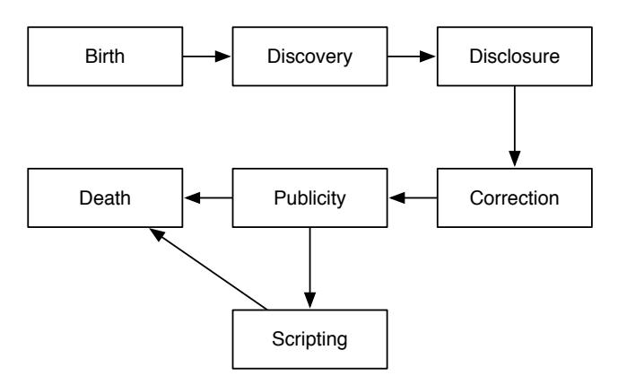
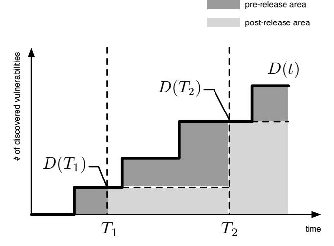
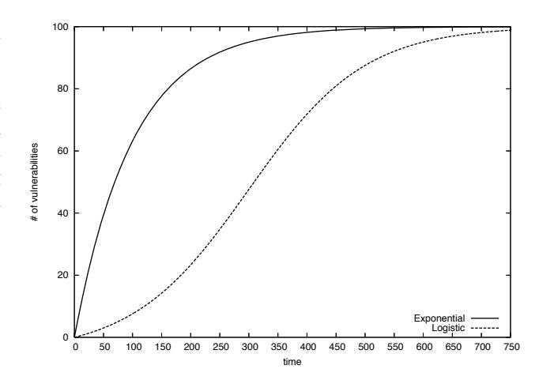
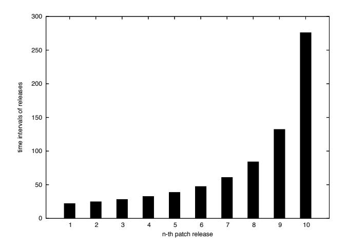
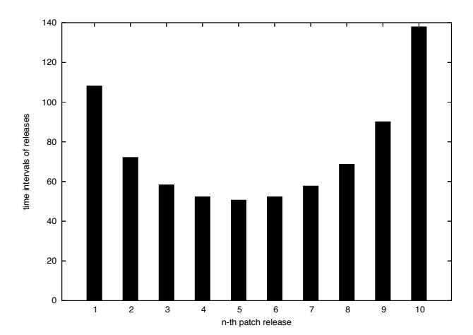
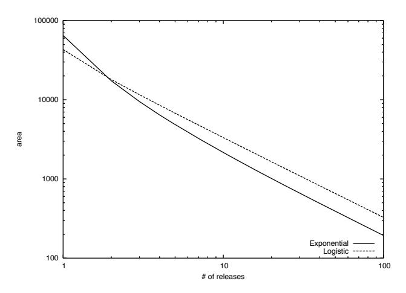
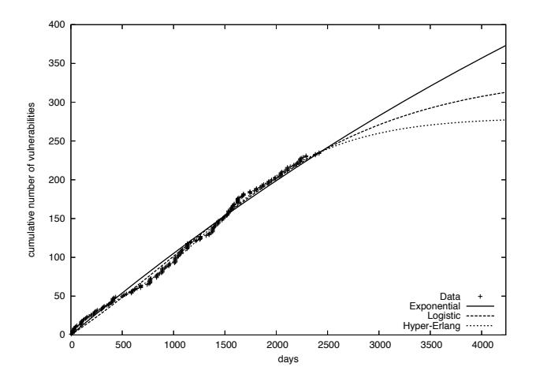
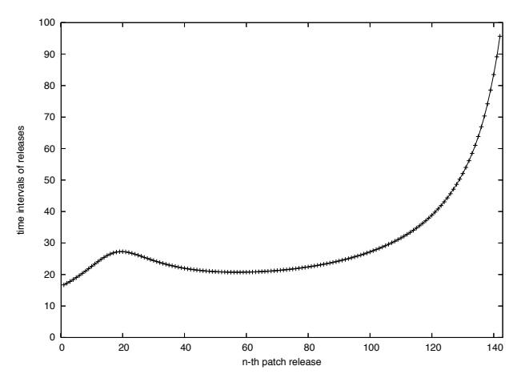

# Optimal Security Patch Release Timing Under Non-Homogeneous Vulnerability-Discovery Processes

Hiroyuki Okamura, Masataka Tokuzane and Tadashi Dohi Department of Information Engineering Graduate School of Engineering, Hiroshima University 1–4–1 Kagamiyama, Higashi-Hiroshima 739–8527 Japan Email: {okamu,dohi}@rel.hiroshima-u.ac.jp

*Abstract***—This paper proposes a patch management model with non-homogeneous vulnerability-discovery processes to find the optimal security patch release times. The proposed model is an extension of Cavusoglu et al. (2006, 2008) by applying nonhomogeneous vulnerability-discovery processes which are based on a vulnerability life-cycle model, and provides the optimal schedule for security patch release times over a software life cycle by means of cost analysis. In numerical examples, we show that the optimal patch release policy becomes an aperiodic release strategy, and compare the minimum cost under the optimal policy with that under a periodic release strategy. In addition, based on opened vulnerability data, we illustrate the optimal security patch release policy for a real software product.**

# I. INTRODUCTION

The computer security has been recognized as one of the most important issues in the software reliability engineering. From the latter half of 1990s, many of security incidents have been reported even in enterprise systems as well as personal computers, such as the denial-of-service attack via computer viruses and the data leak caused by unauthorized accesses. At the same time, countermeasures against the security attacks have been enhanced to protect the software system, and almost all enterprises have formulated security policies to prevent security incidents.

One of the most effective countermeasures is to remove the flaws and faults causing security problems in the software, which are often called security holes and vulnerabilities. In other words, high-quality software testing leads to highsecure software system. Thus it requires that software faults are removed in the software testing as many as possible. In particular, proprietary software should be fully tested to remove security holes before its shipping to the market, since the developer withholds the source code. However, in practice, it might be impossible to identify all of the software faults in the software testing due to external circumstances of software development; development cost, delivery date and unexpected specification changes. For such software systems, a security patching is a feasible approach not to allow an attacker to exploit vulnerabilities.

A security patch is a small program to fix the software faults causing security holes and vulnerabilities, and is distributed to the end-users through the Internet or other means after the software release. The user can remove a vulnerability by applying a corresponding security patch which is distributed from the vendor.

Ideally, the security patch should be distributed whenever one discovers a vulnerability of the software product. However, the development and distribution of security patches incur expenses for the vendor, and a short development time might cause the distribution of a poorly designed patch causing a new problem. Thus, many of the software vendors design a plan to distribute a security patch at a specified period of time, e.g., quarterly distribution, and the patch fixes all the vulnerabilities which have been discovered until the distribution time. On the other hand, from the user perspective, applying a patch involves not only a tedious task but also a risk that the patch causes an error like misconfiguration. Therefore, in practice, users, especially enterprises and firms, also make a plan of what patches are applied at a specified period of time. These strategies for the software patch are called patch management.

Cavusoglu et al. [1], [2] discussed the patch management based on a game theory between a vendor and a firm. After modeling the costs for development and distribution of patches, they mentioned sharing the expected burden and damage for unpatched vulnerabilities. In particular, under the assumption that vulnerabilities are discovered according to a homogeneous Poisson process, they derive a Stackelberg equilibrium of a patch management game between a vendor and a firm.

This paper focuses on a part of the patch management game [1], [2]. Cavusoglu et al. [1], [2] formulated the cost for development and distribution of patches in the vendor, and also discussed the optimal periodic patch release time from the vendor perspective based on the cost function with respect to a steady-state criterion. Their model was also built on the slightly doubtful assumption that the number of discovered vulnerabilities follows a homogeneous Poisson process. That is to say, this model implicitly assumes that the vulnerabilities forever remain even though patches fix software faults. A vulnerability is essentially a software fault in the software. In the software reliability engineering, it is common

to assume that the number of software faults is finite, i.e., all of the software faults are eventually removed. In fact, several existing vulnerability models [3]–[8] were based on non-homogeneous stochastic processes. At the same time, this property of vulnerabilities also requires that the vulnerability model is represented as a model with a finite time horizon, i.e., the optimal patch release times should be considered in a patch release model with a software life cycle. This motivates us to develop a patch release model to determine the optimal patch release times under a non-homogeneous vulnerabilitydiscovery process.

This paper is organized as follows. Section 2 introduces some related works on existing vulnerability models and associated stochastic models. In Section 3, we present a vulnerability life-cycle model, and a non-homogeneous vulnerabilitydiscovery process is defined from the vulnerability life-cycle model. Section 4 proposes a patch release model under a non-homogeneous vulnerability-discovery process. After mentioning the optimality of patch release times, we derive a dynamic-programing algorithm to determine the aperiodic optimal patch release times. Section 5 is devoted to examining the effectiveness of aperiodic release times by compared with a periodic release strategy in [1], [2]. Also we illustrate a numerical example of the optimal patch release times using the empirical data of vulnerabilities of a real software product.

## II. RELATED WORK

Since a vulnerability is the software fault that is exploited for a security attack, the vulnerability discovery model is quite similar to the software reliability model based on a fault detection process. Browne and McHugh [8] analyzed the number of vulnerability exploits with trend and regression analyses. Alhazmi and Malaiya [3]–[6] proposed regression models to predict the vulnerability discovery process, i.e., the number of discovered vulnerabilities. Based on the regression models, they also performed statistical analysis for several real software products like Windows 95 and Apache [3]–[6]. Rescorla [7] also performed a statistical analysis for vulnerability discovery processes using two trend curves: exponential and quadratic curves. In particular, the exponential curve was referred from the Goel and Okumoto non-homogeneous Poisson process model [9] in the software reliability engineering. In [3], Alhazmi and Malaiya performed comprehensive evaluation for these vulnerability discovery models.

A commonly-observed feature of these vulnerability discovery models is that the number of discovered vulnerabilities follows a non-homogeneous process. This corresponds to the reliability growth phenomenon in the conventional software reliability models. However, it should be noted that almost all existing researches on the vulnerability modeling apply only a regression analysis. On the other hand, the software reliability models use the likelihood-based analysis. In addition, although many of statistical techniques and general modeling frameworks (meta-modeling techniques) have been developed in the software reliability modeling, no one applied these welldefined techniques to the vulnerability models.

Fig. 1. A typical state transition in a vulnerability life-cycle model.

On the other hand, there are few mathematical models concerning security patch management. Arora et al. [10] considered the optimal policy for vulnerability disclosure with patching based over a software life cycle. Beattie et al. [11] considered the optimal time to apply a security patch maximizing system availability. In [11], they focused on the risk that a security patch caused a failure, but did not deal with statistical properties of the vulnerability discovery process. Cavusoglu et al. [1], [2] proposed the patch release and management models from both vendor and user perspectives. In addition, they discussed an equilibrium point of patch release times based on a game theory between a vendor and a firm (user). However, as mentioned in Section I, their models employed a homogeneous Poisson process as a vulnerability-discovery process. Apart from mathematical models, Brykczynski and Small [12] reported practices of security patch management, and also emphasised an importance of economic security patch management as a part of information asset management. That is, likewise an inventory management, vulnerabilities and their security patches should be economically controlled.

# III. VULNERABILITY MODEL

### *A. Vulnerability Life Cycle*

Vulnerability is defined as a fault on system requirements or programs which allows an attacker to violate the system integrity. A vulnerability is often caused by flaws on software requirements as well as software bugs, and thus it is more difficult to find vulnerabilities by software testing than to detect usual software bugs.

Arbaugh et al. [13] presented a vulnerability life-cycle model which consists of the following seven states:

- *Birth*: The birth of a vulnerability, strictly speaking a flaw, occurs at software requirement or software design.
- *Discovery*: Someone discovers a flaw on software security, and then the flaw becomes a vulnerability.
- *Disclosure*: The vulnerability is disclosed when the discoverer reveals details of the problem.
- *Correction*: The vulnerability is correctable by developing and releasing a security patch.

- Publicity: The vulnerability and its problem become known by disclosing them to public medias.
- *Scripting*: An exploitation of the vulnerability is released. In this state, crackers with little or no skill can exploit the vulnerability to violate the integrity of system.
- Death: The vulnerability dies when one applies a security patch to all the vulnerable systems.

Figure 1 illustrates the state transition of a typical vulnerability in the life-cycle model.

#### B. Vulnerability-Discovery Process Modeling

In the vulnerability life cycle, we focus on the discovery and disclosure states. In general, the software vendor begins to take a counteraction against a vulnerability after discovering the vulnerability in the software operation phase. That is, the number of discovered vulnerabilities is a significant measure to determine a security strategy of the vendor.

To describe the vulnerability discovery process, we make the following assumptions:

- (A-1) The software has a finite number of vulnerabilities to be discovered.
- (A-2) The time to discover a vulnerability is stochastically distributed, and all the times are mutually independent random variables.

Under the above assumptions, we model the number of discovered vulnerabilities at time t, D(t), as follows.

$$P(D(t) = n | D(0) = m) = {m \choose n} F(t)^n (1 - F(t))^{m-n},$$
(1)

where m is the total number of undiscovered vulnerabilities at time t=0 and F(t) is a cumulative distribution function (c.d.f.) of the discovery time for a vulnerability. In addition, when the total number of undiscovered vulnerabilities follows a Poisson distribution with mean  $\omega$ , the probability mass function (p.m.f.) of D(t) is given by

$$P(D(t) = n) = \frac{(\omega F(t))^n}{n!} \exp(-\omega F(t)). \tag{2}$$

Equation (2) equals the p.m.f. of non-homogeneous Poisson process (NHPP) with the mean value function  $\omega F(t)$ . This framework is essentially same as NHPP-based software reliability models (SRMs) [14], [15]. Thus, by applying well-known statistical distributions to F(t), we can obtain the vulnerability-discovery processes which correspond to several existing NHPP-based SRMs. For example, when F(t) is a truncated logistic distribution, the corresponding NHPP-based vulnerability discovery model equals an inflection S-shaped model [16], [17]. The inflection S-shaped model has almost same representation ability as the vulnerability discovery model proposed by [3]–[6], since both models draw a logistic curve as the expected number of discovered vulnerabilities.

# IV. PATCH MANAGEMENT MODEL

#### A. Formulation

Cavusoglu et al. [1], [2] discussed a security patch release strategy as a zero-sum game between software vendor and firm (user). Their model assumed a homogeneous Poisson process as the number of discovered vulnerabilities. However, the number of discovered vulnerabilities generally follows an NHPP under the assumption that the total number of vulnerabilities is finite. In fact, since many authors proposed vulnerability models as growth curves, it can be validated to represent the vulnerability-discovery process as an NHPP. This paper proposes an extended patch management model from Cavusoglu et al.'s model by applying an NHPP to the vulnerability-discovery process.

Define the following cost parameters:

 $K_v$ : The fixed cost for a security patch release.

- $c_v$ : The cost of developing a security patch for a vulnerability.
- cb: The damage cost per unit time when a vulnerability exploit is released before a security patch release by the vendor (pre-release).
- $c_a$ : The damage cost per unit time when a vulnerability exploit is released after a security patch release by the vendor (post-release).

All the above costs are incurred by the vendor since we focus on the cost optimization from the vendor perspective, although Cavusoglu et al. [1], [2] discussed the cost incurred by a firm as well. The costs  $c_b$  and  $c_a$  are negative rewards caused by the risk for the vulnerability exploit. In particular, the cost  $c_b$  is incurred by the zero-day exploit, and therefore it is appropriate to be  $c_b > c_a$  in most cases.

Cavusoglu et al. [1], [2] considered a periodic patch release of the vendor under the assumption that the number of discovered vulnerabilities follows a homogeneous Poisson process. In addition, they proved that the periodic patch policy is optimal under a homogeneous vulnerability-discovery process. However, this paper deals with an NHPP-based vulnerability-discovery process, and the patch release strategy should be reformulated under aperiodic policies.

Let  $T_{LC}$  be a lifetime for the underlying software after its release from the vendor perspective; for example,  $T_{LC}$  is a warranty period for the software product. Without loss of generality, we assume that N security patches are released over the software life cycle  $[0,T_{LC}]$ , and  $T_1 < T_2 < \cdots < T_N$  denote the release times for security patches. The final security patch should be released at the end of software life cycle, i.e.,  $T_N = T_{LC}$ . Then the expected total cost for a software life cycle is given by

$$C(T_1, ..., T_N) = NK_v + c_v \Lambda(T_N)$$

$$+ c_b \sum_{i=1}^N \int_{T_{i-1}}^{T_i} (\Lambda(s) - \Lambda(T_{i-1})) ds$$

$$+ c_a \sum_{i=1}^N (T_i - T_{i-1}) \Lambda(T_{i-1}),$$
(3)

where  $\Lambda(t) = \omega F(t)$  and  $T_0 = 0$ .

In Eq. (3), the damage costs are calculated by the area of the number of discovered vulnerabilities D(t). For instance, the damage cost for pre-release during a period  $[T_{i-1}, T_i]$  is a

Fig. 2. Pre- and post-release areas for damage costs.

sum of damage costs for newly discovered vulnerabilities after the patch release, and hence, using the number of discovered vulnerabilities D(t), the cost is given by

(damage cost for pre-release)

$$= c_b \int_{T_{i-1}}^{T_i} (D(s) - D(T_{i-1})) ds.$$
 (4)

On the other hand, the damage cost for post-release is a sum of damage costs for the vulnerabilities whose patches have already been released by the (i-1)-st patch release. Therefore the cost is given by

(damage cost for post-release) = 
$$c_a \int_{T_{i-1}}^{T_i} D(T_{i-1}) dt$$
. (5)

Figure 2 illustrates the pre- and post-release areas corresponding to the damage costs on a sample path of D(t). Taking account of the expected values of Eqs. (4) and (5), the expected total cost for a software life cycle can be obtained.

In practice, the damage for vulnerability will be caused only when malicious users exploit a vulnerability for their attacks. In this sense, we should consider the probability that a vulnerability is exploited for the attack in the modeling. However, such a probability is practically unknown, since there are a number of ways to exploit vulnerabilities. For the purpose of simplification, Cavusoglu et al. [1], [2] as well as this paper implicitly assumed that the probability of attack is uniformly distributed. In this situation, the damage costs are proportional to the areas of the vulnerability-discovery process.

#### B. Optimization

Next we discuss the optimal patch release times minimizing the expected total cost for a software life cycle. Since the expected total cost is given as a function of  $T_1, \ldots, T_{N-1}$ ,

the problem is reduced to a non-linear minimization problem provided that the number of release times, i.e.,

$$\min_{T_1, \dots, T_{N-1}} C(T_1, \dots, T_N). \tag{6}$$

Here we consider the optimization problem under a given N. Since there is no effective algorithm to find the optimal solution of  $(T_1, \ldots, T_{N-1}, N)$  simultaneously, we search the optimal number of release times after performing the optimization for each  $N=1,2,\ldots$  When N is given, we obtain the following theorem on the optimal release times:

Theorem: Suppose that  $c_b$  is greater than  $c_a$ . When the number of patch releases over a software life cycle is given, the optimal release schedule is robust for cost parameters, such that it minimizes the following area:

$$\min_{T_1, \dots, T_{N-1}} \sum_{i=1}^{N} \int_{T_{i-1}}^{T_i} \left( \Lambda(s) - \Lambda(T_{i-1}) \right) ds. \tag{7}$$

The proof is given in Appendix. From the above theorem, it is found that cost parameters only affect the optimal number of release times  $N^*$ .

Consider a computation algorithm to derive the optimal release time sequence for a given N. In general, the most popular method to find the optimal times would be the Newton's method and associated iterative methods. However, they may not often function better to solve the minimization problem with many decision variables due to the local convergence property of the Newton's method. In our minimization problem, the decision variables  $T_1, \ldots, T_N = T_{LC}$  should be arranged in ascending order, and the dynamic programming (DP) is effective for this sequential optimization problem.

The idea behind DP algorithm is to solve an optimality equation which is typical functional equations recursively. Let  $V_k(t)$  be the expected area concerning the damage cost for pre-release from  $T_{k-1}$  to  $T_{LC}$  where the k-th security patch is released at time t and the (k+1)-st through N-th patches are released under the optimal policy. According to the optimality principle [18], we have the following non-linear equations:

$$V_k^* = V_k(T_k^*) = \min_t V_k(t), \quad k = 1, \dots, N - 1,$$
 (8)

$$V_k(t) = \int_{T_{k-1}^*}^t (\Lambda(s) - \Lambda(T_{k-1}^*)) ds + V_{k+1}^*, \tag{9}$$

$$V_N^* = \int_{T_{N-1}^*}^{T_{LC}} (\Lambda(s) - \Lambda(T_{N-1}^*)) ds, \tag{10}$$

where  $T_1^* \leq T_2^* \leq \cdots \leq T_N^* = T_{LC}$  are the optimal release times for a given number of releases N. In particular,  $V_k(t)$  is called a *value function*.

Equations (8) through (10) represent the condition which the optimal release times satisfy. Next we provide a DP algorithm to solve the above optimality equation based on the *policy iteration* scheme [19]. The policy iteration generally consists of two steps: the optimization of release schedule under given value functions, and the computation of value functions under

the updated schedule. These steps are repeatedly executed until the release schedule converges to the optimal value.

In the optimization step, we should consider the minimization of  $V_k(t)$  for each  $k=1,\ldots,N-1$ . However, the value function  $V_k(t)$ ,  $k=1,\ldots,N-1$ , are not always convex with respect to the decision variable t in our problem. Hence this paper proposes a new algorithm applying the following composite function instead of  $V_k(t)$  to each optimization problem  $k=1,\ldots,N-1$ :

$$\tilde{V}_k(t) = U_k(T_{k-1}, t) + U_{k+1}(t, T_{k+1}) + V_{k+2}^*, \quad (11)$$
for  $k = 1, \dots, N-2$ ,

$$\tilde{V}_{N-1}(t) = U_{N-1}(T_{N-2}, t) + U_N(t, T_N), \tag{12}$$

$$U_k(t_1, t_2) = \int_{t_1}^{t_2} (\Lambda(s) - \Lambda(t_1)) ds.$$
 (13)

The function  $\tilde{V}_k(t)$  consists of a sum of the expected areas for successive two periods  $[T_{k-1},T_k]$  and  $[T_k,T_{k+1}]$  and the minimum  $V_{k+2}^*$ . Dissimilar to  $V_k(t)$ , the function  $\tilde{V}_k(t)$  becomes convex for all the periods, and this property guarantees the policy improvement in the optimization step.

Finally, the proposed DP algorithm can be described as follows.

• Step 1: Give initial values

$$\begin{aligned} u &:= 0, \\ T_0^{(0)} &= 0 < T_1^0 < \dots < T_{N-1}^{(0)} < T_N^{(0)} = T_{LC}, \\ V_0^* &= V_1^* = \dots = V_N^* = 0. \end{aligned}$$

• Step 2: Solve the following optimization problems and update the optimal release sequence and minimum values:

$$\begin{split} T_0^{(u+1)} &:= 0, \\ T_k^{(u+1)} &:= \underset{T_{k-1}^{(u)} \leq t \leq T_{i+1}^{(u)}}{\operatorname{argmin}} \tilde{V}_k(t), \\ V_k^* &:= \underset{T_{k-1}^{(u)} \leq t \leq T_{i+1}^{(u)}}{\operatorname{min}} \tilde{V}_k(t), \\ & \qquad \qquad \text{for } k = 1, \dots, N-1, \\ T_N^{(u+1)} &:= T_{LC}, \\ V_N^* &:= \int_{T^{(u+1)}}^{T_{LC}} \left(\Lambda(s) - \Lambda(T_{N-1}^{(u+1)})\right) ds. \end{split}$$

• Step 3: For all  $k=1,\ldots,N-1$ , if  $|T_k^{(u+1)}-T_k^{(u)}|<\delta$ , stop the algorithm, where  $\delta$  is an error tolerance level. Otherwise, let u:=u+1 and go to Step 2.

In Step 2, an arbitrary optimization technique should be applied. Since the composite function  $\tilde{V}_k(t)$  is convex in the range  $[T_{k-1}, T_{k+1}]$ , it is not difficult to calculate the optimal release time. For instance, the golden section method [20] would be effective to find the solution.

On the number of release times N, we find the optimal value satisfying

$$\min_{N} (NK_v + (c_b - c_a)S^*(N)), \qquad (14)$$

Fig. 3. Mean value functions of Exponential and Logistic.

where  $S^*(N)$  is the minimum area concerning the damage cost for pre-release under a given N. After executing the above algorithm to determine the optimal release time sequence,  $S^*(N)$  is given by  $V_1^*$ .

#### V. NUMERICAL EXAMPLES

#### A. Characteristics of Optimal Release Policy

We investigate the characteristics of aperiodic patch release times. As shown in Section IV, since the cost parameters do not affect the optimal patch release times under a given number of releases N, we derive the optimal patch release times without the cost parameters for the following two mean value functions for a vulnerability-discovery process:

$$\Lambda(t) = \omega(1 - e^{-\beta t}) \tag{15}$$

and

$$\Lambda(t) = \frac{\omega(1 - e^{-\beta t})}{1 + ce^{-\beta t}}.$$
(16)

The former is based on the assumption that a vulnerability-discovery time follows an exponential distribution, and is the same as Goel and Okumoto model [9]. Here it is called the model 'Exponential' in this section. The latter is assumed that a vulnerability-discovery time is a truncated logistic random variate [16], [17]. The corresponding model is an inflection S-shaped model in the software reliability modeling, and its mean value function is almost same as the vulnerability-discovery model by Alhazmi and Malaiya [3]–[6]. The latter model is called 'Logistic' in this section.

To derive the optimal patch release times for two models, we set  $\omega=100$ ,  $\beta=0.01$ , c=20.0 and suppose that the software life cycle is given by  $T_{LC}=750$ . Then the mean value functions are depicted in Figure 3. Exponential and Logistic draw a concave curve and an S-shaped curve, respectively. Figures 4 and 5 illustrate the time intervals of optimal releases in Exponential and Logistic with the number of releases N=10. In Fig. 4, the time intervals form a increasing time

Fig. 4. Time intervals of optimal release times (Exponential).

Fig. 5. Time intervals of optimal release times (Logistic).

sequence. As the time is closer to the end of life cycle, a time interval of patch releases becomes larger. This is because the number of newly discovered vulnerabilities decreases and eventually goes to zero. This is a remarkable property under a non-homogeneous vulnerability-discovery process, and cannot be observed in the model with a homogeneous vulnerabilitydiscovery process [1], [2]. On the other hand, the monotonicity of time intervals of optimal patch releases could not be found in the case of Logistic. In Fig. 5, we observe a decreasing tendency for the early period of a software life cycle, and the time intervals turns out to be an increasing time sequence as the time gets close to the end of lifetime. From the behavior of mean value function of Logistic in Fig. 3, the shorter time intervals of optimal patch releases are placed at the time when the number of newly discovered vulnerabilities is large. From these insights, the optimal patch release policy is similar to the policy in which a patch is released if the number of unpatched vulnerabilities attains to a fixed number.

Next, we investigate the optimal number of releases under

Fig. 6. Minimum area for pre-release (N = 1, ..., 100).

an aperiodic patch release policy. Figure 6 is a log-log plot of minimum area for pre-release with a varying number of releases N under  $\omega=100, \beta=0.1, c=20.0$  and  $T_{LC}=750$ . The minimum area for pre-release for a given N is computed by

$$S^*(N) = \sum_{i=1}^{N} \int_{T_{i-1}^*}^{T_i^*} \left( \Lambda(s) - \Lambda(T_{i-1}^*) \right), \tag{17}$$

where  $T_1^*, \dots, T_N^*$  are the optimal release times. Based on Eq. (14), this area is a factor to decide the optimal number of releases. From Fig. 6, the area monotonically decreases as N increases. In addition, the area eventually becomes zero as  $N \to \infty$ . On the other hand, the cost for releasing patches, i.e.,  $NK_v$ , infinitely increases as  $N \to \infty$ . Therefore, the optimal number of patch releases always exists as a finite value. However, Fig. 6 indicates that the decreasing speed of  $S^*(N)$  is polynomial in N. The optimal number of releases might be expected to be large, although the optimal value is dependent on the cost parameters  $K_v$ ,  $c_b$  and  $c_a$ . Table I indicates the conditions for the cost  $c_b - c_a$  where the corresponding number of releases is optimal when the patch release cost is fixed as  $K_v = 1.0$ . If the cost  $c_b - c_a$  is greater than a column value, the corresponding number of releases N is optimal. For example, if the cost  $c_b - c_a$  is in a range [2.100E-05, 1.266E-04] in Exponential, the optimal number of releases becomes 2. The last column values are 1.761E-02 and 1.140E-02 in Exponential and Logistic, respectively, and both of them are very small compared to the patch release cost  $K_v = 1$ . In addition, the damage cost for pre-release  $c_b$  tends to be high in many cases. This result also implies that the number of patch releases could turn out to be large.

On the other hand, Tables II and III present the optimal numbers of releases  $N^*$  with varying damage cost  $c_b$  under periodic and aperiodic policies for Exponential and Logistic, respectively. We assume that the other parameters are  $K_v=1.0,\,c_v=0.0$  and  $c_a=0.0$ . In the periodic policy, the first N-1 patches are released with a fixed time interval  $\bar{T}$ , and

 $\label{table in the continuous for the optimal number of releases.}$  Critical values for the optimal number of releases.

| N  | Exponential $(c_b - c_a)$ | Logistic $(c_b - c_a)$ |
|----|---------------------------|------------------------|
| 1  | 0.000E+00                 | 0.000E+00              |
| 2  | 2.100E-05                 | 3.977E-05              |
| 3  | 1.266E-04                 | 1.555E-04              |
| 4  | 3.288E-04                 | 3.308E-04              |
| 5  | 6.311E-04                 | 5.657E-04              |
| 6  | 1.035E-03                 | 8.605E-04              |
| 7  | 1.542E-03                 | 1.216E-03              |
| 8  | 2.153E-03                 | 1.632E-03              |
| 9  | 2.867E-03                 | 2.109E-03              |
| 10 | 3.685E-03                 | 2.647E-03              |
| 11 | 4.607E-03                 | 3.247E-03              |
| 12 | 5.634E-03                 | 3.907E-03              |
| 13 | 6.765E-03                 | 4.629E-03              |
| 14 | 8.000E-03                 | 5.412E-03              |
| 15 | 9.340E-03                 | 6.257E-03              |
| 16 | 1.078E-02                 | 7.162E-03              |
| 17 | 1.233E-02                 | 8.129E-03              |
| 18 | 1.399E-02                 | 9.158E-03              |
| 19 | 1.575E-02                 | 1.025E-02              |
| 20 | 1.761E-02                 | 1.140E-02              |

TABLE II
OPTIMAL NUMBERS OF PATCH RELEASES UNDER PERIODIC AND
APERIODIC POLICIES (EXPONENTIAL).

|        |       | Periodio    | :     | Ape   | riodic |
|--------|-------|-------------|-------|-------|--------|
| $c_b$  | $N^*$ | $\bar{T}^*$ | Cost  | $N^*$ | Cost   |
| 0.8    | 157   | 3.9         | 325.7 | 125   | 248.3  |
| 0.6    | 135   | 4.5         | 280.7 | 108   | 215.2  |
| 0.4    | 107   | 5.4         | 229.7 | 89    | 175.9  |
| 0.2    | 74    | 7.5         | 159.1 | 63    | 124.7  |
| 0.08   | 47    | 11.4        | 99.0  | 40    | 79.3   |
| 0.06   | 41    | 12.9        | 85.3  | 35    | 68.9   |
| 0.04   | 32    | 15.6        | 69.1  | 29    | 56.4   |
| 0.02   | 23    | 21.4        | 48.3  | 21    | 40.3   |
| 0.008  | 15    | 31.0        | 30.2  | 14    | 25.9   |
| 0.006  | 13    | 37.6        | 27.1  | 12    | 22.6   |
| 0.004  | 11    | 44.1        | 21.2  | 10    | 18.6   |
| 0.002  | 8     | 53.5        | 15.0  | 7     | 13.5   |
| 0.0008 | 5     | 80.6        | 9.6   | 5     | 8.9    |
| 0.0006 | 4     | 98.4        | 8.4   | 4     | 7.9    |
| 0.0004 | 4     | 98.4        | 6.9   | 4     | 6.6    |
| 0.0002 | 3     | 127.8       | 5.0   | 3     | 4.9    |

the last patch must be released at the end of lifetime  $T_{LC}$ , and we found the optimal policy  $(N^*, \bar{T}^*)$  minimizing the total cost. Although there is no remarkable difference between periodic and aperiodic policies in the case where the damage cost  $c_b$  is small, the aperiodic policy outperforms the periodic policy in terms of the total cost in the case where the damage cost is large. In particular, by applying the aperiodic policy, we can reduce the number of patch releases over a software life cycle. Comparing the values in Exponential and Logistic, Logistic requires more number of releases than Exponential. This is because many releases are needed at the point where the mean value function rapidly increases. That is, in general, an S-shaped curve is expected to need more number of releases than an concave curve.

TABLE III
OPTIMAL NUMBERS OF PATCH RELEASES UNDER PERIODIC AND APERIODIC POLICIES (LOGISTIC).

|        |       | Periodio    | 2     | Ape   | riodic |
|--------|-------|-------------|-------|-------|--------|
| $c_b$  | $N^*$ | $\bar{T}^*$ | Cost  | $N^*$ | Cost   |
| 0.8    | 170   | 4.3         | 342.4 | 161   | 323.2  |
| 0.6    | 147   | 5.0         | 296.3 | 140   | 280.0  |
| 0.4    | 120   | 6.0         | 241.7 | 114   | 228.6  |
| 0.2    | 85    | 8.5         | 170.5 | 81    | 161.7  |
| 0.08   | 53    | 13.4        | 107.4 | 51    | 102.4  |
| 0.06   | 46    | 15.3        | 92.9  | 44    | 88.7   |
| 0.04   | 37    | 18.9        | 75.7  | 36    | 72.5   |
| 0.02   | 26    | 26.5        | 53.4  | 26    | 51.3   |
| 0.008  | 16    | 42.3        | 33.6  | 16    | 32.5   |
| 0.006  | 14    | 48.1        | 29.1  | 14    | 28.2   |
| 0.004  | 12    | 55.9        | 23.7  | 12    | 23.1   |
| 0.002  | 8     | 83.2        | 16.8  | 8     | 16.4   |
| 0.0008 | 5     | 133.9       | 10.7  | 5     | 10.4   |
| 0.0006 | 5     | 133.9       | 9.3   | 5     | 9.1    |
| 0.0004 | 4     | 169.5       | 7.6   | 4     | 7.4    |
| 0.0002 | 3     | 232.2       | 5.5   | 3     | 5.3    |

#### B. Data Analysis

We present an optimal patch release times based on the vulnerability data for a real software product. Figure 7 illustrates the cumulative number of vulnerabilities for Windows XP reported on Secunia.com 1 from 2002 to 2009, and estimated mean value functions of vulnerability-discovery models. Here we applied the vulnerability-discovery model based on a Hyper-Erlang distribution as well as Exponential and Logistic, which was proposed in [21] as a flexible NHPP-based SRM. The mean value function of Hyper-Erlang model is given by

$$\Lambda(t) = \omega \sum_{j=1}^{m} \pi_j \left( 1 - \sum_{l=1}^{\alpha_j} \frac{(\beta_j t)^{l-1}}{(l-1)!} e^{-\beta_j t} \right), \quad (18)$$

where  $\beta_j > 0$ ,  $\sum_{j=1}^m \pi_j = 1$  and  $\alpha_j$  is a positive integer. The parameter estimation for all the models is based on maximum likelihood estimation. In particular, we performed the likelihood-based algorithm for Hyper-Erlang models proposed in [21]. The estimated parameters for each model are described in Table IV. Table IV also presents the corresponding maximum logarithmic likelihood (MLL) and Akaike's information criterion (AIC). The AIC is commonly used as a criterion to estimate the goodness-of-fit between the model and the data. The model with a smaller AIC is better fitted to the data. From this statistical argument, it could be concluded that Hyper-Erlang model is better fitted to the vulnerability data for Windows XP than the others2. In addition, each mean value function in Fig. 7 indicates the predictive number of vulnerabilities at the end of Windows XP support (4/8/2014). It is 4236 days from the date when the first vulnerability was reported on Secunia.com. We suppose that Hyper-Erlang model is best fitted in terms of AIC. Interestingly, the number

http://secunia.com/

&lt;sup>2We tested other models whose vulnerability-discovery time follows Weibull, gamma, Pareto and log-normal distributions. Hyper-Erlang model outperformed them in terms of AIC.

Fig. 7. Windows XP: Vulnerability data and estimated mean value functions.

TABLE IV ESTIMATION RESULTS FOR VULNERABILITY DATA.

| Model        | MLL     | AIC     | Parameter(s)                                  |
|--------------|---------|---------|-----------------------------------------------|
| Exponential  | -782.22 | 1568.44 | $\omega = 965.54,$                            |
|              |         |         | $\beta = 1.153$ E-4.                          |
| Logistic     | -781.39 | 1568.78 | $\omega = 336.32,$                            |
|              |         |         | $\beta = 9.040E-4,$                           |
| II E 1       | 776.04  | 1560.40 | c = 2.400.                                    |
| Hyper-Erlang | -776.24 | 1560.48 | $\omega = 280.08,$                            |
|              |         |         | m = 2,                                        |
|              |         |         | $(\pi_1, \pi_2) = (0.18, 0.82),$              |
|              |         |         | $(\alpha_1, \beta_1) = (1, 3.711E-3),$        |
|              |         |         | $(\alpha_2, \beta_2) = (4, 2.298\text{E-}3).$ |

of vulnerabilities is expected to converge until the end of support on Windows XP.

Next we perform the proposed optimization algorithm on the estimated mean value function of Hyper-Erlang model, and particularly compare an aperiodic patch release policy with the simple periodic patch release policy where a patch is released at every month, i.e., a 30-days interval. Then the total number of patch releases during the software life cycle under the periodic policy is given by N=142. Figure 8 illustrates the optimal intervals of patch release times for Windows XP under a given number of releases N = 142. Since the observed vulnerability data for Windows XP is close to a homogeneous Poisson process in Fig. 7, the optimal time intervals nearly equal 30 days. However, the intervals are not strictly constant, and the optimal release intervals at the end of life cycle become longer than the others. In other words, this implies that the economic patch release scheduling is effective in the latter half of a software life cycle.

Table V presents the damage costs under periodic and aperiodic policies. In this table, the total number of releases is supposed to be 71, 142, 303 and 606. Each of numbers corresponds to the number of patch releases under 60-days, 30-days, 14-days and 7-days intervals. Since the total number of releases is given by a constant, the patch release and patch

Fig. 8. Time intervals of Optimal release times on Windows XP (N = 142).

 $\label{table V} \textbf{Damage costs for periodic and aperiodic patch releases}\,.$ 

| N   | Periodic ( $\times 10^3$ ) | Aperiodic ( $\times 10^3$ ) |
|-----|----------------------------|-----------------------------|
| 71  | 10795 (60-days)            | 9347                        |
| 142 | 5381 (30-days)             | 4654                        |
| 303 | 2507 (14-days)             | 2178                        |
| 606 | 1252 (7-days)              | 1099                        |

development costs are also constant, and they do not affect the optimal patch release timing. Also the damage cost parameters for pre- and post-releases are defined as  $c_b=1.29\mathrm{E}+03$  and  $c_a=0$ , respectively. These parameters are determined as a scenario; if any security patch is not released during the software life cycle, it lead to about \$1 billion loss as the damage cost; on the other hand, if a security patch is immediately released whenever a vulnerability is discovered, the damage cost is assumed to be zero.

Comparing the damage costs for periodic and aperiodic patch release policies in Table V, the aperiodic policy further reduces the damage costs. In the case of N=71, the aperiodic policy saves \$1 million or more damage cost. On the other hand, as the number of patch releases increases, the difference between the damage costs under periodic and aperiodic policies decreases. Here we focus only on the damage cost in this experiment. In practice, the patch release cost affects the total cost. This experiment indicates that the aperiodic patch release policy is effective to determine the optimal scheduling which fairly reduces both release and damage costs.

#### VI. CONCLUSIONS

In this paper, we have proposed a patch management model from the vendor perspective based on a non-homogeneous vulnerability-discovery process. Although the non-homogeneous vulnerability-discovery process has been discussed in several existing works, there has been no patch management model from the economic point of view. In this paper, after we have revisited a non-homogeneous

vulnerability-discovery process by applying a unified modeling framework in the software reliability engineering, a new patch management model is developed as an extension of the existing model in [1], [2]. Our model allows an aperiodic patch release policy as a generalized policy. In addition, the DP algorithm has also been proposed to compute a aperiodic patch release time sequence efficiently. In the numerical examples, we have investigated the characteristics of optimal patch release times on the proposed model, and examined that the aperiodic patch release policy was more effective than the periodic one in the economic point of view based on the vulnerability data for a real software product.

In this paper, although we considered a time-based patch release policy, it could be extended to a number-based policy where a release is determined by the number of unpatched vulnerabilities. In future, we will study such extensive models and a game model between a vendor and a firm based on a non-homogeneous vulnerability-discovery process.

# ACKNOWLEDGMENT

This research was supported by the Ministry of Education, Science, Sports and Culture, Grant-in-Aid for Young Scientists (B), Grant No. 21700060 (2009-2011) and Scientific Research (C), Grant No. 21510167 (2009-2012).

# APPENDIX

*The proof of Theorem*: Let S(T1,...,TN ) be the expected area concerning the damage cost for pre-release, i.e.,

$$S(T_1, \dots, T_N) = \sum_{i=1}^N \int_{T_{i-1}}^{T_i} (\Lambda(s) - \Lambda(T_{i-1})) ds.$$
 (19)

Since a sum of S(T1,...,TN ) and the expected area related to post-release A is given by

$$A = \int_0^{T_{LC}} \Lambda(s) ds, \tag{20}$$

Eq. (3) can be reduced as follows.

$$C(T_1, ..., T_N) = NK_v + c_v \Lambda(T_N) + c_b S(T_1, ..., T_N) + c_a (A - S(T_1, ..., T_N)).$$
(21)

When the number of release times is given, the first two terms and A are constant in Eq. (21). Thus the minimization problem is also reduced to

$$\min_{T_1, \dots, T_N} (c_b - c_a) S(T_1, \dots, T_N).$$
 (22)

Under the assumption cb > ca, the minimization problem of C(T1,...,TN ) equals the minimization of S(T1,...,TN ). Hence the optimal release times are independent of cost parameters.

#### REFERENCES

- [1] H. Cavusoglu, H. Cavusoglu, and J. Zhang, "Security patch management: Share the burden or share the damage?" *Management Science*, vol. 54, no. 4, pp. 657–670, 2008.
- [2] ——, "Economics of security patch management," in *The Fifth Workshop on the Economics of Information Security (WEIS06)*, 2006.
- [3] O. H. Alhazmi and Y. K. Malaiya, "Application of vulnerability discovery models to major operating systems," *IEEE Transactions on Reliability*, vol. 57, no. 1, pp. 14–22, 2008.
- [4] ——, "Measuring and enhancing prediction capabilities of vulnerability discovery models for Apache and IIS HTTP servers," in *Proc. 17th International Symposium on Software Reliability Engineering (ISSRE'06)*. IEEE CS Press, 2006, pp. 343–352.
- [5] S.-W. Woo, O. H. Alhazmi, and Y. K. Malaiya, "Assessing vulnerabilities in Apache and IIS HTTP servers," in *Proc. 2nd IEEE International Symposium on Dependable, Autonomic and Secure Computing (DASC'06)*. IEEE CS Press, 2006, pp. 103–110.
- [6] O. H. Alhazmi and Y. K. Malaiya, "Modeling the vulnerability discovery process," in *Proc. 16th International Symposium on Software Reliability Engineering (ISSRE'05)*. IEEE CS Press, 2005, pp. 129–138.
- [7] E. Rescorla, "Is finding security holes a good idea?" *IEEE Security and Privacy*, vol. 3, no. 1, pp. 14–19, 2005.
- [8] H. K. Browne, W. A. Arbaugh, J. McHugh, and W. L. Fithen, "A trend analysis of exploitation," in *Proc. IEEE Symposium on Security and Privacy*, 2001, pp. 214–229.
- [9] A. L. Goel and K. Okumoto, "Time-dependent error-detection rate model for software reliability and other performance measures," *IEEE Transactions on Reliability*, vol. R-28, pp. 206–211, 1979.
- [10] A. Arora, R. Telang, and H. Xu, "Optimal policy for software vulnerability disclosure," in *Third Annual Workshop on Economics of Information Security (WEIS04)*, 2004.
- [11] S. Beattie, S. Arnold, C. Cowan, P. Wagle, and C. Wright, "Timing the application of security patches for optimal uptime," in *Proc. 16th USENIX Systems Administration Conference (LISA02)*, 2002, pp. 233– 242.
- [12] B. Brykczynski and R. A. Small, "Reducing Internet-based intrusions: Effective security patch management," *IEEE Software*, vol. 20, no. 1, pp. 50–57, 2003.
- [13] W. A. Arbaugh, W. L. Fithen, and J. McHugh, "Windows of vulnerability: A case study analysis," *IEEE Computer*, vol. 33, no. 12, pp. 52–59, 2000.
- [14] J. D. Musa, *Software Reliability Engineering*. New York: McGraw-Hill, 1999.
- [15] M. R. Lyu, Ed., *Handbook of Software Reliability Engineering*. New York: McGraw-Hill, 1996.
- [16] M. Ohba, "Inflection S-shaped software reliability growth model," in *Stochastic Models in Reliability Theory*, S. Osaki and Y. Hatoyama, Eds. Berlin: Springer-Verlag, 1984, pp. 144–165.
- [17] H. Okamura, T. Dohi, and S. Osaki, "EM algorithms for logistic software reliability models," in *Proc. 22nd IASTED International Conference on Software Engineering*. ACTA Press, 2004, pp. 263–268.
- [18] R. Bellman, *Dynamic Programming*. Princeton University Press, 1957.
- [19] M. Puterman, *Markov Decision Processes*. John Wiley & Sons, 1994.
- [20] B. S. Gottfried, "A stopping criterion for the golden-ratio search," *Operations Research*, vol. 23, no. 3, pp. 553–555, 1975.
- [21] H. Okamura and T. Dohi, "Hyper-Erlang software reliability model," in *Proceedings of 14th Pacific Rim International Symposium on Dependable Computing (PRDC'08)*. Los Alamitos: IEEE Computer Society Press, Dec 2008, pp. 232–239.