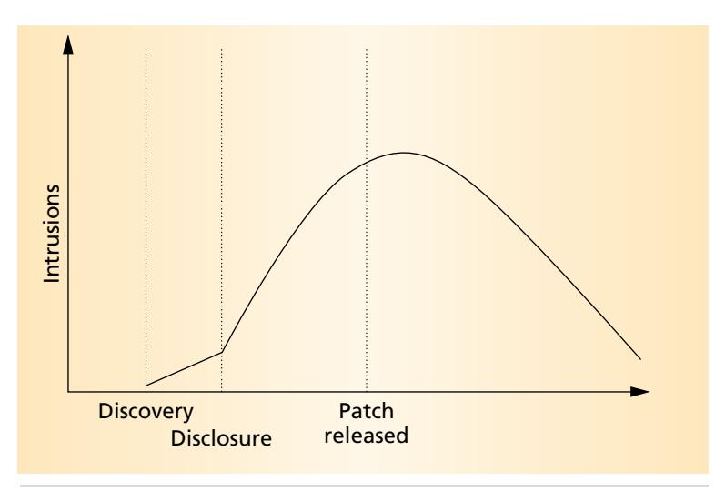
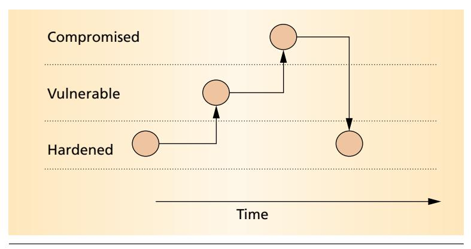
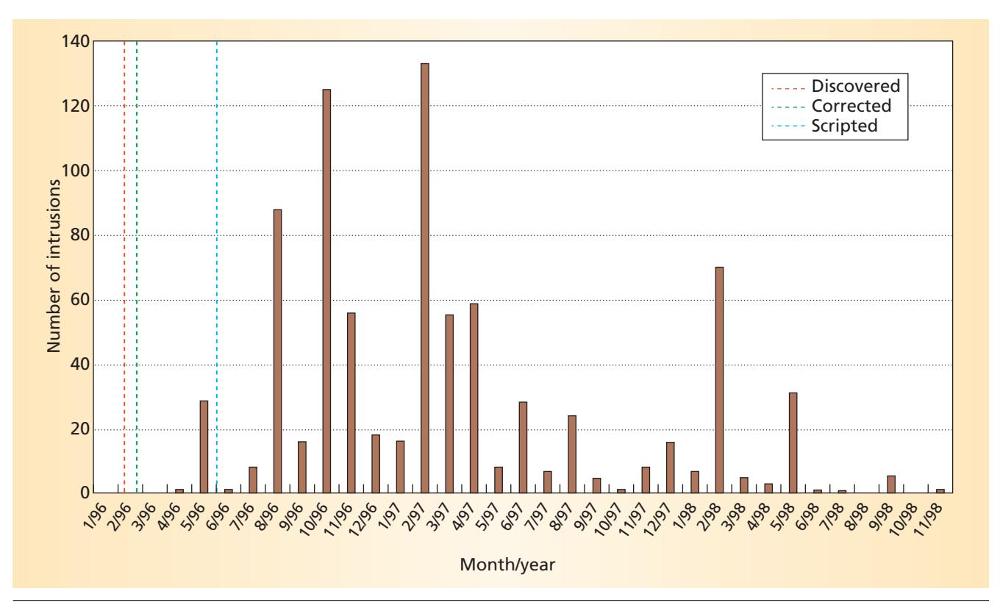
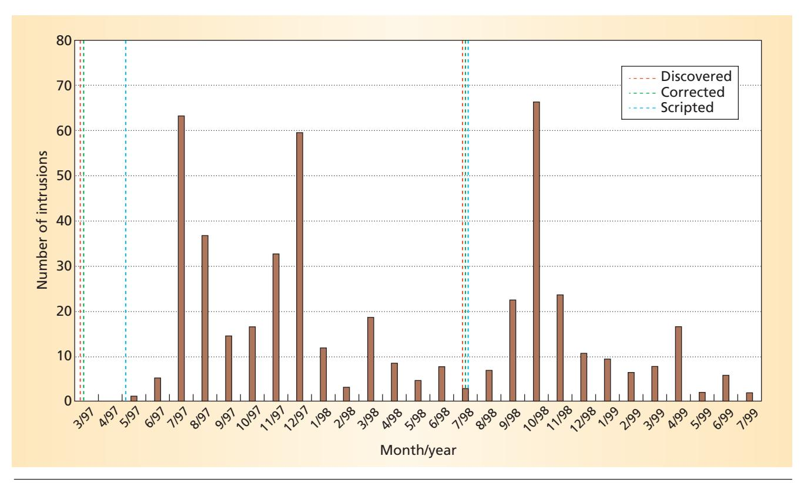
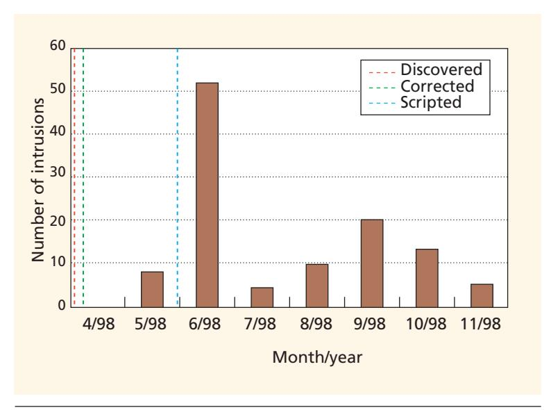

# Windows of Vulnerability: A Case Study Analysis

The authors propose a life-cycle model for system vulnerabilities, then apply it to three case studies to reveal how systems often remain vulnerable long after security fixes are available.

William A. Arbaugh
University of Maryland at
College Park

William L.
Fithen
John
McHugh
CERT
Coordination
Center

omplex information and communication systems give rise to design, implementation, and management errors. These errors can lead to a vulnerability—a flaw in an information technology product that could allow violations of security policy.

Anecdotal evidence alone suggests that known and patchable vulnerabilities cause the majority of system intrusions. Although no empirical study has substantiated this anecdotal evidence, none has refuted it either. Nor have studies conducted to determine the number of computers at risk for security breaches focused on the intrusion trends of specific vulnerabilities. 1,2

Here we propose a life-cycle model that describes the states a vulnerability can enter during its lifetime. We then use our vulnerability model to present a case study analysis of specific computer vulnerabilities.

Although the term "life cycle" implies a fixed and linear progression from one phase to the next, the discovery and exploitation of system vulnerabilities does not always follow such a tidy pattern. Instead—and, appropriately, given the nature of our model—the progression varies depending on interactions between the host system, the intruding scripts, and the programs that exploit its vulnerabilities. Thus our life cycle models a host and its viral parasites more closely than it does an isolated organism.

In general, a vulnerability appears to transition through distinct states: birth, discovery, disclosure, the release of a fix, publication, and automation of the exploitation. Intuitively, you would expect the number of intrusions into computer systems as a result of using a specific vulnerability over time to resemble the graph in Figure 1.3,4 The assumption here is that intrusions increase once the community discovers a vul-

nerability, with the rate of increase accelerating as news of the vulnerability spreads to a wider audience.

This trend continues until the vendor releases a patch or workaround, and the intrusion rate decreases. Ideally, the decrease would be a steep decline rather than the slow decrease Figure 1 shows. It does, however, take time for news of the patch to spread, and longer still for users to install it. In addition, cautious organizations require testing prior to system changes—rightfully so—to ensure that the patch does not create new problems. Some organizations install the patch when they "get to it," and others may never install the patch, for any of several reasons.

Determining the exact shape of the vulnerability curve in Figure 1 is, unfortunately, not straightforward. Doing so requires people and organizations to report that their system has been compromised and to describe the nature of the intrusion. Unfortunately, few incidents occur in which these two conditions hold.

First, for business reasons most organizations do not want to report a compromised system. The organization may fear disclosure and bad publicity—should the intrusion become public knowledge. Second, causality is difficult, if not impossible, to establish once a computer system has been fully compromised. Experienced crackers know how to cover their tracks, and *script kiddies*—less-experienced intruders who depend on more knowledgeable crackers to automate attacks—use tools written by others to automate the process for them. If meaningful evidence of the original intrusion isn't available, it usually isn't possible to determine the exact cause of intrusion.

Much like a vulnerability, an information system transitions between several distinct states—hardened, vulnerable, and compromised—during its lifetime. A system

- attains a hardened state when all security-related corrections, usually patches, have been installed;
- becomes vulnerable when at least one securityrelated correction has not been installed; and
- enters a compromised state when it has been successfully exploited.

As Figure 2 shows, a system typically oscillates between the hardened and vulnerable states during its lifetime, but, if fortunate, it will never enter a compromised state. Active systems management seeks to reduce the total time a system remains in the vulnerable and compromised states.

To support the model we propose, we extracted data from the historical record of the CERT Coordination Center's Incident and Vulnerability Teams. When reports of suspicious or malicious activity arrive at the CERT/CC, the Incident Team correlates them into related groupings called "incidents." Loosely speaking, an incident is a collection of reports that appear to relate to one another in a particular and meaningful way. These reports usually are related by the attacker's method—namely the vulnerabilities exploited—or by the specific tools the attacker uses to exploit those vulnerabilities.

In CERT/CC terminology, a vulnerability is a technological flaw in an information technology product that has security or survivability implications. Necessarily, that determination is subjective—what is a feature to one person may be a vulnerability to another. The CERT/CC Vulnerability Team tries to maintain a consistent definition of what a reasonable user or administrator would consider acceptable functional behavior in products, but the definition continuously evolves. CERT/CC terminology calls this definition the "reasonable expectation rule." CERT/CC usually receives vulnerability reports independent of any particular incident activity, but not always. For a list of CERT/CC security definitions, see the "CERT Coordination Center Definitions" sidebar.

# **VULNERABILITY LIFE-CYCLE MODEL**

To better understand the behavior of vulnerabilities, we devised a life-cycle model that is more specific than the usual phased analysis of vulnerabilities. Our model captures all possible states that a vulnerability can enter during its lifetime, with the understanding that not all vulnerabilities enter each state. In fact, when we analyze our case studies, several of the model's states converge into a single state.

The usual order of appearance of states is as follows:

• *Birth*. Denoting the flaw's creation, birth usually occurs unintentionally, during a large project's development. If the birth is malicious and thus

*Figure 1. Intuitive life cycle of a system-security vulnerability. Intrusions increase once users discover a vulnerability, and the rate continues to increase until the system administrator releases a patch or workaround.*

*Figure 2. Host life cycle. A system typically oscillates between hardened and vulnerable states. Systems management seeks to reduce the time the system remains in the vulnerable and compromised states.*

intentional, discovery and birth coincide. By convention, we consider the vulnerability to exist only after there is a nonzero probability of deployment—internal development and testing do not count, only deployment does.

- *Discovery.*When someone discovers that a product has security or survivability implications, the flaw becomes a vulnerability. It doesn't matter if the discoverer's intentions are malicious (Black Hat) or benign (White Hat). It is clear that, in many cases, original discovery is not an event that can be known; the discoverer may never disclose his finding.
- *Disclosure.* The vulnerability is disclosed when the discoverer reveals details of the problem to a wider audience. The disclosure may be posted to a vulnerability-specific mailing list such as Bugtraq. A full-disclosure moderated mailing list,

Bugtraq serves as a forum for *detailed* discussion and announcement of computer security vulnerabilities: what they are, how to exploit them, and how to fix them. Alternatively, the product's vendor or developer may receive news of the vulnerability directly. Obviously, the many levels of disclosure comprise a vast continuum of who was informed and what aspect of the vulnerability the disclosure revealed.

- *Correction.* A vulnerability is correctable when the vendor or developer releases a software modification or configuration change that corrects the underlying flaw.
- *Publicity.* A vulnerability becomes public in several ways. A news story could detail the problem, or an incident response center could issue a report concerning the vulnerability. The key element here is that the vulnerability becomes known on a large scale once the disclosure gets out of control.
- *Scripting.* Initially, successful exploitation of a
- new vulnerability requires moderate skill. Once a cracker scripts the exploitation, however, those with little or no skill can exploit the vulnerability to compromise systems. Scripting dramatically increases the size of the population that can exploit systems with that vulnerability. Further, although we use the term "scripting" here, this phase applies to any simplification of intrusion techniques that exploit the vulnerability, such as cracker "cookbooks" or detailed descriptions on how to exploit the vulnerability. In essence, at this point the vulnerability has been industrialized.
- *Death.* A vulnerability dies when the number of systems it can exploit shrinks to insignificance. In theory, a vulnerability can die if administrators patch all the systems at risk to correct the flaw, if they retire such systems, or if attackers and the media lose interest in the vulnerability. In practice, administrators can never patch all the systems at

# **CERT Coordination Center Definitions**

CERT/CC precisely defines several terms that can have multiple meanings in casual use but that have a quite specific meaning within the bounds of the security community.

# **General Security Terms**

*Activity.* A group of events that occur on the Internet and relate to one another in any of several ways. An activity may or may not be security or survivability related. Examples include an Internetwide scan of domain name servers to find invalid delegations, execution of a largescale distributed denial of service attack against a particular system or group of systems, and a single intruder who compromises a single system.

*Event.* The most fundamental unit of information that describes the aspects of network or host behavior. This single piece of evidence may be grouped with other events to form a larger picture of Internet activity. Examples include the delivery of a single network packet to a system, execution of a single command or program, and a port scan of a system to determine the services it offers.

*Incident.* An activity that has security or survivability implications.

*Vulnerability.* A flaw or defect in a technology or its deployment that produces an exploitable weakness in a system, resulting in behavior that has security or survivability implications.

*Probe.* An attack that only gathers information from the target system.

*Defect or flaw.* A technology product feature that can be used to produce undesirable behavior. Defect types include a specification defect, which specifies a function in the product that cannot be implemented correctly; an implementation defect that incorrectly implements a correctly specified function, and a superfluous function defect that implements an unspecified product function. Relatively speaking, only a few defects have security or survivability implications.

*Buffer overflow.* A common defect class in which the buffer—the extent of a memory area that serves as a write operation's target—is exceeded without intervention, causing overflow. Depending on the location of the buffer and the source of the data being written, such a defect can be used to coerce the affected program into executing arbitrary machine code with the same privileges the program enjoys. If the program's privileges differ from the attacker's, this defect has security implications that make it a vulnerability.

## **Perspective-Dependent Terms**

Some terms have distinct definitions that depend on whether they're viewed from the intruder's or defender's perspective—a cause of much confusion because these perspectives are rarely identified when people use the terms.

*Attack.* From the intruder's viewpoint, an attack is an act intended to elicit a behavior from the target system that achieves an intruder's goal. This behavior may or may not be contrary to the system owner's desires, but that issue is entirely irrelevant to the intruder. For example, an action may be part of an attack and yet *not* be contrary to the target-system-owner's desires.

From the defender's viewpoint, an attack is any event that targets the defender's system and that he or she believes is intentionally directed at his or her system for unapproved purposes.

*Intrusion.* From an attacker's viewpoint, an intrusion is an intended behavior elicited from a system due to his or her attack.

From a defender's viewpoint, an intrusion is any observed, undesired behavior caused by a system attack.

risk. They inevitably retire such systems at some point, and attackers and the media frequently lose interest in the vulnerability—but sometimes only temporarily, creating a near-death experience.

Because they're causally related, the first three states—birth, discovery, and disclosure—must always occur in order. Disclosure can, however, occur almost simultaneously with discovery. After the initial disclosure, the vulnerability can be further disclosed, made public, scripted, or corrected in any order. In our three case studies, the intrusions were corrected, made public, then scripted. We rarely encounter cases with CERT/CC's preferred ordering: Following a carefully controlled initial disclosure, a modification or configuration change corrects the vulnerability, a public advisory reveals that the problem has been corrected, the vulnerability is never scripted, and it dies quickly. Death eventually followed years later.

# **DATA ANALYSIS AND APPROACH**

We used historical data from the CERT/CC database to apply our life-cycle model to examine the lives of three common vulnerabilities. The data we examined covers a period from 1996 through 1999 and provides a unique view of intrusions that cannot be obtained elsewhere.

While the CERT/CC data is the best available source for an analysis of this type, there are several problems related to the data. The foremost is that all the reports are self-selecting. Only a subset of the sites that experience some sort of problem, either an intrusion or a probe, will report it. As a result, the CERT/CC data does not accurately reflect the entire scope of intrusion activity on the Internet.

The human element of reporting introduces another problem. At some point, the hot vulnerability becomes passé, and focus shifts to the next vulnerability du jour. Attackers become bored with exploiting the old vulnerability, while administrators have already dealt with it and either understand it or are tired of it. Thus, lack of interest alone may artificially lower the vulnerability's incidence rate. While these factors have a significant effect on the data set, we believe that the data is sufficient to provide a window into the much larger problem.

When CERT/CC closes an incident, it creates a summary containing all pertinent information about the incident. The summary contains both formatted and free-format discussion sections. One formatted field describes the exploited vulnerability.

To collect the initial data, we calculated the total number of incidents for every vulnerability known to CERT/CC. From this list, we selected for further analysis the three vulnerabilities with the highest incidence rate. Next, we read the summary's discussion section to ensure that, for each incident two conditions held:

- the incident did in fact involve the specific vulnerability, and
- the incident involved an intrusion because in some cases the incident only involved unsuccessful probes for the vulnerability.

We counted the incident as a successful intrusion only if the evidence clearly showed that both conditions held. Often, an incident includes several—and sometimes hundreds to

thousands—of hosts. We did not add these hosts to the intrusion count unless they met our criteria. In some cases, captured logs clearly indicated that crackers successfully exploited numerous hosts. However, if we could not determine the actual dates for the hosts' exploitation, we used the date the logs were obtained as the incident date—which resulted in an occasional spike.

# VULNERABILITY CASE STUDIES

For each case, we provide background information about the vulnerability, such as how attackers exploited it and which systems were affected. We then tie the case to the life-cycle model by identifying the dates for each state within the model. Finally, we use a histogram of reported intrusions to show the life of the vulnerability, and we conclude with an analysis specific to the particular vulnerability.

### Phf incident

Like all common gateway interface programs, phf extends the functionality of Web servers by providing a server-side scripting capability. Phf provides a Webbased interface to an information database that usually consists of personnel information such as names, addresses, and telephone numbers.

In the phf incident, attackers exploited an implementation-error vulnerability, not an underlying security problem with CGI or the Web server. The vulnerable phf program appeared in both the Apache and NCSA HTTPd server distributions.

The phf script works by constructing a command line string based on user input. While the script attempted to filter the user's input to prevent the execution of arbitrary commands, the authors failed to filter a new-line character. As a result, attackers could execute arbitrary commands on the Web server at the privilege level of the HTTP server daemon—usually root, which is the most privileged user in Unix systems. Because the attackers could simply issue a URL request to accomplish their intrusion, they could easily exploit the vulnerability with or without scripting.

**In the phf incident, attackers exploited an implementationerror vulnerability, not an underlying security problem with CGI or the Web server.**

Figure 3. Phf incident histogram. The rate of intrusions increased significantly six months after the correction became available, then persisted for another two years.

That search engines could readily find servers running phf only compounded the problem.

Jennifer Myers both discovered and disclosed the phf vulnerability, posting the details to Bugtraq on 5 February 1996. During the next few weeks, IBM, CERT/CC, and the Australian Computer Emergency Response Team issued advisories concerning the problem, with each advisory providing information on how to correct it. The first known scripting of the phf vulnerability occurred in June 1996. The script, as released, only attempted to download the password file from the vulnerable host. It did not permit the execution of arbitrary commands. This limitation, and that the majority of incidents reported to CERT only involved downloading the password file, tend to support the belief that script kiddies blindly run exploitation scripts without understanding them because opening a remote terminal session would have been far more effective.

Figure 3 shows the phf incident histogram. While a small amount of activity took place prior to the phf vulnerability's scripting, the vast majority of reported intrusions occurred after the scripting. Further, the intrusion rate doesn't increase significantly until August 1996, six months after the initial disclosure and correction. The surprise, however, is that these intrusions continued through November 1998—a period of more than two and one-half years.

### **IMAP** incident

The Internet message access protocol provides a method for using a server-based approach to access electronic mail over a network. The client can use IMAP to access and manipulate messages as if they were local. Once connected to the IMAP service, the client can create, delete, and rename messages and mailboxes. A client connects to the service by contacting the server through a well-known port, 143. After connecting, the client must authenticate itself—usually through sending a username and password.

Unfortunately, in the source code distributed by the University of Washington, the login process was structured so that using a long username would cause a buffer overflow. Secure Networks' David Sacerdote revealed the flaw in a posting to Bugtraq on 2 March 1997.7 Sacerdote also provided a fix for the source and a link to an updated version of the servers. Slightly over a month later, the CERT/CC issued an advisory on the flaw and provided links to corrections. The first known scripting of the flaw appeared on 1 May 1997.8

Unfortunately, the IMAP server contained another flaw that wasn't identified until nearly a year later. This flaw, also a buffer overflow, involved IMAP's server-level authentication mechanism. On 10 July 1998, the University of Washington's Terry Gray disclosed the problem's existence on the pine-announce mailing list and provided a link to a fix, but the exact problem remained undisclosed. On 16 July 1998, an anonymous message to Bugtraq provided details about the new problem. The same individual also released a scripted version of the exploitation that day. On 20 July 1998, CERT/CC released an advisory informing the public of the flaw.

Rather than separate the two flaws into different case studies, we combined them because the incident

Figure 4. IMAP incident histogram. This study actually tracks two flaws, both of which exploited buffer overflow vulnerabilities in the IMAP server.

data, in most cases, did not differentiate between the two. Further, several later scripts combined the flaws—making it difficult to determine exactly which was exploited. Figure 4 shows the IMAP histogram. Although we combined the data for the two flaws, the histogram reveals two separate curves, one for each vulnerability. The general shape of each curve resembles the phf curve's shape.

One significant aspect of the IMAP vulnerability is the degree to which attackers used scanning or probing to identify potentially vulnerable hosts. In several cases, incidents reported to CERT/CC involved large subnet scanning, with some scans encompassing an entire Class A network, or several million hosts.

### **BIND** incident

The Berkeley Internet Name Domain provides an implementation of the domain name system that maps an Internet host name such as bozo.cs.umd.edu to its IP address—a string of numbers such as 128.8.128.38. BIND's flaw involved a buffer overflow in the inverse query directive to BIND, which maps an IP address back to the host's fully qualified domain name.

CERT/CC disclosed and made public the problem on 8 April 1998. 12 Almost two months later, crackers automated exploitation of the flaw. Rumors circulated that the flaw had been known for months prior to the CERT/CC advisory's release, but we have yet to substantiate these allegations.

Figure 5 shows the histogram for incidents involving BIND. Given that BIND is part of the Internet's infrastructure, you would expect more aggressive

management of the hosts running it. Indeed, such aggressiveness is reflected in the relatively short time during which attackers successfully exploited BIND's vulnerability: six months compared to the year or more for the phf and IMAP vulnerabilities. Still, six months is far too long for a host to remain vulnerable to a known and corrected security flaw.

### THE GREAT DEBATE

For years, the security community has debated the issue of full and open disclosure of vulnerability information. Briefly, the arguments for withholding vulnerability information from the public derive from the belief that potential intruders will use such information to increase their effectiveness. Worse, some fear that intruders would use the information to carry out yet more intrusions, thus the disclosure would be more harmful than helpful to the public. The argument for releasing vulnerability information to the public stems from the belief that crackers already know the information—but system administrators don't.

This debate began when CERT/CC issued its first advisory and has continued unabated since then. One reason for the debate's persistence is the lack of empirical evidence to support either side—until now.

### **Automation is key**

In our research, we found that automating a vulnerability, not just disclosing it, serves as the catalyst for widespread intrusions. In each case study, patches for the vulnerability were available at least a month before target sites reported intrusions to CERT.

Figure 5. BIND incident histogram. Part of the Internet's infrastructure, BIND suffered attacks for a much shorter period of time than did phf and IMAP, thanks to aggressive countermeasures.

Further, the patches were generally available shortly after or concurrent with the vulnerability's public disclosure. Thus, while open disclosure obviously works, the availability of patches *prior* to the upswing in intrusions implies that deployment of corrections is woefully inadequate. We cannot dismiss, however, that scripting always follows disclosure—as it logically must. As such, disclosure may be a second-order driving force behind an increase in intrusions.

The most compelling conclusion from this research, however, is the surprisingly poor state in which administrators maintain systems. Many systems remain vulnerable to security flaws months or even years after corrections become available. When we began this research, we expected to obtain a graph similar to the one shown in Figure 1. We knew intuitively, and from anecdotal evidence, that attackers exploit most systems through widely known security vulnerabilities. We did not, however, anticipate that almost all reported intrusions could have been prevented had the systems been actively managed, with all security-relevant corrections installed.

### **Tardy deployment**

Even considering the data's sampling issues, we uncovered overwhelming evidence that a significant problem exists in the deployment of corrections to security problems. This evidence prompts us to conclude that most current Internet intrusions could be prevented with better systems management—or at least with the timely deployment of security corrections.

We admit, however, that the intrusions these measures prevent would likely only be nuisance attacks by script kiddies, and that more sophisticated attackers would likely remain successful. Still, preventive measures would reduce the overall noise level of intrusions, permitting the allocation of more time and resources to detecting and investigating sophisticated attacks.

Likewise, life for sophisticated attackers would become more difficult, as they could no longer exploit a system using the easy entry methods favored by script kiddies. The remaining alternatives—more sophisticated attacks—might fail because of the attack's very complexity, or the attack might be detected thanks to the lack of surrounding noise. On the other hand, until we can eliminate the ambient noise that such nuisance attacks cause, detecting current and future sophisticated attacks will remain significantly more difficult, if not impossible.

### **Managing systems actively**

Active systems management represents the most cost-effective means of increasing the security of information systems because it hardens current systems against exploitation and eases detection of the more damaging, sophisticated attacks. At a minimum, a system with all current security-related corrections in place presents a harder target than an equivalent system without such corrections.

Achieving active systems management requires meeting several research challenges. First, we must make an a priori determination of a system's current state. While making an approximate determination is easy, determining the state with complete accuracy is extremely difficult.

Next, when we determine that the system is in a vulnerable or, worse, compromised state, we need to identify and apply the set of transitions required to move the system to a hardened state. Again, while a first approximation for this task is easy, a complete and accurate solution is difficult.

Finally, as with every process, active systems management requires independent auditing to ensure proper operation. Providing an auditing capability, possibly in a compromised environment, is an extremely difficult problem.

Active systems management is not the complete answer, however. While exploiting actively managed systems is more difficult, they are not immune to exploitation. As such, we must use additional precautions to fully protect sensitive systems.

n the future, we plan to expand our work into two areas: collection and analysis of data and active systems management. With respect to additional collection and analysis, we are currently performing a statistical analysis of the three case studies to identify any possible correlations among the vulnerabilities. We will also analyze additional case studies to identify new vulnerability life cycles beyond the three we've described. With respect to active systems management, through the University of Maryland's newly established Active Systems Management research program we are aggressively pursuing the challenges we've described.

Over the long term, prevention, achieved at the design and development stages by a determined effort to expunge vulnerabilities from systems before they enter service, offers the best hope of thwarting attackers. In the meantime, however, active systems management offers the potential for a dramatic increase in the protection of information systems beyond the current state of practice. ✸

### **Acknowledgments**

The authors thank the staff of the operations team at Carnegie Mellon University's CERT/CC and Bobby Bhattacharjee and Bill Pugh of the University of Maryland for their assistance with the research for this article. This research was sponsored in part by a Faculty Partnership award from the IBM Corporation and by the US Department of Defense. The Software Engineering Institute is sponsored by the US Department of Defense.

### **References**

- 1. J.D. Howard, "An Analysis of Security Incidents on the Internet," *Engineering and Public Policy*, Carnegie Mellon Univ., Pittsburgh, 1997.
- 2. Government Accounting Office, *Information Security: Computer Attacks at Department of Defense Pose Increasing Risks,* Washington, D.C., 1996.
- 3. B. Schneier, *Closing the Window of Exposure: Reflections on the Future of Security*, Securityfocus.com, 2000, http://www.securityfocus.com/templates/forum\_message. html?forum=2&head=3384&id=3384.
- 4. K. Kendall, "*A Database of Computer Attacks for the Evaluation of Intrusion Detection Systems*," BS/MS thesis, June 1999.
- 5. J. Myers, "CGI Security: Escape Newlines," Bugtraq, 1996, http://www.securityfocus.com/archive/1/4262.
- 6. M. Crispin, "RFC206*—*Internet Message Protocol" version 4, revision 1*,* Internet Engineering Task Force, 1996.
- 7. D. Sacerdote, "imapd and ipop3d hole," 1997, Bugtraq, http://www.securityfocus.com/archive/1/6370.
- 8. CERT Coordination Center, CERT Advisory CA-1997- 09: "Vulnerability in IMAP and POP," http://www.cert. org/advisories/CA-1997-09.html, Pittsburgh, 1997.
- 9. T. Gray, "Attention: Please Update Your Imapd*,"* pine-announce, 1998**,** http://www.washington.edu/pine/ pine-info/1998.07/msg00062.html.
- 10. Anonymous, "EMERGENCY: New Remote Root Exploit in UW imapd," 1998, Bugtraq, http://www. securityfocus.com/archive/1/9929.
- 11. CERT Coordination Center, CERT Advisory CA-1998- .09.imapd: "Buffer Overflow in Some Implementations of IMAP Servers*,"* http://www.cert.org/advisories/ CA-1998.09.imapd.html, 1998.

12. CERT Coordination Center, CERT Advisory CA-98.05.bind\_problems, *"*Multiple Vulnerabilities in BIND*,"* http://www.cert.org/advisories/CA-1998.05.bind\_problems. html, 1998.

*William (Bill) A. Arbaugh is an assistant professor of computer science at the University of Maryland, College Park. Previously, he worked for ten years with the Information Systems Security Research and Engineering groups of the US Department of Defense. His research interests are information systems security, focusing on embedded systems and active systems management. Arbaugh received a PhD in computer science from the University of Pennsylvania. Contact him at waa@cs.umd.edu.*

*William L. Fithen is a senior member of the technical staff at the Software Engineering Institute, a federally funded research and development center operated by Carnegie Mellon University. He works in the CERT Coordination Center, part of the Networked Survivable Systems program. Fithen received an MS in computer science from Louisiana Tech University. Contact him at wlf@cert.org.*

*John McHugh is a senior member of the technical staff in the Networked Systems Survivability Program at the Software Engineering Institute, where he performs research on information assurance and computer security. He received a PhD in computer science from the University of Texas. Contact him at jmchugh@cert.org.*

