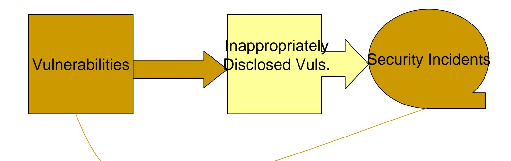
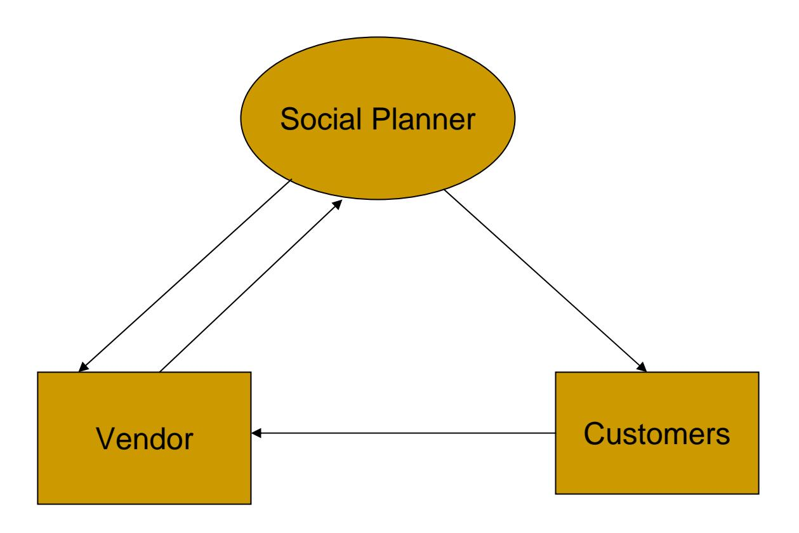
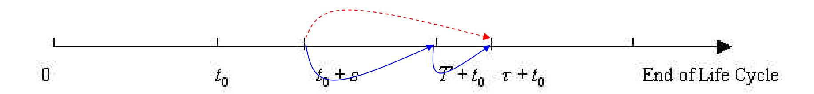
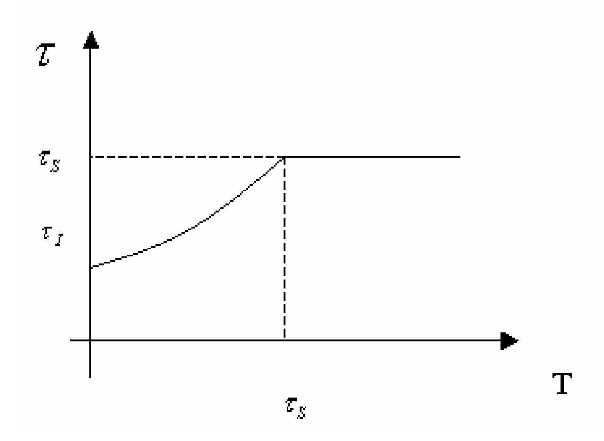
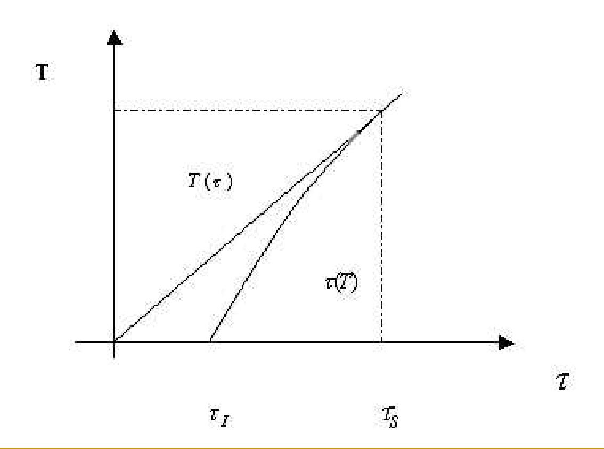
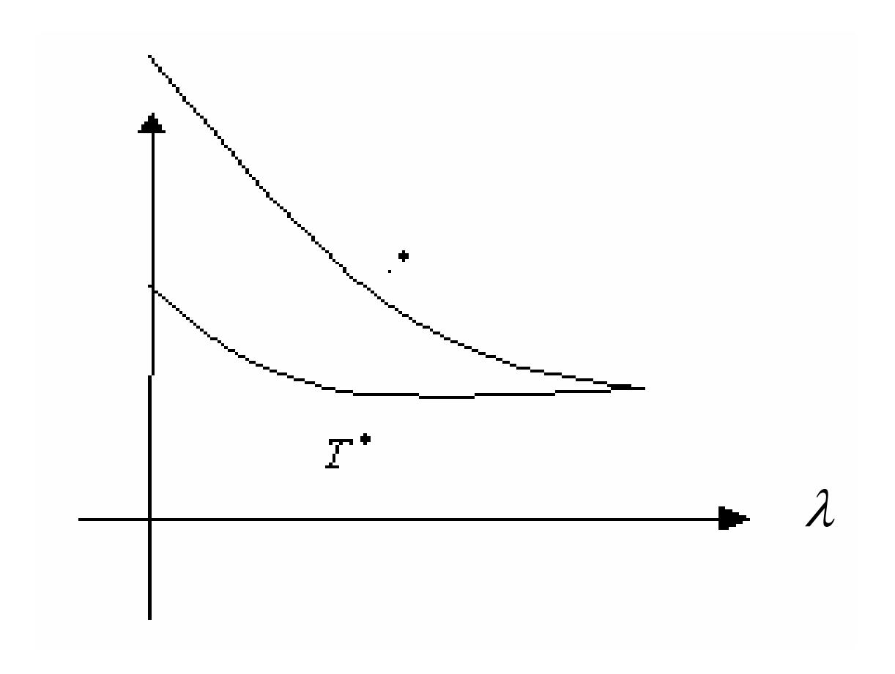
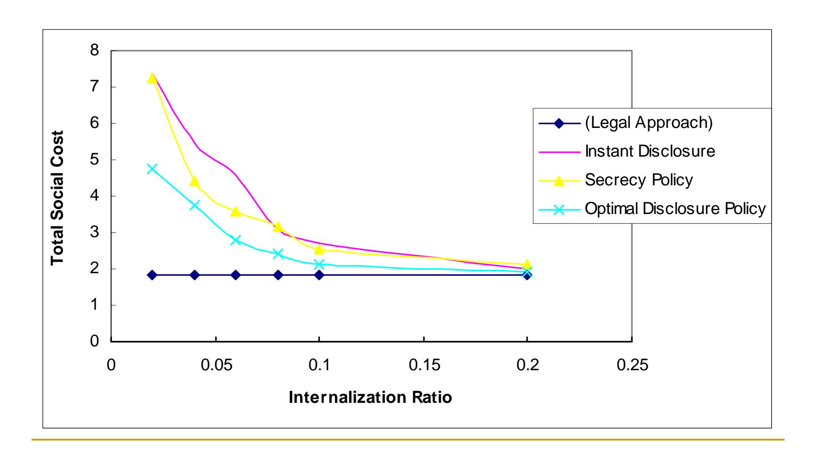

## **Optimal Policy for Software Vulnerability Disclosure**

Ashish Arora, Rahul Telang and Hao XuCarnegie Mellon University

# Facts on Cyber Security

Vulnerability disclosure has turned out to be a real and ever important policy question.

## Various Disclosure Policies

- Secrecy Policy: Non-disclosure
- Full Disclosure Policy: Instant Disclosure of Full Information
  - Increase vendor's willingness to deliver quick patch;
  - Enlarge the time window that customers are exposed to attacks.
- CERT/CC Disclosure Policy:
  - Disclosure after a secret period of 45 days

# Thinking of Economics

- Elimination of security incidents is impossible
- Better disclosure policy leads to efficient resource allocation.
- Research goal: Develop a theoretic model of optimal policy for vulnerability disclosure such that social loss is minimized

## Outline

- A basic theoretic model: social planner and vendor interaction
- Implications and policy insights
- Extensions:
  - Allow for uncertainty in patching
  - Allow diffusion of patching and quality change in patches.

# A Game-Theoretic Approach

## Vendor's Cost

 We fix *T* (secret period) first and study impact of *T*on vendor's decision.

$$V = C_P(\tau) + \lambda.\theta(\tau,T)$$
Patch-developing time Internalization Ratio

## Loss to Customers

$$\theta(\tau,T) = \begin{cases} \int_0^{\tau} D(\tau-s)dF(s:t_0), & \text{when } \tau \leq T \\ \int_0^{T} D(\tau-s)dF(s:t_0) + (1-F(T:t_0))D(\tau-T), & \text{when } \tau > T \end{cases}$$

# Insights on Vendor's Decision

- Vendor delivers patch at or later than *T (disclosure time)*;
- When vendor internalizes more customer loss, vendor delivers patch earlier;
- When social planner reduces the disclosure window (smaller *T)*, vendor delivers patch earlier.

# Insights on Vendor's Decision (Cont.)

## Social Planner's Decision

 Simultaneous Game and Stackelberg Game

## Social Cost

Social Cost:

$$S(T, x) = C_P + \theta(\tau^*, T) = C_D(\tau(T)) + \theta(\tau(T), T)$$

- When liability factor increases, T decreases;
- When discoverers find vulnerability earlier, T increases.

# Insights on Social Planner's Decision

# A Numeric Example

# Extension: Stochastic Patching Time

- Patch-developing time, as outcome of investment, may be stochastic.
- Properties derived under the deterministic assumption are well preserved.
- In anticipation to larger variation in patching time, vendor reduces mean patching time; social planner decreases *T.*

# Extension: Diffusion of Patching

- Many customers do not patch instantly, why?
  - Customers may not need to patch;
  - It takes time to diffuse patches;
  - Customers want to wait for better patch;
  - Customers lack of computer proficiency.
- Modifications
  - Customers suffer post-patching cost;
  - Vendor determines patching time and quality of patch.

# Insights

## Fixed patch quality

- vendor slows patch-developing and social planner allows more time before disclosure.
- with quicker diffusion of patching vendor delivers patch more quickly.

## Flexible quality

 vendor chooses to improve patch quality if the internalization ratio is smaller or social planner enlarges disclosure time window or the vulnerability is discovered in the early stage of software life cycle.

## Conclusions

- Vendor will release later than socially optimal.
- The optimal disclosure policy trades off some loss from the exploitation of the vulnerability from disclosure against a delay in the release of the patch.
- These results are robust to a number of extensions, but they are subject to a variety of qualifications.
- The contribution of this research is a general model that highlights the possibilities and limits of social disclosure policy.