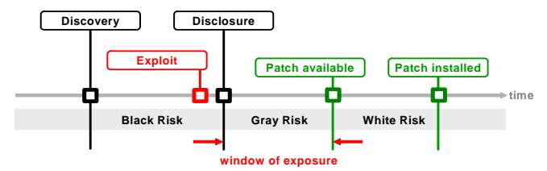
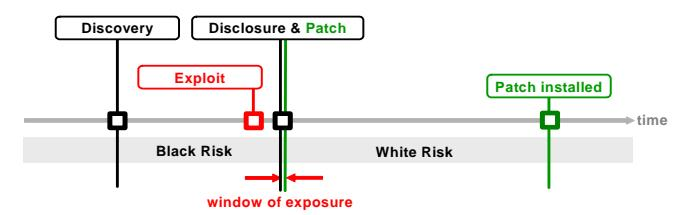
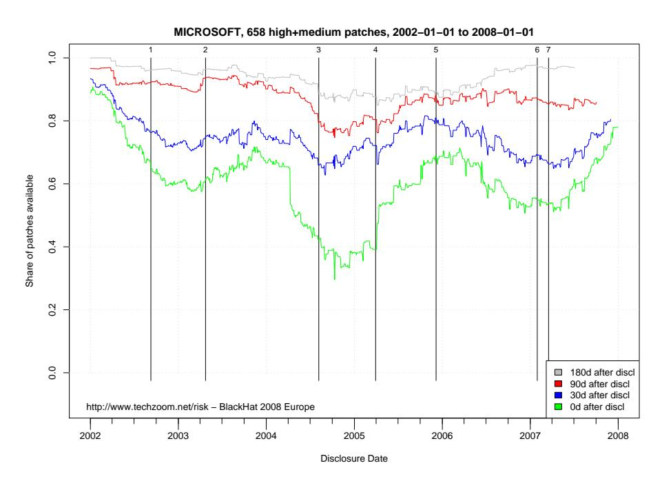
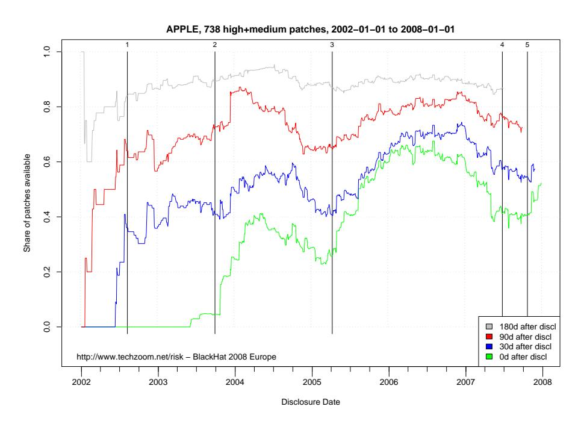
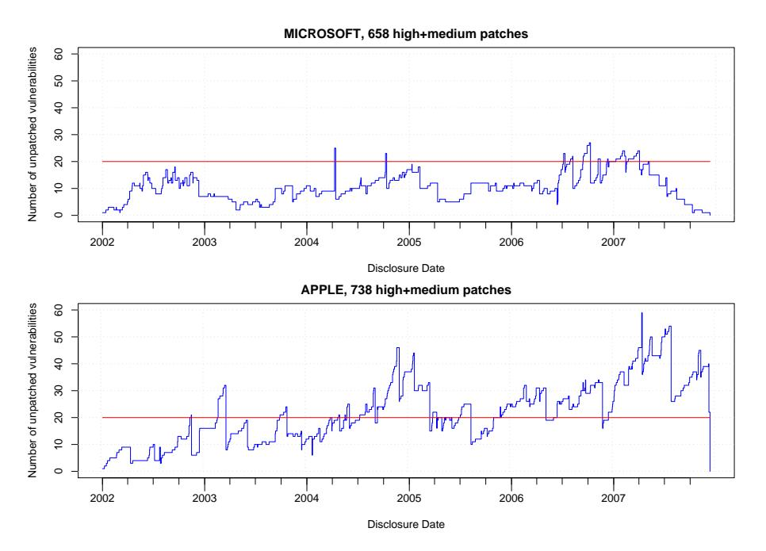

# **0-Day Patch Exposing Vendors (In)security Performance**

Stefan Frei, Bernhard Tellenbach, and Bernhard Plattner

Computer Engineering and Networks Laboratory (TIK) Swiss Federal Institute of Technology, ETH Zurich {stefan.frei, tellenbach, plattner}@tik.ee.ethz.ch http://www.techzoom.net/risk/

**Abstract.** We measure and compare the performance of the vulnerability handling and patch development process of Microsoft and Apple to better understand the security ecosystem. We introduce the 0-day patch rate as a new metric; being the number of patches a vendor is able to release at the day of the public disclosure of a new vulnerability. Using this measure we can directly compare the security performance of Microsoft and Apple over the last 6 years. We find global and vendor specific trends and measure the effectiveness of the patch development process of two major software vendors over a long period. For both vendors we find that major software development projects (such as a new OS release or Service Pack) consumes resources at the cost of patch development. Our data does not support the common belief that software from Apple is inherently more secure than software from Microsoft. While the average number of unpatched vulnerabilities has stabilized for Microsoft, Apple has bypassed Microsoft and shows an increasing trend. We provided an insight into the vulnerability lifecycle and trends in the insecurity scene based on empirical data and analysis. To properly plan, assess, and justify vulnerability management knowledge of the vulnerability ecosystem is important.

**Keywords:** security, 0-day patch, vulnerability lifecycle, vulnerability ecosystem

# **1 Introduction**

The constant discovery of new vulnerabilities and exploits drives the security risks we are exposed to. Even more, it is something like a pace-maker of the security industry since each discovery triggers actions like the development of signatures, mitigation techniques and patches. While the availability of a patch instantly after the discovery of a new vulnerability could eliminate the risk, the time required for the patch development and testing render this scenario impossible. In practice, vendors publish patches as soon as these are available or they publish them on a predefined schedule to ease the planning of patch implementation.

The timing between vulnerability disclosure, exploit- and patch availability dates is of the essence to determine the security risk exposure of software users. To better understand the security ecosystem we measure and compare the performance of the vulnerability handling and patch development process of two major software vendors, namely Microsoft and Apple. Our analysis is based on publicly available information, extending the work initiated in [1]. We analyzed the lifecycle of 27,000+ known vulnerabilities based on the information found in over 200,000 security advisories published since 1996 (Sources: IBM-ISS, SecurityFocus, Secunia, CERT, SecurityTracker, SecWatch, FrSirt). Correlating this vulnerability information with the release dates of all patches of Microsoft and Apple gives us high level insight into the patch development processes of these two vendors over a period of 6 years. We revisit the definition of the lifecycle of a vulnerability and introduce the 0-day patch rate as a new metric; being the number of patches a vendor is able to release at the day of the public disclosure of a new vulnerability. We plot and analyze the dynamics for 658 high- and medium risk vulnerabilities of Microsoft and 738 high- and medium risk vulnerabilities of Apple in the period from January 2002 to December 2007. We find a correlation with the vendor's other engagements in software development and periods where both vendors follow global trends in conjunction. Extending the 0-day patch rate by measuring the share of patches available 30-, 90-, and 180-days after the public disclosure of the vulnerability allows us to get insight into the vendors ability or willingness to produce a solution within a given timespan. Surprisingly, this performance varied considerably in the last 6 years. We then calculate the number of disclosed but unpached vulnerabilities per vendor for every day since January 2002. This metric shows considerable difference between Microsoft and Apple.

#### **1.1 Related Work**

Many authors examine the impact of Internet attacks and their risk for the industry [2,3]. The key for such analysis is most often the window of exposure, the time between the discovery of a vulnerability and the availability of a patch. In [4], Arbaugh proposes a lifecycle model for system vulnerabilities and measures the number of intrusions during this lifecycle. He evaluates the lifecycle with incident data of *three* vulnerabilities. In an empirical study [5], the authors analyzed *308 vulnerabilities* and compared the information with attacks on honeypots recorded during a period of *9 weeks* to measure vendor response to vulnerability disclosure. The influence of disclosing vulnerability information on the vendors performance in releasing a patch, is subject of many studies [6,7], however with only few empirical data. Qualys [8] measures the patch adoption rate based on data of their vulnerability scanning services. In their *"Law of vulnerabilities"*[9] they find the half-life of vulnerabilities to be 19 days on external and 62 days on internal systems. In a series of articles on washingtonpost.com [10], Brian Krebs published data showing how long it took different vendors to issue updates for security flaws.

The disclosure date of a vulnerability is key to studies of this kind. However, the disclosure date (or release date in [11]) is defined differently among papers of different authors. Without further explanation, definitions range from 'made public to wider audience' [4], 'made public through forums or by vendor' [5], 'reported by CERT or Securitfocus' [12] or 'made public by anyone before vendor releases a patch' in [13]. We use the definition of the vulnerability disclosure-date proposed in [1] as it is based on vulnerability information from different independent sources, therefore guaranteeing an unbiased view. In analogy to the term 0-day exploit [14] we are the first to introduce and define the term *0-day patch* as a measure of the security provided by software vendors.

# **2 Methodology and Data Sources**

In this section we revisit the definition of the lifecycle of a vulnerability and the associated risk exposure phases borrowing from our previous work[1]. Based on these terms we present our definition of the term *0-day patch*. We then provide details on the dataset and the sources used for the present analysis.

#### **2.1 Lifecycle of a vulnerability**

To define the term *0-day patch* we refer to the terms of the vulnerability lifecycle in Figure 1. Distinctive points in time divide the lifecycle of a vulnerability into several phases, each reflecting a state and an associate risk. To capture these states, we devise the following four points in time: the vulnerability *discovery-*, *disclosure-*, *exploit-* and *patch-time*:

#### **–** *Discovery-Time*

The time of discovery is the earliest date that a vulnerability is discovered and recognized to pose a security risk. The discovery date is not publicly known until the public disclosure of the respective vulnerability.

- **–** *Exploit-Time*
  - The time of exploit is the earliest date an exploit for a vulnerability is available. We qualify any hacker-tool, virus, data, or sequence of commands that take advantage of a vulnerability as an exploit.
- **–** *Disclosure-Time*

For a typical enterprise or Internet user, it is not feasible to read all security related mailing lists and underground sources to identify new threats to their software. Businesses must concentrate and excel on their core competency, which is not necessarily information security. Therefore, the identification of new vulnerabilities is left to specialists that provide the necessary information in a structured format. This is the reason why we define the time of disclosure as the first date a vulnerability is described on a channel where the disclosed information on the vulnerability is (a) freely available to the public, (b) published by trusted and independent channel and (c) has undergone analysis by experts such that risk rating information is included.

**–** *Patch-Time*

The time of patch availability is the earliest date the vendor or the originator of the software releases a fix, workaround, or a patch that provides protection against the exploitation of the vulnerability. Fixes and patches offered by third parties are not considered as a patch. A patch can be as simple as the instruction from the vendor for certain configuration changes. Note that the availability of other security mechanisms such as signatures for intrusion prevention systems or anti-virus tools are not considered as a patch in this analysis. Unfortunately, the availability of patches usually lags behind the disclosure of a vulnerability. The patch information used in this paper was extracted from security bulletins of vendors and software writers. Often, this information had to be manually correlated to the corresponding vulnerabilities.

**Fig. 1.** Lifecycle of a vulnerability - Distinctive points in time divide the lifecycle of a vulnerability into several phases, each reflecting a state and an associate risk exposure. To capture these states, we devise the following five points in time: the vulnerability *discovery-*, *disclosure-*, *exploit-*, *patch-availability* and *patch-installed* date. Color plots are available online [15].

**Fig. 2.** A 0-day patch is a patch where the vulnerability is disclosed at the same day the patch is released by the vendor. The associated risk exposure, the *Gray Risk* is 0 days. Note that the time between exploit-availability and the public disclosure of the vulnerability is very small, as several security information providers monitor the insecurity scene effectively: a new exploit in the wild leads almost instantly to a security-advisory. Color plots are available online [15].

Note that the sequence of the exploit, disclosure, and patch time is not fixed. Both, the exploit- and the patch-time can be before, at, or after the discovery time. However, the discovery time is always the first of all these times. Furthermore, it is important to note that we define the disclosure of a vulnerability as the earliest time that the public can systematically take notice of the new threat.

#### **2.2 Risk exposure phases**

The different points in time of the vulnerability lifecycle in Figure 1 allow to distinguish different risk exposure phases. Between discovery and patch implementation, the user of the vulnerable software is always at risk. The different risk exposure phases are: *Black Risk*, the *Gray Risk*, and the *White Risk* phase. Empirical data on these periods can be found in [1].

#### **–** *Black Risk* (exogenous)

During the time from discovery to disclosure, only a closed group is aware of the vulnerability. This group could be anyone from hackers to organized crime tempted to misuse this knowledge. On the other hand, it could be researchers and vendors working together to provide a fix for the identified vulnerability. We call the risk exposure arising from this period the Black Risk because the vulnerability is known to have a security impact whereas the public has no access to this knowledge.

# **–** *Gray Risk* (exogenous)

During the time from disclosure to patch the user of the software waits for the vendor to issue a patch. We call the risk exposure arising from this period the Gray Risk because the public is aware of this risk but has not yet received remediation from the software vendor/originator. However, through the information provided in the disclosure of the vulnerability the organization can assess the individual risk and might implement a workaround until a patch is available. In this paper we analyze the *Grey Risk* for all vulnerabilities patched by Microsoft and Apple from January 2002 to December 2007.

**–** *White Risk* (endogenous)

The time from patch availability to patch implementation. The duration of this period is under direct control of the user of the software. In organizations this period is determined by the vulnerability management processes.

Note that *Black-*, and *Gray-Risk* are exogenous phases: the user of the software has no influence on the duration of these periods. However, the *White Risk* is under control of the user, the duration of this phase is determined by his vulnerability management process.

#### **2.3 0-Day Patch Defined**

Based on the definition of the lifecycle of a vulnerability and the related exposure phases, we define a *0-day patch* to be any patch where the vulnerability is disclosed at the same day the patch is released. In other words, for a *0-day patch* the *Gray Risk* period is 0 days, as shown in Figure 2. Note that prior to having a patch ready, the vendor needs time to analyze the vulnerability and develop, test, document, and finally release the patch. Thus, to ever achieve a *0-day Grey Risk* period the vendor imperatively needs prior information about the vulnerability. This is archived though the *responsible vulnerability disclosure process* where the researcher who discovered the vulnerability chooses to collaborate with the vendor on the issue. Hence measuring the 0-day patch rate for a specific vendor is a viable metric of the *responsible vulnerability disclosure* process. Note that this indicator rewards vendors that cooperate well with the security community, e.g., by setting up processes and policies that foster coordinated disclosures.

Factors that favor the responsible vulnerability disclosure process:

- **–** Well documented and published security processes, especially vulnerability handling processes
- **–** Good track record of treating vulnerability researchers fairly

- **–** Referencing the discoverer of the vulnerability in the patch advisory Factors that inhibit the responsible vulnerability disclosure process:
- **–** No or misleading documentation of security processes
- **–** Threats against researchers
- **–** Denial of vulnerabilities

### **2.4 Vulnerability Database**

Our research is based on publicly available vulnerability information from various sources from which we extract the vulnerability lifecycle dates: *discovery-*, *disclosure-*, *exploit-* and *patch-date*. As there is no single source to provide this kind of information, the difficulty of this task is to

- **–** identify suitable sources
- **–** collect the available information
- **–** correlate the information in a concise manner.

We started by analyzing the content of two publicly available vulnerability databases, namely the OSVDB [16] and the NVD [17]. For this research, we only consider vulnerabilities with a CVE [18] entry. CVE stands for *Common Vulnerabilities and Exposures* which is a list of standardized names for vulnerabilities and information security exposures. A CVE-number provides a standardized identifier for known vulnerabilities. Evaluating the suitability of the content of the OSVDB and NVD for our purpose, we found considerable differences in the lifecycle information they contain. Neither database contains patch dates; and only OSVDB provides exploit dates. However, both databases provide a comprehensive list of external references for each vulnerability. Based on the superset of external references from the NVD and the OS-VDB, we downloaded and analyzed over 200,000+ advisories from different sources. This data is correlated with the information in our database through the CVE entry or through the links given in the respective advisories.

Table 1 shows the different data sources along with the number of advisories and the number of unique CVEs they referenced. Additionally, our parser retrieved specific dates of the vulnerability lifecycle from the raw data of the spidered advisories. The rows *DiscoDat*, *ExploDat*, *DisclDat*, and *PatchDat* in Table 1 give the number of dates the parser retrieved from the respective data source. The type of source determines the type of information that can be retrieved from it, e.g. from *Milw0rm* we get exploit-dates while *Secunia* provides disclosure-dates. The last row *PatchDat* indicates the number of patches associated with the advisories of Microsoft, Apple, Oracle and RedHat. Note that the number of patches is smaller than the number of CVEs in the advisories. This is because a single patch can contain fixes for multiple vulnerabilities.

### **2.5 Data Selection Criteria**

For the analysis presented in this paper we use a subset of the information of our vulnerability database:

| Source                |       | CVEs Advisories DiscoDat ExploDat DisclDat PatchDat |      |       |       |      |
|-----------------------|-------|-----------------------------------------------------|------|-------|-------|------|
| microsoft.com         | 992   | 611                                                 |      |       |       | 611  |
| frsirt.com            | 10771 | 10120                                               |      |       | 10120 |      |
| iss.net               | 27595 | 36483                                               |      |       | 32048 |      |
| secunia.com           | 16246 | 21131                                               |      |       | 21131 |      |
| secwatch.org          | 5238  | 13940                                               |      |       | 10903 |      |
| securitytracker.com   | 8233  | 12083                                               |      | 6075  | 12082 |      |
| apple.com             | 820   | 101                                                 |      |       |       | 101  |
| oracle.com            | 335   | 33                                                  |      |       |       | 33   |
| nvd.gov               | 28464 | 28464                                               |      |       | 28357 |      |
| cert.org              | 2246  | 2380                                                | 5    |       | 2377  |      |
| securityfocus.com     | 21573 | 24789                                               |      |       | 24698 |      |
| mitre.org             | 26053 | 29797                                               |      |       |       |      |
| zerodayinitiative.com | 120   | 136                                                 | 136  |       | 136   |      |
| idefense.com          | 570   | 567                                                 | 509  | 7     | 559   |      |
| milw0rm.com           | 1872  | 2279                                                |      | 2056  |       |      |
| redhat.com            | 1678  | 1160                                                |      |       |       | 1139 |
| osvdb.org             | 24996 | 38908                                               | 3487 | 13482 | 38416 |      |
| mozilla.org           | 238   | 186                                                 |      |       |       | 126  |
| adobe.com             | 65    | 132                                                 |      |       |       | 132  |

**Table 1.** Summarized view of the content of the vulnerability database used for this research. The table lists the number of advisories and unique CVEs found by source. *DiscoDat*, *ExploDat*, *DisclDat*, and *PatchDat* give the number of vulnerability *discovery*, *disclosure*, *exploit*, and *patch* availability dates by source. These dates were extracted from the original advisory. Content: All vulnerabilities up to December 2007.

### 1. *Observation Period*

To analyze the patch performance of Microsoft and Apple we look at the period from January 2002 to January 2008. Information on vulnerabilities published (and patches released) before January 2002 is very sparse, especially for Apple.

### 2. *Selection of vulnerabilities*

We only use data related to vulnerabilities which we could positively attribute to a vendor. Surprisingly, linking a vulnerability to a vendor is a non trivial task when done on large scale. Measuring the performance of a vendors' patching process we are only interested in vulnerabilities the specific vendor is responsible to produce a patch for. This excludes vulnerabilities of third-party tools, software, and libraries that might be included in Microsoft or Apple products. We therefore limit this analysis to vulnerabilities for which they have published a patch because this indicates that they felt responsible for doing so. Every attempt to broaden the number of vulnerabilities would introduce a bias (a) when deciding if a certain vulnerability should be attributed to a vendor; and (b) if the severity/risk of the vulnerability justifies inclusion into the analysis. If a vendor releases a patch for a vulnerability he has positively and unmistakenly taken responsibility for it, with respect to the origin of the vulnerability and the security impact.

#### 3. *Risk level of the vulnerability*

We only include *high-*, and *medium-risk* vulnerabilities. This restriction is introduced because low risk vulnerabilities have a disproportionate or even dominating impact on our statistics. Since their relevance for the overall security performance of a vendor is small and because the amount of patched low risk vulnerabilities is small too (see Table 2), this restriction appears to be reasonable. Note that we use the national vulnerability database (NVD) information to determine the risk rating of a vulnerability. This decision is mainly due to the fact that the NVD is vendor independent.

| Risk   | Microsoft Apple |     |
|--------|-----------------|-----|
| high   | 425             | 365 |
| medium | 233             | 373 |
| low    | 20              | 72  |
| Total  | 678             | 810 |

**Table 2.** Number of CVEs per vendor from Januar 2002 to December 2007 and risk level for which a patch is available. The national vulnerability database (NVD) serves as source for the risk level.

|       | Year Microsoft Apple |     |
|-------|----------------------|-----|
| 2002  | 145                  | 54  |
| 2003  | 81                   | 68  |
| 2004  | 89                   | 133 |
| 2005  | 80                   | 165 |
| 2006  | 165                  | 175 |
| 2007  | 118                  | 220 |
| Total | 678                  | 815 |

**Table 3.** Number of patches released by Microsoft and Apple from 2002 to 2007.

# **3 Analysis**

# **3.1 Patch Performance Metrics**

For our analysis, we consider two different metrics and apply them on a per vendor basis. The first metric is the ratio of vulnerabilities patched within x days of the public disclosure of a vulnerability. For x = 0 this is the 0-day patch rate introduced in Section 2.3. This is an indicator of the vendors performance in keeping the window of exposure small for users of its software.

We plot this metric in Figures 3 and 4 using a sliding window approach with a window size equal to 360 days and step size equal to one day. For every day from January 2002 to December 2007 we count the number of high- and medium-risk vulnerabilities disclosed in the last 360 days of that day. From this set of vulnerabilities we count the number of patches released within x = 0, 30, 90 and 180 days of the disclosure of the vulnerability. Note that the curve of lower values for x are included in the curve for higher values of x (e.g: a vulnerability patched at day 0 is included in the curve showing vulnerabilities patched no later than 30 days after the disclosure).

The second metric is the cumulated number of unpatched vulnerabilities over time as shown in Figure 5. For the chosen vendor we add (+1) at the date of the public disclosure of a new vulnerability and subtract (-1) at the date the vendor releases a patch. Using this metric, values above 0 depict the number of unpatched (thus pending) vulnerabilities at any given date in the selected observation period. We used all vulnerabilities disclosed in the given period that where patched by the chosen vendor no later than December 2007. Therefore, the this metric starts and ends a level 0 for the observation period from Jan 2002 to December 2007.

### **3.2 0-Day Patch: Microsoft**

In Figure 3 we plot the 0-day patch rate for all high-, and medium-risk vulnerabilities Microsoft released a patch for in the period from January 2002 to December 2007. The lowest curve shows the share of patches that were available x days after the disclosure of the vulnerability. The next higher curves show the share of patches available no later than 30, 90, and 180 of the disclosure time. The vertical lines labeled from 1 to 6 depict the release of major projects of Microsoft, as listed in Table 4.

### **Observation**

- **–** Very high dynamics of 0-day patch rate between 30% and 90% within the last 6 years (high volatility of the curves).
- **–** The difference between 0-day and 30-day curves is an estimator of the vendors ability to release a patch within 30 days. This difference varies between 3% and 30%.
- **–** Patch development performance does not correlate with absolute number of released patches as of Table 3. E.g., despite the increase in the number of vulnerabilities, the patch development performance of Microsoft in 2007 is comparable to those in 2003.
- **–** We find the share of unpatched vulnerabilities 180 days after disclosure to be within 0% and 15%.
- **–** We find that the patch development performance shows striking correlation with major software releases of Microsoft. E.g., it appears that the parallel development of Windows XP SP2 and Windows Server 2003 SP1 have absorbed considerable resources at the cost of patch development. In general, a major software release seems to have positive impact on the 0-day patch rate in the following months.

**Fig. 3.** Microsoft patch performance analysis of 658 vulnerabilities disclosed and patched between January 2002 and December 2007. We plot the share of patches available at 0-, 30-, 90-, and 180-days after the public disclosure of the vulnerability. E.g. the blue curve (30-days) plots for how many vulnerabilities Microsoft had a patch ready no later than 30 days after the public disclosure of the vulnerability. The share is calculated counting vulnerabilities in a 360 day sliding window. Vertical lines depict the release date of major software projects of Microsoft (see Table 4). Color plots are available online [15].

| ID | Date                  | Event                        |
|----|-----------------------|------------------------------|
|    |                       | 1 2002-09-09 WinXP SP1       |
|    |                       | 2 2003-04-24 WinSrv 2003     |
|    |                       | 3 2004-08-06 WinXP SP2       |
|    |                       | 4 2005-03-30 WinSrv 2003 SP1 |
|    |                       | 5 2005-12-05 WinSrv 2003 R2  |
|    | 6 2007-01-30 WinVista |                              |
|    |                       | 7 2007-03-13 WinSrv 2003 SP2 |

**Table 4.** Major software releases by Microsoft

#### **3.3 0-Day Patch: Apple**

In Figure 4 we plot the 0-day patch rate for all high-, and medium-risk vulnerabilities Apple released a patch for in the period from January 2002 to December 2007. The lowest curve shows the share of patches that were available x days after the disclosure of the vulnerability. The next higher curves show the share of patches available no later than 30, 90, and 180 of the disclosure time. The vertical lines labeled from 1 to 6 depict the release of major projects of Microsoft, as listed in Table 4.

**Fig. 4.** Apple patch performance analysis of 738 vulnerabilities disclosed and patched between January 2002 and December 2007. We plot the share of patches available at 0-, 30-, 90-, and 180 days after the public disclosure of the vulnerability. E.g. the blue curve (30-days) plots for how many vulnerabilities Apple had a patch ready no later than 30 days after the public disclosure of the vulnerability. The share is calculated counting vulnerabilities in a 360 day sliding window. Vertical lines depict the release date of major software projects of Apple, as shown in Table 5. Color plots are available online [15].

# **Observation**

- **–** No 0-day patching until mid 2003.
- **–** Very high dynamics of 0-day patch rate between 0% and 65% within the last 6 years ( high volatility of the curves ).
- **–** The difference between 0-day and 30-day curves is an estimator of the vendors ability to release a patch within 30 days. This difference varies between 0% and 45%.

- **–** Patch development performance does not correlate with absolute number of released patches as of Table 3. The monotonic increase in the number of vulnerabilities per year, is not reflected in the 0-day patch performance.
- **–** We find the share of unpatched vulnerabilities 180 days after disclosure to be about 10% since 2003.
- **–** We find that the patch development performance shows striking correlation with major software releases of Apple. E.g., it appears that the development of OS X 10.4 Tiger has absorbed considerable resources at the cost of patch development. In general, a major software release seems to have positive impact on the 0-day patch rate in the following months.

| ID | Date                | Event                          |
|----|---------------------|--------------------------------|
|    |                     | 1 2002-08-13 OS X 10.2 Jaguar  |
|    |                     | 2 2003-10-03 OS X 10.3 Panther |
|    |                     | 3 2005-04-12 OS X 10.4 Tiger   |
|    | 4 2007-06-29 iPhone |                                |
|    |                     | 5 2007-10-26 OS X 10.5 Leopard |

**Table 5.** Major software releases by Apple. Source [19].

### **3.4 Unpatched Vulnerabilities Exposure**

In Figure 5 we plot the cumulated number of unpatched vulnerabilities for Microsoft and Apple in the period of January 2002 to December 2007. At any given date, we add (+1) for the public disclosure of a vulnerability and subtract (-1) for the release of a patch by the vendor. As we only include vulnerabilities in this analysis that were patched no later than December 2007, the vendors' curve starts and ends at zero. Timely release of patches for disclosed vulnerabilities will lead to low values of the cumulated number of unpached vulnerabilities.

# **Observation**

- **–** The total number of unpatched vulnerabilities at any day within the observation period varies between 0 and 22 for Microsoft and between 0 and 55 for Apple.
- **–** Both plots show similar dependency on major software releases as the patch development performance plots.
- **–** The average number of concurrent unpatched vulnerabilities stays well below 20 for Microsoft while Apple shows an persistent increase with absolute numbers exceeding 20 since 2006.
- **–** The total number of unpatched vulnerabilities increases between 2004 an 2005 for both, Microsoft and Apple. In the same period of time, the 0-day patch rate decreases significantly for both vendors.

**Fig. 5.** Unpatched vulnerability exposure plot for Microsoft and Apple. At any given date, add (+1) for a public disclosure of a vulnerability and subtract (-1) for the release of a patch from the vendors' curve. Values above 0 depict the number of unpatched (thus pending) vulnerabilities at any given date for the period from January 2002 to December 2007. We used all vulnerabilities disclosed in the given period that where patched no later than December 2007. Therefore, the plot starts and ends a level 0. This plot includes 658 (738) vulnerabilities from Microsoft (Apple). Color plots are available online [15].

# **4 Discussion**

In this section, we discuss possible explanations for the vulnerability and patch dynamics observed in our analysis.

**–** To archive a high 0-day patch rate requires a vendor to receive ahead notification of vulnerabilities affecting his products. A sustainable way to achieved this is a cooperative relationship with the security community. Independent researchers will only collaborate with a vendor when they are being treated fairly and when their efforts are honored in the security advisory of the patch release. Apple only exceeded a 20% 0-day patch rate starting 2004 while Microsoft is well above that rate since the beginning of our observation on January 2002. It so appears that Microsoft is ahead of Apple with respect to their vulnerability handling processes and the relation to the security community. Apple seams to have started implementing vulnerability handling processes only after 2003.

- **–** The parallel drop in patching performance of both vendors in the period 2004 to 2005 can be interpreted as the effect of vendor independent, exogenous factors. Possible reasons (among others) are the availability of new hacker/security tools and techniques (e.g. like fuzzing) or changes in the methodology of software development processes (e.g. better security testing will reveal more vulnerabilities).
- **–** Today, information technology has become a backbone of our industry and everyday life. We observed two major software vendors over the past 6 years and found surprisingly high dynamics in their performance to release security patches for the protection of their customers. It seams that our global inter-networked economy is still in an early stage of development (such as aviation about 100 years ago). New processes, best practices and methodologies are still being introduced and existing procedures are refined on an industry wide level. The security processes in the software industry are in their infancy and still evolving.
- **–** The rate of the release of new patches is correlated with the vendor's effort to release major products or service packs. Both vendors show a decreased performance of patch releases in the month before the release. Extensive new software development projects go at the cost of the development of security patches.
- **–** Comparing the number of unpatched vulnerabilities per vendor for the period since January 2002 we observe a striking difference between Microsoft and Apple. On average, Microsoft succeeds to keep the average number of unpatched vulnerabilities below 20 at a steady number. On the opposite, Apple seems unable to stabilize the number of unpatched vulnerabilities in recent years. We observe a steady increase in recent years for Apple. It seams that Apples security processes and resources cannot cope with the side-effects of the increased popularity of their products.

# **5 Conclusions**

In this paper, we evaluated the patch development process of Microsoft and Apple using publicly available vulnerability data from 2002 to 2007. By correlating information from multiple sources, we antagonized possible bias in vendor information. Our analysis of the 0-day patch performance and the number of concurrently unpatched vulnerabilities covered 658 high- and medium risk vulnerabilities of Microsoft and 738 of Apple. We showed that the evolution of the 0-day patch rate gives an interesting insight in the security performance of the vendor. We demonstrate that the rate of new patches is strongly correlated with the vendors effort to release major products or service packs. In addition, our analysis of the rate of patches available 30, 90 and 180 days after the vulnerability disclosure exposed the vendors ability to develop a patch within a given timespan. Furthermore, we revealed a considerable difference between Microsoft and Apple regarding to the number of concurrently unpatched vulnerabilities.

*Future Work*: In a first step, we plan to extend this kind of analysis to other vendors and to vendor independent product categories while we continue the monitoring of the security industry and constantly update our vulnerability database. However, our ultimate goal is to study the implications and applications of these findings to security ecosystem and risk analysis models.

# **References**

- 1. Frei, S., May, S., Fiedler, U., Plattner, B.: Large-scale vulnerability analysis. In: LSAD '06: Proceedings of the 2006 SIGCOMM workshop on Large-scale attack defense, New York, NY, USA, ACM (2006) 131–138
- 2. Anderson, R.: Why information security is hard-an economic perspective. In: ACSAC '01: Proceedings of the 17th Annual Computer Security Applications Conference, Washington, DC, USA, IEEE Computer Society (2001) 358
- 3. Schneier, B.: Cryptogram September 2000 full disclosure and the window of exposure. http://www.schneier.com/crypto-gram-0009.html (2000)
- 4. Arbaugh, W.A.; Fithen, W.M.J.: Windows of vulnerability: a case study analysis. Computer **33** (Dec 2000) 52–59
- 5. Ashish Arora, Ramayya Krishnan, A.N.R.T., Yang, Y.: Impact of vulnerability disclosure and patch availability - empirical analysis. In: Proceedings of the Third Annual Workshop on Economics and Information Security (WEIS04). (2004)
- 6. Hasan Cavusoglu, H.C., Raghunathan, S.: Emerging issues in responsible vulnerability disclosure. In: WITS. (2004)
- 7. Kannan, K., Telang, R.: An economic analysis of market for software vulnerabilities. In: Proceedings of the Third Annual Workshop on Economics and Information Security (WEIS04). (2004)
- 8. Qualys: Vulnerability Scanning. (http://www.qualys.com)
- 9. Qualys Research Report: Laws of Vulnerabilities. (http://www.qualys.com/docs/ Laws-Report.pdf)
- 10. Krebs, B.: Securityfix i, ii, iii. http://blog.washingtonpost.com/securityfix (2006)
- 11. Organization for Internet Safety: Guidelines for security vulnerability reporting and response. http://www.oisafety.org/guidelines (2000)
- 12. Ashish Arora, Ramayya Krishnan, R.T., Yang, Y.: An empirical analysis of vendor response to disclosure policy. Technical report, Carnegie Mellon University (2005)
- 13. Ashish Arora, Ramayya Krishnan, R.T., Yang, Y.: Empirical analysis of software vendors patching behavior, impact of vulnerability disclosure. Technical report, Carnegie Mellon University (2006)
- 14. Levy, E.: Approaching zero. IEEE Security and Privacy **2** (2004) 65–66
- 15. Frei, S., Tellenbach B., Plattner B.: Online repository of plots. (http://www. techzoom.net/publications)
- 16. OSVDB: Open Source Vulnerability Database (OSVDB). (http://www.osvdb.org)
- 17. NVD: National Vulnerability Database (NVD). (http://nvd.nist.gov)
- 18. Mitre: CVE Common Vulnerabilities and Exposures (CVE). (http://cve.mitre.org)
- 19. Wikipedia: Mac OS X release dates. (http://de.wikipedia.org/wiki/Mac\_ OS\_X)