# **Network Security Risk Analysis using Improved MulVAL Bayesian Attack Graphs**

Jaka Sembiring, Mufti Ramadhan, Yudi S. Gondokaryono, and Arry A. Arman

School of Electrical Engineering and Informatics, Institut Teknologi Bandung

*Abstract:* This paper presents some improvements on the Multihost Multistage Vulnerability Analysis (MulVAL) framework. MulVAL is a framework to generate an attack graph for analysis of a computer network security risk. In MulVAL, it is assumed that the probability of success in exploiting the machine configuration and vulnerability variable is 100%, and the vulnerability variables are independent of each other. In reality each machine has its own security configuration issue, and vulnerabilities are not independent of each other. Moreover the research in MulVAL attack graph solely focuses on the probability of vulnerability, whereas the probability of vulnerability in security configuration is not covered. In this paper we introduce three methods to improve the MulVAL framework. In the first method we employ Common Vulnerability Scoring System (CVSS) for calculating the probability of vulnerability variables, and Common Configuration Scoring System (CCSS) for calculating the probability of vulnerability of system security configuration. In the second method we introduce the interdependence of vulnerability variables in Bayesian senses. Finally, in the third method we analyze the impact of the change in system security configuration to the probability of vulnerability in the context of Bayesian probability. We analyze and discuss the proposed methods through a simulation for a simple network configuration. The simulation results of the proposed methods demonstrate that the introduction of CVSS, CCSS, employing dependency of vulnerability variables and system security configuration represent a more realistic model for vulnerability in MulVAL framework.

*Keywords:* Attack graph, Bayesian Network, CCSS, CVSS, MulVAL, Network security

## **1. Introduction**

Organization risk management is a complex and holistic process involving a lot of activities and organizational functions such as programs, investment, budgeting, legal issues, or securities [1]. One of important element in organization risk management is information security risk management [2]. It is understood that computer network security is a crucial part in the context of information security. There are many attempts to breach a network security through vulnerability in the network. The attacker will gain access to the computer network by exploiting this vulnerability. Therefore we need to analyze the pattern of attack so that we can provide the procedure to prevent the attack. A well-known technique for analyzing the computer network attack is attack graph. It graphically describes the path the attacker taken to access the network through vulnerability of the network [3-6]. A commonly used framework to generate an attack graph is Multihost Multistage Vulnerability Analysis (MulVAL) [7]. The attack graph generated by MulVAL has several variables i.e. attack step, privilege, machine configuration, and vulnerability, where each variable has a chance to be exploited [8]. Machine configuration and vulnerability will influence the attack step variables whereas the attack step variables will influence the privilege variables. In MulVAL, it is assumed that the probability of success in exploiting the machine configuration and vulnerability variable is 100%, and the vulnerability variables are independent of each other. In reality each machine has its own security configuration issue [9], and vulnerabilities are not independent of each other [10-14]. Moreover until recently the research in attack graph only considers the probability of vulnerability, whereas the impact of security system configuration is not covered.

Received: March 19th, 2015. Accepted: December 16th, 2015

DOI: 10.15676/ijeei.2015.7.4.15

This paper introduces three methods to improve MulVAL framework. In the first method, we introduce the Common Vulnerability Scoring System (CVSS) [15-16], and Common Configuration Scoring System (CCSS) [9] to improve the accuracy of representation of the probability of vulnerability. The CVSS is used as a standard to calculate the impact of vulnerability and the CCSS is used to calculate the probability of vulnerability of software security configuration. By introducing this method, it is possible to improve the accuracy of the probability of vulnerability of the parameters originally produced by MulVAL framework. In the second proposed method, we address the dependency of vulnerability variables, which is not covered in the original MulVAL framework. This method is used to describe the condition where a certain vulnerability influences other vulnerability in Bayesian senses. And finally the third proposed method is related to the change in the probability of vulnerabilty variables as a consequence of change in system security configuration in the context of Bayesian probability, which is also not included in the original MulVAL framework. The simulation results of the proposed method for a simple network configuration will be given for analysis and discussion.

## **2. Related Works**

Attack graph is a model for analyzing security of a network by modeling the way attackers combine and exploit vulnerabilities in a network to achieve their attack goals. This model represents the state of systems using a set of variables such as the existence of vulnerabilities in the system, or connectivity between multiple machines. Attack graph displays the path of attack carried by attackers to achieve its objectives, in other words it illustrates how an attack could occur by exploiting existing vulnerabilities and configuration of systems [3-6][11-14].

MulVAL framework is used to generate attack graph [7]. It is a network security analyzer based on data log. The data log collects variety of information on vulnerability of servers, file servers, web servers and clients, such as machine configuration, server configuration, and other relevant information. MulVAL using this data log to produce attack graph in the form of text data and logical graph, which can be used to analyze how an attack occurs in a network. The main idea behind MulVAL is that almost all information on system configuration can be represented with data log, and almost all attack technique and operating system security can be confirmed using data log rule. Data log consists of information on vulnerability database supported by bug-reporting communities, information on machine and network configuration, and other relevance information. Attack graph generated by MulVAL consists of several nodes that form the attack path. There are three types of nodes in MulVAL i.e.: LEAF node for configuration node, OR node for privilege node, and AND node for attack step. In MulVAL it is assumed that the attacker will always succeed in exploiting the LEAF node with probability 1.0. Our first method try to overcome this unrealistic scenario by employing CVSS and CCSS to improve the accuracy of probability of vulnerability. Moreover in MulVAL framework it is assumed that vulnerability variables are independent of each other, so that the calculation of probability of attack will exclude the dependency of variables. Other research results have shown that each machine has its own security configuration issue [9], and vulnerabilities are not independent of each other [10-14]. To capture vulnerability dependence several attempts has been proposed such as the works on network security based on probability concept using Bayesian attack graph [13] or dynamic Bayesian network [12], where their attack graph is based on probability metrics. In this paper we employ these ideas of probability dependence to improve the MulVAL framework, so that the attack graph generated by the framework will be more realistic in representing the attack path in a network computer.

## **3. Probabilistic Based MulVAL Framework**

It has been mentioned in the previous section that we propose three methods for improving the MulVAL framework. The first method is on how to employ the CVSS and CCSS to improve the accuracy of probability of vulnerability. The CVSS is used to calculate the probability of vulnerability variables and the CCSS to calculate the probability of vulnerability of system security configuration. The metric value of CVSS and CCSS consist of base metric, temporal metric and environmental metric [9][15-16]. In this paper we concentrate on the base metric as a representation of vulnerabilities that are constant in time. The base metrics consist of six measurement metrics, i.e.: the Access Vector AV, the Access Complexity AC, the Authentication Au, the Confidentiality C, the Integrity I, and the Availability A. The values of each metrics can be seen in table 1, with detail descriptions can be seen in [15-16].

Table 1. The base metrics values and descriptions

| Metric                    | Metric Symbol | Metric Value         | Short Description                                                                                          |  |  |  |
|---------------------------|------------------|-------------------------|------------------------------------------------------------------------------------------------------------|--|--|--|
| Access Vector             | AV               | Local (L)               | Vulnerability is exploitable only with local access                                                        |  |  |  |
|                           |                  | Adjacent Network (A) | Vulnerability is exploitable with adjacent netowork access                                                 |  |  |  |
|                           |                  | Network (N)             | Vulnerable software is bound to the network stack                                                          |  |  |  |
| Access Complexity      | AC               | High (H)                | Specialized access condition exist such as the attackers have previleges                                   |  |  |  |
|                           |                  | Medium (M)              | The access condition are somewhat specialized such as the attacking party is limited to a group of systems |  |  |  |
|                           |                  | Low (L)                 | Specialized access does not exist                                                                          |  |  |  |
| Authentication            | Au               | Multiple (M)            | The attackers are required to authenticate two or more times                                               |  |  |  |
|                           |                  | Single (S)              | One instance of authentication is required                                                                 |  |  |  |
|                           |                  | None (N)                | No authentication is required to exploit vulnerability                                                     |  |  |  |
| Confidentiality Impact | С                | None (N)                | No impact to the confidentiality of the system                                                             |  |  |  |
|                           |                  | Partial (P)             | There is considerable informational disclosure                                                             |  |  |  |
|                           |                  | Complete (C)            | Total information disclosure, resulting all system files being revealed                                    |  |  |  |
| Integrity Impact          | I                | None (N)                | No impact on the integrity of the system                                                                   |  |  |  |
|                           |                  | Partial (P)             | Modification of some system file or information is possible                                                |  |  |  |
|                           |                  | Complete (C)            | Total compromise of system integrity                                                                       |  |  |  |
| Availability Impact    | A                | None (N)                | No impact on the availability of system                                                                    |  |  |  |
|                           |                  | Partial (P)             | Reduced performance or interruptions in resources availability                                             |  |  |  |
|                           |                  | Complete (C)            | Total shutdown of the affected resources                                                                   |  |  |  |

Based on the metrics, one can defined the base vector as:

(AV:[L,A,N]/AC:[H,M,L]/Au:[M,S,N]/C:[N,P,C]/I:[N,P,C]/A:[N,P,C])

Each metric in the vectors consist of the abbreviated metrics name, followed by a ":" (colon), and the abbreviated metric values. The "/" (slash) is used to separete the metrics. The scoring and algorithm for the base metric, which are adapted from the formula version 2.10 discussed and tested in the CVSS-Special Interest Group (CVSS-SIG), can be obtained as follows:

&lt;sup>1 Related documents can be found at www.first.org/cvss

$$Exp = 20 \times AV \times AC \times Au \tag{1}$$

$$Imp = 10.41 \times [1 - (1 - C) \times (1 - I) \times (1 - A)]$$
 (2)

$$Base = [0.6Imp + (0.4Exp-15)] \times f(Imp)$$
(3)

where

$$f(Imp) = \begin{cases} 0 & \text{if} & Imp = 0\\ 1.176 & \text{if} & Imp \neq 0 \end{cases}$$

Exp denotes exploitability, Imp denotes impact of the vulnerability to the IT assets, and Base denotes the base metric. We derive the probability of each vulnerability from this base metric. To obtain the probability, the value of the base metric should be normalized by dividing its value with 10 since the base metric has maximum value of 10.0 [12][17-18]. Schematically our first proposed method can be seen in figure 1.

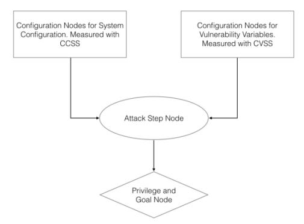

Figure 1. Proposed method to calculate the vulnerability using CVSS and CCSS

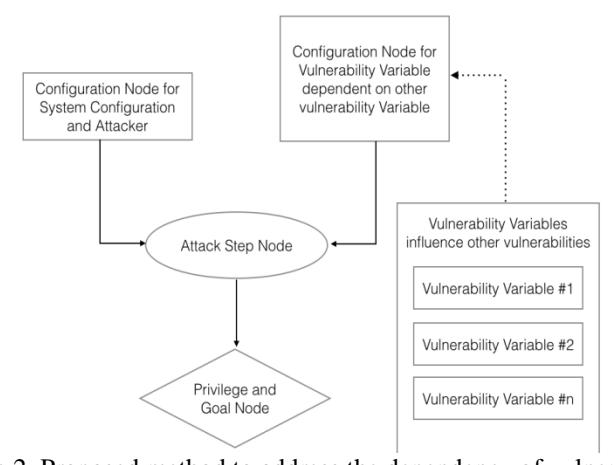

Figure 2. Proposed method to address the dependency of vulnerability

Our second proposed method is designed to address the dependency of vulnerability variables, where a certain vulnerability influences other vulnerability. Today it is understood that there are around 68747 types of vulnerability exsist which are detected since 1999 [19]. Amongst those numbers, a lot of vulnerabilities can be exploited and abused by attackers provided that other vulnerabilities appeared. In other words a vulnerability can only be exploited provided that an attacker could gain access to other vulnerability [10-13]. Supposed that there are two different systems, and supposed that their vulnerability characteristics are simillar in terms of probability and the way to be exploited. If an attacker succeeded in breaching one system vulnerability, then the probability of breaching the second system will

increase since the attacker has experience to exploit vulnerability of a system with similar characteristic [17]. Using these ideas in the context of Bayesian dependencies our proposed method for dependency vulnerability can be seen in figure 2.

The third proposed method is related to the change in the probability of vulnerability variables as a consequence of change in system security configuration with Bayesian assumption. The original MulVAL framework does not cover this scenario [20]. As an illustration, supposed a service program X (e.g. httpd) with probability of vulnerability p(X) runs in a system. Suppose this vulnerability p(X) can be exploited by a service, let us say browser A. If the service is changed to different browser, let us say B, then the vulnerability p(X) of X could be different. The vulnerability value of p(X) could be higher or lower, since the browser B could give more or less favorable environment for exploitation of vulnerability of X than browser A. This proposed method can be seen in figure A.

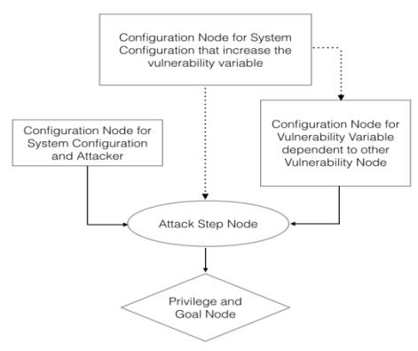

Figure 3. Proposed method to address the change in vulnerability variables related to the system security configuration

Now we analyze and discuss the proposed method using a simple network configuration consists of three hosts: (i) fileServer, (ii) webServer, and (iii) workStation connected to the Internet through a router as in figure 4. We consider the scenario when an attacker is trying to gain access to the workStation as a root user. By applying MulVAL framework to the network configuration in figure 4, we get the graphical representation of the attack graph as in figure 5, and the calculation results for probability value in each node as in table 2 column 4. Each node in the attack graph has a probability p(v) of being successfully exploited. In this scheme the probability of success in accessing the workStation at node 1 using root user is 0.43.

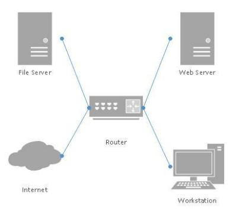

Figure 4. Schematic diagram for simulation consists of a simple network configuration with a work station as the attacker's target

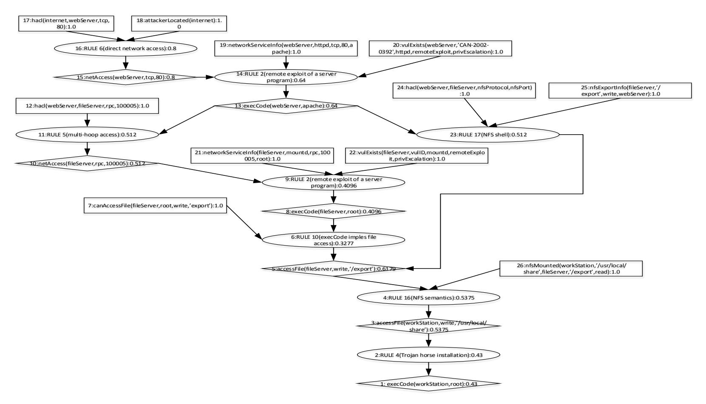

Figure 5. Result of attack graph from MulVAL for network configuration in the simulation. Note that the probability of gaining access as a root user in the workStation is 0.43 at node 1

Table 2. The consolidated text output from MulVAL for simulated network including the original MulVAL output; the first, the second and the third porposed method output

| Node No. | Node Description                                                             | Node Type | Prob. Value (Orig.) | Prob. Value (Meth. 1.1) | Prob. Value (Meth. 1.2) | Prob. Value (Meth. 2) | Prob. Value (Meth. 3) |
|-------------|------------------------------------------------------------------------------|-----------|------------------------|----------------------------|----------------------------|--------------------------|--------------------------|
| (1)         | (2)                                                                          | (3)       | (4)                    | (5)                        | (6)                        | (7)                      | (8)                      |
| 1           | execCode(workStation, root)                                                  | OR        | 0.43                   | 0.375                      | 0.2526                     | 0.2244                   | 0.2152                   |
| 2           | RULE 4(Trojan horse installation)                                            | AND       | 0.43                   | 0.375                      | 0.2526                     | 0.2244                   | 0.2152                   |
| 3           | _                                                                            |           | 0.5375                 | 0.4687                     | 0.3158                     | 0.2805                   | 0.269                    |
| 4           | RULE 16(NFS semantics)                                                       | OR AND | 0.5375                 | 0.4687                     | 0.3158                     | 0.2805                   | 0.269                    |
| 5           | - ( ' ' ' ' ' ' ' ' ' ' ' ' ' ' ' ' ' '                                      |           | 0.6719                 | 0.5859                     | 0.3948                     | 0.3506                   | 0.3362                   |
| 6           | RULE 10(execCode implies file access)                                        | AND       | 0.3277                 | 0.3277                     | 0.3277                     | 0.2786                   | 0.2786                   |
| 7           | canAccessFile(fileServer,root,write, '/export')                              | LEAF      | 1.0                    | 1.0                        | 1.0                        | 1.0                      | 1.0                      |
| 8           | execCode(fileServer,root)                                                    | OR        | 0.4096                 | 0.4096                     | 0.4096                     | 0.3482                   | 0.3482                   |
| 9           | RULE 2(remote exploit of a server program)                                   | AND       | 0.4096                 | 0.4096                     | 0.4096                     | 0.3482                   | 0.3482                   |
| 10          | netAccess(fileServer,rpc, 100005)                                            | OR        | 0.512                  | 0.512                      | 0.512                      | 0.512                    | 0.512                    |
| 11          | RULE 5(multi-hop access)                                                     | AND       | 0.512                  | 0.512                      | 0.512                      | 0.512                    | 0.512                    |
| 12          | hacl(webServer,fileServer,rpc, 100005)                                       | LEAF      | 1.0                    | 1.0                        | 1.0                        | 1.0                      | 1.0                      |
| 13          | execCode(webServer,apache)                                                   | OR        | 0.64                   | 0.48                       | 0.48                       | 0.48                     | 0.384                    |
| 14          | RULE 2(remote exploit of a server program)                                   | AND       | 0.64                   | 0.48                       | 0.48                       | 0.48                     | 0.384                    |
| 15          | netAccess(webServer,tcp,80)                                                  | OR        | 0.8                    | 0.8                        | 0.8                        | 0.8                      | 0.8                      |
| 16          | RULE 6(direct network access)                                                | AND       | 0.8                    | 0.8                        | 0.8                        | 0.8                      | 0.8                      |
| 17          | hacl(internet,webServer, tcp,80)                                             | LEAF      | 1.0                    | 1.0                        | 1.0                        | 1.0                      | 1.0                      |
| 18          | attackerLocated(internet)                                                    | LEAF      | 1.0                    | 1.0                        | 1.0                        | 1.0                      | 1.0                      |
| 19          | networkServiceInfo(webServer,httpd, tcp,80, apache)                          | LEAF      | 1.0                    | 1.0                        | 1.0                        | 1.0                      | 0.8                      |
| 20          | vulExists(webServer, 'CAN-2002-0392', httpd,remoteExploit,privEscalation) | LEAF      | 1.0                    | 0.75                       | 0.75                       | 0.75                     | 0.75                     |
| 21          | networkServiceInfo(fileServer, mountd,rpc, 100005,root)                      | LEAF      | 1.0                    | 1.0                        | 1.0                        | 1.0                      | 1.0                      |
| 22          | vulExist(fileServer,vulID,mountd,remoteExploit,priv Escalation)           | LEAF      | 1.0                    | 1.0                        | 1.0                        | 0.85                     | 0.85                     |
| 23          | RULE 17(NFS shell)                                                           | AND       | 0.512                  | 0.384                      | 0.09984                    | 0.09984                  | 0.0799                   |
| 24          | hacl(webServer,fileServer, nfsProtocol,nfsPort)                              | LEAF      | 1.0                    | 1.0                        | 0.26                       | 0.26                     | 0.26                     |
| 25          | nfsExportInfo(fileServer,'/export', write, webServer)                        | LEAF      | 1.0                    | 1.0                        | 1.0                        | 1.0                      | 1.0                      |
| 26          | nfsMounted(workStation,'/usr/local/share',fileServer, '/export',read)        | LEAF      | 1.0                    | 1.0                        | 1.0                        | 1.0                      | 1.0                      |

When we analyze this MulVAL vulnerability calculation results, there are three cases that will be our interest. In the first case, it can be seen that every LEAF node or configuration node has probabillity of 1.0 to be exploited which is not always true in the real case. For the second case, it can be seen from the attack graph in figure 5, that node 20 and 22 have vulnerability variables, their probability values are 1.0, and furthermore it can be seen that the nodes 20 and 22 are independent of each other. But as elaborated in the previous section, we know that the probability of vulnerability at node 20 will be higher if there is a vulnerability at node 22, so that the assumption of independent is not accurate. Moreover if there are two vulnerability variables with similar characteristics, then once attacker succeeded in breaching first vulnerability, the probability of success in breaching the second vulnerability will increase, since the attacker already has knowledge on how to breach the vulnerability. For the third case, it can be seen that there are two LEAF nodes where configuration as well as vulnerability are both exist. The first is at node 19 and 20 which are needed to attack step node 14, and the second is at node 21 and 22 which are needed to attack step node 9. In MulVAL, the assumption is that the probability of vulnerability variables will not depend on the security service running in the system. In reality the vulnerability could be influenced by the running security service. The later two cases are not covered in the original MulVAL framework.

To improve MulVAL framework we begin with the construction of the following proposition.

#### Proposition 1.

Define tuple  $G = \langle p(v), v, b \rangle$ , where G denotes the attack graph from MulVAL, v represent nodes in G, p(v) denotes the probability of vulnerability at node v and its value corresponds to the probability represented by base metric b calculated through equations (1), (2), and (3). Define three node types as  $v_L$  for LEAF nodes,  $v_A$  for AND nodes, and  $v_O$  for OR nodes, then the probability of each node  $p(v_L)$ ,  $p(v_A)$ ,  $p(v_O)$ , in MulVAL attack graphs G can be derived using general theory of probability, as follows.

$$p(v_L) = p(v)$$
 (for LEAF nodes)

$$p(v_{A}) = p(v) \prod_{i=1}^{N} p(v_{i})$$
 (Conjuctive probability for AND nodes) (5)  
$$p(v_{0}) = p(v) \prod_{i=1}^{N} p(v_{i})$$
 (Disjunctive probability for OR nodes) (6)

$$p(v_0) = p(v) \prod_{i=1}^{N} p(v_i)$$
 (Disjunctive probability for OR nodes) (6)

where p(v) denotes the vulnerability probability of parent node,  $p(v_i)$  represents ancestor nodes i=1,...N of each type of nodes  $v_L$ ,  $v_A$ , and  $v_O$ .

Based on the Proposition 1 we will proceed with the definition of our proposed methods.

#### Definition 1 (First proposed method)

The accuracy of probability of vulnerability can be improved by employing CVSS and CVSS, where the base metric value can be calculated using equations (1), (2), and (3). The probability of the nodes can be calculated through equations (4), (5), and (6) in Proposition 1, see also figure 1.

## Definition 2 (Second proposed method)

The influence of one vulnerability to the other vulnerability is Bayesian probabilistic in nature, so that we can use the Bayesian principles and equations (4), (5), and (6) in Proposition 1, to calculate the value in each node, see also figure 2.

### Definition 3 (Third proposed method)

The change in the system security configuration will impact the probability of vulnerability. Using assumption that the impact is Bayesian, then the value can be calculated using Bayesian principle and equations (4), (5), and (6) in Proposition 1, see also figure 3.

#### 4. Simulation and Discussion

#### A. Simulation result for the first method

In this section we will further discuss the proposed method as described in Definition 1 through simulation on a network in figure 4. It has been described in the previous section that the first proposed improvement model in this paper is to calculate the vulnerability using CVSS and CCSS. The introduction of CVSS and CCSS will represent a more realistic model for vulnerability. Node 20 and 24 are vulnerability variables, so that their probability can be calculated using CVSS. For node 20, its CVE-ID is CAN-2002-0392 and since this vulnerability has been confirmed exist, its identity becomes CVE-2002-0392: Apache Chunked-Encoding Memory Corruption Vulnerability, see [15]. Base vector for this vulnerability is (AV:N/AC:L/Au:N/C:P/I:P/A:P) with values,

- a. Access Vector: Network (Score=1),
- b. Access Complexity: Low (Score=0.71),
- c. Authentication: None (Score=0.704),
- d. Confidentiality: Partial (Score=0.275),
- e. Integrity: Partial (Score=0.275),
- f. Availability: Partial (Score=0.275).

Based on the above base vector data, the Exploitability, Impact and Base Metric can be calculated using equations (1), (2) and (3) as follows.

$$Exp = 2 \times AV \times AC \times Au$$

$$= 2 \times 1 \times 0.71 \times 0.704$$

$$= 9.9968$$

$$Imp = 10.41 \times (1- (1-C) \times (1-I) \times (1-A))$$

$$= 10.41 \times (1- (1-0.275) \times (1-0275) \times (1-0275))$$

$$= 6.443$$

$$Base = (0.6Imp + (0.4Exp - 1.5)) \times f(Imp)$$

$$= ((0.6 \times 0.275) + (0.4 \times 9.9968) - 1.5) \times 1.176$$

$$= 7.5$$
(9)

The value of base metric vulnerability at node 20 is 7.5, so the probability now becomes 0.75. For node 22, since the vulnerability is not specified, it is assumed that the vulnerability probability is 1.0 as in the original MulVAL. With this new values, using our proposed method we re-calculate the probability in each node through equations (4), (5) and (6). The result of probability values can be seen in table 2 column 5 and the attack graph can be seen in figure 6.

Compare to the original probability of 0.43 for gaining access as a root user in the workStation, in this proposed method the probability decrease to 0.375. This is a consequence of the decrease in probability of tempering with the fileServer from 1.0 to 0.75 after considering the vulnerability with CVSS.

Now let us consider the node 24, which is also a LEAF node where with MulVAL framework, the probability is assumed to be 1.0. Supposed that in this nodes there is a problem with security configuration, for example there is an error in access control list configuration, which makes it possible for a user to save a file in the fileServer. This configuration error has base vector (AV:N/AC:H/AU:N/C:P/I:N/A:NPL:ND/EM:A). Using the same procedure as before but using CCSS instead of CVSS, the probability of gain access a root user at the workStation becomes 0.2526. The complete probability of nodes after considering CVSS for

node 20 and CCSS for node 24 can be seen in table 2 column 6, where the attack graph can be seen in figure 7.

Compare to the result in figure 4 without using the proposed method, probability of gaining access to the workStation with root user access is decrease from 0.43 to 0.375 by implementing CVSS on node 20, and decrease further to 0.2526 by considering CCSS on node 24. This situation emerges as a consequence of the decrease in the probability of attacker to exploit the vulnerability in the fileServer from 1.0 to 0.75 in addition to the consideration of error configuration on node 24. The same technique can be adapted to other LEAF nodes as long as the CVSS and CCSS data is available.

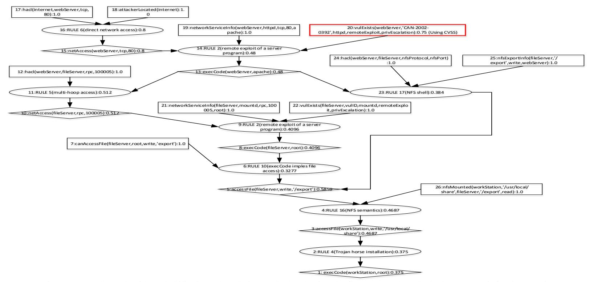

Figure 6. Attack graph with probability in each node is re-calculated using the first proposed method where CVSS is implemented

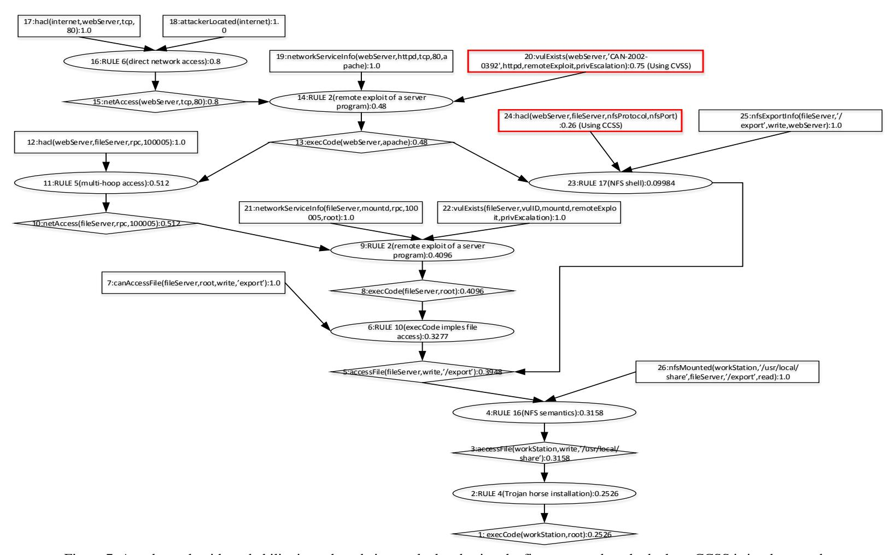

Figure 7. Attack graph with probability in each node is re-calculated using the first proposed method where CCSS is implemented

## *B. Simulation result for the second method*

In figure 4 the attack graph from MulVAL shows that all LEAF nodes or configuration nodes have probability 1.0, which means that every variables in the LEAF nodes are assumed to be exist and can be manipulated to be an attack medium. This is not a realistic situation, so that in this paper we propose a second method described in Definition 2, where the attacker is not guaranteed 100% to be able to exploit the vulnerability variables. We can see that the probability of vulnerability at node 22 will be higher if the there is a vulnerability at node 20. It means that the vulnerability of node 22 is dependent on the vulnerability at node 20. It is possible that the probability vulnerability at node 22 could increase or higher than the original probability. Node 20 has identity CAN-2002-0392, and node 22 has identity CAN-2003-0252 [7]. If both vulnerability can be exploited remotely then one will gain special access, as shown in the following descriptions:

- Node 20: vulExists(webServer, 'CAN-2002-0392', httpd, remoteExploit, priv Escalation): 0.75,
- Node 22: vulExists(fileServer, 'CAN-2003-0252', mountd, remoteExploit, priv Escalation): 0.85

First the attacker will be able to exploit vulnerability of the webServer to gain access at the fileServer. Since normally a webServer has a right to access a fileServer, then the probability of an attacker succeed in exploiting vulnerability at fileServer will be higher if he/she can exploit the webServer first, rather than directly attack the fileServer. It is possible that the probability of gaining access to the fileServer will be higher than 0.75, where in this case after re-calculating all nodes with equations (4), (5) and (6) the probability becomes 0.85. Our second proposed method covers this situation, which is illustrated in figure 8.

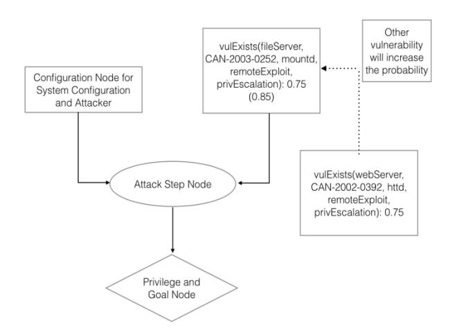

Figure 8. Analysis of vulnerability variables in second proposed method

With this second proposed method, the probability of an attacker gaining access to the workStation with root user access becomes 0.2244. This value is lower than the original MulVAL output where the probability is 0.43. This situation occurs as the consequence of (i) the probability of an attacker to exploit the webServer is lower, from 1.0 to 0.75, (ii) including the probability of error configuration 0.26, and (iii) assumption that the vulnerability of the fileServer is dependent on the vulnerability of webServer, so that the probability to exploit becomes 0.85, which is higher than the original probability of 0.75. The calcuation results for each node can be seen in table 2 column 7, and the corresponding attack graph can be seen in figure 9.

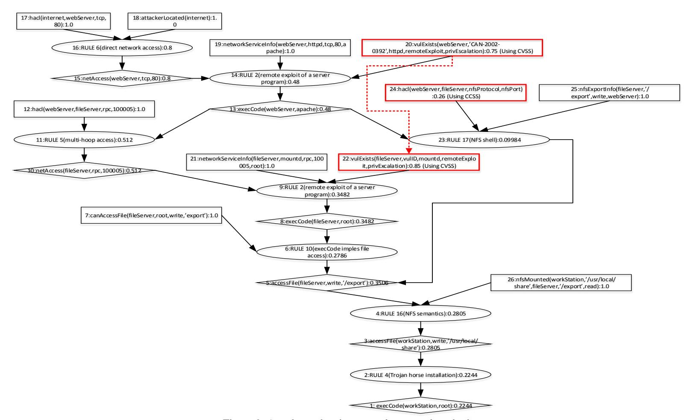

Figure 9. Attack graph using second proposed method

The second proposed method also covers the situation where the vulnerability is outside the coverage of MulVAL framework. As an example, node 22 is not only dependent on the node 20, but could also dependent on other vulnerability outside MulVAL framework. The research result in [20] shows that vulnerability CVE-2007-0956 allows the remote attacker to pass the authentication and gaining access into the system by creating specific username. The CVE-2007-1204 as a stack overflow allows the attacker in a subnet to execute the arbitrary codes. Assumed that the node 22 is a vulnerability variable with identity CVE-2007-1204, then the attacker cannot directly exploit this vulnerability since he/she needs the local access rather than remote access. The attacker can get a local access through exploitation of CVE-2007-0956. Using CVSS, the base metric of CVE-2007-0956 is 7.8, and CVE-2007-1024 is 6.8. This case illustration for node 22 can be seen in figure 10. The probability of node 22 can be calculated using Bayesian rule conjuctive probability in equation (6) as follows.

$$P(s22) = p(CVE - 2007 - 1204) \times p(CVE - 2007 - 0956)$$
  
= 0.68 x 0.76  
= 0.5168 (10)

The probability of node 22 now becomes 0.5168. This number is lower than 0.75 before, since the probability of success in exploiting this node now dependent on other requirement, where in this case is exploitation of variable CVE-2007-0956 before CVE-2007-1024.

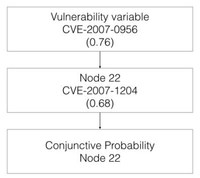

Figure 10. Example case for second proposed method with dependence outside the MulVAL framework

# *C. Simulation result for the third method*

From MulVAL output in figure 5, there are two location where LEAF node consists of both configuration and vulnerability. The first location is node 19 and 20 for attack step node 14; and the other is node 21 and 22 for attack step node 9. In MulVAL, every vulnerability in the machine will always has the same probability vulnerability of 1.0, even if in reality the probability of vulnerability could be influenced by configuration of security service running in the machine. Each software configuration actually possesses some vulnerability called security configuration issue vulnerability. This vulnerability in configuration can be calculated using CCSS. The third proposed method described in Definition 3, will discuss the situation where the vulnerability of software is dependent on the error from system configuration service program. As a sample case, take node 19 where it involves an httpd program runs on the webServer with user apache and listening to port 80 using TCP protocol. Assumed that software *A* runs the httpd with probability of exploitation 1.0. In case software *A* is replaced by software *B* with probability of exploitation 0.8, then the vulnerability should be different. This change in software might trigger a new properties of httpd program that generate the change in security policies. Figure 11 illustrates this condition. The calculation result for each node can be seen in table 2 column 8, and the attack graph can be seen in figure 12.

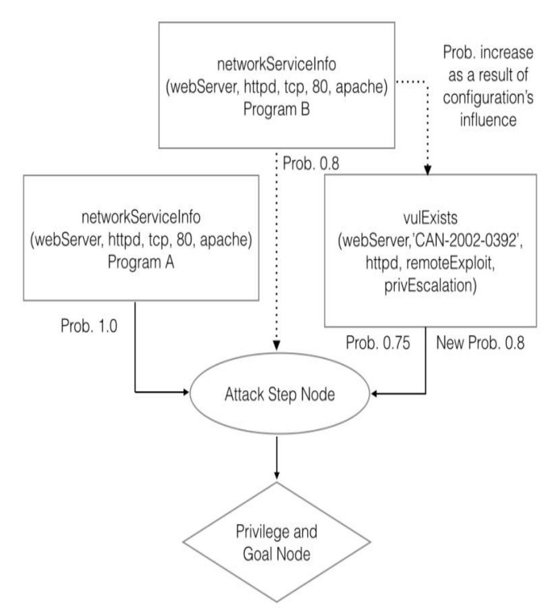

Figure 11. Illustration for the third proposed method

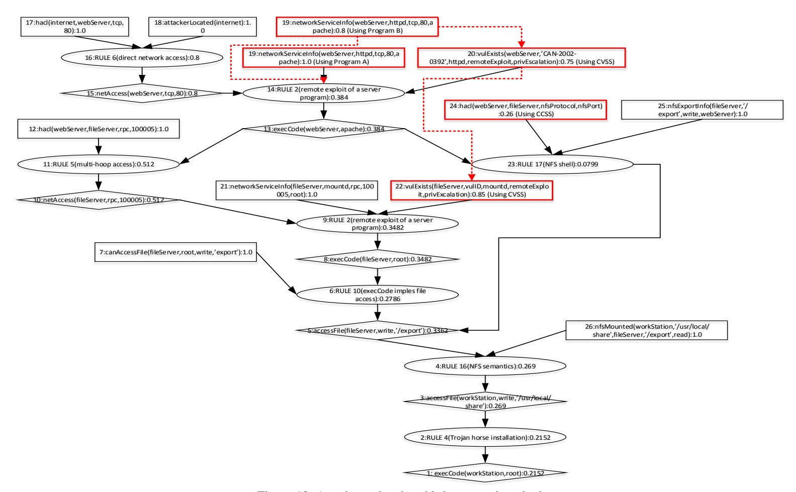

Figure 12. Attack graph using third proposed method

#### 5. Conclusion

In this paper we proposed three methods to improve MulVAL framework. The first method is the introduction of CVSS and CCSS to improve the probability of vulnerability. The CVSS is used to calculate the probability of vulnerability and the CCSS to calculate the probability of security system configuration vulnerability. The second proposed method discussed the dependency of vulnerability variables. The third proposed method discussed the situation where the vulnerability is dependent on the error from system configuration service program. We demonstrate that a change in the system security configuration influenced the probability of vulnerability variables. From the calculation of probability in each node and attack graph result using our proposed methods, we conclude that the introduction of CVSS, CCSS and the dependency models have been able to create more realistic and accurate presentation of probability of vulnerability variables and to capture situation outside the coverage of MulVAL framework.

#### 6. References

- [1]. R. Ross, Conducting Information Security-Related Risk Assessments: Updated Guidelines for Comprehensive Risk Management Programs, NIST, ITL Bulletin, October, 2012.
- [2]. M. E. Whitman, H. J. Mattord, Principles of Information Security 4th Edition, Course Technology, Boston, MA, 2012.
- [3]. C. Phillips and L. P. Swiler, "A Graph-Based System for Network Vulnerability Analysis," *Proceeding of The 1998 Workshop on New Security Paradigms*, pp. 71-79, 1998.
- [4]. P. Ammann, D. Wijesekera, and S. Kaushik, "Scalable, Graph-Based Network Vulnerability Analysis," *Proc.* 9th ACM Conf. Comput. Commun. Secur, CCS'02, pp. 217-224, 2002.
- [5]. S. Jha, O. Sheyner, and J. Wing, "Two Formal Analysis of Attack Graphs," *Proc.* 15th IEEE Computer Security Foundations Workshop, CSFW-15, 2002.
- [6]. L. P. Swiler, C. Phillips, D. Ellis, and S. Chakerian, "Computer Attack Graph Generation Tool," *Proc. DARPA Information Survivability Conference and Exposition II, DISCEX'01*, vol. 2, pp. 307-321, 2001.
- [7]. X. Ou, S. Govindavajhala, and A. Appel, "MulVAL: A Logic-based Network Security Analyzer," 14th USENIX Security Symphosium, pp. 113-128, 2005.
- [8]. R. E. Sawilla and X. Ou, "Identifying Critical Attack Assets in Dependency Attack Graphs," *Lecture Notes in Computer Science (including Subseries Lecture Notes in Artificial Intelligence and Lecture Notes in Bioinformatics)*, vol. 5283 LNCS, no. 0716665, pp. 18-34, 2008.
- [9]. K. Scarfone and P. Mell, "The Common Configuration Scoring System (CCSS): Metrics for Software Security Configuration Vulnerabilities," NIST, ITL, Interagency Report, vol. 7502, 2010.
- [10]. N. Poolsappasit, R. Dewri, I. Ray, "Dynamic Security Risk Management Using Bayesian Attack Graph," *IEEE Transaction on Dependable and Secure Computing*, vol. 9, Issue 1, pp. 61-74, 2012.
- [11]. L. Wang, A. Singhal, and S. Jajodia, "Measuring the Overall Security of Network Confiurations Using Attack Graph," *Proceedings of The 21st Annual IFIP WG 11.3 Working Conference on Data and Applications Security*, pp. 98-112, 2007.
- [12]. M. Frigault, L. Wang, A. Singhal, and S. Jajodia, "Measuring Network Security Using Dynamic Bayesian Network," *Proceedings of the 4th ACM Workshop on Quality of Protection*, pp. 23-30, 2008
- [13]. M. Frigault and L. Wang, "Measuring Network Security Using Bayesian Network-Based Attack Graph," *Proceedings of The 32nd Annual IEEE International Computer Software and Applications Conference, COMPSAC '08*, pp. 698-703, 2008.

- [14]. S. Noel, S. Jajodia, L. Wang, and A. Singhal, "Measuring Security Risk of Networks Using Attack Graphs," *International Journal of Next Generation Computing*, vol. 1, pp. 135-147, 2010.
- [15]. P. Mell, K. Scarfone and S. Romanosky, "A Complete Guide to The Common Vulnerability Scoring System Version 2.0," *Published by FIRST Forum if Incident Response Security Teams*, pp. 1-23, 2007.
- [16]. P. Mell, K. Scarfone and S. Romanosky, "Common Vulnerability Scoring System," *IEEE Security and Privacy Magazine,* vol. 4, 2006.
- [17]. P. Chejara, U. Garg, and G. Singh, "Vulnerability Analysis in Attack Graphs Using Conditional Probability," *International Journal of Soft Computing and Engineering (IJSCE*), vol. 3, Issue 2, pp. 18-21, 2013.
- [18]. P. Cheng, L. Wang, S. Jajodia, and A. Singhal, "Aggregating CVSS Base Scores for Semantics-Rich Network Security Metrics," *Proceedings of The 31st IEEE Symphosium on Reliable Distributed Systems*, pp. 31-40, 2012.
- [19]. National Vulnerability Database, [http://nvd.nist.gov/cvss.cfm,](http://nvd.nist.gov/cvss.cfm) Accessed on February 13, 2015.
- [20]. D. Saha, "Extending Logical Attack Graphs for Efficient Vulnerability Analysis," *CCS'8 Proceedings of The 15th ACM Conference on Computer and Communication Security*, pp. 63-74, 2008.

**Jaka Sembiring** earned the Bachelor's degree in 1990 from Institut Teknologi Bandung (ITB), Indonesia, Master's degree in 1997, and Doctoral degree in 2000, from Waseda University, Japan, all in electrical engineering. He is now an associate professor at the School of Electrical Engineering and Informatics (SEEI), ITB where he joins the Information Technology Research Division. His main interest is on the application of stochastic system in information technology related field. He has already written around 70 technical papers in stochastic process theory and its application in

enterprise architecture, risk analysis, robotics and agent systems. Dr. Sembiring is an active member of IEEE and ACM.

**Mufti Ramadhan** earned the Bachelor's degree in 2008 from Sekolah Tinggi Ilmu Statistik (STIS) Jakarta, in Statistics Computation, and Master's degree in 2015 from Institut Teknologi Bandung (ITB), in Informatics. He is now working at the Indonesian Central Bureau of Statistics, Jakarta, Sub Directorate Data Communications Network. His working experiences includes: staff of Integration Data Processing and Dissemination of Statistics, and staff of Data Communications Network, Indonesian Central Bureau of Statistics.

**Yudi S. Gondokaryono** is an assistant professor of computer engineering and the Director of Information System and Technology Office of Institut Teknologi Bandung (ITB). His research interests include high performance system and computer security. He received his bachelor degree from Institut Teknologi Bandung in 1989, and an MS in electrical engineering (1997) and a PhD in electrical engineering (2003) from New Mexico State University. He is a member of the Technical Committee on Parallel Processing (TCPP) IEEE and member of IEEE and ACM.

Arry A. Arman earned the Bachelor's degree in 1990, Master's degree in 1995, and Doctoral degree in 2004, from Institut Teknologi Bandung, Indonesia, all in electrical engineering. He is now an associate professor at the School of Electrical Engineering and Informatics (SEEI) and and member of Information Technology Research Division. Since 2011, he was a Head of Information System and Technology Study Program. His main interest is on Enterprise Architecture, IT Governance, and related field. Dr. Arry Akhmad Arman is a member of IEEE.