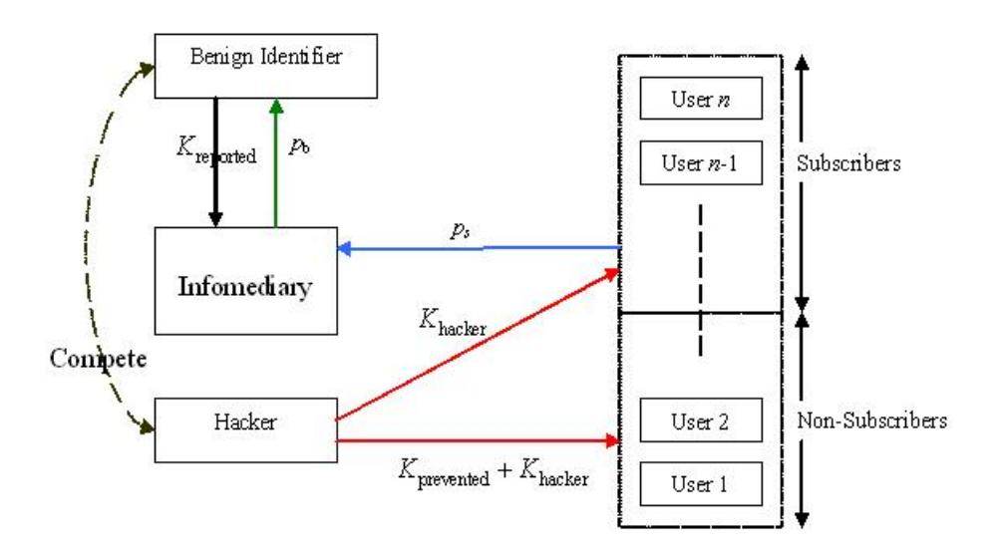
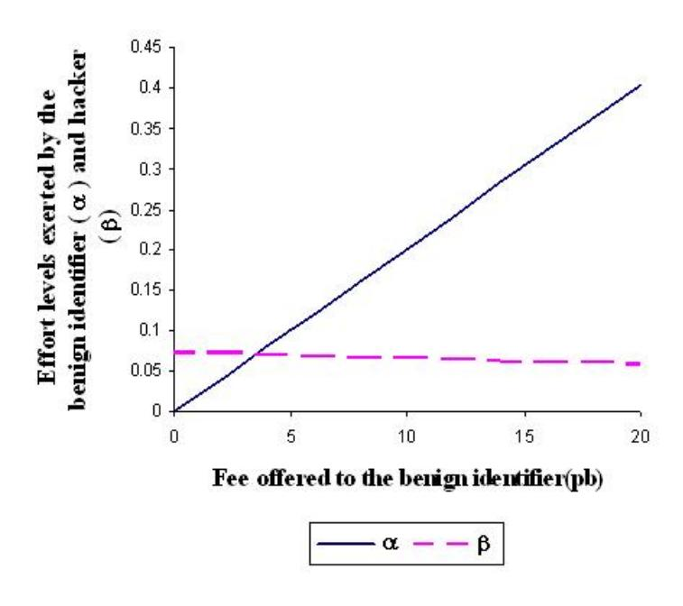
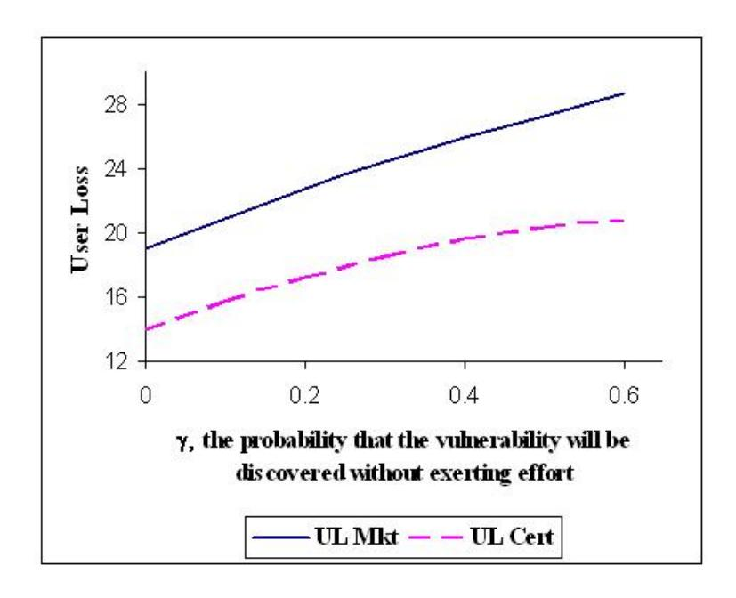
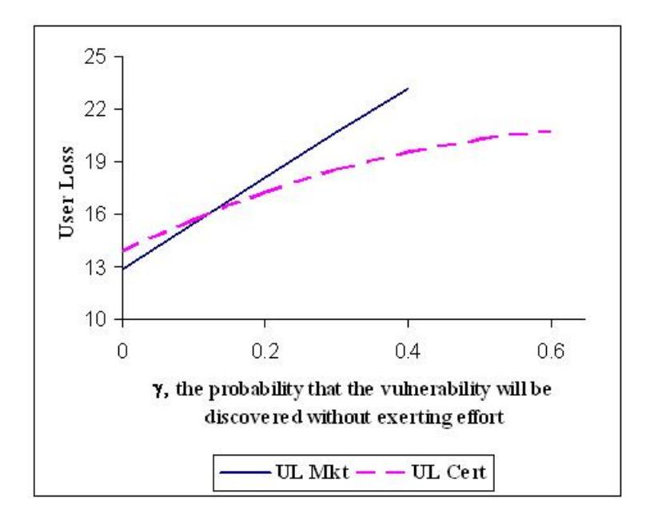

# Market for Software Vulnerabilities? Think Again∗

Karthik Kannan† Rahul Telang ‡

January 28, 2005

#### **Abstract**

Software vulnerability disclosure has become a critical area of concern for policy-makers. Traditionally, Computer Emergency Response Team (CERT) acts as an infomediary between benign identifiers (who voluntarily report vulnerability information) and software users. After verifying a reported vulnerability, CERT sends out a public "advisory" so that users can safeguard their systems against potential exploits. Lately, firms such as iDefense have been implementing a new market-based approach for vulnerability information. The "market-based" infomediary provides monetary rewards to identifiers for each vulnerability reported. The infomediary then shares this information with its client base. Using this information, clients protect themselves against potential attacks that exploit those specific vulnerabilities.

The key question addressed in our paper is whether movement towards such a market-based mechanism for vulnerability disclosure leads to a better social outcome. Our analysis demonstrates that an active unregulated "market-based mechanism" for vulnerabilities almost always underperforms a passive CERT-type mechanism. This counter-intuitive result is attributed to the market-based infomediary's incentive to leak the vulnerability information inappropriately. If a profit-maximizing firm is not allowed to (or chooses not to) leak vulnerability information, we find that social welfare improves. But even a regulated market-based mechanism performs better than a CERT-type one, only under certain conditions. Finally, we extend our analysis and show that a proposed mechanism – "federally-funded social planner" – always performs better than a market-based mechanism.

*Forthcoming, Management Science*

∗Authors would like to thank Charalambos Aliprantis, Ashish Arora, Jonathan P. Caulkins, Prabuddha De, Ramayya Krishnan, Jackie Reese, Drew Saunders, the department editor, the associate editor and the two anonymous reviewers for providing valuable suggestions. We also thank seminar participants at Purdue University, Carnegie Mellon University, HICSS 2004 and WEIS 2004 for their feedback. We notably appreciate the effort of Hao Xu in the making of this paper.

†Krannert School of Management, Purdue University, kkarthik@mgmt.purdue.edu

‡H. John Heinz III School of Public Policy and Management, Carnegie Mellon University, rtelang@andrew.cmu.edu

## **1 Introduction**

One of government's fundamental jobs is deciding what goods and services should be provided by which types of markets. The Unites States has decided that postal delivery and national defense services should be provided by the government. Utilities used to be primarily regulated monopolies but now operate in regulated competition. Grocery stores are largely unregulated. Ideally, the choice is made on the basis of social welfare, including efficiency and equity considerations. Here, we offer the first such analysis with regard to the market for software vulnerability detection.

Attacks exploiting software vulnerabilities (or *bugs* as they are commonly known) are believed to cause significant economic damage. A recent study by NIST (2002) estimates the number in the range of 60 billion dollars per year. Given the enormity of damage and the fact that vulnerabilities cannot be completely eliminated in software, vulnerability disclosure has become a critical area of concern for policy-makers (e Week, 2003).

Traditionally, Computer Emergency Response Team (CERT) acts as an *infomediary* between *benign identifiers*, who report vulnerability information, and software users. CERT's role evolved during the early days of the Internet when vulnerability discovery and reporting was relatively infrequent. Since no market existed for vulnerabilities, CERT's role was crucial in disseminating vulnerability information. After verifying a reported vulnerability and coordinating with vendors, CERT typically sends out a public "advisory" to allow users to safeguard their systems against potential exploits. In order to ensure that such public notifications are not exploited by *hackers* to attack software users, CERT follows a series of steps before such a disclosure. The steps include contacting the vendor for the appropriate patch, and waiting for an appropriate time before publicly disclosing the vulnerability. In this traditional mechanism, reporting vulnerabilities is voluntary with no explicit monetary gains to benign identifiers.

Lately, the number of vulnerabilities discovered has increased. For example, 4,129 vulnerabilities were reported in 2002, whereas only 1,090 were reported in 2000 (CERT, 2003). This has also led to the creation of a market for vulnerabilities, where firms such as iDefense have been acting as infomediaries. In this *market-based mechanism*, the infomediary offers a monetary reward to the identifiers for every vulnerability reported to it. The infomediary then shares this information with users who are subscribed to its

service. Subscribers use this information along with other value added services provided by the infomediary, such as patches or filters to protect them against attacks that exploit that vulnerability.

The key question addressed in this paper is whether such a movement towards a market-based mechanism leads to a better social outcome? The answer is not obvious. On one hand, monetary incentives to discover vulnerabilities may encourage benign identifiers to invest more effort and time in finding them, thereby generating a better social outcome. On the other hand, the same incentives may also lead to a *race* for vulnerability discovery between benign identifiers and hackers. A similar behavior has been observed in R&D competitions where firms race to be an innovator (see Dasgupta and Stiglitz, 1980, Reinganum, 1982). If racing happens and the number of vulnerabilities discovered by hackers increases, it may decrease social welfare. Note that a monopolistic market-based infomediary has an incentive to serve only a fraction of the entire market, thereby exposing non-subscribers to attacks. Moreover, the non-subscribers may also suffer if the monopolist misuses vulnerability information to increase its profits by leaking it to the public and exposing non-subscribers to more attacks. This may lead to a further decrease in social welfare. We term such a market as an *unregulated market*. However, even in a *regulated market*, where a market-based infomediary cannot misuse information, the answer is unclear.

From a policy-maker's perspective, understanding this question is crucial. If markets perform at least as well as the traditional CERT-type mechanisms, then policy-makers need to reshape the role of such institutions in the future. Moreover, this also means that our policies should encourage such markets. On the other hand, if markets decrease welfare and they are here to stay, then policy-makers need to think about regulations that may achieve the desired objective. One key contribution of our paper is to argue that while software security typically has been a domain of computer scientists and technical researchers, it is the emerging economic and policy issues that have significant welfare implications. Even so, there is little academic research in this area to draw from. Our paper tries to bridge this gap by analyzing the economic efficacy of these mechanisms and by providing appropriate policy guidelines.

One striking finding of our paper is that unregulated markets almost always perform worse than even a "no market" case. This is in contrast to traditional economic models where even a monopolistic market is better than no market at all. We observe this counter-intuitive result in the domain of vulnerability

disclosure because a monopolist has incentives to use vulnerability information in a socially detrimental way. This result suggests that some regulatory guidelines are necessary for proper disclosure of vulnerability information. We then extend the model to show that even when the market is regulated, under certain conditions (as long as users voluntarily find the vulnerabilities with high enough probability), the passive CERT-type mechanism is better than the market-based mechanism. The key intuition is that even though a market-maker increases the supply of vulnerabilities, this increased supply is socially detrimental because it forces the users to pay higher rents to subscribe to the market-maker's services.

Another key finding is that the payment for vulnerability discovery encourages the benign identifier to exert a higher effort which imposes a *negative* externality on the effort of the hackers. Since the hackers' incentives to find vulnerabilities reduce, it improves the social benefits. We build on these two key findings to formulate a new mechanism. Specifically, we show that the CERT-type mechanism is the most beneficial when it funds vulnerability discovery by paying benign identifiers. Based on this result, we argue that CERT should create incentives for the benign identifiers to discover vulnerabilities and report them.

The paper is organized as follows. In section 2, we review the literature most relevant to this topic. Following that in section 3, we first provide a general model. We then provide details of the unregulated market-based mechanism and its comparison to the CERT-type one in section 4. In section 5, we discuss the regulations of the regulated market-based mechanism and compare its welfare metrics against that of the CERT-type mechanism. In section 6, we analyze the federally-funded mechanism and study its welfare implications relative to other mechanisms. Following that, we present our concluding remarks in section 7.

## **2 Literature Review**

Much of the prior work in the software vulnerability and information security area has focused on the technical aspects of the problem. For example, Krsul et al. (1998), Du and Mathur (1998a), and Du and Mathur (1998b) analyze and classify different software errors that lead to security breaches. Only a few papers have analyzed economic issues related to problems in the information security.

One of the few papers to discuss markets for vulnerabilities is Camp and Wolfram (2000). But the focus of their work is different. They describe a means for creating a market for vulnerabilities in order to

increase the security of systems. They contend that government intervention by issuing a new currency in the form of credits for security vulnerabilities will provide incentives to make systems more secure. Similarly, Schechter (2002) argues that vendors should create and exploit a market for testers. He concludes that encouraging competition among testers by using incentives to discover vulnerabilities can serve to improve quality.

Gordon et al. (2002) discuss how the economic issues related to information sharing in Information Sharing & Analysis Centers (ISACs), created under the Presidential Decision Directive 63 for sharing information security issues, are similar to those in trade associations. In their paper, they also provide an overview for developing economic models to study issues such as free-riding, which Varian (2002) has recognized as important element in the information security space. Two other papers – Gordon et al. (2003) and Gal-Or and Ghose (2003) – have followed up on this idea and developed game-theoretic models to study the economic consequences of sharing security information in ISACs. The focus of Gordon et al. (2003) is on how information sharing affects the overall level of information security by examining the effect of security investment on expected security costs. While Gordon et al. (2003) focus on the cost side, Gal-Or and Ghose (2003) focus on the demand side effects of security breaches and information sharing.

In addition, a few other papers have analyzed security investments that software users undertake to protect themselves against potential exploits. Gordon and Loeb (2002) develop an economic model for information security investment decisions. They analytically demonstrate that the optimal level of information security spending does not always increase with the expected loss from attacks and that this level of security spending must be far less than the expected loss from attacks. Another paper by Schechter and Smith (2003) discusses how security investments must take into account the intruder's cost of breaking-in.

Arora et al. (2003) develop an economic model to study a vendor's decision of when to introduce its product and whether or not to patch vulnerabilities in its software. Interestingly, they observe that the profit-maximizing vendor delivers a product that has fewer vulnerabilities than a social-welfare maximizing vendor. However, the profit-maximizing vendor is less willing to patch.

To our knowledge, no prior work has addressed specific issues discussed in the introduction. Practitioners in different capacities have been proposing different legal/economic frameworks for software vulnerability disclosure (Security-Focus, 2003, e Week, 2003). Arora et al. (2004) provide an economic decision making framework for disclosing vulnerabilities. In a *New York Times* article Varian (2000b) suggests that information security can be improved by first assigning legal liability. Along with a legal framework, he argues that an insurance framework can provide the correct market-based incentive structure (see Yurcik and Doss, 2002, Gordon et al., 2003, for issues related to cyber-insurance). But since this area of research is relatively nascent and much of the work is yet to come, policy-makers are left with little guidance in understanding the implications of different frameworks. In line with this motivation, our paper mainly draws from the basic industrial organization literature by providing a formal model to analyze different disclosure mechanisms in the information security domain.

## **3 Model**

Figure 1: Structure of the model

Figure 1 outlines the basic structure of our model. Our model has four main participants – the infomediary (like iDefense or CERT), a benign identifier1 , a hacker, and software users. In this paper,

1We demonstrate that the key results shown by assuming a single benign identifier hold even if we generalize to n benign identifiers. The details are at http://mansci.pubs.informs.org/ecompanion.html

we consider a monopolistic infomediary for two primary reasons. First, this market is likely to yield to a monopolistic structure because an infomediary that buys information from the benign identifier amortizes the cost of acquisition over its subscriber base. Therefore, a firm with a larger customer base can always drive out smaller players by virtue of its size and scale. Typically, markets for information-goods display such characteristics, yielding either a dominant firm or many differentiated firms that are like local monopolies (see page 25 in Shapiro and Varian, 1998). Second, given that the market of vulnerabilities is itself relatively new and the pertinent mechanisms are not well understood, understanding the implication of a monopolistic structure is important before studying the implications of an oligopolistic market.

Let the informediary pay pb as a reward to the benign identifier for reporting a vulnerability. Let ps represent the one-time subscription fee that the infomediary charges to each of its subscribers. The (pb, ps) pair set by the infomediary determines the number of subscribers (and hence the fraction of the market subscribing), the number of vulnerabilities reported by the benign identifier and the probability of attacks. But the optimal prices pb and ps, in turn, are determined by the fraction of the market subscribing, the number of vulnerabilities reported, etc. Therefore, we model this as a two period game. In the first period, the infomediary sets its optimal pricing policy and in the second period, all other players – software users, the benign identifier and the hacker – react. However when solving this game, we first solve for the reaction of the benign identifier, the hacker, and software users for a given (pb, ps) pair, and then solve for the optimal (pb, ps) using backward induction. Ultimately, our goal is to calculate the welfare-metrics – the overall industry loss and the overall user loss – for each mechanism.

Without loss of generality, we assume that there is one vulnerability in the product and that the benign identifier and the hacker attempt to discover it. Having only one vulnerability allows us to model everything as probability measures. Let Khacker be the probability that the vulnerability is first discovered by the hacker. In this case, the hacker exploits the vulnerability to attack all users (including the infomediary's subscribers). Similarly, let Kreported be the probability that the vulnerability is first discovered by the benign identifier who reports it to the infomediary. Note that, by definition, the benign identifier does not exploit the vulnerability. After obtaining the vulnerability information, the infomediary notifies its subscribers so that they can protect their systems against potential future attacks. Let Kprevented represent the probability that the attack is prevented by subscribing to the infomediary's service.

The key consideration here is what does the infomediary do with the vulnerability information? Once its subscribers are protected, the infomediary could either disclose vulnerability information to the public without proper safeguards, or inform the vendor and disclose the information responsibly. If the infomediary "leaks" the vulnerability to the public without proper safeguards, then the hacker can exploit that vulnerability to attack non-subscribers easily. In this case, when the benign identifier discovers the vulnerability, the hacker also benefits. On the other hand, if the infomediary discloses the information in a "responsible" fashion, then non-subscribers are affected only if the hacker is able to find that vulnerability *on its own*. Note that in this case, the hacker benefits only from discovering the vulnerability by itself.

When the market-based infomediary leaks vulnerability information, we refer to it as the unregulated market-based mechanism. In contrast, the market-based infomediary in a regulated market will make the information public only with proper safeguards and users not subscribed to its service are not affected adversely. Therefore in our model,

$$K_{\text{prevented}} = \left\{ \begin{array}{ll} K_{\text{prevented}}^{\text{leak}} & \text{if it is an unregulated market} \ K_{\text{prevented}}^{\text{no leak}} & \text{if it is a regulated market} \end{array} \right.$$

We use the variables with superscripts,  $K_{\text{prevented}}^{\text{no leak}}$  and  $K_{\text{prevented}}^{\text{leak}}$ , only to distinguish between the regulated and the unregulated cases. Otherwise, we use  $K_{\text{prevented}}$ . A related point to note is that the  $(p_b, p_s)$  pair chosen by the infomediary is dictated by its decision to leak. We first begin with the unregulated market in which the infomediary can leak the information.

## 4 Unregulated Market

Now, we are ready to sketch the behavior of software users, benign identifier and the hacker when the infomediary sets a price pair  $(p_b, p_s)$ .

#### 4.1 Modeling Software Users, the Benign Identifier and the Hacker

Without loss of generality, we normalize the total number of software-users in the market to one. This means that we deal with the fraction of the market subscribed to the infomediary's service, denoted by  $\eta$ , instead of the number of subscribers. Our objective, in this subsection, is to characterize the expressions for the probabilities  $K_{\text{reported}}$ ,  $K_{\text{backer}}$  and  $\eta$  as functions of  $p_b$  and  $p_s$ .

#### 4.1.1 Characterizing Subscribers

We assume that software users are heterogeneous in terms of the loss they incur when a vulnerability is exploited. Let the user loss-type,  $\theta$ , be distributed on the interval  $[0, \overline{\theta}]$  according to the distribution function  $F(\theta)$ . Any software user i of type  $\theta_i$  is assumed to incur a loss of  $\theta_i^2$  when the vulnerability is exploited. The software users have the option of preventing attacks on their systems by subscribing to the infomediary's service. Let the subscription fee charged by infomediary be  $p_s$ . Any user i, whose expected avoidance of loss from subscribing

$$\Pi_{\text{user}} = \theta_i^2 K_{\text{prevented}}^{\text{leak}} - p_s > 0 \tag{1}$$

subscribes to the service. In this expression, the first term corresponds to the loss prevented by subscribing to the service. Note that  $K_{\text{prevented}}^{\text{leak}}$  is a function of  $p_b$ , which the infomediary pays to benign identifiers for discovering vulnerability. The second term corresponds to the payment made to the infomediary. Therefore, only those software users whose  $\theta_i$  satisfies the following condition subscribe to the service:

$$\theta_i > \sqrt{\frac{p_s}{K_{\text{prevented}}}}$$
 (2)

Since  $\theta$  is assumed to have a distribution function  $F(\theta)$ , the fraction of the market subscribed to the infome-diary's service is:

$$\eta = 1 - F\left(\sqrt{\frac{p_s}{K_{\text{prevented}}}}\right) \tag{3}$$

In a mechanism where software users are not charged any price at all, then  $p_s = 0$ , and  $\eta = 1$ . This implies that all users are provided with the vulnerability information.

### 4.1.2 Characterizing $K_{\text{reported}}$ , $K_{\text{prevented}}^{\text{leak}}$ , and $K_{\text{hacker}}$

We now characterize the probabilities  $K_{\text{reported}}$ ,  $K_{\text{prevented}}^{\text{leak}}$ , and  $K_{\text{hacker}}$  as functions of  $p_b$  and  $p_s$ . Note that these probabilities determine the welfare-metrics, user loss and industry loss, that are defined in the following subsection.

The  $(p_b, p_s)$  pair set by the infomediary determines the effort levels exerted by the benign identifier and the hacker, which dictate these probabilities. Let  $\alpha$  be the effort exerted by the benign identifier and  $\beta$  be the effort exerted by the hacker. Then, the functional form for  $K_{\text{reported}}$ ,  $K_{\text{prevented}}^{\text{leak}}$ , and  $K_{\text{hacker}}$  would satisfy the following intuitive criteria:

- $\frac{\partial K_{\text{reported}}}{\partial \alpha} > 0$  and  $\frac{\partial K_{\text{hacker}}}{\partial \beta} > 0$ : The probability that the vulnerability is reported increases with the benign identifier's effort. Similarly, higher efforts by the hacker leads to a higher probability that he will discover the vulnerability first. These expressions are akin to positive elasticity of "own" efforts.
- $\frac{\partial K_{\text{reported}}}{\partial \beta} < 0$  and  $\frac{\partial K_{\text{hacker}}}{\partial \alpha} < 0$ : The probability that the vulnerability is discovered by the benign identifier decreases with the hacker's effort. Similarly, the probability of the hacker finding the vulnerability decreases with the benign identifier's efforts. These expressions are akin to negative "cross-elasticity" of efforts.

For analytical tractability and to be able to solve for equilibrium, we need to characterize the expressions for these probabilities. In the following section, we obtain the functional form for these probabilities by modeling the competition between a benign identifier and a hacker within the software's life cycle period, T.

#### Competition between the Benign Identifier and the Hacker

We assume a uniform probability density function (pdf) for the vulnerability being discovered by either player (benign identifier or the hacker) at any time t < T without exerting any effort. Hence the pdf is given by  $\frac{\gamma}{T}$ . Therefore, the probability that the player will discover the vulnerability within time period T equals  $\gamma$  where  $\gamma \in [0,1]$ . In other words,  $\gamma$  corresponds to the probability with which each player discovers the vulnerability without exerting any effort. Players can alter  $\gamma$ , and hence the pdf, by exerting effort. We

assume that a benign identifier exerts an effort α. This effort increases its pdf to α+γ T . Similarly, the hacker exerts an effort level of β that increases its pdf to β+γ T . Note that we use the additive functional form simply for tractability reasons.2

Investing effort is costly for both the benign identifier and the hacker. Therefore, they invest effort in an optimal manner. Their effort level is determined by the non-cooperative Nash equilibrium that emerges from competition between them. The effort parameters, α and β, are assumed to be set for the entire duration, T, and cannot be modified during the game. Given the effort levels α and β, we can now compute the probabilities:

• The probability that the vulnerability is reported, Kreported, corresponds to the probability that the vulnerability is first discovered by the benign identifier and reported to the infomediary:

$$K_{\text{reported}} = \int_0^T \text{Probability}(benign = t) \text{ Probability}(\overline{hacker} < t) \text{ d}t$$

where Probability(benign = t) is the probability that the vulnerability is identified by the benign identifier at time t by exerting an effort α, and Probability(hacker < t) is the probability that the vulnerability has *not* been identified by the hacker exerting effort β by time t. Therefore,

$$K_{\text{reported}} = \int_0^T \frac{\alpha + \gamma}{T} \left( 1 - \frac{(\beta + \gamma)t}{T} \right) dt = (\alpha + \gamma) \left( 1 - \frac{(\beta + \gamma)}{2} \right)$$
(4)

• In general, the probability that an attack is prevented, Kprevented, affects the value provided by the infomediary's service for a user of loss-type θi . It is important to note that when the infomediary in an unregulated market leaks the vulnerability information without proper safeguards, all reported vulnerabilities become exploitable. Thus by subscribing to the infomediary's service, a user can prevent all those attacks that occur whenever the benign identifier reports the vulnerability to the

2We show that similar results are obtained when using a multiplicative form. The details are at http://mansci.pubs.informs.org/ecompanion.html.

infomediary.3 Under leakage,

$$K_{\text{prevented}}^{\text{leak}} = K_{\text{reported}} = (\alpha + \gamma) \left( 1 - \frac{(\beta + \gamma)}{2} \right)$$
 (5)

We will calculate Kno leak prevented in the next section.

• Finally, the probability that the vulnerability is first discovered by the hacker, Khacker, is

$$K_{\text{hacker}} = \int_{0}^{T} \text{Probability}(hacker = t) \text{Probability}(\overline{benign} < t) dt$$
$$= (\beta + \gamma) \left(1 - \frac{(\alpha + \gamma)}{2}\right)$$
(6)

When the vulnerability is first discovered by the hacker, the hacker attacks all users including the subscribers of infomediary's service.

#### **Optimal Effort Level**

We use these probabilities to compute the optimal effort exerted by the benign identifier and the hacker. Recall that the effort exerted by the benign identifier increases her probability of finding the vulnerability to α+γ. This effort is rewarded with pb if she discovers the vulnerability before the hacker. Since Kreported is the probability that the benign identifier discovers the vulnerability first, her expected revenue is pb Kreported. For some effort level α, the benign identifier's cost is C(α). Thus, the expected profit for the benign identifier is:

$$\Pi_b = K_{\text{reported}} \ p_b - C(\alpha)$$

For obtaining an interior optimal solution, we require that Πb be concave in α. Since the revenue

3 In our analysis, we assume that when the infomediary leaks, it serves to benefit the hacker only. In general, the non-subscribers can also find out about the leaked information and act on it, but the search cost will likely be very high. If we were to model this by assuming that non-subscribers are able to find and use the leaked information to successfully prevent attacks with certain probability, the expected avoidance of loss for the users (equation 1) would change slightly by containing this probability term. However, all our main results and insights would continue to hold. For the simplicity of exposition, we ignore the case when leakage benefits the non-subscribers.

increases linearly with  $\alpha$ , any convex cost function will suffice. In our model, we use the commonly used quadratic function,  $C(\alpha) = M\alpha^2$ , where M is the cost of the exerting effort. Some restrictions will be placed on the size of M in order to ensure that the probabilities  $\alpha + \gamma$  and  $\beta + \gamma$  are bounded in [0,1]. Substituting for  $C(\alpha)$  and  $K_{\text{reported}}$  in  $\Pi_b$ , we get

$$\Pi_b = (\alpha + \gamma) \left( 1 - \frac{(\beta + \gamma)}{2} \right) p_b - M \alpha^2 \tag{7}$$

Next, let us consider the hacker's expected profit. The hacker benefits by attacking all users if he discovers the vulnerability first. But if he discovers the vulnerability after the benign identifier, he obtains the profit only from attacking users who are not infomediary's subscribers.4 We assume that if the hacker is successful in attacking a user of type  $\theta_i$ , he gains a profit of  $\theta_i$ . Note that the functional form of the hacker's profit function is intentionally made to be different from the loss suffered by the user  $-\theta_i^2$ .5 The hacker's cost is  $C(\beta)$ . Therefore,

$$\Pi_h = K_{\text{hacker}} \left( \int_0^{\overline{\theta}} \theta \, \mathrm{d}F(\theta) \right) + K_{\text{prevented}}^{\text{leak}} \left( \int_0^{\sqrt{\frac{p_s}{K_{\text{leak}}}}} \theta \, \mathrm{d}F(\theta) \right) - C(\beta)$$

In the first term,  $K_{\text{hacker}}$  corresponds to the probability that the hacker discovers the vulnerability first and attacks all users.6 The term inside the integral is the expected profit from attacking all the users. Similarly in the second term,  $K_{\text{prevented}}^{\text{leak}}$  corresponds to the probability that the hacker discovers the vulnerability after the benign identifier. The integral in the second term is the expected profit for the hacker from attacking users that are not subscribed to the infomediary's service. The last term corresponds to the cost of exerting effort.

&lt;sup>4It is trivial to show that the hacker never finds it optimal to sell the vulnerability.

&lt;sup>5In some cases, the hackers may gain a lot by exploiting a vulnerability even though users may not lose a lot. In some other cases, the hackers may not gain much, but the cost to the user could be significant. For example, hackers might take down a web-site, causing significant damages to users but with little benefits to them.

&lt;sup>6In reality, the hackers may attack users over a time period rather than instantaneously. One can potentially add a scaling constant to accommodate such scenario.

Substituting for  $K_{\text{hacker}}$ , integrating by parts, and using  $\kappa = \sqrt{\frac{p_s}{K_{\text{prevented}}^{\text{leak}}}}$ , we get

$$\Pi_h \ \ = \ \ K_{\text{hacker}} \left( \overline{\theta} - \int_0^{\overline{\theta}} F(\theta) \; \mathrm{d}\theta \right) + K_{\text{prevented}}^{\text{leak}} \left( \kappa \; F(\kappa) - \int_0^{\kappa} F(\theta) \; \mathrm{d}\theta \right) - C(\beta)$$

The optimal hacker effort,  $\beta^*$ , is a solution of this implicit equation which requires some functional form assumption for  $F(\theta)$ . To ensure analytical tractability, we let  $\theta$  be distributed uniformly  $[0, \overline{\theta}]$ . This means that  $F(\theta) = \frac{\theta}{\overline{\theta}}$ . Note that this assumption, when combined with the non-linear loss function  $-\theta_i^2$  assumed for each user, reflects the empirical observations quite well. That is, many users suffer smaller losses while a few users suffer huge losses. Substituting for  $F(\theta)$  and simplifying the equation, we obtain

$$\Pi_{h} = (\beta + \gamma) \left( 1 - \frac{(\alpha + \gamma)}{2} \right) \frac{\overline{\theta}}{2} + K_{\text{prevented}}^{\text{leak}} \frac{p_{s}}{K_{\text{prevented}}^{\text{leak}} 2\overline{\theta}} - M \beta^{2}$$

$$= (\beta + \gamma) \left( 1 - \frac{(\alpha + \gamma)}{2} \right) \frac{\overline{\theta}}{2} + \frac{p_{s}}{2\overline{\theta}} - M \beta^{2} \tag{8}$$

To obtain the optimal effort level of the benign identifier ( $\alpha$ ) and the hacker ( $\beta$ ), we take the first order condition on their expected profit expressions and solve the resulting simultaneous equations:

$$\alpha^* = \frac{(8 M - \overline{\theta}) p_b (2 - \gamma)}{32 M^2 - p_b \overline{\theta}}$$
$$\beta^* = \frac{(2 - \gamma)(4 M - p_b)\overline{\theta}}{32 M^2 - p_b \overline{\theta}}$$

Note that since  $\alpha + \gamma$  and  $\beta + \gamma$  are probabilities, they should be bounded [0,1] for any reasonable result. We bound these by restricting the cost of effort M. Let  $M_{th}$  be the threshold value above which the probabilities are bounded (we derive the expression for  $M_{th}$  when we compare the different mechanisms). For the rest of the analysis, we assume  $M > M_{th}$ .

For  $M > M_{th}$ , we observe the following properties in these equations:

• Both  $\alpha$  and  $\beta$  are independent of  $p_s$ , the one-time subscription fee that the infomediary charges its subscribers for its service.

Figure 2: Optimal α and β with pb

- As pb increases, α increases but β decreases. Figure 2 captures the variation of α and β with pb for γ = 0, M = 24 and θ = 7. This suggests that while effort exerted by the benign identifier increases with pb, this, in turn imposes a negative externality on the hacker's incentives and reduces his efforts.
- For a given pb, both the benign identifier and the hacker have incentives to increase their efforts as γ decreases.
- Finally, as M increases (i.e. the cost of exerting effort increases), the optimal effort levels, α ∗ and β ∗ , decrease.

#### **Functional Forms**

Using α ∗ and β ∗ in equations 4, 5 and 6, we can compute the following probabilities:

$$K_{\text{prevented}}^{\text{leak}} = K_{\text{reported}} = \frac{4(2-\gamma)M(8M-\overline{\theta})(16\gamma M^2 + 8Mp_b - 4\gamma Mp_b - p_b\overline{\theta})}{(32M^2 - p_b\overline{\theta})^2}$$
(9)

$$K_{\text{hacker}} = \frac{8(2-\gamma)M(4M-p_b)(16\gamma M^2 + 4M\overline{\theta} - 2\gamma M\overline{\theta} - p_b\overline{\theta})}{(32M^2 - p_b\overline{\theta})^2}$$
(10)

Note that  $\frac{\partial K_{\text{reported}}}{\partial p_b} > 0$  and  $\frac{\partial K_{\text{backer}}}{\partial p_b} < 0$ . Therefore, the hacker and the benign identifier impose negative externality on each other. Moreover, as the baseline probability of discovering the vulnerability without effort  $-\gamma$  – increases, all three probabilities increase i.e.,  $\frac{\partial K_{\text{reported}}}{\partial \gamma} > 0$ ,  $\frac{\partial K_{\text{prevented}}}{\partial \gamma} > 0$ , and  $\frac{\partial K_{\text{backer}}}{\partial \gamma} > 0$ . Finally as the cost of effort, M, increases, all three probabilities decrease i.e.,  $\frac{\partial K_{\text{reported}}}{\partial M} < 0$ ,  $\frac{\partial K_{\text{prevented}}}{\partial M} < 0$ , and  $\frac{\partial K_{\text{backer}}}{\partial M} < 0$ .

### **4.2** Optimal Pricing $p_b$ and $p_s$

As is common in the subgame perfect equilibrium, we first calculate the second period consequence of first period action and based on those outcomes, calculate the optimal first period actions. For the unregulated market-based framework, we have computed the optimal  $K_{\text{prevented}}^{\text{leak}}$ ,  $K_{\text{reported}}$ , and  $K_{\text{hacker}}$  as functions of  $p_b$  and  $p_s$ . Now based on these probabilities, we calculate the optimal  $p_s$  and  $p_b$  that the market-based infomediary needs to set when it enters the market.

The infomediary maximizes the following profit function

$$\max_{p_b,p_s} \eta \; p_s - K_{\text{reported}} p_b$$

The first term corresponds to the revenue that the infomediary generates by charging its subscribers  $p_s$ . The second term is the cost it incurs to pay for each vulnerability reported. Substituting for  $\eta$  from equation 3 and using  $F(\theta) = \frac{\theta}{\overline{\theta}}$ , we have

$$\max_{p_b, p_s} \left( 1 - \frac{1}{\overline{\theta}} \sqrt{\frac{p_s}{K_{\text{prevented}}}} \right) p_s - K_{\text{reported}} p_b \tag{11}$$

We take the first order derivative w.r.t.  $p_s$  and  $p_b$ , and solve the simultaneous equations to get

$$p_s^* = \frac{4 K_{\text{prevented}}^{\text{leak}} \overline{\theta}^2}{9}$$

$$p_b^* = -\frac{32M^2(108\gamma M^2 - 4(2-\gamma)M\overline{\theta}^2 + (1-\gamma)\overline{\theta}^3)}{1728(2-\gamma)M^3 - 108(4-\gamma)M^2\overline{\theta} - 4(2-\gamma)M\overline{\theta}^3 + \overline{\theta}^4}$$

Note that  $\frac{\partial p_b^*}{\partial \gamma} < 0$ , which implies that as identifiers voluntarily provide vulnerability information, incentives to fund vulnerability disclosure decreases.

Thus far, we make the assumption that no resale (or sharing) of information by subscribers is possible. In general, high transaction, technical, and legal barriers will make it difficult for secondary markets to exist and therefore this is a standard assumption in the literature (Bakos and Brynjolfsson, 1999). But the issue of sharing has been addressed in different contexts in the prior literature. One of the main results from Varian (2000a) is that when the marginal cost of production is zero and even when transaction costs are zero, sharing among consumers occurs but the firm sells a lower number of units at a proportionately higher price. This means that the same fraction of the market which was not covered without sharing will not be covered even with sharing, and our results will continue to hold. A similar argument is also provided in Bakos et al. (1999). We are now ready to define the welfare-metrics.

#### 4.2.1 Welfare-Metrics

Our final goal is to analyze the welfare changes under different market conditions. To measure the efficacy of this unregulated market-based mechanism, we define the *overall user loss* and the *overall industry loss*. Note that these metrics are computed assuming that the total number of software-users in the market is normalized to one. Now, consider the user loss expression:

$$UL_{\text{MARKET}}^{\text{leak}} = K_{\text{hacker}} \left( \int_{0}^{\overline{\theta}} \frac{\theta^{2}}{\overline{\theta}} d\theta \right) + K_{\text{prevented}}^{\text{leak}} \left( \int_{0}^{(1-\eta)\overline{\theta}} \frac{\theta^{2}}{\overline{\theta}} d\theta \right) + \eta p_{s}$$
 (12)

The first term in the expression corresponds to the loss incurred when the hacker discovers the vulnerability first and attacks all users. The second term corresponds to the loss incurred when the hacker discovers the vulnerability after the benign identifier. In this case, the hacker attacks only those users who are not subscribed to the infomediary's service. The last term corresponds to the payment made by the subscribers.

&lt;sup>7We thank the anonymous reviewer for pointing us to the issue of resale and secondary market.

By substituting for  $p_s^*$ ,  $p_b^*$ ,  $K_{\text{prevented}}^{\text{leak}}$  and  $K_{\text{hacker}}$ , one can compute  $UL_{\text{MARKET}}^{\text{leak}}$ .

Similarly, one can compute the overall industry loss by combining user loss equation 12 with the infomediary's profit to obtain the industry loss expression:

$$IL_{\text{MARKET}}^{\text{leak}} = K_{\text{hacker}} \left( \int_{0}^{\overline{\theta}} \frac{\theta^{2}}{\overline{\theta}} d\theta \right) + K_{\text{prevented}}^{\text{leak}} \left( \int_{0}^{(1-\eta)\overline{\theta}} \frac{\theta^{2}}{\overline{\theta}} d\theta \right) + K_{\text{reported}} p_{b}$$
(13)

When we compute the industry profits, the term  $\eta$   $p_s$ , which appears in equation 12, does not appear in equation 13. This is because  $\eta$   $p_s$  is simply the transfer of rent from subscribers to the infomediary. Thus, the only remaining term is the expected payment made by the infomediary for vulnerability disclosure and it appears in equation 13.

From the expressions above, the following observation is worth noting. For a given  $\overline{\theta}$ ,  $p_b$ ,  $p_s$  and M, recall that  $K_{\text{prevented}}^{\text{leak}}$ ,  $K_{\text{hacker}}$ , and  $K_{\text{reported}}$  increase as  $\gamma$  increases. But as  $\gamma$  increases,  $p_b^*$  decreases, which further aids the increase in  $K_{\text{hacker}}$  (since  $\frac{\partial K_{\text{hacker}}}{\partial p_b} < 0$ ). Both these factors make  $UL_{\text{MARKET}}^{\text{leak}}$  and  $IL_{\text{MARKET}}^{\text{leak}}$  increase with  $\gamma$ .

#### 4.3 User Loss in the CERT-Type Mechanism

Recall that in the CERT-type mechanism, no money is paid to the benign identifier for reporting the vulnerability, i.e.,  $p_b = 0$ . Also, no subscription is charged and the vulnerability information is provided to all users, i.e.,  $p_s = 0$  and  $\eta = 1$ . Given this, the user loss and the industry loss are identical in the CERT-type mechanism:

$$UL_{\text{CERT}} = IL_{\text{CERT}} = K_{\text{hacker}} \left( \int_0^{\overline{\theta}} \frac{\theta^2}{\overline{\theta}} d\theta \right)$$
 (14)

These losses are identical because there is no transfer of payment in this mechanism. To compute this equation, we derive the expression for  $K_{\text{hacker}}$  using a framework similar to that in the earlier section. Recall that we had characterized  $K_{\text{hacker}}$  as follows:

$$K_{\text{hacker}} = (\beta + \gamma) \left( 1 - \frac{\alpha + \gamma}{2} \right)$$
 (15)

To obtain the optimal effort level, we consider the expected profit expressions for the benign identifier and the hacker under the CERT-type mechanism (i.e.  $p_b = 0$ ):

$$\begin{array}{lcl} \Pi_b &=& -M \; \alpha^2 \ \Pi_h &=& K_{\rm hacker} \left( \int_0^{\overline{\theta}} \theta \; {\rm d} F(\theta) \right) - M \beta^2 \end{array}$$

First order conditions will give the optimal  $\alpha^*$  and  $\beta^*$ . Clearly,  $\alpha^*=0$  and the benign identifier does not exert any effort at all. However, the vulnerability is still discovered by the benign identifier with a probability of  $\gamma$ , and, by assumption, the vulnerability is always reported to the infomediary. On the other hand, the hacker invests an optimal  $\beta$  to discover the vulnerability. This is given by  $\beta^*=\frac{(2-\gamma)\bar{\theta}}{8M}$ . Using  $\alpha^*$  and  $\beta^*$  in equation 15, we compute  $K_{\text{hacker}}$ , which is then substituted back in equation 14 to obtain:

$$UL_{\text{CERT}} = IL_{\text{CERT}} = \frac{(2 - \gamma)((2 - \gamma)\overline{\theta} + 8M\gamma)\overline{\theta}^2}{48M}$$
(16)

When  $\gamma=0$ ,  $UL_{\text{CERT}}=IL_{\text{CERT}}=\frac{\overline{\theta}^3}{12\,M}$ . This corresponds to the condition when the vulnerability is never reported to the CERT-type infomediary. But as  $\gamma$  increases, the CERT-type infomediary provides some value. This is because as  $\gamma$  increases, the probability that the benign identifier reports the vulnerability is higher. The same is true for the hacker. The hacker also finds it easier to discover the vulnerability which implies that the probability of an attack that exploits the vulnerability increases. Hence the higher the  $\gamma$ , the higher the user loss.

Thus far, we have ignored the fixed set-up costs because they have no qualitative effect on the results. But we note that the fixed set-up costs incurred by the CERT-type infomediary may be funded by the tax-payers, and not all tax-payers may be benefit from it. Therefore, like any other public expenditure, funding vulnerability discovery may improve the welfare of some tax-payers (typically computer users who are affected by software vulnerabilities; according to Jones, 2002, 59% of US population was using computers and was online in 2002), while some others may be worse off.

### 4.4 Comparative Static: CERT Versus an Unregulated Market

How does the unregulated market-based mechanism compare to a CERT-type one? We first begin our comparison for  $\gamma=0$ . Recall that  $\alpha$  and  $\beta$  values must be bounded between 0 and 1 under both the CERT-type mechanism and the unregulated market-based mechanism. This translates to  $M>M_{th}=\max\{\frac{\overline{\theta}}{4},\frac{\overline{\theta}^2}{27}\}$  (see Appendix A.1 for details). Thus for any given M, a valid  $\overline{\theta}$  should be such that  $0\leq \overline{\theta}\leq \min\{4M,\sqrt{27M}\}$ . Given this, the following proposition outlines the main insight:

- **Proposition 4.1** 1. Even at  $\gamma = 0$ , for a given M, there exists a  $\overline{\theta}$  such that the user loss in the unregulated market-based mechanism is more than that in the CERT-type one.
  - 2. At  $\gamma = 0$ , for  $M > \hat{M}$ , the user loss in the unregulated market-based mechanism is always more than that in the CERT-type mechanism.

See Appendix A.2 for the proof. The striking part of the result is that even when  $\gamma=0$ , the market-based mechanism may under-perform relative to its CERT-type counterpart. Note that since no one reports any vulnerability information voluntarily to CERT when  $\gamma=0$ , the CERT-type mechanism has no value for users and CERT itself has no role to play. In short, there is no market left. But even when  $\gamma=0$ , the market-based infomediary gathers vulnerability information from the benign identifier by rewarding discovery and disseminates that information to its subscribers. In other words, an active market exists. One would expect that having even a monopolistic market-based infomediary is better than having none at all. But our results show that a monopolistic market-based infomediary in an unregulated market is almost always worse than having no market at all from the users' point of view.

What is the intuition behind this perverse result? The key insight is that a market-based infomediary in an unregulated framework always has an incentive to misuse the vulnerability information. Whenever the benign identifier reports the vulnerability information, the infomediary protects its own subscribers and leaks the information without appropriate safeguards. This leakage exposes non-subscribers to attacks from the hacker. The leakage also serves to increase the users' incentives to subscribe to the infomediary's service. This allows the monopolist to charge a higher subscription fee,  $p_s$ , thus eroding user welfare.

One must ask whether a market-based infomediary faces any legal liability when it leaks vulnerability information. Currently, there is none (see Preston and Lofton, 2002, for an excellent review of current law and regulations). The laws are incomplete and inconsistent and each organization follows its own ad-hoc policy for disclosing vulnerabilities (see Arora et al., 2004, for a discussion on the optimal time to disclose vulnerability). In fact, there is a large community of users who use *full-disclosure lists* where vulnerabilities are disclosed immediately after their discovery in the hopes of pressurizing vendors to quickly release the patches. Since disclosing vulnerability information is unregulated, market based infomediary can disclose information without any legal liability.8

It is also interesting to note that many in the information security business believe that firms, indeed, indulge in "scaring" the market to increase the demand for their products and services (Preston and Lofton, 2002, see page 91). This relates very well to our current model where a market-based infomediary in an unregulated market has an incentive to leak vulnerability information in order to scare the market, thereby increasing the demand for its service and improving its profits. In some cases, keeping the vulnerability a long-term secret may be considered more irresponsible than disclosing it, especially if it is the case that the monopolist or its subscribers have data that the vulnerability is being used and is not widely known in the white hat community.9

We consider the next proposition:

**Proposition 4.2** *For those values of* M *and* θ *where the unregulated market performs better than the CERTtype one at* γ = 0*, as* γ *increases, there exists a* γ 00 *such that for* γ > γ00*, the user loss in the CERT-type mechanism is lower than its unregulated market-based counterpart.*

See Appendix A.3 for proof. Figure 3 provides insight into the user loss under the unregulated market-based mechanism and the CERT-type mechanism for different values of γ (plotted for θ = 10 and M = 6). Propositions 4.1 and 4.2 highlight the fact that an unregulated market-based mechanism will be better than the CERT-type mechanism only for a small parameter region. Otherwise, the unregulated marketbased mechanism is worse than a "no market" mechanism like the CERT-type one. Stated differently, doing

8We thank Mr. Vikram Mangalmurti, JD, currently a Cybersecurity and Law Fellow at Carnegie Mellon University, for his input on this issue.

9We thank the anonymous reviewer for pointing us to the implication of keeping vulnerability information a long-term secret.

Figure 3: User Loss in the Unregulated Market-Based Mechanism and the CERT-Type Mechanism

nothing to incentivize vulnerability discovery is almost always better than letting a monopolist enter an unregulated market.

At this juncture, it may be useful to consider whether the specific functional form is driving the result. However, it is easy to note that our results are fairly robust. As the infomediary increases pb, the benign identifier increases her effort, thereby imposes a negative externality on the hacker's effort. Since infomediary leaks information with probability Kreported which is increasing in pb, all the non-subscribers now incur higher expected losses. Subscribers certainly incur lower losses as Khacker decreases, but the infomediary extracts this surplus by charging a higher ps. To show the exact sign and perform comparative static analysis, we need some structure on our functional forms. However, it is evident that any reasonable demand curve would lead to similar results.

Therefore, the next question we investigate is whether a regulated market-based mechanism would perform any better. In a regulated market-based mechanism, the infomediary does not leak the vulnerability information without proper safeguards. By regulating the leakage, we prevent non-subscribers from being exposed to any undue vulnerability exploits.

### 5 Regulated Market – Without Leakage

Here, we consider a regulated market where the infomediary does not leak the vulnerability information without proper safeguards. As we noted, currently there are no guidelines for disclosing vulnerabilities. Thus, this section allows us to understand the impact of such a policy intervention. It is also possible that the infomediary may voluntarily self-impose some restriction on disclosure. In either case, will such a regulation help?

Recall that  $K_{\text{prevented}}^{\text{leak}} = K_{\text{reported}}$  for the unregulated market-based mechanism since the vulnerability discovered by the benign identifier is leaked to the hackers and can only be prevented by subscribing to the infomediary's service. But in the regulated market case,  $K_{\text{prevented}}^{\text{no leak}}$  is simply the probability that the vulnerability discovered by the benign identifier could have otherwise resulted in attacks. Mathematically,

$$K_{\text{prevented}}^{\text{no leak}} = \int_{0}^{T} \text{Probability}(hacker = t) \text{ Probability}(benign < t) dt$$

$$= (\alpha + \gamma) \left(\frac{\beta + \gamma}{2}\right)$$
(17)

The other probabilities remain the same:

$$\begin{array}{lll} K_{\rm hacker} &=& (\beta + \gamma) \left( 1 - \frac{\alpha + \gamma}{2} \right) \ K_{\rm reported} &=& (\alpha + \gamma) \left( 1 - \frac{\beta + \gamma}{2} \right) \end{array}$$

Since  $K_{\text{prevented}} = K_{\text{prevented}}^{\text{no leak}}$ , the value of the infomediary's service under a regulated market-based mechanism is different from that in the unregulated market-based mechanism, as is the fraction of the market that subscribes. This fraction in a regulated market-based mechanism is given by an expression similar to equation 3:

$$\eta = 1 - F\left(\sqrt{\frac{p_s}{K_{\text{prevented}}}}\right) \tag{18}$$

Assuming that  $F(\theta) = \frac{\theta}{\overline{\theta}}$ , we can again find the expected profit for the benign identifier and the hacker, and solve for  $\alpha^*$  and  $\beta^*$ . The derivation is identical to the unregulated market-based mechanism. The only

difference is that we now use  $K_{\text{prevented}}^{\text{no leak}}$  instead of  $K_{\text{prevented}}^{\text{leak}}$ . The derived  $\alpha^*$  and  $\beta^*$  can be substituted to compute  $K_{\text{hacker}}$ ,  $K_{\text{reported}}$ , and  $K_{\text{prevented}}^{\text{no leak}}$  (as shown in Appendix A.4). Given these expressions, the infomediary maximizes its expected profit equation:

$$\max_{p_b, p_s} \eta \ p_s - K_{\text{reported}} p_b \tag{19}$$

Substituting for  $\eta$  from equation 18 and assuming  $F(\theta) = \frac{\theta}{\overline{\theta}}$ , we get:

$$\max_{p_b, p_s} \left( 1 - \frac{1}{\overline{\theta}} \sqrt{\frac{p_s}{K_{\text{prevented}}}} \right) p_s - K_{\text{reported}} p_b \tag{20}$$

We take the first order derivative w.r.t  $p_s$  and  $p_b$ , set those equations to zero, and solve the simultaneous equations to obtain:

$$\begin{array}{lcl} p_{s}^{*} & = & \frac{4 \ K_{\text{prevented}}^{\text{no leak}} \overline{\theta}^{2}}{9} \\ \\ p_{b}^{*} & = & \frac{32 M^{2} (108 \gamma M^{2} - 4 \gamma M \overline{\theta}^{2} - \overline{\theta}^{3} + \gamma \overline{\theta}^{3})}{-3456 \ M^{3} + 1728 \gamma M^{3} + 432 M^{2} \overline{\theta} - 108 \gamma M^{2} \overline{\theta} - 16 M \overline{\theta}^{3} + 4 \gamma M \overline{\theta}^{3} + \overline{\theta}^{4}} \end{array}$$

Note that as before,  $p_b^*$  decreases as  $\gamma$  increases. Intuitively, as  $\gamma$  increases (i.e., as less effort is needed to discover a vulnerability), the incentive to fund vulnerability discovery also decreases.

Using these values of  $p_b^*$ ,  $p_s^*$ ,  $K_{\text{prevented}}^{\text{no leak}}$ , and  $K_{\text{hacker}}$ , we calculate the overall user loss,  $UL_{\text{MARKET}}^{\text{no leak}}$ , and the overall industry loss,  $IL_{\text{MARKET}}^{\text{no leak}}$ :

$$UL_{\text{MARKET}}^{\text{no leak}} = K_{\text{hacker}} \left( \int_0^{\overline{\theta}} \frac{\theta^2}{\overline{\theta}} d\theta \right) + K_{\text{prevented}}^{\text{no leak}} \left( \int_0^{(1-\eta)\overline{\theta}} \frac{\theta^2}{\overline{\theta}} d\theta \right) + \eta \ p_s$$
 (21)

$$IL_{\text{MARKET}}^{\text{no leak}} = K_{\text{hacker}} \left( \int_{0}^{\overline{\theta}} \frac{\theta^{2}}{\overline{\theta}} d\theta \right) + K_{\text{prevented}}^{\text{no leak}} \left( \int_{0}^{(1-\eta)\overline{\theta}} \frac{\theta^{2}}{\overline{\theta}} d\theta \right) + K_{\text{reported}} p_{b}$$
(22)

Note that the expressions are similar to equations 12 and 13, except that we use  $K_{\text{prevented}}^{\text{no leak}}$  instead of  $K_{\text{prevented}}^{\text{leak}}$ . We are again interested in comparing the performance of the regulated market-based mechanism with the CERT-type mechanism.

### **5.1 Comparative Static: CERT Versus Regulated Market**

How does the regulated market perform in comparison to a CERT-type mechanism? The following proposition illustrates that the performance of the market-based scheme improves, but only marginally.

**Proposition 5.1** *There always exists a* γ 0 > 0 *such that for* γ ≤ γ 0 *a regulated market-based mechanism outperforms the CERT-type mechanism and for* γ > γ0 *, the CERT-type mechanism outperforms the market based mechanism.*

See Appendix A.5 for proof. Reassuringly, we find that when γ = 0, the regulated market-based mechanism outperforms the CERT-type mechanism. This is because when γ = 0, no vulnerabilities are reported to the CERT-type infomediary and therefore, the CERT-type mechanism has little value. In contrast, the marketbased mechanism creates incentive for the benign identifier to discover the vulnerability. Since the regulation prevents the market-based infomediary from misusing the information, we observe that the market-based scheme outperforms the CERT-type one (which is a "no market" mechanism). Therefore, the idea that even a monopolist is better than having no market at all holds in this case.

Figure 4: User Loss in the Unregulated Market-Based Mechanism and the CERT-Type Mechanism

As γ increases, both the CERT-type mechanism and the market-based mechanism incur higher loss. However, the rate of increase of user loss in the market-based mechanism is higher than that in the CERTtype mechanism. 10 This implies that markets are better only for some low values of γ. Beyond the critical value of γ, even the regulated market-based mechanism underperforms. For illustration, we plot the user loss in both mechanisms for different values of γ in Figure 4 (where θ = 10 and M = 6). As can be seen, beyond some γ 0 , the CERT-type mechanism outperforms the regulated market-based mechanism.

## **6 Is There a Better Mechanism?**

The major goal of this paper is to analyze the welfare implications of different software vulnerability disclosure mechanisms. We now extend the earlier model to investigate whether a better mechanism exists. We find that the mechanism that minimizes the overall industry loss is akin to a federally-funded program where an infomediary like CERT incentivizes vulnerability discovery by paying pb.

Before proceeding further, it may be useful to think why such a mechanism may be better. From the preceding section, it is clear that offering a reward, pb, to the benign identifier usually improves welfare by reducing the hacker's incentives to invest in vulnerability discovery. However, in the market-based mechanisms, the infomediary tends to price out many users by charging the subscription fee ps. Moreover, in an unregulated market, welfare is reduced due to improper leaking of vulnerability information. In the federally-funded program, the infomediary maximizes the overall welfare by encouraging discovery by benign identifiers and disclosing vulnerability information to all users. We call such an infomediary a federally funded social planner.

### **6.1 Federally-Funded Social Planner**

The infomediary's objective is to choose pb and ps in order to minimize the industry loss given by:

$$IL = K_{\text{hacker}} \left( \int_0^{\overline{\theta}} \frac{\theta^2}{\overline{\theta}} d\theta \right) + K_{\text{prevented}} \left( \int_0^{\sqrt{\frac{p_s}{K_{\text{prevented}}}}} \frac{\theta^2}{\overline{\theta}} d\theta \right) + K_{\text{reported}} p_b$$
 (23)

10For this proof, see the online electronic companion.

We substitute for the probabilities Khacker and Kreported, take the first order derivative w.r.t ps and pb, and solve the simultaneous equations to obtain p ∗ s = 0 and

$$p_b^* = \frac{8M(48\gamma M^2 - 4\gamma M\overline{\theta}^2 - 2\overline{\theta}^3 + \gamma \overline{\theta}^3)}{-384M^2 + 192\gamma M^2 + 48M\overline{\theta} - 12\gamma M\overline{\theta} - 4\overline{\theta}^3 + \gamma \overline{\theta}^3}$$

p ∗ s = 0 implies that no subscription is fee charged and all users benefit from the social planner's service. Also, p ∗ b decreases as γ increases. This is intuitive: as the benign identifier finds it easier to search and report vulnerabilities, there is little reason to encourage vulnerability discovery. From this, it is obvious that for some value of γ, pb = 0. This corresponds to the federally funded mechanism being identical to the CERT-type mechanism. We compute the threshold value of γ when the CERT-type mechanism is identical to the federally-funded mechanism as γFED = 2θ 3 48 M2−4M θ 2 +θ 3 .

Naturally, our interest lies in comparing the two schemes when γ ≤ γFED. How does the welfare change when CERT starts paying money to the benign identifier? To answer this question, we characterize the expected loss expressions. Substituting p ∗ b in Khacker, and then using that expression for Khacker in equation 23, we compute the overall industry loss, ILFED, and similarly, the overall user loss, ULFED. We compare the federally-funded mechanism against all other mechanisms on both metrics – the overall user-loss and the overall industry loss.

**Proposition 6.1** *For* γ < γ*FED, the federally-funded social planner outperforms both the CERT-type mechanism and the regulated market-based mechanism along both the metrics, the overall user loss and the overall industry loss.*

See Appendix A.7 for proof. This is a very interesting result. Essentially, the CERT-type mechanism will be better-off if it starts paying out some monetary rewards to the benign identifiers, especially if the probability of the vulnerability being reported voluntarily is low. By incentivizing the benign identifier, a federally-funded social planner imposes a negative externality on the hacker. Overall, this leads to a better social outcome.

If monetary payment is difficult to implement, one can argue that even non-monetary benefits might generate similar results. Therefore, CERT would be able to improve social welfare if it used some nonmonetary benefit (e.g., due recognition of the identifier). This is akin to the argument by Dingledine et al. (2001) that reputation is a form of micro-currency.

## **7 Conclusion**

The domain of software vulnerabilities and their disclosure policies has been receiving a lot of press coverage with many worms and viruses causing significant economic damage. Firms involved in this space are taking dramatic steps to prevent such damages. One such action is when Microsoft announced a reward of 500,000 dollars to nab a hacker (C-Net, 2003). Similarly, firms such as iDefense have been implementing a new market-based disclosure mechanism. In this mechanism, the infomediary provides monetary rewards to identifiers who report vulnerabilities. The infomediary then uses this information to protect only those users who are subscribed to its service. We analyze the implication of this market-based mechanism relative to other mechanisms and show the following:

- Contrary to market efficiency arguments, a monopolistic market-maker in an unregulated framework deteriorates the user welfare to the extent that it is almost always worse than having no market at all. This is because in an unregulated market, the monopolistic market-maker always has an incentive to leak any vulnerability it receives from the benign identifier without proper safeguards. This serves to reduce the overall welfare as well.
- When users voluntarily provide vulnerability information, the market-based mechanism does not perform as well as the CERT-type mechanism even when it is regulated. When voluntary disclosure is low, encouraging a market-based mechanism but with regulation is a good idea.
- Finally, the best mechanism is to let CERT fund vulnerability discovery.

We want to draw to the attention of policy-makers as well researchers that even though software security can be improved by producing quality software and patches, understanding the emerging market structures and policy implications will play an increasingly crucial role in reducing the costs of vulnerability exploits. In that regard, our paper is probably the first one that studies the information security market in

a formal economic setting. The key contribution of our paper is that vulnerability markets need not follow the same intuitions of the traditional markets and therefore, require proper policy interventions regarding vulnerability disclosure. We also provide practical incentives that can be adopted for mitigating the costs of security failures.

While our results have interesting implications, our analysis is not without limitations. For tractability reasons, we use specific functional forms for the profit functions of the hacker, identifiers and users profit functions. One future direction would be to use more general functional forms. In addition, we also assume that attacks on software users occur instantaneously, which can be generalized as well. One may consider a model of cooperation between the CERT-type infomediary and the market-based infomediary (where they exchange vulnerability information) that may lead to better results than the current environment, in which CERT and the market-based firm do not cooperate. Analyzing such a model would be an useful extension. Finally, empirically validating our model would be another avenue for further research.

## **A Appendix: Proofs and Values**

### **A.1 Binding Constraints for the Comparison**

Since we compare the unregulated market-based mechanism with that of the CERT-type mechanism, we distinguish our parameters by using subscripts. At γ = 0, αCERT = 0 and βCERT = θ 4M . For these probabilities to be between 0 and 1, M ≥ θ 4 .

Similarly at γ = 0,

$$\begin{split} \alpha_{\text{MARKET}}^{\text{leak}} &= \frac{\left(8M - \overline{\theta}\right)\overline{\theta}^2}{\left(216M^2 - \overline{\theta}^3\right)} \\ \beta_{\text{MARKET}}^{\text{leak}} &= 1 + \frac{\overline{\theta}}{8\,M} - \frac{\left(8M - \overline{\theta}\right)\,27M}{\left(216M^2 - \overline{\theta}^3\right)} \end{split}$$

Note that for our comparison, both α and β should be between 0 and 1. First for 0 ≤ α leak MARKET ≤ 1, we require either {θ ≥ 8M, θ ≥ 6M 2 3 and θ ≥ √ 27M} or {θ ≤ 8M, θ ≤ 6M 2 3 and θ ≤ √ 27M}. Since θ ≤ 4M in the CERT-type one, the binding constraint can be either θ ≤ 4M or θ ≤ √ 27M depending on M. It is trivial to show that 0 < βleak MARKET < 1 corresponds to the same constraints11. Combining all these, we get:

$$\overline{\theta} \le \begin{cases} \sqrt{27M} & \text{if } M \ge \frac{27}{16} \\ 4M & \text{if } M < \frac{27}{16} \end{cases}$$

### **A.2 Proof for Proposition 4.1**

At γ = 0, the difference between the two user losses are given by

$$\begin{array}{lll} \Delta & = & UL_{\text{MARKET}}^{\text{leak}} - UL_{\text{CERT}} \\ & = & \frac{(8M - \overline{\theta})\overline{\theta}^4 (69120M^3 - 31968\ M^2\ \overline{\theta} + 56\ M\ \overline{\theta}^3 + 101\ \overline{\theta}^4)}{1296M(216M^2 - \overline{\theta}^3)^2} \\ & = & \frac{f_1(M, \overline{\theta})\ \overline{\theta}^4\ f_2(M, \overline{\theta})}{1296Mf_3(M, \overline{\theta})} \end{array}$$

where f1(M, θ) = (8M −θ), f2(M, θ) = (69120M3 −31968 M2 θ + 56 M θ 3 + 101 θ 4 ) and f3(M, θ) = (216M2 − θ 3 ) 2 .

#### **A.2.1 Proof for Proposition 4.1 Part 1**

It is easy to realize that under both constraints, i.e., M ≥ 27 16 and M < 27/16, f1(M, θ) and f3(M, θ) are positive for all valid θ. This implies that so long as there exists a θ > 0 s.t. f2(M, θ) > 0, we have proved our result. Notice that at θ = 0, ∆ = 0. But notice that for θ = 0, f2(M, θ) > 0. Further since f2(M, θ) is a polynomial expression, it is always continuous. Since f1(M, θ) and 1 f3(M,θ) are also continuous in the neighborhood of θ = 0, there exists a θ = where f2(M, θ) > 0. In this case, since {f1(M, θ), f2(M, θ), f3(M, θ)} > 0, ∆ > 0 for some θ = > 0. **QED**

#### **A.2.2 Proof for Proposition 4.1 Part 2**

Independent of the binding constraint, f1(M, θ) and f3(M, θ) are always positive for any valid M and θ. Therefore for this proof, it is sufficient to show that f2(M, θ) > 0 for any M > Mˆ for any valid θ in

11See online at http://mansci.pubs.informs.org/ecompanion.html where this is demonstrated.

0 ≤ θ ≤ √ 27M.

We first differentiate f2(M, θ) with respect to θ:

$$\frac{\partial f_2(M,\overline{\theta})}{\partial \overline{\theta}} = -31968 M^2 + 168 M \overline{\theta}^2 + 404 \overline{\theta}^3$$
 (24)

$$\frac{\partial^2 f_2(M,\overline{\theta})}{\partial \overline{\theta}^2} = 336M \,\overline{\theta} + 1212 \,\overline{\theta}^2 \tag{25}$$

Note that the first derivative is negative at θ = 0. In addition, since the second derivative is always increasing in θ, the function f2(M, θ) can have only one minima at some θ > 0. Therefore, function f2 is decreasing until it reaches the minima and then increases. If even at the minima, f2(M, θ) is positive for some values of M, then the proof follows. But this is difficult to show. So instead, we show that for certain values of M, the minima is to the right of √ 27M (which is the maximum possible value of θ) and the function f2(M, θ) is always positive at θ = √ 27M. This is equivalent to deriving the condition when f2(M, θ) is positive and decreasing at θ = √ 27M. In short, we require M to satisfy the following two constraints:

1. 
$$\frac{\partial f_2(M,\overline{\theta})}{\partial \overline{\theta}} \leq 0$$
 at  $\overline{\theta} = \sqrt{27M}$ .

2. 
$$f_2(M, \overline{\theta}) \ge 0$$
 at  $\overline{\theta} = \sqrt{27M}$ .

Substituting θ = √ 27M in first inequality leads to 108 303√ 3MM − 254M2 ≤ 0 which implies M ≥ 4.269. Similarly, substituting θ = √ 27M in the second inequality leads to

$$27M^{2} \left(2727 - 3384\sqrt{3M} + 2560M\right) \geq 0$$
$$69120M^{2} \left(\sqrt{M} - \frac{3}{8}\sqrt{3}\right) \left(\sqrt{M} - \frac{303}{320}\sqrt{3}\right) \geq 0$$

Since √ 27M is the applicable constraint, M ≥ 27 16 to satisfy the inequality. Thus the inequality is satisfied for M ≥ 2.689. Combining these two inequalities together, it is clear that for M ≥ Mˆ ≈ 4.269, function f2(M, θ) is always positive in the region 0 ≤ θ ≤ √ 27M. Therefore, CERT-type mechanism dominates the market-based mechanism for M ≥ Mˆ ≈ 4.269. **QED**

### A.3 Proof for Proposition 4.2

Note that  $\Delta = UL_{\text{MARKET}}^{\text{leak}} - UL_{\text{CERT}}$  is continuous and a quadratic function of  $\gamma$ . This implies that independent of M and  $\overline{\theta}$ , the expression for  $\Delta$  changes from negative to positive at most once (under certain conditions, such a point may not even exist in region of our interest). In this proposition, we are considering only those values of M and  $\overline{\theta}$  that result in  $\Delta$  being negative at  $\gamma=0$ . If we demonstrate that  $\Delta>0$  for the maximum possible  $\gamma$  value, then the statement of the proposition follows.

We rewrite the difference using the generalized definition of the user loss i.e., equation 12 and use a superscript notation to distinguish between the CERT-type mechanism and the unregulated market-based mechanism. In addition, let us also use the property that  $\eta=1$  and  $p_s=0$  for the CERT-type mechanism. Thus,

$$\Delta \ = \ K_{\text{hacker}}^{\text{leak}} \left( \int_0^{\overline{\theta}} \frac{\theta^2}{\overline{\theta}} d\theta \right) + K_{\text{prevented}}^{\text{leak}} \left( \int_0^{(1-\eta^{\text{leak}})\overline{\theta}} \frac{\theta^2}{\overline{\theta}} \ d\theta \right) + \eta^{\text{leak}} \ p_s^{\text{leak}} - K_{\text{hacker}}^{\text{CERT}} \left( \int_0^{\overline{\theta}} \frac{\theta^2}{\overline{\theta}} \ d\theta \right)$$

Consider the maximum value of  $\gamma$  that makes  $p_b^{\rm leak}>0$  (i.e. beyond this value of  $\gamma$ , the market-based infomediary would not like to pay for vulnerability discovery). This value of  $\gamma$  is calculated to be  $\gamma_{\rm MARKET}^{\rm leak}=\frac{8M\overline{\theta}^2-\overline{\theta}^3}{108M^2+4M\overline{\theta}^2-\overline{\theta}^3}.$  Note that for  $\overline{\theta}<\sqrt{27M},\,\gamma_{\rm MARKET}^{\rm no \, leak}<1.$  Also since  $p_b^{\rm leak}=0$  at  $\gamma_{\rm MARKET}^{\rm no \, leak}$ , we have  $K_{\rm hacker}^{\rm leak}=K_{\rm hacker}^{\rm CERT}.$  Given this, it can be readily shown that  $\Delta$  is positive at  $\gamma_{\rm MARKET}^{\rm no \, leak}$ ,

$$\Delta = K_{\text{prevented}}^{\text{leak}} \left( \int_0^{(1-\eta^{\text{leak}})\overline{\theta}} \theta^2 \ d\theta \right) + \eta^{\text{leak}} \ p_s^{\text{leak}} > 0$$

Therefore corresponding to those values of M and  $\overline{\theta}$ , there must exist a  $\gamma''>0$  such that for all  $\gamma\geq\gamma''$ , the CERT dominates the market. **QED** 

# **A.4** Values of $K_{\text{reported}}$ , $K_{\text{hacker}}$ and $K_{\text{prevented}}^{\text{no leak}}$

$$K_{\text{prevented}}^{\text{no leak}} = \frac{2(16\gamma M^2 + 8Mp_b - 4\gamma Mp_b - p_b\overline{\theta})(16\gamma M^2 + 4M\overline{\theta} - 2\gamma M\overline{\theta} - p_b\overline{\theta})}{(32M^2 - p_b\overline{\theta})^2}$$
(26)

$$K_{\text{reported}} = \frac{4(2-\gamma)M(8M-\overline{\theta})(16\gamma M^2 + 8Mp_b - 4\gamma Mp_b - p_b\overline{\theta})}{(32M^2 - p_b\overline{\theta})^2}$$
(27)

$$K_{\text{hacker}} = \frac{8(2-\gamma)M(4M-p_b)(16\gamma M^2 + 4M\overline{\theta} - 2\gamma M\overline{\theta} - p_b\overline{\theta})}{(32M^2 - p_b\overline{\theta})^2}$$
(28)

#### A.5 Proof for Proposition 5.1

This proof is similar to the proof for proposition 4.2. Let  $\Delta' = UL_{\text{MARKET}}^{\text{no leak}} - UL_{\text{CERT}}$ . Substituting for all the parameters, we find that  $\Delta'$  is a quadratic function of  $\gamma$ . This implies that  $\Delta'$  will change from negative to positive (cross x-axis) only once as  $\gamma$  increases.

When  $\gamma=0$ , it is trivial to show that  $\Delta'<0$  i.e.,  $UL_{\text{CERT}}>UL_{\text{MARKET}}^{\text{no leak}}$ . At the other end, we compute  $\Delta'$  at the maximum possible value of  $\gamma$ . Similar to the earlier proof, conisder the value of  $\gamma$  which makes  $p_b^*=0$ . We find this to be  $\gamma_{\text{MARKET}}^{\text{no leak}}=\frac{\overline{\theta}^3}{108M^2-4M\overline{\theta}^2+\overline{\theta}^3}$  for the market-based mechanism. At  $\gamma_{\text{MARKET}}^{\text{no leak}}$ , it is easy to realize that  $\Delta'>0$ , i.e.,  $UL_{\text{CERT}}< UL_{\text{MARKET}}^{\text{no leak}}$ . But can  $\gamma_{\text{MARKET}}^{\text{no leak}}>1$ ? If  $\overline{\theta}\leq\sqrt{27M}$ ,  $\gamma_{\text{MARKET}}^{\text{no leak}}\leq1$ , otherwise  $\gamma_{\text{MARKET}}^{\text{no leak}}>1$ . We argue that  $\overline{\theta}>\sqrt{27M}$  is infeasible. Given our modeling context,  $p_b^*$  cannot be greater than 0 at  $\gamma=1$ . This translates into  $\overline{\theta}\leq\sqrt{27M}$ .

Given our results thus far and the fact that  $\Delta'$  is a quadratic function of  $\gamma$ , it is clear that there must exist a  $\gamma'$  such that for all  $\gamma \leq \gamma'$ , user loss in the market-based mechanism is less the CERT-type and vice-versa for all  $\gamma > \gamma'$ .

#### A.6 Values for Federally-Funded Social Planner

$$IL_{\text{FED}} = \frac{M(24\overline{\theta}^3 - 12\gamma\overline{\theta}^2(\overline{\theta} - 8M) - \gamma^2(12M + \overline{\theta}^2)^2}{3(96M^2 + \overline{\theta}^3)}$$
(29)

$$UL_{\text{FED}} = \frac{M\overline{\theta}^2 (12(4-\gamma)M - \gamma\overline{\theta}^2)(192\gamma\overline{\theta}^2 + 12M\overline{\theta}(\gamma - 4) + \gamma\overline{\theta}^2)}{3(96M^2 + \overline{\theta}^3)}$$
(30)

#### A.7 Proof for Proposition 6.1

Note that the better the mechanism the lower is the loss. We know that  $UL_{\text{FED}} < IL_{\text{FED}}$ . Users do not pay anything to receive vulnerability information, however the infomediary pays the benign identifier. We also know that  $UL_{\text{CERT}} = IL_{\text{CERT}}$ ,  $UL_{\text{MARKET}}^{\text{leak}} > IL_{\text{MARKET}}^{\text{leak}}$  and  $UL_{\text{MARKET}}^{\text{no leak}} > IL_{\text{MARKET}}^{\text{no leak}}$ .

Recall that the objective function optimized by the social planner is to minimize the industry loss over

all possible  $p_s$  and  $p_b$ . By definition, this implies that  $\{IL_{\text{MARKET}}^{\text{leak}}, IL_{\text{MARKET}}^{\text{no leak}}, IL_{\text{CERT}}\} > IL_{\text{FED}}$ . When these inequalities are combined with other inequalities mentioned earlier, it is easy to see that  $\{UL_{\text{MARKET}}^{\text{leak}}, UL_{\text{MARKET}}^{\text{no leak}}, UL_{\text{CERT}}\}$   $\geq UL_{\text{FED}}$ .  $\mathbf{QED}$ 

### References

- Arora, A., J. P. Caulkins, and R. Telang (2003). Provision of software quality in the presence of patching technology. Carnegie Mellon University, working paper.
- Arora, A., R. Telang, and H. Xu (2004, May). An economic model of software vulnerability disclosure. In *The Third Workshop on Economics and Information Security*.
- Bakos, Y. and E. Brynjolfsson (1999). Bundling information goods: Pricing, profits and efficiency. *Management Science* 45(12), 1613–1630.
- Bakos, Y., E. Brynjolfsson, and D. Lichtman (1999). Shared information goods. *Journal of Law and Economics* 34(1), 117–155.
- C-Net (2003, November). Microsoft to offer bounty on hackers. http://rss.com.com/ 2100-7355-5102110.html.
- Camp, J. L. and C. Wolfram (2000, October). Pricing security. In *Proceedings of the CERT Information Survivability Workshop*, pp. 31–39.
- CERT (2003). Cert/cc statistics 1988-2003. http://www.cert.org/stats/.
- Dasgupta, P. S. and J. E. Stiglitz (1980). Uncertainty, industrial structure, and the speed of r&d. *Bell Journal of Economics* 11, 1–8.
- Dingledine, R., M. Freedman, and D. Molnar (2001). Accountability. In A. Oram (Ed.), *Peer-to-Peer Harnessing the Power of Disruptive Technologies*, pp. 271–334. Cambridge, MA: MIT Press.
- Du, W. and A. P. Mathur (1998a). Categorization of software errors that led to security breaches. In *Proceedings of the 21st National Information Systems Security Conference, Crystal City, VA*, pp. 392–407.
- Du, W. and A. P. Mathur (1998b). Vulnerability testing of software system using fault injection. Technical report, Department of Computer Science, Purdue University. Reference: Coast TR 98-02.
- e Week (2003). Cert, feds consider new reporting process. http://www.eweek.com/article2/0, 3959,970574,00.asp.
- Gal-Or, E. and A. Ghose (2003, May). The economic consequences of sharing security information. In *The Second Workshop on Economics and Information Security*.

- Gordon, L. A. and M. P. Loeb (2002). The economics of information security investment. *ACM Transactions on Information and System Security 5*(4), 438–457.
- Gordon, L. A., M. P. Loeb, and W. Lucyshyn (2002, May). An economic perspective on the sharing of information related to security breaches: Concepts and empirical evidence. In *The First Workshop on Economics and Information Security*.
- Gordon, L. A., M. P. Loeb, and W. Lucyshyn (2003). Sharing information on computer systems: An economic analysis. *Journal of Accounting and Public Policy 22*(6), 461–485.
- Gordon, L. A., M. P. Loeb, and T. Sohail (2003, March). A framework for using insurance for cyber risk management. *Communications of the ACM 46*(3), 81–85.
- Jones, S. (2002, September). The internet goes to college. Technical report, Pew Internet & American Life Project. http://www.pewinternet.org.
- Krsul, I., E. Spafford, and M. Tripunitara (1998, May). Computer vulnerability analysis. Technical report, Department of Computer Science, Purdue University. http://citeseer.nj.nec.com/ krsul98computer.html.
- NIST (2002). The economic impacts of inadequate infrastructure for software testing. Technical report, National Institute of Standards and Technology.
- Preston, E. and J. Lofton (2002). Computer security publications: Information economics, shifting liability and the first amendment. *Whittier Law Review 24*, 71–142.
- Reinganum, J. (1982). A dynamic game of r&d: Patent protection and competitive behavior. *Econometrica 48*, 671–688.
- Schechter, S. E. (2002, October). How to buy better testing: Using competition to get the most security and robustness for your dollar. In *Proceedings of the Infrastructure Security Conference*.
- Schechter, S. E. and M. D. Smith (2003, January). How much security is enough to stop a thief? In *The Seventh International Financial Cryptography Conference*.
- Security-Focus (2003). Security research exemption to dmca considered. http://www. securityfocus.com/news/4729.
- Shapiro, C. and H. Varian (1998). *Information Rules*. Cambridge, MA: Harvard Business School Press.
- Varian, H. R. (2000a). Buying, sharing and renting information goods. *Journal of Industrial Economics 48*(4), 473–488.
- Varian, H. R. (2000b). Managing online security risks. The New York Times, http://www.nytimes. com/library/financial/columns/060100econ-scene.html.
- Varian, H. R. (2002, May). System reliability and free riding. In *The First Workshop on Economics and Information Security*.

Yurcik, W. and D. Doss (2002, May). Cyberinsurance: A market solution to internet security market failure. In *The First Workshop on Economics of Information Security*.