Vol. 52, No. 11, November 2006, pp. 1703–1720 ISSN 0025-1909 | EISSN 1526-5501 | 06 | 5211 | 1703

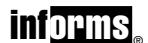

DOI 10.1287/mnsc.1060.0568 © 2006 INFORMS

## Network Software Security and User Incentives

## Terrence August, Tunay I. Tunca

Graduate School of Business, Stanford University, 518 Memorial Way, Stanford, California 94305-5015 {taugust@stanford.edu, tunca\_tunay@stanford.edu}

We study the effect of user incentives on software security in a network of individual users under costly patching and negative network security externalities. For proprietary software or freeware, we compare four alternative policies to manage network security: (i) consumer self-patching (where no external incentives are provided for patching or purchasing); (ii) mandatory patching; (iii) patching rebate; and (iv) usage tax. We show that for proprietary software, when the software security risk and the patching costs are high, for both a welfare-maximizing social planner and a profit-maximizing vendor, a patching rebate dominates the other policies. However, when the patching cost or the security risk is low, self-patching is best. We also show that when a rebate is effective, the profit-maximizing rebate is decreasing in the security risk and increasing in patching costs. The welfare-maximizing rebates are also increasing in patching costs, but can be increasing in the effective security risk when patching costs are high. For freeware, a usage tax is the most effective policy except when both patching costs, and security risk are low, in which case a patching rebate prevails. Optimal patching rebates and taxes tend to increase with increased security risk and patching costs, but can decrease in the security risk for high-risk levels. Our results suggest that both the value generated from software and vendor profits can be significantly improved by mechanisms that target user incentives to maintain software security.

*Key words*: information systems; IT policy and management; network economics; economics of IS *History*: Accepted by Barrie R. Nault, information systems; received August 6, 2005. This paper was with the authors 3 months and 1 week for 1 revision.

### 1. Introduction

With approximately 800 million worldwide users, the Internet as a network of interconnected computers is unprecedented in its size, reach, and content (*Internet World Stats* 2004). One of the most important issues that arises in such a broad communications environment—in which all systems share not only the benefits of the ability to communicate with a vast number of other users, but also the vulnerabilities that come with it—is information security. As the recent years have proven, increased Internet usage has brought about increased security attacks, with the number of reported security incidents reaching 140,000 in 2003, a nearly sixty-fold increase compared to 1995 (CERT 2004).

The cumulative cost of information security breaches has many different implicit and explicit components, some of which can be difficult to quantify, including the direct costs of repairing and rebuilding infected systems, lost sales, and reduced productivity due to loss of reputation (D'Amico 2000, Garg 2003, Timms et al. 2004). The cost of system security breaches is intimately tied to the nature of a firm's business, the firm's reputation, the size of the firm, and the significance of the attack. These costs vary widely among users and can be substantial. The total worldwide cost of 14 major attacks between 1999 and

2004 was estimated to be about \$36.5 billion (*Computer Economics* 2004).

Despite the immense losses due to security vulnerabilities, prevention is difficult in an open network environment such as the Internet, which is formed of users with a wide range of motivations and resources. This becomes especially clear when one considers that maintaining the security of a local network is a costly endeavor requiring physical and computing resources as well as the time and efforts of expert system administrators. In addition, software patching imposes risks of system crashes and instability (MS-Support 2004, Schweitzer 2003). As a result, proper patch maintenance typically involves a careful system administrator dedicating time toward testing of patch integrity and application interactions as well as final installation on a production server. Combining various dimensions of costs, per-server patching costs are estimated to be hundreds of dollars (e.g., Bloor 2003, Davidson 2004, Symantec 2004). Unfortunately, for a widely used software product such as Microsoft IIS, not all consumers have sufficient incentives to undergo these costs. Consequently, system security as a whole suffers from users not acting in an optimal way when it comes to maintaining network security (e.g., Lemos 2003, 2004; Messmer 2004b; Sullivan 2004).

As an example, consider the case of the "Code Red" worm and its successor "Code Red II," which hit during the summer of 2001. Exploiting a buffer-overflow vulnerability in IIS, the worm replicated 100 times over upon each infection. Code Red II opened up "backdoor" access on affected servers, providing people with malicious intent with full privileges on these servers. Given this degree of compromise, the requisite corrective action often involved completely reformatting affected servers and reinstalling all software to the original form. The cost to compromised firms associated with bad service to consumers, public defacement, and technical labor hours, was substantial. The most troubling part is that these damages could have been prevented. Microsoft released a patch for the IIS vulnerability exposed by Code Red one month prior to the attack. Poor patching behavior in the user community extended the life and spread of these twin worms and caused damages reaching \$2.6 billion (Moore et al. 2002). Code Red is no exception. Most security attacks exploit known vulnerabilities for which patches are already available. Patches were also available for the vulnerabilities exploited by major worms such as Nimda, Slammer, Blaster, and Sasser up to six months in advance of each attack. In virtually all of these cases, large losses could have been mostly avoided by proper patch maintenance by the consumers (Schweitzer 2003).

As these examples demonstrate, because of network effects, the actions that each user takes in the face of a potential security threat can have important consequences on other users, and mechanisms to induce the right incentives for patching, both from the point of view of a profit-maximizing vendor and a social welfare-maximizing planner, need to be considered. In this paper, we present a model of a market for a software product with a potential security vulnerability to compare mechanisms aimed to mitigate the security problem by utilizing user incentives. The consumers who choose to purchase or use the software face a decision whether to undergo patching costs to maintain the security of their software. If they patch their systems, they avoid the risk of being hit by worms and do not cause negative externalities on the other users. However, if they avoid patching, they not only risk being hit but also increase the risk faced by other users. The equilibrium patching decisions of the users depend on the cost of patching and the overall riskiness of the software. This, in turn, determines the equilibrium purchasing decisions of the consumers. We consider two different cases: (a) proprietary software that is offered by a vendor who produces and sells copies of it for profit (e.g., Microsoft IIS); (b) freeware, which is available to users at no charge and often distributed by open source development projects (e.g., Apache http server). For both cases, we examine four candidate policies: (i) consumer self-patching, where users make their own decisions on patching (i.e., the status quo); (ii) mandatory patching, where users, by agreement, are required to patch when one is available; (iii) patching rebate, where users are compensated by the vendor when a patch is available and they actually patch; and (iv) usage tax, where a social planner imposes a tax on the usage of the software in order to control the negative network externalities caused by lowvaluation users who are not reliable patchers.

For proprietary software, contractually mandating patching can substantially reduce the vendor profit and hence is not an appealing policy for a software vendor to apply. Although mandating patching can improve expected social welfare, for most cases it will reduce the welfare by inducing the vendor to price at levels that move the network away from the overall socially optimal security level. We also find that if the risk that the users are facing is small compared to the patching costs, patching rebates cannot increase the vendor's expected profit, because it will cost the vendor too much to induce a desired level of patching behavior. On the other hand, if the security risk is high, the vendor can increase his profits through rebates by inducing increased security and, consequently, increased value of his product. Similarly, by inducing efficient patching behavior, rebates can be an effective tool for a social welfare-maximizing planner when the security risk and patching costs are high. However, by significantly reducing the usage, taxes are not helpful for increasing either vendor profits or social welfare, even though they may increase the security of the product. We also show that the optimal patching rebate and the corresponding vendor price tend to increase in patching costs, but decrease in the effective riskiness of the software. However, when the patching costs are high, the optimal plannerdetermined rebate increases with the security risk to reduce the high network externalities that arise from poor user patching behavior. These results are summarized in Table 1. Panel A gives the policy recommendations, and Panel B gives the comparative statics results for the optimal vendor price, rebates, and tax.

When software is freeware, we demonstrate that mandating patching reduces welfare by forcing consumers to make socially inefficient decisions. However, our conclusions about the impact of the rebates and taxes change significantly. Unlike proprietary software, patching rebates have only limited effectiveness for freeware, because they often induce users to patch in cases where doing so is socially inefficient. However, taxes can be effective because they eliminate low-valuation users who do not patch and cause negative security externalities on other users. When the security risk or patching costs are low—unlike the

Table 1 Policy Recommendations and Comparative Statics for Optimal Rebates, Prices, and Taxes

|                      | Proprietary software Social welfare and vendor profit |                       | Freeware Social welfare                   |                       |
|----------------------|----------------------------------------------------------|-----------------------|----------------------------------------------|-----------------------|
| Panel A:             |                                                          |                       |                                              |                       |
|                      | Low security risk                                     | High security risk | Low security risk                         | High security risk |
| Low patching cost    | Self                                                     | Self                  | Rebate                                       | Tax                   |
| High patching cost   | Self                                                     | Rebate                | Tax                                          | Tax                   |
| Panel B:             | Vendor price and planner-determined rebate            |                       | Vendor price and vendor-determined rebate |                       |
| Proprietary software | Security risk                                            | Patching cost         | Security risk                                | Patching cost         |
| Low patching cost    | −                                                        | +                     | −                                            | +                     |
| High patching cost   | +                                                        | +                     | −                                            | +                     |
|                      |                                                          |                       |                                              |                       |

|                               | Planner-determined rebate and tax |               |  |
|-------------------------------|--------------------------------------|---------------|--|
| Freeware                      | Security risk                        | Patching cost |  |
| Rebate: Med. security risk | 0                                    | +             |  |
| Tax: Low security risk     |                                      | 0             |  |
| High security risk            | + −                               | +             |  |

Notes. Panel A provides recommendations to a social welfare-maximizing planner and a profit-maximizing vendor. "Self" refers to the self-patching policy with no incentives, "rebate" refers to the patching rebate policy, and "tax" refers to the usage tax policy. Panel B provides comparative statics on the vendor's optimal price, the optimal rebate, and usage tax. All results are given for the ranges where comparative statics are applicable, i.e., where the considered policy is effective.

case of proprietary software, where self-patching is preferable—for freeware, an intervention by a social planner through rebates and taxes increases social welfare. When both software riskiness and the patching costs are low, rebates are preferable, while for high patching costs or security risk, a tax policy can significantly increase social welfare, and be preferred. The optimal tax and rebate tend to increase with the security risk and the patching costs except when the security risk is high, in which case further usage should be encouraged by lowering the tax. These results are again summarized in Table 1.

The remainder of this paper is organized as follows. Section 2 presents the literature review. Section 3 presents the basic model and derives the equilibrium purchasing and patching behavior for a given set of parameters and price per copy of the software. Section 4 presents the vendor's price-setting problem and compares different incentive mechanisms for the case of a profit-maximizing vendor. Section 5 explores and compares policies for freeware. Section 6 offers our concluding remarks.

## 2. Literature Review

The role of incentives in software security is a relatively new research subject, but the literature in the area is growing. Anderson (2001) argues that information security is not simply a technical problem that can be solved by more sophisticated hardware, software, and strategies. Rather, the problem with information security is due to the fact that the economic incentives are misaligned. Kunreuther et al. (2002) and Kunreuther and Heal (2002) identify a concept for security interdependence and study security investment decisions made by agents in a computer network when each agent's decision impacts the risk endured by the other agents. They examine a model where there is a single shared resource whose security is increased by user investments, and proceed to characterize the equilibrium investment strategies and their dependence upon the cost structure. They conclude that in order to best induce adoption of security measures, regulation and institutional coordination mechanisms are needed. Varian (2004) considers how the reliability of a public good is affected by the efforts of individuals working in teams with varying incentives and effects on system security. He finds that when system reliability is based upon total effort, it is completely determined by the agent with the highest benefit-cost ratio. On the other hand, when reliability depends on the weakest link, the agent with the lowest benefit-cost ratio contributes the effort. When maximum effort is the determinant of system reliability, however, either of these equilibria can result. Choi et al. (2005) explore a model with negative network security externalities to examine the optimal software vulnerability disclosure decision of a vendor, finding that firms may announce vulnerabilities when it is not socially optimal. Arora et al. (2005) analyze the optimal timing for disclosure of software security vulnerabilities and establish that vendors always choose to release a patch later than a socially optimal disclosure time. Jaisingh and Li (2005) examine the role of commitment in optimal social policy for disclosure of vulnerabilities when the social planner commits to a disclosure agenda, and the vendor determines the patch-release time after a vulnerability is discovered. They find that the time lag between the decisions of the social planner and the vendor is important only when the the hacker can accumulate experience from vulnerabilities over time. Cavusoglu et al. (2005) explore a model to derive the optimal frequency of patching to balance the operational and damage costs associated with security vulnerabilities. They show that a firm's patch cycle is not necessarily synchronized with the vendor's patchrelease cycle and demonstrate that cost sharing and liability schemes may coordinate these cycles. In our model, the focus is on the role of externalities in a network environment. We explore policies to maximize the value generated by software and highlight that consumers' purchase (or usage) decisions play a fundamental role in our results, as does the vendor's profit maximization.

Moore et al. (2002) find that most of the victims of the Code Red worm were home and small business users rather than large corporations, while most of the costs in terms of damages were borne by the large corporations that were hit. This demonstrates that low-valuation consumers, e.g., home and small business users, do not have as much motivation as high-valuation consumers, e.g., large corporations, to engage in reducing risk on the network by securing their systems. The equilibrium patching behavior and the loss structure in our model is consistent with these findings. Weaver et al. (2003) demonstrate that for a scanning worm, the spread rate is proportional to the size of the vulnerable population. The infection model we use in our paper is consistent with this observation.

Our work is also related to research in vaccination incentives and the economics of disease-spread control found in the public health literature. Although recognizing the externalities imposed by unprotected agents on the population as a whole, traditionally, the literature on mathematical epidemiology (e.g., Bailey 1975, Anderson and May 1991) does not consider the role of economic behavior and incentives of individuals in prevention and control of disease spread. Brito et al. (1991) is one of the first papers to consider individual incentives and their role with negative externalities in a biological disease-spread setting. They find that mandating vaccination reduces social welfare and that tax/subsidy levers are useful for governmental welfare coordination. Francis (1997) establishes that under certain assumptions, in a dynamic model of vaccination, government intervention may not be necessary, i.e., agents may behave in a manner consistent with the social objective. Gersovitz (2003) shows, on the other hand, that when one takes into account certain factors such as recoveries and deaths, the decentralized outcome diverges from the social outcome, and the necessity of economic intervention through market forces or government is persistent.

Geoffard and Philipson (1996) highlight the differences between economic models and mathematical epidemiological models, and their implications. In a model of disease spread, with rational agents choosing between protective and exposed activity, they find that the hazard rate of infection may be a decreasing function of disease prevalence, resulting from increased demand for protection due to rational behavior. This result is contrasted with results from the epidemiological literature, where the hazard rate is typically increasing with prevalence. Kessing and Nuscheler (2003) study the case of a vaccine monopolist and argue the ineffectiveness of subsidies to improve social welfare. Kremer (1996) shows that the behavior of heterogeneous agents increases the effectiveness of public policy intervention in populations of high disease prevalence, stressing that the models of such epidemics must be fundamentally economic ones. Several other dynamic economic models of disease spread examining the role of rational individuals' trade-offs between costly protection and the risk that is imposed by negative externalities of other individuals and the social planner's welfare maximization through the use of preventive and therapeutic measures can be found in Goldman and Lightwood (2002) and Gersovitz and Hammer (2004, 2005).

Our result, that mandatory patching decreases social welfare in the freeware case, is parallel to the finding of Brito et al. (1991). We also look at rebate and tax mechanisms that a social planner may use to increase social welfare. However, unlike the biological disease-spread literature, our case of proprietary software involves a profit-maximizing vendor who sets a price for the usage of the activity. Our goal is to better understand how the negative externalities that arise due to spread of malicious code affect the vendor's profit-maximization problem and, subsequently, how both consumer and vendor behavior together impact social welfare. Further, our results are driven by issues that are different in nature, such as the trade-off between surplus generated by increased usage of software and the security risks that accompany it. The true analogs of the usage decisions (for instance, an agent's decision to live or die or a vendor "selling life" to people) would not be reasonable issues to consider in most biological settings, much less their control by a social planner through incentives such as taxes.

The literature on the economics of biological epidemiology demonstrates that in many cases agents' individual decisions result in misalignment of incentives, and therefore economic intervention by a social planner is necessary. Although the evolution of the spread of a malicious agent has a dynamic nature, static models also manage to capture this incentive misalignment (for instance, heterogeneity of preferences in the population as we have in our model is sufficient to expose this, as also indicated by Francis 1997). Further, there are certain differences between the time frames of most cases of biological epidemics and computer network security attacks, which makes a static model more suitable in the latter case by comparison. In dynamic models of biological epidemics, the spread depends on deaths, recoveries, and the structural nature of contact among the agents, and hence the vaccination/prevention decisions evolve in time with the spread of the disease. This is because the time frame for the spread of a biological disease is several days, weeks, or months in most cases, if not

Figure 1 Model Timeline

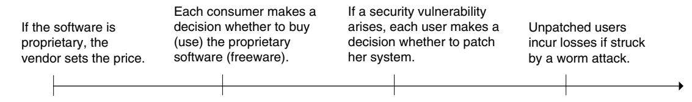

longer. Further, individual vaccinations take a small amount of time compared to the epidemic time frame, and therefore dynamic control of incentives with the evolution of an epidemic is possible. On the other hand, for most cases of computer network attacks, the broad spread of the "infection" may take minutes (e.g., Moore et al. 2003 and Shannon and Moore 2004), while patching often takes hours or sometimes even a full day or more (e.g., Nicastro 2005 and Leung 2005). Specifically, if a user's system is unpatched when an attack breaks on the network it is usually too late to patch. Therefore, in the computer security context, in order to shield for a potential attack, a user usually must patch before such an attack occurs. Thus, the patching decision is not as much related to the specific dynamics of the spread of infection in the network as the vaccination decisions in the dynamic context of a biological epidemic. Considering these facts, and to keep the analysis simple, we employ a static model that captures the main economic tradeoffs related to the spread of a computer worm in a network environment. Although our static approach is simpler compared to the dynamic models in the economics of biological epidemiology, it allows us to demonstrate the intuition behind our arguments and the effects of the incentive schemes that we analyze and compare.

## 3. The Model and the Consumer Market Equilibrium

### 3.1. Model Description

There is a continuum of consumers whose valuations of a software product lie uniformly on  $\mathcal{V} = [0, 1]$ . There are three periods: In the first period, given the price of the software, each consumer makes a decision whether to buy or not to buy the product. The software may have a potential security vulnerability. If there is a vulnerability, it can be exploited by hackers who write worms to cause damage to purchasing consumers' systems. In the second period, it is revealed whether the software has a vulnerability, and if there is a vulnerability, a patch is made available to the users (either by the vendor if the software is proprietary or by the developers of the freeware). At this stage, each user makes a decision whether to patch or not, considering the costs of patching versus value risked by not patching. If a consumer chooses to patch the software, she will incur an expected cost denoted by  $c_p > 0$ , which we refer to as the *effective patching cost*. This cost accounts for the money and effort that a consumer must exert in order to verify, test, and roll out patched versions of existing systems.1 Finally, if there is a security vulnerability, an attack may occur in the third period, and the unpatched consumers may get hit and incur losses. However, the consumers who patched in the second period are fully protected and do not incur any losses. The timeline is illustrated in Figure 1.

We denote the probability of both a security vulnerability and a worm attack occurring on the network with  $\pi$ . If the mass of the unpatched population in the network is u, then the probability that the worm will successfully penetrate the network and hit an unpatched user will be  $\pi u$ . If a user's system is unpatched and is hit by the worm, one would expect that she suffers a loss positively correlated with her valuation. That is, the consumers with high valuations will suffer higher losses than the consumers with lower valuations due to opportunity costs, higher criticality of data, and loss of business. For simplicity, we assume that the correlation is of first order, i.e., the expected loss that a consumer with valuation v suffers if she is hit by a worm is  $\alpha v$  where  $\alpha > 0$  is a constant.

We denote the strategy set for a given consumer with S. We refer to the purchasing decision as either buy, B, or not buy, NB. Similarly, the patching decision is denoted by either patch, P, or not patch, NP. The consumer action space then becomes  $S = \{B, NB\} \times \{P, NP\} - (NB, P)$ , the last exclusion stemming from (NB, P) clearly being infeasible. Given the price  $p \ge 0$ , in a consumer market equilibrium, each consumer maximizes her expected utility, taking the equilibrium strategies for all consumers as fixed. For a strategy

&lt;sup>1 Note that a single decision maker can own multiple hosts (e.g., servers) on which she makes purchasing and patching decisions. Technically, the analysis will not be affected as long as each decision maker owns at most countably many hosts.

 $^2$  Note that this loss structure is robust to the exact information that the users have about the realizations of their losses, i.e., whether the users know exactly what their losses will be if they are hit by an attack or only have an ex ante probability distribution on those losses. In the latter case, the losses integrate out of the expected payoff to the users into an expected loss  $\alpha v$ , and the rest of the analysis is unaffected.

profile  $\sigma$ :  $\mathcal{V} \to S$ , the expected cost faced by the consumer with valuation v is then defined by

$$C(v,\sigma) \triangleq \begin{cases} \pi u(\sigma)\alpha v & \text{if } \sigma(v) = (B, NP), \\ c_p & \text{if } \sigma(v) = (B, P), \end{cases}$$
 (1)

where  $u(\sigma) = \int_{\mathcal{V}} 1_{\{\sigma(y)=(B, NP)\}} dy$  and  $1_{\{\sigma(y)=(B, NP)\}}$  is 1 if  $\sigma(y) = (B, NP)$  and zero otherwise.3 The surplus gained by the consumer with valuation v by employing the software will then be  $v - C(v, \sigma)$ , less the price she pays for the software. The consumers who buy but do not patch cause a negative externality on all users by decreasing the safety of the network and the software. Clearly, for any  $v \in \mathcal{V}$ ,  $C(v, \sigma)$  defined by (1) is increasing in  $u(\sigma)$  (i.e., the unpatched population). Furthermore, consumers who patch protect themselves from the negative externality caused by the unpatched population. To avoid trivialities, and without loss of generality, we focus on the parameter space where  $c_p \in (0, 1)$ ,  $\pi \in (0, 1]$ , and  $\alpha \in (0, \infty)$ . For convenience, we refer to the product  $\pi\alpha$  as the effective security risk.

### 3.2. Equilibrium

We will consider the software being offered by either a vendor (§4), in which case the price of the software will be determined by the vendor; or as freeware (§5), in which case the price will be zero. In this section, we derive the consumer market equilibrium, taking the price *p* as given. That is, we concentrate on the last two (purchasing and patching) out of three stages of decision making in the model. In equilibrium, holding all other consumers' actions fixed—i.e., given the equilibrium strategy profile  $\sigma^*$ —each consumer chooses the action from S that maximizes her expected payoff. The following lemma gives the consumer market equilibrium.

**Lemma** 1. Given the parameters  $\pi$ ,  $\alpha$ ,  $c_v$ , and the consumer price  $p \in [0, 1]$ , there exists a unique equilibrium in the consumer market.4 The equilibrium consumer strategy profile is characterized by  $v_b$ ,  $v_p \in [0, 1]$ , and  $v_b \leq v_p$  such that, for  $v \in \mathcal{V}$ ,

$$\sigma^*(v) = \begin{cases} (NB, NP) & \text{if } 0 \le v < v_b; \\ (B, NP) & \text{if } v_b \le v < v_p; \\ (B, P) & \text{if } v_p \le v \le 1. \end{cases}$$
 (2)

Let  $\bar{p} \triangleq (1 - c_p)(1 - c_p/(\pi \alpha))^+$ . Given (2), the patching behavior is characterized by two regions in the parameter

Region I: If  $\pi \alpha \ge c_p$  and  $p < \overline{p}$ , then (i) When p > 0, in equilibrium,  $p < v_b < p + c_p < 0$  $v_p = c_p v_b / (v_b - p) < 1.$ 

(ii) When p=0, if  $c_p \leq \pi\alpha \leq 1/c_p$ , then  $v_b=0$ , and  $v_p=\sqrt{c_p/(\pi\alpha)}$ . If  $\pi\alpha \geq 1/c_p$ , then  $v_b=c_p-1/(\pi\alpha)$ , and

 $v_p = c_p$ .

Region II: If  $\pi \alpha < c_p$  or both  $\pi \alpha \ge c_p$  and  $p \ge \overline{p}$ , then 0

As can be seen from Lemma 1, in equilibrium the population is segmented into three groups, namely nonbuyers, buyers who do not patch in case of a vulnerability, and buyers who do patch in case of a vulnerability. This separation occurs due to the monotonicity of the relative losses that arise from nonpatching behavior in equilibrium: Given the risk that arises from the collective behavior of the population, if a consumer purchases the product, any consumer with higher valuation will prefer to purchase the product. Furthermore, if a consumer patches the product, any consumer with a higher valuation, who is facing a higher security risk, will also find it preferable to patch the product. This three-tier structure is consistent with observations that indicate highervaluation users (such as larger corporations and institutions) are more likely to be patchers, while the lower-valuation users (such as small companies and home users) are less likely to patch and thus contribute to the faster spread of malicious code such as worms (Moore et al. 2002).

A patching population will exist only if the effective security risk is sufficiently high and the price is sufficiently low. If the price is sufficiently high, the purchasing population will be small, and no user will patch (i.e.,  $v_v = 1$ ). This remains true even as  $\pi \alpha$ goes to infinity: The size of the purchasing population will shrink until it reaches a level where the equilibrium risk is finite, and some users find it worthwhile to purchase the software and bear the risk (i.e., as  $\pi \alpha \to \infty$ , the purchasing population shrinks in the order of  $1/(\pi\alpha)$ ).

The case when p = 0 is noteworthy. As can be seen from Lemma 1, when the effective security risk is low compared to the patching cost (i.e., when the market is in Region II), all consumers "buy" the product and no consumer patches. When expected security losses are moderate (i.e., when  $c_p \leq \pi \alpha \leq 1/c_p$ ), all users still choose to employ the product, but in this case, because potential losses are high, some of them find it worthwhile to patch. When the effective security risk is high however (i.e., when  $\pi \alpha > 1/c_v$ ), some consumers do not employ the software even though it is available for free.

Because  $v_b in Region I, by Lemma 1, there is$ always a group of consumers who do not patch. Thus,

&lt;sup>3 The notation "≜" has the meaning "as a definition" throughout the paper.

&lt;sup>4 Uniqueness is naturally up to positive measure.

the software always comes with a certain amount of risk unless the user patches it. Therefore, as can also be seen from the lemma (unless p=0 and  $\pi\alpha<1/c_p$ ), the condition  $v_b>p$  always holds, and hence there is a population of users whose valuations are higher than the price but end up not purchasing the product, resulting in inefficiencies in product usage.

Thus far, we have focused our attention on self-patching, where consumers decide whether or not to patch in self-interest. Henceforth, we will denote this policy with the subscript "s" to separate it from the other policies we will be examining later in the paper. Further, we will utilize superscripts *i* and *ii* to indicate whether the measure of interest has an equilibrium outcome in Region I or Region II as described in Lemma 1, respectively.

## 4. Proprietary Software

Suppose that the software is offered by a profit-maximizing vendor who sets the price. Without loss of generality, we assume that the marginal cost of production for each copy of the software is zero. Under self-patching, given effective patching cost ( $c_p$ ), effective security risk ( $\pi\alpha$ ), and the consumer market equilibrium outcome of Lemma 1, the vendor faces the following optimization problem

$$\max_{p} \ \Pi_{s}(p) \triangleq p(1 - v_{b})$$
s.t.  $0 \le p \le 1$ , (3)

where  $v_b$  is as described in Lemma 1. This problem has a well-defined solution, and depending on the parameters, under optimal vendor pricing, the consumer market equilibrium may or may not yield a patching population. Specifically, when the effective security risk is high, the vendor must price the software low to increase the purchasing population, and as a result, higher-valuation customers will elect to patch, moving the equilibrium to Region I as specified in Lemma 1. On the other hand, when the security risk is low with respect to the patching costs, the vendor can optimally price the product high enough without reducing the buyer population, even driving the equilibrium to Region II of Lemma 1, where no consumer patches (see Lemma A.2 in the appendix for details on the vendor's optimal pricing behavior; the appendix is available as an online supplement on the Management Science website at http://mansci.pubs. informs.org/ecompanion.html).

In this section, we will investigate the effects of security policies on social welfare. Therefore, before proceeding, we define the measure of social welfare. Adding the expected surpluses for the consumers and the vendor, we obtain the expected social welfare as

$$W(p) \triangleq \int_{\{v \in \mathcal{V}: v > v_h\}} (v - C(v, \sigma^*)) dv. \tag{4}$$

Notice that, in effect, W(p) measures the expected social welfare generated by the policy under consideration by subtracting the security costs induced from the value generated by that policy.

### 4.1. Mandatory Patching

Under network effects, when consumers make selfpatching decisions, the population of consumers who purchase and choose not to patch can decrease the value of the product and consequently reduce vendor profits and social welfare. Therefore, one might suggest that mandating patching might be helpful by eliminating the unpatched population and hence reducing security losses associated with the product, as has been voiced and discussed by some experts and government authorities (e.g., Middleton 2001, Geer 2004, Bragg 2004). In the context of computer networks, the monitoring and enforcement of the patching of software is easily technically implementable. Software that detects installation of updates for various applications (e.g., spyware protection definition files or even plain updates to Internet software such as media players), and practices such as disabling certain functionalities of machines that fail to demonstrate such installations in certain cases (as it is sometimes called "blackholing"), are in broad use today. Further, the fully observable nature of the technology also enables the contractibility of mandatory patching, and such a condition can easily be made part of a licensing agreement.

The questions then are: Can the vendor increase his profit by contractually mandating patching to the buyers? Can mandating patching increase social welfare? To answer these questions, we next consider a mandatory patching policy offered by the vendor to the consumers. That is, the purchase of the software involves a binding commitment to patch the software if a security vulnerability emerges. We will be using the subscript "m" to denote the mandatory patching policy.

Unlike with self-patching, when patching is mandated, all consumers must decide whether to buy the software, given that they must patch the software at an effective cost of  $c_n$  due to security vulnerabilities. Consumers will purchase and patch the software per the purchase agreement with the vendor, and because there is no risk, it follows that  $v_b = v_p = p + c_p$ , which says that a consumer only buys the software if her valuation is higher than the price plus the effective patching cost. Thus, the equilibrium is characterized by a single-threshold valuation  $v_m \triangleq p + c_v$ . Consumers with valuations  $v \geq v_m$ purchase and patch the software. Consequently, the profit function for the vendor is given by  $\Pi_m(p) \triangleq$  $p(1-v_m) = p(1-p-c_v)$ , which is maximized at  $p_m^* =$  $(1 - c_p)/2$ , with optimal profit  $\Pi_m(p_m^*) = (1 - c_p)^2/4$ . Then, by Lemma 1, the purchasing threshold under self-patching satisfies  $v_b < v_m$  for any p. Specifically, this inequality holds at  $p_m^*$ . Thus,

$$\Pi_s(p_s^*) \ge \Pi_s(p_m^*) = p_m^* (1 - v_b(p_m^*)) > \Pi_m(p_m^*).$$
 (5)

Intuitively, the vendor is better off by employing a self-patching decision policy and charging the optimal price he charges under mandatory patching. Under such an action, all users who employed the product under mandatory patching would still be users. If the user with valuation  $p_m^* + c_p$  patches under self-patching, then the marginal consumer at this valuation level will purchase the product because her valuation is higher than  $p_m^*$  and there is no security risk. If the user with valuation  $p_m^* + c_p$  does not patch, it follows that the patching cost must be higher than the risk that the marginal user is facing, and she will again find the product attractive without patching in case a security vulnerability arises. In both cases, the user population will increase, i.e., the vendor can improve his profits by allowing users to make their own patching decisions and charging the same price as he would with a mandatory patching policy.

From the vendor's standpoint, consumers assuming risk in an incentive-compatible way, by resolving their own trade-off between the risk of not patching and the cost of patching, is profitable. As a result, self-patching yields higher profit for the vendor, i.e., mandatory patching strictly decreases vendor profits. As we mentioned above, this result is consistent with what is seen in the software industry. Although it is technologically feasible, vendors typically do not require the purchasing consumers to patch their systems when vulnerabilities arise.

While contributing to increased vendor profits, consumers assuming security risks as opposed to undergoing patching costs may increase total risk for the population through network effects, and ultimately reduce social welfare. Therefore, one might argue that mandating patching can increase social welfare, and this possibility needs to be explored. The following proposition examines the effect of mandatory patching on the expected social welfare and shows that mandatory patching may in fact be undesirable.

Proposition 1. If (i)  $\pi \alpha < c_p$ ; or (ii)  $\pi \alpha \ge c_p$  and there is a population of users who are patching the software under the vendor's optimal pricing decision, then mandating patching decreases social welfare.

When the effective security risk is low compared to the patching cost (i.e., when  $\pi \alpha < c_p$ ), mandating consumers to patch not only reduces the number of buyers, but also forces some buying consumers to make socially inefficient decisions by undertaking high patching costs when it is unnecessary. Consequently,

expected social welfare decreases with mandatory patching for such cases, as stated in Part (i) of Proposition 1 and illustrated in Panel A of Figure 2. When the security risk is high and there is a patching population under the vendor's optimal pricing (i.e., the market is in equilibrium Region I described in Lemma 1), the existence of a patching population makes the software safer and increases the value of the software. As a result, we again see that mandating patching decreases social welfare, as indicated in Part (ii) of Proposition 1 and illustrated in Panel B of Figure 2.

When  $\pi \alpha \geq c_v$  and no consumer is patching in equilibrium, mandating patching can either decrease or increase the social welfare. If the patching cost and the security risk are both moderate, mandating patching can reduce the expected social welfare, as shown in Panel C of Figure 2, by reducing the consumer base. However, when both the patching cost and the effective security risk are high, the vendor might find it optimal to price the product in such a way that the buying population is small, and no consumer finds it optimal to patch if a security vulnerability emerges. In such a case, mandating patching can increase the number of buyers because it forces the vendor to reduce prices significantly, which makes the software attractive to a higher number of consumers even when those consumers are forced to bear patching costs. As a consequence, mandating patching can increase social welfare. Such a case is illustrated in Panel D of Figure 2.5

### 4.2. Patching Rebates

We have seen in §4.1 that contractually mandating consumers to patch does not improve vendor profit and is usually not helpful in increasing social welfare. The primary reason for the ineffectiveness of mandatory patching is that consumers are forced to bear the potential patching costs when they purchase the product, which negatively influences their purchasing behavior. This observation suggests that leaving the patching decision to the consumers is preferable, and other ways to improve users' patching behavior should be investigated. One way of doing so is to provide users with increased incentives to patch by offering rebates to patching customers. Such a mechanism can improve vendor profit by increasing the patching consumer population, thereby lowering the

&lt;sup>5 This also demonstrates the difference in the effect of negative network externalities in the contexts of vendor-intermediated software security and disease control. For instance, Brito et al. (1991) demonstrate that in the case of disease spread, where there is no intermediating vendor, mandating patching always decreases social welfare. In our case, however, mandating patching can make the vendor radically decrease the price of the software and cause an increase in usage, which in turn increases social welfare.

Figure 2 Expected Social Welfare and Vendor Profit as a Function of Price

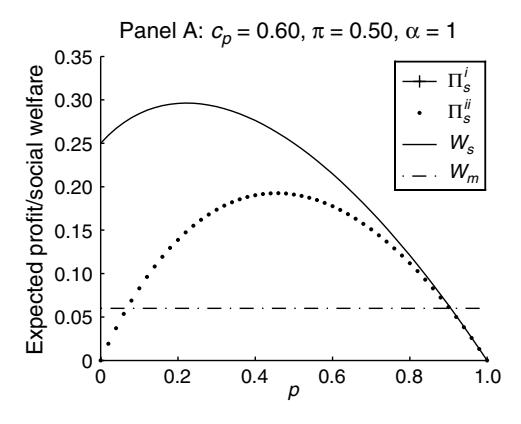

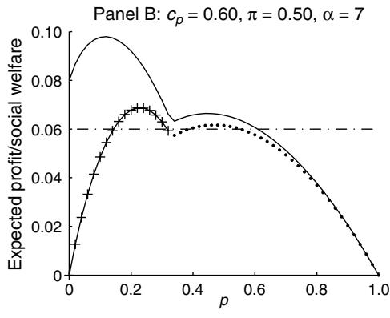

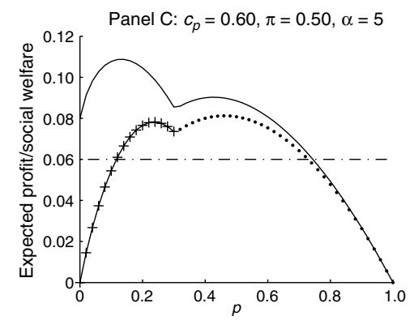

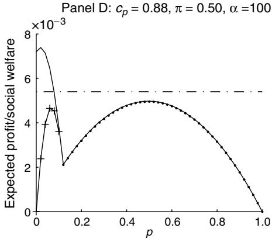

*Notes.* The parameters are  $c_p=0.60$ ,  $\pi=0.50$ , and  $\alpha=1$  for Panel A;  $c_p=0.60$ ,  $\pi=0.50$ , and  $\alpha=7$  for Panel B;  $c_p=0.60$ ,  $\pi=0.50$ , and  $\alpha=5$  for Panel C; and  $c_p=0.88$ ,  $\pi=0.50$ , and  $\alpha=100$  for Panel D.

security risk of the software and allowing the vendor to charge a higher price to remaining consumers.

Based on this intuition, we next consider an incentive scheme in which the vendor offers a compensation to consumers contingent upon their patching of the software product in case a security vulnerability arises. Specifically, each consumer who patches when a security vulnerability arises receives, in expectation, an *effective rebate*  $0 \le r \le c_v$ . We consider two cases: (i) The vendor determines the rebate to give to the patching customers by jointly optimizing the rebate amount and the price; and (ii) a social planner determines the rebate amount, and taking that rebate amount as given, the vendor determines the price of the software. We use a subscript "v" to denote that the rebate is determined by the vendor and a subscript "g" (for government) to denote that the rebate is determined by a social planner.

**4.2.1. Vendor-Determined Rebate.** We first examine the incentives for a vendor to offer patching rebates. The expected profit for the vendor with an effective rebate r can be written as  $\Pi_v(p,r) \triangleq p(1-v_b)-r(1-v_p)$ , and the vendor needs to optimize with respect to both price and the rebate amount, i.e., he solves the following maximization problem:

$$\max_{p,r} \ \Pi_v(p,r)$$
s.t.  $0 \le r \le c_p$ 

$$0 \le p \le 1,$$
(6)

where  $v_b$  and  $v_p$  satisfy the conditions given in Lemma 1 with parameters  $\pi \alpha$ ,  $c_n - r$ , and p. Here, the vendor is facing a trade-off: The higher the rebate paid to the consumers, the larger the population of consumers who patch. A larger patching population effectively increases the security of the software, thus allowing the vendor to increase his optimal price in such a way as to increase his expected profit. On the downside, if a security vulnerability arises, the vendor must assume a larger portion of the consumers' patching costs. Whether offering such a rebate can ever *strictly* increase the vendor's profit is an open question. The following proposition demonstrates that this is possible. Further, the proposition establishes the parameter ranges where the offering of such a rebate is desirable and not desirable for the vendor, as well as providing comparative statics for the optimal rebate and price.

Proposition 2. Consider a patching rebate offered by a software vendor.

- (i) There exists a threshold  $\bar{\omega} > 0$  such that if  $\pi \alpha \geq \bar{\omega}$ ,
- (a) A rebate policy can strictly increase the vendor's expected profit if and only if  $c_p > 1/3$ .
- (b) The optimal rebate  $(r_v^*)$  and the optimal price  $(p_v^*)$  are decreasing in  $\pi \alpha$ .

- (c) As  $\pi \alpha$  becomes large,  $r_v^* \rightarrow (3c_p 1)/4$  and  $p_v^* \rightarrow (1 + c_p)/4$ .
- (ii) If  $\pi \alpha < c_p^2/(1+c_p)$ , then there does not exist a patching rebate, r > 0, that will increase the vendor's expected profit, i.e., the self-patching policy is optimal for the vendor.

When both the patching cost and the effective security risk are high, the vendor must price low to induce purchases, and the consumer population consists of high-valuation consumers who are sensitive to the security of the software. In such a case, by offering a rebate, he can induce an increased patching population and increase the security of the product. As a result, and because of the sensitivity of his users to the security of the software, he can then increase his price and, consequently, his profits. However, when the patching costs are sufficiently low, the vendor can price relatively high. Further, in that case a larger patching population exists, and rebates may not help to further increase the patching population as significantly, while making the vendor unnecessarily provide incentives to users who would patch even without rebates. Consequently, offering rebates can backfire and reduce the vendor's profits, as stated in Part (ii) of Proposition 2.

When the expected security risk is sufficiently large, the optimal rebate amount and the optimal price decrease with increased security risk. In this region, a further increase in risk significantly reduces the purchasing population, and by reducing prices (which come with reduced rebates), the vendor can increase his sales. An increase in patching costs, however, reduces incentives to patch, and profit maximization calls for additional incentives to be provided to the consumers. When the expected security risk is low compared to the patching costs, it becomes relatively expensive for the vendor to incentivize consumers to patch, and rebates can result in losses for the vendor, as implied by Part (ii) of Proposition 2.

Importantly, Proposition 2 is not about the weak increase in profits that comes with the addition of a degree of freedom to the vendor with the availability of a rebate offer. This proposition verifies that a rebate policy can indeed be effective under certain conditions due to network effects, and *characterizes* these conditions. Further, it characterizes the effect of the problem parameters on the optimal rebate and price when a rebate is effective, and hence gives insights about optimal network security risk sharing with the consumers from the point of view of the vendor.

**4.2.2. Social Planner-Determined Rebate.** We next examine the case where a social planner chooses the amount of patching rebate to maximize social welfare: That is, the planner decides the socially optimal amount of risk and responsibility that the vendor

should assume for his product's security. Hence, the social planner's optimization problem can be written as

$$\max_{r} W_{g}(p(r), r)$$
s.t.  $0 \le r \le c_{p}$ 

$$p(r) = \underset{0 \le p \le 1}{\operatorname{arg max}} \Pi_{g}(p, r),$$
(7)

where

$$W_g(p(r), r) = \int_{v_b}^{v_p} v(1 - \pi \alpha(v_p - v_b)) dv + \int_{v_p}^{1} (v - c_p) dv,$$
  
$$\Pi_g(p, r) = p(1 - v_b) - r(1 - v_p)$$

with r chosen by the social planner rather than the vendor, and  $v_b$  and  $v_p$  are as given in Lemma 1 for parameters  $\pi \alpha$ ,  $c_p - r$ , and p(r). The following proposition characterizes the optimal rebate and price under this structure.

Proposition 3. Consider the social planner's problem given above.

- (i) There exists a threshold  $\bar{\omega} > 0$  such that if  $\pi \alpha \geq \bar{\omega}$ ,
- (a) A patching rebate policy strictly increases social welfare if and only if  $c_p > 6 \sqrt{33}$ .
- (b) There exist threshold values  $\theta$ ,  $\theta'$  such that  $6 \sqrt{33} < \theta < \theta' < 1$  and the optimal rebate  $(r_g^*)$  and vendor's optimal price  $(p_g^*)$  are strictly increasing in  $\pi \alpha$  if and only if  $c_p > \theta'$  and  $c_p > \theta$ , respectively.6
- (c) As  $\pi \alpha$  becomes large,  $r_g^* \to (c_p(12 c_p) 3)/16$  and  $p_\sigma^* \to (5 c_p)(1 + c_p)/16$ .
- (ii) There exists a threshold  $\underline{\omega} > 0$  such that if  $\pi \alpha < \underline{\omega}$ , then there does not exist a patching rebate, r > 0, that will increase the social welfare, i.e., patching rebates are ineffective.

When the software security risk is high and patching costs are high, under vendor's optimal pricing, the patching population is small. Therefore, forcing the vendor to assume part of the risk by paying a rebate to the patching consumers may increase social welfare. Further, Proposition 3 indicates that when the cost of patching is low, forcing the vendor to offer a rebate can decrease social welfare by inducing inefficient patching behavior. When the patching costs are high enough to make rebates desirable, the optimal rebate and the corresponding vendor price decrease with increased security risk. On the other hand, when the patching costs are high, the patching population shrinks and as the security risk increases, social welfare optimization requires increased rebates and, consequently, increased software price. Further,

 $^6$  6 –  $\sqrt{33}$  = 0.2554,  $\theta$  = 0.3692, and  $\theta'$  = 0.4347 up to four significant digits. Details for the derivations are given in the proof of the proposition in the appendix.

both the optimal rebate and the induced vendor price are increasing in patching costs. Notice, however, that the optimal price can be increasing while the optimal rebate is decreasing in the security risk. Finally, when the security risk is too low compared to the patching costs, it is socially inefficient to induce a patching population through rebates.

In addition, when  $r = c_p$ , i.e., when a social planner imposes that the vendor cover all patching costs, it is easy to see that  $W_g = W_m = 3(1 - c_p)^2/8$ . Moreover, evaluating the first derivative of  $W_g(r, p(r))$  in (7) at  $r = c_p$ , it follows that

$$\left. \frac{dW_g(r, p(r))}{dr} \right|_{r=c_p} = -\frac{c_p(1+3c_p)}{4\pi\alpha v_b^2} < 0.$$

Therefore, we have  $W_g > W_m$ .

Panels A and B of Figure 3 illustrate the two possibilities for the vendor-determined rebate. Panel A presents a scenario with low security risk. As can be seen from the figure and indicated in Proposition 2, in such a case, offering a rebate reduces the profits of the vendor. On the other hand, when the patching costs and the security risk are both high, the vendor can increase his expected profit by offering a rebate of  $r^* = 0.282$  off the patching cost as illustrated in Panel B, thereby increasing expected profits. Panels C and D of the figure show the two possibilities for a social planner-determined rebate case. When the security risk is low, requiring the vendor to assume part of the responsibility through patching rebates is not helpful, as demonstrated in Panel C, because the increased network security induced by these rebates cannot compensate for reduced usage resulting from the vendor's increased prices. The same conclusion holds when the security risk is high but the patching cost is sufficiently low, as the welfare curve for  $c_n$  = 0.21 in Panel D demonstrates. However, when both patching costs and the security risk are sufficiently high, rebates can help to increase social welfare substantially, e.g., for  $c_v = 0.70$ , as can also be seen in Panel D.

#### 4.3. Usage Tax

As we have seen in the previous sections, poor patching behavior by the users introduces security risks on the entire user population. Further, the direction of this negative externality is from lower-value consumers to higher-value consumers because lower-value consumers are less likely to patch, which is reflected as increased effective losses for higher-value consumers. Therefore, one might argue that imposing a tax can improve the security of the network, vendor profits, or social welfare by eliminating a segment of lower-value consumers from the user pool. In this section, we analyze this issue.

Figure 3 The Effect of Patching Rebates on Vendor Profits and Social Welfare

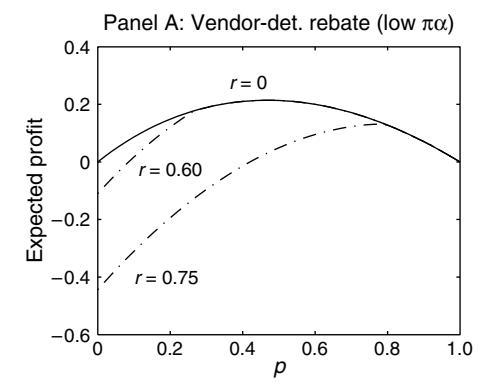

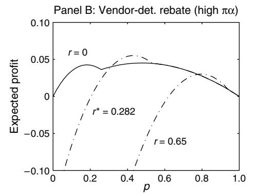

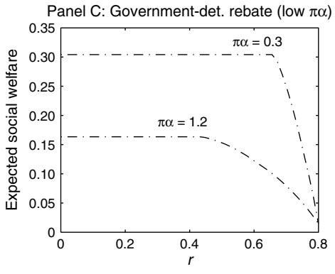

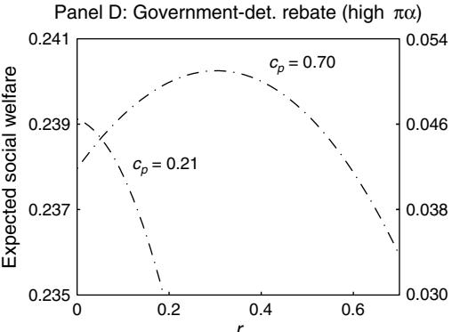

*Notes.* Panels A and B are for the vendor-determined rebate, and Panels C and D are for the planner-determined rebate case. For Panel A,  $c_{\rho}=0.80$ ,  $\pi=0.30$ , and  $\alpha=1$ ; for Panel B,  $c_{\rho}=0.70$ ,  $\pi=0.50$ , and  $\alpha=10$ ; for Panel C,  $c_{\rho}=0.80$ ; and for Panel D,  $\pi=0.50$ ,  $\alpha=20$ , the left y-axis is scaled for the  $c_{\rho}=0.21$  case, and the right y-axis is scaled for the  $c_{\rho}=0.70$  case.

Figure 4 The Effect of a Tax on Proprietary Software

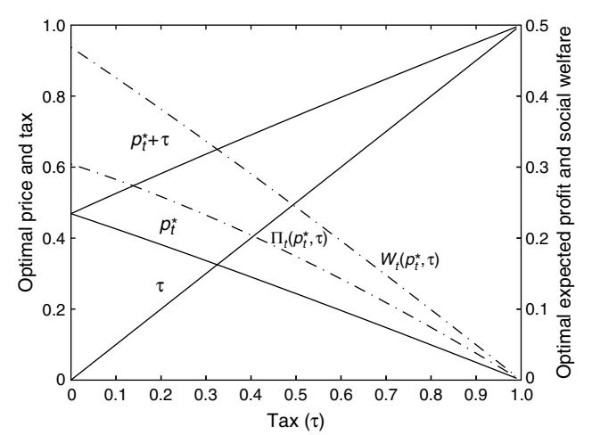

*Notes.* Parameters are  $c_p = 0.70$  and  $\pi \alpha = 0.30$ .

Suppose that each consumer is charged a tax  $\tau > 0$  for a copy of the software. Taking this tax as given, the vendor optimizes the price he charges for the product. We use a subscript "t" to denote this tax policy. The purchasing threshold  $v_b$  is now a function of the aggregate price,  $p + \tau$ , faced by the consumer. The profit for the vendor will then be  $\Pi_t(p,\tau) \triangleq p(1-v_b(p+\tau))$ . Additionally, for given  $\tau$ , we denote  $p_s^*$  and  $p_t^*$  as the maximizers of  $\Pi_s$  and  $\Pi_t$ , respectively.

Figure 4 shows the effects of a tax policy. As can be seen from the figure, imposing a tax decreases the vendor's optimal price  $(p_t^*)$ , but the price plus the tax  $(p_t^* + \tau)$ , i.e., the effective amount that the consumers have to pay to use the software, is larger than the optimal vendor price with no tax. This is because the vendor's profit under a given tax  $\tau > 0$  can be written as  $\Pi_t(p,\tau) = \Pi_s(p+\tau) - \tau(1-v_b(p+\tau))$ . The firstorder condition is then  $\Pi'_t(p_t^*) = \Pi'_s(p_t^*) + \tau \cdot v'_h(p_t^*) = 0$ . Because  $v_h$  is increasing in p, we then have  $\Pi'_s(p_t^*)$  <  $\Pi'_s(p_s^* - \tau) = 0$ , and because the vendor's profit function is concave, it follows that  $p_t^* + \tau > p_s^*$ . As a result, the vendor's profit declines as can be seen in the figure. Further, a positive tax also decreases social welfare because welfare is decreasing in the effective consumer price in this region as well.

In summary, taxes do not increase vendor profits, and due to the vendor's endogenous price setting at a level where decreasing the user population decreases welfare, taxes do not increase the social welfare for proprietary software. However, with freeware, taxes can be a powerful tool to improve social welfare, as we will discuss in §5.3.

# 4.4. Policy Comparison Summary for Proprietary Software

In this section, we summarize how the different policies considered thus far perform relative to one another, highlighting the results, comparisons, and the recommendations that emerge from them.

When the expected security risk and the patching costs are high, a social welfare-maximizing planner should employ patching rebates. Specifically, for such cases we have found that  $W_g > W_s > W_m$ ,  $W_t$ . Under high security risk, a planner may choose to force the software vendor to assume part of the users' patching costs via rebates. In response, the vendor will increase the price of the software, which decreases usage and hurts welfare. However, the net effect is a strict increase in welfare if the patching is costly beyond a threshold. Further, under self-patching, the vendor prices the software in a way that a patching population exists, which ensures higher welfare than under mandatory patching. Additionally, under high security risk, taxes are ineffective.

On the other hand, for low patching cost and regardless of security risk, patching rebates hurt social welfare. We find that  $W_s > W_g$ ,  $W_m$ ,  $W_t$  and conclude that it is advisable to keep the status quo, i.e., self-patching. For low effective security risk, an imposed rebate results in socially inefficient patching decisions. Further, mandatory patching, though increasing the security of the product, inefficiently reduces the user population and yields a decrease in expected social welfare.

From the vendor's point of view, mandating patching, although increasing software security, decreases profits. For high security risk, the value of the product for the consumers is low. Therefore, it may be desirable for the vendor to offer patching rebates to increase usage. However, paying patching rebates also decreases vendor profits, and the net effect can be negative. We show that, under high security risk, rebates increase profits if and only if the patching costs are higher than a threshold level. That is, under high security risk and patching costs,  $\Pi_v > \Pi_s > \Pi_m$ , and hence, a rebate policy is preferable. When the security risk is low, on the other hand, offering a rebate becomes too costly. Therefore, under such conditions,  $\Pi_s > \Pi_v$ ,  $\Pi_m$ , and a self-patching policy is more profitable (note also that a planner-imposed usage tax always decreases vendor profits).

### 5. Freeware

We next turn our attention to a software product offered to consumers as freeware. Freeware is often open source software that is typically developed and maintained by a group of software enthusiasts. These developers share the product with the public for free and hope to make it increasingly feature rich and more secure with broader public participation. Freeware products have governing bodies that promote development and distribution, as well as

providing organizational, legal, and financial support. For instance, Free Software Foundation (FSF), which was founded in 1985, promotes the development and use of free software and documentation. The FSF is closely tied to the GNU Project and the GNU General Public License (GNU GPL). In essence, the GNU GPL keeps all software that comes out of the FSF and the GNU Project free to the public domain. Furthermore, any modifications to that software must remain free to the public domain. When a security vulnerability arises within an open source software product, patches are typically readily made available by the developers of the software or possibly even third-party support companies, in light of the fact that open source software is transparent (Maguire 2004). Another example of such a governing body is the Apache Software Foundation (ASF), which oversees the Apache projects.

Freeware is also vulnerable to security attacks, and such attacks can be as damaging and costly as they would be for proprietary software (US-CERT 2004). Security of freeware as perceived by the potential users naturally affects the usage and consequently the value derived by the software in the user community. In this section, we compare policies that can be implemented by a social planner or the governing body of a freeware product to improve social welfare.

### 5.1. Mandatory Patching

Because freeware is available to consumers at zero price, a large population of users may develop. This increase in the number of users leads to an increased population of nonpatching users, which in turn increases the negative network security externalities and, consequently, hurts social welfare. The governing body for a freeware product (such as ASF for Apache projects) has authority on managing licenses for the software supported by these projects. Therefore, the technical mechanisms that enable the implementation of mandatory patching for proprietary software, described in §4.1, can also be used for freeware, and such policies can be included as a part of the license agreement if the governing body or a social planner sees fit. However, there is a critical trade-off here: If patching is mandated to users, only the consumers whose valuations justify the costs of patching would employ the product. As a result, some of the current population of consumers would be lost, while the remaining population would enjoy a secure product. Thus, surplus generation from usage would decrease along with the expected security losses, and the net effect on social welfare needs to be determined.

By (1), Cv-∗≤cp holds and hence, v−Cv-∗+ ≥v−cp + for all v ∈ . Noting that p = 0, it then follows that

$$W_s(0) = \int_{\mathcal{V}} (v - C(v, \sigma^*))^+ dv$$
  
 
$$\geq \int_{\mathcal{V}} (v - c_p)^+ dv = W_m(0),$$
 (8)

that is, mandating patching for freeware reduces social welfare.7 In short, mandating patching induces users to take actions that are welfare-inferior to their self-patching decisions, and therefore cannot be helpful. Intuitively, and similar to the case for proprietary software, all consumers who use the product under the mandatory patching policy would still be users under the self-patching policy because their expected security losses are bounded by cp. If the user with valuation cp patches under self-patching (assuming the user population stays the same), the product will be attractive to the marginal nonuser under mandatory patching because there will be no risk associated with the product. If the user with valuation cp does not patch under the self-patching policy, then the risk associated with the product must be lower than cp, and hence the product will again be attractive to the marginal nonuser. In both cases, the welfare will (at least weakly) increase because a larger population of users, including those with valuations below the threshold under mandatory patching, nonnegatively contribute to the welfare.8

### 5.2. Patching Rebates

As we have seen in §5.1, mandatory patching is ineffective at increasing social welfare associated with freeware because such a policy improves the security of the product but results in consumers making socially inefficient decisions. Therefore, policies that can improve network security while leaving the patching decisions to consumers should be investigated. Hence, we next consider a policy in which

7 Notice that each user has two separate effects on social welfare: First, she contributes her own surplus, i.e., v −Cv- ∗+. Second, because of negative network externalities, her decision also impacts other users' surpluses by affecting the term Cv- ∗ in the corresponding expressions. When calculating welfare, the latter effect shows itself in other users' surpluses, and, hence, is also included in the calculation of the surplus given in (8).

8 This result is parallel to the result in Brito et al. (1991), which states that for the case of an infectious disease, mandating vaccination cannot increase social welfare. Specifically, both results state that with negative network externalities, self-protection decisions are socially more efficient compared to forced protection. However, the two results are different. In our case, each consumer makes a usage decision by comparing the type-dependent losses from being infected by a worm (that increase with the size of the unpatched population) to the constant patching costs and subsequently comparing the minimum of these two quantities to the type-dependent benefit of using the software. This usage decision by the consumers plays a particularly key role for the other policies we consider (§§5.2, 5.3) and for proprietary software (§4).

a patching rebate is offered by a social planner to the consumers of the freeware. That is, similar to the rebate policy we discussed in §4.2, in the face of a security vulnerability, with a patch made available by the freeware developers, consumers who patch will receive an effective rebate r > 0 as an incentive. In this case, the rebate is given by a social planner.

There is a growing call for, and discussion of, government intervention for software security. The recommendations invite the government to play a more active role in improving software security by the implementation of a mix of market and regulatory efforts. The aim of these suggested efforts is to induce vendors to write more secure software as well as to induce computer users and network operators to better maintain the security of their own systems (see, e.g., Mimoso 2003, Krim 2004, Joyce 2005). The patching rebates for freeware can be implemented as corporate or individual tax rebates or credits. Such tax rebates are employed as tools in many other cases when the government wants to regulate compliance of good behavior in cases with negative externalities (Lyne 2001). The following proposition explores the effectiveness of such a rebate policy.

Proposition 4. Consider a patching rebate offered by a social planner to users of a freeware product.

- (i) If  $\pi \alpha \le 2c_p/3$  or  $\pi \alpha \ge 32/(27c_p)$ , then for all r > 0, offering a patching rebate r decreases the expected social welfare.
- (ii) If  $2c_p/3 < \pi\alpha < 32/(27c_p)$ , then it is possible to improve the expected social welfare with a positive patching rebate. Further, the social welfare-maximizing rebate is given by  $r_g^* = c_p/3$ .

As in the case of proprietary software, patching rebates increase the security of freeware as well. However, some users may be induced to patch when it is not socially efficient. The main trade-off is between the welfare loss endured by inducing such users to patch and the welfare gain obtained by the network effects of increased security. Part (i) of Proposition 4 states that when the software security risk is low, rebates are ineffective. In such cases, the social value of the network effects is relatively low, and the losses from inefficient patching dominate. In addition, when the security risk is high, the patching population is small, and as rebates increase the size of the patching population, new nonpatching users join and wipe out the positive network effects gained. When the security risk is at a moderate level, however, rebates can be effective, as stated in Part (ii) of Proposition 4. In summary, a patching rebate policy can improve social welfare generated by freeware for a moderate risk level, but for sufficiently low or high levels of risk, such a policy may end up decreasing social welfare.

### 5.3. Usage Tax

In §5.2, we presented a rebate-based policy that was able to induce patching behavior and yield higher social welfare for certain cases. However, in Proposition 4, we saw that such a policy can be ineffective for the two ends of the security spectrum where the expected security losses are small or large. Because consumers acting in self-interest cause a security risk on other consumers through network effects, a mechanism that drives out some of the consumers, who have low valuations but create negative externalities on other users by not patching, can be helpful. This mechanism can be achieved by imposing a small price or a tax on the freeware. Such a policy, by forcing certain low-valuation consumers out of the system, can eliminate the negative security externalities that they cause and can help improve the net social welfare obtained from the freeware. Notably, this policy aims at the opposite effect achieved by a patching rebate policy, because a rebate mechanism intends to encourage nonusers of the product to reconsider its use. From the consumers' point of view, a tax imposed by a social planner is identical to a price charged by a vendor. However, in this case, the tax payment that the consumers must make in order to use the freeware is set to maximize social welfare. Therefore, the relevant region is the lower end of the tax (or price) spectrum, with decisions focusing on whether or not to impose such a small payment. The following proposition explores the effectiveness of a tax policy.

### Proposition 5.

- (i) There exists a  $\tau > 0$ , such that the expected social welfare can be increased by imposing a user tax of  $\tau$  on the freeware product.
- (ii) There exist threshold values  $\underline{\omega}$  and  $\overline{\omega}$  such that  $0 < \underline{\omega} \leq \overline{\omega}$ , and when  $\pi \alpha < \underline{\omega}$ , the optimal user tax increases with  $\pi \alpha$  and is not affected by increases in  $c_p$ ; and when  $\pi \alpha > \overline{\omega}$ , the optimal user tax increases with  $c_p$  and decreases with  $\pi \alpha$ .

Proposition 5 states that a certain level of usage tax can always improve the expected social welfare for freeware under network effects by eliminating consumers whose valuations are low, but cause negative security externalities on all users by not patching. This result is in contrast to the corresponding case for proprietary software (§4.3). The reason for the effectiveness of a tax policy with freeware is the lack of a profit-maximizing vendor who reduces social welfare by limiting usage through a price set to maximize profit. With proprietary software, the vendor is already endogenously pricing the product at a range where the network effects from elimination of part of the user population through additional taxation is inefficient. Imposing a tax in that case makes the vendor respond by decreasing the price,

but the effective price the customers perceive (i.e., the vendor price plus tax) increases, thus eliminating users and decreasing social welfare. However, Proposition 5 states that when the price is zero, the usage threshold is always low enough that a usage tax can sufficiently reduce negative network externalities to improve social welfare.

Proposition 5 also states that when  $\pi\alpha$  is low enough, the optimal tax, although eliminating some low-valuation users, will not induce a patching population and, hence, will not depend on  $c_p$ . However, for such cases, increased security risk makes it optimal for a social planner to increase the tax because the effect of network externalities dominates the value loss. On the other hand, when the security risk is large, the usage levels fall and the proposition states that the optimal tax decreases with increased security risk. However, in this region, increased patching costs impose heavy security risks due to reduced patching, which in turn makes it optimal to increase the usage tax to compensate.

### 5.4. Policy Comparison Summary for Freeware

In this section, we give a comparison and summary of our policy analysis for freeware. First, we have shown that mandatory patching is always inferior to self-patching. In contrast, we have seen that rebates and taxes can help to increase welfare. We have found that taxes can strictly increase social welfare for all parameter values, but rebates are ineffective when  $\pi\alpha \leq 2c_p/3$  or  $\pi\alpha \geq 32/(27c_p)$ . For these parameter ranges, taxes are strictly better than rebates. The question then becomes whether rebates can ever be recommended over taxes. The following proposition answers this question.

Proposition 6. There exists a threshold  $\underline{\theta} \in (0, 1)$  such that when  $c_p < \underline{\theta}$  and  $2c_p/3 \leq \pi\alpha \leq \underline{\theta}$ , social welfare is greater under the optimal rebate policy compared to that of the optimal tax policy.

Figure 5 demonstrates the difference between the expected welfare that can be obtained by the optimal tax and rebate policies, i.e., the difference between the expected social welfare under the optimal tax  $\tau_t^*$  $(W_t(0, \tau_t^*))$  and the optimal rebate  $r_g^*$   $(W_g(0, r_g^*))$  for these two policies, respectively. As can be seen from the figure, the tax policy is dominant for most of the parameter space and is especially dominant when security risk is high, i.e., when  $\pi\alpha$  is large. When the patching cost and the effective security risk are low, taxes have less impact because the negative network externalities are relatively less important. On the other hand, in this region, rebates are effective because it is relatively cheaper to induce users to patch, and therefore a rebate policy, which by its nature keeps all willing users active, can achieve better results than a tax policy.

Figure 5 Expected Social Welfare Difference Between Optimal Tax and Rebate Policies for Freeware

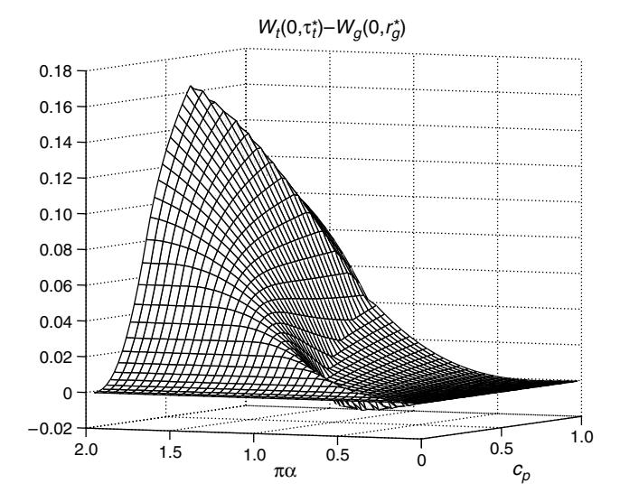

Recall that for proprietary software, usage taxes are detrimental to social welfare, and hence rebates are preferred whenever they are effective (§§4.2 and 4.3). However, a usage tax is quite effective for freeware and is the dominant instrument for a social planner in that case. As we discussed in detail in §5.3, the main reason for this difference is the vendor's pricing response to a usage tax. Hence, we conclude that it may be advisable for social planners to consider usage taxes *only* in the case of freeware.

In summary, for freeware, when the security risk or patching cost is sufficiently high,  $W_t > W_s > W_g$ ,  $W_m$ , i.e., a tax policy dominates. On the other hand, when the security risk and patching costs are low and the security risk is not too low compared to the patching costs,  $W_g > W_t > W_s > W_m$ , i.e., a rebate policy is most effective.

## 6. Concluding Remarks

In this paper, we presented a model of network software security to demonstrate that in a network environment, where the software security maintenance of each user affects the riskiness and consequently the value of the software for other users, incentives can be a useful tool for both a profit-maximizing vendor and a social welfare-maximizing planner. In particular, we explored and compared four policies to manage network software security in both proprietary software and freeware contexts: (i) consumer self-patching; (ii) mandatory patching; (iii) patching rebate; and (iv) usage tax. We have compared the preferability of these policies for a vendor (in the case of proprietary software) and a social planner (in the cases of both proprietary software and freeware). We have demonstrated that rebates and self-patching are dominant for proprietary software, whereas for freeware, taxes compete with rebates, and self-patching becomes strictly dominated. Mandatory patching is found to be suboptimal across the board. The main difference between the results for the cases of proprietary software and freeware stems from the fact that for proprietary software, the vendor internalizes the effect of any policy on the users and reflects it in his price. This is because changes in users' incentives directly affect the vendor's profits, and induce him to provide a feedback loop by adjusting his price in response. As a result, the social planner's role is more direct and critical in the case of freeware.

Another method of improving user-patching behavior would be to directly reduce the patching costs that users face. One way of achieving this is the software vendor's development of an automated patching solution. Automated patching aims to lower patching costs for users, ideally to a zero level. If such an idealized scenario were possible, i.e., if the patching costs were zero, all users would patch immediately after the release of a patch for a vulnerability. This would eliminate any effective security risk and negative network effects, and no issues related to the spread of malicious code in the network would be present. However, achieving an effective automated patching solution is not an easy task because each patching problem has unique aspects and each user's system has a more or less unique configuration. Therefore, effective patch management is a highly time- and resource-consuming activity, and a "one-size-fits-all" approach is unlikely to be an immediate remedy, as it is also widely acknowledged by practitioners (see, e.g., Messmer 2004a, Bentley 2005). Also note that an automated patching solution only affects the portion of the patching costs associated with the actual deployment of the security patch. The larger portion of the patching costs is due to the labor needed to verify that the security patch works as advertised without breaking any application interaction. Such testing of a security patch usually takes place on a staging server before deployment of the patch to a production server. If a user patches, she must go through these necessary steps to ensure that the security patch works without causing the production server to fail. Therefore, patching costs are an innate part of network software security maintenance and should not be neglected as determinants of user patch behavior and, ultimately, network security.

Our model applies to cases where there is a window for patching between the time a security patch is made available and when an attack occurs, as was the case for most major worms in the past. However, in some cases "zero day" attacks also occur before or right as patches are released (Shannon and Moore 2004). Analyzing the effect of such cases on user incentives would be an interesting future research topic. In addition, our main concern in this paper is the spread of malicious code that exploits a patchable vulnerability in a common software product, over a network of interconnected users. However, certain high-profile users can be specifically targeted for attacks, such as the DoS attack experienced by Yahoo in 2000 (Williams 2000). These specific risks are essentially separate from the risks associated with the spread of a worm in characteristic. Examining the security threats for such attacks under network environments would be an interesting future research topic. Also, in our model we assume a uniform distribution of valuations. Although most of our results (such as the threshold valuation characterization of the equilibrium and inferiority of mandatory patching) are robust to the distributional assumption, one future avenue for research could be extending our results to general distributions.

Another interesting extension of our model could be analyzing the vendor's problem of inducing optimal patching activity levels based on the users' valuations by offering a nonlinear patching rebate schedule. Given that the users have different valuations and correlated losses in case of an attack, there may be gains from allowing users to decide the level of their patching activity and receive rebates accordingly. In a separating equilibrium, a software vendor can then offer a nonlinear schedule of patching rebates to induce a target level of patching activity for each "type" of customer, monitor the patching levels (something he can observe), and use them as a proxy to award rebates based on consumer valuations (something he cannot directly observe or price discriminate on). The employment of such a price/rebate schedule may not only benefit the vendor but also improve social welfare by allowing users to choose patching activities at socially efficient levels.

One might also investigate the vendor's incentives for disclosure of vulnerabilities to the public. It is typically the case that vulnerabilities in software are discovered by either the vendor or benevolent users before hackers. In such instances, the vendor usually has a grace period to develop and release patches before the existence of these vulnerabilities are publicly announced. The length of that grace period may have implications on the incentives for patch development by the vendor, and these issues are topics for ongoing research (e.g., Arora et al. 2005, Choi et al. 2005, and Jaisingh and Li 2005). Mechanisms that target user incentives used in conjunction with control of the vulnerability disclosure grace period can prove to be powerful at improving software security and is an interesting topic for future research.

Our goals in this paper were first to establish that, when dealing with network security issues, policies targeting user incentives can be effective tools; and second to gain insights into the types of incentive mechanisms that may be helpful in increasing the value generated by network software in the face of security vulnerabilities. In today's highly interconnected environment, where many consumers still do not maintain the security of their software adequately, resulting in losses from hacker attacks that amount to billions of dollars, policies that can induce increased consumer security by taking user incentives into account are needed. Our results may give guidance and insight to software companies and policymakers to work on such strategies and ultimately help reduce the tremendous losses that occur from computer security incidents every year.

An online supplement to this paper is available on the Management Science website (http://mansci.pubs. informs.org/ecompanion.html).

### Acknowledgments

The authors thank Barrie Nault (the department editor), the associate editor, and anonymous referees, as well as Mike Harrison, Sunil Kumar, Howard Kunreuther, Haim Mendelson, Jim Patell, Hal Varian, Larry Wein, Jin Whang, Muhamet Yildiz, and seminar participants at Harvard University, New York University, and Stanford University, for helpful discussions. Financial support from the Center of Electronic Business and Commerce at the Graduate School of Business, Stanford University, is gratefully acknowledged.

### References

- Anderson, R. J. 2001. Why information security is hard—An economic perspective. Proc. 17th Ann. Comput. Security Appl. Conf. IEEE Computer Society, Los Alamitos, CA, 358–365.
- Anderson, R. M., R. M. May. 1991. Infectious Diseases of Humans: Dynamics and Control. Oxford University Press, Oxford, UK.
- Arora, A., R. Telang, H. Xu. 2005. Optimal policy for software vulnerability disclosure. Working paper, Carnegie Mellon University, Pittsburgh, PA.
- Bailey, N. T. 1975. The Mathematical Theory of Infectious Diseases and Its Applications. Oxford University Press, Oxford, UK.
- Bentley, A. 2005. Developing a patch and vulnerability management strategy. SC Magazine. Retrieved March 2006, http://www. scmagazine.com.
- Bloor, B. 2003. The patch problem: It's costing your business real dollars. Baroudi Bloor. http://www.baroudi.com/pdfs/patch. pdf.
- Bragg, R. 2004. The perils of patching. (February), http://www. redmondmag.com.
- Brito, D. L., E. Sheshinski, M. D. Intriligator. 1991. Externalities and compulsory vaccinations. J. Public Econom. 45(1) 69–90.
- Cavusoglu, H., H. Cavusoglu, J. Zhang. 2005. Security patch management: Share the burden or share the damage. Working paper, University of British Columbia, Vancouver, Canada.
- CERT. 2004. CERT/CC Statistics 1988–2003. CERT Coordination Center. Retrieved August 2004, http://www.cert.org/stats.
- Choi, J. P., C. Fershtman, N. Gandal. 2005. Internet security, vulnerability disclosure, and software provision. Fourth Workshop on the Economics of Information Security, Harvard University, Cambridge, MA.

- Computer Economics. 2004. The cost impact of major virus attacks since 1995. (February).
- D'Amico, A. D. 2000. What does a computer security breach really cost? Secure Decisions, Applied Visions Inc., Northport, NY.
- Davidson, M. A. 2004. Automatic software patching: Boon or bane? (June), http://www.globeandmail.com.
- Francis, P. J. 1997. Dynamic epidemiology and the market for vaccinations. J. Public Econom. 63(3) 383–406.
- Garg, A. 2003. The cost of information security breaches. CrossCurrents. Ernst & Young, New York.
- Geer, D. E. 2004. The economics of shared risk at the national scale. Third Annual Workshop on Economics and Information Security, University of Minnesota, Minneapolis, MN. Available at http://www.dtc.umn.edu/weis2004/weis-geer.pdf.
- Geoffard, P.-Y., T. Philipson. 1996. Rational epidemics and their public control. Internat. Econom. Rev. 37(3) 603–624.
- Gersovitz, M. 2003. Births, recoveries, vaccinations and externalities. Economics for an Imperfect World: Essays in Honor of Joseph E. Stiglitz. MIT Press, Cambridge, MA, 469–483.
- Gersovitz, M., J. S. Hammer. 2004. The economical control of infectious diseases. Econom. J. 114(492) 1–27.
- Gersovitz, M., J. S. Hammer. 2005. Tax/subsidy policies toward vector-borne infectious disease. J. Public Econom. 89(4) 647–674.
- Goldman, S. M., J. Lightwood. 2002. Cost optimization in the SIS model of infectious disease with treatment. Topics Econom. Anal. Policy 2(1) 1–22.
- Internet World Stats. 2004. World internet usage and population statistics. Retrieved March 2004, http://www.internetworldstats. com/stats.htm.
- Jaisingh, J., Q. Li. 2005. The optimal time to disclose software vulnerability: Incentive and commitment. Working paper, Hong Kong University of Science and Technology, Hong Kong.
- Joyce, E. 2005. More regulation for the software industry? Enterprise IT Planet (February), http://www.enterpriseitplanet.com/ security/news/article.php/3483876.
- Kessing, S., R. Nuscheler. 2003. Monopoly pricing with negative network effects: The case of vaccines. Working paper, Social Science Research Center, Berlin, Germany.
- Kremer, M. 1996. Integrating behavioral choice into epidemiological models of AIDS. Quart. J. Econom. 111(2) 549–573.
- Krim, J. 2004. U.S. goals solicited on software security. Washington-Post.com.
- Kunreuther, H., G. M. Heal. 2002. Interdependent security: The case of identical agents. Working paper, Columbia University, New York.
- Kunreuther, H., G. M. Heal, P. R. Orszag. 2002. Interdependent security: Implications for homeland security policy and other areas. Policy Brief 108, The Brookings Institution, Washington, D.C.
- Lemos, R. 2003. Squashing the next worm. CNET News (August).
- Lemos, R. 2004. Witty worm proves patching "not viable." CNET News (March).
- Lemos, R. 2005. Patching takes over IT for a day. Techworld (January).
- Leung, L. 2001. EPA offers incentives to firms that adopt telecommuting in five U.S. metros. Online Insider (May), http://www. conway.com/ssinsider/incentive/ti0105.htm.
- Maguire, J. 2004. Who's patching open source? Enterprise Linux IT (January).
- Messmer, E. 2004a. Can software patching be automated? Network World Fusion (May), http://www.nwfusion.com/weblogs/ security/005182.html.
- Messmer, E. 2004b. Sasser worm exposes patching failures. Network World Fusion (May), http://www.nwfusion.com/news/ 2004/0510sasser.html.
- Middleton, J. 2001. U.S. government calls for enforced patches. VNUnet (December), http://www.vnunet.com/.

- Mimoso, M. 2003. Regulation, bad software, new threats fodder for Congress. Search Security (September), http://www. searchsecurity.com/.
- Moore, D., C. Shannon, J. Brown. 2002. Code-red: A case study on the spread and victims of an Internet worm. Proc. Second ACM SIGCOMM Internet Measurement Workshop, Marseille, France, 273–284.
- Moore, D., V. Paxson, S. Savage, C. Shannon, S. Staniford, N. Weaver. 2003. The spread of the Sapphire/Slammmer worm. Working paper, Berkeley, CA.
- MS-Support. 2004. IIS problems after applying a security patch. Microsoft Corporation.
- Nicastro, F. 2005. Network security tactics. Step-by-step guide: How to deploy a successful patch. Searchsecurity (September), http://www.searchsecurity.techtarget.com/.
- Schweitzer, D. 2003. Emerging technology: Patch me if you can! Network-Magazine (August), http://www.network-magazine. com/.

- Shannon, C., D. Moore. 2004. The spread of the witty worm. IEEE Security Privacy 2(4) 46–50.
- Sullivan, B. 2004. "Sasser" infections begin to subside. MSNBC (May), http://www.msnbc.msn.com/id/4890780/.
- Symantec. 2004. Automating patch management. Symantec Corporation, Cupertino, CA.
- Timms, S., C. Potter, A. Beard. 2004. Information security breaches survey 2004. UK Department of Trade and Industry, London, UK.
- US-CERT. 2004. US-CERT vulnerability notes database. U.S. Department of Homeland Security, Washington, D.C., http://www. kb.cert.org/vuls/.
- Varian, H. 2004. System reliability and free riding. Working paper, University of California, Berkeley, CA.
- Weaver, N., V. Paxson, S. Staniford, R. Cunningham. 2003. A taxonomy of computer worms. Proc. 2003 ACM Workshop Rapid Malcode, ACM, Washington, D.C., 11–18.
- Williams, M. 2000. Attack takes down Yahoo for three hours. IDG News Service (February).