# Does information security attack frequency increase with vulnerability disclosure? An empirical analysis

Ashish Arora & Anand Nandkumar & Rahul Telang

Published online: 22 November 2006

# Springer Science + Business Media, LLC 2006

Abstract Research in information security, risk management and investment has grown in importance over the last few years. However, without reliable estimates on attack probabilities, risk management is difficult to do in practice. Using a novel data set, we provide estimates on attack propensity and how it changes with disclosure and patching of vulnerabilities. Disclosure of software vulnerability has been controversial. On one hand are those who propose full and instant disclosure whether the patch is available or not and on the other hand are those who argue for limited or no disclosure. Which of the two policies is socially optimal depends critically on how attack frequency changes with disclosure and patching. In this paper, we empirically explore the impact of vulnerability information disclosure and availability of patches on attacks targeting the vulnerability. Our results suggest that on an average both secret (non-published) and published (published and not patched) vulnerabilities attract fewer attacks than patched (published and patched) vulnerabilities. When we control for time since publication and patches, we find that patching an already known vulnerability decreases the number of attacks, although attacks gradually increase with time after patch release. Patching an unknown vulnerability, however, causes a spike in attacks, which then gradually decline after patch release. Attacks on secret vulnerabilities

published and then attacks rapidly decrease with time after publication.

slowly increase with time until the vulnerability is

Keywords Software vulnerability . Risk management . Economics. Disclosure policy . Patching

### 1 Introduction

Research in information security risk management has grown in importance in the last few years (see Gordon & Loeb, [2002](#page-11-0) for details). However, risk measurements critically depend on the knowing the probability of an attack. Unfortunately, lack of reliable data has made the task of calculating these probabilities very challenging tasks for both computer scientists and economists.

A case in point is disclosure policy, where the appropriate policy depends upon how attack and breach frequencies are conditioned by disclosure and patching. In this paper, we collect unique data set to and empirically estimate how information disclosure and patching activities surrounding these vulnerabilities condition the frequency of attacks.

There is a contentious ongoing debate about how software vulnerability information should be made public. While information about vulnerabilities can enable users to take precautions that prevent or reduce cyber security breaches, it can provide attackers with valuable information as well. There are many sources that report vulnerability information, ranging from CERT/CC (Computer Security Incident Response Team/Coordination Center) to privately owned consulting companies. Traditionally, CERT has been a key player in the domain of vulnerability disclosure. After a vulnerability being reported to it, CERT sends out public "advisories" warning users about the vulnerability. The

A. Arora (\*) : A. Nandkumar : R. Telang

H. John Heinz III School of Public Policy and Management, Carnegie Mellon University, Pittsburgh, PA, USA

e-mail: ashish@andrew.cmu.edu

A. Nandkumar

e-mail: anandn@andrew.cmu.edu

R. Telang

e-mail: rtelang@andrew.cmu.edu

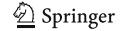

advisories include links to patches if available and provide enough technical information about the vulnerability to enable users to take protective action. However, many identifiers also use public forums, such as the "Bugtraq1" or "Secunia" mailing lists and make detail information about a vulnerability public (sometimes including the exploit code) even without a patch (this is also known as instantaneous or Full disclosure).

While the proponents of instant disclosure claim that such disclosure provides impetus to the vendor to release patches early (see Leyden, 2002), the proponents of secrecy claim that they leave users defenseless against attackers who can exploit the disclosed vulnerability and therefore, are socially undesirable (see Arora, Telang, & Xu, 2004; Elias, 2001; Farrow, 2000). Gordon and Ford (1999), while acknowledging the importance of these issues, point out the lack of hard evidence to assess the impact of various forms of vulnerability disclosure. We focus on the attacker behavior in this paper.

Empirical estimate on attacker behavior is one of the first steps in understanding the social cost of vulnerable software. Understanding attacker behavior and incentives to launch attacks would allow us to provide policy and managerial insights into creating a more secure system. It would also allow managers to quantify and manage risks. In this paper, we use "honeynet" data, to focus on one of the key components of the social cost to the end user namely frequency of attacks on end user machines. In particular, we attempt to understand how frequency of attacks on a host varies by status of vulnerability—whether and when the vulnerability and its patch are disclosed. Our unit of analysis is the number of attacks that relates to a specific vulnerability observed during a specific period. By mapping the change in status of vulnerabilities between observed periods to the change in observed frequency in attacks on hosts, we seek to understand how publishing vulnerability information and releasing patch to fix the vulnerability changes the incentives to attackers to launch attacks.

We find that on an average both *secret* (non-published) and *published* vulnerabilities attract lesser attacks than *patched* vulnerabilities. But when we control for time since patch release, we find that patching reduces the number of attacks. When an unknown vulnerability is patched, attacks on host tend to increase immediately upon patch release but with time the attacks they gradually decrease probably because users end up patching their systems.

The reminder of this paper is organized as follows: Section 2 reviews literature. Section 3 deals with a theoretical model to motivate the empirical analysis while Section 4 provides details about the data sources used in this paper. We present the empirical analysis in Section 5 and we conclude with a summary of the results in Section 6.

#### 2 Literature

Much research in the area of information security has focused on the technical aspects of information security. Krsul, Spafford, and Tripunitara (1998) provide a detailed analysis of five common computer vulnerabilities and in particular focus on factors that contribute towards the existence of these vulnerabilities. Arbaugh, Fithen, and McHugh (2000b) proposed a life-cycle model that modeled number of incidents as a function of when the vulnerability was discovered disclosed and patched using information gathered about three Windows system vulnerabilities. Similar research by Arbaugh, Browne, McHugh, and Fithen (2000a) fitted a curve of the form  $C = I + S\sqrt{M}$ , where C is the cumulative count of reported incidents, M is the time since the start of an exploit cycle, I the intercept and S the estimated coefficient. However, this was based on a very small sample. The only known estimates of the frequency of attacks is provided by Howard (1997), based on data gathered from CERT in 1995. A key weakness in these estimates is that that the data collected from CERT are twice filtered. In other words, users had to be aware of the attacks and, if aware, had to report them. Insofar as some users have implemented security measures such as firewalls and intrusion detection systems, some attacks would not succeed, implying that users are unlikely to become aware of such attacks. Users may also be unaware if they are not sophisticated; it is commonly believed that many individual users leave their home computers unsecured against being taken over and used as "zombies".

These problems bedevil other sources of information, such as the CSI/FBI2 survey as well. To address this gap, we collected data that do not suffer from these biases. We use these data to explore how the number of attacks differs across vulnerabilities that are disclosed (published) versus those that are secret. As well, we explore how these differences are conditioned by whether and when a patch is released. In this way, we provide the first set of estimates of how attacker behavior is conditioned by disclosure and by the release of a patch. As is the case with most experimental settings there are some limitations of these data as well.

Gordon and Loeb (2002) propose a framework that enables decision makers to determine optimal investment in information security. In all models of security investments, what conditions the probability of a "bad" event is not

&lt;sup>1 As of Jan. 2003, SecurityFocus discontinued listing of exploit code.

&lt;sup>2 http://www.gocsi.com

adequately explained. While this is fine with analytical models, in practice, risk management critically depends on these probabilities. Our research proposes the methodology and brings the data to produce reasonable estimates for these probabilities and how they are conditioned by disclosure. Rescorla [\(2004](#page-11-0)) argues that the costs of vulnerability disclosure are not worth its benefits. He provides empirical evidence to support the notion that since there is not much of a quality improvement in software as a consequence of identification of vulnerabilities, it does not justify the costs of vulnerability disclosure Schneier [\(2000\)](#page-12-0) argued that the loss from attacks from a customer's perspective, are not only influenced by the intensity of attacks, but also on how long the vulnerability remains un-patched. With regard to the impact of disclosure on vendors, Arora, Telang et al. [\(2004](#page-11-0)) provide a formal analysis of optimal disclosure policies. They conclude that neither secrecy policy nor instant disclosure is optimal. They show that since a social planner can optimally shrink the time window of disclosure to push vendors to deliver patch in a timely manner. Arora, Krishnan, Telang, and Yang [\(2005](#page-11-0)) using a dataset assembled from CERT/CC's vulnerability notes and SecurityFocus database, conclude that early disclosure influences the vendor to release patch earlier with vulnerability disclosed by CERT/CC being patched faster by vendors. Telang and Wattal ([2005\)](#page-12-0), find empirical evidence of firms' incurring loss in market value, as a result of vulnerability disclosure.

However, most of these papers focus on either users or vendors. Attackers' behavior is seldom modeled. Schechter and Smith [\(2003\)](#page-11-0), for instance, uses economic threat modeling approach to understand the amount of security that is required to prevent attackers from breaking into systems by trying to understand the financial incentive for different types of attackers. Kannan and Telang ([2005\)](#page-11-0) model attackers' behavior in a theoretical framework where they considered the question of whether a market based mechanism of vulnerability disclosure would lead to better social outcomes. However, there are almost no empirical estimates on what conditions attacker behavior and attack frequency. In our paper, we empirically try to understand attackers' propensity to attack as vulnerability and patch information is disclosed.

### 3 An economic framework

It is widely believed that the cost of developing or acquiring exploit tools and implicitly the frequency of attacks on hosts, depends to a large extent on how much information about the vulnerability is publicly known (Seltzer, [2004\)](#page-12-0). Stated otherwise, the number of attackers that seek to exploit a particular vulnerability should potentially increase with availability of such information and from resultant exploit tools accompanying them. However, publishing a vulnerability could also result in end-users taking precautions, thereby lowering the probability that an attack would be successful to an attacker, thereby reducing the expected gains from launching attacks. In particular, if users were very careful and protected themselves immediately after publication of such information then an attacker is unlikely to succeed and eventually number of attacks would decrease (Recent work by Rescorla ([2003\)](#page-11-0) shows that a large fraction of users are not particularly careful and do not take adequate precautions even after a few weeks since information availability). The observed number of attacks in our sample depends on both of these countervailing factors.

Similarly, if patch availability results in end users applying patches to negate successful attacks, the probability that an attack is successful decreases, thereby lowering the number of attacks. However, if patches provide new information to attackers, and help them develop exploit tools, then we would expect to see increase in the frequency of attacks on host. From an end user perspective information disclosure with patch is potentially better than disclosure without a patch However, frequency of attack is inherently an empirical question which depends on both attacker behavior and user behavior.

More formally, we assume that the attacker's payoffs increase with the expected number of successful exploits, and decreases in the cost of exploit and the number of attacks launched. If there are M users in total and a fraction n whose systems contain a given vulnerability, and θ(t) is the fraction that have correctly patched their system, then assuming that attacks are launched at random implies that the probability an attack will be successful is n(1−θ). Therefore, if k attacks are launched, the distribution of successful attacks is binomial with parameters [k, n(1−θ)]. The expected number of successful attacks is therefore kn(1−θ). We assume that the benefit received by the attacker, ρkn(1−θ), is proportional to the expected number of successful attacks, where ρ is the proportionality factor.

The cost of attacks includes a fixed cost of developing (or obtaining) exploit code, and a constant cost per attack, subject to some capacity limit κ. Thus, we can write Cð Þ¼ k C0ðÞþt ck, for 0<k<κ. We let both θ and C0 be functions of time to capture the idea that the fraction of systems patched will increase with time, and that exploit code may become more widely available with the passage of time. To keep notation simple, we have not formally included it but it should be understood that events such as disclosure and release of the patch will affect both θ and C0 as well.

We assume that the attacker maximizes profits=ρkn (1−θ)−C(k). It is immediate that if an attacker attacks, the

Table 1 Description of variables

| Variable     | Description                                                                                                                              |
|--------------|------------------------------------------------------------------------------------------------------------------------------------------|
| $A_{it}$     | Average number of observed attacks of vulnerability type $i$ in period $t$                                                               |
| Vul.dummies  | Vulnerability Dummy variable                                                                                                             |
| Timedummies  | Time dummy (one for each period of observation)                                                                                          |
| Secret       | Dummy variable to denote a vulnerability that is neither published nor patched                                                           |
| Published    | Dummy variable to denote a vulnerability that is <i>published</i> but without a patch                                                    |
| $t_{secret}$ | Number of days to publication of the vulnerability                                                                                       |
| $t_{pub}$    | Number of elapsed days from publication of the vulnerability                                                                             |
| $t_{patch}$  | Number of elapsed days from publishing a vulnerability                                                                                   |
| Exploit      | A dummy variable that denotes whether or not exploit was available for the vulnerability                                                 |
| Location     | A variable that denotes the location of the honeypot                                                                                     |
| Windows      | A dummy variable that denotes if the vulnerability applies to Windows based operating systems                                            |
| UNIX         | A dummy variable that denotes if the vulnerability applies to BSD operating systems and its variants (does not include Linux or Solaris) |
| All          | A dummy variable that denotes if the vulnerability is a generic vulnerability that applies to all types of systems                       |
| Linux        | A dummy variable that denotes if the vulnerability applies to Linux family of operating systems                                          |
| Solaris      | A dummy variable that denotes if the vulnerability applies to Solaris of operating system                                                |

number of attacks launched will be  $\kappa$ . Formally, the number of attacks is

$$k(t) = \kappa \text{ if } C_0 < \rho \kappa. (n(1-\theta) - c) \text{ and } 0 \text{ otherwise}$$
 (1)

If there are N attackers in all, and if the fraction that are aware of the vulnerability is m(t), then the total number of attacks is

$$Nm(t)k(t) \tag{2}$$

where k(t) is given by (1).

Thus far we have neglected all interactions across attackers. However, it is plausible that attackers seek

Table 2 Period wise breakup of vulnerabilities

| Period                   | Number of days of observation | Patched | Published | Secret |
|--------------------------|-------------------------------|---------|-----------|--------|
| Period 1 (Nov. 2002)     | 5                             | 210     | 80        | 38     |
| Period 2 (Jan. 2003)  | 6                             | 214     | 79        | 35     |
| Period 3 (Jan. 2003)  | 5                             | 214     | 79        | 35     |
| Period 4 (Jan. 2003)  | 7                             | 214     | 79        | 35     |
| Period 5 (Mar. 2003)  | 7                             | 218     | 80        | 30     |
| Period 6 (May 2003)   | 7                             | 229     | 80        | 19     |
| Period 7 (Sept. 2003) | 7                             | 241     | 78        | 9      |
| Period 8 (Nov. 2003)  | 7                             | 241     | 79        | 8      |
| Period 9 (Dec. 2003)  | 7                             | 244     | 79        | 5      |

priority—there is less to be gained from trying to exploit a system already controlled by another attacker. Similarly, it is plausible that the costs of developing or obtaining exploit code vary across attackers—a few attackers are sophisticated programmers while others are mere "script kiddies". We ignore the former here but incorporate the latter by assuming that  $C_0$  is distributed across potential attackers with distribution function  $F(\ ;\ t)$ . To capture the fall in cost of acquiring exploit code over time, we assume that F(x;t) increases with t for all values of x. At any given time, the fraction of attackers that will attack is given by  $F(\kappa.(n(1-\theta)-c),\ t)$ , so that the total number of attacks becomes

$$Nm(t)\kappa F(\rho\kappa.(n(1-\theta)-c),t)$$
(3)

From (3) it is clear that publication will cause an increase in m(t), the fraction of attackers aware of the vulnerability. This should cause a spike in the number of attacks. Over time, there are countervailing effects: On the one hand, the number of attacks will decrease because n is likely to drop as users take precautions and (neglected here) the number of systems already captured by other attackers increases. On the other hand, the number of attacks will increase as the costs of acquiring exploit code falls, and as the fraction of attackers aware of the vulnerability increases. We conjecture that over time, the fall in the number of vulnerable systems as well as the competition from other attackers will dominate, leading attacks to fall with time.

Patching also has countervailing effects. It will increase  $\theta$ , the proportion of protected systems. However, it may reduce the cost of developing exploit code, and also increase the proportion of attackers aware of the problem. For a known vulnerability, only the cost of exploit code matters. In terms of time trends, since  $\theta$  will change only slowly with time (patching takes time), but the fraction of

Table 3 Descriptive statistics—characteristics of vulnerabilities

|                                          | Proportion exploited | Proportion not exploited |
|------------------------------------------|-------------------------|-----------------------------|
| Protocol vulnerabilities                 | 0.27                    | 0.73                        |
| Operating system vulnerabilities         | 0.21                    | 0.79                        |
| Server vulnerabilities                   | 0.05                    | 0.95                        |
| Application vulnerabilities              | 0.06                    | 0.94                        |
| Security product vulnerabilities         | 0.14                    | 0.86                        |
| Vulnerability of public listed vendors   | 0.13                    | 0.87                        |
| Open source vendors                      | 0.13                    | 0.87                        |
| Freeware vendors                         | 0.19                    | 0.81                        |
| Vendors out of business                  | 0.20                    | 0.80                        |
| Vulnerabilities that do not have a patch | 0.24                    | 0.76                        |
| Secret vulnerabilities                   | 0.28                    | 0.72                        |
| Published vulnerabilities                | 0.22                    | 0.78                        |
| Patched vulnerabilities                  | 0.09                    | 0.91                        |
| Average                                  | 0.14                    | 0.86                        |

aware attackers will spike up, it is plausible that patching will lead to a spike in attacks, particularly for hitherto unpublished vulnerabilities. As with publication, over time, the number of attacks should trend downward.

To summarize, though helpful in organizing our thoughts, theoretical models are inconclusive. The impact of disclosure and patching upon the time trends in the number of attacks is an empirical issue. Accordingly, we now turn to the data and estimates.

### 4 Data

We acquired two types of data for the purposes of this paper data on security incidents and data on vulnerabilities that resulted in the security incidents. The first part of data comes from the honeypots run by <http://www.honeynet.org> and its affiliated members. A honeypot is a system that emulates a computer that is connected to the Internet. These are typically used to capture extensive data on information security attacks and motives of attackers (Spitzner, [2001\)](#page-12-0). Unlike real networks where distinguishing between an attack and a legitimate traffic is not always possible, honeynets provides an easy way to detect attacks as honeypots by definition do not have legitimate network traffic (Schechter & Smith, [2003](#page-11-0)).

Our data on attacks consists of network traces from 14 honeypots operating on different operating environments— Linux, Solaris, OpenBSD and Windows—collected for several weeks over the course of a year. The honeypots were placed behind a firewall, with each honeypot having a separate IP address. The honeypots had no legitimate applications hosted on them. The honeypot data primarily consists of tcpdump traces of individual packets, both inbound and outbound. The data so captured consists of data on all the TCP/IP packets that entered or left any of the

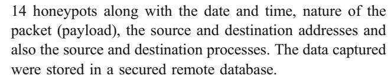

Data from honeypots are a valuable resource because they do not face the usual biases due to selection in detection and in reporting, present in most field data. Therefore, it is easier to classify attacks and eliminate false positives. However, though providing many advantages, there are some limitations as well. First, an actual system will have legitimate traffic, so that the frequencies of attempted break-ins may systematically vary from those implied by the honeypot data. Further honeypots cannot provide insight into targeted attacks on an organization, nor for internal attacks that are mounted by employees with an organization. Despite these limitations, honeypots are a valuable data source, particularly in view of the paucity of reliable field data and the strong selection biases that such field data likely contain.

### 4.1 Extracting attack data

We created our key variable—the frequency of attacks targeting a vulnerability—by matching attack data with attack traffic signatures. Attack signatures are a set of rules that identify malicious packets and link them to specific vulnerabilities targeted. These signatures are based on packet payload, destination port and address, source port and address, packet sequence number, protocol or any combination of these. The attack signatures were acquired from publicly available source, specifically, Whitehats ( [http://www.white](http://www.whitehats.com) [hats.com\)](http://www.whitehats.com) and Snort database ( [http://www.snort.org/cgi-bin/](http://www.snort.org/cgi-bin/done.cgi) [done.cgi\)](http://www.snort.org/cgi-bin/done.cgi). We implemented a custom parser based on WinTcpdump library and matched the tcpdump traffic from honeypots with attack signatures and collated them with vulnerabilities. This provides us with a count of the number of attempts to exploit a specific vulnerability, henceforth called the number of attacks, over a given period.3

### 4.2 Vulnerability data

We selected 328 unique vulnerabilities at random from the from the Common Exposures and Vulnerability (CVE) ICAT database. The CVE ICAT database is a publicly available database that contains information about software vulnerabilities. The database aggregates information about software vulnerabilities from other public forums like CERT, Bugtraq or ISS. This database currently contains information on about 6,000 vulnerabilities disclosed in various public forums from 1989 to 2004. Each vulnera-

3 Each tcpdump data file consists of tcp logs accumulated from 12:01 A.M. of the start day till 12:00 A.M. of the end day during a period. Each period of observation typically contains about 5 days of observation.

Table 4 Descriptive statistics—age of vulnerabilities

|                                                                                     | Secret | Published | Patched |
|-------------------------------------------------------------------------------------|--------|-----------|---------|
| Average number of attacks per host per day (attacks)                                | 0.55   | 0.45      | 0.07    |
| Std. deviation of average number of attacks                                         | 5.81   | 5.99      | 0.93    |
| No. of exploited vulnerabilities                                                    | 37     | 59        | 57      |
| Average age of exploited vulnerabilities (days from publication) a       | -253   | 899       | 868     |
| Minimum age of exploited vulnerabilities (days from publication)                    | -453   | 95        | 10      |
| Maximum age of exploited vulnerabilities (days from publication)                    | -61    | 2,144     | 2,022   |
| Average age of patches for exploited vulnerabilities (days from patch) b | 254    | -70       | 771     |
| Average age of unexploited vulnerabilities (days from publication)                  | -147   | 1,163     | 1,074   |
| Minimum age of unexploited vulnerabilities (days from publication)                  | -517   | 23        | 4       |
| Maximum age of unexploited vulnerabilities (days from publication)                  | 0      | 3,278     | 5,548   |
| Average age of patches for unexploited vulnerabilities (days from patch)            | -139   | -3        | 974     |
| Average of time to first attack                                                     | _      | 40        | 16      |

&lt;sup>a The age of a vulnerability is measured as the difference, in days, between the date of publication of vulnerability and the first day of the observation period, and takes negative values if the date of observation precedes publication

bility has a unique identifier known as CVE-ID and is further characterized by other descriptors like date of publication, severity type, vulnerability type4 and vendor whose software is vulnerable. We augmented vulnerability information with information on patches and exploit code.5 While information on patches fixing vulnerabilities was acquired from the web site of different vendors, data about the availability of exploit code was acquired from different publicly available forums like Bugtraq (http://www.online.securityfocus.com), mailing list ARChives at AIMS (http://marc.theaimsgroup.com), ISS (http://www.Xforce.ISS.net) and Packetstorm (http://www.packetstorm.org).

The data so assembled consists of 2,952 observations over 9 weeks from Nov. 2002 to Dec. 2003 for 328 different vulnerabilities. Of 328 vulnerabilities, 77 vulnerabilities had no patches6 released by the vendor. About 160 vulnerabilities were made public on the same day7 when a patch fixing them was also released. About 76 vulnerabilities

were patched after information about the vulnerability was made public. Only 153 observations pertaining to 44 vulnerabilities are associated with attacks during the period of observation.

We classify vulnerabilities as either secret, published or patched. A vulnerability is secret at time t when it is neither patched nor published. Note that secret vulnerability may change its status and be published. Also note that a secret vulnerability may still be getting exploited by black-hats; it is secret because has not been publicly disclosed at a public forum and hence not many users (if at all) are aware of it.8 A published vulnerability is one that has been published although patch for the vulnerability is not yet available, and a patched vulnerability is one that has been published and for which, a patch is also available. Almost by definition, the release of a patch for a hitherto secret vulnerability also implies that the vulnerability becomes published. In this paper, publishing a vulnerability is interpreted as the act of making information about a vulnerability public through public forums like CERT, Bugtraq etc. or by the vendor on its website. Tables 1, 2, 3, 4 and 5 provide descriptive statistics of the sample.

#### 5 Empirical estimates

Our dependent variable is the number of attacks on a host. In the first part of this section we examine the average effect of patch release and vulnerability disclosure. In other words, initially we ignore how the passage of time affects the number of attacks and we merely examine the average difference in attack propensities under different stages of

&lt;sup>8 There is no endogeneity in our definition of secret vulnerabilities.

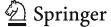

&lt;sup>b The age of patch is measured as the difference, in days, between the date of release of patch by vendor and the first day of the observation period, taking negative values if the date of observation precedes the release of the patch

&lt;sup>4 Severity type consists of identifiers for how severe the vulnerability is based on the possible damage that could result on the attacked host. Severity type includes security protection, confidentiality, integrity and availability. Vulnerability type denotes the technical characteristics of the vulnerability such as input validation error, boundary condition error, buffer overflow, access validation error, exceptional condition, environmental error, configuration error, race condition and other vulnerability.

&lt;sup>5 Exploit code also includes cases where no actual code is provided but where explanations on how to exploit the vulnerability are available.

&lt;sup>6 Vulnerabilities that were never patched would take a value of zero for the elapsed *patch days* but the dummy variable that denotes "not patched" vulnerabilities would take on a value of 1.

 $^{7}$  Vulnerabilities that have been patched before they were published were deemed to have been patched and published on the same day.

Table 5 Vulnerability by type

|                                                | Number of vulns. | Number of observations |
|------------------------------------------------|---------------------|---------------------------|
| Vulnerability only affecting windows hosts  | 57                  | 513                       |
| Vulnerability only affecting Linux hosts    | 20                  | 180                       |
| Vulnerability only affecting Solaris hosts  | 11                  | 99                        |
| Vulnerability only affecting all UNIX hosts | 27                  | 243                       |
| Vulnerability only affecting all hosts      | 11                  | 99                        |
| Other vulnerabilitiesa                         | 202                 | 1,818                     |

a Other vulnerabilities are those that not operating system vulnerabilities but vulnerabilities that pertain to application software that reside on an operating system that affects host, such as FTP client software vulnerability

the vulnerability life cycle. Thus this approach disregards how attackers' incentive to launch attacks changes with time. As laid out in Section [3,](#page-2-0) when a vulnerability is published (for which patch has not yet been released), it should result in widespread availability of exploit tools and more attacks (and presumably fewer alternatives for users to protect themselves as patch is not available). But upon patch release, with time there are two opposing effects. On one hand, patches may provide new information to the attacker, but the end-users can also patch their systems. With time, the probability of success attack would decline making systems harder to penetrate, thereby reducing gains from attacking using a particular vulnerability. The net effect of the effect of patch release for a particular vulnerability would thus change with time. To explicitly examine time effects of publishing and patch release, in the second part of the empirical analysis, we add controls to examine the effect of elapsed days from the availability of patches and the effect of elapsed days from publishing on the attack frequency.

### 5.1 Average effect of patching and publishing: Results from non parametric analysis

If all vulnerabilities were similar, we could simply compare the number of attacks for a published vulnerability to the number of attacks for an unpublished one. Since it is possible that vulnerabilities differ from each other in ways we cannot observe, we computed the change in the number of attacks before and after publication for each vulnerability. If there were no change over time in the number of attacks as a whole, this would measure the impact of

Table 6 Difference in means of average number of attacks per day

| Period         | Patched (1)  | Difference in (1) between periods (2) | Published (3) | Difference in (3) between periods (4) | Secret (5)    | Difference in (5) between periods (6) | Effect of publishing (4)−(6) (7) | Effect of patching a known vuln. (2)−(4) (8) | Effect of patching a secret vuln. (2)−(6) (9) |
|----------------|-----------------|---------------------------------------------------|------------------|---------------------------------------------------|------------------|---------------------------------------------------|-------------------------------------------|----------------------------------------------------------|-----------------------------------------------------------|
|                |                 |                                                   |                  |                                                   |                  |                                                   |                                           |                                                          |                                                           |
| Period 1    | 0.05 (0.03)  | –                                                 | 0.22 (0.10)   | –                                                 | 2.38 (2.22)   | –                                                 | –                                         | –                                                        | –                                                         |
| Period 2    | 0.06 (0.024) | 0.01 (0.04)                                       | 0.53 (0.24)   | 0.31 (0.26)                                       | 0.11 (0.05)   | −2.27 (2.22)                                   | 2.58 (2.22)                               | −0.30 (0.26)                                             | 2.28 (2.22)                                               |
| Period 3    | 0.06 (0.04)  | 0 (0.02)                                          | 2.24 (1.96)   | 1.76 (1.97)                                       | 0.21 (0.03)   | 0.10 (0.06)                                    | 1.66 (1.97)                               | −1.76 (1.97)                                             | −0.10 (0.06)                                              |
| Period 4    | 0.11 (0.09)  | 0.05 (0.09)                                       | 0.28 (0.21)   | 1.96 (1.97)                                       | 0.30 (0.22)   | 0.09 (0.22)                                    | 1.87 (1.98)                               | −1.91 (1.98)                                             | −0.04 (0.28)                                              |
| Period 5    | 0.28 (0.15)  | 0.17 (0.17)                                       | 0.58 (0.33)   | 0.30 (0.39)                                       | 0.15 (0.09)   | −0.15 (0.24)                                   | 0.15 (0.46)                               | −0.13 (0.43)                                             | 0.02 (0.29)                                               |
| Period 6    | 0.07 (0.04)  | −0.21 (0.16)                                      | 0.18 (0.11)   | −0.40 (0.35)                                      | 0.06 (0.04)   | −0.09 (0.09)                                   | −0.31 (0.36)                              | 0.19 (0.38)                                              | −0.12 (0.18)                                              |
| Period 7    | 0.01 (0.009) | −0.06 (0.04)                                      | 0.02 (0.02)   | −0.16 (0.11)                                      | 0.008 (0.006) | −0.05 (0.04)                                   | −0.03 (0.12)                              | 0.10 (0.12)                                              | −0.01 (0.06)                                              |
| Period 8    | 0.01 (0.005) | 0 (0.01)                                          | 0.02 (0.02)   | 0 (0.03)                                          | 0.003 (0.003) | −0.005 (0.007)                                 | 0.005 (0.03)                              | 0 (0.10)                                                 | 0.005 (0.01)                                              |
| Period 9    | 0.01 (0.004) | 0 (0.006)                                         | 0.01 (0.009)  | −0.01 (0.06)                                      | 0.006 (0.006) | 0.003 (0.006)                                  | −0.013 (0.06)                             | 0.01 (0.06)                                              | −0.003 (0.008)                                            |
| Average effect |                 |                                                   |                  |                                                   |                  |                                                   | 0.74 (0.33)                               | −0.48 (0.24)                                             | 0.25 (0.20)                                               |

Standard errors in parentheses

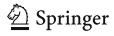

Table 7 OLS estimates of impact of patching and publishing, dependent variable average number of attacks on a host/day (standard errors in parentheses)

| Variables           | Specification 1: vulnerability characteristicsa | Specification 2: vulnerability fixed effects |
|---------------------|-------------------------------------------------------|----------------------------------------------------|
| Windows             | 0.64 (1.19)                                           | –                                                  |
| UNIX                | 0.27 (1.20)                                           | –                                                  |
| All                 | 0.32 (1.25)                                           | –                                                  |
| Linux               | 0.32 (1.20)                                           | –                                                  |
| Solaris             | 0.28 (1.24)                                           | –                                                  |
| Secret              | 0.33 (0.26)                                           | −0.28** (0.14)                                     |
| Published           | 0.50*** (0.16)                                        | −0.17* (0.09)                                      |
| Location            | −0.13 (0.26)                                          | −0.16*** (0.07)                                    |
| Vuln. dummies (327) | No                                                    | Yes                                                |
| Time dummies (7)    | Yes                                                   | Yes                                                |
| N                   | 2,952                                                 | 2,952                                              |

publication. However, since it is possible that the overall number of attacks vary over time, we computed the change in the number of attacks per period for vulnerabilities that were not published. In other words, we look at how the number of attacks increase after publication for published vulnerabilities and compare it to the corresponding change for vulnerabilities that remained secret at that time. In effect, we use the secret vulnerabilities as a control group.

To understand the effect of patching we compare the time demeaned differences in attacks per host between patched vulnerabilities and published vulnerabilities. Column (8) of Table [6](#page-6-0) indicates that availability of patches decreases attacks on hosts at the rate of 0.48 attacks per day. Similarly, the time-demeaned differences between published vulnerabilities (column 4) and secret vulnerabilities (column 6) suggests that disclosure of vulnerability information increases the number of attacks on hosts at the rate of 0.74 attacks per day. Further, patching a secret vulnerability increases attacks on hosts by about 0.25 attacks per day (column 9 of Table [6](#page-6-0)). These estimates implicitly control for vulnerability characteristics by looking at changes over time within a vulnerability. However, these results do not explicitly control for time and location effects, for which we turn to regression results.

### 5.2 Vulnerability characteristics vs. vulnerability "fixed effects": Regression results

Now we run regressions to understand the changes in number of attacks over time. Our dependant variable is the average number of attacks observed on a host during the period while the independent variables are status of the vulnerability (secret, published or patched) and other vulnerability specific characteristics. Since we have a time series, we can also estimate a fixed effect model but then we can not include vulnerability specific characteristics. We provide both estimates. Since data were acquired from honeypots running on two different geographic locations we also control for location specific effects by using a dummy variable, location.

If Ait denotes the average number of attacks on a host of vulnerability type i observed at period t, the specification with vulnerability characteristics (specification 1 in Table 7) is given by

$$A_{it} = \beta_0 + \beta_1 Windows + \beta_2 UNIX + \beta_3 All + \beta_4 Linux \ + \beta_5 Solaris + \beta_6 Secret + \beta_7 Published + \beta_6 Location \ + \beta_8 timedummies + elde{\varepsilon}_{it}$$

Note that we have no included patched dummy here because not all three dummies can be identified. Thus the estimates of Secret and Published should be interpreted in comparison to patched (which is normalized to 0).

Table 8 Tobit regression—effect of elapsed patch days and elapsed publish months

| Variable                                            | OLS coefficient estimate (2) | Tobit coefficient estimate (3) |
|-----------------------------------------------------|------------------------------------|--------------------------------------|
| Secret dummy                                        | 0.89 (0.60)                        | −3.52 (10.81)                        |
| Published dummy                                     | 1.47*** (0.32)                     | 32.08*** (6.95)                      |
| tsecret                                             | 0.02** (0.006)                     | 0.02 (0.08)                          |
| tsecret2                                            | 0.0001*** (0.00001)             | 0.0001 (0.47)                        |
| tpatch                                              | 0.05*** (0.01)                     | 2.34** (1.10)                        |
| tpatch2                                             | −0.0003** (0.0001)              | −0.03 (0.17)                         |
| tpub                                                | −0.03*** (0.01)                 | −1.68** (0.30)                       |
| tpub2                                               | 0.0001** (0.0001)               | 0.05 (0.01)                          |
| Exploit                                             | −0.09 (0.14)                       | −5.13 (9.45)                         |
| Location                                            | 0.44** (0.05)                      | −9.57*** (3.52)                      |
| Time dummy variable included (6)                 | Yes                                | Yes                                  |
| Vulnerability dummy variable (43)                | Yes                                | Yes                                  |
| Vulnerability technical characteristics included | No                                 | No                                   |
| No. of observations                                 | 2,952                              | 2,952                                |
| Log likelihood                                      | –                                  | −669.42                              |
| No. of vulnerabilities                              | 328                                | 328                                  |
| σ (std. deviation)                                  | –                                  | 13.27                                |

Dependent variable—average number of attacks per day per host (standard errors in parentheses)

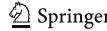

\*\*\*p<0.01; \*\*p<0.05; \*p<0.10 a Estimates include vulnerability details and vendor characteristics

\*\*\*p<0.01; \*\*p<0.05; \*p<0.10

Fig. 1 Simulated impact of publishing without patch

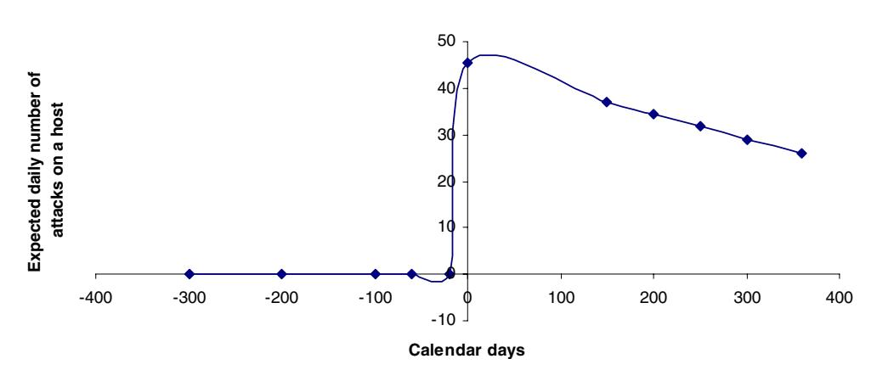

Case1: Published at t=0

For the specification with vulnerability fixed effects (specification 2 in Table 6) we estimated

$$A_{it} = \delta_0 + \delta_1 Secret + \delta_2 Published + \delta_3 Location$$
  
  $+ \delta_4 Vul.dummies + \delta_5 timedummies + \varepsilon_{it}$ 

Table 7 provides the estimated results. Since the results are different in both scenarios, with fixed effect results being generally more robust, we focus henceforth on the results using vulnerability fixed effects. Since patched is the reference category, with find that availability of patches for a published vulnerability is associated with an increase of about 0.17 attacks per host per day, while publishing of vulnerabilities is associated with an increase of about 0.11 attacks per host per day (0.28-0.17). Clearly, patching information benefits attackers as well. We find that attackers do not expect users to patch right away and patches provide them with useful information to mount attacks and hence number of attacks increase substantially. The result also suggests that, on average, both published vulnerabilities and patched vulnerabilities are likely to be exploited more than secret vulnerabilities.

As explained earlier, this analysis aggregates all vulnerabilities and does not consider the time effects of patching and publishing. Typically, vulnerability information diffuses with time and the fraction of users implementing patches increases with time. Even our descriptive statistics

presented earlier, reveal that vulnerabilities not exploited by attackers generally tend to be much older than those that were exploited, indicating the presence of time variation in attack frequency. In the analysis that follows we specifically consider the effect of age of the vulnerability and age of the patch on the number of attacks on hosts per day. We calculate three time variables: Remaining secret days (tsecret), calculated as number of days from the date of observation to the date on which vulnerabilities were published (recall that this will be a negative number); **Elapsed publish days**  $(t_{pub})$  calculated as number of days from the date on which vulnerabilities were published till the date of observation to the date; Elapsed patch days  $(t_{patch})$  calculated as number of days from the date of patch till the date of observation. We also add square of each of these time variables in our regression to handle any nonlinearities in time. We estimate a Tobit specification (to explicitly account for the vulnerabilities that experienced no attacks during the sample period) and an OLS specification with same dependent variables and report the results of both. To avoid collinearity between the time dummies, location and days to publication, we use 6 times dummy variables. We also use 43 vulnerability dummy variables— 1 for all vulnerabilities that do not exploited at all and 42 individual vulnerability dummy variables to identify 44 vulnerabilities that get exploited in one or more periods (exploit identifies one vulnerability).

The Tobit specification is specified as

$$A_{it} = \alpha_i Vul.dummies + \tau_t Timedummies + \delta_1 Secret_{it} + \delta_2 Published_{it} + \delta_3 Secret_{it} * t_{Secret} + \delta_3 Secret_{it} * t_{Secret} + \delta_5 (1 - Published_{it} - Secret_{it}) * t_{patch} + \delta_6 (1 - Published_{it} - Secret_{it}) * t_{patch} + \delta_7 (1 - Secret_{it}) * t_{pub} + \delta_8 (1 - Secret_{it}) * t_{pub}^2 + \delta_9 Exploit_i + \delta_7 Location_t + u_{it} \equiv (\mathbf{X}\delta + u_{it})$$

Table 8 presents the results of the specifications. Both specifications lead to qualitatively similar results. We focus

on the Tobit specification since for a number of our observations, the observed number of attacks is zero.

Fig. 2 Simulated impact of patching a known vulnerability

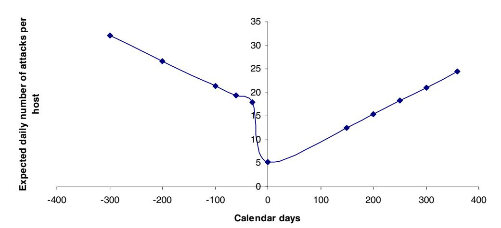

Note that secret vulnerabilities get exploited less often than patched vulnerabilities (see secret dummy) while published vulnerabilities without patches are getting exploited more often (published dummy). This highlights the importance of releasing patches especially for known vulnerabilities. Further, secret vulnerabilities generate attacks at a relative constant rate though they initially decrease and then gradually increase as the vulnerability gets closer to publication (indicated by the positive coefficients of tsecret and t 2 secret). Time since publication is negative and significant. This suggests that new vulnerabilities get exploited more often. After publication, there is a flurry of attacks and they reduce with time. This also confirms that case study results of Arbaugh, Fithen et al. [\(2000b](#page-11-0)) namely that attacks increase for some time window and then subside. The estimated coefficient of tpatch is positive and significant suggesting that immediately after patch availability the number of attacks increase. Also, attackers take longer time to develop tools to exploit vulnerabilities when vulnerabilities are published without a patch (sample average of time to first attack is 40 days from publication) as opposed to when vulnerabilities are published with an accompanying patch (sample average of time to first attack is 16 days) suggesting that patch do in fact provide "new" information to attackers that enable attackers to develop exploit tools faster. However from the published dummy estimate we know that overall patching is very beneficial. Further t 2 patch is negative (though not significant) suggesting that eventually the attacks decrease.

5.3 Impact of elapsed patch and publish months—results of Tobit specification

We plot the impact of patching and publication to illustrate our results. The figures have been constructed using the

Fig. 3 Simulated effect of patching an unknown vulnerability

## **Case3: Patched and published at t=0**

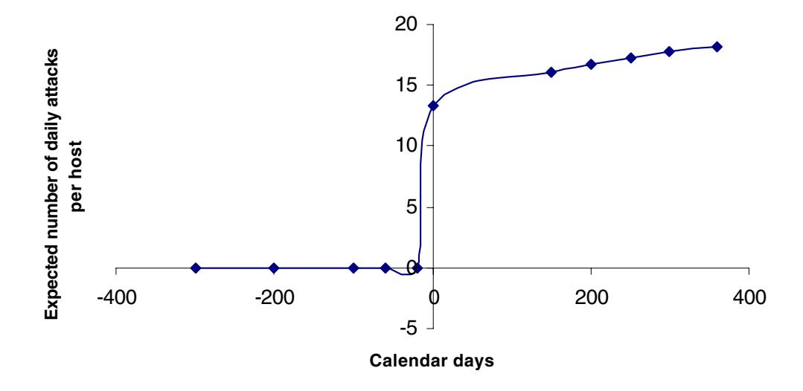

**Fig. 4** Simulated attack life cycle

Case 4: Published at t=0 and patched at t=300

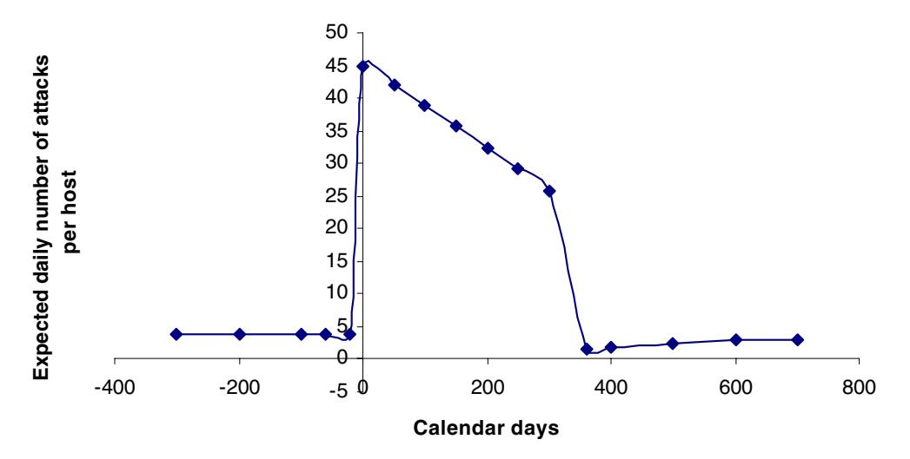

predicted values of the Tobit regression reported in Table 8. In each of these figures X-axis represents time in elapsed calendar days and Y-axis represents the predicted number of attacks calculated as  $E(A_{it}) = \Phi\left(\frac{\chi \delta}{\sigma}\right) X \delta + \sigma \phi\left(\frac{\chi \delta}{\sigma}\right)$ , where  $\Phi(.),\phi(.)$  and  $\sigma$  represent normal CDF, normal PDF and estimated variance respectively. The results are explained using Figs. 1, 2, 3 and 4.

Figure 1 shows the effect of publishing a vulnerability in which the vulnerability is published at t=0. In other words, the vulnerability depicted in the figure changed status from secret to published at t=0. From Fig. 1, publishing a vulnerability significantly increases the expected number of attacks when published. After publication the number of attacks per host decreases gradually with time to about 35 attacks per day per host around t=360.

Next we investigate the impact of patch release. In Fig. 2, the vulnerability is patched at time t=0, and was published 300 days before that, at time t=-300 (negative time is relative to patching). The sharp decrease in the expected number of attacks immediately upon patching indicates that patching a vulnerability reduces attack frequency. But upon release of patch the number of attacks per host gradually increases (positive estimate on  $t_{patch}$ ). Note, however, that overall number of attacks after patching is significantly smaller (on an average patching reduces attacks by about 31 attacks per day9).

Next we investigate the case of vulnerabilities that were patched and published on the same day using Fig. 3. Patching an unknown vulnerability increases attacks upon publication of the vulnerability. The figure depicts a spike around at t=0. Further, the expected number of attacks per day per host gradually decreases. This suggests that patching a hitherto unknown vulnerability does provide

&lt;sup>9 Calculated as  $\Phi\left(\frac{X\hat{\delta}}{\sigma}\right)\hat{\delta}$ 

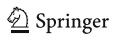

information to attackers, increasing their incentives to launch attacks. The fact that the attack frequency increases with time after patch release reflects the fact that end users do not patch their systems fast enough as also noted by Rescorla (2003). This highlights the need for vendors to not only focus on whether or not and when vulnerabilities should be patched but also how patches be disseminated.10

We summarize our results using Fig. 4 using the case of a typical vulnerability that is published at t=0 and patched at t=200. Upon publication of the vulnerability the number of attacks increase from about 5 to about 5.2 attacks per day and gradually decrease until t=200 when a patch for the vulnerability is released. Upon release of patch, there is a short term increase in attack frequency, before attacks on hosts gradually about 500 days from patching the vulnerability. Clearly publishing information about vulnerabilities increases attack frequency on hosts on an average. Also, our results with regard to patching suggest that it provides new information to attackers resulting in an increase in the frequency of attacks on hosts, while also suggesting that there is a lag between when patches are made available by vendors and when end-users actually patch or upgrade their systems. There is a small increase in attack frequency with time upon release of patches. The increase in attack frequency with time since release of patches, highlight the need for vendors to disseminate patches in such a way so as to facilitate quicker patch adoption.

#### 6 Discussion and conclusion

Our paper provides critical empirical estimates on the frequency of attacks and how they are conditioned by

&lt;sup>10 Many vendors have now introduced automatic updates at regular time intervals.

vulnerability disclosure. We examine attack frequency when secret vulnerabilities are published and then patched. To our knowledge, this is the first systematic empirical examination of this question and marks a contribution towards risk management and information security in general, and understanding how vulnerability information should be disclosed in particular. In general, secret vulnerabilities get exploited fewer times than patched vulnerabilities while published vulnerabilities without patches get exploited more often. We also find evidence consistent with the notion that patches themselves provide crucial information to attackers and hence there is a need to disseminate the patches carefully. The jump in number of attacks after patching is indicative of the fact that attackers think that users do not patch their systems quickly enough. This has been observed in other works as well (Arbaugh, Fithen et al., 2000b). Clearly, both the vendors and users need a more efficient way to manage their patching operations.

The results do however underscore the importance of understanding user patching behavior. As noted, release of a patch could increase the number of attacks. This could be many users apparently do not install the patch. It could also be that the patch helps attackers develop better exploits, but it remains true that unless attackers expect significant delays among a substantial fraction of users in installing the patch, there would be little point in attacking. Thus, a promising area for future research is to understand the factors that condition the speed with which users install patches, and in particular, the quality of the patch.

While our results are interesting, there are a number of qualifications. First, as in the case with most studies in this area, due to the non-trivial effort involved in data collection, our sample size of 328 vulnerabilities spread across 9 time slices is small given that only 44 vulnerabilities are those that are exploited during this time. Second, we only observe attack frequency and not the actual loss. While higher frequency would correlate with loss, a more precise analysis with loss information would be interesting future work. Also we lack information on successful attacks (e.g., those that would overcome the countermeasures that may exist in reality). We also lack information on the severity of damages. Therefore, it is conceivable that even though number of attacks has increased, the actual damage might be quite low because users may have patched. Further, honeypots data may overrepresent trivial attacks while also under-representing more sophisticated attacks. However, given the importance of vulnerability disclosure and little empirical work, we hope that our study paves the way for more research with new and better data sources.

Acknowledgment We thank the members of honeynet project for providing us with data for this study. Rahul Telang acknowledges generous support of National Science Foundation (NSF) through CAREER award CNS-0546009.

### References

- Arbaugh, W. A., Browne, H. K., McHugh, J., & Fithen, W. (2000a). A trend analysis of exploitations. University of Maryland working paper UMIACS-TR-2000-76.
- Arbaugh, W. A., Fithen, W. L., & McHugh, J. (2000b). Windows of vulnerability: A case study analysis. IEEE Computer, 33 (December), 52–59.
- Arora, A., Krishnan, R., Telang, R., & Yang, Y. (2005). An empirical analysis of vendor response to disclosure policy. The 4th annual workshop on economics of information security (WEIS05). Harvard University.
- Arora, A., Telang, R., & Xu, H. (2004). Optimal policy for software vulnerability disclosure. The 3rd annual workshop on economics and information security (WEIS04). University of Minnesota.
- Elias, L. (2001). Full disclosure is a necessary evil. SecurityFocus. com. <http://www.securityfocus.com/news/238>.
- Farrow, R. (2000). The pros and cons of posting vulnerability. The network magazine. <http://www.networkmagazine.com/shared/article>.
- Gordon, S., & Ford, R. (1999). When worlds collide: Information sharing for the security and anti-virus communities. IBM research paper.
- Gordon, L. A., & Loeb, M. P. (November 2002). The economics of information security investment. ACM Transactions on Information and System Security, 5(4), 438–457.
- Howard, J. (1997). An analysis of security incidents on the internet 1989–1995. Dissertation, Carnegie Mellon University. [http://](http://www.cert.org/research/JHThesis/Start.htm) [www.cert.org/research/JHThesis/Start.htm](http://www.cert.org/research/JHThesis/Start.htm).
- Kannan, K., & Telang, R. (2005). Market for vulnerabilities? Think again. Management Science, 51(5), 726–740.
- Krsul, I., Spafford, E., & Tripunitara, M. (1998). Computer vulnerability analysis. Technical report, Department of Computer Science, Purdue University, May 1998. [http://www.citeseer.nj.](http://www.citeseer.nj.nec.com/krsul98computer.html) [nec.com/krsul98computer.html.](http://www.citeseer.nj.nec.com/krsul98computer.html)
- Leyden, J. (2002). Show us the bugs—users want full disclosure. The register. [http://www.theregister.co.uk/2002/07/08/show\\_us\\_the\\_](http://www.theregister.co.uk/2002/07/08/show_us_the_bugs_users/) [bugs\\_users/.](http://www.theregister.co.uk/2002/07/08/show_us_the_bugs_users/)
- Rescorla, E. (2003). Security holes... Who cares? 12th Usenix security symposium, Washington, DC.
- Rescorla, E. (2004). Is finding security holes a good idea? 3rd Annual workshop on economics of information security (WEIS04). University of Minnesota.
- Schechter, S. E., & Smith, M. D. (2003). How much security is enough to stop a thief? The economics of outsider theft via computer systems and networks. The Seventh International Financial Cryptography Conference, Gosier, Guadeloupe College Park, MD. May, 2003.

Schneier, B. (2000). Full disclosure and the window of exposure. In CRYPTO-GRAM.

Seltzer, L. (2004). How should researchers handle exploit code? eWeek. [http://www.eweek.com/article2/0,1759,1580077,00.asp.](http://www.eweek.com/article2/0,1759,1580077,00.asp)

Spitzner, L. (2001). Know your enemy: Revealing the security tools, tactics, and motives of the blackhat community. Addison-Wesley.

Telang, R., & Wattal, S. (2005). Impact of software vulnerability announcements on the market value of software vendors—an empirical investigation. The 4th Annual Workshop on Economics of Information Security (WEIS05). Harvard University.

Ashish Arora is Professor of Economics and Public Policy in the Heinz School. Arora's research focuses on the economics of technology and technical change. His research interests include the study of technology-intensive industries such as software, biotechnology, and chemicals; the role of patents and licensing in promoting technology startups; and the economics of information technology.

Anand Nandkumar is a graduate student pursuing Ph.D. at the Carnegie Mellon University. His research interests include economics of information security and economics of entrepreneurship and strategy in the software industry.

Rahul Telang is an Assistant Professor of Information Systems at Carnegie Mellon University. Telang's key research field is in economics of Information security. He has done extensive empirical and analytical work on disclosure issues surrounding software vulnerabilities, software vendor's incentives to provide quality, mechanism designs for optimal security investments in a multi-unit firms, etc.

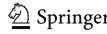