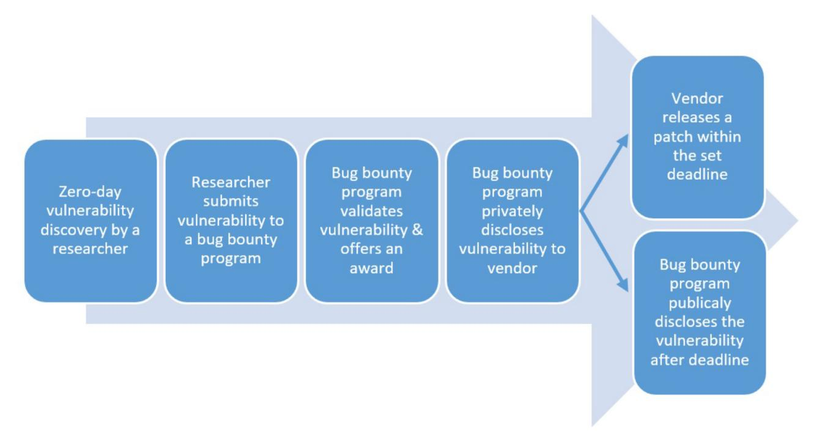
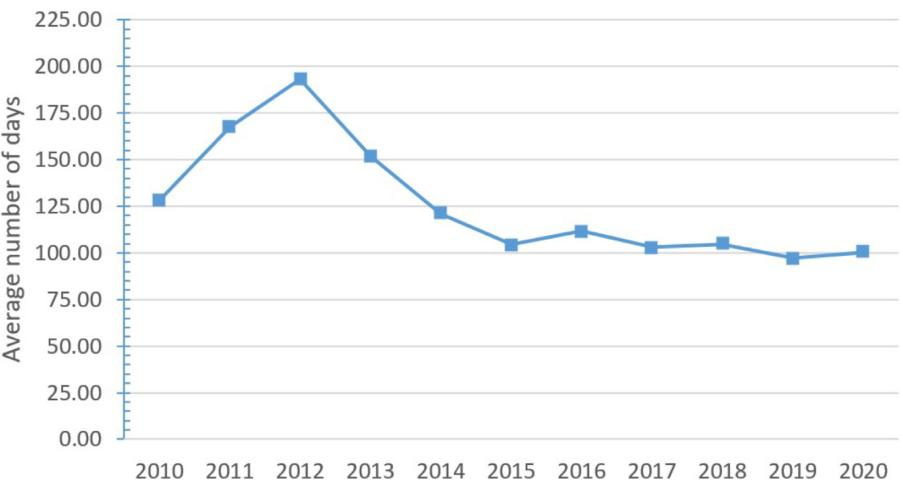
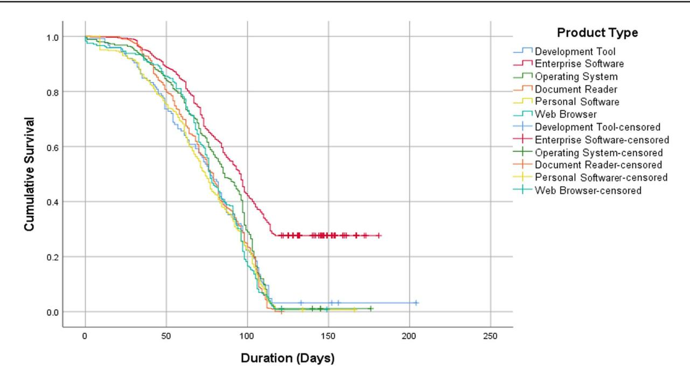
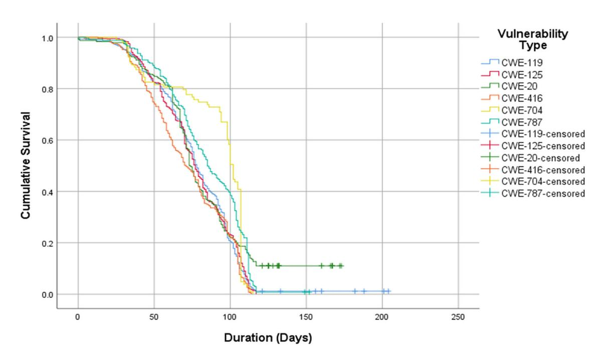

## Research paper

# **Patching zero-day vulnerabilities: an empirical analysis**

### **Yaman Roumani[\\*](#page-0-0)**

Department of Decision and Information Sciences, Oakland University, 275 Varner Drive, Rochester, MI 48309, USA

∗Correspondence address. Department of Decision and Information Sciences, Oakland University, 275 Varner Drive, Rochester, MI 48309, USA. Tel: +(248)-370-2717; E-mail: [yamanroumani@oakland.edu](mailto:yamanroumani@oakland.edu)

Received 16 April 2021; revised 1 September 2021; accepted 11 November 2021

#### **Abstract**

Zero-day vulnerabilities remain one of the major security threats that are faced by organizations. Once a vendor learns about a zero-day vulnerability, releasing a timely patch becomes a priority given the risk of zero-day exploits. However, we still lack information on the factors that affect patch release time of such vulnerabilities. The main objective of this study is to examine the impact of other as-yet unexplored factors on the patch release time of zero-day vulnerabilities. Using zeroday vulnerability dataset captured between 2010 and 2020, we employ survival analysis technique. Our model explores the impact of vulnerability attack vector, attack complexity, privileges required, user interaction, scope, confidentiality, integrity, and availability impact on patch release timing. Findings show that a zero-day vulnerability is more likely to be patched on time if the vulnerability results in a scope change and affects more vendors, products, and versions. However, a zero-day vulnerability is less likely to be patched on time if it requires privileges and impacts confidentiality. Our sub-analyses also reveal how patch release times vary across different products and vulnerability types.

**Key words:** zero-day vulnerability, patch release time, survival analysis, vulnerability, attributes

#### **Introduction**

The threat of software vulnerabilities remains large particularly for firms that rely on mission-critical applications and handle sensitive information. According to the National Vulnerability Database (NVD), the number of reported vulnerabilities in 2017, 2018, and 2019 more than doubled, reaching a historic high [\[1\]](#page-10-0). Software vulnerabilities are often the result of a glitch, software flaw, human error, or weakness that compromise the affected system. Once a technology vendor discovers a vulnerability, it works on issuing a security patch prior to public disclosure. However, if the vendor fails to release a timely patch, hackers may exploit the security hole and publicly disclose it [\[2–4\]](#page-10-1).

A zero-day vulnerability refers to a newly discovered vulnerability that is unknown to the affected vendor and has no security patch. Once a vendor learns about a zero-day vulnerability, releasing a timely fix becomes vital given the risk of zero-day exploits. However, if a zero-day vulnerability is released to the public, its exploitability risk increases since attackers are likely to use it to attack vulnerable systems. In other words, a delay in issuing patches for zero-day vulnerabilities implies higher risks for zero-day exploits. For instance, in April 2012, two Java-related zero-day vulnerabilities were reported to Oracle; however, by the time Oracle issued their scheduled patch release, it was already too late and the two vulnerabilities were already exploited [\[5\]](#page-10-2). Similarly, a zero-day vulnerability in Microsoft Word was reported to Microsoft [\[6\]](#page-10-3). Nevertheless, because of the delay in issuing a security patch, the vulnerability was exploited by cybercriminals, which resulted in financial and political related attacks that put millions of potential victims at risk. Therefore, in this study, we argue that understanding the factors that positively and negatively affect patch release time is crucial to IT vendors that grapple with the challenge of securing their products.

Although existing literature on patching vulnerabilities and exploitability risk has examined the impact of a variety of factors on patch release time (see for e.g. [\[2,](#page-10-1) [7–16\]](#page-11-0)), these studies have various

limitations. First, existing studies have primarily focused on known vulnerabilities without taking into consideration the threats of zeroday vulnerabilities. Second, to our knowledge, prior research has not examined how patch release time is impacted by vulnerability-related attributes, affected product types, and vulnerability types. Specifically, existing work does not report which zero-day vulnerability is more likely to be patched on time and how vulnerability's factors contribute to a faster or slower release times. Third, prior studies have analyzed data over a short period of time that may be insufficient to fully understand what and how patch release time is impacted. Finally, earlier studies have not examined patching timeline of zero-day vulnerabilities prior to their release to the public.

To fill this gap, our main objective is to examine the impact of other as-yet unexplored factors on the patch release time of zero-day vulnerabilities. Specifically, the major goals of this study are to (i) empirically estimate how vulnerability-related factors impact patch release time of zero-day vulnerabilities using survival analysis, (ii) employ Kaplan–Meier (K–M) estimator to determine how patch release time differs among affected products and vulnerability types, and (iii) assess the robustness of the results. More precisely, we capture data of 4897 zero-day vulnerabilities between 2010 and 2020 using two sources: the NVD and zero-day initiative (ZDI). We then fit a Cox regression model, conduct sub-analyses using K–M technique, and perform robustness analysis.

This study extends prior research on vulnerability patching and exploitability risk. In particular, we expand prior research [\[16\]](#page-11-1) by focusing on the timeline of zero-day exploits prior to being released to the public; thus, our research offers new information on risk mitigation of exploitable vulnerabilities at an early stage. In addition, our study answers the call by Arora *et al.* [\[2\]](#page-10-1) to examine the impact of unexplored factors on patch release. Findings of this research also offer insights into the factors affecting timely patch releases, thus addressing the limitations of previous work. In addition, results of this study should be of practical importance to technology vendors on addressing zero-day vulnerabilities more efficiently and issuing timely security patches. Furthermore, investigating patch release time offers new insights to information security managers and security teams that struggle with allocating company's resources and prioritizing patches for zero-day vulnerabilities. Finally, as new zero-day vulnerabilities emerge, our model can be employed to reanalyze the new information, offer additional insights, and increase accuracy.

This study proceeds as follows. Second section provides relevant research background and related work. In third section, we introduce the methodology and research data, followed by fourth section that discusses our empirical results and sub-analyses. Fifth section summarizes our research findings and discusses the implications, followed by sixth section that describes the threats to validity. The paper concludes with seventh section that describes the limitations and future research.

#### **Research Background and Literature Review**

#### Research background

When a technology vendor learns about a zero-day vulnerability in their products, it makes two decisions in the patching process [\[15\]](#page-11-2). First, based on a risk assessment of the vulnerability, a vendor ranks the vulnerabilities and prioritizes the patch development process. Second, based on the initial assessment, a vendor determines whether to accelerate the patch release time and schedules a release date. If a vulnerability is publicly disclosed prior to the availability of a patch, a vendor runs the risk of zero-day exploits and potential attacks against its vulnerable product. Theoretically, releasing a patch as soon as a vulnerability is disclosed (ship-when-ready) is the optimal solution; however, as vendors consider factors such as the high development costs of patches and the benefits of patch predictability [\[17\]](#page-11-3), a periodic release policy may become more optimal. Periodic patch releases bring predictability to both vendors and customers [\[7\]](#page-11-0) as it enables customers to manage patches more efficiently [\[18\]](#page-11-4) and minimizes patch deployment costs [\[19\]](#page-11-5). For example, since 2005, Oracle switched its patch release policy from a ship-when-ready to a quarterly scheduled release [\[17\]](#page-11-3). Oracle's decision was based on customers' feedback about the lack of predictability, the struggle to apply too many patches at a short time interval, and the risk of missing a security patch. Similarly, other technology vendors such as Microsoft, SAP and Adobe switched to a monthly patch release schedule [\[20\]](#page-11-6). As more vendors implement a periodic release schedule, the challenge of deciding which vulnerability to patch first and when remains an issue.

Given the value of zero-day vulnerabilities, a plethora of bug bounty programs started to emerge where vulnerabilities are traded from security researchers. Bug bounty programs are mediums that separate security researcher from technology vendors. For a set financial payout, these programs trade zero-day vulnerabilities from researchers and thereafter communicate and share the information privately with the affected vendor. However, to ensure compliance from the vendor, bug bounty programs often specify a deadline prior to public disclosure of the vulnerability. Figure [1](#page-2-0) summarizes this process. In the context of this study, we use bug bounty programs as the main data source for zero-day vulnerabilities.

Since this study deals with time-related event (patch release), the statistical method needs to account for this time factor. Thus, we employ survival analysis technique. Survival analysis is a wellestablished collection of statistical methods that examine the length of time until the occurrence of a well-defined point of interest [\[21,](#page-11-7) [22\]](#page-11-8). Survival analysis was originally applied to the analysis of patients' survival in the medical field; however, its use has been expanded to other fields such as information systems [\[16\]](#page-11-1), finance [\[23\]](#page-11-9), social sciences [\[24\]](#page-11-10), and engineering [\[25\]](#page-11-11). Survival analysis can measure the impact of factors on the time to an event. In this study, the event of interest is the release of patch by a vendor. Unlike other statistical techniques, survival analysis considers the issue of censoring, a condition that occurs when the event of interest does not occur. For instance, if a vendor does not release a patch on time, then survival analysis will censor that specific data point. By analyzing the factors that influence time to an event, survival analysis can compute the probability that a vendor can release a patch on time and report the impact of factors on patch release time.

#### Literature review

The emerging research stream on vulnerability patching has highlighted a number of important topics in relation to software and patch release [\[9–15\]](#page-11-12), vulnerability disclosure [\[2,](#page-10-1) [7,](#page-11-0) [8,](#page-11-13) [26,](#page-11-14) [27\]](#page-11-15), vulnerability characteristics and exploits [\[28,](#page-11-16) [29,](#page-11-17) [30\]](#page-11-18), cloud-based software [\[31\]](#page-11-19), software quality [\[3\]](#page-10-4), risk mitigation [\[32\]](#page-11-20), and software piracy [\[33,](#page-11-21) [34\]](#page-11-22).

Our work draws from several areas in the vulnerability patching literature. The first area is software and patch release. Narang *et al.* [\[9\]](#page-11-12) proposed a bi-criterion framework that determines the optimal discovery and patching time of vulnerabilities and minimizes risk and cost. Using a dataset of 47 vulnerabilities of Google Chrome, the authors validated the proposed framework; results showed the goodness-of-fit curve of the vulnerability discovery and patching models. Tickoo *et al.* [\[10\]](#page-11-23) formulated a discrete-time model that determines the optimal test runs required for patch release and software release while taking into consideration cost and constraints and

**Figure 1:** Timeline of submitting zero-day vulnerabilities through bug bounty programs.

maximize reliability. The authors verified the proposed model using real-life dataset using logistic distribution function. In similar studies, Choudhary *et al.* [\[11,](#page-11-24) [12\]](#page-11-25) developed an effort-based cost model to determine the optimum release and patch time of software under warranty with a change point. The proposed model was tested on a sample data and the optimal patch release time was computed. Kansal *et al.* [\[13\]](#page-11-26) created a cost model to find out the optimal time to release and patch software under warranty and minimize development costs. Jo [\[14\]](#page-11-27) examined the effects of market concentration on vendors' responsiveness in patching software vulnerabilities. Using a dataset of 586 vulnerabilities in the web browser market, the author concluded that an increasing market concentration positively affects vendor's responsiveness in patching software vulnerabilities; however, the effect decreases when a software vendor is too dominant in the marketplace.

This study also draws from a second area related to vulnerability disclosure. Arora *et al.* [\[21\]](#page-11-7) formulated a model to find the optimal policy for vulnerability disclosure and patch release. Using data from computer emergency response team (CERT) and SecurityFocus, results showed that the threat of a vulnerability disclosure is effective in forcing a vendor to release a security patch in a timely manner. However, the study does not consider the impact of vulnerabilityrelated characteristics and software type on patch release time. In a later study, Arora *et al.* [\[2\]](#page-10-1) explored how vulnerability disclosure affects patch release time. The authors concluded that instant disclosure and severe vulnerabilities accelerate patch release time. Additionally, it was reported that open-source vendors are faster to release patches than closed source vendors. Cavusoglu *et al.* [\[7\]](#page-11-0) developed a game theory model to find the socially optimal timedriven patch management for technology vendor's patch-release speed and firm's patch update policy. Results showed that social loss is minimal when technology vendors release periodic patches rather than immediate release. Huang *et al.* [\[8\]](#page-11-13) analyzed patching speed of four types of organizations, including government institutions, listed companies, educational institutions, and startups in China. Results showed that listed companies were the fastest to issue a security

patch followed by government and educational institutions, while startups were the slowest [\[8\]](#page-11-13).

We also draw from a third area of work related to vulnerability characteristics and exploits. Temizkan *et al.* [\[29\]](#page-11-17) analyzed the differential effects of vulnerability's confidentiality, integrity, and availability impacts on vendor patch release behavior. Results showed that vulnerabilities with high confidentiality or integrity impact are patched fastest. Sen and Heim [\[30\]](#page-11-18) investigated the factors affecting the publication of security patches and concluded that prioritizing patches based on the probability of exploit publication decreases losses attributed to vulnerability attacks. Finally, Dey *et al.* [\[28\]](#page-11-16) compared the effectiveness of pure patching policies that rely on a single metric (e.g. cost of patching, severity level) and hybrid patching policies that combine more than two metrics. The authors concluded that using a hybrid approach that embraces out-of-cycle, ad hoc patching, in addition to prescheduled, time-based deployments, is the most effective for organizations.

While the aforementioned work has expanded our understanding of vendor's patching, these studies have some limitations. First, prior research did not explore the effects of vulnerability-related factors (e.g. attack vector, attack complexity, privileges required, scope, and user interaction) on patch release time. Furthermore, earlier work relied on data sources, such as CERT, that are not transparent when dealing with zero-day vulnerabilities. Third, prior work analyzed data over a short period of time, which may be insufficient to fully understand how patch release time is impacted.

#### **Methodology**

#### Survival analysis

Survival analysis is a family of statistical methods used for studying problems related to the occurrence and timing of events [\[35\]](#page-11-28). Survival analysis measures the occurrence of an event of interest over time and it has no underlying assumption about the distribution, linearity, or homoscedasticity of survival times [\[36\]](#page-11-29). Given that an event of interest may lack an exact distribution, a Cox proportional hazard

model (also called Cox regression) is often used in survival analysis. Cox regression is a semi-parametric method of survival analysis that estimates the relative effect (hazard ratio) of covariates on the event of interest [\[37,](#page-11-30) [20\]](#page-11-6). Cox regression assumes that the impact of the covariates on the hazard is proportional over time. Furthermore, Cox regression addresses the issue of right censoring that occurs if the event of interest is not observed. Cox regression is defined as follows:

$$h(t) = h_0(t) \exp(b_1 x_1 + b_2 x_2 \dots + b_p x_p),$$
 (1)

where *h*0(*t*) is the baseline hazard of event of interest at time *t*, *h*(*t*) is the hazard of the event of interest conditional on the independent variables *Xp*, and β*k* is the coefficient.

In the context of this study, the event of interest is releasing a timely patch for a zero-day vulnerability before the set deadline. In addition, right censoring is applied whenever a zero-day vulnerability is not patched within the set deadline. We specify Cox regression model to capture how zero-day vulnerabilities are timely patched by measuring changes in the independent and control variables [\[35\]](#page-11-28). Specifically, for each covariate, Cox regression produces a hazard ratio. If a hazard ratio is greater than one, then this implies that an increase in the covariate will increase the likelihood of the event of interest (timely patch). On the other hand, if the hazard ratio is less than one, then an increase in the covariate will decrease the likelihood of the event of interest. Finally, if the hazard ratio is equal to one, then this means than an increase in the covariate does not have an impact on the event of interest.

#### Data collection

The vulnerability dataset was collected from two sources: the NVD and ZDI. Sponsored by the Department of Homeland Security, NVD is a comprehensive public database that contains information about reported vulnerabilities. NVD reports the following information for each vulnerability: a unique identifier called the common vulnerability enumeration (CVE), a short description of the vulnerability, the type of the vulnerability, a severity score in addition to attack vector, attack complexity, privileges required, scope, confidentiality, integrity, and availability impacts. ZDI, on the other hand, is a bug bounty program that rewards security researchers for disclosing zeroday vulnerabilities. ZDI works closely with affected vendors to address the vulnerability prior to public disclosure. According to ZDI, each vendor is notified about their vulnerable product and is given 120 days to release a security patch. If no patch is provided within the time period, ZDI publishes a limited advisory including mitigation to protect vulnerable users. For each vulnerability, ZDI reports the following information: CVE, name of the affected vendor, the affected product, the name of the originating security researcher, and the disclosure timelines that include the date the vulnerability was reported to the affected technology vendor, the date of the public release of a security patch, and additional timelines to any further communications with the vendor.

For our dataset, we used ZDI to capture all zero-day that were disclosed between 2010 and 2020. After data collection, we crossreferenced NVD and ZDI datasets using the CVE value. We then eliminated entries with missing observations. The final sample size was 4897 zero-day vulnerabilities over 11-year period. Based on the dataset, year 2019 had the lowest average for patch release time (97 days), while year 2012 had the highest average for patch release time (193 days). Table [1](#page-3-0) reports descriptive statistics of the captured vulnerabilities. Based on the average number of days to patch release, as shown in Fig. [2,](#page-4-0) since 2012, the graph shows a negative slope indi-

**Table 1:** Descriptive statistics of zero-day vulnerabilities.

| Year  | N    | Average days to patch release | Std Dev. |  |
|-------|------|----------------------------------|----------|--|
| 2010  | 213  | 128                              | 67.86    |  |
| 2011  | 255  | 168                              | 98.28    |  |
| 2012  | 117  | 193                              | 101.59   |  |
| 2013  | 236  | 152                              | 90.99    |  |
| 2014  | 335  | 121                              | 68.57    |  |
| 2015  | 502  | 104                              | 43.78    |  |
| 2016  | 364  | 111                              | 83.53    |  |
| 2017  | 646  | 103                              | 53.50    |  |
| 2018  | 928  | 105                              | 28.62    |  |
| 2019  | 606  | 97                               | 34.21    |  |
| 2020  | 695  | 100                              | 33.42    |  |
| Total | 4897 |                                  |          |  |

cating faster patch releases over the 11-year period. The next section includes descriptions and operationalization of the variables used in this study.

#### **Dependent variable**

In this study, we use PatchReleaseTime as the dependent variable. To measure PatchReleaseTime, we used vulnerability report date (*D*vulnerability) and patch release date (*D*Patch). *D*vulnerability is the date a zero-day vulnerability was reported to the affected vendor by ZDI, whereas *D*patch refers to the patch release date of the same vulnerability. Thus, we measured PatchReleaseTime as the difference between vulnerability report date and patch release date (PatchReleaseTime = *D*Patch − *D*vulnerability). According to ZDI, a vendor is given 120 days to address the zero-day vulnerability prior to public release of information regarding the vulnerability and its mitigation mechanism [\[38\]](#page-11-31). Therefore, we set the cutoff date for PatchReleaseTime to be 120 days after vulnerability report date and censored such vulnerabilities from the analysis. In the context of this study, a zero-day vulnerability that is patched before 120 days will be considered as patched on time and those that are patched beyond the cutoff date are considered late patches.

#### **Independent variables**

*Attack vector.* Measures how a zero-day vulnerability is exploited. A remote attack vector allows adversaries to attack (exploit) vulnerabilities over the same logical or physical network or over the Internet. A local attack vector, on the other hand, is limited to attacks that require direct physical access to the target system. We code this variable as [1] = remote attack vector, and [0] = local attack vector.

*Attack complexity.* This metric measures the level of difficulty required to attack (exploit) a zero-day vulnerability [\[39\]](#page-11-32). Vulnerabilities that are assigned a low attack complexity score are considered more dangerous since they are easier to exploit and do not require special conditions. For instance, structured query language (SQL) injection, a type of attack in data-driven web applications [\[40\]](#page-11-33), is a serious threat that is considered simple and easy for attackers to conduct. The race condition vulnerability, on the other hand, is assigned a high complexity score since it requires special sequence and complex manipulations to be carried out and is difficult to exploit. We code this variable as follows: [1] = high attack complexity, [0] = low attack complexity. In the coding process, we combined medium and low access complexities together to mitigate issues related to low sample size per level.

**Figure 2:** Average number of days to patch release of zero-day vulnerabilities.

*Privileges required.* Having privileges to the affected system is sometimes a precondition to launching an attack against a zero-day vulnerability [\[39\]](#page-11-32). For example, an attacker may be required to provide credentials to log in to the affected system before exploiting a vulnerability. We code this variable as [1] = privileges required, and [0] = no privileges required.

*Scope.* This metric indicates whether a zero-day vulnerability is affecting resources beyond its assigned privileges. When this occurs, a scope change would occur. For instance, in 2017, a buffer overflow vulnerability in VMware virtual machine allowed a guest user to execute code on the host machine [\[41\]](#page-11-34). In this case, a guest-to-host attack enabled the adversary to go beyond the assigned privileges and affect the host operating system. In the context of this study, we code this variable as follows: [1] = scope changed and [0] = scope unchanged.

*User interaction.* This metric indicates whether a zero-day vulnerability can be exploited by an attacker or requires a user to perform some action (e.g. opening a malicious document, clicking on a URL). This variable is coded as follows: [1] = user interaction required and [0] = user interaction not required.

*Confidentiality, integrity and availability impacts.* The confidentiality, integrity, and availability (CIA) framework classifies the impact of a zero-day vulnerability with respect to confidently of information, assured integrity and prevention of malicious modification or destruction, and for information availability [\[42\]](#page-11-35). Specifically, the framework evaluates system security, develops practical security objectives, and assesses the impact of attacks on the vulnerable targets [\[43\]](#page-11-36). For each component of the CIA framework, an impact level determines the amount of damage done due to a loss of confidentiality, integrity, and availability. For example, a complete compromise of CIA implies the highest impact level. On the other hand, a partial or no compromise of CIA components suggests lesser impact levels. To measure CIA impacts, we use the following coding scheme: [1] = confidentiality impact, and [0] = partial confidentiality impact; [1] = integrity impact, and [0] = partial integrity impact; [1] = availability impact, and [0] = partial availability impact.

*Control variables.* We controlled for four variables: vulnerability severity score, the number of affected vendors, the number of affected products, and the number of affected versions. Vulnerability severity score is a continuous variable that rates the severity level of a vulnerability. The calculation of this metric is based on the common vulnerability scoring system (CVSS), an open industry framework created by the National Infrastructure Assurance Council (NIAC). For each vulnerability, a severity score is reported as a value between 0 and 10, where 0 indicates the least severe vulnerability and 10 means the most severe. Furthermore, we controlled for each of the number of affected vendors and products. Given that a vulnerability may impact multiple products and vendors, this would likely affect the time to patch; therefore, we control for both number of affected products and vendors. Descriptions and operationalization of the variables are summarized in Table [2.](#page-5-0)

Based on the independent and controls variables, we build a Cox regression model (equation 2) to estimate the likelihood of a timely patch release based on the covariates and controls.

$$\begin{split} h\left(t\right) &= h_{0}\left(t\right) \exp\!\left(\beta_{1} \text{AttackVector}_{t} + \beta_{2} \text{AttackComplexity}_{t} \right. \\ &+ \beta_{3} \text{PrivilegesRequired}_{t} + \beta_{4} \text{UserInteraction}_{t} + \beta_{5} \text{Scope}_{t} \\ &+ \beta_{6} \text{ConfidentialityImpac}_{t}_{t} + \beta_{7} \text{IntegrityImpac}_{t}_{t} \\ &+ \beta_{8} \text{AvailabilityImpac}_{t}_{t} + \text{Controls}_{t}\right) \end{split}$$

#### **Empirical Results**

#### Results

Prior to running Cox regression, we followed recommendations of Austin, Allignol, and Fine [\[44\]](#page-11-37) to ensure an adequate number of events per covariate. Moreover, we employed plots of deviance residuals to screen data for outliers and used plots of log(−log[survival]) vs log(time) to examine the proportionality assumption. The Cox regression analysis was conducted using SAS (version 9.4, SAS Institute Inc., Cary, NC). The goodness-of-fit of the proposed models was assessed using the −2 log-likelihood (−2LL) likelihood ratio test. Based on Pearson's χ2 statistic, the proposed models were deemed statistically significant (χ2 = 239.28, *P* &lt; 0.0001).

**Table 2:** Description and operationalization of variables.

| Variable               | Type        | Description/operationalization                                                                                                    |
|------------------------|-------------|-----------------------------------------------------------------------------------------------------------------------------------|
| Patch release time     | Dependent   | The difference between zero-day vulnerability report date and patch release date                                                  |
| Attack vector          | Independent | How a zero-day vulnerability is attacked: [1] = remote attack vector, and [0] = local attack vector                               |
| Attack complexity      | Independent | The level of difficulty required to attack: [1] = high attack complexity, [0] = low attack complexity                             |
| Privileges required    | Independent | Privileges requirement needed to attack a zero-day vulnerability: [1] = privileges required, [0] = no privileges required      |
| User interaction       | Independent | Whether use interaction is required for a successful exploitation of the vulnerability: [1] = required, and [0] = not required |
| Scope                  | Independent | Whether the vulnerability can impact resources beyond its means/privileges: [1] = yes, and [0] = no                               |
| Confidentiality impact | Independent | Compromise level of confidentiality: [1] = confidentiality impact, and [0] = partial confidentiality impact                    |
| Integrity impact       | Independent | Compromise level of integrity: [1] = integrity impact, and [0] = partial integrity impact                                         |
| Availability impact    | Independent | Compromise level of availability: [1] = availability impact, and [0] = partial availability impact                                |
| Severity score         | Control     | Severity level of the zero-day vulnerability measured on a scale of 0 to 10                                                       |
| Affected vendors       | Control     | A count of the number of affected vendors by the vulnerability                                                                    |
| Affected products      | Control     | A count of the number of affected products by the vulnerability                                                                   |
| Affected versions      | Control     | A count of the number of affected versions by the vulnerability                                                                   |

**Table 3:** Main Cox regression model.

|                             | Main model       |
|-----------------------------|------------------|
| Independent variables       |                  |
| Attack vector               | − 0.22 (0.05)    |
| Attack complexity           | 0.20∗ (0.08)     |
| Privileges required         | − 0.29∗∗∗ (0.07) |
| User interaction            | 0.06 (0.06)      |
| Scope                       | 0.44∗∗∗ (0.08)   |
| Confidentiality impact      | − 0.37∗∗∗ (0.11) |
| Integrity impact            | − 0.04 (0.11)    |
| Availability impact         | 0.01 (0.10)      |
| Control variables           |                  |
| Severity score              | − 0.02 (0.03)    |
| Number of affected vendors  | 0.12∗∗∗ (0.02)   |
| Number of affected products | 0.04∗∗∗ (0.01)   |
| Number of affected versions | 0.01∗∗∗ (0.00)   |
| Model statistics            |                  |
| Wald χ2 test                | 239.28∗∗∗        |

∗∗∗*P* < 0.001.

Results of fitting a Cox regression model yielded the following statistically significant variables: attack complexity, privileges required, scope, confidentiality impact, number of affected vendors, number of affected products, and number of affected versions. As shown in Table [3,](#page-5-1) findings revealed that zero-day vulnerabilities that have high attack complexity, result in a scope change, and affect more vendors, products, and versions are more likely to be patched on time. Specifically, findings revealed that zero-day vulnerabilities with high attack complexity are 1.22 times more likely to have timely patches. Likewise, zero-day vulnerabilities that result in a scope change are 1.55 times more likely to be patched on time. In addition, as the number of affected vendors, products, and versions increases, vulnerabilities are 1.13, 1.04, and 1.01 times more likely to be patched on time, respectively.

On the contrary, results showed that zero-day vulnerabilities that require privileges are 25% less likely to be patched on time, while those that impact confidentiality are 31% less likely to have timely patches. While these results highlight how covariates affect the likelihood of patch releases for zero-day vulnerabilities, we conduct further exploration and sub-analyses to investigate how these results differ among products and vulnerability types.

#### Sub-analyses

#### **Product type**

Since some product types are susceptible to more vulnerabilities and attacks [\[45\]](#page-11-38), we perform a sub-analysis based on the affected product type. Using our dataset, we identify six product types (document reader software, enterprise software, operating system, web browser, personal software, and development tools). We limit our choices to these six types given the frequency of each type.

First, we apply the K–M method, a nonparametric technique used to estimate time-related events [\[46\]](#page-11-39). Specifically, K–M analysis can be used to estimate the survival functions in order to test the statistical significance of differences between groups (e.g. product types). In addition, K–M method allows us to plot the overall survival probabilities of different product types throughout the duration of the study and estimate the mean and median patch release time.

Figure [3](#page-6-0) shows the percentage of product types (*y*-axis) that will have a patch release for the duration of the study (*x*-axis). The curves show that each product type has a different behavior. For example, the percentage of patched personal software appears to be the highest compared to other types. To confirm the difference among the product types, we conducted a log rank test (Mantel–Cox) and it confirmed a statistically significant difference (χ2 = 321.15, *P* &lt; 0.001). Table [4](#page-6-1) reports the mean and median estimations of survival functions. Interestingly, personal software has the lowest median patch release time (74 days) while enterprise software has the highest median (96 days). This implies that at 74 days, 50% of the personal software products will have patch releases, while the other 50% will still be awaiting a patch.

Second, we fit a Cox regression model for each product type. Using the same dependent variable (patch release time), eight independent variables (attack vector, attack complexity, privileges required, scope, user interaction, confidentiality impact, integrity impact, and availability impact), and four control variables (severity score, number of affected vendors, number of affected products, and number of

∗∗*P* < 0.01.

∗*P* < 0.05.

+*P* < 0.1; standard errors in parenthesis.

**Figure 3:** K–M estimations of survival functions for each product type.

**Table 4:** Mean and median of survival times of product types.

|                          | Mean 95% Confidence interval |           |                |                | Median 95% Confidence interval |           |                |                |
|--------------------------|---------------------------------|-----------|----------------|----------------|-----------------------------------|-----------|----------------|----------------|
|                          |                                 |           |                |                |                                   |           |                |                |
| Product type             | Estimate                        | Std error | Lower bound | Upper bound | Estimate                          | Std error | Lower bound | Upper bound |
| Document reader software | 76.25                           | 0.80      | 74.67          | 77.82          | 79.00                             | 0.93      | 77.19          | 80.81          |
| Enterprise software      | 106.54                          | 2.06      | 102.49         | 110.58         | 96.00                             | 1.70      | 92.68          | 99.32          |
| OS                       | 81.01                           | 1.36      | 78.33          | 83.68          | 86.00                             | 2.57      | 80.96          | 91.04          |
| Web browser              | 76.50                           | 1.72      | 73.12          | 79.88          | 77.00                             | 1.88      | 73.32          | 80.68          |
| Personal software        | 72.36                           | 1.46      | 69.50          | 75.22          | 74.00                             | 1.76      | 70.55          | 77.45          |
| Development tools        | 76.13                           | 3.30      | 69.65          | 82.60          | 77.00                             | 3.49      | 70.15          | 83.85          |

affected versions) we divide the initial dataset into different groups based on product type.

As reported in Table [5,](#page-7-0) for document reader software (model 1), zero-day vulnerabilities that result in scope change, impact availability, and affect more products are more likely to be patched on time; however, vulnerabilities with remote attack vector and impact confidentiality and integrity are less likely to be patched on time. Timely patches for enterprise software (model 2), on the other hand, appear to be positively affected by user interaction, the number of affected products and versions. Enterprise software are also negatively affected by vulnerabilities with remote attack vector. Findings for operating systems (model 3) reveal that zero-day vulnerabilities that impact integrity and affect more versions are likely to be patched on time. For personal software (model 4), results did not reveal any statistically significant covariates. For development tools (model 5), vulnerabilities with high attack complexity positively affect patch release time while vulnerabilities with remote attack vector, require privileges and user interaction, and impact integrity negatively affect patch release time. Finally, the fitted model for web browsers was not statistically significant; therefore, it was excluded from the result table.

#### **Vulnerability type**

We also perform a sub-analysis based on vulnerability type. A vulnerability type describes the design and architecture of a vulnerability and defines the attack surface required to exploit it. To classify vulnerability types, we use the common weakness enumeration (CWE), a community-based project sponsored by US Department of Homeland Security that classifies vulnerabilities into a formal list [\[47\]](#page-11-40). To have an equal sample size for each vulnerability type, we identify six types: Improper restriction of operations within the bounds of a memory buffer (CWE-119), use after free (dangling pointer) (CWE-416), out-of-bounds read (CWE-125), out-of-bounds write (CWE-787), improper input validation (CWE-20), and incorrect type conversion/cast (CWE-704).

Using the same approach as outlined in the first sub-analysis, we employ K–M method and plot the estimations of the survival functions and test the statistical significance of differences between vulnerability types. The result from the log rank (Mantel–Cox) test shows statistically significant difference between vulnerability types (χ2 = 44.22, *P* &lt; 0.001). Based on Fig. [4](#page-7-1) and Table [6,](#page-8-0) it appears that some vulnerability types are patched faster than others. For instance, based on the median estimations of survival functions shown in Ta-

**Table 5:** Sub-analysis of product types using Cox regression.

|                             | Model 1 Document reader software | Model 2 Enterprise software | Model 3 Operating system | Model 4 Personal software | Model 5 Development tools |
|-----------------------------|----------------------------------------|-----------------------------------|--------------------------------|---------------------------------|---------------------------------|
| Independent variables       |                                        |                                   |                                |                                 |                                 |
| Attack vector               | − 0.24+ (0.13)                         | − 0.45∗ (0.18)                    | 0.16 (0.19)                    | 0.24 (0.16)                     | − 0.79∗ (0.32)                  |
| Attack complexity           |                                        | 0.34 (0.31)                       | − 0.12 (0.20)                  | − 0.16 (0.39)                   | 0.64+ (0.35)                    |
| Privileges required         | − 0.4 (0.60)                           | − 0.21 (0.15)                     | − 0.29 (0.32)                  | 0.14 (0.26)                     | − 0.91+ (0.53)                  |
| User interaction            | 0.03 (0.14)                            | 0.39+ (0.21)                      | − 0.02 (0.32)                  | − 0.17 (0.16)                   | − 0.59+ (0.31)                  |
| Scope                       | 1.24∗ (0.59)                           | − 0.06 (0.45)                     | 0.27 (0.52)                    | 0.47 (0.46)                     | 0.55 (0.4)                      |
| Confidentiality impact      | − 2.58∗∗∗ (0.60)                       | − 0.45 (0.20)                     | − 0.50 (0.59)                  | − 0.18 (0.30)                   | − 0.80 (0.51)                   |
| Integrity impact            | − 2.53∗∗ (0.85)                        | − 0.07 (0.24)                     | 1.23∗ (0.57)                   | 0.07 (0.33)                     | − 1.03+ (0.53)                  |
| Availability impact         | 2.320∗∗ (0.85)                         | − 0.24 (0.17)                     | − 0.28 (0.57)                  | − 0.12 (0.37)                   | 0.26 (0.49)                     |
| Control variables           |                                        |                                   |                                |                                 |                                 |
| Severity score              | 0.06 (0.08)                            | − 0.02 (0.09)                     | − 0.37 (0.12)                  | 0.07 (0.09)                     | 0.14 (0.17)                     |
| Number of affected vendors  | 0.09 (0.06)                            | − 0.22 (0.21)                     | 0.38 (0.29)                    | − 0.07 (0.07)                   | − 0.55 (0.43)                   |
| Number of affected products | 0.06+ (0.03)                           | 0.19∗ (0.09)                      | − 0.04 (0.02)                  | 0.02 (0.04)                     | − 0.01 (0.06)                   |
| Number of affected versions | 0.01 (0.01)                            | 0.05∗∗ (0.01)                     | 0.02∗∗ (0.01)                  | 0.00 (0.01)                     | 0.06 (0.04)                     |
| Model statistics            |                                        |                                   |                                |                                 |                                 |
| Wald χ2 test                | 74.58∗∗∗                               | 103.3∗∗∗                          | 34.82∗∗∗                       | 20.83+                          | 19.58+                          |

∗∗∗*P* < 0.001.

+*P* < 0.1; standard errors in parenthesis.

**Figure 4:** K–M estimations of survival functions for each vulnerability type.

ble [6,](#page-8-0) results show that CWE-416 has the lowest median time (71 days), while CWE-704 has the highest median (102 days). This implies that 50% of vulnerabilities that belong to CWE-416 family are patched within 71 days, while the other 50% are patched thereafter.

To examine the effect of covariates on patch release time for each vulnerability type, we divide our initial dataset into different groups based on vulnerability type and fit separate Cox regression models.

Table [7](#page-8-1) reports the results of Cox regression models. In model 1, findings show that for CWE-119 type, zero-day vulnerabilities that result in a scope change and impact more products and versions are more likely to be patched on time. For CWE-416 type (model 2), zero-day vulnerabilities that result in a scope change are more likely to be patched first. However, vulnerabilities that require privileges and user interaction seem to negatively impact patch release time. Findings for CWE-125 (model 3) reveal that zero-day vulnerabilities that have high attack complexities, high severity scores, and affect more versions are likely to be patched on time. While those with remote attack vectors and require privileges are less likely to be patched

∗∗*P* < 0.01.

∗*P* < 0.05.

**Table 6:** Mean and median of survival times of vulnerability types.

| Vulnerability type |                         | Mean      |                |                |                         | Median    |                |                |  |
|--------------------|-------------------------|-----------|----------------|----------------|-------------------------|-----------|----------------|----------------|--|
|                    | 95% Confidence interval |           |                |                | 95% Confidence interval |           |                |                |  |
|                    | Estimate                | Std error | Lower bound | Upper bound | Estimate                | Std error | Lower bound | Upper bound |  |
| CWE-119            | 77.76                   | 1.09      | 75.63          | 79.90          | 78.00                   | 1.12      | 75.81          | 80.19          |  |
| CWE-416            | 72.02                   | 1.35      | 69.37          | 74.66          | 71.00                   | 2.60      | 65.91          | 76.09          |  |
| CWE-125            | 76.64                   | 1.29      | 74.11          | 79.17          | 77.00                   | 1.99      | 73.11          | 80.89          |  |
| CWE-787            | 84.07                   | 1.70      | 80.74          | 87.40          | 85.00                   | 3.14      | 78.85          | 91.15          |  |
| CWE-20             | 83.67                   | 2.52      | 78.74          | 88.61          | 73.00                   | 1.28      | 70.49          | 75.51          |  |
| CWE-704            | 88.90                   | 2.66      | 83.69          | 94.11          | 102.00                  | 1.08      | 99.88          | 104.12         |  |

CWE-119: Improper Restriction of Operations within the Bounds of a Memory Buffer; CWE-416: Use After Free; CWE-125: Out-of-bounds Read; CWE-787: Out-of-bounds Write; CWE-20: Improper Input Validation; CWE-704: Incorrect Type Conversion or Cast.

**Table 7:** Sub-analysis of zero-day vulnerability types using Cox regression.

|                             | Model 1 CWE-119 | Model 2 CWE-416 | Model 3 CWE-125 | Model 4 CWE-787 | Model 5 CWE-20 | Model 6 CWE-704 |
|-----------------------------|--------------------|--------------------|--------------------|--------------------|-------------------|--------------------|
|                             |                    |                    |                    |                    |                   |                    |
| Independent variables       |                    |                    |                    |                    |                   |                    |
| Attack vector               | − 0.04 (0.15)      | 0.02 (0.20)        | − 0.34+ (0.18)     | 0.09 (0.29)        | − 0.36 (0.25)     | 0.05 (0.43)        |
| Attack complexity           | 0.19 (0.19)        |                    | 1.17∗∗ (0.41)      | 0.13 (0.63)        | − 0.35 (0.31)     |                    |
| Privileges required         | − 0.18 (0.25)      | − 1.22∗ (0.53)     | − 0.53+ (0.31)     | 0.38 (0.61)        | − 0.61+ (0.34)    | − 1.04 (1.06)      |
| User interaction            | − 0.22 (0.15)      | − 0.50∗ (0.24)     | − 0.01 (0.20)      | − 0.06 (0.38)      | − 0.03 (0.23)     | − 2.70∗ (1.28)     |
| Scope                       | 0.79∗∗ (0.29)      | 1.93∗∗ (0.74)      | 0.03 (0.43)        | − 0.30 (0.64)      | − 0.14 (1.02)     |                    |
| Confidentiality impact      | − 0.24 (0.43)      | − 0.01 (1.04)      | − 0.23 (0.71)      | − 0.62 (1.13)      |                   |                    |
| Integrity impact            | − 0.17 (0.44)      | 0.14 (0.55)        | − 0.42 (0.36)      | − 0.18 (1.43)      | − 0.82 (0.65)     | − 3.49∗∗ (1.19)    |
| Availability impact         | 0.460 (0.44)       |                    | 0.13 (0.39)        |                    | 1.81∗∗ (0.61)     |                    |
| Control variables           |                    |                    |                    |                    |                   |                    |
| Severity score              | 0.03 (0.11)        | − 0.18 (0.15)      | 0.12+ (0.07)       | − 0.11 (0.25)      | − 0.06 (0.10)     |                    |
| Number of affected vendors  | 0.18 (0.06)        | 0.12 (0.09)        | − 0.01 (0.08)      | 0.31∗∗ (0.11)      | 0.23∗ (0.10)      | − 0.12 (0.44)      |
| Number of affected products | 0.01∗∗∗ (0.02)     | − 0.06 (0.05)      | 0.05 (0.05)        | 0.26∗∗∗ (0.05)     | 0.02 (0.03)       | 0.06 (0.29)        |
| Number of affected versions | 0.05∗∗ (0.02)      | 0.01 (0.01)        | 0.08∗∗ (0.03)      | 0.01 (0.01)        | 0.01 (0.01)       | 0.12 (0.09         |
| Model statistics            |                    |                    |                    |                    |                   |                    |
| Wald χ2 test                | 43.48∗∗∗           | 19.2∗              | 29.23∗∗            | 39.38∗∗∗           | 23.51∗∗           | 32.68∗             |

∗∗∗*P* < 0.001.

CWE-119: Improper Restriction of Operations within the Bounds of a Memory Buffer; CWE-416: Use After Free; CWE-125: Out-of-bounds Read; CWE-787: Out-of-bounds Write; CWE-20: Improper Input Validation; CWE-704: Incorrect Type Conversion or Cast.

on time. For CWE-787 (model 4), results show that as the number of affected vendors and products increase, the likelihood of a timely patch release increases as well. In model 5, findings show that for CWE-20 type, zero-day vulnerabilities that impact availability and affect more products are more likely to be patched on time while those that require privileges are less likely. Last, for CWE-704 (model 6), zero-day vulnerabilities that require user interaction and impact integrity are less likely to be patched on time.

#### Robustness analysis

To check the robustness of the results, we implemented an alternative statistical technique. Given that Cox regression assumes that the hazards between two data points are proportional over time, we test if results are sensitive to this assumption using accelerated failure time (AFT) model. AFT does not assume the proportional hazards [\[48\]](#page-11-41); it assumes that the distribution of the time to the event of interest must fit a particular survival distribution. Furthermore, AFT assesses the impact of covariates on survival time using a log-linear model. After fitting an AFT model, our results remain qualitatively the same (Table [A1](#page-12-0) of Appendix A).

#### **Discussion and Contributions**

Based on the results of the main Cox regression model, this study suggests that vulnerability-related attributes can be utilized to estimate the likelihood of timely patch releases for zero-day vulnerabilities. More specifically, the proposed framework of survival analysis can measure the likelihood of timely patch release through the following factors: attack complexity, privileges required, scope, confidentiality impact, and the number of affected vendors, products, and versions. Results also report how each covariate positively and negatively impacts patch release time.

Surprisingly, vulnerabilities with high attack complexity seem to increase the likelihood of timely patch releases. This implies that zero-day vulnerabilities that require more effort from the attackers

∗∗*P* < 0.01.

∗*P* < 0.05.

+*P* < 0.1; standard errors in parenthesis.

are being patched sooner than less complex ones. To ensure that this result is not biased by the sample, we checked all zero-day vulnerabilities that were not patched on time and found that all of them (*N* = 190) had low complexity levels. Thus, this explains why survival analysis yielded this counterintuitive result. As more data becomes available, we believe this result will become less biased. Zeroday vulnerabilities that result in scope change and that affect a larger number of vendors, products, and versions expectedly pose a greater risk, and therefore vendors will prioritize these patch releases. More specifically, results imply that vendors are more alert to vulnerabilities that may impact resources beyond the scope of the initial target and do take into consideration the count of entities affected by the zero-day vulnerabilities.

On the contrary, zero-day vulnerabilities that require privileges decrease the likelihood of timely patch releases. A possible explanation is that zero-day vulnerabilities that require higher efforts from attackers are considered less risky by vendors; therefore, such vulnerabilities are not assigned high priority. Similarly, results reveal that zero-day vulnerabilities that impact confidentiality are not patched on time. While our model does not examine the reasons behind the delays, future studies may benefit from reaching out to specific vendors and examining the relationship between patch development and patch release time. Overall, these results inform IT vendors to the importance of prioritizing fixes for zero-day vulnerabilities with respect to these attributes. Furthermore, it enables vendors to foresee the delays in patch release times when dealing with certain zero-day vulnerabilities.

Statistical tests show that patch release times vary across products and vulnerability types. For instance, findings showed that enterprise software has the highest median patch release time. This may be attributed to the growing complexity [\[49\]](#page-11-42) and challenges of fixing enterprise software. It may be also attributed to the amount of effort and time needed to test enterprise systems. In any case, this is a finding that deserves more in-depth examination. Personal software, on the other hand, had the lowest median patch release time. Future research can perform detailed analysis to learn about the patching practices of IT vendors.

Another interesting result is the outcome of the sub-analysis of vulnerability types. For example, while CWE-416 type had the lowest median patch release time (71 days), CWE-704, on the other hand, reported the highest median time (102 days). To gain additional insights, further research about each vulnerability type is needed. For example, according to CWE [\[47\]](#page-11-40), the CWE-416 vulnerability type is introduced during architecture, design, and implementation stages of the software development life cycle (SDLC) and is mainly found in C, C++, and assembly languages. Also, this type of vulnerability affects the integrity, availability, and access control of the vulnerable system. This information might be useful to IT vendors who may want to revisit their patch development and SDLC processes to try to mitigate future vulnerabilities or speed up patch development time.

#### Research contributions

This study advances our knowledge and understanding of zeroday vulnerabilities and timeline of patch releases. It explores new vulnerability-related attributes and measures their impact on patch release timing. In recent years, researchers have called for more empirical studies in the information security field [\[50\]](#page-11-43) that can further our understanding of security patch release [\[2\]](#page-10-1). While previous studies have added to our knowledge of vulnerability patching, further investigation was needed to overcome the limitations and analyzing patching timelines of zero-day vulnerabilities. This study attempted to bridge this gap by examining the impact of other as-yet unexplored factors on the patch release time of zero-day vulnerabilities using survival analysis. This is the main contribution of this study as it captures relevant information about vulnerability-related factors and the applicability of survival analysis method. In addition, unlike prior research, to our knowledge, this is the first study to use zero-day vulnerabilities in assessing patch release timing.

#### Implications for practice

As zero-day attacks continue to affect firms, our results suggest several important messages. First, we encourage organizations to strengthen their prioritization when dealing with patch development. For instance, vendors of enterprise software are urged to be more vigilant to delays in patch release when compared to other types of software. In addition, as firms prioritize which zero-vulnerability needs to be fixed first, our results can aid in the decision process using vulnerability type. For example, given that CWE-704 vulnerability type takes the longest time to patch, firms can take this into consideration in the prioritization process. Second, our results can assist decisionmakers in allocating organizational resources when patching specific types of zero-day vulnerabilities. More precisely, since patching vulnerabilities that require privileges and impact confidentiality take longer time to fix, security managers may alter their patching practices accordingly and assign their resources to focus on the most impactful issues. Third, for firms that rely on existing heuristics for prioritizing the severity of zero-day vulnerabilities, our model can be used as an adjunct to such methods. Moreover, if technology vendors are not using existing vulnerability risk triage methods, our model can help vendors make informed decisions about the timing needed to fix zero-day vulnerabilities. Forth, since the proposed model and the analysis relied on publicly available data, it can be implemented by any firm. This should be a welcoming news to security managers that can replicate the results and build a vendor-specific survival model through open access to zero-day vulnerabilities along with the vulnerability attributes through NVD. Such findings can benefit managers who want to play an integral role in information security within organizations [\[51\]](#page-11-44).

Finally, findings of this study should be of practical significance to consumers/firms that rely on mission-critical applications of the affected technology vendor and who seek to reduce possible zeroday exploits. Such consumers/firms can make better decisions with respect to security investment [\[52\]](#page-11-45), securing their software, allocating personnel and non-personnel resources, and preventing possible attacks.

#### **Threats to Validity**

In this section, we examine possible threats to validity of our results and categorize our concerns into three sections, namely internal, external, and conclusion validity.

#### Internal validity

In this study, the proposed model considered the effects of vulnerability-related attributes and control variables on patch release time. However, this does not imply cause–effect relationship. As mentioned in the introduction, this is an exploratory study that examines the effects of some covariates. During patch development process, other factors might impact release time, such as the quality of the code, the firms' resources dedicated to the development team, in addition to the development tools and programming languages used. Nevertheless, we provide explanation supporting the fact that the proposed model may play a role to affect patch release time. Due to the limitation of the dataset, it was not feasible to capture this information and include it into the model. Future research may investigate the effects on the aforementioned variables. Another threat is that the reported zero-day vulnerabilities by ZDI may already be known by the affected IT vendor. This may affect the accuracy of measuring the outcome variable (patch release time). However, given the monetary value awarded to security researchers, we assume that ZDI researches and vets each submission to ensure originality of zero-day vulnerabilities. Finally, a threat to internal validity is that this study did not consider the effect of prior zero-day vulnerabilities on patch release time. In other words, repeated disclosure of zero-day vulnerabilities may impact the speed of patch release of the affected firms. Future studies may benefit from running Cox regression models with a repeated events model to check whether results are sensitive to the exclusion of the subsequent zero-day vulnerability disclosures.

#### External validity

One threat is the selection of the dataset. In this study, the zero-day vulnerability dataset was captured from a single source namely, ZDI. This limits the sample size and poses a threat to external validity; thus, we cannot generalize the findings of this study to all zero-day vulnerabilities. To improve the generalizability and significance of the observations, it is ideal to capture data from different sources such as Google Project Zero, iDefense, Vulnerability Contributor Program (VCP) and the dark web. However, we argue that ZDI was the only source that had a high level of transparency and provided timeline information needed for this study; thus, it was deemed appropriate for the project.

Another threat to external validity is the classifications of the independent and control variables. Specifically, in the sub-analyses, we grouped the categorical variables into multiple levels to mitigate issues related to low sample size per level. Limiting the constructs to specific levels implies that not all levels were represented in the analysis and results are limited to the classifications. However, as the ZDI database is constantly being updated with new zero-day vulnerabilities, this threat can be mitigated by capturing more data.

#### Conclusion validity

One threat to conclusion validity is related to misuse of statistical assumptions or the lack of statistical calculations that may result in incorrect conclusions. To avoid such threats, first, we chose Cox regression that does not require specification of the probability distribution of the survival times. Moreover, the Cox regression models were fitted with stringent limits on significance levels.

### **Conclusion**

In this work, a survival model was put forward to measure the patch release time of zero-day vulnerabilities. Using vulnerability dataset captured from ZDI, we employed Cox regression method, conducted sub-analyses using K–M technique, and assessed the robustness of the results. Based on the fit statistics, results showed that survival analysis is significant and useful for examining patch release timing. We found that IT vendors are fast in releasing timely patches for zero-day vulnerabilities that result in scope change and affect more vendors, products, and versions, while vulnerabilities that require privileges and impact confidentiality are less likely to be patched on time.

Results also revealed that personal software has the lowest median patch release time, whereas enterprise software has the highest median. Finally, findings showed that CWE-416 vulnerability type has the lowest median patch release time, while CWE-704 has the highest median.

#### **Limitations and Future Research**

Although this study makes a number of contributions to vulnerability patching field, it has some limitations. The first limitation is the sample data. Our study analyzed reported zero-day vulnerabilities from a single source, namely ZDI. While there are other reputable bug bounty programs, we limited our sample to ZDI given the transparency level, open access, and the quality of their data. Future research may benefit from exploring data from other bug bounty programs. A second limitation is that our analysis relied on data that belonged to the "white" market of bug bounty programs. Therefore, our findings did not consider other disclosure sources that belong to "gray" and "black" markets. Given the difficulties in gaining access to such markets and the sensitivity of the subject matter, we believe that capturing this type of data may introduce issues related to integrity and quality of the data. Future research directions include improving the accuracy of the proposed model. This is possible by considering additional factors such as the estimated development cost of security patches, the original source of disclosure, and firm-level factors (e.g. firm's size, R&D expenses, and market share) that may impact the likelihood of timely patch release. A third limitation is that most product types in our sample are close-source software. Thus, our results may not be applicable to open-source projects. As more data become available, we recommend conducing survival analysis to compare whether patch release time differs among open- and closesource projects. Fourth, this study only considered eight vulnerability characteristics (attack vector, attack complexity, privileges required, user interaction, scope, and CIA impacts). The choice of these characteristics was limited by the data available in the NVD. To our knowledge, NVD is the only source that provides vulnerability-related data for a large sample of vulnerabilities; therefore, it was the appropriate choice for this study. Future studies may benefit from extracting other vulnerability-related characteristics directly from vendors [\[53,](#page-11-46) [54\]](#page-11-47). Finally, future research can also benefit from fitting other decisionbased models, including decision trees that were not considered in this study.

### **References**

- 1. *NVD*. National Vulnerability Database. 2020. [https://nvd.nist.gov/.](https://nvd.nist.gov/) (5 January 2021, date last accessed).
- 2. Arora A, Krishnan R, Telang R. *et al.* An empirical analysis of software vendors' patch release behavior: impact of vulnerability disclosure. *Inf Syst Res* 2010;**21**:115–32.
- 3. Arora A, Nandkumar A, Telang R. Does information security attack frequency increase with vulnerability disclosure? An empirical analysis. *Inf Syst Front* 2006;**8**:350–62.
- 4. Ioannidis C, Pym D, Williams J. Information security trade-offs and optimal patching policies. *Eur J Oper Res* 2012;**216**:434–44.
- 5. Constantin L. *Oracle knew about currently exploited Java vulnerabilities for months, researcher says*. 2012. https://www.pcworld.com/article/26 1612/oracle\_knew\_about\_currently\_exploited\_java\_vulnerabilities\_for [\\_months\\_researcher\\_says.html. \(18 February 2021, date last accessed\).](https://www.pcworld.com/article/261612/oracle_knew_about_currently_exploited_java_vulnerabilities_for_months_researcher_says.html)
- 6. Menn J. *Microsoft knew about a Word bug that put millions of computers at risk but waited 6 months to fix it*. 2017. https://www.businessinside [r.com/hackers-microsoft-word-flaw-reuters-2017-4. \(18 February 2021,](https://www.businessinsider.com/hackers-microsoft-word-flaw-reuters-2017-4) date last accessed).

- 7. Cavusoglu H, Cavusoglu H, Zhang J. Security patch management: share the burden or share the damage?. *Manag Sci* 2008;**54**:657–70.
- 8. Huang C, Liu J, Fang Y. *et al.* A study on web security incidents in China by analyzing vulnerability disclosure platforms. *Comput Secur* 2016;**58**:47–62.
- 9. Narang S, Kapur PK, Damodaran D. *et al.* Bi-criterion problem to determine optimal vulnerability discovery and patching time.*Int J Reliab Qual Saf Eng* 2018;**25**:1850002.
- 10. Tickoo A, Kapur PK, Shrivastava AK. *et al.* Discrete-time framework for determining optimal software release and patching time. In: *Quality, IT and Business Operations*. Singapore: Springer, 2018, 129–41.
- 11. Choudhary C, Kapur PK, Shrivastava AK. *et al.* Software release and patching time with warranty using change point. In: *Quality, IT and Business Operations*. Singapore: Springer, 2018, 369–82.
- 12. Choudhary C, Kapur PK, Khatri SK. *et al.* Effort-based release and patching time of software with warranty using change point. *Int J Perform Eng* 2019;**15**:1724–33.
- 13. Kansal Y, Singh G, Kumar U. *et al.* Optimal release and patching time of software with warranty. *Int J Syst Assur Eng Manag* 2016;**7**: 462–8.
- 14. Jo AM. The effect of competition intensity on software security-an empirical analysis of security patch release on the web browser market. In: *Proceedings of the 16th Annual Workshop on the Economics of Information Security (WEIS 2017)*, San Diego, 2017.
- 15. Nicastro FM. *Security Patch Management*. Boca Raton, FL: CRC Press, 2011.
- 16. Roumani Y, Nwankpa J. Examining exploitability risk of vulnerabilities: a hazard model. *Commun Assoc Inform Syst* 2020;**46**:18.
- 17. Maurice E. *Oracle's Security Fixing Practices*. 2017. https://blogs.orac [le.com/oraclesecurity/oracle-security-fixing-practices. \(6 February 2021,](https://blogs.oracle.com/oraclesecurity/oracle-security-fixing-practices) date last accessed).
- 18. Gerace T, Cavusoglu H. The critical elements of the patch management process. *Commun ACM* 2009;**52**:117–21.
- 19. Beres Y, Griffin J. Optimizing network patching policy decisions. In: *IFIP international information security conference*. Berlin, Heidelberg: Springer, 2012, 424–42.
- 20. McAllister N. *Adobe switches Flash fix schedule to Patch Tuesdays*, 2012. [https://www.theregister.co.uk/2012/11/08/adobe\\_switching\\_t](https://www.theregister.co.uk/2012/11/08/adobe_switching_to_patch_tuesday/) o\_patch\_tuesday/. (29 January 2021, date last accessed).
- 21. Cox DR. Regression models and life-tables. *J R Stat Soc B (Methodological)* 1972;**34**:187–202.
- 22. Kaplan EL, Meier P. Nonparametric estimation from incomplete observations. *J Am Statist Assoc* 1958;**53**:457–81.
- 23. Gemar G, Soler IP, Guzman-Parra VF. Predicting bankruptcy in resort hotels: a survival analysis. *Int J Contemp Hosp Manag* 2019;**31**:1546– 66.
- 24. Kim S, Chang M, Park J. Survival analysis for Hispanic ELL students' access to postsecondary schools: discrete model or Cox regression?. *Int J Res Method in Educ* 2018;**41**:514–35.
- 25. Yu FW, Ho WT. Assessing operating statuses for chiller system with Cox regression. *Int J Refrig* 2019*;* **98**:182–93.
- 26. Li P, Rao HR. An examination of private intermediaries' roles in software vulnerabilities disclosure. *Inf Syst Front* 2007;**9**:531–9.
- 27. Arora A, Telang R, Xu H. Optimal policy for software vulnerability disclosure. *Manag Sci* 2008*;* **54**:642–56.
- 28. Dey D, Lahiri A, Zhang G. Optimal policies for security patch management. *INFORMS J Comput* 2015;**27**:462–77.
- 29. Temizkan O, Kumar RL, Park S. *et al.* Patch release behaviors of software vendors in response to vulnerabilities: an empirical analysis. *J Manag Inf Syst* 2014*;* **28**:305–38.

- 30. Sen R, Heim GR. Managing enterprise risks of technological systems: an exploratory empirical analysis of vulnerability characteristics as drivers of exploit publication. *Decis Sci* 2016;**47**:1073–102.
- 31. Choudhary V, Zhang Z. Research note—patching the cloud: the impact of SaaS on patching strategy and the timing of software release. *Inf Syst Res* 2015;**26**:845–58.
- 32. Mitra S, Ransbotham S. Information disclosure and the diffusion of information security attacks. *Inf Syst Res* 2015;**26**:565–84.
- 33. August T, Tunca TI. Let the pirates patch? An economic analysis of software security patch restrictions. *Inf Syst Res* 2008;**19**:48–70.
- 34. Kannan K, Rahman MS, Tawarmalani M. Economic and policy implications of restricted patch distribution. *Manag Sci* 2016;**62**:3161–82.
- 35. Cox DR. The regression analysis of binary sequences. *J R Stat Soc B (Methodological)* 1958;**20**:215–32.
- 36. Allison PD. *Survival Analysis Using SAS: A Practical Guide.* Cary, NC: SAS Institute, 2010.
- 37. Cox DR, Oakes D. *Analysis of Survival Data*. Boca Raton, FL: CRC Press, 1984.
- 38. ZDI. Disclosure Policy. 2020. https://www.zerodayinitiative.com/adviso [ries/disclosure\\_policy/. \(1 March 2021, date last accessed\).](https://www.zerodayinitiative.com/advisories/disclosure_policy/)
- 39. CVSS 3.0. Common Vulnerability Scoring System v3.0: Specification Document. Forum of Incident Response and Security Teams. https:// [www.first.org/cvss/v3.0/specification-document. \(4 March 2021, date last](https://www.first.org/cvss/v3.0/specification-document) accessed).
- 40. Chung YC, Wu MC, Chen YC. *et al.* A hot query bank approach to improve detection performance against SQL injection attacks. *Comput Secur* 2012*;* **31**:233–48.
- 41. VMWare. VMSA-2017-0018.1. 2017. https://www.vmware.com/secur [ity/advisories/VMSA-2017-0018.html. \(15 February 2021, date last](https://www.vmware.com/security/advisories/VMSA-2017-0018.html) accessed).
- 42. Saltzer JH, Schroeder MD. The protection of information in computer systems. *Proc IEEE* 1975;**63**:1278–308.
- 43. Hedström K, Kolkowska E, Karlsson F. *et al.* Value conflicts for information security management. *J Strateg Inf Syst* 2011;**20**:373–84.
- 44. Austin PC, Allignol A, Fine JP. The number of primary events per variable affects estimation of the subdistribution hazard competing risks model. *J Clin Epidemiol* 2017;**83**:75–84.
- 45. ISTR.*Internet Security Threat Report*. 2019. https://docs.broadcom.com/ [doc/istr-24-2019-en. \(17 February 2021, date last accessed\).](https://docs.broadcom.com/doc/istr-24-2019-en)
- 46. Kaplan EL, Meier P. Nonparametric estimation from incomplete observations. *J Am Statist Assoc* 1958;**53**:457–81.
- 47. CWE. *Common Weakness Enumeration*. 2020. https://cwe.mitre.org/da [ta/index.html. \(24 January 2021, date last accessed\).](https://cwe.mitre.org/data/index.html)
- 48. Wei LJ. The accelerated failure time model: a useful alternative to the Cox regression model in survival analysis. *Stat Med* 1992;**11**:1871–9.
- 49. Briggs RO, Nunamaker JF. The growing complexity of enterprise software. 2020.
- 50. Lowry PB, Dinev T, Willison R. Why security and privacy research lies at the centre of the information systems (IS) artefact: proposing a bold research agenda. *Eur J Inf Syst* 2017;**26**:546–63.
- 51. Soomro ZA, Shah MH, Ahmed J. Information security management needs more holistic approach: a literature review. *Int J Inf Manage* 2016;**36**:215–25.
- 52. Miaoui Y, Boudriga N. Enterprise security investment through time when facing different types of vulnerabilities. *Inf Syst Front* 2019;**21**:261–300.
- 53. Microsoft Security Response Center. Security Update Guide. 2021. http [s://msrc.microsoft.com/update-guide/vulnerability. \(7 March 2021, date](https://msrc.microsoft.com/update-guide/vulnerability) last accessed).
- 54. Red Hat. Security Bulletins. 2021. https://access.redhat.com/security/vul [nerabilities. \(9 February 2021, date last accessed\).](https://access.redhat.com/security/vulnerabilities)

#### **Appendix A: Robustness analysis**

**Table A1:** Accelerated failure model.

| Independent variables       |                    |  |  |
|-----------------------------|--------------------|--|--|
| Intercept                   | 0.07∗∗∗ (0.20)     |  |  |
| Attack vector               | − 0.35 (0.11)      |  |  |
| Attack complexity           | 0.18 ∗ (0.04)   |  |  |
| Privileges required         | − 0.33∗∗ (0.12)    |  |  |
| User interaction            | 0.10 (0.09)        |  |  |
| Scope                       | 0.26 ∗ (0.05)   |  |  |
| Confidentiality impact      | − 0.33 ∗ (0.18) |  |  |
| Integrity impact            | − 0.09 (0.20)      |  |  |
| Availability impact         | 0.03 (0.34)        |  |  |
| Control variables           |                    |  |  |
| Severity score              | − 0.01 (0.08)      |  |  |
| Number of affected vendors  | 0.10∗∗∗ (0.04)     |  |  |
| Number of affected products | 0.03∗∗∗ (0.01)     |  |  |
| Number of affected versions | 0.01∗∗∗ (0.00)     |  |  |

∗∗∗ *P* < 0.001.

∗∗ *P* < 0.01.

∗ *P* < 0.05.

+ *P* < 0.1; standard errors in parenthesis.