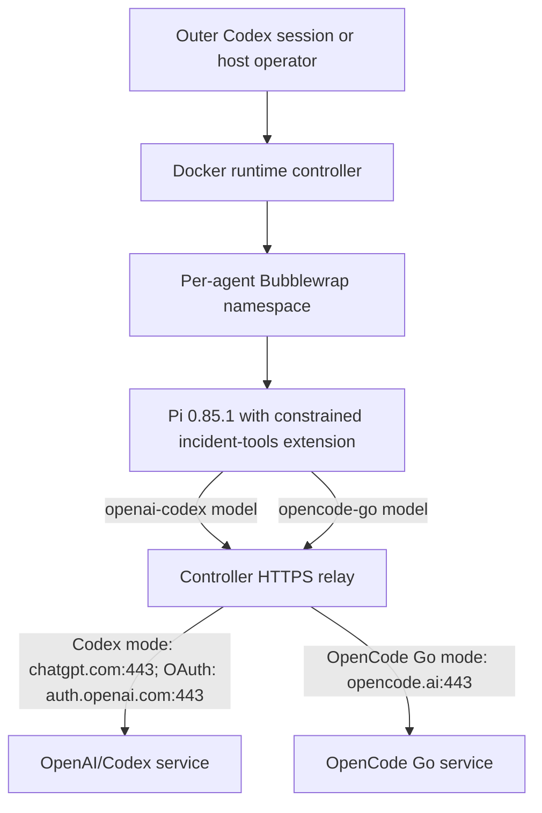

# Pi provider paths and execution boundaries

The experiment controller launches pinned Pi 0.85.1. `openai-codex` and
`opencode-go` are **Pi model providers**. Neither path runs the Codex CLI or
OpenCode CLI as an experimental agent. The outer Codex session, if used to start
Docker, is a separate process with a separate permissions policy.



| Setting | Codex model path | OpenCode Go model path |
| --- | --- | --- |
| Pi model ID | Default `openai-codex/gpt-5.6-luna` | Example override `opencode-go/kimi-k2.6` |
| Authentication | Pi-format `auth.json` or a Codex CLI auth file, converted into run-local Pi credentials; OAuth refresh state is kept in a controller-owned store outside the repository | Controller reads a private OpenCode key file (or fallback key environment variable), stages the key in a run-local Pi auth file, and removes it on exit |
| Child egress | HTTPS relay to `chatgpt.com:443` and `auth.openai.com:443` | HTTPS relay to `opencode.ai:443` only; Codex OAuth egress is removed |
| Provider identity | Pi's built-in `openai-codex` adapter | Pi's built-in `opencode-go` adapter, with a stable per-agent `x-opencode-session` value and provider User-Agent |
| Experimental controls | Same C0/C1/C2 controller, task fixtures, constrained tools, per-agent/aggregate budgets, and artifact schema | Same controls; select the model with `--model` and compare only under a matched triplet contract |

The agent process has a private network namespace and reaches only the
controller's allowlisted HTTPS relay. Its filesystem mounts and task/board
tools are limited by the controller's Bubblewrap command and extension. Shell,
subprocess, MCP, subagents, and a shared filesystem remain disabled in both
provider modes. The controller does not mount the host Docker socket into the
Pi namespace.

Giving the **outer** Codex session full access can let it invoke Docker from
this host; it does not change the Pi runtime policy. It also gives that Codex
session and commands it starts the user's full host permissions, including
Docker control. Use a dedicated trusted session for that launch mode.

## Dedicated outer launch and container matrix

The real matrix is an opt-in operation from a trusted outer Codex session.
Start a dedicated session for this repository with full host access; this does
not change Codex's global default:

```bash
cd /path/to/apart-incident-response
codex --sandbox danger-full-access --ask-for-approval never --cd "$PWD"
```

Run `just docker-check` in that session first. The outer session is the only
component that needs Docker access. `compose.yaml` does not mount the Docker
socket into the matrix service, and `container_matrix_entrypoint.sh` refuses
to run if one is present. This launch path is host-specific and opt-in; the
repository's ordinary runtime and test commands remain portable defaults for
other machines.

The default Compose service validates only the runtime configuration. The
dedicated matrix entry point builds the pinned Pi checkout and runs the
controller, constrained extension, and configuration inside Docker:

```bash
just container-isolation
just container-harness
```

The first command writes `runs/container-isolation.json` and checks the
container marker, absence of Docker sockets, and a distinct inner
Bubblewrap `--unshare-net` namespace. The second writes
`runs/container-harness/matrix.json` plus the normal raw fake-provider
artifacts. Harness output is explicitly `experimental_data=false`.

For a real calibration or anchor, credentials stay outside the image and
repository. Codex OAuth is mounted read-only for the controller and uses the
persistent controller-only Docker volume for refresh state:

```bash
export APART_PI_AUTH_FILE="$HOME/.codex/auth.json"
just container-anchor output=t1-container seeds="1"
```

OpenCode Go uses a private key file mounted read-only. The container entrypoint
copies it to a controller-owned 0600 path before dispatch and the Pi
Bubblewrap command does not mount that path:

```bash
export APART_OPENCODE_API_KEY_FILE="$HOME/.local/share/opencode/auth.json"
just container-anchor output=opencode-go-container \
  model=opencode-go/kimi-k2.6 seeds="1"
```

Both targets mount the host `runs/` directory at `/app/runs`. The matrix JSON
records `controller=docker-compose-matrix-service`,
`docker_access_scope=outer-controller-only`, and whether a Docker socket was
visible to the controller. The controller still stages per-agent credentials,
keeps Pi's `--unshare-net`, preserves the provider-specific HTTPS allowlist,
and writes the full raw artifact layout.

The pre-existing host launch remains distinct and is useful for approved
runtime debugging:

```bash
PYTHONPATH=src python scripts/run_experiment.py \
  --real-anchor --seeds 1 --output runs/t1-host
```

Configuration and implementation: [`config/runtime.json`](../config/runtime.json),
[`compose.yaml`](../compose.yaml),
[`scripts/run_experiment.py`](../scripts/run_experiment.py), and
[`src/apart_incident_response/runtime.py`](../src/apart_incident_response/runtime.py).
